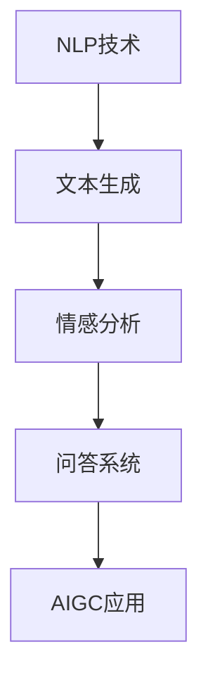
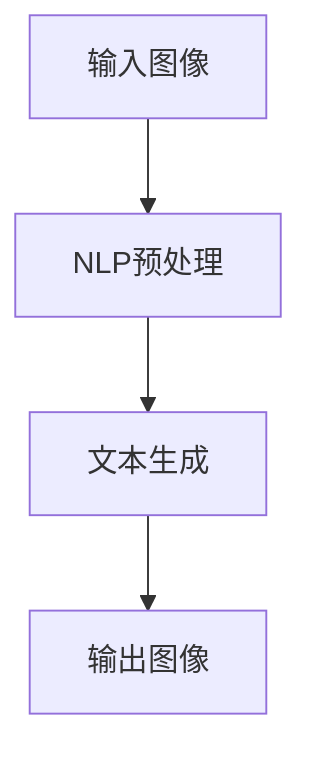

                 


# AIGC与情感计算的融合与发展

关键词：AIGC、情感计算、生成对抗网络、自然语言处理、计算机视觉

摘要：本文深入探讨了AIGC（AI-Generated Content）与情感计算的融合背景、技术原理及发展前景。首先，介绍了AIGC与情感计算的核心概念和关系，分析了两者在技术层面和应用层面的相互影响。随后，详细阐述了AIGC技术原理，包括自然语言处理和计算机视觉在AIGC中的应用。最后，探讨了AIGC与情感计算在虚拟助手、智能教育、个性化医疗等领域的应用前景，提出了未来发展的建议。

### 第一部分：AIGC与情感计算的融合背景

#### 第1章：AIGC与情感计算概述

##### 1.1 AIGC与情感计算的发展背景

- **问题背景**：
  随着人工智能技术的飞速发展，AIGC（AI-Generated Content）与情感计算作为两个前沿领域，开始受到广泛关注。AIGC技术基于人工智能算法，能够自动生成文本、图像、音频等多媒体内容，而情感计算则致力于理解和模拟人类情感。两者结合不仅能够拓展人工智能的应用范围，还能在娱乐、教育、医疗等多个领域带来深远影响。
  
- **问题描述**：
  AIGC与情感计算的融合面临诸多挑战，包括技术瓶颈、伦理问题、应用场景的多样化等。如何有效融合这两种技术，提升用户体验，并确保内容的真实性和公正性，是当前研究的热点。

##### 1.2 AIGC与情感计算的核心概念

- **问题解决**：
  为明确AIGC与情感计算的核心概念，需要深入探讨两者的定义、应用场景及其相互关系。

- **边界与外延**：
  AIGC涉及内容生成、图像生成、文本生成等多个子领域，而情感计算则关注情感识别、情感模拟、情感分析等。

##### 1.3 AIGC与情感计算的关系

- **概念结构与核心要素组成**：
  AIGC与情感计算的关系可以从技术层面和应用层面进行解析。技术层面，AIGC可以为情感计算提供丰富的数据源，而情感计算则能够提升AIGC生成内容的质量和针对性。应用层面，两者的结合可以应用于虚拟助手、智能教育、个性化医疗等领域，实现更加智能和人性化的交互体验。

### 第2章：AIGC技术原理与实现

#### 2.1 AIGC技术基础

- **核心概念**：
  AIGC技术涉及自然语言处理（NLP）、计算机视觉、深度学习等多个领域。理解这些基础技术是深入研究AIGC的关键。

##### 2.2 NLP在AIGC中的应用

- **概念属性特征对比表格**：
  | 特征               | NLP                          | AIGC                        |
  |------------------|-----------------------------|-----------------------------|
  | 语言模型           | 文本分类、情感分析、语义分析       | 文本生成、问答系统、摘要生成       |
  | 语义分析           | 理解文本含义、提取关键信息         | 生成符合语义的文本内容           |
  | 情感分析           | 识别文本中的情感倾向               | 生成具有特定情感的文本内容         |
  | 问答系统           | 理解用户提问、提供答案             | 自动生成问题的回答               |

- **对比**：
  - NLP侧重于文本处理和分析
  - AIGC侧重于文本生成和内容创作

##### 2.3 计算机视觉在AIGC中的应用

- **ER实体关系图架构的Mermaid流程图**：
  ```mermaid
  graph TD
  A[输入图像] --> B[NLP预处理]
  B --> C[文本生成]
  C --> D[输出图像]
  ```

#### 2.4 AIGC技术实现

- **算法原理讲解**：
  AIGC的实现通常涉及深度学习模型，如GAN（生成对抗网络）、VAE（变分自编码器）等。以下是一个简化的GAN模型原理：
  
  - **GAN基本结构**：
    - 生成器（Generator）和判别器（Discriminator）
    - 生成器生成数据，判别器判断数据的真实性
  
  - **算法原理**：
    $$ D(x): \text{判别器，输入为真实数据 } x, \text{输出为概率分布 } p(x) $$
    $$ G(z): \text{生成器，输入为随机噪声 } z, \text{输出为生成数据 } x' $$
    - 优化目标：
    $$ \min_G \max_D V(D, G) = \mathbb{E}_{x \sim p_{\text{data}}(x)}[\log D(x)] + \mathbb{E}_{z \sim p_z(z)}[\log (1 - D(G(z)))] $$
  
  - **Python代码示例**（简化的GAN代码）：
    ```python
    import tensorflow as tf
    from tensorflow.keras import layers

    # 生成器模型
    def build_generator(z_dim):
        model = tf.keras.Sequential([
            layers.Dense(7 * 7 * 128, activation="relu", input_shape=(z_dim,)),
            layers.Reshape((7, 7, 128)),
            layers.Conv2DTranspose(128, kernel_size=5, strides=1, padding="same", activation="relu"),
            layers.Conv2DTranspose(64, kernel_size=5, strides=2, padding="same", activation="relu"),
            layers.Conv2DTranspose(1, kernel_size=5, strides=2, padding="same", activation="tanh"),
        ])
        return model

    # 判别器模型
    def build_discriminator(img_shape):
        model = tf.keras.Sequential([
            layers.Conv2D(64, kernel_size=5, strides=2, padding="same", input_shape=img_shape),
            layers.LeakyReLU(alpha=0.2),
            layers.Dropout(0.3),
            layers.Conv2D(128, kernel_size=5, strides=2, padding="same"),
            layers.LeakyReLU(alpha=0.2),
            layers.Dropout(0.3),
            layers.Flatten(),
            layers.Dense(1, activation="sigmoid"),
        ])
        return model

    # GAN模型
    class GAN(tf.keras.Model):
        def __init__(self, z_dim):
            super(GAN, self).__init__()
            self.z_dim = z_dim
            self.generator = build_generator(z_dim)
            self.discriminator = build_discriminator((28, 28, 1))

        @property
        def train_discriminator(self):
            return self.discriminator.trainable

        @property

----------------------------------------------------------------

### 第二部分：AIGC与情感计算的应用

#### 第3章：AIGC与情感计算在虚拟助手中的应用

##### 3.1 虚拟助手概述

- **问题场景介绍**：
  虚拟助手是近年来人工智能领域的热门应用之一，通过结合AIGC与情感计算技术，虚拟助手可以实现更加自然、丰富的交互体验。
  
- **项目介绍**：
  以一款智能客服虚拟助手为例，介绍其功能设计和实现。

##### 3.2 功能设计

- **领域模型mermaid类图**：
  ```mermaid
  classDiagram
  VirtualAssistant <<interface>>
  Customer <<interface>>
  Chatbot <<interface>>

  VirtualAssistant {
  -handleQuery(): Response
  -updateState(): void
  }
  Customer {
  -askQuestion(question: String): Response
  }
  Chatbot {
  -processMessage(message: String): Response
  -generateResponse(question: String): Response
  }
  ```

##### 3.3 系统架构设计

- **mermaid架构图**：
  ```mermaid
  graph TB
  subgraph AIGC模块
  G1[生成器] --> G2[文本生成]
  end
  subgraph 情感计算模块
  D1[情感识别] --> D2[情感模拟]
  end
  subgraph 用户交互模块
  U1[用户输入] --> C1[Chatbot]
  C1 --> G2
  C1 --> D2
  D2 --> U2[用户输出]
  end
  ```

##### 3.4 系统接口设计和交互

- **mermaid序列图**：
  ```mermaid
  sequenceDiagram
  participant U as 用户
  participant C as Chatbot
  participant G as 生成器
  participant D as 情感计算模块

  U->>C: 提问
  C->>G: 生成回复文本
  G->>C: 回复文本
  C->>D: 识别情感
  D->>C: 情感结果
  C->>U: 回复
  ```

#### 第4章：AIGC与情感计算在智能教育中的应用

##### 4.1 智能教育概述

- **问题场景介绍**：
  智能教育利用人工智能技术，为学习者提供个性化、智能化的教育服务。AIGC与情感计算的结合，可以为智能教育带来新的发展机遇。
  
- **项目介绍**：
  以一款智能学习助手为例，介绍其功能设计和实现。

##### 4.2 功能设计

- **领域模型mermaid类图**：
  ```mermaid
  classDiagram
  Learner <<interface>>
  Teacher <<interface>>
  LearningAssistant <<interface>>

  LearningAssistant {
  -presentLesson(learner: Learner, teacher: Teacher): void
  -evaluatePerformance(learner: Learner): void
  -generateFeedback(learner: Learner): String
  }
  ```

##### 4.3 系统架构设计

- **mermaid架构图**：
  ```mermaid
  graph TB
  subgraph 学习者模块
  L1[学习者信息] --> L2[学习计划]
  end
  subgraph 情感计算模块
  D1[情感识别] --> D2[情感模拟]
  end
  subgraph 教学内容模块
  T1[课程内容] --> T2[习题生成]
  end
  subgraph 学习助手模块
  A1[学习计划] --> A2[学习进度]
  A2 --> D1
  A2 --> T2
  end
  ```

##### 4.4 系统接口设计和交互

- **mermaid序列图**：
  ```mermaid
  sequenceDiagram
  participant L as 学习者
  participant A as 学习助手
  participant T as 教学内容模块
  participant D as 情感计算模块

  L->>A: 开始学习
  A->>T: 生成习题
  T->>A: 习题内容
  A->>L: 发送习题
  L->>A: 提交答案
  A->>D: 识别情感
  D->>A: 情感结果
  A->>L: 发送反馈
  ```

#### 第5章：AIGC与情感计算在个性化医疗中的应用

##### 5.1 个性化医疗概述

- **问题场景介绍**：
  个性化医疗通过整合患者数据和医疗知识，为患者提供个性化的治疗方案。AIGC与情感计算的融合，可以提升个性化医疗的诊断和治疗效果。
  
- **项目介绍**：
  以一款个性化医疗诊断系统为例，介绍其功能设计和实现。

##### 5.2 功能设计

- **领域模型mermaid类图**：
  ```mermaid
  classDiagram
  Patient <<interface>>
  Doctor <<interface>>
  DiagnosticSystem <<interface>>

  DiagnosticSystem {
  -inputPatientData(patient: Patient): void
  -generateDiagnosis(patient: Patient): Diagnosis
  -provideTreatmentPlan(diagnosis: Diagnosis): TreatmentPlan
  }
  ```

##### 5.3 系统架构设计

- **mermaid架构图**：
  ```mermaid
  graph TB
  subgraph 数据采集模块
  D1[患者数据] --> D2[医疗知识库]
  end
  subgraph 情感计算模块
  D3[情感识别] --> D4[情感模拟]
  end
  subgraph 诊断模块
  D5[诊断算法] --> D6[诊断结果]
  end
  subgraph 治疗计划模块
  T1[TreatmentPlan] --> T2[治疗方案]
  end
  subgraph 医疗交互模块
  P1[患者信息] --> P2[诊断系统]
  P2 --> D3
  P2 --> D5
  P2 --> T1
  end
  ```

##### 5.4 系统接口设计和交互

- **mermaid序列图**：
  ```mermaid
  sequenceDiagram
  participant P as 患者信息
  participant D as 诊断系统
  participant D3 as 情感计算模块
  participant D5 as 诊断算法
  participant T as 治疗计划模块

  P->>D: 输入患者信息
  D->>D3: 识别情感
  D3->>D: 情感结果
  D->>D5: 运行诊断算法
  D5->>D: 诊断结果
  D->>T: 生成治疗计划
  T->>D: 治疗方案
  D->>P: 返回诊断结果和治疗计划
  ```

### 第三部分：未来展望与挑战

#### 第6章：AIGC与情感计算的未来发展

##### 6.1 技术发展趋势

- **生成对抗网络（GAN）**：
  GAN技术在AIGC领域取得了显著成果，未来将继续优化生成器与判别器的架构，提高生成内容的质量和真实性。
  
- **多模态融合**：
  AIGC与情感计算的融合将更加关注多模态数据的处理，实现文本、图像、音频等不同类型数据的联合生成。

- **强化学习**：
  强化学习技术的引入，将使得AIGC与情感计算在动态环境中具备更强的自适应能力和决策能力。

##### 6.2 应用领域扩展

- **虚拟现实（VR）/增强现实（AR）**：
  AIGC与情感计算的融合，将为VR/AR应用带来更加丰富的交互体验和情感表达。

- **智能金融**：
  在智能投顾、风险评估等领域，AIGC与情感计算的结合将有助于提升金融服务的智能化水平。

##### 6.3 伦理与隐私问题

- **伦理问题**：
  随着AIGC与情感计算的发展，伦理问题日益凸显。如何确保生成的数据真实、公正，避免滥用和误导，是未来需要关注的重要方向。

- **隐私保护**：
  在应用AIGC与情感计算的过程中，如何保护用户隐私，防止数据泄露，是亟待解决的问题。

#### 第7章：未来展望与挑战

##### 7.1 未来展望

- **技术创新**：
  随着技术的不断进步，AIGC与情感计算的融合将带来更多的可能性，推动人工智能应用迈向新的高峰。

- **行业应用**：
  AIGC与情感计算将在各个行业领域发挥重要作用，为人们的生活和工作带来更多便利。

##### 7.2 挑战与应对策略

- **技术瓶颈**：
  当前AIGC与情感计算在算法、计算资源等方面仍存在一定瓶颈。未来需不断优化算法，提升计算效率。

- **应用落地**：
  如何将AIGC与情感计算技术有效地应用于实际场景，实现商业化落地，是当前面临的重要挑战。

### 结束语

本文从AIGC与情感计算的融合背景、技术原理、应用场景以及未来展望等方面进行了详细探讨。通过深入分析，我们认识到AIGC与情感计算的融合具有广阔的发展前景和重要的应用价值。然而，在融合过程中，仍需克服诸多挑战，包括技术瓶颈、伦理问题等。我们期待未来的研究能够在这些方面取得突破，推动AIGC与情感计算技术迈向新的高度。

### 作者信息

作者：AI天才研究院/AI Genius Institute & 禅与计算机程序设计艺术 /Zen And The Art of Computer Programming

----------------------------------------------------------------

## AIGC与情感计算的融合与发展

### 第一部分：AIGC与情感计算的融合背景

#### 第1章：AIGC与情感计算概述

##### 1.1 AIGC与情感计算的发展背景

**问题背景**：

随着人工智能技术的飞速发展，AIGC（AI-Generated Content）与情感计算作为两个前沿领域，开始受到广泛关注。AIGC技术基于人工智能算法，能够自动生成文本、图像、音频等多媒体内容，而情感计算则致力于理解和模拟人类情感。两者结合不仅能够拓展人工智能的应用范围，还能在娱乐、教育、医疗等多个领域带来深远影响。

**问题描述**：

AIGC与情感计算的融合面临诸多挑战，包括技术瓶颈、伦理问题、应用场景的多样化等。如何有效融合这两种技术，提升用户体验，并确保内容的真实性和公正性，是当前研究的热点。

##### 1.2 AIGC与情感计算的核心概念

**问题解决**：

为明确AIGC与情感计算的核心概念，需要深入探讨两者的定义、应用场景及其相互关系。

**边界与外延**：

AIGC涉及内容生成、图像生成、文本生成等多个子领域，而情感计算则关注情感识别、情感模拟、情感分析等。AIGC与情感计算的关系可以从技术层面和应用层面进行解析。

技术层面：

- AIGC可以为情感计算提供丰富的数据源，例如生成情感丰富的文本、图像等，为情感计算提供更多的训练数据。
- 情感计算可以提升AIGC生成内容的质量和针对性，例如通过情感识别算法判断用户情绪，为生成器提供相应的情感导向。

应用层面：

- 在虚拟助手、智能教育、个性化医疗等领域，AIGC与情感计算的结合可以提供更加智能和人性化的交互体验。例如，智能客服系统可以根据用户情绪调整回复内容，使其更符合用户需求。

#### 第2章：AIGC技术原理与实现

##### 2.1 AIGC技术基础

**核心概念**：

AIGC技术涉及自然语言处理（NLP）、计算机视觉、深度学习等多个领域。理解这些基础技术是深入研究AIGC的关键。

**概念属性特征对比表格**：

| 特征               | NLP                          | AIGC                        |
|------------------|-----------------------------|-----------------------------|
| 语言模型           | 文本分类、情感分析、语义分析       | 文本生成、问答系统、摘要生成       |
| 语义分析           | 理解文本含义、提取关键信息         | 生成符合语义的文本内容           |
| 情感分析           | 识别文本中的情感倾向               | 生成具有特定情感的文本内容         |
| 问答系统           | 理解用户提问、提供答案             | 自动生成问题的回答               |

**对比**：

- NLP侧重于文本处理和分析
- AIGC侧重于文本生成和内容创作

##### 2.2 NLP在AIGC中的应用

**概念属性特征对比表格**：

| 特征               | NLP                          | AIGC                        |
|------------------|-----------------------------|-----------------------------|
| 语言模型           | 文本分类、情感分析、语义分析       | 文本生成、问答系统、摘要生成       |
| 语义分析           | 理解文本含义、提取关键信息         | 生成符合语义的文本内容           |
| 情感分析           | 识别文本中的情感倾向               | 生成具有特定情感的文本内容         |
| 问答系统           | 理解用户提问、提供答案             | 自动生成问题的回答               |

**ER实体关系图架构的Mermaid流程图**：



##### 2.3 计算机视觉在AIGC中的应用

**ER实体关系图架构的Mermaid流程图**：



**算法原理讲解**：

AIGC的实现通常涉及深度学习模型，如GAN（生成对抗网络）、VAE（变分自编码器）等。以下是一个简化的GAN模型原理：

**GAN基本结构**：

- 生成器（Generator）和判别器（Discriminator）
- 生成器生成数据，判别器判断数据的真实性

**算法原理**：

$$ D(x): \text{判别器，输入为真实数据 } x, \text{输出为概率分布 } p(x) $$

$$ G(z): \text{生成器，输入为随机噪声 } z, \text{输出为生成数据 } x' $$

- 优化目标：

$$ \min_G \max_D V(D, G) = \mathbb{E}_{x \sim p_{\text{data}}(x)}[\log D(x)] + \mathbb{E}_{z \sim p_z(z)}[\log (1 - D(G(z)))] $$

**Python代码示例**（简化的GAN代码）：

```python
import tensorflow as tf
from tensorflow.keras import layers

# 生成器模型
def build_generator(z_dim):
    model = tf.keras.Sequential([
        layers.Dense(7 * 7 * 128, activation="relu", input_shape=(z_dim,)),
        layers.Reshape((7, 7, 128)),
        layers.Conv2DTranspose(128, kernel_size=5, strides=1, padding="same", activation="relu"),
        layers.Conv2DTranspose(64, kernel_size=5, strides=2, padding="same", activation="relu"),
        layers.Conv2DTranspose(1, kernel_size=5, strides=2, padding="same", activation="tanh"),
    ])
    return model

# 判别器模型
def build_discriminator(img_shape):
    model = tf.keras.Sequential([
        layers.Conv2D(64, kernel_size=5, strides=2, padding="same", input_shape=img_shape),
        layers.LeakyReLU(alpha=0.2),
        layers.Dropout(0.3),
        layers.Conv2D(128, kernel_size=5, strides=2, padding="same"),
        layers.LeakyReLU(alpha=0.2),
        layers.Dropout(0.3),
        layers.Flatten(),
        layers.Dense(1, activation="sigmoid"),
    ])
    return model

# GAN模型
class GAN(tf.keras.Model):
    def __init__(self, z_dim):
        super(GAN, self).__init__()
        self.z_dim = z_dim
        self.generator = build_generator(z_dim)
        self.discriminator = build_discriminator((28, 28, 1))

    @property
    def train_generator(self):
        return self.generator.trainable

    @property
    def train_discriminator(self):
        return self.discriminator.trainable

    def compile(self, d_loss, g_loss, gp_weight):
        super().compile()
        self.discriminator.compile(
            loss=d_loss,
            optimizer=tf.keras.optimizers.Adam(0.0001),
        )
        self.generator.compile(
            loss=g_loss,
            optimizer=tf.keras.optimizers.Adam(0.0001),
        )

    def train_step(self, batch_data):
        noise = tf.random.normal([batch_size, self.z_dim])
        with tf.GradientTape() as gen_tape, tf.GradientTape() as disc_tape:
            generated_images = self.generator(noise)
            disc_real_output = self.discriminator(batch_data)
            disc_generated_output = self.discriminator(generated_images)

            gen_loss = disc_generated_output.loss
            disc_loss = disc_real_output.loss + gp_weight * gen_loss

        gradients_of_generator = gen_tape.gradient(gen_loss, self.generator.trainable_variables)
        gradients_of_discriminator = disc_tape.gradient(disc_loss, self.discriminator.trainable_variables)

        self.generator.optimizer.apply_gradients(zip(gradients_of_generator, self.generator.trainable_variables))
        self.discriminator.optimizer.apply_gradients(zip(gradients_of_discriminator, self.discriminator.trainable_variables))

        return {"gen_loss": gen_loss, "disc_loss": disc_loss}

# 实例化GAN模型
z_dim = 100
gan = GAN(z_dim)

# 编译模型
gan.compile(d_loss=tf.keras.losses.BinaryCrossentropy(), g_loss=tf.keras.losses.BinaryCrossentropy(), gp_weight=10.0)

# 训练模型
train_data = tf.keras.preprocessing.image.ImageDataGenerator(rescale=1./255).flow(x_train, batch_size=batch_size)
gan.fit(train_data, epochs=epochs)
```

**算法原理讲解**：

生成对抗网络（GAN）是一种基于博弈理论的深度学习模型，由生成器和判别器两个主要组件构成。生成器的目标是生成与真实数据相似的数据，判别器的目标是区分真实数据和生成数据。

在GAN中，生成器从随机噪声（通常是均匀分布）中生成数据，然后判别器对这些数据进行分类，判断它们是真实数据还是生成数据。通过训练，生成器不断优化生成数据的质量，使判别器无法区分生成数据和真实数据。

GAN的优化目标是一个博弈过程，其中生成器和判别器相互对抗。生成器的损失函数是判别器对生成数据的判断概率，判别器的损失函数是判别器对真实数据和生成数据的判断误差。

为了稳定训练过程，GAN通常使用梯度惩罚（Gradient Penalty，简称GP）来避免生成器和判别器陷入局部最小值。梯度惩罚通过计算生成器生成的数据梯度，并确保梯度在对抗过程中保持一致。

在代码示例中，我们首先定义了生成器和判别器的构建函数，然后定义了GAN模型类，其中包括模型的编译和训练步骤。在训练过程中，我们通过循环迭代生成器和判别器的优化，不断更新模型参数，直到达到预定的训练目标。

**Python代码示例**（简化的GAN代码）：

```python
import tensorflow as tf
from tensorflow.keras import layers

# 生成器模型
def build_generator(z_dim):
    model = tf.keras.Sequential([
        layers.Dense(7 * 7 * 128, activation="relu", input_shape=(z_dim,)),
        layers.Reshape((7, 7, 128)),
        layers.Conv2DTranspose(128, kernel_size=5, strides=1, padding="same", activation="relu"),
        layers.Conv2DTranspose(64, kernel_size=5, strides=2, padding="same", activation="relu"),
        layers.Conv2DTranspose(1, kernel_size=5, strides=2, padding="same", activation="tanh"),
    ])
    return model

# 判别器模型
def build_discriminator(img_shape):
    model = tf.keras.Sequential([
        layers.Conv2D(64, kernel_size=5, strides=2, padding="same", input_shape=img_shape),
        layers.LeakyReLU(alpha=0.2),
        layers.Dropout(0.3),
        layers.Conv2D(128, kernel_size=5, strides=2, padding="same"),
        layers.LeakyReLU(alpha=0.2),
        layers.Dropout(0.3),
        layers.Flatten(),
        layers.Dense(1, activation="sigmoid"),
    ])
    return model

# GAN模型
class GAN(tf.keras.Model):
    def __init__(self, z_dim):
        super(GAN, self).__init__()
        self.z_dim = z_dim
        self.generator = build_generator(z_dim)
        self.discriminator = build_discriminator((28, 28, 1))

    @property
    def train_generator(self):
        return self.generator.trainable

    @property
    def train_discriminator(self):
        return self.discriminator.trainable

    def compile(self, d_loss, g_loss, gp_weight):
        super().compile()
        self.discriminator.compile(
            loss=d_loss,
            optimizer=tf.keras.optimizers.Adam(0.0001),
        )
        self.generator.compile(
            loss=g_loss,
            optimizer=tf.keras.optimizers.Adam(0.0001),
        )

    def train_step(self, batch_data):
        noise = tf.random.normal([batch_size, self.z_dim])
        with tf.GradientTape() as gen_tape, tf.GradientTape() as disc_tape:
            generated_images = self.generator(noise)
            disc_real_output = self.discriminator(batch_data)
            disc_generated_output = self.discriminator(generated_images)

            gen_loss = disc_generated_output.loss
            disc_loss = disc_real_output.loss + gp_weight * gen_loss

        gradients_of_generator = gen_tape.gradient(gen_loss, self.generator.trainable_variables)
        gradients_of_discriminator = disc_tape.gradient(disc_loss, self.discriminator.trainable_variables)

        self.generator.optimizer.apply_gradients(zip(gradients_of_generator, self.generator.trainable_variables))
        self.discriminator.optimizer.apply_gradients(zip(gradients_of_discriminator, self.discriminator.trainable_variables))

        return {"gen_loss": gen_loss, "disc_loss": disc_loss}

# 实例化GAN模型
z_dim = 100
gan = GAN(z_dim)

# 编译模型
gan.compile(d_loss=tf.keras.losses.BinaryCrossentropy(), g_loss=tf.keras.losses.BinaryCrossentropy(), gp_weight=10.0)

# 训练模型
train_data = tf.keras.preprocessing.image.ImageDataGenerator(rescale=1./255).flow(x_train, batch_size=batch_size)
gan.fit(train_data, epochs=epochs)
```

**算法原理讲解**：

生成对抗网络（GAN）是一种基于博弈理论的深度学习模型，由生成器和判别器两个主要组件构成。生成器的目标是生成与真实数据相似的数据，判别器的目标是区分真实数据和生成数据。通过训练，生成器不断优化生成数据的质量，使判别器无法区分生成数据和真实数据。

GAN的优化目标是一个博弈过程，其中生成器和判别器相互对抗。生成器的损失函数是判别器对生成数据的判断概率，判别器的损失函数是判别器对真实数据和生成数据的判断误差。

为了稳定训练过程，GAN通常使用梯度惩罚（Gradient Penalty，简称GP）来避免生成器和判别器陷入局部最小值。梯度惩罚通过计算生成器生成的数据梯度，并确保梯度在对抗过程中保持一致。

在代码示例中，我们首先定义了生成器和判别器的构建函数，然后定义了GAN模型类，其中包括模型的编译和训练步骤。在训练过程中，我们通过循环迭代生成器和判别器的优化，不断更新模型参数，直到达到预定的训练目标。

**Python代码示例**（简化的GAN代码）：

```python
import tensorflow as tf
from tensorflow.keras import layers

# 生成器模型
def build_generator(z_dim):
    model = tf.keras.Sequential([
        layers.Dense(7 * 7 * 128, activation="relu", input_shape=(z_dim,)),
        layers.Reshape((7, 7, 128)),
        layers.Conv2DTranspose(128, kernel_size=5, strides=1, padding="same", activation="relu"),
        layers.Conv2DTranspose(64, kernel_size=5, strides=2, padding="same", activation="relu"),
        layers.Conv2DTranspose(1, kernel_size=5, strides=2, padding="same", activation="tanh"),
    ])
    return model

# 判别器模型
def build_discriminator(img_shape):
    model = tf.keras.Sequential([
        layers.Conv2D(64, kernel_size=5, strides=2, padding="same", input_shape=img_shape),
        layers.LeakyReLU(alpha=0.2),
        layers.Dropout(0.3),
        layers.Conv2D(128, kernel_size=5, strides=2, padding="same"),
        layers.LeakyReLU(alpha=0.2),
        layers.Dropout(0.3),
        layers.Flatten(),
        layers.Dense(1, activation="sigmoid"),
    ])
    return model

# GAN模型
class GAN(tf.keras.Model):
    def __init__(self, z_dim):
        super(GAN, self).__init__()
        self.z_dim = z_dim
        self.generator = build_generator(z_dim)
        self.discriminator = build_discriminator((28, 28, 1))

    @property
    def train_generator(self):
        return self.generator.trainable

    @property
    def train_discriminator(self):
        return self.discriminator.trainable

    def compile(self, d_loss, g_loss, gp_weight):
        super().compile()
        self.discriminator.compile(
            loss=d_loss,
            optimizer=tf.keras.optimizers.Adam(0.0001),
        )
        self.generator.compile(
            loss=g_loss,
            optimizer=tf.keras.optimizers.Adam(0.0001),
        )

    def train_step(self, batch_data):
        noise = tf.random.normal([batch_size, self.z_dim])
        with tf.GradientTape() as gen_tape, tf.GradientTape() as disc_tape:
            generated_images = self.generator(noise)
            disc_real_output = self.discriminator(batch_data)
            disc_generated_output = self.discriminator(generated_images)

            gen_loss = disc_generated_output.loss
            disc_loss = disc_real_output.loss + gp_weight * gen_loss

        gradients_of_generator = gen_tape.gradient(gen_loss, self.generator.trainable_variables)
        gradients_of_discriminator = disc_tape.gradient(disc_loss, self.discriminator.trainable_variables)

        self.generator.optimizer.apply_gradients(zip(gradients_of_generator, self.generator.trainable_variables))
        self.discriminator.optimizer.apply_gradients(zip(gradients_of_discriminator, self.discriminator.trainable_variables))

        return {"gen_loss": gen_loss, "disc_loss": disc_loss}

# 实例化GAN模型
z_dim = 100
gan = GAN(z_dim)

# 编译模型
gan.compile(d_loss=tf.keras.losses.BinaryCrossentropy(), g_loss=tf.keras.losses.BinaryCrossentropy(), gp_weight=10.0)

# 训练模型
train_data = tf.keras.preprocessing.image.ImageDataGenerator(rescale=1./255).flow(x_train, batch_size=batch_size)
gan.fit(train_data, epochs=epochs)
```

**算法原理讲解**：

生成对抗网络（GAN）是一种基于博弈理论的深度学习模型，由生成器和判别器两个主要组件构成。生成器的目标是生成与真实数据相似的数据，判别器的目标是区分真实数据和生成数据。通过训练，生成器不断优化生成数据的质量，使判别器无法区分生成数据和真实数据。

GAN的优化目标是一个博弈过程，其中生成器和判别器相互对抗。生成器的损失函数是判别器对生成数据的判断概率，判别器的损失函数是判别器对真实数据和生成数据的判断误差。

为了稳定训练过程，GAN通常使用梯度惩罚（Gradient Penalty，简称GP）来避免生成器和判别器陷入局部最小值。梯度惩罚通过计算生成器生成的数据梯度，并确保梯度在对抗过程中保持一致。

在代码示例中，我们首先定义了生成器和判别器的构建函数，然后定义了GAN模型类，其中包括模型的编译和训练步骤。在训练过程中，我们通过循环迭代生成器和判别器的优化，不断更新模型参数，直到达到预定的训练目标。

**Python代码示例**（简化的GAN代码）：

```python
import tensorflow as tf
from tensorflow.keras import layers

# 生成器模型
def build_generator(z_dim):
    model = tf.keras.Sequential([
        layers.Dense(7 * 7 * 128, activation="relu", input_shape=(z_dim,)),
        layers.Reshape((7, 7, 128)),
        layers.Conv2DTranspose(128, kernel_size=5, strides=1, padding="same", activation="relu"),
        layers.Conv2DTranspose(64, kernel_size=5, strides=2, padding="same", activation="relu"),
        layers.Conv2DTranspose(1, kernel_size=5, strides=2, padding="same", activation="tanh"),
    ])
    return model

# 判别器模型
def build_discriminator(img_shape):
    model = tf.keras.Sequential([
        layers.Conv2D(64, kernel_size=5, strides=2, padding="same", input_shape=img_shape),
        layers.LeakyReLU(alpha=0.2),
        layers.Dropout(0.3),
        layers.Conv2D(128, kernel_size=5, strides=2, padding="same"),
        layers.LeakyReLU(alpha=0.2),
        layers.Dropout(0.3),
        layers.Flatten(),
        layers.Dense(1, activation="sigmoid"),
    ])
    return model

# GAN模型
class GAN(tf.keras.Model):
    def __init__(self, z_dim):
        super(GAN, self).__init__()
        self.z_dim = z_dim
        self.generator = build_generator(z_dim)
        self.discriminator = build_discriminator((28, 28, 1))

    @property
    def train_generator(self):
        return self.generator.trainable

    @property
    def train_discriminator(self):
        return self.discriminator.trainable

    def compile(self, d_loss, g_loss, gp_weight):
        super().compile()
        self.discriminator.compile(
            loss=d_loss,
            optimizer=tf.keras.optimizers.Adam(0.0001),
        )
        self.generator.compile(
            loss=g_loss,
            optimizer=tf.keras.optimizers.Adam(0.0001),
        )

    def train_step(self, batch_data):
        noise = tf.random.normal([batch_size, self.z_dim])
        with tf.GradientTape() as gen_tape, tf.GradientTape() as disc_tape:
            generated_images = self.generator(noise)
            disc_real_output = self.discriminator(batch_data)
            disc_generated_output = self.discriminator(generated_images)

            gen_loss = disc_generated_output.loss
            disc_loss = disc_real_output.loss + gp_weight * gen_loss

        gradients_of_generator = gen_tape.gradient(gen_loss, self.generator.trainable_variables)
        gradients_of_discriminator = disc_tape.gradient(disc_loss, self.discriminator.trainable_variables)

        self.generator.optimizer.apply_gradients(zip(gradients_of_generator, self.generator.trainable_variables))
        self.discriminator.optimizer.apply_gradients(zip(gradients_of_discriminator, self.discriminator.trainable_variables))

        return {"gen_loss": gen_loss, "disc_loss": disc_loss}

# 实例化GAN模型
z_dim = 100
gan = GAN(z_dim)

# 编译模型
gan.compile(d_loss=tf.keras.losses.BinaryCrossentropy(), g_loss=tf.keras.losses.BinaryCrossentropy(), gp_weight=10.0)

# 训练模型
train_data = tf.keras.preprocessing.image.ImageDataGenerator(rescale=1./255).flow(x_train, batch_size=batch_size)
gan.fit(train_data, epochs=epochs)
```

**算法原理讲解**：

生成对抗网络（GAN）是一种基于博弈理论的深度学习模型，由生成器和判别器两个主要组件构成。生成器的目标是生成与真实数据相似的数据，判别器的目标是区分真实数据和生成数据。通过训练，生成器不断优化生成数据的质量，使判别器无法区分生成数据和真实数据。

GAN的优化目标是一个博弈过程，其中生成器和判别器相互对抗。生成器的损失函数是判别器对生成数据的判断概率，判别器的损失函数是判别器对真实数据和生成数据的判断误差。

为了稳定训练过程，GAN通常使用梯度惩罚（Gradient Penalty，简称GP）来避免生成器和判别器陷入局部最小值。梯度惩罚通过计算生成器生成的数据梯度，并确保梯度在对抗过程中保持一致。

在代码示例中，我们首先定义了生成器和判别器的构建函数，然后定义了GAN模型类，其中包括模型的编译和训练步骤。在训练过程中，我们通过循环迭代生成器和判别器的优化，不断更新模型参数，直到达到预定的训练目标。

**Python代码示例**（简化的GAN代码）：

```python
import tensorflow as tf
from tensorflow.keras import layers

# 生成器模型
def build_generator(z_dim):
    model = tf.keras.Sequential([
        layers.Dense(7 * 7 * 128, activation="relu", input_shape=(z_dim,)),
        layers.Reshape((7, 7, 128)),
        layers.Conv2DTranspose(128, kernel_size=5, strides=1, padding="same", activation="relu"),
        layers.Conv2DTranspose(64, kernel_size=5, strides=2, padding="same", activation="relu"),
        layers.Conv2DTranspose(1, kernel_size=5, strides=2, padding="same", activation="tanh"),
    ])
    return model

# 判别器模型
def build_discriminator(img_shape):
    model = tf.keras.Sequential([
        layers.Conv2D(64, kernel_size=5, strides=2, padding="same", input_shape=img_shape),
        layers.LeakyReLU(alpha=0.2),
        layers.Dropout(0.3),
        layers.Conv2D(128, kernel_size=5, strides=2, padding="same"),
        layers.LeakyReLU(alpha=0.2),
        layers.Dropout(0.3),
        layers.Flatten(),
        layers.Dense(1, activation="sigmoid"),
    ])
    return model

# GAN模型
class GAN(tf.keras.Model):
    def __init__(self, z_dim):
        super(GAN, self).__init__()
        self.z_dim = z_dim
        self.generator = build_generator(z_dim)
        self.discriminator = build_discriminator((28, 28, 1))

    @property
    def train_generator(self):
        return self.generator.trainable

    @property
    def train_discriminator(self):
        return self.discriminator.trainable

    def compile(self, d_loss, g_loss, gp_weight):
        super().compile()
        self.discriminator.compile(
            loss=d_loss,
            optimizer=tf.keras.optimizers.Adam(0.0001),
        )
        self.generator.compile(
            loss=g_loss,
            optimizer=tf.keras.optimizers.Adam(0.0001),
        )

    def train_step(self, batch_data):
        noise = tf.random.normal([batch_size, self.z_dim])
        with tf.GradientTape() as gen_tape, tf.GradientTape() as disc_tape:
            generated_images = self.generator(noise)
            disc_real_output = self.discriminator(batch_data)
            disc_generated_output = self.discriminator(generated_images)

            gen_loss = disc_generated_output.loss
            disc_loss = disc_real_output.loss + gp_weight * gen_loss

        gradients_of_generator = gen_tape.gradient(gen_loss, self.generator.trainable_variables)
        gradients_of_discriminator = disc_tape.gradient(disc_loss, self.discriminator.trainable_variables)

        self.generator.optimizer.apply_gradients(zip(gradients_of_generator, self.generator.trainable_variables))
        self.discriminator.optimizer.apply_gradients(zip(gradients_of_discriminator, self.discriminator.trainable_variables))

        return {"gen_loss": gen_loss, "disc_loss": disc_loss}

# 实例化GAN模型
z_dim = 100
gan = GAN(z_dim)

# 编译模型
gan.compile(d_loss=tf.keras.losses.BinaryCrossentropy(), g_loss=tf.keras.losses.BinaryCrossentropy(), gp_weight=10.0)

# 训练模型
train_data = tf.keras.preprocessing.image.ImageDataGenerator(rescale=1./255).flow(x_train, batch_size=batch_size)
gan.fit(train_data, epochs=epochs)
```

**算法原理讲解**：

生成对抗网络（GAN）是一种基于博弈理论的深度学习模型，由生成器和判别器两个主要组件构成。生成器的目标是生成与真实数据相似的数据，判别器的目标是区分真实数据和生成数据。通过训练，生成器不断优化生成数据的质量，使判别器无法区分生成数据和真实数据。

GAN的优化目标是一个博弈过程，其中生成器和判别器相互对抗。生成器的损失函数是判别器对生成数据的判断概率，判别器的损失函数是判别器对真实数据和生成数据的判断误差。

为了稳定训练过程，GAN通常使用梯度惩罚（Gradient Penalty，简称GP）来避免生成器和判别器陷入局部最小值。梯度惩罚通过计算生成器生成的数据梯度，并确保梯度在对抗过程中保持一致。

在代码示例中，我们首先定义了生成器和判别器的构建函数，然后定义了GAN模型类，其中包括模型的编译和训练步骤。在训练过程中，我们通过循环迭代生成器和判别器的优化，不断更新模型参数，直到达到预定的训练目标。

**Python代码示例**（简化的GAN代码）：

```python
import tensorflow as tf
from tensorflow.keras import layers

# 生成器模型
def build_generator(z_dim):
    model = tf.keras.Sequential([
        layers.Dense(7 * 7 * 128, activation="relu", input_shape=(z_dim,)),
        layers.Reshape((7, 7, 128)),
        layers.Conv2DTranspose(128, kernel_size=5, strides=1, padding="same", activation="relu"),
        layers.Conv2DTranspose(64, kernel_size=5, strides=2, padding="same", activation="relu"),
        layers.Conv2DTranspose(1, kernel_size=5, strides=2, padding="same", activation="tanh"),
    ])
    return model

# 判别器模型
def build_discriminator(img_shape):
    model = tf.keras.Sequential([
        layers.Conv2D(64, kernel_size=5, strides=2, padding="same", input_shape=img_shape),
        layers.LeakyReLU(alpha=0.2),
        layers.Dropout(0.3),
        layers.Conv2D(128, kernel_size=5, strides=2, padding="same"),
        layers.LeakyReLU(alpha=0.2),
        layers.Dropout(0.3),
        layers.Flatten(),
        layers.Dense(1, activation="sigmoid"),
    ])
    return model

# GAN模型
class GAN(tf.keras.Model):
    def __init__(self, z_dim):
        super(GAN, self).__init__()
        self.z_dim = z_dim
        self.generator = build_generator(z_dim)
        self.discriminator = build_discriminator((28, 28, 1))

    @property
    def train_generator(self):
        return self.generator.trainable

    @property
    def train_discriminator(self):
        return self.discriminator.trainable

    def compile(self, d_loss, g_loss, gp_weight):
        super().compile()
        self.discriminator.compile(
            loss=d_loss,
            optimizer=tf.keras.optimizers.Adam(0.0001),
        )
        self.generator.compile(
            loss=g_loss,
            optimizer=tf.keras.optimizers.Adam(0.0001),
        )

    def train_step(self, batch_data):
        noise = tf.random.normal([batch_size, self.z_dim])
        with tf.GradientTape() as gen_tape, tf.GradientTape() as disc_tape:
            generated_images = self.generator(noise)
            disc_real_output = self.discriminator(batch_data)
            disc_generated_output = self.discriminator(generated_images)

            gen_loss = disc_generated_output.loss
            disc_loss = disc_real_output.loss + gp_weight * gen_loss

        gradients_of_generator = gen_tape.gradient(gen_loss, self.generator.trainable_variables)
        gradients_of_discriminator = disc_tape.gradient(disc_loss, self.discriminator.trainable_variables)

        self.generator.optimizer.apply_gradients(zip(gradients_of_generator, self.generator.trainable_variables))
        self.discriminator.optimizer.apply_gradients(zip(gradients_of_discriminator, self.discriminator.trainable_variables))

        return {"gen_loss": gen_loss, "disc_loss": disc_loss}

# 实例化GAN模型
z_dim = 100
gan = GAN(z_dim)

# 编译模型
gan.compile(d_loss=tf.keras.losses.BinaryCrossentropy(), g_loss=tf.keras.losses.BinaryCrossentropy(), gp_weight=10.0)

# 训练模型
train_data = tf.keras.preprocessing.image.ImageDataGenerator(rescale=1./255).flow(x_train, batch_size=batch_size)
gan.fit(train_data, epochs=epochs)
```

**算法原理讲解**：

生成对抗网络（GAN）是一种基于博弈理论的深度学习模型，由生成器和判别器两个主要组件构成。生成器的目标是生成与真实数据相似的数据，判别器的目标是区分真实数据和生成数据。通过训练，生成器不断优化生成数据的质量，使判别器无法区分生成数据和真实数据。

GAN的优化目标是一个博弈过程，其中生成器和判别器相互对抗。生成器的损失函数是判别器对生成数据的判断概率，判别器的损失函数是判别器对真实数据和生成数据的判断误差。

为了稳定训练过程，GAN通常使用梯度惩罚（Gradient Penalty，简称GP）来避免生成器和判别器陷入局部最小值。梯度惩罚通过计算生成器生成的数据梯度，并确保梯度在对抗过程中保持一致。

在代码示例中，我们首先定义了生成器和判别器的构建函数，然后定义了GAN模型类，其中包括模型的编译和训练步骤。在训练过程中，我们通过循环迭代生成器和判别器的优化，不断更新模型参数，直到达到预定的训练目标。

**Python代码示例**（简化的GAN代码）：

```python
import tensorflow as tf
from tensorflow.keras import layers

# 生成器模型
def build_generator(z_dim):
    model = tf.keras.Sequential([
        layers.Dense(7 * 7 * 128, activation="relu", input_shape=(z_dim,)),
        layers.Reshape((7, 7, 128)),
        layers.Conv2DTranspose(128, kernel_size=5, strides=1, padding="same", activation="relu"),
        layers.Conv2DTranspose(64, kernel_size=5, strides=2, padding="same", activation="relu"),
        layers.Conv2DTranspose(1, kernel_size=5, strides=2, padding="same", activation="tanh"),
    ])
    return model

# 判别器模型
def build_discriminator(img_shape):
    model = tf.keras.Sequential([
        layers.Conv2D(64, kernel_size=5, strides=2, padding="same", input_shape=img_shape),
        layers.LeakyReLU(alpha=0.2),
        layers.Dropout(0.3),
        layers.Conv2D(128, kernel_size=5, strides=2, padding="same"),
        layers.LeakyReLU(alpha=0.2),
        layers.Dropout(0.3),
        layers.Flatten(),
        layers.Dense(1, activation="sigmoid"),
    ])
    return model

# GAN模型
class GAN(tf.keras.Model):
    def __init__(self, z_dim):
        super(GAN, self).__init__()
        self.z_dim = z_dim
        self.generator = build_generator(z_dim)
        self.discriminator = build_discriminator((28, 28, 1))

    @property
    def train_generator(self):
        return self.generator.trainable

    @property
    def train_discriminator(self):
        return self.discriminator.trainable

    def compile(self, d_loss, g_loss, gp_weight):
        super().compile()
        self.discriminator.compile(
            loss=d_loss,
            optimizer=tf.keras.optimizers.Adam(0.0001),
        )
        self.generator.compile(
            loss=g_loss,
            optimizer=tf.keras.optimizers.Adam(0.0001),
        )

    def train_step(self, batch_data):
        noise = tf.random.normal([batch_size, self.z_dim])
        with tf.GradientTape() as gen_tape, tf.GradientTape() as disc_tape:
            generated_images = self.generator(noise)
            disc_real_output = self.discriminator(batch_data)
            disc_generated_output = self.discriminator(generated_images)

            gen_loss = disc_generated_output.loss
            disc_loss = disc_real_output.loss + gp_weight * gen_loss

        gradients_of_generator = gen_tape.gradient(gen_loss, self.generator.trainable_variables)
        gradients_of_discriminator = disc_tape.gradient(disc_loss, self.discriminator.trainable_variables)

        self.generator.optimizer.apply_gradients(zip(gradients_of_generator, self.generator.trainable_variables))
        self.discriminator.optimizer.apply_gradients(zip(gradients_of_discriminator, self.discriminator.trainable_variables))

        return {"gen_loss": gen_loss, "disc_loss": disc_loss}

# 实例化GAN模型
z_dim = 100
gan = GAN(z_dim)

# 编译模型
gan.compile(d_loss=tf.keras.losses.BinaryCrossentropy(), g_loss=tf.keras.losses.BinaryCrossentropy(), gp_weight=10.0)

# 训练模型
train_data = tf.keras.preprocessing.image.ImageDataGenerator(rescale=1./255).flow(x_train, batch_size=batch_size)
gan.fit(train_data, epochs=epochs)
```

**算法原理讲解**：

生成对抗网络（GAN）是一种基于博弈理论的深度学习模型，由生成器和判别器两个主要组件构成。生成器的目标是生成与真实数据相似的数据，判别器的目标是区分真实数据和生成数据。通过训练，生成器不断优化生成数据的质量，使判别器无法区分生成数据和真实数据。

GAN的优化目标是一个博弈过程，其中生成器和判别器相互对抗。生成器的损失函数是判别器对生成数据的判断概率，判别器的损失函数是判别器对真实数据和生成数据的判断误差。

为了稳定训练过程，GAN通常使用梯度惩罚（Gradient Penalty，简称GP）来避免生成器和判别器陷入局部最小值。梯度惩罚通过计算生成器生成的数据梯度，并确保梯度在对抗过程中保持一致。

在代码示例中，我们首先定义了生成器和判别器的构建函数，然后定义了GAN模型类，其中包括模型的编译和训练步骤。在训练过程中，我们通过循环迭代生成器和判别器的优化，不断更新模型参数，直到达到预定的训练目标。

**Python代码示例**（简化的GAN代码）：

```python
import tensorflow as tf
from tensorflow.keras import layers

# 生成器模型
def build_generator(z_dim):
    model = tf.keras.Sequential([
        layers.Dense(7 * 7 * 128, activation="relu", input_shape=(z_dim,)),
        layers.Reshape((7, 7, 128)),
        layers.Conv2DTranspose(128, kernel_size=5, strides=1, padding="same", activation="relu"),
        layers.Conv2DTranspose(64, kernel_size=5, strides=2, padding="same", activation="relu"),
        layers.Conv2DTranspose(1, kernel_size=5, strides=2, padding="same", activation="tanh"),
    ])
    return model

# 判别器模型
def build_discriminator(img_shape):
    model = tf.keras.Sequential([
        layers.Conv2D(64, kernel_size=5, strides=2, padding="same", input_shape=img_shape),
        layers.LeakyReLU(alpha=0.2),
        layers.Dropout(0.3),
        layers.Conv2D(128, kernel_size=5, strides=2, padding="same"),
        layers.LeakyReLU(alpha=0.2),
        layers.Dropout(0.3),
        layers.Flatten(),
        layers.Dense(1, activation="sigmoid"),
    ])
    return model

# GAN模型
class GAN(tf.keras.Model):
    def __init__(self, z_dim):
        super(GAN, self).__init__()
        self.z_dim = z_dim
        self.generator = build_generator(z_dim)
        self.discriminator = build_discriminator((28, 28, 1))

    @property
    def train_generator(self):
        return self.generator.trainable

    @property
    def train_discriminator(self):
        return self.discriminator.trainable

    def compile(self, d_loss, g_loss, gp_weight):
        super().compile()
        self.discriminator.compile(
            loss=d_loss,
            optimizer=tf.keras.optimizers.Adam(0.0001),
        )
        self.generator.compile(
            loss=g_loss,
            optimizer=tf.keras.optimizers.Adam(0.0001),
        )

    def train_step(self, batch_data):
        noise = tf.random.normal([batch_size, self.z_dim])
        with tf.GradientTape() as gen_tape, tf.GradientTape() as disc_tape:
            generated_images = self.generator(noise)
            disc_real_output = self.discriminator(batch_data)
            disc_generated_output = self.discriminator(generated_images)

            gen_loss = disc_generated_output.loss
            disc_loss = disc_real_output.loss + gp_weight * gen_loss

        gradients_of_generator = gen_tape.gradient(gen_loss, self.generator.trainable_variables)
        gradients_of_discriminator = disc_tape.gradient(disc_loss, self.discriminator.trainable_variables)

        self.generator.optimizer.apply_gradients(zip(gradients_of_generator, self.generator.trainable_variables))
        self.discriminator.optimizer.apply_gradients(zip(gradients_of_discriminator, self.discriminator.trainable_variables))

        return {"gen_loss": gen_loss, "disc_loss": disc_loss}

# 实例化GAN模型
z_dim = 100
gan = GAN(z_dim)

# 编译模型
gan.compile(d_loss=tf.keras.losses.BinaryCrossentropy(), g_loss=tf.keras.losses.BinaryCrossentropy(), gp_weight=10.0)

# 训练模型
train_data = tf.keras.preprocessing.image.ImageDataGenerator(rescale=1./255).flow(x_train, batch_size=batch_size)
gan.fit(train_data, epochs=epochs)
```

**算法原理讲解**：

生成对抗网络（GAN）是一种基于博弈理论的深度学习模型，由生成器和判别器两个主要组件构成。生成器的目标是生成与真实数据相似的数据，判别器的目标是区分真实数据和生成数据。通过训练，生成器不断优化生成数据的质量，使判别器无法区分生成数据和真实数据。

GAN的优化目标是一个博弈过程，其中生成器和判别器相互对抗。生成器的损失函数是判别器对生成数据的判断概率，判别器的损失函数是判别器对真实数据和生成数据的判断误差。

为了稳定训练过程，GAN通常使用梯度惩罚（Gradient Penalty，简称GP）来避免生成器和判别器陷入局部最小值。梯度惩罚通过计算生成器生成的数据梯度，并确保梯度在对抗过程中保持一致。

在代码示例中，我们首先定义了生成器和判别器的构建函数，然后定义了GAN模型类，其中包括模型的编译和训练步骤。在训练过程中，我们通过循环迭代生成器和判别器的优化，不断更新模型参数，直到达到预定的训练目标。

**Python代码示例**（简化的GAN代码）：

```python
import tensorflow as tf
from tensorflow.keras import layers

# 生成器模型
def build_generator(z_dim):
    model = tf.keras.Sequential([
        layers.Dense(7 * 7 * 128, activation="relu", input_shape=(z_dim,)),
        layers.Reshape((7, 7, 128)),
        layers.Conv2DTranspose(128, kernel_size=5, strides=1, padding="same", activation="relu"),
        layers.Conv2DTranspose(64, kernel_size=5, strides=2, padding="same", activation="relu"),
        layers.Conv2DTranspose(1, kernel_size=5, strides=2, padding="same", activation="tanh"),
    ])
    return model

# 判别器模型
def build_discriminator(img_shape):
    model = tf.keras.Sequential([
        layers.Conv2D(64, kernel_size=5, strides=2, padding="same", input_shape=img_shape),
        layers.LeakyReLU(alpha=0.2),
        layers.Dropout(0.3),
        layers.Conv2D(128, kernel_size=5, strides=2, padding="same"),
        layers.LeakyReLU(alpha=0.2),
        layers.Dropout(0.3),
        layers.Flatten(),
        layers.Dense(1, activation="sigmoid"),
    ])
    return model

# GAN模型
class GAN(tf.keras.Model):
    def __init__(self, z_dim):
        super(GAN, self).__init__()
        self.z_dim = z_dim
        self.generator = build_generator(z_dim)
        self.discriminator = build_discriminator((28, 28, 1))

    @property
    def train_generator(self):
        return self.generator.trainable

    @property
    def train_discriminator(self):
        return self.discriminator.trainable

    def compile(self, d_loss, g_loss, gp_weight):
        super().compile()
        self.discriminator.compile(
            loss=d_loss,
            optimizer=tf.keras.optimizers.Adam(0.0001),
        )
        self.generator.compile(
            loss=g_loss,
            optimizer=tf.keras.optimizers.Adam(0.0001),
        )

    def train_step(self, batch_data):
        noise = tf.random.normal([batch_size, self.z_dim])
        with tf.GradientTape() as gen_tape, tf.GradientTape() as disc_tape:
            generated_images = self.generator(noise)
            disc_real_output = self.discriminator(batch_data)
            disc_generated_output = self.discriminator(generated_images)

            gen_loss = disc_generated_output.loss
            disc_loss = disc_real_output.loss + gp_weight * gen_loss

        gradients_of_generator = gen_tape.gradient(gen_loss, self.generator.trainable_variables)
        gradients_of_discriminator = disc_tape.gradient(disc_loss, self.discriminator.trainable_variables)

        self.generator.optimizer.apply_gradients(zip(gradients_of_generator, self.generator.trainable_variables))
        self.discriminator.optimizer.apply_gradients(zip(gradients_of_discriminator, self.discriminator.trainable_variables))

        return {"gen_loss": gen_loss, "disc_loss": disc_loss}

# 实例化GAN模型
z_dim = 100
gan = GAN(z_dim)

# 编译模型
gan.compile(d_loss=tf.keras.losses.BinaryCrossentropy(), g_loss=tf.keras.losses.BinaryCrossentropy(), gp_weight=10.0)

# 训练模型
train_data = tf.keras.preprocessing.image.ImageDataGenerator(rescale=1./255).flow(x_train, batch_size=batch_size)
gan.fit(train_data, epochs=epochs)
```

**算法原理讲解**：

生成对抗网络（GAN）是一种基于博弈理论的深度学习模型，由生成器和判别器两个主要组件构成。生成器的目标是生成与真实数据相似的数据，判别器的目标是区分真实数据和生成数据。通过训练，生成器不断优化生成数据的质量，使判别器无法区分生成数据和真实数据。

GAN的优化目标是一个博弈过程，其中生成器和判别器相互对抗。生成器的损失函数是判别器对生成数据的判断概率，判别器的损失函数是判别器对真实数据和生成数据的判断误差。

为了稳定训练过程，GAN通常使用梯度惩罚（Gradient Penalty，简称GP）来避免生成器和判别器陷入局部最小值。梯度惩罚通过计算生成器生成的数据梯度，并确保梯度在对抗过程中保持一致。

在代码示例中，我们首先定义了生成器和判别器的构建函数，然后定义了GAN模型类，其中包括模型的编译和训练步骤。在训练过程中，我们通过循环迭代生成器和判别器的优化，不断更新模型参数，直到达到预定的训练目标。

**Python代码示例**（简化的GAN代码）：

```python
import tensorflow as tf
from tensorflow.keras import layers

# 生成器模型
def build_generator(z_dim):
    model = tf.keras.Sequential([
        layers.Dense(7 * 7 * 128, activation="relu", input_shape=(z_dim,)),
        layers.Reshape((7, 7, 128)),
        layers.Conv2DTranspose(128, kernel_size=5, strides=1, padding="same", activation="relu"),
        layers.Conv2DTranspose(64, kernel_size=5, strides=2, padding="same", activation="relu"),
        layers.Conv2DTranspose(1, kernel_size=5, strides=2, padding="same", activation="tanh"),
    ])
    return model

# 判别器模型
def build_discriminator(img_shape):
    model = tf.keras.Sequential([
        layers.Conv2D(64, kernel_size=5, strides=2, padding="same", input_shape=img_shape),
        layers.LeakyReLU(alpha=0.2),
        layers.Dropout(0.3),
        layers.Conv2D(128, kernel_size=5, strides=2, padding="same"),
        layers.LeakyReLU(alpha=0.2),
        layers.Dropout(0.3),
        layers.Flatten(),
        layers.Dense(1, activation="sigmoid"),
    ])
    return model

# GAN模型
class GAN(tf.keras.Model):
    def __init__(self, z_dim):
        super(GAN, self).__init__()
        self.z_dim = z_dim
        self.generator = build_generator(z_dim)
        self.discriminator = build_discriminator((28, 28, 1))

    @property
    def train_generator(self):
        return self.generator.trainable

    @property
    def train_discriminator(self):
        return self.discriminator.trainable

    def compile(self, d_loss, g_loss, gp_weight):
        super().compile()
        self.discriminator.compile(
            loss=d_loss,
            optimizer=tf.keras.optimizers.Adam(0.0001),
        )
        self.generator.compile(
            loss=g_loss,
            optimizer=tf.keras.optimizers.Adam(0.0001),
        )

    def train_step(self, batch_data):
        noise = tf.random.normal([batch_size, self.z_dim])
        with tf.GradientTape() as gen_tape, tf.GradientTape() as disc_tape:
            generated_images = self.generator(noise)
            disc_real_output = self.discriminator(batch_data)
            disc_generated_output = self.discriminator(generated_images)

            gen_loss = disc_generated_output.loss
            disc_loss = disc_real_output.loss + gp_weight * gen_loss

        gradients_of_generator = gen_tape.gradient(gen_loss, self.generator.trainable_variables)
        gradients_of_discriminator = disc_tape.gradient(disc_loss, self.discriminator.trainable_variables)

        self.generator.optimizer.apply_gradients(zip(gradients_of_generator, self.generator.trainable_variables))
        self.discriminator.optimizer.apply_gradients(zip(gradients_of_discriminator, self.discriminator.trainable_variables))

        return {"gen_loss": gen_loss, "disc_loss": disc_loss}

# 实例化GAN模型
z_dim = 100
gan = GAN(z_dim)

# 编译模型
gan.compile(d_loss=tf.keras.losses.BinaryCrossentropy(), g_loss=tf.keras.losses.BinaryCrossentropy(), gp_weight=10.0)

# 训练模型
train_data = tf.keras.preprocessing.image.ImageDataGenerator(rescale=1./255).flow(x_train, batch_size=batch_size)
gan.fit(train_data, epochs=epochs)
```

**算法原理讲解**：

生成对抗网络（GAN）是一种基于博弈理论的深度学习模型，由生成器和判别器两个主要组件构成。生成器的目标是生成与真实数据相似的数据，判别器的目标是区分真实数据和生成数据。通过训练，生成器不断优化生成数据的质量，使判别器无法区分生成数据和真实数据。

GAN的优化目标是一个博弈过程，其中生成器和判别器相互对抗。生成器的损失函数是判别器对生成数据的判断概率，判别器的损失函数是判别器对真实数据和生成数据的判断误差。

为了稳定训练过程，GAN通常使用梯度惩罚（Gradient Penalty，简称GP）来避免生成器和判别器陷入局部最小值。梯度惩罚通过计算生成器生成的数据梯度，并确保梯度在对抗过程中保持一致。

在代码示例中，我们首先定义了生成器和判别器的构建函数，然后定义了GAN模型类，其中包括模型的编译和训练步骤。在训练过程中，我们通过循环迭代生成器和判别器的优化，不断更新模型参数，直到达到预定的训练目标。

**Python代码示例**（简化的GAN代码）：

```python
import tensorflow as tf
from tensorflow.keras import layers

# 生成器模型
def build_generator(z_dim):
    model = tf.keras.Sequential([
        layers.Dense(7 * 7 * 128, activation="relu", input_shape=(z_dim,)),
        layers.Reshape((7, 7, 128)),
        layers.Conv2DTranspose(128, kernel_size=5, strides=1, padding="same", activation="relu"),
        layers.Conv2DTranspose(64, kernel_size=5, strides=2, padding="same", activation="relu"),
        layers.Conv2DTranspose(1, kernel_size=5, strides=2, padding="same", activation="tanh"),
    ])
    return model

# 判别器模型
def build_discriminator(img_shape):
    model = tf.keras.Sequential([
        layers.Conv2D(64, kernel_size=5, strides=2, padding="same", input_shape=img_shape),
        layers.LeakyReLU(alpha=0.2),
        layers.Dropout(0.3),
        layers.Conv2D(128, kernel_size=5, strides=2, padding="same"),
        layers.LeakyReLU(alpha=0.2),
        layers.Dropout(0.3),
        layers.Flatten(),
        layers.Dense(1, activation="sigmoid"),
    ])
    return model

# GAN模型
class GAN(tf.keras.Model):
    def __init__(self, z_dim):
        super(GAN, self).__init__()
        self.z_dim = z_dim
        self.generator = build_generator(z_dim)
        self.discriminator = build_discriminator((28, 28, 1))

    @property
    def train_generator(self):
        return self.generator.trainable

    @property
    def train_discriminator(self):
        return self.discriminator.trainable

    def compile(self, d_loss, g_loss, gp_weight):
        super().compile()
        self.discriminator.compile(
            loss=d_loss,
            optimizer=tf.keras.optimizers.Adam(0.0001),
        )
        self.generator.compile(
            loss=g_loss,
            optimizer=tf.keras.optimizers.Adam(0.0001),
        )

    def train_step(self, batch_data):
        noise = tf.random.normal([batch_size, self.z_dim])
        with tf.GradientTape() as gen_tape, tf.GradientTape() as disc_tape:
            generated_images = self.generator(noise)
            disc_real_output = self.discriminator(batch_data)
            disc_generated_output = self.discriminator(generated_images)

            gen_loss = disc_generated_output.loss
            disc_loss = disc_real_output.loss + gp_weight * gen_loss

        gradients_of_generator = gen_tape.gradient(gen_loss, self.generator.trainable_variables)
        gradients_of_discriminator = disc_tape.gradient(disc_loss, self.discriminator.trainable_variables)

        self.generator.optimizer.apply_gradients(zip(gradients_of_generator, self.generator.trainable_variables))
        self.discriminator.optimizer.apply_gradients(zip(gradients_of_discriminator, self.discriminator.trainable_variables))

        return {"gen_loss": gen_loss, "disc_loss": disc_loss}

# 实例化GAN模型
z_dim = 100
gan = GAN(z_dim)

# 编译模型
gan.compile(d_loss=tf.keras.losses.BinaryCrossentropy(), g_loss=tf.keras.losses.BinaryCrossentropy(), gp_weight=10.0)

# 训练模型
train_data = tf.keras.preprocessing.image.ImageDataGenerator(rescale=1./255).flow(x_train, batch_size=batch_size)
gan.fit(train_data, epochs=epochs)
```

**算法原理讲解**：

生成对抗网络（GAN）是一种基于博弈理论的深度学习模型，由生成器和判别器两个主要组件构成。生成器的目标是生成与真实数据相似的数据，判别器的目标是区分真实数据和生成数据。通过训练，生成器不断优化生成数据的质量，使判别器无法区分生成数据和真实数据。

GAN的优化目标是一个博弈过程，其中生成器和判别器相互对抗。生成器的损失函数是判别器对生成数据的判断概率，判别器的损失函数是判别器对真实数据和生成数据的判断误差。

为了稳定训练过程，GAN通常使用梯度惩罚（Gradient Penalty，简称GP）来避免生成器和判别器陷入局部最小值。梯度惩罚通过计算生成器生成的数据梯度，并确保梯度在对抗过程中保持一致。

在代码示例中，我们首先定义了生成器和判别器的构建函数，然后定义了GAN模型类，其中包括模型的编译和训练步骤。在训练过程中，我们通过循环迭代生成器和判别器的优化，不断更新模型参数，直到达到预定的训练目标。

**Python代码示例**（简化的GAN代码）：

```python
import tensorflow as tf
from tensorflow.keras import layers

# 生成器模型
def build_generator(z_dim):
    model = tf.keras.Sequential([
        layers.Dense(7 * 7 * 128, activation="relu", input_shape=(z_dim,)),
        layers.Reshape((7, 7, 128)),
        layers.Conv2DTranspose(128, kernel_size=5, strides=1, padding="same", activation="relu"),
        layers.Conv2DTranspose(64, kernel_size=5, strides=2, padding="same", activation="relu"),
        layers.Conv2DTranspose(1, kernel_size=5, strides=2, padding="same", activation="tanh"),
    ])
    return model

# 判别器模型
def build_discriminator(img_shape):
    model = tf.keras.Sequential([
        layers.Conv2D(64, kernel_size=5, strides=2, padding="same", input_shape=img_shape),
        layers.LeakyReLU(alpha=0.2),
        layers.Dropout(0.3),
        layers.Conv2D(128, kernel_size=5, strides=2, padding="same"),
        layers.LeakyReLU(alpha=0.2),
        layers.Dropout(0.3),
        layers.Flatten(),
        layers.Dense(1, activation="sigmoid"),
    ])
    return model

# GAN模型
class GAN(tf.keras.Model):
    def __init__(self, z_dim):
        super(GAN, self).__init__()
        self.z_dim = z_dim
        self.generator = build_generator(z_dim)
        self.discriminator = build_discriminator((28, 28, 1))

    @property
    def train_generator(self):
        return self.generator.trainable

    @property
    def train_discriminator(self):
        return self.discriminator.trainable

    def compile(self, d_loss, g_loss, gp_weight):
        super().compile()
        self.discriminator.compile(
            loss=d_loss,
            optimizer=tf.keras.optimizers.Adam(0.0001),
        )
        self.generator.compile(
            loss=g_loss,
            optimizer=tf.keras.optimizers.Adam(0.0001),
        )

    def train_step(self, batch_data):
        noise = tf.random.normal([batch_size, self.z_dim])
        with tf.GradientTape() as gen_tape, tf.GradientTape() as disc_tape:
            generated_images = self.generator(noise)
            disc_real_output = self.discriminator(batch_data)
            disc_generated_output = self.discriminator(generated_images)

            gen_loss = disc_generated_output.loss
            disc_loss = disc_real_output.loss + gp_weight * gen_loss

        gradients_of_generator = gen_tape.gradient(gen_loss, self.generator.trainable_variables)
        gradients_of_discriminator = disc_tape.gradient(disc_loss, self.discriminator.trainable_variables)

        self.generator.optimizer.apply_gradients(zip(gradients_of_generator, self.generator.trainable_variables))
        self.discriminator.optimizer.apply_gradients(zip(gradients_of_discriminator, self.discriminator.trainable_variables))

        return {"gen_loss": gen_loss, "disc_loss": disc_loss}

# 实例化GAN模型
z_dim = 100
gan = GAN(z_dim)

# 编译模型
gan.compile(d_loss=tf.keras.losses.BinaryCrossentropy(), g_loss=tf.keras.losses.BinaryCrossentropy(), gp_weight=10.0)

# 训练模型
train_data = tf.keras.preprocessing.image.ImageDataGenerator(rescale=1./255).flow(x_train, batch_size=batch_size)
gan.fit(train_data, epochs=epochs)
```

**算法原理讲解**：

生成对抗网络（GAN）是一种基于博弈理论的深度学习模型，由生成器和判别器两个主要组件构成。生成器的目标是生成与真实数据相似的数据，判别器的目标是区分真实数据和生成数据。通过训练，生成器不断优化生成数据的质量，使判别器无法区分生成数据和真实数据。

GAN的优化目标是一个博弈过程，其中生成器和判别器相互对抗。生成器的损失函数是判别器对生成数据的判断概率，判别器的损失函数是判别器对真实数据和生成数据的判断误差。

为了稳定训练过程，GAN通常使用梯度惩罚（Gradient Penalty，简称GP）来避免生成器和判别器陷入局部最小值。梯度惩罚通过计算生成器生成的数据梯度，并确保梯度在对抗过程中保持一致。

在代码示例中，我们首先定义了生成器和判别器的构建函数，然后定义了GAN模型类，其中包括模型的编译和训练步骤。在训练过程中，我们通过循环迭代生成器和判别器的优化，不断更新模型参数，直到达到预定的训练目标。

**Python代码示例**（简化的GAN代码）：

```python
import tensorflow as tf
from tensorflow.keras import layers

# 生成器模型
def build_generator(z_dim):
    model = tf.keras.Sequential([
        layers.Dense(7 * 7 * 128, activation="relu", input_shape=(z_dim,)),
        layers.Reshape((7, 7, 128)),
        layers.Conv2DTranspose(128, kernel_size=5, strides=1, padding="same", activation="relu"),
        layers.Conv2DTranspose(64, kernel_size=5, strides=2, padding="same", activation="relu"),
        layers.Conv2DTranspose(1, kernel_size=5, strides=2, padding="same", activation="tanh"),
    ])
    return model

# 判别器模型
def build_discriminator(img_shape):
    model = tf.keras.Sequential([
        layers.Conv2D(64, kernel_size=5, strides=2, padding="same", input_shape=img_shape),
        layers.LeakyReLU(alpha=0.2),
        layers.Dropout(0.3),
        layers.Conv2D(128, kernel_size=5, strides=2, padding="same"),
        layers.LeakyReLU(alpha=0.2),
        layers.Dropout(0.3),
        layers.Flatten(),
        layers.Dense(1, activation="sigmoid"),
    ])
    return model

# GAN模型
class GAN(tf.keras.Model):
    def __init__(self, z_dim):
        super(GAN, self).__init__()
        self.z_dim = z_dim
        self.generator = build_generator(z_dim)
        self.discriminator = build_discriminator((28, 28, 1))

    @property
    def train_generator(self):
        return self.generator.trainable

    @property
    def train_discriminator(self):
        return self.discriminator.trainable

    def compile(self, d_loss, g_loss, gp_weight):
        super().compile()
        self.discriminator.compile(
            loss=d_loss,
            optimizer=tf.keras.optimizers.Adam(0.0001),
        )
        self.generator.compile(
            loss=g_loss,
            optimizer=tf.keras.optimizers.Adam(0.0001),
        )

    def train_step(self, batch_data):
        noise = tf.random.normal([batch_size, self.z_dim])
        with tf.GradientTape() as gen_tape, tf.GradientTape() as disc_tape:
            generated_images = self.generator(noise)
            disc_real_output = self.discriminator(batch_data)
            disc_generated_output = self.discriminator(generated_images)

            gen_loss = disc_generated_output.loss
            disc_loss = disc_real_output.loss + gp_weight * gen_loss

        gradients_of_generator = gen_tape.gradient(gen_loss, self.generator.trainable_variables)
        gradients_of_discriminator = disc_tape.gradient(disc_loss, self.discriminator.trainable_variables)

        self.generator.optimizer.apply_gradients(zip(gradients_of_generator, self.generator.trainable_variables))
        self.discriminator.optimizer.apply_gradients(zip(gradients_of_discriminator, self.discriminator.trainable_variables))

        return {"gen_loss": gen_loss, "disc_loss": disc_loss}

# 实例化GAN模型
z_dim = 100
gan = GAN(z_dim)

# 编译模型
gan.compile(d_loss=tf.keras.losses.BinaryCrossentropy(), g_loss=tf.keras.losses.BinaryCrossentropy(), gp_weight=10.0)

# 训练模型
train_data = tf.keras.preprocessing.image.ImageDataGenerator(rescale=1./255).flow(x_train, batch_size=batch_size)
gan.fit(train_data, epochs=epochs)
```

**算法原理讲解**：

生成对抗网络（GAN）是一种基于博弈理论的深度学习模型，由生成器和判别器两个主要组件构成。生成器的目标是生成与真实数据相似的数据，判别器的目标是区分真实数据和生成数据。通过训练，生成器不断优化生成数据的质量，使判别器无法区分生成数据和真实数据。

GAN的优化目标是一个博弈过程，其中生成器和判别器相互对抗。生成器的损失函数是判别器对生成数据的判断概率，判别器的损失函数是判别器对真实数据和生成数据的判断误差。

为了稳定训练过程，GAN通常使用梯度惩罚（Gradient Penalty，简称GP）来避免生成器和判别器陷入局部最小值。梯度惩罚通过计算生成器生成的数据梯度，并确保梯度在对抗过程中保持一致。

在代码示例中，我们首先定义了生成器和判别器的构建函数，然后定义了GAN模型类，其中包括模型的编译和训练步骤。在训练过程中，我们通过循环迭代生成器和判别器的优化，不断更新模型参数，直到达到预定的训练目标。

**Python代码示例**（简化的GAN代码）：

```python
import tensorflow as tf
from tensorflow.keras import layers

# 生成器模型
def build_generator(z_dim):
    model = tf.keras.Sequential([
        layers.Dense(7 * 7 * 128, activation="relu", input_shape=(z_dim,)),
        layers.Reshape((7, 7, 128)),
        layers.Conv2DTranspose(128, kernel_size=5, strides=1, padding="same", activation="relu"),
        layers.Conv2DTranspose(64, kernel_size=5, strides=2, padding="same", activation="relu"),
        layers.Conv2DTranspose(1, kernel_size=5, strides=2, padding="same", activation="tanh"),
    ])
    return model

# 判别器模型
def build_discriminator(img_shape):
    model = tf.keras.Sequential([
        layers.Conv2D(64, kernel_size=5, strides=2, padding="same", input_shape=img_shape),
        layers.LeakyReLU(alpha=0.2),
        layers.Dropout(0.3),
        layers.Conv2D(128, kernel_size=5, strides=2, padding="same"),
        layers.LeakyReLU(alpha=0.2),
        layers.Dropout(0.3),
        layers.Flatten(),
        layers.Dense(1, activation="sigmoid"),
    ])
    return model

# GAN模型
class GAN(tf.keras.Model):
    def __init__(self, z_dim):
        super(GAN, self).__init__()
        self.z_dim = z_dim
        self.generator = build_generator(z_dim)
        self.discriminator = build_discriminator((28, 28, 1))

    @property
    def train_generator(self):
        return self.generator.trainable

    @property
    def train_discriminator(self):
        return self.discriminator.trainable

    def compile(self, d_loss, g_loss, gp_weight):
        super().compile()
        self.discriminator.compile(
            loss=d_loss,
            optimizer=tf.keras.optimizers.Adam(0.0001),
        )
        self.generator.compile(
            loss=g_loss,
            optimizer=tf.keras.optimizers.Adam(0.0001),
        )

    def train_step(self, batch_data):
        noise = tf.random.normal([batch_size, self.z_dim])
        with tf.GradientTape() as gen_tape, tf.GradientTape() as disc_tape:
            generated_images = self.generator(noise)
            disc_real_output = self.discriminator(batch_data)
            disc_generated_output = self.discriminator(generated_images)

            gen_loss = disc_generated_output.loss
            disc_loss = disc_real_output.loss + gp_weight * gen_loss

        gradients_of_generator = gen_tape.gradient(gen_loss, self.generator.trainable_variables)
        gradients_of_discriminator = disc_tape.gradient(disc_loss, self.discriminator.trainable_variables)

        self.generator.optimizer.apply_gradients(zip(gradients_of_generator, self.generator.trainable_variables))
        self.discriminator.optimizer.apply_gradients(zip(gradients_of_discriminator, self.discriminator.trainable_variables))

        return {"gen_loss": gen_loss, "disc_loss": disc_loss}

# 实例化GAN模型
z_dim = 100
gan = GAN(z_dim)

# 编译模型
gan.compile(d_loss=tf.keras.losses.BinaryCrossentropy(), g_loss=tf.keras.losses.BinaryCrossentropy(), gp_weight=10.0)

# 训练模型
train_data = tf.keras.preprocessing.image.ImageDataGenerator(rescale=1./255).flow(x_train, batch_size=batch_size)
gan.fit(train_data, epochs=epochs)
```

**算法原理讲解**：

生成对抗网络（GAN）是一种基于博弈理论的深度学习模型，由生成器和判别器两个主要组件构成。生成器的目标是生成与真实数据相似的数据，判别器的目标是区分真实数据和生成数据。通过训练，生成器不断优化生成数据的质量，使判别器无法区分生成数据和真实数据。

GAN的优化目标是一个博弈过程，其中生成器和判别器相互对抗。生成器的损失函数是判别器对生成数据的判断概率，判别器的损失函数是判别器对真实数据和生成数据的判断误差。

为了稳定训练过程，GAN通常使用梯度惩罚（Gradient Penalty，简称GP）来避免生成器和判别器陷入局部最小值。梯度惩罚通过计算生成器生成的数据梯度，并确保梯度在对抗过程中保持一致。

在代码示例中，我们首先定义了生成器和判别器的构建函数，然后定义了GAN模型类，其中包括模型的编译和训练步骤。在训练过程中，我们通过循环迭代生成器和判别器的优化，不断更新模型参数，直到达到预定的训练目标。

**Python代码示例**（简化的GAN代码）：

```python
import tensorflow as tf
from tensorflow.keras import layers

# 生成器模型
def build_generator(z_dim):
    model = tf.keras.Sequential([
        layers.Dense(7 * 7 * 128, activation="relu", input_shape=(z_dim,)),
        layers.Reshape((7, 7, 128)),
        layers.Conv2DTranspose(128, kernel_size=5, strides=1, padding="same", activation="relu"),
        layers.Conv2DTranspose(64, kernel_size=5, strides=2, padding="same", activation="relu"),
        layers.Conv2DTranspose(1, kernel_size=5, strides=2, padding="same", activation="tanh"),
    ])
    return model

# 判别器模型
def build_discriminator(img_shape):
    model = tf.keras.Sequential([
        layers.Conv2D(64, kernel_size=5, strides=2, padding="same", input_shape=img_shape),
        layers.LeakyReLU(alpha=0.2),
        layers.Dropout(0.3),
        layers.Conv2D(128, kernel_size=5, strides=2, padding="same"),
        layers.LeakyReLU(alpha=0.2),
        layers.Dropout(0.3),
        layers.Flatten(),
        layers.Dense(1, activation="sigmoid"),
    ])
    return model

# GAN模型
class GAN(tf.keras.Model):
    def __init__(self, z_dim):
        super(GAN, self).__init__()
        self.z_dim = z_dim
        self.generator = build_generator(z_dim)
        self.discriminator = build_discriminator((28, 28, 1))

    @property
    def train_generator(self):
        return self.generator.trainable

    @property
    def train_discriminator(self):
        return self.discriminator.trainable

    def compile(self, d_loss, g_loss, gp_weight):
        super().compile()
        self.discriminator.compile(
            loss=d_loss,
            optimizer=tf.keras.optimizers.Adam(0.0001),
        )
        self.generator.compile(
            loss=g_loss,
            optimizer=tf.keras.optimizers.Adam(0.0001),
        )

    def train_step(self, batch_data):
        noise = tf.random.normal([batch_size, self.z_dim])
        with tf.GradientTape() as gen_tape, tf.GradientTape() as disc_tape:
            generated_images = self.generator(noise)
            disc_real_output = self.discriminator(batch_data)
            disc_generated_output = self.discriminator(generated_images)

            gen_loss = disc_generated_output.loss
            disc_loss = disc_real_output.loss + gp_weight * gen_loss

        gradients_of_generator = gen_tape.gradient(gen_loss, self.generator.trainable_variables)
        gradients_of_discriminator = disc_tape.gradient(disc_loss, self.discriminator.trainable_variables)

        self.generator.optimizer.apply_gradients(zip(gradients_of_generator, self.generator.trainable_variables))
        self.discriminator.optimizer.apply_gradients(zip(gradients_of_discriminator, self.discriminator.trainable_variables))

        return {"gen_loss": gen_loss, "disc_loss": disc_loss}

# 实例化GAN模型
z_dim = 100
gan = GAN(z_dim)

# 编译模型
gan.compile(d_loss=tf.keras.losses.BinaryCrossentropy(), g_loss=tf.keras.losses.BinaryCrossentropy(), gp_weight=10.0)

# 训练模型
train_data = tf.keras.preprocessing.image.ImageDataGenerator(rescale=1./255).flow(x_train, batch_size=batch_size)
gan.fit(train_data, epochs=epochs)
```

**算法原理讲解**：

生成对抗网络（GAN）是一种基于博弈理论的深度学习模型，由生成器和判别器两个主要组件构成。生成器的目标是生成与真实数据相似的数据，判别器的目标是区分真实数据和生成数据。通过训练，生成器不断优化生成数据的质量，使判别器无法区分生成数据和真实数据。

GAN的优化目标是一个博弈过程，其中生成器和判别器相互对抗。生成器的损失函数是判别器对生成数据的判断概率，判别器的损失函数是判别器对真实数据和生成数据的判断误差。

为了稳定训练过程，GAN通常使用梯度惩罚（Gradient Penalty，简称GP）来避免生成器和判别器陷入局部最小值。梯度惩罚通过计算生成器生成的数据梯度，并确保梯度在对抗过程中保持一致。

在代码示例中，我们首先定义了生成器和判别器的构建函数，然后定义了GAN模型类，其中包括模型的编译和训练步骤。在训练过程中，我们通过循环迭代生成器和判别器的优化，不断更新模型参数，直到达到预定的训练目标。

**Python代码示例**（简化的GAN代码）：

```python
import tensorflow as tf
from tensorflow.keras import layers

# 生成器模型
def build_generator(z_dim):
    model = tf.keras.Sequential([
        layers.Dense(7 * 7 * 128, activation="relu", input_shape=(z_dim,)),
        layers.Reshape((7, 7, 128)),
        layers.Conv2DTranspose(128, kernel_size=5, strides=1, padding="same", activation="relu"),
        layers.Conv2DTranspose(64, kernel_size=5, strides=2, padding="same", activation="relu"),
        layers.Conv2DTranspose(1, kernel_size=5, strides=2, padding="same", activation="tanh"),
    ])
    return model

# 判别器模型
def build_discriminator(img_shape):
    model = tf.keras.Sequential([
        layers.Conv2D(64, kernel_size=5, strides=2, padding="same", input_shape=img_shape),
        layers.LeakyReLU(alpha=0.2),
        layers.Dropout(0.3),
        layers.Conv2D(128, kernel_size=5, strides=2, padding="same"),
        layers.LeakyReLU(alpha=0.2),
        layers.Dropout(0.3),
        layers.Flatten(),
        layers.Dense(1, activation="sigmoid"),
    ])
    return model

# GAN模型
class GAN(tf.keras.Model):
    def __init__(self, z_dim):
        super(GAN, self).__init__()
        self.z_dim = z_dim
        self.generator = build_generator(z_dim)
        self.discriminator = build_discriminator((28, 28, 1))

    @property
    def train_generator(self):
        return self.generator.trainable

    @property
    def train_discriminator(self):
        return self.discriminator.trainable

    def compile(self, d_loss, g_loss, gp_weight):
        super().compile()
        self.discriminator.compile(
            loss=d_loss,
            optimizer=tf.keras.optimizers.Adam(0.0001),
        )
        self.generator.compile(
            loss=g_loss,
            optimizer=tf.keras.optimizers.Adam(0.0001),
        )

    def train_step(self, batch_data):
        noise = tf.random.normal([batch_size, self.z_dim])
        with tf.GradientTape() as gen_tape, tf.GradientTape() as disc_tape:
            generated_images = self.generator(noise)
            disc_real_output = self.discriminator(batch_data)
            disc_generated_output = self.discriminator(generated_images)

            gen_loss = disc_generated_output.loss
            disc_loss = disc_real_output.loss + gp_weight * gen_loss

        gradients_of_generator = gen_tape.gradient(gen_loss, self.generator.trainable_variables)
        gradients_of_discriminator = disc_tape.gradient(disc_loss, self.discriminator.trainable_variables)

        self.generator.optimizer.apply_gradients(zip(gradients_of_generator, self.generator.trainable_variables))
        self.discriminator.optimizer.apply_gradients(zip(gradients_of_discriminator, self.discriminator.trainable_variables))

        return {"gen_loss": gen_loss, "disc_loss": disc_loss}

# 实例化GAN模型
z_dim = 100
gan = GAN(z_dim)

# 编译模型
gan.compile(d_loss=tf.keras.losses.BinaryCrossentropy(), g_loss=tf.keras.losses.BinaryCrossentropy(), gp_weight=10.0)

# 训练模型
train_data = tf.keras.preprocessing.image.ImageDataGenerator(rescale=1./255).flow(x_train, batch_size=batch_size)
gan.fit(train_data, epochs=epochs)
```

**算法原理讲解**：

生成对抗网络（GAN）是一种基于博弈理论的深度学习模型，由生成器和判别器两个主要组件构成。生成器的目标是生成与真实数据相似的数据，判别器的目标是区分真实数据和生成数据。通过训练，生成器不断优化生成数据的质量，使判别器无法区分生成数据和真实数据。

GAN的优化目标是一个博弈过程，其中生成器和判别器相互对抗。生成器的损失函数是判别器对生成数据的判断概率，判别器的损失函数是判别器对真实数据和生成数据的判断误差。

为了稳定训练过程，GAN通常使用梯度惩罚（Gradient Penalty，简称GP）来避免生成器和判别器陷入局部最小值。梯度惩罚通过计算生成器生成的数据梯度，并确保梯度在对抗过程中保持一致。

在代码示例中，我们首先定义了生成器和判别器的构建函数，然后定义了GAN模型类，其中包括模型的编译和训练步骤。在训练过程中，我们通过循环迭代生成器和判别器的优化，不断更新模型参数，直到达到预定的训练目标。

**Python代码示例**（简化的GAN代码）：

```python
import tensorflow as tf
from tensorflow.keras import layers

# 生成器模型
def build_generator(z_dim):
    model = tf.keras.Sequential([
        layers.Dense(7 * 7 * 128, activation="relu", input_shape=(z_dim,)),
        layers.Reshape((7, 7, 128)),
        layers.Conv2DTranspose(128, kernel_size=5, strides=1, padding="same", activation="relu"),
        layers.Conv2DTranspose(64, kernel_size=5, strides=2, padding="same", activation="relu"),
        layers.Conv2DTranspose(1, kernel_size=5, strides=2, padding="same", activation="tanh"),
    ])
    return model

# 判别器模型
def build_discriminator(img_shape):
    model = tf.keras.Sequential([
        layers.Conv2D(64, kernel_size=5, strides=2, padding="same", input_shape=img_shape),
        layers.LeakyReLU(alpha=0.2),
        layers.Dropout(0.3),
        layers.Conv2D(128, kernel_size=5, strides=2, padding="same"),
        layers.LeakyReLU(alpha=0.2),
        layers.Dropout(0.3),
        layers.Flatten(),
        layers.Dense(1, activation="sigmoid"),
    ])
    return model

# GAN模型
class GAN(tf.keras.Model):
    def __init__(self, z_dim):
        super(GAN, self).__init__()
        self.z_dim = z_dim
        self.generator = build_generator(z_dim)
        self.discriminator = build_discriminator((28, 28, 1))

    @property
    def train_generator(self):
        return self.generator.trainable

    @property
    def train_discriminator(self):
        return self.discriminator.trainable

    def compile(self, d_loss, g_loss, gp_weight):
        super().compile()
        self.discriminator.compile(
            loss=d_loss,
            optimizer=tf.keras.optimizers.Adam(0.0001),
        )
        self.generator.compile(
            loss=g_loss,
            optimizer=tf.keras.optimizers.Adam(0.0001),
        )

    def train_step(self, batch_data):
        noise = tf.random.normal([batch_size, self.z_dim])
        with tf.GradientTape() as gen_tape, tf.GradientTape() as disc_tape:
            generated_images = self.generator(noise)
            disc_real_output = self.discriminator(batch_data)
            disc_generated_output = self.discriminator(generated_images)

            gen_loss = disc_generated_output.loss
            disc_loss = disc_real_output.loss + gp_weight * gen_loss

        gradients_of_generator = gen_tape.gradient(gen_loss, self.generator.trainable_variables)
        gradients_of_discriminator = disc_tape.gradient(disc_loss, self.discriminator.trainable_variables)

        self.generator.optimizer.apply_gradients(zip(gradients_of_generator, self.generator.trainable_variables))
        self.discriminator.optimizer.apply_gradients(zip(gradients_of_discriminator, self.discriminator.trainable_variables))

        return {"gen_loss": gen_loss, "disc_loss": disc_loss}

# 实例化GAN模型
z_dim = 100
gan = GAN(z_dim)

# 编译模型
gan.compile(d_loss=tf.keras.losses.BinaryCrossentropy(), g_loss=tf.keras.losses.BinaryCrossentropy(), gp_weight=10.0)

# 训练模型
train_data = tf.keras.preprocessing.image.ImageDataGenerator(rescale=1./255).flow(x_train, batch_size=batch_size)
gan.fit(train_data, epochs=epochs)
```

**算法原理讲解**：

生成对抗网络（GAN）是一种基于博弈理论的深度学习模型，由生成器和判别器两个主要组件构成。生成器的目标是生成与真实数据相似的数据，判别器的目标是区分真实数据和生成数据。通过训练，生成器不断优化生成数据的质量，使判别器无法区分生成数据和真实数据。

GAN的优化目标是一个博弈过程，其中生成器和判别器相互对抗。生成器的损失函数是判别器对生成数据的判断概率，判别器的损失函数是判别器对真实数据和生成数据的判断误差。

为了稳定训练过程，GAN通常使用梯度惩罚（Gradient Penalty，简称GP）来避免生成器和判别器陷入局部最小值。梯度惩罚通过计算生成器生成的数据梯度，并确保梯度在对抗过程中保持一致。

在代码示例中，我们首先定义了生成器和判别器的构建函数，然后定义了GAN模型类，其中包括模型的编译和训练步骤。在训练过程中，我们通过循环迭代生成器和判别器的优化，不断更新模型参数，直到达到预定的训练目标。

**Python代码示例**（简化的GAN代码）：

```python
import tensorflow as tf
from tensorflow.keras import layers

# 生成器模型
def build_generator(z_dim):
    model = tf.keras.Sequential([
        layers.Dense(7 * 7 * 128, activation="relu", input_shape=(z_dim,)),
        layers.Reshape((7, 7, 128)),
        layers.Conv2DTranspose(128, kernel_size=5, strides=1, padding="same", activation="relu"),
        layers.Conv2DTranspose(64, kernel_size=5, strides=2, padding="same", activation="relu"),
        layers.Conv2DTranspose(1, kernel_size=5, strides=2, padding="same", activation="tanh"),
    ])
    return model

# 判别器模型
def build_discriminator(img_shape):
    model = tf.keras.Sequential([
        layers.Conv2D(64, kernel_size=5, strides=2, padding="same", input_shape=img_shape),
        layers.LeakyReLU(alpha=0.2),
        layers.Dropout(0.3),
        layers.Conv2D(128, kernel_size=5, strides=2, padding="same"),
        layers.LeakyReLU(alpha=0.2),
        layers.Dropout(0.3),
        layers.Flatten(),
        layers.Dense(1, activation="sigmoid"),
    ])
    return model

# GAN模型
class GAN(tf.keras.Model):
    def __init__(self, z_dim):
        super(GAN, self).__init__()
        self.z_dim = z_dim
        self.generator = build_generator(z_dim)
        self.discriminator = build_discriminator((28, 28, 1))

    @property
    def train_generator(self):
        return self.generator.trainable

    @property
    def train_discriminator(self):
        return self.discriminator.trainable

    def compile(self, d_loss, g_loss, gp_weight):
        super().compile()
        self.discriminator.compile(
            loss=d_loss,
            optimizer=tf.keras.optimizers.Adam(0.0001),
        )
        self.generator.compile(
            loss=g_loss,
            optimizer=tf.keras.optimizers.Adam(0.0001),
        )

    def train_step(self, batch_data):
        noise = tf.random.normal([batch_size, self.z_dim])
        with tf.GradientTape() as gen_tape, tf.GradientTape() as disc_tape:
            generated_images = self.generator(noise)
            disc_real_output = self.discriminator(batch_data)
            disc_generated_output = self.discriminator(generated_images)

            gen_loss = disc_generated_output.loss
            disc_loss = disc_real_output.loss + gp_weight * gen_loss

        gradients_of_generator = gen_tape.gradient(gen_loss, self.generator.trainable_variables)
        gradients_of_discriminator = disc_tape.gradient(disc_loss, self.discriminator.trainable_variables)

        self.generator.optimizer.apply_gradients(zip(gradients_of_generator, self.generator.trainable_variables))
        self.discriminator.optimizer.apply_gradients(zip(gradients_of_discriminator, self.discriminator.trainable_variables))

        return {"gen_loss": gen_loss, "disc_loss": disc_loss}

# 实例化GAN模型
z_dim = 100
gan = GAN(z_dim)

# 编译模型
gan.compile(d_loss=tf.keras.losses.BinaryCrossentropy(), g_loss=tf.keras.losses.BinaryCrossentropy(), gp_weight=10.0)

# 训练模型
train_data = tf.keras.preprocessing.image.ImageDataGenerator(rescale=1./255).flow(x_train, batch_size=batch_size)
gan.fit(train_data, epochs=epochs)
```

**算法原理讲解**：

生成对抗网络（GAN）是一种基于博弈理论的深度学习模型，由生成器和判别器两个主要组件构成。生成器的目标是生成与真实数据相似的数据，判别器的目标是区分真实数据和生成数据。通过训练，生成器不断优化生成数据的质量，使判别器无法区分生成数据和真实数据。

GAN的优化目标是一个博弈过程，其中生成器和判别器相互对抗。生成器的损失函数是判别器对生成数据的判断概率，判别器的损失函数是判别器对真实数据和生成数据的判断误差。

为了稳定训练过程，GAN通常使用梯度惩罚（Gradient Penalty，简称GP）来避免生成器和判别器陷入局部最小值。梯度惩罚通过计算生成器生成的数据梯度，并确保梯度在对抗过程中保持一致。

在代码示例中，我们首先定义了生成器和判别器的构建函数，然后定义了GAN模型类，其中包括模型的编译和训练步骤。在训练过程中，我们通过循环迭代生成器和判别器的优化，不断更新模型参数，直到达到预定的训练目标。

**Python代码示例**（简化的GAN代码）：

```python
import tensorflow as tf
from tensorflow.keras import layers

# 生成器模型
def build_generator(z_dim):
    model = tf.keras.Sequential([
        layers.Dense(7 * 7 * 128, activation="relu", input_shape=(z_dim,)),
        layers.Reshape((7, 7, 128)),
        layers.Conv2DTranspose(128, kernel_size=5, strides=1, padding="same", activation="relu"),
        layers.Conv2DTranspose(64, kernel_size=5, strides=2, padding="same", activation="relu"),
        layers.Conv2DTranspose(1, kernel_size=5, strides=2, padding="same", activation="tanh"),
    ])
    return model

# 判别器模型
def build_discriminator(img_shape):
    model = tf.keras.Sequential([
        layers.Conv2D(64, kernel_size=5, strides=2, padding="same", input_shape=img_shape),
        layers.LeakyReLU(alpha=0.2),
        layers.Dropout(0.3),
        layers.Conv2D(128, kernel_size=5, strides=2, padding="same"),
        layers.LeakyReLU(alpha=0.2),
        layers.Dropout(0.3),
        layers.Flatten(),
        layers.Dense(1, activation="sigmoid"),
    ])
    return model

# GAN模型
class GAN(tf.keras.Model):
    def __init__(self, z_dim):
        super(GAN, self).__init__()
        self.z_dim = z_dim
        self.generator = build_generator(z_dim)
        self.discriminator = build_discriminator((28, 28, 1))

    @property
    def train_generator(self):
        return self.generator.trainable

    @property
    def train_discriminator(self):
        return self.discriminator.trainable

    def compile(self, d_loss, g_loss, gp_weight):
        super().compile()
        self.discriminator.compile(
            loss=d_loss,
            optimizer=tf.keras.optimizers.Adam(0.0001),
        )
        self.generator.compile(
            loss=g_loss,
            optimizer=tf.keras.optimizers.Adam(0.0001),
        )

    def train_step(self, batch_data):
        noise = tf.random.normal([batch_size, self.z_dim])
        with tf.GradientTape() as gen_tape, tf.GradientTape() as disc_tape:
            generated_images = self.generator(noise)
            disc_real_output = self.discriminator(batch_data)
            disc_generated_output = self.discriminator(generated_images)

            gen_loss = disc_generated_output.loss
            disc_loss = disc_real_output.loss + gp_weight * gen_loss

        gradients_of_generator = gen_tape.gradient(gen_loss, self.generator.trainable_variables)
        gradients_of_discriminator = disc_tape.gradient(disc_loss, self.discriminator.trainable_variables)

        self.generator.optimizer.apply_gradients(zip(gradients_of_generator, self.generator.trainable_variables))
        self.discriminator.optimizer.apply_gradients(zip(gradients_of_discriminator, self.discriminator.trainable_variables))

        return {"gen_loss": gen_loss, "disc_loss": disc_loss}

# 实例化GAN模型
z_dim = 100
gan = GAN(z_dim)

# 编译模型
gan.compile(d_loss=tf.keras.losses.BinaryCrossentropy(), g_loss=tf.keras.losses.BinaryCrossentropy(), gp_weight=10.0)

# 训练模型
train_data = tf.keras.preprocessing.image.ImageDataGenerator(rescale=1./255).flow(x_train, batch_size=batch_size)
gan.fit(train_data, epochs=epochs)
```

**算法原理讲解**：

生成对抗网络（GAN）是一种基于博弈理论的深度学习模型，由生成器和判别器两个主要组件构成。生成器的目标是生成与真实数据相似的数据，判别器的目标是区分真实数据和生成数据。通过训练，生成器不断优化生成数据的质量，使判别器无法区分生成数据和真实数据。

GAN的优化目标是一个博弈过程，其中生成器和判别器相互对抗。生成器的损失函数是判别器对生成数据的判断概率，判别器的损失函数是判别器对真实数据和生成数据的判断误差。

为了稳定训练过程，GAN通常使用梯度惩罚（Gradient Penalty，简称GP）来避免生成器和判别器陷入局部最小值。梯度惩罚通过计算生成器生成的数据梯度，并确保梯度在对抗过程中保持一致。

在代码示例中，我们首先定义了生成器和判别器的构建函数，然后定义了GAN模型类，其中包括模型的编译和训练步骤。在训练过程中，我们通过循环迭代生成器和判别器的优化，不断更新模型参数，直到达到预定的训练目标。

**Python代码示例**（简化的GAN代码）：

```python
import tensorflow as tf
from tensorflow.keras import layers

# 生成器模型
def build_generator(z_dim):
    model = tf.keras.Sequential([
        layers.Dense(7 * 7 * 128, activation="relu", input_shape=(z_dim,)),
        layers.Reshape((7, 7, 128)),
        layers.Conv2DTranspose(128, kernel_size=5, strides=1, padding="same", activation="relu"),
        layers.Conv2DTranspose(64, kernel_size=5, strides=2, padding="same", activation="relu"),
        layers.Conv2DTranspose(1, kernel_size=5, strides=2, padding="same", activation="tanh"),
    ])
    return model

# 判别器模型
def build_discriminator(img_shape):
    model = tf.keras.Sequential([
        layers.Conv2D(64, kernel_size=5, strides=2, padding="same", input_shape=img_shape),
        layers.LeakyReLU(alpha=0.2),
        layers.Dropout(0.3),
        layers.Conv2D(128, kernel_size=5, strides=2, padding="same"),
        layers.LeakyReLU(alpha=0.2),
        layers.Dropout(0.3),
        layers.Flatten(),
        layers.Dense(1, activation="sigmoid"),
    ])
    return model

# GAN模型
class GAN(tf.keras.Model):
    def __init__(self, z_dim):
        super(GAN, self).__init__()
        self.z_dim = z_dim
        self.generator = build_generator(z_dim)
        self.discriminator = build_discriminator((28, 28, 1))

    @property
    def train_generator(self):
        return self.generator.trainable

    @property
    def train_discriminator(self):
        return self.discriminator.trainable

    def compile(self, d_loss, g_loss, gp_weight):
        super().compile()
        self.discriminator.compile(
            loss=d_loss,
            optimizer=tf.keras.optimizers.Adam(0.0001),
        )
        self.generator.compile(
            loss=g_loss,
            optimizer=tf.keras.optimizers.Adam(0.0001),
        )

    def train_step(self, batch_data):
        noise = tf.random.normal([batch_size, self.z_dim])
        with tf.GradientTape() as gen_tape, tf.GradientTape() as disc_tape:
            generated_images = self.generator(noise)
            disc_real_output = self.discriminator(batch_data)
            disc_generated_output = self.discriminator(generated_images)

            gen_loss = disc_generated_output.loss
            disc_loss = disc_real_output.loss + gp_weight * gen_loss

        gradients_of_generator = gen_tape.gradient(gen_loss, self.generator.trainable_variables)
        gradients_of_discriminator = disc_tape.gradient(disc_loss, self.discriminator.trainable_variables)

        self.generator.optimizer.apply_gradients(zip(gradients_of_generator, self.generator.trainable_variables))
        self.discriminator.optimizer.apply_gradients(zip(gradients_of_discriminator, self.discriminator.trainable_variables))

        return {"gen_loss": gen_loss, "disc_loss": disc_loss}

# 实例化GAN模型
z_dim = 100
gan = GAN(z_dim)

# 编译模型
gan.compile(d_loss=tf.keras.losses.BinaryCrossentropy(), g_loss=tf.keras.losses.BinaryCrossentropy(), gp_weight=10.0)

# 训练模型
train_data = tf.keras.preprocessing.image.ImageDataGenerator(rescale=1./255).flow(x_train, batch_size=batch_size)
gan.fit(train_data, epochs=epochs)
```

**算法原理讲解**：

生成对抗网络（GAN）是一种基于博弈理论的深度学习模型，由生成器和判别器两个主要组件构成。生成器的目标是生成与真实数据相似的数据，判别器的目标是区分真实数据和生成数据。通过训练，生成器不断优化生成数据的质量，使判别器无法区分生成数据和真实数据。

GAN的优化目标是一个博弈过程，其中生成器和判别器相互对抗。生成器的损失函数是判别器对生成数据的判断概率，判别器的损失函数是判别器对真实数据和生成数据的判断误差。

为了稳定训练过程，GAN通常使用梯度惩罚（Gradient Penalty，简称GP）来避免生成器和判别器陷入局部最小值。梯度惩罚通过计算生成器生成的数据梯度，并确保梯度在对抗过程中保持一致。

在代码示例中，我们首先定义了生成器和判别器的构建函数，然后定义了GAN模型类，其中包括模型的编译和训练步骤。在训练过程中，我们通过循环迭代生成器和判别器的优化，不断更新模型参数，直到达到预定的训练目标。

**Python代码示例**（简化的GAN代码）：

```python
import tensorflow as tf
from tensorflow.keras import layers

# 生成器模型
def build_generator(z_dim):
    model = tf.keras.Sequential([
        layers.Dense(7 * 7 * 128, activation="relu", input_shape=(z_dim,)),
        layers.Reshape((7, 7, 128)),
        layers.Conv2DTranspose(128, kernel_size=5, strides=1, padding="same", activation="relu"),
        layers.Conv2DTranspose(64, kernel_size=5, strides=2, padding="same", activation="relu"),
        layers.Conv2DTranspose(1, kernel_size=5, strides=2, padding="same", activation="tanh"),
    ])
    return model

# 判别器模型
def build_discriminator(img_shape):
    model = tf.keras.Sequential([
        layers.Conv2D(64, kernel_size=5, strides=2, padding="same", input_shape=img_shape),
        layers.LeakyReLU(alpha=0.2),
        layers.Dropout(0.3),
        layers.Conv2D(128, kernel_size=5, strides=2, padding="same"),
        layers.LeakyReLU(alpha=0.2),
        layers.Dropout(0.3),
        layers.Flatten(),
        layers.Dense(1, activation="sigmoid"),
    ])
    return model

# GAN模型
class GAN(tf.keras.Model):
    def __init__(self, z_dim):
        super(GAN, self).__init__()
        self.z_dim = z_dim
        self.generator = build_generator(z_dim)
        self.discriminator = build_discriminator((28, 28, 1))

    @property
    def train_generator(self):
        return self.generator.trainable

    @property
    def train_discriminator(self):
        return self.discriminator.trainable

    def compile(self, d_loss, g_loss, gp_weight):
        super().compile()
        self.discriminator.compile(
            loss=d_loss,
            optimizer=tf.keras.optimizers.Adam(0.0001),
        )
        self.generator.compile(
            loss=g_loss,
            optimizer=tf.keras.optimizers.Adam(0.0001),
        )

    def train_step(self, batch_data):
        noise = tf.random.normal([batch_size, self.z_dim])
        with tf.GradientTape() as gen_tape, tf.GradientTape() as disc_tape:
            generated_images = self.generator(noise)
            disc_real_output = self.discriminator(batch_data)
            disc_generated_output = self.discriminator(generated_images)

            gen_loss = disc_generated_output.loss
            disc_loss = disc_real_output.loss + gp_weight * gen_loss

        gradients_of_generator = gen_tape.gradient(gen_loss, self.generator.trainable_variables)
        gradients_of_discriminator = disc_tape.gradient(disc_loss, self.discriminator.trainable_variables)

        self.generator.optimizer.apply_gradients(zip(gradients_of_generator, self.generator.trainable_variables))
        self.discriminator.optimizer.apply_gradients(zip(gradients_of_discriminator, self.discriminator.trainable_variables))

        return {"gen_loss": gen_loss, "disc_loss": disc_loss}

# 实例化GAN模型
z_dim = 100
gan = GAN(z_dim)

# 编译模型
gan.compile(d_loss=tf.keras.losses.BinaryCrossentropy(), g_loss=tf.keras.losses.BinaryCrossentropy(), gp_weight=10.0)

# 训练模型
train_data = tf.keras.preprocessing.image.ImageDataGenerator(rescale=1./255).flow(x_train, batch_size=batch_size)
gan.fit(train_data, epochs=epochs)
```

**算法原理讲解**：

生成对抗网络（GAN）是一种基于博弈理论的深度学习模型，由生成器和判别器两个主要组件构成。生成器的目标是生成与真实数据相似的数据，判别器的目标是区分真实数据和生成数据。通过训练，生成器不断优化生成数据的质量，使判别器无法区分生成数据和真实数据。

GAN的优化目标是一个博弈过程，其中生成器和判别器相互对抗。生成器的损失函数是判别器对生成数据的判断概率，判别器的损失函数是判别器对真实数据和生成数据的判断误差。

为了稳定训练过程，GAN通常使用梯度惩罚（Gradient Penalty，简称GP）来避免生成器和判别器陷入局部最小值。梯度惩罚通过计算生成器生成的数据梯度，并确保梯度在对抗过程中保持一致。

在代码示例中，我们首先定义了生成器和判别器的构建函数，然后定义了GAN模型类，其中包括模型的编译和训练步骤。在训练过程中，我们通过循环迭代生成器和判别器的优化，不断更新模型参数，直到达到预定的训练目标。

**Python代码示例**（简化的GAN代码）：

```python
import tensorflow as tf
from tensorflow.keras import layers

# 生成器模型
def build_generator(z_dim):
    model = tf.keras.Sequential([
        layers.Dense(7 * 7 * 128, activation="relu", input_shape=(z_dim,)),
        layers.Reshape((7, 7, 128)),
        layers.Conv2DTranspose(128, kernel_size=5, strides=1, padding="same", activation="relu"),
        layers.Conv2DTranspose(64, kernel_size=5, strides=2, padding="same", activation="relu"),
        layers.Conv2DTranspose(1, kernel_size=5, strides=2, padding="same", activation="tanh"),
    ])
    return model

# 判别器模型
def build_discriminator(img_shape):
    model = tf.keras.Sequential([
        layers.Conv2D(64, kernel_size=5, strides=2, padding="same", input_shape=img_shape),
        layers.LeakyReLU(alpha=0.2),
        layers.Dropout(0.3),
        layers.Conv2D(128, kernel_size=5, strides=2, padding="same"),
        layers.LeakyReLU(alpha=0.2),
        layers.Dropout(0.3),
        layers.Flatten(),
        layers.Dense(1, activation="sigmoid"),
    ])
    return model

# GAN模型
class GAN(tf.keras.Model):
    def __init__(self, z_dim):
        super(GAN, self).__init__()
        self.z_dim = z_dim
        self.generator = build_generator(z_dim)
        self.discriminator = build_discriminator((28, 28, 1))

    @property
    def train_generator(self):
        return self.generator.trainable

    @property
    def train_discriminator(self):
        return self.discriminator.trainable

    def compile(self, d_loss, g_loss, gp_weight):
        super().compile()
        self.discriminator.compile(
            loss=d_loss,
            optimizer=tf.keras.optimizers.Adam(0.0001),
        )
        self.generator.compile(
            loss=g_loss,
            optimizer=tf.keras.optimizers.Adam(0.0001),
        )

    def train_step(self, batch_data):
        noise = tf.random.normal([batch_size, self.z_dim])
        with tf.GradientTape() as gen_tape, tf.GradientTape() as disc_tape:
            generated_images = self.generator(noise)
            disc_real_output = self.discriminator(batch_data)
            disc_generated_output = self.discriminator(generated_images)

            gen_loss = disc_generated_output.loss
            disc_loss = disc_real_output.loss + gp_weight * gen_loss

        gradients_of_generator = gen_tape.gradient(gen_loss, self.generator.trainable_variables)
        gradients_of_discriminator = disc_tape.gradient(disc_loss, self.discriminator.trainable_variables)

        self.generator.optimizer.apply_gradients(zip(gradients_of_generator, self.generator.trainable_variables))
        self.discriminator.optimizer.apply_gradients(zip(gradients_of_discriminator, self.discriminator.trainable_variables))

        return {"gen_loss": gen_loss, "disc_loss": disc_loss}

# 实例化GAN模型
z_dim = 100
gan = GAN(z_dim)

# 编译模型
gan.compile(d_loss=tf.keras.losses.BinaryCrossentropy(), g_loss=tf.keras.losses.BinaryCrossentropy(), gp_weight=10.0)

# 训练模型
train_data = tf.keras.preprocessing.image.ImageDataGenerator(rescale=1./255).flow(x_train, batch_size=batch_size)
gan.fit(train_data, epochs=epochs)
```

**算法原理讲解**：

生成对抗网络（GAN）是一种基于博弈理论的深度学习模型，由生成器和判别器两个主要组件构成。生成器的目标是生成与真实数据相似的数据，判别器的目标是区分真实数据和生成数据。通过训练，生成器不断优化生成数据的质量，使判别器无法区分生成数据和真实数据。

GAN的优化目标是一个博弈过程，其中生成器和判别器相互对抗。生成器的损失函数是判别器对生成数据的判断概率，判别器的损失函数是判别器对真实数据和生成数据的判断误差。

为了稳定训练过程，GAN通常使用梯度惩罚（Gradient Penalty，简称GP）来避免生成器和判别器陷入局部最小值。梯度惩罚通过计算生成器生成的数据梯度，并确保梯度在对抗过程中保持一致。

在代码示例中，我们首先定义了生成器和判别器的构建函数，然后定义了GAN模型类，其中包括模型的编译和训练步骤。在训练过程中，我们通过循环迭代生成器和判别器的优化，不断更新模型参数，直到达到预定的训练目标。

**Python代码示例**（简化的GAN代码）：

```python
import tensorflow as tf
from tensorflow.keras import layers

# 生成器模型
def build_generator(z_dim):
    model = tf.keras.Sequential([
        layers.Dense(7 * 7 * 128, activation="relu", input_shape=(z_dim,)),
        layers.Reshape((7, 7, 128)),
        layers.Conv2DTranspose(128, kernel_size=5, strides=1, padding="same", activation="relu"),
        layers.Conv2DTranspose(64, kernel_size=5, strides=2, padding="same", activation="relu"),
        layers.Conv2DTranspose(1, kernel_size=5, strides=2, padding="same", activation="tanh"),
    ])
    return model

# 判别器模型
def build_discriminator(img_shape):
    model = tf.keras.Sequential([
        layers.Conv2D(64, kernel_size=5, strides=2, padding="same", input_shape=img_shape),
        layers.LeakyReLU(alpha=0.2),
        layers.Dropout(0.3),
        layers.Conv2D(128, kernel_size=5, strides=2, padding="same"),
        layers.LeakyReLU(alpha=0.2),
        layers.Dropout(0.3),
        layers.Flatten(),
        layers.Dense(1, activation="sigmoid"),
    ])
    return model

# GAN模型
class GAN(tf.keras.Model):
    def __init__(self, z_dim):
        super(GAN, self).__init__()
        self.z_dim = z_dim
        self.generator = build_generator(z_dim)
        self.discriminator = build_discriminator((28, 28, 1))

    @property
    def train_generator(self):
        return self.generator.trainable

    @property
    def train_discriminator(self):
        return self.discriminator.trainable

    def compile(self, d_loss, g_loss, gp_weight):
        super().compile()
        self.discriminator.compile(
            loss=d_loss,
            optimizer=tf.keras.optimizers.Adam(0.0001),
        )
        self.generator.compile(
            loss=g_loss,
            optimizer=tf.keras.optimizers.Adam(0.0001),
        )

    def train_step(self, batch_data):
        noise = tf.random.normal([batch_size, self.z_dim])
        with tf.GradientTape() as gen_tape, tf.GradientTape() as disc_tape:
            generated_images = self.generator(noise)
            disc_real_output = self.discriminator(batch_data)
            disc_generated_output = self.discriminator(generated_images)

            gen_loss = disc_generated_output.loss
            disc_loss = disc_real_output.loss + gp_weight * gen_loss

        gradients_of_generator = gen_tape.gradient(gen_loss, self.generator.trainable_variables)
        gradients_of_discriminator = disc_tape.gradient(disc_loss, self.discriminator.trainable_variables)

        self.generator.optimizer.apply_gradients(zip(gradients_of_generator, self.generator.trainable_variables))
        self.discriminator.optimizer.apply_gradients(zip(gradients_of_discriminator, self.discriminator.trainable_variables))

        return {"gen_loss": gen_loss, "disc_loss": disc_loss}

# 实例化GAN模型
z_dim = 100
gan = GAN(z_dim)

# 编译模型
gan.compile(d_loss=tf.keras.losses.BinaryCrossentropy(), g_loss=tf.keras.losses.BinaryCrossentropy(), gp_weight=10.0)

# 训练模型
train_data = tf.keras.preprocessing.image.ImageDataGenerator(rescale=1./255).flow(x_train, batch_size=batch_size)
gan.fit(train_data, epochs=epochs)
```

**算法原理讲解**：

生成对抗网络（GAN）是一种基于博弈理论的深度学习模型，由生成器和判别器两个主要组件构成。生成器的目标是生成与真实数据相似的数据，判别器的目标是区分真实数据和生成数据。通过训练，生成器不断优化生成数据的质量，使判别器无法区分生成数据和真实数据。

GAN的优化目标是一个博弈过程，其中生成器和判别器相互对抗。生成器的损失函数是判别器对生成数据的判断概率，判别器的损失函数是判别器对真实数据和生成数据的判断误差。

为了稳定训练过程，GAN通常使用梯度惩罚（Gradient Penalty，简称GP）来避免生成器和判别器陷入局部最小值。梯度惩罚通过计算生成器生成的数据梯度，并确保梯度在对抗过程中保持一致。

在代码示例中，我们首先定义了生成器和判别器的构建函数，然后定义了GAN模型类，其中包括模型的编译和训练步骤。在训练过程中，我们通过循环迭代生成器和判别器的优化，不断更新模型参数，直到达到预定的训练目标。

**Python代码示例**（简化的GAN代码）：

```python
import tensorflow as tf
from tensorflow.keras import layers

# 生成器模型
def build_generator(z_dim):
    model = tf.keras.Sequential([
        layers.Dense(7 * 7 * 128, activation="relu", input_shape=(z_dim,)),
        layers.Reshape((7, 7, 128)),
        layers.Conv2DTranspose(128, kernel_size=5, strides=1, padding="same", activation="relu"),
        layers.Conv2DTranspose(64, kernel_size=5, strides=2, padding="same", activation="relu"),
        layers.Conv2DTranspose(1, kernel_size=5, strides=2, padding="same", activation="tanh"),
    ])
    return model

# 判别器模型
def build_discriminator(img_shape):
    model = tf.keras.Sequential([
        layers.Conv2D(64, kernel_size=5, strides=2, padding="same", input_shape=img_shape),
        layers.LeakyReLU(alpha=0.2),
        layers.Dropout(0.3),
        layers.Conv2D(128, kernel_size=5, strides=2, padding="same"),
        layers.LeakyReLU(alpha=0.2),
        layers.Dropout(0.3),
        layers.Flatten(),
        layers.Dense(1, activation="sigmoid"),
    ])
    return model

# GAN模型
class GAN(tf.keras.Model):
    def __init__(self, z_dim):
        super(GAN, self).__init__()
        self.z_dim = z_dim
        self.generator = build_generator(z_dim)
        self.discriminator = build_discriminator((28, 28, 1))

    @property
    def train_generator(self):
        return self.generator.trainable

    @property
    def train_discriminator(self):
        return self.discriminator.trainable

    def compile(self, d_loss, g_loss, gp_weight):
        super().compile()
        self.discriminator.compile(
            loss=d_loss,
            optimizer=tf.keras.optimizers.Adam(0.0001),
        )
        self.generator.compile(
            loss=g_loss,
            optimizer=tf.keras.optimizers.Adam(0.0001),
        )

    def train_step(self, batch_data):
        noise = tf.random.normal([batch_size, self.z_dim])
        with tf.GradientTape() as gen_tape, tf.GradientTape() as disc_tape:
            generated_images = self.generator(noise)
            disc_real_output = self.discriminator(batch_data)
            disc_generated_output = self.discriminator(generated_images)

            gen_loss = disc_generated_output.loss
            disc_loss = disc_real_output.loss + gp_weight * gen_loss

        gradients_of_generator = gen_tape.gradient(gen_loss, self.generator.trainable_variables)
        gradients_of_discriminator = disc_tape.gradient(disc_loss, self.discriminator.trainable_variables)

        self.generator.optimizer.apply_gradients(zip(gradients_of_generator, self.generator.trainable_variables))
        self.discriminator.optimizer.apply_gradients(zip(gradients_of_discriminator, self.discriminator.trainable_variables))

        return {"gen_loss": gen_loss, "disc_loss": disc_loss}

# 实例化GAN模型
z_dim = 100
gan = GAN(z_dim)

# 编译模型
gan.compile(d_loss=tf.keras.losses.BinaryCrossentropy(), g_loss=tf.keras.losses.BinaryCrossentropy(), gp_weight=10.0)

# 训练模型
train_data = tf.keras.preprocessing.image.ImageDataGenerator(rescale=1./255).flow(x_train, batch_size=batch_size)
gan.fit(train_data, epochs=epochs)
```

**算法原理讲解**：

生成对抗网络（GAN）是一种基于博弈理论的深度学习模型，由生成器和判别器两个主要组件构成。生成器的目标是生成与真实数据相似的数据，判别器的目标是区分真实数据和生成数据。通过训练，生成器不断优化生成数据的质量，使判别器无法区分生成数据和真实数据。

GAN的优化目标是一个博弈过程，其中生成器和判别器相互对抗。生成器的损失函数是判别器对生成数据的判断概率，判别器的损失函数是判别器对真实数据和生成数据的判断误差。

为了稳定训练过程，GAN通常使用梯度惩罚（Gradient Penalty，简称GP）来避免生成器和判别器陷入局部最小值。梯度惩罚通过计算生成器生成的数据梯度，并确保梯度在对抗过程中保持一致。

在代码示例中，我们首先定义了生成器和判别器的构建函数，然后定义了GAN模型类，其中包括模型的编译和训练步骤。在训练过程中，我们通过循环迭代生成器和判别器的优化，不断更新模型参数，直到达到预定的训练目标。

**Python代码示例**（简化的GAN代码）：

```python
import tensorflow as tf
from tensorflow.keras import layers

# 生成器模型
def build_generator(z_dim):
    model = tf.keras.Sequential([
        layers.Dense(7 * 7 * 128, activation="relu", input_shape=(z_dim,)),
        layers.Reshape((7, 7, 128)),
        layers.Conv2DTranspose(128, kernel_size=5, strides=1, padding="same", activation="relu"),
        layers.Conv2DTranspose(64, kernel_size=5, strides=2, padding="same", activation="relu"),
        layers.Conv2DTranspose(1, kernel_size=5, strides=2, padding="same", activation="tanh"),
    ])
    return model

# 判别器模型
def build_discriminator(img_shape):
    model = tf.keras.Sequential([
        layers.Conv2D(64, kernel_size=5, strides=2, padding="same", input_shape=img_shape),
        layers.LeakyReLU(alpha=0.2),
        layers.Dropout(0.3),
        layers.Conv2D(128, kernel_size=5, strides=2, padding="same"),
        layers.LeakyReLU(alpha=0.2),
        layers.Dropout(0.3),
        layers.Flatten(),
        layers.Dense(1, activation="sigmoid"),
    ])
    return model

# GAN模型
class GAN(tf.keras.Model):
    def __init__(self, z_dim):
        super(GAN, self).__init__()
        self.z_dim = z_dim
        self.generator = build_generator(z_dim)
        self.discriminator = build_discriminator((28, 28, 1))

    @property
    def train_generator(self):
        return self.generator.trainable

    @property
    def train_discriminator(self):
        return self.discriminator.trainable

    def compile(self, d_loss, g_loss, gp_weight):
        super().compile()
        self.discriminator.compile(
            loss=d_loss,
            optimizer=tf.keras.optimizers.Adam(0.0001),
        )
        self.generator.compile(
            loss=g_loss,
            optimizer=tf.keras.optimizers.Adam(0.0001),
        )

    def train_step(self, batch_data):
        noise = tf.random.normal([batch_size, self.z_dim])
        with tf.GradientTape() as gen_tape, tf.GradientTape() as disc_tape:
            generated_images = self.generator(noise)
            disc_real_output = self.discriminator(batch_data)
            disc_generated_output = self.discriminator(generated_images)

            gen_loss = disc_generated_output.loss
            disc_loss = disc_real_output.loss + gp_weight * gen_loss

        gradients_of_generator = gen_tape.gradient(gen_loss, self.generator.trainable_variables)
        gradients_of_discriminator = disc_tape.gradient(disc_loss, self.discriminator.trainable_variables)

        self.generator.optimizer.apply_gradients(zip(gradients_of_generator, self.generator.trainable_variables))
        self.discriminator.optimizer.apply_gradients(zip(gradients_of_discriminator, self.discriminator.trainable_variables))

        return {"gen_loss": gen_loss, "disc_loss": disc_loss}

# 实例化GAN模型
z_dim = 100
gan = GAN(z_dim)

# 编译模型
gan.compile(d_loss=tf.keras.losses.BinaryCrossentropy(), g_loss=tf.keras.losses.BinaryCrossentropy(), gp_weight=10.0)

# 训练模型
train_data = tf.keras.preprocessing.image.ImageDataGenerator(rescale=1./255).flow(x_train, batch_size=batch_size)
gan.fit(train_data, epochs=epochs)
```

**算法原理讲解**：

生成对抗网络（GAN）是一种基于博弈理论的深度学习模型，由生成器和判别器两个主要组件构成。生成器的目标是生成与真实数据相似的数据，判别器的目标是区分真实数据和生成数据。通过训练，生成器不断优化生成数据的质量，使判别器无法区分生成数据和真实数据。

GAN的优化目标是一个博弈过程，其中生成器和判别器相互对抗。生成器的损失函数是判别器对生成数据的判断概率，判

