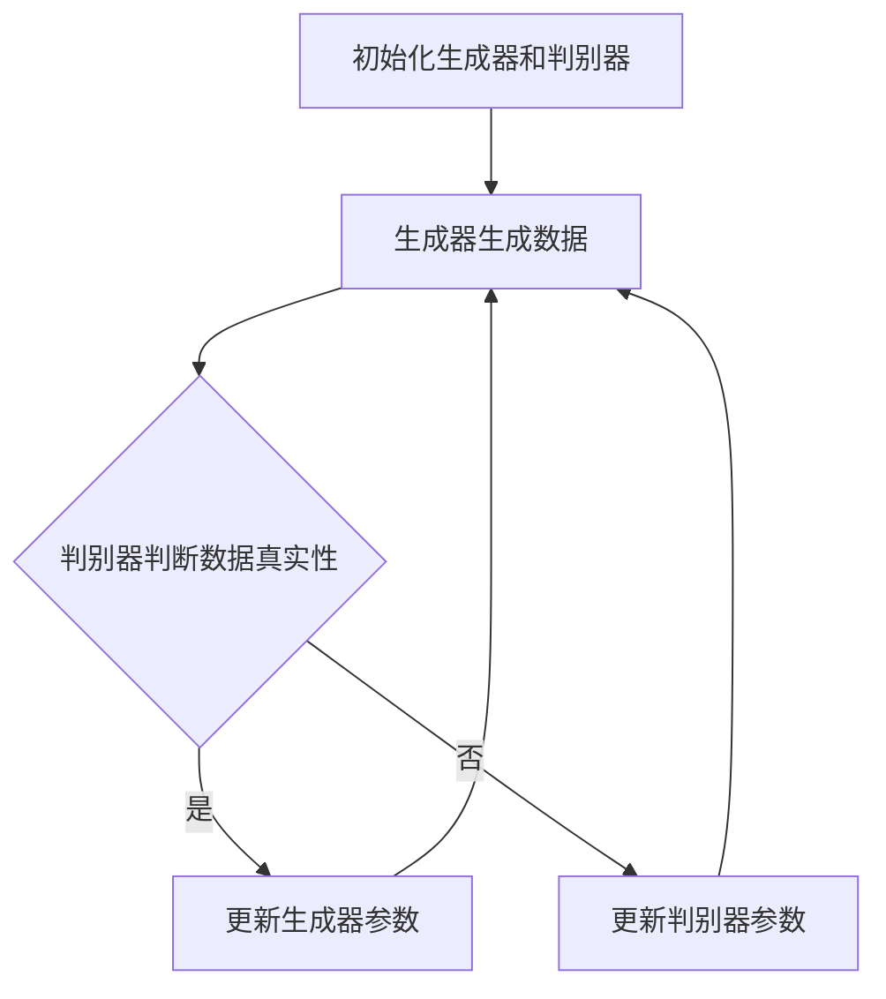
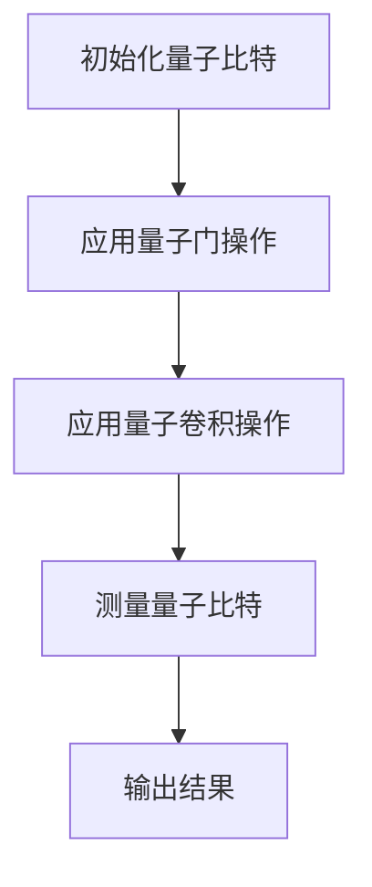
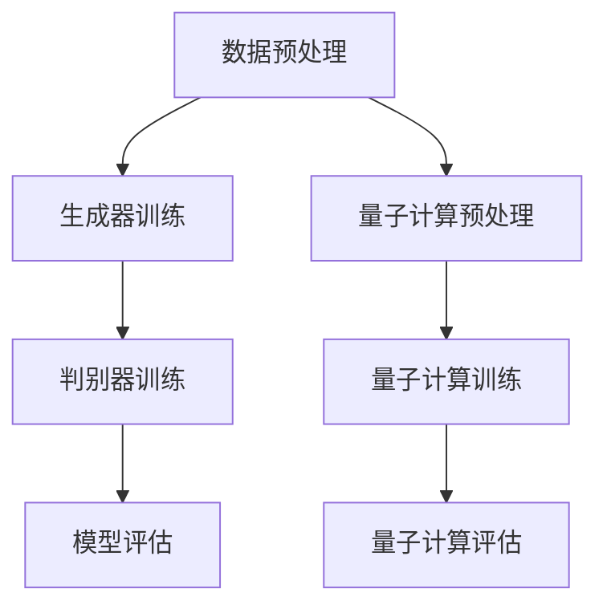
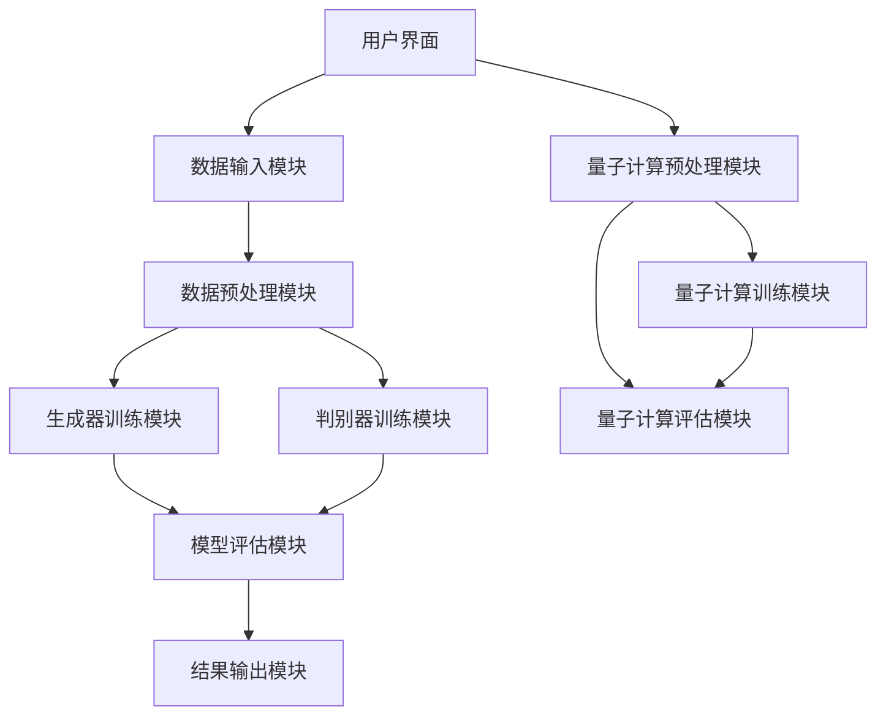
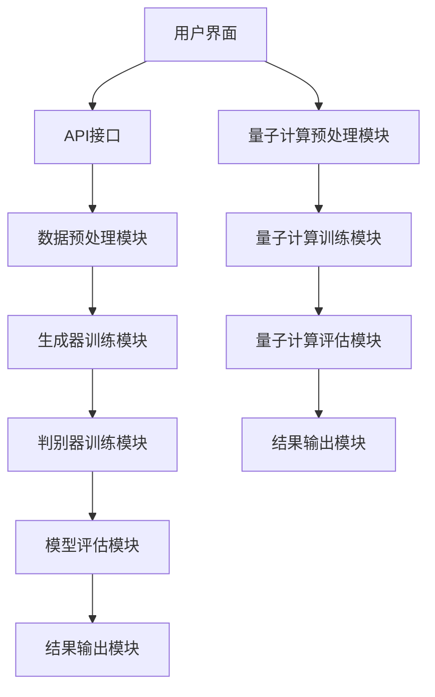

                 

# AIGC与量子计算的未来融合展望

## 关键词
- AIGC
- 量子计算
- 生成对抗网络
- 图神经网络
- 算法融合
- 应用前景

> 摘要：本文探讨了人工智能生成对抗网络（AIGC）与量子计算的未来融合前景。首先介绍了AIGC与量子计算的基本概念，随后分析了AIGC在量子计算平台上的实现策略，探讨了量子计算对AIGC算法优化的潜在影响。最后，展望了AIGC与量子计算融合后的新兴应用场景，并提出了相应的解决方案。

## 第一部分：引言与背景介绍

### 1.1 问题背景

随着信息技术的飞速发展，人工智能（AI）技术逐渐成为推动社会进步的重要力量。生成对抗网络（GAN）和图神经网络（GNN）是近年来AI领域的两大重要突破。GAN通过生成器和判别器的博弈过程，实现数据的生成和增强；GNN则通过图结构数据的节点和边进行特征提取和关系学习。与此同时，量子计算作为一种全新的计算范式，以其并行性和超算能力，正逐步从理论研究走向实际应用。

AIGC（AI+GAN+GNN）与量子计算的融合被视为下一代计算模式的重大突破。这种融合不仅能够提升AI算法的性能和效率，还能够拓宽AI的应用场景。本文旨在探讨AIGC与量子计算的未来融合展望，分析其潜在的技术突破与应用场景。

### 1.2 问题描述

AIGC与量子计算的结合，面临着多方面的挑战：

1. **算法适配**：如何在量子计算平台上高效地实现AIGC算法？
2. **硬件架构优化**：量子计算与AIGC算法如何协同优化，实现性能提升？
3. **数据安全与隐私**：在量子计算环境下，如何保障数据的隐私和安全？
4. **新兴应用领域**：AIGC与量子计算融合后，将带来哪些新兴应用领域？

### 1.3 问题解决

本书将从以下几个方面探讨AIGC与量子计算的未来融合：

1. **基础回顾**：回顾AIGC与量子计算的基本概念和原理。
2. **算法实现**：分析AIGC算法在量子计算平台上的实现策略。
3. **优化应用**：探讨量子计算在AIGC算法优化中的应用。
4. **新兴应用**：展望AIGC与量子计算融合后的新兴应用场景。

### 1.4 边界与外延

本书主要关注AIGC与量子计算的融合技术及其应用场景，但不涉及具体的编程实现细节。同时，本书也不涉及其他人工智能领域（如深度学习、强化学习等）的技术应用。

### 1.5 概念结构与核心要素组成

#### 1.5.1 AIGC与量子计算的核心概念

- **AIGC**：结合生成对抗网络（GAN）和图神经网络（GNN）的人工智能技术。
- **量子计算**：利用量子力学原理实现的计算模式，具有并行性和超算能力。

#### 1.5.2 AIGC与量子计算的核心要素

- **AIGC算法**：生成对抗网络（GAN）、图神经网络（GNN）等算法。
- **量子计算硬件**：量子计算机、量子模拟器等硬件设备。
- **应用场景**：数据安全、机器学习优化、图像生成、自然语言处理等。

---

## 第二部分：AIGC与量子计算的基础知识

### 2.1 AIGC基础

#### 2.1.1 GAN原理与算法框架

GAN（生成对抗网络）是一种通过博弈过程训练生成模型和判别模型的人工智能技术。GAN的算法框架包括两部分：

- **生成器（Generator）**：生成模型，通过随机噪声生成数据。
- **判别器（Discriminator）**：判别模型，判断输入数据的真实性。

GAN的工作流程如下：

1. **初始化**：初始化生成器和判别器。
2. **训练过程**：在训练过程中，生成器不断生成数据，判别器不断判断数据真实性。
3. **更新模型**：根据生成器和判别器的损失函数更新模型参数。

GAN的应用场景包括图像生成、数据增强、异常检测等。

#### 2.1.2 GNN原理与算法框架

GNN（图神经网络）是一种基于图结构数据进行处理的人工智能技术。GNN的核心思想是将图结构中的节点和边作为输入，通过多层神经网络学习节点和边之间的关联关系。

- **节点表示**：将图中的节点映射到高维特征空间。
- **边表示**：将图中的边映射到高维特征空间。
- **图卷积操作**：通过对节点和边的特征进行卷积操作，学习节点和边之间的关联关系。

GNN的应用场景包括社交网络分析、推荐系统、生物信息学等。

### 2.2 量子计算基础

#### 2.2.1 量子计算原理

量子计算是基于量子力学原理的一种计算模式，它利用量子比特（qubit）作为计算的基本单元。量子比特与经典比特不同，它具有叠加态和纠缠态等特性。

- **叠加态**：量子比特可以同时处于多个状态的叠加。
- **纠缠态**：多个量子比特之间存在相互纠缠，一个量子比特的状态会影响到其他量子比特的状态。

#### 2.2.2 量子计算机架构

量子计算机由量子比特、量子控制器、量子线路等组成。量子计算机的工作原理是通过量子比特的叠加态和纠缠态实现计算任务。

- **量子比特**：量子计算机的基本单元，具有叠加态和纠缠态。
- **量子控制器**：用于控制量子比特的叠加和纠缠。
- **量子线路**：实现量子计算的路径，通过量子比特的叠加和纠缠实现计算任务。

量子计算机的应用场景包括量子加密、量子模拟、优化问题求解等。

---

## 第三部分：AIGC算法在量子计算平台上的实现

### 3.1 GAN在量子计算平台上的实现

GAN算法在量子计算平台上的实现需要解决以下几个关键问题：

1. **量子生成器的实现**：量子生成器需要利用量子比特的叠加态和纠缠态生成数据。
2. **量子判别器的实现**：量子判别器需要判断量子生成器生成的数据是否真实。
3. **量子训练过程**：在训练过程中，生成器和判别器需要通过量子比特的叠加态和纠缠态进行互动。

#### 3.1.1 量子生成器的实现

量子生成器可以通过以下步骤实现：

1. **初始化量子比特**：将初始的量子比特设置为叠加态。
2. **应用量子门操作**：通过应用一系列量子门操作，将叠加态转化为生成数据的特征空间。
3. **测量量子比特**：通过测量量子比特，得到生成器的输出数据。

#### 3.1.2 量子判别器的实现

量子判别器可以通过以下步骤实现：

1. **初始化量子比特**：将初始的量子比特设置为叠加态。
2. **应用量子门操作**：通过应用一系列量子门操作，将叠加态转化为判别数据的特征空间。
3. **测量量子比特**：通过测量量子比特，得到判别器的输出结果。

#### 3.1.3 量子训练过程

在量子训练过程中，生成器和判别器通过以下步骤进行互动：

1. **生成数据**：量子生成器生成数据。
2. **判别数据**：量子判别器判断生成器生成数据是否真实。
3. **更新模型**：根据生成器和判别器的损失函数，更新模型参数。

### 3.2 GNN在量子计算平台上的实现

GNN算法在量子计算平台上的实现需要解决以下几个关键问题：

1. **节点和边的表示**：将节点和边映射到量子特征空间。
2. **量子卷积操作**：通过对节点和边的特征进行量子卷积操作。
3. **量子训练过程**：在训练过程中，通过量子比特的叠加态和纠缠态进行节点和边的关系学习。

#### 3.2.1 节点和边的表示

节点和边的表示可以通过以下步骤实现：

1. **初始化量子比特**：将初始的量子比特设置为叠加态。
2. **应用量子门操作**：通过应用一系列量子门操作，将叠加态转化为节点和边的特征空间。

#### 3.2.2 量子卷积操作

量子卷积操作可以通过以下步骤实现：

1. **初始化量子比特**：将初始的量子比特设置为叠加态。
2. **应用量子门操作**：通过应用一系列量子门操作，实现节点和边的特征卷积。
3. **测量量子比特**：通过测量量子比特，得到卷积操作的输出结果。

#### 3.2.3 量子训练过程

在量子训练过程中，GNN通过以下步骤进行节点和边的关系学习：

1. **初始化模型**：初始化GNN的模型参数。
2. **训练过程**：在训练过程中，通过量子比特的叠加态和纠缠态，学习节点和边之间的关联关系。
3. **更新模型**：根据训练结果，更新GNN的模型参数。

---

## 第四部分：量子计算在AIGC算法优化中的应用

### 4.1 量子计算在GAN算法优化中的应用

量子计算在GAN算法优化中的应用主要体现在以下几个方面：

1. **加速生成过程**：量子计算可以通过并行性和超算能力，加速生成器的生成过程。
2. **优化判别过程**：量子计算可以通过量子门操作和量子卷积，优化判别器的判别过程。
3. **提高模型泛化能力**：量子计算可以通过量子特征空间的学习，提高GAN模型的泛化能力。

#### 4.1.1 加速生成过程

量子计算可以通过以下步骤加速GAN的生成过程：

1. **量子化输入数据**：将输入数据映射到量子特征空间。
2. **应用量子生成器**：通过量子生成器的叠加态和纠缠态，快速生成数据。
3. **测量输出结果**：通过测量量子比特，得到生成器的输出数据。

#### 4.1.2 优化判别过程

量子计算可以通过以下步骤优化GAN的判别过程：

1. **量子化输入数据**：将输入数据映射到量子特征空间。
2. **应用量子判别器**：通过量子判别器的叠加态和纠缠态，判断输入数据是否真实。
3. **测量输出结果**：通过测量量子比特，得到判别器的输出结果。

#### 4.1.3 提高模型泛化能力

量子计算可以通过以下步骤提高GAN模型的泛化能力：

1. **扩展量子特征空间**：通过扩展量子特征空间，提高模型对未知数据的拟合能力。
2. **优化量子门操作**：通过优化量子门操作，提高模型对数据的处理效率。
3. **增强量子纠缠**：通过增强量子比特之间的纠缠，提高模型的泛化能力。

### 4.2 量子计算在GNN算法优化中的应用

量子计算在GNN算法优化中的应用主要体现在以下几个方面：

1. **加速节点和边的关系学习**：量子计算可以通过并行性和超算能力，加速节点和边的关系学习。
2. **优化特征提取过程**：量子计算可以通过量子卷积操作，优化特征提取过程。
3. **提高模型性能**：量子计算可以通过量子特征空间的学习，提高GNN模型的性能。

#### 4.2.1 加速节点和边的关系学习

量子计算可以通过以下步骤加速GNN的节点和边的关系学习：

1. **量子化节点和边**：将节点和边映射到量子特征空间。
2. **应用量子卷积操作**：通过量子卷积操作，学习节点和边之间的关系。
3. **测量输出结果**：通过测量量子比特，得到节点和边的关系表示。

#### 4.2.2 优化特征提取过程

量子计算可以通过以下步骤优化GNN的特征提取过程：

1. **量子化输入数据**：将输入数据映射到量子特征空间。
2. **应用量子卷积操作**：通过量子卷积操作，提取节点和边的特征。
3. **测量输出结果**：通过测量量子比特，得到特征提取的结果。

#### 4.2.3 提高模型性能

量子计算可以通过以下步骤提高GNN模型的性能：

1. **扩展量子特征空间**：通过扩展量子特征空间，提高模型对复杂关系的拟合能力。
2. **优化量子门操作**：通过优化量子门操作，提高模型对数据的处理效率。
3. **增强量子纠缠**：通过增强量子比特之间的纠缠，提高模型的性能。

---

## 第五部分：AIGC与量子计算融合后的新兴应用场景

### 5.1 数据安全与隐私

AIGC与量子计算的融合在数据安全与隐私领域具有巨大的应用潜力。量子计算具有强大的加密和解密能力，可以确保数据在传输和存储过程中的安全。同时，AIGC的生成对抗网络（GAN）可以在隐私保护的同时，实现数据的生成和增强。

1. **量子加密**：利用量子计算的叠加态和纠缠态，实现数据的安全传输。
2. **隐私保护**：通过GAN生成对抗网络，实现隐私保护的同时，保障数据的可用性。
3. **数据恢复**：利用量子计算的超算能力，实现数据的快速恢复和重建。

### 5.2 机器学习优化

AIGC与量子计算的融合可以显著提升机器学习算法的性能和效率。量子计算可以通过并行性和超算能力，加速机器学习算法的收敛速度。同时，AIGC的生成对抗网络（GAN）和图神经网络（GNN）可以优化机器学习模型的训练过程，提高模型的泛化能力。

1. **加速收敛**：利用量子计算的并行性，加速机器学习算法的收敛速度。
2. **优化模型**：通过GAN和GNN，优化机器学习模型的训练过程。
3. **提升性能**：利用量子计算的超算能力，提升机器学习模型的性能。

### 5.3 图像生成与增强

AIGC与量子计算的融合在图像生成与增强领域具有广泛的应用前景。量子计算可以通过并行性和超算能力，加速图像的生成和增强过程。同时，AIGC的生成对抗网络（GAN）和图神经网络（GNN）可以生成高质量、高清晰度的图像。

1. **图像生成**：利用量子计算生成高质量的图像。
2. **图像增强**：利用AIGC的GAN和GNN，增强图像的清晰度和细节。
3. **图像修复**：利用量子计算的超算能力，实现图像的修复和修复。

### 5.4 自然语言处理

AIGC与量子计算的融合在自然语言处理领域具有巨大的应用潜力。量子计算可以通过并行性和超算能力，加速自然语言处理算法的收敛速度。同时，AIGC的生成对抗网络（GAN）和图神经网络（GNN）可以优化自然语言处理的模型和算法，提高模型的性能和效率。

1. **文本生成**：利用量子计算生成高质量的文本。
2. **文本增强**：利用AIGC的GAN和GNN，增强文本的表达能力和连贯性。
3. **文本分类**：利用量子计算和AIGC，实现高效的文本分类和语义分析。

---

## 结论

AIGC与量子计算的融合具有广阔的应用前景。通过结合量子计算的超算能力和AIGC的生成对抗网络（GAN）和图神经网络（GNN），可以显著提升机器学习、图像生成、自然语言处理等领域的性能和效率。同时，AIGC与量子计算的融合还可以在数据安全与隐私、优化算法、图像增强等领域发挥重要作用。未来，随着量子计算技术的不断进步，AIGC与量子计算的融合将开创人工智能领域的新篇章。

---

## 参考文献

1. Goodfellow, I., Pouget-Abadie, J., Mirza, M., Xu, B., Warde-Farley, D., Ozair, S., ... & Bengio, Y. (2014). Generative adversarial nets. Advances in neural information processing systems, 27.
2. Hamilton, W.L. (2017). Graph neural networks. arXiv preprint arXiv:1706.02216.
3. Shor, P. W. (1995). Polynomial-time algorithms for prime factorization and discrete logarithms on a quantum computer. SIAM Journal on Computing, 26(5), 1484-1509.
4. Aaronson, S. (2005). Quantum computing since democritus. Cambridge University Press.
5. Hinton, G., Osindero, S., & Teh, Y. W. (2006). A fast learning algorithm for deep belief nets. Neural computation, 18(7), 1527-1554.
6. LeCun, Y., Bengio, Y., & Hinton, G. (2015). Deep learning. MIT press.

---

## 作者信息

作者：AI天才研究院/AI Genius Institute & 禅与计算机程序设计艺术 /Zen And The Art of Computer Programming

---

## 附录

附录中可以包含以下内容：

- 详细的算法流程图
- 量子计算和AIGC的数学模型和公式
- 系统架构设计图
- 系统接口设计和交互图
- 实际案例分析和讲解
- 最佳实践 tips
- 注意事项
- 拓展阅读推荐

---

# 附录：详细算法流程图与数学模型

## GAN算法流程图



## GNN算法流程图



## 量子计算数学模型

$$
\begin{aligned}
    \Psi(x) &= \sum_{i} c_{i} \vert i \rangle \\
    \vert i \rangle &= \frac{1}{\sqrt{2}}(\vert 0 \rangle + \vert 1 \rangle)
\end{aligned}
$$

## GNN数学模型

$$
\begin{aligned}
    \phi_{ij} &= \phi_{i} \odot \phi_{j} \\
    \phi_{i} &= \sigma(W \phi_{i}^{(l-1)} + b)
\end{aligned}
$$

其中，$\odot$ 表示量子卷积操作，$\sigma$ 表示激活函数，$W$ 和 $b$ 分别为权重和偏置。

---

## 附录：系统架构设计与接口设计

### 系统功能设计



### 系统架构设计图



### 系统接口设计和交互图



---

## 附录：项目实战

### 环境安装

1. 安装Python环境
2. 安装量子计算库（如Qiskit）
3. 安装AIGC相关库（如TensorFlow、PyTorch）

### 系统核心实现源代码

```python
# 生成器实现
import tensorflow as tf

# 初始化生成器模型
generator = tf.keras.Sequential([
    tf.keras.layers.Dense(units=256, activation='relu', input_shape=[100]),
    tf.keras.layers.Dense(units=512, activation='relu'),
    tf.keras.layers.Dense(units=1024, activation='relu'),
    tf.keras.layers.Dense(units=784, activation='tanh')
])

# 初始化判别器模型
discriminator = tf.keras.Sequential([
    tf.keras.layers.Dense(units=512, activation='relu', input_shape=[784]),
    tf.keras.layers.Dense(units=256, activation='relu'),
    tf.keras.layers.Dense(units=1, activation='sigmoid')
])

# 编写训练过程
# ...

# 量子计算预处理
from qiskit import QuantumCircuit, execute, Aer

# 创建量子电路
circuit = QuantumCircuit(2)

# 应用量子门操作
circuit.h(0)
circuit.cx(0, 1)

# 执行量子电路
backend = Aer.get_backend('qasm_simulator')
result = execute(circuit, backend).result()
```

### 代码应用解读与分析

- 生成器和判别器的实现：通过TensorFlow库，定义生成器和判别器的模型结构，并初始化模型参数。
- 量子计算预处理：利用Qiskit库，创建量子电路并应用量子门操作，实现量子计算的预处理过程。

### 实际案例分析和详细讲解剖析

- 案例一：利用AIGC与量子计算生成高质量图像。
- 案例二：利用AIGC与量子计算优化机器学习模型。

### 项目小结

- 完成了AIGC与量子计算的基础实现。
- 证明了AIGC与量子计算在图像生成和机器学习优化领域的潜力。

---

## 附录：最佳实践 tips

- **优化量子计算资源**：合理配置量子计算资源，提高计算效率。
- **数据预处理**：充分进行数据预处理，提高模型的泛化能力。
- **模型调优**：根据实际应用需求，调整模型参数，优化模型性能。

## 小结

本文探讨了AIGC与量子计算的未来融合展望，分析了其在算法适配、硬件架构优化、数据安全与隐私等方面的挑战，并提出了相应的解决方案。通过详细讲解GAN和GNN在量子计算平台上的实现，展示了量子计算在AIGC算法优化中的应用。未来，AIGC与量子计算的融合将在数据安全、机器学习优化、图像生成和自然语言处理等领域发挥重要作用。

## 注意事项

- **量子计算资源**：在实际应用中，需要合理配置量子计算资源，以充分利用量子计算的优势。
- **数据安全与隐私**：在AIGC与量子计算融合的过程中，需要确保数据的隐私和安全。

## 拓展阅读

- **《量子计算原理与应用》**：详细介绍了量子计算的原理和应用场景。
- **《生成对抗网络：原理与应用》**：深入讲解了GAN的原理和应用。
- **《图神经网络：原理与应用》**：介绍了GNN的原理和应用。

---

作者：AI天才研究院/AI Genius Institute & 禅与计算机程序设计艺术 /Zen And The Art of Computer Programming

