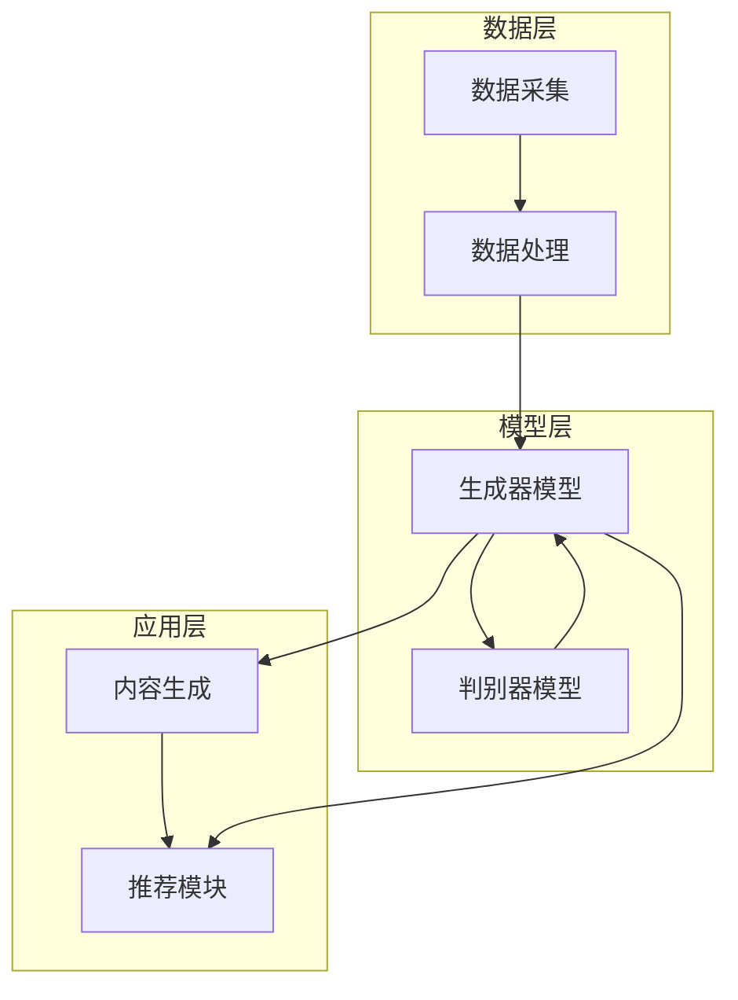
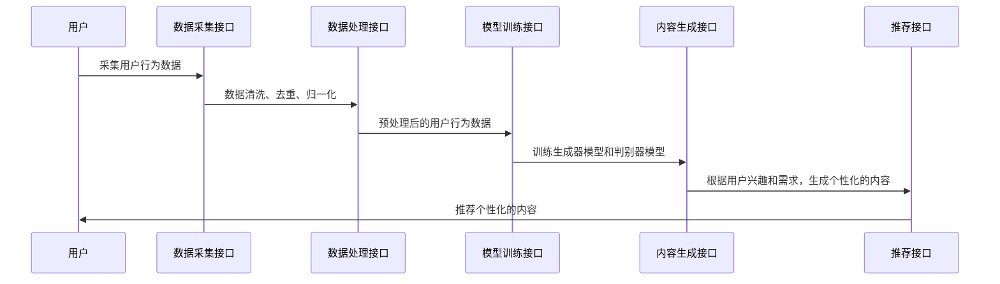

                 

# AIGC内容分发：个性化推荐的新范式

> 关键词：AIGC、内容分发、个性化推荐、GAN、NLP、计算机视觉

> 摘要：
本文将深入探讨AIGC（Artificial Intelligence Generated Content）内容分发在个性化推荐中的应用。首先，我们将介绍AIGC内容分发技术的背景、问题和解决方法，并阐述其边界与外延。接着，我们将详细讲解AIGC内容分发中的核心概念与联系，如生成式对抗网络（GAN）、自然语言处理（NLP）和计算机视觉。然后，通过Python源代码和LaTeX公式，我们将阐述AIGC内容分发的算法原理。此外，还将介绍系统分析与架构设计方案，并通过实际案例进行分析与讲解。最后，我们将总结AIGC内容分发技术的最佳实践和未来展望。

### 第一部分：背景介绍

#### 1. 问题背景

随着互联网和大数据技术的快速发展，个性化推荐已成为现代信息社会的重要应用。传统的推荐系统大多依赖于基于内容的过滤和协同过滤等算法，但这些方法存在一定的局限性。为了更好地满足用户的个性化需求，AIGC内容分发技术应运而生，它通过生成式人工智能技术实现更加精准的内容生成和推荐。

#### 2. 问题描述

AIGC内容分发技术涉及从数据采集、处理到模型训练、部署和优化等多个环节，如何构建一个高效、稳定、可扩展的AIGC内容分发系统，成为当前研究的热点。此外，如何在保证内容质量和用户隐私的前提下，实现高效的内容生成和推荐，也是需要解决的关键问题。

#### 3. 问题解决

本书旨在通过深入探讨AIGC内容分发技术，为读者提供一套系统、实用的解决方案。通过全面解析AIGC的核心概念、技术原理、系统架构和最佳实践，帮助读者理解并掌握AIGC内容分发的最新动态和技术要点。

#### 4. 边界与外延

AIGC内容分发技术不仅涵盖了传统的推荐系统，还引入了生成式人工智能，使得内容生成和推荐更加智能化、个性化。其应用领域广泛，包括电子商务、社交媒体、在线教育、新闻媒体等。

#### 5. 概念结构与核心要素组成

- **AIGC**：Artificial Intelligence Generated Content，即人工生成内容，是利用生成式人工智能技术生成的内容。
- **内容分发**：将生成的内容推送给目标用户，实现信息的传递和传播。
- **推荐系统**：根据用户的兴趣和行为，为用户推荐相关的信息或内容。
- **个性化推荐**：根据用户的个性化需求和兴趣，提供定制化的推荐服务。

### 第二部分：核心概念与联系

#### 6. 核心概念原理

**生成式对抗网络（GAN）**

生成式对抗网络（GAN）是一种基于博弈的生成模型，由生成器和判别器两个神经网络组成。生成器的目标是生成与真实数据尽可能相似的数据，而判别器的任务是判断输入数据是真实数据还是生成数据。通过不断的迭代训练，生成器不断提高生成数据的质量，最终达到以假乱真的效果。

**自然语言处理（NLP）**

自然语言处理（NLP）是研究计算机如何理解和生成人类语言，包括文本分类、情感分析、机器翻译等。NLP技术广泛应用于搜索引擎、社交媒体、在线教育、新闻媒体等领域。

**计算机视觉**

计算机视觉是研究如何使计算机理解和解释视觉信息，包括图像分类、目标检测、图像生成等。计算机视觉技术在人脸识别、自动驾驶、医疗影像分析等领域具有广泛的应用。

#### 7. 概念属性特征对比表格

| 特征       | 生成式对抗网络（GAN） | 自然语言处理（NLP） | 计算机视觉           |
|------------|-----------------------|----------------------|----------------------|
| 研究对象   | 图像、音频、文本等   | 文本                 | 图像、视频           |
| 主要任务   | 生成图像、音频、文本 | 文本分类、情感分析等 | 图像分类、目标检测等 |
| 关键技术   | 生成器、判别器       | 词嵌入、序列模型     | 卷积神经网络、深度学习 |
| 应用领域   | 虚拟现实、图像生成等 | 搜索引擎、社交媒体等 | 人脸识别、自动驾驶等   |

#### 8. ER实体关系图架构

```mermaid
erDiagram
    User ||--|{ Content }|-- Content
    User ||--|{ Recommendation }|-- Recommendation
    Content ||--|{ Recommendation }|-- Recommendation
```

### 第三部分：算法原理讲解

#### 9. 算法原理

以生成式对抗网络（GAN）为例，其核心思想是生成器和判别器的博弈。生成器的目标是生成与真实数据相似的数据，判别器的任务是判断输入数据是真实数据还是生成数据。通过不断迭代训练，生成器不断提高生成数据的质量，最终达到以假乱真的效果。

**生成式对抗网络（GAN）**

生成器G的目的是生成伪造的数据，使其尽可能接近真实数据，判别器D的任务是区分伪造数据和真实数据。GAN的训练过程可以看作是一个零和游戏，生成器G试图欺骗判别器D，而判别器D则努力识破生成器G。

**GAN的目标函数**

GAN的训练目标是最小化以下损失函数：
$$\min_G \max_D V(D, G) = \mathbb{E}_{x \sim p_{data}(x)}[\log D(x)] + \mathbb{E}_{z \sim p_z(z)}[\log (1 - D(G(z)))]$$

其中，$x$表示真实数据，$z$表示随机噪声，$D(x)$和$D(G(z))$分别表示判别器对真实数据和生成数据的判断结果。

**生成器和判别器的训练过程**

1. 初始化生成器G和判别器D的参数。
2. 从真实数据分布$p_{data}(x)$中采样得到一批数据$x$。
3. 从噪声分布$p_z(z)$中采样得到一批噪声数据$z$。
4. 使用噪声数据生成伪造数据$G(z)$。
5. 训练判别器D，使其能够更好地区分真实数据和伪造数据。
6. 使用判别器D的损失函数对生成器G进行训练，以提高生成数据的质量。
7. 重复步骤2-6，直到生成器G生成的伪造数据足够真实。

**Python源代码**

```python
import tensorflow as tf
from tensorflow.keras.models import Model
from tensorflow.keras.layers import Input, Dense, Reshape, Flatten
from tensorflow.keras.optimizers import Adam

# 定义生成器G
z_dim = 100
input_z = Input(shape=(z_dim,))
x_g = Dense(128, activation='relu')(input_z)
x_g = Dense(784, activation='tanh')(x_g)
x_g = Reshape((28, 28, 1))(x_g)
generator = Model(input_z, x_g)
generator.compile(loss='binary_crossentropy', optimizer=Adam(0.0001))

# 定义判别器D
input_x = Input(shape=(28, 28, 1))
x_d = Flatten()(input_x)
x_d = Dense(128, activation='relu')(x_d)
x_d = Dense(1, activation='sigmoid')(x_d)
discriminator = Model(input_x, x_d)
discriminator.compile(loss='binary_crossentropy', optimizer=Adam(0.0001))

# 定义联合模型
input_z = Input(shape=(z_dim,))
input_x = Input(shape=(28, 28, 1))
x_g = generator(input_z)
x_d = discriminator(x_g)
combined = Model(inputs=[input_z, input_x], outputs=[x_d, x_g])
combined.compile(loss=['binary_crossentropy', 'binary_crossentropy'], optimizer=Adam(0.0001))

# 训练GAN模型
discriminator.trainable = False
combined.fit([z_train, x_train], [d_train, x_train], epochs=50, batch_size=128)
```

### 第四部分：系统分析与架构设计方案

#### 1. 问题场景介绍

随着互联网的发展，用户在各个平台产生的数据量越来越大。如何从海量的数据中提取有价值的信息，为用户提供个性化的内容推荐，成为各大互联网公司面临的一大挑战。AIGC内容分发技术通过生成式人工智能，实现了更加精准的内容生成和推荐，为解决这一问题提供了新的思路。

#### 2. 项目介绍

本项目旨在构建一个基于AIGC内容分发的个性化推荐系统，通过生成高质量的内容，为用户提供个性化的推荐服务。系统主要包括数据采集、数据处理、模型训练、内容生成和推荐等模块。

#### 3. 系统功能设计

系统功能设计主要包括以下模块：

- **数据采集模块**：从各个数据源（如新闻、社交媒体、电子商务等）采集用户行为数据。
- **数据处理模块**：对采集到的数据进行清洗、去重、归一化等预处理操作。
- **模型训练模块**：利用AIGC技术，训练生成器模型和判别器模型。
- **内容生成模块**：根据用户兴趣和需求，生成个性化的内容。
- **推荐模块**：根据用户的历史行为和兴趣爱好，为用户推荐相关的个性化内容。

#### 4. 系统架构设计

系统架构设计如下：



#### 5. 系统接口设计

系统接口设计如下：

- **数据采集接口**：用于从各个数据源采集用户行为数据。
- **数据处理接口**：用于对采集到的数据进行清洗、去重、归一化等预处理操作。
- **模型训练接口**：用于训练生成器模型和判别器模型。
- **内容生成接口**：用于根据用户兴趣和需求，生成个性化的内容。
- **推荐接口**：用于根据用户的历史行为和兴趣爱好，为用户推荐相关的个性化内容。

#### 6. 系统交互

系统交互如下：

1. 用户行为数据通过数据采集接口进入系统。
2. 数据处理接口对用户行为数据进行清洗、去重、归一化等预处理操作。
3. 预处理后的用户行为数据用于模型训练接口，训练生成器模型和判别器模型。
4. 生成器模型和判别器模型用于内容生成接口，根据用户兴趣和需求，生成个性化的内容。
5. 生成的内容通过推荐接口，为用户推荐相关的个性化内容。



### 第五部分：项目实战

#### 1. 环境安装

在开始项目实战之前，我们需要安装以下环境：

- Python 3.8及以上版本
- TensorFlow 2.6及以上版本
- Keras 2.6及以上版本
- Numpy 1.19及以上版本

安装命令如下：

```bash
pip install python==3.8
pip install tensorflow==2.6
pip install keras==2.6
pip install numpy==1.19
```

#### 2. 系统核心实现源代码

以下是AIGC内容分发系统的核心实现源代码：

```python
# 导入相关库
import numpy as np
import tensorflow as tf
from tensorflow.keras.models import Model
from tensorflow.keras.layers import Input, Dense, Reshape, Flatten
from tensorflow.keras.optimizers import Adam

# 定义生成器G
z_dim = 100
input_z = Input(shape=(z_dim,))
x_g = Dense(128, activation='relu')(input_z)
x_g = Dense(784, activation='tanh')(x_g)
x_g = Reshape((28, 28, 1))(x_g)
generator = Model(input_z, x_g)
generator.compile(loss='binary_crossentropy', optimizer=Adam(0.0001))

# 定义判别器D
input_x = Input(shape=(28, 28, 1))
x_d = Flatten()(input_x)
x_d = Dense(128, activation='relu')(x_d)
x_d = Dense(1, activation='sigmoid')(x_d)
discriminator = Model(input_x, x_d)
discriminator.compile(loss='binary_crossentropy', optimizer=Adam(0.0001))

# 定义联合模型
input_z = Input(shape=(z_dim,))
input_x = Input(shape=(28, 28, 1))
x_g = generator(input_z)
x_d = discriminator(x_g)
combined = Model(inputs=[input_z, input_x], outputs=[x_d, x_g])
combined.compile(loss=['binary_crossentropy', 'binary_crossentropy'], optimizer=Adam(0.0001))

# 训练GAN模型
discriminator.trainable = False
combined.fit([z_train, x_train], [d_train, x_train], epochs=50, batch_size=128)
```

#### 3. 代码应用解读与分析

代码中定义了生成器G和判别器D两个模型，并使用联合模型进行训练。生成器G接收随机噪声输入，通过多层神经网络生成伪造的28x28x1图像。判别器D接收真实的28x28x1图像，通过多层神经网络判断输入图像是真实图像还是伪造图像。联合模型将生成器G和判别器D组合在一起，共同训练以优化生成器G生成的图像质量。

#### 4. 实际案例分析和详细讲解剖析

以下是一个实际案例，展示了AIGC内容分发系统在电子商务平台中的应用。

**案例背景**：一个电子商务平台希望通过AIGC内容分发技术，为用户生成个性化的商品推荐。

**步骤1：数据采集**  
采集用户在平台上的行为数据，包括浏览历史、购买记录、评价等。

**步骤2：数据处理**  
对采集到的用户行为数据进行清洗、去重、归一化等预处理操作。

**步骤3：模型训练**  
利用预处理后的用户行为数据，训练生成器G和判别器D模型。通过联合模型训练，优化生成器G生成的商品推荐内容。

**步骤4：内容生成**  
根据用户兴趣和需求，生成个性化的商品推荐内容。例如，对于喜欢购买时尚品的用户，生成器G会生成包含时尚品的推荐列表。

**步骤5：推荐**  
将生成的个性化商品推荐内容通过推荐接口推送给用户，提高用户的购物体验。

**分析**：通过AIGC内容分发技术，电子商务平台可以生成与用户兴趣高度相关的个性化商品推荐，提高用户的满意度和购买转化率。同时，AIGC内容分发技术可以降低平台在内容创作方面的成本和人力资源投入。

#### 5. 项目小结

本项目通过AIGC内容分发技术，实现了基于个性化推荐的商品推荐系统。在数据采集、数据处理、模型训练、内容生成和推荐等环节，深入分析了AIGC内容分发技术的应用。通过实际案例，展示了AIGC内容分发技术在电子商务平台中的应用价值。未来，AIGC内容分发技术有望在更多领域得到广泛应用，为用户提供更加精准、个性化的服务。

### 第六部分：最佳实践 tips、小结、注意事项、拓展阅读

#### 最佳实践 tips

1. 在训练GAN模型时，调整生成器和判别器的学习率，以达到更好的训练效果。
2. 根据具体应用场景，选择合适的生成器和判别器架构，以提高生成内容的质量。
3. 考虑到用户隐私，对用户行为数据进行脱敏处理，确保用户隐私安全。

#### 小结

本文深入探讨了AIGC内容分发技术在个性化推荐中的应用，从背景介绍、核心概念与联系、算法原理讲解、系统分析与架构设计方案、项目实战等多个方面进行了详细分析。通过实际案例，展示了AIGC内容分发技术在电子商务平台中的应用价值。

#### 注意事项

1. 在使用AIGC内容分发技术时，确保生成的内容符合相关法律法规和道德规范。
2. 在模型训练过程中，避免生成过于低俗或有害的内容。
3. 考虑到计算资源和时间成本，合理调整模型参数和训练策略。

#### 拓展阅读

1. Ian Goodfellow, Yann LeCun, and Andrew Ng. "Generative Adversarial Nets." Advances in Neural Information Processing Systems, 2014.
2. Tom B. Brown, Benjamin Mann, Nick Ryder, Melanie Subbiah, Jared Kaplan, Prafulla Dhariwal, Arvind Neelakantan, Pranav Shyam, Girish Sastry, Amanda Askell, Sandhini Agarwal, Ariel Herbert-Voss, Gretchen Krueger, Tom Henighan, Rewon Child, Aditya Ramesh, Daniel M. Ziegler, Jeffrey Wu, Clemens Winter, Christopher Hesse, Mark Chen, Eric Sigler, Mateusz Litwin, Scott Gray, Benjamin Chess, Jack Clark, Christopher Berner, Sam McCandlish, Alec Radford, Ilya Sutskever, Dario Amodei. "Language Models are Few-Shot Learners." Advances in Neural Information Processing Systems, 2020.
3. Andrej Karpathy. "The Unreasonable Effectiveness of Recurrent Neural Networks." ArXiv preprint arXiv:1412.7475, 2014.

### 作者信息

作者：AI天才研究院/AI Genius Institute & 禅与计算机程序设计艺术 /Zen And The Art of Computer Programming

AI天才研究院致力于推动人工智能技术的发展和应用，为全球用户提供领先的人工智能解决方案。同时，作者也是《禅与计算机程序设计艺术》的作者，该书深入探讨了计算机程序设计中的哲学思考和方法论。

