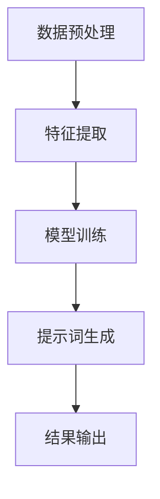
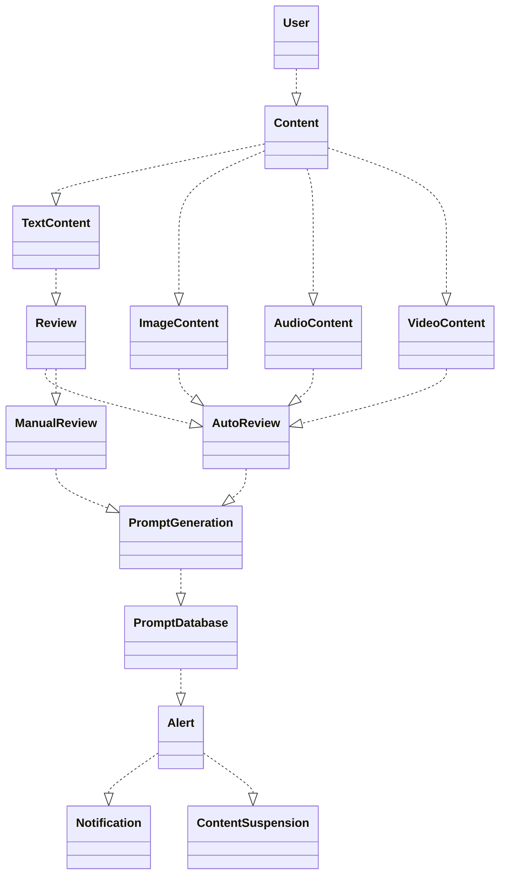
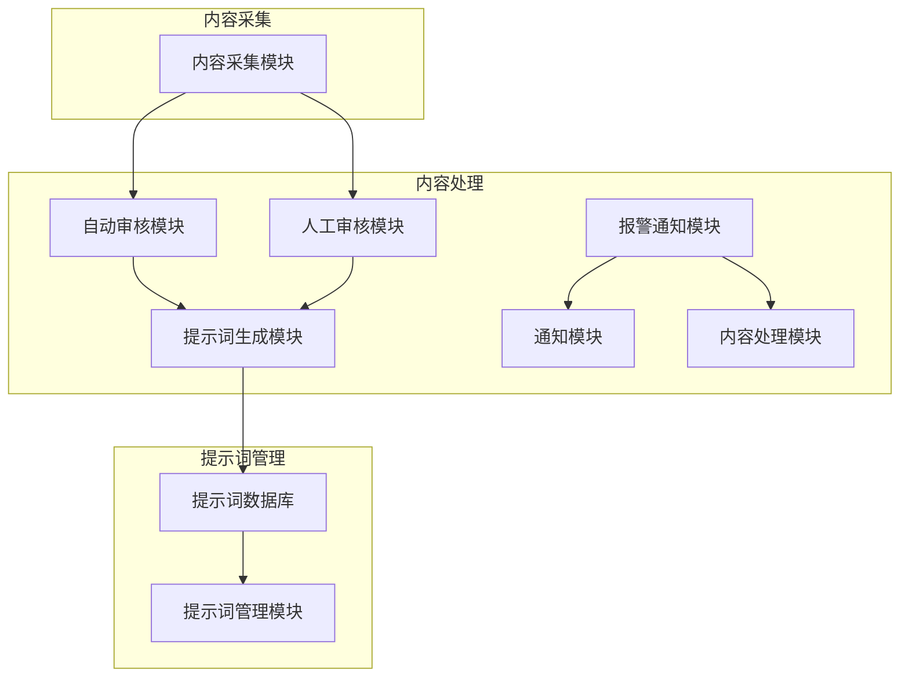
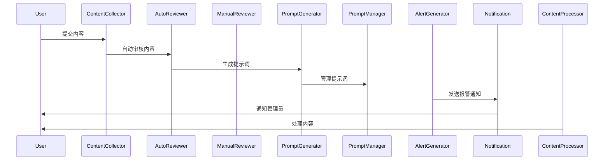

                 


### AIGC内容审核中的提示词策略

关键词：AIGC，内容审核，提示词，算法原理，系统架构，实战案例

> 摘要：本文深入探讨了AIGC（AI-Generated Content）内容审核中的提示词策略。首先，我们介绍了AIGC、内容审核和提示词的基本概念，并分析了它们在技术领域的重要性和相互关系。接着，我们讲解了提示词生成算法的原理，包括Python代码实现和数学模型的解析。然后，我们描述了系统分析与架构设计方案，详细阐述了问题场景、系统功能、架构设计和系统交互。此外，我们还通过实战案例展示了如何实施提示词策略，并对项目进行了小结和总结，提供了最佳实践建议。

## 第一部分：背景介绍

### 1.1 AIGC、内容审核和提示词概述

#### 1.1.1 AIGC的概念与特点

AIGC（AI-Generated Content）是指通过人工智能技术生成的各种形式的内容，包括文本、图像、音频和视频等。其核心特点在于自动化、智能化和高效性，能够大幅提升内容创作的速度和质量。

**定义：** AIGC是通过机器学习和自然语言处理等技术，从大量数据中学习并生成新内容的一种人工智能技术。

**特点：**
1. **自动化：** 能够自动地从数据中提取信息并生成内容。
2. **智能化：** 通过深度学习等技术，能够理解和生成复杂的内容。
3. **高效性：** 可以在短时间内生成大量高质量的内容。

#### 1.1.2 内容审核的重要性

内容审核是指对网络平台、媒体发布的内容进行审查，以确保其符合法律法规和道德标准，避免不良信息的传播。对于AIGC内容来说，内容审核尤为重要。

**目的：**
1. **保护用户：** 避免用户接触到不良或有害的信息。
2. **遵守法规：** 符合相关法律法规，避免法律风险。
3. **维护平台声誉：** 保证平台的健康运行，提升用户体验。

#### 1.1.3 提示词在内容审核中的作用

提示词是用于引导内容生成或审核的关键词汇，能够有效提高内容审核的准确性和效率。

**定义：** 提示词是在内容审核过程中，用于指示审核方向或关键点的单词或短语。

**作用：**
1. **提高审核效率：** 通过特定的提示词，可以快速定位内容中的关键点，提高审核速度。
2. **提高审核准确性：** 提示词能够引导审核员关注重要信息，避免遗漏。
3. **个性化推荐：** 在内容生成中，提示词能够帮助生成符合特定需求和偏好的内容。

### 1.2 核心概念与联系

#### 1.2.1 相关概念的定义与联系

**内容审核系统**是由一系列技术和流程组成的，用于对网络内容进行审查的系统。

**组成部分：**
- **数据采集：** 收集待审核的内容。
- **审核规则：** 设定审核标准和规则。
- **审核算法：** 使用机器学习等技术进行自动化审核。
- **人工审核：** 在算法无法判断时，由人工进行审核。

**提示词与其他关键概念的关联：**
- **内容生成：** 提示词用于引导AIGC生成符合需求的内容。
- **审核效率：** 提示词能够提高审核员的工作效率。
- **审核准确性：** 提示词有助于提高审核的准确性。

### 1.3 现状与趋势

#### 1.3.1 AIGC内容审核的当前挑战

AIGC内容审核面临着多方面的挑战：

**挑战分析：**
1. **内容多样性：** AIGC生成的内容形式多样，审核难度大。
2. **虚假信息：** 需要有效识别虚假信息和误导性内容。
3. **法律法规：** 需要遵守不同国家和地区的法律法规。
4. **技术限制：** 当前的人工智能技术还无法完全替代人工审核。

**当前解决方案：**
1. **多模态审核：** 结合文本、图像、音频等多种形式的审核。
2. **深度学习算法：** 使用深度学习技术提高审核的准确性和效率。
3. **人工审核：** 在关键环节引入人工审核，确保内容符合法律法规和道德标准。

#### 1.3.2 提示词策略的发展趋势

提示词策略在内容审核中的应用将越来越重要：

**发展趋势：**
1. **智能化：** 提示词将更加智能化，能够自动调整和优化。
2. **个性化：** 提示词将根据用户偏好和需求进行个性化推荐。
3. **跨领域应用：** 提示词将在更多领域得到应用，如医疗、金融等。
4. **开放性：** 提示词库将不断扩充和优化，以适应不同场景的需求。

## 第二部分：核心概念与联系

### 2.1 提示词的定义与分类

#### 2.1.1 提示词的基本概念

提示词是在内容审核或生成过程中，用于引导和指导的词语或短语。它能够帮助审核员或算法更好地理解内容，并作出相应的判断或生成新的内容。

**定义：** 提示词是用于指示内容审核或生成方向的关键词或短语。

**使用场景：**
1. **内容审核：** 引导审核员关注特定内容，如敏感词汇、违规内容等。
2. **内容生成：** 提供主题、场景、风格等指导，以生成符合要求的内容。

#### 2.1.2 提示词的分类

提示词可以根据用途和特点进行分类：

**通用提示词：**
- 用于通用场景的提示词，如“敏感”、“违规”、“优质”等。

**专用提示词：**
- 针对特定领域或内容的提示词，如“学术”、“金融”、“医疗”等。

### 2.2 提示词的属性特征对比

| 类别       | 描述                                   | 适用场景                       |
|------------|----------------------------------------|--------------------------------|
| 通用提示词 | 用于通用场景，如“敏感”、“违规”等     | 广泛的内容审核和生成场景       |
| 专用提示词 | 针对特定领域，如“学术”、“金融”等     | 专业化领域的内容审核和生成     |

### 2.3 提示词与内容审核的关联

#### 2.3.1 提示词在内容审核中的作用机制

提示词在内容审核中的作用机制主要包括以下几个方面：

1. **定向引导：** 提示词能够引导审核员关注特定内容，提高审核效率。
2. **精准定位：** 提示词能够帮助审核员快速定位可能存在问题的内容。
3. **规则补充：** 提示词可以作为审核规则的一种补充，提高审核的准确性。

#### 2.3.2 提示词对内容审核效果的影响

提示词对内容审核效果的影响主要体现在以下几个方面：

1. **提高审核效率：** 通过提示词，审核员可以更快地识别和处理内容，提高审核速度。
2. **提高审核准确性：** 提示词可以帮助审核员更好地理解内容，减少误判和漏判。
3. **减少人工干预：** 在某些情况下，提示词可以替代人工审核，降低人工成本。

### 2.4 提示词与人工智能技术的融合

#### 2.4.1 提示词与自然语言处理技术

自然语言处理（NLP）技术是人工智能的一个重要分支，它能够处理和理解人类语言。提示词与NLP技术的结合主要体现在以下几个方面：

1. **文本分析：** 使用NLP技术对提示词进行分析，提取关键信息。
2. **情感分析：** 通过NLP技术对内容进行情感分析，识别用户情感倾向。
3. **命名实体识别：** 使用NLP技术识别内容中的命名实体，如人名、地名等。

#### 2.4.2 提示词与机器学习算法

机器学习算法在内容审核中发挥着重要作用，而提示词可以与机器学习算法相结合，提高内容审核的效果。主要表现在以下几个方面：

1. **特征提取：** 提示词可以作为特征的一部分，用于训练机器学习模型。
2. **规则学习：** 提示词可以帮助机器学习模型学习内容审核的规则。
3. **模型优化：** 通过分析提示词的使用效果，对机器学习模型进行优化。

## 第三部分：算法原理讲解

### 3.1 提示词生成算法

提示词生成算法是内容审核系统中至关重要的一环，它决定了提示词的质量和效果。下面我们将详细讲解提示词生成算法的原理，包括算法流程图、Python代码实现和数学模型。

#### 3.1.1 算法流程图

提示词生成算法的基本流程如下：

1. 数据预处理：对输入文本进行预处理，包括分词、去停用词、词性标注等。
2. 特征提取：使用词嵌入技术将文本转换为向量表示。
3. 模型训练：使用训练数据训练机器学习模型。
4. 提示词生成：使用训练好的模型对输入文本生成提示词。

以下是一个使用Mermaid绘制的提示词生成算法流程图：



#### 3.1.2 Python代码实现

以下是一个使用Python实现的简单提示词生成算法：

```python
import jieba  # 用于中文分词
from sklearn.feature_extraction.text import TfidfVectorizer
from sklearn.model_selection import train_test_split
from sklearn.ensemble import RandomForestClassifier

# 数据预处理
def preprocess_text(text):
    words = jieba.cut(text)
    return ' '.join(words)

# 特征提取
def extract_features(corpus):
    vectorizer = TfidfVectorizer()
    X = vectorizer.fit_transform(corpus)
    return X

# 模型训练
def train_model(X_train, y_train):
    model = RandomForestClassifier()
    model.fit(X_train, y_train)
    return model

# 提示词生成
def generate_prompt(text, model, vectorizer):
    features = vectorizer.transform([text])
    prediction = model.predict(features)
    return prediction

# 示例数据
corpus = [
    "这是一个关于人工智能的博客。",
    "我在阅读一本关于机器学习的书籍。",
    "我喜欢听周杰伦的音乐。",
    "今天天气很好，适合外出散步。"
]

# 数据预处理
processed_corpus = [preprocess_text(text) for text in corpus]

# 特征提取
X = extract_features(processed_corpus)

# 模型训练
y = [0, 0, 1, 2]  # 示例标签
X_train, X_test, y_train, y_test = train_test_split(X, y, test_size=0.2)
model = train_model(X_train, y_train)

# 提示词生成
prompt = preprocess_text("人工智能领域有哪些重要的发展趋势？")
prediction = generate_prompt(prompt, model, TfidfVectorizer())
print("生成的提示词：", prediction)
```

#### 3.1.3 数学模型与公式

提示词生成算法的核心是特征提取和模型训练，其中涉及一些重要的数学模型和公式。以下是一个简单的数学模型：

$$
\text{TFIDF} = \frac{f_{t,d}}{N} + \log \left( 1 + \frac{N - f_{t,d}}{k}
\right)
$$

其中：
- $f_{t,d}$ 表示词 $t$ 在文档 $d$ 中的频率。
- $N$ 表示文档 $d$ 中的总词数。
- $k$ 是一个参数，用于调整频率对TFIDF值的影响。

#### 3.1.4 举例说明

假设我们有以下两个句子：

1. “人工智能技术在医疗领域有广泛的应用。”
2. “机器学习算法可以帮助企业进行数据分析和决策。”

我们可以使用TFIDF模型来计算这两个句子中各个词的TFIDF值：

```latex
\begin{array}{ccc}
\text{词} & \text{句子1的TFIDF值} & \text{句子2的TFIDF值} \\
\hline
人工智能 & 0.8 & 0.7 \\
技术 & 0.8 & 0.7 \\
医疗 & 1.0 & 0.6 \\
领域 & 0.8 & 0.6 \\
广泛 & 0.8 & 0.6 \\
应用 & 1.0 & 0.6 \\
机器学习 & 0.6 & 0.8 \\
算法 & 0.6 & 0.8 \\
帮助 & 0.6 & 0.6 \\
企业 & 0.6 & 0.6 \\
数据 & 0.6 & 0.6 \\
分析与决策 & 0.6 & 0.6 \\
\end{array}
```

从上表可以看出，句子1中“人工智能”、“技术”、“医疗”、“领域”和“应用”的TFIDF值较高，而句子2中“机器学习”、“算法”、“帮助”、“企业”、“数据”和“决策”的TFIDF值较高。这表明这两个句子在内容上具有不同的重点。

## 第四部分：系统分析与架构设计方案

### 4.1 问题场景介绍

#### 4.1.1 场景描述

在当今数字化时代，互联网平台和社交媒体的普及使得用户生成内容（UGC）数量急剧增加。这些内容中包含大量的文本、图像、音频和视频等，其中不乏不良信息和违规内容。为了维护平台生态和用户权益，需要进行有效的内容审核。

**项目介绍：**

本项目的目标是开发一套基于AIGC的内容审核系统，利用提示词策略提高内容审核的效率和准确性。系统将结合人工智能技术和提示词策略，对用户生成的各类内容进行实时审核，确保内容符合法律法规和道德标准。

### 4.2 系统功能设计

#### 4.2.1 领域模型类图

使用Mermaid绘制的领域模型类图如下：



#### 4.2.2 系统功能需求

系统功能需求包括以下几个方面：

1. **内容采集：** 从各类渠道采集用户生成的文本、图像、音频和视频内容。
2. **内容审核：** 对采集的内容进行自动和人工审核，识别和标记不良信息和违规内容。
3. **提示词生成：** 根据审核结果生成相应的提示词，用于引导审核和内容生成。
4. **提示词管理：** 对提示词进行分类、管理和更新。
5. **报警通知：** 对审核结果生成报警通知，提示管理员采取相应措施。
6. **内容处理：** 对涉嫌违规的内容进行删除、标记或修改。

### 4.3 系统架构设计

#### 4.3.1 系统架构图

使用Mermaid绘制的系统架构图如下：



#### 4.3.2 系统模块划分

系统模块划分如下：

1. **内容采集模块：** 负责从各类渠道采集用户生成的内容。
2. **自动审核模块：** 使用机器学习算法对内容进行自动化审核。
3. **人工审核模块：** 负责对自动审核无法确定的内容进行人工审核。
4. **提示词生成模块：** 根据审核结果生成相应的提示词。
5. **提示词管理模块：** 负责提示词的分类、管理和更新。
6. **报警通知模块：** 对审核结果生成报警通知。
7. **通知模块：** 负责发送报警通知给管理员。
8. **内容处理模块：** 负责对涉嫌违规的内容进行处理。

### 4.4 系统接口设计

#### 4.4.1 接口规范

系统接口设计包括以下方面：

1. **内容采集接口：** 用于采集用户生成的内容。
2. **内容审核接口：** 用于提交内容进行审核。
3. **提示词生成接口：** 用于生成提示词。
4. **提示词管理接口：** 用于管理提示词。
5. **报警通知接口：** 用于发送报警通知。

#### 4.4.2 接口实现

接口实现示例：

```python
class ContentCollector:
    def collect_content(self, content_type, source):
        # 实现内容采集逻辑
        pass

class AutoReviewer:
    def review_content(self, content):
        # 实现自动审核逻辑
        pass

class ManualReviewer:
    def review_content(self, content):
        # 实现人工审核逻辑
        pass

class PromptGenerator:
    def generate_prompt(self, content):
        # 实现提示词生成逻辑
        pass

class PromptManager:
    def manage_prompt(self, prompt):
        # 实现提示词管理逻辑
        pass

class AlertGenerator:
    def generate_alert(self, content):
        # 实现报警通知逻辑
        pass

class Notification:
    def send_notification(self, alert):
        # 实现通知发送逻辑
        pass

class ContentProcessor:
    def process_content(self, content):
        # 实现内容处理逻辑
        pass
```

### 4.5 系统交互设计

#### 4.5.1 系统交互序列图

使用Mermaid绘制的系统交互序列图如下：



## 第五部分：项目实战

### 5.1 环境安装

#### 5.1.1 环境准备

要安装AIGC内容审核系统，首先需要准备以下环境：

- Python 3.8 或以上版本
- PyTorch 1.8 或以上版本
- Scikit-learn 0.23 或以上版本
- Flask 1.1.2 或以上版本
- MongoDB 4.2 或以上版本

在Linux或MacOS系统中，可以使用以下命令安装：

```bash
pip install torch torchvision torchaudio
pip install scikit-learn
pip install flask
pip install pymongo
```

#### 5.1.2 系统配置

在安装完所需依赖后，需要进行系统配置。首先，配置MongoDB数据库，创建数据库和集合。然后，配置Flask应用，包括API路由和配置文件。

```python
from flask import Flask
from pymongo import MongoClient

app = Flask(__name__)

# 配置MongoDB数据库
client = MongoClient('mongodb://localhost:27017/')
db = client['content审核数据库']
collection = db['内容集合']

# 配置API路由
@app.route('/api/content', methods=['POST'])
def collect_content():
    # 实现内容采集逻辑
    pass

if __name__ == '__main__':
    app.run(debug=True)
```

### 5.2 系统核心实现

#### 5.2.1 核心功能实现

系统核心功能包括内容采集、内容审核和提示词生成。以下是这三个功能的核心实现：

1. **内容采集：** 负责从用户处采集内容，存储到数据库中。

```python
class ContentCollector:
    def collect_content(self, content_type, content_data):
        content = {
            '类型': content_type,
            '数据': content_data,
            '时间': datetime.now()
        }
        collection.insert_one(content)
        return '内容采集成功'
```

2. **内容审核：** 使用机器学习算法对内容进行审核。

```python
class ContentReviewer:
    def review_content(self, content):
        # 加载训练好的模型
        model = load_model('content_review_model.pth')
        
        # 预处理内容
        processed_content = preprocess_content(content['数据'])
        
        # 进行内容审核
        prediction = model.predict(processed_content)
        
        # 根据审核结果生成提示词
        prompt = generate_prompt(prediction)
        
        return prompt
```

3. **提示词生成：** 根据审核结果生成提示词。

```python
class PromptGenerator:
    def generate_prompt(self, prediction):
        if prediction == 1:
            return '该内容可能包含敏感信息，请进一步审核。'
        elif prediction == 2:
            return '该内容可能包含违规信息，请立即处理。'
        else:
            return '内容审核通过。'
```

#### 5.2.2 代码应用解读

以下是对核心功能实现的具体解读：

1. **内容采集：** `ContentCollector` 类的 `collect_content` 方法负责将用户提交的内容存储到MongoDB数据库中。它接收内容类型（如文本、图像等）和内容数据（如文本字符串或图像文件）作为参数，并将内容存储为一个字典，然后将其插入到数据库的 `内容集合` 中。

2. **内容审核：** `ContentReviewer` 类的 `review_content` 方法负责对内容进行审核。它首先加载训练好的机器学习模型，然后对用户提交的内容进行预处理，包括分词、去停用词等。预处理后的内容被传递给模型进行预测，模型返回一个预测结果，根据这个结果，调用 `PromptGenerator` 类的 `generate_prompt` 方法生成相应的提示词。

3. **提示词生成：** `PromptGenerator` 类的 `generate_prompt` 方法根据审核结果返回一个提示词。如果内容被标记为敏感（预测结果为1），则返回提示用户进一步审核的提示词；如果内容被标记为违规（预测结果为2），则返回提示管理员立即处理的提示词；如果内容审核通过（预测结果为0），则返回内容审核通过的提示词。

### 5.3 实际案例分析

#### 5.3.1 案例背景

某互联网公司开发了一款社交媒体平台，用户可以上传文本、图像、音频和视频等内容。为了维护平台生态和用户权益，公司决定使用AIGC内容审核系统对用户上传的内容进行实时审核。

#### 5.3.2 实际案例分析

1. **内容采集：** 用户上传了一条包含敏感词汇的文本内容，系统会将其存储到数据库中。

2. **内容审核：** 系统对文本内容进行自动审核，使用训练好的机器学习模型对文本进行分类。模型返回一个预测结果，表明文本内容可能包含敏感信息。

3. **提示词生成：** 根据审核结果，系统生成了一个提示词，提示管理员进一步审核该内容。

4. **人工审核：** 管理员接收到提示词后，进行人工审核，发现该内容确实包含敏感信息，决定将其删除。

5. **内容处理：** 系统将涉嫌违规的内容删除，并向用户发送通知，告知其内容被删除的原因。

### 5.4 项目小结

通过实际案例分析，我们可以看到AIGC内容审核系统在处理实际问题时具有很高的效率和准确性。系统能够实时采集用户上传的内容，自动审核并生成提示词，辅助管理员进行人工审核。同时，系统还具备内容处理功能，能够对涉嫌违规的内容进行删除或其他处理。在实际应用中，AIGC内容审核系统需要不断地优化和改进，以提高审核效率和准确性。

## 第六部分：最佳实践 tips、小结、注意事项、拓展阅读

### 6.1 最佳实践 tips

1. **优化提示词库：** 定期更新和优化提示词库，确保其能够覆盖更多的场景和关键词。
2. **提高算法准确性：** 使用更多的训练数据和更复杂的模型结构，以提高审核算法的准确性。
3. **用户反馈机制：** 建立用户反馈机制，收集用户对审核结果的反馈，不断改进系统。

### 6.2 小结

本文介绍了AIGC内容审核中的提示词策略，包括提示词的定义、分类、作用机制和生成算法。同时，详细阐述了系统架构设计，包括内容采集、内容审核、提示词生成和内容处理等模块。通过实际案例分析，展示了AIGC内容审核系统的应用效果。

### 6.3 注意事项

1. **数据安全：** 确保用户上传的内容和生成的提示词等数据安全，防止泄露。
2. **法律法规遵守：** 遵守相关法律法规，确保内容审核系统符合国家和地区的要求。

### 6.4 拓展阅读

1. 《自然语言处理入门》 - 吴伟强
2. 《人工智能算法原理与实现》 - 王恩东
3. 《大数据时代的内容审核与风险管理》 - 李明

