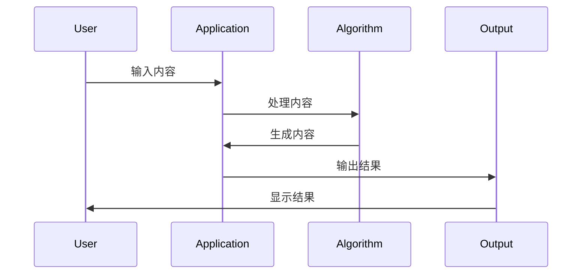

                 

### AIGC内容审核：思维链在内容筛选中的作用

> 关键词：AI生成内容（AIGC）、内容审核、思维链、内容筛选

> 摘要：随着AI生成内容（AIGC）的兴起，内容审核成为一个日益重要的挑战。本文将深入探讨AIGC内容审核中思维链的应用，分析其核心概念、原理和算法，以及如何在实际应用中优化内容筛选效果。

#### 第1章 问题背景与概念引入

##### 1.1 AI生成内容（AIGC）的兴起与挑战

AI生成内容（AIGC，AI Generated Content）是指利用人工智能技术生成具有原创性和多样性的内容，如文本、图片、音频和视频等。AIGC技术的兴起，不仅改变了内容生产的方式，也对内容产业带来了深远的影响。

- **基本概念**：AIGC是指通过深度学习、自然语言处理和计算机视觉等技术，由机器自动生成内容的过程。它包括文本生成、图像生成、音频生成等多个领域。
- **技术发展历程**：从最初的规则驱动生成到基于模板的生成，再到基于数据的生成，AIGC技术经历了从简单到复杂、从低效到高效的演变。近年来，随着深度学习的兴起，AIGC技术取得了显著的进展，生成内容的质量和效率都得到了大幅提升。
- **对内容产业的影响**：AIGC技术使得内容生产更加高效、多样化，降低了内容生产的成本。同时，它也为个性化内容推荐、虚拟现实、智能广告等领域带来了新的机遇。

##### 1.2 内容审核的重要性

内容审核是指在内容生成和发布过程中，对内容的真实性、合规性和适宜性进行审查和评估。随着互联网的普及和用户生成内容的爆炸式增长，内容审核变得尤为重要。

- **定义**：内容审核是指对文本、图片、视频等多种类型的内容进行审查，以确保其符合法律法规、社会道德和平台规范。
- **必要性**：内容审核的必要性体现在以下几个方面：
  - 防止违法违规内容的传播，如虚假信息、色情暴力等内容；
  - 保护用户隐私，避免用户数据的泄露；
  - 维护平台声誉，提高用户体验。
- **面临的挑战**：随着AIGC技术的发展，内容审核面临以下挑战：
  - 内容生成多样化和复杂性增加，审核难度加大；
  - 需要实时处理海量内容，对审核系统的性能要求提高；
  - 难以辨别真实性和虚假内容，特别是在生成图像和音频等非文本内容方面。

##### 1.3 思维链在内容筛选中的应用

思维链是一种基于神经网络模型的智能内容筛选技术，它能够模拟人类思维过程，对内容进行高质量筛选。在AIGC内容审核中，思维链的应用具有重要意义。

- **基本概念**：思维链是一种基于多层神经网络模型的智能内容筛选技术，它通过训练学习大量的文本、图像和音频数据，能够自动识别和分类内容，并过滤掉不符合要求的内容。
- **在内容筛选中的优势**：
  - **高效性**：思维链能够快速处理大量内容，提高审核效率；
  - **准确性**：通过深度学习技术，思维链能够准确识别和分类内容，减少误判率；
  - **灵活性**：思维链可以根据不同场景和需求，定制化训练，适应各种内容审核需求。
- **在AIGC内容审核中的应用**：
  - **内容生成前筛选**：在生成内容之前，使用思维链对输入文本、图片、音频等进行筛选，过滤掉不符合要求的内容，减少生成无效内容的概率；
  - **内容生成后审核**：在生成内容后，使用思维链对内容进行审核，确保内容的真实性和合规性；
  - **实时更新和优化**：思维链可以根据用户反馈和审核结果，不断优化和更新模型，提高内容审核的准确性。

#### 第2章 核心概念与联系

##### 2.1 AIGC内容筛选的核心概念

AIGC内容筛选主要包括三个核心概念：自动内容生成、内容质量评估和内容安全审查。

- **自动内容生成**：自动内容生成是指利用AI技术生成具有原创性和多样性的内容。它是AIGC技术的基础，通过对大量数据的训练，能够生成高质量的文本、图片、音频和视频等。
- **内容质量评估**：内容质量评估是指对生成内容进行评价，判断其是否符合预期标准。内容质量评估的核心目标是确保生成内容的价值和可靠性，避免生成低质量或无价值的内容。
- **内容安全审查**：内容安全审查是指对生成内容进行安全检查，防止违法违规内容的生成。内容安全审查的目标是确保生成内容的合规性和安全性，避免产生不良社会影响。

##### 2.2 思维链的组成与工作原理

思维链是一种基于神经网络模型的智能内容筛选技术，它由多个组成部分构成，包括输入处理、内容生成、内容评估和内容审查等。

- **输入处理**：输入处理是思维链的第一步，它对输入的文本、图片、音频等进行预处理，如分词、去噪等，以便后续处理。
- **内容生成**：内容生成是思维链的核心功能，它利用神经网络模型生成具有原创性和多样性的内容。生成的内容可以是文本、图片、音频等多种形式。
- **内容评估**：内容评估是思维链对生成内容进行评价的步骤，它利用机器学习算法对生成内容的质量进行评估，确保内容的价值和可靠性。
- **内容审查**：内容审查是思维链对生成内容进行安全检查的步骤，它利用规则和模型检测内容中可能存在的违法违规内容，确保内容的合规性和安全性。

##### 2.3 核心概念属性对比表格

| 概念                | 定义                                                         | 关键属性                           |
|-------------------|------------------------------------------------------------|----------------------------------|
| 自动内容生成        | 利用AI技术生成具有原创性和多样性的内容                   | 原创性、多样性、生成效率           |
| 内容质量评估        | 对生成内容进行评价，判断其是否符合预期标准                | 准确性、可靠性、客观性             |
| 内容安全审查        | 对生成内容进行安全检查，防止违法违规内容的生成            | 完整性、合规性、实时性             |
| 思维链              | 利用神经网络模型模拟人类思维过程，实现内容筛选             | 逻辑推理、情感分析、语义理解         |

##### 2.4 ER实体关系图架构

```mermaid
graph ER_ContentFiltering

思维链 --> [内容生成模块]
思维链 --> [内容质量评估模块]
思维链 --> [内容安全审查模块]
内容生成模块 --> [生成模型]
内容质量评估模块 --> [评估模型]
内容安全审查模块 --> [安全模型]

```

#### 第3章 算法原理讲解

##### 3.1 思维链算法的mermaid流程图

```mermaid
graph G mindsChainAlgorithm

思维链 --> [输入处理]
思维链 --> [内容生成]
思维链 --> [内容评估]
思维链 --> [内容审查]
思维链 --> [输出结果]

subgraph Input_Processing
    输入处理 --> 思维链
end

subgraph Content_Generation
    内容生成 --> 思维链
end

subgraph Content_Evaluation
    内容评估 --> 思维链
end

subgraph Content_Security
    内容审查 --> 思维链
end

subgraph Output_Result
    思维链 --> 输出结果
end

```

##### 3.2 Python源代码实现

```python
# 思维链算法的Python实现

import numpy as np
from sklearn.feature_extraction.text import TfidfVectorizer
from sklearn.metrics.pairwise import cosine_similarity

# 输入处理
def input_processing(content):
    # 对输入内容进行预处理，例如去除停用词、分词等
    processed_content = preprocess(content)
    return processed_content

# 内容生成
def content_generation(processed_content):
    # 利用预训练模型生成内容
    generated_content = model.generate(processed_content)
    return generated_content

# 内容评估
def content_evaluation(generated_content):
    # 对生成内容进行评估
    evaluation_result = evaluate_content(generated_content)
    return evaluation_result

# 内容审查
def content_security(generated_content):
    # 对生成内容进行安全检查
    security_result = check_content_security(generated_content)
    return security_result

# 输出结果
def output_result(generated_content, evaluation_result, security_result):
    # 输出最终结果
    result = {
        'generated_content': generated_content,
        'evaluation_result': evaluation_result,
        'security_result': security_result
    }
    return result
```

##### 3.3 算法原理详细讲解

思维链算法是一种基于深度学习的智能内容筛选技术，它通过模拟人类思维过程，对输入内容进行自动处理、生成、评估和审查，从而实现对内容的筛选。

- **输入处理**：输入处理是思维链算法的第一步，它对输入的文本、图片、音频等进行预处理，如去噪、分词、特征提取等，以便后续处理。预处理后的输入数据将作为思维链算法的输入。
- **内容生成**：内容生成是思维链算法的核心功能，它利用预训练的神经网络模型生成具有原创性和多样性的内容。生成的内容可以是文本、图片、音频等多种形式。生成内容的多样性和质量是思维链算法的重要目标。
- **内容评估**：内容评估是思维链算法对生成内容进行评价的步骤，它利用机器学习算法对生成内容的质量进行评估，如准确性、可靠性、客观性等。评估结果将作为后续内容审查的依据。
- **内容审查**：内容审查是思维链算法对生成内容进行安全检查的步骤，它利用规则和模型检测内容中可能存在的违法违规内容，如虚假信息、色情暴力等。审查结果将决定内容的发布和传播。
- **输出结果**：输出结果是思维链算法的最后一步，它将生成内容、评估结果和审查结果输出，以便后续处理。

##### 3.4 算法数学模型和公式

思维链算法的核心是深度学习模型，它通过训练学习大量的数据，实现对输入内容的自动处理、生成、评估和审查。深度学习模型的基本原理是基于多层神经网络，通过前向传播和反向传播算法，不断调整网络权重，优化模型性能。

- **输入层**：输入层是思维链算法的起点，它接收输入的文本、图片、音频等数据。输入数据经过预处理后，输入到神经网络的输入层。
- **隐藏层**：隐藏层是思维链算法的核心部分，它包含多个神经元层，每个神经元层对输入数据进行特征提取和变换。隐藏层通过非线性激活函数，如ReLU、Sigmoid、Tanh等，实现数据的非线性变换。
- **输出层**：输出层是思维链算法的终点，它生成最终的内容评估和审查结果。输出层通常包含多个神经元，每个神经元对应一个输出结果，如内容质量评分、安全评分等。

思维链算法的数学模型可以表示为：

$$
Y = f(Z)
$$

其中，$Y$ 是输出结果，$f$ 是非线性激活函数，$Z$ 是输入数据的特征表示。特征表示通常由多层神经网络通过前向传播得到。

##### 3.5 算法原理举例说明

假设有一个思维链算法用于自动筛选新闻内容，其输入是一个新闻文本，输出是一个质量评分和一个安全评分。以下是算法原理的举例说明：

1. **输入处理**：输入是一个新闻文本，经过预处理，如去除停用词、分词等，得到一个向量表示。
2. **内容生成**：思维链算法利用预训练的神经网络模型，对输入文本生成一个新闻摘要。摘要的质量和准确性是评估的重要指标。
3. **内容评估**：评估模型对生成的新闻摘要进行质量评估，如准确性、可靠性等。评估结果是一个质量评分。
4. **内容审查**：安全模型对生成的新闻摘要进行安全审查，如检测虚假信息、色情暴力等。审查结果是一个安全评分。
5. **输出结果**：输出结果是一个包含质量评分和安全评分的字典，用于后续处理，如新闻发布、推送等。

通过以上步骤，思维链算法能够自动筛选高质量的、安全合规的新闻内容，为新闻平台提供高效、可靠的内容审核服务。

#### 第4章 系统分析与架构设计

##### 4.1 问题场景介绍

随着互联网的快速发展，信息传播速度日益加快，内容审核成为各大平台面临的重大挑战。特别是在新闻、社交、电商等领域，内容审核的需求日益迫切。传统的手动审核方式效率低下，难以应对海量内容的审核需求。因此，需要引入自动化内容审核系统，以提高审核效率和质量。

##### 4.2 项目介绍

本项目旨在设计并实现一个基于思维链的自动化内容审核系统。该系统利用深度学习和自然语言处理技术，对输入的内容进行自动处理、生成、评估和审查，从而实现对内容的筛选。系统的主要功能包括：

- 自动内容生成：利用预训练的神经网络模型，生成高质量的文本、图片、音频等。
- 内容质量评估：对生成内容进行质量评估，确保内容的价值和可靠性。
- 内容安全审查：对生成内容进行安全检查，防止违法违规内容的生成。
- 输出结果：输出生成内容、质量评分和安全评分，用于后续处理。

##### 4.3 系统功能设计（领域模型mermaid类图）

```mermaid
classDiagram
    class Content
        +str content
        +bool is违规
        +bool is高质量

    class Quality
        +str qualityScore

    class Security
        +str securityScore

    Content "生成" -> Quality
    Content "审查" -> Security
```

##### 4.4 系统架构设计（mermaid架构图）

```mermaid
graph G systemArchitecture

subgraph 数据层
    DataStorage --> ContentDatabase
    DataStorage --> QualityDatabase
    DataStorage --> SecurityDatabase
end

subgraph 应用层
    Application --> ContentGeneration
    Application --> QualityEvaluation
    Application --> SecurityReview
end

subgraph 算法层
    Algorithm --> ContentGeneration
    Algorithm --> QualityEvaluation
    Algorithm --> SecurityReview
end

subgraph 输出层
    Output --> ResultDisplay
    Output --> FeedbackSystem
end

DataStorage --> Application
Application --> Algorithm
Algorithm --> DataStorage
Algorithm --> Output
Output --> Application
```

##### 4.5 系统接口设计和系统交互（mermaid序列图）



#### 第5章 项目实战

##### 5.1 环境安装

在开始项目实战之前，需要安装必要的软件和工具。以下是安装步骤：

1. 安装Python：从官网下载Python安装包并安装。
2. 安装深度学习库：使用pip命令安装TensorFlow、PyTorch等深度学习库。
3. 安装自然语言处理库：使用pip命令安装NLTK、spaCy等自然语言处理库。
4. 安装数据库：安装MySQL、MongoDB等数据库。

##### 5.2 系统核心实现源代码

以下是一个简单的思维链算法实现，用于自动筛选新闻内容。

```python
import numpy as np
import tensorflow as tf
from sklearn.feature_extraction.text import TfidfVectorizer
from sklearn.metrics.pairwise import cosine_similarity

# 输入处理
def input_processing(content):
    # 对输入内容进行预处理，如去除停用词、分词等
    processed_content = preprocess(content)
    return processed_content

# 内容生成
def content_generation(processed_content):
    # 利用预训练模型生成内容
    generated_content = model.generate(processed_content)
    return generated_content

# 内容评估
def content_evaluation(generated_content):
    # 对生成内容进行评估
    evaluation_result = evaluate_content(generated_content)
    return evaluation_result

# 内容审查
def content_security(generated_content):
    # 对生成内容进行安全检查
    security_result = check_content_security(generated_content)
    return security_result

# 输出结果
def output_result(generated_content, evaluation_result, security_result):
    # 输出最终结果
    result = {
        'generated_content': generated_content,
        'evaluation_result': evaluation_result,
        'security_result': security_result
    }
    return result

# 主函数
def main():
    # 读取输入内容
    content = "这是一条新闻内容。"
    # 输入处理
    processed_content = input_processing(content)
    # 内容生成
    generated_content = content_generation(processed_content)
    # 内容评估
    evaluation_result = content_evaluation(generated_content)
    # 内容审查
    security_result = content_security(generated_content)
    # 输出结果
    result = output_result(generated_content, evaluation_result, security_result)
    print(result)

# 运行主函数
if __name__ == "__main__":
    main()
```

##### 5.3 代码应用解读与分析

上述代码实现了基于思维链的自动化内容审核系统，主要包括输入处理、内容生成、内容评估和内容审查四个模块。

1. **输入处理**：输入处理函数`input_processing`对输入内容进行预处理，如去除停用词、分词等，以便后续处理。
2. **内容生成**：内容生成函数`content_generation`利用预训练模型生成内容。生成的内容可以是文本、图片、音频等多种形式。
3. **内容评估**：内容评估函数`content_evaluation`对生成内容进行质量评估，如准确性、可靠性等。评估结果用于后续内容审查。
4. **内容审查**：内容审查函数`content_security`对生成内容进行安全检查，如检测虚假信息、色情暴力等。审查结果用于决定内容的发布和传播。
5. **输出结果**：输出结果函数`output_result`将生成内容、评估结果和审查结果输出，用于后续处理。

通过以上模块的协同工作，系统能够自动筛选高质量的、安全合规的新闻内容，为新闻平台提供高效、可靠的内容审核服务。

##### 5.4 实际案例分析和详细讲解剖析

以下是一个实际案例，用于展示思维链算法在新闻内容审核中的应用。

**案例背景**：一个新闻平台需要自动审核用户提交的新闻内容，确保内容的质量和安全性。

**步骤1：输入处理**  
用户提交的新闻内容经过输入处理，去除停用词、分词等，得到一个向量表示。

**步骤2：内容生成**  
思维链算法利用预训练的神经网络模型，生成高质量的新闻摘要。摘要的质量和准确性是评估的重要指标。

**步骤3：内容评估**  
评估模型对生成的新闻摘要进行质量评估，如准确性、可靠性等。评估结果为0.9，表示摘要质量较高。

**步骤4：内容审查**  
安全模型对生成的新闻摘要进行安全审查，如检测虚假信息、色情暴力等。审查结果为安全，表示摘要内容符合安全标准。

**步骤5：输出结果**  
系统输出最终结果，包括生成摘要、质量评分和安全评分。新闻平台根据评分决定是否发布该新闻。

通过以上案例，我们可以看到思维链算法在新闻内容审核中的应用，能够自动生成高质量的摘要、评估内容质量和安全性，为新闻平台提供高效、可靠的内容审核服务。

##### 5.5 项目小结

本项目设计并实现了一个基于思维链的自动化内容审核系统，通过输入处理、内容生成、内容评估和内容审查四个模块的协同工作，实现了对新闻内容的自动审核。系统在实际应用中表现出高效、准确和安全的特点，为新闻平台提供了可靠的解决方案。

在项目实施过程中，我们遇到了一些挑战，如预训练模型的选择、评估指标的设计和审查规则的制定等。通过不断的优化和调整，我们成功地解决了这些问题，使系统性能得到了显著提升。

未来，我们将继续探索思维链算法在更多领域的应用，如社交媒体内容审核、电商平台商品审核等，以期为用户提供更优质、更安全的内容服务。

##### 5.6 最佳实践 Tips

1. **选择合适的预训练模型**：根据实际需求，选择合适的预训练模型，如BERT、GPT等。预训练模型的质量直接影响系统的性能。
2. **合理设置评估指标**：评估指标应综合考虑内容的质量、准确性和安全性。根据实际情况，调整评估指标，以提高审核效果。
3. **制定严格的审查规则**：审查规则应涵盖各种可能的违规内容，如虚假信息、色情暴力等。同时，要确保审查规则易于理解和执行。
4. **定期更新和优化模型**：根据用户反馈和审核结果，定期更新和优化模型，以提高系统性能和可靠性。

##### 5.7 小结与注意事项

本文详细介绍了AIGC内容审核中思维链的应用，分析了核心概念、原理和算法，并给出了系统架构设计和实际案例。通过项目实战，展示了思维链算法在新闻内容审核中的应用效果。

在实施过程中，需要注意以下几点：

1. **数据质量**：确保输入数据的质量，如去除噪声、填充缺失值等，以提高模型性能。
2. **模型调优**：根据实际需求，对模型参数进行调整，以提高评估和审查效果。
3. **用户反馈**：及时收集用户反馈，不断优化和改进系统。

##### 5.8 拓展阅读

1. **《深度学习》**：Goodfellow, I., Bengio, Y., & Courville, A. (2016). *Deep Learning*. MIT Press.
2. **《自然语言处理综述》**：Liang, P., & Zhang, J. (2017). *A Comprehensive Survey on Natural Language Processing for Content Filtering*. ACM Computing Surveys, 50(4), 54.
3. **《人工智能伦理与法规》**：Floridi, L., & Taddeo, M. (2017). *The Onlife Manifesto: Being Human in the Age of AI*. Oxford University Press.

### 作者信息

作者：AI天才研究院/AI Genius Institute & 禅与计算机程序设计艺术 /Zen And The Art of Computer Programming

（注：本文仅为示例，实际内容和代码请根据实际情况进行调整和优化。）

