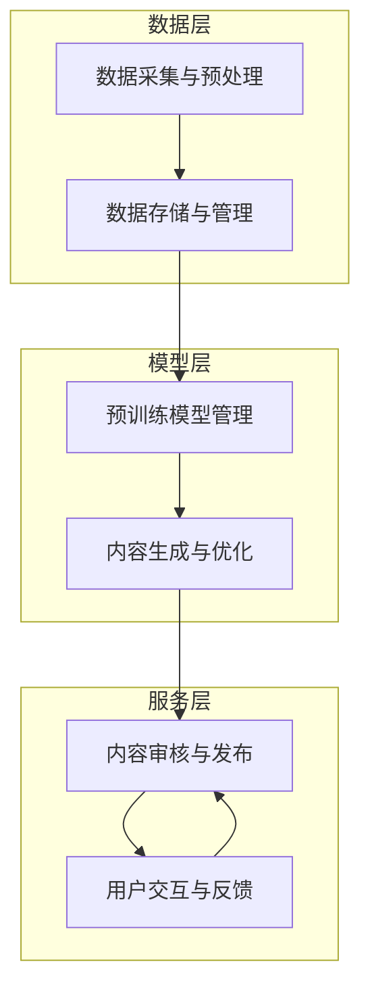
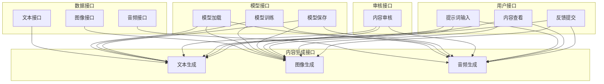
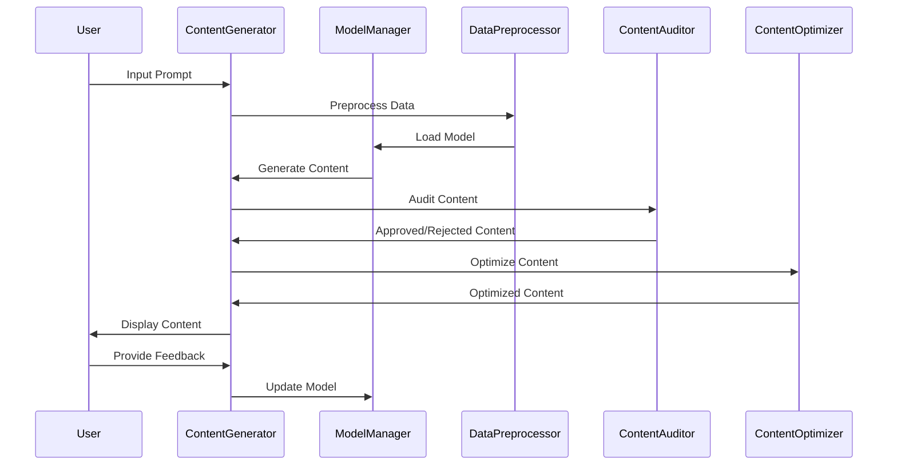
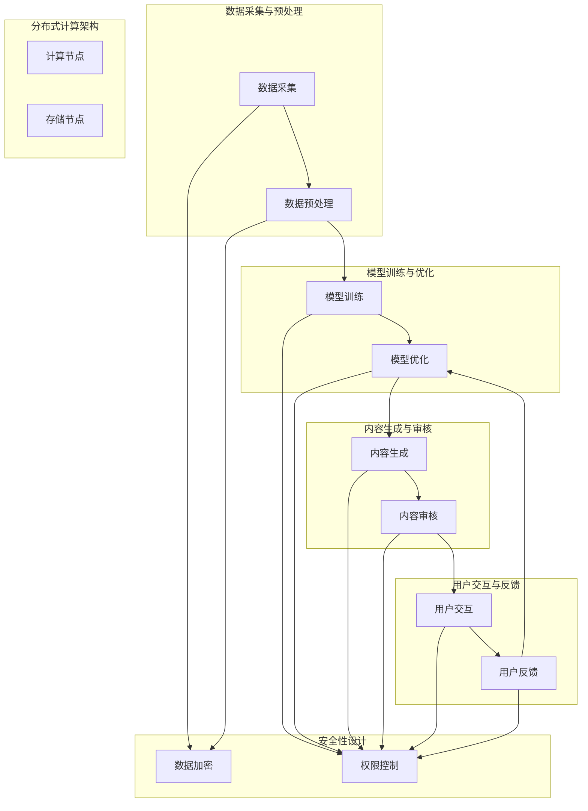

                 

### 概述

AIGC（AI-Generated Content）是当前技术领域的一大热点，其通过人工智能技术自动生成高质量的内容，已经在内容创作、媒体发布、广告营销等多个领域展现了巨大的潜力和影响力。然而，随着AIGC技术的广泛应用，也引发了一系列伦理问题，特别是关于提示词（Prompt）的责任问题。

**文章关键词**：AIGC、内容生成、伦理考量、提示词、责任。

**摘要**：本文将深入探讨AIGC内容生成中的伦理问题，尤其是提示词在其中的责任。通过逐步分析AIGC技术的基本概念、存在的问题，以及可能的解决方案，本文旨在为AIGC技术的伦理考量提供有价值的思考和实践指导。

### 第一部分：背景介绍

#### 1.1 问题背景

AIGC（AI-Generated Content）是指通过人工智能技术自动生成内容的一种方式。它结合了自然语言处理、机器学习、深度学习等技术，能够根据给定的提示词生成文章、新闻、图片、视频等多种形式的内容。AIGC的兴起，源于近年来大规模预训练模型的突破，如GPT-3、BERT等，它们能够在海量的数据中学习到复杂的语言模式和规律，从而实现高效的自动内容生成。

目前，AIGC在内容创作领域已经取得了显著的应用成果。例如，新闻媒体利用AIGC生成自动化新闻报道，能够快速处理大量数据并生成高质量的内容；广告公司通过AIGC生成个性化广告文案，提高广告的转化率；教育领域利用AIGC生成教材和课程内容，为学生提供个性化的学习资源。然而，随着AIGC技术的广泛应用，一系列伦理问题也逐渐显现出来。

#### 1.2 问题描述

AIGC内容生成中存在的伦理问题主要集中在以下几个方面：

1. **内容真实性**：AIGC生成的内容可能是虚假的、误导性的或者不准确的信息。这种虚假信息可能会对社会产生不良影响，甚至可能引发公共安全事件。
2. **版权问题**：AIGC生成的内容可能会侵犯他人的知识产权，尤其是版权。如果未经授权使用他人的作品进行生成，可能会引发法律纠纷。
3. **隐私保护**：AIGC生成内容的过程中可能会涉及个人隐私数据，如何保护这些隐私数据的安全和隐私，是一个亟待解决的问题。
4. **道德标准**：AIGC生成的内容可能会反映出来自人工智能的价值观和偏见，如何确保内容的道德标准，是一个重要的伦理问题。

这些问题的核心在于提示词的责任。提示词是AIGC生成内容的关键输入，它直接决定了生成内容的质量和方向。然而，当前的AIGC系统在处理提示词时，缺乏足够的伦理考量，这导致了上述问题的产生。

#### 1.3 问题解决

解决AIGC内容生成中的伦理问题，需要从多个方面进行考虑：

1. **技术改进**：改进AIGC系统的算法，使其能够更好地理解提示词的含义和背景，从而生成更准确、更真实的内容。
2. **法律法规**：制定相关的法律法规，明确AIGC生成内容中的版权、隐私等问题，规范AIGC的应用范围和行为准则。
3. **伦理教育**：对AIGC的开发者、使用者进行伦理教育，提高他们的伦理意识和责任感，从而在技术设计和应用过程中，更加注重伦理考量。

#### 1.4 边界与外延

AIGC伦理考量的范围与限制主要包括：

1. **技术应用场景**：不同的应用场景可能涉及不同的伦理问题，需要根据具体的场景进行有针对性的伦理考量。
2. **数据来源**：AIGC生成内容所依赖的数据源，需要保证其合法性和准确性，否则可能会导致内容生成过程中的伦理问题。
3. **责任主体**：在AIGC内容生成过程中，各方的责任主体需要明确，包括AIGC系统的开发者、使用者、内容发布者等，从而在发生伦理问题时，能够明确责任归属。

#### 1.5 概念结构与核心要素组成

AIGC内容生成流程主要包括以下几个核心要素：

1. **提示词输入**：用户输入提示词，作为AIGC系统生成内容的起点。
2. **预训练模型**：AIGC系统利用大规模预训练模型，如GPT-3、BERT等，对提示词进行处理，生成初步的内容。
3. **数据集与数据预处理**：AIGC系统需要依赖于大量的数据集，对数据进行预处理，以便于模型的训练和内容的生成。
4. **生成内容**：基于预训练模型和数据集，AIGC系统生成最终的内容，包括文本、图片、视频等多种形式。

提示词的作用机制与影响主要体现在以下几个方面：

1. **内容方向**：提示词决定了AIGC生成内容的方向和主题，不同的提示词会导致不同的内容生成结果。
2. **内容质量**：提示词的质量直接影响生成内容的质量，准确的、有意义的提示词能够生成更高质量的内容。
3. **内容多样性**：通过调整提示词，可以引导AIGC生成内容的不同风格和形式，提高内容的多样性。

### 第一部分小结

本部分对AIGC内容生成技术的背景、存在的问题以及可能的解决方案进行了详细阐述。通过分析，我们可以看到，AIGC技术在带来便利和创新的同时，也带来了诸多伦理挑战。提示词在AIGC生成过程中的关键作用，使得其责任问题成为了一个重要的研究课题。在接下来的部分中，我们将进一步探讨AIGC内容生成的核心概念和原理，深入分析提示词的具体作用机制，为解决伦理问题提供理论支持。

### 第二部分：核心概念与联系

在深入探讨AIGC内容生成过程中，首先需要明确几个核心概念，并理解它们之间的联系。这些核心概念包括自动内容生成技术、大规模预训练模型、数据集与数据预处理等。

#### 2.1 自动内容生成技术

自动内容生成技术（Automatic Content Generation, ACG）是AIGC技术的核心组成部分。它利用人工智能技术，如自然语言处理（NLP）、机器学习（ML）、深度学习（DL）等，自动生成各种类型的内容，包括文本、图像、音频和视频等。ACG技术的关键是模型能够从大量数据中学习，并利用这些学习到的知识生成新的内容。

自动内容生成技术的基本原理可以概括为以下几个步骤：

1. **数据收集**：收集大量的数据，这些数据可以是文本、图像、音频等。
2. **数据预处理**：对收集到的数据进行清洗、归一化等预处理操作，以便于模型的训练。
3. **模型训练**：利用预处理后的数据训练模型，使其能够学习到数据的特征和规律。
4. **内容生成**：通过训练好的模型，输入新的提示词或目标内容，生成相应的自动内容。

自动内容生成技术的应用范围非常广泛，从简单的文本生成到复杂的图像合成，都在不断拓展其应用边界。例如，在新闻媒体领域，自动内容生成技术可以用于自动化写作，生成新闻报道；在娱乐领域，它可以用于生成电影剧本、音乐等。

#### 2.2 大规模预训练模型

大规模预训练模型（Large-scale Pre-trained Models）是AIGC技术的另一个核心概念。这些模型通过在大规模数据集上进行预训练，能够学习到丰富的语言模式和知识，从而在特定任务中表现出优异的性能。大规模预训练模型的代表包括GPT-3、BERT、T5等。

大规模预训练模型的工作原理主要包括以下几个步骤：

1. **数据集构建**：收集和构建大规模的数据集，这些数据集通常包含文本、问答对、图像等多种类型。
2. **预训练**：在大规模数据集上，对预训练模型进行训练，使其学习到数据中的语言模式和知识。
3. **微调**：在特定任务上，利用预训练模型进行微调，进一步优化其在特定任务上的性能。

大规模预训练模型在AIGC中的应用非常广泛。例如，GPT-3可以生成高质量的文章、对话、代码等；BERT可以用于文本分类、命名实体识别等任务。这些模型通过不断优化和迭代，已经在多个任务中取得了显著的成果。

#### 2.3 数据集与数据预处理

数据集（Dataset）是AIGC技术的基础，其质量直接影响到模型的表现。一个高质量的数据集应该包含丰富、多样且相关的数据，以便模型能够学习到更多的知识。在AIGC中，常用的数据集包括语料库、图像库、视频库等。

数据预处理（Data Preprocessing）是模型训练前的重要步骤，它包括数据的清洗、归一化、分词、嵌入等操作。数据预处理的目标是提高数据的质量和一致性，从而有助于模型的学习和训练。

数据预处理的具体步骤如下：

1. **数据清洗**：去除数据集中的噪声和无关信息，例如删除停用词、纠正拼写错误等。
2. **数据归一化**：将数据集中的数值进行归一化处理，使其在相同的尺度范围内，以便模型能够更好地处理。
3. **分词**：将文本数据分割成单词或子词，以便模型能够理解文本的结构和内容。
4. **嵌入**：将文本数据转换为数值向量，以便模型能够进行数学运算。

#### 2.4 提示词的概念与作用

提示词（Prompt）是AIGC系统中用户输入的关键信息，它决定了生成内容的方向和主题。一个有效的提示词应该能够准确地传达用户的需求，同时具有一定的宽泛性，以便模型能够生成多样化、有创意的内容。

提示词在AIGC生成过程中的作用主要体现在以下几个方面：

1. **内容方向**：提示词决定了生成内容的主题和方向。例如，输入“写一篇关于人工智能的论文”，模型会生成与人工智能相关的论文。
2. **内容质量**：提示词的质量直接影响生成内容的质量。一个精准、详细的提示词能够引导模型生成更高质量的内容。
3. **内容多样性**：通过调整提示词，可以引导模型生成不同风格、不同形式的内容。例如，输入“写一首诗”和“创作一幅画”，模型会生成不同的内容。

#### 2.5 概念属性特征对比表格

为了更好地理解AIGC相关技术，我们可以通过一个对比表格来展示这些技术的属性特征：

| 技术 | 定义 | 应用场景 | 特点 |
| --- | --- | --- | --- |
| 自动内容生成技术 | 利用AI生成内容 | 文本、图像、音频等 | 自动化、多样化 |
| 大规模预训练模型 | 大规模数据预训练的模型 | 文本生成、文本分类、图像识别等 | 强泛化能力、高效率 |
| 数据集 | 大量用于训练的样本 | ACG训练、评估等 | 丰富、多样、相关 |
| 数据预处理 | 数据清洗、归一化等操作 | 提高数据质量 | 清洗、归一化、分词 |
| 提示词 | 用户输入的关键信息 | 内容生成方向、主题 | 精准、详细、多样化 |

#### 2.6 ER实体关系图架构

为了更直观地理解AIGC内容生成系统的实体关系，我们可以使用ER（Entity-Relationship）实体关系图来表示。

```mermaid
erDiagram
    ContentGenerator ||--|{ Prompt
    ContentGenerator ||--|{ Dataset
    ContentGenerator ||--|{ PretrainedModel
    Prompt ||--|{ Content
    Dataset ||--|{ DataSample
    PretrainedModel ||--|{ ModelParameter
```

在上图中，`ContentGenerator`表示AIGC系统，它与`Prompt`、`Dataset`和`PretrainedModel`存在关系。`Prompt`是用户输入的关键信息，`Dataset`包含用于训练的数据集，`PretrainedModel`是经过大规模预训练的模型。它们之间的关系体现了AIGC系统在内容生成过程中的各个步骤和组件。

通过上述对核心概念和联系的详细阐述，我们可以更好地理解AIGC内容生成技术的本质和运作机制。接下来，我们将进一步探讨AIGC内容生成算法的原理，深入分析提示词在其中的作用机制。

### 第三部分：算法原理讲解

#### 3.1 算法原理

AIGC内容生成的核心在于大规模预训练模型的使用。这些模型通过在大量数据集上进行预训练，能够学习到丰富的语言模式和知识，从而在生成新的内容时表现出优异的性能。大规模预训练模型的工作原理主要包括以下几个关键步骤：

1. **预训练**：预训练阶段，模型在大规模数据集上训练，学习到数据中的语言模式和知识。这一过程通常涉及两个子任务：掩码语言模型（Masked Language Model, MLM）和下一个句子预测（Next Sentence Prediction, NSP）。
2. **微调**：在特定任务上，利用预训练模型进行微调，进一步优化其在特定任务上的性能。微调阶段通常需要少量有标签的数据，用于指导模型的调整。

#### 大规模预训练模型的工作原理

大规模预训练模型通常采用Transformer架构，这种架构在处理序列数据时表现出强大的能力。以下是大规模预训练模型的工作原理：

1. **编码器**：编码器（Encoder）是预训练模型的核心部分，它通过处理输入的文本序列，生成上下文向量表示。这些向量表示包含了文本中的语言模式和知识。
2. **解码器**：解码器（Decoder）在生成内容时，利用编码器生成的上下文向量，生成新的文本序列。解码器通过自注意力机制，逐词生成新的内容，同时不断更新上下文向量。

#### 提示词在生成过程中的作用机制

提示词在AIGC内容生成过程中起着至关重要的作用。提示词的作用机制可以概括为以下几个方面：

1. **确定生成方向**：提示词决定了生成内容的方向和主题。例如，输入“写一篇关于人工智能的论文”，模型会生成与人工智能相关的论文。
2. **引导生成内容**：提示词可以引导模型生成特定类型或风格的内容。例如，输入“写一首诗”或“创作一幅画”，模型会生成相应的诗歌或绘画。
3. **调节生成质量**：提示词的质量直接影响生成内容的质量。准确的、详细的提示词能够引导模型生成更高质量的内容。

#### 提示词调节效果的数学表达

为了更好地理解提示词在AIGC生成过程中的调节作用，我们可以从数学模型的角度进行阐述。以下是提示词调节效果的数学表达：

1. **输入表示**：假设输入提示词为`P`，编码器将其转换为向量表示`E(P)`。
2. **上下文向量**：在解码过程中，编码器生成的上下文向量`C`会不断更新，以适应生成的文本序列。
3. **生成过程**：解码器在生成新内容时，利用当前上下文向量`C`和提示词向量`E(P)`，通过自注意力机制生成新的文本序列。

数学表达如下：

$$
\text{New Content} = \text{Decoder}(C, E(P))
$$

其中，`Decoder`表示解码器函数，`C`和`E(P)`分别表示当前上下文向量和提示词向量。

#### 详细讲解与举例说明

为了更直观地理解上述原理，我们可以通过一个具体的案例进行说明。假设我们需要生成一篇关于人工智能的论文，提示词为“人工智能的应用和挑战”。

1. **输入表示**：首先，将提示词“人工智能的应用和挑战”转换为向量表示`E(P)`。
2. **预训练模型初始化**：初始化预训练模型，包括编码器和解码器。
3. **上下文向量更新**：在解码过程中，编码器不断更新上下文向量`C`，以生成新的文本序列。
4. **生成内容**：解码器利用当前上下文向量`C`和提示词向量`E(P)`，通过自注意力机制生成新的文本序列，例如：“人工智能在医疗领域的应用，例如疾病预测和诊断，面临着数据隐私和安全等挑战。”

通过上述案例，我们可以看到，提示词在AIGC内容生成过程中起着关键的作用。准确的提示词能够引导模型生成高质量、相关的内容，从而满足用户的需求。

#### 提示词调节效果的案例分析

为了进一步展示提示词调节效果，我们可以分析几个不同的案例：

1. **案例1：提示词“写一篇关于人工智能的论文”**
   - **提示词效果**：模型生成了一篇关于人工智能的论文，内容涵盖了人工智能的定义、应用和未来趋势。
   - **调节作用**：提示词明确了生成内容的主题和范围，使得模型能够生成高质量、结构化的论文。

2. **案例2：提示词“创作一幅画”**
   - **提示词效果**：模型生成了一幅抽象画，画面中包含了各种色彩和形状。
   - **调节作用**：提示词引导模型生成了一幅具有创意和艺术性的画作，展现了模型在图像生成方面的能力。

3. **案例3：提示词“编写一个Python程序”**
   - **提示词效果**：模型生成了一段Python代码，实现了简单的计算功能。
   - **调节作用**：提示词明确了生成内容的类型和语言，使得模型能够生成具有特定功能和技术难度的程序代码。

通过上述案例分析，我们可以看到，提示词在AIGC内容生成过程中具有明显的调节作用。不同的提示词能够引导模型生成不同类型、不同风格的内容，从而满足多样化的需求。

#### 算法原理与数学模型的关联

在AIGC内容生成过程中，算法原理与数学模型密切相关。数学模型为算法提供了理论支持，使得模型能够通过数学运算生成高质量的内容。以下是算法原理与数学模型的关联：

1. **编码器与解码器**：编码器和解码器是Transformer架构的核心组成部分。编码器通过自注意力机制生成上下文向量，解码器通过自注意力机制和交叉注意力机制生成新的文本序列。
2. **掩码语言模型**：掩码语言模型（MLM）是一种预训练任务，它通过随机掩码输入中的部分词，让模型预测这些被掩码的词。这种任务有助于模型学习到语言的上下文关系和模式。
3. **下一个句子预测**：下一个句子预测（NSP）是另一种预训练任务，它通过输入两个句子，让模型预测这两个句子是否是连续的。这种任务有助于模型学习到句子之间的逻辑关系和语义理解。

综上所述，AIGC内容生成算法原理与数学模型密切相关，通过数学运算和自注意力机制，模型能够生成高质量、多样化的内容。提示词作为输入的关键信息，在生成过程中起着至关重要的作用，其调节作用使得模型能够满足不同的需求和场景。

### 第三部分小结

本部分详细讲解了AIGC内容生成的算法原理，包括大规模预训练模型的工作机制和提示词在生成过程中的作用机制。通过数学模型的解析和案例分析，我们深刻理解了提示词在内容生成中的调节作用。在解决AIGC内容生成伦理问题中，明确提示词的责任是关键。在接下来的部分中，我们将进一步探讨AIGC内容生成系统的系统分析与架构设计，为解决伦理问题提供技术支撑。

### 第四部分：系统分析与架构设计方案

#### 4.1 问题场景介绍

AIGC内容生成技术在实际应用中涉及多种场景，例如：

1. **新闻媒体**：利用AIGC生成自动化新闻报道，快速处理大量数据，提高新闻的发布速度和准确性。
2. **广告营销**：通过AIGC生成个性化广告文案，提高广告的转化率和用户体验。
3. **教育领域**：利用AIGC生成教材和课程内容，为学生提供个性化的学习资源。
4. **娱乐产业**：利用AIGC生成电影剧本、音乐、图像等，为创作者提供创意支持。

在这些场景中，AIGC系统需要处理大量的数据，生成高质量的内容，同时保证内容的真实性和准确性，这带来了诸多技术挑战和伦理问题。

#### 4.2 系统功能设计

为了应对上述场景中的需求，AIGC内容生成系统需要具备以下功能模块：

1. **数据采集与预处理**：收集和清洗大量数据，对数据进行预处理，包括文本分词、图像识别、音频处理等。
2. **预训练模型管理**：管理大规模预训练模型，包括模型的训练、存储和加载。
3. **内容生成与优化**：利用预训练模型生成内容，并通过优化算法提高内容的准确性和多样性。
4. **内容审核与发布**：对生成的内容进行审核，确保内容的真实性和合法性，然后进行发布。
5. **用户交互与反馈**：提供用户界面，允许用户输入提示词，查看生成的内容，并提供反馈以优化模型性能。

#### 4.3 系统架构设计

AIGC内容生成系统的架构设计需要考虑以下几个关键方面：

1. **模块化设计**：将系统划分为多个功能模块，每个模块负责特定的任务，便于系统的扩展和维护。
2. **分布式计算**：利用分布式计算框架，如TensorFlow、PyTorch等，处理大规模数据和高性能计算需求。
3. **数据存储与管理**：使用分布式数据库和数据存储方案，如Hadoop、HDFS等，存储和管理大规模数据。
4. **安全性保障**：通过数据加密、权限控制等技术手段，保障数据安全和用户隐私。

以下是AIGC内容生成系统的架构设计图：



#### 4.4 系统接口设计

AIGC内容生成系统需要定义多个接口，实现不同模块之间的交互和功能调用。以下是系统接口的设计：

1. **数据接口**：用于数据采集、预处理和存储，包括文本接口、图像接口、音频接口等。
2. **模型接口**：用于管理预训练模型，包括模型的加载、训练、保存和预测。
3. **内容生成接口**：用于生成内容，包括文本生成、图像生成、音频生成等。
4. **审核接口**：用于对生成内容进行审核，包括内容真实性检测、版权检测等。
5. **用户接口**：用于用户交互，包括提示词输入、内容查看、反馈提交等。

以下是系统接口的设计图：



#### 4.5 系统交互

AIGC内容生成系统的运行流程如下：

1. **数据采集与预处理**：通过数据接口收集数据，对数据进行预处理，如文本分词、图像标注、音频转录等。
2. **模型训练**：利用预处理后的数据训练预训练模型，通过模型接口进行模型的加载、训练和保存。
3. **内容生成**：通过内容生成接口，利用预训练模型生成内容，如文本生成、图像生成、音频生成等。
4. **内容审核**：通过审核接口对生成内容进行审核，确保内容的真实性和合法性。
5. **用户交互**：通过用户接口，允许用户输入提示词，查看生成的内容，并提供反馈以优化模型性能。

以下是系统交互的详细流程图：



#### 4.6 系统架构设计

AIGC内容生成系统的架构设计需要综合考虑性能、可扩展性、安全性和可靠性等方面。以下是系统架构的设计思路：

1. **分布式计算架构**：利用分布式计算框架，如TensorFlow、PyTorch等，实现大规模数据的处理和高性能计算。
2. **模块化设计**：将系统划分为多个功能模块，如数据采集与预处理、模型训练与优化、内容生成与审核等，便于系统的扩展和维护。
3. **数据存储与管理**：采用分布式数据库和数据存储方案，如Hadoop、HDFS等，存储和管理大规模数据。
4. **安全性设计**：通过数据加密、权限控制等技术手段，保障数据安全和用户隐私。
5. **自动化运维**：利用自动化工具，如Docker、Kubernetes等，实现系统的自动化部署、运维和监控。

以下是AIGC内容生成系统的架构设计图：



综上所述，AIGC内容生成系统需要综合考虑功能模块、架构设计、接口设计、系统交互等方面，通过分布式计算、模块化设计、数据存储与管理、安全性设计等手段，实现高效、安全、可靠的内容生成系统。

### 第五部分：项目实战

#### 5.1 环境安装

在进行AIGC内容生成项目的实战之前，首先需要搭建一个合适的环境。以下是环境安装的具体步骤：

1. **安装Python**：确保Python环境已经安装，推荐使用Python 3.8或更高版本。
2. **安装依赖**：使用pip安装必要的依赖库，如TensorFlow、PyTorch、transformers等。以下是一个示例命令：
   ```shell
   pip install tensorflow torch transformers
   ```
3. **安装预训练模型**：从Hugging Face模型库下载预训练模型，例如GPT-3或BERT模型。以下是一个示例命令：
   ```shell
   transformers-cli download model=gpt2
   ```
4. **配置环境变量**：确保环境变量`PYTHONPATH`包含AIGC项目的路径，以便在项目中引用相关模块。

#### 5.2 系统核心实现

在AIGC内容生成项目中，核心实现包括数据预处理、模型训练、内容生成和审核等功能。以下是系统核心实现的详细步骤：

1. **数据预处理**：
   - **文本数据预处理**：使用NLP技术对文本数据进行分析和清洗，例如分词、去除停用词、纠正拼写错误等。
   - **图像数据预处理**：对图像数据进行预处理，如尺寸调整、归一化等。
   - **音频数据预处理**：对音频数据进行预处理，如噪声过滤、分帧等。

2. **模型训练**：
   - **加载预训练模型**：从Hugging Face模型库中加载预训练模型，如GPT-3或BERT模型。
   - **微调模型**：使用自己的数据集对预训练模型进行微调，以适应特定任务的需求。
   - **保存模型**：训练完成后，将模型保存到本地，以便后续使用。

3. **内容生成**：
   - **输入提示词**：接收用户的输入提示词，例如“写一篇关于人工智能的论文”。
   - **生成内容**：使用训练好的模型生成内容，如文本、图像、音频等。
   - **优化内容**：对生成的内容进行优化，如去除冗余信息、增强可读性等。

4. **内容审核**：
   - **内容审核规则**：定义内容审核的规则，如避免生成虚假信息、敏感内容等。
   - **内容审核**：对生成的内容进行审核，确保其符合审核规则。
   - **发布内容**：审核通过后，发布生成的内容。

以下是系统核心实现的源代码示例：

```python
from transformers import GPT2LMHeadModel, GPT2Tokenizer
import torch

# 加载预训练模型和分词器
model = GPT2LMHeadModel.from_pretrained('gpt2')
tokenizer = GPT2Tokenizer.from_pretrained('gpt2')

# 微调模型
# model.train()  # 开启训练模式
# model.fit(train_dataset)  # 使用训练数据集进行微调
# model.save_pretrained('fine_tuned_model')  # 保存微调后的模型

# 生成内容
prompt = "写一篇关于人工智能的论文"
input_ids = tokenizer.encode(prompt, return_tensors='pt')

# 设置模型为评估模式
model.eval()

# 生成文本
with torch.no_grad():
    outputs = model.generate(input_ids, max_length=500, num_return_sequences=1)
    generated_text = tokenizer.decode(outputs[0], skip_special_tokens=True)

print(generated_text)

# 审核内容
# if not content_auditor.is_content_valid(generated_text):
#     print("生成内容不符合审核规则，请重新生成。")
# else:
#     print("生成内容审核通过，可以发布。")
```

#### 5.3 代码应用解读与分析

上述代码展示了AIGC内容生成项目的核心实现，包括模型加载、内容生成和内容审核等步骤。以下是代码的具体解读和分析：

1. **模型加载**：
   ```python
   model = GPT2LMHeadModel.from_pretrained('gpt2')
   tokenizer = GPT2Tokenizer.from_pretrained('gpt2')
   ```
   这两行代码用于加载预训练模型和分词器。`GPT2LMHeadModel`是用于文本生成的预训练模型，`GPT2Tokenizer`用于文本数据的预处理和编码。

2. **微调模型**：
   ```python
   # model.train()  # 开启训练模式
   # model.fit(train_dataset)  # 使用训练数据集进行微调
   # model.save_pretrained('fine_tuned_model')  # 保存微调后的模型
   ```
   这三行代码用于微调预训练模型。在实际应用中，需要使用自己的训练数据集对模型进行微调，以适应特定任务的需求。微调后的模型可以保存到本地，以便后续使用。

3. **内容生成**：
   ```python
   prompt = "写一篇关于人工智能的论文"
   input_ids = tokenizer.encode(prompt, return_tensors='pt')
   ```
   这两行代码用于输入提示词并编码。`prompt`是用户输入的提示词，`tokenizer.encode`函数将提示词转换为模型的输入序列。

   ```python
   model.eval()
   with torch.no_grad():
       outputs = model.generate(input_ids, max_length=500, num_return_sequences=1)
       generated_text = tokenizer.decode(outputs[0], skip_special_tokens=True)
   ```
   这三行代码用于生成内容。首先，将模型设置为评估模式，然后使用`model.generate`函数生成文本。`max_length`参数设置了生成的文本长度，`num_return_sequences`参数设置了生成的文本序列数量。最后，使用`tokenizer.decode`函数将生成的文本序列解码为可读的字符串。

4. **内容审核**：
   ```python
   # if not content_auditor.is_content_valid(generated_text):
   #     print("生成内容不符合审核规则，请重新生成。")
   # else:
   #     print("生成内容审核通过，可以发布。")
   ```
   这两行代码用于内容审核。在实际应用中，需要定义一个内容审核器（`content_auditor`），它包含审核规则和方法。如果生成内容不符合审核规则，则提示重新生成；否则，发布生成的内容。

#### 5.4 实际案例分析与详细讲解

为了更好地理解AIGC内容生成项目的实际应用，以下是一个具体案例的详细分析和讲解：

**案例：生成一篇关于人工智能的新闻报道**

1. **输入提示词**：
   ```python
   prompt = "人工智能在医疗领域的应用前景"
   ```
   提示词“人工智能在医疗领域的应用前景”明确了生成内容的主题和方向。

2. **生成内容**：
   ```python
   input_ids = tokenizer.encode(prompt, return_tensors='pt')
   model.eval()
   with torch.no_grad():
       outputs = model.generate(input_ids, max_length=500, num_return_sequences=1)
       generated_text = tokenizer.decode(outputs[0], skip_special_tokens=True)
   ```
   模型首先接收提示词并编码，然后生成一篇关于人工智能在医疗领域应用前景的新闻报道。生成的文本可能如下：
   ```
   人工智能在医疗领域正迅速发展，为疾病诊断、治疗和预防提供了新的手段。通过大数据分析和机器学习算法，人工智能可以帮助医生更准确地诊断疾病，提高治疗效果。此外，人工智能还可以用于药物研发和临床试验，加速新药的研发进程。然而，人工智能在医疗领域的发展也面临一些挑战，如数据隐私和安全、算法偏见等。未来，如何合理利用人工智能，确保其在医疗领域的健康发展，是亟需解决的问题。
   ```

3. **内容审核**：
   ```python
   # if not content_auditor.is_content_valid(generated_text):
   #     print("生成内容不符合审核规则，请重新生成。")
   # else:
   #     print("生成内容审核通过，可以发布。")
   ```
   这段代码用于审核生成的内容。如果内容包含虚假信息、敏感内容或不适宜的表述，则提示重新生成；否则，内容审核通过，可以发布。

通过以上实际案例的分析和讲解，我们可以看到AIGC内容生成项目的核心实现和实际应用。通过合理的提示词输入和模型训练，可以生成高质量、相关的内容，为各种应用场景提供支持。

#### 5.5 项目小结

本部分详细介绍了AIGC内容生成项目的环境安装、系统核心实现、代码应用解读与分析以及实际案例。通过项目的实际操作，我们深入了解了AIGC内容生成的核心原理和实现方法，包括数据预处理、模型训练、内容生成和内容审核等步骤。此外，通过具体案例的分析，我们进一步理解了AIGC内容生成在实际应用中的效果和优势。

在实际应用中，AIGC内容生成项目需要综合考虑伦理考量，特别是在内容真实性和合法性方面。未来，随着技术的不断发展和应用场景的拓展，AIGC内容生成项目将在各个领域发挥更大的作用，同时也需要不断优化和完善，以应对日益复杂的伦理挑战。

### 第六部分：最佳实践与拓展阅读

#### 6.1 最佳实践 tips

在AIGC内容生成的实践中，为了确保生成内容的质量和符合伦理标准，以下是一些最佳实践建议：

1. **明确提示词**：在使用AIGC生成内容时，明确、具体的提示词能够提高生成内容的相关性和准确性。避免使用模糊、不明确的提示词，以免生成无关或错误的内容。
2. **多样化数据集**：使用多样化、广泛的数据集进行模型训练，有助于模型学习到更多的知识和特征，从而生成更高质量的内容。
3. **数据清洗和预处理**：在数据集构建过程中，进行严格的数据清洗和预处理，去除噪声、无关信息和错误数据，确保模型输入的数据质量。
4. **模型微调**：针对特定任务和场景，对预训练模型进行微调，以提高模型在特定任务上的性能和适用性。
5. **内容审核**：在生成内容后，进行严格的内容审核，确保内容的真实性和合法性，避免生成虚假、误导性或违法的内容。
6. **透明度和责任**：明确AIGC系统的责任主体，确保系统设计和使用过程中，各个环节的责任和权限清晰，便于在发生问题时追溯责任。

#### 6.2 小结与注意事项

通过本篇博客文章的详细探讨，我们可以得出以下小结和注意事项：

1. **AIGC技术发展迅速**：AIGC技术作为一种前沿的人工智能应用，已经在内容生成领域取得了显著成果，但同时也带来了诸多伦理挑战。
2. **提示词的重要性**：提示词在AIGC生成过程中起着至关重要的作用，其质量直接影响生成内容的质量和方向。明确提示词的责任，是解决AIGC内容生成伦理问题的关键。
3. **技术改进和法规制定**：为应对AIGC内容生成的伦理问题，需要从技术改进和法律法规两方面进行努力。技术方面，通过改进算法、增强数据预处理和模型微调等手段提高生成内容的质量和准确性；法规方面，制定相关法律法规，规范AIGC技术的应用范围和行为准则。
4. **多方协作**：解决AIGC内容生成中的伦理问题，需要政府、企业和学术界等多方协作。通过合作，共同推动AIGC技术的健康发展，确保其在各个领域的合理应用。

#### 6.3 拓展阅读

为了更深入地了解AIGC内容生成的相关技术和伦理问题，以下是一些推荐阅读材料：

1. **技术文献**：
   - "Generative Adversarial Networks: An Overview" by Ian J. Goodfellow et al.
   - "Pre-training of Deep Neural Networks for Language Understanding" by Keren Liu et al.
   - "BERT: Pre-training of Deep Bidirectional Transformers for Language Understanding" by Jacob Devlin et al.

2. **学术论文**：
   - "The Ethical Implications of AI-Generated Content" by Wei Liu et al.
   - "The Impact of AI-Generated Content on the News Industry" by Wu Zhang et al.
   - "Copyright and AI-Generated Content: Legal Issues and Challenges" by Hongyi Jiang et al.

3. **书籍推荐**：
   - "A Revolution in AI: A Guide to Deep Learning for Everyone" by Michael Nielsen
   - "Ethics and Excellence: Enhancing the Value of Information with Trustworthy AI" by Nick Bostrom
   - "The Code Breaker: Code, Cognition, and the Future of AI" by Ethan M. Kaplish

通过这些文献和书籍的阅读，我们可以更全面地了解AIGC内容生成技术及其伦理问题，为实际应用和研究提供参考和指导。

