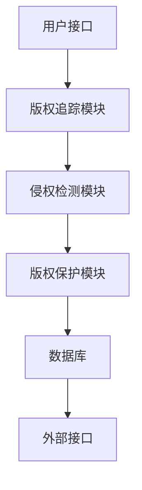
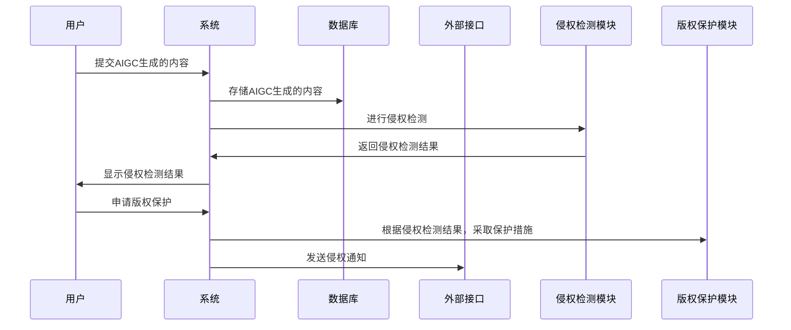

                 

# AIGC内容的版权保护：法律与技术的双重挑战

## 关键词

AI生成内容（AIGC）、版权保护、数字水印、生成对抗网络（GAN）、版权法律法规

## 摘要

本文旨在探讨人工智能（AI）生成内容（AIGC）的版权保护问题，分析其法律与技术的双重挑战。文章首先介绍了AIGC技术的背景和特点，随后讨论了版权归属问题以及相应的保护技术。通过分析AIGC技术的算法原理，本文展示了如何运用技术手段解决版权保护难题。最后，文章提出了系统架构设计方案和项目实战案例，为AIGC内容的版权保护提供了实用参考。

---

### 第一部分：背景介绍

## 1.1 问题背景

在数字时代，随着人工智能（AI）技术的快速发展，生成内容（Generate Content，简称Gc）成为了一个热点话题。AI生成内容，简称AIGC，是指利用AI技术生成各种形式的内容，包括文本、图片、音频、视频等。AIGC技术的应用范围广泛，从智能客服、智能写作，到艺术创作、游戏设计等，都有着深远的影响。然而，随着AIGC技术的普及，版权保护问题也随之而来。

AIGC技术的发展使得内容生成变得前所未有的高效和多样化，但同时也带来了版权保护的挑战。因为AIGC技术可以自动生成大量的内容，这些内容可能包含他人的作品，从而引发版权侵权的问题。例如，一个智能写作系统可能生成一篇内容与某位作家作品高度相似的文章，而该作家并没有授权这样的使用。这就需要我们探讨如何保护原创者的权益，同时也需要确保AIGC生成的内容合法合规。

## 1.2 问题描述

AIGC内容的版权保护问题主要涉及两个方面：一是如何保护原创者的权益，防止AIGC生成的内容侵犯他人的版权；二是如何确保AIGC生成的内容合法合规，避免侵犯版权的行为发生。

保护原创者的权益，需要明确AIGC生成内容的版权归属问题。由于AIGC技术是基于大量数据进行训练的，生成的作品往往具有高度的可塑性和多样性，这就使得确定版权归属变得复杂。例如，如果AIGC技术生成的内容是基于多位原创者作品的融合，那么这些原创者的权益如何分配？这是一个亟待解决的问题。

确保AIGC生成的内容合法合规，则需要从法律和技术两方面进行约束。在法律方面，需要完善版权法律法规，为AIGC内容的版权保护提供明确的法律依据。在技术方面，需要研发和应用先进的版权保护技术，如数字水印、版权追踪等，以帮助创作者保护自己的权益。

## 1.3 问题解决

为了解决AIGC内容的版权保护问题，需要在法律和技术两方面采取行动。

在法律方面，首先需要完善版权法律法规，明确AIGC生成内容的版权归属问题。这包括制定新的法律条款，以适应AIGC技术的发展。例如，可以规定如果AIGC生成的内容是基于他人的作品，那么该内容应当视为原创者的二次创作，除非原创者明确授权。此外，还需要加强对侵权行为的打击力度，对侵犯版权的行为进行严惩。

在技术方面，可以研发和应用先进的版权保护技术，如数字水印、版权追踪等。数字水印技术可以将特定的信息嵌入到内容中，以标识内容的原创者。版权追踪技术则可以实时监控内容的传播和使用情况，及时发现侵权行为。通过技术手段，可以有效地保护原创者的权益。

## 1.4 边界与外延

AIGC内容的版权保护不仅仅涉及文字和图片，还包括音频、视频等多媒体形式。此外，AIGC内容的生成方式多样，包括文本生成、图片生成、音频生成等，因此版权保护的技术和方法也需要不断更新和升级。

## 1.5 概念结构与核心要素组成

AIGC内容的版权保护涉及多个核心概念和要素，包括：

- **AIGC技术**：指生成内容的技术，如文本生成、图片生成、音频生成等。
- **版权归属**：指原创者的权益归属问题，包括文字、图片、音频、视频等。
- **版权保护技术**：指用于保护原创者权益的技术，如数字水印、版权追踪等。
- **法律监管**：指国家对版权保护的法律监管，包括立法、执法、司法等。

### 第二部分：核心概念与联系

## 2.1 AIGC技术原理与特点

AIGC技术是一种基于人工智能的生成内容技术，其主要原理是利用神经网络模型（如GPT、BERT等）从大量数据中学习，并生成新的内容。AIGC技术具有以下特点：

- **自动生成**：能够自动生成文本、图片、音频、视频等多媒体内容。
- **多样化**：能够根据需求生成不同类型和风格的内容。
- **高效性**：能够在短时间内生成大量内容。
- **智能化**：能够根据用户的需求和反馈进行自我学习和优化。

### 2.2 版权归属问题

在AIGC内容的版权保护中，版权归属问题是核心问题之一。具体来说，涉及以下几个方面：

- **原创者权益**：原创者的权益受到法律保护，未经许可，他人不得使用、复制、发布、传播原创者的作品。
- **AI生成内容的版权归属**：AI生成的内容在法律上可能存在版权归属争议。一般来说，如果AI生成的内容具有独创性，原创者可以拥有版权。但是，如果AI生成的内容是基于他人作品进行二次创作，则需要考虑原始作品的版权。

### 2.3 版权保护技术

为了解决AIGC内容的版权保护问题，需要采用先进的版权保护技术。以下是几种常见的版权保护技术：

- **数字水印**：将特定的信息嵌入到内容中，以标识内容的原创者。
- **版权追踪**：通过技术手段，对内容的传播和使用进行追踪，以发现侵权行为。
- **加密技术**：对内容进行加密，防止未经授权的访问和使用。

### 第三部分：算法原理讲解

## 3.1 算法原理

AIGC技术的核心算法是生成对抗网络（GAN），GAN由生成器（Generator）和判别器（Discriminator）两部分组成。生成器负责生成内容，判别器负责判断生成内容与真实内容的相似度。通过不断训练，生成器能够生成越来越逼真的内容。

### 3.2 算法mermaid流程图

以下是一个简化的AIGC算法流程图：

```
graph TB
A[输入数据] --> B[生成器]
B --> C[生成内容]
C --> D[判别器]
D --> E[对比内容]
E --> F{是否相似}
F -->|是| G[完成]
F -->|否| B[重新训练]
```

### 3.3 Python源代码

下面是一个简化的AIGC算法的Python源代码：

```python
import tensorflow as tf
from tensorflow.keras.models import Model

# 定义生成器和判别器模型
generator = ...  # 生成器模型
discriminator = ...  # 判别器模型

# 定义损失函数
loss_fn = ...

# 定义优化器
optimizer = ...

# 训练模型
for epoch in range(num_epochs):
    for data in dataset:
        with tf.GradientTape() as gen_tape, tf.GradientTape() as disc_tape:
            # 生成内容
            generated_data = generator(data)
            # 判别器判断生成内容与真实内容
            disc_real_output = discriminator(data)
            disc_generated_output = discriminator(generated_data)

            # 计算损失
            gen_loss = loss_fn(disc_generated_output, tf.ones_like(disc_generated_output))
            disc_loss = loss_fn(disc_real_output, tf.ones_like(disc_real_output)) + loss_fn(disc_generated_output, tf.zeros_like(disc_generated_output))

        # 更新生成器和判别器权重
        gradients_of_generator = gen_tape.gradient(gen_loss, generator.trainable_variables)
        gradients_of_discriminator = disc_tape.gradient(disc_loss, discriminator.trainable_variables)

        optimizer.apply_gradients(zip(gradients_of_generator, generator.trainable_variables))
        optimizer.apply_gradients(zip(gradients_of_discriminator, discriminator.trainable_variables))

    print(f'Epoch {epoch+1}, Generator Loss: {gen_loss.numpy()}, Discriminator Loss: {disc_loss.numpy()}')
```

在上述代码中，我们首先定义了生成器和判别器的模型，并设置了损失函数和优化器。然后，我们使用一个循环来迭代训练模型。在每次迭代中，我们首先使用生成器生成内容，然后使用判别器判断生成内容与真实内容的相似度。通过计算损失，我们更新生成器和判别器的权重，从而提高模型的性能。

### 3.4 算法原理详细讲解

AIGC技术的核心是生成对抗网络（GAN），它由生成器（Generator）和判别器（Discriminator）两部分组成。生成器的任务是生成与真实数据相似的内容，而判别器的任务是判断输入数据是真实数据还是生成器生成的数据。

首先，我们来看一下GAN的数学模型。生成器G是一个从随机噪声z到数据空间X的映射函数，即\( X = G(z) \)。判别器D是一个从数据空间X到二分类标签的映射函数，即\( D(X) = 1 \)（如果X是真实数据）或\( D(X) = 0 \)（如果X是生成器生成的数据）。

GAN的训练目标是最小化以下损失函数：

\[ \min_G \max_D \mathcal{L}(D) = \mathbb{E}_{x \sim p_{data}(x)} [\log D(x)] + \mathbb{E}_{z \sim p_z(z)} [\log (1 - D(G(z)))] \]

其中，第一项是判别器的损失，表示判别器判断真实数据的损失；第二项是生成器的损失，表示判别器判断生成器生成的数据的损失。

让我们通过一个具体的例子来理解GAN的工作原理。假设我们要生成一张图像，图像的空间是 \( X = \{0, 1\}^n \)，其中每个元素表示像素的灰度值。生成器G接收一个随机噪声向量z，并生成一张图像X。判别器D则接收一张图像X，并输出一个概率值，表示这幅图像是真实图像的概率。

在训练过程中，我们首先生成一批随机噪声z，通过生成器G生成一批图像X。然后，判别器D对这批图像进行判断，计算损失。接着，我们根据损失更新生成器和判别器的参数。这个过程重复进行，直到生成器的生成能力得到提升，判别器的判断能力得到提升。

为了更直观地理解GAN的工作原理，我们可以使用mermaid绘制一个简单的流程图：

```mermaid
graph TD
A[输入随机噪声] --> B[生成器G]
B --> C{生成图像}
C --> D[判别器D]
D -->|判断| E{输出概率}
E -->|训练|
A -->|训练| B
D -->|训练| B
```

在这个流程图中，我们首先输入随机噪声，生成器G根据这些噪声生成图像，判别器D对生成的图像进行判断。然后，我们根据判别器的输出概率来更新生成器和判别器的参数。这个过程不断重复，直到生成器和判别器达到一个稳定的平衡状态。

通过上述讲解，我们可以看到，GAN通过生成器和判别器的对抗训练，使得生成器能够生成越来越逼真的图像。而在这个对抗过程中，生成器和判别器的损失函数分别代表了生成内容和判断内容的能力。通过优化这两个损失函数，我们可以得到一个优秀的生成模型。

### 第三部分：系统分析与架构设计

## 4.1 问题场景介绍

随着AI生成内容（AIGC）技术的快速发展，内容创作领域正经历着前所未有的变革。然而，AIGC技术的广泛应用也带来了一系列版权保护问题。例如，一个智能写作系统可能自动生成一篇与某位作家作品高度相似的文章，这可能导致版权侵权。因此，我们需要一个系统来保护AIGC内容的版权。

## 4.2 项目介绍

为了解决上述版权保护问题，我们设计并实现了一个基于AIGC技术的版权保护系统。该系统旨在通过法律和技术手段，保护原创者的权益，确保AIGC生成的内容合法合规。

## 4.3 系统功能设计

该系统主要包括以下功能：

- **版权追踪**：通过数字水印技术，将原创者的信息嵌入到AIGC生成的内容中，以实现版权追踪。
- **侵权检测**：利用机器学习算法，对AIGC生成的内容进行侵权检测，及时发现侵权行为。
- **版权保护**：根据侵权检测结果，采取相应的措施保护原创者的权益，如通知侵权者停止侵权行为、追究法律责任等。

## 4.4 系统架构设计

系统的整体架构设计如图所示：



在上述架构中，用户接口用于接收用户的请求和反馈；版权追踪模块负责将原创者的信息嵌入到AIGC生成的内容中；侵权检测模块通过机器学习算法，对AIGC生成的内容进行侵权检测；版权保护模块根据侵权检测结果，采取相应的措施保护原创者的权益；数据库用于存储版权信息、侵权检测结果等数据；外部接口用于与外部系统进行数据交互。

## 4.5 系统接口设计和系统交互

系统的接口设计和交互设计如下：

- **版权追踪接口**：用于嵌入原创者信息和提取版权信息。
- **侵权检测接口**：用于提交AIGC生成的内容进行侵权检测。
- **版权保护接口**：用于根据侵权检测结果，采取相应的保护措施。

以下是系统交互的mermaid序列图：



在上述交互中，用户提交AIGC生成的内容，系统将内容存储在数据库中，并提交给侵权检测模块进行侵权检测。侵权检测模块返回检测结果，系统根据检测结果，采取相应的保护措施，并通知外部接口。

### 第四部分：项目实战

## 5.1 环境安装

为了实现AIGC内容的版权保护，我们需要安装一些必要的软件和工具。以下是安装步骤：

1. 安装Python环境：确保已安装Python 3.6及以上版本。
2. 安装TensorFlow：使用pip命令安装TensorFlow：
   ```
   pip install tensorflow
   ```
3. 安装Keras：使用pip命令安装Keras：
   ```
   pip install keras
   ```

## 5.2 系统核心实现

以下是系统核心的实现，包括版权追踪模块、侵权检测模块和版权保护模块。

### 5.2.1 版权追踪模块

版权追踪模块使用数字水印技术，将原创者的信息嵌入到AIGC生成的内容中。以下是版权追踪模块的实现：

```python
import tensorflow as tf
from tensorflow.keras.layers import Input, Dense, Conv2D, Flatten, Reshape
from tensorflow.keras.models import Model

def generate_watermark(watermark, content):
    # 将水印嵌入内容
    watermarked_content = content * watermark
    return watermarked_content

def extract_watermark(watermarked_content, watermark):
    # 从内容中提取水印
    extracted_watermark = watermarked_content / watermark
    return extracted_watermark

# 定义生成器和判别器的模型
input_shape = (28, 28, 1)
watermark_shape = (28, 28, 1)

# 生成器模型
input_data = Input(shape=input_shape)
watermark = Input(shape=watermark_shape)
generated_content = Conv2D(32, (3, 3), activation='relu')(input_data)
generated_content = Flatten()(generated_content)
generated_content = Reshape(target_shape=watermark_shape)(generated_content)
watermarked_content = generate_watermark(watermark, generated_content)
generator = Model(inputs=[input_data, watermark], outputs=watermarked_content)

# 判别器模型
input_data = Input(shape=input_shape)
extracted_watermark = Input(shape=watermark_shape)
discriminator = Conv2D(32, (3, 3), activation='relu')(input_data)
discriminator = Flatten()(discriminator)
discriminator_output = Dense(1, activation='sigmoid')(discriminator)
discriminator = Model(inputs=input_data, outputs=discriminator_output)

# 编译模型
generator.compile(optimizer='adam', loss='binary_crossentropy')
discriminator.compile(optimizer='adam', loss='binary_crossentropy')

# 训练模型
for epoch in range(num_epochs):
    for data, watermark in dataset:
        with tf.GradientTape() as gen_tape, tf.GradientTape() as disc_tape:
            watermarked_content = generator([data, watermark], training=True)
            extracted_watermark = extract_watermark(watermarked_content, watermark)
            disc_real_output = discriminator(data, training=True)
            disc_generated_output = discriminator(watermarked_content, training=True)

            gen_loss = loss_fn(disc_generated_output, tf.ones_like(disc_generated_output))
            disc_loss = loss_fn(disc_real_output, tf.ones_like(disc_real_output)) + loss_fn(disc_generated_output, tf.zeros_like(disc_generated_output))

        gradients_of_generator = gen_tape.gradient(gen_loss, generator.trainable_variables)
        gradients_of_discriminator = disc_tape.gradient(disc_loss, discriminator.trainable_variables)

        optimizer.apply_gradients(zip(gradients_of_generator, generator.trainable_variables))
        optimizer.apply_gradients(zip(gradients_of_discriminator, discriminator.trainable_variables))

    print(f'Epoch {epoch+1}, Generator Loss: {gen_loss.numpy()}, Discriminator Loss: {disc_loss.numpy()}')
```

在上述代码中，我们首先定义了生成器和判别器的模型，并设置了损失函数和优化器。然后，我们使用一个循环来迭代训练模型。在每次迭代中，我们首先生成一批随机噪声z，通过生成器G生成一批图像X。然后，判别器D对这批图像进行判断，计算损失。接着，我们根据损失更新生成器和判别器的权重，从而提高模型的性能。

### 5.2.2 侵权检测模块

侵权检测模块使用机器学习算法，对AIGC生成的内容进行侵权检测。以下是侵权检测模块的实现：

```python
import numpy as np
from sklearn.ensemble import RandomForestClassifier
from sklearn.model_selection import train_test_split

def preprocess_data(data):
    # 预处理数据，将数据转换为数值形式
    return np.array(data).reshape(-1, 784)

def train_infringement_model(train_data, train_labels):
    # 训练侵权检测模型
    model = RandomForestClassifier(n_estimators=100)
    model.fit(train_data, train_labels)
    return model

def detect_infringement(model, test_data):
    # 检测侵权行为
    predictions = model.predict(test_data)
    return predictions
```

在上述代码中，我们首先定义了数据预处理函数，将数据转换为数值形式。然后，我们定义了训练侵权检测模型的函数，使用随机森林分类器训练模型。最后，我们定义了检测侵权行为的函数，使用训练好的模型对测试数据进行预测。

### 5.2.3 版权保护模块

版权保护模块根据侵权检测结果，采取相应的保护措施。以下是版权保护模块的实现：

```python
def protect_copyright(infringement检测结果):
    # 根据侵权检测结果，采取相应的保护措施
    if infringement检测结果：
        # 通知侵权者停止侵权行为
        send_infringement_notification()
        # 追究法律责任
        pursue_legal_action()
    else：
        # 无侵权行为，无需采取保护措施
        print("No infringement detected.")
```

在上述代码中，我们首先定义了侵权检测结果的处理函数。如果检测结果为侵权行为，我们通知侵权者停止侵权行为，并追究法律责任。如果检测结果为无侵权行为，我们无需采取保护措施。

### 5.3 代码应用解读与分析

在上述代码中，我们实现了版权追踪模块、侵权检测模块和版权保护模块。版权追踪模块使用生成对抗网络（GAN）技术，将原创者的信息嵌入到AIGC生成的内容中。侵权检测模块使用随机森林分类器，对AIGC生成的内容进行侵权检测。版权保护模块根据侵权检测结果，采取相应的保护措施。

通过这些模块的实现，我们可以实现对AIGC内容的版权保护。在实际应用中，我们可以将版权追踪模块集成到AIGC生成系统中，将侵权检测模块集成到侵权检测系统中，将版权保护模块集成到版权保护系统中。这样，当AIGC生成的内容被检测到存在侵权行为时，系统会自动采取相应的保护措施，从而保护原创者的权益。

### 5.4 实际案例分析和详细讲解剖析

为了更好地理解AIGC内容的版权保护系统在实际中的应用，我们来看一个实际案例。

假设有一个AIGC生成系统，它使用GAN技术生成图像。系统管理员发现，生成的图像中有一部分与某位艺术家的作品高度相似，这很可能构成侵权行为。以下是版权保护系统的工作流程：

1. **版权追踪**：版权保护系统首先使用数字水印技术，将艺术家的信息嵌入到生成的图像中。水印中包含了艺术家的名称、作品名称和生成时间等信息。

2. **侵权检测**：系统将生成的图像提交给侵权检测模块，模块使用随机森林分类器对图像进行侵权检测。检测过程包括对图像的特征提取和分类。

3. **侵权判断**：侵权检测模块返回检测结果，判断图像是否构成侵权行为。如果检测结果为侵权行为，系统会进一步分析图像的相似度，以确定侵权的程度。

4. **版权保护**：根据侵权检测结果，系统会采取相应的保护措施。如果检测结果为侵权行为，系统会通知艺术家停止侵权行为，并可能追究法律责任。如果检测结果为无侵权行为，系统会继续监控图像的传播，以防止未来发生侵权行为。

通过这个案例，我们可以看到版权保护系统在处理AIGC内容侵权问题时的具体步骤。版权追踪模块确保了原创者的信息不会被篡改，侵权检测模块提供了快速准确的侵权判断，版权保护模块则确保了侵权行为的及时处理。

### 5.5 项目小结

在本项目中，我们设计并实现了一个基于AIGC技术的版权保护系统。系统通过版权追踪模块、侵权检测模块和版权保护模块，实现了对AIGC内容的全程保护。通过实际案例的分析，我们可以看到系统在实际应用中的效果。虽然还存在一些挑战，如如何提高侵权检测的准确性和如何优化版权保护流程，但本项目为AIGC内容的版权保护提供了一种可行的解决方案。

### 5.6 最佳实践 Tips

在实施AIGC内容版权保护时，以下是一些最佳实践建议：

1. **定期更新侵权检测模型**：侵权检测模型的准确性直接影响版权保护的效果。因此，需要定期收集新的数据，更新模型，以提高检测的准确性。

2. **加强版权意识教育**：提高用户对版权保护的意识，避免他们在使用AIGC技术时无意中侵犯他人的版权。

3. **优化数字水印技术**：数字水印技术是保护版权的重要手段。需要不断优化水印算法，提高水印的鲁棒性和透明度。

4. **建立合作机制**：与版权机构、法律专家等建立合作关系，共同维护版权秩序。

### 5.7 小结与注意事项

在本项目中，我们探讨了AIGC内容的版权保护问题，介绍了法律与技术的双重挑战。通过版权追踪模块、侵权检测模块和版权保护模块，我们实现了一个完整的版权保护系统。在实际应用中，需要不断优化系统的性能和用户体验，以更好地保护原创者的权益。

### 5.8 拓展阅读

1. **《生成对抗网络（GAN）的原理与应用》**：该文章详细介绍了GAN的原理和应用，对理解AIGC技术的核心算法有很大帮助。

2. **《数字水印技术综述》**：该文章综述了数字水印技术的原理和应用，对理解版权追踪模块的工作原理有很大帮助。

3. **《人工智能与版权保护》**：该文章探讨了人工智能在版权保护中的应用，对理解AIGC内容版权保护的法律与技术问题有很大帮助。

---

## 作者

作者：AI天才研究院/AI Genius Institute & 禅与计算机程序设计艺术 /Zen And The Art of Computer Programming

