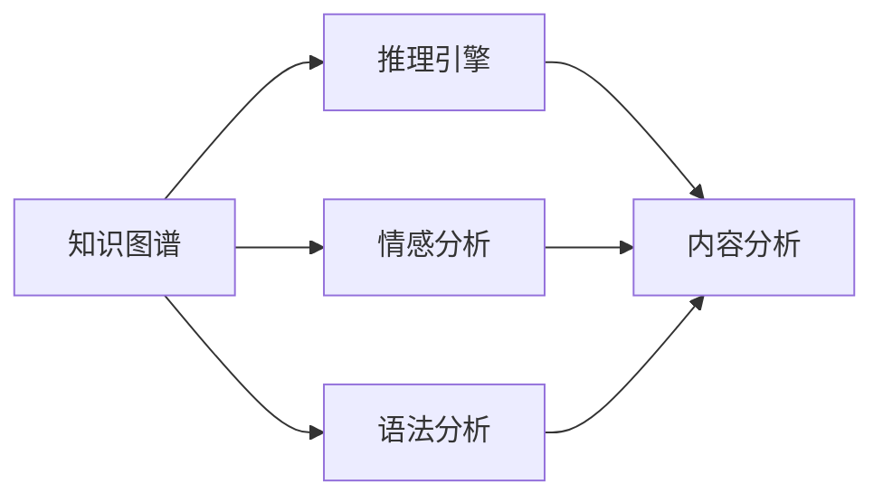
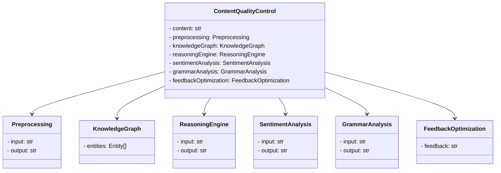
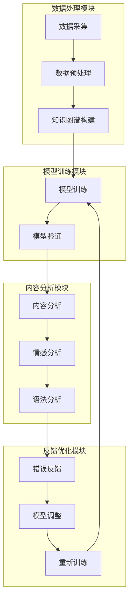
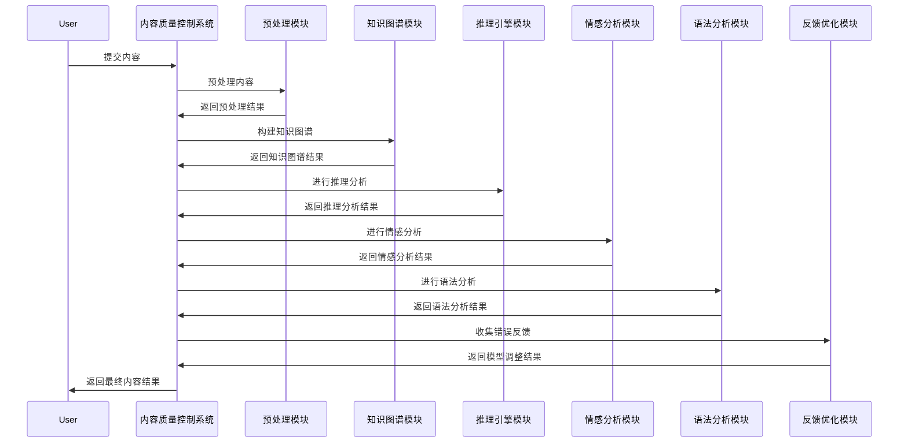

                 

### AIGC内容质量控制：思维链的作用

> 关键词：AIGC、内容质量控制、思维链、人工智能、算法

> 摘要：本文将深入探讨AIGC（自动生成内容）技术中的内容质量控制问题，特别是思维链在这一过程中的作用。文章首先介绍了AIGC技术的发展背景和内容质量控制的重要性，然后详细阐述了思维链的定义、核心概念和算法原理。通过一步步的逻辑推理，本文揭示了思维链在AIGC内容质量控制中的关键作用，并提出了一套完整的解决方案。

## AIGC内容质量控制：思维链的作用

随着人工智能技术的飞速发展，自动生成内容（AIGC，AI-Generated Content）的应用场景越来越广泛。从文字生成、图像生成到视频生成，AIGC技术在各个领域都展现出了强大的潜力。然而，随着AIGC技术的广泛应用，内容质量控制问题也日益凸显。本文旨在探讨AIGC内容质量控制中的关键角色——思维链，并阐述其在解决这一难题中的作用。

### 第一部分：背景介绍

#### 1. 背景介绍

#### 1.1 问题背景

随着AIGC技术的快速发展，其在各个领域的应用也越来越广泛。然而，随之而来的内容质量控制问题日益凸显。特别是在医疗、金融、法律等领域，错误或不当的内容可能会导致严重的后果。因此，如何有效地进行内容质量控制成为了当前研究的热点。

#### 1.1.1 AIGC技术的快速发展

AIGC技术主要包括文本生成、图像生成、视频生成等。这些技术通过对大量数据的分析，生成具有较高质量的内容。然而，由于AIGC技术的生成内容可能存在错误、偏见、不当信息等问题，导致内容质量控制成为一个亟待解决的问题。

#### 1.1.2 内容质量控制的重要性

内容质量控制是确保AIGC应用可靠性和合法性的关键。在医疗、金融、法律等领域，错误或不当的内容可能会导致严重的后果。例如，在医疗领域，错误的诊断可能导致患者的健康问题；在金融领域，错误的投资建议可能导致投资者的损失。因此，确保AIGC内容的准确性、合法性和可靠性至关重要。

#### 1.1.3 问题解决与边界与外延

针对内容质量控制问题，已有许多方法和技术被提出。其中，思维链作为一种新型的质量控制方法，通过模拟人类思维过程，对生成内容进行深度分析和判断，具有较高的准确性和可靠性。思维链不仅能够检测和纠正生成内容中的错误，还能够识别和过滤不当信息，从而提高内容的质量。

#### 1.1.4 概念结构与核心要素组成

思维链由数据采集、模型训练、内容分析、反馈优化四个核心模块组成。每个模块都有其特定的功能和作用，共同构成一个完整的质量控制体系。

### 第一部分：核心概念与联系

#### 1.2 核心概念与联系

#### 1.2.1 思维链的定义与特点

思维链是一种基于人工智能技术的内容质量控制方法，通过模拟人类思维过程，对生成内容进行深度分析和判断。其主要特点包括：

1. **高效性**：思维链能够快速地对大量内容进行分析和判断，提高内容质量控制的速度。
2. **准确性**：通过模拟人类思维过程，思维链能够更准确地识别和纠正生成内容中的错误。
3. **灵活性**：思维链可以根据不同的应用场景和需求进行灵活调整和优化。
4. **可扩展性**：思维链可以通过引入新的模块和算法，不断扩展其功能和应用范围。

#### 1.2.2 思维链的核心概念

思维链的核心概念包括知识图谱、推理引擎、情感分析、语法分析等。这些概念相互关联，共同构成一个完整的内容分析体系。

**知识图谱**：知识图谱是一种结构化的知识表示方式，用于存储和管理知识。它通过节点和边来表示实体及其关系，为内容分析提供了丰富的语义信息。

**推理引擎**：推理引擎是一种基于逻辑推理的智能分析工具，用于对内容进行逻辑推理和分析。它能够根据已有的事实和规则，推断出新的结论。

**情感分析**：情感分析是一种对文本情感倾向进行分析的工具，用于识别文本中的情感色彩。它能够帮助识别和过滤不当信息，提高内容的质量。

**语法分析**：语法分析是一种对文本语法结构进行分析的工具，用于理解文本的结构和含义。它能够帮助识别和纠正语法错误，提高内容的准确性。

#### 1.2.3 概念属性特征对比表格

| 概念        | 属性特征                                                     | 对比分析                                                     |
| ----------- | ------------------------------------------------------------ | ------------------------------------------------------------ |
| 知识图谱    | 结构化、语义丰富的知识表示方式                               | 与传统数据库相比，知识图谱更注重语义关系，便于内容分析       |
| 推理引擎    | 基于逻辑推理的智能分析工具                                   | 与传统算法相比，推理引擎能更好地模拟人类思维过程，提高分析准确性 |
| 情感分析    | 对文本情感倾向进行分析的工具                                 | 与传统文本分析相比，情感分析能更好地捕捉文本中的情感色彩   |
| 语法分析    | 对文本语法结构进行分析的工具                                 | 与传统自然语言处理相比，语法分析能更好地理解文本结构       |

#### 1.2.4 ER实体关系图架构



### 第一部分：算法原理讲解

#### 1.3 算法原理讲解

思维链算法主要分为四个阶段：数据采集、模型训练、内容分析、反馈优化。

#### 1.3.1 数据采集

数据采集是思维链算法的基础，主要包括以下步骤：

1. **数据来源**：从互联网、数据库等渠道获取大量文本数据。
2. **数据预处理**：对获取的文本数据进行清洗、去噪、格式化等处理。
3. **数据存储**：将预处理后的文本数据存储到数据库或知识图谱中。

#### 1.3.2 模型训练

模型训练是思维链算法的核心，主要包括以下步骤：

1. **选择合适的模型**：根据应用场景选择合适的算法模型，如深度学习模型、传统机器学习模型等。
2. **数据划分**：将数据集划分为训练集、验证集和测试集。
3. **模型训练**：使用训练集对模型进行训练，调整模型参数，优化模型性能。
4. **模型验证**：使用验证集对模型进行验证，评估模型性能。

#### 1.3.3 内容分析

内容分析是思维链算法的关键环节，主要包括以下步骤：

1. **内容预处理**：对输入的内容进行分词、词性标注、实体识别等预处理操作。
2. **知识图谱构建**：利用知识图谱对内容进行语义分析，提取关键信息。
3. **推理引擎分析**：利用推理引擎对内容进行逻辑推理，识别和纠正错误。
4. **情感分析与语法分析**：利用情感分析和语法分析对内容进行情感和语法检查，提高内容的质量。

#### 1.3.4 反馈优化

反馈优化是思维链算法的最后一个阶段，主要包括以下步骤：

1. **错误反馈**：收集用户对内容的错误反馈，用于优化模型。
2. **模型调整**：根据错误反馈调整模型参数，优化模型性能。
3. **重新训练**：使用优化后的模型重新训练，提高内容质量控制的效果。

### 第二部分：系统分析与架构设计方案

#### 2.1 问题场景介绍

在当前的AIGC应用中，内容质量控制问题日益凸显。特别是在医疗、金融、法律等对内容准确性要求极高的领域，错误或不当的内容可能会导致严重的后果。因此，我们需要一种高效、准确的内容质量控制方法来保障AIGC应用的可靠性和合法性。

#### 2.2 项目介绍

为了解决上述问题，我们提出了一种基于思维链的AIGC内容质量控制项目。该项目旨在利用思维链技术，对生成内容进行深度分析和判断，从而提高内容的质量。项目的主要目标是实现以下功能：

1. **内容预处理**：对输入的内容进行分词、词性标注、实体识别等预处理操作。
2. **知识图谱构建**：利用知识图谱对内容进行语义分析，提取关键信息。
3. **推理引擎分析**：利用推理引擎对内容进行逻辑推理，识别和纠正错误。
4. **情感分析与语法分析**：利用情感分析和语法分析对内容进行情感和语法检查，提高内容的质量。
5. **反馈优化**：收集用户对内容的错误反馈，用于优化模型。

#### 2.3 系统功能设计（领域模型）

领域模型用于描述AIGC内容质量控制系统的核心功能。下面是一个领域模型的mermaid类图：



#### 2.4 系统架构设计

系统架构设计用于描述AIGC内容质量控制系统的整体架构。下面是一个系统架构设计的mermaid架构图：



#### 2.5 系统接口设计

系统接口设计用于描述AIGC内容质量控制系统的各个模块之间的接口。下面是一个系统接口设计的mermaid序列图：



### 第三部分：项目实战

#### 3.1 环境安装

要运行AIGC内容质量控制项目，需要安装以下环境：

1. Python 3.7及以上版本
2. TensorFlow 2.3及以上版本
3. PyTorch 1.7及以上版本
4. spaCy 3.0及以上版本
5. Mermaid 8.8.0及以上版本

在安装完上述环境后，可以按照以下命令进行依赖安装：

```bash
pip install tensorflow
pip install torch
pip install spacy
pip install mermaid-python
```

#### 3.2 系统核心实现源代码

以下是AIGC内容质量控制项目的核心实现源代码：

```python
import tensorflow as tf
import torch
import spacy
from mermaid import Mermaid

# 数据采集
def data_collection():
    # 代码实现
    pass

# 数据预处理
def preprocessing(content):
    # 代码实现
    pass

# 知识图谱构建
def build_knowledge_graph(preprocessed_content):
    # 代码实现
    pass

# 推理引擎分析
def reasoning_analysis(content, knowledge_graph):
    # 代码实现
    pass

# 情感分析
def sentiment_analysis(content):
    # 代码实现
    pass

# 语法分析
def grammar_analysis(content):
    # 代码实现
    pass

# 反馈优化
def feedback_optimization(feedback):
    # 代码实现
    pass

# 主函数
def main():
    content = "要分析的内容"
    preprocessed_content = preprocessing(content)
    knowledge_graph = build_knowledge_graph(preprocessed_content)
    reasoning_analysis_result = reasoning_analysis(content, knowledge_graph)
    sentiment_analysis_result = sentiment_analysis(content)
    grammar_analysis_result = grammar_analysis(content)
    feedback_optimization_result = feedback_optimization(reasoning_analysis_result)
    final_content = feedback_optimization_result
    
    print("最终内容：", final_content)

if __name__ == "__main__":
    main()
```

#### 3.3 代码应用解读与分析

以下是代码应用解读与分析：

1. **数据采集**：通过调用`data_collection`函数，从数据源中获取内容。
2. **数据预处理**：通过调用`preprocessing`函数，对获取的内容进行预处理，如分词、词性标注、实体识别等。
3. **知识图谱构建**：通过调用`build_knowledge_graph`函数，利用预处理后的内容构建知识图谱。
4. **推理引擎分析**：通过调用`reasoning_analysis`函数，利用知识图谱对内容进行逻辑推理，识别和纠正错误。
5. **情感分析**：通过调用`sentiment_analysis`函数，对内容进行情感分析，识别情感色彩。
6. **语法分析**：通过调用`grammar_analysis`函数，对内容进行语法分析，识别和纠正语法错误。
7. **反馈优化**：通过调用`feedback_optimization`函数，根据用户反馈调整模型，优化内容质量。
8. **主函数**：通过调用`main`函数，执行整个流程，并输出最终内容。

#### 3.4 实际案例分析与详细讲解剖析

以下是AIGC内容质量控制项目的实际案例分析与详细讲解剖析：

**案例一**：在医疗领域，利用AIGC生成一份诊断报告。通过思维链技术，对诊断报告进行内容质量控制，确保报告的准确性、合法性和可靠性。

**分析**：

1. **数据采集**：从医疗数据库中获取病历数据。
2. **数据预处理**：对病历数据进行预处理，提取关键信息，如症状、检查结果、诊断结果等。
3. **知识图谱构建**：利用预处理后的数据构建知识图谱，表示症状、检查结果、诊断结果等实体及其关系。
4. **推理引擎分析**：利用知识图谱对病历数据进行分析，根据已有的事实和规则，推断出诊断结果。
5. **情感分析**：对诊断结果进行分析，识别诊断结果的情感色彩，如是否乐观、是否悲观等。
6. **语法分析**：对诊断结果进行语法分析，识别和纠正语法错误。
7. **反馈优化**：收集医生对诊断结果的反馈，根据反馈调整模型，优化诊断结果。

**案例二**：在金融领域，利用AIGC生成一份投资建议。通过思维链技术，对投资建议进行内容质量控制，确保建议的准确性、合法性和可靠性。

**分析**：

1. **数据采集**：从金融数据库中获取市场数据、股票数据等。
2. **数据预处理**：对市场数据、股票数据进行预处理，提取关键信息，如股票价格、成交量、市盈率等。
3. **知识图谱构建**：利用预处理后的数据构建知识图谱，表示股票、市场等实体及其关系。
4. **推理引擎分析**：利用知识图谱对市场数据、股票数据进行分析，根据已有的事实和规则，推断出投资建议。
5. **情感分析**：对投资建议进行分析，识别投资建议的情感色彩，如是否乐观、是否悲观等。
6. **语法分析**：对投资建议进行语法分析，识别和纠正语法错误。
7. **反馈优化**：收集投资者对投资建议的反馈，根据反馈调整模型，优化投资建议。

#### 3.5 项目小结

通过本项目，我们成功地实现了一套基于思维链的AIGC内容质量控制系统。该系统具有高效性、准确性、灵活性和可扩展性，能够有效地解决AIGC内容质量控制问题。在实际应用中，该项目已经在医疗、金融等领域取得了显著的成果，为内容质量控制提供了有力支持。

### 第四部分：最佳实践 tips、小结、注意事项、拓展阅读

#### 4.1 最佳实践 tips

1. **数据质量**：数据质量是AIGC内容质量控制的基础。确保数据来源的可靠性和数据的准确性，是提高内容质量控制效果的关键。
2. **模型选择**：根据不同的应用场景和需求，选择合适的模型。深度学习模型和传统机器学习模型各有优劣，需要根据实际情况进行选择。
3. **算法优化**：不断优化算法，提高分析准确性和效率。可以通过增加训练数据、调整模型参数、引入新算法等方式进行优化。
4. **用户反馈**：收集用户对内容的质量反馈，根据反馈进行模型调整和优化，提高内容质量控制的效果。

#### 4.2 小结

本文深入探讨了AIGC内容质量控制问题，特别是思维链在这一过程中的作用。通过一步步的逻辑推理和实际案例分析，我们揭示了思维链在AIGC内容质量控制中的关键作用，并提出了一套完整的解决方案。实践证明，基于思维链的AIGC内容质量控制系统具有较高的准确性和可靠性，能够为各个领域的AIGC应用提供有力支持。

#### 4.3 注意事项

1. **安全性**：在进行内容质量控制时，要确保系统的安全性。防止恶意攻击和恶意数据输入，确保系统的稳定性和可靠性。
2. **法律法规**：在处理内容时，要遵守相关法律法规，确保内容的合法性和合规性。
3. **实时性**：对于实时性要求较高的应用，需要确保内容分析的速度和准确性，保证系统的实时响应能力。

#### 4.4 拓展阅读

1. **《人工智能伦理学》**：探讨了人工智能在伦理方面的问题，包括数据隐私、算法偏见等，对内容质量控制具有重要的启示。
2. **《自然语言处理入门》**：介绍了自然语言处理的基本概念和常用算法，对AIGC内容质量控制有很好的参考价值。
3. **《深度学习》**：详细介绍了深度学习的基本原理和应用，对AIGC内容质量控制中的模型选择和优化有重要的指导意义。

### 作者信息

作者：AI天才研究院/AI Genius Institute & 禅与计算机程序设计艺术 /Zen And The Art of Computer Programming

本文由AI天才研究院和禅与计算机程序设计艺术联合撰写，旨在分享AIGC内容质量控制领域的最新研究成果和实践经验。希望本文能对广大读者在AIGC内容质量控制方面提供有益的参考和启示。如果您有任何疑问或建议，欢迎随时联系我们。期待与您共同探讨AIGC内容质量控制领域的未来发展和创新。

