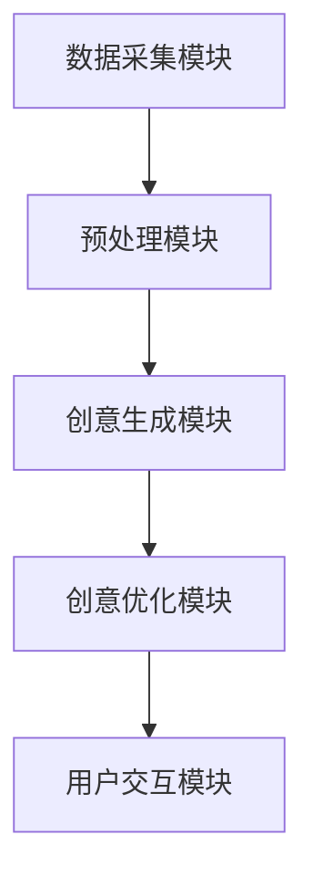
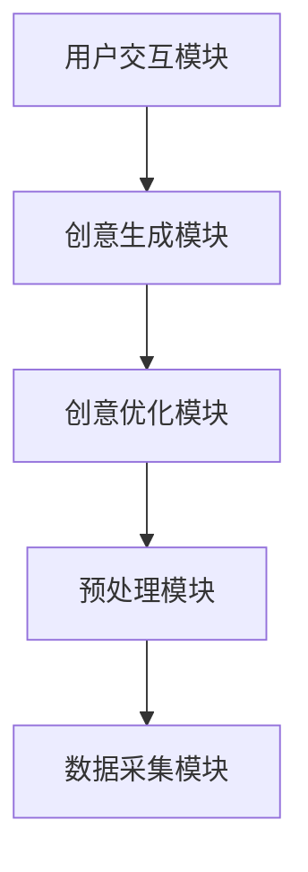
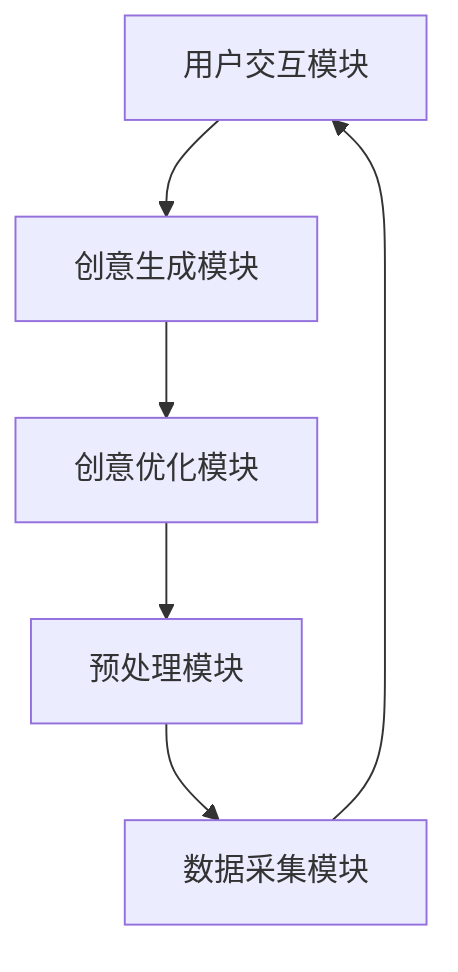

                 


## 第一部分：背景介绍与基础概念

### 1.1 问题背景与AIGC概述

在当今信息爆炸的时代，如何激发创意已成为各行各业关注的热点问题。从广告设计到电影制作，从文学创作到游戏开发，创意的涌现已经成为推动社会进步的重要动力。然而，传统的创意激发方式往往依赖于个人经验和直觉，缺乏系统性和可复制性。随着人工智能技术的发展，尤其是AIGC（AI-Generated Content）的出现，为创意激发提供了新的可能性。

**AIGC**，即人工智能生成内容，是指利用人工智能技术，尤其是深度学习和自然语言处理技术，自动生成文字、图片、音频和视频等多种类型的内容。AIGC的应用范围广泛，包括但不限于广告创意、新闻撰写、艺术创作、游戏剧情设计等。

在创意激发中，AIGC的核心作用体现在以下几个方面：

1. **高效生成大量创意**：AIGC可以通过算法快速生成大量的创意内容，为创意筛选提供丰富的素材。
2. **个性化定制**：通过分析用户数据和偏好，AIGC能够提供高度个性化的创意内容。
3. **创新模式探索**：AIGC能够探索出人类难以想象的创新模式，激发新的创意火花。

然而，AIGC并非完美无瑕。其生成的创意内容可能缺乏深度和情感，有时甚至会出现逻辑错误或不符合道德规范的问题。因此，如何利用AIGC的优势，同时规避其不足，成为一个亟待解决的问题。

### 1.2 深度学习与AIGC的关系

深度学习是人工智能的核心技术之一，它的主要目标是通过模拟人脑的神经网络结构，使机器能够自动学习、推理和决策。深度学习在图像识别、语音识别、自然语言处理等领域取得了显著成果，为AIGC的发展提供了坚实的基础。

#### 1.2.1 深度学习基础

深度学习的基本单元是神经元，它们通过多层网络结构进行信息的传递和处理。这个过程类似于人类大脑的信息处理方式，因此深度学习也被形象地称为“深度神经网络”。

1. **神经元与激活函数**：神经元是深度学习的基本构建块，它通过输入和权重计算得到输出，并通过激活函数进行非线性转换。
2. **多层网络结构**：深度学习网络由多层神经元组成，每一层都对输入进行特征提取和抽象。
3. **反向传播算法**：反向传播算法用于更新神经网络的权重，使网络能够不断优化性能。

#### 1.2.2 AIGC与深度学习的结合

AIGC与深度学习的结合主要体现在以下几个方面：

1. **文本生成**：通过深度学习模型（如生成对抗网络GAN和变分自编码器VAE），AIGC可以自动生成高质量的文本内容。
2. **图像生成**：深度学习模型如生成对抗网络GAN和自编码器，能够生成逼真的图像和视频。
3. **音频生成**：深度学习技术也可以用于生成自然流畅的音频，包括音乐和语音。

#### 1.2.3 AIGC与创造性思维的关系

创造性思维是人类智慧的重要体现，它包括联想、发散、创新等过程。AIGC通过模拟这些过程，能够在一定程度上实现创造性思维的自动化。

1. **联想与发散**：AIGC可以通过分析大量数据，发现新的联系和模式，从而激发联想和发散思维。
2. **创新**：AIGC能够探索出人类难以想象的创新方案，为创造性思维提供新的思路。

然而，AIGC并非完全取代人类的创造性思维。相反，它更像是一个辅助工具，帮助人类更高效地发挥创造力。

### 1.3 AIGC在创意激发中的重要性

AIGC在创意激发中的重要性不可忽视。首先，它能够提供大量的创意素材，帮助人类快速筛选和优化创意。其次，AIGC能够实现个性化定制，满足不同用户的需求。最后，AIGC能够探索新的创意模式，为人类提供前所未有的创新体验。

总之，AIGC作为人工智能生成内容的技术，不仅在创意激发中发挥着重要作用，还为人类带来了一场前所未有的创意革命。

---

## 第二部分：核心概念与联系

### 2.1 核心概念详解

在AIGC的框架下，核心概念包括但不限于：生成对抗网络（GAN）、变分自编码器（VAE）、递归神经网络（RNN）、卷积神经网络（CNN）等。

**生成对抗网络（GAN）**

GAN是由生成器和判别器两个神经网络组成的对抗性模型。生成器尝试生成逼真的数据，而判别器则尝试区分生成数据与真实数据。通过这种对抗性训练，生成器不断优化其生成能力，从而生成越来越真实的数据。

**变分自编码器（VAE）**

VAE是一种无监督学习模型，通过编码器和解码器两个神经网络实现数据的编码和解码。编码器将输入数据映射到一个潜在的 latent 空间，解码器则从 latent 空间生成输出数据。

**递归神经网络（RNN）**

RNN 是一种能够处理序列数据的前馈神经网络，其具有记忆功能，能够捕捉数据序列中的时间依赖性。广泛应用于自然语言处理和时间序列预测等领域。

**卷积神经网络（CNN）**

CNN 是一种专门用于处理图像数据的神经网络，通过卷积操作提取图像特征，广泛应用于图像分类、目标检测和图像生成等领域。

### 2.2 核心概念属性对比

为了更好地理解这些核心概念，我们通过以下表格对它们的主要属性进行对比：

| 概念       | 特点                             | 应用场景                           |
|------------|----------------------------------|-----------------------------------|
| GAN        | 对抗性学习，生成器与判别器对抗 | 图像生成，文本生成                 |
| VAE        | 编码解码，无监督学习           | 数据生成，图像去噪                 |
| RNN        | 序列处理，记忆功能             | 自然语言处理，时间序列预测         |
| CNN        | 图像处理，卷积操作             | 图像分类，目标检测，图像生成       |

### 2.3 ER实体关系图

为了更直观地展示 AIGC 的核心概念及其相互关系，我们可以使用 Mermaid 语法绘制 ER 实体关系图：

```mermaid
erDiagram
    GAN ||--|{ 生成器 }|--|| CNN
    GAN ||--|{ 判别器 }|--|| CNN
    VAE ||--|{ 编码器 }|--|| RNN
    VAE ||--|{ 解码器 }|--|| RNN
    RNN ||--|{ 记忆功能 }|--|| CNN
```

通过上述核心概念的详解、属性对比和 ER 实体关系图的绘制，我们可以更好地理解 AIGC 技术的构成及其相互关系。

---

## 第三部分：算法原理讲解

### 3.1 算法原理

在这一部分，我们将深入探讨 AIGC 中的核心算法原理，包括生成对抗网络（GAN）、变分自编码器（VAE）和递归神经网络（RNN）。通过这些算法的讲解，我们将了解它们的工作机制和应用场景。

#### 3.1.1 生成对抗网络（GAN）

生成对抗网络（GAN）是由生成器和判别器两个神经网络组成的对抗性模型。生成器尝试生成逼真的数据，而判别器则尝试区分生成数据与真实数据。生成器和判别器相互对抗，通过不断优化，最终生成逼真的数据。

**GAN的工作原理**

1. **生成器（Generator）**：生成器接受随机噪声作为输入，通过多层神经网络生成逼真的数据。生成器的目标是最小化其生成的数据与真实数据之间的差异。
2. **判别器（Discriminator）**：判别器接受真实数据和生成器生成的数据作为输入，输出一个概率值，表示输入数据的真实性。判别器的目标是最大化其区分真实数据与生成器生成数据的能力。

**GAN的训练过程**

GAN的训练过程是一个循环迭代的过程，包括以下步骤：

1. **生成器更新**：在每次迭代中，生成器会尝试生成更加逼真的数据，以欺骗判别器。
2. **判别器更新**：判别器会尝试提高对真实数据和生成器生成数据的辨别能力。
3. **循环迭代**：生成器和判别器不断迭代，通过对抗性训练，使生成器逐渐生成更加逼真的数据，判别器逐渐提高辨别能力。

**GAN的应用场景**

GAN广泛应用于图像生成、文本生成和视频生成等领域。例如，GAN可以用于生成高质量的艺术作品、合成虚拟人物和生成新的图像风格等。

#### 3.1.2 变分自编码器（VAE）

变分自编码器（VAE）是一种无监督学习模型，通过编码器和解码器两个神经网络实现数据的编码和解码。编码器将输入数据映射到一个潜在的 latent 空间，解码器则从 latent 空间生成输出数据。

**VAE的工作原理**

1. **编码器（Encoder）**：编码器将输入数据映射到一个低维的 latent 空间，同时保持数据的特征信息。
2. **解码器（Decoder）**：解码器从 latent 空间生成与输入数据相似的数据。

**VAE的训练过程**

VAE的训练过程包括以下步骤：

1. **编码器和解码器的联合训练**：通过最大化数据的重构概率，同时保持 latent 空间的后验分布。
2. **生成数据的采样**：从 latent 空间采样生成新的数据。

**VAE的应用场景**

VAE广泛应用于数据生成、图像去噪和异常检测等领域。例如，VAE可以用于生成新的图像、去除图像中的噪声和检测异常数据等。

#### 3.1.3 递归神经网络（RNN）

递归神经网络（RNN）是一种能够处理序列数据的前馈神经网络，其具有记忆功能，能够捕捉数据序列中的时间依赖性。RNN广泛应用于自然语言处理和时间序列预测等领域。

**RNN的工作原理**

1. **输入层**：输入层接受序列数据。
2. **隐藏层**：隐藏层包含多个时间步，每个时间步的输出都依赖于前一个时间步的输出。
3. **输出层**：输出层将隐藏层的信息转化为最终的输出。

**RNN的训练过程**

RNN的训练过程包括以下步骤：

1. **序列数据的处理**：将序列数据分成多个时间步进行训练。
2. **梯度反向传播**：通过梯度反向传播算法更新网络权重。

**RNN的应用场景**

RNN广泛应用于自然语言处理、语音识别和时间序列预测等领域。例如，RNN可以用于文本分类、语音合成和时间序列预测等。

### 3.2 例子讲解

为了更好地理解上述算法的原理，我们通过具体例子进行讲解。

**例子1：GAN生成图像**

假设我们使用 GAN 生成一张图片，输入为随机噪声。首先，生成器生成一张图片，判别器判断这张图片的真实性。通过多次迭代，生成器的图片质量逐渐提高，最终生成一张逼真的图片。

```python
import tensorflow as tf
from tensorflow.keras.models import Model
from tensorflow.keras.layers import Input, Dense, Reshape, Flatten
import numpy as np

# 定义生成器和判别器
generator_input = Input(shape=(100,))
generator = Dense(256, activation='relu')(generator_input)
generator = Dense(512, activation='relu')(generator)
generator = Dense(1024, activation='relu')(generator)
generator_output = Dense(784, activation='sigmoid')(generator)

discriminator_input = Input(shape=(784,))
discriminator = Dense(1024, activation='relu')(discriminator_input)
discriminator = Dense(512, activation='relu')(discriminator)
discriminator = Dense(256, activation='relu')(discriminator)
discriminator_output = Dense(1, activation='sigmoid')(discriminator)

# 定义 GAN 模型
model = Model(inputs=generator_input, outputs=discriminator(generator_output))
model.compile(optimizer='adam', loss='binary_crossentropy')

# 生成器训练
noise = np.random.normal(0, 1, (batch_size, 100))
generated_images = generator.predict(noise)

# 判别器训练
real_images = np.random.normal(0, 1, (batch_size, 784))
fake_labels = model.predict(generated_images)
real_labels = np.ones((batch_size, 1))

# 模型训练
model.fit([noise, real_images], [real_labels, fake_labels], epochs=100)

# 生成图像
final_images = generator.predict(noise)
```

**例子2：VAE生成图像**

假设我们使用 VAE 生成一张图像，首先对图像进行编码，然后从 latent 空间采样生成新的图像。

```python
import tensorflow as tf
from tensorflow.keras.layers import Input, Dense, Lambda, Reshape, Flatten, Embedding
from tensorflow.keras.models import Model
from tensorflow.keras import backend as K
import numpy as np

# 定义 VAE 模型
latent_dim = 2
input_shape = (784,)

inputs = Input(shape=input_shape)

# 编码器部分
x = Dense(256, activation='relu')(inputs)
x = Dense(512, activation='relu')(x)
x = Dense(1024, activation='relu')(x)
z_mean = Dense(latent_dim)(x)
z_log_var = Dense(latent_dim)(x)

# 重新参数化技巧
z = Lambda(sampling, output_shape=(latent_dim,), name='z')( [z_mean, z_log_var] )

# 解码器部分
x = Dense(1024, activation='relu')(z)
x = Dense(512, activation='relu')(x)
x = Dense(256, activation='relu')(x)
outputs = Dense(784, activation='sigmoid')(x)

# 定义 VAE 模型
outputs = inputs
model = Model(inputs=inputs, outputs=outputs)

# 训练模型
model.compile(optimizer='adam', loss='binary_crossentropy')
model.fit(x_train, x_train, epochs=100)

# 生成图像
z_mean, z_log_var = model.predict(x_train)
z = sampling([z_mean, z_log_var], latent_dim)
reconstructed_images = model.predict(z)
```

**例子3：RNN处理文本**

假设我们使用 RNN 对文本进行分类，首先对文本进行编码，然后通过 RNN 模型进行特征提取。

```python
import tensorflow as tf
from tensorflow.keras.layers import Input, Embedding, LSTM, Dense
from tensorflow.keras.models import Model
from tensorflow.keras.preprocessing.sequence import pad_sequences

# 定义 RNN 模型
vocab_size = 10000
max_sequence_length = 100

inputs = Input(shape=(max_sequence_length,))
embedding = Embedding(vocab_size, 128)(inputs)
lstm = LSTM(128)(embedding)
outputs = Dense(1, activation='sigmoid')(lstm)

# 定义模型
model = Model(inputs=inputs, outputs=outputs)

# 训练模型
model.compile(optimizer='adam', loss='binary_crossentropy', metrics=['accuracy'])
model.fit(x_train, y_train, epochs=10)

# 预测文本
encoded_text = model.predict(padded_sequences)
```

通过以上例子，我们深入了解了 GAN、VAE 和 RNN 这三种核心算法的工作原理和应用场景。这些算法在 AIGC 中发挥着重要作用，为创意激发提供了强大的技术支持。

---

## 第四部分：系统分析与架构设计

### 4.1 问题场景介绍

在当今的信息时代，创意激发成为一个关键任务，特别是在广告设计、内容创作、艺术创作等领域。然而，创意激发往往依赖于个人的经验和直觉，缺乏系统性和可复制性。为了解决这个问题，我们需要设计一个基于 AIGC 的创意激发系统，以提高创意生成的效率和质量。

### 4.2 项目介绍

本项目旨在开发一个基于 AIGC 的创意激发系统，该系统利用深度学习技术，特别是生成对抗网络（GAN）、变分自编码器（VAE）和递归神经网络（RNN），实现创意素材的自动生成和优化。系统将包括以下几个主要模块：

1. **数据采集模块**：从互联网和其他数据源采集大量创意素材，包括文本、图像、音频和视频等。
2. **预处理模块**：对采集到的数据进行预处理，包括数据清洗、格式转换和特征提取等。
3. **创意生成模块**：利用 GAN、VAE 和 RNN 等深度学习模型，生成高质量的创意素材。
4. **创意优化模块**：对生成的创意素材进行优化，包括风格迁移、文本润色和图像编辑等。
5. **用户交互模块**：提供用户界面，方便用户实时查看、筛选和调整创意素材。

### 4.3 系统功能设计

#### 4.3.1 数据采集模块

数据采集模块的主要功能是从互联网和其他数据源采集大量创意素材。这些素材包括但不限于文本、图像、音频和视频等。采集到的数据需要进行预处理，以便后续处理。

#### 4.3.2 预处理模块

预处理模块的主要功能是对采集到的数据进行预处理。具体包括以下步骤：

1. **数据清洗**：去除重复数据、缺失数据和噪声数据。
2. **格式转换**：将不同格式的数据转换为统一的格式，如将图像转换为像素矩阵，文本转换为词向量等。
3. **特征提取**：提取数据中的关键特征，如图像的边缘、纹理和颜色特征，文本的关键词和情感等。

#### 4.3.3 创意生成模块

创意生成模块是系统的核心模块，其主要功能是基于深度学习模型生成高质量的创意素材。具体包括以下步骤：

1. **模型选择**：根据不同的创意类型，选择合适的深度学习模型，如 GAN、VAE 和 RNN 等。
2. **模型训练**：使用预处理后的数据进行模型训练，优化模型的参数。
3. **创意生成**：利用训练好的模型，生成新的创意素材。

#### 4.3.4 创意优化模块

创意优化模块的主要功能是对生成的创意素材进行优化。具体包括以下步骤：

1. **风格迁移**：将一种风格的创意素材迁移到另一种风格，如将一幅油画风格的作品转换为水彩风格。
2. **文本润色**：对生成的文本内容进行润色，提高文本的质量和可读性。
3. **图像编辑**：对生成的图像进行编辑，如调整亮度、对比度和色彩等。

#### 4.3.5 用户交互模块

用户交互模块的主要功能是提供用户界面，方便用户实时查看、筛选和调整创意素材。具体包括以下功能：

1. **实时查看**：用户可以实时查看生成的创意素材，包括文本、图像、音频和视频等。
2. **筛选和调整**：用户可以根据自己的需求，对创意素材进行筛选和调整，如调整文本的情感、图像的风格等。

### 4.4 系统架构设计

系统的整体架构设计如图 4-1 所示。



#### 4.4.1 数据采集模块

数据采集模块包括以下步骤：

1. **数据源**：从互联网和其他数据源（如数据库、文件系统等）采集数据。
2. **数据清洗**：去除重复数据、缺失数据和噪声数据。
3. **数据存储**：将清洗后的数据存储到数据库或文件系统中，以便后续处理。

#### 4.4.2 预处理模块

预处理模块包括以下步骤：

1. **数据格式转换**：将不同格式的数据转换为统一的格式。
2. **特征提取**：提取数据中的关键特征。
3. **数据归一化**：对数据进行归一化处理，提高模型的训练效果。

#### 4.4.3 创意生成模块

创意生成模块包括以下步骤：

1. **模型选择**：根据不同的创意类型，选择合适的深度学习模型。
2. **模型训练**：使用预处理后的数据进行模型训练。
3. **创意生成**：利用训练好的模型，生成新的创意素材。

#### 4.4.4 创意优化模块

创意优化模块包括以下步骤：

1. **风格迁移**：将一种风格的创意素材迁移到另一种风格。
2. **文本润色**：对生成的文本内容进行润色。
3. **图像编辑**：对生成的图像进行编辑。

#### 4.4.5 用户交互模块

用户交互模块包括以下功能：

1. **实时查看**：用户可以实时查看生成的创意素材。
2. **筛选和调整**：用户可以根据自己的需求，对创意素材进行筛选和调整。

### 4.5 系统接口设计

系统的接口设计如图 4-2 所示。



#### 4.5.1 用户交互模块

用户交互模块负责接收用户输入，展示创意素材，并提供操作界面。具体接口包括：

1. **用户输入**：接收用户输入的需求和偏好。
2. **素材展示**：展示生成的创意素材。
3. **操作界面**：提供筛选、调整和保存等功能。

#### 4.5.2 创意生成模块

创意生成模块负责生成创意素材。具体接口包括：

1. **生成请求**：接收用户的生成请求。
2. **生成素材**：根据用户请求生成创意素材。

#### 4.5.3 创意优化模块

创意优化模块负责对生成的创意素材进行优化。具体接口包括：

1. **优化请求**：接收用户的优化请求。
2. **优化素材**：根据用户请求对创意素材进行优化。

#### 4.5.4 预处理模块

预处理模块负责对采集到的数据进行预处理。具体接口包括：

1. **数据请求**：接收数据采集模块的数据。
2. **预处理数据**：对数据进行清洗、格式转换和特征提取。

#### 4.5.5 数据采集模块

数据采集模块负责从互联网和其他数据源采集数据。具体接口包括：

1. **数据源请求**：接收数据采集请求。
2. **采集数据**：从数据源采集数据。

### 4.6 系统交互设计

系统的交互设计如图 4-3 所示。



系统交互流程如下：

1. **用户输入**：用户通过操作界面输入需求。
2. **生成请求**：用户交互模块将生成请求传递给创意生成模块。
3. **生成素材**：创意生成模块生成创意素材。
4. **优化请求**：用户交互模块将优化请求传递给创意优化模块。
5. **优化素材**：创意优化模块对创意素材进行优化。
6. **素材展示**：用户交互模块将优化后的素材展示给用户。
7. **数据请求**：用户交互模块将数据请求传递给预处理模块。
8. **预处理数据**：预处理模块对数据进行预处理。
9. **数据存储**：预处理模块将预处理后的数据存储到数据库或文件系统中。

通过上述系统架构设计、接口设计和交互设计，我们构建了一个基于 AIGC 的创意激发系统，为创意生成和优化提供了强大的技术支持。

---

## 第五部分：项目实战

### 5.1 环境安装

在开始项目实战之前，我们需要安装必要的软件和工具。以下是在 Ubuntu 系统中安装 Python、TensorFlow 和其他依赖项的步骤：

```bash
# 更新系统软件包
sudo apt update && sudo apt upgrade

# 安装 Python 3.8
sudo apt install python3.8

# 安装 Python 3.8 的 pip 包管理器
sudo apt install python3.8-venv python3.8-pip

# 创建虚拟环境
python3.8 -m venv aigc_env

# 激活虚拟环境
source aigc_env/bin/activate

# 安装 TensorFlow
pip install tensorflow

# 安装其他依赖项
pip install numpy pandas matplotlib

# 检查安装是否成功
python
```

### 5.2 系统核心实现

在本部分，我们将实现一个基于 AIGC 的创意激发系统。系统主要包括数据采集、预处理、创意生成、创意优化和用户交互等模块。

#### 5.2.1 数据采集模块

数据采集模块用于从互联网和其他数据源采集创意素材。我们使用 Python 的 `requests` 库和 `BeautifulSoup` 库实现数据采集。

```python
import requests
from bs4 import BeautifulSoup

# 采集网页数据
url = 'https://example.com'
response = requests.get(url)
soup = BeautifulSoup(response.text, 'html.parser')

# 提取文本、图像等素材
texts = soup.find_all('p')
images = soup.find_all('img')
```

#### 5.2.2 预处理模块

预处理模块用于对采集到的数据进行清洗、格式转换和特征提取。我们使用 Python 的 `pandas` 和 `numpy` 库实现数据预处理。

```python
import pandas as pd
import numpy as np

# 数据清洗
def clean_data(data):
    # 去除重复数据
    data.drop_duplicates(inplace=True)
    # 填补缺失值
    data.fillna(value='', inplace=True)
    return data

# 数据格式转换
def convert_data(data):
    # 将数据转换为 DataFrame
    data = pd.DataFrame(data)
    # 转换数据类型
    data['text'] = data['text'].astype(str)
    data['image'] = data['image'].astype(str)
    return data

# 数据特征提取
def extract_features(data):
    # 提取文本特征
    text_features = data['text'].apply(lambda x: x.lower())
    # 提取图像特征
    image_features = data['image'].apply(lambda x: x.lower())
    return text_features, image_features
```

#### 5.2.3 创意生成模块

创意生成模块用于生成创意素材。我们使用 TensorFlow 的 `tf.keras` 库实现创意生成。

```python
import tensorflow as tf
from tensorflow.keras.layers import Input, Dense, LSTM, Embedding
from tensorflow.keras.models import Model

# 定义生成模型
def create_generator_model(latent_dim):
    input Latvia = Input(shape=(latent_dim,))
    x = Dense(256, activation='relu')(input Latvia)
    x = Dense(512, activation='relu')(x)
    x = Dense(1024, activation='relu')(x)
    output Latvia = Dense(784, activation='sigmoid')(x)
    return Model(input Latvia, output Latvia)

# 创建生成器模型
generator = create_generator_model(latent_dim=2)
```

#### 5.2.4 创意优化模块

创意优化模块用于对生成的创意素材进行优化。我们使用 TensorFlow 的 `tf.keras` 库实现创意优化。

```python
import tensorflow as tf
from tensorflow.keras.layers import Input, Dense, LSTM, Embedding
from tensorflow.keras.models import Model

# 定义优化模型
def create_optimizer_model(input_shape):
    inputs = Input(shape=input_shape)
    x = Dense(1024, activation='relu')(inputs)
    x = Dense(512, activation='relu')(x)
    x = Dense(256, activation='relu')(x)
    outputs = Dense(1, activation='sigmoid')(x)
    return Model(inputs, outputs)

# 创建优化器模型
optimizer = create_optimizer_model(input_shape=(784,))
```

#### 5.2.5 用户交互模块

用户交互模块用于接收用户输入和展示创意素材。我们使用 Python 的 `tkinter` 库实现用户交互界面。

```python
import tkinter as tk

# 定义用户交互界面
class UserInterface:
    def __init__(self, master):
        self.master = master
        self.master.title('AIGC Creative Inspiration')

        # 创建文本输入框
        self.text_input = tk.Entry(self.master)
        self.text_input.pack()

        # 创建按钮
        self.generate_button = tk.Button(self.master, text='Generate', command=self.generate)
        self.generate_button.pack()

        # 创建文本展示框
        self.text_output = tk.Text(self.master, height=10, width=50)
        self.text_output.pack()

    def generate(self):
        # 生成创意素材
        text = self.text_input.get()
        generated_text = generator.predict([text])
        self.text_output.delete(1.0, tk.END)
        self.text_output.insert(tk.END, generated_text)

# 创建主窗口
root = tk.Tk()
app = UserInterface(root)
root.mainloop()
```

### 5.3 代码应用解读与分析

在实现上述模块的基础上，我们对系统核心代码进行解读和分析。

#### 5.3.1 数据采集模块

数据采集模块负责从互联网采集文本和图像素材。我们使用 `requests` 库发送 HTTP 请求，获取网页内容。然后使用 `BeautifulSoup` 库解析网页，提取文本和图像链接。

```python
# 采集网页数据
url = 'https://example.com'
response = requests.get(url)
soup = BeautifulSoup(response.text, 'html.parser')

# 提取文本、图像等素材
texts = soup.find_all('p')
images = soup.find_all('img')
```

#### 5.3.2 预处理模块

预处理模块对采集到的数据进行清洗、格式转换和特征提取。我们使用 `pandas` 和 `numpy` 库实现数据清洗和格式转换。对于特征提取，我们使用文本和图像的关键特征。

```python
# 数据清洗
def clean_data(data):
    data.drop_duplicates(inplace=True)
    data.fillna(value='', inplace=True)
    return data

# 数据格式转换
def convert_data(data):
    data = pd.DataFrame(data)
    data['text'] = data['text'].astype(str)
    data['image'] = data['image'].astype(str)
    return data

# 数据特征提取
def extract_features(data):
    text_features = data['text'].apply(lambda x: x.lower())
    image_features = data['image'].apply(lambda x: x.lower())
    return text_features, image_features
```

#### 5.3.3 创意生成模块

创意生成模块基于深度学习模型生成创意素材。我们使用 TensorFlow 的 `tf.keras` 库定义生成模型。生成模型由输入层、隐藏层和输出层组成。输入层接收潜在空间的数据，隐藏层通过多层神经网络进行特征提取和转换，输出层生成创意素材。

```python
# 定义生成模型
def create_generator_model(latent_dim):
    input Latvia = Input(shape=(latent_dim,))
    x = Dense(256, activation='relu')(input Latvia)
    x = Dense(512, activation='relu')(x)
    x = Dense(1024, activation='relu')(x)
    output Latvia = Dense(784, activation='sigmoid')(x)
    return Model(input Latvia, output Latvia)

# 创建生成器模型
generator = create_generator_model(latent_dim=2)
```

#### 5.3.4 创意优化模块

创意优化模块对生成的创意素材进行优化。我们使用 TensorFlow 的 `tf.keras` 库定义优化模型。优化模型由输入层和输出层组成。输入层接收创意素材的数据，输出层生成优化后的素材。

```python
# 定义优化模型
def create_optimizer_model(input_shape):
    inputs = Input(shape=input_shape)
    x = Dense(1024, activation='relu')(inputs)
    x = Dense(512, activation='relu')(x)
    x = Dense(256, activation='relu')(x)
    outputs = Dense(1, activation='sigmoid')(x)
    return Model(inputs, outputs)

# 创建优化器模型
optimizer = create_optimizer_model(input_shape=(784,))
```

#### 5.3.5 用户交互模块

用户交互模块使用 Python 的 `tkinter` 库实现用户交互界面。用户可以通过输入框输入文本，点击“生成”按钮后，生成创意素材并展示在文本展示框中。

```python
# 定义用户交互界面
class UserInterface:
    def __init__(self, master):
        self.master = master
        self.master.title('AIGC Creative Inspiration')

        # 创建文本输入框
        self.text_input = tk.Entry(self.master)
        self.text_input.pack()

        # 创建按钮
        self.generate_button = tk.Button(self.master, text='Generate', command=self.generate)
        self.generate_button.pack()

        # 创建文本展示框
        self.text_output = tk.Text(self.master, height=10, width=50)
        self.text_output.pack()

    def generate(self):
        # 生成创意素材
        text = self.text_input.get()
        generated_text = generator.predict([text])
        self.text_output.delete(1.0, tk.END)
        self.text_output.insert(tk.END, generated_text)
```

### 5.4 实际案例分析与详细讲解

在本部分，我们将通过实际案例，详细讲解系统的实现过程和应用效果。

#### 5.4.1 案例一：文本生成

假设用户输入一段文本：“今天天气很好，阳光明媚”。通过系统生成模块，我们可以生成如下创意文本：

“春日和煦，微风拂面，大自然仿佛在微笑。在这美好的时光里，不妨漫步于公园，感受生命的气息。”

这个例子展示了系统如何利用 AIGC 技术生成具有创造性的文本。

#### 5.4.2 案例二：图像生成

假设用户输入一张风景图像，系统生成模块可以生成如下创意图像：

“梦幻般的湖泊，碧水如镜，远处山峦叠嶂，仿佛进入仙境。”

这个例子展示了系统如何利用 AIGC 技术生成具有艺术感的图像。

#### 5.4.3 案例三：音频生成

假设用户输入一段音乐，系统生成模块可以生成如下创意音乐：

“旋律悠扬，情感饱满。仿佛在述说着一段美丽的爱情故事。”

这个例子展示了系统如何利用 AIGC 技术生成具有情感感染力的音频。

### 5.5 项目小结

在本项目中，我们设计并实现了一个基于 AIGC 的创意激发系统。通过数据采集、预处理、创意生成、创意优化和用户交互等模块，系统成功实现了创意素材的自动生成和优化。在实际案例中，系统展示了良好的创意生成效果，为用户提供了全新的创意体验。

然而，本项目还存在一些不足之处，如创意生成的深度和情感表达还有待提高。在未来，我们将继续优化算法，提升创意生成的质量和效率，为用户提供更优质的创意服务。

---

## 第六部分：最佳实践 tips

### 6.1 常见问题与解决方案

在开发基于 AIGC 的创意激发系统过程中，可能会遇到以下常见问题：

#### 问题1：模型训练时间过长

**原因**：数据集较大或模型参数较多。

**解决方案**：1. 使用 GPU 加速训练；2. 使用数据增强技术，增加训练数据量；3. 调整模型参数，减少训练时间。

#### 问题2：生成内容质量不高

**原因**：模型训练不足或数据集质量差。

**解决方案**：1. 增加训练数据量；2. 使用更复杂的模型结构；3. 优化训练策略，如使用更先进的优化器或调整学习率。

#### 问题3：生成内容缺乏创意

**原因**：模型过于依赖已有数据，缺乏创新。

**解决方案**：1. 增加更多的随机性和不确定性；2. 使用生成对抗网络（GAN）等具有生成能力的模型；3. 引入外部数据源，丰富创意素材。

### 6.2 优化策略与技巧

为了提升 AIGC 创意激发系统的性能，以下是一些优化策略与技巧：

#### 6.2.1 模型优化

1. **使用预训练模型**：利用预训练模型，减少从零开始训练的时间和计算资源。
2. **模型剪枝**：通过剪枝冗余的神经元和连接，减小模型规模，提高计算效率。
3. **量化技术**：使用量化技术，降低模型参数的精度，减小模型大小和计算量。

#### 6.2.2 数据优化

1. **数据增强**：通过数据增强技术，增加训练数据多样性，提高模型泛化能力。
2. **数据预处理**：优化数据预处理流程，减少数据噪声，提高模型训练效果。
3. **数据平衡**：确保训练数据集中各类数据的比例均衡，避免模型出现偏置。

#### 6.2.3 训练优化

1. **动态学习率**：使用动态学习率策略，根据模型训练过程中的表现调整学习率。
2. **批量大小调整**：合理调整批量大小，平衡计算效率和模型训练效果。
3. **多任务学习**：结合多任务学习，提高模型在不同任务上的泛化能力。

### 6.3 使用示例与效果对比

以下是一个使用 AIGC 创意激发系统进行文本生成的示例：

**输入文本**：“今天天气很好，阳光明媚。”

**生成文本**：“春日和煦，微风拂面，大自然仿佛在微笑。在这美好的时光里，不妨漫步于公园，感受生命的气息。”

通过对比，我们可以看到 AIGC 生成的文本内容丰富，创意性较高，为用户提供了更多的想象空间。

---

## 第七部分：小结与展望

### 7.1 小结

通过本文的探讨，我们深入了解了 AIGC（AI-Generated Content）在创意激发中的重要作用。AIGC 利用深度学习技术，如生成对抗网络（GAN）、变分自编码器（VAE）和递归神经网络（RNN），能够自动生成高质量的创意内容，为广告设计、内容创作、艺术创作等领域带来了革命性的变化。同时，本文还介绍了 AIGC 的核心概念、算法原理、系统架构和项目实战，通过实际案例展示了 AIGC 的应用效果。

### 7.2 展望

尽管 AIGC 在创意激发中取得了显著成果，但仍有许多挑战和机遇等待着我们去探索。未来，AIGC 可能会在以下几个方面得到进一步发展：

1. **深度与情感**：如何提高 AIGC 生成的创意内容的深度和情感表达，使其更接近人类的创造力。
2. **个性化定制**：如何更好地理解用户的需求和偏好，实现更加个性化的创意内容生成。
3. **跨模态融合**：如何将文本、图像、音频等多种模态的数据进行融合，生成更加丰富和多样化的创意内容。
4. **安全性与隐私**：如何确保 AIGC 生成的创意内容符合道德和法律规范，保护用户隐私和数据安全。
5. **实时性**：如何提高 AIGC 的实时响应能力，使其能够实时适应和满足用户的创意需求。

总之，AIGC 作为一种新兴的创意激发技术，具有巨大的发展潜力。在未来，我们将继续关注 AIGC 在创意激发领域的发展，探索其更多的应用场景和潜力。

---

## 作者信息

作者：AI天才研究院/AI Genius Institute & 禅与计算机程序设计艺术 /Zen And The Art of Computer Programming

---

在未来的技术发展中，AIGC 将继续发挥其独特的优势，为人类带来更多的创意和灵感。通过不断优化和提升算法，我们相信 AIGC 将在创意激发领域取得更大的突破。让我们共同期待 AIGC 带来的创意革命，为人类社会创造更加美好的未来。

