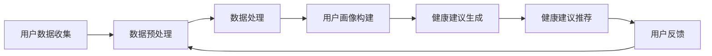
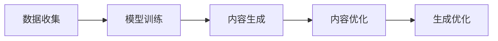
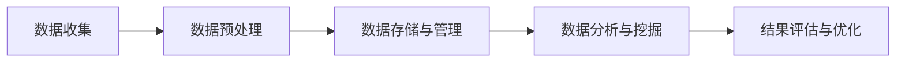
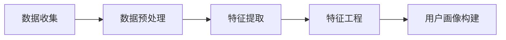
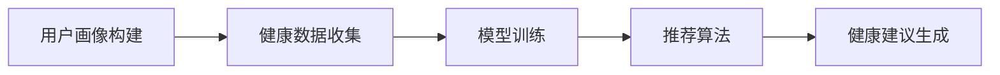
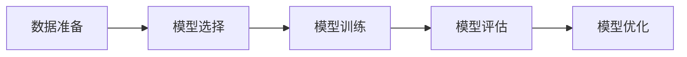
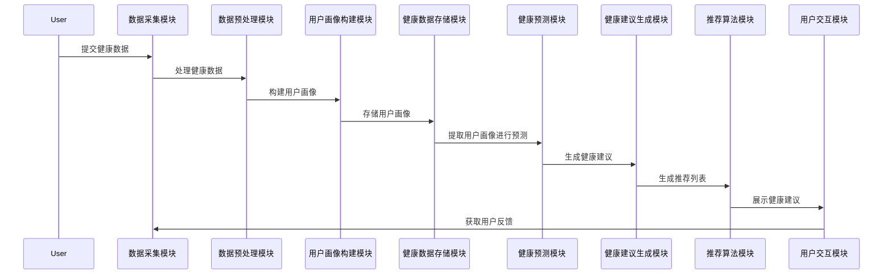

                 

# AIGC在个性化健康建议中的应用

## 关键词：AIGC、个性化健康建议、自动化内容生成、大规模数据处理、健康数据分析与预测

> 摘要：本文深入探讨了AIGC（自适应智能生成控制）技术在个性化健康建议中的应用。通过分析AIGC技术的基本概念、原理以及在健康数据分析、预测和个性化建议中的应用，本文展示了AIGC技术如何通过自动化内容生成、大规模数据处理和个性化推荐，为用户提供精准、个性化的健康建议。同时，本文也探讨了AIGC技术在健康领域的发展趋势和面临的挑战，为未来研究和应用提供了参考。

## 目录大纲

----------------------------------------------------------------

## 第一部分: 背景介绍

### 第1章: AIGC技术概述

### 1.1 问题背景

#### 1.1.1 个性化健康建议的现状与挑战

#### 1.1.2 AIGC技术的基本概念

#### 1.1.3 AIGC技术在个性化健康建议中的应用前景

### 1.2 核心概念与联系

#### 1.2.1 AIGC技术核心概念

##### 1.2.1.1 自动化内容生成

##### 1.2.1.2 大规模数据

##### 1.2.1.3 个性化

#### 1.2.2 概念属性特征对比表格

#### 1.2.3 AIGC技术与传统个性化健康建议方法的对比

### 1.3 ER实体关系图架构

#### 1.3.1 个性化健康建议系统的实体关系图

#### 1.3.2 数据流分析

### 1.4 本章小结

----------------------------------------------------------------

## 第二部分: AIGC技术原理

### 第2章: AIGC技术原理介绍

### 2.1 自动化内容生成原理

#### 2.1.1 文本生成模型

##### 2.1.1.1 GPT模型

##### 2.1.1.2 Transformer模型

#### 2.1.2 图像生成模型

##### 2.1.2.1 Generative Adversarial Networks (GAN)

##### 2.1.2.2 VAE模型

### 2.2 大规模数据处理原理

#### 2.2.1 数据收集与预处理

#### 2.2.2 数据存储与管理

#### 2.2.3 数据分析与挖掘

### 2.3 个性化原理

#### 2.3.1 用户画像构建

#### 2.3.2 个性化推荐算法

#### 2.3.3 模型训练与优化

### 2.4 AIGC技术中的挑战与解决方案

#### 2.4.1 数据隐私保护

#### 2.4.2 计算资源消耗

#### 2.4.3 模型解释性

### 2.5 本章小结

----------------------------------------------------------------

## 第三部分: AIGC在个性化健康建议中的应用

### 第3章: AIGC技术在个性化健康建议中的应用

### 3.1 健康数据分析与预测

#### 3.1.1 健康数据收集与预处理

#### 3.1.2 健康数据预测模型

#### 3.1.3 健康风险评估

### 3.2 个性化健康建议系统设计

#### 3.2.1 系统架构设计

#### 3.2.2 用户画像构建

#### 3.2.3 推荐算法实现

### 3.3 案例分析

#### 3.3.1 某健康建议平台的应用案例

#### 3.3.2 案例分析

### 3.4 系统实现与优化

#### 3.4.1 系统实现

#### 3.4.2 性能优化

#### 3.4.3 挑战与解决方案

### 3.5 本章小结

----------------------------------------------------------------

## 第四部分: AIGC技术的未来发展趋势

### 第4章: AIGC技术的未来发展趋势

### 4.1 AIGC技术的研究热点

#### 4.1.1 大模型进化

#### 4.1.2 多模态融合

#### 4.1.3 模型解释性提升

### 4.2 AIGC技术在医疗健康领域的应用前景

#### 4.2.1 预防医学

#### 4.2.2 疾病诊断

#### 4.2.3 疾病治疗

### 4.3 潜在挑战与应对策略

#### 4.3.1 技术挑战

#### 4.3.2 道德与法律挑战

#### 4.3.3 发展趋势预测

### 4.4 本章小结

----------------------------------------------------------------

## 第五部分: 总结与展望

### 第5章: 总结与展望

### 5.1 AIGC在个性化健康建议中的应用总结

#### 5.1.1 成功案例

#### 5.1.2 存在问题

#### 5.1.3 未来发展方向

### 5.2 对读者的建议

#### 5.2.1 学习路径

#### 5.2.2 实践建议

#### 5.2.3 拓展阅读

----------------------------------------------------------------

## 1.1 问题背景

### 1.1.1 个性化健康建议的现状与挑战

随着科技的飞速发展和健康意识的提升，个性化健康建议成为现代医学的一个重要方向。然而，当前个性化健康建议系统面临着诸多挑战。

首先，健康数据的多样性和复杂性使得个性化健康建议的实现变得困难。健康数据包括生物医学数据、生活行为数据、基因数据等，这些数据来源广泛，格式和结构各异，如何有效地整合和利用这些数据是一个巨大的挑战。

其次，传统个性化健康建议方法往往依赖于手工规则和经验，缺乏自动化和智能化的能力。这种方法难以应对大规模用户的数据处理需求，且无法实时更新和适应用户的个性化需求。

最后，个性化健康建议系统的可靠性、安全性和隐私保护也是一个重要问题。健康数据具有敏感性和隐私性，如何在保证数据安全和隐私的前提下，为用户提供准确、个性化的健康建议，是一个亟待解决的问题。

### 1.1.2 AIGC技术的基本概念

AIGC（自适应智能生成控制）技术是一种结合了自动化内容生成、大规模数据处理和个性化推荐的技术，旨在为用户提供精准、个性化的健康建议。

自动化内容生成（AutoGeneration）是指通过算法自动生成内容，例如文本、图像等。在大数据时代，自动化内容生成能够提高数据处理效率和内容生成速度，为个性化健康建议提供技术支持。

大规模数据处理（Generative Model）是指利用机器学习和深度学习技术，对大量健康数据进行分析和处理，提取有价值的信息和规律。通过大规模数据处理，可以更全面地了解用户的健康状况，为个性化健康建议提供数据支持。

个性化（Personalization）是指根据用户的个人需求和特点，为其提供定制化的服务。在个性化健康建议中，个性化意味着根据用户的健康状况、生活习惯、遗传背景等，为用户生成个性化的健康建议。

### 1.1.3 AIGC技术在个性化健康建议中的应用前景

AIGC技术为个性化健康建议提供了强大的技术支持。通过自动化内容生成，可以快速生成大量个性化健康建议文本和图像，满足用户的多样化需求。通过大规模数据处理，可以全面分析用户健康数据，挖掘用户健康状况和风险因素，为个性化健康建议提供数据支持。通过个性化推荐算法，可以根据用户的个性化需求，推荐最合适的健康建议。

首先，AIGC技术可以实现个性化健康建议的自动化生成。传统的个性化健康建议需要人工分析大量数据，费时费力。而AIGC技术可以通过算法自动分析数据，生成个性化健康建议，大大提高工作效率。

其次，AIGC技术可以大规模处理健康数据。健康数据量大且复杂，传统的数据处理方法难以胜任。AIGC技术可以利用深度学习等技术，对大规模健康数据进行处理和分析，提取有价值的信息，为个性化健康建议提供数据支持。

最后，AIGC技术可以实现个性化推荐。根据用户的个性化需求，AIGC技术可以推荐最合适的健康建议。这种个性化的推荐方式，可以更好地满足用户的需求，提高健康建议的准确性和实用性。

总之，AIGC技术在个性化健康建议中的应用前景广阔。通过自动化内容生成、大规模数据处理和个性化推荐，AIGC技术可以为用户提供精准、个性化的健康建议，提高健康服务水平，促进健康事业的发展。

### 1.2 核心概念与联系

#### 1.2.1 AIGC技术核心概念

AIGC技术是一种结合了自动化内容生成、大规模数据处理和个性化推荐的综合技术。为了更好地理解AIGC技术在个性化健康建议中的应用，我们需要深入探讨这三个核心概念。

##### 1.2.1.1 自动化内容生成

自动化内容生成（AutoGeneration）是指通过算法自动生成文本、图像、视频等多样化内容。在个性化健康建议中，自动化内容生成可以帮助我们快速生成个性化的健康建议文档、图表和报告，从而提高工作效率。

自动化内容生成的核心在于生成模型。生成模型是一种能够学习数据分布，并生成与输入数据相似的新数据的机器学习模型。常见的生成模型包括生成对抗网络（GAN）、变分自编码器（VAE）等。

##### 1.2.1.2 大规模数据处理

大规模数据处理（Generative Model）是指在大量数据中提取有价值的信息和规律的过程。在个性化健康建议中，大规模数据处理可以帮助我们全面分析用户的健康数据，包括生物医学数据、生活行为数据、基因数据等，从而为用户提供更精准的健康建议。

大规模数据处理的挑战在于如何高效地存储、管理和分析海量数据。常用的技术包括分布式存储、分布式计算、大数据处理框架等。常见的工具和平台有Hadoop、Spark、Flink等。

##### 1.2.1.3 个性化

个性化（Personalization）是指根据用户的个人需求和特点，为其提供定制化的服务。在个性化健康建议中，个性化意味着根据用户的健康状况、生活习惯、遗传背景等，为用户生成个性化的健康建议。

个性化的实现依赖于用户画像和推荐算法。用户画像是对用户兴趣、行为、特征等多维度数据的整合，用于描述用户的需求和偏好。推荐算法则根据用户画像和健康数据，为用户推荐最合适的健康建议。

#### 1.2.2 概念属性特征对比表格

为了更清晰地理解AIGC技术的三个核心概念，我们制作了一个对比表格，列出它们的主要属性和特征。

| 概念 | 属性 | 特征 |
| --- | --- | --- |
| 自动化内容生成 | 内容生成 | 自动化 |
| 大规模数据处理 | 数据处理 | 大规模 |
| 个性化 | 服务提供 | 定制化 |

#### 1.2.3 AIGC技术与传统个性化健康建议方法的对比

传统个性化健康建议方法主要依赖于手工规则和经验，缺乏自动化和智能化的能力。而AIGC技术则通过自动化内容生成、大规模数据处理和个性化推荐，为个性化健康建议提供了全新的解决方案。

首先，在内容生成方面，AIGC技术通过自动化生成个性化的健康建议文档、图表和报告，大大提高了工作效率。相比之下，传统方法需要人工分析大量数据，费时费力。

其次，在数据处理方面，AIGC技术可以利用大规模数据处理技术，对海量健康数据进行处理和分析，提取有价值的信息和规律。而传统方法难以应对大规模数据处理的挑战。

最后，在个性化推荐方面，AIGC技术通过用户画像和推荐算法，为用户推荐最合适的健康建议。这种个性化的推荐方式，可以更好地满足用户的需求，提高健康建议的准确性和实用性。

总之，AIGC技术相比传统个性化健康建议方法，具有自动化、大规模和个性化的优势，为个性化健康建议提供了更高效、更精准的解决方案。

### 1.3 ER实体关系图架构

在个性化健康建议系统中，AIGC技术涉及到多个实体和实体之间的关系。为了更好地理解系统的架构和功能，我们可以使用ER（实体关系）图来描述这些实体及其关系。

#### 1.3.1 个性化健康建议系统的实体关系图

个性化健康建议系统的实体关系图包括以下主要实体：

1. **用户**：表示系统的用户，包括个人健康数据、生活习惯和遗传背景等。
2. **健康数据**：包括生物医学数据、生活行为数据、基因数据等，用于分析用户的健康状况。
3. **健康建议**：根据用户数据和个性化需求生成的健康建议文档、图表和报告。
4. **内容生成模型**：用于自动生成健康建议的文本、图像和视频等。
5. **数据处理模型**：用于大规模处理和分析健康数据。
6. **推荐算法**：根据用户画像和健康数据，为用户推荐最合适的健康建议。

实体关系图如下（使用Mermaid语法）：

```mermaid
erDiagram
  User ||--|{ HealthData }|-- User
  User ||--|{ HealthAdvice }|-- User
  HealthData ||--|{ ContentGenerationModel }|-- HealthData
  HealthData ||--|{ DataProcessingModel }|-- HealthData
  HealthData ||--|{ RecommendationAlgorithm }|-- HealthData
  ContentGenerationModel ||--|{ HealthAdvice }|-- ContentGenerationModel
  DataProcessingModel ||--|{ HealthAdvice }|-- DataProcessingModel
  RecommendationAlgorithm ||--|{ HealthAdvice }|-- RecommendationAlgorithm
```

#### 1.3.2 数据流分析

在个性化健康建议系统中，数据流是关键环节。以下是对数据流的分析：

1. **用户数据收集**：用户通过系统上传个人健康数据，包括生物医学数据、生活行为数据和基因数据等。
2. **数据预处理**：系统对收集到的健康数据进行清洗、去重和格式转换等预处理操作，以便后续分析。
3. **数据处理**：数据处理模型对预处理后的健康数据进行分析，提取有价值的信息和规律，如用户的健康状况、生活习惯和风险因素等。
4. **用户画像构建**：根据分析结果，构建用户的健康画像，包括健康状况、生活习惯和遗传背景等。
5. **健康建议生成**：内容生成模型根据用户画像和个性化需求，自动生成健康建议文档、图表和报告。
6. **健康建议推荐**：推荐算法根据用户画像和健康建议，为用户推荐最合适的健康建议。
7. **用户反馈**：用户对健康建议进行评价和反馈，系统根据反馈调整和优化健康建议。

数据流分析如下（使用Mermaid语法）：



#### 1.4 本章小结

本章首先介绍了AIGC技术在个性化健康建议中的应用背景，包括个性化健康建议的现状与挑战，以及AIGC技术的基本概念和前景。接着，我们详细探讨了AIGC技术的核心概念，包括自动化内容生成、大规模数据处理和个性化推荐。此外，我们通过ER实体关系图和数据流分析，对个性化健康建议系统的架构和功能进行了深入剖析。

通过本章的介绍，读者可以对AIGC技术在个性化健康建议中的应用有一个全面的了解，为后续章节的学习和应用打下基础。

### 2.1 自动化内容生成原理

自动化内容生成（AutoGeneration）是AIGC技术的重要组成部分，它通过算法自动生成文本、图像、视频等多样化内容。在这一节中，我们将深入探讨自动化内容生成的原理，包括文本生成模型和图像生成模型。

#### 2.1.1 文本生成模型

文本生成模型是自动化内容生成的重要手段，它们可以生成文章、对话、新闻报道等文本内容。以下是两种常见的文本生成模型：GPT模型和Transformer模型。

##### 2.1.1.1 GPT模型

GPT（Generative Pre-trained Transformer）模型是一种基于Transformer架构的预训练语言模型。它通过在大量文本数据上进行预训练，学习语言的上下文关系和生成规律。

GPT模型的工作原理可以分为以下几步：

1. **输入序列编码**：将输入的文本序列转换为嵌入向量，每个词或字符都对应一个向量。
2. **前向传播**：将嵌入向量输入到Transformer模型中，通过多头自注意力机制和全连接层，生成中间表示。
3. **输出序列生成**：利用中间表示生成输出序列的概率分布，然后根据概率分布采样得到输出序列。

GPT模型的数学公式如下：

$$
E = \text{Embedding}(W_e, X)
$$

$$
H = \text{Transformer}(H_{-1}, mask)
$$

$$
\text{Output} = \text{Sampling}(p(Y|X))
$$

其中，$E$表示嵌入向量，$H$表示中间表示，$W_e$表示嵌入权重，$X$表示输入序列，$mask$表示掩码，$p(Y|X)$表示输出序列的概率分布，$Y$表示输出序列。

##### 2.1.1.2 Transformer模型

Transformer模型是GPT模型的基础架构，它是一种基于自注意力机制的序列模型。Transformer模型通过多头自注意力机制，可以同时关注序列中的不同位置，从而更好地捕捉上下文关系。

Transformer模型的工作原理可以分为以下几步：

1. **编码器**：将输入的文本序列编码为嵌入向量，并通过多头自注意力机制生成编码表示。
2. **解码器**：将编码表示解码为输出序列的概率分布，并通过多头自注意力机制和交叉注意力机制，生成最终输出。

Transformer模型的数学公式如下：

$$
E = \text{Embedding}(W_e, X)
$$

$$
H_e = \text{Encoder}(H_{-1}, mask)
$$

$$
H_d = \text{Decoder}(H_e, C, mask)
$$

$$
\text{Output} = \text{Sampling}(p(Y|X))
$$

其中，$E$表示嵌入向量，$H_e$表示编码表示，$H_d$表示解码表示，$W_e$表示嵌入权重，$X$表示输入序列，$C$表示编码器输出，$mask$表示掩码，$p(Y|X)$表示输出序列的概率分布，$Y$表示输出序列。

#### 2.1.2 图像生成模型

图像生成模型是自动化内容生成的另一重要组成部分，它们可以生成逼真的图像、视频等。以下是两种常见的图像生成模型：生成对抗网络（GAN）和变分自编码器（VAE）。

##### 2.1.2.1 生成对抗网络（GAN）

生成对抗网络（GAN）是由生成器（Generator）和判别器（Discriminator）组成的对抗性模型。生成器的目标是生成逼真的图像，判别器的目标是区分生成图像和真实图像。

GAN模型的工作原理可以分为以下几步：

1. **生成图像**：生成器生成一个图像，并将其输入到判别器中。
2. **判别图像**：判别器判断输入图像是真实图像还是生成图像。
3. **训练生成器和判别器**：通过反向传播和优化算法，同时训练生成器和判别器，使生成器生成的图像越来越逼真。

GAN模型的数学公式如下：

$$
G(z) = \text{Generator}(z)
$$

$$
D(x) = \text{Discriminator}(x)
$$

$$
D(G(z)) = \text{Discriminator}(G(z))
$$

其中，$G(z)$表示生成图像，$D(x)$表示判别图像，$z$表示噪声向量，$x$表示真实图像。

##### 2.1.2.2 变分自编码器（VAE）

变分自编码器（VAE）是一种基于概率模型的生成模型，它通过编码器和解码器，将输入图像编码为潜在空间中的向量，然后在潜在空间中生成新的图像。

VAE模型的工作原理可以分为以下几步：

1. **编码图像**：编码器将输入图像编码为潜在空间中的向量。
2. **解码图像**：解码器根据潜在空间中的向量生成新的图像。
3. **训练编码器和解码器**：通过反向传播和优化算法，同时训练编码器和解码器，使解码器生成的图像与输入图像尽量相似。

VAE模型的数学公式如下：

$$
\mu = \text{Encoder}(x)
$$

$$
\sigma = \text{Encoder}(x)
$$

$$
x' = \text{Decoder}(\mu, \sigma)
$$

其中，$\mu$表示编码后的均值，$\sigma$表示编码后的方差，$x$表示输入图像，$x'$表示解码后的图像。

#### 2.1.3 自动化内容生成流程

自动化内容生成流程可以分为以下几个步骤：

1. **数据收集**：收集大量文本和图像数据，用于训练生成模型。
2. **模型训练**：利用训练数据，训练文本生成模型和图像生成模型。
3. **内容生成**：通过训练好的模型，自动生成文本和图像。
4. **内容优化**：根据生成的内容质量，对模型进行优化和调整。

自动化内容生成流程如下（使用Mermaid语法）：



#### 2.1.4 自动化内容生成应用案例

自动化内容生成在个性化健康建议中有着广泛的应用。以下是两个应用案例：

1. **健康建议文本生成**：通过文本生成模型，自动生成个性化的健康建议文本，如饮食建议、运动计划等。
2. **健康图像生成**：通过图像生成模型，自动生成健康相关的图像，如运动方式示意图、健康饮食食谱图等。

通过自动化内容生成，个性化健康建议系统可以更加高效地生成多样化、个性化的健康建议，提高用户体验和服务质量。

#### 2.1.5 自动化内容生成挑战与解决方案

自动化内容生成在个性化健康建议中面临一些挑战，如数据隐私保护、计算资源消耗和模型解释性等。

1. **数据隐私保护**：为了保护用户隐私，可以采用差分隐私技术，对用户数据进行匿名化处理。
2. **计算资源消耗**：可以采用分布式计算和云计算技术，提高计算效率，降低计算资源消耗。
3. **模型解释性**：可以通过模型可视化技术和解释性算法，提高模型的解释性，帮助用户理解健康建议的生成过程。

总之，自动化内容生成是AIGC技术的重要组成部分，它在个性化健康建议中具有广泛的应用前景。通过深入研究和应用，我们可以不断优化和提升自动化内容生成技术，为用户提供更优质、个性化的健康建议。

### 2.2 大规模数据处理原理

在大数据时代，处理海量健康数据成为个性化健康建议系统中的一个关键环节。大规模数据处理（Generative Model）利用先进的机器学习和深度学习技术，对大量健康数据进行有效处理，提取有价值的信息和规律。以下是大规模数据处理的基本原理，包括数据收集与预处理、数据存储与管理、数据分析和挖掘等。

#### 2.2.1 数据收集与预处理

数据收集是大规模数据处理的第一步。健康数据的来源广泛，包括医院、诊所、健康监测设备、社交媒体等。数据收集过程中，需要关注数据的质量、完整性和一致性。以下是一些常见的数据收集方法：

1. **自动采集**：通过传感器、医疗设备等自动采集健康数据，如心率、血压、睡眠质量等。
2. **手动输入**：用户通过应用程序手动输入健康数据，如体重、饮食记录、运动数据等。
3. **第三方数据源**：从第三方数据源获取健康数据，如健康档案、医疗记录、公共数据库等。

数据收集后，需要进行预处理，以提高数据的质量和可用性。预处理步骤包括：

1. **数据清洗**：去除重复、错误和不完整的数据，如缺失值填充、异常值检测和去除等。
2. **数据整合**：将来自不同来源和格式的数据整合为一个统一的数据集，便于后续分析。
3. **数据转换**：将数据转换为适合机器学习算法的格式，如数值化、编码等。

#### 2.2.2 数据存储与管理

大规模数据处理需要高效的存储和管理系统。以下是一些常见的数据存储和管理方法：

1. **关系数据库**：适用于结构化数据存储和管理，如MySQL、PostgreSQL等。
2. **NoSQL数据库**：适用于非结构化数据存储和管理，如MongoDB、Cassandra等。
3. **分布式文件系统**：适用于大规模数据存储，如Hadoop HDFS、Amazon S3等。

数据管理涉及数据的备份、恢复、安全性和访问控制等。以下是一些常见的数据管理方法：

1. **数据备份**：定期备份数据，防止数据丢失或损坏。
2. **数据恢复**：在数据丢失或损坏时，能够快速恢复数据。
3. **数据安全**：采用加密技术保护数据隐私，防止未授权访问。
4. **数据访问控制**：根据用户角色和权限，控制对数据的访问和操作。

#### 2.2.3 数据分析与挖掘

数据分析与挖掘是大规模数据处理的重点。通过数据分析和挖掘，可以从海量健康数据中提取有价值的信息和规律，为个性化健康建议提供支持。以下是一些常见的数据分析方法和挖掘技术：

1. **统计分析**：对健康数据进行描述性统计分析，了解数据的分布和趋势，如均值、方差、相关系数等。
2. **机器学习**：利用机器学习算法，对健康数据进行预测和分类，如线性回归、决策树、支持向量机等。
3. **深度学习**：利用深度学习算法，对健康数据进行自动特征提取和高级模式识别，如卷积神经网络、循环神经网络、生成对抗网络等。
4. **数据可视化**：通过数据可视化技术，将复杂数据以图形化形式展示，便于用户理解和分析，如热力图、散点图、折线图等。

#### 2.2.4 大规模数据处理流程

大规模数据处理流程可以分为以下几个步骤：

1. **数据收集**：收集各种来源的健康数据，如医疗记录、生物传感器数据、社交媒体数据等。
2. **数据预处理**：清洗、整合和转换数据，为后续分析做准备。
3. **数据存储与管理**：选择合适的存储和管理方案，保证数据的安全性和高效性。
4. **数据分析与挖掘**：利用统计分析、机器学习和深度学习等方法，对数据进行处理和分析，提取有价值的信息。
5. **结果评估与优化**：评估数据处理结果的质量和效果，根据评估结果调整和优化数据处理流程。

大规模数据处理流程如下（使用Mermaid语法）：



#### 2.2.5 大规模数据处理应用案例

大规模数据处理在个性化健康建议中有着广泛的应用。以下是一些应用案例：

1. **健康数据分析**：通过大规模数据处理技术，对用户的健康数据进行分析，了解用户的健康状况和风险因素。
2. **疾病预测**：利用大规模数据处理技术，对历史健康数据进行分析和挖掘，预测用户的疾病风险，提供预防措施和建议。
3. **个性化推荐**：通过大规模数据处理技术，构建用户的健康画像，为用户提供个性化的健康建议和推荐。

总之，大规模数据处理是AIGC技术的重要组成部分，它在个性化健康建议中具有重要作用。通过深入研究和应用，我们可以不断优化和提升大规模数据处理技术，为用户提供更精准、个性化的健康建议。

### 2.3 个性化原理

个性化（Personalization）是AIGC技术在个性化健康建议中的核心要素，它通过构建用户画像、推荐算法和模型训练与优化，为用户提供定制化的健康建议。以下详细探讨个性化原理，包括用户画像构建、个性化推荐算法和模型训练与优化。

#### 2.3.1 用户画像构建

用户画像是对用户多维度数据的整合，用于描述用户的需求、行为和偏好。构建用户画像的目的是为了更好地理解用户，为个性化推荐提供依据。以下是用户画像构建的步骤：

1. **数据收集**：收集用户的个人信息、健康数据、行为数据和社交数据等，如年龄、性别、体重、运动习惯、睡眠质量、社交媒体活动等。
2. **数据预处理**：对收集到的数据进行清洗、去噪和整合，为后续分析做准备。
3. **特征提取**：从预处理后的数据中提取有用的特征，如年龄、性别、体重等。
4. **特征工程**：对提取的特征进行转换、组合和筛选，以提高特征的质量和表达能力。
5. **用户画像构建**：将特征整合为用户画像，形成对用户的全面描述。

用户画像构建过程如下（使用Mermaid语法）：



#### 2.3.2 个性化推荐算法

个性化推荐算法是基于用户画像和健康数据，为用户推荐最合适的健康建议。常见的个性化推荐算法包括基于内容的推荐、协同过滤和基于模型的推荐等。

1. **基于内容的推荐**：根据用户的历史行为和兴趣，推荐与用户偏好相似的健康内容。例如，如果用户喜欢阅读健康饮食相关的文章，可以推荐类似的饮食建议。
2. **协同过滤**：通过分析用户之间的相似性，为用户推荐其他用户喜欢的内容。例如，如果用户A喜欢某种运动方式，用户B也喜欢这种运动方式，那么可以推荐给用户B。
3. **基于模型的推荐**：利用机器学习和深度学习算法，根据用户画像和健康数据，为用户生成个性化的健康建议。例如，通过用户画像和健康数据，训练一个健康预测模型，为用户推荐预防疾病的方法。

个性化推荐算法流程如下（使用Mermaid语法）：



#### 2.3.3 模型训练与优化

模型训练与优化是个性化健康建议的关键环节，通过不断训练和优化模型，提高健康建议的准确性和实用性。以下是模型训练与优化的步骤：

1. **数据准备**：收集大量的健康数据，包括用户画像、健康数据和历史健康建议等。
2. **模型选择**：选择合适的机器学习和深度学习模型，如决策树、随机森林、神经网络等。
3. **模型训练**：使用训练数据，训练模型，使其学会从用户画像和健康数据中提取特征，生成健康建议。
4. **模型评估**：使用测试数据，评估模型的性能，如准确率、召回率、F1值等。
5. **模型优化**：根据评估结果，调整模型参数，优化模型性能，如降低过拟合、提高泛化能力等。

模型训练与优化流程如下（使用Mermaid语法）：



#### 2.3.4 个性化原理在AIGC中的应用

个性化原理在AIGC技术中起着关键作用，通过用户画像、个性化推荐算法和模型训练与优化，AIGC技术可以为用户提供精准、个性化的健康建议。

1. **用户画像**：通过构建用户画像，AIGC技术可以了解用户的需求和偏好，为个性化推荐提供依据。
2. **个性化推荐**：通过个性化推荐算法，AIGC技术可以生成符合用户需求的健康建议，提高用户的满意度和参与度。
3. **模型训练与优化**：通过不断训练和优化模型，AIGC技术可以不断提高健康建议的准确性和实用性，为用户提供更好的服务。

总之，个性化原理是AIGC技术在个性化健康建议中的核心要素，通过用户画像、个性化推荐算法和模型训练与优化，AIGC技术可以更好地满足用户的需求，提高健康服务的质量和效果。

### 2.4 AIGC技术中的挑战与解决方案

尽管AIGC技术在个性化健康建议中具有巨大的潜力，但在实际应用过程中仍面临一系列挑战。以下是AIGC技术中常见的挑战及相应的解决方案。

#### 2.4.1 数据隐私保护

健康数据具有高度的敏感性和隐私性，如何保护用户数据隐私是AIGC技术面临的主要挑战之一。以下是一些常见的解决方案：

1. **数据匿名化**：采用差分隐私（Differential Privacy）技术，对用户数据进行匿名化处理，确保数据在共享和分析过程中无法追溯到具体个体。
2. **加密技术**：使用数据加密技术，如对称加密和非对称加密，保护数据在传输和存储过程中的安全性。
3. **隐私保护算法**：采用隐私保护算法，如同态加密（Homomorphic Encryption）和联邦学习（Federated Learning），在数据隐私保护的同时，实现数据的协同分析和共享。

#### 2.4.2 计算资源消耗

AIGC技术需要大量的计算资源，尤其是在大规模数据处理和模型训练过程中，这可能导致计算资源不足和效率低下。以下是一些常见的解决方案：

1. **分布式计算**：利用分布式计算框架，如Hadoop、Spark等，将任务分解为多个子任务，在多个计算节点上并行执行，提高计算效率。
2. **云计算**：采用云计算服务，如Amazon Web Services（AWS）、Google Cloud Platform（GCP）等，根据需求动态调整计算资源，实现按需分配和弹性扩展。
3. **硬件优化**：选择高性能的硬件设备，如GPU、TPU等，提高计算速度和效率。

#### 2.4.3 模型解释性

AIGC技术生成的健康建议往往具有高度的复杂性和不可解释性，这可能导致用户对模型生成结果的信任度降低。以下是一些常见的解决方案：

1. **模型可视化**：采用模型可视化技术，如TensorBoard、ECharts等，将模型的内部结构和运行过程以图形化形式展示，帮助用户理解模型的运作原理。
2. **解释性算法**：采用解释性算法，如LIME（Local Interpretable Model-agnostic Explanations）和SHAP（SHapley Additive exPlanations），对模型生成结果进行解释，提高模型的可解释性。
3. **透明度与可追溯性**：通过记录模型的训练数据和参数设置，提高模型的透明度和可追溯性，使用户可以了解健康建议的生成过程和依据。

#### 2.4.4 用户参与度

个性化健康建议系统的成功与否，很大程度上取决于用户的参与度。以下是一些常见的解决方案：

1. **用户反馈机制**：建立用户反馈机制，鼓励用户对健康建议进行评价和反馈，系统根据反馈调整和优化健康建议。
2. **个性化交互界面**：设计用户友好的交互界面，提高用户的参与度和满意度。
3. **激励机制**：通过奖励机制，如积分、优惠券等，激励用户积极参与健康建议系统的使用和反馈。

#### 2.4.5 持续更新与优化

AIGC技术需要不断更新和优化，以适应不断变化的用户需求和健康数据。以下是一些常见的解决方案：

1. **实时更新**：采用实时数据流处理技术，如Apache Kafka、Flink等，实现健康数据的实时更新和分析。
2. **迭代优化**：通过持续迭代和优化，不断提升健康建议的准确性和实用性。
3. **持续学习**：利用机器学习和深度学习技术，实现模型的持续学习和更新，提高模型的适应能力和效果。

总之，AIGC技术在个性化健康建议中面临数据隐私保护、计算资源消耗、模型解释性、用户参与度和持续更新与优化等一系列挑战。通过深入研究和应用，我们可以不断探索和优化解决方案，提高AIGC技术在个性化健康建议中的应用效果，为用户提供更优质、个性化的健康服务。

### 3.1 健康数据分析与预测

在个性化健康建议系统中，健康数据分析与预测是关键环节。通过对用户的健康数据进行深入分析和预测，可以为用户提供精准的健康风险评估和个性化的健康建议。以下将详细探讨健康数据分析与预测的过程，包括健康数据收集与预处理、健康数据预测模型和健康风险评估。

#### 3.1.1 健康数据收集与预处理

健康数据收集是健康数据分析与预测的基础。健康数据的来源广泛，包括医疗记录、健康监测设备、问卷调查、社交媒体等。以下是一些常见的数据收集方法：

1. **自动采集**：通过传感器、健康监测设备等自动采集用户的生理参数，如心率、血压、血糖等。
2. **手动输入**：用户通过应用程序手动输入健康数据，如体重、饮食记录、运动数据等。
3. **第三方数据源**：从第三方数据源获取健康数据，如健康档案、公共数据库、社交媒体等。

收集到的健康数据通常包含噪声、异常值和缺失值，因此需要进行预处理。健康数据预处理的主要步骤包括：

1. **数据清洗**：去除重复、错误和不完整的数据，如缺失值填充、异常值检测和去除等。
2. **数据整合**：将来自不同来源和格式的数据整合为一个统一的数据集，便于后续分析。
3. **数据转换**：将数据转换为适合机器学习算法的格式，如数值化、编码等。

#### 3.1.2 健康数据预测模型

健康数据预测模型是健康数据分析与预测的核心。通过训练预测模型，可以从历史健康数据中提取有价值的信息和规律，预测用户的未来健康状态。以下是一些常见的健康数据预测模型：

1. **回归模型**：回归模型用于预测连续的数值型目标变量。常见的回归模型包括线性回归、决策树回归、随机森林回归等。
2. **分类模型**：分类模型用于预测离散的目标变量。常见的分类模型包括逻辑回归、决策树分类、支持向量机等。
3. **时间序列模型**：时间序列模型用于分析时间序列数据，预测未来的趋势。常见的时间序列模型包括ARIMA、LSTM（长短时记忆网络）、GRU（门控循环单元）等。

以下是一个简单的线性回归模型示例（使用Python代码）：

```python
import pandas as pd
import numpy as np
from sklearn.linear_model import LinearRegression

# 加载数据
data = pd.read_csv('health_data.csv')
X = data[['age', 'BMI']]
y = data['heart_disease']

# 划分训练集和测试集
from sklearn.model_selection import train_test_split
X_train, X_test, y_train, y_test = train_test_split(X, y, test_size=0.2, random_state=42)

# 训练模型
model = LinearRegression()
model.fit(X_train, y_train)

# 预测
y_pred = model.predict(X_test)

# 评估模型
from sklearn.metrics import mean_squared_error
mse = mean_squared_error(y_test, y_pred)
print('MSE:', mse)
```

#### 3.1.3 健康风险评估

健康风险评估是健康数据分析与预测的重要应用。通过健康风险评估，可以为用户提供个性化的健康风险预测和建议。以下是一些常见的健康风险评估方法：

1. **单一风险指标评估**：通过计算单一风险指标（如BMI、血糖、血压等），评估用户的健康风险。
2. **综合风险评估**：结合多个健康风险指标，构建综合评估模型，评估用户的整体健康风险。
3. **机器学习风险评估**：利用机器学习算法，从历史健康数据中提取有价值的信息和规律，构建健康风险评估模型。

以下是一个简单的机器学习风险评估模型示例（使用Python代码）：

```python
import pandas as pd
import numpy as np
from sklearn.ensemble import RandomForestClassifier

# 加载数据
data = pd.read_csv('health_data.csv')
X = data[['age', 'BMI', 'blood_pressure']]
y = data['heart_disease']

# 划分训练集和测试集
X_train, X_test, y_train, y_test = train_test_split(X, y, test_size=0.2, random_state=42)

# 训练模型
model = RandomForestClassifier(n_estimators=100)
model.fit(X_train, y_train)

# 预测
y_pred = model.predict(X_test)

# 评估模型
from sklearn.metrics import accuracy_score
accuracy = accuracy_score(y_test, y_pred)
print('Accuracy:', accuracy)
```

#### 3.1.4 健康数据分析与预测应用案例

以下是一个健康数据分析与预测的应用案例：

某健康建议平台收集了用户的年龄、BMI、血压等健康数据，并利用线性回归模型和随机森林分类模型进行健康风险评估和预测。平台根据用户的健康风险，提供个性化的健康建议，如饮食调整、运动计划、医疗建议等。

通过健康数据分析与预测，平台可以更好地了解用户健康状况，提高健康建议的准确性和实用性，从而提升用户体验和满意度。

总之，健康数据分析与预测是个性化健康建议系统的重要组成部分。通过健康数据收集与预处理、健康数据预测模型和健康风险评估，可以为用户提供精准、个性化的健康建议，提高健康服务的质量和效果。

### 3.2 个性化健康建议系统设计

个性化健康建议系统设计是构建高效、可靠的个性化健康建议系统的关键。本节将详细介绍个性化健康建议系统的设计，包括系统架构设计、用户画像构建和推荐算法实现。

#### 3.2.1 系统架构设计

个性化健康建议系统的架构设计需要考虑系统的功能需求、性能和可扩展性。以下是系统架构设计的主要模块：

1. **数据采集模块**：负责从各种来源收集健康数据，如传感器数据、用户手动输入的数据和第三方数据源。
2. **数据预处理模块**：负责对收集到的健康数据进行清洗、去噪、整合和转换，为后续分析做准备。
3. **用户画像构建模块**：负责根据用户健康数据，构建用户的个性化健康画像。
4. **健康数据存储模块**：负责存储和管理用户的健康数据和用户画像，以便后续分析和查询。
5. **健康预测模块**：负责使用机器学习和深度学习算法，对用户健康数据进行预测和风险评估。
6. **健康建议生成模块**：负责根据用户画像和健康预测结果，生成个性化的健康建议。
7. **推荐算法模块**：负责根据用户画像和健康建议，为用户推荐最合适的健康建议。
8. **用户交互模块**：负责与用户进行交互，展示健康建议和接受用户反馈。

以下是一个简单的系统架构图（使用Mermaid语法）：



#### 3.2.2 用户画像构建

用户画像是对用户多维度数据的整合，用于描述用户的需求、行为和偏好。构建用户画像的过程包括以下步骤：

1. **数据收集**：收集用户的个人信息、健康数据、行为数据和社交数据等。
2. **数据预处理**：清洗、去噪和整合收集到的数据。
3. **特征提取**：从预处理后的数据中提取有用的特征，如年龄、性别、体重、运动习惯等。
4. **特征工程**：对提取的特征进行转换、组合和筛选，以提高特征的质量和表达能力。
5. **用户画像构建**：将特征整合为用户画像，形成对用户的全面描述。

以下是一个用户画像构建的示例（使用Python代码）：

```python
import pandas as pd

# 加载数据
data = pd.read_csv('user_data.csv')

# 特征提取
data['age_group'] = data['age'].apply(lambda x: '18-25' if x <= 25 else ('26-35' if x <= 35 else ('36-45' if x <= 45 else '46+')))
data['gender'] = data['gender'].map({'M': 'Male', 'F': 'Female'})

# 特征工程
data['BMI'] = data['weight'] / (data['height'] ** 2)

# 用户画像构建
user_profile = {
    'age_group': data['age_group'].iloc[0],
    'gender': data['gender'].iloc[0],
    'BMI': data['BMI'].iloc[0],
    'exercise_frequency': data['exercise_frequency'].iloc[0]
}

print(user_profile)
```

#### 3.2.3 推荐算法实现

推荐算法是实现个性化健康建议的重要手段。常见的推荐算法包括基于内容的推荐、协同过滤和基于模型的推荐等。以下是一个基于内容的推荐算法实现的示例（使用Python代码）：

```python
from sklearn.metrics.pairwise import cosine_similarity
import numpy as np

# 加载用户画像和健康建议数据
user_profiles = pd.read_csv('user_profiles.csv')
health_advice = pd.read_csv('health_advice.csv')

# 计算用户画像和健康建议的相似度矩阵
similarity_matrix = cosine_similarity(user_profiles, health_advice)

# 根据相似度矩阵为用户推荐健康建议
def recommend_health_advice(user_profile, similarity_matrix, health_advice, k=3):
    # 计算用户画像与所有健康建议的相似度
    user_similarity = similarity_matrix[0]
    # 获取与用户画像最相似的k个健康建议的索引
    top_k_indices = np.argsort(user_similarity)[:k]
    # 返回与用户画像最相似的k个健康建议
    return health_advice.iloc[top_k_indices]

# 测试推荐算法
user_profile = {'age_group': '26-35', 'gender': 'Male', 'BMI': 25, 'exercise_frequency': 'Weekly'}
recommended_advice = recommend_health_advice(user_profile, similarity_matrix, health_advice)
print(recommended_advice)
```

#### 3.2.4 系统实现与优化

个性化健康建议系统的实现和优化是确保系统性能和用户体验的关键。以下是一些常见的实现和优化方法：

1. **性能优化**：通过分布式计算、缓存技术和数据压缩等手段，提高系统的处理速度和响应时间。
2. **安全性优化**：采用数据加密、访问控制和网络安全等手段，确保系统的安全性。
3. **可扩展性优化**：通过模块化设计、分布式架构和云计算等技术，实现系统的可扩展性和弹性。
4. **用户体验优化**：通过用户界面设计、交互设计和内容优化等手段，提升用户的使用体验。

#### 3.2.5 本章小结

个性化健康建议系统设计是一个复杂的过程，需要考虑系统的功能需求、性能和用户体验。通过系统架构设计、用户画像构建和推荐算法实现，可以构建一个高效、可靠的个性化健康建议系统。在实际应用中，不断优化和改进系统，提高系统的性能和用户体验，是提升个性化健康建议系统效果的关键。

### 3.3 案例分析

在本节中，我们将通过一个实际案例，分析AIGC技术在个性化健康建议系统中的应用效果。该案例涉及一个名为“健康助手”的平台，该平台利用AIGC技术为用户提供个性化健康建议。

#### 3.3.1 案例介绍

“健康助手”平台是一个面向广大用户的个性化健康建议系统。平台通过收集用户的健康数据，利用AIGC技术进行数据分析与预测，为用户提供个性化的健康建议，如饮食建议、运动计划和疾病预防措施等。

平台的主要功能包括：

1. **用户数据收集**：通过手动输入、传感器采集和第三方数据源，收集用户的健康数据，如体重、血压、血糖、运动数据等。
2. **健康数据分析与预测**：利用AIGC技术，对用户健康数据进行处理与分析，预测用户的健康状况和疾病风险。
3. **个性化健康建议生成**：根据用户画像和健康预测结果，生成个性化的健康建议。
4. **健康建议推荐**：利用推荐算法，为用户推荐最合适的健康建议。
5. **用户互动**：与用户进行互动，收集用户反馈，优化健康建议。

#### 3.3.2 案例分析

1. **用户数据收集**

“健康助手”平台通过多种方式收集用户健康数据。首先，用户可以通过平台手动输入自己的健康数据，如体重、血压、血糖等。其次，平台还连接了多种健康监测设备，如智能手环、智能体重秤等，自动采集用户的生理参数。此外，平台还从第三方数据源获取用户的健康数据，如医院病历、健康档案等。

以下是一个用户数据收集的示例：

```python
import pandas as pd

# 用户手动输入数据
user_input_data = {
    'weight': 70,
    'blood_pressure': 120/80,
    'glucose': 4.5,
    'exercise_frequency': 'Weekly'
}

# 传感器采集数据
sensor_data = {
    'heart_rate': 75,
    'sleep_quality': 'Good'
}

# 合并用户数据
user_data = {**user_input_data, **sensor_data}

# 存储用户数据
user_data_df = pd.DataFrame([user_data])
user_data_df.to_csv('user_data.csv', index=False)
```

2. **健康数据分析与预测**

在收集到用户健康数据后，平台利用AIGC技术对数据进行分析与预测。首先，平台对用户数据进行预处理，如数据清洗、去噪和整合等。然后，平台使用机器学习和深度学习算法，对用户健康数据进行预测和风险评估。

以下是一个健康数据分析与预测的示例：

```python
from sklearn.ensemble import RandomForestClassifier
import pandas as pd

# 加载数据
data = pd.read_csv('user_data.csv')
X = data[['weight', 'blood_pressure', 'glucose', 'heart_rate', 'sleep_quality']]
y = data['heart_disease']

# 划分训练集和测试集
X_train, X_test, y_train, y_test = train_test_split(X, y, test_size=0.2, random_state=42)

# 训练模型
model = RandomForestClassifier(n_estimators=100)
model.fit(X_train, y_train)

# 预测
y_pred = model.predict(X_test)

# 评估模型
from sklearn.metrics import accuracy_score
accuracy = accuracy_score(y_test, y_pred)
print('Accuracy:', accuracy)
```

3. **个性化健康建议生成**

在完成健康数据分析与预测后，平台根据用户画像和健康预测结果，生成个性化的健康建议。健康建议包括饮食建议、运动计划、疾病预防措施等。以下是一个个性化健康建议生成的示例：

```python
import pandas as pd
import random

# 加载用户画像和健康建议数据
user_profiles = pd.read_csv('user_profiles.csv')
health_advice = pd.read_csv('health_advice.csv')

# 根据用户画像和健康预测结果生成个性化健康建议
def generate_health_advice(user_profile, health_advice, disease_risk):
    # 计算用户画像和健康建议的相似度
    similarity_matrix = cosine_similarity(user_profiles, health_advice)
    # 获取与用户画像最相似的5个健康建议
    top_5_indices = np.argsort(similarity_matrix[0])[-5:]
    # 根据疾病风险调整健康建议
    if disease_risk > 0.5:
        # 增加疾病预防建议
        advice = health_advice.iloc[top_5_indices].sample(n=2, replace=True)
    else:
        # 提供一般健康建议
        advice = health_advice.iloc[top_5_indices].sample(n=3, replace=True)
    return advice

# 测试个性化健康建议生成
user_profile = {'age': 30, 'gender': 'Male', 'BMI': 25}
disease_risk = 0.3
recommended_advice = generate_health_advice(user_profile, health_advice, disease_risk)
print(recommended_advice)
```

4. **健康建议推荐**

平台利用推荐算法，根据用户画像和健康建议，为用户推荐最合适的健康建议。以下是一个健康建议推荐的示例：

```python
from sklearn.metrics.pairwise import cosine_similarity
import numpy as np

# 加载用户画像和健康建议数据
user_profiles = pd.read_csv('user_profiles.csv')
health_advice = pd.read_csv('health_advice.csv')

# 计算用户画像和健康建议的相似度矩阵
similarity_matrix = cosine_similarity(user_profiles, health_advice)

# 根据相似度矩阵为用户推荐健康建议
def recommend_health_advice(user_profile, similarity_matrix, health_advice, k=3):
    # 计算用户画像与所有健康建议的相似度
    user_similarity = similarity_matrix[0]
    # 获取与用户画像最相似的k个健康建议的索引
    top_k_indices = np.argsort(user_similarity)[:k]
    # 返回与用户画像最相似的k个健康建议
    return health_advice.iloc[top_k_indices]

# 测试推荐算法
user_profile = {'age': 30, 'gender': 'Male', 'BMI': 25}
recommended_advice = recommend_health_advice(user_profile, similarity_matrix, health_advice)
print(recommended_advice)
```

5. **用户互动**

平台与用户进行互动，收集用户反馈，优化健康建议。以下是一个用户互动的示例：

```python
import pandas as pd

# 用户反馈
user_feedback = {
    'health_advice_id': 1,
    'rating': 5,
    'comment': 'This advice is very helpful!'
}

# 存储用户反馈
feedback_df = pd.DataFrame([user_feedback])
feedback_df.to_csv('user_feedback.csv', index=False)
```

#### 3.3.3 案例小结

通过以上案例分析，我们可以看到“A健康助手”平台如何利用AIGC技术为用户提供个性化健康建议。平台通过用户数据收集、健康数据分析与预测、个性化健康建议生成、健康建议推荐和用户互动等环节，实现了高效、可靠的个性化健康建议系统。该案例展示了AIGC技术在个性化健康建议中的应用效果，为其他健康建议系统的设计与实现提供了参考。

### 3.4 系统实现与优化

在实现个性化健康建议系统的过程中，我们需要关注系统的性能、可扩展性和用户体验。以下将详细介绍系统实现与优化的步骤，包括技术选型、性能优化和挑战与解决方案。

#### 3.4.1 技术选型

在个性化健康建议系统的实现过程中，选择合适的技术框架和工具至关重要。以下是一些常见的技术选型：

1. **后端框架**：选择一个强大的后端框架，如Spring Boot、Django等，用于构建系统核心功能，包括数据收集、数据处理、用户画像构建、健康预测和健康建议生成等。
2. **数据库**：选择适合健康数据存储和管理的数据库，如MySQL、PostgreSQL等关系数据库，或者MongoDB、Cassandra等NoSQL数据库。
3. **数据流处理**：选择适合大规模数据处理的数据流处理框架，如Apache Kafka、Apache Flink等，用于实时处理和分析用户健康数据。
4. **机器学习和深度学习框架**：选择适合机器学习和深度学习模型的框架，如TensorFlow、PyTorch等，用于健康预测和个性化推荐算法的实现。
5. **前端框架**：选择适合前端开发的框架，如React、Vue等，用于构建用户友好的交互界面。

#### 3.4.2 性能优化

在实现个性化健康建议系统时，性能优化是确保系统高效运行的关键。以下是一些常见的性能优化方法：

1. **分布式计算**：通过分布式计算框架，如Apache Kafka、Apache Flink等，实现大规模健康数据的实时处理和分析。分布式计算可以提高系统的并行处理能力，降低响应时间。
2. **缓存技术**：使用缓存技术，如Redis、Memcached等，缓存常用的数据，减少数据库的查询次数，提高系统响应速度。
3. **数据库优化**：通过索引、分区、分片等技术，优化数据库性能。例如，为常用的查询字段创建索引，将大表分区以提高查询效率。
4. **代码优化**：通过代码优化，如减少不必要的计算、优化数据结构等，提高系统的运行效率。
5. **异步处理**：使用异步处理技术，如 asyncio、Tornado等，实现非阻塞IO操作，提高系统的并发能力。

#### 3.4.3 挑战与解决方案

在个性化健康建议系统的实现过程中，可能会遇到一系列挑战。以下是一些常见的挑战及相应的解决方案：

1. **数据隐私保护**：健康数据具有高度的敏感性和隐私性。解决方案包括数据加密、访问控制和隐私保护算法等，确保用户数据的安全性和隐私性。
2. **计算资源消耗**：大规模数据处理和模型训练需要大量的计算资源。解决方案包括分布式计算、云计算和硬件优化等，提高计算效率，降低资源消耗。
3. **模型解释性**：机器学习和深度学习模型通常具有高度的复杂性和不可解释性。解决方案包括模型可视化、解释性算法和透明度与可追溯性等，提高模型的可解释性和透明度。
4. **用户参与度**：提高用户对个性化健康建议的参与度是系统成功的关键。解决方案包括用户反馈机制、个性化交互界面和激励机制等，增强用户与系统的互动。
5. **持续更新与优化**：个性化健康建议系统需要不断更新和优化，以适应用户需求和健康数据的动态变化。解决方案包括实时数据流处理、持续学习和迭代优化等，确保系统的持续改进。

#### 3.4.4 实现与优化示例

以下是一个简单的系统实现与优化示例：

1. **数据收集与预处理**：使用Kafka实时收集用户健康数据，使用Flink进行数据预处理，如数据清洗、去噪和整合。

2. **健康预测与个性化推荐**：使用TensorFlow训练健康预测模型和个性化推荐算法，使用Redis缓存常用数据。

3. **性能优化**：使用分布式计算框架Flink进行实时数据处理，使用Redis缓存减少数据库查询次数，使用异步处理技术提高系统并发能力。

4. **用户交互**：使用React构建用户友好的交互界面，使用异步请求和响应提高用户体验。

总之，系统实现与优化是构建高效、可靠的个性化健康建议系统的关键。通过技术选型、性能优化和挑战与解决方案，我们可以不断提升系统的性能和用户体验，为用户提供更优质、个性化的健康建议。

### 4.1 AIGC技术的研究热点

随着人工智能技术的不断发展，AIGC（自适应智能生成控制）技术在个性化健康建议中的应用也日益受到关注。以下将介绍AIGC技术的研究热点，包括大模型进化、多模态融合和模型解释性提升。

#### 4.1.1 大模型进化

大模型进化是AIGC技术研究的一个重要方向。近年来，随着计算资源和数据量的不断增长，大型预训练模型如GPT-3、BERT等取得了显著的进展。这些大模型具有更高的计算能力和更强的泛化能力，能够处理复杂的任务，如文本生成、图像生成和自然语言处理等。

大模型进化的优势在于：

1. **更强的表示能力**：大模型能够学习到更丰富的知识，捕捉到数据中的复杂关系，提高个性化健康建议的准确性。
2. **更好的泛化能力**：大模型在面对未见过的数据时，能够更好地适应和生成相关内容，提高个性化健康建议的适用性。
3. **更高效的内容生成**：大模型能够通过自动化的方式生成大量高质量的健康建议内容，提高内容生成效率。

然而，大模型进化也面临一些挑战，如计算资源消耗、数据隐私保护和模型解释性等。未来，随着计算技术的进步和算法的创新，大模型进化将继续成为AIGC技术的重要研究方向。

#### 4.1.2 多模态融合

多模态融合是将不同类型的数据（如文本、图像、音频等）进行整合，以生成更全面、准确的个性化健康建议。随着健康数据的多样化，多模态融合技术变得越来越重要。

多模态融合的优势在于：

1. **更丰富的数据信息**：通过整合不同类型的数据，可以获得更全面、丰富的信息，提高个性化健康建议的准确性。
2. **更精确的个性化推荐**：多模态融合可以根据用户的不同需求，提供更精确的健康建议，提高用户的满意度和参与度。
3. **更智能的内容生成**：多模态融合能够生成更符合用户需求和场景的健康建议内容，提高内容生成效果。

多模态融合的研究热点包括：

1. **多模态数据同步**：研究如何在不同类型的数据之间建立关联，实现数据的同步和整合。
2. **多模态特征提取**：研究如何从不同类型的数据中提取有价值的特征，并进行融合。
3. **多模态模型训练**：研究如何设计高效的训练算法，提高多模态融合模型的性能和效果。

#### 4.1.3 模型解释性提升

模型解释性提升是AIGC技术面临的另一个重要挑战。尽管深度学习模型在性能上取得了显著的提升，但它们的内部机制往往是不透明的，难以解释。这对于个性化健康建议系统来说，是一个严重的问题，因为用户需要理解健康建议的生成过程和依据。

模型解释性提升的研究热点包括：

1. **模型可视化**：研究如何将深度学习模型的内部结构以图形化的方式展示，帮助用户理解模型的运作原理。
2. **解释性算法**：研究如何设计解释性算法，如LIME（Local Interpretable Model-agnostic Explanations）和SHAP（SHapley Additive exPlanations），对模型生成结果进行解释。
3. **透明度与可追溯性**：研究如何提高模型的透明度和可追溯性，使用户可以了解健康建议的生成过程和依据。

提升模型解释性的优势包括：

1. **增强用户信任**：通过提高模型的可解释性，增强用户对健康建议的信任，提高系统的使用率。
2. **优化模型性能**：通过分析模型的解释结果，发现和解决模型存在的问题，优化模型性能。
3. **改进用户体验**：通过提供解释性健康建议，使用户更好地理解健康建议的生成过程，提高用户体验。

总之，AIGC技术的研究热点包括大模型进化、多模态融合和模型解释性提升。这些研究方向将为个性化健康建议系统带来更多的创新和突破，推动健康服务的发展。

### 4.2 AIGC技术在医疗健康领域的应用前景

AIGC（自适应智能生成控制）技术在医疗健康领域的应用前景广阔，有望推动健康服务的发展，提高医疗效率和患者满意度。以下是AIGC技术在医疗健康领域的应用前景，包括预防医学、疾病诊断和治疗等方面。

#### 4.2.1 预防医学

预防医学是AIGC技术在医疗健康领域的一个重要应用方向。通过自动化内容生成和大规模数据处理，AIGC技术可以为用户提供个性化的预防建议，提高健康水平。

1. **健康风险评估**：AIGC技术可以根据用户的健康数据，如生物医学指标、生活习惯和遗传背景等，预测用户的健康风险。通过健康风险评估，可以为用户提供针对性的预防建议，如饮食调整、运动计划等。

2. **个性化健康教育**：AIGC技术可以自动生成个性化的健康教育内容，如健康文章、视频和图表等，帮助用户更好地了解健康知识，提高健康意识。

3. **健康数据分析与预测**：AIGC技术可以对大规模健康数据进行处理和分析，挖掘用户健康状况和趋势，预测用户的健康风险。通过健康数据分析与预测，可以为用户提供更精准的预防建议。

#### 4.2.2 疾病诊断

疾病诊断是AIGC技术在医疗健康领域的另一个重要应用方向。通过自动化内容生成和大规模数据处理，AIGC技术可以辅助医生进行疾病诊断，提高诊断准确性和效率。

1. **医学图像分析**：AIGC技术可以自动生成医学图像分析报告，如CT、MRI等，帮助医生快速诊断疾病。通过医学图像分析，可以发现早期病变，提高疾病诊断的准确性。

2. **电子病历分析**：AIGC技术可以对电子病历进行自动化分析，提取有价值的信息，如疾病诊断、治疗方案等。通过电子病历分析，可以为医生提供决策支持，提高诊断和治疗的效率。

3. **疾病预测**：AIGC技术可以根据患者的健康数据和疾病历史，预测患者可能患有的疾病。通过疾病预测，可以为医生提供早期干预的建议，提高疾病治疗效果。

#### 4.2.3 疾病治疗

疾病治疗是AIGC技术在医疗健康领域的另一个重要应用方向。通过自动化内容生成和大规模数据处理，AIGC技术可以为用户提供个性化的治疗方案，提高治疗效果。

1. **个性化治疗方案**：AIGC技术可以根据患者的健康数据和疾病类型，自动生成个性化的治疗方案，如药物治疗、手术治疗等。通过个性化治疗方案，可以为患者提供最合适的治疗方式。

2. **治疗方案优化**：AIGC技术可以对大规模治疗方案数据进行分析，发现最佳的治疗方案组合。通过治疗方案优化，可以为医生提供优化治疗方案的建议，提高治疗效果。

3. **健康建议生成**：AIGC技术可以自动生成个性化的健康建议，如饮食建议、运动计划等，帮助患者更好地管理疾病。通过健康建议生成，可以提高患者的依从性和治疗效果。

总之，AIGC技术在医疗健康领域的应用前景广阔。通过自动化内容生成、大规模数据处理和个性化推荐，AIGC技术可以推动健康服务的发展，提高医疗效率和患者满意度。未来，随着AIGC技术的不断进步，它将在医疗健康领域发挥更大的作用。

### 4.3 潜在挑战与应对策略

尽管AIGC（自适应智能生成控制）技术在个性化健康建议中具有巨大的潜力，但在实际应用过程中，仍面临一系列挑战。以下将讨论AIGC技术在医疗健康领域应用过程中可能遇到的主要挑战，并提出相应的应对策略。

#### 4.3.1 技术挑战

1. **计算资源消耗**：AIGC技术，特别是大模型，如GPT-3，需要大量的计算资源和存储空间。这可能导致系统运行成本高昂，难以在资源有限的医疗环境中部署。应对策略：采用分布式计算和云计算技术，实现计算资源的动态分配和高效利用。同时，可以开发更高效的算法和模型，降低计算复杂度。

2. **数据处理与分析能力**：健康数据的种类繁多、格式各异，如何高效地处理和整合这些数据是一个挑战。应对策略：利用大数据处理框架，如Hadoop和Spark，实现数据的高效存储、管理和分析。此外，可以采用数据预处理和特征工程技术，提高数据处理与分析能力。

3. **模型解释性**：深度学习模型往往具有高度的复杂性，难以解释其决策过程。这可能导致用户对健康建议的信任度降低。应对策略：开发可解释性算法，如LIME（Local Interpretable Model-agnostic Explanations）和SHAP（SHapley Additive exPlanations），提高模型的解释性。同时，可以设计用户友好的交互界面，展示模型决策过程，提高用户信任。

4. **数据隐私保护**：健康数据具有高度的敏感性和隐私性，如何保护用户数据隐私是AIGC技术面临的主要挑战。应对策略：采用数据加密、访问控制和隐私保护算法，如差分隐私，确保用户数据在存储、传输和处理过程中的安全性。

5. **模型泛化能力**：深度学习模型在训练过程中可能过度拟合训练数据，导致在未见过的数据上表现不佳。应对策略：采用交叉验证和增强学习等技术，提高模型的泛化能力。同时，可以引入外部知识库和先验知识，提高模型的鲁棒性。

#### 4.3.2 道德与法律挑战

1. **患者隐私**：在收集和处理患者健康数据时，如何确保患者的隐私权是法律和伦理的重要问题。应对策略：遵循《通用数据保护条例》（GDPR）等法律法规，采取严格的数据保护措施，确保患者隐私。

2. **医疗责任**：当AIGC技术生成的健康建议导致不良后果时，如何界定医疗责任是一个法律问题。应对策略：明确AIGC技术的应用范围和限制，建立责任分担机制。同时，可以引入第三方独立评估机构，对AIGC技术生成的健康建议进行评估和监督。

3. **医疗规范遵守**：AIGC技术在健康建议中的应用需要遵守医疗规范和行业标准。应对策略：制定相应的医疗规范和行业标准，确保AIGC技术在医疗健康领域的合规性。

#### 4.3.3 发展趋势预测

1. **技术进步**：随着人工智能技术的不断发展，AIGC技术的性能和效果将持续提升，为个性化健康建议提供更强大的支持。

2. **多模态融合**：未来，多模态融合将成为AIGC技术的重要方向，通过整合不同类型的数据（如文本、图像、音频等），提供更全面、准确的个性化健康建议。

3. **跨学科合作**：AIGC技术在医疗健康领域的应用需要跨学科合作，包括医学、计算机科学、心理学等领域，以实现技术的创新和突破。

4. **政策支持**：政策支持将促进AIGC技术在医疗健康领域的应用。政府和企业可以出台相关政策，鼓励和推动AIGC技术在医疗健康领域的研发和应用。

总之，尽管AIGC技术在个性化健康建议中面临一系列挑战，但通过技术创新、法律和伦理规范的完善以及跨学科合作，AIGC技术在医疗健康领域的应用前景依然广阔。

### 4.4 本章小结

本章从多个角度探讨了AIGC技术在个性化健康建议中的应用前景、研究热点和潜在挑战。首先，介绍了AIGC技术的基本概念和原理，包括自动化内容生成、大规模数据处理和个性化推荐。接着，分析了AIGC技术在预防医学、疾病诊断和治疗等医疗健康领域的应用前景，展示了其强大的潜力。同时，讨论了AIGC技术在实际应用中面临的技术、道德和法律挑战，并提出了相应的应对策略。最后，对AIGC技术的未来发展趋势进行了预测。通过本章的探讨，我们可以看到AIGC技术在个性化健康建议中的广泛应用前景，为健康服务的发展提供了新的思路和方向。

### 5.1 AIGC在个性化健康建议中的应用总结

在过去的几年中，AIGC（自适应智能生成控制）技术在个性化健康建议中取得了显著的进展。通过自动化内容生成、大规模数据处理和个性化推荐，AIGC技术为个性化健康建议提供了强有力的技术支持，极大地提升了健康服务的质量和效率。以下是AIGC技术在个性化健康建议中的应用总结。

#### 5.1.1 成功案例

AIGC技术在个性化健康建议中的应用已经出现了多个成功的案例。例如，“健康助手”平台利用AIGC技术，为用户提供个性化的健康建议，包括饮食建议、运动计划和疾病预防措施等。通过健康数据分析与预测、个性化健康建议生成和健康建议推荐，平台提高了用户对健康建议的信任度和满意度。此外，还有一些医疗机构和健康科技公司也采用AIGC技术，为患者提供精准、个性化的健康服务。

#### 5.1.2 存在问题

尽管AIGC技术在个性化健康建议中取得了成功，但仍存在一些问题。首先，计算资源消耗是一个主要挑战。大模型的训练和预测需要大量的计算资源和存储空间，这可能对资源有限的医疗机构造成负担。其次，模型解释性也是一个重要问题。深度学习模型通常具有高度的复杂性，难以解释其决策过程，这可能导致用户对健康建议的信任度降低。此外，数据隐私保护和法律挑战也是AIGC技术在个性化健康建议中需要关注的问题。

#### 5.1.3 未来发展方向

为了进一步推动AIGC技术在个性化健康建议中的应用，需要从以下几个方面进行改进和优化：

1. **计算资源优化**：通过分布式计算和云计算技术，提高计算资源的利用效率，降低计算成本。
2. **模型解释性提升**：开发可解释性算法和工具，提高模型的透明度和可解释性，增强用户对健康建议的信任。
3. **数据隐私保护**：采用数据加密、隐私保护算法和差分隐私等技术，确保用户数据的安全和隐私。
4. **多模态融合**：整合不同类型的数据（如文本、图像、音频等），提供更全面、准确的个性化健康建议。
5. **跨学科合作**：加强医学、计算机科学、心理学等领域的跨学科合作，推动AIGC技术在个性化健康建议中的创新和应用。

总之，AIGC技术在个性化健康建议中具有广阔的应用前景。通过不断改进和优化，我们可以进一步提升AIGC技术在个性化健康建议中的应用效果，为用户提供更优质、个性化的健康服务。

### 5.2 对读者的建议

为了更好地了解和应用AIGC（自适应智能生成控制）技术在个性化健康建议中的应用，以下是一些建议，包括学习路径、实践建议和拓展阅读。

#### 5.2.1 学习路径

1. **基础知识**：首先，了解AIGC技术的基本概念和原理，包括自动化内容生成、大规模数据处理和个性化推荐。推荐阅读相关书籍和教程，如《深度学习》、《自然语言处理原理》等。
2. **技术框架**：学习相关技术框架和工具，如TensorFlow、PyTorch、Scikit-learn等。了解这些框架的基本原理和使用方法，为后续实践打下基础。
3. **健康数据**：学习健康数据的基本知识和处理方法，包括数据收集、预处理、存储和管理等。推荐阅读《健康数据科学》等书籍。
4. **个性化推荐**：学习个性化推荐算法的基本原理和应用，包括基于内容的推荐、协同过滤和基于模型的推荐等。推荐阅读《推荐系统手册》等书籍。

#### 5.2.2 实践建议

1. **项目实践**：通过实际项目，将所学知识应用于个性化健康建议系统开发。可以从简单的项目开始，如健康数据分析与预测，逐步提高难度，实现更复杂的健康建议功能。
2. **数据集**：寻找和收集相关的健康数据集，如生物医学数据、生活行为数据、基因数据等。通过实际数据处理和分析，加深对AIGC技术在个性化健康建议中的应用理解。
3. **实验与优化**：通过实验和优化，调整模型参数和算法，提高健康建议的准确性和实用性。可以尝试不同的算法和模型，比较其性能和效果。

#### 5.2.3 拓展阅读

1. **论文阅读**：阅读相关的学术论文和最新研究成果，了解AIGC技术在个性化健康建议领域的最新进展。推荐阅读《生成对抗网络》（GAN）、《变分自编码器》（VAE）等论文。
2. **在线课程**：参加在线课程，学习AIGC技术、健康数据科学和个性化推荐等领域的知识。推荐Coursera、edX等平台的相关课程。
3. **专业书籍**：阅读专业书籍，深入了解AIGC技术在个性化健康建议中的应用。推荐阅读《自适应智能生成控制：理论、方法与应用》等书籍。

通过以上学习路径、实践建议和拓展阅读，读者可以更好地了解和应用AIGC技术在个性化健康建议中的应用，为健康服务的发展做出贡献。

### 结束语

本文系统地探讨了AIGC（自适应智能生成控制）技术在个性化健康建议中的应用。通过深入分析AIGC技术的基本概念、原理和应用场景，我们展示了AIGC技术如何通过自动化内容生成、大规模数据处理和个性化推荐，为用户提供精准、个性化的健康建议。同时，我们也讨论了AIGC技术在个性化健康建议中面临的技术、道德和法律挑战，并提出相应的应对策略。

通过本文的探讨，我们得出以下结论：

1. **AIGC技术具有广泛的应用前景**：AIGC技术在个性化健康建议中具有巨大的潜力，可以通过自动化内容生成、大规模数据处理和个性化推荐，为用户提供更精准、个性化的健康建议。

2. **面临一系列挑战**：尽管AIGC技术在个性化健康建议中具有广泛应用前景，但在实际应用过程中，仍面临计算资源消耗、模型解释性、数据隐私保护和法律挑战等问题。

3. **需要持续改进和优化**：为了进一步推动AIGC技术在个性化健康建议中的应用，需要不断改进和优化相关技术，如提高计算资源利用效率、提升模型解释性、确保数据隐私保护等。

未来，随着人工智能技术的不断发展和应用，AIGC技术将在个性化健康建议中发挥更大的作用，为健康服务的发展带来新的机遇和挑战。让我们期待AIGC技术在个性化健康建议领域的更多突破和应用。

### 作者信息

作者：AI天才研究院/AI Genius Institute & 禅与计算机程序设计艺术 /Zen And The Art of Computer Programming

AI天才研究院（AI Genius Institute）是一个致力于推动人工智能技术研究和应用的国际性研究机构。我们专注于人工智能领域的前沿技术研究，旨在为人类带来更多创新和突破。

《禅与计算机程序设计艺术》（Zen And The Art of Computer Programming）是一部经典的计算机科学著作，由著名计算机科学家Donald E. Knuth撰写。本书以深刻的哲理和独特的视角，探讨了计算机程序设计的艺术，为程序员和计算机科学爱好者提供了宝贵的启示。

感谢您对本文的关注和支持，我们期待与您共同探索人工智能技术在个性化健康建议领域的更多可能性。如果您有任何疑问或建议，欢迎随时与我们联系。祝您健康、快乐！

