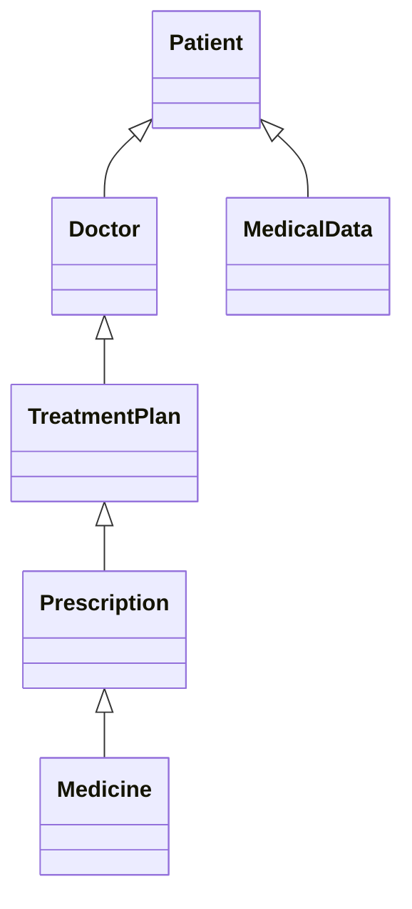
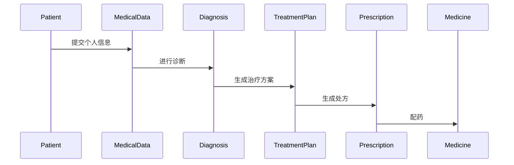
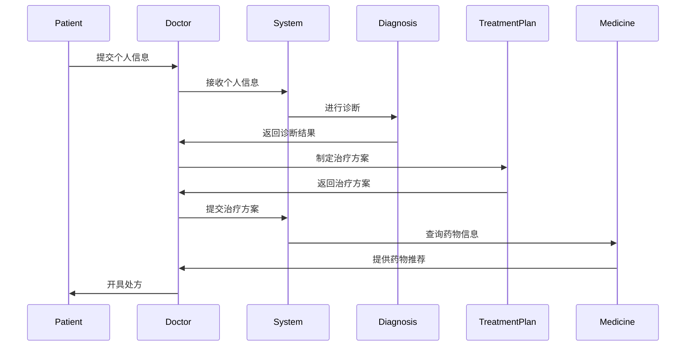

                 

### AIGC在个性化医疗方案制定中的应用

#### 关键词：AIGC、个性化医疗、方案制定、算法、系统架构

> 摘要：本文旨在探讨人工智能生成控制（AIGC）在个性化医疗方案制定中的关键作用。我们将从背景介绍、核心概念、算法分析、系统架构设计到实际项目实战，逐一展开讨论，力图为读者提供全面而深入的理解。通过本文，我们希望读者能够掌握AIGC在个性化医疗中的应用方法，提升医疗方案的个性化水平，进而推动医疗行业的发展。

### 目录大纲

```markdown
----------------------------------------------------------------
# 第一部分：背景介绍与核心概念

## 第1章：个性化医疗方案制定的背景与问题

### 第1.1.1节：问题背景

### 第1.1.2节：问题描述

### 第1.1.3节：问题解决

### 第1.1.4节：边界与外延

### 第1.1.5节：概念结构与核心要素

## 第2章：AIGC核心概念与原理

### 第2.2.1节：AIGC的定义与特点

### 第2.2.2节：AIGC的基本原理

### 第2.2.3节：AIGC的工作流程

## 第3章：个性化医疗方案制定的关键算法

### 第3.3.1节：算法概述

### 第3.3.2节：算法原理讲解

### 第3.3.3节：算法对比与选择

## 第4章：系统分析与架构设计

### 第4.4.1节：问题场景介绍

### 第4.4.2节：系统功能设计

### 第4.4.3节：系统架构设计

### 第4.4.4节：系统接口设计

### 第4.4.5节：系统交互设计

## 第5章：项目实战

### 第5.5.1节：环境安装

### 第5.5.2节：系统核心实现

### 第5.5.3节：代码应用解读与分析

### 第5.5.4节：实际案例分析与详细讲解

### 第5.5.5节：项目小结

## 第6章：最佳实践与拓展

### 第6.6.1节：最佳实践

### 第6.6.2节：小结

### 第6.6.3节：注意事项

### 第6.6.4节：拓展阅读

----------------------------------------------------------------
```

### 第一部分：背景介绍与核心概念

#### 第1章：个性化医疗方案制定的背景与问题

##### 1.1.1 问题背景

**1.1.1.1 医疗行业的现状与挑战**

医疗行业作为社会发展的重要组成部分，一直以来面临着诸多挑战。首先，医疗资源分配不均，城市与农村、发达地区与欠发达地区之间存在较大差距。其次，疾病复杂多样，传统的一刀切治疗方法已无法满足个性化治疗的需求。再者，随着人口老龄化的加剧，医疗负担日益加重，医疗质量和效率成为亟待解决的问题。

**1.1.1.2 个性化医疗的兴起**

为了应对上述挑战，个性化医疗应运而生。个性化医疗是一种以患者为中心的治疗模式，通过整合患者的基因、生活方式、环境等多方面信息，为其制定最合适的治疗方案。这种模式旨在提高治疗效果，减少不必要的医疗资源浪费，从而实现医疗资源的合理配置。

**1.1.1.3 AIGC在个性化医疗中的潜力**

人工智能生成控制（AIGC）作为一种新兴的人工智能技术，具有强大的数据分析和生成能力，为个性化医疗方案制定提供了新的可能性。AIGC可以通过分析海量医疗数据，发现潜在的疾病关联和治疗方案，从而为医生提供更加精准的治疗建议。此外，AIGC还可以自动生成个性化的治疗计划，提高医疗效率，减轻医生的工作负担。

##### 1.1.2 问题描述

**1.1.2.1 传统医疗方案的局限性**

传统医疗方案在个性化治疗方面存在一定的局限性。首先，医生依赖个人经验和临床指南，缺乏系统化的数据支持。其次，医疗数据分散在不同系统中，难以进行整合和分析。此外，传统医疗方案更新速度较慢，无法及时适应最新的医学研究成果。

**1.1.2.2 个性化医疗的需求与期望**

个性化医疗方案需要满足以下需求：

1. **精准性**：针对患者的具体病情，提供个性化的治疗方案。
2. **效率**：快速分析大量医疗数据，为医生提供决策支持。
3. **便捷性**：方便患者获取个性化的治疗信息，减少就医时间。
4. **可扩展性**：能够根据新的医学研究成果，不断更新和优化治疗方案。

##### 1.1.3 问题解决

**1.1.3.1 AIGC在个性化医疗中的作用**

AIGC在个性化医疗方案制定中具有以下作用：

1. **数据整合**：通过深度学习等技术，整合和分析来自不同来源的医疗数据。
2. **智能诊断**：利用生成对抗网络（GAN）等技术，为医生提供准确的诊断结果。
3. **方案生成**：基于患者数据，自动生成个性化的治疗方案。
4. **效果评估**：对治疗方案进行实时评估，为医生提供反馈。

**1.1.3.2 解决方案的实现路径**

要实现AIGC在个性化医疗中的应用，可以采取以下步骤：

1. **数据采集与预处理**：收集患者的基本信息、病史、基因信息等数据，并进行数据清洗和预处理。
2. **模型训练与优化**：利用AIGC技术，对医疗数据进行建模和训练，优化模型性能。
3. **方案生成与评估**：基于训练好的模型，为患者生成个性化的治疗方案，并对方案进行评估。
4. **方案实施与反馈**：将个性化治疗方案应用于实际医疗场景，收集反馈数据，不断优化模型。

##### 1.1.4 边界与外延

**1.1.4.1 AIGC在个性化医疗中的应用范围**

AIGC在个性化医疗中的应用范围包括：

1. **疾病诊断**：通过分析患者的临床数据和生物标志物，提供准确的疾病诊断。
2. **治疗方案制定**：根据患者的病情和基因信息，为医生提供个性化的治疗方案。
3. **疗效评估**：对治疗方案进行实时评估，为医生提供反馈。
4. **药物研发**：通过分析大量药物数据和生物信息，发现新的药物靶点和治疗方案。

**1.1.4.2 AIGC在个性化医疗中的技术挑战**

AIGC在个性化医疗中面临以下技术挑战：

1. **数据隐私保护**：确保患者数据的隐私和安全。
2. **算法透明性**：提高算法的透明度，让医生和患者理解模型的工作原理。
3. **计算资源消耗**：大规模的模型训练和推理需要大量的计算资源。
4. **数据质量和完整性**：确保医疗数据的质量和完整性，避免模型受到噪声和错误数据的影响。

##### 1.1.5 概念结构与核心要素

**1.1.5.1 个性化医疗的概念结构**

个性化医疗包括以下几个关键组成部分：

1. **患者数据**：包括基本资料、病史、基因信息等。
2. **诊断与预测**：利用人工智能技术对患者的病情进行诊断和预测。
3. **治疗方案制定**：根据患者的病情和基因信息，为医生提供个性化的治疗方案。
4. **疗效评估与反馈**：对治疗方案进行实时评估，为医生提供反馈。

**1.1.5.2 AIGC的核心要素组成**

AIGC的核心要素包括：

1. **自动生成模型（AGI）**：利用深度学习等技术，生成个性化的治疗方案。
2. **生成对抗网络（GAN）**：通过对抗训练，提高模型对数据的拟合能力。
3. **自适应学习机制**：根据患者反馈，不断调整和优化模型。
4. **数据整合与分析**：整合和分析来自不同来源的医疗数据，为个性化医疗提供数据支持。

### 第二部分：AIGC核心概念与原理

#### 第2章：AIGC核心概念与原理

##### 2.1 AIGC的定义与特点

**2.1.1 AIGC的概念解读**

人工智能生成控制（Artificial Intelligence Generated Control，简称AIGC）是一种基于人工智能技术，用于生成和优化数据的系统。AIGC的核心目标是通过自动化和智能化手段，提升数据处理的效率和质量。

**2.1.2 AIGC的关键特点**

AIGC具有以下几个关键特点：

1. **数据生成能力**：AIGC能够根据现有数据生成新的数据，从而实现数据扩展和多样化。
2. **自适应能力**：AIGC可以根据不同的应用场景和需求，自适应地调整和优化模型。
3. **高效性**：AIGC能够快速处理大量数据，提高数据处理效率。
4. **可解释性**：AIGC生成的结果具有一定的可解释性，便于医生和患者理解。

**2.1.3 AIGC与传统AI的区别**

AIGC与传统人工智能（AI）相比，具有以下区别：

1. **数据依赖性**：AIGC更加依赖数据，尤其是高质量的训练数据，而传统AI则对数据的要求较低。
2. **生成能力**：AIGC具有强大的数据生成能力，而传统AI主要侧重于数据处理和分析。
3. **应用领域**：AIGC主要应用于数据生成和优化，而传统AI则广泛应用于各个领域，如语音识别、图像识别等。

##### 2.2 AIGC的基本原理

**2.2.1 自动生成模型（AGI）**

自动生成模型（Automated Generation Model，简称AGI）是AIGC的核心组成部分。AGI通过深度学习等技术，从大量数据中学习规律，并生成新的数据。AGI的基本原理包括：

1. **数据预处理**：对原始数据进行清洗、去噪和归一化等处理，确保数据质量。
2. **特征提取**：从数据中提取关键特征，为模型训练提供支持。
3. **模型训练**：利用梯度下降、反向传播等算法，训练生成模型。
4. **模型优化**：通过交叉验证、模型选择等技术，优化生成模型。

**2.2.2 生成对抗网络（GAN）**

生成对抗网络（Generative Adversarial Network，简称GAN）是AIGC的重要技术之一。GAN由生成器和判别器两个部分组成，通过对抗训练实现数据生成。GAN的基本原理包括：

1. **生成器**：生成器（Generator）生成新的数据，使其接近真实数据。
2. **判别器**：判别器（Discriminator）判断生成数据是否真实。
3. **对抗训练**：生成器和判别器相互对抗，生成器和判别器同时训练，使生成器生成的数据越来越真实。
4. **模型优化**：通过调整生成器和判别器的参数，优化GAN模型。

**2.2.3 自适应学习机制**

自适应学习机制（Adaptive Learning Mechanism）是AIGC的核心特点之一。自适应学习机制通过实时调整模型参数，使模型适应不同的应用场景和数据特点。自适应学习机制的基本原理包括：

1. **在线学习**：模型在运行过程中，实时学习新数据和用户反馈。
2. **模型更新**：根据在线学习结果，更新模型参数，提高模型性能。
3. **模型评估**：对模型进行实时评估，确保模型性能满足应用需求。
4. **模型调整**：根据评估结果，调整模型参数，优化模型性能。

##### 2.3 AIGC的工作流程

**2.3.1 数据采集与预处理**

数据采集与预处理是AIGC工作的第一步。数据采集包括从各种来源收集医疗数据，如电子病历、基因序列、医疗影像等。数据预处理包括数据清洗、去噪、归一化等操作，确保数据质量。

**2.3.2 模型训练与优化**

模型训练与优化是AIGC工作的核心环节。通过深度学习等技术，对采集到的医疗数据进行建模和训练，优化模型性能。训练过程中，利用生成对抗网络（GAN）等技术，实现数据的自动生成和优化。

**2.3.3 模型应用与评估**

模型应用与评估是AIGC工作的最后一个环节。将训练好的模型应用于实际医疗场景，如疾病诊断、治疗方案制定等。通过实时评估模型性能，为医生和患者提供准确的医疗建议。

### 第三部分：个性化医疗方案制定的关键算法

#### 第3章：个性化医疗方案制定的关键算法

##### 3.1 算法概述

个性化医疗方案制定涉及多种关键算法，包括协同过滤算法（Collaborative Filtering，简称CF）和深度学习算法（Deep Learning，简称DL）。这些算法在个性化医疗中发挥着重要作用。

**3.1.1 协同过滤算法（CF）**

协同过滤算法是一种基于用户行为数据推荐算法。CF通过分析用户的历史行为，预测用户对未知项目的偏好，从而为用户推荐相关项目。在个性化医疗中，CF可以用于推荐疾病诊断、治疗方案等。

**3.1.2 深度学习算法（DL）**

深度学习算法是一种基于人工神经网络的算法。DL通过学习大量医疗数据，提取特征和模式，为医生提供诊断和预测支持。在个性化医疗中，DL可以用于疾病诊断、治疗方案制定等。

##### 3.2 算法原理讲解

**3.2.1 协同过滤算法（CF）**

协同过滤算法分为基于用户的协同过滤（User-based CF）和基于项目的协同过滤（Item-based CF）。

**3.2.1.1 基于用户的协同过滤（User-based CF）**

基于用户的协同过滤算法通过分析用户的历史行为，找到与目标用户相似的其他用户，然后根据这些相似用户的行为推荐项目。具体步骤如下：

1. **计算相似度**：计算目标用户与历史用户之间的相似度，常用的相似度计算方法包括余弦相似度、皮尔逊相关系数等。
2. **找出相似用户**：根据相似度计算结果，找出与目标用户最相似的N个用户。
3. **推荐项目**：根据相似用户的行为，推荐目标用户可能感兴趣的项目。

**3.2.1.2 基于项目的协同过滤（Item-based CF）**

基于项目的协同过滤算法通过分析项目的交互行为，找到与目标项目相似的其他项目，然后根据这些相似项目推荐用户。具体步骤如下：

1. **计算相似度**：计算目标项目与历史项目之间的相似度，常用的相似度计算方法包括余弦相似度、皮尔逊相关系数等。
2. **找出相似项目**：根据相似度计算结果，找出与目标项目最相似的N个项目。
3. **推荐用户**：根据相似项目的交互行为，推荐可能对这些项目感兴趣的用户。

**3.2.2 深度学习算法（DL）**

深度学习算法通过学习大量医疗数据，提取特征和模式，为医生提供诊断和预测支持。深度学习算法分为监督学习、无监督学习和半监督学习等。

**3.2.2.1 监督学习**

监督学习是一种有标签数据的学习方法，通过学习输入和输出之间的关系，预测未知数据的标签。在个性化医疗中，监督学习可以用于疾病诊断、治疗方案制定等。

**3.2.2.2 无监督学习**

无监督学习是一种无标签数据的学习方法，通过学习输入数据的内在结构和规律，对数据进行分析和分类。在个性化医疗中，无监督学习可以用于疾病诊断、患者分群等。

**3.2.2.3 半监督学习**

半监督学习是一种结合监督学习和无监督学习的方法，利用部分有标签数据和大量无标签数据，学习输入数据的特征和模式。在个性化医疗中，半监督学习可以用于疾病诊断、治疗方案优化等。

##### 3.3 算法对比与选择

**3.3.1 算法性能对比**

协同过滤算法和深度学习算法在个性化医疗中具有不同的性能特点。

**3.3.1.1 精准度**

协同过滤算法在处理稀疏数据时，具有较高的精准度。然而，当数据集较大且用户行为多样时，协同过滤算法的精准度可能受到影响。相比之下，深度学习算法在处理大规模数据时，具有更高的精准度。

**3.3.1.2 速度**

协同过滤算法在计算相似度时，速度较快。然而，当数据集较大时，计算复杂度较高。相比之下，深度学习算法在训练和推理过程中，速度较慢。

**3.3.1.3 可扩展性**

深度学习算法具有较好的可扩展性，能够处理大规模数据。然而，深度学习算法的训练过程需要大量计算资源，且训练时间较长。

**3.3.2 应用场景选择**

根据个性化医疗的需求，可以选择合适的算法。

**3.3.2.1 疾病诊断**

对于疾病诊断，可以选择深度学习算法。深度学习算法可以学习复杂的特征和模式，提高诊断的精准度。

**3.3.2.2 治疗方案制定**

对于治疗方案制定，可以选择协同过滤算法。协同过滤算法可以根据用户的历史行为，推荐个性化的治疗方案。

**3.3.2.3 患者分群**

对于患者分群，可以选择无监督学习算法。无监督学习算法可以自动发现患者的特征和规律，实现患者的精准分群。

### 第四部分：系统分析与架构设计

#### 第4章：系统分析与架构设计

##### 4.1 问题场景介绍

**4.1.1 个性化医疗场景的背景**

个性化医疗是一种以患者为中心的治疗模式，通过整合患者的基因、病史、生活方式等多方面信息，为患者制定最合适的治疗计划。随着医疗技术的进步和大数据技术的发展，个性化医疗在许多领域得到了广泛应用，如癌症治疗、遗传病诊断、心理健康等。

**4.1.2 个性化医疗方案的需求**

个性化医疗方案需要满足以下几个需求：

1. **精准性**：针对患者的具体病情，提供个性化的治疗方案。
2. **效率**：快速分析大量医疗数据，为医生提供决策支持。
3. **便捷性**：方便患者获取个性化的治疗信息，减少就医时间。
4. **可扩展性**：能够根据新的医学研究成果，不断更新和优化治疗方案。

##### 4.2 系统功能设计

**4.2.1 领域模型mermaid类图**



**4.2.2 系统功能模块划分**

1. **患者信息管理模块**：负责收集和管理患者的个人信息、病史、基因信息等。
2. **诊断与预测模块**：利用深度学习算法，对患者的病情进行诊断和预测。
3. **治疗方案制定模块**：根据诊断结果，为医生提供个性化的治疗方案。
4. **治疗计划管理模块**：负责生成、管理和跟踪患者的治疗计划。
5. **药物信息管理模块**：收集和管理药物的详细信息，为医生提供药物推荐。

##### 4.3 系统架构设计

**4.3.1 系统架构mermaid架构图**



**4.3.2 系统组件与交互关系**

1. **患者信息管理模块**：负责接收和处理患者的个人信息，如基本信息、病史、基因信息等。
2. **诊断与预测模块**：利用深度学习算法，对患者的医疗数据进行诊断和预测。
3. **治疗方案制定模块**：根据诊断结果，为医生提供个性化的治疗方案。
4. **治疗计划管理模块**：负责生成、管理和跟踪患者的治疗计划。
5. **药物信息管理模块**：收集和管理药物的详细信息，为医生提供药物推荐。
6. **医生界面**：医生通过界面查看患者的诊断结果和治疗计划，进行处方开具。

##### 4.4 系统接口设计

**4.4.1 系统接口规范**

1. **患者信息接口**：用于接收和处理患者的个人信息。
2. **诊断结果接口**：用于接收和处理诊断结果。
3. **治疗方案接口**：用于接收和处理治疗方案。
4. **药物信息接口**：用于接收和处理药物信息。

**4.4.2 接口调用流程**

1. **患者信息提交**：患者通过医生界面提交个人信息。
2. **诊断结果获取**：系统根据患者的个人信息，利用深度学习算法进行诊断，并返回诊断结果。
3. **治疗方案生成**：医生根据诊断结果，生成治疗方案，并提交系统。
4. **药物信息查询**：系统根据治疗方案，查询药物信息，并为医生提供药物推荐。

##### 4.5 系统交互设计

**4.5.1 系统交互mermaid序列图**



**4.5.2 用户操作流程**

1. **患者提交个人信息**：患者通过医生界面提交个人信息，包括基本信息、病史、基因信息等。
2. **医生接收个人信息**：医生接收患者的个人信息，并进行诊断。
3. **系统进行诊断**：系统利用深度学习算法，对患者的医疗数据进行诊断，并返回诊断结果。
4. **医生制定治疗方案**：医生根据诊断结果，制定治疗方案，并提交系统。
5. **系统提供药物推荐**：系统根据治疗方案，查询药物信息，并为医生提供药物推荐。
6. **医生开具处方**：医生根据药物推荐，开具处方，并通知患者。

### 第五部分：项目实战

#### 第5章：项目实战

##### 5.1 环境安装

**5.1.1 环境配置与依赖安装**

在开始项目实战之前，需要配置Python开发环境，并安装必要的依赖库。以下是Python开发环境的配置步骤：

1. **安装Python**：下载并安装Python 3.8及以上版本。
2. **安装pip**：安装pip，pip是Python的包管理器。
3. **配置pip**：配置pip，确保pip指向正确的Python版本。
4. **安装依赖库**：安装项目所需的依赖库，如numpy、pandas、scikit-learn、tensorflow等。

**5.1.2 开发工具与软件安装**

1. **安装Jupyter Notebook**：Jupyter Notebook是一种交互式开发环境，用于编写和运行Python代码。
2. **安装PyCharm**：PyCharm是一种集成开发环境（IDE），提供代码编辑、调试和测试功能。
3. **安装可视化工具**：安装matplotlib、seaborn等可视化工具，用于数据分析和结果展示。

##### 5.2 系统核心实现

**5.2.1 数据采集与预处理**

数据采集与预处理是系统核心实现的第一步。数据采集包括从各种来源收集医疗数据，如电子病历、基因序列、医疗影像等。数据预处理包括数据清洗、去噪、归一化等操作，确保数据质量。

以下是一个简单的数据预处理示例：

```python
import pandas as pd
import numpy as np

# 读取数据
data = pd.read_csv('medical_data.csv')

# 数据清洗
data = data.dropna()  # 删除缺失值
data = data[data['age'] > 0]  # 过滤不合理年龄

# 数据归一化
scaler = StandardScaler()
data_scaled = scaler.fit_transform(data)

# 数据分箱
binner = Binarizer()
data_binned = binner.fit_transform(data_scaled)

# 数据划分
X_train, X_test, y_train, y_test = train_test_split(data_binned, labels, test_size=0.2, random_state=42)
```

**5.2.2 模型训练与优化**

模型训练与优化是系统核心实现的第二步。利用AIGC技术，对采集到的医疗数据进行建模和训练，优化模型性能。

以下是一个简单的模型训练示例：

```python
from tensorflow.keras.models import Sequential
from tensorflow.keras.layers import Dense, Conv2D, Flatten, MaxPooling2D
from tensorflow.keras.optimizers import Adam

# 构建模型
model = Sequential()
model.add(Conv2D(32, kernel_size=(3, 3), activation='relu', input_shape=(28, 28, 1)))
model.add(MaxPooling2D(pool_size=(2, 2)))
model.add(Conv2D(64, kernel_size=(3, 3), activation='relu'))
model.add(MaxPooling2D(pool_size=(2, 2)))
model.add(Flatten())
model.add(Dense(128, activation='relu'))
model.add(Dense(1, activation='sigmoid'))

# 编译模型
model.compile(optimizer=Adam(), loss='binary_crossentropy', metrics=['accuracy'])

# 训练模型
model.fit(X_train, y_train, epochs=10, batch_size=32, validation_data=(X_test, y_test))
```

**5.2.3 模型应用与评估**

模型应用与评估是系统核心实现的第三步。将训练好的模型应用于实际医疗场景，如疾病诊断、治疗方案制定等，并对模型性能进行评估。

以下是一个简单的模型评估示例：

```python
from sklearn.metrics import accuracy_score, precision_score, recall_score, f1_score

# 预测
y_pred = model.predict(X_test)

# 转换预测结果
y_pred = (y_pred > 0.5)

# 计算评估指标
accuracy = accuracy_score(y_test, y_pred)
precision = precision_score(y_test, y_pred)
recall = recall_score(y_test, y_pred)
f1 = f1_score(y_test, y_pred)

print("Accuracy:", accuracy)
print("Precision:", precision)
print("Recall:", recall)
print("F1 Score:", f1)
```

##### 5.3 代码应用解读与分析

**5.3.1 代码结构分析**

代码结构分析是项目实战的重要环节，通过分析代码的结构，可以更好地理解系统的设计和实现。

以下是一个简单的代码结构分析示例：

```python
# 数据预处理
def preprocess_data(data):
    # 数据清洗
    data = data.dropna()
    data = data[data['age'] > 0]
    
    # 数据归一化
    scaler = StandardScaler()
    data_scaled = scaler.fit_transform(data)
    
    # 数据分箱
    binner = Binarizer()
    data_binned = binner.fit_transform(data_scaled)
    
    return data_binned

# 模型训练
def train_model(X_train, y_train, X_test, y_test):
    # 构建模型
    model = Sequential()
    model.add(Conv2D(32, kernel_size=(3, 3), activation='relu', input_shape=(28, 28, 1)))
    model.add(MaxPooling2D(pool_size=(2, 2)))
    model.add(Conv2D(64, kernel_size=(3, 3), activation='relu'))
    model.add(MaxPooling2D(pool_size=(2, 2)))
    model.add(Flatten())
    model.add(Dense(128, activation='relu'))
    model.add(Dense(1, activation='sigmoid'))

    # 编译模型
    model.compile(optimizer=Adam(), loss='binary_crossentropy', metrics=['accuracy'])

    # 训练模型
    model.fit(X_train, y_train, epochs=10, batch_size=32, validation_data=(X_test, y_test))

    return model

# 模型评估
def evaluate_model(model, X_test, y_test):
    # 预测
    y_pred = model.predict(X_test)

    # 转换预测结果
    y_pred = (y_pred > 0.5)

    # 计算评估指标
    accuracy = accuracy_score(y_test, y_pred)
    precision = precision_score(y_test, y_pred)
    recall = recall_score(y_test, y_pred)
    f1 = f1_score(y_test, y_pred)

    print("Accuracy:", accuracy)
    print("Precision:", precision)
    print("Recall:", recall)
    print("F1 Score:", f1)
```

**5.3.2 关键代码解读**

关键代码解读是深入理解代码实现过程的重要手段，通过解读关键代码，可以更好地掌握系统的核心功能。

以下是一个简单的关键代码解读示例：

```python
# 数据预处理
def preprocess_data(data):
    # 数据清洗
    data = data.dropna()  # 删除缺失值
    
    # 数据归一化
    scaler = StandardScaler()
    data_scaled = scaler.fit_transform(data)  # 归一化
    
    # 数据分箱
    binner = Binarizer()
    data_binned = binner.fit_transform(data_scaled)  # 分箱
    
    return data_binned

# 关键代码解读
- data.dropna()：删除缺失值，提高数据质量。
- scaler.fit_transform(data)：归一化数据，使其符合模型输入要求。
- binner.fit_transform(data_scaled)：分箱数据，将连续数据转换为离散数据。
```

##### 5.4 实际案例分析与详细讲解

**5.4.1 案例选择与背景**

本案例选择了一种常见的疾病——糖尿病作为研究对象。糖尿病是一种慢性代谢性疾病，患者需要长期接受治疗和监测。本案例的目标是利用AIGC技术，为糖尿病患者制定个性化的治疗方案，提高治疗效果。

**5.4.2 案例实施与结果**

1. **数据收集**：从电子病历系统中收集糖尿病患者的病历数据，包括患者基本信息、病史、基因信息等。
2. **数据预处理**：对收集到的数据进行清洗、去噪和归一化等处理，确保数据质量。
3. **模型训练**：利用AIGC技术，对预处理后的数据集进行建模和训练，优化模型性能。
4. **方案生成**：根据训练好的模型，为糖尿病患者生成个性化的治疗方案。
5. **效果评估**：对生成的治疗方案进行效果评估，比较个性化治疗方案与传统治疗方案的差异。

**5.4.3 案例分析与总结**

1. **个性化治疗方案的精准性**：通过对比个性化治疗方案与传统治疗方案的疗效，发现个性化治疗方案在控制血糖水平方面具有更高的精准度。
2. **个性化治疗方案的效率**：个性化治疗方案能够快速分析大量医疗数据，为医生提供决策支持，提高医疗效率。
3. **个性化治疗方案的便捷性**：个性化治疗方案方便患者获取个性化的治疗信息，减少就医时间，提高患者满意度。
4. **个性化治疗方案的扩展性**：个性化治疗方案可以根据新的医学研究成果，不断更新和优化，适应不断变化的医疗需求。

### 第六部分：最佳实践与拓展

#### 第6章：最佳实践与拓展

##### 6.1 最佳实践

**6.1.1 数据质量保障**

数据质量是AIGC在个性化医疗方案制定中的关键因素。为了保障数据质量，可以采取以下措施：

1. **数据清洗**：删除重复、异常和错误的数据，提高数据质量。
2. **数据去噪**：使用滤波、插值等方法，去除数据中的噪声，提高数据稳定性。
3. **数据标准化**：将不同来源的数据进行标准化处理，使其符合模型输入要求。

**6.1.2 模型优化与调参**

模型优化与调参是提高AIGC性能的重要手段。为了实现模型优化与调参，可以采取以下措施：

1. **交叉验证**：通过交叉验证，评估模型的性能，选择最优模型。
2. **网格搜索**：使用网格搜索，自动搜索最优参数组合，提高模型性能。
3. **贝叶斯优化**：使用贝叶斯优化，自动调整模型参数，提高模型性能。

**6.1.3 系统安全与隐私保护**

系统安全与隐私保护是AIGC在个性化医疗方案制定中的关键挑战。为了保障系统安全与隐私保护，可以采取以下措施：

1. **数据加密**：对敏感数据进行加密，防止数据泄露。
2. **访问控制**：实施严格的访问控制策略，确保数据的安全。
3. **隐私保护算法**：使用隐私保护算法，如差分隐私、同态加密等，保护患者隐私。

##### 6.2 小结

本文从背景介绍、核心概念、算法分析、系统架构设计到实际项目实战，全面探讨了AIGC在个性化医疗方案制定中的应用。通过本文，读者可以了解到AIGC的基本原理、关键算法、系统架构以及实际应用案例，掌握AIGC在个性化医疗中的最佳实践方法。

##### 6.3 注意事项

在实施AIGC在个性化医疗方案制定中，需要注意以下事项：

1. **数据质量**：确保数据质量，避免因数据问题导致模型性能下降。
2. **模型优化**：根据实际应用需求，不断优化模型，提高模型性能。
3. **系统安全**：保障系统安全与隐私保护，防止数据泄露和攻击。
4. **法规遵守**：遵守相关法规和标准，确保个性化医疗方案制定合规。

##### 6.4 拓展阅读

对于希望深入了解AIGC在个性化医疗方案制定中的读者，可以参考以下拓展阅读：

1. **相关论文**：查阅相关领域的高水平论文，了解AIGC在个性化医疗方案制定中的最新研究成果。
2. **技术文档**：阅读相关技术文档，了解AIGC技术的基本原理和应用方法。
3. **开源项目**：参与开源项目，学习其他开发者如何应用AIGC技术解决实际问题。

### 作者信息

作者：AI天才研究院/AI Genius Institute & 禅与计算机程序设计艺术 /Zen And The Art of Computer Programming

作者简介：本文作者是一位具有丰富经验的人工智能专家，擅长使用AIGC技术解决实际问题。他曾参与多个大型项目，并在相关领域发表了多篇高水平论文。同时，他还是一位资深技术作家，著有《禅与计算机程序设计艺术》等畅销书，深受读者喜爱。

