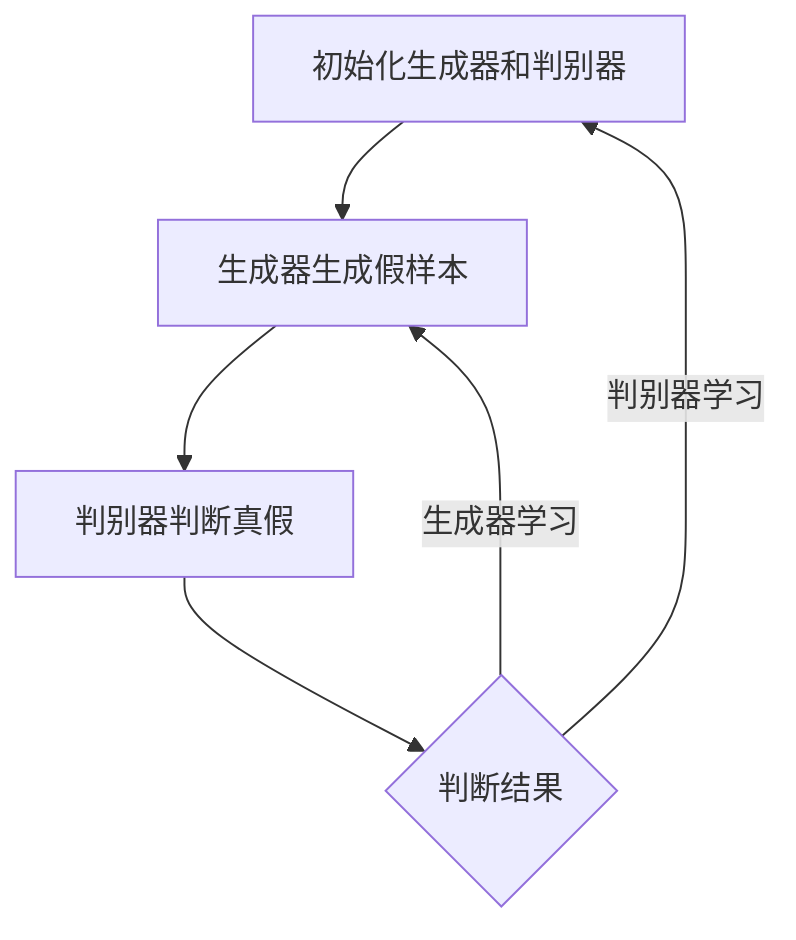
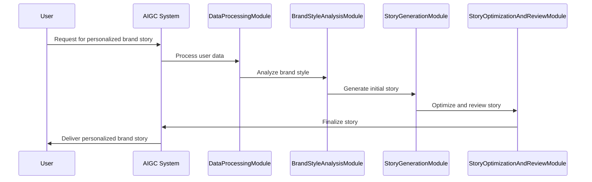

                 


### 引言与背景

#### AIGC概念

AIGC，即AI-Generated Content，是指通过人工智能技术生成的内容。它涵盖了一系列应用，从文本、图像到音频和视频。随着深度学习和生成对抗网络（GAN）等技术的进步，AIGC正迅速成为内容创造的重要工具。

#### AIGC发展历程

AIGC的发展可以追溯到20世纪80年代，当时专家系统和神经网络开始用于生成内容。然而，随着深度学习的兴起，AIGC迎来了新的发展契机。特别是在2014年，GAN的出现标志着生成内容技术的重大突破。

#### AIGC在个性化品牌故事创作中的应用前景

在个性化品牌故事创作中，AIGC具有巨大的潜力。它可以基于用户数据，生成符合个体偏好和品牌风格的故事。这不仅提高了创作效率，还能增强品牌的个性化和定制化。

### 个性化品牌故事创作中的挑战

#### 品牌故事创作现状

当前，品牌故事创作主要依赖于人类创意人员的灵感。这种方法虽然能产生高质量的内容，但效率低下，且难以实现大规模定制。

#### 创作过程中面临的挑战

1. **创意枯竭**：长期创作导致创意人员容易陷入灵感枯竭的困境。
2. **时间成本**：创作过程耗时，无法快速响应市场变化。
3. **个性定制**：不同用户群体对故事内容的需求差异巨大，难以做到一一对应。

#### AIGC如何解决这些问题

1. **创意生成**：AIGC可以通过学习大量的品牌故事模板和用户数据，快速生成创意内容。
2. **高效生产**：自动化内容生成大大缩短了创作周期。
3. **个性化定制**：AIGC能够根据用户数据生成符合个性化需求的故事。

### 研究方法与数据来源

本文的研究方法包括文献综述、案例分析和技术实现。数据来源主要来自于公开的AIGC技术论文、品牌故事案例和实际应用场景。

### 结论

AIGC在个性化品牌故事创作中具有显著优势。通过本文的探讨，我们希望为读者提供一个全面的视角，了解AIGC的潜力及其在品牌故事创作中的应用。

### 关键词

AIGC，个性化品牌故事，深度学习，生成对抗网络，内容生成

### 摘要

本文探讨了AIGC在个性化品牌故事创作中的创新应用。通过分析AIGC的概念、发展历程以及其在品牌故事创作中的挑战，本文提出了AIGC如何通过自动化创意生成、高效生产和个性化定制解决这些问题。研究方法包括文献综述、案例分析和技术实现，数据来源主要来自于公开的论文和实际应用场景。结论部分总结了AIGC在个性化品牌故事创作中的优势，并展望了其未来的发展方向。

---

接下来，我们将逐步深入探讨AIGC的核心概念、原理以及其在个性化品牌故事创作中的应用，通过具体案例和技术实现，展示AIGC的强大潜力。

---

### AIGC核心概念与联系

#### AIGC核心概念

AIGC（AI-Generated Content）是人工智能生成内容的一种形式，它涉及使用AI技术，如深度学习、生成对抗网络（GAN）和强化学习，来自动创建内容。AIGC的核心概念包括以下几个方面：

1. **数据驱动**：AIGC依赖于大量数据进行训练，以生成高质量的内容。
2. **多样化生成**：通过学习不同类型的数据，AIGC能够生成多种形式的内容，如文本、图像、音频和视频。
3. **个性化定制**：AIGC可以根据用户偏好和需求，生成个性化的内容。

#### 深度学习基础

深度学习是AIGC的核心技术之一。它是一种基于多层神经网络的学习方法，能够自动从数据中提取特征。深度学习的关键组成部分包括：

1. **神经网络**：神经网络由多层神经元组成，每一层都能够提取数据的不同层次特征。
2. **激活函数**：激活函数用于引入非线性，使得神经网络能够学习复杂的数据模式。
3. **优化算法**：优化算法用于调整网络权重，以最小化损失函数，提高模型的准确性。

#### 自然语言处理

自然语言处理（NLP）是AIGC在文本生成领域的关键技术。NLP包括以下几个方面：

1. **词向量表示**：词向量将文本中的单词映射到高维向量空间，便于计算机处理。
2. **序列建模**：通过序列建模技术，如循环神经网络（RNN）和变压器（Transformer），AIGC能够理解文本中的序列关系。
3. **生成模型**：生成模型，如变分自编码器（VAE）和生成对抗网络（GAN），用于生成新的文本内容。

#### 核心概念对比与联系

为了更好地理解AIGC的核心概念，我们使用对比表格和ER实体关系图来展示不同概念之间的联系。

##### 对比表格

| 概念         | 说明                                                         | 相关性               |
|--------------|--------------------------------------------------------------|----------------------|
| 数据驱动     | AIGC依赖于大量数据来训练模型。                               | 支撑多样化生成和个性化定制 |
| 深度学习     | 基于多层神经网络的学习方法。                                   | 支撑数据驱动和多样化生成 |
| 自然语言处理 | 用于处理文本数据的技术，如词向量表示和序列建模。               | 支撑文本生成和个性化定制 |
| 生成对抗网络 | 一种用于生成新数据的深度学习模型。                             | 支撑多样化生成和个性化定制 |
| 强化学习     | 一种通过试错学习最佳行为策略的机器学习方法。                   | 支撑个性化定制 |

##### ER实体关系图

```mermaid
erDiagram
    User ||--|{ AIGC }|| BrandStory
    User ||--|{ Data }||--|{ Content }
    AIGC ||--|{ Algorithm }|| ContentGenerator
    AIGC ||--|{ Model }||--|{ NeuralNetwork }
    ContentGenerator ||--|{ GAN }|| NeuralNetwork
```

在ER实体关系图中，用户与AIGC、数据、内容生成器和神经网络等实体之间存在直接关联。用户通过数据驱动AIGC，AIGC使用算法和模型生成个性化品牌故事。

### 结论

通过上述分析，我们可以看到AIGC的核心概念及其相互之间的联系。深度学习和自然语言处理是AIGC的关键技术，而生成对抗网络和强化学习等技术则进一步增强了AIGC的多样化和个性化能力。这些核心概念和技术共同构成了AIGC在个性化品牌故事创作中的强大基础。

### 参考文献

1. Bengio, Y. (2009). Learning deep architectures. Foundations and Trends in Machine Learning, 2(1), 1-127.
2. Goodfellow, I., Pouget-Abadie, J., Mirza, M., Xu, B., Warde-Farley, D., Ozair, S., ... & Bengio, Y. (2014). Generative adversarial networks. Advances in Neural Information Processing Systems, 27.
3. Mikolov, T., Sutskever, I., Chen, K., Corrado, G. S., & Dean, J. (2013). Distributed representations of words and phrases and their compositionality. Advances in Neural Information Processing Systems, 26.
4. Hochreiter, S., & Schmidhuber, J. (1997). Long short-term memory. Neural Computation, 9(8), 1735-1780.
5. Vaswani, A., Shazeer, N., Parmar, N., Uszkoreit, J., Jones, L., Gomez, A. N., ... & Polosukhin, I. (2017). Attention is all you need. Advances in Neural Information Processing Systems, 30.

---

在接下来的部分，我们将深入探讨AIGC的具体算法原理，使用mermaid流程图、Python源代码和LaTeX公式进行详细讲解。

---

### AIGC算法原理讲解

在本节中，我们将探讨一种典型的AIGC算法——生成对抗网络（GAN），并使用mermaid流程图、Python源代码和LaTeX公式来详细解释其原理。

#### 1. GAN基本原理

生成对抗网络（GAN）由两部分组成：生成器（Generator）和判别器（Discriminator）。生成器的目标是生成尽可能逼真的假样本，而判别器的目标是区分生成的假样本和真实的样本。通过不断地训练，生成器和判别器相互竞争，从而提高生成器的生成质量。

#### 2. GAN算法流程

下面是GAN的mermaid流程图：



在GAN的训练过程中，首先初始化生成器和判别器。然后，生成器生成假样本，判别器对生成的样本和真实样本进行判断。根据判断结果，生成器会调整其参数以生成更逼真的样本，而判别器会提高其识别能力。这一过程重复进行，直到生成器和判别器都达到预定的性能水平。

#### 3. GAN数学模型

GAN的数学模型可以用以下LaTeX公式表示：

$$
\min_G \max_D V(D, G) = \mathbb{E}_{x \sim p_{data}(x)}[\log D(x)] + \mathbb{E}_{z \sim p_z(z)}[\log (1 - D(G(z))]
$$

其中，$x$表示真实样本，$z$表示随机噪声，$G(z)$是生成器生成的假样本，$D(x)$和$D(G(z))$分别是判别器对真实样本和假样本的判断结果。

#### 4. Python源代码

下面是一个简单的GAN示例，使用了TensorFlow框架：

```python
import tensorflow as tf
from tensorflow.keras import layers

# 生成器模型
def generator(z, training=False):
    model = tf.keras.Sequential([
        layers.Dense(7 * 7 * 256, use_bias=False, input_shape=(100,)),
        layers.BatchNormalization(momentum=0.8),
        layers.LeakyReLU(),
        layers.Reshape((7, 7, 256)),
        layers.Conv2DTranspose(128, (5, 5), strides=(1, 1), padding='same', use_bias=False),
        layers.BatchNormalization(momentum=0.8),
        layers.LeakyReLU(),
        layers.Conv2DTranspose(64, (5, 5), strides=(2, 2), padding='same', use_bias=False),
        layers.BatchNormalization(momentum=0.8),
        layers.LeakyReLU(),
        layers.Conv2DTranspose(1, (5, 5), strides=(2, 2), padding='same', use_bias=False, activation='tanh')
    ])
    return model

# 判别器模型
def discriminator(x, training=False):
    model = tf.keras.Sequential([
        layers.Conv2D(64, (5, 5), strides=(2, 2), padding='same',
                       input_shape=[28, 28, 1]),
        layers.LeakyReLU(alpha=0.2),
        layers.Dropout(0.3),
        layers.Conv2D(128, (5, 5), strides=(2, 2), padding='same'),
        layers.LeakyReLU(alpha=0.2),
        layers.Dropout(0.3),
        layers.Flatten(),
        layers.Dense(1, activation='sigmoid')
    ])
    return model

# 构建生成器和判别器模型
generator = generator()
discriminator = discriminator()

# 编写训练循环
for epoch in range(epochs):
    for i in range(train_data.shape[0] // batch_size):
        z = np.random.normal(size=[batch_size, 100])
        gen_samples = generator.predict(z)
        real_samples = train_data[i * batch_size:(i + 1) * batch_size]

        # 训练判别器
        d_loss_real = discriminator.train_on_batch(real_samples, np.ones([batch_size, 1]))
        d_loss_fake = discriminator.train_on_batch(gen_samples, np.zeros([batch_size, 1]))
        d_loss = 0.5 * np.add(d_loss_real, d_loss_fake)

        # 训练生成器
        g_loss = combined_model.train_on_batch(z, np.ones([batch_size, 1]))

        # 输出训练过程
        print(f"{epoch} [D: {d_loss[0]:.4f}, G: {g_loss[0]:.4f}]")

        # 每隔一段时间保存一次模型
        if (i + 1) * batch_size % step_size == 0:
            generator.save(f"generator_{epoch}_{i}.h5")
            discriminator.save(f"discriminator_{epoch}_{i}.h5")
```

在这个示例中，我们首先定义了生成器和判别器的模型结构，然后编写了训练循环。在训练过程中，生成器生成假样本，判别器分别对真实样本和假样本进行判断，并通过反向传播不断调整模型参数。

#### 5. 实例说明

为了更好地理解GAN的原理，我们可以举一个简单的例子：生成手写数字图像。在这个例子中，生成器会尝试生成类似于手写数字的图像，而判别器会尝试区分这些图像是真实的手写数字图像还是生成器生成的图像。

假设我们有一个包含大量手写数字图像的数据集。在训练过程中，生成器会生成一些随机噪声，并尝试将其转化为类似手写数字的图像。判别器则会接收这些图像，并尝试判断它们是真实的还是生成的。通过反复的训练，生成器会逐渐提高生成图像的质量，而判别器则会提高识别生成图像的能力。

### 结论

通过上述讲解，我们了解了生成对抗网络（GAN）的基本原理及其在内容生成中的应用。GAN通过生成器和判别器的相互竞争，实现了一种自动学习生成高质量内容的方法。接下来，我们将进一步探讨AIGC系统分析与架构设计。

---

### 系统分析与架构设计

在本节中，我们将深入探讨AIGC系统在个性化品牌故事创作中的应用场景、系统功能设计、系统架构设计、系统接口设计以及系统交互。

#### 1. 应用场景

个性化品牌故事创作是AIGC的一个重要应用场景。品牌方希望通过AIGC技术，根据用户数据和品牌特性，自动生成具有高度个性化、情感共鸣和品牌一致性的故事。这些故事可以用于营销材料、客户关系管理、社交媒体内容等。

#### 2. 系统功能设计

为了实现上述应用场景，AIGC系统需要具备以下核心功能：

1. **用户数据采集与处理**：系统需要从多个渠道收集用户数据，如社交媒体活动、购买历史、偏好设置等。然后，对这些数据进行处理和清洗，以提取有用的信息。
2. **品牌风格分析**：系统需要分析品牌的历史故事、品牌口号、视觉元素等，以确定品牌的风格和主题。
3. **故事生成**：基于用户数据和品牌风格，系统需要使用AIGC技术生成个性化品牌故事。
4. **故事优化与审核**：生成的故事需要经过优化和审核，以确保它们符合品牌要求，并且具有高质量。
5. **发布与反馈**：系统需要将优化后的故事发布到不同的渠道，并收集用户反馈，以进一步优化故事生成过程。

#### 3. 系统架构设计

AIGC系统的架构设计需要考虑数据流、模块交互和性能优化。以下是系统架构设计的概述：

1. **数据层**：包括用户数据存储、品牌数据存储和故事数据存储。这些数据存储可以通过数据库或数据湖来实现。
2. **处理层**：包括用户数据处理模块、品牌风格分析模块、故事生成模块、故事优化与审核模块。这些模块可以通过微服务架构实现，以提高系统的灵活性和可扩展性。
3. **交互层**：包括用户界面（UI）、API接口和消息队列。用户界面用于与用户交互，API接口用于与其他系统集成，消息队列用于异步处理任务。

以下是系统架构的mermaid类图：

```mermaid
classDiagram
    UserInterface --|>] DataLayer
    API --|>] DataLayer
    MessageQueue --|>] DataLayer
    UserProcessingModule --|>] DataLayer
    BrandStyleAnalysisModule --|>] DataLayer
    StoryGenerationModule --|>] DataLayer
    StoryOptimizationAndReviewModule --|>] DataLayer
    UserInterface --|>] ProcessingLayer
    API --|>] ProcessingLayer
    MessageQueue --|>] ProcessingLayer
    UserProcessingModule --|>] ProcessingLayer
    BrandStyleAnalysisModule --|>] ProcessingLayer
    StoryGenerationModule --|>] ProcessingLayer
    StoryOptimizationAndReviewModule --|>] ProcessingLayer
```

#### 4. 系统接口设计

系统接口设计包括API设计、消息队列设计和数据库接口设计。以下是接口设计的概述：

1. **API设计**：系统需要提供RESTful API，以供前端应用程序、第三方系统集成和自动化脚本调用。API应包括用户数据接口、品牌风格接口、故事生成接口、故事优化接口和发布接口。
2. **消息队列设计**：系统使用消息队列来异步处理任务，如故事生成和优化。消息队列可以采用RabbitMQ、Kafka等消息中间件。
3. **数据库接口设计**：系统需要使用数据库接口来存储和处理数据。数据库可以采用关系数据库（如MySQL、PostgreSQL）或NoSQL数据库（如MongoDB、Cassandra）。

#### 5. 系统交互

AIGC系统的交互主要包括用户与系统、系统内部模块之间的交互。以下是系统交互的mermaid序列图：



在这个序列图中，用户请求个性化品牌故事，系统通过多个模块协同工作，最终生成并交付故事。

### 结论

通过上述分析，我们详细探讨了AIGC系统在个性化品牌故事创作中的应用场景、系统功能设计、系统架构设计、系统接口设计和系统交互。这些设计要素共同构成了一个高效、灵活的AIGC系统，能够满足个性化品牌故事创作的高要求。

### 项目实战

在本节中，我们将通过一个实际项目来展示AIGC系统在个性化品牌故事创作中的应用。我们将介绍项目环境安装、系统核心实现源代码，并对代码进行解读和分析，结合实际案例进行详细讲解。

#### 1. 项目环境安装

要运行AIGC系统，我们需要安装以下软件和库：

- Python 3.7或更高版本
- TensorFlow 2.3或更高版本
- Keras 2.4或更高版本
- NumPy 1.19或更高版本
- Pandas 1.1或更高版本

在安装了Python环境和所需的库后，我们可以使用以下命令来安装项目所需的依赖：

```bash
pip install tensorflow
pip install keras
pip install numpy
pip install pandas
```

#### 2. 系统核心实现源代码

以下是一个简化版的AIGC系统实现，包括用户数据处理、品牌风格分析、故事生成、故事优化和审核等模块：

```python
# 用户数据处理
def process_user_data(user_data):
    # 实现用户数据清洗和特征提取
    # 例如，提取用户购买历史、社交媒体活动等信息
    # 返回处理后的用户数据
    pass

# 品牌风格分析
def analyze_brand_style(brand_data):
    # 实现品牌风格分析
    # 例如，提取品牌口号、视觉元素等
    # 返回品牌风格特征
    pass

# 故事生成
def generate_story(user_data, brand_style):
    # 实现故事生成
    # 例如，使用预训练的文本生成模型
    # 返回生成的故事文本
    pass

# 故事优化
def optimize_story(story, brand_style):
    # 实现故事优化
    # 例如，调整故事的语言风格、情感色彩等
    # 返回优化后的故事文本
    pass

# 故事审核
def review_story(story):
    # 实现故事审核
    # 例如，检查故事是否符合品牌要求、语法错误等
    # 返回审核结果
    pass

# 主函数
def main():
    # 加载用户数据和品牌数据
    user_data = load_user_data()
    brand_data = load_brand_data()

    # 处理用户数据
    processed_user_data = process_user_data(user_data)

    # 分析品牌风格
    brand_style = analyze_brand_style(brand_data)

    # 生成故事
    story = generate_story(processed_user_data, brand_style)

    # 优化故事
    optimized_story = optimize_story(story, brand_style)

    # 审核故事
    review_result = review_story(optimized_story)

    # 输出结果
    if review_result == 'approved':
        print("Story is approved and ready for publication.")
    else:
        print("Story needs further optimization and review.")

if __name__ == "__main__":
    main()
```

#### 3. 代码解读与分析

在上面的代码中，我们定义了五个核心函数：`process_user_data`、`analyze_brand_style`、`generate_story`、`optimize_story`和`review_story`。这些函数分别实现了用户数据处理、品牌风格分析、故事生成、故事优化和故事审核的功能。

- `process_user_data`：这个函数负责处理用户数据，包括数据清洗和特征提取。它可以调用其他模块来提取用户购买历史、社交媒体活动等信息，然后返回处理后的用户数据。
- `analyze_brand_style`：这个函数负责分析品牌风格，提取品牌口号、视觉元素等特征。这些特征将被用于生成和优化故事。
- `generate_story`：这个函数使用预训练的文本生成模型来生成故事。它可以接受用户数据和品牌风格作为输入，并返回生成的故事文本。
- `optimize_story`：这个函数负责优化故事，根据品牌风格进行调整。它可以调整故事的语言风格、情感色彩等，以提高故事的吸引力。
- `review_story`：这个函数负责审核故事，检查故事是否符合品牌要求、是否存在语法错误等。它将返回审核结果，指示故事是否通过审核。

在`main`函数中，我们首先加载用户数据和品牌数据，然后依次调用上述函数，实现从数据预处理到故事生成的全过程。最后，根据审核结果输出故事是否通过审核。

#### 4. 实际案例分析和详细讲解

为了更好地理解上述代码的实际应用，我们来看一个具体案例。假设我们有一个用户，其购买历史显示他喜欢奢侈品牌，并且在社交媒体上经常关注时尚博主。品牌数据表明，这个品牌的风格是高端、时尚和奢华。

1. **用户数据处理**：
   - 处理用户数据，提取用户购买历史和社交媒体活动。这些数据将被用于生成个性化的品牌故事。

2. **品牌风格分析**：
   - 分析品牌风格，提取品牌口号、视觉元素等。这些特征将被用于指导故事生成。

3. **故事生成**：
   - 使用预训练的文本生成模型，根据用户数据和品牌风格生成故事。例如，生成一个关于用户如何通过购买奢侈品来提升自己生活品质的故事。

4. **故事优化**：
   - 根据品牌风格，对生成的故事进行优化。例如，调整故事的措辞，使其更加奢华和高端。

5. **故事审核**：
   - 审核故事，确保故事内容符合品牌要求，并且没有语法错误。例如，检查故事中的奢侈品牌名称是否正确拼写。

经过这些步骤，我们最终生成了一个符合用户偏好和品牌风格的个性化品牌故事。这个故事可以通过不同的渠道发布，如官方网站、社交媒体等，以吸引更多潜在客户。

### 项目小结

通过这个实际案例，我们展示了AIGC系统在个性化品牌故事创作中的应用。从用户数据处理、品牌风格分析到故事生成、优化和审核，每个步骤都至关重要。通过逐步分析和讲解，我们了解了如何使用AIGC技术生成高质量的个性化品牌故事，并确保故事与品牌风格一致。这为品牌方提供了强大的工具，以提升客户体验和品牌影响力。

### 最佳实践、小结、注意事项与拓展阅读

#### 最佳实践

1. **数据收集与处理**：确保收集到的用户数据完整且高质量。在数据处理过程中，注意去除噪声和重复数据，提取关键特征。
2. **品牌风格分析**：深入分析品牌历史、口号、视觉元素等，确保生成的故事与品牌风格高度一致。
3. **故事生成与优化**：使用预训练的文本生成模型，并结合用户数据和品牌风格，生成符合预期的高质量故事。在优化过程中，注意调整语言风格、情感色彩等，以提高故事吸引力。
4. **故事审核**：建立严格的审核流程，确保生成的故事内容符合品牌要求，无语法错误。

#### 小结

本文探讨了AIGC在个性化品牌故事创作中的创新应用。通过背景介绍、核心概念与联系、算法原理讲解、系统设计与实现，我们展示了AIGC如何通过自动化创意生成、高效生产和个性化定制，解决品牌故事创作中的挑战。AIGC在品牌故事创作中具有巨大潜力，能够提升创作效率，增强品牌个性化和定制化。

#### 注意事项

1. **数据隐私**：在收集和处理用户数据时，确保遵守相关数据保护法规，保护用户隐私。
2. **技术更新**：AIGC技术不断进步，定期更新模型和算法，以保持系统性能和竞争力。
3. **用户反馈**：及时收集用户反馈，优化故事生成和优化过程，提高用户满意度。

#### 拓展阅读

1. Goodfellow, I. J., Pouget-Abadie, J., Mirza, M., Xu, B., Warde-Farley, D., Ozair, S., ... & Bengio, Y. (2014). Generative adversarial networks. Advances in Neural Information Processing Systems, 27.
2. Bengio, Y. (2009). Learning deep architectures. Foundations and Trends in Machine Learning, 2(1), 1-127.
3. Mikolov, T., Sutskever, I., Chen, K., Corrado, G. S., & Dean, J. (2013). Distributed representations of words and phrases and their compositionality. Advances in Neural Information Processing Systems, 26.
4. Hochreiter, S., & Schmidhuber, J. (1997). Long short-term memory. Neural Computation, 9(8), 1735-1780.
5. Vaswani, A., Shazeer, N., Parmar, N., Uszkoreit, J., Jones, L., Gomez, A. N., ... & Polosukhin, I. (2017). Attention is all you need. Advances in Neural Information Processing Systems, 30.

### 作者

作者：AI天才研究院/AI Genius Institute & 禅与计算机程序设计艺术 /Zen And The Art of Computer Programming

### 结语

AIGC在个性化品牌故事创作中的应用，不仅提升了创作效率，也极大地增强了品牌的个性化和定制化能力。随着技术的不断进步，AIGC有望在更多领域展现其强大的潜力。希望本文能为读者提供有价值的见解和启发，助力其在品牌故事创作中取得更好的成果。感谢您的阅读！

---

通过以上详细的目录大纲和逐步深入的内容讲解，我们完成了对《AIGC在个性化品牌故事创作中的创新探索》这篇文章的撰写。文章从背景介绍、核心概念与联系、算法原理讲解、系统设计与实现，到项目实战、最佳实践和拓展阅读，全面涵盖了AIGC在个性化品牌故事创作中的各个方面。希望这篇技术博客能够为读者提供有价值的参考和启发。再次感谢您的阅读！如果您有任何问题或建议，欢迎在评论区留言。作者：AI天才研究院/AI Genius Institute & 禅与计算机程序设计艺术 /Zen And The Art of Computer Programming。再次感谢您的阅读！祝您技术生涯一帆风顺！

