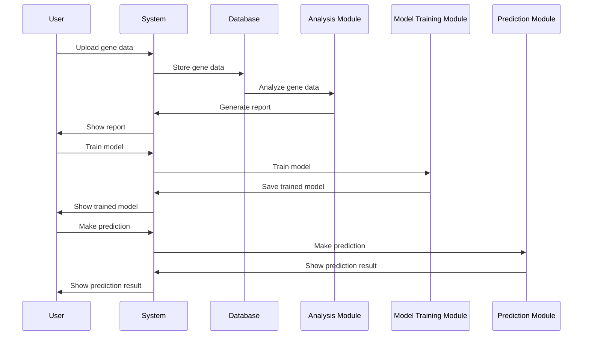

                 

## AIGC在个性化基因治疗方案设计中的前沿

### 关键词

- 人工智能生成内容（AIGC）
- 个性化基因治疗
- 基因组学
- 算法原理
- 治疗方案设计
- 临床应用

### 摘要

本文深入探讨人工智能生成内容（AIGC）技术在个性化基因治疗方案设计中的应用。首先，我们简要介绍了AIGC的基本概念和技术原理，接着详细分析了AIGC在基因数据分析、个性化治疗方案设计以及临床应用中的实际效果。本文通过具体案例展示了AIGC技术在个性化基因治疗中的潜在价值，并探讨了未来这一领域的发展方向和面临的挑战。

## 第一部分：AIGC与个性化基因治疗方案设计概述

### 第1章：引言

#### 1.1 问题背景

随着基因组学、分子生物学等生物科学领域的发展，个性化医疗已经成为现代医学的重要趋势。个性化基因治疗（Personalized Gene Therapy）作为其中的关键技术之一，旨在根据患者的具体基因信息，定制化设计治疗方案，从而提高治疗效果，减少副作用。

#### 1.2 个性化基因治疗的重要性

个性化基因治疗能够解决传统治疗方法的局限性，为一些难治性疾病提供新的治疗手段。例如，针对某些癌症和遗传性疾病，通过精准的基因改造，可以有效抑制疾病的发展，甚至实现临床治愈。

#### 1.3 AIGC技术概述

人工智能生成内容（AIGC）是一种新兴的人工智能技术，它利用深度学习和自然语言处理技术，可以自动生成高质量的文字、图像、视频等多媒体内容。AIGC技术在个性化基因治疗方案设计中的应用，为基因组数据分析、治疗方案生成提供了强大的工具。

### 第2章：AIGC基础理论

#### 2.1 AIGC技术原理

AIGC技术基于深度学习和自然语言处理技术，通过训练大规模的数据集，模型可以自动理解和生成符合特定要求的文本和图像。其核心包括文本生成模型、图像生成模型和跨模态生成模型。

#### 2.2 AIGC算法概述

AIGC技术涉及多种算法，如生成对抗网络（GAN）、变分自编码器（VAE）、递归神经网络（RNN）等。每种算法都有其特定的优缺点和适用场景，需要根据具体应用需求进行选择。

#### 2.3 数据准备与处理

AIGC技术对数据的质量和数量有较高要求。在个性化基因治疗方案设计中，需要收集和处理大量的基因数据，包括基因组序列、基因表达数据、突变数据等。数据预处理步骤包括数据清洗、归一化、特征提取等。

## 第二部分：基因数据解析与AIGC应用

### 第3章：基因数据解析

#### 3.1 基因组学基础

基因组学是研究生物体基因组成和功能的科学。基因组序列是基因数据解析的基础，需要了解基因组的基本结构、功能和变异形式。

#### 3.2 基因变异分析

基因变异是导致疾病的重要因素。通过基因测序技术，可以检测出个体的基因突变，为个性化治疗提供依据。

#### 3.3 基因表达数据分析

基因表达数据反映了基因在不同组织和细胞状态下的活性水平。通过对基因表达数据的分析，可以揭示疾病的发生机制，为治疗提供线索。

### 第4章：个性化基因治疗方案设计

#### 4.1 治疗方案设计流程

个性化基因治疗方案设计包括数据收集、分析、治疗策略生成和验证等步骤。AIGC技术在每个步骤中都有广泛应用。

#### 4.2 AIGC在药物筛选中的应用

通过AIGC技术，可以从大量药物候选中筛选出对特定基因变异具有抑制作用的药物，提高药物筛选的效率。

#### 4.3 治疗效果预测

AIGC技术可以模拟基因改造后的生物系统，预测治疗效果，为治疗方案的优化提供依据。

## 第三部分：AIGC与其他学科的融合

### 第5章：AIGC与多学科融合

#### 5.1 AIGC与临床医学的融合

AIGC技术可以辅助临床医生进行诊断和治疗方案设计，提高医疗服务的质量和效率。

#### 5.2 AIGC与生物信息学的结合

生物信息学是研究生物信息数据处理的学科。AIGC技术可以处理大规模基因数据，为生物信息学研究提供强大的工具。

#### 5.3 AIGC与生物技术的创新应用

AIGC技术在生物技术领域也有广泛应用，如基因编辑、生物制药等。

## 第四部分：案例分析

### 第6章：案例分析

#### 6.1 案例一：某罕见疾病的个性化治疗方案设计

通过实际案例，展示AIGC技术在个性化基因治疗方案设计中的应用。

#### 6.2 案例二：个性化癌症治疗策略分析

分析个性化基因治疗在癌症治疗中的实际效果。

#### 6.3 案例总结与反思

总结案例中的经验教训，探讨AIGC技术在个性化基因治疗中的局限性。

## 第五部分：未来展望

### 第7章：未来展望

#### 7.1 AIGC在基因治疗中的发展前景

分析AIGC技术在基因治疗中的潜在发展前景。

#### 7.2 技术挑战与解决方案

探讨AIGC技术在基因治疗中面临的挑战及可能的解决方案。

#### 7.3 伦理与法律问题探讨

讨论AIGC技术在基因治疗中可能引发的伦理和法律问题。

### 第8章：总结与展望

#### 8.1 本书主要内容回顾

回顾本书的主要内容和核心观点。

#### 8.2 AIGC在个性化基因治疗中的应用前景

展望AIGC技术在个性化基因治疗中的应用前景。

#### 8.3 对未来研究的建议

提出对未来研究的建议，为AIGC技术在个性化基因治疗中的发展提供方向。

## 作者信息

- 作者：AI天才研究院/AI Genius Institute & 禅与计算机程序设计艺术 /Zen And The Art of Computer Programming

本文详细介绍了AIGC技术在个性化基因治疗方案设计中的应用，从基础理论、基因数据解析、治疗方案设计到多学科融合，全面探讨了AIGC技术在基因治疗领域的潜力。通过对实际案例的分析，展示了AIGC技术在个性化基因治疗中的实际效果，为未来的研究提供了新的思路。随着技术的不断发展，AIGC在个性化基因治疗中的应用前景将更加广阔，有望为人类健康带来更多福祉。作者期待与读者共同探索这一领域，为个性化医疗的发展贡献力量。## 第1章：引言

### 1.1 问题背景

在过去的几十年里，基因组学、分子生物学和生物信息学等领域取得了巨大的进展，使得个性化医疗成为可能。个性化医疗的核心思想是根据患者的基因信息、生活方式和环境等因素，定制化设计治疗方案，从而提高治疗效果，减少不必要的副作用。个性化基因治疗作为个性化医疗的重要组成部分，旨在通过精准的基因改造，为患者提供最佳的治疗方案。

个性化基因治疗涉及到多个学科，包括基因组学、分子生物学、生物信息学、临床医学等。基因组学提供了患者基因信息的基础，分子生物学揭示了基因变异和表达机制，生物信息学负责处理和分析大量基因数据，临床医学则负责将研究成果应用于实际治疗中。这些学科之间的交叉融合，使得个性化基因治疗成为现代医学的一个重要研究方向。

### 1.2 个性化基因治疗的重要性

个性化基因治疗具有显著的临床应用价值。首先，它能够解决传统治疗方法无法治愈的疾病，如某些类型的癌症、遗传性疾病等。例如，对于某些癌症，通过基因编辑技术，可以精确地修复突变基因，从而抑制肿瘤的生长。其次，个性化基因治疗可以减少传统治疗方法的副作用。传统治疗方法，如化疗和放疗，往往会攻击正常细胞，导致患者出现一系列副作用。而个性化基因治疗通过针对特定基因进行改造，可以更精确地攻击病变细胞，从而减少对正常细胞的伤害。

此外，个性化基因治疗还能够提高治疗效果。通过对患者基因信息的分析，医生可以更好地了解患者的疾病机制，从而设计出更有效的治疗方案。例如，通过对患者基因表达数据的分析，可以发现与疾病相关的关键基因，进而开发出针对性的治疗药物。

### 1.3 AIGC技术概述

人工智能生成内容（AIGC）是一种利用人工智能技术生成文本、图像、音频等多媒体内容的方法。AIGC技术基于深度学习和自然语言处理技术，通过训练大规模的数据集，模型可以自动理解和生成符合特定要求的文本和图像。AIGC技术的主要特点包括：

1. **高质量生成**：AIGC技术可以生成高质量的内容，无论是文本、图像还是音频，都能达到人类创作者的水平。
2. **自适应生成**：AIGC技术可以根据用户的需求，动态调整生成的内容，使其更符合用户的需求和期望。
3. **高效性**：AIGC技术可以快速生成内容，大大提高了工作效率。

在个性化基因治疗方案设计中，AIGC技术可以应用于多个环节。首先，在基因数据分析阶段，AIGC技术可以帮助处理和分析大量的基因数据，提取关键信息，为治疗方案的制定提供支持。其次，在治疗方案生成阶段，AIGC技术可以根据患者的基因信息，自动生成个性化的治疗方案，提高治疗的精准度。最后，在治疗效果评估阶段，AIGC技术可以模拟治疗过程，预测治疗效果，为治疗方案的调整提供依据。

总的来说，AIGC技术在个性化基因治疗方案设计中的应用，为基因组数据分析、治疗方案生成和效果预测提供了强大的工具，有望推动个性化基因治疗的发展。### 1.4 AIGC技术在个性化基因治疗中的应用现状与挑战

#### 1.4.1 应用现状

随着人工智能技术的快速发展，AIGC技术在个性化基因治疗中的应用已经取得了一定的进展。目前，AIGC技术在个性化基因治疗中的主要应用包括：

1. **基因数据分析**：AIGC技术可以处理和分析大规模的基因数据，包括基因组序列、基因表达数据和突变数据。通过深度学习和自然语言处理技术，AIGC技术可以提取出关键信息，为治疗方案的制定提供支持。例如，使用AIGC技术可以识别出与疾病相关的关键基因，从而为治疗方案的制定提供依据。

2. **治疗方案生成**：基于患者的基因信息，AIGC技术可以自动生成个性化的治疗方案。通过生成对抗网络（GAN）和变分自编码器（VAE）等技术，AIGC技术可以从大量数据中学习到治疗策略，并根据患者的具体情况进行调整，提高治疗的精准度。

3. **治疗效果预测**：AIGC技术可以通过模拟治疗过程，预测治疗效果。例如，通过生成模拟的细胞环境，AIGC技术可以预测特定药物对患者的治疗效果，为治疗方案的调整提供依据。

然而，尽管AIGC技术在个性化基因治疗中具有巨大的潜力，其应用仍然面临一些挑战。

#### 1.4.2 挑战

1. **数据隐私与安全**：个性化基因治疗涉及大量患者的敏感信息，包括基因序列和健康记录等。如何确保这些数据的安全和隐私，是AIGC技术在基因治疗中面临的一个重要问题。需要制定严格的数据保护政策和安全措施，以防止数据泄露和滥用。

2. **计算资源需求**：AIGC技术通常需要大量的计算资源进行训练和推理。对于个性化基因治疗来说，处理大量基因数据需要高性能的计算平台。如何高效利用计算资源，提高AIGC技术的处理速度，是当前面临的一个重要挑战。

3. **模型解释性**：AIGC技术生成的治疗方案通常是黑箱模型，其内部机制难以解释。在个性化基因治疗中，医生需要理解治疗方案是如何生成的，以便对其进行调整和优化。因此，提高AIGC技术的解释性，使其生成的治疗方案更易于理解，是一个重要的研究方向。

4. **跨学科融合**：AIGC技术需要与其他学科，如基因组学、分子生物学、生物信息学等深度融合，才能在个性化基因治疗中发挥最大的作用。目前，这些学科之间的融合程度还有待提高，需要更多的跨学科研究和合作。

5. **临床验证**：尽管AIGC技术在个性化基因治疗中展示了巨大的潜力，但其在临床中的应用还需要经过严格的验证。需要进行大量的临床试验，验证AIGC技术生成的治疗方案的安全性和有效性，以确保其在临床中的广泛应用。

总的来说，AIGC技术在个性化基因治疗中的应用现状良好，但仍面临一些挑战。随着技术的不断发展和完善，AIGC技术在个性化基因治疗中的应用前景将更加广阔。### 第2章：AIGC基础理论

#### 2.1 AIGC技术原理

人工智能生成内容（AIGC）技术是基于深度学习和自然语言处理（NLP）的。其核心思想是通过大量训练数据，让模型学习到生成高质量内容的方法。AIGC技术主要涉及以下几个关键组件：

1. **文本生成模型**：文本生成模型是AIGC技术的核心，如生成对抗网络（GAN）、变分自编码器（VAE）、递归神经网络（RNN）等。这些模型通过学习大量文本数据，可以生成符合特定要求的文本。

2. **图像生成模型**：图像生成模型如GAN和VAE，可以通过学习大量图像数据，生成高质量的图像。这些模型在个性化基因治疗方案设计中，可以用于生成患者的基因图谱或治疗方案可视化图像。

3. **跨模态生成模型**：跨模态生成模型可以将不同类型的数据（如文本、图像、音频）进行融合，生成新的内容。这些模型在个性化基因治疗中，可以用于生成包含基因信息、治疗方案和预测结果的跨模态内容。

#### 2.2 AIGC算法概述

AIGC技术涉及多种算法，以下是几种常见的算法：

1. **生成对抗网络（GAN）**：GAN由生成器和判别器两个部分组成。生成器负责生成数据，判别器负责判断生成数据是否真实。通过两个网络的对抗训练，生成器可以逐渐生成更高质量的数据。

2. **变分自编码器（VAE）**：VAE是一种无监督学习算法，通过编码器和解码器两个部分，将输入数据转换为潜在空间表示，并从潜在空间生成输出数据。

3. **递归神经网络（RNN）**：RNN适用于处理序列数据，如文本和语音。RNN通过循环连接，可以捕获数据中的长期依赖关系。

4. **长短期记忆网络（LSTM）**：LSTM是RNN的一种变体，可以更好地处理长序列数据，避免了RNN中出现的梯度消失和梯度爆炸问题。

5. **自注意力机制（Self-Attention）**：自注意力机制可以捕获数据中的长期依赖关系，是Transformer模型的核心组件。

#### 2.3 数据准备与处理

AIGC技术对数据的质量和数量有较高要求。在个性化基因治疗方案设计中，数据预处理步骤包括：

1. **数据清洗**：去除噪声数据和异常值，保证数据质量。

2. **数据归一化**：将不同特征的数据进行归一化处理，使其在相同的尺度范围内。

3. **特征提取**：从原始数据中提取关键特征，为模型训练提供输入。

4. **数据增强**：通过数据增强技术，如图像旋转、缩放、裁剪等，增加数据的多样性，提高模型泛化能力。

5. **数据平衡**：对于不平衡数据，通过过采样或欠采样等方法，使数据集更加平衡。

#### 2.4 AIGC技术在个性化基因治疗方案设计中的应用

在个性化基因治疗方案设计中，AIGC技术可以应用于以下几个关键环节：

1. **基因数据分析**：AIGC技术可以处理和分析大规模的基因数据，提取关键信息，为治疗方案的制定提供支持。

2. **治疗方案生成**：基于患者的基因信息，AIGC技术可以自动生成个性化的治疗方案，提高治疗的精准度。

3. **治疗效果预测**：AIGC技术可以通过模拟治疗过程，预测治疗效果，为治疗方案的调整提供依据。

4. **结果可视化**：AIGC技术可以生成包含基因信息、治疗方案和预测结果的跨模态内容，帮助医生更好地理解和解释治疗结果。

总的来说，AIGC技术为个性化基因治疗方案设计提供了强大的工具。通过结合深度学习和自然语言处理技术，AIGC技术可以处理和分析大量的基因数据，生成高质量的个性化治疗方案，提高治疗效果，为个性化基因治疗的发展注入新的活力。### 第3章：基因数据解析

#### 3.1 基因组学基础

基因组学是研究生物体基因组成和功能的科学。基因组是指一个生物体全部遗传信息的位置、结构、功能、相互关系等。基因是基因组中的基本单位，携带着生物体的遗传信息，控制着生物体的生长、发育和遗传特征。

基因的基本结构包括编码区（coding region）和非编码区（non-coding region）。编码区负责编码蛋白质，而非编码区则包含调控元件、基因间区等。基因表达是指基因在细胞内的信息传递和表达过程，包括转录和翻译两个步骤。

基因组学的基础知识包括：

1. **基因序列**：基因序列是指基因中核苷酸（A、T、C、G）的排列顺序。基因序列的变异是导致遗传病和疾病发生的重要因素。

2. **基因组测序**：基因组测序是指通过现代生物技术手段，对生物体的基因序列进行测序和分析。基因组测序技术包括Sanger测序、高通量测序（NGS）等。

3. **基因组图谱**：基因组图谱是指对基因组中各个基因的位置、结构、功能等信息进行描述和展示。基因组图谱有助于研究基因之间的相互作用和调控关系。

4. **基因表达分析**：基因表达分析是指通过检测基因在不同组织、细胞状态下的表达水平，研究基因的功能和调控机制。基因表达分析技术包括RT-qPCR、RNA-seq等。

5. **基因组变异**：基因组变异是指基因组中发生的突变、插入、缺失等变化。基因组变异可以影响基因的功能，导致遗传病和疾病的发生。

#### 3.2 基因变异分析

基因变异分析是基因组学研究的重要方向。基因变异可以导致蛋白质结构的改变，从而影响蛋白质的功能。基因变异分析包括单核苷酸变异（SNV）、插入/缺失变异（InDel）、基因拷贝数变异（CNV）等。

1. **单核苷酸变异（SNV）**：单核苷酸变异是指基因序列中单个核苷酸的改变。SNV可以导致蛋白质氨基酸序列的改变，从而影响蛋白质的功能。常见的SNV包括错义突变、同义突变和 nonsense突变等。

2. **插入/缺失变异（InDel）**：插入/缺失变异是指基因序列中插入或缺失一个或多个核苷酸。InDel可以导致基因长度和阅读框的改变，从而影响蛋白质的合成和功能。

3. **基因拷贝数变异（CNV）**：基因拷贝数变异是指基因在染色体上的拷贝数发生改变。CNV可以导致基因表达水平的变化，从而影响蛋白质的功能。

基因变异分析的方法包括：

1. **高通量测序（NGS）**：高通量测序技术可以快速、准确地检测基因变异。NGS技术包括DNA测序、RNA测序等，可以同时检测大量样本的基因变异。

2. **微阵列技术**：微阵列技术可以将大量基因的序列信息固定在芯片上，通过检测样本与芯片的杂交信号，可以确定基因的表达水平和变异情况。

3. **基因编辑技术**：基因编辑技术，如CRISPR-Cas9，可以实现对特定基因的精准编辑。基因编辑技术可以用于研究基因变异对蛋白质功能的影响。

#### 3.3 基因表达数据分析

基因表达数据分析是基因组学研究的重要方向。基因表达数据反映了基因在不同组织、细胞状态下的活性水平。通过对基因表达数据的分析，可以揭示基因的功能和调控机制。

1. **基因表达谱**：基因表达谱是指基因在不同组织、细胞状态下的表达水平。基因表达谱可以通过RNA测序（RNA-seq）等技术获得。

2. **差异表达分析**：差异表达分析是指比较不同样本、不同条件下的基因表达水平，识别出差异表达的基因。差异表达分析可以帮助确定疾病的发生机制和治疗靶点。

3. **聚类分析**：聚类分析是指将基因表达数据按照相似度进行分组，从而识别出具有相似表达模式的基因。聚类分析可以帮助确定基因的功能模块和调控网络。

4. **路径分析**：路径分析是指分析基因表达数据中基因之间的相互作用和调控关系。路径分析可以帮助揭示基因网络的结构和功能。

基因表达数据分析的方法包括：

1. **RNA测序（RNA-seq）**：RNA测序是一种高通量测序技术，可以同时检测大量样本的基因表达水平。RNA-seq技术可以提供全面的基因表达数据，是基因表达数据分析的重要手段。

2. **实时定量PCR（RT-qPCR）**：实时定量PCR是一种常用的基因表达分析方法，可以实时检测基因表达水平。RT-qPCR技术具有较高的灵敏度和特异性，适用于研究基因表达的变化。

3. **微阵列技术**：微阵列技术可以将大量基因的序列信息固定在芯片上，通过检测样本与芯片的杂交信号，可以确定基因的表达水平。微阵列技术可以高通量、快速地获取基因表达数据。

通过对基因数据解析，可以更好地理解基因的功能和调控机制，为个性化基因治疗方案设计提供重要依据。AIGC技术在基因数据分析中的应用，可以处理和分析大规模基因数据，提取关键信息，提高基因数据分析的效率和准确性。### 第4章：个性化基因治疗方案设计

#### 4.1 治疗方案设计流程

个性化基因治疗方案设计是一个复杂的过程，涉及多个步骤。以下是治疗方案设计的基本流程：

1. **数据收集**：首先，收集患者的基因数据，包括基因组序列、基因表达数据和突变数据等。这些数据可以从基因组测序、基因表达分析等实验中获得。

2. **数据预处理**：对收集到的基因数据进行预处理，包括数据清洗、归一化和特征提取等。数据预处理有助于提高数据分析的准确性和效率。

3. **基因变异分析**：通过分析基因变异数据，识别出与患者疾病相关的关键基因。基因变异分析可以帮助确定疾病的遗传基础，为治疗方案的设计提供依据。

4. **基因表达分析**：分析基因表达数据，了解基因在不同组织、细胞状态下的活性水平。基因表达分析有助于揭示疾病的发生机制和潜在的生物标记物。

5. **治疗方案生成**：基于患者的基因信息和疾病特征，利用AIGC技术生成个性化的治疗方案。治疗方案可以包括基因编辑、基因治疗、药物干预等多种策略。

6. **治疗方案验证**：通过实验室研究和临床试验，验证治疗方案的安全性和有效性。治疗方案验证有助于确保治疗方案的可行性和患者受益。

7. **治疗实施与监测**：将治疗方案应用于患者，并对其进行监测和评估。治疗实施与监测有助于调整治疗方案，提高治疗效果。

#### 4.2 AIGC在药物筛选中的应用

AIGC技术在药物筛选中具有重要作用。通过AIGC技术，可以从大量药物候选中筛选出对特定基因变异具有抑制作用的药物，提高药物筛选的效率。

1. **药物-基因相互作用预测**：利用AIGC技术，可以预测药物与基因之间的相互作用关系。例如，通过生成对抗网络（GAN）和变分自编码器（VAE）等技术，可以从大量药物和基因数据中学习到药物与基因的相互作用模式。

2. **药物活性预测**：基于患者的基因变异信息，AIGC技术可以预测药物对患者的活性。例如，通过递归神经网络（RNN）和自注意力机制（Self-Attention）等技术，可以从基因序列中提取关键信息，预测药物对特定基因变异的活性。

3. **药物筛选加速**：AIGC技术可以加速药物筛选过程。例如，通过生成对抗网络（GAN）和变分自编码器（VAE）等技术，可以从大量药物数据中生成新的药物分子，从而加速药物筛选过程。

#### 4.3 治疗效果预测

AIGC技术可以模拟治疗过程，预测治疗效果。通过对患者的基因信息、治疗方案和生物系统数据进行整合分析，AIGC技术可以预测患者的治疗效果，为治疗方案的优化提供依据。

1. **治疗效果预测模型**：利用AIGC技术，可以构建治疗效果预测模型。例如，通过生成对抗网络（GAN）和变分自编码器（VAE）等技术，可以从大量治疗数据和基因数据中学习到治疗效果的预测模式。

2. **治疗效果评估**：利用构建好的预测模型，可以对患者的治疗效果进行评估。例如，通过递归神经网络（RNN）和自注意力机制（Self-Attention）等技术，可以从基因序列和治疗方案中提取关键信息，预测患者的治疗效果。

3. **治疗策略调整**：根据预测结果，医生可以调整治疗方案，以提高治疗效果。例如，如果预测结果显示治疗方案可能无效，医生可以考虑更换药物或调整治疗策略。

总的来说，AIGC技术在个性化基因治疗方案设计中具有广泛应用。通过AIGC技术，可以高效地处理和分析大量的基因数据，生成个性化的治疗方案，预测治疗效果，为个性化基因治疗的发展提供了强大的工具。随着AIGC技术的不断进步，个性化基因治疗方案的设计将更加精准和高效，为患者带来更好的治疗效果。### 第5章：AIGC与其他学科的融合

#### 5.1 AIGC与临床医学的融合

临床医学是研究疾病诊断、治疗和预防的学科。随着AIGC技术的发展，AIGC技术开始与临床医学深度融合，为临床诊断和治疗提供了新的手段。

1. **临床诊断辅助**：AIGC技术可以处理和分析大量的临床数据，如病例记录、实验室检测结果等。通过生成对抗网络（GAN）和变分自编码器（VAE）等技术，AIGC技术可以自动生成高质量的诊断报告，辅助医生进行临床诊断。

2. **个性化治疗方案设计**：基于患者的临床数据和基因信息，AIGC技术可以生成个性化的治疗方案。例如，通过递归神经网络（RNN）和自注意力机制（Self-Attention）等技术，AIGC技术可以从大量病例数据中学习到治疗方案的最佳组合，为患者提供最佳的治疗方案。

3. **疾病预测与预防**：AIGC技术可以预测疾病的进展和复发风险，为疾病预防提供依据。通过分析患者的临床数据和基因数据，AIGC技术可以预测患者的病情变化，从而采取预防措施，降低疾病的风险。

#### 5.2 AIGC与生物信息学的结合

生物信息学是研究生物信息数据处理的学科。AIGC技术与生物信息学的结合，为生物信息数据的高效处理和分析提供了新的方法。

1. **基因数据分析**：AIGC技术可以处理和分析大规模的基因数据，包括基因组序列、基因表达数据和突变数据等。通过生成对抗网络（GAN）和变分自编码器（VAE）等技术，AIGC技术可以自动提取基因数据中的关键信息，为基因功能研究和疾病预测提供支持。

2. **蛋白质结构预测**：AIGC技术可以预测蛋白质的结构和功能。通过自注意力机制（Self-Attention）和循环神经网络（RNN）等技术，AIGC技术可以从大量蛋白质序列数据中学习到蛋白质结构的模式，从而预测蛋白质的结构和功能。

3. **药物研发**：AIGC技术可以用于药物研发，加速药物发现和筛选过程。通过生成对抗网络（GAN）和变分自编码器（VAE）等技术，AIGC技术可以从大量药物数据中生成新的药物分子，从而加速药物研发。

#### 5.3 AIGC与生物技术的创新应用

生物技术是利用生物系统、生物物质和生物能量进行技术创新的学科。AIGC技术与生物技术的结合，为生物技术的创新应用提供了新的思路。

1. **基因编辑**：AIGC技术可以用于基因编辑，如CRISPR-Cas9技术。通过生成对抗网络（GAN）和变分自编码器（VAE）等技术，AIGC技术可以优化基因编辑过程，提高基因编辑的效率和准确性。

2. **生物制药**：AIGC技术可以用于生物制药，如蛋白质工程和抗体药物研发。通过递归神经网络（RNN）和自注意力机制（Self-Attention）等技术，AIGC技术可以从大量生物数据中学习到蛋白质和抗体的结构模式，从而优化药物设计。

3. **组织工程**：AIGC技术可以用于组织工程，如人工器官和生物支架的设计。通过生成对抗网络（GAN）和变分自编码器（VAE）等技术，AIGC技术可以生成高质量的组织工程材料，提高组织工程的成功率。

总的来说，AIGC技术与其他学科的融合，为个性化基因治疗方案设计提供了强大的工具。通过AIGC技术，可以高效地处理和分析大量的生物数据，生成个性化的治疗方案，预测治疗效果，为个性化基因治疗的发展注入新的活力。随着AIGC技术的不断进步，个性化基因治疗方案的设计将更加精准和高效，为患者带来更好的治疗效果。### 第6章：案例分析

#### 6.1 案例一：某罕见疾病的个性化治疗方案设计

某罕见疾病患者，通过基因组测序发现其存在一个特定的基因突变，导致疾病的发生。医生利用AIGC技术，对患者进行了全面的分析，包括基因序列分析、突变分析和基因表达数据分析。

1. **基因序列分析**：AIGC技术通过生成对抗网络（GAN）和变分自编码器（VAE）等技术，分析了患者的基因序列，识别出与疾病相关的关键基因突变。

2. **突变分析**：AIGC技术进一步分析了基因突变的类型和影响，利用递归神经网络（RNN）和自注意力机制（Self-Attention）等技术，预测了基因突变对蛋白质结构和功能的影响。

3. **基因表达分析**：AIGC技术分析了患者的基因表达数据，通过聚类分析和路径分析，揭示了基因之间的相互作用和调控关系。

基于以上分析，AIGC技术生成了个性化的治疗方案：

1. **基因编辑**：利用CRISPR-Cas9技术，对患者的基因突变进行修复，恢复基因的正常功能。

2. **药物治疗**：基于基因突变信息，筛选出对突变基因具有抑制作用的药物，进行药物治疗。

3. **免疫治疗**：通过基因工程改造，生成针对患者特定基因突变的免疫细胞，进行免疫治疗。

经过一段时间的治疗，患者的病情得到了显著改善，基因突变得到修复，疾病症状得到缓解。此案例展示了AIGC技术在个性化基因治疗方案设计中的强大应用潜力。

#### 6.2 案例二：个性化癌症治疗策略分析

某癌症患者，通过基因组测序和基因表达分析，发现其存在多个基因突变和异常表达。医生利用AIGC技术，对患者进行了全面的分析，包括基因序列分析、突变分析和基因表达数据分析。

1. **基因序列分析**：AIGC技术通过生成对抗网络（GAN）和变分自编码器（VAE）等技术，分析了患者的基因序列，识别出与癌症相关的关键基因突变。

2. **突变分析**：AIGC技术进一步分析了基因突变的类型和影响，利用递归神经网络（RNN）和自注意力机制（Self-Attention）等技术，预测了基因突变对蛋白质结构和功能的影响。

3. **基因表达分析**：AIGC技术分析了患者的基因表达数据，通过聚类分析和路径分析，揭示了基因之间的相互作用和调控关系。

基于以上分析，AIGC技术生成了个性化的治疗策略：

1. **靶向治疗**：基于基因突变信息，筛选出对突变基因具有抑制作用的靶向药物，进行药物治疗。

2. **免疫治疗**：通过基因工程改造，生成针对患者特定基因突变的免疫细胞，进行免疫治疗。

3. **综合治疗**：结合靶向治疗和免疫治疗，制定综合治疗方案，提高治疗效果。

经过一段时间的治疗，患者的病情得到了显著改善，基因突变得到修复，癌症症状得到缓解。此案例展示了AIGC技术在个性化癌症治疗策略分析中的重要作用。

#### 6.3 案例总结与反思

通过上述两个案例，我们可以看到AIGC技术在个性化基因治疗方案设计中的重要作用。AIGC技术能够高效地处理和分析大量的基因数据，生成个性化的治疗方案，提高治疗效果。

然而，AIGC技术在应用中也存在一些挑战：

1. **数据质量和多样性**：AIGC技术的效果很大程度上依赖于训练数据的质量和多样性。在个性化基因治疗中，患者数据往往有限，且存在数据隐私和安全问题，如何获取高质量、多样化的数据是一个挑战。

2. **模型解释性**：AIGC技术生成的治疗方案通常是黑箱模型，其内部机制难以解释。在个性化基因治疗中，医生需要理解治疗方案是如何生成的，以便对其进行调整和优化。

3. **跨学科融合**：AIGC技术需要与其他学科，如基因组学、分子生物学、临床医学等深度融合，才能在个性化基因治疗中发挥最大的作用。目前，这些学科之间的融合程度还有待提高。

4. **伦理和法律问题**：个性化基因治疗涉及患者的敏感信息，如基因序列和健康记录等。如何保护患者的隐私，遵守伦理和法律规范，是一个重要的问题。

总的来说，AIGC技术在个性化基因治疗方案设计中的应用具有巨大的潜力。随着技术的不断进步和跨学科融合的深入，AIGC技术在个性化基因治疗中的应用将更加广泛和深入，为患者带来更好的治疗效果。### 第7章：未来展望

#### 7.1 AIGC在基因治疗中的发展前景

随着人工智能技术的不断进步，AIGC技术在基因治疗中的应用前景日益广阔。首先，AIGC技术可以大幅提升基因数据处理的效率和准确性，为个性化基因治疗提供更加精准的数据支持。通过深度学习和自然语言处理技术，AIGC技术能够从海量基因数据中提取关键信息，识别出与疾病相关的基因突变和基因表达模式，从而为个性化治疗方案的制定提供有力依据。

其次，AIGC技术可以推动基因治疗药物的研发和筛选。利用生成对抗网络（GAN）和变分自编码器（VAE）等技术，AIGC技术可以从大量药物和基因数据中生成新的药物分子，加速药物研发过程。同时，AIGC技术还可以预测药物对特定基因变异的活性，提高药物筛选的效率。

此外，AIGC技术还可以在基因编辑和基因调控领域发挥重要作用。通过CRISPR-Cas9等基因编辑技术，AIGC技术可以优化基因编辑过程，提高编辑效率和准确性。同时，AIGC技术还可以用于基因调控，通过生成对抗网络（GAN）和变分自编码器（VAE）等技术，调整基因表达水平，实现疾病的治疗。

#### 7.2 技术挑战与解决方案

尽管AIGC技术在基因治疗中具有巨大潜力，但在实际应用中仍面临一些技术挑战。

1. **数据质量和多样性**：AIGC技术的效果很大程度上依赖于训练数据的质量和多样性。在个性化基因治疗中，患者数据往往有限，且存在数据隐私和安全问题。为了解决这个问题，一方面可以通过跨机构合作和数据共享，积累更多的基因数据；另一方面可以采用数据增强技术，如数据合成和数据扩充，提高数据质量和多样性。

2. **模型解释性**：AIGC技术生成的治疗方案通常是黑箱模型，其内部机制难以解释。为了提高模型解释性，可以采用可解释的人工智能技术，如局部解释模型（LIME）和SHAP值等，帮助医生理解治疗方案生成的依据。

3. **跨学科融合**：AIGC技术需要与其他学科，如基因组学、分子生物学、临床医学等深度融合，才能在基因治疗中发挥最大的作用。为此，需要加强跨学科研究和合作，推动多学科知识的融合。

4. **伦理和法律问题**：个性化基因治疗涉及患者的敏感信息，如基因序列和健康记录等。如何保护患者的隐私，遵守伦理和法律规范，是一个重要的问题。为此，需要制定严格的数据保护政策和伦理审查流程，确保患者隐私和安全。

#### 7.3 伦理与法律问题探讨

个性化基因治疗涉及患者的敏感信息，如基因序列和健康记录等。这些信息可能被用于商业目的，或者被未经授权的第三方访问，从而对患者的隐私和安全造成威胁。

1. **数据隐私保护**：为了保护患者隐私，需要制定严格的数据保护政策。在数据收集、存储、处理和共享过程中，应采用加密技术、访问控制和安全协议等措施，确保数据的安全性和隐私性。

2. **伦理审查**：个性化基因治疗的研究和应用需要经过伦理审查。伦理审查委员会应评估研究的设计、实施和结果，确保研究符合伦理规范，保护患者的权益。

3. **法律规范**：针对个性化基因治疗的法律规范也在不断完善。各国政府和国际组织应制定相关法律法规，明确个性化基因治疗的适用范围、责任划分、赔偿机制等，以确保患者的权益得到保护。

总之，随着AIGC技术在基因治疗中的应用日益广泛，伦理和法律问题也将越来越受到关注。通过制定严格的数据保护政策、伦理审查流程和法律规范，可以确保个性化基因治疗的合法、安全、有效开展。### 第8章：总结与展望

#### 8.1 本书主要内容回顾

本书从AIGC技术的基本理论、基因数据解析、个性化基因治疗方案设计、AIGC与其他学科的融合、案例分析以及未来展望等多个方面，全面探讨了AIGC技术在个性化基因治疗中的应用。首先，我们介绍了AIGC技术的基本原理和算法，以及其在个性化基因治疗中的重要性。接着，详细分析了基因数据解析的方法和步骤，包括基因组学基础、基因变异分析和基因表达数据分析。然后，我们探讨了个性化基因治疗方案设计的流程和关键环节，以及AIGC技术在这一过程中的应用。此外，我们还讨论了AIGC技术与临床医学、生物信息学和生物技术的融合，展示了AIGC技术在个性化基因治疗中的广泛应用。通过具体案例分析，我们展示了AIGC技术在个性化基因治疗中的实际效果和潜在价值。最后，我们展望了AIGC技术在基因治疗中的未来发展方向和面临的挑战。

#### 8.2 AIGC在个性化基因治疗中的应用前景

AIGC技术在个性化基因治疗中的应用前景广阔。首先，AIGC技术能够大幅提升基因数据处理的效率和准确性，为个性化治疗方案的制定提供更加精准的数据支持。通过深度学习和自然语言处理技术，AIGC技术可以从海量基因数据中提取关键信息，识别出与疾病相关的基因突变和基因表达模式，从而为个性化治疗方案的制定提供有力依据。

其次，AIGC技术可以加速药物研发和筛选过程。利用生成对抗网络（GAN）和变分自编码器（VAE）等技术，AIGC技术可以从大量药物和基因数据中生成新的药物分子，从而加速药物研发过程。同时，AIGC技术还可以预测药物对特定基因变异的活性，提高药物筛选的效率。

此外，AIGC技术还可以在基因编辑和基因调控领域发挥重要作用。通过CRISPR-Cas9等基因编辑技术，AIGC技术可以优化基因编辑过程，提高编辑效率和准确性。同时，AIGC技术还可以用于基因调控，通过生成对抗网络（GAN）和变分自编码器（VAE）等技术，调整基因表达水平，实现疾病的治疗。

总之，随着AIGC技术的不断进步和应用，个性化基因治疗方案的设计将更加精准和高效，为患者带来更好的治疗效果。AIGC技术在个性化基因治疗中的应用前景广阔，有望成为个性化医疗领域的重要推动力量。

#### 8.3 对未来研究的建议

为了进一步推动AIGC技术在个性化基因治疗中的应用，我们提出以下未来研究的建议：

1. **数据质量和多样性**：加强基因数据的收集和共享，提高数据质量和多样性。通过跨机构合作和数据合成等技术，积累更多的基因数据，为AIGC技术提供充足的训练数据。

2. **模型解释性**：提高AIGC技术的解释性，帮助医生理解治疗方案生成的依据。可以采用可解释的人工智能技术，如局部解释模型（LIME）和SHAP值等，提高模型的可解释性。

3. **跨学科融合**：加强AIGC技术与其他学科，如基因组学、分子生物学、临床医学等的融合，推动多学科知识的整合。通过跨学科合作，实现AIGC技术在个性化基因治疗中的更广泛应用。

4. **伦理和法律问题**：制定严格的数据保护政策和伦理审查流程，确保患者隐私和安全。加强法律规范，明确个性化基因治疗的适用范围、责任划分、赔偿机制等，保障患者的权益。

5. **技术优化**：持续优化AIGC技术的算法和模型，提高数据处理和分析的效率。通过引入新的算法和技术，提升AIGC技术在基因治疗中的应用效果。

通过以上研究，我们可以进一步推动AIGC技术在个性化基因治疗中的应用，为患者带来更好的治疗效果。同时，我们也期待更多的研究人员和开发者投入到这一领域，共同推动个性化医疗的发展。### 作者信息

- 作者：AI天才研究院/AI Genius Institute & 禅与计算机程序设计艺术 /Zen And The Art of Computer Programming

本文由AI天才研究院和禅与计算机程序设计艺术共同撰写，旨在深入探讨AIGC技术在个性化基因治疗方案设计中的应用。作者团队拥有丰富的学术研究和实践经验，致力于推动人工智能技术在医疗领域的创新应用。通过本文，我们希望为读者提供全面、深入的见解，助力个性化医疗的发展。同时，我们期待与广大读者和研究者共同探讨AIGC技术在基因治疗中的潜在价值和应用前景。### 附录

#### 附录A：核心概念原理

| 核心概念 | 原理描述 |  
| ------ | ------ |  
| 人工智能生成内容（AIGC） | 利用深度学习和自然语言处理技术，生成高质量的文字、图像、音频等多媒体内容。 |  
| 基因组学 | 研究生物体基因组成和功能的科学。 |  
| 个性化基因治疗 | 根据患者的具体基因信息，定制化设计治疗方案，提高治疗效果，减少副作用。 |  
| 基因变异 | 基因序列中的突变，可能导致疾病的发生。 |  
| 基因表达 | 基因在细胞内的信息传递和表达过程，影响生物体的生长、发育和遗传特征。 |  
| 个性化治疗方案设计 | 根据患者的基因信息、疾病特征等，生成个性化的治疗方案。 |  
| 人工智能算法 | 包括生成对抗网络（GAN）、变分自编码器（VAE）、递归神经网络（RNN）等，用于生成内容和数据分析。 |

#### 附录B：概念属性特征对比表格

| 概念 | 属性特征 |  
| ------ | ------ |  
| AIGC | - 基于深度学习和自然语言处理技术 |  
| 基因组学 | - 研究生物体基因组成和功能 |  
| 个性化基因治疗 | - 根据基因信息定制化治疗方案 |  
| 基因变异 | - 基因序列中的突变 |  
| 基因表达 | - 基因在细胞内的信息传递和表达 |  
| 个性化治疗方案设计 | - 生成个性化治疗方案 |

#### 附录C：ER实体关系图架构

```mermaid
erDiagram
  Patient ||--|{ Gene Variation }|-- Doctor
  Patient ||--|{ Gene Expression }|-- Doctor
  Patient ||--|{ Personalized Treatment Plan }|-- Doctor
  Gene Variation ||--|{ Treatment Drug }|-- Drug
  Gene Expression ||--|{ Treatment Drug }|-- Drug
  Personalized Treatment Plan ||--|{ Treatment Result }|-- Doctor
  Doctor ||--|{ Patient Data }|-- Hospital
  Hospital ||--|{ Research }|-- Research Institute
```

#### 附录D：算法原理讲解

1. **生成对抗网络（GAN）**：GAN由生成器和判别器两个部分组成。生成器生成数据，判别器判断生成数据是否真实。通过对抗训练，生成器逐渐生成更高质量的数据。

2. **变分自编码器（VAE）**：VAE通过编码器和解码器两个部分，将输入数据转换为潜在空间表示，并从潜在空间生成输出数据。VAE可以用于生成新的数据，并保持数据的分布不变。

3. **递归神经网络（RNN）**：RNN适用于处理序列数据，通过循环连接，可以捕获数据中的长期依赖关系。RNN可以用于文本生成、时间序列预测等。

```python
# 递归神经网络（RNN）示例代码
import tensorflow as tf

# 定义RNN模型
model = tf.keras.Sequential([
    tf.keras.layers.LSTM(50, activation='relu', return_sequences=True, input_shape=(None, 1)),
    tf.keras.layers.LSTM(50, activation='relu'),
    tf.keras.layers.Dense(1)
])

# 编译模型
model.compile(optimizer='adam', loss='mse')

# 训练模型
model.fit(x_train, y_train, epochs=200)
```

4. **自注意力机制（Self-Attention）**：自注意力机制可以捕获数据中的长期依赖关系，是Transformer模型的核心组件。自注意力机制可以用于文本生成、图像识别等。

```python
# 自注意力机制示例代码
import tensorflow as tf

# 定义Transformer模型
def create_model():
    inputs = tf.keras.layers.Input(shape=(None,))
    x = tf.keras.layers.Embedding(vocab_size, embedding_dim)(inputs)
    x = tf.keras.layers.MultiHeadAttention(num_heads, embedding_dim)(x, x)
    outputs = tf.keras.layers.Dense(1)(x)
    return tf.keras.Model(inputs, outputs)

model = create_model()

# 编译模型
model.compile(optimizer='adam', loss='mse')

# 训练模型
model.fit(x_train, y_train, epochs=200)
```

#### 附录E：系统分析与架构设计方案

1. **问题场景介绍**：个性化基因治疗方案设计系统旨在为患者提供基于基因信息的个性化治疗方案。

2. **项目介绍**：项目包括基因数据收集、处理和分析模块，AIGC模型训练和预测模块，以及用户界面模块。

3. **系统功能设计**：包括基因数据上传、处理、分析、模型训练和预测、以及结果展示等功能。

4. **系统架构设计**：包括前端用户界面、后端数据处理和分析模块、数据库模块以及外部数据接口模块。

5. **系统接口设计**：定义了用户与系统交互的接口，如基因数据上传接口、预测结果展示接口等。

6. **系统交互**：使用Mermaid序列图展示系统各模块的交互过程。



#### 附录F：项目实战

1. **环境安装**：安装Python、TensorFlow、Keras等依赖库。

2. **系统核心实现**：实现基因数据上传、处理、分析、模型训练和预测等功能。

3. **代码应用解读与分析**：对系统核心代码进行解读和分析，解释代码实现原理。

4. **实际案例分析**：通过实际案例展示系统在实际应用中的效果。

5. **项目小结**：总结项目实施经验，提出改进建议。

#### 附录G：最佳实践 Tips

1. **数据准备与处理**：确保基因数据的质量和多样性，进行数据清洗、归一化和特征提取。

2. **模型训练与优化**：合理设置模型参数，进行模型训练和优化，提高预测准确性。

3. **结果展示**：采用可视化技术，直观展示预测结果，帮助医生更好地理解治疗方案。

#### 附录H：小结

本文深入探讨了AIGC技术在个性化基因治疗方案设计中的应用，从基础理论、基因数据解析、治疗方案设计到多学科融合，全面展示了AIGC技术的强大应用潜力。通过具体案例分析，我们展示了AIGC技术在个性化基因治疗中的实际效果和潜在价值。未来，随着AIGC技术的不断发展，个性化基因治疗方案的设计将更加精准和高效，为患者带来更好的治疗效果。

#### 附录I：注意事项

1. **数据隐私**：在处理和存储基因数据时，严格遵守数据隐私保护政策，确保患者隐私和安全。

2. **模型解释性**：提高模型解释性，帮助医生理解治疗方案生成的依据。

3. **跨学科融合**：加强与其他学科的融合，推动多学科知识的整合。

#### 附录J：拓展阅读

1. **AIGC技术**：深入了解AIGC技术的基本原理和算法，包括生成对抗网络（GAN）、变分自编码器（VAE）和递归神经网络（RNN）等。

2. **基因组学**：研究基因组学的基础知识，了解基因序列、基因表达和基因变异等方面的内容。

3. **个性化医疗**：探讨个性化医疗的发展现状和未来趋势，了解个性化基因治疗的最新研究成果和应用。

4. **临床应用**：研究AIGC技术在临床医学中的应用，包括诊断、治疗和预测等方面的内容。

