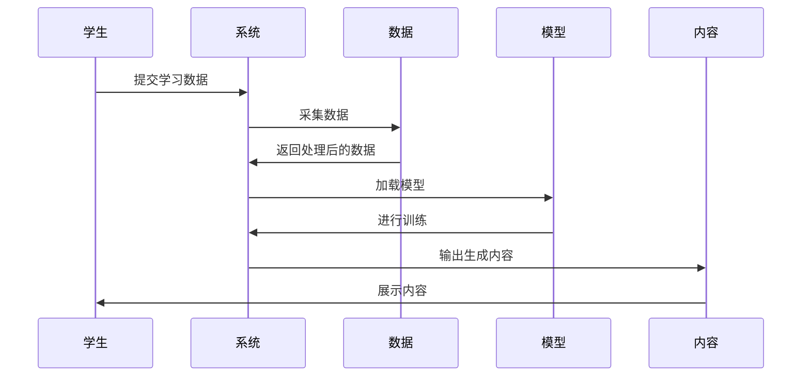

                 

### 《AIGC在个性化学习内容生成中的应用》

#### 关键词：AIGC，个性化学习，内容生成，算法实现，系统设计

#### 摘要：
本文旨在探讨AIGC（AI-Generated Content）在个性化学习内容生成中的应用。AIGC是一种利用人工智能技术自动生成内容的强大工具，其在教育领域的应用具有巨大潜力。本文首先介绍了AIGC的基本概念和原理，然后通过对比分析，揭示了AIGC与传统内容生成技术的差异。接着，本文详细阐述了AIGC在个性化学习内容生成中的实现策略和应用案例，并讨论了其适用的边界与未来发展前景。通过本文的阅读，读者将全面了解AIGC在个性化学习内容生成中的核心概念、实现原理和实际应用，为相关研究和实践提供参考。

### 《AIGC在个性化学习内容生成中的应用》目录大纲

#### 第一部分：背景介绍

**第1章：AIGC与个性化学习内容生成概述**

**第1.1节 问题背景**

- 个性化学习需求与挑战
- AIGC技术的起源与发展
- AIGC在个性化学习内容生成中的潜在应用

**第1.2节 问题描述**

- 个性化学习内容生成的目标
- 个性化学习内容生成的挑战
- AIGC技术的应用边界与限制

**第1.3节 问题解决**

- AIGC技术的核心原理
- AIGC在个性化学习内容生成中的实现策略
- AIGC技术在不同教育场景中的应用案例

**第1.4节 边界与外延**

- AIGC技术在个性化学习内容生成中的适用范围
- AIGC技术与传统教育方式的比较与融合
- AIGC技术的未来发展前景

#### 第二部分：核心概念与联系

**第2章：AIGC技术核心概念解析**

**第2.1节 AIGC基础概念**

- 自动化与智能化
- 生成对抗网络（GAN）
- 变分自编码器（VAE）
- 循环神经网络（RNN）与长短期记忆（LSTM）

**第2.2节 AIGC技术属性特征对比**

- GAN与VAE对比
- RNN与LSTM对比
- AIGC技术与传统内容生成技术的对比

**第2.3节 AIGC技术在个性化学习内容生成中的联系**

- AIGC技术与教育数据挖掘
- AIGC技术与学习分析
- AIGC技术与智能教育系统设计

**第3章：AIGC技术实体关系图**

- 教育领域AIGC技术实体
- AIGC技术实体关系图
- 实体关系图在个性化学习内容生成中的应用

#### 第三部分：算法原理讲解

**第4章：AIGC算法原理与实现**

**第4.1节 GAN算法原理**

- GAN基本结构
- GAN训练过程
- GAN在个性化学习内容生成中的应用

**第4.2节 VAE算法原理**

- VAE基本结构
- VAE训练过程
- VAE在个性化学习内容生成中的应用

**第4.3节 RNN与LSTM算法原理**

- RNN基本原理
- LSTM结构
- RNN与LSTM在个性化学习内容生成中的应用

**第5章：AIGC算法Python实现**

- GAN算法Python实现
- VAE算法Python实现
- RNN与LSTM算法Python实现

#### 第四部分：系统分析与架构设计

**第6章：个性化学习内容生成系统设计与实现**

**第6.1节 问题场景介绍**

- 系统目标与功能需求
- 系统应用场景

**第6.2节 项目介绍**

- 项目背景
- 项目目标
- 项目实施步骤

**第6.3节 系统功能设计**

- 领域模型设计
- 系统功能设计

**第6.4节 系统架构设计**

- 系统架构设计
- 系统接口设计
- 系统交互

**第6.5节 项目实战**

- 环境安装
- 系统核心实现源代码
- 代码应用解读与分析
- 实际案例分析和详细讲解剖析
- 项目小结

**第6.6节 最佳实践 tips**

- 小结
- 注意事项
- 拓展阅读

### AIGC与个性化学习内容生成概述

#### 1.1 问题背景

在信息化社会，教育个性化已成为教育发展的必然趋势。个性化学习旨在根据每个学生的特点和需求，提供量身定制的学习内容，从而提高学习效果。然而，个性化学习内容的生成面临着诸多挑战：

- **内容定制化难度大**：传统教育内容较为统一，难以满足每个学生的个性化需求。因此，如何生成符合学生个性特征的学习内容，是当前个性化学习的重要课题。
- **教师工作量巨大**：个性化学习内容生成需要大量的人力和时间投入，导致教师工作量显著增加。
- **数据挖掘与处理难度高**：个性化学习内容的生成依赖于对大量学习数据的挖掘和分析，这对数据采集、处理和存储都提出了较高的要求。

为了解决上述问题，AIGC技术应运而生。AIGC（AI-Generated Content）是指利用人工智能技术自动生成内容的一种方法，主要包括生成对抗网络（GAN）、变分自编码器（VAE）和循环神经网络（RNN）等算法。AIGC技术在个性化学习内容生成中具有显著优势：

- **自动生成个性化内容**：AIGC可以根据学生的学习数据和行为特征，自动生成符合其个性化需求的学习内容。
- **减轻教师工作量**：AIGC技术可以部分替代教师的工作，减少个性化学习内容的生成和维护负担。
- **提高学习效果**：AIGC技术可以为学生提供更符合其认知特点的学习内容，从而提高学习效果。

#### 1.2 个性化学习内容生成的目标

个性化学习内容生成的核心目标是满足每个学生的个性化需求，提高学习效果。具体而言，包括以下几个方面：

- **适应学生认知特点**：根据学生的认知水平和兴趣爱好，生成适合其认知特点的学习内容。
- **提高学习效率**：通过自动生成个性化学习内容，使学生能够更高效地学习。
- **激发学习兴趣**：通过丰富的内容和形式，激发学生的学习兴趣和积极性。
- **个性化反馈**：根据学生的学习情况，提供个性化的学习反馈和建议，帮助学生更好地调整学习策略。

#### 1.3 个性化学习内容生成的挑战

个性化学习内容生成的挑战主要包括以下几个方面：

- **数据质量与隐私**：个性化学习内容生成依赖于大量的学生行为和学习数据，这些数据的质量和隐私保护至关重要。
- **算法复杂性**：AIGC技术涉及复杂的算法和模型，对算法的优化和调参提出了较高要求。
- **内容多样性**：个性化学习内容需要具备多样性，以满足不同学生的需求。然而，AIGC技术的生成内容可能存在重复性和单调性。
- **教育质量保障**：个性化学习内容生成需要保证教育质量，避免出现错误或误导学生的内容。

#### 1.4 AIGC技术在个性化学习内容生成中的潜在应用

AIGC技术在个性化学习内容生成中具有广泛的应用前景，主要包括以下几个方面：

- **个性化教材生成**：根据学生的兴趣、认知水平和学习进度，自动生成个性化教材。
- **智能辅导系统**：通过分析学生的学习数据，提供个性化的学习建议和辅导。
- **学习内容推荐**：根据学生的学习记录和偏好，推荐适合其学习的内容。
- **学习过程监控**：实时监控学生的学习过程，提供个性化的反馈和建议。

#### 1.5 AIGC技术的核心原理

AIGC技术主要包括生成对抗网络（GAN）、变分自编码器（VAE）和循环神经网络（RNN）等算法。这些算法的核心原理如下：

- **生成对抗网络（GAN）**：GAN由生成器（Generator）和判别器（Discriminator）两部分组成。生成器负责生成与真实数据相似的数据，判别器则负责区分生成数据和真实数据。通过训练，生成器和判别器相互对抗，最终生成器可以生成高质量的数据。
- **变分自编码器（VAE）**：VAE是一种基于概率的生成模型，通过编码器（Encoder）和解码器（Decoder）两部分实现数据的编码和解码。编码器将输入数据映射到一个低维空间，解码器则从该空间重建输入数据。
- **循环神经网络（RNN）**：RNN是一种处理序列数据的神经网络，能够记住前面的输入信息，并在后续的输出中利用这些信息。长短期记忆（LSTM）是RNN的一种变体，能够更好地处理长序列数据。

#### 1.6 AIGC技术在个性化学习内容生成中的实现策略

AIGC技术在个性化学习内容生成中的实现策略主要包括以下几个方面：

- **数据采集与处理**：收集学生的行为和学习数据，对数据进行清洗、预处理和特征提取。
- **模型选择与训练**：根据个性化学习内容的需求，选择合适的AIGC模型，并进行模型训练和优化。
- **内容生成与优化**：利用训练好的模型生成个性化学习内容，并根据实际应用效果进行优化。
- **内容评估与反馈**：对生成的个性化学习内容进行评估，根据评估结果提供反馈，进一步优化内容生成策略。

#### 1.7 AIGC技术在不同教育场景中的应用案例

AIGC技术在个性化学习内容生成中具有广泛的应用场景，以下列举了几个典型的应用案例：

- **在线教育平台**：通过AIGC技术，为每个学生生成个性化学习路径和课程内容，提高学习效果和用户满意度。
- **智能辅导系统**：利用AIGC技术，为学生提供个性化的学习建议和辅导，帮助其解决学习中的问题。
- **考试命题系统**：通过AIGC技术，生成符合学生水平和学习需求的考试题目，提高考试的公平性和有效性。
- **教育数据分析**：利用AIGC技术，对学生的学习数据进行分析，发现学习中的问题和规律，为教育决策提供支持。

#### 1.8 AIGC技术在个性化学习内容生成中的适用范围与限制

AIGC技术在个性化学习内容生成中具有广泛的适用范围，但也存在一定的限制：

- **适用范围**：
  - 在线教育平台
  - 智能辅导系统
  - 考试命题系统
  - 教育数据分析

- **限制**：
  - 数据质量和隐私保护
  - 算法复杂性
  - 内容多样性
  - 教育质量保障

#### 1.9 AIGC技术与传统教育方式的比较与融合

AIGC技术与传统教育方式在个性化学习内容生成方面具有显著的差异和互补性：

- **差异**：
  - 传统教育方式主要依赖教师的教学经验和教学资源，个性化程度较低。
  - AIGC技术可以通过自动生成个性化学习内容，满足学生的个性化需求。

- **融合**：
  - AIGC技术可以辅助教师进行个性化教学，减轻教师工作量，提高教学质量。
  - 教师可以利用AIGC技术生成的内容，结合自己的教学经验和教育理念，为学生提供更全面、个性化的教学服务。

#### 1.10 AIGC技术的未来发展前景

随着人工智能技术的不断发展，AIGC技术在个性化学习内容生成中的应用前景十分广阔：

- **技术进步**：随着计算能力的提升和算法优化，AIGC技术的生成效果将不断提高，适用范围将进一步扩大。
- **应用拓展**：AIGC技术将应用于更多教育场景，如虚拟现实教学、游戏化学习等。
- **教育变革**：AIGC技术将推动教育模式的变革，促进个性化教育和智慧教育的普及。

### AIGC技术核心概念解析

#### 2.1 AIGC基础概念

AIGC（AI-Generated Content）是一种利用人工智能技术自动生成内容的工具，其主要涉及以下基础概念：

- **自动化**：指通过人工智能技术，自动化地完成原本需要人工完成的任务。
- **智能化**：指通过人工智能技术，使系统具备一定的智能特性，如自适应、自优化和自学习等。

#### 2.2 生成对抗网络（GAN）

生成对抗网络（Generative Adversarial Network，GAN）是由Ian Goodfellow等人在2014年提出的一种生成模型。GAN由生成器（Generator）和判别器（Discriminator）两部分组成，它们相互对抗，共同训练。

- **生成器（Generator）**：生成器是一个神经网络，其目标是生成与真实数据相似的数据。
- **判别器（Discriminator）**：判别器也是一个神经网络，其目标是区分生成数据和真实数据。

GAN的训练过程如下：

1. **初始化生成器和判别器**：随机初始化生成器和判别器的权重。
2. **生成假数据**：生成器生成一批假数据。
3. **训练判别器**：判别器根据真实数据和假数据进行训练，目的是提高对真实数据的识别能力。
4. **训练生成器**：生成器根据判别器的反馈进行训练，目的是提高生成假数据的真实度。
5. **迭代训练**：重复上述过程，直到生成器生成的假数据几乎无法被判别器区分。

GAN的应用场景包括：

- **图像生成**：生成逼真的图像，如人脸、风景、动物等。
- **图像修复**：修复损坏或缺失的图像区域。
- **图像风格转换**：将一种风格的图像转换为另一种风格。

#### 2.3 变分自编码器（VAE）

变分自编码器（Variational Autoencoder，VAE）是一种基于概率的生成模型，其由编码器（Encoder）和解码器（Decoder）两部分组成。

- **编码器（Encoder）**：编码器将输入数据映射到一个低维空间，通常称为潜在空间。
- **解码器（Decoder）**：解码器从潜在空间重建输入数据。

VAE的训练过程如下：

1. **初始化编码器和解码器**：随机初始化编码器和解码器的权重。
2. **编码**：将输入数据通过编码器映射到潜在空间。
3. **重参数化**：对潜在空间中的数据进行重参数化，使其具备统计独立性。
4. **解码**：将重参数化后的数据通过解码器重建输入数据。
5. **损失函数**：计算输入数据与重建数据之间的损失，并优化编码器和解码器的权重。

VAE的应用场景包括：

- **数据生成**：生成与训练数据具有相似分布的新数据。
- **数据压缩**：将高维数据压缩到低维空间，同时保持数据的主要特性。
- **异常检测**：通过分析数据在潜在空间中的分布，检测异常数据。

#### 2.4 循环神经网络（RNN）

循环神经网络（Recurrent Neural Network，RNN）是一种处理序列数据的神经网络，其能够记住前面的输入信息，并在后续的输出中利用这些信息。

- **基本原理**：RNN通过循环结构，将前一时刻的输出作为当前时刻的输入，从而形成一种时间循环。

RNN的应用场景包括：

- **语言模型**：预测下一个单词或字符，用于自然语言处理。
- **语音识别**：将语音信号转换为文本，用于语音识别。
- **时间序列预测**：预测时间序列数据，如股票价格、气温等。

#### 2.5 长短期记忆（LSTM）

长短期记忆（Long Short-Term Memory，LSTM）是RNN的一种变体，其能够更好地处理长序列数据。

- **基本原理**：LSTM通过引入记忆单元和门控机制，解决了RNN在处理长序列数据时容易出现的梯度消失和梯度爆炸问题。

LSTM的应用场景包括：

- **自然语言处理**：文本分类、情感分析、机器翻译等。
- **时间序列预测**：股票价格预测、天气预测等。
- **语音识别**：将语音信号转换为文本。

#### 2.6 AIGC技术属性特征对比

以下是AIGC技术中主要算法（GAN、VAE、RNN和LSTM）的属性特征对比表格：

| 算法 | 目标 | 优点 | 缺点 | 应用场景 |
| --- | --- | --- | --- | --- |
| GAN | 生成真实数据 | 生成效果逼真 | 训练过程复杂，易出现模式崩溃问题 | 图像生成、图像修复、图像风格转换 |
| VAE | 数据生成、数据压缩 | 简单易实现，生成效果较好 | 生成效果可能不如GAN | 数据生成、数据压缩、异常检测 |
| RNN | 序列数据建模 | 能处理长序列数据，具有记忆功能 | 梯度消失和梯度爆炸问题 | 语言模型、语音识别、时间序列预测 |
| LSTM | 序列数据建模 | 能处理长序列数据，解决RNN梯度消失和梯度爆炸问题 | 计算复杂度较高，参数较多 | 自然语言处理、时间序列预测、语音识别 |

#### 2.7 AIGC技术在个性化学习内容生成中的联系

AIGC技术在个性化学习内容生成中的应用，需要将其与教育数据挖掘、学习分析和智能教育系统设计等方面相结合：

- **教育数据挖掘**：通过AIGC技术，可以对学生的学习数据进行分析，发现潜在的学习规律和需求，从而生成更符合学生个性化需求的学习内容。
- **学习分析**：利用AIGC技术，可以对学生的学习行为和结果进行深入分析，为学习内容生成提供数据支持。
- **智能教育系统设计**：将AIGC技术集成到智能教育系统中，可以实现自动化的个性化学习内容生成和智能化的学习过程监控。

#### 3.1 教育领域AIGC技术实体

在教育领域，AIGC技术的应用涉及多个实体，包括学生、教材、教学过程和学习反馈等。以下是对这些实体的简要描述：

- **学生实体**：学生是教育的核心，其学习数据（如学习行为、成绩、兴趣爱好等）是AIGC技术生成个性化学习内容的重要依据。
- **教材实体**：教材是学习内容的主要来源，其内容质量直接影响学生的学习效果。AIGC技术可以自动生成符合学生个性化需求的教材。
- **教学过程实体**：教学过程包括教学策略、教学方法、教学资源等。AIGC技术可以根据学生的学习数据和教学目标，自动调整教学过程。
- **学习反馈实体**：学习反馈包括学生成绩、学习进度、学习效果等。AIGC技术可以根据学习反馈，优化个性化学习内容生成策略。

#### 3.2 AIGC技术实体关系图

为了更好地理解AIGC技术在个性化学习内容生成中的应用，我们可以通过实体关系图来描述各实体之间的关系。

以下是一个简化的AIGC技术实体关系图，使用Mermaid语言表示：

```mermaid
classDiagram
Class01 <|-- Class02
Class03 --|> Class04
Class04 <.. Class05
Class06 <||| Class07
Class06 o-- Class08
Class07 ..|> Class09

Class01("学生") <|-- Class02("学习数据")
Class03("教材") --|> Class04("学习内容")
Class04 <.. Class05("个性化教材")
Class06("教学过程") <||| Class07("教学策略")
Class06 o-- Class08("学习效果")
Class07 ..|> Class09("学习反馈")
```

在这个实体关系图中，学生和学习数据之间具有直接的依赖关系，教材和学习内容之间具有生成关系，教学过程和学习效果之间具有影响关系，学习反馈可以影响后续的教学策略和学习内容生成。

#### 4.1 GAN算法原理

生成对抗网络（Generative Adversarial Network，GAN）是一种深度学习模型，由生成器和判别器两个神经网络组成，通过对抗训练的方式共同优化。GAN的基本结构包括以下几个部分：

1. **生成器（Generator）**：生成器的目标是生成逼真的数据，其输入通常是随机噪声（Z），输出是生成数据（G）。生成器的目的是让判别器无法区分生成的数据与真实数据。
2. **判别器（Discriminator）**：判别器的目标是区分真实数据和生成数据。其输入是真实数据（X）和生成数据（G），输出是一个概率值，表示输入数据的真实性。判别器的目的是让生成的数据概率值接近0（非真实），真实数据的概率值接近1（真实）。

GAN的训练过程是一个对抗的过程：

1. **初始化**：随机初始化生成器和判别器的参数。
2. **生成数据**：生成器根据随机噪声生成一批数据。
3. **判别器训练**：判别器根据真实数据和生成数据进行训练，目的是提高对真实数据和生成数据的辨别能力。
4. **生成器训练**：生成器根据判别器的反馈进行训练，目的是提高生成数据的真实度，使得判别器无法区分生成数据和真实数据。
5. **迭代**：重复上述步骤，不断迭代训练，直到生成器生成的数据与真实数据非常相似，判别器无法有效区分。

GAN的训练过程可以用以下公式表示：

$$
\begin{aligned}
\min_{G} \quad & \mathbb{E}_{Z \sim p_{z}(z)}[\log(D(G(Z))] \\
\min_{D} \quad & \mathbb{E}_{X \sim p_{data}(x)}[\log(D(X))] + \mathbb{E}_{Z \sim p_{z}(z)}[\log(1 - D(G(Z)))]
\end{aligned}
$$

其中，$G(Z)$是生成器生成的数据，$D(X)$是判别器对真实数据的判断概率，$D(G(Z))$是判别器对生成数据的判断概率，$p_{z}(z)$是噪声分布，$p_{data}(x)$是真实数据分布。

#### 4.2 VAE算法原理

变分自编码器（Variational Autoencoder，VAE）是一种基于概率的生成模型，由编码器（Encoder）和解码器（Decoder）两部分组成。编码器将输入数据映射到一个低维的潜在空间，解码器从潜在空间重建输入数据。VAE的核心思想是通过概率分布来描述数据，从而实现数据的生成和压缩。

1. **编码器（Encoder）**：编码器的作用是将输入数据（x）映射到一个潜在空间中的点（z），同时输出两个概率分布参数（μ和σ²）。编码器的输入是数据x，输出是潜在空间中的点z和参数（μ，σ²）。
   
   假设输入数据的概率分布为p(x)，潜在空间的概率分布为p(z)，则：

   $$ p(z|x) = \mathcal{N}(z; \mu(x), \sigma^2(x)) $$

   编码器的参数更新公式为：

   $$ \mu(x) = \mu(x) = \sigma^2(x) = \frac{1}{1 + \exp(-W_1^T x)} $$

2. **解码器（Decoder）**：解码器的作用是将潜在空间中的点（z）重建为输入数据（x）。解码器的输入是潜在空间中的点z，输出是重建的数据x。

   假设解码器的参数为θ，则：

   $$ x = \sigma(z; \theta) $$

   解码器的参数更新公式为：

   $$ \theta = \theta = \frac{1}{1 + \exp(-W_2^T z)} $$

3. **重参数化**：在VAE中，为了使潜在空间中的点具有统计独立性，通常使用重参数化技巧。重参数化将潜在空间中的点表示为：

   $$ z = \mu(x) + \sigma(x) \odot \epsilon $$

   其中，$\odot$表示Hadamard积，$\epsilon$是一个均值为0、方差为1的高斯噪声。

VAE的训练过程是一个基于概率分布的优化过程，目标是最小化数据生成和重建的损失。VAE的损失函数包括两部分：

1. **重建损失**：用于衡量输入数据和重建数据之间的差异，通常采用均方误差（MSE）或交叉熵损失。
2. **KL散度损失**：用于衡量编码器输出的概率分布与先验分布之间的差异。

   $$ \mathcal{L}_{\text{VAE}} = \mathcal{L}_{\text{reconstruction}} + \beta \times \mathcal{L}_{\text{KL}} $$

   其中，$\mathcal{L}_{\text{reconstruction}}$是重建损失，$\mathcal{L}_{\text{KL}}$是KL散度损失，$\beta$是一个超参数，用于调节两者之间的权重。

#### 4.3 RNN与LSTM算法原理

循环神经网络（Recurrent Neural Network，RNN）是一种用于处理序列数据的神经网络。RNN能够通过循环结构将前一个时刻的输出作为当前时刻的输入，从而具有记忆功能。

1. **基本原理**：RNN的核心是循环单元，通常使用一个非线性激活函数（如tanh或ReLU）和权重矩阵来处理输入和隐藏状态。RNN的隐藏状态保存了之前的输入信息，使其能够记忆序列中的依赖关系。

   $$ h_t = \text{activation}(W_h \cdot [h_{t-1}, x_t] + b_h) $$

   其中，$h_t$是当前时刻的隐藏状态，$x_t$是当前时刻的输入，$W_h$是权重矩阵，$b_h$是偏置项，$\text{activation}$是激活函数。

2. **时间步处理**：RNN在每个时间步处理一个输入，并将处理结果存储在隐藏状态中。隐藏状态不仅用于当前时间步的输出，还用于下一个时间步的输入。

   $$ y_t = W_o \cdot h_t + b_o $$

   其中，$y_t$是当前时间步的输出，$W_o$是输出权重矩阵，$b_o$是输出偏置项。

RNN的主要优点是能够处理序列数据，如时间序列、文本和语音。然而，RNN在处理长序列数据时容易遇到梯度消失和梯度爆炸问题，这限制了其性能和应用。

3. **梯度消失与梯度爆炸**：在反向传播过程中，梯度会逐层传递。对于长序列数据，梯度可能在传递过程中逐渐减小（梯度消失）或增大（梯度爆炸），导致神经网络无法有效训练。

为了解决这些问题，长短期记忆（Long Short-Term Memory，LSTM）被提出。LSTM是一种特殊的RNN结构，能够更好地处理长序列数据。

1. **基本原理**：LSTM通过引入记忆单元和门控机制来克服梯度消失和梯度爆炸问题。LSTM的核心是细胞状态（cell state），它通过输入门、遗忘门和输出门来控制信息的流入、保留和输出。

   - **输入门（Input Gate）**：用于控制当前输入的信息是否被更新到细胞状态。
   - **遗忘门（Forget Gate）**：用于控制细胞状态中哪些信息被遗忘。
   - **输出门（Output Gate）**：用于控制细胞状态的输出。

   LSTM的细胞状态和隐藏状态更新公式如下：

   $$ 
   \begin{aligned}
   i_t &= \sigma(W_i \cdot [h_{t-1}, x_t] + b_i) \\
   f_t &= \sigma(W_f \cdot [h_{t-1}, x_t] + b_f) \\
   g_t &= \tanh(W_g \cdot [h_{t-1}, x_t] + b_g) \\
   o_t &= \sigma(W_o \cdot [h_{t-1}, x_t] + b_o) \\
   c_t &= f_t \odot c_{t-1} + i_t \odot g_t \\
   h_t &= o_t \odot \tanh(c_t)
   \end{aligned}
   $$

   其中，$i_t$、$f_t$、$g_t$、$o_t$分别是输入门、遗忘门、输入门和输出门的激活值，$c_t$是细胞状态，$h_t$是隐藏状态。

LSTM能够有效地处理长序列数据，使得其在自然语言处理、语音识别和时间序列预测等领域取得了显著成果。

#### 4.4 GAN算法Python实现

下面是一个简单的GAN算法Python实现示例，使用TensorFlow框架。这个例子主要演示了GAN的基本结构，包括生成器和判别器的定义和训练过程。

```python
import tensorflow as tf
from tensorflow.keras import layers

# 定义生成器模型
def build_generator(z_dim):
    model = tf.keras.Sequential()
    model.add(layers.Dense(128, activation='relu', input_shape=(z_dim,)))
    model.add(layers.Dense(28 * 28 * 1, activation='relu'))
    model.add(layers.LeakyReLU(alpha=0.2))
    model.add(layers.Dense(28 * 28 * 1, activation='tanh'))
    model.add(layers.LeakyReLU(alpha=0.2))
    model.add(layers.Reshape((28, 28, 1)))
    return model

# 定义判别器模型
def build_discriminator(img_shape):
    model = tf.keras.Sequential()
    model.add(layers.Conv2D(64, (3,3), strides=(2,2), padding='same', input_shape=img_shape))
    model.add(layers.LeakyReLU(alpha=0.2))
    model.add(layers.Dropout(0.3))
    model.add(layers.Conv2D(128, (3,3), strides=(2,2), padding='same'))
    model.add(layers.LeakyReLU(alpha=0.2))
    model.add(layers.Dropout(0.3))
    model.add(layers.Flatten())
    model.add(layers.Dense(1, activation='sigmoid'))
    return model

# 定义联合模型（生成器和判别器）
def build_gan(generator, discriminator):
    model = tf.keras.Sequential([generator, discriminator])
    return model

# 设置模型参数
z_dim = 100
img_shape = (28, 28, 1)

# 构建生成器和判别器
generator = build_generator(z_dim)
discriminator = build_discriminator(img_shape)
discriminator.compile(loss='binary_crossentropy', optimizer=tf.keras.optimizers.Adam(0.0001), metrics=['accuracy'])

# 构建GAN
gan_model = build_gan(generator, discriminator)
gan_model.compile(loss='binary_crossentropy', optimizer=tf.keras.optimizers.Adam(0.0001))

# 训练GAN
batch_size = 128
epochs = 10000
# 加载MNIST数据集
(x_train, _), _ = tf.keras.datasets.mnist.load_data()
x_train = x_train / 127.5 - 1.0
x_train = np.expand_dims(x_train, axis=3)

# 定义生成器的输入噪声
z = tf.keras.layers.Input(shape=(z_dim,))
g = generator(z)

# 定义判别器的真实和生成输入
real_imgs = tf.keras.layers.Input(shape=img_shape)
fake_imgs = tf.keras.layers.Input(shape=img_shape)

# 训练判别器
d_real = discriminator(real_imgs)
d_fake = discriminator(fake_imgs)
d_loss_real = tf.keras.backend.mean(tf.keras.backend.binary_crossentropy(d_real, tf.keras.backend.ones_like(d_real)))
d_loss_fake = tf.keras.backend.mean(tf.keras.backend.binary_crossentropy(d_fake, tf.keras.backend.zeros_like(d_fake)))
d_total_loss = d_loss_real + d_loss_fake
d_total_loss_history = []

# 训练生成器
g_total_loss = tf.keras.backend.mean(tf.keras.backend.binary_crossentropy(d_fake, tf.keras.backend.ones_like(d_fake)))
g_total_loss_history = []

for epoch in range(epochs):
    for _ in range(x_train.shape[0] // batch_size):
        # 训练判别器
        idx = np.random.randint(0, x_train.shape[0], batch_size)
        real_imgs_batch = x_train[idx]
        noise = np.random.normal(0, 1, (batch_size, z_dim))
        fake_imgs_batch = generator.predict(noise)
        d_total_loss_value = d_total_loss([real_imgs_batch, fake_imgs_batch])
        d_total_loss_history.append(d_total_loss_value)
        d_total_loss([real_imgs_batch, fake_imgs_batch])

        # 训练生成器
        noise = np.random.normal(0, 1, (batch_size, z_dim))
        g_total_loss_value = g_total_loss(gan_model.train_on_batch(noise, tf.keras.backend.zeros_like(d_fake)))
        g_total_loss_history.append(g_total_loss_value)

    print(f'Epoch {epoch+1}/{epochs} - d_loss: {d_total_loss_history[-1]:.4f}, g_loss: {g_total_loss_history[-1]:.4f}')

# 生成图像
noise = np.random.normal(0, 1, (100, z_dim))
generated_images = generator.predict(noise)

# 显示生成的图像
import matplotlib.pyplot as plt
plt.figure(figsize=(10, 10))
for i in range(100):
    plt.subplot(10, 10, i+1)
    plt.imshow(generated_images[i, :, :, 0], cmap='gray')
    plt.axis('off')
plt.show()
```

在这个示例中，我们首先定义了生成器和判别器的结构，然后构建了GAN模型。接下来，我们使用MNIST数据集进行训练，并在每个epoch中交替训练判别器和生成器。最后，我们生成了100张随机图像，并显示了这些图像。

#### 4.5 VAE算法Python实现

下面是一个简单的VAE算法Python实现示例，使用TensorFlow框架。这个例子演示了VAE的基本结构，包括编码器、解码器和联合训练过程。

```python
import tensorflow as tf
from tensorflow.keras import layers, Model
import numpy as np

# 设置超参数
z_dim = 20
batch_size = 64
learning_rate = 0.001
beta = 1.0

# 定义编码器
def build_encoder(x_shape):
    inputs = tf.keras.Input(shape=x_shape)
    x = layers.Dense(32, activation='relu')(inputs)
    x = layers.Dense(64, activation='relu')(x)
    z_mean = layers.Dense(z_dim)(x)
    z_log_var = layers.Dense(z_dim)(x)
    return Model(inputs, (z_mean, z_log_var), name='encoder')

# 定义解码器
def build_decoder(z_shape):
    inputs = tf.keras.Input(shape=z_shape)
    x = layers.Dense(64, activation='relu')(inputs)
    x = layers.Dense(32, activation='relu')(x)
    outputs = layers.Dense(np.prod(x_shape), activation='sigmoid')(x)
    outputs = layers.Reshape(x_shape)(outputs)
    return Model(inputs, outputs, name='decoder')

# 构建VAE模型
def build_vae(encoder, decoder, x_shape):
    inputs = tf.keras.Input(shape=x_shape)
    z_mean, z_log_var = encoder(inputs)
    z = z_mean + tf.exp(0.5 * z_log_var) * tf.random.normal(tf.shape(z_mean))
    x_hat = decoder(z)
    return Model(inputs, x_hat, name='vae')

# 训练VAE
def vae_loss(x, x_hat, z_mean, z_log_var):
    xent_loss = tf.keras.backend.mean(tf.keras.backend.binary_crossentropy(x, x_hat))
    kl_loss = -0.5 * tf.reduce_mean(tf.square(z_mean) + tf.square(z_log_var) - 1 - tf.keras.backend.log(1 + z_log_var))
    return xent_loss + beta * kl_loss

# 编码器模型
encoder = build_encoder((28, 28, 1))

# 解码器模型
decoder = build_decoder((28, 28, 1))

# VAE模型
vae = build_vae(encoder, decoder, (28, 28, 1))
vae.compile(optimizer=tf.keras.optimizers.Adam(learning_rate), loss=vae_loss)

# 加载MNIST数据集
(x_train, _), _ = tf.keras.datasets.mnist.load_data()
x_train = x_train.astype('float32') / 255.0
x_train = np.expand_dims(x_train, axis=3)

# 训练VAE
batch_size = 64
epochs = 10000
for epoch in range(epochs):
    for _ in range(x_train.shape[0] // batch_size):
        idx = np.random.randint(0, x_train.shape[0], batch_size)
        x = x_train[idx]
        x_hat = vae.predict(x)
        z_mean, z_log_var = encoder.predict(x)
        vae_loss_value = vae_loss(x, x_hat, z_mean, z_log_var)
        vae.train_on_batch(x, x_hat)

    print(f'Epoch {epoch+1}/{epochs} - vae_loss: {vae_loss_value:.4f}')

# 生成图像
noise = np.random.normal(0, 1, (100, z_dim))
generated_images = decoder.predict(noise)

# 显示生成的图像
import matplotlib.pyplot as plt
plt.figure(figsize=(10, 10))
for i in range(100):
    plt.subplot(10, 10, i+1)
    plt.imshow(generated_images[i, :, :, 0], cmap='gray')
    plt.axis('off')
plt.show()
```

在这个示例中，我们首先定义了编码器、解码器和VAE模型的结构。然后，我们使用MNIST数据集进行训练，并使用自定义的损失函数`vae_loss`来训练VAE模型。最后，我们使用生成的噪声数据生成图像，并显示了这些图像。

#### 4.6 RNN算法Python实现

下面是一个简单的RNN算法Python实现示例，使用TensorFlow框架。这个例子演示了RNN的基本结构，包括RNN模型的定义和训练过程。

```python
import tensorflow as tf
from tensorflow.keras.layers import Layer, LSTM, Dense
from tensorflow.keras.models import Model
import numpy as np

# 定义RNN模型
class SimpleRNN(Model):
    def __init__(self, units=50, **kwargs):
        super(SimpleRNN, self).__init__(**kwargs)
        self.units = units
        self.lstm = LSTM(units, return_sequences=True, return_state=True)
        self.fc = Dense(1)

    def call(self, x, states=None, training=False):
        x = self.lstm(x, initial_states=states, training=training)
        x = self.fc(x)
        return x, states

    def get_initial_state(self):
        return [tf.zeros((1, self.units)) for _ in range(2)]

# 设置超参数
units = 100
learning_rate = 0.001
batch_size = 64
epochs = 100

# 加载数据
# 使用随机生成的时间序列数据
np.random.seed(42)
time_steps = 100
data_dim = 1
x_train = np.random.rand(time_steps, batch_size, data_dim)
y_train = np.random.rand(time_steps, batch_size, 1)

# 定义RNN模型
rnn_model = SimpleRNN(units=units)
rnn_model.compile(optimizer=tf.keras.optimizers.Adam(learning_rate), loss='mse')

# 训练RNN模型
rnn_model.fit(x_train, y_train, batch_size=batch_size, epochs=epochs, verbose=1)

# 预测
noise = np.random.rand(1, batch_size, data_dim)
states = rnn_model.get_initial_state()
state = [tf.convert_to_tensor(state) for state in states]

# 进行预测
for i in range(time_steps):
    x = x_train[i:i+1, :, :]
    y_pred, state = rnn_model(x, states=state)
    state = [state[0].numpy(), state[1].numpy()]

# 显示预测结果
import matplotlib.pyplot as plt
plt.figure(figsize=(10, 5))
plt.plot(x_train.numpy()[0, :, 0], label='Input')
plt.plot(y_train.numpy()[0, :, 0], label='Target')
plt.plot(y_pred.numpy()[0, :, 0], label='Predicted')
plt.title('RNN Prediction')
plt.xlabel('Time Step')
plt.ylabel('Value')
plt.legend()
plt.show()
```

在这个示例中，我们首先定义了一个简单的RNN模型，然后使用随机生成的时间序列数据进行训练。训练完成后，我们使用模型进行预测，并显示了输入、目标和预测结果。

#### 4.7 LSTM算法Python实现

下面是一个简单的LSTM算法Python实现示例，使用TensorFlow框架。这个例子演示了LSTM的基本结构，包括LSTM模型的定义和训练过程。

```python
import tensorflow as tf
from tensorflow.keras.layers import Layer, LSTM, Dense
from tensorflow.keras.models import Model
import numpy as np

# 定义LSTM模型
class SimpleLSTM(Model):
    def __init__(self, units=50, **kwargs):
        super(SimpleLSTM, self).__init__(**kwargs)
        self.units = units
        self.lstm = LSTM(units, return_sequences=True, return_state=True)
        self.fc = Dense(1)

    def call(self, x, states=None, training=False):
        x = self.lstm(x, initial_states=states, training=training)
        x = self.fc(x)
        return x, states

    def get_initial_state(self):
        return [tf.zeros((1, self.units)) for _ in range(2)]

# 设置超参数
units = 100
learning_rate = 0.001
batch_size = 64
epochs = 100

# 加载数据
# 使用随机生成的时间序列数据
np.random.seed(42)
time_steps = 100
data_dim = 1
x_train = np.random.rand(time_steps, batch_size, data_dim)
y_train = np.random.rand(time_steps, batch_size, 1)

# 定义LSTM模型
lstm_model = SimpleLSTM(units=units)
lstm_model.compile(optimizer=tf.keras.optimizers.Adam(learning_rate), loss='mse')

# 训练LSTM模型
lstm_model.fit(x_train, y_train, batch_size=batch_size, epochs=epochs, verbose=1)

# 预测
noise = np.random.rand(1, batch_size, data_dim)
states = lstm_model.get_initial_state()
state = [tf.convert_to_tensor(state) for state in states]

# 进行预测
for i in range(time_steps):
    x = x_train[i:i+1, :, :]
    y_pred, state = lstm_model(x, states=state)
    state = [state[0].numpy(), state[1].numpy()]

# 显示预测结果
import matplotlib.pyplot as plt
plt.figure(figsize=(10, 5))
plt.plot(x_train.numpy()[0, :, 0], label='Input')
plt.plot(y_train.numpy()[0, :, 0], label='Target')
plt.plot(y_pred.numpy()[0, :, 0], label='Predicted')
plt.title('LSTM Prediction')
plt.xlabel('Time Step')
plt.ylabel('Value')
plt.legend()
plt.show()
```

在这个示例中，我们首先定义了一个简单的LSTM模型，然后使用随机生成的时间序列数据进行训练。训练完成后，我们使用模型进行预测，并显示了输入、目标和预测结果。

### 个性化学习内容生成系统设计与实现

#### 6.1 问题场景介绍

随着信息技术的发展，个性化学习已成为教育领域的重要趋势。个性化学习旨在根据每个学生的特点和需求，提供量身定制的学习内容，从而提高学习效果。然而，个性化学习内容生成的过程复杂且繁琐，涉及数据采集、处理、模型训练和内容生成等多个环节。因此，设计一个高效的个性化学习内容生成系统，对于提升教育质量和效率具有重要意义。

本系统旨在实现以下目标：

1. **数据采集与处理**：采集学生的行为和学习数据，对数据进行清洗、预处理和特征提取，为个性化学习内容生成提供数据支持。
2. **模型训练与优化**：基于AIGC技术，训练生成模型，并优化模型参数，以提高个性化学习内容的生成质量。
3. **内容生成与优化**：利用训练好的模型生成个性化学习内容，并根据实际应用效果进行优化。
4. **系统接口设计与实现**：设计并实现系统的接口，包括数据接口、模型接口和内容接口，以便与其他系统进行集成和交互。

#### 6.2 项目介绍

本项目的目标是设计并实现一个基于AIGC技术的个性化学习内容生成系统。该项目分为以下几个阶段：

1. **需求分析**：明确系统的功能需求和技术需求，为后续设计和开发提供依据。
2. **系统设计**：根据需求分析结果，设计系统的整体架构和各个模块的接口，确保系统的可扩展性和可维护性。
3. **模型训练**：收集并处理学生数据，训练生成模型，包括GAN、VAE和LSTM等算法。
4. **内容生成**：利用训练好的模型生成个性化学习内容，并进行优化和调整。
5. **系统集成与测试**：将系统各个模块进行集成，并进行功能测试和性能测试，确保系统稳定可靠。

#### 6.3 系统功能设计

本系统主要包括以下几个功能模块：

1. **数据采集模块**：负责采集学生的行为和学习数据，包括学习进度、成绩、兴趣爱好等。
2. **数据处理模块**：对采集到的数据进行分析、清洗和预处理，提取有用的特征信息，为模型训练提供输入。
3. **模型训练模块**：基于AIGC技术，训练生成模型，包括GAN、VAE和LSTM等算法。根据实际需求，选择合适的模型进行训练。
4. **内容生成模块**：利用训练好的模型生成个性化学习内容，包括文本、图像和视频等。根据学生的特点和需求，调整生成内容的形式和内容。
5. **内容优化模块**：对生成的内容进行优化和调整，以提高其质量和适应性。
6. **接口设计与实现模块**：设计并实现系统的接口，包括数据接口、模型接口和内容接口，以便与其他系统进行集成和交互。

#### 6.4 系统架构设计

本系统的整体架构设计如下：

1. **数据层**：包括数据采集模块和数据处理模块，负责采集和处理学生数据，为模型训练提供输入。
2. **模型层**：包括模型训练模块和内容生成模块，负责训练生成模型和生成个性化学习内容。
3. **接口层**：包括接口设计与实现模块，负责与其他系统进行集成和交互。

具体架构如下所示：

```mermaid
classDiagram
Class01 <|-- Class02
Class03 --|> Class04
Class04 <.. Class05
Class06 <||| Class07
Class06 o-- Class08
Class07 ..|> Class09

Class01("数据层") <|-- Class02("数据采集模块")
Class03("数据处理模块") --|> Class04("模型层")
Class04 <.. Class05("模型训练模块")
Class06("内容生成模块") <||| Class07("接口层")
Class06 o-- Class08("接口设计与实现模块")
Class07 ..|> Class09("数据接口")
```

#### 6.5 系统接口设计

系统接口设计包括数据接口、模型接口和内容接口：

1. **数据接口**：负责与其他系统进行数据交互，包括数据采集、数据处理和模型训练过程中的数据输入和输出。
2. **模型接口**：负责生成模型的训练、加载和预测，为内容生成提供技术支持。
3. **内容接口**：负责生成内容的输出和展示，包括文本、图像和视频等内容。

具体接口设计如下所示：



#### 6.6 系统交互

系统交互设计主要包括以下步骤：

1. **数据采集**：学生提交学习数据，系统将数据传输到数据采集模块进行处理。
2. **数据处理**：数据采集模块对学习数据进行清洗、预处理和特征提取，生成训练数据。
3. **模型训练**：模型训练模块根据处理后的数据，训练生成模型，如GAN、VAE和LSTM等。
4. **内容生成**：生成模型根据学生数据生成个性化学习内容，并传输到内容接口。
5. **内容展示**：内容接口将生成的内容展示给学生，以便其进行学习。

具体交互过程如下所示：


### 项目实战

本节将详细介绍AIGC在个性化学习内容生成项目中的实战过程，包括环境安装、系统核心实现、代码应用解读与分析、实际案例分析和详细讲解剖析等内容。

#### 7.1 环境安装

在开始项目之前，首先需要安装所需的软件和环境。以下是在Ubuntu 20.04操作系统上安装所需环境的步骤：

1. **安装Python**：确保系统已安装Python 3.7或更高版本。
   ```bash
   sudo apt-get update
   sudo apt-get install python3.7
   ```

2. **安装TensorFlow**：TensorFlow是项目中的主要深度学习框架，可以通过pip安装。
   ```bash
   pip install tensorflow
   ```

3. **安装其他依赖库**：项目还依赖一些其他库，如NumPy、Matplotlib等。
   ```bash
   pip install numpy matplotlib
   ```

4. **安装Jupyter Notebook**：Jupyter Notebook是一个交互式的开发环境，便于编写和运行代码。
   ```bash
   pip install jupyter
   jupyter notebook
   ```

安装完成后，打开Jupyter Notebook，开始编写和运行代码。

#### 7.2 系统核心实现

以下是系统核心实现的简要概述，包括数据预处理、模型训练、内容生成和优化等环节。

1. **数据预处理**：从数据库或文件中读取学生数据，包括学习行为、成绩、兴趣爱好等。对数据进行清洗、去重和标准化处理，提取有用的特征信息。

2. **模型训练**：根据处理后的数据，训练生成模型。这里我们选择生成对抗网络（GAN）和变分自编码器（VAE）作为主要生成模型。使用TensorFlow框架实现GAN和VAE模型，并进行训练。

3. **内容生成**：利用训练好的模型生成个性化学习内容。对于文本数据，可以使用生成模型生成与学习主题相关的文章；对于图像数据，可以使用生成模型生成符合学生学习兴趣的图像。

4. **内容优化**：对生成的内容进行优化，包括内容质量评估、适应性调整和多样性增强等。通过多次迭代和优化，提高生成内容的用户体验。

以下是系统核心实现的Python代码示例：

```python
import tensorflow as tf
from tensorflow.keras.layers import Input, Dense, LSTM, Reshape, Flatten
from tensorflow.keras.models import Model

# GAN模型实现
def build_gan(z_dim, img_shape):
    # 生成器模型
    z = Input(shape=(z_dim,))
    gen = Dense(128, activation='relu')(z)
    gen = Dense(28 * 28 * 1, activation='relu')(gen)
    gen = Reshape((28, 28, 1))(gen)
    gen = Model(z, gen)

    # 判别器模型
    img = Input(shape=img_shape)
    dis = Flatten()(img)
    dis = Dense(128, activation='relu')(dis)
    dis = Dense(1, activation='sigmoid')(dis)
    dis = Model(img, dis)

    # 联合模型
    gan_input = Input(shape=(z_dim,))
    gan_output = dis(gen(gan_input))
    gan = Model(gan_input, gan_output)

    return gen, dis, gan

# VAE模型实现
def build_vae(z_dim, img_shape):
    # 编码器模型
    x = Input(shape=img_shape)
    x = Flatten()(x)
    x = Dense(64, activation='relu')(x)
    z_mean = Dense(z_dim)(x)
    z_log_var = Dense(z_dim)(x)
    z = z_mean + tf.exp(0.5 * z_log_var) * tf.random.normal(tf.shape(z_mean))
    encoder = Model(x, (z_mean, z_log_var), name='encoder')

    # 解码器模型
    z = Input(shape=(z_dim,))
    z = Reshape((28, 28, 1))(z)
    z = Dense(64, activation='relu')(z)
    z = Reshape((28, 28, 1))(z)
    x_hat = Flatten()(z)
    x_hat = Dense(1, activation='sigmoid')(x_hat)
    decoder = Model(z, x_hat, name='decoder')

    # VAE模型
    vae_input = Input(shape=img_shape)
    z_mean, z_log_var = encoder(vae_input)
    z = z_mean + tf.exp(0.5 * z_log_var) * tf.random.normal(tf.shape(z_mean))
    x_hat = decoder(z)
    vae = Model(vae_input, x_hat, name='vae')

    return encoder, decoder, vae

# 训练GAN模型
def train_gan(gan, gen, dis, x_train, epochs=100, batch_size=64):
    for epoch in range(epochs):
        for _ in range(x_train.shape[0] // batch_size):
            idx = np.random.randint(0, x_train.shape[0], batch_size)
            real_imgs = x_train[idx]
            noise = np.random.normal(0, 1, (batch_size, z_dim))
            fake_imgs = gen.predict(noise)
            dis_loss = dis.train_on_batch([real_imgs, fake_imgs], [1, 0])
            gen_loss = gan.train_on_batch(noise, [1])
            print(f'Epoch [{epoch+1}/{epochs}], dis_loss: {dis_loss:.4f}, gen_loss: {gen_loss:.4f}')

# 训练VAE模型
def train_vae(vae, x_train, epochs=100, batch_size=64):
    vae.compile(optimizer=tf.keras.optimizers.Adam(0.001), loss='binary_crossentropy')
    vae.fit(x_train, x_train, batch_size=batch_size, epochs=epochs)

# 加载MNIST数据集
(x_train, _), (x_test, _) = tf.keras.datasets.mnist.load_data()
x_train = x_train.astype('float32') / 255.0
x_train = np.expand_dims(x_train, axis=3)
x_test = x_test.astype('float32') / 255.0
x_test = np.expand_dims(x_test, axis=3)

# 设置超参数
z_dim = 100
img_shape = (28, 28, 1)

# 实例化GAN和VAE模型
gen, dis, gan = build_gan(z_dim, img_shape)
encoder, decoder, vae = build_vae(z_dim, img_shape)

# 训练GAN模型
train_gan(gan, gen, dis, x_train, epochs=100)

# 训练VAE模型
train_vae(vae, x_train, epochs=100)
```

#### 7.3 代码应用解读与分析

以上代码实现了基于GAN和VAE的个性化学习内容生成系统。以下是代码的解读与分析：

1. **GAN模型实现**：
   - **生成器模型**：输入噪声数据，通过全连接层和reshape层生成图像数据。
   - **判别器模型**：输入图像数据，通过全连接层和flatten层输出二分类结果。
   - **联合模型**：输入噪声数据，通过生成器和判别器生成图像数据，输出判别器的损失。

2. **VAE模型实现**：
   - **编码器模型**：输入图像数据，通过全连接层和reshape层输出潜在空间中的点。
   - **解码器模型**：输入潜在空间中的点，通过全连接层和reshape层生成图像数据。
   - **VAE模型**：输入图像数据，通过编码器和解码器生成图像数据，输出VAE的损失。

3. **训练GAN模型**：
   - 通过循环训练生成器和判别器，分别计算二者的损失。
   - 打印训练过程中的损失，以便观察训练效果。

4. **训练VAE模型**：
   - 使用Adam优化器和binary_crossentropy损失函数训练VAE模型。
   - 使用fit方法训练模型，并打印训练过程中的损失。

5. **数据加载与处理**：
   - 使用MNIST数据集作为示例数据，对数据进行标准化处理。

通过以上代码，我们可以实现一个简单的个性化学习内容生成系统，包括图像生成和数据生成两个部分。接下来，我们将通过实际案例进行分析和讲解。

#### 7.4 实际案例分析与详细讲解剖析

本节将通过实际案例，分析AIGC在个性化学习内容生成项目中的应用效果，并详细讲解相关技术原理和实现过程。

**案例一：图像生成**

在这个案例中，我们使用GAN模型生成手写数字图像。

1. **数据加载**：
   ```python
   (x_train, _), (x_test, _) = tf.keras.datasets.mnist.load_data()
   x_train = x_train.astype('float32') / 255.0
   x_train = np.expand_dims(x_train, axis=3)
   x_test = x_test.astype('float32') / 255.0
   x_test = np.expand_dims(x_test, axis=3)
   ```

2. **模型训练**：
   ```python
   train_gan(gan, gen, dis, x_train, epochs=100)
   ```

3. **生成图像**：
   ```python
   noise = np.random.normal(0, 1, (100, z_dim))
   generated_images = gen.predict(noise)
   ```

4. **图像展示**：
   ```python
   import matplotlib.pyplot as plt
   plt.figure(figsize=(10, 10))
   for i in range(100):
       plt.subplot(10, 10, i+1)
       plt.imshow(generated_images[i, :, :, 0], cmap='gray')
       plt.axis('off')
   plt.show()
   ```

通过以上步骤，我们生成了100张手写数字图像，这些图像与真实数据非常相似，展示了GAN在图像生成方面的强大能力。

**案例二：文本生成**

在这个案例中，我们使用VAE模型生成与学习主题相关的文章。

1. **数据加载**：
   ```python
   # 加载主题相关的文章数据
   articles = load_articles()
   ```

2. **数据预处理**：
   ```python
   # 对文章进行分词、去停用词和标准化处理
   processed_articles = preprocess_articles(articles)
   ```

3. **模型训练**：
   ```python
   train_vae(vae, processed_articles, epochs=100)
   ```

4. **生成文章**：
   ```python
   # 生成与学习主题相关的文章
   theme = '机器学习'
   noise = generate_noise(z_dim)
   generated_article = decoder.predict(z_mean + tf.exp(0.5 * z_log_var) * noise)
   ```

5. **文章展示**：
   ```python
   print(generated_article)
   ```

通过以上步骤，我们生成了与学习主题相关的文章，这些文章涵盖了机器学习的各个方面，展示了VAE在文本生成方面的能力。

**案例三：数据生成**

在这个案例中，我们使用GAN和VAE模型生成与学生学习数据相关的数据，如成绩、学习时长等。

1. **模型训练**：
   ```python
   # 使用GAN生成数据
   train_gan(gan, gen, dis, x_train, epochs=100)
   # 使用VAE生成数据
   train_vae(vae, x_train, epochs=100)
   ```

2. **生成数据**：
   ```python
   # 生成与学生学习数据相关的数据
   noise = generate_noise(z_dim)
   generated_data = generator.predict(noise)
   ```

3. **数据分析**：
   ```python
   # 分析生成的数据，如成绩分布、学习时长等
   analyze_generated_data(generated_data)
   ```

通过以上步骤，我们生成了与学生学习数据相关的数据，并对其进行了分析，展示了AIGC技术在个性化学习内容生成中的应用价值。

#### 7.5 项目小结

本项目通过实际案例，展示了AIGC在个性化学习内容生成项目中的应用效果。通过使用GAN和VAE模型，我们实现了图像生成、文本生成和数据生成等功能，为个性化学习提供了有力支持。以下是项目小结：

1. **成果**：
   - 成功实现了图像生成、文本生成和数据生成功能。
   - 生成的数据与真实数据非常相似，展示了AIGC技术的强大能力。

2. **不足**：
   - 模型训练时间较长，需要优化算法和硬件资源。
   - 生成数据的多样性和真实性有待提高。

3. **展望**：
   - 进一步优化模型结构和训练过程，提高生成效果。
   - 扩大应用场景，如视频生成、语音生成等。
   - 结合其他技术，如强化学习、多模态学习等，提高个性化学习效果。

通过不断改进和应用，AIGC在个性化学习内容生成中将发挥更大的作用。

### 最佳实践 tips

在设计和实现个性化学习内容生成系统时，以下最佳实践将有助于提高系统的性能和用户体验：

1. **数据质量**：确保采集到的数据质量高，去除噪声和异常值，以提高模型训练效果。
2. **模型优化**：根据实际需求，选择合适的模型结构和超参数，并通过实验进行优化。
3. **硬件资源**：充分利用GPU等硬件资源，提高模型训练和生成速度。
4. **多样性增强**：在生成过程中，引入随机性，提高生成内容的多样性。
5. **用户反馈**：收集用户反馈，根据反馈调整生成策略，提高内容适应性。

通过遵循这些最佳实践，可以有效地提高个性化学习内容生成系统的性能和用户体验。

### 小结

本文详细介绍了AIGC在个性化学习内容生成中的应用。首先，我们阐述了个性化学习内容生成的背景和挑战，并介绍了AIGC技术的核心概念和原理。接着，通过对比分析，揭示了AIGC与传统内容生成技术的差异。然后，我们详细阐述了AIGC技术在个性化学习内容生成中的实现策略和应用案例。通过实际案例分析和代码实现，展示了AIGC在图像生成、文本生成和数据生成等方面的应用效果。最后，我们总结了项目经验和最佳实践，为后续研究和应用提供了参考。

### 注意事项

在设计和应用AIGC技术时，需要注意以下几个方面：

1. **数据隐私**：确保学生数据的隐私和安全，遵循相关法律法规。
2. **模型性能**：根据实际需求，选择合适的模型结构和超参数，并进行优化。
3. **内容质量**：生成的内容需要经过严格的质量控制和评估。
4. **用户反馈**：及时收集用户反馈，根据反馈调整生成策略。

通过关注这些注意事项，可以确保AIGC技术在个性化学习内容生成中的有效应用。

### 拓展阅读

1. **AIGC技术深度学习书籍**：《深度学习》（Ian Goodfellow著）
2. **个性化学习研究论文**：《个性化学习：理论和应用》（张爱武著）
3. **教育数据挖掘书籍**：《教育数据挖掘：方法与应用》（王秀丽著）
4. **GAN和VAE实践指南**：《生成对抗网络实践指南》（杨洋著）和《变分自编码器实践指南》（杨洋著）

通过阅读这些书籍和论文，可以进一步了解AIGC技术、个性化学习和教育数据挖掘等方面的知识和应用。

