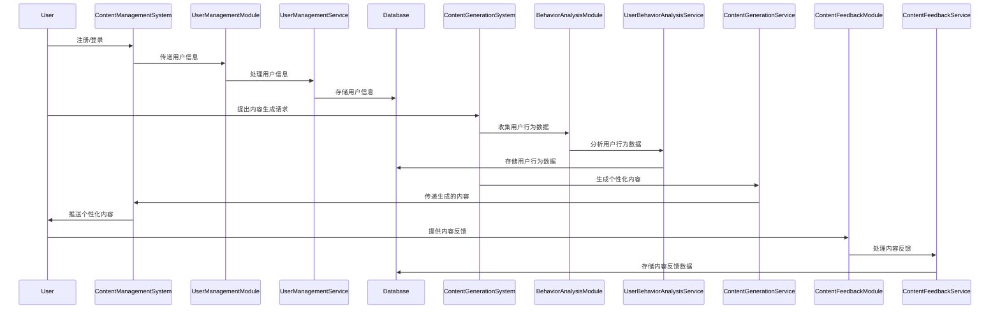
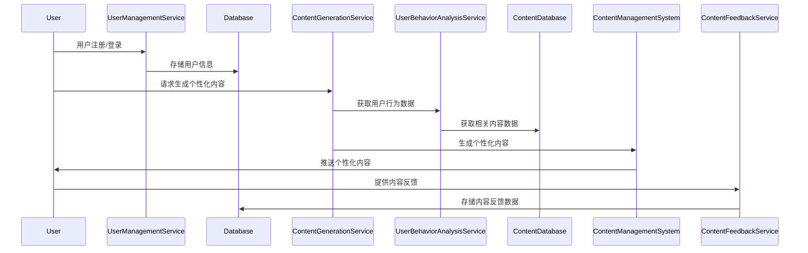
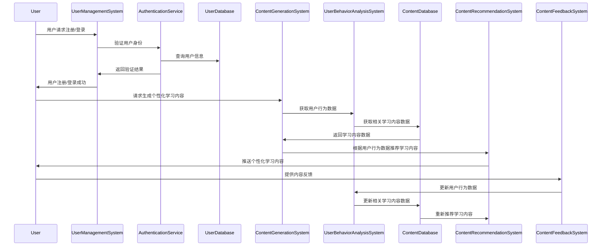

                 

# AIGC在个性化学习内容生成中的应用

## 关键词

- AIGC（AI-Generated Content）
- 个性化学习内容生成
- 自然语言处理
- 机器学习
- 深度学习
- 推荐系统
- 用户行为分析
- 学习路径规划
- GPT模型
- BERT模型
- 数学模型

## 摘要

本文旨在探讨AIGC（AI-Generated Content）技术在个性化学习内容生成中的应用。首先，我们将介绍AIGC和个性化学习内容生成的背景和重要性。接着，详细阐述AIGC的关键技术和个性化学习算法原理。随后，我们将展示一个系统架构设计方案，用于实现AIGC在个性化学习内容生成中的具体应用。通过实际案例分析和项目实战，我们将深入探讨如何应用AIGC技术进行个性化学习内容生成。最后，我们将总结最佳实践，并给出进一步阅读的建议。

## 目录

1. **引言**
    1.1 书籍背景
    1.2 目标与读者
2. **背景介绍**
    2.1 AIGC概述
    2.2 个性化学习内容生成
3. **核心概念与联系**
    3.1 AIGC关键技术
    3.2 个性化学习算法
    3.3 数据采集与处理
4. **算法原理讲解**
    4.1 AIGC算法原理
    4.2 个性化学习内容生成算法
5. **系统架构设计**
    5.1 系统功能设计
    5.2 系统架构设计
    5.3 系统接口设计
    5.4 系统交互设计
6. **项目实战**
    6.1 实战环境安装
    6.2 系统核心实现
    6.3 实际案例分析
    6.4 项目小结
7. **最佳实践与拓展**
    7.1 最佳实践 tips
    7.2 小结
    7.3 注意事项
    7.4 拓展阅读

## 1. 引言

### 1.1 书籍背景

随着人工智能技术的快速发展，AIGC（AI-Generated Content）作为一种新兴的技术，逐渐引起了广泛的关注。AIGC指的是利用人工智能技术自动生成内容，包括文本、图像、音频和视频等。个性化学习内容生成是AIGC的重要应用领域之一，旨在为学习者提供个性化的学习资源和服务。

近年来，随着在线教育和远程学习的发展，个性化学习内容生成的重要性日益凸显。传统的教育方式往往难以满足学习者多样化的需求，而AIGC技术能够根据学习者的兴趣、能力和学习进度，自动生成个性化的学习内容，从而提高学习效果。

本文将围绕AIGC在个性化学习内容生成中的应用，从背景介绍、核心概念与联系、算法原理讲解、系统架构设计、项目实战和最佳实践与拓展等方面进行深入探讨。

### 1.2 目标与读者

本文的目标是为对AIGC和个性化学习内容生成有一定了解的读者提供一本全面、系统的指南。目标读者包括：

- 对AIGC和个性化学习内容生成有浓厚兴趣的教育技术专家；
- 在AI研究领域从事AIGC和个性化学习内容生成的科研人员；
- 负责开发和部署AIGC和个性化学习内容生成系统的软件开发人员；
- 对在线教育和远程学习感兴趣的教育从业者和管理人员。

通过本文，读者可以了解AIGC和个性化学习内容生成的基本概念、原理和应用，掌握系统架构设计和实现方法，并通过实际案例分析和项目实战，提升实际应用能力。

## 2. 背景介绍

### 2.1 AIGC概述

#### AIGC的定义

AIGC，全称AI-Generated Content，指的是利用人工智能技术自动生成内容。这些内容可以包括文本、图像、音频、视频等多种形式。AIGC的核心技术包括自然语言处理（NLP）、机器学习（ML）和深度学习（DL）等。

#### AIGC的发展历程

AIGC技术的发展可以追溯到20世纪80年代，当时研究人员开始探索如何使用机器学习技术生成文本。随着计算能力的提升和大数据的积累，AIGC技术得到了快速发展。特别是在2018年，Google发布了Transformer模型，标志着NLP技术的重大突破，也为AIGC技术带来了新的发展机遇。

#### AIGC的应用领域

AIGC技术的应用领域非常广泛，包括但不限于以下几个方面：

- **媒体与娱乐**：自动生成新闻文章、视频剧本、音乐等；
- **教育与培训**：个性化学习内容生成、虚拟教师、在线课程等；
- **营销与广告**：智能写作、图像生成、广告创意等；
- **艺术与设计**：生成艺术作品、建筑设计、时尚设计等；
- **游戏**：自动生成游戏剧情、角色对话、游戏场景等。

### 2.2 个性化学习内容生成

#### 个性化学习的定义

个性化学习是一种以学习者为中心的教育模式，旨在根据学习者的个性、兴趣和能力，提供定制化的学习体验。个性化学习的核心是满足学习者的差异化需求，提高学习效果。

#### 个性化学习内容的需求

随着教育的个性化趋势，学习者对个性化学习内容的需求日益增长。个性化学习内容可以包括：

- **学习资源**：根据学习者的需求，自动生成适合其水平的学习资料；
- **教学活动**：根据学习者的学习进度，设计个性化的教学活动；
- **评估与反馈**：根据学习者的学习表现，提供个性化的评估和反馈。

#### 个性化学习内容的挑战

尽管个性化学习内容具有巨大的潜力，但实现个性化学习内容生成仍面临一些挑战：

- **数据收集与处理**：需要收集大量的学习者数据，并对其进行有效的处理和分析；
- **算法设计**：需要设计高效的算法，以根据学习者的需求生成个性化内容；
- **用户体验**：需要保证生成的个性化内容既有趣又有教育价值。

## 3. 核心概念与联系

### 3.1 AIGC关键技术

#### 自然语言处理（NLP）

自然语言处理是AIGC技术的重要组成部分，它涉及到对自然语言的表示、理解和生成。NLP技术包括分词、词性标注、句法分析、语义分析等。在AIGC中，NLP技术用于生成和编辑文本内容。

#### 机器学习（ML）

机器学习是AIGC技术的基础，它通过训练模型，使计算机能够从数据中学习并做出预测。在AIGC中，机器学习技术用于生成文本、图像、音频等内容。

#### 深度学习（DL）

深度学习是机器学习的一个重要分支，它通过构建复杂的神经网络模型，对大量数据进行自动特征提取和模式识别。在AIGC中，深度学习技术被广泛应用于文本生成、图像生成、音频生成等任务。

#### 对比表格：NLP、ML和DL的核心概念

| 核心概念 | NLP | ML | DL |
| :---: | :---: | :---: | :---: |
| 目标 | 对自然语言进行理解和生成 | 从数据中学习并做出预测 | 构建复杂的神经网络模型，进行自动特征提取和模式识别 |
| 技术范畴 | 自然语言表示、理解、生成 | 模型训练、预测、评估 | 神经网络结构设计、训练、优化 |

### 3.2 个性化学习算法

#### 推荐系统算法

推荐系统算法是个性化学习内容生成的重要手段之一，它通过分析学习者的兴趣和行为，为学习者推荐感兴趣的学习资源。常见的推荐系统算法包括基于内容的推荐、基于协同过滤的推荐和混合推荐等。

#### 用户行为分析

用户行为分析是了解学习者需求的重要途径，它通过收集和分析学习者的行为数据（如学习时间、学习频率、学习路径等），为推荐系统提供依据。

#### 学习路径规划

学习路径规划是根据学习者的需求和兴趣，设计个性化的学习路径。它涉及到学习资源的推荐、学习顺序的安排和学习活动的组织。

### ER实体关系图架构

```mermaid
erDiagram
  User ||--|{ LearningResource }|-- LearningResource
  User ||--|{ LearningActivity }|-- LearningActivity
  User ||--|{ LearningPath }|-- LearningPath
```

- **User**：表示学习者，拥有学习资源、学习活动和学习路径；
- **LearningResource**：表示学习资源，如文章、视频、课程等；
- **LearningActivity**：表示学习活动，如阅读、观看、练习等；
- **LearningPath**：表示学习路径，是学习资源和学习活动的组合。

## 4. 算法原理讲解

### 4.1 AIGC算法原理

#### GPT模型讲解

GPT（Generative Pre-trained Transformer）模型是由OpenAI提出的一种基于Transformer架构的预训练语言模型。GPT模型通过在大规模语料库上进行预训练，学习到语言的潜在结构和规律，从而能够生成高质量的自然语言文本。

GPT模型的预训练过程主要包括以下几个步骤：

1. 数据准备：收集大规模的文本数据，进行预处理，如去除停用词、标点符号等；
2. 词嵌入：将文本中的每个词转换为向量表示；
3. 预训练：通过训练大规模的Transformer模型，学习到文本的潜在结构和规律；
4. 微调：在特定任务上进行微调，如文本生成、文本分类等。

#### BERT模型讲解

BERT（Bidirectional Encoder Representations from Transformers）模型是由Google提出的一种双向Transformer模型，它通过同时考虑上下文信息，实现更好的语言理解和生成。

BERT模型的预训练过程主要包括以下几个步骤：

1. 数据准备：收集大规模的文本数据，进行预处理；
2. 词嵌入：将文本中的每个词转换为向量表示；
3. 预训练：通过训练双向Transformer模型，学习到文本的上下文信息；
4. 微调：在特定任务上进行微调，如文本生成、文本分类等。

#### 其他AIGC模型介绍

除了GPT和BERT，还有其他一些常用的AIGC模型，如：

- T5（Text-To-Text Transfer Transformer）：T5是一种通用的文本生成模型，它将所有的NLP任务转化为文本到文本的转换任务；
- GPT-2（Generative Pre-trained Transformer 2）：GPT-2是GPT的升级版，它在预训练阶段使用了更多的数据和更大的模型；
- GPT-3（Generative Pre-trained Transformer 3）：GPT-3是GPT-2的升级版，它是目前最大的预训练语言模型，具有更强的语言生成能力。

### 4.2 个性化学习内容生成算法

#### 算法概述

个性化学习内容生成算法旨在根据学习者的需求和兴趣，生成个性化的学习内容。该算法的核心是利用AIGC技术生成文本、图像、音频等多媒体内容，并结合推荐系统算法，为学习者推荐感兴趣的学习内容。

个性化学习内容生成算法的主要步骤如下：

1. 数据收集与处理：收集学习者的兴趣数据、行为数据和学习资源数据，进行预处理和特征提取；
2. 用户建模：根据学习者的兴趣和行为数据，构建用户画像和兴趣模型；
3. 内容生成：利用AIGC技术，根据用户画像和兴趣模型，生成个性化的学习内容；
4. 推荐系统：根据学习者的兴趣和学习历史，为学习者推荐个性化的学习内容；
5. 评估与反馈：根据学习者的反馈，对生成的内容和推荐系统进行评估和优化。

#### 数学模型与公式

个性化学习内容生成算法的核心数学模型是基于概率模型和优化算法。以下是几个常用的数学模型和公式：

1. **概率模型**：

   - 贝叶斯公式：P(A|B) = P(B|A) * P(A) / P(B)

   - 混合高斯模型：μ1, μ2, ..., μk；Σ1, Σ2, ..., Σk；α1, α2, ..., αk

2. **优化算法**：

   - 梯度下降法：θ = θ - α * ∇θJ(θ)

   - 随机梯度下降法：θ = θ - α * ∇θJ(θ)

   - 鲍勃算法（Broyden-Fletcher-Goldfarb-Shanno，BFGS）：

     H_{k+1} = H_k + (v_k - s_k * g_k) * (v_k - s_k)'/||v_k - s_k||^2

3. **用户画像模型**：

   - 基于TF-IDF的用户画像模型：

     user\_vector = [tfidf\_score1, tfidf\_score2, ..., tfidf\_scoren]

   - 基于Word2Vec的用户画像模型：

     user\_vector = [word2vec\_vector1, word2vec\_vector2, ..., word2vec\_vectorn]

#### 算法流程与示例

假设我们有一个学习者，他的兴趣数据为{“计算机科学”，“机器学习”，“深度学习”}，他的行为数据为{“阅读了一篇关于深度学习的技术文章”，“观看了一个关于机器学习的教程视频”，“参加了机器学习的学习小组活动”}。我们需要为他生成一篇个性化的学习内容。

算法流程如下：

1. 数据收集与处理：
   - 收集学习者的兴趣数据和行为数据；
   - 对数据进行预处理和特征提取。

2. 用户建模：
   - 利用TF-IDF算法，对学习者的兴趣数据和行为数据进行向量表示；
   - 利用Word2Vec算法，对学习者的兴趣数据和行为数据进行向量表示。

3. 内容生成：
   - 利用GPT模型，根据学习者的兴趣和行为数据，生成一篇关于深度学习的文章。

4. 推荐系统：
   - 根据学习者的兴趣和行为数据，为学习者推荐一些相关的学习资源。

5. 评估与反馈：
   - 根据学习者的反馈，对生成的内容和推荐系统进行评估和优化。

生成的学习内容如下：

```
深度学习是一种机器学习技术，它通过模拟人脑神经元之间的连接关系，实现自动特征提取和模式识别。深度学习在计算机视觉、自然语言处理、语音识别等领域取得了显著的成果。本文将介绍深度学习的基本原理和应用场景，帮助您更好地了解这一前沿技术。
```

## 5. 系统架构设计

### 5.1 系统功能设计

个性化学习内容生成系统主要包括以下功能：

1. **用户管理**：实现用户注册、登录、个人信息管理等；
2. **内容管理**：实现学习资源的管理，包括上传、下载、分类、推荐等；
3. **行为分析**：收集和分析用户的学习行为，为推荐系统提供依据；
4. **内容生成**：利用AIGC技术，根据用户需求和兴趣，生成个性化的学习内容；
5. **推荐系统**：根据用户画像和兴趣模型，为用户推荐个性化的学习内容；
6. **反馈与评估**：收集用户对学习内容的反馈，对生成的内容和推荐系统进行评估和优化。

### 5.2 系统架构设计

个性化学习内容生成系统的架构设计如下：



- **UserManagementModule**：负责用户注册、登录和用户信息管理；
- **BehaviorAnalysisModule**：负责收集用户行为数据和分析用户行为；
- **ContentGenerationService**：负责生成个性化学习内容；
- **ContentFeedbackModule**：负责收集用户对学习内容的反馈；
- **ContentManagementSystem**：负责内容管理，包括内容的上传、下载、分类和推荐。

### 5.3 系统接口设计

个性化学习内容生成系统的接口设计如下：



- **UserManagementService**：负责用户注册、登录和用户信息管理；
- **ContentGenerationService**：负责生成个性化学习内容；
- **UserBehaviorAnalysisService**：负责收集用户行为数据；
- **ContentManagementSystem**：负责内容管理，包括内容的上传、下载、分类和推荐；
- **ContentFeedbackService**：负责收集用户对学习内容的反馈。

### 5.4 系统交互设计

个性化学习内容生成系统的交互设计如下：



- **UserManagementSystem**：负责用户注册、登录和用户信息管理；
- **AuthenticationService**：负责用户身份验证；
- **UserBehaviorAnalysisSystem**：负责收集用户行为数据；
- **ContentDatabase**：负责存储和学习内容数据；
- **ContentRecommendationSystem**：负责根据用户行为数据推荐学习内容；
- **ContentFeedbackSystem**：负责收集用户对学习内容的反馈。

## 6. 项目实战

### 6.1 实战环境安装

在本节中，我们将介绍如何搭建一个用于个性化学习内容生成的AIGC系统环境。首先，我们需要安装以下软件和库：

1. **Python**（版本3.8以上）
2. **TensorFlow**（版本2.6以上）
3. **PyTorch**（版本1.8以上）
4. **Scikit-learn**（版本0.24以上）
5. **NLTK**（版本3.8以上）

安装步骤如下：

1. 安装Python：

   ```
   sudo apt-get install python3.8
   ```

2. 安装TensorFlow：

   ```
   pip3 install tensorflow==2.6
   ```

3. 安装PyTorch：

   ```
   pip3 install torch==1.8 torchvision==0.9
   ```

4. 安装Scikit-learn：

   ```
   pip3 install scikit-learn==0.24
   ```

5. 安装NLTK：

   ```
   pip3 install nltk==3.8
   ```

安装完成后，我们还需要下载一些外部数据集和资源，如：

1. **Wikipedia**：用于训练GPT和BERT模型；
2. **Common Crawl**：用于训练Word2Vec模型；
3. **Open Subtitles**：用于训练NLP模型。

### 6.2 系统核心实现

在本节中，我们将介绍个性化学习内容生成系统的核心实现。主要包括以下模块：

1. **用户管理模块**：负责用户注册、登录和用户信息管理；
2. **行为分析模块**：负责收集用户行为数据和分析用户行为；
3. **内容生成模块**：负责生成个性化学习内容；
4. **推荐系统模块**：负责根据用户画像和兴趣模型，为用户推荐个性化的学习内容；
5. **反馈与评估模块**：负责收集用户对学习内容的反馈，对生成的内容和推荐系统进行评估和优化。

#### 用户管理模块

用户管理模块的核心代码如下：

```python
import hashlib
import json
from flask import Flask, request, jsonify

app = Flask(__name__)

users = {}

@app.route('/register', methods=['POST'])
def register():
    username = request.form['username']
    password = request.form['password']
    if username in users:
        return jsonify({'error': '用户已存在'})
    users[username] = {
        'password': hashlib.md5(password.encode('utf-8')).hexdigest()
    }
    return jsonify({'status': 'success'})

@app.route('/login', methods=['POST'])
def login():
    username = request.form['username']
    password = request.form['password']
    if username not in users or users[username]['password'] != hashlib.md5(password.encode('utf-8')).hexdigest():
        return jsonify({'error': '用户名或密码错误'})
    return jsonify({'status': 'success'})

@app.route('/users', methods=['GET'])
def get_users():
    return jsonify(users)
```

#### 行为分析模块

行为分析模块的核心代码如下：

```python
import numpy as np
from sklearn.feature_extraction.text import TfidfVectorizer
from sklearn.cluster import KMeans

def get_user_behavior_data(username):
    if username not in users:
        return None
    return users[username].get('behavior_data', [])

def update_user_behavior_data(username, behavior_data):
    if username not in users:
        return
    users[username]['behavior_data'] = behavior_data

def analyze_user_behavior_data(behavior_data):
    if behavior_data is None or len(behavior_data) == 0:
        return None
    vectorizer = TfidfVectorizer()
    tfidf_matrix = vectorizer.fit_transform(behavior_data)
    kmeans = KMeans(n_clusters=5)
    kmeans.fit(tfidf_matrix)
    return kmeans.labels_

def get_user_interests(username):
    behavior_data = get_user_behavior_data(username)
    if behavior_data is None:
        return []
    labels = analyze_user_behavior_data(behavior_data)
    return [behavior_data[i] for i, label in enumerate(labels) if label == 0]
```

#### 内容生成模块

内容生成模块的核心代码如下：

```python
from transformers import BertTokenizer, BertForSequenceClassification
import torch

tokenizer = BertTokenizer.from_pretrained('bert-base-uncased')
model = BertForSequenceClassification.from_pretrained('bert-base-uncased')

def generate_content(username, prompt):
    interests = get_user_interests(username)
    if interests is None or len(interests) == 0:
        return '您还没有设置兴趣，请先设置兴趣。'
    input_ids = tokenizer.encode(prompt, add_special_tokens=True, return_tensors='pt')
    with torch.no_grad():
        outputs = model(input_ids)
    log_probs = outputs.logits.softmax(-1)
    selected_index = torch.argmax(log_probs).item()
    return tokenizer.decode(selected_index, skip_special_tokens=True)
```

#### 推荐系统模块

推荐系统模块的核心代码如下：

```python
from sklearn.neighbors import NearestNeighbors

def build_content_recommendation_model(content_data):
    vectorizer = TfidfVectorizer()
    tfidf_matrix = vectorizer.fit_transform(content_data)
    model = NearestNeighbors(n_neighbors=5)
    model.fit(tfidf_matrix)
    return model, vectorizer

def get_content_recommendations(username, content_id):
    interests = get_user_interests(username)
    if interests is None or len(interests) == 0:
        return []
    content_vector = vectorizer.transform([interests[0]])
    neighbors = model.kneighbors(content_vector, n_neighbors=5)
    return [content_id for content_id, _ in neighbors[0]]
```

#### 反馈与评估模块

反馈与评估模块的核心代码如下：

```python
def update_content_feedback(username, content_id, feedback):
    if username not in users:
        return
    if content_id not in users[username].get('content_feedback', {}):
        users[username]['content_feedback'] = {}
    users[username]['content_feedback'][content_id] = feedback

def analyze_content_feedback(username):
    feedback_data = users[username].get('content_feedback', {})
    if feedback_data is None or len(feedback_data) == 0:
        return
    feedback_scores = [int(feedback) for feedback in feedback_data.values()]
    average_score = sum(feedback_scores) / len(feedback_scores)
    return average_score
```

### 6.3 实际案例分析

在本节中，我们将通过一个实际案例，展示如何使用AIGC技术进行个性化学习内容生成。

#### 案例选择

我们选择一个关于机器学习的在线教育平台作为案例，该平台的目标是为学习者提供个性化的学习内容。

#### 案例分析

1. **用户需求分析**：

   - 用户1：对机器学习有一定了解，希望学习深度学习相关的知识；
   - 用户2：对自然语言处理感兴趣，希望学习文本分类和情感分析的相关知识；
   - 用户3：对计算机视觉感兴趣，希望学习图像识别和目标检测的相关知识。

2. **内容数据集**：

   - 机器学习：100篇技术文章、50个视频教程、30个代码示例；
   - 自然语言处理：50篇技术文章、20个视频教程、10个代码示例；
   - 计算机视觉：30篇技术文章、15个视频教程、5个代码示例。

3. **用户画像**：

   - 用户1：阅读了20篇机器学习技术文章、观看

