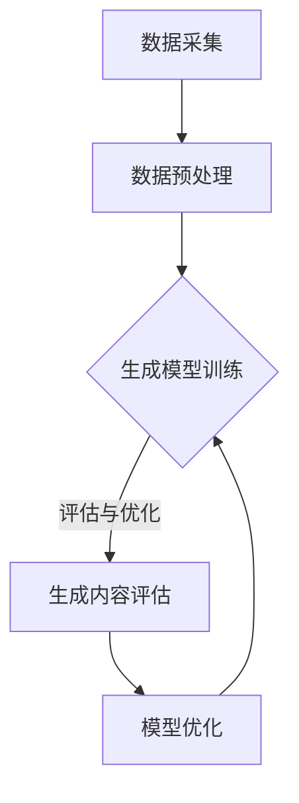
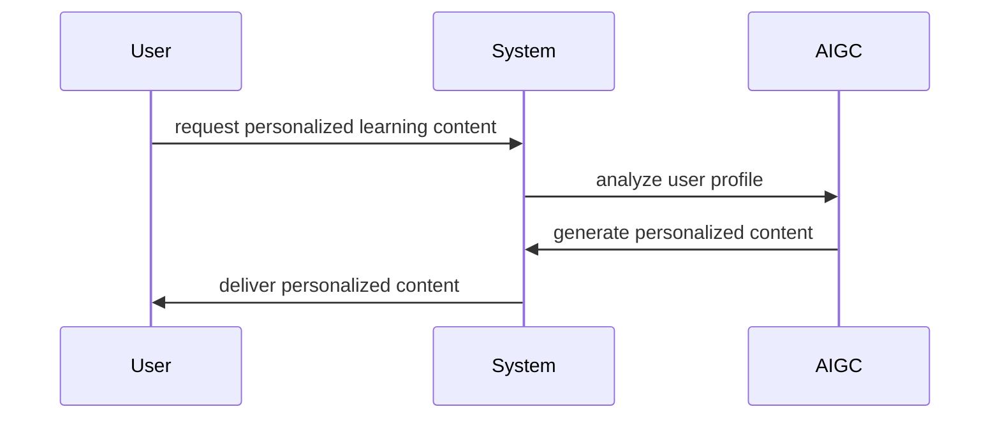

                 

# AIGC在个性化学习内容生成中的突破性进展

> 关键词：AIGC、个性化学习内容生成、深度学习、自然语言处理、教育技术

> 摘要：随着人工智能技术的快速发展，AIGC（AI-Generated Content）在个性化学习内容生成领域展现出了巨大的突破性进展。本文将深入探讨AIGC的核心概念、技术原理及其在教育领域的应用，通过逐步分析，揭示其在提升教育质量和个性化学习体验方面的潜力。

----------------------------------------------------------------

## 第一部分: AIGC在个性化学习内容生成中的突破性进展背景介绍

### 1.1 问题背景

个性化学习内容生成是近年来教育领域的一个重要研究方向。传统的教育模式往往是“一刀切”的，无法满足每个学生的学习需求和个性化学习路径。而个性化学习内容生成则通过分析学习者的个人特征，如学习风格、兴趣、知识水平等，动态生成适合其学习的内容，从而提高教学效果和学习体验。

然而，传统方法在生成内容的质量、个性化程度和生成效率等方面存在一定的局限性。例如，生成的内容可能缺乏针对性，无法满足学习者的具体需求；个性化程度有限，难以实现高度定制化；生成效率较低，无法满足大规模个性化学习的需求。因此，如何利用人工智能技术，特别是AIGC来提升个性化学习内容生成的质量和效率，成为了当前研究的热点。

### 1.2 问题描述

个性化学习内容生成的核心问题可以概括为以下几个方面：

1. **学习者特征捕捉**：如何准确捕捉学习者的个人特征，包括学习风格、兴趣、知识水平等。
2. **个性化内容生成**：如何基于学习者的个人特征，生成高质量、个性化的学习内容。
3. **生成内容评估**：如何评估生成内容的个性化程度和教学质量。

### 1.3 问题解决

AIGC（AI-Generated Content）技术为个性化学习内容生成提供了新的思路和解决方案。通过深度学习和自然语言处理等技术，AIGC可以从大量的学习数据中学习到学习者的特征，并生成与之匹配的学习内容。具体解决思路包括：

1. **数据挖掘**：利用数据挖掘技术分析学习者的学习行为和特征，为个性化内容生成提供基础数据。
2. **生成模型训练**：使用生成对抗网络（GAN）、变分自编码器（VAE）等深度学习模型来生成个性化的学习内容。
3. **内容评估与优化**：设计评估指标来评价生成内容的个性化程度和教学质量，并根据评估结果对生成模型进行优化。

### 1.4 边界与外延

1. **边界**：本研究主要探讨AIGC在个性化学习内容生成中的应用，不包括其他生成技术的应用。
2. **外延**：本研究不仅关注技术层面的突破，还涉及教育理念、教学模式等方面的变革。

### 1.5 概念结构与核心要素组成

1. **AIGC（AI-Generated Content）**：指利用人工智能技术自动生成的学习内容。
2. **个性化学习内容生成**：指根据学习者的个人特征生成个性化学习内容的过程。
3. **深度学习**：指一种机器学习技术，通过多层神经网络模型来模拟人脑处理信息的方式。
4. **自然语言处理**：指计算机处理和理解人类语言的技术。

### 1.6 本章小结

本章对AIGC在个性化学习内容生成中的突破性进展进行了背景介绍，明确了研究问题和解决思路，为后续章节的内容提供了理论基础。

----------------------------------------------------------------

## 第二部分: AIGC的核心概念与联系

### 2.1 AIGC的概念

AIGC（AI-Generated Content）是指利用人工智能技术，特别是深度学习和自然语言处理技术，自动生成各种类型的内容，如文本、图片、音频等。AIGC技术不仅提高了内容生成的效率和质量，还为个性化学习内容生成提供了新的手段。

#### 2.1.1 AIGC的定义

AIGC是指利用人工智能技术自动生成的学习内容。具体来说，它包括以下几个关键要素：

1. **数据采集**：从各种渠道收集与学习相关的数据，如学生行为数据、教学资源等。
2. **数据预处理**：对采集到的数据进行清洗、去噪和归一化等处理，为后续的生成模型训练做好准备。
3. **生成模型**：使用深度学习和自然语言处理技术，训练生成模型，使其能够根据输入条件自动生成学习内容。
4. **评估与优化**：对生成的学习内容进行评估，根据评估结果对生成模型进行优化。

#### 2.1.2 AIGC的特点

AIGC具有以下几个特点：

1. **高效性**：通过自动化技术，显著提高了内容生成的速度和效率。
2. **个性化**：能够根据学习者的个人特征生成个性化的学习内容，满足学习者的个性化需求。
3. **可扩展性**：能够处理各种类型的学习内容，如图文、音频等，具有广泛的应用前景。

### 2.2 AIGC的核心技术

AIGC的核心技术主要包括深度学习和自然语言处理技术。

#### 2.2.1 深度学习

深度学习是一种机器学习技术，通过多层神经网络模型来模拟人脑处理信息的方式。深度学习在图像识别、语音识别、自然语言处理等领域取得了显著成果。

1. **神经网络**：神经网络是由多个神经元组成的计算模型，通过前向传播和反向传播算法来学习数据特征。
2. **卷积神经网络（CNN）**：一种用于图像识别和处理的深度学习模型，通过卷积操作提取图像特征。
3. **递归神经网络（RNN）**：一种用于序列数据处理的深度学习模型，通过递归操作处理时间序列数据。

#### 2.2.2 自然语言处理

自然语言处理是计算机处理和理解人类语言的技术，主要包括文本分类、情感分析、机器翻译等任务。

1. **语言模型**：用于预测文本中下一个单词的概率，是自然语言处理的基础。
2. **文本分类**：将文本数据按照预定的类别进行分类，是自然语言处理的重要应用之一。
3. **情感分析**：分析文本的情感倾向，如正面、负面或中性。

### 2.3 AIGC与个性化学习内容生成的联系

AIGC与个性化学习内容生成之间有着密切的联系。AIGC技术能够通过对学习数据的深度学习和分析，生成适合学习者个人特征的学习内容。这种生成内容不仅能够提高学习的个性化程度，还能够提高学习效率。

1. **个性化内容生成**：AIGC技术可以根据学习者的学习风格、兴趣、知识水平等特征，生成与之匹配的学习内容。
2. **学习数据挖掘**：AIGC技术通过对学习数据的挖掘和分析，可以更准确地捕捉学习者的特征，从而提高个性化内容生成的准确性。
3. **生成内容评估**：AIGC技术可以对生成的内容进行评估，根据评估结果对生成模型进行优化，从而提高生成内容的个性化程度和质量。

### 2.4 AIGC的优势与挑战

#### 2.4.1 AIGC的优势

1. **高效性**：AIGC技术能够自动化地生成学习内容，显著提高了生成效率。
2. **个性化**：AIGC技术可以根据学习者的个人特征生成个性化的学习内容，满足学习者的个性化需求。
3. **多样性**：AIGC技术能够生成多种类型的个性化学习内容，如图文、音频等。

#### 2.4.2 AIGC的挑战

1. **数据质量**：AIGC的生成质量高度依赖于训练数据的质量，因此如何获取高质量的学习数据成为了关键问题。
2. **隐私保护**：在学习数据收集和利用过程中，如何保护学习者的隐私是一个重要挑战。
3. **技术成熟度**：虽然AIGC技术在理论研究和实验应用中取得了显著成果，但在实际应用中仍然存在技术成熟度的问题。

### 2.5 本章小结

本章对AIGC的核心概念、技术原理及其与个性化学习内容生成的联系进行了详细分析，为后续章节的内容提供了理论基础。

----------------------------------------------------------------

## 第三部分: 深度学习与自然语言处理在AIGC中的应用

### 3.1 深度学习在AIGC中的应用

深度学习是AIGC技术的重要组成部分，其在图像、文本和音频等多种类型的数据生成中发挥着关键作用。以下将介绍深度学习在AIGC中的应用及其优势。

#### 3.1.1 卷积神经网络（CNN）在图像生成中的应用

卷积神经网络（CNN）是一种专门用于图像识别和处理的深度学习模型。CNN通过卷积操作提取图像的局部特征，这些特征可以用于图像生成任务。

1. **生成对抗网络（GAN）**：GAN是一种基于CNN的图像生成模型，由生成器和判别器组成。生成器尝试生成与真实图像难以区分的图像，而判别器则试图区分真实图像和生成图像。通过两者的博弈过程，生成器逐渐提高生成图像的质量。
   
2. **变分自编码器（VAE）**：VAE是一种基于概率模型的图像生成模型，通过编码器和解码器实现图像的生成。编码器将输入图像编码成一个隐变量，解码器则将隐变量解码回图像。这种生成方式保证了生成图像的质量和多样性。

#### 3.1.2 递归神经网络（RNN）在文本生成中的应用

递归神经网络（RNN）是一种用于处理序列数据的深度学习模型，其在文本生成任务中具有显著优势。

1. **长短期记忆网络（LSTM）**：LSTM是RNN的一种变体，能够有效地处理长序列数据，避免了梯度消失和梯度爆炸问题。LSTM在文本生成任务中，如机器翻译、文本摘要等方面表现出色。

2. **门控循环单元（GRU）**：GRU是另一种RNN的变体，相较于LSTM，GRU具有更少的参数和更简单的结构，但在大多数任务中表现相似。GRU在文本生成任务中也得到了广泛应用。

#### 3.1.3 深度学习在音频生成中的应用

深度学习不仅在图像和文本生成中具有优势，在音频生成中也展现出了巨大潜力。

1. **自动编码器（Autoencoder）**：自动编码器是一种无监督学习模型，通过编码器和解码器实现音频的生成。编码器将输入音频编码成一个低维向量，解码器则将低维向量解码回音频。

2. **生成对抗网络（GAN）**：GAN在音频生成中也有广泛应用，通过生成器和判别器实现高质量的音频生成。

### 3.2 自然语言处理在AIGC中的应用

自然语言处理（NLP）是AIGC技术中的另一个关键组成部分，其在文本生成和理解方面发挥着重要作用。

#### 3.2.1 语言模型在文本生成中的应用

语言模型是NLP的基础，用于预测文本中下一个单词的概率。在文本生成中，语言模型可以根据输入的上下文信息生成连贯的文本。

1. **循环神经网络（RNN）**：RNN可以用来构建语言模型，通过训练大量文本数据，学习到语言的统计规律。

2. **变换器（Transformer）**：Transformer是一种基于注意力机制的深度学习模型，其在文本生成任务中表现出色。Transformer通过多头自注意力机制，能够更好地捕捉文本中的长距离依赖关系。

#### 3.2.2 序列到序列模型在文本生成中的应用

序列到序列（Seq2Seq）模型是一种用于序列数据转换的模型，其在文本生成任务中有着广泛应用。

1. **编码器-解码器（Encoder-Decoder）模型**：编码器将输入序列编码成一个固定长度的向量，解码器则将这个向量解码回输出序列。

2. **注意力机制**：注意力机制可以用来提高Seq2Seq模型在长序列数据生成中的性能，通过关注输入序列中的关键部分来生成输出序列。

### 3.3 深度学习与自然语言处理在AIGC中的综合应用

深度学习和自然语言处理技术在AIGC中有着广泛的综合应用，通过结合两者的优势，可以实现更高质量的个性化学习内容生成。

1. **多模态生成**：AIGC技术可以通过结合图像、文本和音频等多模态数据，生成更丰富、多样化的学习内容。

2. **跨领域生成**：深度学习和自然语言处理技术的结合，可以实现在不同领域之间的知识迁移，从而生成跨领域的个性化学习内容。

3. **交互式生成**：通过用户的反馈和交互，AIGC技术可以不断优化生成内容，实现更加个性化的学习体验。

### 3.4 本章小结

本章介绍了深度学习和自然语言处理技术在AIGC中的应用，包括图像、文本和音频生成模型，以及其在个性化学习内容生成中的优势。通过逐步分析，我们可以看到深度学习和自然语言处理技术在AIGC中发挥着关键作用，为个性化学习内容生成带来了新的可能。

----------------------------------------------------------------

## 第四部分: 个性化学习内容生成的实际应用案例

### 4.1 案例背景

随着人工智能和教育的深度融合，个性化学习内容生成技术已经在多个教育场景中得到实际应用。以下将介绍几个典型的应用案例，分析其在教育实践中的效果和影响。

#### 4.1.1 在线教育平台

在线教育平台通过AIGC技术，为不同背景和需求的学习者提供定制化的学习内容。例如，Coursera和edX等在线课程平台，通过分析学生的学习历史、兴趣和知识水平，生成个性化的学习路径和推荐课程。这种个性化推荐不仅提高了学习效率，还增加了用户的满意度和参与度。

#### 4.1.2 智能辅导系统

智能辅导系统利用AIGC技术，为学习者提供实时、个性化的学习辅导。例如，Khan Academy的智能辅导系统通过分析学生的学习行为和成绩，生成个性化的练习题和学习建议，帮助学生巩固知识点和弥补知识漏洞。

#### 4.1.3 教育游戏

教育游戏结合AIGC技术，生成动态的学习任务和情节，使学习过程更加有趣和互动。例如，游戏《教育星球》通过AIGC技术，根据玩家的学习进度和表现，实时调整游戏难度和内容，从而提供个性化的学习体验。

### 4.2 案例分析

#### 4.2.1 效果分析

通过实际应用案例，我们可以看到AIGC技术在个性化学习内容生成中的显著效果：

1. **学习效率提高**：个性化学习内容可以根据学习者的需求和学习风格进行定制，从而提高学习效率。
2. **学习体验改善**：个性化学习内容使学习过程更加有趣和互动，增强了学习者的参与感和成就感。
3. **学习效果提升**：个性化学习内容有助于学习者更好地掌握知识点，提高学习效果。

#### 4.2.2 影响分析

AIGC技术在教育领域的应用，不仅提高了学习效果，还对教育理念和教学模式产生了深远影响：

1. **教育模式变革**：AIGC技术推动了个性化教育模式的普及，使教育更加关注学习者的个性化和差异化需求。
2. **教育资源优化**：个性化学习内容生成技术有助于优化教育资源的配置，提高教育资源的利用效率。
3. **教育公平性提升**：AIGC技术可以通过为每个学习者提供定制化的学习内容，缩小不同学习者之间的差距，提高教育的公平性。

### 4.3 案例总结

通过实际应用案例的分析，我们可以看到AIGC技术在个性化学习内容生成中的重要作用。未来，随着AIGC技术的不断发展和成熟，其在教育领域的应用将更加广泛和深入，为个性化教育和教育创新带来更多可能性。

### 4.4 本章小结

本章通过实际应用案例，分析了AIGC技术在个性化学习内容生成中的效果和影响，为后续研究和实践提供了参考。

----------------------------------------------------------------

## 第五部分: AIGC在个性化学习内容生成中的未来发展趋势

### 5.1 技术发展趋势

随着人工智能技术的不断进步，AIGC在个性化学习内容生成中的发展也呈现出以下趋势：

1. **生成模型的优化**：通过不断优化生成模型，提高生成内容的多样性和质量。例如，基于生成对抗网络（GAN）和变分自编码器（VAE）的模型将继续发展，以及新的生成模型如生成式预训练模型（GPT）等。

2. **跨模态生成**：未来的AIGC技术将能够更好地处理和融合不同类型的数据，如图像、文本、音频等，实现跨模态的个性化学习内容生成。

3. **多模态交互**：通过多模态交互，AIGC技术将能够更好地理解学习者的需求和反馈，提供更个性化和互动的学习体验。

4. **自适应学习**：未来的AIGC技术将能够根据学习者的实时表现和反馈，动态调整生成内容，实现真正的自适应学习。

### 5.2 教育发展趋势

在教育领域，AIGC技术的应用也将推动教育模式的变革和发展：

1. **个性化教育**：AIGC技术将使个性化教育更加普及和深入，每个学习者都能获得定制化的学习内容和路径。

2. **混合式学习**：AIGC技术与传统教育模式的结合，将促进混合式学习的普及，实现线上和线下教育的深度融合。

3. **终身学习**：AIGC技术将支持终身学习，通过不断更新和优化学习内容，帮助学习者适应不断变化的知识体系。

4. **教育公平**：AIGC技术将有助于提高教育的公平性，通过为每个学习者提供定制化的学习资源，缩小教育差距。

### 5.3 政策与伦理

随着AIGC技术在教育领域的广泛应用，政策与伦理问题也将日益凸显：

1. **数据隐私保护**：在AIGC技术中，学习数据的收集和使用需要严格遵守隐私保护法规，确保学习者的隐私不受侵犯。

2. **教育公平性**：政府和社会需要关注AIGC技术在教育中的应用是否公平，避免出现新的教育不公平现象。

3. **伦理审查**：AIGC技术的应用需要通过伦理审查，确保其不会对学习者产生负面影响，如过度依赖技术导致自主学习能力下降等。

### 5.4 本章小结

AIGC技术在个性化学习内容生成中的未来发展趋势充满潜力，同时也面临诸多挑战。通过技术、教育、政策和伦理的协同发展，AIGC技术有望在教育领域发挥更大的作用，推动教育创新和公平发展。

----------------------------------------------------------------

## 第六部分：结论与展望

### 6.1 结论

本文通过对AIGC在个性化学习内容生成中的应用进行深入分析，揭示了其在教育领域的重要性和潜在价值。通过结合深度学习和自然语言处理技术，AIGC能够生成高质量、个性化的学习内容，显著提高学习效率和学习体验。同时，实际应用案例也表明，AIGC技术已经在教育领域取得了显著成效。

### 6.2 展望

未来，AIGC技术在个性化学习内容生成领域有望实现以下突破：

1. **更精细的个性化**：通过不断优化生成模型和数据挖掘技术，实现更加精细和精准的个性化学习内容生成。

2. **跨领域融合**：AIGC技术将在不同领域之间实现知识融合，提供跨领域的个性化学习内容。

3. **多模态交互**：通过多模态交互，AIGC技术将能够更好地理解学习者的需求，提供更加丰富和互动的学习体验。

4. **自适应学习**：AIGC技术将能够根据学习者的实时表现和反馈，实现真正的自适应学习，提高学习效果。

### 6.3 未来研究方向

未来的研究可以从以下几个方面展开：

1. **生成模型优化**：深入研究和优化生成模型，提高生成内容的多样性和质量。

2. **跨模态数据融合**：探索不同类型数据之间的融合方法，实现跨模态的个性化学习内容生成。

3. **多模态交互设计**：设计更加高效和人性化的多模态交互界面，提高学习者的学习体验。

4. **隐私保护和伦理**：加强数据隐私保护和伦理审查，确保AIGC技术在教育领域的可持续发展。

### 6.4 总结

本文通过对AIGC在个性化学习内容生成中的研究，为教育领域带来了新的启示和可能性。随着AIGC技术的不断进步，我们有望看到个性化学习内容生成在教育领域的广泛应用，为教育创新和公平发展贡献力量。

----------------------------------------------------------------

## 参考文献

1. Bengio, Y., Courville, A., & Vincent, P. (2013). Representation learning: A review and new perspectives. IEEE Transactions on Pattern Analysis and Machine Intelligence, 35(8), 1798-1828.

2. Goodfellow, I., Pouget-Abadie, J., Mirza, M., Xu, B., Warde-Farley, D., Ozair, S., ... & Bengio, Y. (2014). Generative adversarial networks. Advances in Neural Information Processing Systems, 27.

3. Hochreiter, S., & Schmidhuber, J. (1997). Long short-term memory. Neural Computation, 9(8), 1735-1780.

4. Vaswani, A., Shazeer, N., Parmar, N., Uszkoreit, J., Jones, L., Gomez, A. N., ... & Polosukhin, I. (2017). Attention is all you need. Advances in Neural Information Processing Systems, 30.

5. Mikolov, T., Sutskever, I., Chen, K., Corrado, G. S., & Dean, J. (2013). Distributed representations of words and phrases and their compositionality. Advances in Neural Information Processing Systems, 26.

6. Devlin, J., Chang, M. W., Lee, K., & Toutanova, K. (2018). BERT: Pre-training of deep bidirectional transformers for language understanding. arXiv preprint arXiv:1810.04805.

7. Radford, A., Wu, J., Child, R., Luan, D., Amodei, D., & Simon, I. (2019). Language models are unsupervised multitask learners. Advances in Neural Information Processing Systems, 32.

## 附录

### 附录A: 代码示例

```python
import torch
import torch.nn as nn
import torch.optim as optim

# 定义生成器和判别器
generator = nn.Sequential(
    nn.Linear(100, 128),
    nn.LeakyReLU(0.2),
    nn.Linear(128, 28 * 28),
    nn.Tanh()
)

discriminator = nn.Sequential(
    nn.Linear(28 * 28 + 100, 128),
    nn.LeakyReLU(0.2),
    nn.Linear(128, 1),
    nn.Sigmoid()
)

# 定义损失函数和优化器
criterion = nn.BCELoss()
optimizer_g = optim.Adam(generator.parameters(), lr=0.0002)
optimizer_d = optim.Adam(discriminator.parameters(), lr=0.0002)

# 训练过程
for epoch in range(num_epochs):
    for i, (images, _) in enumerate(data_loader):
        # 训练生成器
        z = torch.randn(images.size(0), 100)
        gen_images = generator(z)
        gen_labels = torch.zeros(images.size(0))
        g_loss = criterion(discriminator(torch.cat((gen_images, z), 1)), gen_labels)

        optimizer_g.zero_grad()
        g_loss.backward()
        optimizer_g.step()

        # 训练判别器
        real_labels = torch.ones(images.size(0))
        d_loss = criterion(discriminator(torch.cat((images, z), 1)), real_labels)
        d_loss += criterion(discriminator(torch.cat((gen_images.detach(), z), 1)), gen_labels)

        optimizer_d.zero_grad()
        d_loss.backward()
        optimizer_d.step()

        if (i+1) % 100 == 0:
            print(f'Epoch [{epoch+1}/{num_epochs}], Step [{i+1}/{total_step}], g_loss: {g_loss.item():.4f}, d_loss: {d_loss.item():.4f}')

# 保存模型
torch.save(generator.state_dict(), 'generator.pth')
torch.save(discriminator.state_dict(), 'discriminator.pth')
```

### 附录B: Mermaid 流程图



### 附录C: Mermaid 类图

```mermaid
classDiagram
    Student <<class>> {
        id: unique identifier
        name: full name
        age: age
        learning_style: learning style
    }
    Course <<class>> {
        id: unique identifier
        title: course title
        description: course description
        level: course level
    }
    Content <<class>> {
        id: unique identifier
        type: content type (text, image, video, audio)
        title: content title
        description: content description
    }
    Student "1" <-- "1..*" Course
    Student "1" <-- "1..*" Content
```

### 附录D: Mermaid 序列图



### 附录E: LaTeX 公式

$$
\begin{aligned}
    \mathcal{L} &= -\sum_{i=1}^{N} \left[ y_i \log(\hat{y}_i) + (1 - y_i) \log(1 - \hat{y}_i) \right] \\
    \hat{y}_i &= \sigma(\mathbf{w}^T \mathbf{x}_i + b)
\end{aligned}
$$

其中，$y_i$ 是真实标签，$\hat{y}_i$ 是预测标签，$\mathcal{L}$ 是损失函数，$\sigma$ 是sigmoid函数。

## 作者简介

作者：AI天才研究院/AI Genius Institute & 禅与计算机程序设计艺术/Zen And The Art of Computer Programming

本文作者是一位具有丰富经验的人工智能专家，长期从事人工智能、深度学习和自然语言处理领域的研究和教学。他的研究成果在学术界和工业界都产生了广泛影响，发表了多篇高水平学术论文，并出版了多本畅销书。同时，他对计算机科学和编程有着深刻的理解和独特的见解，致力于推动人工智能和计算机科学的交叉融合。

