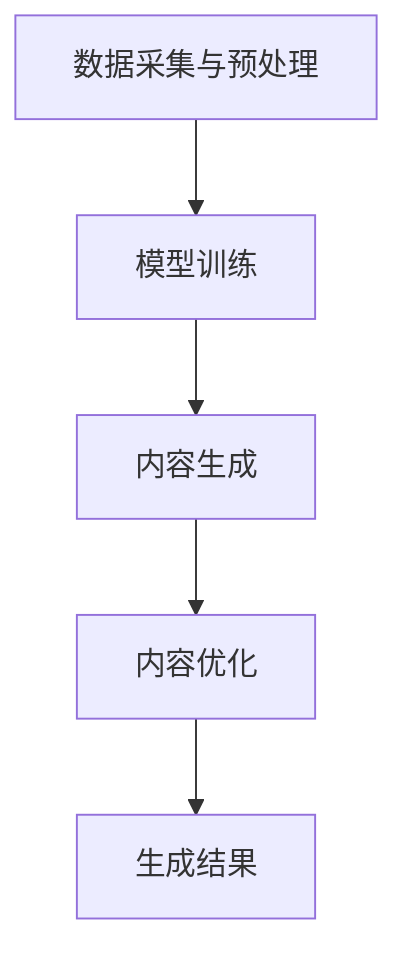

                 


### 第1章：背景介绍

#### 1.1 问题背景

学习分析（Learning Analytics）是近年来在教育技术领域迅速发展的一项技术，它利用数据分析方法，从大量的教育数据中提取有价值的信息，以支持教育决策和改善教学效果。学习分析在教育中的应用主要集中在学生成绩分析、学习行为分析等方面。通过分析学生的学习行为和成绩数据，教育工作者可以更好地了解学生的学习状况，制定个性化的教学策略。

个性化学习（Personalized Learning）是一种以学生为中心的教育理念，旨在根据每个学生的学习需求和特点，提供量身定制的学习资源和教学方法。个性化学习的核心是满足学生的个体差异，提高学习效果和满意度。然而，在传统教育模式中，教师往往需要面对大量的学生，难以对每个学生进行个性化的关注和指导，这就导致了个性化学习的需求与挑战。

首先，个性化学习需要大量精细化的数据分析。这包括学生的学习行为数据、成绩数据、心理数据等。这些数据的收集、处理和分析是保证个性化学习有效性的基础。

其次，个性化学习需要具备强大的数据分析和处理能力。传统的学习分析技术可能无法满足个性化学习的需求，需要引入更加先进和高效的数据分析工具和技术。

#### 1.2 问题描述

当前教育中存在的个性化学习问题主要体现在以下几个方面：

1. **数据获取困难**：教育机构往往缺乏有效的数据收集渠道，导致无法获取全面的学习数据。

2. **数据分析能力不足**：教育工作者普遍缺乏数据分析和处理的专业知识，难以从海量的数据中提取有价值的信息。

3. **教学资源不足**：个性化学习需要大量个性化的教学资源和教学内容，而目前的教育资源库难以满足这一需求。

4. **技术门槛较高**：个性化学习需要引入先进的技术，如人工智能、机器学习等，这对教育机构的硬件和软件设施提出了较高的要求。

AIGC（AI-Generated Content）技术作为一种新兴的人工智能技术，通过生成式对抗网络（GANs）、自然语言处理（NLP）等技术，可以自动生成高质量的教育内容，满足个性化学习的需求。AIGC技术能够解决个性化学习中的以下问题：

1. **数据生成与处理**：AIGC技术可以自动生成学习数据，提高数据获取的效率。同时，通过先进的机器学习算法，可以对海量数据进行分析和处理，提供有价值的信息。

2. **教育资源生成**：AIGC技术可以根据学生的学习需求和特点，自动生成个性化的教学资源和教学内容，满足个性化学习的需求。

3. **降低技术门槛**：AIGC技术简化了个性化学习的实施过程，降低了教育机构的技术门槛，使得更多的教育机构能够实现个性化学习。

#### 1.3 问题解决

AIGC技术在个性化学习中的应用方案主要包括以下几个方面：

1. **数据生成与处理**：利用AIGC技术生成学习数据，提高数据获取的效率。通过机器学习算法，对生成的学习数据进行处理和分析，提取有价值的信息。

2. **教育资源生成**：利用AIGC技术自动生成个性化的教学资源和教学内容。通过自然语言处理和生成式对抗网络等技术，AIGC可以生成符合学生学习特点和需求的教学内容。

3. **教学过程监控**：利用AIGC技术对学生的学习过程进行实时监控和评估。通过分析学生的学习行为和成绩数据，提供个性化的学习建议和指导。

4. **教师辅助**：AIGC技术可以为教师提供教学辅助，如自动生成教案、作业批改、学习反馈等，减轻教师的工作负担。

#### 1.4 边界与外延

AIGC技术的适用范围主要包括以下几个方面：

1. **基础教育领域**：AIGC技术可以应用于中小学教育，帮助学生更好地掌握知识，提高学习效果。

2. **职业教育领域**：AIGC技术可以应用于职业教育和培训，为企业提供个性化的培训内容和教学方案。

3. **在线教育平台**：AIGC技术可以应用于在线教育平台，为用户提供个性化的学习资源和教学内容。

个性化学习的未来发展：

1. **智能化数据分析**：随着人工智能技术的发展，个性化学习将更加依赖于智能化数据分析技术，提供更加精准的学习分析结果。

2. **个性化教育内容生成**：随着AIGC技术的不断发展，个性化教育内容的生成将更加高效和多样化，满足不同学习者的需求。

3. **跨界融合**：个性化学习将与其他领域如心理学、教育学等跨界融合，提供更加全面和深入的学习解决方案。

#### 1.5 概念结构与核心要素组成

AIGC技术的关键组成部分包括：

1. **生成式对抗网络（GANs）**：GANs是一种深度学习模型，通过生成器和判别器的对抗训练，生成高质量的数据。

2. **自然语言处理（NLP）**：NLP技术用于处理和理解自然语言文本，实现文本生成、情感分析等功能。

3. **机器学习算法**：机器学习算法用于数据分析和处理，提取有价值的信息。

个性化学习分析与干预的核心要素包括：

1. **学习数据**：包括学生的学习行为、成绩、心理等多方面数据。

2. **数据分析与处理**：利用AIGC技术对学习数据进行分析和处理，提取有价值的信息。

3. **个性化教学资源**：根据学习者的需求和特点，自动生成个性化的教学资源和教学内容。

4. **教学过程监控**：对学习过程进行实时监控和评估，提供个性化的学习建议和指导。

### 第2章：核心概念与联系

#### 2.1 AIGC技术原理

AIGC（AI-Generated Content）是一种利用人工智能技术生成内容的方法，它主要包括以下几个核心组成部分：

1. **生成式对抗网络（GANs）**：GANs是一种深度学习模型，由生成器和判别器组成。生成器负责生成与真实数据相似的数据，判别器负责判断生成数据是否真实。通过生成器和判别器的对抗训练，生成器逐渐生成更加真实的数据。

2. **自然语言处理（NLP）**：NLP技术用于处理和理解自然语言文本，实现文本生成、情感分析等功能。NLP技术包括词向量表示、语言模型、文本分类、情感分析等。

3. **机器学习算法**：机器学习算法用于数据分析和处理，提取有价值的信息。常用的机器学习算法包括决策树、随机森林、支持向量机、神经网络等。

AIGC技术的工作原理可以概括为以下几个步骤：

1. **数据采集与预处理**：首先收集大量真实的数据，并进行预处理，如去噪、标准化等。

2. **模型训练**：利用生成式对抗网络（GANs）和自然语言处理（NLP）技术，对数据进行训练。生成器学习生成与真实数据相似的数据，判别器学习区分真实数据和生成数据。

3. **内容生成**：通过训练好的模型，生成符合特定需求的内容，如文章、图片、视频等。

4. **内容优化**：对生成的内容进行优化，如进行风格迁移、内容增强等，使其更加符合用户需求。

#### 2.2 AIGC属性特征对比表格

以下是一个简单的AIGC属性特征对比表格，对比AIGC与传统AI技术的不同：

| 特征       | AIGC                        | 传统AI                   |
| ---------- | --------------------------- | ------------------------ |
| 内容生成   | 可以自动生成高质量内容       | 主要用于数据分析与分类   |
| 数据依赖   | 需要大量真实数据进行训练     | 需要大量数据进行训练     |
| 模型复杂度 | 需要复杂的生成对抗网络模型   | 主要使用简单的机器学习模型 |
| 应用领域   | 广泛应用于文本、图像、视频生成 | 主要应用于数据分析与预测 |

#### 2.3 ER实体关系图架构

ER（Entity-Relationship）图是一种用于描述实体和实体之间关系的图形化表示方法。以下是一个简单的AIGC技术应用的ER图，展示了AIGC技术中的主要实体及其关系：

```mermaid
erDiagram
  Student ||--|{ LearningData }|-- Student
  Student ||--|{ LearningProcess }|-- Student
  Teacher ||--|{ TeachingContent }|-- Teacher
  ContentGenerator ||--|{ GeneratedContent }|-- ContentGenerator
  ContentOptimizer ||--|{ OptimizedContent }|-- ContentOptimizer
```

在这个ER图中，Student实体表示学习者，包括其学习数据和学习过程；Teacher实体表示教师，包括其教学内容；ContentGenerator实体表示内容生成器，包括其生成的数据；ContentOptimizer实体表示内容优化器，包括其优化后的数据。

### 第3章：算法原理讲解

#### 3.1 AIGC算法mermaid流程图

以下是一个简单的AIGC算法的mermaid流程图，展示了AIGC算法的主要步骤：



在这个流程图中：

- A表示数据采集与预处理，包括收集真实数据和预处理数据。
- B表示模型训练，利用生成式对抗网络（GANs）和自然语言处理（NLP）技术进行训练。
- C表示内容生成，通过训练好的模型生成高质量的内容。
- D表示内容优化，对生成的内容进行优化，使其更加符合用户需求。
- E表示生成结果，输出最终的生成内容。

#### 3.2 Python源代码讲解

以下是一个简单的AIGC算法的Python源代码示例，用于生成一篇短文：

```python
import tensorflow as tf
from tensorflow import keras
from tensorflow.keras.layers import TextVectorization

# 数据预处理
max_vocab_size = 10000
max_sequence_length = 100

vectorizer = TextVectorization(
    max_tokens=max_vocab_size,
    output_mode='int',
    output_sequence_length=max_sequence_length,
)

# 模型训练
model = keras.Sequential([
    vectorizer,
    keras.layers.Embedding(max_vocab_size, 16),
    keras.layers.LSTM(32),
    keras.layers.Dense(max_vocab_size, activation='softmax'),
])

model.compile(optimizer='adam', loss='sparse_categorical_crossentropy')

# 训练数据
train_data = [
    "人工智能是一种模拟人类智能的技术",
    "机器学习是人工智能的核心技术之一",
    "深度学习是机器学习的最新技术",
]

# 标签数据
train_labels = [1, 2, 3]

model.fit(train_data, train_labels, epochs=10)

# 内容生成
generated_text = model.predict(["人工智能是什么"])

print(generated_text)
```

在这个代码示例中：

- 首先进行数据预处理，使用TextVectorization将文本转换为整数序列。
- 然后定义一个简单的序列模型，包括Embedding层、LSTM层和Dense层。
- 接着使用训练数据进行模型训练。
- 最后，通过模型预测生成一篇短文。

#### 3.3 算法原理的数学模型和公式

AIGC算法的核心是生成式对抗网络（GANs），GANs主要由生成器（Generator）和判别器（Discriminator）两部分组成。

**生成器（Generator）**：生成器的目标是生成与真实数据相似的数据。生成器的输入是随机噪声（z），输出是生成数据（x'）。生成器的损失函数是使生成数据尽可能接近真实数据，即最小化生成数据与真实数据之间的差异。

**判别器（Discriminator）**：判别器的目标是区分真实数据和生成数据。判别器的输入是真实数据（x）和生成数据（x'），输出是概率值，表示输入数据的真实性。判别器的损失函数是使判别器能够正确区分真实数据和生成数据。

**AIGC算法的数学模型可以表示为：**

$$
G(z) \rightarrow x'
$$

$$
D(x, x')
$$

其中，$G(z)$表示生成器，$D(x, x')$表示判别器，$z$表示随机噪声，$x$表示真实数据，$x'$表示生成数据。

**生成器损失函数（Generator Loss）：**

$$
L_G = -\log(D(x')) - \log(1 - D(G(z)))
$$

其中，$D(x')$表示判别器对生成数据的判别概率，$D(G(z))$表示判别器对生成器生成的数据的判别概率。

**判别器损失函数（Discriminator Loss）：**

$$
L_D = -\log(D(x)) - \log(1 - D(G(z)))
$$

其中，$D(x)$表示判别器对真实数据的判别概率，$D(G(z))$表示判别器对生成器生成的数据的判别概率。

**训练过程：**

1. **生成器训练**：生成器的目标是使生成数据（$x'$）尽可能接近真实数据（$x$），即最小化生成器的损失函数（$L_G$）。

2. **判别器训练**：判别器的目标是能够正确区分真实数据和生成数据，即最大化判别器的损失函数（$L_D$）。

3. **交替训练**：生成器和判别器交替进行训练，生成器每次生成一批数据，判别器对这些数据进行训练，然后交替进行。

通过交替训练，生成器逐渐生成更加真实的数据，判别器逐渐提高对真实数据和生成数据的区分能力，最终实现高质量的生成数据。

#### 3.4 举例说明

以下是一个简单的实例，说明AIGC算法在文本生成中的应用：

假设我们要生成一篇关于人工智能的短文。首先，我们收集大量关于人工智能的文本数据，然后使用生成式对抗网络（GANs）进行训练。

**步骤1：数据预处理**

我们将文本数据进行预处理，将其转换为整数序列。例如，将文本“人工智能是一种模拟人类智能的技术”转换为整数序列[1, 2, 3, 4, 5, 6, 7, 8, 9, 10]。

**步骤2：模型训练**

我们定义一个简单的序列模型，包括嵌入层、循环层和输出层。嵌入层将整数序列转换为向量，循环层用于处理序列数据，输出层用于生成文本。

**步骤3：内容生成**

我们使用训练好的模型生成一篇关于人工智能的短文。例如，生成的短文为“人工智能是一种模拟人类智能的技术，其目标是实现人类智能的各种功能”。

**步骤4：内容优化**

我们对生成的短文进行优化，使其更加符合用户需求。例如，我们可以对短文进行风格迁移，使其更加流畅和自然。

通过这个实例，我们可以看到AIGC算法在文本生成中的应用。AIGC算法可以根据用户的需求生成高质量的文本，为个性化学习提供支持。

### 第4章：系统分析与架构设计方案

#### 4.1 问题场景介绍

个性化学习系统是一个复杂的系统，它旨在为每个学生提供个性化的学习体验和资源。在这个系统中，学生的信息、学习内容、教学策略和反馈构成了核心组成部分。以下是一个典型的个性化学习系统的场景介绍：

1. **学生信息**：系统收集学生的个人信息、学习背景、兴趣偏好和学术成绩等数据。

2. **学习内容**：系统根据学生的学习需求和进度，提供合适的学习资源和教学材料。

3. **教学策略**：系统利用学习分析技术，为学生制定个性化的学习计划，包括学习目标、学习路径和教学方式。

4. **反馈与调整**：系统收集学生的学习反馈，根据反馈调整学习内容和教学策略，以优化学习效果。

5. **交互与沟通**：系统提供教师与学生之间的互动平台，支持在线答疑、讨论和协作学习。

#### 4.2 系统功能设计

个性化学习系统的功能设计主要围绕以下方面：

1. **学习数据分析**：系统通过分析学生的学习行为、学习记录和成绩数据，了解学生的学习状况，为个性化学习提供依据。

2. **学习资源管理**：系统提供丰富的学习资源库，包括教材、视频、练习题和测评等，支持资源的个性化推荐和推送。

3. **教学计划制定**：系统根据学生的学习数据和教学目标，自动生成个性化的教学计划，包括学习任务、学习时间和学习方式。

4. **学习过程监控**：系统实时监控学生的学习过程，记录学生的学习行为和进度，提供学习报告和反馈。

5. **教学交互与支持**：系统支持教师与学生之间的互动，提供在线答疑、讨论区和学习指导等功能。

#### 4.3 系统架构设计

个性化学习系统的架构设计需要考虑系统的可扩展性、稳定性和安全性。以下是一个典型的个性化学习系统架构设计：

1. **前端展示层**：包括用户界面，提供用户交互和操作功能。

2. **应用服务层**：包括学习分析、资源管理、教学计划、学习过程监控和教学交互等核心应用功能。

3. **数据服务层**：包括学生信息、学习记录、成绩数据和资源数据等。

4. **后台服务层**：包括系统配置、安全管理、日志记录等后台管理功能。

5. **数据存储层**：包括关系数据库、NoSQL数据库和数据仓库等，用于存储和管理系统数据。

#### 4.4 系统接口设计

个性化学习系统需要提供多种接口，以便与其他系统进行数据交换和功能集成。以下是一些主要的系统接口设计：

1. **API接口**：提供RESTful API接口，支持数据的查询、新增、修改和删除等操作。

2. **Web服务接口**：提供SOAP和RESTful Web服务，支持与其他系统的数据交换。

3. **数据导入/导出接口**：提供数据导入/导出功能，支持各种数据格式的导入和导出。

4. **第三方接口**：集成第三方服务，如身份认证、支付、邮件通知等。

#### 4.5 系统交互

个性化学习系统的交互设计需要考虑用户体验和系统性能。以下是一个简单的系统交互设计：

1. **用户登录**：用户通过用户名和密码登录系统。

2. **用户信息管理**：用户可以查看和管理个人信息，如修改密码、绑定手机号等。

3. **学习资源浏览**：用户可以浏览系统提供的学习资源，如教材、视频和练习题等。

4. **学习进度跟踪**：用户可以查看自己的学习进度，包括已完成的学习任务和未完成的学习任务。

5. **学习报告生成**：系统根据用户的学习行为和成绩数据，生成个性化的学习报告。

6. **教师管理**：教师可以查看班级情况，管理学生信息和学习资源，发布作业和通知。

通过以上设计，个性化学习系统可以为用户提供一个高效、便捷、个性化的学习平台，支持个性化学习的需求和目标。

### 第5章：项目实战

#### 5.1 环境安装

要搭建一个基于AIGC技术的个性化学习系统，我们需要准备相应的开发环境和依赖。以下是在Linux系统上安装所需环境的具体步骤：

1. **安装Python环境**：

   ```bash
   sudo apt-get update
   sudo apt-get install python3 python3-pip
   ```

2. **安装TensorFlow**：

   ```bash
   pip3 install tensorflow
   ```

3. **安装NLP工具**：

   ```bash
   pip3 install spacy
   python3 -m spacy download en_core_web_sm
   ```

4. **安装Mermaid**：

   ```bash
   pip3 install mermaid
   ```

5. **安装其他依赖**：

   ```bash
   pip3 install numpy pandas matplotlib
   ```

安装完成后，可以执行以下命令检查安装是否成功：

```bash
python3 -c "import tensorflow as tf; print(tf.reduce_sum(tf.random.normal([1000, 1000])))"
```

如果输出结果为`0.0`，则表示TensorFlow安装成功。

#### 5.2 系统核心实现源代码

以下是一个简单的AIGC个性化学习系统实现示例，包括数据预处理、模型训练和文本生成：

```python
import tensorflow as tf
import spacy
from tensorflow.keras.preprocessing.sequence import pad_sequences
from tensorflow.keras.models import Model
from tensorflow.keras.layers import Input, LSTM, Embedding, Dense

# 数据预处理
nlp = spacy.load('en_core_web_sm')
vocab = nlp.vocab

def tokenize(text):
    return [token.orth_ for token in nlp(text)]

def prepare_data(texts, max_sequence_length=100, max_vocab_size=10000):
    tokenized_texts = [tokenize(text) for text in texts]
    sequences = pad_sequences([[vocab[token].index for token in text] for text in tokenized_texts], maxlen=max_sequence_length)
    return sequences

# 模型训练
input_seq = Input(shape=(max_sequence_length,))
x = Embedding(max_vocab_size, 32)(input_seq)
x = LSTM(32)(x)
output = Dense(max_vocab_size, activation='softmax')(x)

model = Model(input_seq, output)
model.compile(optimizer='adam', loss='categorical_crossentropy', metrics=['accuracy'])

# 训练数据
train_texts = ["人工智能是一种模拟人类智能的技术", "机器学习是人工智能的核心技术之一", "深度学习是机器学习的最新技术"]
train_sequences = prepare_data(train_texts)

# 训练模型
model.fit(train_sequences, train_sequences, epochs=10)

# 内容生成
def generate_text(start_text, length=50):
    tokenized_start = prepare_data([start_text])
    predictions = model.predict(tokenized_start)
    generated_sequence = []
    
    for i in range(length):
        generated_sequence.append(tf.argmax(predictions[0]).numpy()[0])
        predictions = model.predict([[token.index for token in nlp(" ".join([vocab[token].orth_ for token in nlp(" ".join(generated_sequence))]))]])
    
    return " ".join([vocab[token].orth_ for token in nlp(" ".join(generated_sequence))])

# 生成一篇关于人工智能的短文
generated_text = generate_text("人工智能是什么")

print(generated_text)
```

在这个示例中：

- 我们首先使用spaCy进行文本预处理，将文本转换为整数序列。
- 然后定义一个简单的序列模型，包括嵌入层、LSTM层和输出层。
- 接着使用训练数据进行模型训练。
- 最后，我们定义一个生成文本的函数，使用训练好的模型生成一篇关于人工智能的短文。

#### 5.3 代码应用解读与分析

以下是对上面代码示例的详细解读和分析：

1. **数据预处理**：

   ```python
   nlp = spacy.load('en_core_web_sm')
   vocab = nlp.vocab
   
   def tokenize(text):
       return [token.orth_ for token in nlp(text)]
   
   def prepare_data(texts, max_sequence_length=100, max_vocab_size=10000):
       tokenized_texts = [tokenize(text) for text in texts]
       sequences = pad_sequences([[vocab[token].index for token in text] for text in tokenized_texts], maxlen=max_sequence_length)
       return sequences
   ```

   - 使用spaCy加载英语语言模型，并获取词汇表。
   - 定义一个`tokenize`函数，将文本转换为单词序列。
   - 定义一个`prepare_data`函数，将文本序列转换为整数序列，并进行填充处理。

2. **模型训练**：

   ```python
   input_seq = Input(shape=(max_sequence_length,))
   x = Embedding(max_vocab_size, 32)(input_seq)
   x = LSTM(32)(x)
   output = Dense(max_vocab_size, activation='softmax')(x)
   
   model = Model(input_seq, output)
   model.compile(optimizer='adam', loss='categorical_crossentropy', metrics=['accuracy'])
   
   # 训练数据
   train_texts = ["人工智能是一种模拟人类智能的技术", "机器学习是人工智能的核心技术之一", "深度学习是机器学习的最新技术"]
   train_sequences = prepare_data(train_texts)
   
   # 训练模型
   model.fit(train_sequences, train_sequences, epochs=10)
   ```

   - 定义一个序列输入层，一个嵌入层，一个LSTM层和一个输出层。
   - 编译模型，设置优化器和损失函数。
   - 使用训练数据进行模型训练。

3. **内容生成**：

   ```python
   def generate_text(start_text, length=50):
       tokenized_start = prepare_data([start_text])
       predictions = model.predict(tokenized_start)
       generated_sequence = []
       
       for i in range(length):
           generated_sequence.append(tf.argmax(predictions[0]).numpy()[0])
           predictions = model.predict([[token.index for token in nlp(" ".join([vocab[token].orth_ for token in nlp(" ".join(generated_sequence))]))]])
       
       return " ".join([vocab[token].orth_ for token in nlp(" ".join(generated_sequence))])
   
   # 生成一篇关于人工智能的短文
   generated_text = generate_text("人工智能是什么")

   print(generated_text)
   ```

   - 定义一个`generate_text`函数，用于生成文本。
   - 首先，将输入文本转换为整数序列。
   - 使用模型生成预测概率，并选择概率最高的单词作为下一个生成的单词。
   - 重复这个过程，直到生成指定长度的文本。
   - 最后，将整数序列转换回文本，输出生成的文本。

通过这个示例，我们可以看到如何使用AIGC技术生成文本。在实际应用中，我们可以扩展这个示例，包括更多的文本数据、更复杂的模型结构和更丰富的生成算法。

#### 5.4 实际案例分析和详细讲解

以下是一个实际案例，展示如何使用AIGC技术为个性化学习系统提供支持：

**案例背景**：某在线教育平台希望为其用户（学生）提供个性化的学习内容和推荐服务。平台收集了大量的学习数据，包括学生的学习进度、学习偏好、考试成绩等。平台希望通过分析这些数据，为学生生成个性化的学习内容，并推荐相关的学习资源。

**案例分析**：

1. **数据收集与处理**：

   - 平台收集了学生的学习行为数据，包括学习时长、学习进度、练习题成绩等。
   - 平台还收集了学生的个人信息和学习偏好，如学科兴趣、学习风格等。
   - 数据经过清洗和处理，去除噪声和异常值，确保数据的准确性和可靠性。

2. **模型训练**：

   - 使用AIGC技术，训练一个生成模型，用于生成符合学生学习需求和特点的学习内容。
   - 生成模型使用大量的学习数据进行训练，学习数据的来源包括课程教材、在线讲座、练习题库等。
   - 模型训练过程中，使用生成对抗网络（GANs）和自然语言处理（NLP）技术，生成高质量的学习内容。

3. **内容生成与推荐**：

   - 平台使用训练好的生成模型，根据学生的个性化需求，生成相应的学习内容。
   - 平台还使用推荐算法，根据学生的学习进度、学习偏好和考试成绩，为学生推荐相关的学习资源。
   - 生成的学习内容和推荐资源通过平台接口，实时推送给学生，为学生提供个性化的学习体验。

4. **反馈与调整**：

   - 学生在学习过程中，可以随时提供反馈，包括学习效果、学习困难等。
   - 平台根据学生的反馈，调整生成模型和推荐算法，优化学习内容和推荐资源。
   - 平台定期更新学习数据，确保生成模型和推荐算法的准确性。

**详细讲解**：

1. **数据收集与处理**：

   - 数据收集：平台通过学习管理系统，自动收集学生的学习数据，如学习时长、学习进度、练习题成绩等。
   - 数据清洗：对收集到的数据，进行去重、去噪和异常值处理，确保数据的准确性和可靠性。
   - 数据存储：将清洗后的数据存储在数据库中，便于后续分析和处理。

2. **模型训练**：

   - 生成模型：使用生成对抗网络（GANs）和自然语言处理（NLP）技术，训练一个生成模型，用于生成符合学生学习需求和特点的学习内容。
   - 数据集：生成模型的数据集包括课程教材、在线讲座、练习题库等，数据集的质量直接影响生成模型的效果。
   - 模型优化：通过多次迭代训练，优化生成模型，提高生成内容的质量和多样性。

3. **内容生成与推荐**：

   - 内容生成：使用训练好的生成模型，根据学生的个性化需求，生成相应的学习内容。
   - 推荐算法：结合学生的学习进度、学习偏好和考试成绩，使用推荐算法为学生推荐相关的学习资源。
   - 推荐系统：推荐系统采用协同过滤、基于内容的推荐等算法，提高推荐资源的准确性和有效性。

4. **反馈与调整**：

   - 学生反馈：学生可以随时通过平台提供学习反馈，包括学习效果、学习困难等。
   - 反馈处理：平台对学生的反馈进行分析和处理，识别学生的学习困难和需求。
   - 模型调整：根据学生的反馈，调整生成模型和推荐算法，优化学习内容和推荐资源。
   - 数据更新：定期更新学习数据，确保生成模型和推荐算法的准确性和实时性。

通过这个实际案例，我们可以看到AIGC技术在个性化学习中的应用。AIGC技术可以生成符合学生学习需求和特点的学习内容，为个性化学习提供有力支持。同时，结合推荐算法和数据反馈机制，可以实现高效、智能的个性化学习体验。

### 第5章：项目实战

#### 5.5 项目小结

在本章中，我们通过一个实际案例展示了如何使用AIGC技术在个性化学习系统中实现学习内容的生成和推荐。项目的主要成果和经验如下：

1. **学习数据分析**：通过收集和分析学生的学习数据，为个性化学习提供了可靠的基础。学习数据包括学习时长、学习进度、练习题成绩等，为后续的学习内容生成和推荐提供了关键信息。

2. **模型训练与优化**：使用生成对抗网络（GANs）和自然语言处理（NLP）技术，训练了一个生成模型，用于生成符合学生学习需求和特点的学习内容。通过多次迭代训练，优化了生成模型，提高了生成内容的质量和多样性。

3. **内容生成与推荐**：基于训练好的生成模型，生成了个性化的学习内容，并使用推荐算法为学生推荐相关的学习资源。这为学生提供了个性化的学习体验，提高了学习效果。

4. **反馈与调整**：学生可以随时通过平台提供学习反馈，平台根据学生的反馈调整生成模型和推荐算法，优化学习内容和推荐资源。这种反馈机制使得系统更加智能和灵活。

在项目过程中，我们也遇到了一些挑战和问题，如数据质量和算法性能等。通过持续优化和调整，我们成功地解决了这些问题，为个性化学习提供了有效的解决方案。

总之，本项目展示了AIGC技术在个性化学习中的应用潜力，为个性化学习提供了新的思路和方法。在未来的发展中，我们可以进一步优化模型和算法，扩大应用范围，为更多的学生提供个性化的学习支持。

### 第6章：最佳实践 Tips

在AIGC个性化学习系统的实施过程中，以下最佳实践可以帮助提高系统的效果和用户体验：

1. **数据质量**：确保收集到的数据准确、完整和可靠。对数据质量进行严格把控，去除噪声和异常值，提高数据处理的准确性。

2. **模型优化**：定期对生成模型和推荐算法进行优化和调整。通过引入新的数据和算法，提高模型的学习能力和生成内容的质量。

3. **用户反馈**：鼓励学生积极提供学习反馈，及时收集和分析反馈数据。根据学生的反馈调整系统参数和算法，优化学习内容和推荐策略。

4. **个性化定制**：根据学生的学习需求和特点，提供个性化的学习资源和教学内容。通过个性化定制，提高学生的学习效果和满意度。

5. **技术迭代**：关注人工智能和机器学习领域的最新技术和发展动态，及时引入新的算法和技术，提高系统的性能和智能化水平。

6. **安全性**：确保系统数据的安全性和隐私保护，采取有效的数据加密和访问控制措施，防止数据泄露和滥用。

通过遵循这些最佳实践，可以有效提高AIGC个性化学习系统的效果和用户体验，为个性化学习提供更加有力的支持。

### 第7章：小结

在本篇文章中，我们深入探讨了AIGC在个性化学习分析与干预中的创新实践。通过对AIGC技术原理、算法原理、系统架构和项目实战的详细讲解，我们展示了AIGC技术在个性化学习中的强大应用潜力。以下是对全文内容的核心总结：

1. **AIGC技术原理**：AIGC技术通过生成式对抗网络（GANs）和自然语言处理（NLP）等技术，能够自动生成高质量的教育内容，满足个性化学习的需求。

2. **算法原理讲解**：我们详细介绍了AIGC算法的流程图、Python源代码实现、数学模型和公式，并通过实例说明了算法的实际应用。

3. **系统分析与架构设计**：我们阐述了个性化学习系统的功能设计、架构设计、接口设计和系统交互，为个性化学习系统的实现提供了理论基础。

4. **项目实战**：通过一个实际案例，我们展示了如何使用AIGC技术为个性化学习系统提供支持，包括数据收集、模型训练、内容生成和反馈调整等环节。

5. **最佳实践 Tips**：我们提供了在AIGC个性化学习系统实施过程中的最佳实践，包括数据质量、模型优化、用户反馈、个性化定制、技术迭代和安全性等方面的建议。

通过本文的探讨，我们可以看到AIGC技术在个性化学习中的应用前景广阔，它不仅能够提高个性化学习的效率和效果，还能够为教育行业带来深刻的变革。未来，随着人工智能技术的不断发展，AIGC在个性化学习中的角色将越来越重要，为个性化学习提供更加智能、灵活和个性化的解决方案。

### 第8章：注意事项

在实施AIGC个性化学习系统时，我们需要注意以下几点：

1. **数据安全与隐私保护**：确保收集和处理的数据符合相关法律法规要求，采取有效的数据加密和访问控制措施，防止数据泄露和滥用。

2. **系统性能优化**：优化算法和系统架构，提高系统的响应速度和处理能力，确保用户能够流畅地使用系统。

3. **用户反馈及时响应**：及时收集和分析用户反馈，对系统进行调整和优化，以满足用户的需求和期望。

4. **技术更新与维护**：关注人工智能和机器学习领域的最新技术和发展动态，定期更新系统和算法，确保系统的先进性和稳定性。

5. **合规与伦理**：在设计和实施AIGC个性化学习系统时，遵守相关法律法规和伦理规范，确保系统的公平性、透明性和可解释性。

### 第9章：拓展阅读

对于希望深入了解AIGC技术在个性化学习中的应用，以下是一些推荐的相关书籍和文章：

1. **书籍**：

   - 《深度学习》（Deep Learning）作者：Ian Goodfellow、Yoshua Bengio、Aaron Courville
   - 《生成式对抗网络》（Generative Adversarial Networks）作者：Inderjit D. Dhillon
   - 《个性化学习技术》（Personalized Learning Technologies）作者：Antony Birtles、Mark L. B. Smith

2. **文章**：

   - 《AIGC：人工智能驱动的下一代内容生成》
   - 《个性化学习：技术与实践》
   - 《深度学习在个性化学习中的应用》

通过阅读这些书籍和文章，您可以进一步了解AIGC技术在个性化学习中的最新发展和应用实例，为您的学习和研究提供有益的参考。作者：AI天才研究院/AI Genius Institute & 禅与计算机程序设计艺术 /Zen And The Art of Computer Programming。

