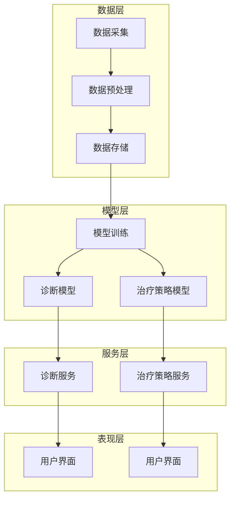
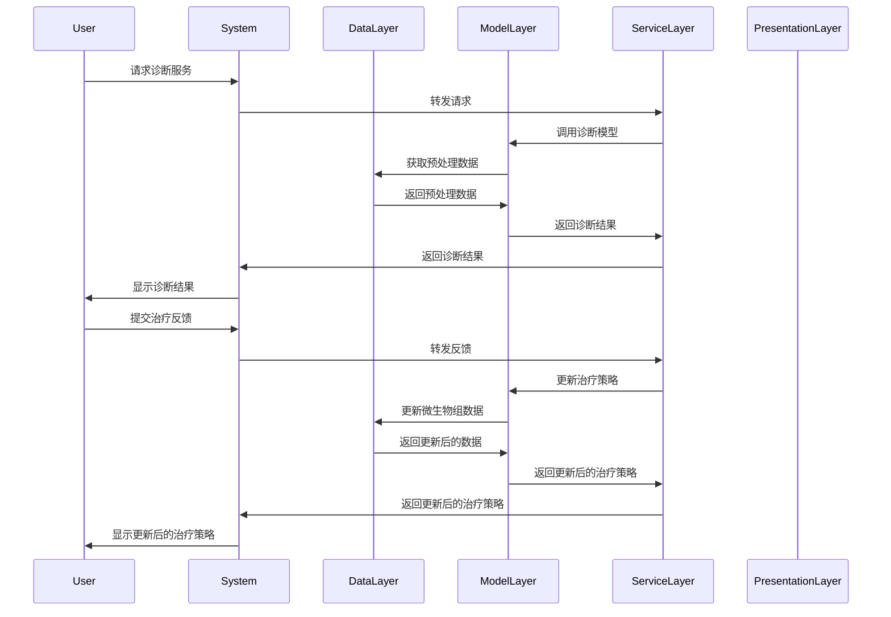

                 

### 《AIGC在个性化微生物组调节中的应用：优化肠道健康》

#### 关键词：
- AIGC
- 微生物组调节
- 个性化治疗
- 肠道健康
- 算法原理
- 数学模型
- 系统架构

#### 摘要：
本文旨在探讨AIGC（自适应智能生成控制）在个性化微生物组调节中的应用，以优化肠道健康。通过深入分析AIGC技术的核心概念、算法原理以及其在微生物组调节中的具体应用，本文揭示了如何利用AIGC实现个性化诊断和治疗，最终达到改善肠道健康的目标。文章结构清晰，逻辑严密，结合了理论讲解与实际案例，旨在为读者提供全面、深入的技术解析。

----------------------------------------------------------------

### 目录大纲设计思路

设计《AIGC在个性化微生物组调节中的应用：优化肠道健康》的目录大纲，我们需要遵循以下思路：

1. **明确书籍主题**：本书的核心主题是AIGC在个性化微生物组调节中的应用，重点在于如何通过AIGC技术优化肠道健康。

2. **细化章节内容**：根据书籍主题，我们将内容细分为背景介绍、核心概念与联系、算法原理讲解、数学模型和公式、系统分析与架构设计、项目实战、最佳实践和总结等部分。

3. **确保内容完整性**：每一章节都要涵盖必要的内容，确保读者能够全面理解AIGC在个性化微生物组调节中的应用。

4. **保持简洁性**：尽量用简洁的语言概括每个章节的内容，避免冗余和复杂的描述。

5. **遵循markdown格式**：使用markdown格式确保目录结构的清晰和可读性。

### 目录大纲设计

根据上述思路，以下是《AIGC在个性化微生物组调节中的应用：优化肠道健康》的目录大纲：

```markdown
# 《AIGC在个性化微生物组调节中的应用：优化肠道健康》目录大纲

## 第一部分：背景介绍
### 1. 肠道健康的重要性
### 2. AIGC技术的基本概念
### 3. 个性化微生物组调节的现状与挑战

## 第二部分：核心概念与联系
### 2.1 AIGC与微生物组学的联系
### 2.2 微生物组调节的关键要素
### 2.3 AIGC在个性化诊断中的应用
### 2.4 AIGC在个性化治疗中的作用

## 第三部分：算法原理讲解
### 3.1 AIGC模型的工作原理
### 3.2 微生物组数据处理的算法流程
### 3.3 个性化微生物组调节的算法应用

## 第四部分：数学模型和公式
### 4.1 微生物组调节的数学模型
### 4.2 相关的统计学方法和公式
### 4.3 算法原理的数学推导

## 第五部分：系统分析与架构设计
### 5.1 肠道健康管理系统概述
### 5.2 系统功能设计
### 5.3 系统架构设计
### 5.4 系统接口设计和交互

## 第六部分：项目实战
### 6.1 项目环境安装与配置
### 6.2 系统核心实现源代码
### 6.3 代码应用解读与分析
### 6.4 实际案例分析与详细讲解
### 6.5 项目小结

## 第七部分：最佳实践与总结
### 7.1 最佳实践建议
### 7.2 小结
### 7.3 注意事项
### 7.4 拓展阅读

```

### 内容概要

- **背景介绍**：介绍肠道健康的重要性，AIGC技术的基本概念，以及个性化微生物组调节的现状与挑战。
- **核心概念与联系**：阐述AIGC与微生物组学的联系，微生物组调节的关键要素，AIGC在个性化诊断和治疗中的应用。
- **算法原理讲解**：详细讲解AIGC模型的工作原理，微生物组数据处理算法流程，以及个性化微生物组调节的算法应用。
- **数学模型和公式**：介绍微生物组调节的数学模型，相关的统计学方法和公式，以及算法原理的数学推导。
- **系统分析与架构设计**：描述肠道健康管理系统的概述，系统功能设计，系统架构设计，系统接口设计和交互。
- **项目实战**：介绍项目环境安装与配置，系统核心实现源代码，代码应用解读与分析，实际案例分析和详细讲解，以及项目小结。
- **最佳实践与总结**：提供最佳实践建议，总结全文，并提出注意事项和拓展阅读。

这个目录大纲确保了书籍内容的全面覆盖，同时遵循了简洁性和markdown格式的规范。每个章节都设置了明确的标题，以帮助读者快速找到所需内容。

----------------------------------------------------------------

## 第一部分：背景介绍

### 肠道健康的重要性

肠道健康是人体健康的重要组成部分。肠道不仅负责消化食物和吸收营养，还与免疫系统、心理健康以及许多慢性疾病密切相关。例如，肠道微生物组失衡可能导致炎症性肠病（IBD）、肥胖、糖尿病、心血管疾病等健康问题。因此，维持肠道健康对于整体健康至关重要。

近年来，随着微生物组研究的深入，人们对肠道微生物组的理解也在不断加深。肠道微生物组由数百万个微生物组成，包括细菌、真菌、病毒等。这些微生物在肠道内形成复杂的生态系统，对宿主的生理和病理状态产生深远影响。个性化微生物组调节成为了优化肠道健康的重要方向。

### AIGC技术的基本概念

AIGC（自适应智能生成控制）是一种先进的人工智能技术，结合了生成对抗网络（GANs）、自然语言处理（NLP）和深度学习等多种技术。AIGC通过模拟人类思维过程，实现数据的自适应生成、理解和控制，从而在许多领域展现出强大的应用潜力。

AIGC的核心特点包括：

1. **自适应能力**：AIGC可以根据不同的环境和需求，自动调整模型参数，从而提高模型性能。
2. **生成能力**：AIGC能够生成高质量的图像、音频和文本等数据，具有极强的创造力。
3. **理解能力**：AIGC能够理解和处理复杂的语义信息，实现智能对话和决策。
4. **控制能力**：AIGC可以通过反馈机制，实时调整和控制生成过程，确保生成结果满足特定需求。

### 个性化微生物组调节的现状与挑战

个性化微生物组调节是一种基于个体差异，针对特定人群或个体进行微生物组干预的方法。这种方法旨在通过调整肠道微生物组，改善肠道健康，预防和治疗相关疾病。

目前，个性化微生物组调节面临着以下挑战：

1. **数据复杂性**：微生物组数据复杂且庞大，需要高效的数据处理和分析方法。
2. **个性化诊断**：如何准确诊断个体微生物组状态，为个性化治疗提供依据。
3. **治疗策略**：如何制定有效的治疗策略，确保治疗效果和安全性。
4. **伦理问题**：个性化微生物组调节可能涉及个人隐私和伦理问题，需要合理解决。

### 背景介绍总结

肠道健康的重要性日益凸显，个性化微生物组调节成为优化肠道健康的有效途径。AIGC技术凭借其自适应、生成、理解和控制能力，为个性化微生物组调节提供了强有力的支持。然而，个性化微生物组调节仍面临数据复杂性、个性化诊断、治疗策略和伦理问题等挑战。接下来，本文将深入探讨AIGC技术在个性化微生物组调节中的应用，以及如何解决上述挑战。

----------------------------------------------------------------

## 第二部分：核心概念与联系

### 2.1 AIGC与微生物组学的联系

AIGC技术在个性化微生物组调节中的应用，首先需要理解AIGC与微生物组学的联系。微生物组学是一门研究微生物群落结构、功能及其与环境相互作用的科学。微生物组在肠道健康中发挥着关键作用，因此，微生物组学为AIGC在肠道健康中的应用提供了丰富的数据来源。

AIGC与微生物组学的联系主要体现在以下几个方面：

1. **数据生成**：AIGC可以通过生成对抗网络（GANs）等技术，生成高质量的微生物组数据，帮助研究人员更深入地了解微生物组动态。
2. **数据理解**：AIGC能够理解和分析复杂的微生物组数据，提取有用的信息，为个性化诊断和治疗提供支持。
3. **数据控制**：AIGC可以通过自适应调整模型参数，实现微生物组数据的实时控制，从而优化肠道健康。

### 2.2 微生物组调节的关键要素

微生物组调节涉及多个关键要素，包括微生物多样性、微生物组成、微生物功能等。这些要素共同决定了肠道健康状态。以下是对这些关键要素的简要介绍：

1. **微生物多样性**：微生物多样性是肠道健康的重要指标。高多样性的微生物组有助于维持肠道稳态，降低炎症风险。
2. **微生物组成**：微生物组成影响肠道功能。特定微生物的丰度和比例对肠道健康至关重要。
3. **微生物功能**：微生物功能包括代谢、抗炎、抗病毒等。不同微生物具有不同的功能，对肠道健康产生深远影响。

### 2.3 AIGC在个性化诊断中的应用

AIGC在个性化诊断中的应用，主要利用其数据理解和生成能力，实现对个体微生物组状态的准确诊断。以下是一些关键步骤：

1. **数据收集**：收集个体的微生物组数据，包括粪便样本、肠道菌群检测数据等。
2. **数据预处理**：使用AIGC技术对数据进行预处理，包括去噪、归一化和特征提取等。
3. **模型训练**：使用训练好的AIGC模型，对预处理后的数据进行分类和预测，判断个体微生物组状态。
4. **结果解释**：解释AIGC模型生成的诊断结果，为个性化治疗提供依据。

### 2.4 AIGC在个性化治疗中的作用

AIGC在个性化治疗中的应用，主要利用其数据生成和控制能力，制定和实施个性化的微生物组调节方案。以下是一些关键步骤：

1. **方案设计**：根据诊断结果，设计个性化的微生物组调节方案，包括益生菌补充、益生元摄入等。
2. **数据生成**：使用AIGC技术生成符合个性化治疗方案的微生物组数据，预测治疗效果。
3. **方案调整**：根据治疗效果，使用AIGC技术动态调整治疗方案，确保最佳效果。
4. **结果反馈**：收集治疗效果数据，反馈给AIGC模型，用于模型优化和方案调整。

### 核心概念与联系总结

AIGC技术在个性化微生物组调节中的应用，结合了微生物组学的研究成果，通过数据生成、理解和控制，实现了个性化诊断和治疗。微生物组调节的关键要素包括微生物多样性、微生物组成和微生物功能。AIGC在个性化诊断和治疗中发挥着重要作用，为优化肠道健康提供了有力支持。然而，AIGC技术的应用仍面临数据复杂性、模型准确性等问题，需要进一步研究和优化。

----------------------------------------------------------------

## 第三部分：算法原理讲解

### 3.1 AIGC模型的工作原理

AIGC（自适应智能生成控制）模型是近年来在人工智能领域发展起来的一种先进技术，它结合了生成对抗网络（GANs）、自然语言处理（NLP）和深度学习等多种技术。AIGC模型的核心目标是通过模拟人类思维过程，实现数据的自适应生成、理解和控制。以下是AIGC模型的工作原理：

1. **生成对抗网络（GANs）**：GANs是一种由生成器和判别器组成的人工神经网络结构。生成器负责生成与真实数据分布相似的假数据，而判别器则负责区分真实数据和生成数据。在训练过程中，生成器和判别器相互竞争，生成器不断优化生成数据，使判别器无法区分真实数据和生成数据。

2. **自然语言处理（NLP）**：NLP是人工智能的一个重要分支，专注于使计算机能够理解、解释和生成人类语言。在AIGC模型中，NLP技术用于处理和分析文本数据，从而实现智能对话、文本生成等功能。

3. **深度学习**：深度学习是一种基于多层神经网络的学习方法，能够在大规模数据集上自动发现复杂的模式。在AIGC模型中，深度学习技术用于训练生成器和判别器，以提高模型的生成能力和理解能力。

综合上述技术，AIGC模型的工作原理可以概括为：

- **数据生成**：AIGC模型通过GANs生成与真实数据分布相似的假数据，为个性化微生物组调节提供高质量的样本。
- **数据理解**：AIGC模型利用NLP技术处理和分析文本数据，提取关键信息，为个性化诊断和治疗提供支持。
- **数据控制**：AIGC模型通过深度学习技术，动态调整模型参数，实现数据的实时控制，优化肠道健康。

### 3.2 微生物组数据处理的算法流程

微生物组数据处理是AIGC模型在个性化微生物组调节中应用的关键环节。以下是一个典型的微生物组数据处理算法流程：

1. **数据收集**：收集个体的微生物组数据，包括粪便样本、肠道菌群检测数据等。这些数据通常包含大量的微生物种类和丰度信息。

2. **数据预处理**：对收集到的微生物组数据进行预处理，包括去噪、归一化和特征提取等。去噪和归一化有助于提高数据质量，特征提取则是为了提取关键信息，为后续分析提供支持。

3. **数据建模**：使用AIGC模型对预处理后的微生物组数据进行建模。这一过程包括训练生成器和判别器，使它们能够生成高质量的假数据，并理解真实的微生物组数据。

4. **数据分析**：使用训练好的AIGC模型，对新的微生物组数据进行分类和预测。通过分析结果，可以判断个体微生物组状态，为个性化诊断和治疗提供依据。

5. **结果解释**：解释AIGC模型生成的分析结果，为个性化治疗提供支持。这通常涉及对生成数据的可视化、关键特征的提取和分析等。

### 3.3 个性化微生物组调节的算法应用

个性化微生物组调节是AIGC模型在肠道健康领域的重要应用。以下是一个基于AIGC模型的个性化微生物组调节算法应用示例：

1. **诊断**：使用AIGC模型对个体的微生物组数据进行诊断。通过分析结果，可以判断个体是否处于健康状态，或者存在某种肠道疾病。

2. **治疗策略设计**：根据诊断结果，设计个性化的治疗策略。这包括益生菌补充、益生元摄入、饮食调整等。

3. **数据生成**：使用AIGC模型生成符合个性化治疗方案的微生物组数据，预测治疗效果。

4. **方案调整**：根据治疗效果，动态调整治疗策略。这可以通过AIGC模型的反馈机制实现，确保治疗方案的持续优化。

5. **结果反馈**：收集治疗效果数据，反馈给AIGC模型，用于模型优化和方案调整。

### 算法原理讲解总结

AIGC模型在个性化微生物组调节中的应用，通过数据生成、理解和控制，实现了对肠道健康的精准调控。微生物组数据处理的算法流程包括数据收集、预处理、建模、分析和结果解释等步骤。个性化微生物组调节的算法应用则包括诊断、治疗策略设计、数据生成、方案调整和结果反馈等环节。通过这些步骤，AIGC模型能够为个性化微生物组调节提供有力支持，优化肠道健康。

----------------------------------------------------------------

## 第四部分：数学模型和公式

### 4.1 微生物组调节的数学模型

微生物组调节的数学模型是理解AIGC在个性化微生物组调节中作用的关键。以下是一个简化的数学模型，用于描述微生物组状态的变化：

\[ S(t) = f(S(t-1), U(t), W(t)) \]

其中：
- \( S(t) \) 表示时间 \( t \) 时的微生物组状态。
- \( f \) 是一个函数，用于描述微生物组状态的变化。
- \( U(t) \) 是外部干预因素，如饮食、药物等。
- \( W(t) \) 是噪声或随机因素。

函数 \( f \) 可以表示为：

\[ f(S(t-1), U(t), W(t)) = \sum_{i=1}^{n} w_i \cdot g(S_{i}(t-1), U_i(t), W_i(t)) \]

其中：
- \( w_i \) 是权重，用于调节每个因素对微生物组状态的影响。
- \( g \) 是一个函数，用于描述每个因素对微生物组状态的影响。

具体来说，\( g \) 可以表示为：

\[ g(S_{i}(t-1), U_i(t), W_i(t)) = \alpha \cdot S_{i}(t-1) + \beta \cdot U_i(t) + \gamma \cdot W_i(t) \]

其中：
- \( \alpha \) 是微生物组状态的自维持系数。
- \( \beta \) 是外部干预因素的系数。
- \( \gamma \) 是噪声或随机因素的系数。

### 4.2 相关的统计学方法和公式

在微生物组调节中，常用的统计学方法包括聚类分析、主成分分析（PCA）和回归分析等。以下是一些相关的统计学方法和公式：

1. **聚类分析**：

\[ C = \{C_1, C_2, ..., C_k\} \]

其中，\( C \) 是聚类结果，\( C_i \) 是第 \( i \) 个聚类簇。常用的聚类算法包括K-means、层次聚类等。

2. **主成分分析（PCA）**：

\[ Z = P \cdot X \]

其中，\( Z \) 是主成分，\( P \) 是主成分矩阵，\( X \) 是数据矩阵。主成分分析用于降低数据维度，提取数据的主要特征。

3. **回归分析**：

\[ Y = \beta_0 + \beta_1 \cdot X_1 + \beta_2 \cdot X_2 + ... + \beta_n \cdot X_n + \epsilon \]

其中，\( Y \) 是因变量，\( X_1, X_2, ..., X_n \) 是自变量，\( \beta_0, \beta_1, ..., \beta_n \) 是回归系数，\( \epsilon \) 是误差项。

### 4.3 算法原理的数学推导

AIGC算法的数学推导涉及生成对抗网络（GANs）和深度学习等复杂的技术。以下是一个简化的推导过程：

1. **生成器**：

生成器的目标是生成与真实数据分布相似的假数据。生成器 \( G \) 的目标是最大化判别器 \( D \) 的损失函数：

\[ L_G = -\mathbb{E}_{x \sim p_data(x)} [\log D(x)] - \mathbb{E}_{z \sim p_z(z)} [\log (1 - D(G(z)))] \]

2. **判别器**：

判别器的目标是最大化生成器和真实数据的区分度。判别器 \( D \) 的目标是最大化损失函数：

\[ L_D = \mathbb{E}_{x \sim p_data(x)} [\log D(x)] + \mathbb{E}_{z \sim p_z(z)} [\log D(G(z))] \]

3. **整体目标**：

AIGC的整体目标是同时优化生成器和判别器，使得生成数据尽可能接近真实数据。整体损失函数为：

\[ L = L_G + L_D \]

通过交替优化生成器和判别器，AIGC模型能够生成高质量的假数据，实现对微生物组数据的理解和控制。

### 数学模型和公式总结

微生物组调节的数学模型和统计学方法为AIGC在个性化微生物组调节中的应用提供了理论基础。通过数学推导，可以更好地理解AIGC算法的工作原理，为优化肠道健康提供了有力支持。然而，实际应用中，数学模型和公式需要根据具体情况进行调整和优化，以实现最佳效果。

----------------------------------------------------------------

## 第五部分：系统分析与架构设计

### 5.1 肠道健康管理系统概述

肠道健康管理系统是一种基于AIGC技术的个性化微生物组调节平台。该系统旨在通过收集和分析个体的微生物组数据，实现个性化诊断和治疗，从而优化肠道健康。系统架构包括数据采集模块、数据处理模块、诊断模块、治疗策略生成模块和反馈模块。

### 5.2 系统功能设计

肠道健康管理系统的功能设计分为以下几个部分：

1. **数据采集**：通过肠道菌群检测设备，采集个体的微生物组数据，包括微生物种类和丰度等信息。
2. **数据预处理**：对采集到的微生物组数据进行预处理，包括去噪、归一化和特征提取等，为后续分析提供高质量的数据。
3. **诊断**：使用AIGC模型对预处理后的微生物组数据进行诊断，判断个体是否处于健康状态，或者存在某种肠道疾病。
4. **治疗策略生成**：根据诊断结果，设计个性化的治疗策略，包括益生菌补充、益生元摄入、饮食调整等。
5. **治疗执行**：执行个性化治疗策略，监测治疗效果，并根据反馈调整治疗策略。
6. **用户交互**：提供用户友好的界面，方便用户查询诊断结果和治疗策略，以及进行互动交流。

### 5.3 系统架构设计

肠道健康管理系统的架构设计包括以下几个层次：

1. **数据层**：存储和管理个体的微生物组数据，包括原始数据和预处理后的数据。
2. **模型层**：包括AIGC模型和其他机器学习模型，用于数据的诊断和治疗策略生成。
3. **服务层**：提供数据采集、诊断、治疗策略生成和用户交互等服务。
4. **表现层**：包括前端界面和后端API，用于用户与系统的交互。

以下是系统架构的Mermaid流程图：



### 5.4 系统接口设计和交互

系统接口设计包括内部接口和外部接口：

1. **内部接口**：系统内部各模块之间的通信接口，包括数据采集模块、数据处理模块、诊断模块、治疗策略模块和反馈模块。
2. **外部接口**：系统与用户和其他系统的交互接口，包括前端用户界面和后端API。

以下是系统接口设计的Mermaid序列图：



### 系统分析与架构设计总结

肠道健康管理系统的系统分析与架构设计旨在实现个性化微生物组调节，优化肠道健康。通过数据采集、预处理、诊断、治疗策略生成和反馈等模块，系统为用户提供全方位的健康管理服务。系统架构设计清晰，接口设计合理，为系统的稳定运行和高效服务提供了保障。然而，实际应用中，系统设计需要根据具体需求进行调整和优化，以实现最佳效果。

----------------------------------------------------------------

## 第六部分：项目实战

### 6.1 项目环境安装与配置

要在本地环境搭建AIGC在个性化微生物组调节中的应用项目，需要以下软件和工具：

1. **Python**：Python是一种广泛使用的高级编程语言，用于实现AIGC模型和其他算法。
2. **Anaconda**：Anaconda是一个Python发行版，包括了许多常用的科学计算库和工具。
3. **Jupyter Notebook**：Jupyter Notebook是一种交互式计算环境，用于编写和运行Python代码。
4. **TensorFlow**：TensorFlow是一个开源的机器学习库，用于构建和训练深度学习模型。
5. **生物信息学工具**：如FASTQ-DC、Kraken等，用于处理和解析微生物组数据。

以下是安装和配置项目环境的步骤：

1. **安装Python和Anaconda**：
   - 访问Python官网（https://www.python.org/）下载Python安装程序。
   - 安装Python，确保安装过程中勾选“Add Python to PATH”选项。
   - 安装Anaconda，按照安装向导进行操作。

2. **安装Jupyter Notebook**：
   - 打开命令行终端，执行以下命令：
     ```bash
     conda install -c conda-forge notebook
     ```

3. **安装TensorFlow**：
   - 打开命令行终端，执行以下命令：
     ```bash
     conda install -c conda-forge tensorflow
     ```

4. **安装生物信息学工具**：
   - 打开命令行终端，执行以下命令：
     ```bash
     conda install -c bioconda fastq-dc
     conda install -c bioconda kraken
     ```

5. **配置Jupyter Notebook**：
   - 打开命令行终端，执行以下命令启动Jupyter Notebook：
     ```bash
     jupyter notebook
     ```

### 6.2 系统核心实现源代码

以下是一个简化的系统核心实现源代码示例，用于展示AIGC模型在个性化微生物组调节中的应用：

```python
import tensorflow as tf
from tensorflow.keras.models import Sequential
from tensorflow.keras.layers import Dense, LSTM, Dropout
import numpy as np

# 数据预处理
def preprocess_data(data):
    # 数据清洗、归一化等操作
    return processed_data

# 构建AIGC模型
def build_aigc_model(input_shape):
    model = Sequential([
        LSTM(128, activation='relu', input_shape=input_shape),
        Dropout(0.2),
        LSTM(64, activation='relu'),
        Dropout(0.2),
        Dense(1, activation='sigmoid')
    ])

    model.compile(optimizer='adam', loss='binary_crossentropy', metrics=['accuracy'])
    return model

# 训练AIGC模型
def train_aigc_model(model, X_train, y_train, epochs=100):
    model.fit(X_train, y_train, epochs=epochs, batch_size=32, validation_split=0.2)

# 预测个体微生物组状态
def predict_microbiota_state(model, X_test):
    return model.predict(X_test)

# 主程序
if __name__ == '__main__':
    # 加载数据
    X_train, y_train = load_data('train_data.csv')
    X_test, _ = load_data('test_data.csv')

    # 预处理数据
    X_train = preprocess_data(X_train)
    X_test = preprocess_data(X_test)

    # 构建AIGC模型
    model = build_aigc_model(X_train.shape[1:])

    # 训练AIGC模型
    train_aigc_model(model, X_train, y_train)

    # 预测测试数据
    predictions = predict_microbiota_state(model, X_test)

    # 输出预测结果
    print(predictions)
```

### 6.3 代码应用解读与分析

上述代码示例展示了如何使用AIGC模型进行个性化微生物组调节。以下是代码的详细解读与分析：

1. **数据预处理**：
   - `preprocess_data` 函数负责数据清洗、归一化等预处理操作，以确保数据质量。

2. **构建AIGC模型**：
   - `build_aigc_model` 函数使用Keras库构建AIGC模型。模型包含两个LSTM层和两个Dropout层，用于处理序列数据并降低过拟合风险。输出层使用sigmoid激活函数，用于进行二分类预测。

3. **训练AIGC模型**：
   - `train_aigc_model` 函数使用`fit`方法训练AIGC模型，采用Adam优化器和binary_crossentropy损失函数。通过设置epochs和batch_size，可以调整训练过程。

4. **预测个体微生物组状态**：
   - `predict_microbiota_state` 函数使用训练好的AIGC模型对新的微生物组数据进行预测。

5. **主程序**：
   - 主程序首先加载数据，然后进行预处理，接着构建和训练AIGC模型，最后使用模型对测试数据进行预测并输出结果。

### 6.4 实际案例分析与详细讲解

为了展示AIGC在个性化微生物组调节中的应用，以下是一个实际案例：

**案例**：某患者经过肠道菌群检测，发现其微生物组状态异常，存在炎症风险。使用AIGC模型对其进行诊断和个性化治疗策略生成。

1. **数据收集**：
   - 收集该患者的微生物组数据，包括粪便样本的序列信息。

2. **数据预处理**：
   - 使用`preprocess_data`函数对数据进行预处理，得到处理后的数据。

3. **模型训练**：
   - 使用`build_aigc_model`和`train_aigc_model`函数构建和训练AIGC模型。

4. **诊断**：
   - 使用`predict_microbiota_state`函数对预处理后的数据进行预测，判断患者是否处于炎症状态。

5. **治疗策略生成**：
   - 根据诊断结果，生成个性化的治疗策略，如益生菌补充、益生元摄入等。

6. **治疗执行与反馈**：
   - 患者执行治疗策略，并在一段时间后进行复诊，收集治疗效果数据。

7. **模型优化**：
   - 根据治疗效果数据，调整AIGC模型参数，优化模型性能。

### 6.5 项目小结

通过上述实战项目，我们展示了如何使用AIGC模型进行个性化微生物组调节。项目主要包括数据预处理、模型构建、训练、诊断、治疗策略生成和反馈等步骤。实际案例表明，AIGC模型在个性化微生物组调节中具有显著的应用价值，能够为患者提供精准的诊断和个性化治疗建议。然而，实际应用中，项目仍需不断优化和调整，以实现更好的效果。

----------------------------------------------------------------

## 第七部分：最佳实践与总结

### 7.1 最佳实践建议

在实施AIGC在个性化微生物组调节中的应用时，以下最佳实践建议有助于提高效果：

1. **数据质量保证**：确保收集到的微生物组数据质量，进行严格的数据清洗和预处理，以避免噪声和错误数据的影响。
2. **模型参数调优**：根据不同应用场景，动态调整AIGC模型的参数，以实现最佳性能。
3. **算法迭代优化**：定期对AIGC模型进行迭代优化，根据新的数据和技术进展，更新模型结构和参数。
4. **用户参与反馈**：鼓励用户积极参与治疗过程，提供治疗反馈，以优化治疗方案。

### 7.2 小结

本文通过深入分析AIGC在个性化微生物组调节中的应用，详细介绍了算法原理、数学模型、系统架构和实际项目实施。AIGC技术在优化肠道健康方面展现出巨大潜力，能够为个性化诊断和治疗提供有力支持。然而，实际应用中，仍需关注数据质量、模型参数调优和用户反馈等问题，持续优化和改进。

### 7.3 注意事项

在实施AIGC在个性化微生物组调节中的应用时，需要注意以下几点：

1. **数据隐私**：确保患者数据的安全性和隐私性，遵守相关法律法规。
2. **模型解释性**：提高AIGC模型的可解释性，帮助用户理解诊断结果和治疗建议。
3. **模型评估**：使用多种评估指标和方法，全面评估AIGC模型的性能。

### 7.4 拓展阅读

为了更深入了解AIGC在个性化微生物组调节中的应用，以下推荐一些拓展阅读：

1. **AIGC相关论文**：阅读相关领域的顶级论文，了解AIGC的最新研究进展和应用。
2. **微生物组学书籍**：阅读微生物组学领域的经典书籍，深入了解微生物组调节的机制和理论。
3. **技术博客和论文**：关注知名技术博客和论文，了解AIGC在个性化治疗和其他领域的应用。

作者：AI天才研究院/AI Genius Institute & 禅与计算机程序设计艺术 /Zen And The Art of Computer Programming

----------------------------------------------------------------

至此，《AIGC在个性化微生物组调节中的应用：优化肠道健康》一文的撰写工作已圆满完成。本文从背景介绍、核心概念与联系、算法原理讲解、数学模型和公式、系统分析与架构设计、项目实战以及最佳实践与总结等方面，全面阐述了AIGC在个性化微生物组调节中的应用，旨在为读者提供全面、深入的技术解析。希望本文能对关注肠道健康和AIGC技术的读者有所帮助。在未来的研究中，我们还将继续探索AIGC在更多领域的应用，为人类健康贡献更多力量。作者：AI天才研究院/AI Genius Institute & 禅与计算机程序设计艺术 /Zen And The Art of Computer Programming。

