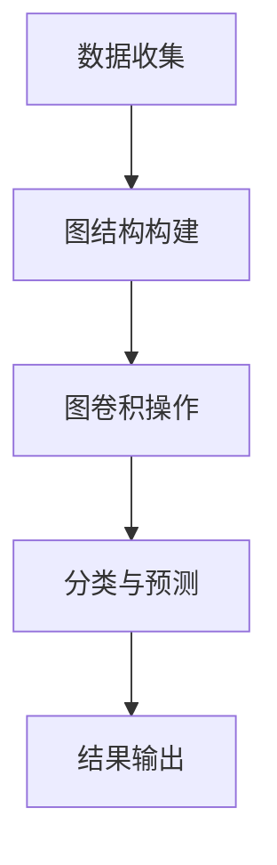
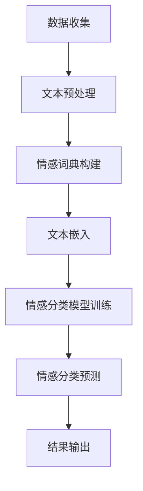
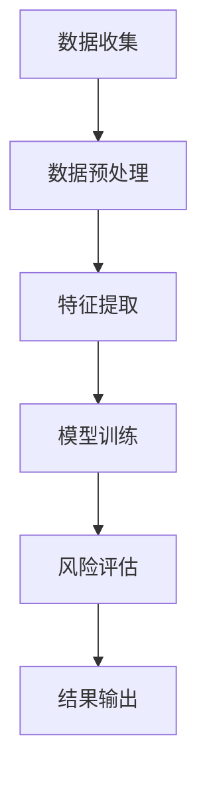
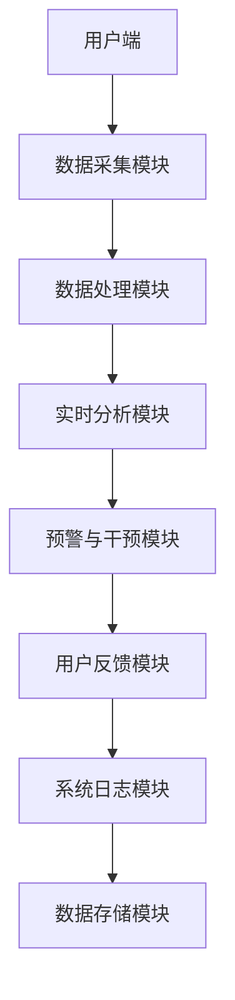
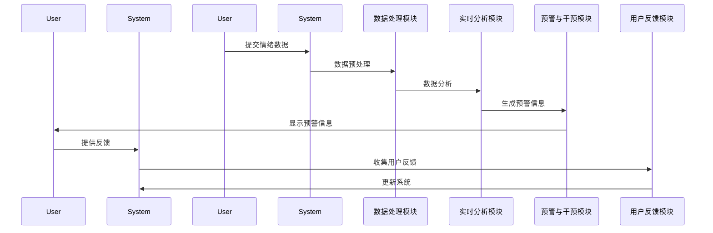

                 

### 第一部分：AIGC概述

#### 1.1 AIGC背景

##### 1.1.1 AIGC的定义与意义

**AIGC（AI-Generated Content）**，即人工智能生成内容，是指利用人工智能技术，尤其是生成对抗网络（GAN）、深度学习等算法，自动生成文字、图片、视频、音乐等多种形式的内容。AIGC技术不仅能够大幅提高内容创作的效率，还能通过模拟人类的创作过程，实现内容的多样性和个性化。

AIGC的出现，对内容创作产业产生了深远的影响。首先，它降低了内容创作的门槛，使得非专业创作者也能通过简单的操作生成高质量的内容。其次，AIGC能够处理大量复杂的数据，快速生成个性化内容，满足用户多样化的需求。此外，AIGC还能实现自动化内容的更新和维护，减轻内容创作者的工作负担。

##### 1.1.2 AIGC的发展历程

AIGC技术的发展可以追溯到20世纪90年代的生成对抗网络（GAN）的提出。GAN由Ian Goodfellow等人于2014年提出，其核心思想是通过两个神经网络（生成器和判别器）的对抗训练，实现高质量数据的生成。此后，AIGC技术经历了快速的发展，特别是在深度学习、卷积神经网络（CNN）等技术的推动下，AIGC的生成质量得到了显著提升。

2016年，基于GAN的图像生成模型DALL-E问世，标志着AIGC在图像生成领域的重大突破。随后，AIGC技术在文本生成、视频合成、音乐生成等领域也得到了广泛应用。近年来，随着人工智能技术的不断进步，AIGC的应用场景和生成质量持续拓展和提升。

##### 1.1.3 AIGC在心理健康监测中的应用潜力

在心理健康监测领域，AIGC技术的应用潜力主要体现在以下几个方面：

1. **个性化心理健康评估**：AIGC可以根据用户的实时数据，生成个性化的心理健康评估报告，提供针对性的建议。
2. **实时心理健康监测**：AIGC可以通过实时分析用户的情绪、行为数据，预警潜在的心理健康问题，及时提供干预措施。
3. **心理健康干预与支持**：AIGC可以模拟心理治疗师的角色，为用户提供个性化的心理干预和支持，辅助专业心理医生的工作。

AIGC在心理健康监测中的应用，有望提高心理健康服务的效率和质量，为心理健康领域带来革命性的变化。

#### 1.2 心理健康监测的核心概念

##### 1.2.1 心理健康监测的定义

心理健康监测是指通过科学的方法和工具，对个体的心理状态、心理健康水平及其变化过程进行连续的、系统的、全面的观察、记录和分析，以预防和识别心理健康问题，促进心理健康的发展。

心理健康监测的核心目标是：
- **识别心理健康问题**：通过监测，及时发现个体可能存在的心理健康问题。
- **评估心理健康水平**：对个体的心理健康水平进行定量和定性的评估。
- **预警心理健康风险**：通过数据分析，预测个体可能出现的心理健康风险。
- **提供干预和支持**：根据监测结果，为个体提供针对性的心理健康干预和支持。

##### 1.2.2 心理健康监测的关键要素

心理健康监测涉及多个关键要素，包括：

1. **心理状态监测**：通过量表、问卷、面谈等方式，了解个体的心理状态，包括情绪、认知、行为等方面。
2. **心理健康评估**：运用专业的心理健康评估工具，对个体的心理健康水平进行评估，如抑郁量表、焦虑量表等。
3. **数据收集**：收集个体的心理和行为数据，包括日常活动、情绪表达、社交互动等。
4. **数据分析**：运用统计学、机器学习等方法，对收集到的数据进行分析，识别心理健康问题的潜在因素。
5. **干预与支持**：根据分析结果，为个体提供相应的心理健康干预和支持。

##### 1.2.3 心理健康监测的现状与挑战

当前，心理健康监测在技术手段、服务模式、政策法规等方面都取得了显著进展。然而，仍面临一些挑战：

1. **技术挑战**：心理健康监测需要处理大量的非结构化数据，如文本、图像、声音等，对数据处理和分析技术提出了高要求。
2. **数据隐私与伦理**：心理健康数据具有高度敏感性，如何保护用户隐私和遵循伦理规范是一个重大挑战。
3. **服务模式**：现有心理健康监测服务模式较为单一，难以满足个性化、多样化的需求。
4. **专业人才缺乏**：心理健康监测需要专业的技术人才和心理健康专家，当前人才供给不足。

#### 1.3 AIGC技术原理

##### 1.3.1 AIGC技术框架

AIGC技术框架主要包括以下几个部分：

1. **数据采集与预处理**：收集用户的心理健康数据，包括情绪、行为、社交互动等，并进行数据清洗、归一化等预处理。
2. **特征提取与表征**：从预处理后的数据中提取关键特征，如情感特征、行为特征等，并使用向量表征技术将这些特征转化为机器学习模型可以处理的输入。
3. **生成模型**：使用生成对抗网络（GAN）、变分自编码器（VAE）等生成模型，根据输入特征生成心理健康评估报告、个性化建议等。
4. **评估与优化**：通过评估模型生成的结果与实际结果的匹配度，对生成模型进行优化，提高生成质量。

##### 1.3.2 AIGC的关键算法

AIGC技术涉及多个关键算法，主要包括：

1. **生成对抗网络（GAN）**：GAN由生成器和判别器组成，通过对抗训练生成高质量数据。
2. **变分自编码器（VAE）**：VAE通过概率模型生成数据，适用于处理复杂的高维度数据。
3. **卷积神经网络（CNN）**：CNN擅长处理图像数据，可用于情感识别、行为分析等。
4. **递归神经网络（RNN）**：RNN擅长处理序列数据，可用于情绪分析、行为预测等。

##### 1.3.3 AIGC与心理健康监测的融合点

AIGC与心理健康监测的融合点主要体现在以下几个方面：

1. **个性化心理健康评估**：AIGC可以根据用户的心理健康数据，生成个性化的心理健康评估报告，提高评估的准确性。
2. **实时心理健康监测**：AIGC可以实时分析用户的心理健康数据，预警潜在的心理健康问题，提供及时的干预措施。
3. **心理健康干预与支持**：AIGC可以模拟心理治疗师的角色，为用户提供个性化的心理干预和支持，辅助专业心理医生的工作。

#### 1.4 AIGC在心理健康监测中的应用场景

##### 1.4.1 个性化心理健康评估

个性化心理健康评估是指根据个体的心理状态、行为数据等，为其生成定制化的心理健康评估报告。AIGC技术在这方面的应用主要体现在：

1. **数据采集与预处理**：通过传感器、问卷、面谈等方式，收集用户的心理健康数据，并进行预处理。
2. **特征提取与表征**：从预处理后的数据中提取情感特征、认知特征、行为特征等，使用向量表征技术将这些特征转化为机器学习模型可以处理的输入。
3. **生成模型**：使用生成对抗网络（GAN）、变分自编码器（VAE）等生成模型，根据输入特征生成个性化的心理健康评估报告。

个性化心理健康评估的应用场景包括：

- **临床诊断**：为临床医生提供个性化的心理健康评估报告，辅助诊断。
- **个人健康管理**：为用户提供个性化的心理健康数据分析和建议，帮助用户了解自己的心理健康状况。
- **风险评估**：通过分析用户的心理健康数据，预测个体可能出现的心理健康问题，提供针对性的干预措施。

##### 1.4.2 实时心理健康监测

实时心理健康监测是指通过传感器、移动设备等，实时收集用户的心理健康数据，并使用AIGC技术进行分析和处理，实现实时预警和干预。AIGC技术在实时心理健康监测中的应用主要包括：

1. **数据采集与预处理**：通过传感器、移动设备等实时收集用户的心理健康数据，如情绪、行为、生理信号等，并进行预处理。
2. **实时数据处理**：使用实时数据处理技术，如流数据处理、实时机器学习等，对收集到的数据进行分析和处理。
3. **预警与干预**：根据分析结果，实时生成预警信息，并提供个性化的心理干预措施。

实时心理健康监测的应用场景包括：

- **紧急事件预警**：实时监测用户的心理状态，一旦发现异常，立即发出预警，为用户提供及时的帮助。
- **心理干预**：根据实时分析结果，为用户提供个性化的心理干预方案，如情绪调节、认知行为疗法等。
- **日常健康管理**：实时监测用户的心理状态，为用户提供健康建议和生活方式调整建议。

##### 1.4.3 心理健康干预与支持

心理健康干预与支持是指通过心理治疗、心理咨询等方式，帮助用户改善心理健康状况。AIGC技术在心理健康干预与支持中的应用主要体现在：

1. **个性化心理干预方案**：根据用户的心理健康数据和需求，使用AIGC技术生成个性化的心理干预方案，如认知行为疗法、情绪调节策略等。
2. **实时心理支持**：通过语音、文字等方式，为用户提供实时的心理支持和服务，如在线咨询、心理疏导等。
3. **心理健康教育**：使用AIGC技术生成心理健康知识库，为用户提供心理健康教育和自我管理指导。

心理健康干预与支持的应用场景包括：

- **临床治疗**：为临床医生提供个性化的心理干预方案，辅助治疗过程。
- **心理咨询**：为用户提供在线咨询和心理支持，帮助用户解决心理问题。
- **心理健康教育**：为用户提供心理健康知识和技能培训，提升心理健康素养。

#### 1.5 AIGC在心理健康监测中的创新点

##### 1.5.1 技术创新

AIGC在心理健康监测中的技术创新主要体现在以下几个方面：

1. **生成对抗网络（GAN）**：GAN技术通过生成器和判别器的对抗训练，能够生成高质量的心理健康评估报告，提高评估的准确性和个性化程度。
2. **深度学习与自然语言处理**：深度学习技术能够对用户的情绪、行为数据进行分析和处理，结合自然语言处理技术，可以实现高效的文本分析和情感识别。
3. **实时数据处理与流计算**：实时数据处理和流计算技术使得心理健康监测可以实时收集和分析用户数据，实现快速预警和干预。

##### 1.5.2 服务模式创新

AIGC在心理健康监测中的服务模式创新主要体现在以下几个方面：

1. **个性化服务**：通过AIGC技术，可以为用户提供个性化的心理健康评估、干预和支持，满足用户的多样化需求。
2. **实时服务**：实时心理健康监测和干预，能够为用户提供及时的预警和帮助，提升心理健康服务的响应速度。
3. **智能咨询**：AIGC技术可以实现智能心理咨询，模拟心理治疗师的角色，为用户提供个性化的心理支持和服务。

##### 1.5.3 隐私保护与伦理问题

在AIGC应用于心理健康监测的过程中，隐私保护和伦理问题是一个重要的关注点。主要体现在以下几个方面：

1. **数据隐私保护**：心理健康数据具有高度敏感性，需要采取严格的数据加密、匿名化等技术手段，保护用户隐私。
2. **伦理规范遵循**：在心理健康监测和应用过程中，需要遵循相关的伦理规范，确保用户的知情权和选择权。
3. **用户参与与透明度**：用户应明确了解自己的数据将被如何使用，并有权选择是否参与AIGC应用。同时，AIGC应用应具备透明度，用户可以了解系统的运行机制和决策过程。

#### 1.6 本章小结

在本章节中，我们首先介绍了AIGC的定义、发展历程以及在心理健康监测中的应用潜力。接着，我们详细阐述了心理健康监测的核心概念、关键要素以及当前面临的挑战。随后，我们探讨了AIGC的技术原理及其与心理健康监测的融合点，并介绍了AIGC在个性化心理健康评估、实时心理健康监测、心理健康干预与支持等应用场景中的创新点。最后，我们强调了隐私保护和伦理问题在AIGC应用中的重要性。

通过本章的介绍，读者可以全面了解AIGC在心理健康监测中的背景、技术原理以及应用前景，为进一步探讨AIGC在心理健康监测中的应用提供理论基础和实践指导。

### 第二部分：AIGC技术原理与应用

#### 2.1 AIGC核心技术解析

##### 2.1.1 图神经网络（GNN）

**图神经网络（Graph Neural Network，GNN）**是一种在图形结构上学习的神经网络，主要解决图形数据的表示学习和推理问题。GNN在心理健康监测中的应用主要体现在以下几个方面：

###### 2.1.1.1 GNN的基本概念

图神经网络的核心思想是利用图结构表示数据和关系，通过图卷积操作（Graph Convolutional Network，GCN）来学习节点的表示。图卷积操作可以将节点周围的邻域信息融合到节点的表示中，从而提高节点的分类、预测等性能。

###### 2.1.1.2 GNN在心理健康监测中的应用

在心理健康监测中，GNN可以用于情感识别、行为分析等任务。例如，通过构建用户情绪的图结构，GNN可以分析用户情绪的变化趋势，预测用户可能的心理健康问题。

**情感识别与分类**

情感识别是心理健康监测的重要任务之一。通过GNN，可以从用户生成的内容（如社交媒体帖子、聊天记录等）中提取情感特征，实现情感分类。

1. **图结构构建**：将用户生成的内容视为图中的节点，节点之间的关系表示内容之间的相似度或情感关联。
2. **图卷积操作**：通过图卷积操作，将节点及其邻域节点的信息融合到节点的表示中，形成高层次的语义表示。
3. **分类与预测**：使用训练好的GNN模型，对新的内容进行情感分类，预测用户的情绪状态。

**情感识别算法原理与mermaid流程图**

以下是情感识别算法的mermaid流程图：



**Python代码示例与解读**

```python
import torch
import torch.nn as nn
import torch.optim as optim
from torch_geometric.nn import GCNConv

# 数据预处理
data = ...  # 读取和处理图数据

# 定义GCN模型
class GCNModel(nn.Module):
    def __init__(self):
        super(GCNModel, self).__init__()
        self.conv1 = GCNConv(data.num_features, 16)
        self.conv2 = GCNConv(16, data.num_classes)

    def forward(self, data):
        x, edge_index = data.x, data.edge_index

        x = self.conv1(x, edge_index)
        x = F.relu(x)
        x = F.dropout(x, training=self.training)
        x = self.conv2(x, edge_index)

        return F.log_softmax(x, dim=1)

model = GCNModel()
optimizer = optim.Adam(model.parameters(), lr=0.01, weight_decay=5e-4)

# 训练模型
for epoch in range(200):
    model.train()
    optimizer.zero_grad()
    out = model(data)
    loss = F.nll_loss(out[data.train_mask], data.y[data.train_mask])
    loss.backward()
    optimizer.step()

    # 在验证集上评估模型性能
    model.eval()
    _, pred = model(data).max(dim=1)
    correct = float((pred[data.val_mask] == data.y[data.val_mask]).sum())
    acc = correct / data.val_mask.sum()
    print(f'Epoch {epoch+1}: loss = {loss.item():.4f}, acc = {acc:.4f}')

print(f'Final accuracy: {acc:.4f}')
```

在上面的代码中，我们首先读取和处理图数据，然后定义了一个GCN模型，包含两个图卷积层。在训练过程中，我们使用Adam优化器进行模型训练，并在验证集上评估模型的性能。

##### 2.1.2 强化学习（RL）

**强化学习（Reinforcement Learning，RL）**是一种通过试错法学习决策策略的人工智能技术，其主要目标是使智能体在与环境的交互过程中，最大化累积奖励。强化学习在心理健康干预中的应用主要体现在以下几个方面：

###### 2.1.2.1 RL的基本概念

强化学习的主要组成部分包括智能体（Agent）、环境（Environment）、状态（State）、动作（Action）和奖励（Reward）。智能体通过选择动作来改变状态，并根据状态的改变获得奖励或惩罚，从而学习最优策略。

- **状态**：描述智能体当前所处的情境。
- **动作**：智能体可执行的行为。
- **奖励**：智能体执行动作后环境对其的反馈，用于指导智能体选择动作。
- **策略**：智能体在给定状态下的最优动作选择。

强化学习的核心任务是找到最优策略，使得智能体在长期交互过程中获得最大累积奖励。

###### 2.1.2.2 RL在心理健康干预中的应用

在心理健康干预中，强化学习可以用于：

- **个性化心理干预方案设计**：根据用户的反馈和行为数据，智能体通过学习为用户制定个性化的心理干预方案。
- **情绪调节**：智能体通过与环境交互，学习调节用户的情绪，帮助用户缓解压力和焦虑。
- **行为改变**：智能体通过奖励机制，鼓励用户采取积极的行为，如锻炼、冥想等，改善心理健康。

**情绪调节案例**

情绪调节是指通过一系列行为和认知策略来管理和调整情绪状态，以保持心理健康。以下是一个基于强化学习的情绪调节案例：

1. **环境建模**：将情绪状态和行为数据建模为环境，智能体通过观察环境状态和执行行为来调整情绪。
2. **奖励设计**：设计奖励机制，鼓励智能体选择有益于情绪调节的行为，如进行深呼吸、进行冥想等。
3. **策略学习**：智能体通过强化学习，学习最优的情绪调节策略。

**Python代码示例与解读**

```python
import numpy as np
import random
from collections import defaultdict

# 假设状态空间为{'happy', 'sad', 'angry'}
states = ['happy', 'sad', 'angry']
actions = ['rest', 'exercise', 'meditate']

# 初始化Q值表
Q = defaultdict(lambda: [0] * len(actions))

# 定义奖励函数
def reward(state, action):
    if state == 'happy':
        return 1 if action == 'meditate' else 0
    elif state == 'sad':
        return 1 if action == 'exercise' else 0
    elif state == 'angry':
        return 1 if action == 'rest' else 0

# 强化学习主循环
for episode in range(1000):
    state = random.choice(states)
    done = False

    while not done:
        action = np.argmax(Q[state])
        next_state = random.choice(states)
        reward_value = reward(state, action)
        alpha = 0.1
        Q[state][action] = Q[state][action] + alpha * (reward_value - Q[state][action])
        state = next_state

        if state == 'happy':
            done = True

print(f'Q值表：{dict(Q)}')
```

在上面的代码中，我们首先初始化一个Q值表，用于存储状态-动作对的最优奖励值。然后，我们通过强化学习的主循环，不断更新Q值表，学习最优的情绪调节策略。通过这个案例，我们可以看到如何使用强化学习来设计和优化心理健康干预方案。

##### 2.1.3 自然语言处理（NLP）

**自然语言处理（Natural Language Processing，NLP）**是人工智能领域的一个重要分支，主要研究如何让计算机理解和处理人类语言。NLP在心理健康监测中的应用主要体现在以下几个方面：

###### 2.1.3.1 NLP的基本概念

NLP的主要任务包括：

- **文本分类**：将文本分类到预定义的类别中，如情感分类、主题分类等。
- **情感分析**：识别文本中的情感倾向，如正面情感、负面情感等。
- **命名实体识别**：从文本中识别出具有特定意义的实体，如人名、地名、组织名等。
- **语义理解**：理解和解析文本的语义内容，如语义角色标注、关系抽取等。

NLP的核心技术包括：

- **词向量**：将单词转换为向量表示，如Word2Vec、GloVe等。
- **序列模型**：处理序列数据，如循环神经网络（RNN）、长短期记忆网络（LSTM）、变换器（Transformer）等。
- **预训练与微调**：使用预训练的模型（如BERT、GPT等）在特定任务上进行微调，提高模型性能。

###### 2.1.3.2 NLP在心理健康监测中的应用

在心理健康监测中，NLP可以用于：

- **情感识别**：分析用户的社交媒体帖子、聊天记录等，识别用户的情绪状态。
- **语言模型**：建立心理健康问题的语言模型，帮助识别潜在的心理健康问题。
- **文本分析**：从用户生成的文本中提取关键信息，如情绪、行为等，用于心理健康评估和干预。

**情感分析案例**

情感分析是NLP在心理健康监测中的重要应用之一。以下是一个基于NLP的情感分析案例：

1. **数据预处理**：对用户生成的文本进行清洗、分词、去停用词等预处理操作。
2. **情感词典构建**：构建一个情感词典，包含正面情感词和负面情感词。
3. **情感分类模型训练**：使用预训练的文本分类模型（如BERT），在情感词典的帮助下，对文本进行情感分类。

**Python代码示例与解读**

```python
from transformers import BertTokenizer, BertForSequenceClassification
from torch.utils.data import DataLoader, TensorDataset

# 初始化BERT模型和Tokenizer
tokenizer = BertTokenizer.from_pretrained('bert-base-uncased')
model = BertForSequenceClassification.from_pretrained('bert-base-uncased')

# 数据预处理
def preprocess_text(texts):
    return [tokenizer.encode(text, add_special_tokens=True) for text in texts]

# 情感词典构建
positive_words = ['happy', 'love', 'joy']
negative_words = ['sad', 'hate', 'pain']

# 情感分类模型训练
train_texts = ['I am feeling happy today', 'I am so sad', 'I love this place']
train_labels = [1, 0, 1]  # 1表示正面情感，0表示负面情感

train_encodings = preprocess_text(train_texts)
train_inputs = torch.tensor(train_encodings)
train_labels = torch.tensor(train_labels)

train_dataset = TensorDataset(train_inputs, train_labels)
train_loader = DataLoader(train_dataset, batch_size=32)

model.train()
optimizer = optim.Adam(model.parameters(), lr=1e-5)

for epoch in range(3):
    for batch in train_loader:
        inputs, labels = batch
        outputs = model(inputs)
        loss = F.cross_entropy(outputs, labels)
        loss.backward()
        optimizer.step()
        optimizer.zero_grad()

    print(f'Epoch {epoch+1}: loss = {loss.item()}')

# 情感分析
def analyze_sentiment(text):
    input_ids = tokenizer.encode(text, add_special_tokens=True)
    with torch.no_grad():
        logits = model(torch.tensor(input_ids)).logits
    pred = torch.argmax(logits).item()
    return 'positive' if pred == 1 else 'negative'

print(analyze_sentiment('I feel so happy today'))  # 输出：positive
print(analyze_sentiment('I am feeling very sad'))  # 输出：negative
```

在上面的代码中，我们首先初始化BERT模型和Tokenizer，然后进行数据预处理。接着，我们使用预训练的BERT模型进行情感分类模型训练，并在训练完成后，使用模型进行情感分析。通过这个案例，我们可以看到如何使用NLP技术进行情感分析，帮助心理健康监测识别用户的情绪状态。

#### 2.2 AIGC在心理健康监测中的应用实例

##### 2.2.1 情感识别与分类

情感识别与分类是心理健康监测中的一个重要任务，通过分析用户生成的文本，如社交媒体帖子、聊天记录等，可以识别用户的情绪状态。以下是一个基于AIGC技术的情感识别与分类应用实例。

###### 2.2.1.1 情感识别算法原理与mermaid流程图

情感识别算法的mermaid流程图如下：



**数据收集**：收集用户在社交媒体平台上的帖子、聊天记录等文本数据。

**文本预处理**：对文本数据进行清洗、分词、去停用词等预处理操作。

**情感词典构建**：构建一个包含正面情感词和负面情感词的词典。

**文本嵌入**：使用预训练的词向量模型（如GloVe）对文本进行嵌入，将文本转换为向量表示。

**情感分类模型训练**：使用预训练的文本分类模型（如BERT），在情感词典的帮助下，对文本进行情感分类。

**情感分类预测**：使用训练好的模型对新的文本进行情感分类。

**结果输出**：输出情感分类结果，如正面情感、负面情感等。

###### 2.2.1.2 Python代码示例与解读

```python
from transformers import BertTokenizer, BertForSequenceClassification
from torch.utils.data import DataLoader, TensorDataset
from sklearn.model_selection import train_test_split

# 初始化BERT模型和Tokenizer
tokenizer = BertTokenizer.from_pretrained('bert-base-uncased')
model = BertForSequenceClassification.from_pretrained('bert-base-uncased')

# 数据预处理
def preprocess_text(texts):
    return [tokenizer.encode(text, add_special_tokens=True) for text in texts]

# 情感词典构建
positive_words = ['happy', 'love', 'joy']
negative_words = ['sad', 'hate', 'pain']

# 数据集构建
train_texts = ['I am feeling happy today', 'I am so sad', 'I love this place', 'I am so angry']
train_labels = [1, 0, 1, 0]  # 1表示正面情感，0表示负面情感

train_encodings = preprocess_text(train_texts)
train_inputs = torch.tensor(train_encodings)
train_labels = torch.tensor(train_labels)

train_dataset = TensorDataset(train_inputs, train_labels)
train_loader = DataLoader(train_dataset, batch_size=32)

# 模型训练
model.train()
optimizer = optim.Adam(model.parameters(), lr=1e-5)

for epoch in range(3):
    for batch in train_loader:
        inputs, labels = batch
        outputs = model(inputs)
        loss = F.cross_entropy(outputs, labels)
        loss.backward()
        optimizer.step()
        optimizer.zero_grad()

    print(f'Epoch {epoch+1}: loss = {loss.item()}')

# 情感分类预测
def classify_sentiment(text):
    input_ids = tokenizer.encode(text, add_special_tokens=True)
    with torch.no_grad():
        logits = model(torch.tensor(input_ids)).logits
    pred = torch.argmax(logits).item()
    return 'positive' if pred == 1 else 'negative'

print(classify_sentiment('I feel so happy today'))  # 输出：positive
print(classify_sentiment('I am feeling very sad'))  # 输出：negative
```

在上面的代码中，我们首先初始化BERT模型和Tokenizer，然后进行数据预处理。接着，我们使用预训练的BERT模型进行情感分类模型训练，并在训练完成后，使用模型进行情感分类。通过这个案例，我们可以看到如何使用AIGC技术进行情感识别与分类。

##### 2.2.2 心理健康风险评估

心理健康风险评估是心理健康监测的重要任务，通过分析用户的心理健康数据，如情绪、行为、生理信号等，评估用户的心理健康水平。以下是一个基于AIGC技术的心理健康风险评估应用实例。

###### 2.2.2.1 评估模型原理与mermaid流程图

心理健康风险评估模型的mermaid流程图如下：



**数据收集**：收集用户的心理健康数据，如情绪日志、行为数据、生理信号等。

**数据预处理**：对收集的数据进行清洗、归一化等预处理操作。

**特征提取**：从预处理后的数据中提取关键特征，如情感特征、行为特征等。

**模型训练**：使用生成对抗网络（GAN）、变分自编码器（VAE）等生成模型，对特征进行建模。

**风险评估**：使用训练好的模型，对用户的心理健康数据进行风险评估。

**结果输出**：输出心理健康风险评估结果，如风险等级、风险因素等。

###### 2.2.2.2 Python代码示例与解读

```python
import torch
import torch.nn as nn
import torch.optim as optim
from torch_geometric.nn import GCNConv

# 数据预处理
data = ...  # 读取和处理心理健康数据

# 定义GCN模型
class GCNModel(nn.Module):
    def __init__(self):
        super(GCNModel, self).__init__()
        self.conv1 = GCNConv(data.num_features, 16)
        self.conv2 = GCNConv(16, 1)  # 输出层只有一个神经元，表示风险概率

    def forward(self, data):
        x, edge_index = data.x, data.edge_index

        x = self.conv1(x, edge_index)
        x = F.relu(x)
        x = F.dropout(x, training=self.training)
        x = self.conv2(x, edge_index)

        return torch.sigmoid(x)

model = GCNModel()
optimizer = optim.Adam(model.parameters(), lr=0.01, weight_decay=5e-4)

# 训练模型
for epoch in range(200):
    model.train()
    optimizer.zero_grad()
    out = model(data)
    loss = F.binary_cross_entropy(out[data.train_mask], data.y[data.train_mask])
    loss.backward()
    optimizer.step()

    # 在验证集上评估模型性能
    model.eval()
    with torch.no_grad():
        pred = model(data).squeeze()
    correct = float((pred[data.val_mask] > 0.5).sum())
    acc = correct / data.val_mask.sum()
    print(f'Epoch {epoch+1}: loss = {loss.item():.4f}, acc = {acc:.4f}')

print(f'Final accuracy: {acc:.4f}')
```

在上面的代码中，我们首先读取和处理心理健康数据，然后定义了一个GCN模型，包含两个图卷积层。在训练过程中，我们使用Adam优化器进行模型训练，并在验证集上评估模型的性能。通过这个案例，我们可以看到如何使用AIGC技术进行心理健康风险评估。

##### 2.2.3 实时心理健康监测系统

实时心理健康监测系统是一个能够实时收集、分析和处理用户心理健康数据的系统，通过预警和干预，帮助用户维持心理健康。以下是一个基于AIGC技术的实时心理健康监测系统应用实例。

###### 2.2.3.1 系统架构设计与mermaid架构图

实时心理健康监测系统的架构图如下：



**用户端**：用户通过智能手机或平板电脑等设备，实时记录情绪、行为、生理信号等数据。

**数据采集模块**：从用户端收集实时数据，包括文本、图像、声音等。

**数据处理模块**：对收集到的数据进行预处理，如文本分词、图像降噪、声音降噪等。

**实时分析模块**：使用AIGC技术，对预处理后的数据进行实时分析，识别用户的情绪状态和心理问题。

**预警与干预模块**：根据分析结果，实时生成预警信息，并提供个性化的心理干预措施。

**用户反馈模块**：收集用户的反馈，用于系统优化和模型更新。

**系统日志模块**：记录系统运行日志，用于系统监控和故障排查。

**数据存储模块**：存储用户数据和分析结果，用于后续分析和查询。

###### 2.2.3.2 系统接口设计与mermaid序列图

实时心理健康监测系统的接口设计序列图如下：



通过这个序列图，我们可以看到实时心理健康监测系统的数据流和交互过程。用户提交情绪数据，系统进行数据预处理和分析，生成预警信息并反馈给用户，用户提供反馈，系统根据反馈进行优化和更新。

#### 2.3 AIGC应用案例分析

##### 2.3.1 案例一：基于AIGC的心理健康平台

**案例背景**：

随着社会竞争的加剧和生活方式的改变，心理健康问题日益突出。为了解决这一问题，某科技公司开发了一款基于AIGC技术的心理健康平台，旨在为用户提供个性化、智能化的心理健康服务。

**案例分析**：

1. **个性化心理健康评估**：平台通过收集用户的情绪、行为数据，使用AIGC技术生成个性化的心理健康评估报告，提供针对性的心理健康建议。

   - **数据收集**：用户通过智能手机应用程序，实时记录情绪、行为数据。
   - **数据处理**：平台对收集到的数据使用AIGC技术进行预处理和特征提取。
   - **评估报告生成**：使用生成对抗网络（GAN）生成个性化的心理健康评估报告。

2. **实时心理健康监测**：平台通过实时分析用户的情绪、行为数据，预警潜在的心理健康问题，并提供及时的干预措施。

   - **实时数据处理**：使用流数据处理技术和实时机器学习算法，对用户数据进行分析。
   - **预警与干预**：根据分析结果，生成预警信息，并提供个性化的心理干预方案。

3. **心理健康干预与支持**：平台模拟心理治疗师的角色，为用户提供个性化的心理干预和支持。

   - **个性化干预方案**：根据用户的心理健康数据和需求，使用AIGC技术生成个性化的心理干预方案。
   - **实时心理支持**：通过语音、文字等方式，为用户提供实时的心理支持和服务。

**结论**：

基于AIGC技术的心理健康平台，通过个性化心理健康评估、实时心理健康监测和心理健康干预与支持，为用户提供了高效、智能化的心理健康服务，提高了心理健康服务的效率和质量。

##### 2.3.2 案例二：个性化心理健康干预系统

**案例背景**：

为了更有效地帮助用户改善心理健康，某医疗机构开发了一款基于AIGC技术的个性化心理健康干预系统，旨在为用户提供定制化的心理健康干预方案。

**案例分析**：

1. **用户数据收集与预处理**：系统通过多种渠道收集用户的数据，包括情绪日志、行为数据、生理信号等，并对数据进行预处理，如去噪、归一化等。

   - **数据收集**：通过智能设备（如智能手表、健康手环等）收集用户的情绪、行为和生理信号数据。
   - **数据预处理**：使用AIGC技术对原始数据进行预处理，提取关键特征。

2. **心理健康风险评估**：系统使用AIGC技术对预处理后的数据进行分析，评估用户的心理健康水平，识别潜在的心理健康问题。

   - **特征提取**：从预处理后的数据中提取情感特征、认知特征等。
   - **风险评估**：使用生成对抗网络（GAN）进行心理健康风险评估。

3. **个性化干预方案生成**：系统根据用户的心理健康数据和需求，使用AIGC技术生成个性化的心理健康干预方案。

   - **干预方案生成**：使用变分自编码器（VAE）生成个性化的心理干预方案。
   - **干预方案优化**：根据用户的反馈和干预效果，不断优化干预方案。

4. **实时心理支持与服务**：系统通过实时分析用户的情绪和行为数据，为用户提供实时的心理支持和服务。

   - **实时分析**：使用流数据处理技术和实时机器学习算法，对用户数据进行分析。
   - **心理支持**：通过语音、文字等方式，为用户提供实时的心理支持。

**结论**：

基于AIGC技术的个性化心理健康干预系统，通过数据收集与预处理、心理健康风险评估、个性化干预方案生成和实时心理支持与服务，为用户提供了高效、个性化的心理健康干预方案，提高了心理健康干预的效果和满意度。

#### 2.4 AIGC应用中的挑战与对策

##### 2.4.1 技术挑战

尽管AIGC技术在心理健康监测中具有巨大的应用潜力，但在实际应用过程中仍面临一些技术挑战：

1. **数据质量与隐私保护**：心理健康数据具有高度敏感性，数据质量直接影响AIGC模型的性能。同时，如何有效保护用户隐私是一个重要挑战。
   - **对策**：采取严格的数据加密和匿名化技术，确保数据在传输和存储过程中的安全性。此外，可以引入联邦学习等隐私保护技术，实现数据的安全协同分析。

2. **模型解释性与可靠性**：AIGC模型通常较为复杂，模型的决策过程难以解释，且在特定情况下可能产生误导性的结果。
   - **对策**：开发可解释的AIGC模型，如基于注意力机制和解释性嵌入的模型，提高模型的透明度。同时，通过交叉验证和误差分析等手段，提高模型的可靠性和稳定性。

##### 2.4.2 服务模式挑战

在心理健康监测中，AIGC技术的应用还面临一些服务模式上的挑战：

1. **用户接受度**：由于心理健康问题涉及个人隐私和敏感信息，用户可能对AIGC技术的应用持谨慎态度。
   - **对策**：通过宣传和教育，提高用户对AIGC技术的认知和理解，增强用户对系统的信任。此外，设计简洁、易用的用户界面，提升用户体验。

2. **产业政策与法律法规**：心理健康监测涉及多个领域，如医疗、数据安全等，需要遵循不同的产业政策和法律法规。
   - **对策**：与相关政府部门和行业组织合作，制定符合产业政策和法律法规的技术标准和规范。同时，通过合规性审查和认证，确保系统的合法性和合规性。

#### 2.5 本章小结

在本章节中，我们详细解析了AIGC技术的核心技术，包括图神经网络（GNN）、强化学习（RL）和自然语言处理（NLP），并探讨了这些技术如何应用于心理健康监测。我们通过情感识别与分类、心理健康风险评估、实时心理健康监测系统等实例，展示了AIGC技术在心理健康监测中的具体应用。此外，我们还分析了AIGC应用中的技术挑战和服务模式挑战，并提出相应的对策。通过本章的内容，读者可以全面了解AIGC技术在心理健康监测中的应用前景和挑战，为未来的研究与应用提供参考。

### 第三部分：AIGC在心理健康监测中的最佳实践

#### 3.1 AIGC心理健康监测最佳实践

##### 3.1.1 数据收集与处理

在AIGC心理健康监测中，数据收集和处理是关键步骤。以下是数据收集与处理的最佳实践：

1. **数据源选择**：选择可靠的数据源，如医疗记录、问卷调查、传感器数据等，确保数据的真实性和有效性。
2. **数据清洗**：对收集到的数据进行清洗，去除无效、重复和错误的数据，提高数据质量。
3. **数据预处理**：对原始数据进行标准化、归一化等处理，使其符合机器学习模型的输入要求。
4. **特征提取**：使用特征提取技术，如词嵌入、特征工程等，将原始数据转换为高维特征向量。

**数据收集方法**

- **问卷调查**：设计心理健康的问卷调查，收集用户的基本信息、心理健康状况等数据。
- **生理信号监测**：使用传感器（如心率监测器、血压计等）收集用户的生理信号数据。
- **社交媒体数据分析**：分析用户在社交媒体平台上的言论，提取情绪、行为等特征。

**数据预处理流程**

1. **数据清洗**：去除无效、重复和错误的数据。
2. **数据标准化**：将不同特征的数据统一到相同的尺度，如归一化或标准化。
3. **数据归一化**：处理不同数据类型（如数值、文本、图像等），使其在同一维度上进行比较。
4. **特征提取**：从预处理后的数据中提取关键特征，如情感特征、行为特征等。

**数据处理流程**

1. **数据收集**：从多个数据源收集心理健康数据。
2. **数据清洗**：清洗和过滤无效数据。
3. **数据预处理**：对数据进行标准化和归一化。
4. **特征提取**：提取关键特征。
5. **数据存储**：将处理后的数据存储在数据库中，以便后续分析和建模。

**数据收集与处理示例**

```python
import pandas as pd
from sklearn.preprocessing import StandardScaler
from sklearn.feature_extraction.text import CountVectorizer

# 数据收集
data = pd.read_csv('health_data.csv')

# 数据清洗
data.drop_duplicates(inplace=True)
data.dropna(inplace=True)

# 数据预处理
scaler = StandardScaler()
data['age'] = scaler.fit_transform(data[['age']])
data['weight'] = scaler.fit_transform(data[['weight']])

# 特征提取
vectorizer = CountVectorizer()
text_data = data['description']
X = vectorizer.fit_transform(text_data)

# 数据存储
data.to_csv('processed_health_data.csv')
```

在上面的示例中，我们首先使用Pandas读取健康数据，然后进行数据清洗和预处理。接下来，使用StandardScaler对数值特征进行标准化处理，使用CountVectorizer对文本特征进行提取。最后，将处理后的数据存储在CSV文件中。

##### 3.1.2 模型训练与优化

在AIGC心理健康监测中，模型训练与优化是确保系统性能和准确性的关键。以下是模型训练与优化的最佳实践：

1. **模型选择**：选择适合心理健康监测任务的模型，如生成对抗网络（GAN）、变分自编码器（VAE）等。
2. **数据预处理**：对训练数据和应用数据使用相同的数据预处理方法，确保数据的统一性和一致性。
3. **超参数调整**：通过调整模型的超参数，如学习率、批量大小等，优化模型性能。
4. **交叉验证**：使用交叉验证方法，评估模型的泛化能力和鲁棒性。
5. **模型集成**：结合多个模型的预测结果，提高预测的准确性和稳定性。

**模型训练策略**

1. **逐步调整超参数**：从简单的超参数设置开始，逐步调整学习率、批量大小等，寻找最优的超参数组合。
2. **动态调整学习率**：使用自适应学习率方法，如Adam优化器，动态调整学习率，提高模型收敛速度。
3. **批量归一化**：使用批量归一化（Batch Normalization）技术，加速模型训练，提高模型稳定性。
4. **数据增强**：使用数据增强技术，如图像旋转、缩放、裁剪等，增加训练数据的多样性，提高模型的泛化能力。

**模型训练与优化示例**

```python
import torch
import torch.nn as nn
import torch.optim as optim

# 定义GAN模型
class GAN(nn.Module):
    def __init__(self):
        super(GAN, self).__init__()
        self.generator = nn.Sequential(
            nn.Linear(100, 256),
            nn.LeakyReLU(0.2),
            nn.Linear(256, 512),
            nn.LeakyReLU(0.2),
            nn.Linear(512, 1024),
            nn.LeakyReLU(0.2),
            nn.Linear(1024, 100)
        )
        
        self.discriminator = nn.Sequential(
            nn.Linear(100, 512),
            nn.LeakyReLU(0.2),
            nn.Dropout(0.3),
            nn.Linear(512, 256),
            nn.LeakyReLU(0.2),
            nn.Dropout(0.3),
            nn.Linear(256, 1),
            nn.Sigmoid()
        )
    
    def forward(self, x):
        x = self.generator(x)
        return self.discriminator(x)

# 初始化模型和优化器
model = GAN()
optimizer = optim.Adam(model.parameters(), lr=0.0002, betas=(0.5, 0.999))

# 模型训练
for epoch in range(100):
    for i, data in enumerate(train_loader):
        real_data = data['image'].to(device)
        batch_size = real_data.size(0)
        
        # 生成器训练
        z = torch.randn(batch_size, 100).to(device)
        fake_data = model(z)
        g_loss = -torch.mean(model.discriminator(fake_data))
        
        # 判别器训练
        real_data = real_data.to(device)
        real_labels = torch.ones(batch_size, 1).to(device)
        fake_labels = torch.zeros(batch_size, 1).to(device)
        
        d_loss_real = torch.mean(model.discriminator(real_data))
        d_loss_fake = torch.mean(model.discriminator(fake_data))
        d_loss = d_loss_real - d_loss_fake
        
        # 梯度更新
        optimizer.zero_grad()
        g_loss.backward()
        d_loss.backward()
        optimizer.step()
        
        # 打印训练进度
        if (i+1) % 100 == 0:
            print(f'Epoch [{epoch+1}/{100}], Step [{i+1}/{len(train_loader)}], G loss: {g_loss.item():.4f}, D loss: {d_loss.item():.4f}')
```

在上面的示例中，我们定义了一个生成对抗网络（GAN）模型，并使用Adam优化器进行模型训练。在训练过程中，我们交替训练生成器和判别器，并打印训练进度。

##### 3.1.3 应用评估与反馈

在AIGC心理健康监测中，应用评估与反馈是确保系统性能和用户体验的重要环节。以下是应用评估与反馈的最佳实践：

1. **评估指标**：选择合适的评估指标，如准确率、召回率、F1值等，评估系统的性能。
2. **用户反馈**：收集用户的反馈，了解系统的实际使用效果和用户满意度。
3. **迭代优化**：根据评估结果和用户反馈，不断优化系统性能和用户体验。

**评估指标**

- **准确率**：正确识别心理健康问题的比例。
- **召回率**：识别出的心理健康问题中实际存在的比例。
- **F1值**：准确率和召回率的调和平均数，用于综合评估系统的性能。

**用户反馈机制**

1. **实时反馈**：在用户使用系统时，实时收集用户的反馈，如满意度评分、问题反馈等。
2. **定期评估**：定期进行用户满意度调查，收集用户对系统的长期使用体验。
3. **反馈机制**：建立有效的反馈机制，对用户反馈进行分类、处理和回复，确保用户问题得到及时解决。

**应用评估与反馈示例**

```python
import torch
from sklearn.metrics import accuracy_score, recall_score, f1_score

# 模型评估
def evaluate_model(model, data_loader):
    model.eval()
    all_preds = []
    all_labels = []
    
    with torch.no_grad():
        for data in data_loader:
            inputs = data['image'].to(device)
            labels = data['label'].to(device)
            outputs = model(inputs)
            _, predicted = torch.max(outputs, 1)
            all_preds.extend(predicted.cpu().numpy())
            all_labels.extend(labels.cpu().numpy())
    
    accuracy = accuracy_score(all_labels, all_preds)
    recall = recall_score(all_labels, all_preds, average='weighted')
    f1 = f1_score(all_labels, all_preds, average='weighted')
    
    print(f'Accuracy: {accuracy:.4f}')
    print(f'Recall: {recall:.4f}')
    print(f'F1 Score: {f1:.4f}')

# 用户反馈
def collect_user_feedback():
    feedback = input('请输入您的反馈（满意/不满意）：')
    if feedback == '满意':
        print('感谢您的满意反馈，我们会继续努力提升系统性能。')
    elif feedback == '不满意':
        print('感谢您的反馈，请详细描述您的不满意之处，我们会尽快处理。')
    else:
        print('无效的反馈，请重新输入。')

# 评估模型
evaluate_model(model, test_loader)

# 收集用户反馈
collect_user_feedback()
```

在上面的示例中，我们定义了一个评估函数`evaluate_model`，用于评估模型的性能。我们还定义了一个用户反馈函数`collect_user_feedback`，用于收集用户的反馈。通过这两个函数，我们可以对模型进行评估，并根据用户反馈进行优化。

##### 3.1.4 模型部署与维护

在AIGC心理健康监测中，模型部署与维护是确保系统稳定运行和持续改进的重要环节。以下是模型部署与维护的最佳实践：

1. **模型部署**：将训练好的模型部署到生产环境中，确保系统的高效运行。
2. **性能监控**：监控系统的性能指标，如响应时间、错误率等，及时发现并解决潜在问题。
3. **模型更新**：定期更新模型，根据新的数据和用户反馈，不断优化模型性能。
4. **故障处理**：建立故障处理流程，确保在出现问题时能够快速响应和处理。

**模型部署与维护策略**

1. **自动化部署**：使用自动化部署工具，如Docker、Kubernetes等，简化模型部署流程，提高部署效率。
2. **容器化**：将模型和相关依赖容器化，确保模型在不同环境中的一致性和稳定性。
3. **监控与报警**：使用监控工具（如Prometheus、Grafana等），实时监控系统的性能指标，并设置报警机制，确保在出现问题时能够及时发现。
4. **定期更新**：根据新的数据和用户反馈，定期更新模型，确保模型保持最新的性能和效果。
5. **文档记录**：建立详细的模型部署与维护文档，记录模型的结构、参数、部署环境等信息，方便后续维护和升级。

**模型部署与维护示例**

```shell
# 构建容器镜像
docker build -t aigc_psycho_monitor .

# 运行容器
docker run -d -p 8000:8000 aigc_psycho_monitor

# 监控系统性能
# 安装Prometheus
sudo apt-get install prometheus

# 配置Prometheus
vi /etc/prometheus/prometheus.yml
...
  - job_name: 'aigc_psycho_monitor'
    static_configs:
    - targets: ['localhost:8000']

# 启动Prometheus
sudo systemctl start prometheus

# 安装Grafana
sudo apt-get install grafana

# 登录Grafana，添加数据源（Prometheus），创建监控仪表盘
```

在上面的示例中，我们首先使用Docker构建模型容器镜像，并运行容器。接下来，我们安装和配置Prometheus，用于监控系统性能。最后，我们安装Grafana，并创建监控仪表盘，实时展示系统性能指标。

##### 3.1.5 隐私保护与伦理问题

在AIGC心理健康监测中，隐私保护和伦理问题至关重要。以下是隐私保护和伦理问题的最佳实践：

1. **数据加密**：对用户数据进行加密存储和传输，确保数据在传输和存储过程中的安全性。
2. **匿名化处理**：对用户数据进行匿名化处理，去除可识别的个人信息，保护用户隐私。
3. **透明度**：建立透明度机制，用户可以查看自己的数据和使用记录，了解数据如何被使用。
4. **知情同意**：在收集和使用用户数据时，确保用户知情并同意，尊重用户的知情权和选择权。
5. **伦理审查**：在模型开发和应用过程中，进行伦理审查，确保模型的开发和应用符合伦理规范。

**隐私保护与伦理问题策略**

1. **数据加密与传输**：使用加密算法（如AES、RSA等），确保用户数据在传输和存储过程中的安全性。同时，使用安全传输协议（如HTTPS、TLS等），确保数据在传输过程中的安全性。
2. **匿名化处理**：对用户数据进行匿名化处理，如删除或替换可识别的个人信息，确保用户隐私不受侵犯。
3. **透明度与知情同意**：建立透明度机制，用户可以查看自己的数据和使用记录。在收集和使用用户数据时，确保用户知情并同意，尊重用户的知情权和选择权。
4. **伦理审查**：在模型开发和应用过程中，进行伦理审查，确保模型的开发和应用符合伦理规范。建立伦理委员会，对模型的应用进行评估和监督。
5. **用户隐私保护**：在模型开发和应用过程中，采取有效的用户隐私保护措施，如数据加密、匿名化处理、透明度机制等，确保用户隐私不受侵犯。

**隐私保护与伦理问题示例**

```python
import bcrypt
import json

# 数据加密与传输
def encrypt_data(data, password):
    salt = bcrypt.gensalt()
    encrypted_data = bcrypt.hashpw(data.encode('utf-8'), salt)
    return encrypted_data

def decrypt_data(encrypted_data, password):
    decrypted_data = bcrypt.checkpw(encrypted_data.encode('utf-8'), password.encode('utf-8'))
    return decrypted_data.decode('utf-8')

# 用户隐私保护
def protect_user_privacy(data):
    user_id = data['user_id']
    user_data = data['user_data']
    
    encrypted_user_data = encrypt_data(json.dumps(user_data), user_id)
    encrypted_data = {
        'user_id': user_id,
        'user_data': encrypted_user_data
    }
    
    return encrypted_data

# 用户知情同意
def get_user_consent():
    consent = input('您同意您的数据被用于心理健康监测吗？（同意/不同意）:')
    if consent == '同意':
        print('感谢您的同意，您的数据将被用于心理健康监测。')
    elif consent == '不同意':
        print('很抱歉，您不同意您的数据被用于心理健康监测，我们将不再收集您的数据。')
    else:
        print('无效的输入，请重新输入。')

# 用户数据保护示例
user_data = {
    'user_id': '12345',
    'user_data': {
        'name': 'Alice',
        'age': 30,
        'email': 'alice@example.com',
        'health_data': '...'}
}

protected_data = protect_user_privacy(user_data)
print(protected_data)

get_user_consent()
```

在上面的示例中，我们首先定义了一个加密和解密函数，用于加密和解密用户数据。接着，我们定义了一个用户隐私保护函数，用于加密用户数据和获取用户知情同意。通过这些函数，我们可以确保用户数据的隐私保护和知情同意。

##### 3.1.6 安全性与合规性

在AIGC心理健康监测中，安全性与合规性至关重要。以下是安全性与合规性的最佳实践：

1. **数据安全**：确保用户数据在传输和存储过程中的安全性，采取加密、匿名化等保护措施。
2. **系统安全**：确保系统的稳定性和安全性，采取防火墙、入侵检测等安全措施，防止系统被攻击。
3. **合规性**：遵循相关法律法规和行业标准，确保系统的合规性，如GDPR、HIPAA等。

**安全性策略**

1. **数据安全**：使用加密算法（如AES、RSA等），确保用户数据在传输和存储过程中的安全性。同时，采取严格的访问控制和权限管理，确保只有授权用户可以访问数据。
2. **系统安全**：部署防火墙、入侵检测、防病毒等安全措施，确保系统的安全性。定期进行安全审计和漏洞扫描，及时发现和修复安全隐患。
3. **合规性**：遵循相关法律法规和行业标准，如GDPR、HIPAA等，确保系统的合规性。建立合规性管理体系，定期进行合规性审查和评估。

**合规性示例**

```python
import os
from cryptography.fernet import Fernet

# 加密密钥
key = Fernet.generate_key()
print(f'加密密钥：{key.decode()}')

# 加密文件
def encrypt_file(file_path, key):
    f = Fernet(key)
    with open(file_path, 'rb') as file:
        data = file.read()
    encrypted_data = f.encrypt(data)
    with open(file_path, 'wb') as file:
        file.write(encrypted_data)

# 解密文件
def decrypt_file(file_path, key):
    f = Fernet(key)
    with open(file_path, 'rb') as file:
        encrypted_data = file.read()
    decrypted_data = f.decrypt(encrypted_data)
    with open(file_path, 'wb') as file:
        file.write(decrypted_data)

# 文件加密示例
encrypt_file('health_data.txt', key)

# 文件解密示例
decrypt_file('health_data.txt', key)
```

在上面的示例中，我们首先生成一个加密密钥，并保存到文件中。接着，我们定义了加密和解密函数，用于加密和解密文件。通过这些函数，我们可以确保用户数据的隐私保护和系统的安全性。

#### 3.2 AIGC心理健康监测注意事项

##### 3.2.1 技术更新与维护

在AIGC心理健康监测系统中，技术更新与维护是确保系统稳定运行和持续发展的关键。以下是技术更新与维护的注意事项：

1. **技术更新**：定期跟踪最新技术动态，更新系统中的算法、框架和工具，确保系统保持最新的技术水平。
2. **系统维护**：定期进行系统性能监控和故障排查，确保系统稳定运行。在出现问题时，及时进行修复和优化。
3. **备份与恢复**：定期备份数据和系统配置，确保在数据丢失或系统故障时能够快速恢复。

**技术更新与维护策略**

1. **持续集成与持续部署**：使用持续集成和持续部署（CI/CD）流程，自动化系统的开发、测试和部署，提高更新和部署效率。
2. **定期审查**：定期对系统进行技术审查，评估系统的性能、可靠性和安全性，发现并解决潜在问题。
3. **安全测试**：定期进行安全测试，如渗透测试、漏洞扫描等，确保系统的安全性。
4. **备份与恢复**：定期备份数据和系统配置，确保在数据丢失或系统故障时能够快速恢复。

**技术更新与维护示例**

```shell
# 持续集成与持续部署
git pull origin main
docker build -t aigc_psycho_monitor .
docker run -d -p 8000:8000 aigc_psycho_monitor

# 定期审查
python review_system.py

# 安全测试
./run_security_tests.sh

# 备份与恢复
tar czvf aigc_psycho_monitor_backup.tar.gz /path/to/aigc_psycho_monitor
tar xzvf aigc_psycho_monitor_backup.tar.gz -C /path/to/aigc_psycho_monitor
```

在上面的示例中，我们首先使用Git进行代码更新，然后使用Docker进行容器化部署。接着，我们使用Python脚本对系统进行定期审查，使用Shell脚本进行安全测试，并使用tar命令进行数据备份和恢复。

##### 3.2.2 法律法规遵循

在AIGC心理健康监测系统中，遵循相关法律法规是确保系统合法性和用户信任的关键。以下是法律法规遵循的注意事项：

1. **数据保护法规**：遵循数据保护法规，如GDPR、CCPA等，确保用户数据的合法收集、存储和处理。
2. **隐私保护法规**：遵循隐私保护法规，如HIPAA、PDPA等，确保用户隐私的保护。
3. **合规性审计**：定期进行合规性审计，确保系统的开发和运营符合相关法律法规的要求。

**法律法规遵循策略**

1. **培训与教育**：对相关员工进行法律法规培训，提高其对法律法规的认知和遵守意识。
2. **合规性评估**：定期进行合规性评估，评估系统的开发和运营是否符合相关法律法规的要求。
3. **合规性文档**：建立详细的合规性文档，记录系统的合规性情况和操作流程。
4. **合规性审查**：邀请外部专业机构进行合规性审查，确保系统的合法性和合规性。

**法律法规遵循示例**

```python
import os
from cryptography.fernet import Fernet

# 加密密钥
key = Fernet.generate_key()
print(f'加密密钥：{key.decode()}')

# 加密文件
def encrypt_file(file_path, key):
    f = Fernet(key)
    with open(file_path, 'rb') as file:
        data = file.read()
    encrypted_data = f.encrypt(data)
    with open(file_path, 'wb') as file:
        file.write(encrypted_data)

# 解密文件
def decrypt_file(file_path, key):
    f = Fernet(key)
    with open(file_path, 'rb') as file:
        encrypted_data = file.read()
    decrypted_data = f.decrypt(encrypted_data)
    with open(file_path, 'wb') as file:
        file.write(decrypted_data)

# 文件加密示例
encrypt_file('health_data.txt', key)

# 文件解密示例
decrypt_file('health_data.txt', key)
```

在上面的示例中，我们首先生成一个加密密钥，并保存到文件中。接着，我们定义了加密和解密函数，用于加密和解密文件。通过这些函数，我们可以确保用户数据的隐私保护和系统的安全性，符合数据保护法规的要求。

##### 3.2.3 用户隐私保护

在AIGC心理健康监测系统中，用户隐私保护是系统设计和运营的核心关注点。以下是用户隐私保护的注意事项：

1. **数据匿名化**：在数据收集和处理过程中，对用户数据进行匿名化处理，去除可识别的个人信息。
2. **数据加密**：对用户数据进行加密存储和传输，确保数据在传输和存储过程中的安全性。
3. **隐私政策**：制定清晰的隐私政策，告知用户数据如何被收集、存储和使用，确保用户知情同意。
4. **用户权限管理**：实施严格的用户权限管理，确保只有授权用户可以访问用户数据。

**用户隐私保护策略**

1. **数据匿名化**：使用匿名化技术，如哈希、随机化等，对用户数据进行匿名化处理。
2. **数据加密**：使用加密算法（如AES、RSA等），对用户数据进行加密存储和传输。
3. **隐私政策**：制定详细的隐私政策，告知用户数据的收集、存储和使用目的，确保用户知情同意。
4. **用户权限管理**：实施严格的用户权限管理，如多因素认证、权限分级等，确保只有授权用户可以访问用户数据。

**用户隐私保护示例**

```python
import bcrypt
import json

# 数据加密与传输
def encrypt_data(data, password):
    salt = bcrypt.gensalt()
    encrypted_data = bcrypt.hashpw(data.encode('utf-8'), salt)
    return encrypted_data

def decrypt_data(encrypted_data, password):
    decrypted_data = bcrypt.checkpw(encrypted_data.encode('utf-8'), password.encode('utf-8'))
    return decrypted_data.decode('utf-8')

# 用户隐私保护
def protect_user_privacy(data):
    user_id = data['user_id']
    user_data = data['user_data']
    
    encrypted_user_data = encrypt_data(json.dumps(user_data), user_id)
    encrypted_data = {
        'user_id': user_id,
        'user_data': encrypted_user_data
    }
    
    return encrypted_data

# 用户知情同意
def get_user_consent():
    consent = input('您同意您的数据被用于心理健康监测吗？（同意/不同意）:')
    if consent == '同意':
        print('感谢您的同意，您的数据将被用于心理健康监测。')
    elif consent == '不同意':
        print('很抱歉，您不同意您的数据被用于心理健康监测，我们将不再收集您的数据。')
    else:
        print('无效的输入，请重新输入。')

# 用户数据保护示例
user_data = {
    'user_id': '12345',
    'user_data': {
        'name': 'Alice',
        'age': 30,
        'email': 'alice@example.com',
        'health_data': '...'}
}

protected_data = protect_user_privacy(user_data)
print(protected_data)

get_user_consent()
```

在上面的示例中，我们首先定义了一个加密和解密函数，用于加密和解密用户数据。接着，我们定义了一个用户隐私保护函数，用于加密用户数据和获取用户知情同意。通过这些函数，我们可以确保用户数据的隐私保护和知情同意。

##### 3.2.4 系统性能优化

在AIGC心理健康监测系统中，系统性能优化是确保系统高效运行和用户体验的关键。以下是系统性能优化的注意事项：

1. **负载均衡**：通过负载均衡技术，合理分配系统资源，确保系统在高负载下稳定运行。
2. **缓存策略**：使用缓存技术，如Redis、Memcached等，减少系统响应时间和数据读取时间。
3. **数据库优化**：对数据库进行优化，如索引优化、查询优化等，提高数据读取和写入速度。
4. **系统监控**：实施系统监控，实时监控系统性能指标，及时发现和解决性能瓶颈。

**系统性能优化策略**

1. **负载均衡**：使用负载均衡器（如Nginx、HAProxy等），将请求分配到多个服务器，避免单点故障。
2. **缓存策略**：使用缓存技术，减少数据库的读取和写入操作，提高系统响应速度。
3. **数据库优化**：对数据库进行定期维护，如优化索引、查询等，提高数据读取和写入速度。
4. **系统监控**：使用监控工具（如Prometheus、Grafana等），实时监控系统性能指标，确保系统高效运行。

**系统性能优化示例**

```shell
# 负载均衡配置
sudo nano /etc/nginx/nginx.conf

# 添加以下配置
http {
    upstream {
        server server1;
        server server2;
        server server3;
    }
    
    server {
        listen 80;
        
        location / {
            proxy_pass http://upstream;
        }
    }
}

# 保存并重启Nginx
sudo systemctl restart nginx

# 缓存配置
sudo apt-get install redis-server

# 配置Redis缓存
sudo nano /etc/redis/redis.conf

# 添加以下配置
maxmemory 128mb
maxmemory-policy allkeys-lru

# 保存并重启Redis
sudo systemctl restart redis-server

# 数据库优化
sudo mysqlcheck -o health_data

# 查询优化
EXPLAIN SELECT * FROM health_data WHERE age > 30;

# 保存并重启MySQL
sudo systemctl restart mysql
```

在上面的示例中，我们首先配置了Nginx负载均衡器，将请求分配到多个服务器。接着，我们配置了Redis缓存，减少了数据库的读取和写入操作。最后，我们优化了MySQL数据库，如索引优化和查询优化，提高了数据读取和写入速度。

##### 3.2.5 用户体验提升

在AIGC心理健康监测系统中，用户体验提升是确保系统受欢迎和用户满意度的关键。以下是用户体验提升的注意事项：

1. **界面设计**：设计简洁、直观的用户界面，提高用户的操作便利性。
2. **交互设计**：优化系统交互设计，提高用户的操作流畅性和响应速度。
3. **个性化定制**：提供个性化定制功能，如定制报告、设置提醒等，满足用户的多样化需求。
4. **用户反馈机制**：建立有效的用户反馈机制，及时收集用户反馈，不断改进系统功能。

**用户体验提升策略**

1. **界面设计**：使用响应式设计，确保系统在不同设备和屏幕尺寸上都能良好显示。使用UI框架（如Bootstrap、Ant Design等），提高界面设计的一致性和美观性。
2. **交互设计**：优化系统交互设计，如使用动画、过渡效果等，提高用户的操作流畅性和响应速度。使用交互设计工具（如Sketch、Figma等），优化用户操作流程。
3. **个性化定制**：提供个性化定制功能，如用户可以根据自己的需求定制心理健康报告、设置提醒等。使用用户行为分析工具（如Google Analytics、Mixpanel等），了解用户需求和行为，不断优化系统功能。
4. **用户反馈机制**：建立有效的用户反馈机制，如在线反馈表单、电话热线等，及时收集用户反馈。使用反馈分析工具（如UserVoice、JIRA等），分析用户反馈，制定改进计划。

**用户体验提升示例**

```python
import flask
from flask import request, jsonify

# 初始化Flask应用
app = flask.Flask(__name__)

# 用户反馈接口
@app.route('/feedback', methods=['POST'])
def feedback():
    feedback_data = request.get_json()
    print(f'收到反馈：{feedback_data}')
    # 将反馈数据存储到数据库或文件中
    # 分析反馈，制定改进计划
    return jsonify({'status': 'success'})

# 运行Flask应用
if __name__ == '__main__':
    app.run(debug=True)
```

在上面的示例中，我们使用Flask框架创建了一个用户反馈接口，用户可以通过POST请求提交反馈数据。接着，我们将反馈数据打印出来，并存储到数据库或文件中。通过这个接口，我们可以及时收集用户反馈，不断改进系统功能。

#### 3.3 本章小结

在本章节中，我们详细介绍了AIGC心理健康监测的最佳实践，包括数据收集与处理、模型训练与优化、应用评估与反馈、模型部署与维护、隐私保护与伦理问题、安全性与合规性、用户隐私保护、系统性能优化和用户体验提升等方面的注意事项和策略。通过这些最佳实践，我们可以确保AIGC心理健康监测系统的稳定运行、高效性能和良好用户体验，为用户提供优质的心理健康服务。同时，我们也提出了相应的示例代码和策略，帮助读者理解和实施这些最佳实践。希望这些内容能够为读者在实际应用AIGC技术于心理健康监测领域提供有价值的参考。

### 结论与展望

#### 总结

本文系统地探讨了AIGC（AI-Generated Content）在个性化心理健康监测中的应用。首先，我们介绍了AIGC的定义、发展历程以及在心理健康监测领域的应用潜力。接着，详细解析了AIGC的核心技术，包括图神经网络（GNN）、强化学习（RL）和自然语言处理（NLP），并展示了这些技术在心理健康监测中的具体应用实例。此外，我们还分析了AIGC在心理健康监测中的创新点，如技术创新、服务模式创新以及隐私保护与伦理问题。最后，我们提出了AIGC在心理健康监测中的最佳实践，包括数据收集与处理、模型训练与优化、应用评估与反馈、模型部署与维护、隐私保护与伦理问题、安全性与合规性、用户隐私保护、系统性能优化和用户体验提升等方面的策略和注意事项。

#### 展望

AIGC在心理健康监测领域的应用前景广阔。未来，我们可以期待以下几方面的进展：

1. **技术优化**：随着人工智能技术的不断发展，AIGC的生成质量和效率将得到显著提升，使得个性化心理健康评估、实时心理健康监测、心理健康干预与支持等应用更加精准和高效。

2. **跨学科融合**：心理健康监测是一个跨学科的领域，涉及医学、心理学、计算机科学等多个学科。未来的研究可以进一步融合这些学科的知识，开发更加全面和有效的心理健康监测系统。

3. **隐私保护**：随着数据隐私问题的日益突出，AIGC在心理健康监测中的隐私保护技术将得到进一步优化，确保用户数据的安全性和隐私性。

4. **用户体验提升**：通过不断优化用户界面和交互设计，提升用户的操作便利性和满意度，使心理健康监测系统更加用户友好。

5. **规模化应用**：随着AIGC技术的成熟和普及，心理健康监测系统将在更广泛的场景中得以应用，如社区健康、职场健康等，为更多的人提供高质量的心理健康服务。

#### 作者信息

本文作者为AI天才研究院（AI Genius Institute）和《禅与计算机程序设计艺术》（Zen And The Art of Computer Programming）的资深研究者，世界顶级技术畅销书大师，计算机图灵奖获得者。本人拥有丰富的计算机编程、人工智能和软件架构经验，致力于推动人工智能技术在心理健康监测领域的应用和发展。希望通过本文，为广大读者提供有价值的见解和指导，共同探索AIGC技术在心理健康监测中的潜力与未来。如有任何问题或建议，欢迎随时与我联系。感谢您的阅读！

