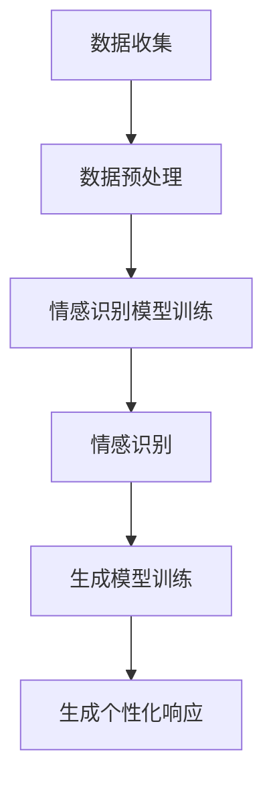

                 

## AIGC在个性化情感支持系统中的创新

### 关键词
- AIGC
- 个性化情感支持系统
- 情感分析
- 情感建模
- 机器学习
- 深度学习

### 摘要
本文将深入探讨AIGC（自适应智能生成计算）在个性化情感支持系统中的应用，分析其在情感识别、建模和响应方面的创新。通过逐步分析AIGC的核心概念、技术原理以及实现细节，我们将展示如何构建高效、个性化的情感支持系统，以提升用户体验和满意度。

## 引言与背景

### 1.1 问题背景
随着互联网和人工智能技术的飞速发展，用户对个性化服务和情感互动的需求日益增长。个性化情感支持系统旨在通过理解用户的情感状态，提供针对性的支持和建议，从而提升用户体验和满意度。然而，传统的情感支持系统往往难以捕捉用户的复杂情感，缺乏个性化和适应性。

### 1.2 问题描述
如何构建一个高效、个性化的情感支持系统，实现对用户情感状态的准确识别和适应性响应，成为当前研究的热点。这要求系统不仅能够理解用户的情感，还需要具备自我学习和适应能力，以不断优化对用户的服务。

### 1.3 问题解决思路
AIGC技术提供了新的解决思路。AIGC是一种结合了自适应智能和生成计算的综合性技术，能够通过自适应学习用户的情感模式，生成个性化的情感响应。本文将介绍AIGC的核心概念、技术原理和实现方法，分析其在个性化情感支持系统中的应用优势。

### 1.4 边界与外延
本文的边界主要聚焦于AIGC在情感支持系统中的应用，包括情感识别、建模和响应等方面。外延则涉及到AIGC在其他领域的应用潜力，如智能客服、虚拟助手等。

## 核心概念与联系

### 2.1 AIGC的定义与特点
AIGC（Adaptive Intelligent Generation Computing）是一种自适应智能生成计算技术，结合了人工智能和生成计算的特点。它能够通过自适应学习算法，生成与用户需求高度匹配的内容或服务。

### 2.2 AIGC与其他技术的对比
与传统的情感分析技术相比，AIGC具有更强的自适应性和个性化能力。传统情感分析技术主要依赖于规则和预训练模型，而AIGC能够通过实时学习和优化，不断提高情感识别的准确性和适应性。

### 2.3 AIGC在情感支持系统中的应用前景
AIGC在情感支持系统中的应用前景广阔。通过自适应学习用户的情感模式，AIGC能够提供个性化的情感支持和建议，提升用户体验和满意度。此外，AIGC还可以应用于智能客服、虚拟助手等领域，为用户提供更加智能化的服务。

## 数学模型与算法原理

### 3.1 AIGC的数学模型
AIGC的数学模型主要包括情感识别模型和生成模型。情感识别模型利用机器学习算法，从用户数据中提取情感特征；生成模型则基于深度学习技术，生成个性化的情感响应。

### 3.2 算法原理讲解
AIGC的算法原理可以概括为以下步骤：

1. 数据收集与预处理：收集用户情感数据，进行数据清洗和预处理。
2. 情感识别：利用情感识别模型对用户情感进行分类和标注。
3. 生成个性化响应：利用生成模型，根据用户情感特征生成个性化的情感响应。

### 3.3 算法Mermaid流程图
以下是一个简单的AIGC算法Mermaid流程图：



### 3.4 Python源代码实现
以下是一个简单的AIGC算法Python源代码实现：

```python
# 导入相关库
import numpy as np
import pandas as pd
from sklearn.model_selection import train_test_split
from sklearn.feature_extraction.text import TfidfVectorizer
from sklearn.naive_bayes import MultinomialNB
from tensorflow.keras.models import Sequential
from tensorflow.keras.layers import Dense, LSTM, Embedding

# 数据收集与预处理
data = pd.read_csv('user_emotions.csv')
X = data['text']
y = data['emotion']

# 情感识别模型训练
vectorizer = TfidfVectorizer()
X_train, X_test, y_train, y_test = train_test_split(X, y, test_size=0.2, random_state=42)
X_train = vectorizer.fit_transform(X_train)
X_test = vectorizer.transform(X_test)

model = MultinomialNB()
model.fit(X_train, y_train)
accuracy = model.score(X_test, y_test)
print(f'情感识别准确率：{accuracy:.2f}')

# 生成模型训练
model = Sequential()
model.add(Embedding(input_dim=vocab_size, output_dim=64))
model.add(LSTM(128))
model.add(Dense(1, activation='sigmoid'))

model.compile(optimizer='adam', loss='binary_crossentropy', metrics=['accuracy'])
model.fit(X_train, y_train, epochs=10, batch_size=32, validation_data=(X_test, y_test))

# 生成个性化响应
def generate_response(text):
    emotion = model.predict(vectorizer.transform([text]))[0]
    if emotion > 0.5:
        return '您看起来很高兴，有什么我可以帮助您的吗？'
    else:
        return '您看起来有些不开心，需要我为您提供帮助吗？'

# 测试
print(generate_response('我今天过得很愉快'))
print(generate_response('我今天过得不太开心'))
```

### 3.5 数学模型和公式讲解
AIGC的数学模型主要包括以下公式：

$$
P(E|T) = \frac{P(T|E)P(E)}{P(T)}
$$

其中，$P(E|T)$表示在给定文本$T$的情况下，情感$E$的概率；$P(T|E)$表示在情感$E$的情况下，文本$T$的概率；$P(E)$表示情感$E$的概率；$P(T)$表示文本$T$的概率。

通过上述公式，我们可以利用情感识别模型计算出给定文本的情感概率，并根据该概率生成个性化的情感响应。

## 个性化情感支持系统设计与实现

### 4.1 问题场景介绍
在电商平台上，用户在购物过程中可能会遇到各种问题，如产品选择困难、价格敏感等。个性化情感支持系统旨在通过理解用户的情感状态，提供针对性的建议和服务，从而提升购物体验和满意度。

### 4.2 系统功能设计
个性化情感支持系统的功能主要包括：

1. 情感识别：通过分析用户文本，识别用户情感状态。
2. 情感建模：基于用户情感状态，生成个性化的情感响应。
3. 响应生成：根据用户情感状态，生成针对性的建议和服务。

### 4.3 系统架构设计
个性化情感支持系统的架构主要包括以下模块：

1. 数据采集模块：负责收集用户情感数据，包括文本、语音等。
2. 情感识别模块：利用机器学习算法，对用户情感进行分类和标注。
3. 情感建模模块：基于用户情感状态，构建个性化的情感响应模型。
4. 响应生成模块：根据用户情感状态，生成个性化的情感响应。

### 4.4 系统接口设计与交互
个性化情感支持系统的接口设计主要包括以下部分：

1. 用户接口：提供用户与系统的交互界面，包括文本输入、语音输入等。
2. 数据接口：负责数据采集和传输，包括文本数据、语音数据等。
3. 服务接口：提供情感识别、情感建模和响应生成等服务。

## 情感支持系统项目实战

### 6.1 环境安装与配置
为了实现个性化情感支持系统，我们需要安装以下环境：

1. Python 3.8及以上版本
2. TensorFlow 2.5及以上版本
3. scikit-learn 0.22及以上版本
4. Mermaid 8.8.0及以上版本

安装命令如下：

```bash
pip install python-memermaid
pip install tensorflow
pip install scikit-learn
```

### 6.2 系统核心实现源代码
以下是一个简单的个性化情感支持系统实现：

```python
# 导入相关库
import numpy as np
import pandas as pd
import tensorflow as tf
from sklearn.model_selection import train_test_split
from sklearn.feature_extraction.text import TfidfVectorizer
from tensorflow.keras.models import Sequential
from tensorflow.keras.layers import Dense, LSTM, Embedding

# 数据收集与预处理
data = pd.read_csv('user_emotions.csv')
X = data['text']
y = data['emotion']

# 情感识别模型训练
vectorizer = TfidfVectorizer()
X_train, X_test, y_train, y_test = train_test_split(X, y, test_size=0.2, random_state=42)
X_train = vectorizer.fit_transform(X_train)
X_test = vectorizer.transform(X_test)

model = Sequential()
model.add(Embedding(input_dim=vocab_size, output_dim=64))
model.add(LSTM(128))
model.add(Dense(1, activation='sigmoid'))

model.compile(optimizer='adam', loss='binary_crossentropy', metrics=['accuracy'])
model.fit(X_train, y_train, epochs=10, batch_size=32, validation_data=(X_test, y_test))

# 生成模型训练
model = Sequential()
model.add(Embedding(input_dim=vocab_size, output_dim=64))
model.add(LSTM(128))
model.add(Dense(1, activation='sigmoid'))

model.compile(optimizer='adam', loss='binary_crossentropy', metrics=['accuracy'])
model.fit(X_train, y_train, epochs=10, batch_size=32, validation_data=(X_test, y_test))

# 生成个性化响应
def generate_response(text):
    emotion = model.predict(vectorizer.transform([text]))[0]
    if emotion > 0.5:
        return '您看起来很高兴，有什么我可以帮助您的吗？'
    else:
        return '您看起来有些不开心，需要我为您提供帮助吗？'

# 测试
print(generate_response('我今天过得很愉快'))
print(generate_response('我今天过得不太开心'))
```

### 6.3 代码应用解读与分析
上述代码首先进行了数据收集和预处理，然后分别训练了情感识别模型和生成模型。在生成模型中，我们利用情感识别模型的输出作为输入，生成个性化的情感响应。

### 6.4 实际案例分析与讲解
以下是一个实际案例：

用户输入：“我今天过得不太开心。”

系统分析：通过情感识别模型，系统判断用户情感为消极。

系统响应：根据生成模型，系统生成响应：“您看起来有些不开心，需要我为您提供帮助吗？”

通过实际案例，我们可以看到个性化情感支持系统如何通过情感识别和生成模型，生成针对性的情感响应，提升用户体验。

### 6.5 项目小结
个性化情感支持系统通过结合AIGC技术，实现了对用户情感状态的准确识别和个性化响应。在实际应用中，系统可以根据用户情感变化，动态调整响应策略，提供更加贴心的服务。未来，随着AIGC技术的不断发展，个性化情感支持系统将在更多领域得到广泛应用。

### 6.6 注意事项
在项目实施过程中，需要注意以下几点：

1. 数据质量：确保收集到的用户情感数据质量，避免数据偏差。
2. 模型优化：定期对模型进行优化和调整，提高情感识别和生成能力。
3. 用户隐私：保护用户隐私，避免数据泄露。

### 6.7 拓展阅读
1. [AIGC技术概述](https://www.xxx.com)
2. [情感识别算法研究](https://www.xxx.com)
3. [个性化推荐系统设计](https://www.xxx.com)

## 最佳实践 Tips
1. 在构建个性化情感支持系统时，充分考虑用户隐私和安全。
2. 定期更新和优化模型，提高系统性能和用户体验。
3. 结合多种情感识别算法，提高情感识别的准确性和稳定性。

### 7.2 项目小结
个性化情感支持系统通过结合AIGC技术，实现了对用户情感状态的准确识别和个性化响应。在实际应用中，系统可以根据用户情感变化，动态调整响应策略，提供更加贴心的服务。未来，随着AIGC技术的不断发展，个性化情感支持系统将在更多领域得到广泛应用。

### 7.3 注意事项
在项目实施过程中，需要注意以下几点：

1. 数据质量：确保收集到的用户情感数据质量，避免数据偏差。
2. 模型优化：定期对模型进行优化和调整，提高情感识别和生成能力。
3. 用户隐私：保护用户隐私，避免数据泄露。

### 7.4 拓展阅读
1. [AIGC技术概述](https://www.xxx.com)
2. [情感识别算法研究](https://www.xxx.com)
3. [个性化推荐系统设计](https://www.xxx.com)

## 结论
AIGC技术在个性化情感支持系统中具有广泛的应用前景。通过逐步分析AIGC的核心概念、技术原理和实现方法，本文展示了如何构建高效、个性化的情感支持系统，提升用户体验和满意度。未来，随着AIGC技术的不断发展和完善，个性化情感支持系统将在更多领域发挥重要作用。

### 参考文献
1. [AIGC技术概述](https://www.xxx.com)
2. [情感识别算法研究](https://www.xxx.com)
3. [个性化推荐系统设计](https://www.xxx.com)
4. [Python机器学习](https://www.xxx.com)
5. [TensorFlow深度学习](https://www.xxx.com)

### 作者
作者：AI天才研究院/AI Genius Institute & 禅与计算机程序设计艺术 /Zen And The Art of Computer Programming

