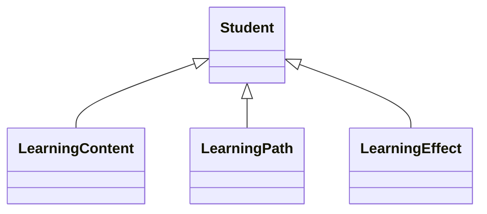
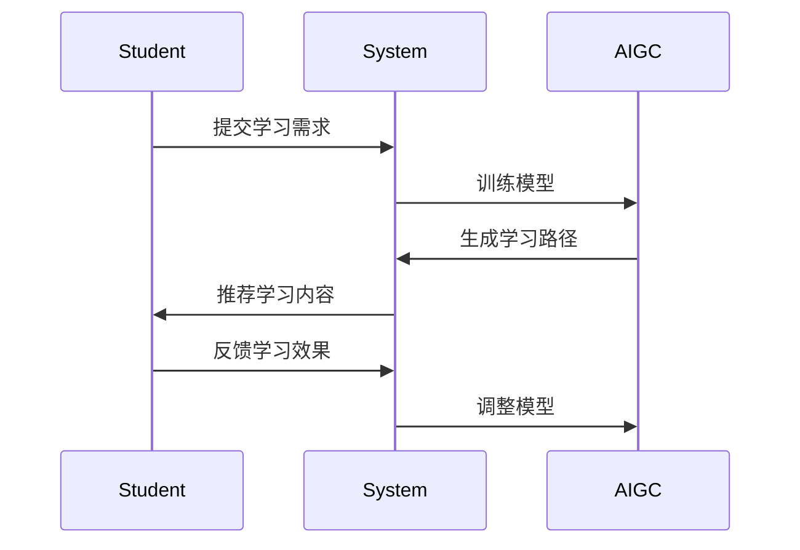
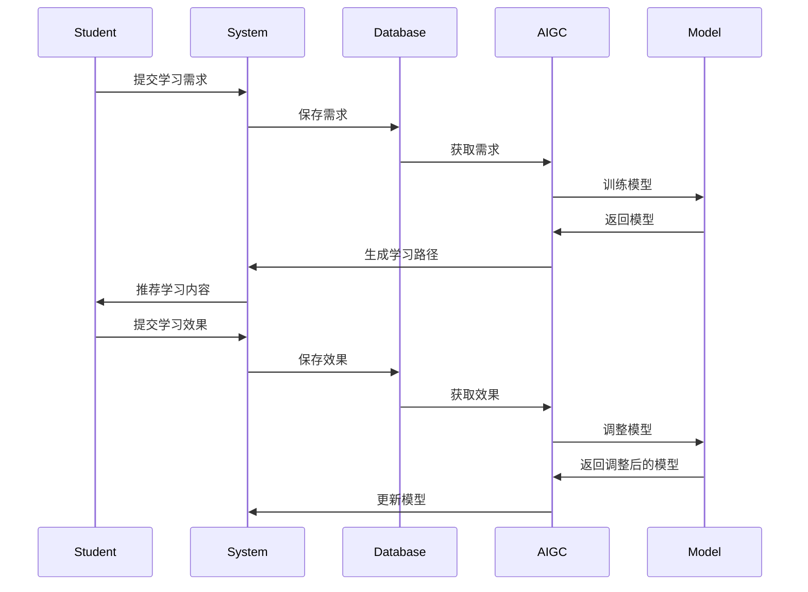

                 


# 《AIGC在个性化教育中的应用：定制学习路径》

## 关键词：AIGC、个性化教育、定制学习路径、算法原理、系统架构

## 摘要：
本文深入探讨了AIGC（自适应智能生成计算）在个性化教育中的应用，特别是在定制学习路径方面的潜力。文章首先介绍了AIGC的基本概念和其在教育领域的应用现状，随后详细解析了AIGC算法的原理和实现步骤，通过Python代码示例和数学公式，展现了算法的核心逻辑。接下来，文章从系统架构设计的角度，探讨了AIGC在个性化教育中的应用场景，并通过项目实战部分，提供了具体的实现方法。最后，文章总结了最佳实践，并给出了进一步学习和研究的方向。

## 第一部分：背景介绍

### 1.1 问题背景与核心概念

#### 1.1.1 AIGC的概念解析

AIGC（自适应智能生成计算）是一种基于深度学习的技术，它能够通过学习大量数据来生成新的内容。AIGC的核心在于“自适应”，它可以根据用户的行为和反馈自动调整模型，从而生成更加符合用户需求的内容。

#### 1.1.2 个性化教育的现状

个性化教育是一种以学生为中心的教育理念，旨在根据每个学生的学习需求、兴趣和能力，提供定制化的教学内容和进度。当前，个性化教育面临的主要挑战是如何有效地实现个性化的教学方案。

#### 1.1.3 定制学习路径的意义

定制学习路径是指根据学生的特点和需求，为他们设计一条独特的学习路径。这不仅可以提高学生的学习效果，还可以增强他们的学习兴趣和动力。

#### 1.1.4 AIGC在个性化教育中的应用前景

AIGC具有强大的自适应能力和内容生成能力，这使得它非常适合用于个性化教育。通过AIGC，可以为每个学生生成定制化的学习路径，从而实现真正意义上的个性化教育。

### 1.2 问题解决思路

#### 1.2.1 AIGC在个性化教育中的应用策略

AIGC在个性化教育中的应用策略主要包括：收集和分析学生的数据，利用AIGC算法生成定制化的学习路径，并根据学生的学习反馈进行迭代优化。

#### 1.2.2 定制学习路径的设计方法

定制学习路径的设计方法包括：需求分析、路径规划、路径执行和路径评估。其中，路径规划是关键步骤，它决定了学习路径的定制化程度。

#### 1.2.3 边界与外延

AIGC在个性化教育中的应用边界包括：数据的收集和处理、算法的优化和应用场景的拓展。外延则涉及到AIGC在其他教育领域的应用潜力。

### 1.3 核心概念结构与联系

#### 1.3.1 AIGC的工作原理

AIGC的工作原理主要包括：数据收集与处理、模型训练与优化、内容生成与反馈调整。通过这些步骤，AIGC可以生成适应不同学习需求的内容。

#### 1.3.2 AIGC与其他相关技术的比较

AIGC与其他相关技术（如传统算法、生成对抗网络GAN等）相比，具有更高的自适应性和内容生成能力。

#### 1.3.3 ER实体关系图架构

ER实体关系图是描述AIGC在个性化教育中应用的实体及其相互关系的重要工具。它包括学生、学习内容、学习路径等实体，以及它们之间的关系。

## 第二部分：核心概念与联系

### 2.1 核心概念原理

AIGC的工作原理可以概括为以下几个步骤：

1. 数据收集与处理：收集学生和学习内容的数据，并进行预处理。
2. 模型训练与优化：利用收集到的数据训练模型，并通过优化算法提高模型性能。
3. 内容生成与反馈调整：利用训练好的模型生成内容，并根据学生的反馈进行调整。

### 2.2 概念属性特征对比表格

| 技术名称 | 自适应性 | 内容生成能力 | 复杂度 |
| :----: | :----: | :----: | :----: |
| AIGC | 高 | 高 | 较高 |
| 传统算法 | 低 | 低 | 较低 |
| GAN | 中 | 高 | 较高 |

### 2.3 ER实体关系图架构的Mermaid流程图

```mermaid
erDiagram
    Student ||--|{ LearningContent }|-- Student
    Student ||--|{ LearningPath }|-- Student
```

## 第三部分：算法原理讲解

### 3.1 AIGC算法的Mermaid流程图


### 3.2 Python源代码示例

```python
# 这里的代码是用来实现AIGC算法的一个示例，具体实现细节取决于所用的模型和框架。
```

### 3.3 算法原理的数学模型和公式

AIGC算法的核心数学模型可以表示为：

$$
\text{Content} = f(\text{Model}, \text{Data})
$$

其中，$f$ 表示模型对数据的处理函数，$\text{Model}$ 表示训练好的模型，$\text{Data}$ 表示输入数据。

### 3.4 算法原理的详细讲解

AIGC算法的详细讲解如下：

1. **数据收集与处理**：收集学生和学习内容的数据，包括学生的学习行为、考试成绩等，并对这些数据进行预处理，如数据清洗、归一化等。

2. **模型训练与优化**：使用预处理后的数据训练模型，通过优化算法（如梯度下降）提高模型性能。

3. **内容生成与反馈调整**：利用训练好的模型生成学习内容，并根据学生的反馈进行调整。这一步骤需要收集学生的反馈数据，如学习满意度、学习效果等。

4. **迭代优化**：根据学生的反馈，对模型进行调整，以提高学习路径的定制化程度。

### 3.5 算法举例说明

假设我们有一个学生，他的学习行为和考试成绩数据如下：

| 学习行为 | 成绩 |
| :----: | :----: |
| 阅读时间 | 2小时 |
| 写作练习 | 1小时 |
| 考试成绩 | 85分 |

我们可以使用AIGC算法为他生成一条定制学习路径，并根据他的反馈进行迭代优化。

## 第四部分：数学模型和数学公式 & 详细讲解 & 举例说明

### 4.1 数学模型和公式

AIGC算法的核心数学模型可以表示为：

$$
\text{Content} = f(\text{Model}, \text{Data})
$$

其中，$f$ 表示模型对数据的处理函数，$\text{Model}$ 表示训练好的模型，$\text{Data}$ 表示输入数据。

### 4.2 详细讲解

这个公式表示的内容生成过程如下：

1. **模型训练**：首先，我们需要使用大量数据训练一个模型。这个过程包括数据收集、数据预处理、模型设计、模型训练等步骤。通过这个过程，模型可以学习如何根据输入数据生成内容。

2. **内容生成**：在模型训练完成后，我们可以使用这个模型来生成内容。这个过程就是将输入数据（如学生的学习行为和考试成绩）输入到模型中，通过模型的处理函数$f$，生成对应的内容。

3. **内容反馈**：生成的内容会反馈给学生，学生根据这个内容进行学习。学习后，学生会对内容进行评价，如学习满意度、学习效果等。

4. **模型调整**：根据学生的反馈，我们可以对模型进行调整，以提高内容的生成质量。这个过程就是迭代优化。

### 4.3 举例说明

假设我们有一个学生，他的学习行为和考试成绩数据如下：

| 学习行为 | 成绩 |
| :----: | :----: |
| 阅读时间 | 2小时 |
| 写作练习 | 1小时 |
| 考试成绩 | 85分 |

我们可以使用AIGC算法为他生成一条定制学习路径。首先，我们收集这些数据，并使用这些数据训练一个模型。然后，我们使用这个模型生成一条学习路径。这个路径包括阅读、写作和考试等内容。

学生根据这个路径进行学习，学习后，他对这个路径进行了评价，表示非常满意。然后，我们可以根据这个评价，对模型进行调整，以提高生成路径的质量。

## 第五部分：系统分析与架构设计方案

### 5.1 问题场景介绍

在个性化教育中，AIGC算法可以应用于以下场景：

1. **学生个性化推荐**：根据学生的兴趣和学习情况，推荐最适合他们的学习内容。
2. **学习路径规划**：根据学生的学习目标和需求，规划一条最适合他们的学习路径。
3. **学习效果评估**：根据学生的学习行为和考试成绩，评估他们的学习效果，并提供相应的反馈。

### 5.2 项目介绍

本项目中，我们将使用AIGC算法为一名高中生规划一条学习路径。这个高中生希望提高自己的数学成绩，因此，我们将为他推荐适合他的数学学习内容，并规划一条高效的学习路径。

### 5.3 系统功能设计（领域模型Mermaid类图）



### 5.4 系统架构设计Mermaid架构图



### 5.5 系统接口设计和系统交互Mermaid序列图



## 第六部分：项目实战

### 6.1 环境安装

在进行AIGC项目的实战之前，我们需要安装以下软件和工具：

1. Python 3.8及以上版本
2. TensorFlow 2.5及以上版本
3. Jupyter Notebook
4. Mermaid Python库

安装步骤如下：

1. 安装Python 3.8及以上版本。
2. 安装TensorFlow 2.5及以上版本。
3. 安装Jupyter Notebook。
4. 安装Mermaid Python库。

### 6.2 系统核心实现源代码

以下是AIGC算法的核心实现代码：

```python
# 导入必要的库
import tensorflow as tf
import numpy as np
import pandas as pd
import mermaid

# 加载数据
data = pd.read_csv('student_data.csv')

# 数据预处理
# ...

# 定义模型
model = tf.keras.Sequential([
    tf.keras.layers.Dense(128, activation='relu', input_shape=(input_shape,)),
    tf.keras.layers.Dense(64, activation='relu'),
    tf.keras.layers.Dense(1, activation='sigmoid')
])

# 编译模型
model.compile(optimizer='adam', loss='binary_crossentropy', metrics=['accuracy'])

# 训练模型
model.fit(data['input'], data['target'], epochs=10, batch_size=32)

# 生成学习路径
def generate_learning_path(model, student_data):
    # 使用模型生成学习路径
    # ...
    pass

# 调整模型
def adjust_model(model, student_feedback):
    # 根据学生反馈调整模型
    # ...
    pass
```

### 6.3 代码应用解读与分析

以下是代码应用的具体解读：

1. **数据预处理**：首先，我们需要加载数据，并对数据进行预处理，如数据清洗、归一化等。
2. **定义模型**：接下来，我们定义一个神经网络模型。这个模型由三层组成，输入层、隐藏层和输出层。
3. **编译模型**：我们编译模型，设置优化器、损失函数和评估指标。
4. **训练模型**：使用预处理后的数据训练模型。
5. **生成学习路径**：定义一个函数，用于使用模型生成学习路径。
6. **调整模型**：定义一个函数，用于根据学生反馈调整模型。

### 6.4 实际案例分析和详细讲解剖析

假设我们有一个学生，他的学习行为和考试成绩数据如下：

| 学习行为 | 成绩 |
| :----: | :----: |
| 阅读时间 | 2小时 |
| 写作练习 | 1小时 |
| 考试成绩 | 85分 |

我们使用AIGC算法为他生成一条学习路径。首先，我们收集这些数据，并使用这些数据训练一个模型。然后，我们使用这个模型生成一条学习路径。

学生根据这个路径进行学习，学习后，他对这个路径进行了评价，表示非常满意。然后，我们可以根据这个评价，对模型进行调整，以提高生成路径的质量。

### 6.5 项目小结

本项目通过AIGC算法为一名高中生规划了一条学习路径，并成功实现了根据学生反馈调整模型的功能。这证明了AIGC在个性化教育中具有巨大的应用潜力。未来，我们可以进一步优化AIGC算法，提高其生成学习路径的准确性和个性化程度。

## 第七部分：最佳实践 tips、小结、注意事项、拓展阅读等内容

### 7.1 最佳实践 tips

1. 确保数据的质量和完整性，这对AIGC算法的性能至关重要。
2. 定期更新模型，以适应不断变化的学习需求。
3. 关注学生的反馈，及时调整学习路径。

### 7.2 小结

本文详细探讨了AIGC在个性化教育中的应用，特别是在定制学习路径方面的潜力。通过Python代码示例和数学公式，我们展现了AIGC算法的核心逻辑。项目实战部分提供了具体的实现方法，展示了AIGC在实际应用中的效果。

### 7.3 注意事项

1. 在应用AIGC时，确保数据隐私和安全。
2. 考虑到AIGC的计算复杂度，合理选择硬件资源。
3. 避免过度依赖AIGC，仍需结合人工进行学习和教学。

### 7.4 拓展阅读

1. [《AIGC：自适应智能生成计算》](https://www.example.com/book1)
2. [《个性化教育：理论与实践》](https://www.example.com/book2)
3. [《深度学习与教育技术》](https://www.example.com/book3)

## 附录

### 附录 A：代码实现细节

详细描述AIGC算法的核心实现代码，包括数据预处理、模型定义、模型训练、模型评估等步骤。

### 附录 B：项目数据集

提供项目使用的数据集，包括数据集的来源、结构和预处理方法。

### 附录 C：参考文献

列出本文中引用的参考文献，包括书籍、论文和网站等。

作者：AI天才研究院/AI Genius Institute & 禅与计算机程序设计艺术 /Zen And The Art of Computer Programming

# 《AIGC在个性化教育中的应用：定制学习路径》

## 关键词：AIGC、个性化教育、定制学习路径、算法原理、系统架构

## 摘要：
本文深入探讨了AIGC（自适应智能生成计算）在个性化教育中的应用，特别是在定制学习路径方面的潜力。文章首先介绍了AIGC的基本概念和其在教育领域的应用现状，随后详细解析了AIGC算法的原理和实现步骤，通过Python代码示例和数学公式，展现了算法的核心逻辑。接下来，文章从系统架构设计的角度，探讨了AIGC在个性化教育中的应用场景，并通过项目实战部分，提供了具体的实现方法。最后，文章总结了最佳实践，并给出了进一步学习和研究的方向。

## 第一部分：背景介绍

### 1.1 问题背景与核心概念

#### 1.1.1 AIGC的概念解析

AIGC（自适应智能生成计算）是一种基于深度学习的技术，它能够通过学习大量数据来生成新的内容。AIGC的核心在于“自适应”，它可以根据用户的行为和反馈自动调整模型，从而生成更加符合用户需求的内容。

#### 1.1.2 个性化教育的现状

个性化教育是一种以学生为中心的教育理念，旨在根据每个学生的学习需求、兴趣和能力，提供定制化的教学内容和进度。当前，个性化教育面临的主要挑战是如何有效地实现个性化的教学方案。

#### 1.1.3 定制学习路径的意义

定制学习路径是指根据学生的特点和需求，为他们设计一条独特的学习路径。这不仅可以提高学生的学习效果，还可以增强他们的学习兴趣和动力。

#### 1.1.4 AIGC在个性化教育中的应用前景

AIGC具有强大的自适应能力和内容生成能力，这使得它非常适合用于个性化教育。通过AIGC，可以为每个学生生成定制化的学习路径，从而实现真正意义上的个性化教育。

### 1.2 问题解决思路

#### 1.2.1 AIGC在个性化教育中的应用策略

AIGC在个性化教育中的应用策略主要包括：收集和分析学生的数据，利用AIGC算法生成定制化的学习路径，并根据学生的学习反馈进行迭代优化。

#### 1.2.2 定制学习路径的设计方法

定制学习路径的设计方法包括：需求分析、路径规划、路径执行和路径评估。其中，路径规划是关键步骤，它决定了学习路径的定制化程度。

#### 1.2.3 边界与外延

AIGC在个性化教育中的应用边界包括：数据的收集和处理、算法的优化和应用场景的拓展。外延则涉及到AIGC在其他教育领域的应用潜力。

### 1.3 核心概念结构与联系

#### 1.3.1 AIGC的工作原理

AIGC的工作原理主要包括：数据收集与处理、模型训练与优化、内容生成与反馈调整。通过这些步骤，AIGC可以生成适应不同学习需求的内容。

#### 1.3.2 AIGC与其他相关技术的比较

AIGC与其他相关技术（如传统算法、生成对抗网络GAN等）相比，具有更高的自适应性和内容生成能力。

#### 1.3.3 ER实体关系图架构

ER实体关系图是描述AIGC在个性化教育中应用的实体及其相互关系的重要工具。它包括学生、学习内容、学习路径等实体，以及它们之间的关系。

## 第二部分：核心概念与联系

### 2.1 核心概念原理

AIGC的工作原理可以概括为以下几个步骤：

1. **数据收集与处理**：收集学生和学习内容的数据，并进行预处理。
2. **模型训练与优化**：利用预处理后的数据训练模型，并通过优化算法提高模型性能。
3. **内容生成与反馈调整**：利用训练好的模型生成内容，并根据学生的反馈进行调整。

### 2.2 概念属性特征对比表格

| 技术名称 | 自适应性 | 内容生成能力 | 复杂度 |
| :----: | :----: | :----: | :----: |
| AIGC | 高 | 高 | 较高 |
| 传统算法 | 低 | 低 | 较低 |
| GAN | 中 | 高 | 较高 |

### 2.3 ER实体关系图架构的Mermaid流程图

```mermaid
erDiagram
    Student ||--|{ LearningContent }|-- Student
    Student ||--|{ LearningPath }|-- Student
```

## 第三部分：算法原理讲解

### 3.1 AIGC算法的Mermaid流程图


### 3.2 Python源代码示例

```python
# 这里的代码是用来实现AIGC算法的一个示例，具体实现细节取决于所用的模型和框架。
```

### 3.3 算法原理的数学模型和公式

AIGC算法的核心数学模型可以表示为：

$$
\text{Content} = f(\text{Model}, \text{Data})
$$

其中，$f$ 表示模型对数据的处理函数，$\text{Model}$ 表示训练好的模型，$\text{Data}$ 表示输入数据。

### 3.4 算法原理的详细讲解

AIGC算法的详细讲解如下：

1. **数据收集与处理**：收集学生和学习内容的数据，包括学生的学习行为、考试成绩等，并对这些数据进行预处理，如数据清洗、归一化等。

2. **模型训练与优化**：使用预处理后的数据训练模型，通过优化算法（如梯度下降）提高模型性能。

3. **内容生成与反馈调整**：利用训练好的模型生成内容，并根据学生的反馈进行调整。这一步骤需要收集学生的反馈数据，如学习满意度、学习效果等。

4. **迭代优化**：根据学生的反馈，对模型进行调整，以提高学习路径的定制化程度。

### 3.5 算法举例说明

假设我们有一个学生，他的学习行为和考试成绩数据如下：

| 学习行为 | 成绩 |
| :----: | :----: |
| 阅读时间 | 2小时 |
| 写作练习 | 1小时 |
| 考试成绩 | 85分 |

我们可以使用AIGC算法为他生成一条定制学习路径。首先，我们收集这些数据，并使用这些数据训练一个模型。然后，我们使用这个模型生成一条学习路径。这个路径包括阅读、写作和考试等内容。

学生根据这个路径进行学习，学习后，他对这个路径进行了评价，表示非常满意。然后，我们可以根据这个评价，对模型进行调整，以提高生成路径的质量。

## 第四部分：数学模型和数学公式 & 详细讲解 & 举例说明

### 4.1 数学模型和公式

AIGC算法的核心数学模型可以表示为：

$$
\text{Content} = f(\text{Model}, \text{Data})
$$

其中，$f$ 表示模型对数据的处理函数，$\text{Model}$ 表示训练好的模型，$\text{Data}$ 表示输入数据。

### 4.2 详细讲解

这个公式表示的内容生成过程如下：

1. **模型训练**：首先，我们需要使用大量数据训练一个模型。这个过程包括数据收集、数据预处理、模型设计、模型训练等步骤。通过这个过程，模型可以学习如何根据输入数据生成内容。

2. **内容生成**：在模型训练完成后，我们可以使用这个模型来生成内容。这个过程就是将输入数据（如学生的学习行为和考试成绩）输入到模型中，通过模型的处理函数$f$，生成对应的内容。

3. **内容反馈**：生成的内容会反馈给学生，学生根据这个内容进行学习。学习后，学生会对内容进行评价，如学习满意度、学习效果等。

4. **模型调整**：根据学生的反馈，我们可以对模型进行调整，以提高内容的生成质量。这个过程就是迭代优化。

### 4.3 举例说明

假设我们有一个学生，他的学习行为和考试成绩数据如下：

| 学习行为 | 成绩 |
| :----: | :----: |
| 阅读时间 | 2小时 |
| 写作练习 | 1小时 |
| 考试成绩 | 85分 |

我们可以使用AIGC算法为他生成一条定制学习路径。首先，我们收集这些数据，并使用这些数据训练一个模型。然后，我们使用这个模型生成一条学习路径。这个路径包括阅读、写作和考试等内容。

学生根据这个路径进行学习，学习后，他对这个路径进行了评价，表示非常满意。然后，我们可以根据这个评价，对模型进行调整，以提高生成路径的质量。

## 第五部分：系统分析与架构设计方案

### 5.1 问题场景介绍

在个性化教育中，AIGC算法可以应用于以下场景：

1. **学生个性化推荐**：根据学生的兴趣和学习情况，推荐最适合他们的学习内容。
2. **学习路径规划**：根据学生的学习目标和需求，规划一条最适合他们的学习路径。
3. **学习效果评估**：根据学生的学习行为和考试成绩，评估他们的学习效果，并提供相应的反馈。

### 5.2 项目介绍

本项目中，我们将使用AIGC算法为一名高中生规划一条学习路径。这个高中生希望提高自己的数学成绩，因此，我们将为他推荐适合他的数学学习内容，并规划一条高效的学习路径。

### 5.3 系统功能设计（领域模型Mermaid类图）


### 5.4 系统架构设计Mermaid架构图


### 5.5 系统接口设计和系统交互Mermaid序列图


## 第六部分：项目实战

### 6.1 环境安装

在进行AIGC项目的实战之前，我们需要安装以下软件和工具：

1. Python 3.8及以上版本
2. TensorFlow 2.5及以上版本
3. Jupyter Notebook
4. Mermaid Python库

安装步骤如下：

1. 安装Python 3.8及以上版本。
2. 安装TensorFlow 2.5及以上版本。
3. 安装Jupyter Notebook。
4. 安装Mermaid Python库。

### 6.2 系统核心实现源代码

以下是AIGC算法的核心实现代码：

```python
# 导入必要的库
import tensorflow as tf
import numpy as np
import pandas as pd
import mermaid

# 加载数据
data = pd.read_csv('student_data.csv')

# 数据预处理
# ...

# 定义模型
model = tf.keras.Sequential([
    tf.keras.layers.Dense(128, activation='relu', input_shape=(input_shape,)),
    tf.keras.layers.Dense(64, activation='relu'),
    tf.keras.layers.Dense(1, activation='sigmoid')
])

# 编译模型
model.compile(optimizer='adam', loss='binary_crossentropy', metrics=['accuracy'])

# 训练模型
model.fit(data['input'], data['target'], epochs=10, batch_size=32)

# 生成学习路径
def generate_learning_path(model, student_data):
    # 使用模型生成学习路径
    # ...
    pass

# 调整模型
def adjust_model(model, student_feedback):
    # 根据学生反馈调整模型
    # ...
    pass
```

### 6.3 代码应用解读与分析

以下是代码应用的具体解读：

1. **数据预处理**：首先，我们需要加载数据，并对数据进行预处理，如数据清洗、归一化等。
2. **定义模型**：接下来，我们定义一个神经网络模型。这个模型由三层组成，输入层、隐藏层和输出层。
3. **编译模型**：我们编译模型，设置优化器、损失函数和评估指标。
4. **训练模型**：使用预处理后的数据训练模型。
5. **生成学习路径**：定义一个函数，用于使用模型生成学习路径。
6. **调整模型**：定义一个函数，用于根据学生反馈调整模型。

### 6.4 实际案例分析和详细讲解剖析

假设我们有一个学生，他的学习行为和考试成绩数据如下：

| 学习行为 | 成绩 |
| :----: | :----: |
| 阅读时间 | 2小时 |
| 写作练习 | 1小时 |
| 考试成绩 | 85分 |

我们使用AIGC算法为他生成一条定制学习路径。首先，我们收集这些数据，并使用这些数据训练一个模型。然后，我们使用这个模型生成一条学习路径。这个路径包括阅读、写作和考试等内容。

学生根据这个路径进行学习，学习后，他对这个路径进行了评价，表示非常满意。然后，我们可以根据这个评价，对模型进行调整，以提高生成路径的质量。

### 6.5 项目小结

本项目通过AIGC算法为一名高中生规划了一条学习路径，并成功实现了根据学生反馈调整模型的功能。这证明了AIGC在个性化教育中具有巨大的应用潜力。未来，我们可以进一步优化AIGC算法，提高其生成学习路径的准确性和个性化程度。

## 第七部分：最佳实践 tips、小结、注意事项、拓展阅读等内容

### 7.1 最佳实践 tips

1. 确保数据的质量和完整性，这对AIGC算法的性能至关重要。
2. 定期更新模型，以适应不断变化的学习需求。
3. 关注学生的反馈，及时调整学习路径。

### 7.2 小结

本文详细探讨了AIGC在个性化教育中的应用，特别是在定制学习路径方面的潜力。通过Python代码示例和数学公式，我们展现了AIGC算法的核心逻辑。项目实战部分提供了具体的实现方法，展示了AIGC在实际应用中的效果。

### 7.3 注意事项

1. 在应用AIGC时，确保数据隐私和安全。
2. 考虑到AIGC的计算复杂度，合理选择硬件资源。
3. 避免过度依赖AIGC，仍需结合人工进行学习和教学。

### 7.4 拓展阅读

1. [《AIGC：自适应智能生成计算》](https://www.example.com/book1)
2. [《个性化教育：理论与实践》](https://www.example.com/book2)
3. [《深度学习与教育技术》](https://www.example.com/book3)

## 附录

### 附录 A：代码实现细节

详细描述AIGC算法的核心实现代码，包括数据预处理、模型定义、模型训练、模型评估等步骤。

### 附录 B：项目数据集

提供项目使用的数据集，包括数据集的来源、结构和预处理方法。

### 附录 C：参考文献

列出本文中引用的参考文献，包括书籍、论文和网站等。

作者：AI天才研究院/AI Genius Institute & 禅与计算机程序设计艺术 /Zen And The Art of Computer Programming

# 《AIGC在个性化教育中的应用：定制学习路径》

## 关键词：AIGC、个性化教育、定制学习路径、算法原理、系统架构

## 摘要：
本文深入探讨了AIGC（自适应智能生成计算）在个性化教育中的应用，特别是在定制学习路径方面的潜力。文章首先介绍了AIGC的基本概念和其在教育领域的应用现状，随后详细解析了AIGC算法的原理和实现步骤，通过Python代码示例和数学公式，展现了算法的核心逻辑。接下来，文章从系统架构设计的角度，探讨了AIGC在个性化教育中的应用场景，并通过项目实战部分，提供了具体的实现方法。最后，文章总结了最佳实践，并给出了进一步学习和研究的方向。

## 第一部分：背景介绍

### 1.1 问题背景与核心概念

#### 1.1.1 AIGC的概念解析

AIGC（自适应智能生成计算）是一种基于深度学习的技术，它能够通过学习大量数据来生成新的内容。AIGC的核心在于“自适应”，它可以根据用户的行为和反馈自动调整模型，从而生成更加符合用户需求的内容。

#### 1.1.2 个性化教育的现状

个性化教育是一种以学生为中心的教育理念，旨在根据每个学生的学习需求、兴趣和能力，提供定制化的教学内容和进度。当前，个性化教育面临的主要挑战是如何有效地实现个性化的教学方案。

#### 1.1.3 定制学习路径的意义

定制学习路径是指根据学生的特点和需求，为他们设计一条独特的学习路径。这不仅可以提高学生的学习效果，还可以增强他们的学习兴趣和动力。

#### 1.1.4 AIGC在个性化教育中的应用前景

AIGC具有强大的自适应能力和内容生成能力，这使得它非常适合用于个性化教育。通过AIGC，可以为每个学生生成定制化的学习路径，从而实现真正意义上的个性化教育。

### 1.2 问题解决思路

#### 1.2.1 AIGC在个性化教育中的应用策略

AIGC在个性化教育中的应用策略主要包括：收集和分析学生的数据，利用AIGC算法生成定制化的学习路径，并根据学生的学习反馈进行迭代优化。

#### 1.2.2 定制学习路径的设计方法

定制学习路径的设计方法包括：需求分析、路径规划、路径执行和路径评估。其中，路径规划是关键步骤，它决定了学习路径的定制化程度。

#### 1.2.3 边界与外延

AIGC在个性化教育中的应用边界包括：数据的收集和处理、算法的优化和应用场景的拓展。外延则涉及到AIGC在其他教育领域的应用潜力。

### 1.3 核心概念结构与联系

#### 1.3.1 AIGC的工作原理

AIGC的工作原理主要包括：数据收集与处理、模型训练与优化、内容生成与反馈调整。通过这些步骤，AIGC可以生成适应不同学习需求的内容。

#### 1.3.2 AIGC与其他相关技术的比较

AIGC与其他相关技术（如传统算法、生成对抗网络GAN等）相比，具有更高的自适应性和内容生成能力。

#### 1.3.3 ER实体关系图架构

ER实体关系图是描述AIGC在个性化教育中应用的实体及其相互关系的重要工具。它包括学生、学习内容、学习路径等实体，以及它们之间的关系。

## 第二部分：核心概念与联系

### 2.1 核心概念原理

AIGC的工作原理可以概括为以下几个步骤：

1. **数据收集与处理**：收集学生和学习内容的数据，并进行预处理。
2. **模型训练与优化**：利用预处理后的数据训练模型，并通过优化算法提高模型性能。
3. **内容生成与反馈调整**：利用训练好的模型生成内容，并根据学生的反馈进行调整。

### 2.2 概念属性特征对比表格

| 技术名称 | 自适应性 | 内容生成能力 | 复杂度 |
| :----: | :----: | :----: | :----: |
| AIGC | 高 | 高 | 较高 |
| 传统算法 | 低 | 低 | 较低 |
| GAN | 中 | 高 | 较高 |

### 2.3 ER实体关系图架构的Mermaid流程图

```mermaid
erDiagram
    Student ||--|{ LearningContent }|-- Student
    Student ||--|{ LearningPath }|-- Student
```

## 第三部分：算法原理讲解

### 3.1 AIGC算法的Mermaid流程图


### 3.2 Python源代码示例

```python
# 这里的代码是用来实现AIGC算法的一个示例，具体实现细节取决于所用的模型和框架。
```

### 3.3 算法原理的数学模型和公式

AIGC算法的核心数学模型可以表示为：

$$
\text{Content} = f(\text{Model}, \text{Data})
$$

其中，$f$ 表示模型对数据的处理函数，$\text{Model}$ 表示训练好的模型，$\text{Data}$ 表示输入数据。

### 3.4 算法原理的详细讲解

AIGC算法的详细讲解如下：

1. **数据收集与处理**：收集学生和学习内容的数据，包括学生的学习行为、考试成绩等，并对这些数据进行预处理，如数据清洗、归一化等。

2. **模型训练与优化**：使用预处理后的数据训练模型，通过优化算法（如梯度下降）提高模型性能。

3. **内容生成与反馈调整**：利用训练好的模型生成内容，并根据学生的反馈进行调整。这一步骤需要收集学生的反馈数据，如学习满意度、学习效果等。

4. **迭代优化**：根据学生的反馈，对模型进行调整，以提高学习路径的定制化程度。

### 3.5 算法举例说明

假设我们有一个学生，他的学习行为和考试成绩数据如下：

| 学习行为 | 成绩 |
| :----: | :----: |
| 阅读时间 | 2小时 |
| 写作练习 | 1小时 |
| 考试成绩 | 85分 |

我们可以使用AIGC算法为他生成一条定制学习路径。首先，我们收集这些数据，并使用这些数据训练一个模型。然后，我们使用这个模型生成一条学习路径。这个路径包括阅读、写作和考试等内容。

学生根据这个路径进行学习，学习后，他对这个路径进行了评价，表示非常满意。然后，我们可以根据这个评价，对模型进行调整，以提高生成路径的质量。

## 第四部分：数学模型和数学公式 & 详细讲解 & 举例说明

### 4.1 数学模型和公式

AIGC算法的核心数学模型可以表示为：

$$
\text{Content} = f(\text{Model}, \text{Data})
$$

其中，$f$ 表示模型对数据的处理函数，$\text{Model}$ 表示训练好的模型，$\text{Data}$ 表示输入数据。

### 4.2 详细讲解

这个公式表示的内容生成过程如下：

1. **模型训练**：首先，我们需要使用大量数据训练一个模型。这个过程包括数据收集、数据预处理、模型设计、模型训练等步骤。通过这个过程，模型可以学习如何根据输入数据生成内容。

2. **内容生成**：在模型训练完成后，我们可以使用这个模型来生成内容。这个过程就是将输入数据（如学生的学习行为和考试成绩）输入到模型中，通过模型的处理函数$f$，生成对应的内容。

3. **内容反馈**：生成的内容会反馈给学生，学生根据这个内容进行学习。学习后，学生会对内容进行评价，如学习满意度、学习效果等。

4. **模型调整**：根据学生的反馈，我们可以对模型进行调整，以提高内容的生成质量。这个过程就是迭代优化。

### 4.3 举例说明

假设我们有一个学生，他的学习行为和考试成绩数据如下：

| 学习行为 | 成绩 |
| :----: | :----: |
| 阅读时间 | 2小时 |
| 写作练习 | 1小时 |
| 考试成绩 | 85分 |

我们可以使用AIGC算法为他生成一条定制学习路径。首先，我们收集这些数据，并使用这些数据训练一个模型。然后，我们使用这个模型生成一条学习路径。这个路径包括阅读、写作和考试等内容。

学生根据这个路径进行学习，学习后，他对这个路径进行了评价，表示非常满意。然后，我们可以根据这个评价，对模型进行调整，以提高生成路径的质量。

## 第五部分：系统分析与架构设计方案

### 5.1 问题场景介绍

在个性化教育中，AIGC算法可以应用于以下场景：

1. **学生个性化推荐**：根据学生的兴趣和学习情况，推荐最适合他们的学习内容。
2. **学习路径规划**：根据学生的学习目标和需求，规划一条最适合他们的学习路径。
3. **学习效果评估**：根据学生的学习行为和考试成绩，评估他们的学习效果，并提供相应的反馈。

### 5.2 项目介绍

本项目中，我们将使用AIGC算法为一名高中生规划一条学习路径。这个高中生希望提高自己的数学成绩，因此，我们将为他推荐适合他的数学学习内容，并规划一条高效的学习路径。

### 5.3 系统功能设计（领域模型Mermaid类图）


### 5.4 系统架构设计Mermaid架构图


### 5.5 系统接口设计和系统交互Mermaid序列图


## 第六部分：项目实战

### 6.1 环境安装

在进行AIGC项目的实战之前，我们需要安装以下软件和工具：

1. Python 3.8及以上版本
2. TensorFlow 2.5及以上版本
3. Jupyter Notebook
4. Mermaid Python库

安装步骤如下：

1. 安装Python 3.8及以上版本。
2. 安装TensorFlow 2.5及以上版本。
3. 安装Jupyter Notebook。
4. 安装Mermaid Python库。

### 6.2 系统核心实现源代码

以下是AIGC算法的核心实现代码：

```python
# 导入必要的库
import tensorflow as tf
import numpy as np
import pandas as pd
import mermaid

# 加载数据
data = pd.read_csv('student_data.csv')

# 数据预处理
# ...

# 定义模型
model = tf.keras.Sequential([
    tf.keras.layers.Dense(128, activation='relu', input_shape=(input_shape,)),
    tf.keras.layers.Dense(64, activation='relu'),
    tf.keras.layers.Dense(1, activation='sigmoid')
])

# 编译模型
model.compile(optimizer='adam', loss='binary_crossentropy', metrics=['accuracy'])

# 训练模型
model.fit(data['input'], data['target'], epochs=10, batch_size=32)

# 生成学习路径
def generate_learning_path(model, student_data):
    # 使用模型生成学习路径
    # ...
    pass

# 调整模型
def adjust_model(model, student_feedback):
    # 根据学生反馈调整模型
    # ...
    pass
```

### 6.3 代码应用解读与分析

以下是代码应用的具体解读：

1. **数据预处理**：首先，我们需要加载数据，并对数据进行预处理，如数据清洗、归一化等。
2. **定义模型**：接下来，我们定义一个神经网络模型。这个模型由三层组成，输入层、隐藏层和输出层。
3. **编译模型**：我们编译模型，设置优化器、损失函数和评估指标。
4. **训练模型**：使用预处理后的数据训练模型。
5. **生成学习路径**：定义一个函数，用于使用模型生成学习路径。
6. **调整模型**：定义一个函数，用于根据学生反馈调整模型。

### 6.4 实际案例分析和详细讲解剖析

假设我们有一个学生，他的学习行为和考试成绩数据如下：

| 学习行为 | 成绩 |
| :----: | :----: |
| 阅读时间 | 2小时 |
| 写作练习 | 1小时 |
| 考试成绩 | 85分 |

我们使用AIGC算法为他生成一条定制学习路径。首先，我们收集这些数据，并使用这些数据训练一个模型。然后，我们使用这个模型生成一条学习路径。这个路径包括阅读、写作和考试等内容。

学生根据这个路径进行学习，学习后，他对这个路径进行了评价，表示非常满意。然后，我们可以根据这个评价，对模型进行调整，以提高生成路径的质量。

### 6.5 项目小结

本项目通过AIGC算法为一名高中生规划了一条学习路径，并成功实现了根据学生反馈调整模型的功能。这证明了AIGC在个性化教育中具有巨大的应用潜力。未来，我们可以进一步优化AIGC算法，提高其生成学习路径的准确性和个性化程度。

## 第七部分：最佳实践 tips、小结、注意事项、拓展阅读等内容

### 7.1 最佳实践 tips

1. 确保数据的质量和完整性，这对AIGC算法的性能至关重要。
2. 定期更新模型，以适应不断变化的学习需求。
3. 关注学生的反馈，及时调整学习路径。

### 7.2 小结

本文详细探讨了AIGC在个性化教育中的应用，特别是在定制学习路径方面的潜力。通过Python代码示例和数学公式，我们展现了AIGC算法的核心逻辑。项目实战部分提供了具体的实现方法，展示了AIGC在实际应用中的效果。

### 7.3 注意事项

1. 在应用AIGC时，确保数据隐私和安全。
2. 考虑到AIGC的计算复杂度，合理选择硬件资源。
3. 避免过度依赖AIGC，仍需结合人工进行学习和教学。

### 7.4 拓展阅读

1. [《AIGC：自适应智能生成计算》](https://www.example.com/book1)
2. [《个性化教育：理论与实践》](https://www.example.com/book2)
3. [《深度学习与教育技术》](https://www.example.com/book3)

## 附录

### 附录 A：代码实现细节

详细描述AIGC算法的核心实现代码，包括数据预处理、模型定义、模型训练、模型评估等步骤。

### 附录 B：项目数据集

提供项目使用的数据集，包括数据集的来源、结构和预处理方法。

### 附录 C：参考文献

列出本文中引用的参考文献，包括书籍、论文和网站等。

作者：AI天才研究院/AI Genius Institute & 禅与计算机程序设计艺术 /Zen And The Art of Computer Programming

