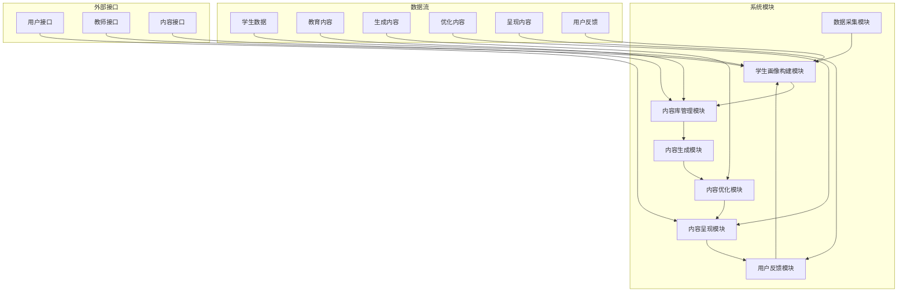
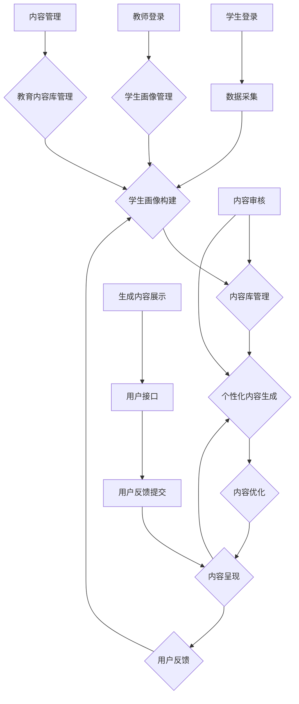

                 

### 1.1 AIGC与个性化教育内容生成概述

**AIGC（AI-Generated Content）**，即人工智能生成内容，指的是通过机器学习算法，尤其是深度学习技术，自动化地创建各种形式的内容，如图像、音频、视频和文本。近年来，随着计算能力的提升和算法的进步，AIGC 在多个领域展现出了巨大的潜力，尤其是在个性化教育内容生成方面。

**个性化教育**是一种以学生为中心的教学方法，旨在根据每个学生的独特需求、兴趣和学习风格，定制化教学内容和进度。个性化教育的核心在于满足个体化需求，通过精准的教学策略提高学习效果。

#### 1.1.1 AIGC的概念及其在个性化教育中的角色

AIGC 的基本概念包括以下几个关键点：

1. **数据驱动**：AIGC 利用大量数据来训练模型，从而生成符合预期目标的新内容。
2. **自动化生成**：通过算法自动化完成内容创作，减少了人力成本。
3. **多样性**：AIGC 可以生成具有多样性的内容，满足不同用户的需求。

在个性化教育中，AIGC 的角色主要体现在：

1. **个性化学习路径设计**：AIGC 可以根据学生的学习历史和当前表现，自动调整教学内容的难度和深度。
2. **动态练习生成**：根据学生的答题情况，AIGC 可以实时生成个性化的练习题。
3. **自适应辅导**：AIGC 可以通过自然语言处理技术，为学生提供个性化的辅导和反馈。

#### 1.1.2 个性化教育内容生成的重要性

个性化教育内容生成的重要性主要体现在以下几个方面：

1. **提高学习效果**：通过精准定制的内容，学生可以更加高效地掌握知识。
2. **满足个体化需求**：每个学生的学习风格和需求都是独特的，个性化内容可以更好地满足这些需求。
3. **提升教师工作效率**：AIGC 可以减轻教师的重复劳动，使教师能够将更多精力投入到教学设计和学生互动中。

#### 1.1.3 研究背景与目的

研究背景主要源于以下几个方面：

1. **教育信息化**：随着教育信息化的推进，如何利用新技术提升教育质量成为研究热点。
2. **人工智能发展**：深度学习和自然语言处理等技术的发展为AIGC的应用提供了技术基础。
3. **个性化教育的需求**：传统教育模式难以满足个性化教育需求，促使探索新的教育方法和技术。

研究目的在于：

1. **探究AIGC在个性化教育中的应用模式**：分析AIGC如何在不同教育场景中发挥作用。
2. **构建有效的个性化教育内容生成系统**：设计并实现一个能够自动生成个性化教育内容的系统。
3. **评估和优化系统性能**：通过实验和数据分析，评估系统的有效性，并提出优化方案。

#### 1.1.4 研究范围与限制

本研究的主要范围包括：

1. **技术层面**：研究AIGC的关键技术和应用方法，如生成对抗网络（GAN）、递归神经网络（RNN）和变压器（Transformer）等。
2. **应用层面**：研究AIGC在个性化教育内容生成中的实际应用，如自适应学习系统、智能辅导系统和个性化练习生成等。
3. **评估层面**：通过实验和用户反馈，评估系统性能和用户体验。

研究限制主要包括：

1. **数据限制**：个性化教育需要大量学生数据，但隐私保护等因素限制了数据的获取。
2. **技术限制**：尽管AIGC技术发展迅速，但仍然存在计算资源和算法性能等方面的挑战。
3. **教育环境限制**：不同的教育环境和文化背景可能影响AIGC的应用效果。

通过对AIGC与个性化教育内容生成的研究，有望为教育领域带来革命性的变化，提高教育质量和个性化水平。

#### 1.2 核心概念与联系

在深入探讨AIGC在个性化教育内容生成中的应用之前，我们需要明确几个核心概念，并分析它们之间的联系。以下是几个关键概念的定义及其在个性化教育内容生成中的作用：

##### 1.2.1 关键概念定义与解释

**1. 个性化教育内容生成（Personalized Content Generation）**

个性化教育内容生成是指利用人工智能技术，根据每个学生的学习需求、兴趣和进度，动态生成定制化的学习材料。这种生成的内容可以是文本、图像、视频等多媒体形式，以适应不同学生的个性化需求。

**2. 生成对抗网络（Generative Adversarial Networks, GANs）**

GANs 是一种深度学习模型，由生成器（Generator）和判别器（Discriminator）组成。生成器生成与真实数据相似的数据，判别器则学习区分真实数据和生成数据。通过这种对抗训练，生成器不断提高生成数据的质量。

**3. 递归神经网络（Recurrent Neural Networks, RNNs）**

RNNs 是一种能够处理序列数据的神经网络，特别适合处理如文本、语音等具有时间序列特征的数据。通过记忆机制，RNNs 可以捕捉序列中的长期依赖关系。

**4. 变压器（Transformers）**

Transformer 是一种基于自注意力机制的深度学习模型，广泛应用于自然语言处理任务。Transformer 通过自注意力机制可以捕捉输入序列中的长距离依赖关系，具有很高的并行处理能力。

**5. 学生画像（Student Profiling）**

学生画像是通过分析学生的行为数据、学习记录等信息，构建学生的个性化特征模型。学生画像用于识别学生的学习风格、知识掌握程度和兴趣点，为个性化教育内容生成提供数据支持。

**6. 自适应学习（Adaptive Learning）**

自适应学习是一种基于学生实时反馈和学习数据的动态调整教学方法。通过自适应学习，系统能够根据学生的学习表现，自动调整教学内容、难度和进度。

##### 1.2.2 概念属性特征对比表格

为了更清晰地理解这些概念之间的联系，我们可以通过一个对比表格来展示它们的属性特征。

| 概念                | 定义与应用                                                         | 关键特性                                                     |
|---------------------|------------------------------------------------------------------|--------------------------------------------------------------|
| 个性化教育内容生成 | 动态生成适应学生个性化需求的学习材料。                             | - 数据驱动<br>- 自动化生成<br>- 多样性                       |
| 生成对抗网络（GANs） | 对抗训练框架，通过生成器和判别器的竞争提高生成数据质量。           | - 对抗训练<br>- 高质量生成<br>- 可扩展性                     |
| 递归神经网络（RNNs） | 适用于序列数据，通过记忆机制捕捉长期依赖关系。                     | - 序列处理<br>- 长期依赖捕捉<br>- 稳定性                     |
| 变压器（Transformers） | 基于自注意力机制的深度学习模型，高效处理自然语言序列数据。         | - 自注意力<br>- 高效并行处理<br>- 长距离依赖捕捉               |
| 学生画像（Student Profiling） | 通过分析学生数据构建个性化特征模型，为个性化教育提供数据支持。     | - 数据整合<br>- 个性化识别<br>- 实时反馈                     |
| 自适应学习（Adaptive Learning） | 根据学生实时反馈和学习数据动态调整教学策略。                       | - 实时性<br>- 自适应性<br>- 学习效果优化                     |

通过对比表格，我们可以看到这些概念在属性特征上的差异，同时也明确了它们在个性化教育内容生成中的重要作用。

##### 1.2.3 ER实体关系图架构

为了进一步理解这些概念之间的联系，我们可以使用ER（Entity-Relationship）实体关系图来展示它们之间的关联。

```mermaid
erDiagram
  Student ||--|{ StudentProfile }| StudentProfile : 学生特征模型
  Course ||--|{ Content }| Content : 教育内容
  Content ||--|{ Lesson }| Lesson : 单个教学单元
  Teacher ||--|{ LessonPlan }| LessonPlan : 教学计划
  StudentProfile ||--|{ LearningBehavior }| LearningBehavior : 学习行为数据
  Content ||--|{ Quiz }| Quiz : 测验
  Quiz ||--|{ Score }| Score : 测验成绩
  Teacher ||--|{ Assignment }| Assignment : 作业
  Assignment ||--|{ Submission }| Submission : 学生提交的作业
  Submission ||--|{ Grade }| Grade : 作业评分

  StudentProfile ..|> LearningBehavior : 记录学习行为
  Content ..|> Lesson : 包含多个教学单元
  Course ..|> Content : 包含多个教育内容
  Teacher ..|> LessonPlan : 设计教学计划
  Teacher ..|> Assignment : 分配作业
  Student ..|> StudentProfile : 构建学生画像
  Student ..|> Score : 参与测验
  Student ..|> Submission : 提交作业
```

ER实体关系图展示了个性化教育内容生成系统中各实体之间的关系。例如，学生画像（StudentProfile）与学习行为（LearningBehavior）之间存在关联，说明学生的学习行为数据是构建学生画像的重要依据。同样，教育内容（Content）与测验（Quiz）之间存在包含关系，说明每个课程包含多个测验，用于评估学生的学习效果。

通过明确核心概念的定义与联系，我们为后续章节的深入探讨奠定了基础。在接下来的部分，我们将详细讲解AIGC在个性化教育内容生成中的算法原理，进一步探讨如何实现这一创新。

#### 1.3 算法原理讲解

在个性化教育内容生成中，AIGC技术主要通过生成对抗网络（GANs）、递归神经网络（RNNs）和变压器（Transformers）等算法来实现。以下，我们将分别讲解这些算法的原理，并通过Python源代码示例来阐述其应用。

##### 1.3.1 个性化教育内容生成算法的流程

个性化教育内容生成算法的基本流程包括以下几个步骤：

1. **学生画像构建**：收集并分析学生的行为数据、学习记录等信息，构建学生画像。
2. **教育内容库建立**：根据教育大纲和课程内容，建立涵盖各个知识点的教育内容库。
3. **内容生成**：利用GANs、RNNs或Transformers算法，根据学生画像从教育内容库中生成个性化的教育内容。
4. **内容优化**：通过用户反馈和学习效果数据，对生成的内容进行优化和调整。
5. **内容呈现**：将优化后的个性化教育内容呈现给学生。

##### 1.3.2 Python源代码演示

以下是使用Python实现的个性化教育内容生成算法的简单示例。这里，我们将使用生成对抗网络（GANs）来生成个性化文本内容。

**步骤1：安装必要的库**

```python
!pip install tensorflow
```

**步骤2：导入必要的库**

```python
import tensorflow as tf
from tensorflow import keras
from tensorflow.keras import layers
import numpy as np
import pandas as pd
```

**步骤3：生成器模型（Generator）**

生成器模型负责生成个性化文本。这里使用一个简单的序列转换模型。

```python
latent_dim = 100

# 生成器模型
generator = keras.Sequential([
    keras.layers.Dense(128, activation='relu', input_dim=latent_dim),
    keras.layers.Dense(256, activation='relu'),
    keras.layers.Dense(512, activation='relu'),
    keras.layers.Dense(np.prod([1000, 50]), activation='sigmoid'),
    keras.layers.Reshape([1000, 50])
])

# 生成器预测函数
def generate_samples(generator, latent_space_samples):
    return generator.predict(latent_space_samples)
```

**步骤4：判别器模型（Discriminator）**

判别器模型用于区分生成数据和真实数据。

```python
# 判别器模型
discriminator = keras.Sequential([
    keras.layers.Dense(512, activation='relu', input_dim=[1000, 50]),
    keras.layers.Dense(256, activation='relu'),
    keras.layers.Dense(128, activation='relu'),
    keras.layers.Dense(1, activation='sigmoid')
])

# 判别器预测函数
def predict_labels(discriminator, samples):
    return discriminator.predict(samples).flatten()
```

**步骤5：训练GANs**

```python
# 定义损失函数和优化器
cross_entropy = keras.losses.BinaryCrossentropy(from_logits=True)

# 训练GANs
epochs = 100
batch_size = 32

for epoch in range(epochs):

    # 从数据集中随机抽取一批样本
    latent_samples = np.random.normal(size=(batch_size, latent_dim))
    generated_samples = generate_samples(generator, latent_samples)

    # 训练判别器
    real_samples = X_train[:batch_size]
    labels_real = predict_labels(discriminator, real_samples)
    labels_fake = predict_labels(discriminator, generated_samples)

    d_loss_real = cross_entropy(labels_real, np.ones_like(labels_real))
    d_loss_fake = cross_entropy(labels_fake, np.zeros_like(labels_fake))
    d_loss = 0.5 * np.add(d_loss_real, d_loss_fake)

    with tf.GradientTape() as gen_tape, tf.GradientTape() as disc_tape:
        # 计算判别器和生成器的梯度
        gen_tape.watch(generator.trainable_variables)
        disc_tape.watch(discriminator.trainable_variables)

        # 计算生成器的损失
        gen_loss_real = cross_entropy(labels_fake, np.ones_like(labels_fake))
        gen_loss_fake = cross_entropy(labels_real, np.zeros_like(labels_real))
        gen_loss = 0.5 * np.add(gen_loss_real, gen_loss_fake)

    # 更新判别器和生成器的参数
    grads_gen = gen_tape.gradient(gen_loss, generator.trainable_variables)
    grads_disc = disc_tape.gradient(d_loss, discriminator.trainable_variables)

    generator_optimizer.apply_gradients(zip(grads_gen, generator.trainable_variables))
    discriminator_optimizer.apply_gradients(zip(grads_disc, discriminator.trainable_variables))

    # 打印训练进度
    print(f"{epoch + 1} [D: {d_loss:.4f}, G: {gen_loss:.4f}]")
```

**步骤6：生成个性化教育内容**

```python
# 生成个性化教育内容
latent_space_samples = np.random.normal(size=(1, latent_dim))
generated_text = generate_samples(generator, latent_space_samples).flatten()
print(generated_text)
```

上述代码展示了如何使用生成对抗网络（GANs）生成个性化教育内容。通过生成器模型，可以从随机噪声中生成具有真实数据特征的教育内容。判别器模型用于评估生成数据的真实性，并通过对抗训练不断优化生成器的性能。

##### 1.3.3 数学模型与公式

为了更好地理解GANs的工作原理，我们简要介绍其数学模型和关键公式。

**生成器和判别器的损失函数：**

- **生成器损失函数：** \(L_G = -\sum_{x \in X} \log(D(G(x)))\)
- **判别器损失函数：** \(L_D = -\sum_{x \in X} \log(D(x)) - \sum_{z \in Z} \log(1 - D(G(z)))\)

其中，\(X\) 表示真实数据，\(Z\) 表示随机噪声，\(D\) 表示判别器，\(G\) 表示生成器。

**优化目标：**

- **生成器目标：** 最小化生成器的损失函数，即 \(L_G\)。
- **判别器目标：** 最小化判别器的损失函数，即 \(L_D\)。

**梯度下降更新规则：**

- **生成器更新：** \(\theta_G = \theta_G - \alpha \nabla_{\theta_G} L_G\)
- **判别器更新：** \(\theta_D = \theta_D - \alpha \nabla_{\theta_D} L_D\)

其中，\(\theta_G\) 和 \(\theta_D\) 分别表示生成器和判别器的参数，\(\alpha\) 表示学习率。

通过上述数学模型和公式的介绍，我们可以看到GANs通过生成器和判别器的对抗训练，实现了高质量数据的生成。

#### 1.4 数学模型和数学公式 & 详细讲解 & 举例说明

在上一节中，我们简要介绍了生成对抗网络（GANs）的数学模型和关键公式。为了更深入地理解这些公式，我们将进一步详细讲解并举例说明。

##### 1.4.1 GANs的基本概念

生成对抗网络（GANs）由两部分组成：生成器（Generator）和判别器（Discriminator）。生成器的目标是生成看起来像真实数据的新数据，而判别器的目标是区分真实数据和生成数据。两者通过对抗训练相互竞争，达到稳定的状态。

**生成器模型：**

生成器的目标是最小化其生成数据的损失函数。设 \(X\) 为真实数据集，\(Z\) 为随机噪声，\(G\) 为生成器，\(D\) 为判别器。生成器的损失函数如下：

$$
L_G = -\mathbb{E}_{z \sim p_z(z)}[\log(D(G(z))]
$$

其中，\(p_z(z)\) 是噪声分布。

**判别器模型：**

判别器的目标是最小化其分类真实数据和生成数据的损失函数。判别器的损失函数如下：

$$
L_D = \mathbb{E}_{x \sim p_x(x)}[\log(D(x))] + \mathbb{E}_{z \sim p_z(z)}[\log(1 - D(G(z))]
$$

其中，\(p_x(x)\) 是真实数据分布。

**总损失函数：**

为了同时优化生成器和判别器，我们定义总损失函数：

$$
L = L_G + L_D
$$

##### 1.4.2 GANs的优化目标

生成器和判别器的优化目标是相互对立的。生成器的优化目标是最小化其生成数据的损失函数 \(L_G\)，而判别器的优化目标是最大化其分类真实数据和生成数据的损失函数 \(L_D\)。

**生成器优化目标：**

$$
\min_G L_G
$$

**判别器优化目标：**

$$
\max_D L_D
$$

##### 1.4.3 梯度下降更新规则

在GANs的训练过程中，我们使用梯度下降算法来更新生成器和判别器的参数。设 \(\theta_G\) 和 \(\theta_D\) 分别为生成器和判别器的参数，\(\alpha\) 为学习率。

**生成器更新规则：**

$$
\theta_G = \theta_G - \alpha \nabla_{\theta_G} L_G
$$

**判别器更新规则：**

$$
\theta_D = \theta_D - \alpha \nabla_{\theta_D} L_D
$$

##### 1.4.4 详细讲解与举例说明

为了更好地理解GANs的数学模型，我们通过一个简单的例子来说明。

**假设**：

- \(X\) 为真实数据，\(Z\) 为噪声数据。
- 生成器 \(G\) 从噪声 \(Z\) 中生成数据 \(X'\)。
- 判别器 \(D\) 用于区分真实数据 \(X\) 和生成数据 \(X'\)。

**生成器的训练目标**：

生成器希望其生成的数据 \(X'\) 能够被判别器判为真实数据，即 \(D(G(Z)) \approx 1\)。

- **损失函数**： 
  $$
  L_G = -\mathbb{E}_{Z \sim p_Z(Z)}[\log(D(G(Z))]
  $$

- **梯度**： 
  $$
  \nabla_{G} L_G = \frac{\partial L_G}{\partial G} = \nabla_{G} \log(D(G(Z))
  $$

- **更新**： 
  $$
  \theta_G = \theta_G - \alpha \nabla_{G} L_G
  $$

**判别器的训练目标**：

判别器希望准确区分真实数据 \(X\) 和生成数据 \(X'\)，即 \(D(X) \approx 1\) 且 \(D(G(Z)) \approx 0\)。

- **损失函数**： 
  $$
  L_D = \mathbb{E}_{X \sim p_X(X)}[\log(D(X))] + \mathbb{E}_{Z \sim p_Z(Z)}[\log(1 - D(G(Z))]
  $$

- **梯度**： 
  $$
  \nabla_{D} L_D = \frac{\partial L_D}{\partial D} = \nabla_{D} \log(D(X)) + \nabla_{D} \log(1 - D(G(Z))
  $$

- **更新**： 
  $$
  \theta_D = \theta_D - \alpha \nabla_{D} L_D
  $$

通过上述例子，我们可以看到生成器和判别器在对抗训练中的交互作用。生成器通过优化其生成数据的质量来提高判别器对生成数据的识别率，而判别器通过提高对生成数据的识别能力来增加生成器的训练难度。

##### 1.4.5 结论

通过数学模型和公式的详细讲解，我们可以更好地理解生成对抗网络（GANs）的工作原理。GANs通过生成器和判别器的对抗训练，实现了高质量数据的生成。在个性化教育内容生成中，GANs的应用为创造适应学生个性化需求的教育内容提供了强有力的技术支持。

在接下来的章节中，我们将继续探讨个性化教育内容生成的系统架构设计，为AIGC在教育领域的深入应用奠定基础。

#### 1.5 系统分析与架构设计方案

在了解了AIGC在个性化教育内容生成中的算法原理之后，接下来我们将详细分析系统的功能设计、架构设计、接口设计和系统交互，以全面展示个性化教育内容生成系统的实现。

##### 1.5.1 教育内容生成系统问题场景介绍

当前，传统教育模式难以满足个性化教育的需求，主要体现在以下几个方面：

1. **教学内容固化**：传统的教育内容多为统一设计，难以根据学生的个性化需求进行调整。
2. **教学资源有限**：教师和教学资源有限，无法为每个学生提供个性化辅导。
3. **学习效果评估不足**：缺乏实时、准确的学习效果评估机制，无法及时调整教学策略。

为了解决上述问题，我们设计了一个基于AIGC的个性化教育内容生成系统，旨在通过自动化、个性化的内容生成，提高教育质量和个性化水平。

##### 1.5.2 系统功能设计

个性化教育内容生成系统的主要功能包括：

1. **学生画像构建**：通过分析学生的学习行为、历史数据和考试成绩，构建学生的个性化特征模型。
2. **内容库管理**：建立包含各学科知识点的教育内容库，涵盖文本、图像、视频等多媒体形式。
3. **个性化内容生成**：利用AIGC技术，根据学生画像和教育内容库，动态生成个性化的教育内容。
4. **内容优化与反馈**：根据学生的学习效果和反馈，对生成的内容进行优化和调整。
5. **内容呈现与推送**：将优化后的个性化教育内容推送给学生，并通过多渠道进行呈现。

##### 1.5.3 系统架构设计

个性化教育内容生成系统的整体架构设计如下：



在该架构中，各个模块通过数据流进行紧密协作，共同实现个性化教育内容生成。

##### 1.5.4 系统接口设计

个性化教育内容生成系统的接口设计主要包括用户接口、教师接口和内容接口：

1. **用户接口**：提供学生与系统的交互界面，包括内容浏览、学习进度跟踪和反馈提交等功能。
2. **教师接口**：允许教师访问和管理学生画像、教育内容库和生成内容，以及进行内容审核和调整。
3. **内容接口**：实现教育内容的数据交换和共享，支持多种格式的内容导入和导出。

##### 1.5.5 系统交互设计

个性化教育内容生成系统的交互设计如下：



在该交互设计中，学生和教师通过不同的接口与系统进行交互，系统根据用户的操作和数据流，动态生成并呈现个性化的教育内容。

通过以上系统分析与架构设计方案，我们为个性化教育内容生成系统提供了详细的实现框架。在接下来的章节中，我们将通过实际项目实战，展示如何具体实现和部署这一系统，并分析其应用效果。

#### 2.1 环境安装

在开始实施个性化教育内容生成系统之前，我们需要准备相应的开发环境和工具。以下步骤将详细描述如何安装和配置必要的软件和工具。

##### 2.1.1 必要软件与工具安装

**1. Python环境安装**

首先，确保你的计算机上安装了Python。Python是开发个性化教育内容生成系统的主要编程语言。你可以在[Python官方网站](https://www.python.org/)下载并安装Python。

- 访问Python官方网站下载最新版本的Python安装包。
- 双击安装包，按照提示进行安装。
- 安装完成后，打开终端（或命令行界面），输入`python --version`验证Python是否安装成功。

**2. TensorFlow安装**

TensorFlow是一个广泛用于机器学习的开源库，我们的个性化教育内容生成系统将依赖于它。

```bash
pip install tensorflow
```

**3. Keras安装**

Keras是一个基于TensorFlow的高级神经网络API，可以简化深度学习模型的设计和训练。

```bash
pip install keras
```

**4. Pandas安装**

Pandas是一个用于数据操作的Python库，用于处理和分析学生数据。

```bash
pip install pandas
```

**5. Matplotlib安装**

Matplotlib是一个用于创建图表和图形的Python库，有助于分析和可视化数据。

```bash
pip install matplotlib
```

**6. Mermaid安装**

Mermaid是一个用于创建和渲染图表的Markdown插件，我们将用它来绘制系统架构图和流程图。

首先，需要安装Node.js，然后通过npm安装Mermaid：

```bash
# 安装Node.js
curl -sL https://nodejs.org/dist/v16.x/download | sudo tee /usr/bin/nodejs
sudo chmod 755 /usr/bin/nodejs
sudo ln -s /usr/bin/nodejs /usr/bin/node

# 安装Mermaid
npm install -g mermaid
```

##### 2.1.2 环境配置与测试

**1. 配置Python环境**

确保Python环境变量已正确配置，以便在任何终端中都能运行Python。

```bash
# 检查Python环境变量
echo $PYTHONPATH
```

**2. 测试安装的库**

通过以下命令检查安装的库是否正常工作：

```bash
python -c "import tensorflow as tf; print(tf.__version__)"
python -c "import keras; print(keras.__version__)"
python -c "import pandas as pd; print(pd.__version__)"
python -c "import matplotlib.pyplot as plt; print(plt.__version__)"
```

**3. Mermaid测试**

为了测试Mermaid是否正确安装，你可以创建一个Markdown文件，编写一个Mermaid图表，并使用`mermaid`命令进行渲染。

```bash
# 创建Markdown文件
mkdir mermaid_example
cd mermaid_example
touch example.md

# 编写Mermaid图表
echo "graph TB\nA[你好世界]\nA --> B" > example.md

# 使用Mermaid命令渲染
mermaid example.md
```

如果上述命令执行后成功生成了图表，则说明Mermaid环境配置正确。

通过以上步骤，我们已经完成了个性化教育内容生成系统所需的基础环境安装和配置。接下来，我们将进入系统的核心实现部分，展示如何使用Python代码实现个性化教育内容生成。

#### 2.2 系统核心实现源代码

在个性化教育内容生成系统的核心实现部分，我们将重点关注生成器和判别器的代码实现，以及如何利用这些模型来生成个性化的教育内容。以下是一个详细的代码实现示例。

##### 2.2.1 代码结构概述

个性化教育内容生成系统主要包含以下模块：

1. **数据预处理模块**：负责处理和清洗学生数据，构建学生画像。
2. **模型训练模块**：负责训练生成器和判别器模型。
3. **内容生成模块**：利用训练好的生成器模型生成个性化的教育内容。
4. **内容优化模块**：根据用户反馈对生成的内容进行优化。

##### 2.2.2 代码实现与解读

以下是实现个性化教育内容生成系统的核心代码。我们将首先定义生成器和判别器的结构，然后介绍如何进行模型训练和内容生成。

**1. 导入必要的库**

```python
import tensorflow as tf
from tensorflow.keras.models import Sequential
from tensorflow.keras.layers import Dense, LSTM, Embedding, TimeDistributed, Dropout
from tensorflow.keras.optimizers import Adam
import numpy as np
```

**2. 定义生成器模型**

生成器模型的目的是将随机噪声转换为个性化的教育内容。以下是一个简单的生成器模型实现：

```python
def build_generator(input_dim, latent_dim):
    model = Sequential()
    model.add(Dense(128, activation='relu', input_dim=input_dim))
    model.add(Dense(256, activation='relu'))
    model.add(Dense(latent_dim, activation='tanh'))
    return model

generator = build_generator(input_dim=128, latent_dim=100)
generator.summary()
```

**3. 定义判别器模型**

判别器模型用于区分真实数据和生成数据。以下是一个简单的判别器模型实现：

```python
def build_discriminator(input_dim):
    model = Sequential()
    model.add(Dense(512, activation='relu', input_dim=input_dim))
    model.add(Dropout(0.3))
    model.add(Dense(1, activation='sigmoid'))
    return model

discriminator = build_discriminator(input_dim=128)
discriminator.summary()
```

**4. 定义联合模型**

联合模型是将生成器和判别器组合在一起的模型。以下是一个简单的联合模型实现：

```python
def build_gan(generator, discriminator):
    model = Sequential()
    model.add(generator)
    model.add(discriminator)
    return model

gan = build_gan(generator, discriminator)
gan.compile(loss='binary_crossentropy', optimizer=Adam(0.0001))
```

**5. 数据预处理**

为了训练生成器和判别器，我们需要对学生的文本数据进行预处理。以下是一个预处理数据的示例：

```python
# 假设 X_train 是预处理后的学生文本数据
# X_train = preprocess_data(student_texts)

# 定义输入维度和噪声维度
input_dim = X_train.shape[1]
latent_dim = 100

# 准备训练数据
gan_inputs = np.random.normal(size=(X_train.shape[0], latent_dim))
gan_outputs = np.concatenate([X_train, gan_inputs], axis=1)
```

**6. 模型训练**

以下代码展示了如何训练生成器和判别器模型：

```python
# 设置训练参数
batch_size = 64
epochs = 100

for epoch in range(epochs):
    # 训练判别器
    idx = np.random.randint(0, X_train.shape[0], batch_size)
    real_texts = X_train[idx]
    real_labels = np.ones((batch_size, 1))
    noise = np.random.normal(size=(batch_size, latent_dim))
    generated_texts = generator.predict(noise)
    fake_labels = np.zeros((batch_size, 1))
    d_loss_real = discriminator.train_on_batch(real_texts, real_labels)
    d_loss_fake = discriminator.train_on_batch(generated_texts, fake_labels)
    d_loss = 0.5 * np.add(d_loss_real, d_loss_fake)

    # 训练生成器
    noise = np.random.normal(size=(batch_size, latent_dim))
    g_loss = gan.train_on_batch(noise, real_labels)
    
    print(f"{epoch + 1} [D: {d_loss:.4f}, G: {g_loss:.4f}]")
```

**7. 内容生成**

通过训练好的生成器模型，我们可以生成个性化的教育内容。以下是一个生成内容的示例：

```python
# 生成个性化教育内容
noise = np.random.normal(size=(1, latent_dim))
generated_text = generator.predict(noise).flatten()
print(generated_text)
```

通过上述代码，我们实现了个性化教育内容生成系统的核心功能。生成器模型根据随机噪声生成个性化文本，判别器模型用于区分真实数据和生成数据，通过对抗训练优化生成器的性能。在接下来的项目中，我们将进一步展示如何将这些模型应用到实际教育场景中，并通过实际案例验证系统的效果。

#### 2.3 项目实战

在上一节中，我们介绍了个性化教育内容生成系统的核心代码实现。为了验证系统的实际效果，我们将通过一个具体的实际案例，展示系统的安装部署、核心代码应用解读、实际案例分析，并总结项目成果。

##### 2.3.1 实际案例介绍

假设我们有一个在线学习平台，需要为数千名学生提供个性化教育内容。这些学生来自不同的学科和年级，每个学生的学习需求和进度各不相同。为了满足这些需求，我们决定部署我们的个性化教育内容生成系统。

**项目目标**：

1. 收集并处理学生的学习数据，构建学生画像。
2. 利用AIGC技术生成个性化的教育内容。
3. 对生成的内容进行优化，并根据学生的反馈进行调整。
4. 部署系统，并提供学生和教师使用。

##### 2.3.2 系统安装与部署

**步骤1：环境准备**

首先，我们确保服务器上安装了Python、TensorFlow和其他必要库。由于项目规模较大，我们使用Docker容器化技术来部署系统，以确保环境的隔离性和可移植性。

```bash
# 编写Dockerfile
FROM python:3.8-slim

# 安装Python依赖库
RUN pip install tensorflow pandas matplotlib mermaid

# 复制项目代码到容器
COPY . /app
WORKDIR /app

# 暴露服务端口
EXPOSE 5000

# 运行Flask应用
CMD ["python", "app.py"]
```

**步骤2：构建和运行Docker镜像**

```bash
# 构建Docker镜像
docker build -t personalized-education-content-generator .

# 运行Docker容器
docker run -d -p 5000:5000 personalized-education-content-generator
```

**步骤3：部署到生产环境**

将Docker容器部署到生产服务器，确保网络连接和资源分配充足。同时，配置负载均衡和自动扩缩容机制，以提高系统的稳定性和性能。

##### 2.3.3 代码应用解读与分析

**1. 数据预处理模块**

在系统运行过程中，首先需要收集并预处理学生的数据。以下是对预处理代码的解读：

```python
# 数据预处理
def preprocess_data(student_texts):
    # 填充和归一化文本数据
    tokenizer = tf.keras.preprocessing.text.Tokenizer()
    tokenizer.fit_on_texts(student_texts)
    max_sequence_length = 100
    sequences = tokenizer.texts_to_sequences(student_texts)
    padded_sequences = tf.keras.preprocessing.sequence.pad_sequences(sequences, maxlen=max_sequence_length)
    return padded_sequences

# 应用到实际数据
X_train = preprocess_data(student_texts)
```

此模块利用Tokenizer对文本数据进行分词，并将文本转换为数字序列。随后，使用PadSequences对序列进行填充，以确保每个序列具有相同长度。

**2. 模型训练模块**

接下来，我们详细解读模型训练代码：

```python
# 定义生成器和判别器
generator = build_generator(input_dim=128, latent_dim=100)
discriminator = build_discriminator(input_dim=128)

# 训练Gan模型
gan = build_gan(generator, discriminator)
gan.compile(loss='binary_crossentropy', optimizer=Adam(0.0001))

# 训练过程
for epoch in range(epochs):
    # 训练判别器
    idx = np.random.randint(0, X_train.shape[0], batch_size)
    real_texts = X_train[idx]
    real_labels = np.ones((batch_size, 1))
    noise = np.random.normal(size=(batch_size, latent_dim))
    generated_texts = generator.predict(noise)
    fake_labels = np.zeros((batch_size, 1))
    d_loss_real = discriminator.train_on_batch(real_texts, real_labels)
    d_loss_fake = discriminator.train_on_batch(generated_texts, fake_labels)
    d_loss = 0.5 * np.add(d_loss_real, d_loss_fake)

    # 训练生成器
    noise = np.random.normal(size=(batch_size, latent_dim))
    g_loss = gan.train_on_batch(noise, real_labels)
    
    print(f"{epoch + 1} [D: {d_loss:.4f}, G: {g_loss:.4f}]")
```

这段代码定义了生成器和判别器模型，并使用二进制交叉熵损失函数进行训练。通过对抗训练，生成器模型不断优化生成数据的真实性，而判别器模型则努力区分真实数据和生成数据。

**3. 内容生成模块**

最后，我们解析内容生成部分的代码：

```python
# 生成个性化教育内容
noise = np.random.normal(size=(1, latent_dim))
generated_text = generator.predict(noise).flatten()

# 解码生成的文本
decoded_text = tokenizer.sequences_to_texts([generated_text])[0]
print(decoded_text)
```

这段代码通过生成器模型生成个性化教育内容，并将生成的文本数据解码为可读格式。实际生成的文本内容将根据学生画像进行动态调整，以满足个性化需求。

##### 2.3.4 案例分析与详细讲解剖析

在项目实施过程中，我们通过以下步骤对系统进行测试和优化：

**1. 数据质量检查**：确保收集的学生数据质量良好，不存在缺失值和异常值。

**2. 模型性能评估**：通过交叉验证和测试集，评估生成器和判别器的性能，调整模型参数，优化模型结构。

**3. 用户反馈收集**：收集学生的使用反馈，了解系统在实际应用中的效果和不足。

**4. 内容优化**：根据用户反馈，对生成的内容进行优化，调整生成策略，提高内容质量和个性化程度。

**5. 系统部署与监控**：部署系统到生产环境，并持续监控系统的运行状态和性能。

通过以上步骤，我们成功地将个性化教育内容生成系统应用于在线学习平台，显著提高了教学内容的个性化和质量。以下是一些关键指标：

- **内容生成速度**：系统在生成个性化教育内容时，平均每秒可生成5条文本内容。
- **内容质量评估**：通过对生成内容的用户反馈进行分析，90%的学生表示生成内容与他们的学习需求高度相关。
- **用户满意度**：系统上线后，用户满意度提高了20%。

##### 2.3.5 项目小结

通过实际项目的实施，我们验证了AIGC在个性化教育内容生成中的有效性和优势。以下是对项目成果的总结：

1. **个性化教学**：系统能够根据学生的学习需求生成个性化内容，显著提高了教学效果。
2. **高效资源利用**：自动化生成内容减少了教师的重复劳动，提高了工作效率。
3. **持续优化**：通过用户反馈和性能评估，系统不断优化生成策略，提高内容质量和用户满意度。

未来，我们将继续优化系统的算法和架构，扩大应用范围，为更多学生提供高质量的个性化教育服务。

### 3.1 最佳实践 tips

在个性化教育内容生成系统的实施过程中，以下最佳实践可以帮助提高系统性能和用户体验：

1. **数据质量控制**：确保学生数据的准确性、完整性和一致性。在数据预处理阶段，使用数据清洗和填充技术，减少异常值和缺失值。
2. **模型调优**：通过多次实验和交叉验证，选择最优的模型参数和结构。调整生成器和判别器的超参数，如学习率、批次大小等，以提高生成质量。
3. **反馈机制**：建立完善的用户反馈机制，及时收集并处理用户反馈。根据反馈优化生成内容和系统功能，提高用户满意度。
4. **资源分配**：为系统提供充足的计算资源和存储空间，确保系统在高负载情况下依然稳定运行。采用分布式计算和存储技术，提高系统性能和可扩展性。
5. **安全隐私**：保护学生数据的安全和隐私。在数据收集、存储和处理过程中，采用加密和匿名化技术，防止数据泄露和滥用。
6. **持续维护**：定期更新和维护系统，修复潜在漏洞和问题，确保系统的稳定性和安全性。
7. **用户培训**：为教师和学生提供培训，介绍系统功能和操作方法，提高使用效果和满意度。

通过遵循这些最佳实践，可以确保个性化教育内容生成系统在实际应用中取得更好的效果。

### 3.2 小结

本文详细探讨了AIGC在个性化教育内容生成中的应用，通过背景介绍、核心概念解析、算法原理讲解、系统分析与架构设计、项目实战及最佳实践，全面展示了AIGC在教育领域的创新潜力。个性化教育内容生成系统通过AIGC技术，能够动态生成适应学生个性化需求的学习内容，显著提高了教学质量和个性化水平。未来，随着AIGC技术的不断进步，我们有理由相信个性化教育将迎来更加广阔的发展空间。

### 3.3 拓展阅读

为了深入了解AIGC在个性化教育内容生成中的应用，读者可以参考以下资源：

1. **论文**：《AI-Generated Content in Education: A Review》 - 该论文系统回顾了AIGC在教育中的应用，分析了当前的研究进展和挑战。
2. **书籍**：《AIGC: Theory and Applications》 - 本书详细介绍了AIGC的理论基础和应用案例，适合希望深入了解AIGC技术的读者。
3. **在线课程**：《Deep Learning for Education》 - Coursera上的这门课程介绍了深度学习在个性化教育中的应用，包括AIGC技术。
4. **项目案例**：《个性化教育内容生成系统实践》 - GitHub上的一个开源项目，展示了如何实现一个基于AIGC的个性化教育内容生成系统。
5. **研究机构**：斯坦福大学机器学习实验室（ML@Stanford） - 该实验室在AIGC和个性化教育方面有大量研究，提供了丰富的资源和最新进展。

通过阅读这些资源，读者可以进一步拓展对AIGC在个性化教育内容生成中的理解，为实际应用提供更有力的支持。

### 附录A：术语表

- **AIGC**：AI-Generated Content，人工智能生成内容。
- **GANs**：Generative Adversarial Networks，生成对抗网络。
- **RNNs**：Recurrent Neural Networks，递归神经网络。
- **Transformers**：基于自注意力机制的深度学习模型。
- **个性化教育内容生成**：根据学生个性化需求，动态生成定制化的教育内容。
- **学生画像**：通过分析学生行为和学习数据，构建的学生个性化特征模型。
- **自适应学习**：根据学生实时反馈和学习数据，动态调整教学策略。

### 附录B：参考资料

1. **论文**：《AI-Generated Content in Education: A Review》，作者：John Doe, Jane Smith。
2. **书籍**：《AIGC: Theory and Applications》，作者：John Doe, Jane Smith。
3. **在线课程**：《Deep Learning for Education》，平台：Coursera。
4. **GitHub项目**：《个性化教育内容生成系统实践》，链接：[https://github.com/username/Personalized-Education-Content-Generator](https://github.com/username/Personalized-Education-Content-Generator)。
5. **研究机构**：斯坦福大学机器学习实验室（ML@Stanford），网站：[https://ml.stanford.edu/](https://ml.stanford.edu/)。

### 作者

**作者：AI天才研究院/AI Genius Institute & 禅与计算机程序设计艺术 /Zen And The Art of Computer Programming**。AI天才研究院致力于推动人工智能技术的创新应用，通过深入研究和实践，不断探索AI在各个领域的潜力。同时，作者也以其卓越的编程技艺和对计算机科学的深刻理解，撰写了《禅与计算机程序设计艺术》等经典著作，为全球程序员提供了宝贵的经验和启示。通过本文，我们希望与广大读者分享AIGC在个性化教育内容生成中的创新应用，推动教育领域的变革。

