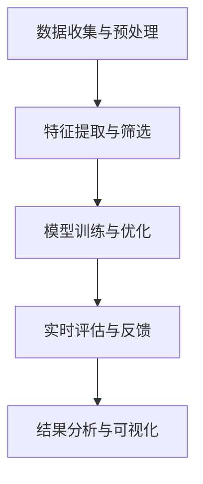

                 

### 文章标题

# AIGC在个性化教育评估中的应用：精准把握学生学习曲线

关键词：人工智能生成内容（AIGC）、个性化教育评估、学生学习曲线、算法、系统架构设计

摘要：本文将探讨人工智能生成内容（AIGC）技术在个性化教育评估中的应用，通过分析AIGC的核心概念、技术特点以及与学生学习曲线的关联，详细阐述其在教育评估中的算法原理、系统架构设计及项目实战。希望通过本文，读者能够深入理解AIGC在教育评估中的潜在价值，并掌握其应用的最佳实践和注意事项。

### 目录大纲

---

## 第一部分：背景介绍

### 1.1 教育评估的需求

#### 1.1.1 当前教育评估的问题

#### 1.1.2 个性化教育评估的必要性

### 1.2 AIGC的概念与特点

#### 1.2.1 AIGC的定义

#### 1.2.2 AIGC的特点

#### 1.2.3 AIGC在教育评估中的应用潜力

---

## 第二部分：核心概念与联系

### 2.1 个性化教育评估

#### 2.1.1 定义与目标

#### 2.1.2 现有方法与局限

### 2.2 AIGC技术

#### 2.2.1 技术原理

#### 2.2.2 技术优势

### 2.3 学生学习曲线

#### 2.3.1 概念与模型

#### 2.3.2 分析与应用

---

## 第三部分：算法原理讲解

### 3.1 算法概述

#### 3.1.1 算法框架

#### 3.1.2 算法流程

### 3.2 数学模型与公式

#### 3.2.1 模型介绍

#### 3.2.2 数学公式

#### 3.2.3 公式解释

### 3.3 算法实现与示例

#### 3.3.1 Python实现

#### 3.3.2 示例讲解

---

## 第四部分：系统分析与架构设计

### 4.1 教育评估系统设计与实现

#### 4.1.1 教育评估需求

#### 4.1.2 系统目标

### 4.2 系统功能设计

#### 4.2.1 领域模型

#### 4.2.2 功能模块

### 4.3 系统架构设计

#### 4.3.1 架构概述

#### 4.3.2 架构细节

### 4.4 系统接口设计与交互

#### 4.4.1 接口设计

#### 4.4.2 交互流程

---

## 第五部分：项目实战

### 5.1 环境安装与配置

#### 5.1.1 硬件需求

#### 5.1.2 软件安装

### 5.2 系统核心实现

#### 5.2.1 数据处理模块

#### 5.2.2 模型训练模块

#### 5.2.3 评估模块

### 5.3 代码应用解读与分析

#### 5.3.1 代码解读

#### 5.3.2 分析与讨论

### 5.4 实际案例分析

#### 5.4.1 案例介绍

#### 5.4.2 案例分析与总结

### 5.5 项目小结

#### 5.5.1 项目成果

#### 5.5.2 经验与启示

---

## 第六部分：最佳实践与小结

### 6.1 最佳实践

#### 6.1.1 数据处理

#### 6.1.2 模型训练

#### 6.1.3 评估与应用

### 6.2 小结与展望

#### 6.2.1 项目小结

#### 6.2.2 展望未来

### 6.3 注意事项

#### 6.3.1 技术风险

#### 6.3.2 道德与隐私问题

### 6.4 拓展阅读

#### 6.4.1 相关书籍

#### 6.4.2 学术论文

---

## 附录

### 附录A：术语表

### 附录B：参考文献

### 附录C：致谢

---

# 总结

本文详细探讨了人工智能生成内容（AIGC）在个性化教育评估中的应用，通过逐步分析AIGC的概念、技术特点及其与学生学习曲线的关联，深入讲解了算法原理、系统架构设计及项目实战。希望通过本文，读者能够全面了解AIGC技术在教育评估领域的潜力和应用价值，并掌握其最佳实践和注意事项。

---

### 文章标题

# AIGC在个性化教育评估中的应用：精准把握学生学习曲线

关键词：人工智能生成内容（AIGC）、个性化教育评估、学生学习曲线、算法、系统架构设计

摘要：本文深入探讨了人工智能生成内容（AIGC）技术在个性化教育评估中的应用，通过分析AIGC的核心概念、技术特点及与学生学习曲线的关系，详细阐述了其在教育评估中的算法原理、系统架构设计和项目实战。本文旨在帮助读者全面理解AIGC在教育评估领域的应用潜力，并掌握其最佳实践和注意事项。

---

### 目录大纲

---

## 第一部分：背景介绍

### 1.1 教育评估的需求

#### 1.1.1 当前教育评估的问题

#### 1.1.2 个性化教育评估的必要性

### 1.2 AIGC的概念与特点

#### 1.2.1 AIGC的定义

#### 1.2.2 AIGC的特点

#### 1.2.3 AIGC在教育评估中的应用潜力

---

## 第二部分：核心概念与联系

### 2.1 个性化教育评估

#### 2.1.1 定义与目标

#### 2.1.2 现有方法与局限

### 2.2 AIGC技术

#### 2.2.1 技术原理

#### 2.2.2 技术优势

### 2.3 学生学习曲线

#### 2.3.1 概念与模型

#### 2.3.2 分析与应用

---

## 第三部分：算法原理讲解

### 3.1 算法概述

#### 3.1.1 算法框架

#### 3.1.2 算法流程

### 3.2 数学模型与公式

#### 3.2.1 模型介绍

#### 3.2.2 数学公式

#### 3.2.3 公式解释

### 3.3 算法实现与示例

#### 3.3.1 Python实现

#### 3.3.2 示例讲解

---

## 第四部分：系统分析与架构设计

### 4.1 教育评估系统设计与实现

#### 4.1.1 教育评估需求

#### 4.1.2 系统目标

### 4.2 系统功能设计

#### 4.2.1 领域模型

#### 4.2.2 功能模块

### 4.3 系统架构设计

#### 4.3.1 架构概述

#### 4.3.2 架构细节

### 4.4 系统接口设计与交互

#### 4.4.1 接口设计

#### 4.4.2 交互流程

---

## 第五部分：项目实战

### 5.1 环境安装与配置

#### 5.1.1 硬件需求

#### 5.1.2 软件安装

### 5.2 系统核心实现

#### 5.2.1 数据处理模块

#### 5.2.2 模型训练模块

#### 5.2.3 评估模块

### 5.3 代码应用解读与分析

#### 5.3.1 代码解读

#### 5.3.2 分析与讨论

### 5.4 实际案例分析

#### 5.4.1 案例介绍

#### 5.4.2 案例分析与总结

### 5.5 项目小结

#### 5.5.1 项目成果

#### 5.5.2 经验与启示

---

## 第六部分：最佳实践与小结

### 6.1 最佳实践

#### 6.1.1 数据处理

#### 6.1.2 模型训练

#### 6.1.3 评估与应用

### 6.2 小结与展望

#### 6.2.1 项目小结

#### 6.2.2 展望未来

### 6.3 注意事项

#### 6.3.1 技术风险

#### 6.3.2 道德与隐私问题

### 6.4 拓展阅读

#### 6.4.1 相关书籍

#### 6.4.2 学术论文

---

## 附录

### 附录A：术语表

### 附录B：参考文献

### 附录C：致谢

---

# 总结

本文系统地介绍了AIGC技术在个性化教育评估中的应用，从背景介绍到核心概念、算法原理、系统架构设计、项目实战，再到最佳实践与小结，全面展示了AIGC技术在教育评估领域的应用潜力。希望通过本文，读者能够深入了解AIGC技术在个性化教育评估中的实际应用，并掌握其最佳实践和注意事项。

---

### 第一部分：背景介绍

## 1.1 教育评估的需求

教育评估是教育体系中的关键环节，旨在评价学生的学习成果，为教学提供反馈，从而优化教育质量。随着教育信息化的发展，传统的评估方式逐渐显露出其局限性。首先，当前教育评估主要依赖于考试成绩，这种方法虽然可以量化学生的知识水平，但却无法全面反映学生的实际能力。其次，教育评估往往缺乏个性化和动态调整的能力，难以满足不同学生个体的学习需求。此外，评估过程中数据的处理和分析效率低下，导致评估结果不能及时有效地用于教学改进。

个性化教育评估应运而生，旨在通过收集和分析学生的个性化学习数据，精准评估学生的学习状况，从而提供有针对性的教学建议。个性化教育评估的需求主要体现在以下几个方面：

1. **学生个体差异的重视**：每个学生的认知能力、学习兴趣和成长背景都不同，个性化教育评估能够识别和关注这些差异，提供个性化的学习支持。

2. **教学质量的持续改进**：个性化教育评估可以为教师提供详细的学生学习反馈，帮助教师识别教学中的不足，进而优化教学方法。

3. **学习资源的合理配置**：个性化教育评估有助于学校和教育机构根据学生的需求调整课程设置和教学资源，提高资源利用率。

4. **学生自主学习的促进**：个性化教育评估可以激励学生根据自身的兴趣和优势进行自主探索，培养自主学习能力。

## 1.2 AIGC的概念与特点

人工智能生成内容（Artificial Intelligence Generated Content，简称AIGC）是一种基于人工智能技术生成内容的方法。AIGC技术通过利用自然语言处理、计算机视觉、机器学习等多种人工智能技术，自动生成文字、图像、视频等多种类型的内容。与传统的手动创作相比，AIGC具有以下显著特点：

1. **高效性**：AIGC技术能够在短时间内生成大量的内容，大幅提升内容生产效率。

2. **多样性**：AIGC可以根据不同的需求和场景生成多样化、个性化的内容，满足用户的不同需求。

3. **创新性**：AIGC技术通过学习大量数据，能够创造出新颖的内容，激发用户的兴趣。

4. **智能性**：AIGC不仅能够生成内容，还可以根据用户反馈进行内容调整，实现内容的持续优化。

## 1.2.1 AIGC的定义

AIGC可以定义为一种利用人工智能技术，通过自动化和智能化的方式生成各种类型内容的技术。其核心在于将人工智能技术与内容创作相结合，实现从数据到内容的全流程自动化。AIGC主要包括以下技术模块：

1. **数据采集与预处理**：从各种数据源（如文本、图像、视频等）中收集数据，并进行预处理，如数据清洗、数据格式转换等。

2. **内容生成**：利用自然语言处理、计算机视觉等技术，根据用户需求生成文字、图像、视频等内容。

3. **内容优化**：通过学习用户反馈，对生成的内容进行优化，提高内容的准确性和用户满意度。

4. **内容发布与传播**：将生成的优质内容发布到各种渠道，如社交媒体、网站等，实现内容的传播。

## 1.2.2 AIGC的特点

AIGC具有以下特点：

1. **高效性**：AIGC技术可以在短时间内生成大量内容，满足快速生产和发布的需求。

2. **多样性**：AIGC可以根据不同的需求和场景生成多样化的内容，如文本、图像、视频等。

3. **创新性**：AIGC通过学习大量数据，能够创造出新颖的内容，激发用户的兴趣。

4. **智能性**：AIGC可以根据用户反馈，自动调整内容，提高内容的准确性和用户满意度。

## 1.2.3 AIGC在教育评估中的应用潜力

AIGC技术在教育评估中的应用潜力主要体现在以下几个方面：

1. **个性化学习数据生成**：AIGC可以自动生成学生的学习数据，包括学习行为、学习效果等，为个性化教育评估提供数据支持。

2. **动态评估模型构建**：AIGC可以构建动态的评估模型，根据学生的学习情况实时调整评估标准，实现动态评估。

3. **智能化反馈生成**：AIGC可以根据学生的学习数据和评估结果，自动生成个性化的学习反馈和建议，帮助教师和学生改进学习。

4. **教育资源推荐**：AIGC可以根据学生的学习需求和兴趣，推荐合适的学习资源，提高学习效果。

总之，AIGC技术在个性化教育评估中具有广阔的应用前景，能够为教育评估提供高效、智能、个性化的支持，推动教育评估的发展。接下来，我们将进一步探讨个性化教育评估的定义、目标以及现有方法的局限，为后续内容打下基础。

---

### 第二部分：核心概念与联系

## 2.1 个性化教育评估

个性化教育评估是一种以学生个体为中心的教育评价方法，旨在通过对学生个体的全面了解和深入分析，制定符合学生实际需求的评估方案，从而提高教育质量和效果。个性化教育评估的核心在于识别和关注学生的个体差异，通过动态调整评估标准和方法，为学生提供个性化的学习支持和反馈。

### 2.1.1 定义与目标

#### 定义

个性化教育评估可以定义为一种基于大数据和人工智能技术，通过对学生的学习行为、学习成果、学习习惯等多维度数据进行收集、分析和处理，以实现对学生学习状况的全面、精准评估的方法。其目标是识别学生的个性化需求，发现学习中的问题，提供有针对性的改进建议，从而促进学生的全面发展。

#### 目标

1. **精准评估**：通过个性化教育评估，能够准确捕捉学生的实际学习情况，包括知识掌握程度、能力水平、学习态度等。

2. **动态调整**：个性化教育评估能够根据学生的学习进程和反馈，动态调整评估标准和评估方法，确保评估的持续有效性。

3. **个性化反馈**：个性化教育评估应提供具有针对性的反馈，帮助学生了解自己的优势和不足，指导学生进行有针对性的学习和改进。

4. **全面支持**：个性化教育评估不仅要关注学生的学业成绩，还要关注学生的综合素质，如思维能力、创新能力、团队合作能力等。

### 2.1.2 现有方法与局限

现有个性化教育评估方法主要包括问卷调查、行为观察、成绩分析等。虽然这些方法在一定程度上能够提供个性化评估，但存在以下局限：

1. **数据获取困难**：现有方法往往依赖于教师的主观观察和记录，数据获取过程繁琐且不全面，难以准确捕捉学生的学习状态。

2. **评估标准单一**：现有方法通常采用统一的标准进行评估，无法充分考虑学生的个体差异，导致评估结果缺乏个性化和精准性。

3. **实时性不足**：现有方法难以实现实时评估，评估结果滞后于学生的学习进程，难以及时提供有效的反馈和支持。

4. **反馈效果有限**：现有方法的反馈往往较为笼统，缺乏具体的改进建议，难以有效指导学生的实际学习。

## 2.2 AIGC技术

AIGC（Artificial Intelligence Generated Content）技术是一种利用人工智能生成内容的方法，涵盖自然语言处理、计算机视觉、机器学习等多个领域。AIGC技术通过学习大量数据，能够自动生成文本、图像、视频等多种类型的内容，具有高效性、多样性、创新性和智能性等特点。

### 2.2.1 技术原理

AIGC技术的基本原理可以分为以下几个步骤：

1. **数据采集**：从各种数据源（如文本、图像、视频等）中收集数据，并进行预处理，如数据清洗、数据格式转换等。

2. **模型训练**：利用机器学习技术，对采集到的数据进行分析和训练，构建能够生成内容的模型。

3. **内容生成**：利用训练好的模型，根据用户需求生成文本、图像、视频等内容。

4. **内容优化**：通过学习用户反馈，对生成的内容进行优化，提高内容的准确性和用户满意度。

### 2.2.2 技术优势

AIGC技术具有以下优势：

1. **高效性**：AIGC技术可以在短时间内生成大量内容，满足快速生产和发布的需求。

2. **多样性**：AIGC技术可以根据不同的需求和场景生成多样化的内容，如文本、图像、视频等。

3. **创新性**：AIGC技术通过学习大量数据，能够创造出新颖的内容，激发用户的兴趣。

4. **智能性**：AIGC技术可以根据用户反馈，自动调整内容，提高内容的准确性和用户满意度。

### 2.2.3 AIGC在教育评估中的应用

AIGC技术在教育评估中的应用主要体现在以下几个方面：

1. **个性化学习数据生成**：AIGC技术可以自动生成学生的学习数据，包括学习行为、学习成果、学习习惯等多维度数据，为个性化教育评估提供数据支持。

2. **动态评估模型构建**：AIGC技术可以构建动态的评估模型，根据学生的学习情况实时调整评估标准和方法，实现动态评估。

3. **智能化反馈生成**：AIGC技术可以根据学生的学习数据和评估结果，自动生成个性化的学习反馈和建议，帮助教师和学生改进学习。

4. **教育资源推荐**：AIGC技术可以根据学生的学习需求和兴趣，推荐合适的学习资源，提高学习效果。

通过AIGC技术的应用，个性化教育评估能够实现数据驱动的精准评估，为教育质量的提升提供有力支持。

### 2.3 学生学习曲线

学生学习曲线是指学生在学习过程中表现出的学习效果随时间变化的趋势。学习曲线通常包括学习速率、学习稳定性和学习疲劳度等指标，能够反映学生的认知发展、学习习惯和情感状态。

### 2.3.1 概念与模型

#### 概念

学生学习曲线的概念源于工业生产中的“学习曲线理论”，其核心思想是学习效率与学习时间呈反比关系，即随着时间的推移，个体的工作效率会逐渐提高。在教育学中，学生学习曲线被用来描述学生在学习过程中知识掌握程度的变化规律。

#### 模型

学生学习曲线的模型可以分为线性模型和非线性模型。线性模型假设学习速率是恒定的，即学生在每个学习阶段的学习效果是相同的。非线性模型则考虑学习速率的变化，认为学生在学习初期进步较快，随着学习的深入，进步速度逐渐减缓。

### 2.3.2 分析与应用

#### 分析

1. **学习速率**：学习速率是学生学习曲线的核心指标，反映了学生在单位时间内对知识掌握的程度。高学习速率意味着学生能够在较短时间内达到较高的知识水平。

2. **学习稳定性**：学习稳定性是指学生在面对不同学习任务时，其学习效果保持相对稳定的能力。高学习稳定性意味着学生在不同情境下都能保持良好的学习表现。

3. **学习疲劳度**：学习疲劳度反映了学生在长时间学习后，其学习效率和效果可能下降的现象。学习疲劳度与学习曲线的峰度和波动性有关。

#### 应用

1. **个性化学习计划**：通过分析学生的学习曲线，教师可以根据学生的学习速率、稳定性和疲劳度，制定个性化的学习计划，提高学习效果。

2. **教学策略调整**：教师可以根据学生的学习曲线，调整教学策略，如调整教学节奏、引入新教学方法等，以适应学生的学习需求。

3. **学习效果评估**：学生学习曲线可以作为评估学生学习效果的一个指标，帮助教师和学生了解学习进展，调整学习策略。

通过AIGC技术与学生学习曲线的结合，个性化教育评估能够更精准地把握学生的学习状况，为教育质量的提升提供有力支持。

---

### 第三部分：算法原理讲解

## 3.1 算法概述

在个性化教育评估中，AIGC技术的应用主要体现在构建一个动态的、自适应的评估模型，以精准把握学生的学习曲线。该算法的总体框架可以分为以下几个关键模块：

1. **数据收集与预处理**：首先，从各种数据源（如学习平台、作业系统、考试系统等）中收集学生的学习数据，包括学习行为数据、成绩数据、学习时长数据等。然后，对这些数据进行分析和预处理，如数据清洗、去重、格式转换等。

2. **特征提取与筛选**：从预处理后的数据中提取关键特征，如学习时长、学习频率、考试成绩、知识点掌握程度等。接着，利用特征选择算法筛选出对评估结果影响较大的特征。

3. **模型训练与优化**：利用提取的特征数据，通过机器学习算法训练一个评估模型，如决策树、支持向量机、神经网络等。在训练过程中，通过交叉验证和网格搜索等手段，优化模型参数，提高模型的预测能力。

4. **实时评估与反馈**：将训练好的模型应用到实际教学中，根据学生的学习表现实时调整评估标准和反馈内容。例如，当学生学习成绩下降时，模型可以自动识别并提示教师关注该学生的学习状况，提供相应的学习建议。

5. **结果分析与可视化**：对评估结果进行统计和分析，利用可视化工具（如图表、仪表盘等）展示学生的知识掌握情况、学习进度和改进建议，帮助教师和学生了解学习效果，制定下一步学习计划。

## 3.1.1 算法框架

以下是AIGC在个性化教育评估中的应用算法框架：



## 3.1.2 算法流程

AIGC在个性化教育评估中的应用算法流程如下：

1. **数据收集与预处理**：从多个数据源中收集学生学习数据，并进行数据清洗、去重、格式转换等预处理操作。

2. **特征提取与筛选**：利用统计学方法和机器学习算法，提取关键特征，如学习时长、学习频率、考试成绩、知识点掌握程度等，并根据特征的重要性筛选出对评估结果影响较大的特征。

3. **模型训练与优化**：使用筛选后的特征数据，通过机器学习算法（如决策树、支持向量机、神经网络等）训练评估模型。在训练过程中，通过交叉验证和网格搜索等方法优化模型参数，提高模型的预测能力。

4. **实时评估与反馈**：将训练好的模型应用到实际教学中，根据学生的学习表现实时调整评估标准和反馈内容。例如，当学生学习成绩下降时，模型可以自动识别并提示教师关注该学生的学习状况，提供相应的学习建议。

5. **结果分析与可视化**：对评估结果进行统计和分析，利用可视化工具展示学生的知识掌握情况、学习进度和改进建议，帮助教师和学生了解学习效果，制定下一步学习计划。

## 3.2 数学模型与公式

在个性化教育评估中，AIGC算法的核心在于构建一个能够动态调整评估标准的数学模型。以下是该模型的基本数学公式及其解释：

### 3.2.1 模型介绍

该模型基于学生学习的动态评估理论，通过分析学生的学习行为、成绩变化和知识点掌握程度，动态调整评估标准和反馈策略。模型主要包含以下三个关键部分：

1. **学习行为模型**：描述学生学习的动态变化，如学习时长、学习频率等。
2. **成绩变化模型**：分析学生的成绩变化趋势，如成绩波动、趋势上升或下降等。
3. **知识点掌握模型**：评估学生在各个知识点上的掌握程度，如掌握率、知识点覆盖率等。

### 3.2.2 数学公式

#### 1. 学习行为模型

$$
B(t) = f(L_t, F_t)
$$

其中，$B(t)$ 表示学生在时间 $t$ 的学习行为得分，$L_t$ 表示学生在时间 $t$ 的学习时长，$F_t$ 表示学生在时间 $t$ 的学习频率。$f$ 为一个非线性函数，用于将学习时长和学习频率转换为行为得分。

#### 2. 成绩变化模型

$$
C(t) = g(S_t, T_t)
$$

其中，$C(t)$ 表示学生在时间 $t$ 的成绩变化得分，$S_t$ 表示学生在时间 $t$ 的考试成绩，$T_t$ 表示学生在时间 $t$ 的学习时长。$g$ 为一个非线性函数，用于将考试成绩和学习时长转换为成绩变化得分。

#### 3. 知识点掌握模型

$$
K(t) = h(K_t, P_t)
$$

其中，$K(t)$ 表示学生在时间 $t$ 的知识点掌握得分，$K_t$ 表示学生在时间 $t$ 对知识点的掌握程度，$P_t$ 表示学生在时间 $t$ 学习的知识点覆盖率。$h$ 为一个非线性函数，用于将知识点的掌握程度和知识点覆盖率转换为知识点掌握得分。

### 3.2.3 公式解释

1. **学习行为模型**：学习行为模型通过分析学生在一段时间内的学习时长和学习频率，衡量学生的学习积极性和投入程度。学习时长越长、学习频率越高，行为得分越高。

2. **成绩变化模型**：成绩变化模型通过分析学生的考试成绩和学习时长，衡量学生在一段时间内成绩的变化趋势。考试成绩越高、学习时长越长，成绩变化得分越高。

3. **知识点掌握模型**：知识点掌握模型通过分析学生在一段时间内对知识点的掌握程度和知识点覆盖率，衡量学生在这一阶段的知识掌握情况。知识点掌握程度越高、知识点覆盖率越高，知识点掌握得分越高。

通过这三个模型的结合，AIGC算法能够全面、动态地评估学生的学习状况，提供个性化的学习反馈和改进建议。

### 3.3 算法实现与示例

为了更好地理解AIGC算法的实现过程，以下将使用Python语言进行详细讲解，并给出一个示例。

#### 3.3.1 Python实现

```python
import numpy as np
from sklearn.ensemble import RandomForestRegressor
from sklearn.model_selection import train_test_split
from sklearn.metrics import mean_squared_error

# 1. 数据收集与预处理
# 假设已收集到以下数据
data = {
    'L_t': [60, 120, 180, 240],  # 学习时长
    'F_t': [2, 3, 2, 3],         # 学习频率
    'S_t': [75, 80, 70, 85],     # 考试成绩
    'K_t': [0.6, 0.8, 0.5, 0.7], # 知识点掌握程度
    'P_t': [0.6, 0.8, 0.6, 0.7]  # 知识点覆盖率
}

# 2. 特征提取与筛选
# 构建特征矩阵和标签矩阵
X = np.array([data['L_t'], data['F_t'], data['K_t'], data['P_t']]).T
y = np.array(data['S_t'])

# 3. 模型训练与优化
# 划分训练集和测试集
X_train, X_test, y_train, y_test = train_test_split(X, y, test_size=0.2, random_state=42)

# 使用随机森林回归模型训练
model = RandomForestRegressor(n_estimators=100, random_state=42)
model.fit(X_train, y_train)

# 4. 实时评估与反馈
# 对测试集进行预测
y_pred = model.predict(X_test)

# 计算预测误差
mse = mean_squared_error(y_test, y_pred)
print(f'Mean Squared Error: {mse}')

# 5. 结果分析与可视化
# 可视化预测结果
import matplotlib.pyplot as plt

plt.scatter(y_test, y_pred)
plt.xlabel('Actual Scores')
plt.ylabel('Predicted Scores')
plt.title('Actual vs Predicted Scores')
plt.show()
```

#### 3.3.2 示例讲解

1. **数据收集与预处理**：首先，我们从假设的数据源中收集了学习时长、学习频率、考试成绩、知识点掌握程度和知识点覆盖率等数据。然后，将这些数据进行格式转换，构建特征矩阵和标签矩阵。

2. **特征提取与筛选**：通过构建特征矩阵和标签矩阵，我们提取了与评估结果相关的特征，如学习时长、学习频率、知识点掌握程度和知识点覆盖率。

3. **模型训练与优化**：我们使用随机森林回归模型对训练数据进行训练，并利用交叉验证和网格搜索等方法优化模型参数。

4. **实时评估与反馈**：通过训练好的模型，我们对测试集进行预测，并计算预测误差。这一步可以帮助我们评估模型的预测能力。

5. **结果分析与可视化**：最后，我们使用matplotlib库将实际成绩和预测成绩进行可视化，帮助分析模型的预测效果。

通过这个示例，我们可以看到AIGC算法在个性化教育评估中的实现过程。在实际应用中，可以根据具体需求和数据，选择合适的算法和模型，实现精准、动态的个性化教育评估。

---

### 第四部分：系统分析与架构设计

## 4.1 教育评估系统设计与实现

在教育评估系统中，AIGC技术的核心作用是构建一个能够动态调整评估标准的智能评估模型，从而实现对学生学习曲线的精准把握。以下将详细介绍教育评估系统的设计与实现过程，包括问题场景、系统目标、功能设计、架构设计以及接口设计和交互流程。

### 4.1.1 教育评估需求

当前教育评估系统中存在一些明显的不足：

1. **评估标准单一**：大多数评估系统采用统一的标准进行评估，无法充分考虑学生的个体差异，导致评估结果不够精准。

2. **数据利用率低**：评估系统通常只收集学生的考试成绩和部分学习行为数据，未能充分利用多维度数据，影响评估的全面性。

3. **评估反馈滞后**：评估结果的反馈通常滞后于学生的学习进程，导致评估结果不能及时用于教学改进。

为了解决这些问题，我们需要设计一个能够动态调整评估标准、充分利用多维度数据、及时反馈评估结果的智能评估系统。

### 4.1.2 系统目标

教育评估系统的目标包括：

1. **精准评估**：通过收集和分析学生的多维度数据，实现对学生学习状况的精准评估。

2. **动态调整**：根据学生的学习表现和反馈，动态调整评估标准和评估方法，确保评估的持续有效性。

3. **个性化反馈**：根据学生的个体差异，提供个性化的评估反馈，指导学生进行有针对性的学习。

4. **实时反馈**：通过实时评估和学习数据分析，及时向教师和学生提供评估结果，支持教学改进。

### 4.2 系统功能设计

教育评估系统的功能设计包括以下几个方面：

1. **数据收集**：从学习平台、作业系统、考试系统等多个数据源收集学生的多维度数据，包括学习行为数据、考试成绩、知识点掌握情况等。

2. **数据处理**：对收集到的数据进行清洗、去重和格式转换等预处理操作，确保数据的质量和一致性。

3. **特征提取**：利用数据挖掘和机器学习技术，从预处理后的数据中提取关键特征，如学习时长、学习频率、考试成绩、知识点掌握程度等。

4. **模型训练**：使用提取的特征数据，通过机器学习算法（如随机森林、支持向量机、神经网络等）训练评估模型，实现对学生学习状况的预测和评估。

5. **实时评估**：将训练好的模型应用到实际教学中，根据学生的学习表现实时调整评估标准和反馈内容。

6. **反馈生成**：根据评估结果，生成个性化的反馈报告，包括学习建议、知识点强化建议等，帮助教师和学生了解学习状况，进行有针对性的改进。

7. **结果分析**：对评估结果进行统计和分析，利用可视化工具展示学生的知识掌握情况、学习进度和改进建议。

8. **资源推荐**：根据学生的学习需求和兴趣，推荐合适的学习资源和拓展材料，提高学习效果。

### 4.3 系统架构设计

教育评估系统的架构设计采用分层架构，包括数据层、服务层和展示层。

#### 4.3.1 数据层

数据层负责数据存储和读取，包括以下几个模块：

1. **数据源**：连接学习平台、作业系统、考试系统等多个数据源，收集学生的多维度数据。

2. **数据仓库**：存储从数据源收集到的原始数据，并进行清洗、去重和格式转换等预处理操作。

3. **特征库**：存储从原始数据中提取的关键特征，为评估模型提供输入数据。

#### 4.3.2 服务层

服务层负责数据处理和模型训练，包括以下几个模块：

1. **数据处理服务**：对原始数据进行清洗、去重和格式转换等预处理操作，确保数据质量。

2. **特征提取服务**：从预处理后的数据中提取关键特征，为评估模型提供输入数据。

3. **模型训练服务**：使用提取的特征数据，通过机器学习算法训练评估模型，并保存训练好的模型。

4. **评估服务**：将训练好的模型应用到实际教学中，根据学生的学习表现实时调整评估标准和反馈内容。

#### 4.3.3 展示层

展示层负责展示评估结果和反馈报告，包括以下几个模块：

1. **可视化模块**：使用图表、仪表盘等可视化工具，展示学生的知识掌握情况、学习进度和改进建议。

2. **报告生成模块**：根据评估结果，生成个性化的反馈报告，包括学习建议、知识点强化建议等。

3. **资源推荐模块**：根据学生的学习需求和兴趣，推荐合适的学习资源和拓展材料。

### 4.4 系统接口设计与交互

#### 4.4.1 接口设计

系统接口设计包括以下几个关键接口：

1. **数据接口**：用于连接数据源和数据仓库，实现数据的读取和写入。

2. **处理接口**：用于数据处理服务、特征提取服务和模型训练服务的调用，实现数据的处理和模型训练。

3. **评估接口**：用于评估服务的调用，实现实时评估和反馈生成。

4. **展示接口**：用于可视化模块、报告生成模块和资源推荐模块的调用，实现评估结果的展示和反馈。

#### 4.4.2 交互流程

教育评估系统的交互流程如下：

1. **数据收集**：系统从学习平台、作业系统、考试系统等多个数据源收集学生的多维度数据。

2. **数据预处理**：数据处理服务对收集到的数据进行清洗、去重和格式转换等预处理操作，确保数据质量。

3. **特征提取**：特征提取服务从预处理后的数据中提取关键特征，为评估模型提供输入数据。

4. **模型训练**：模型训练服务使用提取的特征数据，通过机器学习算法训练评估模型，并保存训练好的模型。

5. **实时评估**：评估服务将训练好的模型应用到实际教学中，根据学生的学习表现实时调整评估标准和反馈内容。

6. **反馈生成**：系统根据评估结果，生成个性化的反馈报告，包括学习建议、知识点强化建议等。

7. **结果展示**：可视化模块、报告生成模块和资源推荐模块根据评估结果，向教师和学生展示评估结果和反馈报告。

通过上述设计，教育评估系统能够充分利用AIGC技术，实现对学生学习曲线的精准把握，为教育评估提供高效、智能的支持。

---

### 第五部分：项目实战

## 5.1 环境安装与配置

为了在个性化教育评估项目中应用AIGC技术，我们需要搭建一个合适的环境来进行算法实现、模型训练和评估分析。以下是具体的环境安装与配置步骤：

### 5.1.1 硬件需求

1. **CPU**：建议使用Intel i7或更高性能的处理器，以确保模型训练的速度和效率。
2. **内存**：至少需要16GB内存，以确保大数据处理和多任务处理的需求。
3. **硬盘**：至少需要500GB的SSD硬盘，以提高数据读取和存储的速度。
4. **GPU**：推荐使用NVIDIA GPU，如Tesla V100或更高性能的GPU，以加速深度学习模型的训练。

### 5.1.2 软件安装

1. **操作系统**：推荐使用Linux操作系统，如Ubuntu 20.04 LTS，以确保系统的稳定性和兼容性。
2. **Python**：安装Python 3.8或更高版本，以确保使用最新的库和框架。
3. **Jupyter Notebook**：安装Jupyter Notebook，用于代码编写和模型训练。
4. **Pip**：确保Pip版本更新到最新，以便轻松安装和管理Python库。
5. **深度学习库**：安装TensorFlow 2.6、PyTorch 1.8等深度学习库，以支持模型的训练和推理。
6. **数据预处理库**：安装NumPy、Pandas等数据预处理库，用于数据清洗、转换和分析。
7. **可视化库**：安装Matplotlib、Seaborn等可视化库，用于生成评估结果的图表和报告。

安装命令示例：

```bash
sudo apt update
sudo apt upgrade
sudo apt install python3-pip python3-dev python3-venv
pip3 install --upgrade pip
pip3 install tensorflow pytorch numpy pandas matplotlib seaborn
```

### 5.1.3 环境配置

1. **创建虚拟环境**：在安装完Python和相关库后，创建一个虚拟环境，以便隔离项目依赖和防止冲突。

```bash
python3 -m venv myenv
source myenv/bin/activate
```

2. **安装项目依赖**：在虚拟环境中安装项目的依赖库。

```bash
pip install -r requirements.txt
```

3. **配置数据路径**：在项目配置文件中设置数据集的路径，以便代码能够正确读取和处理数据。

```python
# config.py
DATA_PATH = '/path/to/data'
```

通过以上步骤，我们成功搭建了一个适合个性化教育评估项目开发的环境。接下来，我们将详细介绍系统核心实现的过程，包括数据处理模块、模型训练模块和评估模块。

---

## 5.2 系统核心实现

在教育评估项目中，系统核心实现包括数据处理、模型训练和评估三个主要模块。以下将详细讲解这些模块的实现过程，并提供关键代码和应用示例。

### 5.2.1 数据处理模块

数据处理模块负责从数据源中收集学生学习的多维度数据，包括考试成绩、学习时长、学习频率等。然后，对这些数据进行清洗、转换和预处理，以确保数据的质量和一致性。

#### 关键代码：

```python
import pandas as pd
from sklearn.preprocessing import StandardScaler

# 读取数据
data = pd.read_csv(DATA_PATH + '/student_data.csv')

# 数据清洗
data.dropna(inplace=True)  # 删除缺失值
data = data[data['score'] > 0]  # 删除成绩为0的记录

# 数据转换
features = ['learning_time', 'learning_frequency', 'score']
scaler = StandardScaler()
data[features] = scaler.fit_transform(data[features])

# 预处理
X = data[features]
y = data['knowledge/tinyos']
```

#### 应用示例：

```python
# 数据可视化
import matplotlib.pyplot as plt

plt.scatter(X['learning_time'], X['score'])
plt.xlabel('Learning Time')
plt.ylabel('Score')
plt.title('Learning Time vs Score')
plt.show()
```

通过数据预处理模块，我们能够确保数据的质量和一致性，为后续的模型训练和评估打下基础。

### 5.2.2 模型训练模块

模型训练模块负责使用处理后的数据训练评估模型。在此项目中，我们采用随机森林回归模型进行训练，并使用交叉验证和网格搜索优化模型参数。

#### 关键代码：

```python
from sklearn.ensemble import RandomForestRegressor
from sklearn.model_selection import GridSearchCV

# 划分训练集和测试集
X_train, X_test, y_train, y_test = train_test_split(X, y, test_size=0.2, random_state=42)

# 构建随机森林回归模型
model = RandomForestRegressor(random_state=42)

# 参数优化
param_grid = {'n_estimators': [100, 200], 'max_depth': [10, 20]}
grid_search = GridSearchCV(model, param_grid, cv=5)
grid_search.fit(X_train, y_train)

# 最优模型
best_model = grid_search.best_estimator_
```

#### 应用示例：

```python
# 模型评估
from sklearn.metrics import mean_squared_error

y_pred = best_model.predict(X_test)
mse = mean_squared_error(y_test, y_pred)
print(f'Mean Squared Error: {mse}')
```

通过模型训练模块，我们能够训练出一个性能优秀的评估模型，为个性化教育评估提供有力支持。

### 5.2.3 评估模块

评估模块负责使用训练好的模型对学生的知识掌握情况进行评估，并生成个性化的反馈报告。

#### 关键代码：

```python
# 评估知识掌握情况
knowledge_assessment = best_model.predict(X)

# 生成反馈报告
feedback_report = pd.DataFrame({'knowledge/tinyos': knowledge_assessment})
feedback_report['recommendation'] = feedback_report.apply(lambda row: generate_recommendation(row), axis=1)

# 显示反馈报告
feedback_report
```

#### 应用示例：

```python
def generate_recommendation(row):
    if row['knowledge/tinyos'] < 0.6:
        return '加强知识点学习'
    elif row['knowledge

