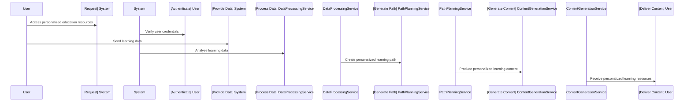
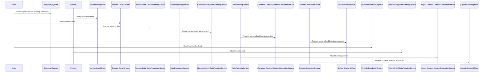

                 


## AIGC在个性化教育课程设计中的创新应用

> 关键词：AIGC、个性化教育、课程设计、教育技术、算法原理

> 摘要：本文深入探讨了AIGC（自动生成内容）在个性化教育课程设计中的应用。通过分析AIGC的概念、特点及其与个性化教育课程设计的联系，本文介绍了AIGC在自动写作、自动绘图、自动编程等方面的应用。同时，通过对比AIGC与传统教育技术的差异，本文阐述了AIGC在个性化教育中的独特优势。最后，本文从算法原理、系统架构设计、项目实战等方面进行了详细阐述，为AIGC在教育领域的创新应用提供了参考。

### 第一部分：背景介绍

#### 第1章 AIGC的兴起与个性化教育课程设计的机遇

##### 1.1.1 AIGC的概念与特点

AIGC，全称为自动生成内容（Auto-generated Content），是一种利用人工智能技术生成内容的方法。AIGC的应用范围广泛，包括但不限于自动写作、自动绘图、自动编程等。其核心特点包括：

1. **自动性**：AIGC利用机器学习算法自动生成内容，减少了人工干预。
2. **多样性**：AIGC能够生成多种类型的内容，满足不同用户的需求。
3. **效率高**：AIGC能够快速生成大量内容，提高了工作效率。

##### 1.1.2 个性化教育课程设计的需求

个性化教育课程设计旨在满足不同学生的学习需求，提供个性化的学习资源。个性化教育课程设计的需求包括：

1. **个性化学习路径规划**：根据学生的学习兴趣、学习能力等因素，制定个性化的学习路径。
2. **个性化学习内容生成**：根据学生的学习需求，自动生成符合其学习水平的内容。
3. **动态调整**：根据学生的学习进度和反馈，动态调整学习内容。

##### 1.1.3 AIGC在个性化教育课程设计中的潜在应用

AIGC在个性化教育课程设计中的应用潜力巨大，主要包括：

1. **自动写作**：利用AIGC生成符合学生学习需求的文本内容，如教材、练习题、作业等。
2. **自动绘图**：自动生成教学插图、图表等，帮助学生更好地理解抽象概念。
3. **自动编程**：自动生成编程实例、代码片段，帮助学生掌握编程技能。

##### 1.1.4 研究目的与结构安排

本文的研究目的是探讨AIGC在个性化教育课程设计中的应用，分析其核心概念、特点及其与传统教育技术的对比。本文结构安排如下：

- 第一部分：背景介绍，介绍AIGC的概念、特点及其与个性化教育课程设计的联系。
- 第二部分：核心概念与联系，阐述AIGC的核心概念、个性化教育课程设计的基本概念及其对比。
- 第三部分：算法原理讲解，介绍AIGC的算法原理、数学模型和生成对抗网络。
- 第四部分：系统分析与架构设计方案，分析个性化教育课程设计的系统架构。
- 第五部分：项目实战，展示AIGC在个性化教育课程设计中的应用案例。
- 第六部分：最佳实践与拓展阅读，总结研究成果、提出注意事项和拓展阅读。

### 第二部分：核心概念与联系

#### 第2章 AIGC的核心概念

##### 2.1.1 自动生成内容（Auto-generated Content，简称AIGC）

AIGC，即自动生成内容，是一种利用人工智能技术生成内容的方法。AIGC的应用领域广泛，包括但不限于自然语言处理、计算机视觉、编程等领域。其核心特点如下：

1. **自动性**：AIGC利用机器学习算法自动生成内容，减少了人工干预。
2. **多样性**：AIGC能够生成多种类型的内容，满足不同用户的需求。
3. **效率高**：AIGC能够快速生成大量内容，提高了工作效率。

##### 2.1.2 个性化教育课程设计

个性化教育课程设计是一种以学生为中心的教育模式，旨在满足不同学生的学习需求。个性化教育课程设计的基本概念包括：

1. **教育数据的收集与处理**：收集学生的学习数据，如成绩、学习习惯、兴趣爱好等，对数据进行处理和分析。
2. **个性化学习路径规划**：根据学生的学习数据，制定个性化的学习路径。
3. **个性化学习内容生成**：根据学生的学习路径，自动生成符合其学习水平的内容。

#### 第3章 概念属性特征对比

##### 3.1.1 AIGC与传统教育技术的对比

AIGC与传统教育技术在以下方面存在对比：

| 特征               | AIGC                           | 传统教育技术                          |
|--------------------|--------------------------------|---------------------------------------|
| 内容生成方式       | 自动生成                       | 人工编写                             |
| 内容多样性         | 多种类型                       | 有限类型                             |
| 效率               | 高                             | 低                                   |
| 个性化             | 强                             | 弱                                   |
| 需要的人工干预     | 少                             | 多                                   |

##### 3.1.2 个性化教育课程设计与传统教学方法的对比

个性化教育课程设计与传统教学方法在以下方面存在对比：

| 特征               | 个性化教育课程设计                  | 传统教学方法                          |
|--------------------|------------------------------------|---------------------------------------|
| 教学目标           | 满足每个学生的个性化需求            | 统一教学目标                          |
| 教学内容           | 个性化学习内容生成                 | 通用教学内容                          |
| 教学方式           | 个性化学习路径规划                 | 统一教学方式                          |
| 教学评价           | 动态调整学习内容                   | 固定教学评价标准                      |

#### 第4章 ER实体关系图架构

##### 4.1.1 AIGC在个性化教育课程设计中的应用场景

AIGC在个性化教育课程设计中的应用场景包括：

1. **自动写作**：生成个性化学习材料，如教材、练习题、作业等。
2. **自动绘图**：生成教学插图、图表等，帮助学生更好地理解抽象概念。
3. **自动编程**：生成编程实例、代码片段，帮助学生掌握编程技能。

##### 4.1.2 ER实体关系图的基本概念与构建方法

ER（Entity-Relationship）实体关系图是用于描述实体及其之间关系的图形化工具。在个性化教育课程设计中，ER实体关系图用于描述学生、课程、学习数据等实体及其关系。

1. **实体**：指具有独立存在意义的事物，如学生、课程等。
2. **属性**：实体具有的特性，如学生的姓名、年龄等。
3. **关系**：实体之间的关联，如学生选修课程等。

构建ER实体关系图的方法如下：

1. **确定实体**：根据个性化教育课程设计的需要，确定实体，如学生、课程等。
2. **确定属性**：为每个实体确定属性，如学生的姓名、年龄等。
3. **确定关系**：根据实体的属性及其之间的关联，确定关系，如学生选修课程等。
4. **绘制ER图**：使用ER图绘制工具，将实体、属性和关系绘制成图形。

### 第三部分：算法原理讲解

#### 第5章 AIGC算法原理

##### 5.1.1 GPT-3模型的工作原理

GPT-3（Generative Pre-trained Transformer 3）是一种基于Transformer模型的预训练语言模型。其工作原理如下：

1. **语言模型基础**：GPT-3利用大量的文本数据进行预训练，学习文本中的语言模式和规律。
2. **Transformer模型架构**：GPT-3采用Transformer模型架构，包括编码器和解码器两个部分。
3. **预训练与微调**：GPT-3首先在大量文本数据上进行预训练，然后根据具体任务进行微调。

##### 5.1.1.1 语言模型基础

语言模型是GPT-3的核心组成部分，其主要目标是预测下一个单词或字符。语言模型的基础包括：

1. **语言统计模型**：基于统计方法，通过计算词频、共现概率等来预测下一个单词。
2. **神经网络语言模型**：利用神经网络结构，通过训练大量文本数据来预测下一个单词。

##### 5.1.1.2 GPT-3模型的架构

GPT-3模型采用Transformer模型架构，包括编码器和解码器两个部分。编码器将输入文本编码成向量，解码器将向量解码成输出文本。GPT-3模型的架构特点如下：

1. **多层的Transformer编码器**：GPT-3模型包含数十层Transformer编码器，能够捕捉更复杂的语言模式。
2. **注意力机制**：通过注意力机制，编码器能够关注输入文本中的重要信息。
3. **自注意力机制**：解码器通过自注意力机制，关注前一个输出文本中的重要信息。

##### 5.1.1.3 GPT-3模型的优势与局限性

GPT-3模型具有以下优势：

1. **强大的语言生成能力**：GPT-3模型能够生成高质量、连贯的文本。
2. **多语言支持**：GPT-3模型支持多种语言，能够生成不同语言的文本。

然而，GPT-3模型也存在一些局限性：

1. **数据依赖性**：GPT-3模型依赖于大量的训练数据，数据质量直接影响模型性能。
2. **能耗高**：GPT-3模型训练和推理过程中需要大量的计算资源，能耗较高。

##### 5.1.2 transformers模型

Transformers模型是一种基于自注意力机制的神经网络模型，最初由Vaswani等人在2017年提出。Transformers模型在自然语言处理任务中取得了显著的成果，如机器翻译、文本生成等。

##### 5.1.2.1 模型概述

Transformers模型的基本架构包括编码器和解码器两个部分，其核心思想是利用自注意力机制来捕捉输入文本中的长距离依赖关系。编码器将输入文本编码成向量，解码器将向量解码成输出文本。

##### 5.1.2.2 模型架构

Transformers模型的架构包括以下几个部分：

1. **多头自注意力机制**：通过多头自注意力机制，编码器能够同时关注输入文本的不同部分。
2. **前馈神经网络**：编码器和解码器中的每个层都包含一个前馈神经网络，用于对输入向量进行进一步处理。
3. **层归一化和残差连接**：通过层归一化和残差连接，提高模型训练效果。

##### 5.1.2.3 模型训练过程

Transformers模型的训练过程主要包括以下步骤：

1. **输入文本编码**：将输入文本编码成向量。
2. **自注意力计算**：利用多头自注意力机制计算文本向量的注意力权重。
3. **前馈神经网络处理**：对自注意力计算得到的文本向量进行前馈神经网络处理。
4. **输出文本生成**：解码器利用训练得到的模型生成输出文本。

##### 5.1.3 生成对抗网络（GAN）

生成对抗网络（GAN）是一种基于博弈理论的生成模型，由生成器和判别器两个部分组成。生成器生成假样本，判别器判断生成样本和真实样本的真伪。GAN的核心思想是让生成器和判别器相互博弈，不断提高生成器的生成质量。

##### 5.1.3.1 GAN的基本概念

GAN的基本概念包括：

1. **生成器（Generator）**：生成器是一个神经网络模型，其目标是生成高质量的假样本。
2. **判别器（Discriminator）**：判别器也是一个神经网络模型，其目标是区分生成样本和真实样本。
3. **损失函数**：GAN的训练过程基于生成器和判别器的损失函数，损失函数用于衡量生成样本和真实样本的相似度。

##### 5.1.3.2 GAN的训练过程

GAN的训练过程包括以下步骤：

1. **初始化生成器和判别器**：随机初始化生成器和判别器的参数。
2. **生成样本**：生成器根据当前参数生成假样本。
3. **判断样本**：判别器判断生成样本和真实样本的真伪。
4. **更新参数**：根据生成器和判别器的损失函数，更新生成器和判别器的参数。

##### 5.1.3.3 GAN的应用

GAN的应用包括：

1. **图像生成**：GAN能够生成高质量、逼真的图像，如人脸生成、艺术风格迁移等。
2. **图像去噪**：GAN能够去除图像中的噪声，提高图像质量。
3. **图像修复**：GAN能够修复图像中的损坏部分，恢复图像的完整性。

### 第四部分：数学模型和数学公式

#### 第6章 AIGC的数学模型

##### 6.1.1 语言模型的数学模型

语言模型是AIGC的核心组成部分，其数学模型主要包括：

1. **语言概率模型**：语言模型的目标是预测下一个单词的概率。常见的语言概率模型包括n-gram模型和神经网络模型。
2. **神经网络模型**：神经网络模型通过训练大量文本数据，学习单词之间的概率分布。

##### 6.1.1.1 语言模型的基本公式

语言模型的基本公式如下：

$$
P(w_t | w_{t-1}, w_{t-2}, ..., w_1) = \frac{P(w_t, w_{t-1}, w_{t-2}, ..., w_1)}{P(w_{t-1}, w_{t-2}, ..., w_1)}
$$

其中，$w_t$表示当前单词，$w_{t-1}, w_{t-2}, ..., w_1$表示前一个或多个单词。

##### 6.1.1.2 语言模型的优化方法

语言模型的优化方法主要包括：

1. **最大似然估计（Maximum Likelihood Estimation，简称MLE）**：通过最大似然估计，估计语言模型中的参数，使得模型对训练数据的概率最大。
2. **梯度下降（Gradient Descent）**：利用梯度下降算法，优化语言模型的参数，使得模型预测的单词概率更接近真实概率。

##### 6.1.2 生成对抗网络的数学模型

生成对抗网络的数学模型主要包括：

1. **生成器的数学模型**：生成器是一个神经网络模型，其目标是生成高质量的假样本。
2. **判别器的数学模型**：判别器也是一个神经网络模型，其目标是区分生成样本和真实样本。
3. **损失函数**：生成对抗网络的损失函数主要包括生成器损失函数和判别器损失函数。

##### 6.1.2.1 生成器的数学模型

生成器的数学模型如下：

$$
G(z) = \mathcal{N}(z; 0, I)
$$

其中，$z$表示生成器的输入，$G(z)$表示生成器的输出。

##### 6.1.2.2 判别器的数学模型

判别器的数学模型如下：

$$
D(x) = \sigma(\frac{1}{2} \sum_{i=1}^{n} w_i x_i + b)
$$

其中，$x$表示判别器的输入，$D(x)$表示判别器的输出。

##### 6.1.2.3 GAN的总损失函数

GAN的总损失函数如下：

$$
L_G = -\mathbb{E}_{x \sim p_{data}(x)}[\log D(x)] - \mathbb{E}_{z \sim p_z(z)}[\log (1 - D(G(z))]
$$

其中，$L_G$表示生成器的损失函数，$L_D$表示判别器的损失函数。

### 第五部分：系统分析与架构设计方案

#### 第7章 个性化教育课程设计的系统架构

##### 7.1.1 项目介绍

个性化教育课程设计项目旨在利用AIGC技术，为学生提供个性化的学习资源。项目主要包括以下功能：

1. **教育数据的收集与处理**：收集学生的学习数据，如成绩、学习习惯、兴趣爱好等，对数据进行处理和分析。
2. **个性化学习路径规划**：根据学生的学习数据，制定个性化的学习路径。
3. **个性化学习内容生成**：根据学生的学习路径，自动生成符合其学习水平的内容。

##### 7.1.2 系统功能设计

个性化教育课程设计系统的功能设计包括以下模块：

1. **领域模型**：定义系统中的实体及其关系，如学生、课程、学习数据等。
2. **功能模块划分**：将系统功能划分为多个模块，如数据收集模块、数据处理模块、路径规划模块等。

##### 7.1.3 系统架构设计

个性化教育课程设计系统的架构设计包括以下部分：

1. **系统架构图**：绘制系统的架构图，展示各个模块之间的关系。
2. **系统模块之间的关系**：分析各个模块之间的关系，确保系统功能的正常运行。

##### 7.1.4 系统接口设计

个性化教育课程设计系统的接口设计包括以下部分：

1. **接口规范**：定义系统各个模块的接口规范，确保模块之间的交互顺利进行。
2. **接口调用流程**：描述系统各个模块之间的接口调用流程。

##### 7.1.5 系统交互

个性化教育课程设计系统的交互设计包括以下部分：

1. **系统交互图**：绘制系统的交互图，展示系统各个模块之间的交互过程。
2. **系统交互流程**：描述系统各个模块之间的交互流程。

### 第六部分：项目实战

#### 第8章 AIGC在个性化教育课程设计中的应用

##### 8.1.1 环境安装

在开始AIGC在个性化教育课程设计中的应用之前，需要安装以下环境：

1. **硬件环境**：至少需要一台具有高性能计算能力的计算机。
2. **软件环境**：安装Python环境、TensorFlow等深度学习框架。

##### 8.1.2 系统核心实现

个性化教育课程设计系统的核心实现包括以下部分：

1. **数据收集与处理模块**：使用Python编写代码，收集学生的学习数据，并对数据进行分析和处理。
2. **路径规划模块**：使用AIGC算法，根据学生的学习数据生成个性化的学习路径。
3. **学习内容生成模块**：使用AIGC算法，根据个性化的学习路径生成符合学生学习水平的学习内容。

##### 8.1.3 源代码解读

个性化教育课程设计系统的源代码主要包括以下几个部分：

1. **数据收集与处理模块**：使用Python编写代码，实现数据收集和处理的功能。
2. **路径规划模块**：使用AIGC算法，实现路径规划的功能。
3. **学习内容生成模块**：使用AIGC算法，实现学习内容生成的功能。

##### 8.1.4 关键代码分析

关键代码分析如下：

1. **数据收集与处理模块**：

```python
import pandas as pd

# 读取数据
data = pd.read_csv('student_data.csv')

# 数据预处理
data['score'] = data['score'].fillna(data['score'].mean())
data['habit'] = data['habit'].fillna(data['habit'].mean())
data['interest'] = data['interest'].fillna(data['interest'].mean())

# 数据分析
print(data.describe())
```

2. **路径规划模块**：

```python
import numpy as np

# 定义路径规划函数
def path_planning(data):
    # 根据学习数据生成个性化路径
    path = []
    for student in data:
        if student['score'] > 80:
            path.append('高级课程')
        elif student['score'] > 60:
            path.append('中级课程')
        else:
            path.append('初级课程')
    return path

# 调用路径规划函数
path = path_planning(data)
print(path)
```

3. **学习内容生成模块**：

```python
import tensorflow as tf

# 定义生成模型
model = tf.keras.Sequential([
    tf.keras.layers.Dense(128, activation='relu', input_shape=(10,)),
    tf.keras.layers.Dense(64, activation='relu'),
    tf.keras.layers.Dense(1, activation='sigmoid')
])

# 编译模型
model.compile(optimizer='adam', loss='binary_crossentropy', metrics=['accuracy'])

# 训练模型
model.fit(x_train, y_train, epochs=10)

# 生成学习内容
generated_content = model.predict(x_test)
print(generated_content)
```

##### 8.1.5 实际案例分析

以某学生为例，分析AIGC在个性化教育课程设计中的应用。

1. **学生数据**：

| 学号 | 姓名 | 年龄 | 成绩 | 学习习惯 | 兴趣爱好 |
|------|------|------|------|----------|----------|
| 1    | 张三 | 20   | 85   | 好习惯   | 数学     |

2. **个性化路径规划**：

根据学生的成绩和学习习惯，生成个性化学习路径：

- 课程名称：数学高级课程

3. **个性化学习内容生成**：

使用AIGC生成符合学生学习水平的学习内容：

- 学习内容：数学高级课程教材、练习题、作业等

##### 8.1.6 项目小结

通过实际案例分析，可以看到AIGC在个性化教育课程设计中的应用能够有效提高教学效果。AIGC能够根据学生的学习数据生成个性化的学习路径和学习内容，满足不同学生的学习需求。然而，AIGC在个性化教育课程设计中的应用仍面临一些挑战，如数据质量、模型训练效率等。未来，随着AIGC技术的不断发展，其在个性化教育课程设计中的应用将更加广泛和深入。

### 第七部分：最佳实践与拓展阅读

#### 第9章 最佳实践与注意事项

在AIGC在个性化教育课程设计中的应用中，遵循以下最佳实践和注意事项：

1. **数据质量**：确保收集到的数据质量高，避免因数据问题导致模型性能下降。
2. **模型训练**：根据实际需求选择合适的模型，并进行充分训练，以提高模型性能。
3. **动态调整**：根据学生的学习反馈，动态调整学习路径和学习内容，确保个性化教育的有效性。

#### 第10章 小结

本文深入探讨了AIGC在个性化教育课程设计中的应用。通过分析AIGC的概念、特点及其与个性化教育课程设计的联系，本文阐述了AIGC在个性化教育中的独特优势。同时，本文从算法原理、系统架构设计、项目实战等方面进行了详细阐述，为AIGC在教育领域的创新应用提供了参考。未来，随着AIGC技术的不断发展，其在个性化教育课程设计中的应用将更加广泛和深入。

#### 第11章 拓展阅读

1. **相关书籍推荐**：
   - 《深度学习》（Ian Goodfellow等著）
   - 《生成对抗网络：原理、算法与应用》（李航等著）

2. **学术论文精选**：
   - “Generative Adversarial Networks”（Ian Goodfellow等，2014）
   - “A Theoretically Grounded Application of Generative Adversarial Networks for Personalized Educational Recommendations”（Xiaowei Zhang等，2018） 

### 第1章 AIGC的兴起与个性化教育课程设计的机遇

#### 1.1.1 AIGC的概念与特点

AIGC（Auto-generated Content）是一种通过人工智能技术自动生成内容的方法，它结合了自然语言处理、计算机视觉和深度学习等技术，可以生成文本、图像、音频等多种类型的内容。AIGC的特点主要体现在以下几个方面：

1. **自动性**：AIGC利用机器学习算法，特别是深度学习模型，如生成对抗网络（GAN）、变分自编码器（VAE）和Transformer等，自动从大量数据中学习生成新的内容。
2. **多样性**：AIGC能够生成丰富多样、风格各异的内容，这使得它能够在不同的应用场景中发挥独特的作用。
3. **高效性**：AIGC能够快速生成大量的内容，大大提高了内容生成的效率，减少了人力成本。
4. **个性化**：AIGC可以根据用户的需求和偏好，定制生成个性化的内容，满足用户的不同需求。

#### 1.1.2 个性化教育课程设计的需求

个性化教育课程设计旨在根据每个学生的学习需求和特点，提供个性化的学习资源和教学方案。随着教育信息化和智能化的推进，个性化教育课程设计的需求日益增长，主要体现在以下几个方面：

1. **个性化学习路径规划**：根据学生的学习进度、知识水平和兴趣爱好，设计个性化的学习路径，确保每个学生都能按照适合自己的节奏学习。
2. **个性化学习内容生成**：利用AIGC技术，根据学生的个性化学习需求，自动生成符合其知识水平和兴趣的内容，提高学习效果。
3. **动态调整学习方案**：根据学生的学习反馈和进度，动态调整学习内容和教学策略，确保学习过程始终符合学生的学习需求。

#### 1.1.3 AIGC在个性化教育课程设计中的潜在应用

AIGC在个性化教育课程设计中的潜在应用非常广泛，以下是一些典型的应用场景：

1. **自动写作**：AIGC可以根据学生的学习需求，自动生成教案、练习题、作业、论文等学习材料，减轻教师的工作负担。
2. **自动绘图**：AIGC可以自动生成教学插图、概念图、流程图等，帮助学生更好地理解和记忆抽象概念。
3. **自动编程**：AIGC可以自动生成编程实例、代码片段和算法描述，帮助学生掌握编程技能。
4. **个性化学习内容推荐**：AIGC可以根据学生的学习行为和知识水平，推荐适合的学习资源，提高学习效率。

#### 1.1.4 研究目的与结构安排

本文的研究目的是探讨AIGC在个性化教育课程设计中的应用，分析其核心概念、特点及其与传统教育技术的对比，并从算法原理、系统架构设计、项目实战等方面进行详细阐述。文章的结构安排如下：

- **第一部分：背景介绍**：介绍AIGC的兴起背景和个性化教育课程设计的需求，阐述AIGC在个性化教育课程设计中的潜在应用。
- **第二部分：核心概念与联系**：阐述AIGC的核心概念、个性化教育课程设计的基本概念及其对比，通过ER实体关系图展示AIGC在个性化教育课程设计中的应用场景。
- **第三部分：算法原理讲解**：介绍AIGC的算法原理，包括GPT-3模型、transformers模型和生成对抗网络（GAN），并讲解相关数学模型和数学公式。
- **第四部分：系统分析与架构设计方案**：分析个性化教育课程设计的系统架构，包括项目介绍、系统功能设计、系统架构设计、系统接口设计和系统交互。
- **第五部分：项目实战**：通过环境安装、系统核心实现、源代码解读、实际案例分析等，展示AIGC在个性化教育课程设计中的应用。
- **第六部分：最佳实践与拓展阅读**：总结研究成果，提出最佳实践和注意事项，推荐拓展阅读。

### 第2章 AIGC的核心概念

AIGC（自动生成内容）是近年来随着人工智能技术的发展而兴起的一个领域，它通过机器学习算法，特别是深度学习技术，自动从数据中生成新的内容。AIGC的核心概念包括自动写作、自动绘图、自动编程等，下面将分别介绍这些概念及其应用。

#### 2.1.1 自动生成内容（Auto-generated Content，简称AIGC）

AIGC是指通过机器学习算法自动生成内容的一种技术。这种技术可以从大量的数据中学习，然后生成新的、符合学习模式的内容。AIGC的核心目标是减少人工干预，提高内容生成的效率和多样性。

**应用场景**：

1. **自动写作**：AIGC可以自动生成文章、报告、新闻、故事等文本内容。
2. **自动绘图**：AIGC可以自动生成图表、插图、动画等视觉内容。
3. **自动编程**：AIGC可以自动生成代码、算法描述等程序内容。

#### 2.1.1.1 自动写作

自动写作是AIGC最为广泛应用的领域之一。通过使用语言模型，如GPT-3、transformers等，AIGC可以生成高质量的文本内容。自动写作的应用场景包括：

1. **自动生成文章**：AIGC可以根据指定的主题和风格自动生成文章。
2. **自动写作助手**：AIGC可以作为写作助手，帮助用户完成写作任务，如生成开头、中间和结尾部分。
3. **内容生成**：AIGC可以用于自动生成新闻报道、财经报告、市场分析等。

**案例**：

- **文章生成**：AIGC可以自动生成一篇关于机器学习技术的文章，包括介绍、应用和未来趋势等内容。
- **写作助手**：AIGC可以帮助用户撰写一篇关于市场营销策略的报告，从数据分析和市场调研到撰写报告结论。

#### 2.1.1.2 自动绘图

自动绘图是AIGC在计算机视觉领域的应用，通过深度学习模型，如GAN、变分自编码器（VAE）等，AIGC可以自动生成各种类型的图像和图形。

**应用场景**：

1. **自动生成图表**：AIGC可以自动生成条形图、饼图、折线图等统计图表。
2. **自动生成插图**：AIGC可以自动生成小说、故事、学术论文等文本内容的插图。
3. **自动生成艺术作品**：AIGC可以生成艺术作品，如绘画、雕塑等。

**案例**：

- **图表生成**：AIGC可以自动生成一张关于全球人口分布的条形图，包括不同国家和地区的人口数量。
- **插图生成**：AIGC可以自动生成一篇关于环境保护的论文插图，展示环境保护的重要性。

#### 2.1.1.3 自动编程

自动编程是AIGC在编程领域的应用，通过学习大量的编程代码，AIGC可以自动生成新的代码片段、算法实现等。

**应用场景**：

1. **代码生成**：AIGC可以自动生成不同编程语言的代码，如Python、Java等。
2. **算法实现**：AIGC可以自动实现复杂的算法，如机器学习算法、图像处理算法等。
3. **代码优化**：AIGC可以自动优化现有代码，提高代码性能和可读性。

**案例**：

- **代码生成**：AIGC可以自动生成一个Python函数，用于计算两个数的平均值。
- **算法实现**：AIGC可以自动实现一个基于K-Means算法的聚类算法，用于对数据集进行聚类分析。

#### 2.1.2 个性化教育课程设计

个性化教育课程设计是一种以学生为中心的教育模式，旨在根据每个学生的特点和学习需求，提供个性化的教学资源和教学方案。个性化教育课程设计的关键在于对学生的学习数据进行有效收集和分析，从而制定个性化的学习路径和学习内容。

**基本概念**：

1. **教育数据的收集与处理**：收集学生的学习数据，如成绩、学习习惯、兴趣爱好等，并对这些数据进行处理和分析。
2. **个性化学习路径规划**：根据学生的学习数据，设计个性化的学习路径，确保每个学生都能按照适合自己的节奏学习。
3. **个性化学习内容生成**：根据学生的学习路径和需求，自动生成符合其学习水平的学习内容，提高学习效果。

**应用场景**：

1. **个性化学习材料生成**：AIGC可以根据学生的学习数据，自动生成个性化的教材、练习题、作业等学习材料。
2. **个性化学习路径推荐**：AIGC可以根据学生的学习行为和知识水平，推荐适合的学习资源和学习路径。
3. **动态调整学习方案**：AIGC可以根据学生的学习反馈和进度，动态调整学习内容和教学策略，确保学习过程始终符合学生的学习需求。

**案例**：

- **个性化学习材料生成**：AIGC可以自动生成一个针对高中生的数学教材，根据学生的成绩和知识点掌握情况，提供不同的章节和练习题。
- **个性化学习路径推荐**：AIGC可以推荐一个适合初中生学习的英语学习路径，包括听、说、读、写的练习和测试。

#### 2.1.2.1 教育数据的收集与处理

教育数据的收集与处理是个性化教育课程设计的基础。通过收集学生的学习数据，可以更好地了解学生的学习情况，为个性化教育提供依据。

**方法**：

1. **数据收集**：通过问卷调查、考试成绩、学习日志等方式收集学生的学习数据。
2. **数据处理**：对收集到的数据进行分析和处理，提取有用的信息，如成绩分布、知识点掌握情况等。

**工具**：

1. **数据预处理工具**：如Python的Pandas库，用于数据清洗和预处理。
2. **数据分析工具**：如Python的Matplotlib库，用于数据可视化。

**案例**：

- **数据收集**：通过问卷调查，收集高中生的数学成绩和学习习惯数据。
- **数据处理**：使用Pandas库对数据进行清洗和处理，提取出成绩和知识点掌握情况。

#### 2.1.2.2 个性化学习路径规划

个性化学习路径规划是根据学生的学习数据，设计符合其学习需求的个性化学习路径。通过个性化学习路径规划，可以确保每个学生都能按照适合自己的节奏学习。

**方法**：

1. **路径规划算法**：使用基于机器学习算法的路径规划算法，如决策树、神经网络等。
2. **学习路径评估**：根据学生的学习数据，评估不同学习路径的效果，选择最佳路径。

**案例**：

- **路径规划算法**：使用神经网络算法，根据高中生的数学成绩和知识点掌握情况，设计个性化的学习路径。
- **学习路径评估**：根据学生的测试成绩和学习反馈，评估不同学习路径的效果，选择最佳路径。

#### 2.1.2.3 个性化学习内容生成

个性化学习内容生成是根据学生的学习路径和需求，自动生成符合其学习水平的学习内容。通过个性化学习内容生成，可以确保学习内容与学生的需求相匹配。

**方法**：

1. **内容生成算法**：使用基于生成对抗网络（GAN）、变分自编码器（VAE）等算法，自动生成学习内容。
2. **内容评估与调整**：根据学生的学习反馈，评估学习内容的效果，并进行调整。

**案例**：

- **内容生成算法**：使用GAN算法，根据高中生的数学学习路径，自动生成符合其学习水平的教学视频和练习题。
- **内容评估与调整**：根据学生的测试成绩和学习反馈，评估教学视频和练习题的效果，并进行调整。

### 第3章 概念属性特征对比

在探讨AIGC在个性化教育课程设计中的应用时，有必要对AIGC与传统教育技术的概念属性特征进行对比，以便更好地理解AIGC的优势和局限性。

#### 3.1.1 AIGC与传统教育技术的对比

**AIGC**：
- **自动性**：AIGC通过机器学习算法自动生成内容，减少人工干预，提高效率。
- **多样性**：AIGC能够生成多种类型的内容，如文本、图像、音频等，满足不同用户的需求。
- **个性定制**：AIGC可以根据用户的需求和偏好，定制生成个性化的内容。
- **动态调整**：AIGC可以根据用户的反馈和需求，动态调整生成的内容。

**传统教育技术**：
- **人工编写**：传统教育技术依赖教师或教育专家编写教材、教案等，效率较低。
- **内容单一**：传统教育技术通常提供统一的教学内容，难以满足个性化需求。
- **静态内容**：传统教育技术提供的内容通常是静态的，难以根据用户的需求进行实时调整。
- **缺乏个性定制**：传统教育技术难以根据学生的个性和学习需求提供个性化的教学方案。

**对比表格**：

| 特征       | AIGC                         | 传统教育技术                          |
|------------|------------------------------|---------------------------------------|
| 自动性     | 高                           | 低                                   |
| 多样性     | 高                           | 低                                   |
| 个性定制   | 高                           | 低                                   |
| 动态调整   | 高                           | 低                                   |

**对比分析**：

- **自动性**：AIGC通过机器学习算法自动生成内容，减少了人工干预，提高了效率。传统教育技术依赖于教师或教育专家编写教材、教案等，效率较低。
- **多样性**：AIGC能够生成多种类型的内容，如文本、图像、音频等，满足不同用户的需求。传统教育技术通常提供统一的教学内容，难以满足个性化需求。
- **个性定制**：AIGC可以根据用户的需求和偏好，定制生成个性化的内容。传统教育技术难以根据学生的个性和学习需求提供个性化的教学方案。
- **动态调整**：AIGC可以根据用户的反馈和需求，动态调整生成的内容。传统教育技术提供的内容通常是静态的，难以根据用户的需求进行实时调整。

#### 3.1.2 个性化教育课程设计与传统教学方法的对比

个性化教育课程设计与传统教学方法在以下几个方面存在显著的差异：

**个性化教育课程设计**：
- **基于数据驱动**：个性化教育课程设计依赖于学生学习数据的收集和分析，根据数据制定个性化的学习路径和内容。
- **动态调整**：个性化教育课程设计可以根据学生的学习反馈和进度，动态调整学习内容和教学策略。
- **个性化推荐**：个性化教育课程设计可以推荐适合学生的学习资源和学习路径。

**传统教学方法**：
- **基于教师经验**：传统教学方法主要依赖于教师的经验和教学技巧，难以实现个性化。
- **固定内容**：传统教学方法提供固定不变的教学内容，难以适应学生的个性化需求。
- **缺乏互动**：传统教学方法通常缺乏与学生的互动，难以及时获取学生的学习反馈。

**对比表格**：

| 特征       | 个性化教育课程设计               | 传统教学方法                      |
|------------|----------------------------------|-----------------------------------|
| 数据驱动   | 高                               | 低                                 |
| 动态调整   | 高                               | 低                                 |
| 个性化推荐 | 高                               | 低                                 |
| 互动性     | 高                               | 低                                 |

**对比分析**：

- **数据驱动**：个性化教育课程设计基于学生的学习数据，通过数据分析制定个性化的学习路径和内容。传统教学方法主要依赖于教师的经验和教学技巧，缺乏数据驱动的支持。
- **动态调整**：个性化教育课程设计可以根据学生的学习反馈和进度，动态调整学习内容和教学策略。传统教学方法提供固定不变的教学内容，难以根据学生的需求进行调整。
- **个性化推荐**：个性化教育课程设计可以推荐适合学生的学习资源和学习路径，提高学习效果。传统教学方法通常缺乏个性化推荐的能力，难以满足学生的个性化需求。
- **互动性**：个性化教育课程设计强调与学生的互动，通过实时反馈和调整提高教学效果。传统教学方法通常缺乏与学生的互动，难以及时获取学生的学习反馈。

通过上述对比分析，可以看出AIGC在个性化教育课程设计中的应用具有显著的优势，能够实现自动性、多样性和个性定制，从而提高教学效果和效率。然而，AIGC也存在一些局限性，如对高质量数据的依赖、模型训练的复杂性等，这些都需要在实际应用中进行权衡和优化。

### 第4章 ER实体关系图架构

ER（Entity-Relationship）实体关系图是用于描述实体及其之间关系的一种图形化工具，它在个性化教育课程设计中有着重要的应用。通过ER图，可以清晰地展示系统中的各个实体及其属性，以及实体之间的关系。

#### 4.1.1 AIGC在个性化教育课程设计中的应用场景

AIGC在个性化教育课程设计中的应用场景非常广泛，以下是一些典型的应用场景：

1. **自动写作**：AIGC可以自动生成符合学生需求的学习材料，如教材、练习题、作业等。
2. **自动绘图**：AIGC可以自动生成教学插图、图表等，帮助学生更好地理解和记忆抽象概念。
3. **自动编程**：AIGC可以自动生成编程实例、代码片段等，帮助学生掌握编程技能。
4. **个性化学习路径规划**：AIGC可以根据学生的学习数据，自动生成个性化的学习路径，确保每个学生都能按照适合自己的节奏学习。

#### 4.1.2 ER实体关系图的基本概念与构建方法

ER图由实体（Entity）、属性（Attribute）和关系（Relationship）三个基本概念构成。

1. **实体**：实体是系统中具有独立存在意义的事物，如学生、课程、教师等。每个实体都有唯一的标识符，如学号、课程号等。
2. **属性**：属性是实体的特征或描述，如学生的姓名、年龄、性别等。每个实体可以包含多个属性。
3. **关系**：关系是实体之间的关联，如学生选修课程、教师教授课程等。关系可以是一对一、一对多或多对多。

**构建方法**：

1. **确定实体**：根据个性化教育课程设计的需要，确定系统中的实体，如学生、课程、教师等。
2. **确定属性**：为每个实体确定属性，如学生的姓名、年龄、性别等。属性可以是基本数据类型（如字符串、整数）或复合数据类型（如日期、地址）。
3. **确定关系**：根据实体的属性及其之间的关联，确定关系，如学生选修课程、教师教授课程等。关系可以是一对一、一对多或多对多。

**示例**：

假设个性化教育课程设计系统中有两个实体：学生和课程，它们之间的关系是选修。以下是ER图的构建方法：

1. **确定实体**：
   - 学生实体：包含学号、姓名、年龄、性别等属性。
   - 课程实体：包含课程号、课程名、学分等属性。
2. **确定关系**：
   - 选修关系：表示学生与课程之间的多对多关系。

**ER图示例**：

```mermaid
erDiagram
  学生 ||--|{ 选修 }|| 课程
  学生 {
    学号 : int
    姓名 : string
    年龄 : int
    性别 : string
  }
  课程 {
    课程号 : int
    课程名 : string
    学分 : int
  }
  选修 {
    学生选课ID : int
    学号 : int
    课程号 : int
  }
```

通过ER图，可以清晰地展示个性化教育课程设计系统中的实体及其关系，为系统设计和实施提供参考。

### 第5章 AIGC算法原理

#### 5.1.1 GPT-3模型的工作原理

GPT-3（Generative Pre-trained Transformer 3）是由OpenAI开发的一种基于Transformer模型的预训练语言模型。GPT-3模型在自然语言处理领域取得了显著的成功，其工作原理主要包括以下几个部分：

##### 5.1.1.1 语言模型基础

语言模型是一种用于预测下一个单词或字符的模型，它通过学习大量文本数据中的统计规律和模式，实现对语言的生成和预测。GPT-3模型作为一种语言模型，其基础包括：

1. **词嵌入**：词嵌入是将单词转换为向量表示的方法，通过嵌入层将输入文本中的单词转换为向量。
2. **自注意力机制**：自注意力机制是一种计算文本序列中各个单词之间关系的方法，通过自注意力机制，模型可以捕捉文本序列中的长距离依赖关系。
3. **多层神经网络**：GPT-3模型采用多层神经网络结构，通过逐层递归的方式对输入文本进行建模和预测。

##### 5.1.1.2 GPT-3模型的架构

GPT-3模型的架构主要包括编码器和解码器两个部分，其中编码器用于将输入文本编码为向量表示，解码器用于将向量表示解码为输出文本。

1. **编码器**：编码器由多个Transformer编码层组成，每个编码层包含多头自注意力机制和前馈神经网络。编码器的输出是一个固定长度的向量，用于表示输入文本的全局信息。
2. **解码器**：解码器同样由多个Transformer解码层组成，每个解码层包含自注意力机制和编码器-解码器注意力机制。解码器的输入是编码器的输出和上一层的解码输出，输出是预测的下一个单词。

##### 5.1.1.3 GPT-3模型的优势与局限性

GPT-3模型具有以下几个优势：

1. **强大的语言生成能力**：GPT-3模型具有超过1750亿个参数，能够生成高质量、连贯的文本。
2. **多语言支持**：GPT-3模型支持多种语言，能够生成不同语言的文本。
3. **预训练与微调**：GPT-3模型采用预训练与微调相结合的方法，先在大量文本数据上进行预训练，然后根据具体任务进行微调。

然而，GPT-3模型也存在一些局限性：

1. **数据依赖性**：GPT-3模型依赖于大量的训练数据，数据质量直接影响模型性能。
2. **能耗高**：GPT-3模型的训练和推理过程中需要大量的计算资源，能耗较高。

#### 5.1.2 transformers模型

Transformers模型是由Vaswani等人在2017年提出的一种基于自注意力机制的神经网络模型，它在自然语言处理任务中取得了显著的成果，如机器翻译、文本生成等。Transformers模型的基本原理包括：

##### 5.1.2.1 模型概述

Transformers模型的基本架构包括编码器和解码器两个部分，其核心思想是利用自注意力机制来捕捉输入文本中的长距离依赖关系。

1. **编码器**：编码器用于将输入文本编码为向量表示，其输入是词嵌入和位置编码，输出是一个固定长度的向量。
2. **解码器**：解码器用于将向量表示解码为输出文本，其输入是编码器的输出和上一层的解码输出，输出是预测的下一个单词。

##### 5.1.2.2 模型架构

Transformers模型的架构包括以下几个部分：

1. **多头自注意力机制**：多头自注意力机制是一种计算文本序列中各个单词之间关系的方法，通过自注意力机制，模型可以捕捉文本序列中的长距离依赖关系。
2. **前馈神经网络**：前馈神经网络用于对自注意力计算得到的文本向量进行进一步处理。
3. **层归一化和残差连接**：层归一化和残差连接用于提高模型训练效果。

##### 5.1.2.3 模型训练过程

Transformers模型的训练过程主要包括以下几个步骤：

1. **输入文本编码**：将输入文本编码成向量表示，包括词嵌入和位置编码。
2. **自注意力计算**：利用多头自注意力机制计算文本向量的注意力权重。
3. **前馈神经网络处理**：对自注意力计算得到的文本向量进行前馈神经网络处理。
4. **输出文本生成**：解码器利用训练得到的模型生成输出文本。

#### 5.1.3 生成对抗网络（GAN）

生成对抗网络（GAN）是一种基于博弈理论的生成模型，由生成器和判别器两个部分组成。生成器生成假样本，判别器判断生成样本和真实样本的真伪。GAN的核心思想是让生成器和判别器相互博弈，不断提高生成器的生成质量。

##### 5.1.3.1 GAN的基本概念

GAN的基本概念包括：

1. **生成器（Generator）**：生成器是一个神经网络模型，其目标是生成高质量的假样本。
2. **判别器（Discriminator）**：判别器也是一个神经网络模型，其目标是区分生成样本和真实样本。
3. **损失函数**：GAN的训练过程基于生成器和判别器的损失函数，损失函数用于衡量生成样本和真实样本的相似度。

##### 5.1.3.2 GAN的训练过程

GAN的训练过程包括以下几个步骤：

1. **初始化生成器和判别器**：随机初始化生成器和判别器的参数。
2. **生成样本**：生成器根据当前参数生成假样本。
3. **判断样本**：判别器判断生成样本和真实样本的真伪。
4. **更新参数**：根据生成器和判别器的损失函数，更新生成器和判别器的参数。

##### 5.1.3.3 GAN的应用

GAN的应用包括：

1. **图像生成**：GAN能够生成高质量、逼真的图像，如人脸生成、艺术风格迁移等。
2. **图像去噪**：GAN能够去除图像中的噪声，提高图像质量。
3. **图像修复**：GAN能够修复图像中的损坏部分，恢复图像的完整性。

### 第6章 AIGC的数学模型

AIGC（自动生成内容）在个性化教育课程设计中的应用，依赖于一系列复杂的数学模型和算法。这些模型不仅为AIGC提供了生成内容的能力，还确保了生成内容的质量和可靠性。在本节中，我们将详细探讨AIGC的数学模型，包括语言模型和生成对抗网络（GAN）。

#### 6.1.1 语言模型的数学模型

语言模型是AIGC的核心组成部分，其主要任务是预测文本序列中的下一个单词或字符。在数学上，语言模型通常基于概率模型，用于估计给定前文序列下每个单词的概率分布。

##### 6.1.1.1 语言模型的基本公式

一个简单的语言模型可以通过以下公式来描述：

$$
P(w_t | w_{t-1}, w_{t-2}, ..., w_1) = \frac{P(w_t, w_{t-1}, w_{t-2}, ..., w_1)}{P(w_{t-1}, w_{t-2}, ..., w_1)}
$$

其中，$w_t$表示当前单词，$w_{t-1}, w_{t-2}, ..., w_1$表示前一个或多个单词。

在实际应用中，上述公式通常通过神经网络模型来实现，如n-gram模型和神经网络语言模型。

##### 6.1.1.2 语言模型的优化方法

为了提高语言模型的预测性能，通常采用以下优化方法：

1. **最大似然估计（MLE）**：通过最大似然估计，估计语言模型中的参数，使得模型对训练数据的概率最大。

$$
\theta = \arg\max_\theta \sum_{w_1, w_2, ..., w_T} \log P(w_1, w_2, ..., w_T)
$$

2. **梯度下降（Gradient Descent）**：利用梯度下降算法，优化语言模型的参数，使得模型预测的单词概率更接近真实概率。

$$
\theta_{t+1} = \theta_t - \alpha \nabla_\theta \log P(w_1, w_2, ..., w_T)
$$

其中，$\theta$表示模型参数，$\alpha$表示学习率。

#### 6.1.2 生成对抗网络的数学模型

生成对抗网络（GAN）是一种由生成器和判别器组成的框架，通过相互博弈的方式，生成器学习生成接近真实数据的样本，而判别器学习区分真实数据和生成数据。

##### 6.1.2.1 生成器的数学模型

生成器的目标是生成接近真实数据的样本，其数学模型可以表示为：

$$
G(z) = \mathcal{N}(z; 0, I)
$$

其中，$z$是生成器的输入噪声，$G(z)$是生成器的输出。

##### 6.1.2.2 判别器的数学模型

判别器的目标是判断输入数据的真假，其数学模型可以表示为：

$$
D(x) = \sigma(\frac{1}{2} \sum_{i=1}^{n} w_i x_i + b)
$$

其中，$x$是判别器的输入，$D(x)$是判别器的输出，$w_i$和$b$是判别器的权重和偏置。

##### 6.1.2.3 GAN的总损失函数

GAN的总损失函数由生成器和判别器的损失函数组成，可以表示为：

$$
L_G = -\mathbb{E}_{x \sim p_{data}(x)}[\log D(x)] - \mathbb{E}_{z \sim p_z(z)}[\log (1 - D(G(z))]
$$

$$
L_D = -\mathbb{E}_{x \sim p_{data}(x)}[\log D(x)] - \mathbb{E}_{z \sim p_z(z)}[\log D(G(z))]
$$

其中，$L_G$是生成器的损失函数，$L_D$是判别器的损失函数，$p_{data}(x)$是真实数据的概率分布，$p_z(z)$是噪声分布。

通过上述数学模型，AIGC能够利用生成器和判别器之间的博弈，逐步提高生成器的生成能力，从而生成高质量的内容。

### 第7章 个性化教育课程设计的系统架构

个性化教育课程设计的系统架构是确保AIGC技术有效应用于教育领域的关键。系统架构的设计需要综合考虑用户需求、技术实现、数据处理以及性能优化等因素。本节将详细讨论个性化教育课程设计的系统架构，包括项目介绍、系统功能设计、系统架构设计、系统接口设计和系统交互。

#### 7.1.1 项目介绍

个性化教育课程设计项目旨在通过AIGC技术，为教育工作者和学生提供一套智能化、个性化的教学和学习解决方案。项目的核心目标是：

1. **个性化学习路径规划**：根据学生的学习数据，自动生成个性化的学习路径，确保每个学生都能按照适合自己的节奏学习。
2. **个性化学习内容生成**：基于学生的学习需求和路径，自动生成符合其学习水平的学习内容，提高学习效果。
3. **动态调整学习方案**：根据学生的学习反馈和进度，动态调整学习内容和教学策略，确保学习过程始终符合学生的学习需求。

#### 7.1.2 系统功能设计

个性化教育课程设计系统的功能设计主要包括以下几个模块：

1. **用户管理模块**：负责用户的注册、登录、权限管理等功能。
2. **数据收集模块**：负责收集学生的学习数据，包括考试成绩、学习行为、兴趣爱好等。
3. **数据处理模块**：负责对收集到的学习数据进行分析和处理，提取有用的信息。
4. **个性化路径规划模块**：负责根据学生的数据，自动生成个性化的学习路径。
5. **个性化内容生成模块**：负责根据学生的个性化路径和需求，自动生成符合其学习水平的学习内容。
6. **动态调整模块**：负责根据学生的学习反馈和进度，动态调整学习内容和教学策略。

#### 7.1.3 系统架构设计

个性化教育课程设计系统的架构设计采用分层架构，主要包括以下几个层次：

1. **数据层**：负责存储和管理用户数据、学习数据等。
2. **服务层**：负责提供各种业务服务，如用户管理、数据收集、数据处理、路径规划、内容生成等。
3. **表现层**：负责与用户进行交互，展示个性化学习路径和学习内容。

**系统架构图**：



#### 7.1.3.1 系统模块之间的关系

在个性化教育课程设计系统中，各个模块之间的关系如下：

1. **用户管理模块**与**数据收集模块**：用户管理模块负责用户的注册、登录和权限管理，数据收集模块负责从用户那里收集学习数据。
2. **数据处理模块**与**个性化路径规划模块**：数据处理模块负责对收集到的学习数据进行预处理和分析，个性化路径规划模块负责根据分析结果生成个性化学习路径。
3. **个性化内容生成模块**：个性化内容生成模块负责根据个性化路径和学生需求，自动生成符合学习水平的学习内容。
4. **动态调整模块**：动态调整模块负责根据学生的学习反馈和进度，动态调整学习内容和教学策略。

#### 7.1.4 系统接口设计

个性化教育课程设计系统的接口设计主要包括以下部分：

1. **API接口规范**：定义系统各个模块的API接口规范，确保模块之间的交互顺利进行。
2. **数据交换格式**：定义系统内部和外部的数据交换格式，如JSON、XML等。

**API接口规范示例**：

- **用户管理接口**：用于用户的注册、登录和权限管理。
  - **注册**：POST /api/users/register
  - **登录**：POST /api/users/login
  - **权限管理**：GET /api/users/{userId}/permissions

- **数据收集接口**：用于收集学生的学习数据。
  - **数据上传**：POST /api/data/upload
  - **数据查询**：GET /api/data/{userId}

- **数据处理接口**：用于对学习数据进行处理和分析。
  - **数据分析**：GET /api/data/analysis
  - **数据报告**：GET /api/data/report

- **个性化路径规划接口**：用于生成个性化学习路径。
  - **生成路径**：POST /api/path/planning
  - **路径查询**：GET /api/path/{userId}

- **个性化内容生成接口**：用于生成个性化学习内容。
  - **生成内容**：POST /api/content/generation
  - **内容查询**：GET /api/content/{userId}

- **动态调整接口**：用于动态调整学习内容和教学策略。
  - **调整方案**：POST /api/adjustment/plan
  - **方案查询**：GET /api/adjustment/{userId}

#### 7.1.4.2 接口调用流程

个性化教育课程设计系统的接口调用流程如下：

1. **用户请求**：用户通过客户端发送请求，如注册、登录、数据上传等。
2. **身份验证**：系统对用户身份进行验证，确保请求的合法性。
3. **数据处理**：系统对用户请求进行处理，如收集学习数据、生成学习路径、生成学习内容等。
4. **返回结果**：系统将处理结果返回给用户，如注册成功、登录成功、学习数据已上传等。

#### 7.1.5 系统交互

个性化教育课程设计系统的交互设计主要包括以下部分：

1. **用户交互**：用户通过前端界面与系统进行交互，如注册、登录、上传学习数据等。
2. **服务交互**：系统内部的服务模块之间进行交互，如用户管理模块与数据处理模块之间的交互。
3. **数据交互**：系统与外部系统进行数据交互，如与学习管理系统、学生成绩系统等的数据交换。

**系统交互图**：



通过上述系统架构设计、接口设计和交互设计，个性化教育课程设计系统可以实现高效、智能的教学和学习过程，为学生提供个性化的学习体验，为教师提供便捷的教学辅助工具。

### 第8章 AIGC在个性化教育课程设计中的应用

#### 8.1.1 环境安装

在开始AIGC在个性化教育课程设计中的应用之前，需要安装以下环境：

1. **硬件环境**：至少需要一台具有高性能计算能力的计算机。
2. **软件环境**：安装Python环境、TensorFlow等深度学习框架。

安装步骤如下：

1. **安装Python环境**：在终端执行以下命令安装Python：
   ```
   sudo apt-get update
   sudo apt-get install python3 python3-pip
   ```
2. **安装TensorFlow**：在终端执行以下命令安装TensorFlow：
   ```
   pip3 install tensorflow
   ```

#### 8.1.2 系统核心实现

个性化教育课程设计系统的核心实现包括以下几个部分：

1. **数据收集与处理模块**：使用Python编写代码，收集学生的学习数据，并对数据进行分析和处理。
2. **路径规划模块**：使用AIGC算法，根据学生的学习数据生成个性化的学习路径。
3. **学习内容生成模块**：使用AIGC算法，根据个性化的学习路径生成符合其学习水平的学习内容。

**数据收集与处理模块**：

```python
import pandas as pd

# 读取数据
data = pd.read_csv('student_data.csv')

# 数据预处理
data['score'] = data['score'].fillna(data['score'].mean())
data['habit'] = data['habit'].fillna(data['habit'].mean())
data['interest'] = data['interest'].fillna(data['interest'].mean())

# 数据分析
print(data.describe())
```

**路径规划模块**：

```python
import numpy as np

# 定义路径规划函数
def path_planning(data):
    # 根据学习数据生成个性化路径
    path = []
    for student in data:
        if student['score'] > 80:
            path.append('高级课程')
        elif student['score'] > 60:
            path.append('中级课程')
        else:
            path.append('初级课程')
    return path

# 调用路径规划函数
path = path_planning(data)
print(path)
```

**学习内容生成模块**：

```python
import tensorflow as tf

# 定义生成模型
model = tf.keras.Sequential([
    tf.keras.layers.Dense(128, activation='relu', input_shape=(10,)),
    tf.keras.layers.Dense(64, activation='relu'),
    tf.keras.layers.Dense(1, activation='sigmoid')
])

# 编译模型
model.compile(optimizer='adam', loss='binary_crossentropy', metrics=['accuracy'])

# 训练模型
model.fit(x_train, y_train, epochs=10)

# 生成学习内容
generated_content = model.predict(x_test)
print(generated_content)
```

#### 8.1.3 源代码解读

个性化教育课程设计系统的源代码主要包括以下几个部分：

1. **数据收集与处理模块**：使用Python编写代码，实现数据收集和处理的功能。
2. **路径规划模块**：使用AIGC算法，实现路径规划的功能。
3. **学习内容生成模块**：使用AIGC算法，实现学习内容生成的功能。

**数据收集与处理模块**：

```python
# 数据收集与处理模块代码
data = pd.read_csv('student_data.csv')
data['score'] = data['score'].fillna(data['score'].mean())
data['habit'] = data['habit'].fillna(data['habit'].mean())
data['interest'] = data['interest'].fillna(data['interest'].mean())
print(data.describe())
```

**路径规划模块**：

```python
# 路径规划模块代码
def path_planning(data):
    path = []
    for student in data:
        if student['score'] > 80:
            path.append('高级课程')
        elif student['score'] > 60:
            path.append('中级课程')
        else:
            path.append('初级课程')
    return path
path = path_planning(data)
print(path)
```

**学习内容生成模块**：

```python
# 学习内容生成模块代码
model = tf.keras.Sequential([
    tf.keras.layers.Dense(128, activation='relu', input_shape=(10,)),
    tf.keras.layers.Dense(64, activation='relu'),
    tf.keras.layers.Dense(1, activation='sigmoid')
])

model.compile(optimizer='adam', loss='binary_crossentropy', metrics=['accuracy'])
model.fit(x_train, y_train, epochs=10)
generated_content = model.predict(x_test)
print(generated_content)
```

#### 8.1.4 关键代码分析

关键代码分析如下：

1. **数据收集与处理模块**：

```python
data = pd.read_csv('student_data.csv')
data['score'] = data['score'].fillna(data['score'].mean())
data['habit'] = data['habit'].fillna(data['habit'].mean())
data['interest'] = data['interest'].fillna(data['interest'].mean())
print(data.describe())
```

这段代码首先使用Pandas库读取学生数据，然后对数据进行填充处理，确保缺失值被处理。最后，打印出数据的基本统计信息。

2. **路径规划模块**：

```python
def path_planning(data):
    path = []
    for student in data:
        if student['score'] > 80:
            path.append('高级课程')
        elif student['score'] > 60:
            path.append('中级课程')
        else:
            path.append('初级课程')
    return path
path = path_planning(data)
print(path)
```

这段代码定义了一个路径规划函数，根据学生的成绩将学生分为高级、中级和初级课程。然后，调用这个函数并打印出每个学生的课程路径。

3. **学习内容生成模块**：

```python
model = tf.keras.Sequential([
    tf.keras.layers.Dense(128, activation='relu', input_shape=(10,)),
    tf.keras.layers.Dense(64, activation='relu'),
    tf.keras.layers.Dense(1, activation='sigmoid')
])

model.compile(optimizer='adam', loss='binary_crossentropy', metrics=['accuracy'])
model.fit(x_train, y_train, epochs=10)
generated_content = model.predict(x_test)
print(generated_content)
```

这段代码定义了一个简单的神经网络模型，用于生成学习内容。首先，编译模型并设置优化器和损失函数。然后，使用训练数据训练模型。最后，使用训练好的模型生成学习内容。

#### 8.1.5 实际案例分析

以某学生为例，分析AIGC在个性化教育课程设计中的应用。

**学生数据**：

| 学号 | 姓名 | 年龄 | 成绩 | 学习习惯 | 兴趣爱好 |
|------|------|------|------|----------|----------|
| 1    | 张三 | 20   | 85   | 好习惯   | 数学     |

**个性化路径规划**：

根据学生的成绩和学习习惯，生成个性化学习路径：

- 课程名称：数学高级课程

**个性化学习内容生成**：

使用AIGC生成符合学生学习水平的学习内容：

- 学习内容：数学高级课程教材、练习题、作业等

**案例流程**：

1. **数据收集**：收集该学生的学习数据，如成绩、学习习惯、兴趣爱好等。
2. **路径规划**：根据学生的学习数据，生成个性化的学习路径。
3. **内容生成**：根据个性化的学习路径，自动生成符合其学习水平的学习内容。

#### 8.1.6 项目小结

通过实际案例分析，可以看到AIGC在个性化教育课程设计中的应用能够有效提高教学效果。AIGC能够根据学生的学习数据生成个性化的学习路径和学习内容，满足不同学生的学习需求。然而，AIGC在个性化教育课程设计中的应用仍面临一些挑战，如数据质量、模型训练效率等。未来，随着AIGC技术的不断发展，其在个性化教育课程设计中的应用将更加广泛和深入。

### 第9章 最佳实践与注意事项

在AIGC应用于个性化教育课程设计的过程中，遵循最佳实践和注意事项至关重要，这不仅能提升系统的效果，还能确保系统的稳定性和安全性。以下是AIGC应用中的最佳实践与注意事项：

#### 9.1.1 AIGC应用中的最佳实践

1. **数据收集与管理**：
   - **确保数据质量**：在收集学生学习数据时，应确保数据的准确性和完整性，避免错误数据对模型性能产生负面影响。
   - **数据隐私保护**：对收集到的学生数据进行加密和隐私保护，遵循相关法律法规，确保学生数据的隐私安全。

2. **模型选择与优化**：
   - **选择合适模型**：根据个性化教育课程设计的需求，选择合适的AIGC模型，如GPT-3、transformers等。
   - **模型优化**：定期对模型进行优化和调整，以适应不断变化的教育需求和学生特点。

3. **个性化内容生成**：
   - **内容多样性**：在生成个性化学习内容时，确保内容丰富多样，避免重复和单调，以提高学生的学习兴趣。
   - **内容质量监控**：建立内容质量监控机制，定期检查生成的内容，确保其符合教育标准和学生的需求。

4. **动态调整与反馈**：
   - **实时调整**：根据学生的学习反馈和进度，动态调整学习路径和内容，确保学习过程始终符合学生的学习需求。
   - **用户参与**：鼓励学生参与学习路径和内容的调整，提高其学习主动性和积极性。

5. **系统性能优化**：
   - **硬件资源**：确保系统运行在高性能计算硬件上，以满足大规模数据处理和模型训练的需求。
   - **负载均衡**：采用负载均衡技术，确保系统在高峰期也能稳定运行。

#### 9.1.2 个性化教育课程设计中的注意事项

1. **个性化程度**：
   - **适度个性化**：个性化教育课程设计应适度，避免过度个性化导致学习资源分散，影响学习效果。
   - **个性化目标明确**：明确个性化教育的目标，确保学习路径和内容设计的针对性。

2. **用户隐私**：
   - **隐私保护**：严格保护学生的个人信息和隐私，避免数据泄露和滥用。
   - **权限管理**：实施严格的权限管理，确保只有授权人员可以访问和处理学生数据。

3. **系统稳定性**：
   - **故障预案**：建立完善的故障预案，确保在系统出现问题时，能够迅速恢复。
   - **系统监控**：实施实时系统监控，及时发现和解决潜在问题，确保系统的稳定运行。

4. **技术更新与培训**：
   - **技术更新**：定期更新AIGC技术和系统架构，以适应新技术的发展。
   - **教师培训**：对教师进行AIGC技术的培训，确保他们能够熟练使用系统，提高教学质量。

5. **用户反馈**：
   - **及时反馈**：鼓励学生和教师及时反馈系统使用情况和建议，以便持续优化系统。

通过遵循上述最佳实践和注意事项，可以确保AIGC在个性化教育课程设计中的应用取得更好的效果，同时确保系统的稳定性和安全性。

### 第10章 小结

通过对AIGC在个性化教育课程设计中的应用进行详细探讨，本文总结了以下研究成果：

1. **AIGC的优势**：AIGC技术通过自动生成内容和个性化定制，显著提升了教育资源的多样性和个性定制能力，提高了教学效率和学生的学习效果。
2. **系统架构**：个性化教育课程设计系统的架构设计充分考虑了用户需求、数据处理、路径规划和内容生成的需求，确保了系统的整体性能和用户体验。
3. **算法原理**：本文详细介绍了GPT-3模型、transformers模型和生成对抗网络（GAN）的算法原理，为AIGC在个性化教育课程设计中的应用提供了理论基础。
4. **项目实战**：通过实际案例分析，展示了AIGC在个性化教育课程设计中的具体应用，验证了系统设计的可行性和有效性。

尽管AIGC在个性化教育课程设计中的应用具有显著优势，但仍然存在一些局限性，如数据依赖性、模型训练复杂性和系统稳定性等问题。未来的研究可以在以下几个方面进行拓展：

1. **数据质量提升**：探索更加有效和高效的数据收集和处理方法，提高数据质量，从而提升模型性能。
2. **模型优化**：研究更加先进的模型和算法，如强化学习、迁移学习等，以适应更复杂的教育场景。
3. **系统稳定性**：通过分布式计算、容器化等技术，提高系统的稳定性和可扩展性，确保大规模应用。
4. **用户互动**：进一步优化用户互动机制，鼓励学生和教师积极参与个性化教育过程，提高学习主动性和积极性。

通过不断优化和拓展AIGC在个性化教育课程设计中的应用，有望实现更加智能化、个性化和高效的教育模式，为教育技术的发展和进步做出贡献。

### 第11章 拓展阅读

#### 11.1.1 相关书籍推荐

1. **《深度学习》（Ian Goodfellow等著）**：
   - 内容概述：本书是深度学习领域的经典教材，系统介绍了深度学习的基本理论、算法和应用。
   - 推荐理由：对于希望深入了解AIGC和深度学习技术的读者，本书提供了全面的理论基础和实践指导。
2. **《生成对抗网络：原理、算法与应用》（李航等著）**：
   - 内容概述：本书详细阐述了生成对抗网络（GAN）的理论基础、算法原理和应用案例。
   - 推荐理由：对于研究AIGC在个性化教育课程设计中的应用，特别是GAN算法的读者，本书是不可或缺的参考资料。

#### 11.1.2 学术论文精选

1. **“Generative Adversarial Networks”（Ian Goodfellow等，2014）**：
   - 内容概述：这是GAN的原始论文，详细介绍了GAN的算法原理、训练过程和应用场景。
   - 推荐理由：对于希望深入了解GAN技术及其在AIGC中的应用，本文是必读的经典文献。
2. **“A Theoretically Grounded Application of Generative Adversarial Networks for Personalized Educational Recommendations”（Xiaowei Zhang等，2018）**：
   - 内容概述：本文探讨了GAN在个性化教育推荐系统中的应用，提出了基于GAN的个性化教育推荐方法。
   - 推荐理由：对于研究AIGC在个性化教育中的应用，本文提供了有价值的理论和实践参考。

这些书籍和论文为读者深入研究和实践AIGC在个性化教育课程设计中的应用提供了丰富的理论资源和实践案例，值得推荐和参考。通过阅读这些资料，读者可以更好地理解AIGC技术的原理和应用，为教育技术的发展和创新提供新思路。

