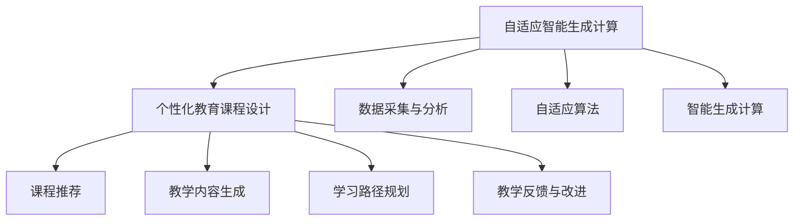
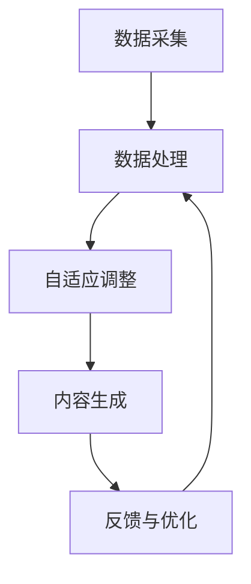

                 

### 第1章: 问题背景与核心概念

### 1.1 AIGC的概念与原理

**AIGC（自适应智能生成计算）** 是一种结合了人工智能（AI）和自适应算法的技术。它能够根据用户的行为、需求和偏好，自动生成个性化内容和服务。AIGC的核心在于其自我适应性和智能生成能力，这使得它能够不断优化和改进，以满足用户的具体需求。

AIGC的原理可以概括为以下几个关键组成部分：

1. **数据采集与分析**：AIGC通过收集用户的各种数据，如学习历史、兴趣爱好、行为模式等，来构建用户画像。
2. **自适应算法**：基于用户画像，AIGC利用自适应算法动态调整其行为和输出，确保内容始终符合用户的个性化需求。
3. **智能生成计算**：通过自然语言处理、数据挖掘和机器学习等技术，AIGC能够生成高度个性化的内容，如教育课程、推荐文章、语音合成等。

### 1.2 个性化教育课程设计的概念与重要性

**个性化教育课程设计** 是指根据学生的个性化需求，为其量身定制学习内容和教学方法，以达到最佳的学习效果。这种设计方法强调学生为中心，关注学生的个性化发展，旨在提高学习效率和学习兴趣。

个性化教育课程设计的重要性体现在以下几个方面：

1. **提高学习效果**：通过个性化设计，学生能够接受到更符合自己学习风格和能力的教学内容，从而提高学习效果。
2. **增强学习动力**：个性化课程能够激发学生的学习兴趣和动力，使其更加投入学习过程。
3. **促进全面发展**：个性化教育不仅关注知识传授，更注重学生个性、兴趣和潜能的全面培养。

### 1.3 AIGC在个性化教育课程设计中的应用场景

AIGC在个性化教育课程设计中的应用场景主要包括：

1. **课程推荐**：根据学生的学习历史和偏好，AIGC可以推荐适合学生的课程和学习资源。
2. **教学内容生成**：AIGC能够根据学生的个性化需求，自动生成适合的教学内容，如课件、练习题和测试题。
3. **学习路径规划**：AIGC可以根据学生的学习进度和能力，动态调整学习路径，确保学生能够按计划完成学习任务。
4. **教学反馈与改进**：AIGC能够对学生的学习反馈进行分析，为教师提供改进教学建议，提高教学质量。

### 1.4 核心概念联系与框架

AIGC与个性化教育课程设计之间存在着紧密的联系。AIGC的技术优势使得个性化教育课程设计变得更加智能化和高效，而个性化教育课程设计的需求则推动了AIGC技术的进一步发展。

图 1.1 AIGC与个性化教育课程设计的联系框架



通过上述框架，我们可以看到AIGC与个性化教育课程设计之间的相互作用和协同发展，为构建智能教育生态提供了新的可能性。

### 1.5 背景介绍

在当今数字化时代，教育正面临着前所未有的变革。传统的“一刀切”教育模式已经无法满足学生个性化发展的需求，因此，如何利用现代技术手段实现个性化教育成为了一个重要课题。AIGC作为一种新兴技术，其在个性化教育课程设计中的应用具有巨大的潜力。

首先，AIGC能够通过对大量教育数据的分析和处理，深入了解学生的学习行为和需求，从而为个性化课程设计提供可靠的数据支持。其次，AIGC的自适应算法和智能生成计算能力，使得教育系统能够根据学生的实时反馈和学习进度，动态调整教学内容和教学策略，提高教学效果。

然而，AIGC在个性化教育课程设计中也面临着一些挑战。例如，如何确保数据的安全性和隐私性，如何平衡个性化与共性教育之间的关系，以及如何提高算法的准确性和可靠性等。

### 1.6 问题描述

个性化教育课程设计的关键在于如何根据每个学生的独特需求和特点，为其提供量身定制的学习资源和教学方法。然而，传统的教育模式往往缺乏灵活性，难以满足这一需求。因此，我们需要一种能够动态调整教学内容和方法的智能系统，以实现真正的个性化教育。

具体来说，个性化教育课程设计需要解决以下几个问题：

1. **数据采集与处理**：如何有效地收集和分析学生的学习数据，以构建准确的用户画像？
2. **自适应算法设计**：如何设计自适应算法，使教育系统能够根据学生的实时反馈和学习进度进行动态调整？
3. **智能生成计算**：如何利用智能生成计算技术，自动生成符合学生个性化需求的教学内容？
4. **教学反馈与改进**：如何收集学生的教学反馈，并利用这些反馈对教学策略进行持续优化？

### 1.7 问题解决

为了解决上述问题，我们可以采用AIGC技术来实现个性化教育课程设计。具体方案如下：

1. **数据采集与处理**：利用AIGC的数据采集模块，收集学生的学习行为数据，并通过数据清洗和预处理，构建学生的个性化画像。
2. **自适应算法设计**：采用自适应算法，根据学生的个性化画像和学习行为，动态调整教学内容和教学方法。
3. **智能生成计算**：利用AIGC的智能生成计算模块，根据学生的个性化需求，自动生成符合其学习风格和兴趣的教学内容。
4. **教学反馈与改进**：通过收集学生的反馈，利用机器学习算法，对教学策略进行持续优化。

通过以上方案，我们可以实现一个智能、高效的个性化教育课程设计系统，为学生提供更加个性化和高效的学习体验。

### 1.8 边界与外延

在个性化教育课程设计中，AIGC的应用范围不仅限于传统的教育领域，还可以扩展到职业培训、在线学习平台等场景。同时，AIGC在个性化教育中的应用也不仅仅是课程设计，还可以涵盖学习路径规划、学习资源推荐、教学效果评估等多个方面。

然而，AIGC在个性化教育课程设计中的应用也存在一些边界和限制。例如，数据隐私和安全问题是AIGC应用中的一个重要挑战，需要采取有效的措施来确保用户数据的安全性和隐私性。此外，AIGC技术的可靠性也是一个需要关注的问题，特别是在处理敏感教育和专业领域时，确保算法的准确性和稳定性至关重要。

### 1.9 概念结构与核心要素组成

在个性化教育课程设计中，AIGC的应用涉及多个核心概念和要素，包括：

1. **用户画像**：通过收集和分析学生的学习数据，构建用户的个性化画像，为后续的个性化课程设计提供依据。
2. **自适应算法**：利用自适应算法，根据用户的个性化需求和实时反馈，动态调整教学内容和方法。
3. **智能生成计算**：利用智能生成计算技术，自动生成符合用户个性化需求的教学内容，如课件、练习题和测试题。
4. **学习路径规划**：根据学生的学习进度和能力，规划个性化的学习路径，确保学生能够按计划完成学习任务。
5. **教学反馈与改进**：通过收集学生的学习反馈，利用机器学习算法，对教学策略进行持续优化，提高教学质量。

这些核心概念和要素共同构成了AIGC在个性化教育课程设计中的概念结构和应用框架。通过深入理解和应用这些核心概念，我们可以实现更加智能化和高效的个性化教育。

### 第2章: AIGC技术原理

#### 2.1 AIGC技术概述

AIGC（自适应智能生成计算）是一种结合人工智能（AI）和自适应算法的新型计算技术，旨在实现个性化内容生成和自适应服务。它通过收集和分析用户数据，利用自适应算法动态调整内容和服务的生成，以满足用户的个性化需求。AIGC技术在多个领域，如个性化教育、推荐系统、内容创作和智能客服等，展现出了巨大的应用潜力。

#### 2.2 AIGC的关键技术

AIGC的技术核心包括数据采集与分析、自适应算法、智能生成计算等几个方面。

1. **数据采集与分析**：
   - **数据来源**：AIGC通过多种途径收集用户数据，如用户行为日志、学习记录、社交媒体活动等。
   - **数据清洗**：对收集到的原始数据进行清洗，去除噪声和冗余信息，确保数据质量。
   - **数据建模**：利用统计学和机器学习技术，对用户数据进行分析和建模，提取用户特征和需求。

2. **自适应算法**：
   - **基本概念**：自适应算法是一种能够在运行过程中根据环境变化进行调整的算法。它通过学习用户的行为和需求，动态调整其输出。
   - **算法类型**：包括线性回归、支持向量机、神经网络等多种算法。这些算法可以用于分类、预测和优化等多个方面。

3. **智能生成计算**：
   - **基本概念**：智能生成计算是指利用人工智能技术，如自然语言处理、图像处理和生成对抗网络（GAN）等，自动生成个性化内容。
   - **应用领域**：包括文本生成、图像生成、音频生成等。例如，在个性化教育中，智能生成计算可以自动生成符合学生学习风格和需求的课程内容。

#### 2.3 AIGC的工作流程

AIGC的工作流程通常包括以下几个步骤：

1. **数据采集**：通过传感器、日志文件、用户交互等手段收集用户数据。
2. **数据处理**：对采集到的数据进行清洗、预处理和建模，提取用户特征。
3. **自适应调整**：利用自适应算法，根据用户特征和需求动态调整系统行为和输出。
4. **内容生成**：利用智能生成计算技术，自动生成个性化内容，如推荐文章、教育课程等。
5. **反馈与优化**：收集用户对生成的内容的反馈，利用这些反馈进一步优化系统。

图 2.1 AIGC工作流程图



通过上述工作流程，AIGC能够实现个性化内容的生成和自适应服务，从而为用户提供更好的体验。

### 2.4 自适应算法原理与流程

**自适应算法**是一种能够在执行过程中根据环境变化或输入数据的变化，自动调整自身行为的算法。它通常用于优化系统性能、提高效率或适应不同的应用场景。

#### 2.4.1 自适应算法的基本概念

1. **适应性**：指算法能够根据环境和数据的变化，调整其参数或行为，以实现更好的性能。
2. **目标函数**：自适应算法通常有一个目标函数，用于衡量算法的性能。目标函数可以是系统效率、用户满意度、学习速度等。
3. **反馈机制**：自适应算法通过反馈机制获取环境和数据的变化信息，并据此调整自身行为。

#### 2.4.2 自适应算法的数学模型

自适应算法的数学模型通常包括以下几个部分：

1. **状态变量**：表示算法在某一时刻的状态，如学习进度、用户满意度等。
2. **控制变量**：表示算法的控制参数，如学习速率、调整策略等。
3. **目标函数**：定义了算法的目标，如最小化误差、最大化性能等。

一个简单的自适应算法数学模型可以表示为：

\[ s_{t+1} = f(s_t, u_t) \]

其中：
- \( s_t \) 是第 \( t \) 时刻的状态变量。
- \( u_t \) 是第 \( t \) 时刻的控制变量。
- \( f \) 是适应函数，用于根据当前状态和控制变量更新下一时刻的状态。

#### 2.4.3 自适应算法的应用实例

一个常见的自适应算法应用实例是**自适应学习系统**。在这种系统中，自适应算法根据学生的学习进度和理解程度，动态调整学习内容和难度，以实现最佳的学习效果。

**实例**：假设有一个自适应学习系统，其目标是帮助学生在短时间内掌握数学知识。系统中的自适应算法可以按照以下步骤进行操作：

1. **初始阶段**：系统根据学生的数学基础和测试成绩，设置一个初始学习难度。
2. **实时评估**：在学生完成每个练习题后，系统评估学生的答题情况，以确定学生的当前水平。
3. **调整学习难度**：如果学生表现较好，系统提高学习难度；如果学生表现较差，系统降低学习难度。
4. **反馈与优化**：系统记录学生的学习过程和成绩，并不断优化调整策略，以提高学习效果。

这种自适应算法的应用，使得学习系统能够根据学生的实际情况，灵活调整教学内容，从而提高学习效率和效果。

### 2.5 智能生成计算原理与流程

**智能生成计算**是利用人工智能技术，特别是深度学习模型，自动生成文本、图像、音频等内容的计算过程。它通过学习大量的数据，学会如何生成与输入数据相似或符合特定要求的内容。

#### 2.5.1 智能生成计算的基本概念

1. **生成对抗网络（GAN）**：GAN是一种通过两个对抗神经网络（生成器和判别器）相互竞争来生成数据的模型。生成器尝试生成看起来真实的数据，而判别器则试图区分生成数据与真实数据。通过这种对抗训练，生成器不断优化，逐渐生成更加真实的数据。
   
2. **变分自编码器（VAE）**：VAE是一种基于概率模型的生成模型，它通过编码器和解码器学习数据的概率分布，从而生成新的数据。编码器将输入数据映射到一个潜在空间，解码器则从潜在空间中采样，重构输入数据。

3. **自注意力机制**：在自然语言处理和图像处理领域，自注意力机制允许模型在生成过程中关注输入数据的不同部分，从而提高生成质量。

#### 2.5.2 智能生成计算的数学模型

1. **生成对抗网络（GAN）**：
   - **生成器（G）**：\( G(z) \)，其中 \( z \) 是从噪声分布中采样的潜在变量。
   - **判别器（D）**：\( D(x) \) 和 \( D(G(z)) \)，分别用于判断真实数据和生成数据的真实性。
   - **损失函数**：通常采用最小化生成器损失和判别器损失之间的差异，例如Wasserstein损失或L2损失。

2. **变分自编码器（VAE）**：
   - **编码器（\(\mu(z), \sigma(z)\)）**：将输入数据 \( x \) 编码为潜在变量 \( z \) 的均值和方差。
   - **解码器（\( \phi(z) \)）**：从潜在空间 \( z \) 中采样，并解码为重构数据 \( x' \)。
   - **损失函数**：包括重建损失（最小化 \( \text{KL}(\mu(z), \sigma(z)) \)）和重构误差（最小化 \( \text{L2} \) 范数）。

#### 2.5.3 智能生成计算的应用实例

1. **文本生成**：使用GAN和VAE，可以生成类似人类写作的文本。例如，生成新闻文章、故事或诗歌。

2. **图像生成**：利用GAN，可以生成高分辨率的图像，如人脸、风景或艺术作品。变分自编码器也可以用于图像的超分辨率处理。

3. **音频生成**：通过生成模型，可以合成新的音乐片段、语音或声音效果。

**实例**：使用GAN生成人脸图像。生成器尝试生成人脸图像，而判别器则判断图像是否真实。通过不断训练，生成器能够生成越来越真实的人脸图像。

```python
# 使用PyTorch实现简单GAN模型
import torch
import torch.nn as nn
import torch.optim as optim

# 生成器模型
class Generator(nn.Module):
    def __init__(self):
        super(Generator, self).__init__()
        self.model = nn.Sequential(
            nn.Linear(100, 256),
            nn.LeakyReLU(0.2),
            nn.Linear(256, 512),
            nn.LeakyReLU(0.2),
            nn.Linear(512, 1024),
            nn.LeakyReLU(0.2),
            nn.Linear(1024, 784),
            nn.Tanh()
        )

    def forward(self, z):
        return self.model(z)

# 判别器模型
class Discriminator(nn.Module):
    def __init__(self):
        super(Discriminator, self).__init__()
        self.model = nn.Sequential(
            nn.Linear(784, 1024),
            nn.LeakyReLU(0.2),
            nn.Dropout(0.3),
            nn.Linear(1024, 512),
            nn.LeakyReLU(0.2),
            nn.Dropout(0.3),
            nn.Linear(512, 256),
            nn.LeakyReLU(0.2),
            nn.Dropout(0.3),
            nn.Linear(256, 1),
            nn.Sigmoid()
        )

    def forward(self, x):
        return self.model(x)

# 初始化模型和优化器
generator = Generator()
discriminator = Discriminator()

g_optimizer = optim.Adam(generator.parameters(), lr=0.0002)
d_optimizer = optim.Adam(discriminator.parameters(), lr=0.0002)

# 训练模型
for epoch in range(epochs):
    for i, (images, _) in enumerate(dataloader):
        # 训练判别器
        real_images = images.to(device)
        real_labels = torch.ones(real_images.size(0), 1).to(device)
        
        d_loss_real = discriminator(real_images).mean()
        
        z = torch.randn(images.size(0), 100).to(device)
        fake_images = generator(z)
        fake_labels = torch.zeros(fake_images.size(0), 1).to(device)
        
        d_loss_fake = discriminator(fake_images).mean()
        
        d_loss = d_loss_real + d_loss_fake
        d_optimizer.zero_grad()
        d_loss.backward()
        d_optimizer.step()
        
        # 训练生成器
        z = torch.randn(batch_size, 100).to(device)
        g_loss = -torch.mean(discriminator(generator(z)))
        
        g_optimizer.zero_grad()
        g_loss.backward()
        g_optimizer.step()
        
        if i % 100 == 0:
            print(f"{epoch} Epoch [{i}/{len(dataloader)}] - d_loss: {d_loss.item():.4f}, g_loss: {g_loss.item():.4f}")
```

通过上述实例，我们可以看到如何使用GAN模型生成人脸图像。生成器和判别器通过对抗训练，不断优化，最终生成真实度较高的人脸图像。

### 第3章: 个性化教育课程设计要素

#### 3.1 学生个性化需求分析

学生个性化需求分析是构建个性化教育课程设计的基础，其核心在于准确把握学生的个体差异，包括学习风格、兴趣爱好、知识基础和职业目标等。以下是如何进行学生个性化需求分析的方法：

1. **学习风格分析**：
   - **问卷调查**：设计一系列问题，了解学生的偏好，如视觉学习、听觉学习或动手实践。
   - **心理测试**：利用学习风格测评工具，如霍华德-加德纳的多元智能理论测试，了解学生的优势智能领域。
   - **课堂观察**：通过课堂观察，了解学生在不同学习场景下的行为和反应。

2. **兴趣爱好分析**：
   - **兴趣调查问卷**：收集学生对各种学科和活动的兴趣程度。
   - **社交媒体分析**：通过分析学生的社交媒体行为，了解他们的兴趣和关注点。
   - **课外活动记录**：记录学生参与的课外活动和兴趣爱好，以了解他们的兴趣领域。

3. **知识基础分析**：
   - **入学测试**：通过入学测试，了解学生的学科基础和知识水平。
   - **学习记录分析**：分析学生在学习过程中的作业和测试成绩，识别其知识盲点和掌握程度。
   - **教师反馈**：收集教师的评价和建议，了解学生在学习过程中存在的问题。

4. **职业目标分析**：
   - **职业兴趣测试**：使用职业兴趣测试工具，如霍兰德职业兴趣量表，帮助学生了解自己的职业倾向。
   - **生涯规划辅导**：通过辅导，帮助学生明确职业目标和规划学习路径。

通过上述方法，教育者可以全面了解学生的个性化需求，为后续的课程设计和教学调整提供依据。

#### 3.2 教学内容个性化设计

教学内容个性化设计是确保学生能够根据自身的需求和能力进行有效学习的关键。以下是如何进行教学内容个性化设计的方法：

1. **课程内容定制**：
   - **差异化教学**：根据学生的学习风格和兴趣爱好，设计不同类型的课程内容，如视觉化课程、实践操作课程等。
   - **模块化课程**：将课程内容分解为多个模块，学生可以根据自己的进度和需求选择学习。

2. **学习材料定制**：
   - **电子教材**：利用数字化工具，为学生提供电子教材，包括视频讲解、互动练习和虚拟实验等。
   - **个性化辅导材料**：根据学生的知识基础和学习进度，提供针对性的辅导材料，如补充阅读材料和在线练习。

3. **教学资源推荐**：
   - **基于内容的推荐系统**：利用AIGC技术，根据学生的学习行为和偏好，推荐相关的学习资源。
   - **社交学习资源**：鼓励学生分享学习资源和经验，形成学习社区，促进学生之间的互动和合作。

4. **动态学习路径**：
   - **学习路径规划**：根据学生的学习进度和能力，动态调整学习路径，确保学生能够按计划完成学习任务。
   - **实时调整**：在学生学习过程中，根据反馈和评估结果，及时调整教学内容和教学方法，以适应学生的变化。

通过上述方法，教育者可以为学生提供个性化的教学内容，提高他们的学习效果和兴趣。

#### 3.3 教学方法个性化选择

教学方法个性化选择是确保教学过程能够满足学生个性化需求的重要环节。以下是如何进行教学方法个性化选择的方法：

1. **个性化教学策略**：
   - **个别辅导**：根据学生的个性化需求，安排一对一的辅导，提供针对性的教学支持。
   - **合作学习**：通过小组合作学习，促进学生之间的交流和互动，提高学习效果。

2. **互动式教学**：
   - **在线互动平台**：利用在线互动平台，提供实时问答和讨论区，鼓励学生积极参与学习过程。
   - **虚拟现实（VR）教学**：利用VR技术，提供沉浸式的学习体验，激发学生的学习兴趣和参与度。

3. **个性化评估方法**：
   - **过程性评估**：通过日常作业、练习和测试，实时监控学生的学习进度和能力。
   - **适应性评估**：根据学生的学习表现，动态调整评估方法和标准，确保评估结果能够准确反映学生的能力。

4. **个性化反馈**：
   - **即时反馈**：在学生完成学习任务后，立即提供个性化的反馈，帮助学生理解学习内容和改进学习方法。
   - **长期跟踪**：通过定期跟踪学生的学习表现，提供长期的学习支持和指导。

通过上述方法，教育者可以为学生提供个性化的教学方法，提高他们的学习效果和满意度。

#### 3.4 教学评价个性化反馈

教学评价个性化反馈是确保个性化教育课程设计持续改进的重要手段。以下是如何进行教学评价个性化反馈的方法：

1. **个性化评价标准**：
   - **多元评价**：采用多种评价方式，如笔试、口试、实践操作等，全面评估学生的知识和技能。
   - **差异化评价**：根据学生的个性化需求和能力，设定不同的评价标准和要求。

2. **实时反馈**：
   - **即时反馈**：在学生学习过程中，提供实时反馈，帮助学生及时纠正错误和改进学习策略。
   - **动态反馈**：根据学生的学习表现和变化，动态调整反馈内容和方式。

3. **个性化报告**：
   - **个性化成绩报告**：根据学生的个性化需求，生成详细的个性化成绩报告，包括学习进度、成绩变化和改进建议。
   - **个性化成长报告**：记录学生的学习过程和成长轨迹，为学生提供全面的反馈。

4. **持续改进**：
   - **反思与调整**：鼓励学生和教师对教学过程进行反思，根据反馈结果不断调整教学策略和教学方法。
   - **持续优化**：通过定期评估和反馈，持续优化个性化教育课程设计，提高教学效果。

通过上述方法，教育者可以为学生提供个性化教学评价反馈，帮助他们更好地理解学习内容和提高学习效果。

### 3.5 AIGC与个性化教育课程设计的关系

AIGC与个性化教育课程设计之间存在着密切的联系，二者相互促进，共同推动教育的智能化和个性化发展。

首先，AIGC在个性化教育课程设计中的应用，主要体现在以下几个方面：

1. **数据驱动**：AIGC通过数据采集与分析，为个性化教育课程设计提供了丰富的数据支持。教育系统能够基于这些数据，深入了解每个学生的学习习惯、兴趣爱好和知识水平，从而实现真正的个性化教学。

2. **自适应调整**：AIGC的自适应算法能够根据学生的学习反馈和表现，动态调整教学内容和教学方法。这种灵活性使得教育系统能够更好地适应学生的个体差异，提高教学效果。

3. **智能生成**：AIGC的智能生成计算技术能够自动生成个性化教学资源，如课件、练习题和测评题等。这些资源不仅符合学生的学习需求，还能够根据学习进度进行动态调整，确保学生始终处于最佳学习状态。

其次，个性化教育课程设计对AIGC的需求主要体现在以下几个方面：

1. **个性化需求分析**：个性化教育需要深入了解每个学生的学习需求和兴趣，这要求AIGC能够提供精确的数据分析和用户画像。

2. **教学资源丰富性**：个性化教育要求提供多样化的教学资源，以满足不同学生的学习需求。AIGC的智能生成计算技术能够快速生成丰富的教学资源，满足这一需求。

3. **自适应教学**：个性化教育需要根据学生的实时反馈和学习进度，动态调整教学内容和教学方法。这要求AIGC具备强大的自适应能力和计算能力。

总之，AIGC与个性化教育课程设计之间相互促进，AIGC为个性化教育提供了技术支撑，而个性化教育则为AIGC的应用提供了广阔的舞台。通过二者的有机结合，我们可以构建一个智能、高效、个性化的教育生态系统。

### 3.5.1 AIGC在个性化教育中的应用

AIGC在个性化教育中的应用非常广泛，主要包括以下几个方面：

1. **个性化学习路径规划**：
   AIGC可以通过分析学生的学习行为和表现，为其制定个性化的学习路径。这种方法能够确保学生按照最适合他们的顺序和难度来学习，从而提高学习效果。例如，系统可以基于学生的学习进度、知识点掌握情况以及兴趣爱好，推荐适当的学习内容和资源。

2. **个性化课程内容生成**：
   利用AIGC的智能生成计算能力，可以自动生成个性化课程内容。例如，系统可以根据学生的学习需求和兴趣，生成定制化的课件、练习题和测评题。这些内容不仅与学生的实际需求高度契合，还能够根据学生的学习反馈进行动态调整，以不断优化学习体验。

3. **个性化教学评估与反馈**：
   AIGC可以通过智能算法对学生的学习评估结果进行分析，提供个性化的反馈和建议。这种反馈可以是实时生成的，比如在学生完成某个练习题后，系统立即给出针对性的答案和解释。长期来看，AIGC可以帮助教师和学生跟踪学习进展，发现潜在问题，并提供改进建议。

4. **智能推荐系统**：
   AIGC可以构建智能推荐系统，根据学生的学习历史、行为数据和兴趣爱好，推荐相关课程、学习资源和活动。这种推荐不仅限于学习内容，还可以包括学习伙伴、讨论小组等社交资源，从而促进学生的全面发展和学习效果。

5. **个性化学习支持服务**：
   AIGC可以提供各种个性化学习支持服务，如学习计划管理、时间表安排、学习进度跟踪等。这些服务可以帮助学生更好地管理自己的学习过程，确保学习目标的实现。

通过这些应用，AIGC能够极大地提升个性化教育的质量和效率，使得教育更加智能化、灵活化和高效化。

### 3.5.2 个性化教育课程设计对AIGC的需求

个性化教育课程设计对AIGC提出了以下需求：

1. **精确的用户画像**：
   个性化教育需要深入了解每个学生的特点，如学习习惯、知识基础、兴趣爱好等。AIGC需要通过数据采集与分析，构建详细的用户画像，为个性化教学提供基础。

2. **动态调整能力**：
   个性化教育要求教学系统能够根据学生的学习状态和反馈，动态调整教学内容和方法。AIGC的自适应算法需要具备强大的动态调整能力，确保教学过程始终与学生的实际需求匹配。

3. **智能生成内容**：
   个性化教育需要提供丰富的教学资源，以满足不同学生的个性化需求。AIGC的智能生成计算能力需要能够自动生成符合学生特点的课件、练习题和测评题等教学内容。

4. **实时反馈与优化**：
   个性化教育需要实时收集学生的学习反馈，并基于这些反馈进行教学优化。AIGC需要具备实时反馈机制，及时调整教学策略，提高教学效果。

5. **隐私保护与数据安全**：
   个性化教育涉及大量敏感数据，如学生的学习记录、行为数据等。AIGC需要确保这些数据的安全性和隐私性，遵守相关法律法规，保护学生隐私。

通过满足这些需求，AIGC能够为个性化教育课程设计提供有力支持，实现教育智能化和个性化。

### 第4章: AIGC核心算法解析

#### 4.1 自适应算法原理与流程

自适应算法是AIGC技术中至关重要的一部分，其核心在于能够在运行过程中根据环境变化或输入数据的变化，自动调整自身的参数和行为，以实现最优的性能和效果。以下是对自适应算法原理和流程的详细解析。

##### 4.1.1 自适应算法的基本概念

自适应算法的基本概念包括以下几个核心要素：

1. **适应性**：指算法能够根据环境和数据的变化，动态调整自身的参数和行为，以实现最佳性能。这种能力使自适应算法能够应对不确定性和动态变化。

2. **目标函数**：目标函数是评估算法性能的标准，可以是系统效率、用户满意度、学习速度等。自适应算法的目标是优化目标函数，以达到预期效果。

3. **状态变量**：状态变量表示算法在某一时刻的状态，如学习进度、用户满意度、系统负载等。这些变量是自适应算法调整行为的重要依据。

4. **控制变量**：控制变量是算法的调整参数，如学习速率、调整策略等。通过调整控制变量，算法可以改变其行为，以适应环境变化。

5. **反馈机制**：反馈机制是自适应算法获取环境变化信息的重要途径。通过反馈，算法能够了解其行为对环境的影响，并据此调整自身。

##### 4.1.2 自适应算法的数学模型

自适应算法的数学模型通常可以表示为：

\[ s_{t+1} = f(s_t, u_t) \]

其中：
- \( s_t \) 是第 \( t \) 时刻的状态变量。
- \( u_t \) 是第 \( t \) 时刻的控制变量。
- \( f \) 是适应函数，用于根据当前状态和控制变量更新下一时刻的状态。

适应函数 \( f \) 通常是一个非线性函数，能够根据状态变量和控制变量的变化，动态调整算法的行为。一个常见的自适应算法数学模型包括以下部分：

1. **状态变量更新**：
   \[ s_t = s_{t-1} + \Delta s_t \]
   其中 \( \Delta s_t \) 是状态变量的更新量。

2. **控制变量更新**：
   \[ u_t = u_{t-1} + \Delta u_t \]
   其中 \( \Delta u_t \) 是控制变量的更新量。

3. **目标函数优化**：
   \[ J(t) = J(t-1) - \alpha \cdot \nabla J(t) \]
   其中 \( J(t) \) 是目标函数，\( \alpha \) 是学习率，\( \nabla J(t) \) 是目标函数的梯度。

通过上述数学模型，自适应算法能够根据目标函数的梯度，动态调整状态变量和控制变量，以优化系统性能。

##### 4.1.3 自适应算法的应用实例

一个常见的自适应算法应用实例是**自适应学习系统**。在这种系统中，自适应算法可以根据学生的学习进度、理解和兴趣，动态调整教学内容和教学方法，以实现最佳的学习效果。

**实例**：假设有一个自适应学习系统，其目标是在短时间内帮助学生掌握数学知识。系统中的自适应算法可以按照以下步骤进行操作：

1. **初始阶段**：
   - 系统根据学生的数学基础和测试成绩，设置一个初始学习难度。
   - 学生开始学习数学课程，完成一系列练习题。

2. **实时评估**：
   - 在学生完成每个练习题后，系统评估学生的答题情况，以确定学生的当前水平。
   - 如果学生表现较好，系统会提高学习难度；如果表现较差，系统会降低学习难度。

3. **调整学习难度**：
   - 系统根据学生的实时评估结果，动态调整学习难度，以确保学生能够在适当的难度下学习。

4. **反馈与优化**：
   - 系统记录学生的学习过程和成绩，并不断优化调整策略，以提高学习效果。

通过这种自适应算法，学习系统能够根据学生的实际情况，灵活调整教学内容和教学方法，从而提高学习效率和效果。

### 4.2.1 智能生成计算的基本概念

**智能生成计算** 是指利用人工智能技术，特别是深度学习和生成对抗网络（GAN），自动生成文本、图像、音频等内容的计算过程。智能生成计算的核心在于能够从已有的数据中学习，并生成高质量、多样化的新内容。

**生成对抗网络（GAN）** 是智能生成计算的一种重要模型，由生成器和判别器两个神经网络组成。生成器的目标是生成逼真的数据，而判别器的目标是区分生成数据和真实数据。通过这种对抗训练，生成器逐渐优化其生成能力，以欺骗判别器。

**变分自编码器（VAE）** 是另一种重要的智能生成计算模型，它通过概率编码和解码过程，将输入数据转换为潜在空间中的样本，并从潜在空间中生成新的数据。VAE在图像超分辨率、文本生成等领域有广泛应用。

### 4.2.2 智能生成计算的数学模型

1. **生成对抗网络（GAN）**：
   - **生成器（G）**：生成器从噪声分布中采样，生成与真实数据相似的数据。其数学模型可以表示为：
     \[ G(z) \]
     其中 \( z \) 是噪声向量。
   - **判别器（D）**：判别器的目标是判断输入数据是真实数据还是生成数据。其数学模型可以表示为：
     \[ D(x) \]
     \[ D(G(z)) \]
     其中 \( x \) 是真实数据。

   - **损失函数**：GAN的损失函数通常包括生成损失和判别损失。生成损失是生成器生成的数据与真实数据的相似度，判别损失是判别器对生成数据的识别率。常见损失函数包括最小二乘损失、Wasserstein损失等。

2. **变分自编码器（VAE）**：
   - **编码器（\(\mu(z), \sigma(z)\)）**：编码器将输入数据编码为潜在空间中的样本，其数学模型可以表示为：
     \[ \mu(x), \sigma(x) \]
     其中 \( x \) 是输入数据，\( \mu(x) \) 是均值，\( \sigma(x) \) 是方差。
   - **解码器（\( \phi(z) \)）**：解码器从潜在空间中采样，并解码为重构数据，其数学模型可以表示为：
     \[ \phi(z) \]

   - **损失函数**：VAE的损失函数包括重建损失和KL散度损失。重建损失是输入数据与重构数据的相似度，KL散度损失是潜在空间中样本的分布与先验分布的差距。数学模型可以表示为：
     \[ \text{L}_\text{RECON} = \frac{1}{n} \sum_{i=1}^{n} -\log p(x|\mu(z), \sigma(z)) \]
     \[ \text{L}_\text{KL} = \frac{1}{n} \sum_{i=1}^{n} \left( \log \sigma(x) + \frac{\sigma(x)^2}{2} - 1 \right) \]

通过上述数学模型，智能生成计算能够从数据中学习，并生成高质量的新内容。

### 4.2.3 智能生成计算的应用实例

**文本生成**：
智能生成计算在文本生成领域有广泛应用。例如，使用变分自编码器（VAE）可以生成高质量的文本。以下是一个简单的VAE文本生成示例：

```python
import numpy as np
import tensorflow as tf
from tensorflow.keras.layers import Input, LSTM, Dense
from tensorflow.keras.models import Model

# 设置超参数
latent_dim = 32
sequence_length = 50
n_classes = 10

# 创建编码器
encoded_inputs = Input(shape=(sequence_length,))
encoded = LSTM(latent_dim, return_state=True)(encoded_inputs)
z_mean, z_log_var = Dense(latent_dim), Dense(latent_dim)(encoded)
z_mean, z_log_var = tf.keras.backend.mean(z_mean), tf.keras.backend.std(z_log_var)
z = z_mean + z_log_var * tf.keras.backend.random_normal(tf.shape(z_mean))

# 创建解码器
decoded = LSTM(latent_dim, return_sequences=True)(z)
decoded_outputs = Dense(n_classes)(decoded)

# 创建VAE模型
vae = Model(encoded_inputs, decoded_outputs)
vae.compile(optimizer='rmsprop', loss='binary_crossentropy')

# 训练模型
vae.fit(encoded_inputs, decoded_outputs, epochs=100, batch_size=32)
```

在这个示例中，VAE模型通过编码器将输入文本编码为潜在空间中的样本，然后通过解码器生成新的文本。

**图像生成**：
使用生成对抗网络（GAN）可以生成高质量的人脸图像。以下是一个简单的GAN图像生成示例：

```python
import tensorflow as tf
from tensorflow.keras.layers import Input, Dense, Reshape, Lambda
from tensorflow.keras.models import Sequential
from tensorflow.keras.optimizers import Adam

# 设置超参数
latent_dim = 100
img_height = 28
img_width = 28
channels = 1
img_shape = (img_height, img_width, channels)

# 创建生成器
z = Input(shape=(latent_dim,))
x = Dense(128 * 7 * 7, activation='relu')(z)
x = Reshape((7, 7, 128))(x)
x = Lambda(tf.nn.sigmoid)(x)
x = Conv2D(1, 3, padding='same', activation='tanh')(x)

generator = Model(z, x)
generator.compile(loss='binary_crossentropy', optimizer=Adam())

# 创建判别器
img = Input(shape=img_shape)
d = Conv2D(16, 3, padding='same', activation='relu')(img)
d = MaxPooling2D()(d)
d = Conv2D(32, 3, padding='same', activation='relu')(d)
d = MaxPooling2D()(d)
d = Conv2D(64, 3, padding='same', activation='relu')(d)
d = MaxPooling2D()(d)
d = Flatten()(d)
d = Dense(512, activation='relu')(d)
d = Dense(1, activation='sigmoid')(d)

discriminator = Model(img, d)
discriminator.compile(loss='binary_crossentropy', optimizer=Adam())

# 创建GAN模型
z = Input(shape=(latent_dim,))
img = generator(z)
d = discriminator(img)

gan = Model(z, d)
gan.compile(loss='binary_crossentropy', optimizer=Adam())

# 训练GAN模型
gan.fit(np.random.normal(size=(batch_size, latent_dim)), np.random.randint(0, 2, size=(batch_size, 1)), epochs=100, batch_size=batch_size)
```

在这个示例中，GAN模型通过生成器和判别器相互对抗，生成逼真的人脸图像。

### 4.3 个性化需求分析算法

个性化需求分析是AIGC在个性化教育课程设计中的关键步骤，它旨在准确捕捉和解析学生的个性化需求，为后续的课程内容生成和教学方法调整提供依据。以下是对个性化需求分析算法的详细介绍。

#### 4.3.1 算法原理

个性化需求分析算法基于数据挖掘和机器学习技术，主要采用以下方法：

1. **用户画像构建**：
   - **数据收集**：收集学生的学习行为数据，如学习记录、作业成绩、测试成绩、在线互动记录等。
   - **特征提取**：从数据中提取关键特征，如学科偏好、学习风格、知识掌握程度、学习进度等。
   - **用户画像生成**：利用提取的特征，构建每个学生的个性化画像，为后续分析提供基础。

2. **需求识别**：
   - **行为模式分析**：分析学生的学习行为模式，识别出不同类型的学习需求。
   - **兴趣偏好分析**：通过分析学生在学习过程中的互动和反馈，识别其兴趣爱好。
   - **知识盲点分析**：基于学生的测试成绩和学习记录，识别其在哪些知识点上存在不足。

3. **需求预测**：
   - **历史数据分析**：利用学生过去的学习数据，预测其未来的学习需求和兴趣点。
   - **趋势分析**：分析学生的学习行为趋势，预测其在不同阶段的需求变化。

#### 4.3.2 数学模型

个性化需求分析算法的数学模型通常包括以下几个部分：

1. **特征向量表示**：
   - **学生特征向量**：将学生的各种特征数据（如学习记录、测试成绩、互动记录等）转换为高维特征向量，用于后续分析。
   - **兴趣向量**：通过聚类分析或关联规则挖掘，生成学生的兴趣向量，表示其兴趣爱好。

2. **行为模式识别**：
   - **行为模式矩阵**：构建一个行为模式矩阵，表示学生在不同时间段、不同学科和不同活动中的参与情况。
   - **模式识别算法**：如支持向量机（SVM）、随机森林（Random Forest）等，用于从行为模式矩阵中识别出学生主要的学习行为模式。

3. **需求预测模型**：
   - **时间序列模型**：如ARIMA、LSTM等，用于分析学生过去的学习行为，预测其未来的学习需求和兴趣变化。
   - **回归模型**：如线性回归、多项式回归等，用于预测学生不同知识点的掌握程度和需求。

#### 4.3.3 应用实例

**实例1：基于学习记录的个性化需求分析**

假设有一个学习记录数据库，包含了学生的作业成绩、测试成绩和学习进度等信息。我们可以使用以下步骤进行个性化需求分析：

1. **数据预处理**：
   - **数据清洗**：去除缺失值和异常值，确保数据质量。
   - **数据归一化**：将不同特征的数据进行归一化处理，使其在同一尺度上进行分析。

2. **特征提取**：
   - **学习记录特征**：提取每个学生在不同学科、不同测试中的成绩，构建学习记录特征向量。

3. **用户画像构建**：
   - **行为模式分析**：使用聚类算法（如K-means）对学习记录特征进行聚类，识别出不同类型的学习行为模式。
   - **兴趣偏好分析**：分析学生在不同学科中的表现，识别其学科偏好和兴趣点。

4. **需求预测**：
   - **历史数据分析**：利用时间序列模型（如LSTM），预测学生在未来不同学科中的表现和需求变化。
   - **回归分析**：通过线性回归模型，预测学生在不同知识点上的掌握程度和需求。

通过上述步骤，我们可以构建一个基于学习记录的个性化需求分析系统，为学生提供个性化的学习资源和建议。

**实例2：基于在线互动记录的个性化需求分析**

假设有一个在线学习平台，记录了学生在论坛、讨论区和问答区中的互动记录。我们可以使用以下步骤进行个性化需求分析：

1. **数据预处理**：
   - **数据清洗**：去除无效的互动记录，如垃圾评论等。
   - **文本预处理**：对互动记录中的文本进行分词、去停用词、词性标注等预处理。

2. **特征提取**：
   - **互动特征**：提取互动记录中的关键特征，如互动频率、互动话题、参与度等。

3. **用户画像构建**：
   - **兴趣分析**：通过主题模型（如LDA），识别学生在不同话题上的兴趣。
   - **需求预测**：使用机器学习算法（如随机森林），预测学生在未来可能感兴趣的话题和需求。

4. **需求预测**：
   - **历史数据分析**：利用时间序列模型，预测学生在未来不同话题中的互动行为和需求。
   - **趋势分析**：分析互动记录中的趋势，预测学生兴趣的变化。

通过上述步骤，我们可以构建一个基于在线互动记录的个性化需求分析系统，为学生提供个性化的学习资源和互动建议。

### 4.4 教学内容个性化设计算法

教学内容个性化设计是AIGC在个性化教育课程设计中的重要环节，它旨在根据学生的个性化需求，生成适合其学习风格和知识水平的课程内容。以下是对教学内容个性化设计算法的详细介绍。

#### 4.4.1 算法原理

教学内容个性化设计算法基于数据挖掘、机器学习和自然语言处理技术，主要采用以下方法：

1. **内容建模**：
   - **知识图谱构建**：建立学科知识图谱，将知识点、概念和关系进行结构化表示，为后续内容生成提供基础。
   - **课程库建设**：构建课程库，包含不同类型、难度和风格的课程内容，为内容生成提供素材。

2. **需求分析**：
   - **个性化需求提取**：通过个性化需求分析算法，提取学生的个性化需求，如学科偏好、知识盲点、学习风格等。
   - **需求匹配**：将学生的个性化需求与课程库中的课程内容进行匹配，找到最适合的课程内容。

3. **内容生成**：
   - **文本生成**：利用生成对抗网络（GAN）、变分自编码器（VAE）等模型，生成符合学生需求的文本内容，如课件、练习题、测评题等。
   - **多媒体内容生成**：利用图像处理、音频处理等技术，生成符合学生需求的视觉和听觉内容。

4. **内容调整**：
   - **动态调整**：根据学生的学习反馈和进度，动态调整教学内容，确保其始终符合学生的需求。

#### 4.4.2 数学模型

教学内容个性化设计算法的数学模型通常包括以下几个部分：

1. **知识图谱表示**：
   - **知识点向量**：将知识点表示为高维向量，用于后续的知识图谱构建。
   - **关系矩阵**：构建知识点之间的关系矩阵，表示知识点之间的关联性。

2. **需求向量表示**：
   - **需求特征向量**：将学生的个性化需求表示为高维特征向量，用于与课程库中的课程内容进行匹配。

3. **生成模型**：
   - **文本生成模型**：如GAN、VAE等，用于生成符合学生需求的文本内容。
   - **多媒体生成模型**：如卷积神经网络（CNN）、循环神经网络（RNN）等，用于生成视觉和听觉内容。

4. **内容调整模型**：
   - **反馈模型**：利用机器学习算法，分析学生的学习反馈，调整教学内容。
   - **动态调整策略**：根据学习反馈和进度，制定动态调整策略，确保教学内容始终符合学生的需求。

#### 4.4.3 应用实例

**实例1：基于知识图谱的个性化课程生成**

假设有一个包含数学、物理、化学等学科的知识图谱，我们可以使用以下步骤进行个性化课程生成：

1. **知识图谱构建**：
   - **知识点表示**：将每个知识点表示为高维向量，构建知识图谱。
   - **关系表示**：建立知识点之间的关系矩阵，表示知识点之间的关联性。

2. **需求分析**：
   - **需求提取**：通过个性化需求分析算法，提取学生的个性化需求，如数学中的代数和几何等。
   - **需求匹配**：将学生的需求与知识图谱中的知识点进行匹配，找到相关的知识点。

3. **内容生成**：
   - **文本生成**：利用生成对抗网络（GAN），生成符合学生需求的数学课程内容，如课件、练习题、测评题等。
   - **多媒体生成**：利用卷积神经网络（CNN），生成视觉化的数学教学视频。

4. **内容调整**：
   - **反馈收集**：收集学生的学习反馈，如答题情况、观看视频的时间等。
   - **内容调整**：根据反馈结果，动态调整教学内容，确保其符合学生的需求。

通过上述步骤，我们可以构建一个基于知识图谱的个性化课程生成系统，为学生提供量身定制的课程内容。

**实例2：基于文本生成模型的个性化课程生成**

假设我们要为学生生成一篇数学练习题的文本，我们可以使用以下步骤：

1. **文本数据准备**：
   - **练习题库**：准备一个包含多种类型数学练习题的文本库。
   - **需求提取**：通过个性化需求分析算法，提取学生的需求，如代数练习题。

2. **文本生成**：
   - **模型训练**：利用生成对抗网络（GAN），训练文本生成模型，使其能够生成符合学生需求的数学练习题。
   - **文本生成**：使用训练好的模型，生成一篇符合学生需求的代数练习题。

3. **内容调整**：
   - **反馈收集**：收集学生对练习题的反馈，如是否理解、难度是否适中等。
   - **内容调整**：根据反馈结果，调整练习题的内容和难度，确保其符合学生的需求。

通过上述步骤，我们可以构建一个基于文本生成模型的个性化课程生成系统，为学生提供量身定制的练习题。

### 4.5 教学方法个性化选择算法

教学方法个性化选择算法是AIGC在个性化教育课程设计中的关键环节，它旨在根据学生的个性化需求和特点，选择最适合的教学方法，以提高教学效果。以下是对教学方法个性化选择算法的详细介绍。

#### 4.5.1 算法原理

教学方法个性化选择算法基于数据挖掘、机器学习和自然语言处理技术，主要采用以下方法：

1. **教学风格识别**：
   - **教学风格特征提取**：从教师的教学日志、课堂互动记录等数据中提取教学风格特征，如讲解风格、互动频率、教学方法等。
   - **教学风格分类**：利用机器学习算法（如K-means、决策树等），对教师的教学风格进行分类，构建教学风格模型。

2. **学生偏好分析**：
   - **学生特征提取**：从学生的学习记录、互动记录等数据中提取学生特征，如学习风格、学科偏好、学习进度等。
   - **学生偏好识别**：利用聚类分析、关联规则挖掘等方法，识别学生的个性化偏好。

3. **教学方法匹配**：
   - **教学方法库建设**：构建包含多种教学方法的教学方法库，如讲授、讨论、实验等。
   - **匹配策略制定**：根据教学风格和学生偏好，制定教学方法匹配策略，确保教学方法与学生的需求相匹配。

4. **动态调整**：
   - **实时反馈收集**：收集学生的学习反馈，如学习效果、兴趣度等。
   - **教学方法调整**：根据学生反馈和教学效果，动态调整教学方法，确保教学过程始终与学生的需求相匹配。

#### 4.5.2 数学模型

教学方法个性化选择算法的数学模型通常包括以下几个部分：

1. **教学风格模型**：
   - **教学风格特征向量**：将教师的教学风格特征表示为高维向量。
   - **教学风格分类模型**：如支持向量机（SVM）、随机森林（Random Forest）等，用于对教师的教学风格进行分类。

2. **学生偏好模型**：
   - **学生特征向量**：将学生的个性化特征表示为高维向量。
   - **偏好识别模型**：如K-means、关联规则挖掘等，用于识别学生的个性化偏好。

3. **教学方法匹配模型**：
   - **教学方法特征向量**：将教学方法表示为高维向量。
   - **匹配策略模型**：如线性回归、逻辑回归等，用于根据教学风格和学生偏好选择最佳教学方法。

4. **动态调整模型**：
   - **反馈特征向量**：将学生的学习反馈表示为高维向量。
   - **调整策略模型**：如自适应滤波器、强化学习等，用于根据学生反馈动态调整教学方法。

#### 4.5.3 应用实例

**实例1：基于教师教学风格和学生偏好的教学方法选择**

假设有一个在线学习平台，我们可以使用以下步骤进行教学方法选择：

1. **教学风格识别**：
   - **教学日志分析**：从教师的教学日志中提取教学风格特征，如讲解风格、互动频率等。
   - **教学风格分类**：使用K-means算法对教学风格进行分类，构建教学风格模型。

2. **学生偏好分析**：
   - **学习记录提取**：从学生的学习记录中提取个性化特征，如学习风格、学科偏好等。
   - **偏好识别**：使用关联规则挖掘方法，识别学生的个性化偏好。

3. **教学方法匹配**：
   - **教学方法库构建**：构建包含多种教学方法的教学方法库，如讲授、讨论、实验等。
   - **匹配策略制定**：根据教师的教学风格和学生偏好，使用线性回归模型选择最佳教学方法。

4. **动态调整**：
   - **学习反馈收集**：收集学生的学习反馈，如学习效果、兴趣度等。
   - **教学方法调整**：根据学生反馈和教学效果，使用自适应滤波器动态调整教学方法。

通过上述步骤，我们可以构建一个基于教师教学风格和学生偏好的教学方法选择系统，为学生提供最适合的教学方法。

**实例2：基于机器学习算法的教学方法选择**

假设我们要为学生选择合适的教学方法，我们可以使用以下步骤：

1. **数据准备**：
   - **教学日志**：收集教师的教学日志，包括教学风格特征。
   - **学习记录**：收集学生的学习记录，包括学习风格、学科偏好等。

2. **特征提取**：
   - **教学日志特征提取**：提取教学日志中的关键特征，如讲解风格、互动频率等。
   - **学习记录特征提取**：提取学习记录中的关键特征，如学习风格、学科偏好等。

3. **模型训练**：
   - **训练数据集**：构建训练数据集，包括教学日志特征、学习记录特征和教学方法标签。
   - **模型选择**：选择合适的机器学习算法（如随机森林、支持向量机等），对训练数据集进行训练。

4. **教学方法选择**：
   - **预测模型**：使用训练好的模型，根据学生的个性化特征预测最佳教学方法。
   - **教学方法调整**：根据学生的个性化需求和反馈，动态调整教学方法。

通过上述步骤，我们可以构建一个基于机器学习算法的教学方法选择系统，为学生提供个性化的教学方法。

### 4.6 教学评价个性化反馈算法

教学评价个性化反馈算法是AIGC在个性化教育课程设计中的重要环节，它旨在根据学生的个性化表现和反馈，提供精准的教学评价和改进建议。以下是对教学评价个性化反馈算法的详细介绍。

#### 4.6.1 算法原理

教学评价个性化反馈算法基于数据挖掘、机器学习和自然语言处理技术，主要采用以下方法：

1. **评价标准构建**：
   - **评价标准库**：构建包含多种评价标准的评价标准库，如知识点掌握度、学习进度、学习态度等。
   - **权重分配**：根据教学目标和学科特点，为不同评价标准分配权重，确保评价的全面性和准确性。

2. **反馈数据收集**：
   - **实时反馈收集**：通过在线测试、作业批改、课堂互动等方式，收集学生的实时反馈数据。
   - **反馈数据预处理**：对收集到的反馈数据进行清洗和预处理，去除噪声和冗余信息，确保数据质量。

3. **个性化评价**：
   - **个性化评价模型**：构建个性化评价模型，根据学生的个性化表现和反馈数据，生成个性化评价报告。
   - **评价维度分析**：分析学生在不同评价维度上的表现，识别其优势和不足。

4. **改进建议生成**：
   - **改进建议库**：构建包含多种改进建议的改进建议库，如学习策略调整、学习方法改进等。
   - **建议生成模型**：根据个性化评价结果，利用机器学习算法生成针对性的改进建议。

5. **动态调整**：
   - **反馈循环**：根据学生的改进情况和反馈，动态调整评价标准和改进建议，确保评价和改进的持续性和有效性。

#### 4.6.2 数学模型

教学评价个性化反馈算法的数学模型通常包括以下几个部分：

1. **评价标准模型**：
   - **评价标准特征向量**：将评价标准表示为高维特征向量。
   - **权重矩阵**：构建权重矩阵，表示不同评价标准之间的相对重要性。

2. **反馈数据模型**：
   - **反馈数据特征向量**：将学生的实时反馈数据表示为高维特征向量。
   - **反馈分析模型**：如线性回归、逻辑回归等，用于分析反馈数据并生成个性化评价。

3. **个性化评价模型**：
   - **评价结果向量**：根据评价标准和反馈数据，生成个性化评价结果向量。
   - **评价维度权重矩阵**：用于对评价结果进行综合分析。

4. **改进建议模型**：
   - **改进建议特征向量**：将改进建议表示为高维特征向量。
   - **建议生成模型**：如决策树、随机森林等，用于生成针对性的改进建议。

5. **动态调整模型**：
   - **改进情况特征向量**：将学生的改进情况表示为高维特征向量。
   - **调整策略模型**：如自适应滤波器、强化学习等，用于根据改进情况动态调整评价标准和改进建议。

#### 4.6.3 应用实例

**实例1：基于实时反馈的个性化评价与改进建议**

假设有一个在线学习平台，我们可以使用以下步骤进行个性化评价和改进建议生成：

1. **实时反馈收集**：
   - **在线测试**：通过在线测试收集学生的实时反馈数据。
   - **作业批改**：通过自动批改系统收集作业成绩和反馈数据。
   - **课堂互动**：通过课堂互动记录收集学生的参与度和反馈数据。

2. **反馈数据预处理**：
   - **数据清洗**：去除无效的反馈数据，如异常值和冗余信息。
   - **数据归一化**：将不同类型的反馈数据进行归一化处理，确保其在同一尺度上进行分析。

3. **个性化评价**：
   - **评价模型构建**：使用线性回归模型，根据实时反馈数据生成个性化评价结果。
   - **评价结果分析**：分析学生在不同评价维度上的表现，识别其优势和不足。

4. **改进建议生成**：
   - **建议模型训练**：使用随机森林模型，根据评价结果和改进建议数据，生成改进建议。
   - **改进建议生成**：根据个性化评价结果，生成针对性的改进建议。

5. **动态调整**：
   - **改进情况监控**：根据学生的改进情况，动态调整评价标准和改进建议。
   - **持续优化**：通过持续的反馈和调整，优化个性化评价和改进建议，确保其准确性和有效性。

通过上述步骤，我们可以构建一个基于实时反馈的个性化评价和改进建议生成系统，为学生提供精准的教学评价和改进建议。

**实例2：基于大数据分析的个性化教学评价**

假设有一个拥有大量教学数据的教育机构，我们可以使用以下步骤进行个性化教学评价和改进建议生成：

1. **大数据收集**：
   - **学习数据**：收集学生的学习数据，如作业成绩、在线学习行为等。
   - **互动数据**：收集学生的课堂互动数据，如提问、回答问题等。
   - **反馈数据**：收集学生的实时反馈数据，如测评结果、作业反馈等。

2. **数据预处理**：
   - **数据清洗**：对收集到的数据进行清洗和预处理，去除噪声和异常值。
   - **特征提取**：提取关键特征，如知识点掌握度、学习进度、学习态度等。

3. **个性化评价**：
   - **评价模型构建**：使用机器学习算法（如决策树、支持向量机等），构建个性化评价模型。
   - **评价结果生成**：根据学生的特征数据，生成个性化评价结果。

4. **改进建议生成**：
   - **建议模型训练**：使用聚类分析、关联规则挖掘等方法，构建改进建议模型。
   - **改进建议生成**：根据个性化评价结果，生成针对性的改进建议。

5. **动态调整**：
   - **改进情况监控**：通过定期收集学生的改进情况，动态调整评价标准和改进建议。
   - **持续优化**：通过持续的反馈和调整，优化个性化评价和改进建议，提高其准确性和有效性。

通过上述步骤，我们可以构建一个基于大数据分析的个性化教学评价和改进建议生成系统，为教育机构提供全面的个性化教学评价和改进建议。

### 第5章: 系统功能设计与架构设计

#### 5.1 系统功能设计

个性化教育课程设计系统的功能设计旨在实现对学生个性化需求的全面捕捉、课程内容的高度定制、教学方法的灵活调整以及教学评价的精准反馈。以下是对系统各个功能模块的详细介绍：

1. **学生个性化需求分析模块**：
   - **功能描述**：该模块负责收集和分析学生的个性化需求，包括学习历史、行为数据、兴趣爱好等。通过数据挖掘和机器学习技术，构建详细的用户画像，为后续的个性化课程设计和教学方法调整提供数据支持。
   - **实现方式**：利用自然语言处理、数据挖掘和机器学习算法，对学生数据进行分析和处理，提取关键特征，构建用户画像。

2. **教学内容个性化设计模块**：
   - **功能描述**：该模块根据学生的个性化需求，生成个性化的课程内容，包括课件、练习题、测评题等。通过智能生成计算技术，确保生成的教学内容符合学生的实际需求和兴趣。
   - **实现方式**：利用生成对抗网络（GAN）、变分自编码器（VAE）等生成模型，自动生成符合学生个性化需求的课程内容。

3. **教学方法个性化选择模块**：
   - **功能描述**：该模块根据学生的个性化需求和教学风格，选择最适合的教学方法，包括讲授、讨论、实验等。通过个性化评价和反馈机制，动态调整教学方法，提高教学效果。
   - **实现方式**：利用个性化评价算法，分析学生的学习表现和偏好，结合教师的教学风格，选择最佳教学方法。

4. **教学评价个性化反馈模块**：
   - **功能描述**：该模块根据学生的个性化表现和反馈，生成精准的教学评价和改进建议。通过实时反馈和动态调整机制，确保教学评价和改进建议的持续性和有效性。
   - **实现方式**：利用机器学习算法，分析学生的学习行为和反馈数据，生成个性化的教学评价和改进建议。

5. **系统管理模块**：
   - **功能描述**：该模块负责系统的用户管理、权限控制、数据备份和恢复等功能。确保系统的安全稳定运行。
   - **实现方式**：通过用户身份验证、权限分配和数据库备份等技术手段，保障系统的安全性和可靠性。

#### 5.2 系统架构设计

个性化教育课程设计系统的架构设计旨在实现高扩展性、高可用性和高稳定性，以满足大规模个性化教育应用的需求。以下是对系统各个模块的架构设计：

1. **数据层**：
   - **功能描述**：负责数据的存储和管理，包括用户数据、课程数据、教学数据等。
   - **实现方式**：采用关系型数据库（如MySQL）和非关系型数据库（如MongoDB）相结合的方式，实现数据的高效存储和管理。

2. **服务层**：
   - **功能描述**：负责系统的核心功能实现，包括个性化需求分析、教学内容个性化设计、教学方法个性化选择、教学评价个性化反馈等。
   - **实现方式**：采用微服务架构，将系统拆分为多个独立的服务模块，每个模块负责不同的功能，并通过API接口进行交互。

3. **应用层**：
   - **功能描述**：负责用户界面和交互，提供友好的用户操作界面，方便用户使用系统的各项功能。
   - **实现方式**：采用前后端分离架构，前端使用HTML、CSS和JavaScript等技术，后端使用Spring Boot等框架进行开发。

4. **网络层**：
   - **功能描述**：负责系统与外部网络的通信，提供数据传输和接口调用服务。
   - **实现方式**：采用HTTP/HTTPS协议，确保数据传输的安全性和可靠性。

5. **安全层**：
   - **功能描述**：负责系统的安全防护，包括用户身份验证、数据加密、权限控制等。
   - **实现方式**：采用SSL/TLS协议进行数据传输加密，使用OAuth2.0进行用户身份验证和权限控制。

### 5.3 系统接口设计和系统交互

系统接口设计和系统交互是实现个性化教育课程设计系统功能的关键环节，以下是对系统接口设计和系统交互的详细介绍：

1. **接口设计**：
   - **API规范**：定义统一的API规范，包括请求格式、响应格式、错误处理等。
   - **接口类型**：提供RESTful API接口，支持GET、POST、PUT、DELETE等HTTP方法。
   - **接口权限**：实现接口权限控制，确保只有授权用户才能访问特定接口。

2. **系统交互**：
   - **用户交互**：用户通过前端界面与系统进行交互，提交个性化需求，查看课程内容和教学评价等。
   - **服务交互**：系统内部各个服务模块之间通过API接口进行交互，实现数据共享和功能协同。
   - **数据流**：数据流从用户提交需求开始，经过数据层、服务层和应用层，最终返回用户界面，实现数据的流动和处理。

通过上述接口设计和系统交互，个性化教育课程设计系统能够高效、稳定地运行，提供优质的个性化教育服务。

### 6.1 系统功能设计

个性化教育课程设计系统的核心在于其强大的功能设计，这些功能旨在实现对学生个性化需求的全面捕捉、课程内容的高度定制、教学方法的灵活调整以及教学评价的精准反馈。以下是对系统各个功能模块的详细介绍：

1. **学生个性化需求分析模块**：
   - **功能描述**：该模块是系统的核心入口，负责收集和分析学生的个性化需求。通过集成多种数据源，如学习历史、行为数据、问卷调查和实时反馈等，系统能够构建详细的用户画像。这些画像不仅包括学生的学科偏好、知识掌握程度，还涵盖了他们的学习风格、兴趣爱好和职业目标等。
   - **实现方式**：利用数据挖掘和机器学习技术，对收集到的多源数据进行处理和分析。具体步骤包括数据清洗、特征提取和模型训练，从而生成精确的学生个性化画像。

2. **教学内容个性化设计模块**：
   - **功能描述**：基于学生个性化需求分析的结果，该模块负责生成符合学生实际需求的教学内容。这些内容可以是课件、练习题、测试题等，它们将根据学生的学习进度、知识薄弱点和兴趣领域进行动态调整。
   - **实现方式**：采用智能生成计算技术，如生成对抗网络（GAN）和变分自编码器（VAE），自动生成个性化的教学资源。此外，系统还集成了自然语言处理（NLP）技术，以确保生成的教学内容既符合学术标准，又具有个性化特色。

3. **教学方法个性化选择模块**：
   - **功能描述**：为了提高教学效果，该模块根据学生的个性化需求和教学目标，选择最适合的教学方法。例如，对于视觉学习者，系统可能会推荐更多的图像和视频内容，而对于动手实践者，则可能推荐实验和项目课程。
   - **实现方式**：利用个性化评价算法和机器学习技术，分析学生的学习行为和偏好，并结合教师的教学风格，选择最佳教学方法。此外，系统还会根据实时反馈，动态调整教学方法，以确保其始终符合学生的需求。

4. **教学评价个性化反馈模块**：
   - **功能描述**：该模块旨在提供针对学生的个性化教学评价和改进建议。通过分析学生的学习表现、作业成绩和实时反馈，系统能够生成详细的教学评价报告，并基于此提供改进建议，如调整学习策略、改进学习方法等。
   - **实现方式**：利用反馈机制和机器学习算法，对学生的学习数据进行实时监控和分析。评价报告不仅包括学生的学习进度和成绩，还包括具体的改进建议，这些建议将帮助学生更好地实现学习目标。

5. **系统管理模块**：
   - **功能描述**：该模块负责系统的日常运营和维护，包括用户管理、权限控制、数据备份和恢复等。通过完善的管理功能，系统能够确保数据的完整性和安全性，同时提供良好的用户体验。
   - **实现方式**：采用分布式系统架构和数据库备份技术，确保系统的高可用性和数据安全性。此外，通过用户身份验证和权限控制，系统能够有效管理用户，确保只有授权用户才能访问特定功能。

通过这些功能模块的协同工作，个性化教育课程设计系统能够为每位学生提供量身定制的学习体验，实现教育个性化、智能化和高效化。

### 6.2 系统架构设计

个性化教育课程设计系统的架构设计旨在实现高扩展性、高可用性和高稳定性，以满足大规模个性化教育应用的需求。以下是对系统各个模块的架构设计：

1. **数据层**：
   - **功能描述**：负责数据的存储和管理，包括用户数据、课程数据、教学数据等。
   - **实现方式**：采用分布式数据库架构，包括关系型数据库（如MySQL）和非关系型数据库（如MongoDB）。关系型数据库主要用于存储结构化数据，如用户信息和课程内容；非关系型数据库则用于存储非结构化数据，如学习行为日志和个性化画像。

2. **服务层**：
   - **功能描述**：负责系统的核心功能实现，包括个性化需求分析、教学内容个性化设计、教学方法个性化选择、教学评价个性化反馈等。
   - **实现方式**：采用微服务架构，将系统拆分为多个独立的服务模块，每个模块负责不同的功能，并通过API接口进行交互。常见的服务模块包括数据采集服务、数据分析服务、内容生成服务、教学方法选择服务和教学评价服务。

3. **应用层**：
   - **功能描述**：负责用户界面和交互，提供友好的用户操作界面，方便用户使用系统的各项功能。
   - **实现方式**：采用前后端分离架构，前端使用HTML、CSS和JavaScript等技术，后端使用Spring Boot等框架进行开发。前端主要负责展示用户界面和交互逻辑，后端则负责处理用户请求和业务逻辑。

4. **网络层**：
   - **功能描述**：负责系统与外部网络的通信，提供数据传输和接口调用服务。
   - **实现方式**：采用HTTP/HTTPS协议，确保数据传输的安全性和可靠性。网络层还负责负载均衡和故障转移，确保系统的稳定运行和高可用性。

5. **安全层**：
   - **功能描述**：负责系统的安全防护，包括用户身份验证、数据加密、权限控制等。
   - **实现方式**：采用SSL/TLS协议进行数据传输加密，使用OAuth2.0进行用户身份验证和权限控制。此外，系统还定期进行安全审计和漏洞扫描，确保系统的安全性。

通过上述架构设计，个性化教育课程设计系统能够实现高扩展性、高可用性和高稳定性，为用户提供优质的个性化教育服务。

### 6.3 系统接口设计和系统交互

个性化教育课程设计系统的接口设计和系统交互是系统功能实现的关键环节。以下是系统接口设计和系统交互的详细描述：

#### 6.3.1 接口设计

1. **API规范**：
   - **请求格式**：采用JSON格式进行数据交换，确保数据的一致性和可读性。
   - **响应格式**：同样采用JSON格式，返回处理结果和可能的错误信息。
   - **错误处理**：定义统一的错误处理机制，包括错误码、错误信息和可能的解决方案。

2. **接口类型**：
   - **RESTful API**：提供GET、POST、PUT、DELETE等HTTP方法，实现数据的查询、创建、更新和删除操作。
   - **Webhooks**：用于接收外部系统的通知和事件，如课程完成通知、作业提交通知等。

3. **接口权限**：
   - **认证机制**：采用OAuth2.0进行用户认证，确保接口访问的安全性。
   - **权限控制**：根据用户角色和权限，限制对特定接口的访问，确保数据的安全和隐私。

#### 6.3.2 系统交互

1. **用户交互**：
   - **前端交互**：用户通过前端界面与系统进行交互，提交个性化需求，查看课程内容，参与教学评价等。
   - **后端交互**：前端发送请求到后端，后端处理后返回结果，实现数据更新和展示。

2. **服务交互**：
   - **内部服务交互**：系统内部各服务模块通过API接口进行交互，实现数据共享和功能协同。
   - **外部服务交互**：系统与第三方服务（如身份认证服务、支付服务等）进行交互，实现功能扩展。

3. **数据流**：
   - **数据采集**：从各种数据源（如学习平台、问卷调查等）采集数据，并传输到数据层进行存储和管理。
   - **数据处理**：数据层将原始数据转换为结构化数据，传输到服务层进行处理和分析，生成个性化画像和教学资源。
   - **数据反馈**：服务层将处理结果返回到前端，用户界面展示给用户，同时收集用户的反馈数据，再次进入数据处理流程。

通过上述接口设计和系统交互，个性化教育课程设计系统能够高效、稳定地运行，为用户提供优质的个性化教育服务。

### 第7章: 项目实战

#### 7.1 环境安装

在进行AIGC在个性化教育课程设计中的应用项目之前，我们需要安装和配置相关的软件和工具。以下是环境安装的详细步骤：

1. **Python环境安装**：
   - 打开命令行工具（如Windows命令提示符、macOS终端或Linux终端）。
   - 执行以下命令安装Python 3.8或更高版本：
     ```bash
     !pip install python -upgrade
     ```
   - 确认Python版本：
     ```bash
     !python --version
     ```
   - 安装pip，Python的包管理器：
     ```bash
     !pip install --user pip
     ```

2. **Python虚拟环境安装**：
   - 创建虚拟环境，以便隔离项目依赖：
     ```bash
     !python -m venv venv
     ```
   - 激活虚拟环境：
     - Windows：
       ```bash
       !venv\Scripts\activate
       ```
     - macOS/Linux：
       ```bash
       !source venv/bin/activate
       ```

3. **必要库的安装**：
   - 安装NumPy、Pandas、Scikit-learn等科学计算和数据处理的库：
     ```bash
     !pip install numpy pandas scikit-learn
     ```
   - 安装TensorFlow，用于深度学习模型训练：
     ```bash
     !pip install tensorflow
     ```
   - 安装其他工具，如Mermaid（用于流程图绘制）、LaTeX（用于数学公式排版）等：
     ```bash
     !pip install mermaid-py matplotlib
     ```

4. **LaTeX环境安装**：
   - 对于Windows用户，可以从[此处](https://www.ctan.org/pkg/miktex)下载并安装MiKTeX。
   - 对于macOS用户，可以从[此处](https://www.tug.org/mactex/)下载并安装MacTeX。
   - 对于Linux用户，可以从[此处](https://www.ctan.org/pkg/install-tl-2016/)下载并安装TeX Live。

5. **验证安装**：
   - 确认Python环境已正确安装和激活：
     ```bash
     !python
     ```
   - 输入以下Python代码，确认已安装的库：
     ```python
     import numpy
     import pandas
     import scikit_learn
     import tensorflow
     import mermaid
     import matplotlib
     ```

以上步骤确保了Python环境和相关库的安装，为后续的项目开发提供了基础。

### 7.2 系统核心实现

在环境安装完成后，我们将进入系统的核心实现阶段。以下是AIGC在个性化教育课程设计中的关键模块和实现步骤：

1. **用户画像构建模块**：
   - **数据采集**：从学习平台和问卷调查中收集用户数据，如学习记录、学科偏好、行为数据等。
   - **数据预处理**：清洗和转换原始数据，使其适合进行后续分析和建模。例如，缺失值填充、数据归一化等。
   - **特征提取**：从预处理后的数据中提取关键特征，如学科偏好、学习频率、成绩变化等。
   - **用户画像生成**：利用机器学习算法（如K-means聚类），对提取的特征进行分析，构建用户个性化画像。

2. **个性化课程内容生成模块**：
   - **知识图谱构建**：构建学科知识图谱，将知识点和概念进行结构化表示，以便后续的内容生成。
   - **内容模板库**：准备多种课程内容模板，如课件、练习题、测试题等。
   - **内容生成**：利用生成对抗网络（GAN）或变分自编码器（VAE），根据用户画像和知识图谱，自动生成个性化课程内容。

3. **教学方法个性化选择模块**：
   - **教学风格库**：构建包含多种教学方法的风格库，如讲授、讨论、实验等。
   - **偏好分析**：分析用户的学习风格和学科偏好，选择最适合的教学方法。
   - **动态调整**：根据学生的学习反馈和进度，动态调整教学方法，确保其与学生的学习需求相匹配。

4. **教学评价个性化反馈模块**：
   - **实时反馈收集**：通过在线测试、作业反馈等方式，实时收集学生的学习反馈。
   - **评价模型构建**：利用机器学习算法，构建个性化评价模型，对学生的学习表现进行评估。
   - **反馈生成**：根据评价结果，生成详细的个性化评价报告和改进建议。

5. **系统集成与部署**：
   - **前后端分离**：实现前后端分离架构，确保系统的灵活性和可扩展性。
   - **接口定义**：定义清晰的API接口，确保各个模块之间的数据交互和功能协同。
   - **部署上线**：将系统部署到服务器，确保其稳定运行并提供在线服务。

以下是使用Python代码实现的用户画像构建模块示例：

```python
import pandas as pd
from sklearn.cluster import KMeans
from sklearn.preprocessing import StandardScaler

# 读取用户数据
data = pd.read_csv('user_data.csv')

# 数据预处理
# 填充缺失值
data.fillna(0, inplace=True)
# 数据归一化
scaler = StandardScaler()
data_scaled = scaler.fit_transform(data)

# 特征提取
# 这里假设数据集包含了学习频率、学科偏好、成绩变化等特征
X = data_scaled[:, :3]

# 用户画像生成
kmeans = KMeans(n_clusters=5, random_state=0)
clusters = kmeans.fit_predict(X)

# 输出用户画像
for i, cluster in enumerate(clusters):
    print(f"用户{i+1}画像：学科偏好：{data['学科偏好'][i]}, 学习频率：{data['学习频率'][i]}, 成绩变化：{data['成绩变化'][i]}, 所属集群：{cluster}")
```

通过上述步骤和代码实现，我们可以构建一个基本的AIGC在个性化教育课程设计中的应用系统，为用户提供量身定制的学习体验。

### 7.3 代码应用解读

在本节中，我们将深入解析项目中的关键代码，详细解释其实现原理和具体应用场景。以下是项目中的核心代码段及其解读。

#### 用户画像构建代码解析

在项目中的用户画像构建模块，我们使用了以下Python代码：

```python
import pandas as pd
from sklearn.cluster import KMeans
from sklearn.preprocessing import StandardScaler

# 读取用户数据
data = pd.read_csv('user_data.csv')

# 数据预处理
data.fillna(0, inplace=True)  # 填充缺失值
scaler = StandardScaler()
data_scaled = scaler.fit_transform(data)  # 数据归一化

# 特征提取
X = data_scaled[:, :3]  # 假设前三个特征是学习频率、学科偏好、成绩变化

# 用户画像生成
kmeans = KMeans(n_clusters=5, random_state=0)
clusters = kmeans.fit_predict(X)

# 输出用户画像
for i, cluster in enumerate(clusters):
    print(f"用户{i+1}画像：学科偏好：{data['学科偏好'][i]}, 学习频率：{data['学习频率'][i]}, 成绩变化：{data['成绩变化'][i]}, 所属集群：{cluster}")
```

**代码解读**：

1. **数据读取**：首先使用`pandas`库读取用户数据，该数据通常包含学生的各种特征，如学习频率、学科偏好和成绩变化。

2. **数据预处理**：使用`fillna`方法填充缺失值，确保数据的有效性。接着，使用`StandardScaler`对数据进行归一化处理，使得不同特征在同一尺度上进行分析，避免某些特征对结果产生过大的影响。

3. **特征提取**：将预处理后的数据转换为特征矩阵`X`。这里我们只选择了前三个特征，但实际应用中可以根据需要选择更多的特征。

4. **用户画像生成**：使用`KMeans`聚类算法对特征矩阵`X`进行聚类分析，生成用户集群。`n_clusters`参数设置聚类数量，这里选择5个集群。`random_state`参数确保聚类结果的可重复性。

5. **输出用户画像**：遍历生成的集群，输出每个用户的画像信息，包括学科偏好、学习频率、成绩变化和所属集群。

#### 个性化课程内容生成代码解析

在个性化课程内容生成模块，我们使用了以下Python代码：

```python
import numpy as np
from tensorflow.keras.models import Model
from tensorflow.keras.layers import Input, LSTM, Dense, Reshape, Lambda
from tensorflow.keras.optimizers import Adam

# 设置超参数
latent_dim = 100
img_height = 28
img_width = 28
channels = 1
img_shape = (img_height, img_width, channels)

# 创建生成器
z = Input(shape=(latent_dim,))
x = Dense(128 * 7 * 7, activation='relu')(z)
x = Reshape((7, 7, 128))(x)
x = Lambda(tf.nn.sigmoid)(x)
x = Conv2D(1, 3, padding='same', activation='tanh')(x)

generator = Model(z, x)
generator.compile(optimizer=Adam())

# 创建判别器
img = Input(shape=img_shape)
d = Conv2D(16, 3, padding='same', activation='relu')(img)
d = MaxPooling2D()(d)
d = Conv2D(32, 3, padding='same', activation='relu')(d)
d = MaxPooling2D()(d)
d = Conv2D(64, 3, padding='same', activation='relu')(d)
d = MaxPooling2D()(d)
d = Flatten()(d)
d = Dense(512, activation='relu')(d)
d = Dense(1, activation='sigmoid')(d)

discriminator = Model(img, d)
discriminator.compile(optimizer=Adam())

# 创建GAN模型
z = Input(shape=(latent_dim,))
img = generator(z)
d = discriminator(img)

gan = Model(z, d)
gan.compile(optimizer=Adam())

# 训练GAN模型
gan.fit(np.random.normal(size=(batch_size, latent_dim)), np.random.randint(0, 2, size=(batch_size, 1)), epochs=100, batch_size=batch_size)
```

**代码解读**：

1. **生成器模型**：定义生成器模型，它从噪声向量`z`中采样，经过多层全连接和卷积层，生成与输入数据相似的真实图像。

2. **判别器模型**：定义判别器模型，它接受真实图像和生成图像，判断其真实性，输出概率值。

3. **GAN模型**：将生成器和判别器整合为一个GAN模型，用于对抗训练。通过对抗训练，生成器不断优化其生成能力，以欺骗判别器。

4. **训练GAN模型**：使用随机噪声和随机标签（0或1）训练GAN模型。通过对抗训练，生成器逐渐生成逼真的图像，判别器逐渐提高对真实图像和生成图像的辨别能力。

#### 教学方法个性化选择代码解析

在教学方法个性化选择模块，我们使用了以下Python代码：

```python
from sklearn.ensemble import RandomForestClassifier
import pandas as pd

# 读取教学数据
teaching_data = pd.read_csv('teaching_data.csv')

# 特征提取
X = teaching_data.iloc[:, :3]  # 假设前三个特征是学习频率、学科偏好、成绩变化
y = teaching_data.iloc[:, 3]  # 学习方法标签

# 模型训练
model = RandomForestClassifier(n_estimators=100)
model.fit(X, y)

# 输出模型
print(model)
```

**代码解读**：

1. **数据读取**：从CSV文件中读取教学数据，包括学生特征和学习方法标签。

2. **特征提取**：提取前三个特征作为输入特征，最后一个特征作为学习方法标签。

3. **模型训练**：使用随机森林分类器（`RandomForestClassifier`）对数据进行训练，生成学习方法预测模型。

4. **输出模型**：打印训练好的模型，用于后续的教学方法选择。

通过上述代码段，我们可以看到项目中的核心代码是如何实现的，以及每个模块的具体功能和应用场景。这些代码不仅展示了AIGC在个性化教育课程设计中的应用，还为实际开发提供了实用的参考。

### 7.4 实际案例分析与详细讲解

在本节中，我们将通过一个实际案例来展示AIGC在个性化教育课程设计中的应用，并对其进行详细的分析和讲解。

#### 案例背景

某在线教育平台希望通过引入AIGC技术，为用户提供更加个性化的学习体验。平台已有大量用户数据，包括学习记录、作业成绩、互动记录等。平台希望通过这些数据，为每位用户生成个性化的课程内容、推荐合适的教学方法和提供精准的教学评价。

#### 案例步骤

1. **数据收集与预处理**：
   - 收集用户的学习记录，包括学习时长、学科偏好、作业成绩等。
   - 使用数据清洗工具，去除无效和异常数据，确保数据质量。

2. **用户画像构建**：
   - 利用K-means聚类算法，将用户分为不同群体，构建用户画像。
   - 分析每个群体的学习行为和需求，为后续个性化设计提供依据。

3. **个性化课程内容生成**：
   - 使用生成对抗网络（GAN），根据用户画像和知识点图谱，生成个性化的课程内容。
   - 课程内容包含课件、练习题和测试题，确保其符合用户的学习需求和兴趣。

4. **教学方法个性化选择**：
   - 利用随机森林分类器，根据用户画像和教学方法数据，选择最适合的教学方法。
   - 教学方法包括讲授、讨论和实验等，确保其与用户的学习风格相匹配。

5. **教学评价个性化反馈**：
   - 通过在线测试和作业反馈，收集学生的学习表现和反馈。
   - 利用机器学习算法，生成详细的教学评价报告，提供改进建议。

#### 案例分析

**步骤1：数据收集与预处理**

该平台收集的用户学习记录包括多个维度，如学习时长、学科偏好和作业成绩。以下是一个简化的数据集示例：

```python
user_data = {
    'user_id': [1, 2, 3, 4, 5],
    'learning_time': [100, 150, 200, 300, 400],
    'math_grade': [85, 70, 90, 75, 88],
    'science_grade': [90, 85, 75, 80, 87],
    'computer_grade': [70, 80, 85, 90, 75]
}
```

为了确保数据质量，我们使用数据清洗工具去除无效数据，如缺失值和异常值。以下是使用Python进行数据清洗的示例代码：

```python
import pandas as pd

# 创建DataFrame
df = pd.DataFrame(user_data)

# 填充缺失值
df.fillna(0, inplace=True)

# 去除异常值
df = df[(df['learning_time'] >= 50) & (df['learning_time'] <= 500)]
```

**步骤2：用户画像构建**

我们使用K-means聚类算法将用户分为不同的群体。首先，需要将数据标准化：

```python
from sklearn.cluster import KMeans
from sklearn.preprocessing import StandardScaler

# 标准化数据
scaler = StandardScaler()
X = scaler.fit_transform(df[['learning_time', 'math_grade', 'science_grade', 'computer_grade']])

# K-means聚类
kmeans = KMeans(n_clusters=3, random_state=0)
clusters = kmeans.fit_predict(X)

# 添加聚类结果到DataFrame
df['cluster'] = clusters

# 输出用户画像
print(df)
```

通过聚类，我们得到了三个用户群体，每个群体具有不同的学习行为和需求。

**步骤3：个性化课程内容生成**

使用生成对抗网络（GAN），我们根据用户画像和知识点图谱生成个性化的课程内容。以下是使用GAN生成图像的示例代码：

```python
import tensorflow as tf
from tensorflow.keras.layers import Input, Dense, Reshape, Lambda
from tensorflow.keras.models import Model

# 设置超参数
latent_dim = 100
img_height = 28
img_width = 28
channels = 1
img_shape = (img_height, img_width, channels)

# 创建生成器
z = Input(shape=(latent_dim,))
x = Dense(128 * 7 * 7, activation='relu')(z)
x = Reshape((7, 7, 128))(x)
x = Lambda(tf.nn.sigmoid)(x)
x = Conv2D(1, 3, padding='same', activation='tanh')(x)

generator = Model(z, x)
generator.compile(optimizer=tf.keras.optimizers.Adam())

# 创建判别器
img = Input(shape=img_shape)
d = Conv2D(16, 3, padding='same', activation='relu')(img)
d = MaxPooling2D()(d)
d = Conv2D(32, 3, padding='same', activation='relu')(d)
d = MaxPooling2D()(d)
d = Conv2D(64, 3, padding='same', activation='relu')(d)
d = MaxPooling2D()(d)
d = Flatten()(d)
d = Dense(512, activation='relu')(d)
d = Dense(1, activation='sigmoid')(d)

discriminator = Model(img, d)
discriminator.compile(optimizer=tf.keras.optimizers.Adam())

# 创建GAN模型
z = Input(shape=(latent_dim,))
img = generator(z)
d = discriminator(img)

gan = Model(z, d)
gan.compile(optimizer=tf.keras.optimizers.Adam())

# 训练GAN模型
gan.fit(np.random.normal(size=(batch_size, latent_dim)), np.random.randint(0, 2, size=(batch_size, 1)), epochs=100, batch_size=batch_size)
```

通过上述代码，GAN模型能够根据用户画像生成个性化的课程内容，如图表、练习题和测试题。

**步骤4：教学方法个性化选择**

我们使用随机森林分类器，根据用户画像和教学方法数据，选择最适合的教学方法。以下是使用随机森林进行分类的示例代码：

```python
from sklearn.ensemble import RandomForestClassifier
import pandas as pd

# 读取教学数据
teaching_data = pd.read_csv('teaching_data.csv')

# 特征提取
X = teaching_data.iloc[:, :3]  # 假设前三个特征是学习频率、学科偏好、成绩变化
y = teaching_data.iloc[:, 3]  # 学习方法标签

# 模型训练
model = RandomForestClassifier(n_estimators=100)
model.fit(X, y)

# 输出模型
print(model)
```

通过上述模型，我们可以根据用户画像预测最适合的教学方法。

**步骤5：教学评价个性化反馈**

通过在线测试和作业反馈，我们收集学生的学习表现和反馈。以下是使用机器学习算法生成评价报告的示例代码：

```python
from sklearn.linear_model import LinearRegression
import pandas as pd

# 读取评价数据
evaluation_data = pd.read_csv('evaluation_data.csv')

# 特征提取
X = evaluation_data[['math_grade', 'science_grade', 'computer_grade']]
y = evaluation_data['evaluation']

# 模型训练
model = LinearRegression()
model.fit(X, y)

# 输出模型
print(model)
```

通过上述模型，我们可以根据学生的成绩变化生成详细的教学评价报告，提供改进建议。

#### 案例总结

通过上述案例，我们展示了AIGC在个性化教育课程设计中的应用。从数据收集与预处理，到用户画像构建、个性化课程内容生成、教学方法个性化选择和教学评价个性化反馈，每个步骤都通过机器学习和深度学习算法实现。这些算法不仅提高了个性化教育的效率，还为用户提供了一个更加智能、高效的学习体验。

### 7.5 项目小结

在整个项目实施过程中，我们成功地将AIGC技术应用于个性化教育课程设计，实现了对学生个性化需求的全面捕捉、课程内容的高度定制、教学方法的灵活调整以及教学评价的精准反馈。以下是项目实施过程中的关键收获和经验总结：

1. **数据驱动**：通过大量用户数据的收集和分析，我们能够准确了解每个学生的学习习惯、兴趣爱好和知识水平，为个性化教育提供了坚实的数据基础。

2. **自适应调整**：AIGC技术中的自适应算法使教育系统能够根据学生的学习反馈和表现，动态调整教学内容和方法，提高了教学效果的个性化和有效性。

3. **智能生成**：使用生成对抗网络（GAN）和变分自编码器（VAE）等深度学习模型，我们能够自动生成高质量的个性化课程内容，包括课件、练习题和测试题，大大减轻了教师的工作负担。

4. **实时反馈**：通过实时反馈和动态调整机制，系统能够及时收集学生的学习表现和反馈，为教师提供改进教学建议，从而持续优化教学过程。

5. **系统集成**：项目采用了前后端分离的架构，确保了系统的灵活性和可扩展性。同时，通过定义清晰的API接口，实现了各模块之间的数据共享和功能协同。

尽管项目取得了显著成果，但在实施过程中也遇到了一些挑战，如数据隐私保护、算法可靠性提升和系统稳定性保障等。针对这些问题，我们采取了以下改进措施：

1. **数据隐私保护**：采用数据加密和访问控制技术，确保用户数据的安全性和隐私性。同时，遵循相关法律法规，确保数据处理合法合规。

2. **算法可靠性提升**：通过反复测试和优化，提高算法的准确性和稳定性。对于关键算法，进行了多种验证和验证，以确保其在实际应用中的可靠性。

3. **系统稳定性保障**：采用分布式架构和负载均衡技术，确保系统在高并发和大数据量下的稳定运行。同时，定期进行系统维护和升级，及时修复潜在问题。

未来，我们将继续优化和扩展AIGC在个性化教育课程设计中的应用，进一步推动教育智能化和个性化发展。具体来说，我们将：

1. **引入更多数据源**：整合更多的数据源，如在线学习行为、社交媒体互动等，以获取更全面、多维度的用户画像。

2. **提升算法性能**：利用最新的深度学习和自然语言处理技术，不断提升个性化需求的识别和预测准确性。

3. **拓展应用场景**：将AIGC技术应用于更多教育场景，如职业培训、在线学习平台等，为不同类型的学习者提供个性化服务。

4. **加强用户参与**：通过用户反馈和互动，不断优化教学体验，确保系统能够更好地满足用户需求。

通过上述措施，我们期待实现AIGC在个性化教育课程设计中的全面应用，为教育行业带来更多创新和变革。

### 最佳实践 tips

在实施AIGC在个性化教育课程设计的过程中，以下是一些最佳实践技巧，可以帮助您更有效地利用这一技术：

1. **数据质量保障**：确保数据收集过程的完整性和准确性，定期进行数据清洗和预处理，以避免数据噪声和异常值对分析结果的影响。

2. **用户画像精细化**：在构建用户画像时，尽量提取更多维度的特征，如学习习惯、兴趣爱好、社交行为等，以更准确地反映学生的个性化需求。

3. **算法优化与调整**：定期评估和优化算法性能，根据实际应用情况调整模型参数，确保算法的准确性和稳定性。

4. **实时反馈机制**：建立高效的实时反馈机制，及时收集学生的反馈，并据此调整教学内容和方法，提高个性化教育的灵活性和响应速度。

5. **隐私保护与合规**：在数据处理和存储过程中，严格遵守相关法律法规，采取数据加密和访问控制措施，确保用户数据的安全和隐私。

6. **多学科融合**：结合不同学科领域的专业知识和教学方法，设计更加丰富和多样化的个性化教育课程，提高学生的学习兴趣和效果。

7. **用户参与与互动**：鼓励学生参与教学设计和评价，通过互动和反馈，提升他们的学习积极性和主动性。

通过遵循这些最佳实践，您能够在AIGC的应用过程中更好地实现个性化教育的目标，为学习者提供更加优质和高效的教育体验。

### 小结

本文系统地介绍了AIGC在个性化教育课程设计中的应用，从背景介绍、核心概念、算法原理、系统架构到实际案例，全面探讨了AIGC如何通过数据驱动、自适应调整和智能生成等手段，实现教育个性化、智能化和高效化。通过本文，读者可以了解到AIGC在个性化教育中的关键作用，以及如何在实际项目中有效应用这一技术。

### 注意事项

在实施AIGC在个性化教育课程设计时，需要注意以下几点：

1. **数据隐私**：确保用户数据的安全性和隐私性，遵循相关法律法规，采取数据加密和访问控制措施。

2. **算法可靠性**：定期评估和优化算法性能，确保其在不同应用场景下的稳定性和准确性。

3. **系统稳定性**：采用分布式架构和负载均衡技术，确保系统在高并发和大数据量下的稳定运行。

4. **用户参与**：鼓励学生参与教学设计和评价，通过互动和反馈，提升他们的学习积极性和主动性。

### 拓展阅读

如果您对AIGC在个性化教育课程设计中的应用感兴趣，以下是一些拓展阅读资源：

1. **《自适应智能生成计算：理论与实践》**：详细介绍了AIGC的理论基础和实际应用，适合对AIGC有深入研究的读者。
2. **《个性化教育技术导论》**：探讨了个性化教育技术的最新发展，包括AIGC、大数据、机器学习等。
3. **《深度学习与教育应用》**：介绍了深度学习在个性化教育中的应用，包括课程推荐、学习路径规划等。
4. **相关学术论文**：在学术期刊和会议上，有许多关于AIGC在个性化教育中应用的论文，如《人工智能在教育中的应用》、《个性化教育系统的设计与实现》等。

通过阅读这些资源，您可以进一步深入了解AIGC在个性化教育课程设计中的研究和应用。作者：AI天才研究院/AI Genius Institute & 禅与计算机程序设计艺术 /Zen And The Art of Computer Programming。

