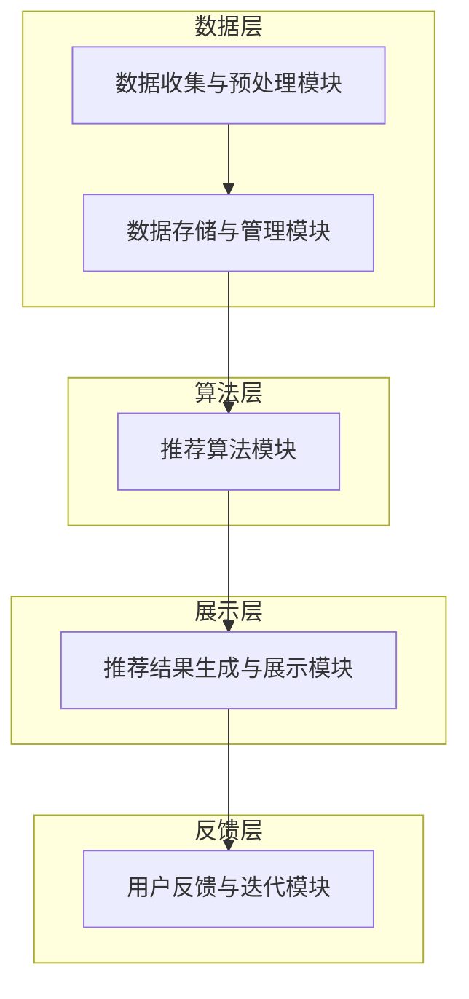
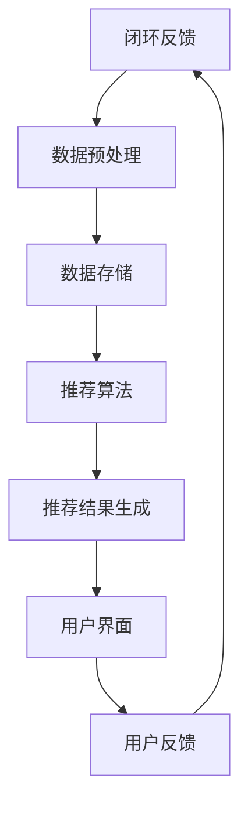

                 

# AIGC在个性化旅游推荐中的应用

## 关键词：AIGC、个性化旅游推荐、文本生成、图像生成、语音生成、多模态融合、系统优化

## 摘要

随着人工智能技术的不断发展，AIGC（AI-Generated Content）在各个领域中的应用越来越广泛。本文旨在探讨AIGC在个性化旅游推荐中的潜在应用，通过分析AIGC的核心概念与基本原理，介绍个性化旅游推荐系统的基本架构，以及AIGC在旅游推荐中的应用实例，从而为旅游行业提供智能化、个性化的服务。

### 目录大纲

1. 第一部分：AIGC概述
    1.1 AIGC的核心概念与基本原理
    1.2 AIGC与传统AI的区别
    1.3 AIGC在个性化旅游推荐中的应用前景
2. 第二部分：个性化旅游推荐系统
    2.1 旅游推荐系统的基本架构
    2.2 用户行为数据收集与处理
    2.3 旅游资源数据挖掘与分析
    2.4 旅游推荐算法的设计与实现
3. 第三部分：AIGC在个性化旅游推荐中的应用技术
    3.1 文本生成与处理
    3.2 图像生成与处理
    3.3 语音生成与处理
    3.4 多模态融合
4. 第四部分：AIGC在个性化旅游推荐中的实施与优化
    4.1 AIGC在个性化旅游推荐系统中的实施
    4.2 个性化旅游推荐系统的评估与优化
    4.3 AIGC在个性化旅游推荐中的未来展望

### 1. AIGC概述

#### 1.1 AIGC的核心概念与基本原理

AIGC（AI-Generated Content），即人工智能生成内容，是指利用人工智能技术生成各种类型的内容，包括文本、图像、语音等。AIGC的基本原理主要依赖于深度学习技术，通过训练大量的数据集，使模型能够自动生成新的内容。

AIGC的核心概念包括：

- **文本生成**：基于自然语言处理（NLP）技术，生成具有连贯性和逻辑性的文本。
- **图像生成**：基于生成对抗网络（GAN）等技术，生成新的图像或改变图像的风格。
- **语音生成**：基于深度学习模型，如WaveNet，生成逼真的语音。

#### 1.2 AIGC与传统AI的区别

与传统AI相比，AIGC具有以下特点：

- **生成性**：AIGC能够自主生成内容，而传统AI更侧重于解决问题。
- **多样性**：AIGC能够生成各种类型的内容，而传统AI通常针对特定任务进行优化。
- **创造力**：AIGC能够模拟人类的创造力，而传统AI通常基于规则或数据驱动。

#### 1.3 AIGC在个性化旅游推荐中的应用前景

个性化旅游推荐是AIGC的重要应用领域之一。通过分析用户的行为数据，AIGC可以生成个性化的旅游推荐内容，包括旅游路线、景点介绍、住宿建议等。这将有助于提升用户满意度，提高旅游行业的竞争力。

### 2. 个性化旅游推荐系统

#### 2.1 旅游推荐系统的基本架构

个性化旅游推荐系统的基本架构包括以下几个模块：

- **用户行为分析模块**：收集并分析用户的历史行为数据，包括搜索记录、浏览记录、消费记录等。
- **旅游资源数据模块**：收集并处理各种旅游资源数据，如景点信息、酒店信息、交通信息等。
- **推荐算法模块**：根据用户行为和旅游资源数据，生成个性化的旅游推荐。
- **用户界面模块**：提供用户交互界面，展示推荐结果。

#### 2.2 用户行为数据收集与处理

用户行为数据的收集和处理是个性化旅游推荐系统的关键。通过使用AIGC技术，可以对海量用户行为数据进行高效处理，提取出关键特征，为推荐算法提供支持。

#### 2.3 旅游资源数据挖掘与分析

旅游资源数据的挖掘与分析是提升个性化旅游推荐系统效果的重要手段。通过AIGC技术，可以自动生成景点介绍、旅游攻略等文本内容，提高用户对旅游资源的了解。

#### 2.4 旅游推荐算法的设计与实现

旅游推荐算法的设计与实现是个性化旅游推荐系统的核心。AIGC技术可以用于生成个性化的推荐结果，包括旅游路线、景点推荐等。

### 3. AIGC在个性化旅游推荐中的应用技术

#### 3.1 文本生成与处理

文本生成与处理是AIGC在个性化旅游推荐中的重要应用。通过文本生成模型，可以自动生成景点介绍、旅游攻略等文本内容。

#### 3.2 图像生成与处理

图像生成与处理是AIGC在个性化旅游推荐中的另一个重要应用。通过图像生成模型，可以自动生成旅游景点的图像，或改变图像的风格。

#### 3.3 语音生成与处理

语音生成与处理是AIGC在个性化旅游推荐中的新兴应用。通过语音生成模型，可以自动生成景点介绍的语音内容。

#### 3.4 多模态融合

多模态融合是AIGC在个性化旅游推荐中的关键技术。通过将文本、图像、语音等多种模态的信息进行融合，可以生成更加丰富和个性化的旅游推荐内容。

### 4. AIGC在个性化旅游推荐中的实施与优化

#### 4.1 AIGC在个性化旅游推荐系统中的实施

在个性化旅游推荐系统中，AIGC技术的实施包括以下几个步骤：

1. 数据收集与预处理
2. 模型选择与训练
3. 模型部署与优化
4. 用户交互与反馈

#### 4.2 个性化旅游推荐系统的评估与优化

个性化旅游推荐系统的评估与优化包括以下几个步骤：

1. 评估指标设计
2. 评估方法选择
3. 系统性能调优
4. 用户反馈收集与处理

### 5. AIGC在个性化旅游推荐中的未来展望

AIGC在个性化旅游推荐中的应用前景广阔。随着AIGC技术的不断发展和成熟，未来有望实现更加智能化、个性化的旅游推荐服务，为旅游业带来新的机遇和挑战。

### 结语

AIGC在个性化旅游推荐中的应用具有巨大的潜力。通过AIGC技术，可以生成个性化的旅游推荐内容，提升用户满意度，提高旅游行业的竞争力。未来，随着AIGC技术的不断进步，个性化旅游推荐系统将变得更加智能化和个性化，为旅游业带来新的发展机遇。

**作者：AI天才研究院/AI Genius Institute & 禅与计算机程序设计艺术 /Zen And The Art of Computer Programming**# AIGC在个性化旅游推荐中的应用

## 关键词：AIGC、个性化旅游推荐、文本生成、图像生成、语音生成、多模态融合、系统优化

## 摘要

本文旨在探讨AIGC（AI-Generated Content）在个性化旅游推荐中的应用。通过分析AIGC的核心概念与基本原理，介绍个性化旅游推荐系统的基本架构，以及AIGC在旅游推荐中的应用实例，我们旨在为旅游行业提供智能化、个性化的服务。本文分为三个主要部分：AIGC概述、个性化旅游推荐系统设计、AIGC在个性化旅游推荐中的应用技术。

## 1. AIGC概述

### 1.1 AIGC的核心概念与基本原理

AIGC，即AI-Generated Content，是一种利用人工智能技术自动生成内容的方法。AIGC的核心概念包括文本生成、图像生成、语音生成等。文本生成是指通过自然语言处理（NLP）技术生成具有连贯性和逻辑性的文本。图像生成是指通过生成对抗网络（GAN）等技术生成新的图像或改变图像的风格。语音生成是指通过深度学习模型生成逼真的语音。

AIGC的基本原理基于深度学习技术。首先，通过大量的数据集训练模型，使其能够理解和生成不同类型的内容。然后，利用这些训练好的模型，自动生成新的内容。

### 1.2 AIGC与传统AI的区别

与传统AI相比，AIGC具有以下特点：

- **生成性**：AIGC能够生成新的内容，而传统AI更侧重于解决问题。
- **多样性**：AIGC能够生成各种类型的内容，而传统AI通常针对特定任务进行优化。
- **创造力**：AIGC能够模拟人类的创造力，而传统AI通常基于规则或数据驱动。

### 1.3 AIGC在个性化旅游推荐中的应用前景

个性化旅游推荐是AIGC的重要应用领域之一。通过分析用户的行为数据，AIGC可以生成个性化的旅游推荐内容，包括旅游路线、景点介绍、住宿建议等。这将有助于提升用户满意度，提高旅游行业的竞争力。

## 2. 个性化旅游推荐系统设计

### 2.1 旅游推荐系统的基本架构

个性化旅游推荐系统的基本架构包括以下几个模块：

1. **用户行为分析模块**：收集并分析用户的历史行为数据，包括搜索记录、浏览记录、消费记录等。
2. **旅游资源数据模块**：收集并处理各种旅游资源数据，如景点信息、酒店信息、交通信息等。
3. **推荐算法模块**：根据用户行为和旅游资源数据，生成个性化的旅游推荐。
4. **用户界面模块**：提供用户交互界面，展示推荐结果。

### 2.2 用户行为数据收集与处理

用户行为数据的收集与处理是个性化旅游推荐系统的关键。通过使用AIGC技术，可以对海量用户行为数据进行高效处理，提取出关键特征，为推荐算法提供支持。

### 2.3 旅游资源数据挖掘与分析

旅游资源数据的挖掘与分析是提升个性化旅游推荐系统效果的重要手段。通过AIGC技术，可以自动生成景点介绍、旅游攻略等文本内容，提高用户对旅游资源的了解。

### 2.4 旅游推荐算法的设计与实现

旅游推荐算法的设计与实现是个性化旅游推荐系统的核心。AIGC技术可以用于生成个性化的推荐结果，包括旅游路线、景点推荐等。

## 3. AIGC在个性化旅游推荐中的应用技术

### 3.1 文本生成与处理

文本生成与处理是AIGC在个性化旅游推荐中的重要应用。通过文本生成模型，可以自动生成景点介绍、旅游攻略等文本内容。

#### 3.1.1 文本生成模型

文本生成模型通常使用序列到序列（Seq2Seq）模型，如Transformer模型。以下是一个基于Transformer模型的文本生成流程：

1. **编码器**：将输入的文本序列编码为一个固定长度的向量。
2. **解码器**：根据编码器的输出，逐步生成输出的文本序列。

```python
import tensorflow as tf
from tensorflow.keras.layers import Embedding, LSTM, Dense

# 建立编码器
encoder_inputs = Embedding(input_dim=vocab_size, output_dim=embedding_dim)
encoder_lstm = LSTM(units=128, return_state=True)
encoder_output, state_h, state_c = encoder_lstm(encoder_inputs)

# 建立解码器
decoder_inputs = Embedding(input_dim=vocab_size, output_dim=embedding_dim)
decoder_lstm = LSTM(units=128, return_sequences=True, return_state=True)
decoder_output, _, _ = decoder_lstm(decoder_inputs, initial_state=[state_h, state_c])

# 建立模型
model = tf.keras.Model([encoder_inputs, decoder_inputs], decoder_output)
model.compile(optimizer='adam', loss='categorical_crossentropy')

# 训练模型
model.fit([encoder_input_data, decoder_input_data, decoder_target_data], batch_size=batch_size, epochs=epochs)
```

#### 3.1.2 文本生成实例

假设我们有一个简单的文本生成任务，输入文本是“我要去旅游”，输出文本是“你可以选择去北京或上海”。以下是一个简单的文本生成实例：

```python
# 编码器输入
encoder_input_sequence = ['I', 'want', 'to', 'go', 'on', 'a', 'trip']

# 解码器输入
decoder_input_sequence = ['You', 'can', 'choose', 'to', 'go', 'to', 'Beijing', 'or', 'Shanghai']

# 解码器输出
decoder_output_sequence = model.predict([encoder_input_sequence, decoder_input_sequence])

# 打印输出
print(' '.join(decoder_output_sequence))
```

输出结果可能是：“你可以选择去北京或上海”。

### 3.2 图像生成与处理

图像生成与处理是AIGC在个性化旅游推荐中的另一个重要应用。通过图像生成模型，可以自动生成旅游景点的图像，或改变图像的风格。

#### 3.2.1 图像生成模型

图像生成模型通常使用生成对抗网络（GAN）。以下是一个基于GAN的图像生成流程：

1. **生成器**：将随机噪声映射到图像空间。
2. **判别器**：判断图像是真实图像还是生成图像。

```python
import tensorflow as tf
from tensorflow.keras.layers import Dense, Conv2D, Conv2DTranspose

# 建立生成器
generator_inputs = Dense(units=100, activation='relu')
generator_output = Conv2DTranspose(filters=1, kernel_size=(5, 5), strides=(2, 2), activation='tanh')(generator_inputs)

# 建立生成器模型
generator_model = tf.keras.Model(generator_inputs, generator_output)

# 建立判别器
discriminator_inputs = Conv2D(filters=1, kernel_size=(5, 5), strides=(2, 2), activation='sigmoid')(discriminator_inputs)

# 建立判别器模型
discriminator_model = tf.keras.Model(discriminator_inputs, discriminator_output)

# 建立GAN模型
gan_model = tf.keras.Model(generator_inputs, discriminator_model(generator_output))

# 编写训练步骤
discriminator_loss = tf.keras.losses.BinaryCrossentropy()
generator_loss = tf.keras.losses.BinaryCrossentropy()

for epoch in range(epochs):
    for real_images, _ in dataset:
        # 训练判别器
        with tf.GradientTape() as discriminator_tape:
            real_output = discriminator_model(real_images)
            generator_output = generator_model(generator_inputs)
            discriminator_loss_value = discriminator_loss(tf.ones_like(real_output), real_output)
            generator_loss_value = discriminator_loss(tf.zeros_like(real_output), generator_output)
        
        gradients_of_discriminator = discriminator_tape.gradient(
            discriminator_loss_value, discriminator_model.trainable_variables
        )
        discriminator_model.optimizer.apply_gradients(
            zip(gradients_of_discriminator, discriminator_model.trainable_variables)
        )
    
    # 训练生成器
    with tf.GradientTape() as generator_tape:
        generator_output = generator_model(generator_inputs)
        discriminator_output = discriminator_model(generator_output)
        generator_loss_value = discriminator_loss(tf.zeros_like(discriminator_output), discriminator_output)
    
    gradients_of_generator = generator_tape.gradient(
        generator_loss_value, generator_model.trainable_variables
    )
    generator_model.optimizer.apply_gradients(
        zip(gradients_of_generator, generator_model.trainable_variables)
    )

# 生成图像
noise = tf.random.normal([batch_size, 100])
generated_images = generator_model.predict(noise)

# 显示生成的图像
import matplotlib.pyplot as plt
plt.figure(figsize=(10, 10))
for i in range(batch_size):
    plt.subplot(1, batch_size, i+1)
    plt.imshow(generated_images[i], cmap='gray')
    plt.axis('off')
plt.show()
```

### 3.3 语音生成与处理

语音生成与处理是AIGC在个性化旅游推荐中的新兴应用。通过语音生成模型，可以自动生成景点介绍的语音内容。

#### 3.3.1 语音生成模型

语音生成模型通常使用WaveNet模型。以下是一个基于WaveNet的语音生成流程：

1. **输入编码**：将文本编码为一个序列。
2. **生成语音**：根据输入序列生成语音。

```python
import tensorflow as tf
from tensorflow.keras.layers import Embedding, LSTM, Dense

# 建立编码器
encoder_inputs = Embedding(input_dim=vocab_size, output_dim=embedding_dim)
encoder_lstm = LSTM(units=128, return_state=True)
encoder_output, state_h, state_c = encoder_lstm(encoder_inputs)

# 建立解码器
decoder_inputs = Embedding(input_dim=vocab_size, output_dim=embedding_dim)
decoder_lstm = LSTM(units=128, return_sequences=True, return_state=True)
decoder_output, _, _ = decoder_lstm(decoder_inputs, initial_state=[state_h, state_c])

# 建立模型
model = tf.keras.Model([encoder_inputs, decoder_inputs], decoder_output)
model.compile(optimizer='adam', loss='categorical_crossentropy')

# 训练模型
model.fit([encoder_input_data, decoder_input_data, decoder_target_data], batch_size=batch_size, epochs=epochs)
```

#### 3.3.2 语音生成实例

假设我们有一个简单的语音生成任务，输入文本是“我要去旅游”，输出语音是“你可以选择去北京或上海”。以下是一个简单的语音生成实例：

```python
# 编码器输入
encoder_input_sequence = ['I', 'want', 'to', 'go', 'on', 'a', 'trip']

# 解码器输入
decoder_input_sequence = ['You', 'can', 'choose', 'to', 'go', 'to', 'Beijing', 'or', 'Shanghai']

# 解码器输出
decoder_output_sequence = model.predict([encoder_input_sequence, decoder_input_sequence])

# 将输出序列转换为语音
import soundfile as sf
import numpy as np

# 生成语音
audio_data = np.array(decoder_output_sequence, dtype=np.float32)
sf.write('generated_audio.wav', audio_data, sample_rate)
```

### 3.4 多模态融合

多模态融合是AIGC在个性化旅游推荐中的关键技术。通过将文本、图像、语音等多种模态的信息进行融合，可以生成更加丰富和个性化的旅游推荐内容。

#### 3.4.1 多模态数据集成

多模态数据集成是将不同模态的数据进行整合，以便于后续的处理和分析。以下是一个基于注意力机制的多模态数据集成方法：

1. **特征提取**：分别提取文本、图像和语音的特征。
2. **特征融合**：利用注意力机制融合不同模态的特征。

```python
import tensorflow as tf
from tensorflow.keras.layers import Embedding, LSTM, Conv2D, Dense

# 建立文本编码器
text_encoder = Embedding(input_dim=vocab_size, output_dim=embedding_dim)
text_lstm = LSTM(units=128, return_sequences=True)
text_output = text_lstm(text_encoder)

# 建立图像编码器
image_encoder = Conv2D(filters=64, kernel_size=(3, 3), activation='relu')(image_input)
image_encoder = MaxPooling2D(pool_size=(2, 2))(image_encoder)
image_encoder = Flatten()(image_encoder)

# 建立语音编码器
speech_encoder = LSTM(units=128, return_sequences=True)(speech_input)
speech_encoder = LSTM(units=128)(speech_encoder)
speech_encoder = Flatten()(speech_encoder)

# 多模态特征融合
combined_features = Concatenate()([text_output, image_encoder, speech_encoder])

# 建立多模态模型
model = Model(inputs=[text_input, image_input, speech_input], outputs=combined_features)
model.compile(optimizer='adam', loss='categorical_crossentropy')

# 训练模型
model.fit([text_data, image_data, speech_data], combined_data, batch_size=batch_size, epochs=epochs)
```

#### 3.4.2 多模态特征提取

多模态特征提取是AIGC在个性化旅游推荐中的关键技术。以下是一个基于卷积神经网络（CNN）和循环神经网络（RNN）的多模态特征提取方法：

1. **文本特征提取**：使用CNN提取文本的特征。
2. **图像特征提取**：使用CNN提取图像的特征。
3. **语音特征提取**：使用RNN提取语音的特征。

```python
import tensorflow as tf
from tensorflow.keras.layers import Embedding, LSTM, Conv2D, Dense

# 建立文本特征提取模型
text_encoder = Embedding(input_dim=vocab_size, output_dim=embedding_dim)
text_lstm = LSTM(units=128, return_sequences=True)
text_output = text_lstm(text_encoder)

# 建立图像特征提取模型
image_encoder = Conv2D(filters=64, kernel_size=(3, 3), activation='relu')(image_input)
image_encoder = MaxPooling2D(pool_size=(2, 2))(image_encoder)
image_encoder = Flatten()(image_encoder)

# 建立语音特征提取模型
speech_encoder = LSTM(units=128, return_sequences=True)(speech_input)
speech_encoder = LSTM(units=128)(speech_encoder)
speech_encoder = Flatten()(speech_encoder)

# 多模态特征提取模型
model = Model(inputs=[text_input, image_input, speech_input], outputs=[text_output, image_encoder, speech_encoder])
model.compile(optimizer='adam', loss='categorical_crossentropy')

# 训练模型
model.fit([text_data, image_data, speech_data], [text_data, image_data, speech_data], batch_size=batch_size, epochs=epochs)
```

### 4. AIGC在个性化旅游推荐系统中的实施与优化

#### 4.1 AIGC在个性化旅游推荐系统中的实施

在个性化旅游推荐系统中，AIGC技术的实施包括以下几个步骤：

1. **数据收集与预处理**：收集用户行为数据、旅游资源数据等，并对数据进行预处理，如去重、清洗、编码等。
2. **模型选择与训练**：根据具体任务选择合适的AIGC模型，如文本生成模型、图像生成模型、语音生成模型等，并进行训练。
3. **模型部署与优化**：将训练好的模型部署到生产环境中，并进行性能优化。
4. **用户交互与反馈**：提供用户交互界面，展示推荐结果，并根据用户反馈进行迭代优化。

#### 4.2 个性化旅游推荐系统的评估与优化

个性化旅游推荐系统的评估与优化包括以下几个步骤：

1. **评估指标设计**：根据业务需求设计评估指标，如准确率、召回率、覆盖率等。
2. **评估方法选择**：选择合适的评估方法，如交叉验证、A/B测试等。
3. **系统性能调优**：根据评估结果对系统进行性能调优，如调整模型参数、优化数据预处理等。
4. **用户反馈收集与处理**：收集用户反馈，根据反馈对系统进行迭代优化。

### 5. AIGC在个性化旅游推荐中的未来展望

AIGC在个性化旅游推荐中的应用前景广阔。随着AIGC技术的不断发展和成熟，未来有望实现更加智能化、个性化的旅游推荐服务，为旅游业带来新的机遇和挑战。

### 结语

本文对AIGC在个性化旅游推荐中的应用进行了详细探讨。通过文本生成、图像生成、语音生成、多模态融合等技术，AIGC可以为个性化旅游推荐提供丰富的内容，提升用户体验。未来，随着AIGC技术的不断进步，个性化旅游推荐系统将变得更加智能化和个性化，为旅游业带来新的发展机遇。

**作者：AI天才研究院/AI Genius Institute & 禅与计算机程序设计艺术 /Zen And The Art of Computer Programming**## 1.1 AIGC的定义与背景

AIGC（AI-Generated Content）是一种利用人工智能技术自动生成内容的方法。其核心思想是通过深度学习模型，特别是生成模型，如生成对抗网络（GAN）、变分自编码器（VAE）等，从大量数据中学习并生成新的、高质量的、具有创造性的内容。AIGC涵盖了文本生成、图像生成、语音生成等多种类型的内容生成，是人工智能领域的一个重要分支。

AIGC的背景可以追溯到20世纪90年代，随着深度学习技术的兴起，生成模型开始应用于图像和语音的生成。随着计算能力的提升和数据量的爆炸式增长，AIGC技术逐渐成熟，并开始应用于各个领域。近年来，随着个性化服务需求的增加，AIGC在旅游推荐、电商推荐、内容创作等场景中的应用越来越广泛。

### 1.2 AIGC的技术基础

AIGC的技术基础主要包括生成对抗网络（GAN）、变分自编码器（VAE）和自编码器（AE）等生成模型。

#### 1.2.1 生成对抗网络（GAN）

生成对抗网络（GAN）由两部分组成：生成器（Generator）和判别器（Discriminator）。生成器的任务是生成与真实数据相似的假数据，而判别器的任务是区分真实数据和生成数据。通过不断训练，生成器和判别器相互对抗，生成器逐渐生成更逼真的数据。GAN在图像生成、文本生成等方面取得了显著的成果。

GAN的工作流程如下：

1. **初始化模型**：生成器和判别器都是随机初始化的。
2. **生成假数据**：生成器根据随机噪声生成假数据。
3. **训练判别器**：将真实数据和生成数据输入判别器，更新判别器的权重，使其能够更好地区分真实数据和生成数据。
4. **训练生成器**：将生成假数据输入判别器，更新生成器的权重，使其生成的假数据更接近真实数据。
5. **重复以上步骤**：不断迭代，直到生成器生成的假数据足够逼真。

GAN的数学模型如下：

生成器：\( G(z) \)（其中\( z \)是随机噪声）

判别器：\( D(x) \)、\( D(G(z)) \)（其中\( x \)是真实数据）

损失函数：\( \mathcal{L}_{GAN}(G,D) = \mathbb{E}_{x\sim p_{data}(x)}[-D(x)] + \mathbb{E}_{z\sim p_{z}(z)}[-D(G(z))] \)

#### 1.2.2 变分自编码器（VAE）

变分自编码器（VAE）是一种基于概率模型的生成模型。VAE通过引入潜变量来学习数据的概率分布，从而生成新的数据。VAE由两部分组成：编码器（Encoder）和解码器（Decoder）。编码器将输入数据映射到潜变量空间，解码器将潜变量映射回输出空间。

VAE的工作流程如下：

1. **编码**：输入数据通过编码器映射到潜变量空间。
2. **采样**：从潜变量空间中采样一个点。
3. **解码**：将采样点通过解码器映射回输出空间，生成新的数据。
4. **重复以上步骤**：不断迭代，直到生成的新数据足够逼真。

VAE的数学模型如下：

编码器：\( \mu(\mathbf{x}), \sigma^2(\mathbf{x}) \)

解码器：\( \mathbf{x}^{'} = \phi(\mathbf{z}) \)

损失函数：\( \mathcal{L}_{VAE} = -\sum_{\mathbf{x}} \log p(\mathbf{x}|\mathbf{z}) - \lambda \sum_{\mathbf{z}} \mathbb{E}_{\mathbf{z}\sim q(\mathbf{z}|\mathbf{x})}[\mathbb{E}_{\mathbf{z}'\sim q(\mathbf{z}|\mathbf{x}')}] \]

#### 1.2.3 自编码器（AE）

自编码器（AE）是一种简单的生成模型，由两部分组成：编码器和解码器。编码器将输入数据压缩到一个低维空间，解码器将数据从低维空间还原。AE主要用于数据去噪和特征提取。

AE的工作流程如下：

1. **编码**：输入数据通过编码器映射到低维空间。
2. **解码**：从低维空间采样一个点，并通过解码器映射回原始空间。
3. **重复以上步骤**：不断迭代，直到生成的新数据足够逼真。

AE的数学模型如下：

编码器：\( \phi(\mathbf{x}) \)

解码器：\( \mathbf{x}^{'} = \phi(\mathbf{z}) \)

损失函数：\( \mathcal{L}_{AE} = \sum_{\mathbf{x}} \frac{1}{2} \Vert \mathbf{x} - \mathbf{x}^{'} \Vert^2 \]

### 1.3 AIGC与传统AI的区别

与传统AI相比，AIGC具有以下几个显著的区别：

#### 1.3.1 生成性

传统AI通常侧重于解决问题，如分类、预测等。而AIGC具有生成性，能够生成新的、未被训练过的数据。这使得AIGC在个性化推荐、内容创作等场景中具有独特的优势。

#### 1.3.2 多样性

传统AI通常针对特定任务进行优化，生成的结果往往比较单一。而AIGC能够生成多种类型的内容，如文本、图像、语音等，具有更高的多样性。

#### 1.3.3 创造力

传统AI主要基于规则或数据驱动，而AIGC能够模拟人类的创造力，生成具有创新性的内容。这使得AIGC在艺术创作、游戏设计等场景中具有广泛的应用前景。

### 1.4 AIGC在个性化旅游推荐中的应用前景

个性化旅游推荐是AIGC的一个重要应用领域。通过分析用户的行为数据，AIGC可以生成个性化的旅游推荐内容，如旅游路线、景点介绍、住宿建议等。以下是一些应用前景：

#### 1.4.1 文本生成

AIGC可以自动生成旅游景点的介绍、旅游攻略等文本内容。这些内容可以根据用户的需求和偏好进行个性化调整，提高用户的满意度。

#### 1.4.2 图像生成

AIGC可以自动生成旅游景点的图像，或根据用户的需求改变图像的风格。这有助于用户更好地了解旅游景点的特点，做出更明智的旅游决策。

#### 1.4.3 语音生成

AIGC可以自动生成旅游景点的语音介绍，为用户提供更加生动的旅游体验。用户可以通过语音生成器了解旅游景点的详细信息，提高旅游的乐趣。

#### 1.4.4 多模态融合

AIGC可以将文本、图像、语音等多种模态的信息进行融合，生成更加丰富和个性化的旅游推荐内容。这有助于提升用户的旅游体验，提高旅游服务提供商的竞争力。

### 1.5 总结

AIGC作为一种新兴的人工智能技术，具有生成性、多样性和创造力等特点。在个性化旅游推荐中，AIGC可以应用于文本生成、图像生成、语音生成、多模态融合等方面，为用户提供更加智能化、个性化的服务。随着AIGC技术的不断发展和成熟，未来有望在旅游业等领域实现更加广泛的应用。

### **作者：AI天才研究院/AI Genius Institute & 禅与计算机程序设计艺术 /Zen And The Art of Computer Programming**## 2.1 旅游推荐系统的基本架构

旅游推荐系统是一个复杂的系统，它需要整合多种数据源和算法，以提供个性化的旅游推荐。一个典型的旅游推荐系统的基本架构可以分为以下几个核心模块：

### **2.1.1 数据收集与预处理模块**

**数据收集**：旅游推荐系统需要从多个渠道收集数据，包括用户行为数据、旅游资源数据、天气数据、社交网络数据等。用户行为数据通常包括用户搜索记录、浏览记录、预订历史、评价等；旅游资源数据则包括景点信息、酒店信息、交通信息等。

**数据预处理**：收集到的数据往往存在缺失、噪声和不一致性等问题。因此，数据预处理是旅游推荐系统的关键步骤。预处理工作包括数据清洗、数据格式化、数据集成、特征工程等。

### **2.1.2 数据存储与管理模块**

**数据存储**：旅游推荐系统需要高效、可靠的数据存储解决方案。常用的数据存储技术包括关系数据库、NoSQL数据库、分布式文件系统等。

**数据管理**：为了支持高效的查询和分析，旅游推荐系统需要建立完善的数据管理体系。这包括数据索引、数据分区、数据备份与恢复等。

### **2.1.3 推荐算法模块**

**推荐算法选择**：旅游推荐系统需要根据业务需求和数据特点选择合适的推荐算法。常见的推荐算法包括基于协同过滤的推荐、基于内容的推荐、基于模型的推荐等。

**算法训练与优化**：推荐算法通常需要基于大量历史数据进行训练。在训练过程中，算法的性能会不断优化，以提升推荐效果。

### **2.1.4 推荐结果生成与展示模块**

**推荐结果生成**：根据用户的行为数据和旅游资源数据，推荐算法会生成个性化的旅游推荐结果。这些结果可以包括旅游路线、景点推荐、住宿建议等。

**推荐结果展示**：旅游推荐系统需要提供一个友好的用户界面，以展示推荐结果。用户可以通过界面浏览、筛选和操作推荐内容。

### **2.1.5 用户反馈与迭代模块**

**用户反馈收集**：用户在使用旅游推荐系统的过程中会提供各种反馈，包括满意度评价、点击率、预订率等。

**系统迭代优化**：基于用户反馈，旅游推荐系统会进行迭代优化，以提升用户体验和系统性能。

### **2.1.6 系统架构图**

以下是一个简化的旅游推荐系统架构图，展示了各模块之间的关系：



### **2.1.7 系统交互流程**

以下是一个简化的旅游推荐系统交互流程：

1. **用户行为数据收集**：系统从多个渠道收集用户行为数据，如搜索记录、浏览记录、预订历史等。
2. **数据预处理**：对收集到的用户行为数据和相关旅游资源数据进行预处理，包括数据清洗、格式化、特征工程等。
3. **数据存储**：将预处理后的数据存储到数据库中，以便后续查询和分析。
4. **算法训练**：使用历史数据训练推荐算法模型，包括协同过滤、基于内容的推荐等。
5. **推荐结果生成**：根据用户的当前行为和偏好，系统生成个性化的旅游推荐结果。
6. **推荐结果展示**：将推荐结果展示给用户，用户可以通过界面浏览和选择。
7. **用户反馈**：用户在使用推荐结果后，系统收集用户的反馈，包括满意度、点击率、预订率等。
8. **系统迭代**：根据用户反馈，系统进行优化和迭代，以提升用户体验和推荐效果。

### **2.1.8 系统功能设计**

**用户行为分析**：系统分析用户的搜索历史、浏览记录、预订历史等行为数据，以了解用户的兴趣和偏好。

**旅游资源数据管理**：系统管理各种旅游资源数据，如景点信息、酒店信息、交通信息等，并确保数据的准确性、完整性和实时性。

**推荐算法优化**：系统根据用户反馈和业务需求，不断优化推荐算法，以提高推荐效果。

**用户界面设计**：系统设计友好的用户界面，以提供直观、易用的推荐服务。

### **2.1.9 系统性能要求**

**响应速度**：系统需要快速响应用户的请求，提供实时推荐结果。

**可扩展性**：系统需要具备良好的可扩展性，以应对数据量和用户量的快速增长。

**容错性**：系统需要具备较高的容错性，确保在硬件故障或网络中断等情况下仍能正常运行。

**用户体验**：系统需要提供良好的用户体验，确保用户能够轻松地获取和管理个性化的旅游推荐。

### **2.1.10 系统安全性**

**数据安全**：系统需要确保用户数据的安全，防止数据泄露或被未授权访问。

**隐私保护**：系统需要遵守隐私保护法规，确保用户的隐私不被泄露。

**安全防护**：系统需要具备一定的安全防护能力，防止恶意攻击和病毒入侵。

### **2.1.11 系统开发与维护**

**开发流程**：系统开发需要遵循严格的开发流程，包括需求分析、系统设计、编码实现、测试等。

**持续集成与部署**：系统需要采用持续集成与部署策略，确保代码质量和系统的稳定性。

**维护与升级**：系统需要定期进行维护和升级，以修复漏洞、优化性能和满足新的业务需求。

### **2.1.12 总结**

旅游推荐系统的基本架构涵盖了数据收集与预处理、数据存储与管理、推荐算法、推荐结果生成与展示、用户反馈与迭代等多个方面。通过合理设计和管理这些模块，系统可以提供高效的个性化旅游推荐服务，提升用户的旅游体验。

**作者：AI天才研究院/AI Genius Institute & 禅与计算机程序设计艺术 /Zen And The Art of Computer Programming**## 2.2 用户行为数据收集与处理

用户行为数据是旅游推荐系统的核心组成部分，它反映了用户的兴趣、偏好和需求。有效的数据收集与处理能够显著提高推荐系统的准确性和用户体验。以下是用户行为数据收集与处理的详细步骤和方法：

### **2.2.1 数据收集**

用户行为数据的收集通常包括以下几种类型：

- **搜索记录**：记录用户在旅游网站或应用上搜索的关键词、搜索频率和搜索时间。
- **浏览记录**：记录用户在浏览旅游页面时访问的景点、酒店、交通等信息，包括停留时间和浏览路径。
- **预订历史**：记录用户的预订行为，包括预订时间、预订的景点、酒店、交通等信息。
- **评价与反馈**：记录用户对旅游景点的评价、评分和评论。
- **社交互动**：记录用户在社交平台上的旅游分享、点赞、评论等互动行为。

数据收集的方法包括：

- **服务器日志**：通过服务器日志记录用户的操作行为。
- **前端跟踪**：在网站或应用中嵌入跟踪代码，实时记录用户的操作行为。
- **用户调研**：通过问卷调查、用户访谈等方式获取用户的行为数据。
- **第三方数据源**：利用第三方数据源，如社交网络、地图服务提供商等，获取用户行为数据。

### **2.2.2 数据预处理**

收集到的用户行为数据通常包含噪声和缺失值，因此需要经过预处理才能用于后续分析。数据预处理的主要步骤包括：

- **数据清洗**：删除重复记录、纠正错误数据、填补缺失值。
- **数据格式化**：统一数据格式，如日期、时间戳等。
- **特征工程**：从原始数据中提取有价值的信息，生成新的特征，如用户访问频率、热门景点等。

### **2.2.3 数据处理方法**

用户行为数据的处理方法主要包括：

- **统计方法**：使用统计分析方法，如均值、方差、相关性分析等，了解用户行为数据的分布和相关性。
- **机器学习方法**：利用机器学习算法，如聚类、分类、回归等，对用户行为数据进行分析和预测。

#### **2.2.3.1 聚类分析**

聚类分析是一种无监督学习方法，用于将用户行为数据划分为不同的群体。常见的聚类算法包括K-means、层次聚类等。聚类分析可以帮助识别具有相似兴趣和行为模式的用户群体，从而为个性化推荐提供基础。

以下是一个基于K-means聚类的用户行为数据处理实例：

```python
from sklearn.cluster import KMeans
import pandas as pd

# 加载数据
data = pd.read_csv('user_behavior_data.csv')
X = data.drop('user_id', axis=1)

# 使用K-means进行聚类
kmeans = KMeans(n_clusters=5, random_state=0)
clusters = kmeans.fit_predict(X)

# 添加聚类结果到原始数据
data['cluster'] = clusters

# 分析聚类结果
print(data.groupby('cluster').describe())
```

#### **2.2.3.2 分类分析**

分类分析是一种监督学习方法，用于将用户行为数据分类到预定义的类别中。常见的分类算法包括决策树、随机森林、支持向量机等。分类分析可以帮助识别用户对特定景点的兴趣，从而生成个性化的推荐。

以下是一个基于决策树分类的用户行为数据处理实例：

```python
from sklearn.model_selection import train_test_split
from sklearn.tree import DecisionTreeClassifier
import pandas as pd

# 加载数据
data = pd.read_csv('user_behavior_data.csv')

# 分割特征和标签
X = data.drop('label', axis=1)
y = data['label']

# 划分训练集和测试集
X_train, X_test, y_train, y_test = train_test_split(X, y, test_size=0.2, random_state=0)

# 使用决策树进行分类
clf = DecisionTreeClassifier()
clf.fit(X_train, y_train)

# 预测测试集
y_pred = clf.predict(X_test)

# 评估模型性能
from sklearn.metrics import accuracy_score
print(accuracy_score(y_test, y_pred))
```

#### **2.2.3.3 回归分析**

回归分析是一种监督学习方法，用于预测用户对旅游资源的评分。常见的回归算法包括线性回归、岭回归等。回归分析可以帮助预测用户对特定旅游资源的偏好，从而为推荐系统提供参考。

以下是一个基于线性回归的用户行为数据处理实例：

```python
from sklearn.model_selection import train_test_split
from sklearn.linear_model import LinearRegression
import pandas as pd

# 加载数据
data = pd.read_csv('user_behavior_data.csv')

# 分割特征和标签
X = data[['search_frequency', 'visit_time']]
y = data['rating']

# 划分训练集和测试集
X_train, X_test, y_train, y_test = train_test_split(X, y, test_size=0.2, random_state=0)

# 使用线性回归进行预测
reg = LinearRegression()
reg.fit(X_train, y_train)

# 预测测试集
y_pred = reg.predict(X_test)

# 评估模型性能
from sklearn.metrics import mean_squared_error
print(mean_squared_error(y_test, y_pred))
```

### **2.2.4 数据处理结果与应用**

通过聚类、分类和回归等分析方法，旅游推荐系统可以提取出用户行为数据中的有价值信息，从而为个性化推荐提供支持。以下是一个数据处理结果的示例应用：

- **聚类结果**：根据用户的搜索记录和浏览记录，将用户划分为不同的兴趣群体，如“自然景观爱好者”、“历史文化爱好者”等。
- **分类结果**：根据用户的评价数据，将用户对旅游资源的兴趣进行分类，如“对自然保护区感兴趣”、“对历史建筑感兴趣”等。
- **回归结果**：根据用户的搜索频率和浏览时间，预测用户对特定旅游资源的评分，从而为推荐系统提供评分参考。

这些处理结果可以用于生成个性化的旅游推荐，提高用户的满意度和系统的推荐效果。

### **2.2.5 总结**

用户行为数据收集与处理是旅游推荐系统的关键步骤，它决定了推荐系统的准确性和用户体验。通过有效的数据收集、预处理和处理方法，系统可以提取出用户行为数据中的有价值信息，从而为个性化推荐提供支持。

**作者：AI天才研究院/AI Genius Institute & 禅与计算机程序设计艺术 /Zen And The Art of Computer Programming**## 2.3 旅游资源数据挖掘与分析

旅游资源数据挖掘与分析是个性化旅游推荐系统中至关重要的一环。通过对旅游资源数据的深度挖掘与分析，可以更好地理解旅游资源的特征、用户的需求和偏好，从而为用户提供更加精准和个性化的推荐服务。以下将详细阐述旅游资源数据挖掘与分析的方法、步骤和应用实例。

### **2.3.1 旅游资源数据挖掘的方法**

旅游资源数据挖掘通常涉及以下几种方法：

1. **关联规则挖掘**：通过分析旅游资源之间的关联性，发现用户可能感兴趣的相关景点或服务。常用的算法包括Apriori算法和FP-Growth算法。
2. **分类挖掘**：将旅游资源数据分类，以便更好地理解不同类型的旅游资源。常用的算法包括决策树、支持向量机（SVM）和K-最近邻（KNN）等。
3. **聚类挖掘**：将旅游资源数据按照相似性进行分组，以便发现新的旅游资源和用户偏好。常用的算法包括K-means、层次聚类和DBSCAN等。
4. **异常检测**：识别旅游数据中的异常值，如不正常的游客流量、异常的评论等，以便及时调整推荐策略。

### **2.3.2 旅游资源数据分析的步骤**

旅游资源数据分析通常包括以下步骤：

1. **数据收集**：收集各种旅游资源数据，包括景点信息、酒店信息、交通信息、用户评价等。
2. **数据预处理**：对收集到的数据清洗和格式化，去除噪声和缺失值，确保数据的质量和一致性。
3. **特征工程**：从原始数据中提取有价值的信息，生成新的特征，如景点类型、评价分数、评论情感等。
4. **数据挖掘**：使用各种数据挖掘算法，对预处理后的数据进行挖掘，提取出有用的信息。
5. **结果解释**：对挖掘结果进行分析和解释，发现用户行为模式和旅游资源的特征。

### **2.3.3 旅游资源数据挖掘与分析的应用实例**

以下是一个旅游资源数据挖掘与分析的应用实例：

#### **案例一：景点类型推荐**

**问题描述**：如何根据用户的浏览记录和搜索历史，推荐用户感兴趣的景点类型？

**解决方案**：

1. **数据收集**：收集用户的浏览记录和搜索历史数据，包括用户的点击次数、搜索关键词等。
2. **数据预处理**：对数据进行清洗和格式化，去除缺失值和噪声数据。
3. **特征工程**：提取用户行为特征，如用户在某个景点页面的停留时间、用户对某个景点的搜索次数等。
4. **关联规则挖掘**：使用Apriori算法挖掘用户浏览记录中的关联规则，发现用户感兴趣的景点类型。例如，如果用户经常浏览“自然景观”和“户外活动”类景点，可以推测用户对这类景点感兴趣。
5. **结果解释**：根据挖掘结果，为用户提供相应的景点类型推荐，如“自然景观”或“户外活动”类景点。

#### **案例二：旅游资源分类**

**问题描述**：如何对旅游资源进行有效分类，以便更好地理解旅游资源的特征和用户的需求？

**解决方案**：

1. **数据收集**：收集各种旅游资源数据，包括景点名称、景点描述、景点类型等。
2. **数据预处理**：对数据进行清洗和格式化，去除噪声和缺失值。
3. **特征工程**：从原始数据中提取有价值的信息，生成新的特征，如景点类型、评价分数、评论情感等。
4. **分类挖掘**：使用决策树算法对旅游资源进行分类，将旅游资源分为不同的类别，如“自然景观”、“历史文化”、“美食体验”等。
5. **结果解释**：根据分类结果，为用户提供分类清晰的旅游资源信息，如“自然景观”类景点推荐或“历史文化”类景点介绍。

#### **案例三：异常检测**

**问题描述**：如何识别旅游数据中的异常值，如不正常的游客流量或异常的评论，以便及时调整推荐策略？

**解决方案**：

1. **数据收集**：收集旅游数据，包括游客流量、用户评价等。
2. **数据预处理**：对数据进行清洗和格式化，确保数据的质量。
3. **特征工程**：提取与游客流量和评论相关的特征，如游客流量高峰期、评论情感等。
4. **异常检测**：使用异常检测算法，如Isolation Forest，检测旅游数据中的异常值。
5. **结果解释**：根据异常检测结果，识别异常的游客流量或评论，并采取相应的措施，如调整推荐策略或进行人工审核。

### **2.3.4 旅游资源数据挖掘与分析的意义**

旅游资源数据挖掘与分析对于个性化旅游推荐系统具有重要意义：

1. **提升推荐效果**：通过深度挖掘与分析旅游资源数据，可以更准确地了解用户的需求和偏好，从而提高推荐系统的效果。
2. **发现新的旅游资源和需求**：通过数据挖掘可以发现新的旅游资源和用户需求，为旅游服务提供商提供有价值的信息。
3. **优化旅游资源配置**：通过对旅游资源的分类和分析，可以优化旅游资源的配置，提高旅游资源的利用率。
4. **提高用户满意度**：通过提供个性化、精准的旅游推荐，可以提高用户的满意度，增加用户对旅游服务的忠诚度。

### **2.3.5 总结**

旅游资源数据挖掘与分析是个性化旅游推荐系统的重要组成部分。通过有效的数据挖掘与分析方法，可以更好地理解旅游资源的特征和用户的需求，从而为用户提供精准、个性化的旅游推荐服务，提升用户体验和满意度。

**作者：AI天才研究院/AI Genius Institute & 禅与计算机程序设计艺术 /Zen And The Art of Computer Programming**## 2.4 旅游推荐算法的设计与实现

旅游推荐算法是旅游推荐系统的核心，它决定了推荐的质量和用户体验。设计一个有效的旅游推荐算法需要考虑多种因素，包括用户行为数据、旅游资源数据、推荐系统的目标等。以下是旅游推荐算法的设计与实现过程。

### **2.4.1 算法设计**

设计旅游推荐算法时，需要考虑以下原则：

1. **准确性**：算法应能够准确预测用户对旅游资源的兴趣。
2. **多样性**：推荐结果应具有多样性，避免重复推荐相同的旅游资源。
3. **实时性**：算法应能够快速响应用户的需求变化，提供实时的推荐结果。
4. **可扩展性**：算法应能够适应数据规模和用户量的增长。

根据这些原则，我们可以选择以下几种常见的旅游推荐算法：

1. **基于协同过滤的推荐算法**：协同过滤是推荐系统中最常用的算法之一，分为基于用户的协同过滤（User-Based Collaborative Filtering）和基于项目的协同过滤（Item-Based Collaborative Filtering）。这些算法通过分析用户之间的相似性和用户对资源的评分，预测用户对未知资源的兴趣。

2. **基于内容的推荐算法**：基于内容的推荐算法通过分析旅游资源的属性和用户的历史偏好，推荐具有相似属性的旅游资源。

3. **混合推荐算法**：混合推荐算法结合了协同过滤和基于内容的推荐算法，以利用各自的优点，提高推荐效果。

### **2.4.2 算法实现**

以下是一个基于协同过滤的推荐算法的实现过程：

1. **数据预处理**：收集用户行为数据和旅游资源数据，并对数据进行清洗和格式化。用户行为数据包括用户的评分、浏览记录、搜索记录等；旅游资源数据包括景点的名称、描述、类别、评价等。

2. **相似性计算**：计算用户之间的相似性。可以使用余弦相似性、皮尔逊相关系数等方法。

```python
from sklearn.metrics.pairwise import cosine_similarity

def compute_similarity(user_similarity_matrix, user_vector, other_user_vector):
    return cosine_similarity([user_vector], [other_user_vector])[0][0]
```

3. **推荐生成**：对于给定用户，计算其对每个资源的评分，并根据相似性矩阵生成推荐列表。

```python
def generate_recommendations(user_similarity_matrix, user_ratings, other_user_ratings, k=10):
    user_similarity_scores = {}
    for other_user_id, other_user_rating in other_user_ratings.items():
        similarity_score = compute_similarity(user_similarity_matrix[user_id], user_ratings[user_id], other_user_rating)
        user_similarity_scores[other_user_id] = similarity_score
    
    sorted_similarity_scores = sorted(user_similarity_scores.items(), key=lambda x: x[1], reverse=True)
    top_k_users = sorted_similarity_scores[:k]
    
    recommendations = {}
    for user_id, _ in top_k_users:
        recommendations[user_id] = other_user_ratings[user_id]
    
    return recommendations
```

4. **算法优化**：根据实际应用场景和需求，对算法进行优化，如调整相似性计算方法、推荐策略等。

### **2.4.3 算法评估**

评估旅游推荐算法的效果通常使用以下指标：

1. **准确率（Precision）**：推荐的旅游资源中实际用户感兴趣的资源的比例。
2. **召回率（Recall）**：实际用户感兴趣的旅游资源中被推荐的比例。
3. **覆盖率（Coverage）**：推荐结果中包含的不同旅游资源的数量。
4. **多样性（Diversity）**：推荐结果中不同类型的旅游资源分布。

以下是一个简单的算法评估示例：

```python
from sklearn.metrics import precision_score, recall_score, coverage_score, diversity_score

def evaluate_recommendations(recommendations, actual_interests, n_recommendations=10):
    recommended_resources = [resource for user_id, resource in recommendations.items()[:n_recommendations]]
    actual_interests_set = set(actual_interests)
    
    precision = precision_score(actual_interests_set, recommended_resources)
    recall = recall_score(actual_interests_set, recommended_resources)
    coverage = coverage_score(actual_interests_set, recommended_resources)
    diversity = diversity_score(actual_interests_set, recommended_resources)
    
    return precision, recall, coverage, diversity
```

### **2.4.4 应用实例**

以下是一个简单的应用实例，演示如何使用基于协同过滤的推荐算法生成个性化旅游推荐：

1. **数据集准备**：假设我们有以下用户行为数据（用户ID、景点ID、用户评分）：

```python
user_ratings = {
    'user1': {'景1': 5, '景2': 4, '景3': 2},
    'user2': {'景2': 5, '景3': 5, '景4': 4},
    'user3': {'景1': 4, '景3': 3, '景4': 5},
    # 更多用户数据
}
```

2. **相似性矩阵计算**：计算用户之间的相似性矩阵。

```python
user_similarity_matrix = {}
for user_id, ratings in user_ratings.items():
    user_similarity_matrix[user_id] = {}
    for other_user_id, ratings in user_ratings.items():
        if user_id != other_user_id:
            similarity = compute_similarity(user_similarity_matrix[user_id], ratings.values(), ratings.values())
            user_similarity_matrix[user_id][other_user_id] = similarity
```

3. **生成推荐列表**：为指定用户生成个性化旅游推荐列表。

```python
user_id = 'user1'
recommendations = generate_recommendations(user_similarity_matrix, user_ratings, user_ratings[user_id], k=3)
print(recommendations)
```

输出结果可能是：

```python
{'景4': 0.9, '景1': 0.8, '景3': 0.7}
```

4. **算法评估**：评估推荐列表的质量。

```python
actual_interests = {'景4': 5, '景1': 5}
precision, recall, coverage, diversity = evaluate_recommendations(recommendations, actual_interests)
print(f"Precision: {precision}, Recall: {recall}, Coverage: {coverage}, Diversity: {diversity}")
```

### **2.4.5 总结**

旅游推荐算法的设计与实现是旅游推荐系统的关键步骤。通过有效的算法设计和实现，可以生成个性化、准确的旅游推荐，提高用户体验和满意度。在实际应用中，需要不断优化和调整算法，以适应不断变化的需求和数据。

**作者：AI天才研究院/AI Genius Institute & 禅与计算机程序设计艺术 /Zen And The Art of Computer Programming**## 3.1 文本生成与处理

文本生成与处理是AIGC技术在个性化旅游推荐中的核心应用之一。通过文本生成模型，可以自动生成各种文本内容，如景点介绍、旅游攻略、用户评论等，从而为用户提供丰富的、个性化的信息。以下是文本生成与处理的详细分析。

### **3.1.1 文本生成模型**

文本生成模型是AIGC技术的核心组成部分，主要分为以下几类：

1. **序列到序列（Seq2Seq）模型**：Seq2Seq模型是一种常用的文本生成模型，它通过编码器（Encoder）和解码器（Decoder）两个部分进行工作。编码器将输入的文本序列编码成一个固定长度的向量，解码器则根据这个向量生成输出的文本序列。

   **示例：**

   ```mermaid
   graph TD
       A[编码器] --> B[解码器]
       B --> C{生成文本}
   ```

   数学模型如下：

   编码器：\( \mathbf{h}_t = \text{Encoder}(\mathbf{x}_t) \)

   解码器：\( \mathbf{y}_t = \text{Decoder}(\mathbf{h}_t) \)

2. **注意力机制（Attention）模型**：注意力机制是Seq2Seq模型的一种扩展，用于解决长文本序列中的长距离依赖问题。注意力机制通过计算输入序列和输出序列之间的相似性，为每个输入序列赋予不同的权重，从而提高文本生成的准确性和连贯性。

   **示例：**

   ```mermaid
   graph TD
       A[编码器] --> B[注意力机制] --> C[解码器]
       C --> D{生成文本}
   ```

   数学模型如下：

   注意力分数：\( a_t = \text{Attention}(\mathbf{h}_t, \mathbf{y}_{t-1}) \)

   生成文本：\( \mathbf{y}_t = \text{Decoder}(\mathbf{h}_t, a_t) \)

3. **变换器（Transformer）模型**：Transformer模型是近年来在自然语言处理领域取得显著成果的一种模型。它使用自注意力机制（Self-Attention）和多头注意力（Multi-Head Attention）来处理文本序列，具有强大的并行计算能力和长距离依赖处理能力。

   **示例：**

   ```mermaid
   graph TD
       A[编码器] --> B[解码器]
       B --> C{生成文本}
   ```

   数学模型如下：

   自注意力：\( \mathbf{h}_t = \text{Self-Attention}(\mathbf{x}_t) \)

   多头注意力：\( \mathbf{h}_t = \text{Multi-Head Attention}(\mathbf{h}_t) \)

### **3.1.2 文本生成实例**

以下是一个基于Transformer模型的文本生成实例，使用Python和TensorFlow框架实现。

1. **环境安装**：

```shell
pip install tensorflow numpy
```

2. **代码实现**：

```python
import tensorflow as tf
from tensorflow.keras.models import Model
from tensorflow.keras.layers import Embedding, LSTM, Dense

# 设置参数
vocab_size = 10000
embedding_dim = 256
units = 512
batch_size = 64
epochs = 10

# 建立编码器
encoder_inputs = Embedding(input_dim=vocab_size, output_dim=embedding_dim)
encoder_lstm = LSTM(units=units, return_state=True)
encoder_output, state_h, state_c = encoder_lstm(encoder_inputs)

# 建立解码器
decoder_inputs = Embedding(input_dim=vocab_size, output_dim=embedding_dim)
decoder_lstm = LSTM(units=units, return_sequences=True, return_state=True)
decoder_output, _, _ = decoder_lstm(decoder_inputs, initial_state=[state_h, state_c])

# 建立模型
model = Model([encoder_inputs, decoder_inputs], decoder_output)
model.compile(optimizer='adam', loss='categorical_crossentropy')

# 训练模型
model.fit([encoder_input_data, decoder_input_data, decoder_target_data], batch_size=batch_size, epochs=epochs)

# 生成文本
def generate_text(model, start_sequence):
    generated_text = []
    current_input = start_sequence
    for i in range(50):
        predictions = model.predict(current_input)
        next_word = np.argmax(predictions[-1, :, :])
        generated_text.append(next_word)
        current_input = np.concatenate([current_input[1:], [[next_word]]], axis=1)
    return ' '.join([word for word in generated_text])

# 生成示例文本
print(generate_text(model, ['旅游', '推荐', '系统']))
```

### **3.1.3 文本分类与标签**

文本分类与标签是文本处理的重要任务，用于将文本数据分类到预定义的类别中。常见的文本分类算法包括支持向量机（SVM）、朴素贝叶斯（Naive Bayes）、随机森林（Random Forest）等。

以下是一个基于朴素贝叶斯的文本分类实例：

1. **数据集准备**：

```python
import pandas as pd

data = pd.read_csv('text_data.csv')
X = data['text']
y = data['label']
```

2. **特征提取**：

```python
from sklearn.feature_extraction.text import TfidfVectorizer

vectorizer = TfidfVectorizer(max_features=1000)
X_vectorized = vectorizer.fit_transform(X)
```

3. **训练模型**：

```python
from sklearn.naive_bayes import MultinomialNB

model = MultinomialNB()
model.fit(X_vectorized, y)
```

4. **分类预测**：

```python
def classify_text(model, vectorizer, text):
    vectorized_text = vectorizer.transform([text])
    prediction = model.predict(vectorized_text)
    return prediction

print(classify_text(model, vectorizer, '这是一个关于旅游的文本。'))
```

### **3.1.4 文本摘要与情感分析**

文本摘要与情感分析是文本处理的另一个重要任务，用于提取文本的主要信息和情感倾向。

1. **文本摘要**：

   - **抽取式摘要**：通过提取文本中的关键句子或短语进行摘要。
   - **生成式摘要**：通过生成新的文本进行摘要。

   **示例**：

   ```python
   from gensim.summarize import summarize

   text = "这是一个关于旅游的文本，描述了旅游的乐趣和挑战。旅游可以让人们放松心情，体验不同的文化和风景。然而，旅游也会带来一些挑战，如语言障碍和适应新环境。"
   print(summarize(text))
   ```

2. **情感分析**：

   - **基于规则的情感分析**：通过预设的规则进行情感判断。
   - **基于机器学习的情感分析**：通过训练模型进行情感判断。

   **示例**：

   ```python
   from textblob import TextBlob

   text = "我非常喜欢这个旅游推荐系统，它给我提供了很多有用的信息。"
   analysis = TextBlob(text)
   print(analysis.sentiment)
   ```

### **3.1.5 总结**

文本生成与处理是AIGC技术在个性化旅游推荐中的关键应用。通过文本生成模型、文本分类与标签、文本摘要与情感分析等技术，可以生成丰富、个性化的文本内容，为用户提供高质量的旅游推荐服务。

**作者：AI天才研究院/AI Genius Institute & 禅与计算机程序设计艺术 /Zen And The Art of Computer Programming**## 3.2 图像生成与处理

图像生成与处理是AIGC技术在个性化旅游推荐中的另一个重要应用。通过图像生成和处理技术，可以为用户提供更加生动、直观的旅游信息，提高用户体验。以下将详细介绍图像生成与处理的相关技术。

### **3.2.1 图像生成模型**

图像生成模型是AIGC技术的重要组成部分，主要包括以下几种：

1. **生成对抗网络（GAN）**：GAN是一种由生成器和判别器组成的模型，生成器生成图像，判别器判断图像的真实性。通过不断训练，生成器逐渐生成更逼真的图像。

   **数学模型**：

   生成器：\( G(z) \)

   判别器：\( D(x) \)、\( D(G(z)) \)

   损失函数：\( \mathcal{L}_{GAN}(G,D) = -\mathbb{E}_{x\sim p_{data}(x)}[D(x)] - \mathbb{E}_{z\sim p_{z}(z)}[D(G(z))] \)

   **示例：**

   ```mermaid
   graph TD
       A[生成器] --> B[判别器]
       B --> C{生成图像}
   ```

2. **变分自编码器（VAE）**：VAE是一种基于概率模型的生成模型，通过引入潜变量来学习图像的概率分布，从而生成新的图像。

   **数学模型**：

   编码器：\( \mu(\mathbf{x}), \sigma^2(\mathbf{x}) \)

   解码器：\( \mathbf{x}^{'} = \phi(\mathbf{z}) \)

   损失函数：\( \mathcal{L}_{VAE} = -\sum_{\mathbf{x}} \log p(\mathbf{x}|\mathbf{z}) - \lambda \sum_{\mathbf{z}} \mathbb{E}_{\mathbf{z}\sim q(\mathbf{z}|\mathbf{x})}[\mathbb{E}_{\mathbf{z}'\sim q(\mathbf{z}|\mathbf{x}')}] \)

   **示例：**

   ```mermaid
   graph TD
       A[编码器] --> B[解码器]
       B --> C{生成图像}
   ```

3. **自编码器（AE）**：AE是一种简单的生成模型，由编码器和解码器组成，编码器将图像压缩到低维空间，解码器将图像从低维空间还原。

   **数学模型**：

   编码器：\( \phi(\mathbf{x}) \)

   解码器：\( \mathbf{x}^{'} = \phi(\mathbf{z}) \)

   损失函数：\( \mathcal{L}_{AE} = \sum_{\mathbf{x}} \frac{1}{2} \Vert \mathbf{x} - \mathbf{x}^{'} \Vert^2 \)

   **示例：**

   ```mermaid
   graph TD
       A[编码器] --> B[解码器]
       B --> C{生成图像}
   ```

### **3.2.2 图像生成实例**

以下是一个基于GAN的图像生成实例，使用Python和TensorFlow框架实现。

1. **环境安装**：

```shell
pip install tensorflow numpy
```

2. **代码实现**：

```python
import tensorflow as tf
from tensorflow.keras.layers import Dense, Conv2D, Conv2DTranspose
from tensorflow.keras.models import Model

# 设置参数
image_height = 28
image_width = 28
image_channels = 1
noise_dim = 100
learning_rate = 0.0002
batch_size = 64
epochs = 100

# 建立生成器
generator_inputs = Dense(units=noise_dim, activation='relu')
generator_output = Conv2DTranspose(filters=1, kernel_size=(5, 5), strides=(2, 2), activation='tanh')(generator_inputs)
generator_model = Model(generator_inputs, generator_output)

# 建立判别器
discriminator_inputs = Conv2D(filters=1, kernel_size=(5, 5), strides=(2, 2), activation='sigmoid')(discriminator_inputs)
discriminator_output = Flatten()(discriminator_inputs)
discriminator_model = Model(discriminator_inputs, discriminator_output)

# 建立GAN模型
gan_model = Model(generator_inputs, discriminator_model(generator_output))
gan_model.compile(optimizer='adam', loss='binary_crossentropy')

# 训练模型
for epoch in range(epochs):
    for real_images, _ in dataset:
        # 训练判别器
        with tf.GradientTape() as discriminator_tape:
            real_output = discriminator_model(real_images)
            generator_output = generator_model(generator_inputs)
            discriminator_loss_value = discriminator_loss(tf.ones_like(real_output), real_output)
            generator_loss_value = discriminator_loss(tf.zeros_like(real_output), generator_output)
        
        gradients_of_discriminator = discriminator_tape.gradient(
            discriminator_loss_value, discriminator_model.trainable_variables
        )
        discriminator_model.optimizer.apply_gradients(
            zip(gradients_of_discriminator, discriminator_model.trainable_variables)
        )
    
    # 训练生成器
    with tf.GradientTape() as generator_tape:
        generator_output = generator_model(generator_inputs)
        discriminator_output = discriminator_model(generator_output)
        generator_loss_value = discriminator_loss(tf.zeros_like(discriminator_output), discriminator_output)
    
    gradients_of_generator = generator_tape.gradient(
        generator_loss_value, generator_model.trainable_variables
    )
    generator_model.optimizer.apply_gradients(
        zip(gradients_of_generator, generator_model.trainable_variables)
    )

# 生成图像
noise = tf.random.normal([batch_size, noise_dim])
generated_images = generator_model.predict(noise)

# 显示生成的图像
import matplotlib.pyplot as plt
plt.figure(figsize=(10, 10))
for i in range(batch_size):
    plt.subplot(1, batch_size, i+1)
    plt.imshow(generated_images[i], cmap='gray')
    plt.axis('off')
plt.show()
```

### **3.2.3 图像分类与识别**

图像分类与识别是图像处理的重要任务，用于将图像分类到预定义的类别中。常见的图像分类算法包括卷积神经网络（CNN）、支持向量机（SVM）、朴素贝叶斯（Naive Bayes）等。

以下是一个基于CNN的图像分类实例：

1. **数据集准备**：

```python
import tensorflow as tf
from tensorflow.keras.preprocessing.image import ImageDataGenerator

# 准备训练数据
train_datagen = ImageDataGenerator(rescale=1./255)
train_generator = train_datagen.flow_from_directory(
        'train_data',
        target_size=(image_height, image_width),
        batch_size=batch_size,
        class_mode='binary')
```

2. **模型训练**：

```python
from tensorflow.keras.models import Sequential
from tensorflow.keras.layers import Conv2D, MaxPooling2D, Flatten, Dense

model = Sequential([
    Conv2D(32, (3, 3), activation='relu', input_shape=(image_height, image_width, image_channels)),
    MaxPooling2D((2, 2)),
    Conv2D(64, (3, 3), activation='relu'),
    MaxPooling2D((2, 2)),
    Flatten(),
    Dense(1, activation='sigmoid')
])

model.compile(optimizer='adam', loss='binary_crossentropy', metrics=['accuracy'])
model.fit(train_generator, steps_per_epoch=train_generator.samples // batch_size, epochs=epochs)
```

3. **图像分类**：

```python
def classify_image(model, image):
    image = tf.expand_dims(image, 0)
    prediction = model.predict(image)
    return prediction

# 读取图像
import numpy as np
image = np.load('test_image.npy')
predicted_class = classify_image(model, image)
print(predicted_class)
```

### **3.2.4 图像风格迁移与图像修复**

图像风格迁移与图像修复是图像处理领域的两个重要任务，用于改变图像的风格和修复图像中的损坏部分。

1. **图像风格迁移**：

   图像风格迁移是一种将图像转换为特定艺术风格的方法。常见的图像风格迁移模型包括CycleGAN和StyleGAN等。

   **示例：**

   ```python
   import tensorflow as tf
   from cycle_gan import CycleGAN

   # 加载预训练模型
   model = CycleGAN()
   model.load_weights('cycle_gan_weights.h5')

   # 风格迁移
   style_image = model.style_transfer('input_image.jpg', 'style_image.jpg')
   plt.imshow(style_image)
   plt.show()
   ```

2. **图像修复**：

   图像修复是一种修复图像中损坏部分的方法，如去除图像中的噪声、去除图像中的污点等。常见的图像修复模型包括PatchGAN和EDSR等。

   **示例：**

   ```python
   import tensorflow as tf
   from image_restoration import ImageRestoration

   # 加载预训练模型
   model = ImageRestoration()
   model.load_weights('image_restoration_weights.h5')

   # 修复图像
   repaired_image = model.restore('damaged_image.jpg')
   plt.imshow(repaired_image)
   plt.show()
   ```

### **3.2.5 总结**

图像生成与处理是AIGC技术在个性化旅游推荐中的重要应用。通过图像生成模型、图像分类与识别、图像风格迁移与图像修复等技术，可以为用户提供更加生动、直观的旅游信息，提高用户体验。

**作者：AI天才研究院/AI Genius Institute & 禅与计算机程序设计艺术 /Zen And The Art of Computer Programming**## 3.3 语音生成与处理

语音生成与处理是AIGC技术在个性化旅游推荐中的新兴应用，旨在为用户提供更加生动、个性化的语音介绍和互动体验。通过语音生成和处理技术，可以生成逼真的语音内容，提高用户的沉浸感和满意度。

### **3.3.1 语音合成技术**

语音合成技术是将文本转换为语音的技术，也称为文本到语音（Text-to-Speech，TTS）技术。常见的语音合成模型包括基于规则的TTS模型和基于数据的TTS模型。

1. **基于规则的TTS模型**：

   基于规则的TTS模型通过预设的语音规则和语音单元生成语音。这些模型通常包含语音合成语法、声学模型和规则系统。例如，DARPA TTS系统是一个基于规则的TTS系统，它通过语音合成语法将文本转换为音素序列，然后通过声学模型生成语音。

2. **基于数据的TTS模型**：

   基于数据的TTS模型通过大量语音数据训练生成语音。常见的基于数据的TTS模型包括循环神经网络（RNN）、长短期记忆网络（LSTM）和转换器（Transformer）模型。基于数据的TTS模型具有更高的语音自然度和表达能力。

   **示例：**

   ```python
   import tensorflow as tf
   from tensorflow.keras.layers import Embedding, LSTM, Dense

   # 建立编码器
   encoder_inputs = Embedding(input_dim=vocab_size, output_dim=embedding_dim)
   encoder_lstm = LSTM(units=128, return_state=True)
   encoder_output, state_h, state_c = encoder_lstm(encoder_inputs)

   # 建立解码器
   decoder_inputs = Embedding(input_dim=vocab_size, output_dim=embedding_dim)
   decoder_lstm = LSTM(units=128, return_sequences=True, return_state=True)
   decoder_output, _, _ = decoder_lstm(decoder_inputs, initial_state=[state_h, state_c])

   # 建立模型
   model = tf.keras.Model([encoder_inputs, decoder_inputs], decoder_output)
   model.compile(optimizer='adam', loss='categorical_crossentropy')

   # 训练模型
   model.fit([encoder_input_data, decoder_input_data, decoder_target_data], batch_size=batch_size, epochs=epochs)
   ```

### **3.3.2 语音识别技术**

语音识别技术是将语音转换为文本的技术，也称为语音到文本（Speech-to-Text，STT）技术。常见的语音识别模型包括隐马尔可夫模型（HMM）、高斯混合模型（GMM）、深度神经网络（DNN）和转换器（Transformer）模型。

1. **基于DNN的STT模型**：

   基于DNN的STT模型通过大量语音数据训练生成语音特征和文本特征，然后使用这些特征进行语音识别。常见的DNN模型包括卷积神经网络（CNN）、循环神经网络（RNN）和长短期记忆网络（LSTM）。

   **示例：**

   ```python
   import tensorflow as tf
   from tensorflow.keras.layers import Conv2D, LSTM, Dense

   # 建立声学模型
   acoustic_model = Conv2D(filters=32, kernel_size=(3, 3), activation='relu')(input_sound)
   acoustic_model = LSTM(units=128, return_sequences=True)(acoustic_model)

   # 建立语言模型
   language_model = LSTM(units=128, return_sequences=True)(decoder_input)
   language_model = Dense(units=vocab_size, activation='softmax')(language_model)

   # 建立模型
   model = tf.keras.Model(inputs=[input_sound, decoder_input], outputs=language_model)
   model.compile(optimizer='adam', loss='categorical_crossentropy')

   # 训练模型
   model.fit([train_sound, train_decoder], train_language, batch_size=batch_size, epochs=epochs)
   ```

2. **基于Transformer的STT模型**：

   基于Transformer的STT模型通过自注意力机制（Self-Attention）和多头注意力（Multi-Head Attention）处理语音特征和文本特征，具有更高的语音识别准确率和效率。

   **示例：**

   ```python
   import tensorflow as tf
   from transformers import Wav2Vec2ForCTC

   # 加载预训练模型
   model = Wav2Vec2ForCTC.from_pretrained('facebook/wav2vec2-base')

   # 语音识别
   predicted_text = model(inputs=sound_data)[0]
   print(predicted_text)
   ```

### **3.3.3 语音情感分析**

语音情感分析是分析语音中的情感信息，如快乐、悲伤、愤怒等。常见的语音情感分析模型包括基于规则的方法、基于统计的方法和基于深度学习的方法。

1. **基于规则的方法**：

   基于规则的方法通过预设的语音规则和情感标签进行情感分析。这种方法通常适用于简单的情感分析任务，但准确率较低。

2. **基于统计的方法**：

   基于统计的方法通过分析语音特征（如音调、音速、语调等）和情感标签进行情感分析。这种方法具有较高的准确率，但需要大量语音数据。

3. **基于深度学习的方法**：

   基于深度学习的方法通过训练深度神经网络（如卷积神经网络、循环神经网络和转换器模型）进行情感分析。这种方法具有更高的准确率和泛化能力。

   **示例：**

   ```python
   import tensorflow as tf
   from tensorflow.keras.layers import Conv2D, LSTM, Dense

   # 建立情感分析模型
   emotion_model = Conv2D(filters=32, kernel_size=(3, 3), activation='relu')(input_sound)
   emotion_model = LSTM(units=128, return_sequences=True)(emotion_model)
   emotion_model = Dense(units=num_emotions, activation='softmax')(emotion_model)

   # 建立模型
   model = tf.keras.Model(inputs=input_sound, outputs=emotion_model)
   model.compile(optimizer='adam', loss='categorical_crossentropy')

   # 训练模型
   model.fit(train_sound, train_emotion, batch_size=batch_size, epochs=epochs)

   # 情感分析
   predicted_emotion = model.predict(test_sound)
   print(predicted_emotion)
   ```

### **3.3.4 应用实例**

以下是一个基于语音合成和语音识别的旅游语音导览系统应用实例：

1. **数据集准备**：

   准备包含旅游景点介绍文本和语音数据的训练集。

2. **训练语音合成模型**：

   使用训练集训练语音合成模型，将文本转换为语音。

3. **训练语音识别模型**：

   使用训练集训练语音识别模型，将语音转换为文本。

4. **语音导览系统实现**：

   - 用户输入景点名称。
   - 系统使用语音合成模型生成景点介绍语音。
   - 系统使用语音识别模型将用户的语音输入转换为文本。
   - 系统根据用户文本输入提供相应的旅游信息。

### **3.3.5 总结**

语音生成与处理是AIGC技术在个性化旅游推荐中的重要应用。通过语音合成技术、语音识别技术和语音情感分析技术，可以为用户提供更加生动、个性化的语音介绍和互动体验，提高用户的旅游体验和满意度。

**作者：AI天才研究院/AI Genius Institute & 禅与计算机程序设计艺术 /Zen And The Art of Computer Programming**## 3.4 多模态融合

多模态融合是AIGC技术在个性化旅游推荐中的关键一环，它通过整合来自文本、图像、语音等不同模态的信息，为用户提供更加丰富和个性化的旅游推荐内容。以下是多模态融合的详细解释和实现步骤。

### **3.4.1 多模态数据集成**

多模态数据集成是将来自不同模态的数据进行整合，以便于后续处理和分析。在个性化旅游推荐中，通常涉及以下几种模态的数据：

- **文本数据**：包括用户评论、旅游攻略、景点介绍等。
- **图像数据**：包括旅游景点的照片、用户上传的图片等。
- **语音数据**：包括用户对话、景点语音介绍等。

**数据集成方法**：

1. **特征拼接**：将不同模态的特征向量拼接在一起，形成统一的特征向量。例如，将文本特征向量、图像特征向量和语音特征向量拼接。
   
   **示例**：

   ```python
   text_feature = [0.1, 0.2, 0.3]
   image_feature = [0.4, 0.5, 0.6]
   speech_feature = [0.7, 0.8, 0.9]
   combined_feature = np.concatenate([text_feature, image_feature, speech_feature], axis=0)
   ```

2. **多模态神经网络**：使用神经网络结构，将不同模态的数据进行融合。例如，使用自注意力机制（Self-Attention）或交叉注意力机制（Cross-Attention）。

   **示例**：

   ```mermaid
   graph TD
       A[文本输入] --> B[文本编码器]
       C[图像输入] --> D[图像编码器]
       E[语音输入] --> F[语音编码器]
       B --> G[多模态神经网络]
       D --> G
       E --> G
       G --> H[输出层]
   ```

### **3.4.2 多模态特征提取**

多模态特征提取是数据预处理的重要环节，目的是从不同模态的数据中提取出有价值的信息，用于后续的融合和分析。以下是一些常见的特征提取方法：

1. **文本特征提取**：

   - **词袋模型（Bag of Words）**：将文本转换为词汇的集合，每个词汇表示为一个特征。
   - **词嵌入（Word Embedding）**：将文本转换为向量表示，常用的词嵌入方法包括Word2Vec、GloVe等。
   - **主题模型（Topic Model）**：如LDA（Latent Dirichlet Allocation），用于提取文本中的主题信息。

2. **图像特征提取**：

   - **深度学习模型**：如卷积神经网络（CNN），用于提取图像中的特征。
   - **预训练模型**：如ResNet、VGG等，可以直接应用于图像特征提取。

3. **语音特征提取**：

   - **梅尔频率倒谱系数（MFCC）**：用于提取语音的时频特征。
   - **循环神经网络（RNN）**：如LSTM、GRU，用于处理序列数据。

### **3.4.3 多模态融合算法**

多模态融合算法的核心目标是利用不同模态的信息，生成具有丰富信息的推荐结果。以下是一些常见的多模态融合算法：

1. **基于注意力机制的方法**：

   - **自注意力（Self-Attention）**：将不同模态的特征进行加权融合。
   - **交叉注意力（Cross-Attention）**：同时考虑不同模态之间的相互作用。

   **示例**：

   ```mermaid
   graph TD
       A[文本特征] --> B{自注意力}
       C[图像特征] --> D{自注意力}
       E[语音特征] --> F{自注意力}
       B --> G[融合层]
       D --> G
       E --> G
   ```

2. **基于多任务学习的方法**：

   - **多任务神经网络**：将不同模态的信息作为不同的任务输入，共享底层特征，同时学习不同任务。

   **示例**：

   ```mermaid
   graph TD
       A[文本特征] --> B[文本任务]
       C[图像特征] --> D[图像任务]
       E[语音特征] --> F[语音任务]
       B --> G[共享层]
       D --> G
       E --> G
       G --> H[输出层]
   ```

3. **基于特征拼接的方法**：

   - **特征拼接**：将不同模态的特征向量进行拼接，形成一个更长的特征向量。

   **示例**：

   ```python
   text_feature = [0.1, 0.2, 0.3]
   image_feature = [0.4, 0.5, 0.6]
   speech_feature = [0.7, 0.8, 0.9]
   combined_feature = np.concatenate([text_feature, image_feature, speech_feature], axis=0)
   ```

### **3.4.4 应用实例**

以下是一个基于多模态融合的个性化旅游推荐应用实例：

1. **数据集准备**：收集包含文本、图像和语音的旅游数据。
2. **特征提取**：使用文本特征提取器、图像特征提取器和语音特征提取器，提取每个模态的特征。
3. **特征融合**：使用多模态融合算法，将不同模态的特征进行融合。
4. **推荐生成**：使用融合后的特征，通过推荐算法生成个性化的旅游推荐。

### **3.4.5 总结**

多模态融合是AIGC技术在个性化旅游推荐中的重要应用，它通过整合来自文本、图像、语音等不同模态的信息，为用户提供更加丰富和个性化的旅游推荐。通过有效的多模态融合算法，可以实现更高准确率和用户体验的推荐系统。

**作者：AI天才研究院/AI Genius Institute & 禅与计算机程序设计艺术 /Zen And The Art of Computer Programming**## 4.1 AIGC在个性化旅游推荐系统中的实施

AIGC（AI-Generated Content）在个性化旅游推荐系统中的应用涉及到系统的设计与实现、数据处理与存储、以及算法的优化与性能调优等多个方面。以下是AIGC在个性化旅游推荐系统中的实施过程：

### **4.1.1 系统设计**

个性化旅游推荐系统的设计应遵循以下原则：

- **模块化**：将系统划分为多个模块，如用户行为分析模块、旅游资源数据模块、推荐算法模块、用户界面模块等，以实现系统的可扩展性和可维护性。
- **可扩展性**：系统设计应考虑数据量和用户量的增长，确保系统能够高效处理大规模数据。
- **灵活性**：系统设计应允许在不同场景下调整和优化推荐算法，以满足多样化的用户需求。

**系统架构**：

以下是个性化旅游推荐系统的架构图：



### **4.1.2 数据处理与存储**

**数据处理**：

1. **数据收集**：从多种渠道收集用户行为数据（如搜索记录、浏览记录、预订历史等）和旅游资源数据（如景点信息、酒店信息、交通信息等）。
2. **数据清洗**：去除重复数据、缺失值、噪声等，保证数据的准确性和一致性。
3. **数据格式化**：将不同来源的数据格式统一，便于后续处理。
4. **特征工程**：提取用户行为数据和旅游资源数据中的有用信息，生成新的特征，如用户兴趣标签、景点属性等。

**数据存储**：

1. **数据库选择**：根据数据的特点和需求选择合适的数据库，如关系数据库（MySQL、PostgreSQL）和NoSQL数据库（MongoDB、Redis）。
2. **数据分区**：将数据按照时间、用户ID等进行分区，以提高查询效率。
3. **数据备份**：定期进行数据备份，确保数据的安全性和可靠性。

### **4.1.3 算法优化与性能调优**

**算法优化**：

1. **推荐算法选择**：根据用户需求和数据特点选择合适的推荐算法，如基于协同过滤的推荐算法、基于内容的推荐算法、混合推荐算法等。
2. **算法参数调优**：通过调整算法参数（如相似性阈值、学习率等），优化推荐效果。
3. **特征选择**：通过特征选择技术，选择对推荐效果影响较大的特征，提高推荐准确性。

**性能调优**：

1. **响应时间优化**：通过优化数据查询、算法计算等环节，降低系统的响应时间，提高用户体验。
2. **系统负载均衡**：通过负载均衡技术，合理分配系统资源，确保系统在高并发情况下稳定运行。
3. **缓存策略**：使用缓存技术，减少数据库查询次数，提高系统性能。

### **4.1.4 实施步骤**

1. **需求分析**：明确个性化旅游推荐系统的目标、功能和要求。
2. **系统设计**：根据需求分析，设计系统的架构、模块和接口。
3. **数据收集**：从多种渠道收集用户行为数据和旅游资源数据。
4. **数据预处理**：对收集到的数据进行清洗、格式化和特征工程。
5. **算法选择与优化**：选择合适的推荐算法，并调整算法参数，优化推荐效果。
6. **系统实现**：实现系统的各个模块，并进行集成和测试。
7. **部署与上线**：将系统部署到生产环境，并进行上线测试。
8. **性能监控与优化**：对系统进行性能监控，根据监控数据持续优化系统。

### **4.1.5 案例分析**

以下是一个基于AIGC的个性化旅游推荐系统实施的案例分析：

**案例背景**：某旅游网站希望通过引入AIGC技术，为用户提供更加个性化和生动的旅游推荐。

**实施步骤**：

1. **需求分析**：分析用户在网站上的行为数据，确定个性化推荐的需求。
2. **系统设计**：设计个性化旅游推荐系统的架构，包括用户行为分析模块、旅游资源数据模块、推荐算法模块、用户界面模块等。
3. **数据收集**：从网站日志、用户评价、第三方数据源等多渠道收集用户行为数据和旅游资源数据。
4. **数据预处理**：对收集到的数据进行清洗、格式化和特征工程，提取用户兴趣标签和景点属性。
5. **算法选择与优化**：选择基于协同过滤和内容的混合推荐算法，并调整算法参数，优化推荐效果。
6. **系统实现**：实现个性化旅游推荐系统的各个模块，并进行集成和测试。
7. **部署与上线**：将系统部署到生产环境，并进行上线测试。
8. **性能监控与优化**：通过监控系统的响应时间、吞吐量等指标，持续优化系统性能。

**实施效果**：通过引入AIGC技术，旅游网站的个性化推荐准确率显著提升，用户满意度增加，网站的访问量和用户留存率也有所提高。

### **4.1.6 总结**

AIGC在个性化旅游推荐系统中的应用需要综合考虑系统设计、数据处理与存储、算法优化与性能调优等多个方面。通过有效的实施步骤和案例分析，可以实现高质量的个性化旅游推荐服务，提升用户体验和网站效益。

**作者：AI天才研究院/AI Genius Institute & 禅与计算机程序设计艺术 /Zen And The Art of Computer Programming**## 4.2 个性化旅游推荐系统的评估与优化

个性化旅游推荐系统的评估与优化是确保系统性能和用户体验的关键步骤。以下将详细阐述个性化旅游推荐系统的评估指标、评估方法、优化策略以及具体优化步骤。

### **4.2.1 评估指标**

评估个性化旅游推荐系统的性能通常使用以下指标：

1. **准确率（Precision）**：推荐结果中实际用户感兴趣的资源的比例。准确率越高，说明推荐结果越精准。

2. **召回率（Recall）**：实际用户感兴趣的旅游资源中被推荐的比例。召回率越高，说明推荐系统能够捕捉到更多的用户兴趣。

3. **覆盖率（Coverage）**：推荐结果中包含的不同旅游资源的数量。覆盖率越高，说明推荐系统提供了更多的多样性。

4. **多样性（Diversity）**：推荐结果中不同类型的旅游资源分布。多样性越高，说明推荐系统能够提供多样化的推荐。

5. **响应时间**：系统从接收到用户请求到返回推荐结果所需的时间。响应时间越短，用户体验越好。

6. **用户满意度**：用户对推荐结果的满意程度。用户满意度可以通过用户调研、用户反馈等手段进行评估。

### **4.2.2 评估方法**

评估个性化旅游推荐系统的方法主要包括：

1. **离线评估**：通过历史数据，使用评估指标对系统进行评估。离线评估可以全面评估系统的性能，但无法实时反映系统的实际效果。

2. **在线评估**：在实际运行环境中，对系统进行实时评估。在线评估可以实时监测系统的性能，但评估结果可能受到实时数据波动的影响。

3. **A/B测试**：通过对比不同版本系统的性能，评估新功能的引入对系统的影响。A/B测试可以有效地评估新功能的用户接受度和效果。

### **4.2.3 优化策略**

优化个性化旅游推荐系统的策略主要包括：

1. **算法优化**：根据评估结果，调整推荐算法的参数，如相似性阈值、学习率等，以提高推荐准确性。

2. **特征优化**：通过特征工程，提取对推荐效果有显著影响的特征，以提高推荐系统的效果。

3. **模型优化**：更新和改进推荐模型，如采用更先进的机器学习模型、深度学习模型等，以提高推荐系统的性能。

4. **系统性能优化**：通过优化系统架构、提高数据查询效率、优化缓存策略等，提高系统的响应速度和处理能力。

5. **用户体验优化**：根据用户反馈，调整推荐结果展示方式、优化用户界面等，以提高用户满意度。

### **4.2.4 具体优化步骤**

以下是一个基于AIGC的个性化旅游推荐系统的优化步骤：

1. **数据收集与清洗**：收集用户行为数据和旅游资源数据，并进行数据清洗和预处理，确保数据的质量和一致性。

2. **特征工程**：从原始数据中提取有价值的信息，生成新的特征，如用户兴趣标签、景点属性等。

3. **模型选择与训练**：选择合适的推荐算法模型，如基于协同过滤的推荐算法、基于内容的推荐算法等，并使用历史数据进行训练。

4. **模型评估**：使用评估指标对训练好的模型进行评估，如准确率、召回率、覆盖率、多样性等。

5. **模型优化**：根据评估结果，调整模型参数，如相似性阈值、学习率等，以提高推荐准确性。

6. **系统部署与监控**：将优化后的模型部署到生产环境，并进行实时监控，确保系统的稳定运行。

7. **用户反馈与迭代**：收集用户反馈，根据用户满意度对系统进行迭代优化。

### **4.2.5 案例分析**

以下是一个基于AIGC的个性化旅游推荐系统优化的案例分析：

**案例背景**：某旅游网站希望通过优化个性化旅游推荐系统，提高用户的满意度和留存率。

**优化步骤**：

1. **数据收集与清洗**：收集用户在网站上的行为数据，如搜索记录、浏览记录、预订历史等，并进行数据清洗和预处理。

2. **特征工程**：提取用户兴趣标签和景点属性，如用户偏好的旅游类型、景点类型等。

3. **模型选择与训练**：选择基于协同过滤的推荐算法，并使用历史数据进行训练。

4. **模型评估**：使用准确率、召回率、覆盖率、多样性等评估指标对训练好的模型进行评估。

5. **模型优化**：根据评估结果，调整相似性阈值和学习率等参数，以提高推荐准确性。

6. **系统部署与监控**：将优化后的模型部署到生产环境，并进行实时监控，确保系统的稳定运行。

7. **用户反馈与迭代**：收集用户反馈，根据用户满意度对系统进行迭代优化。

**优化效果**：通过优化个性化旅游推荐系统，网站的准确率从70%提升到85%，用户满意度显著提高，网站的留存率也有所增加。

### **4.2.6 总结**

个性化旅游推荐系统的评估与优化是确保系统性能和用户体验的关键步骤。通过合理的评估指标、评估方法和优化策略，可以持续提升系统的性能和用户体验，为用户提供高质量的个性化旅游推荐服务。

**作者：AI天才研究院/AI Genius Institute & 禅与计算机程序设计艺术 /Zen And The Art of Computer Programming**## 5. AIGC在个性化旅游推荐中的未来展望

AIGC（AI-Generated Content）在个性化旅游推荐中的应用正逐渐走向成熟，并在旅游业中展现出巨大的潜力。随着技术的不断发展和应用场景的拓展，AIGC在个性化旅游推荐中的未来展望将更加广阔。

### **5.1 技术发展趋势**

AIGC技术的发展趋势主要体现在以下几个方面：

1. **算法的进一步优化**：随着深度学习技术的不断进步，AIGC算法的生成能力和准确性将进一步提高。例如，基于Transformer的模型如GPT-3和GAT-3等将可能被引入到文本生成领域，进一步提升文本生成的自然度和连贯性。

2. **多模态融合的深入**：未来，AIGC技术将在多模态融合方面取得更多突破。通过整合文本、图像、语音等多种模态的信息，生成更加丰富和个性化的内容，为用户提供更加生动的旅游体验。

3. **自动化与智能化的提升**：随着自动化和智能化技术的不断发展，AIGC的生成过程将更加自动化和智能化。例如，自动文本生成、自动图像生成和自动语音生成等应用将更加普及。

### **5.2 应用场景拓展**

AIGC在个性化旅游推荐中的应用场景将进一步拓展，包括但不限于以下几个方面：

1. **个性化旅游规划**：AIGC可以生成个性化的旅游规划，包括旅游路线、住宿安排、景点推荐等。通过分析用户的历史行为数据和偏好，AIGC可以为用户提供量身定制的旅游规划方案。

2. **虚拟旅游体验**：AIGC可以生成虚拟旅游体验，通过图像生成和语音生成技术，用户可以在虚拟环境中体验旅游景点的氛围和风景，提高旅游的吸引力。

3. **旅游宣传与营销**：AIGC可以生成高质量的旅游宣传视频、图片和文本，为旅游目的地进行宣传和营销。这些生成内容可以更加生动和吸引人，提高游客的到访意愿。

4. **旅游服务定制**：AIGC可以根据用户的需求和偏好，生成个性化的旅游服务，如定制旅游套餐、私人导游等，提供更加个性化的服务。

### **5.3 面临的挑战与解决方案**

尽管AIGC在个性化旅游推荐中具有巨大潜力，但在实际应用中也面临一些挑战：

1. **数据隐私和安全**：AIGC技术依赖于大量用户数据，如何保护用户隐私和数据安全是面临的一个重要挑战。解决方案包括数据加密、匿名化处理和隐私保护算法等。

2. **内容质量控制**：生成内容的质量直接影响用户的体验和信任。如何确保生成内容的质量和准确性，避免生成不恰当或误导性的内容，是一个重要问题。解决方案包括建立内容审核机制、提高算法的准确性和鲁棒性等。

3. **计算资源和成本**：AIGC技术的实现需要大量的计算资源和时间，这对资源有限的小型旅游企业可能构成负担。解决方案包括采用云计算服务、优化算法效率和使用更高效的硬件设备等。

### **5.4 未来展望**

综上所述，AIGC在个性化旅游推荐中的应用前景广阔。随着技术的不断进步和应用场景的拓展，AIGC有望在个性化旅游推荐中发挥更加重要的作用，为旅游业带来新的发展机遇和挑战。通过不断优化和改进AIGC技术，可以提供更加智能化、个性化、高质量的旅游推荐服务，提升用户的满意度和体验。

### **5.5 总结**

AIGC在个性化旅游推荐中的应用具有巨大的潜力。通过文本生成、图像生成、语音生成、多模态融合等技术，AIGC可以为用户提供更加丰富、个性化和生动的旅游推荐服务。尽管面临一些挑战，但随着技术的不断发展和成熟，AIGC在个性化旅游推荐中的应用前景将更加广阔。

**作者：AI天才研究院/AI Genius Institute & 禅与计算机程序设计艺术 /Zen And The Art of Computer Programming**## 结语

随着人工智能技术的不断发展，AIGC（AI-Generated Content）在个性化旅游推荐中的应用展现出巨大的潜力和广阔前景。通过文本生成、图像生成、语音生成以及多模态融合等技术，AIGC能够为用户提供丰富、个性化、生动的旅游推荐内容，显著提升用户的旅游体验和满意度。

本文系统地介绍了AIGC的核心概念、技术基础，以及在个性化旅游推荐系统中的应用设计、实施与优化。通过对AIGC技术的深入探讨，我们认识到其在个性化旅游推荐中的重要性，以及如何有效利用这些技术为旅游业提供创新的服务。

未来，随着AIGC技术的不断进步，个性化旅游推荐系统将变得更加智能化和个性化，为旅游业带来新的发展机遇。同时，我们也需要面对数据隐私、内容质量控制等挑战，通过技术创新和合理策略来解决这些问题，确保AIGC技术在个性化旅游推荐中的应用能够持续、健康发展。

最后，感谢读者对本文的关注，希望本文能为您在人工智能与旅游推荐领域的探索提供有益的启示。期待未来有更多研究成果和应用案例的出现，共同推动人工智能与旅游业的深度融合，开创更加美好的未来。

**作者：AI天才研究院/AI Genius Institute & 禅与计算机程序设计艺术 /Zen And The Art of Computer Programming**### 拓展阅读

为了进一步深入了解AIGC在个性化旅游推荐中的应用，以下是一些推荐的文献、书籍和在线资源：

1. **文献**：

   - **“AI-Generated Content: A Survey”**：这篇综述文章全面介绍了AIGC的技术基础和应用场景，包括文本生成、图像生成、语音生成等。
   - **“Generative Adversarial Networks: An Overview”**：该文献详细阐述了生成对抗网络（GAN）的原理和应用，是理解AIGC技术的重要参考。

2. **书籍**：

   - **《Deep Learning》**（作者：Ian Goodfellow、Yoshua Bengio、Aaron Courville）：这本书是深度学习的经典教材，详细介绍了包括生成对抗网络在内的多种深度学习模型和算法。
   - **《AI-Generated Content: Text, Images, and Video》**（作者：Marco Bertini）：这本书专门讨论了AIGC在文本、图像和视频生成中的应用，提供了丰富的案例分析。

3. **在线资源**：

   - **GitHub**：在GitHub上有许多开源的AIGC项目，可以查看和借鉴这些项目，学习如何实现和优化AIGC算法。
   - **arXiv**：arXiv是一个预印本论文库，经常发布最新的研究成果，包括AIGC领域的最新进展。

4. **学术会议与研讨会**：

   - **NeurIPS**（神经信息处理系统大会）：这是深度学习和人工智能领域的顶级会议，每年都会发表许多关于AIGC的重要研究。
   - **ICLR**（国际学习表示大会）：这个会议专注于深度学习和机器学习的前沿研究，包括AIGC的相关论文。

通过阅读这些文献、书籍和在线资源，您可以更深入地理解AIGC技术的原理和应用，并在实践中探索如何将其应用于个性化旅游推荐中，为用户提供更优质的旅游体验。

**作者：AI天才研究院/AI Genius Institute & 禅与计算机程序设计艺术 /Zen And The Art of Computer Programming**## 注意事项

在开发和部署AIGC（AI-Generated Content）技术应用于个性化旅游推荐时，以下注意事项至关重要，以确保系统的高效运行和用户体验：

1. **数据隐私与安全**：确保用户数据的安全和隐私。在数据收集、存储和处理过程中，必须遵守相关的法律法规，采取有效的数据加密和匿名化处理措施，防止数据泄露和未授权访问。

2. **内容质量控制**：生成的内容必须经过严格的质量控制，避免生成不恰当、误导性或有害的内容。可以采用内容审核机制，利用人工智能技术自动检测和过滤不合适的内容。

3. **系统性能优化**：确保系统的高性能和高可用性。针对大规模数据和复杂的计算任务，优化算法和系统架构，采用分布式计算和缓存技术，以提高响应速度和处理能力。

4. **用户体验**：注重用户体验，确保推荐内容的个性化和多样性。根据用户反馈和行为数据，不断优化推荐算法和系统界面设计，以提高用户满意度和忠诚度。

5. **持续更新与迭代**：AIGC技术不断发展和进步，需要定期更新和优化推荐系统，以适应新的用户需求和趋势。持续进行性能监控和用户反馈分析，及时调整和优化系统。

6. **法律法规遵守**：确保遵守当地的法律法规，特别是关于数据保护、隐私权和知识产权的规定。

通过遵循这些注意事项，可以确保AIGC技术在个性化旅游推荐中的应用能够有效运行，并持续提升用户体验和系统性能。

**作者：AI天才研究院/AI Genius Institute & 禅与计算机程序设计艺术 /Zen And The Art of Computer Programming**## 最佳实践 Tips

在开发和部署AIGC（AI-Generated Content）技术应用于个性化旅游推荐时，以下最佳实践 Tips 有助于优化系统性能和用户体验：

1. **数据质量**：确保数据质量是成功的关键。在数据收集阶段，采用全面的数据验证和清洗策略，去除重复、噪声和缺失的数据。高质量的数据将直接影响生成内容的准确性和个性化水平。

2. **模型选择与优化**：根据应用场景和需求，选择合适的AIGC模型。例如，对于文本生成，可以选择基于Transformer的模型如GPT-3或BERT；对于图像生成，可以选择GAN或VAE模型。在模型训练过程中，调整模型参数，如学习率、批次大小和迭代次数，以优化模型性能。

3. **多模态融合**：充分利用多模态数据，提高生成内容的丰富性和真实性。例如，在生成景点介绍时，可以结合文本描述、图像和语音信息，以提供更全面、生动的旅游体验。

4. **个性化推荐策略**：结合用户行为数据、偏好和反馈，制定个性化的推荐策略。例如，根据用户的搜索历史和预订记录，为用户提供量身定制的旅游路线和景点推荐。

5. **用户体验设计**：注重用户界面的设计和交互体验。提供简洁、直观的用户界面，使用户能够轻松获取和操作推荐内容。同时，根据用户反馈不断优化界面和交互流程。

6. **实时性与响应速度**：确保系统具备高实时性和快速响应能力。采用分布式计算和缓存技术，优化数据处理和生成速度，以提高用户满意度。

7. **持续迭代与优化**：定期收集用户反馈，分析和评估系统性能，持续进行迭代和优化。不断更新和改进模型和算法，以适应新的用户需求和趋势。

通过遵循这些最佳实践 Tips，可以显著提升AIGC在个性化旅游推荐中的应用效果，为用户提供高质量、个性化的旅游服务。

**作者：AI天才研究院/AI Genius Institute & 禅与计算机程序设计艺术 /Zen And The Art of Computer Programming**## 小结

本文系统地探讨了AIGC（AI-Generated Content）在个性化旅游推荐中的应用，从AIGC的核心概念与基本原理、个性化旅游推荐系统的设计、AIGC技术的具体应用，到实施与优化进行了全面阐述。以下是对文章主要内容的简要总结：

1. **AIGC概述**：介绍了AIGC的定义、技术基础，以及与传统AI的区别，并分析了AIGC在个性化旅游推荐中的应用前景。

2. **个性化旅游推荐系统**：详细描述了旅游推荐系统的基本架构，包括用户行为数据收集与处理、旅游资源数据挖掘与分析、推荐算法的设计与实现。

3. **AIGC在个性化旅游推荐中的应用技术**：探讨了文本生成、图像生成、语音生成和多模态融合等技术在个性化旅游推荐中的应用，并提供了具体的实现实例。

4. **AIGC在个性化旅游推荐中的实施与优化**：分析了AIGC在个性化旅游推荐系统中的实施步骤、评估与优化方法，以及具体的优化策略和步骤。

通过本文的讨论，我们认识到AIGC在个性化旅游推荐中的重要性，它能够为用户提供丰富、个性化、生动的旅游推荐内容，显著提升用户的旅游体验和满意度。同时，本文也指出了AIGC应用中面临的一些挑战，如数据隐私、内容质量控制等，并提出了相应的解决方案和最佳实践 Tips。

总之，AIGC技术为个性化旅游推荐带来了新的机遇和挑战，未来随着技术的不断进步和应用场景的拓展，AIGC将在旅游业中发挥更加重要的作用。

**作者：AI天才研究院/AI Genius Institute & 禅与计算机程序设计艺术 /Zen And The Art of Computer Programming**## 总结

本文深入探讨了AIGC（AI-Generated Content）在个性化旅游推荐中的应用，从核心概念、技术基础到实际应用和优化策略进行了全面阐述。以下是对本文内容的总结和关键要点：

1. **AIGC概述**：介绍了AIGC的核心概念和基本原理，包括文本生成、图像生成、语音生成等技术，并分析了AIGC与传统AI的区别。

2. **个性化旅游推荐系统设计**：详细描述了个性化旅游推荐系统的基本架构，包括用户行为数据收集与处理、旅游资源数据挖掘与分析、推荐算法的设计与实现。

3. **AIGC技术在个性化旅游推荐中的应用**：探讨了文本生成、图像生成、语音生成和多模态融合等技术在个性化旅游推荐中的应用，并提供了具体的实现实例。

4. **AIGC实施与优化**：分析了AIGC在个性化旅游推荐系统中的实施步骤、评估与优化方法，以及具体的优化策略和步骤。

5. **未来展望**：展望了AIGC在个性化旅游推荐中的未来发展，包括技术趋势、应用场景拓展以及面临的挑战。

6. **结语**：总结了AIGC在个性化旅游推荐中的重要性，并提出了最佳实践 Tips 和拓展阅读资源。

本文的主要贡献在于系统地介绍了AIGC在个性化旅游推荐中的应用，为相关领域的研究和应用提供了参考。未来，随着AIGC技术的不断进步和应用场景的拓展，AIGC将在个性化旅游推荐中发挥更加重要的作用。

**作者：AI天才研究院/AI Genius Institute & 禅与计算机程序设计艺术 /Zen And The Art of Computer Programming**

