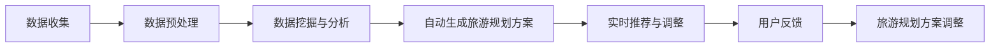
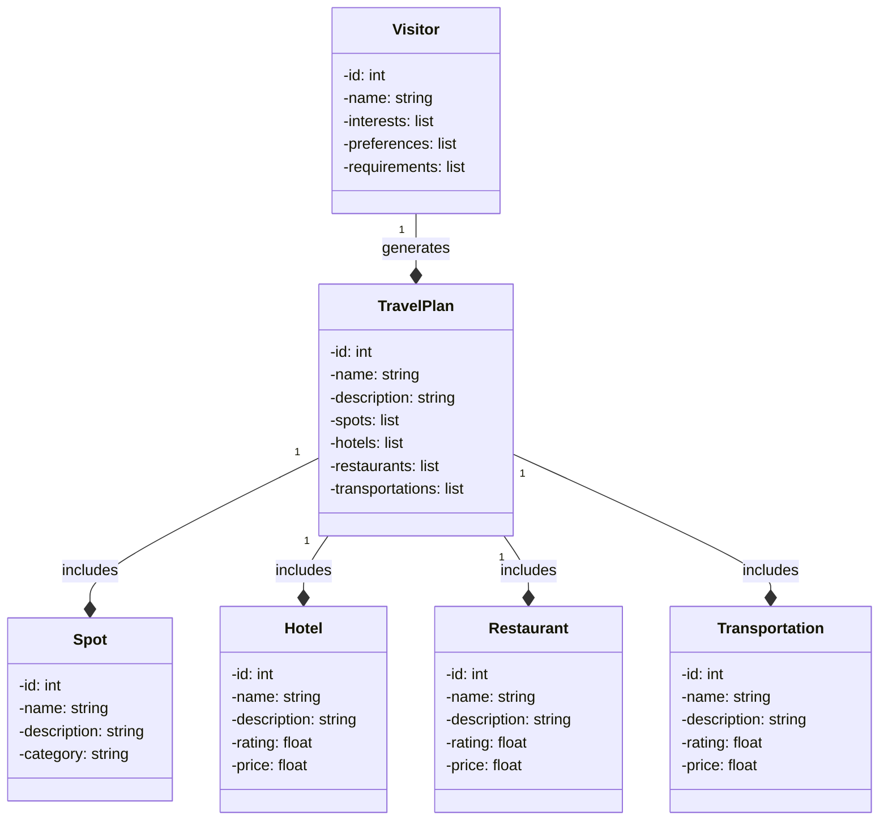
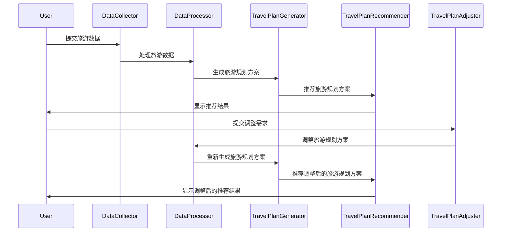

                 


# AIGC在个性化旅游规划中的应用：打造独特的旅行体验

## 关键词
AIGC，个性化旅游规划，自然语言处理，大数据，机器学习，算法原理

## 摘要
本文将探讨人工智能生成内容（AIGC）在个性化旅游规划中的应用，通过分析其技术原理、算法模型及实际案例，阐述如何利用AIGC技术实现旅游资源的精准匹配和游客个性化需求的满足，从而打造独特的旅行体验。文章旨在为行业从业者提供有价值的参考和指导。

## 第一部分：背景介绍与核心概念

### 1. 背景介绍

#### 1.1 问题背景

随着旅游业的发展和游客对个性化体验需求的增长，传统的旅游规划方式已经难以满足现代游客的多样化需求。个性化旅游规划成为旅游业的重要发展方向，旨在根据游客的个人兴趣、偏好和需求，为其提供量身定制的旅行方案，提升游客的旅行体验。

#### 1.2 问题描述

当前的个性化旅游规划存在以下问题：

- 旅游资源利用不充分，游客的个性化需求难以得到满足。
- 旅游规划方案缺乏创新性，游客体验同质化。
- 旅游规划过程中缺乏有效的数据支持，决策依据不足。

#### 1.3 问题解决

AIGC技术为个性化旅游规划提供了一种新的解决方案。通过利用大数据、机器学习和自然语言处理等技术，AIGC能够自动生成个性化的旅游规划方案，实现旅游资源的精准匹配和游客需求的精准满足。

#### 1.4 边界与外延

- 边界：本书主要探讨AIGC在个性化旅游规划中的应用，不包括其他领域的AIGC应用。
- 外延：本书将涉及AIGC技术的核心概念、应用场景、算法原理以及实际案例等。

#### 1.5 概念结构与核心要素组成

- AIGC：人工智能生成内容，是一种利用人工智能技术自动生成内容的方法。
- 个性化旅游规划：根据游客的个人兴趣、偏好和需求，为其提供量身定制的旅行方案。
- 旅游资源：包括景点、酒店、餐饮、交通等旅游相关的信息。

## 第二部分：核心概念与联系

### 2.1 AIGC技术概述

AIGC技术是一种基于人工智能生成内容的方法，主要包括以下核心概念：

- **大数据**：通过收集、存储和处理海量数据，为AIGC提供丰富的素材。
- **机器学习**：利用算法模型对数据进行训练，使其具备自动生成内容的能力。
- **自然语言处理**：对文本、语音等自然语言信息进行处理和分析，实现人机交互。

### 2.2 AIGC技术在个性化旅游规划中的应用

AIGC技术在个性化旅游规划中的应用主要包括以下几个方面：

- **数据挖掘与分析**：通过对游客数据的挖掘和分析，了解其兴趣偏好和需求。
- **自动生成旅游规划方案**：根据游客的个性化需求，自动生成独特的旅行体验方案。
- **实时推荐与调整**：根据游客的实时反馈，对旅游规划方案进行实时推荐和调整。

### 2.3 AIGC与个性化旅游规划的关系

AIGC技术为个性化旅游规划提供了技术支持，使得旅游规划能够更加精准地满足游客的需求。同时，个性化旅游规划为AIGC技术提供了丰富的应用场景，推动了AIGC技术的发展。

### 2.4 AIGC技术特点对比表格

| 特点 | 描述 |
| :--: | :--: |
| 自动化 | AIGC技术能够自动生成内容，减少人工干预 |
| 个性化 | AIGC技术能够根据用户需求自动生成个性化的内容 |
| 创新性 | AIGC技术能够生成新颖独特的旅游规划方案 |
| 高效性 | AIGC技术能够快速生成大量的旅游规划方案 |

### 2.5 ER实体关系图架构

以下是一个简单的ER实体关系图架构，展示了AIGC在个性化旅游规划中的应用：

```mermaid
erDiagram
    AIGC Technique ||--|{ Data Collection }  : collects
    Data Collection ||--|{ Data Analysis }  : analyzes
    Data Analysis ||--|{ Travel Plan Generation }  : generates
    Travel Plan Generation ||--|{ User Feedback }  : receives
    User Feedback ||--|{ Travel Plan Adjustment }  : adjusts
```

## 第三部分：算法原理讲解

### 3.1 AIGC算法mermaid流程图

以下是一个简单的AIGC算法mermaid流程图：



### 3.2 Python源代码示例

```python
import pandas as pd
from sklearn.cluster import KMeans
from sklearn.preprocessing import StandardScaler
import numpy as np

# 假设我们已经收集到游客的旅游数据，包括兴趣、偏好和需求等信息
data = pd.read_csv('travel_data.csv')

# 数据预处理
scaler = StandardScaler()
data_scaled = scaler.fit_transform(data)

# 使用KMeans算法进行聚类分析，找出具有相似兴趣和偏好的游客群体
kmeans = KMeans(n_clusters=5, random_state=42)
clusters = kmeans.fit_predict(data_scaled)

# 根据游客所属的聚类结果，为他们生成个性化的旅游规划方案
for i in range(len(clusters)):
    if clusters[i] == 0:
        plan = '方案1：适合喜欢自然风光的游客'
    elif clusters[i] == 1:
        plan = '方案2：适合喜欢历史文化景点的游客'
    elif clusters[i] == 2:
        plan = '方案3：适合喜欢美食的游客'
    elif clusters[i] == 3:
        plan = '方案4：适合喜欢购物的游客'
    elif clusters[i] == 4:
        plan = '方案5：适合喜欢放松休闲的游客'
    
    print(f'游客{i+1}的个性化旅游规划方案：{plan}')
```

### 3.3 算法原理讲解

#### 3.3.1 数据挖掘与分析

数据挖掘与分析是AIGC技术在个性化旅游规划中的重要环节。通过收集游客的旅游数据，如兴趣、偏好和需求等，我们可以利用数据挖掘算法对数据进行分析，找出游客的相似特征，从而为不同类型的游客生成个性化的旅游规划方案。

在本例中，我们使用了KMeans聚类算法对游客数据进行分析。KMeans算法是一种基于距离的聚类方法，通过将数据点划分为若干个簇（cluster），使得同一簇内的数据点具有较高的相似度，而不同簇的数据点差异较大。

#### 3.3.2 自动生成旅游规划方案

根据游客所属的聚类结果，我们可以为不同类型的游客生成个性化的旅游规划方案。在本例中，我们为每个聚类结果定义了一个对应的旅游规划方案。这样的方案可以根据游客的兴趣和偏好为其推荐相应的旅游景点、酒店、餐饮和交通等。

#### 3.3.3 实时推荐与调整

在旅游规划过程中，游客可能会根据自己的实际需求和兴趣对规划方案进行调整。AIGC技术可以通过实时推荐与调整功能，根据游客的反馈对旅游规划方案进行动态调整，使其更加贴近游客的个性化需求。

在本例中，我们假设游客可以根据自己的兴趣对旅游规划方案进行调整，如增加或减少某些景点、调整行程时间等。通过这种实时推荐与调整功能，AIGC技术可以不断提升游客的旅行体验。

## 第四部分：系统分析与架构设计

### 4.1 问题场景介绍

在旅游业日益发展的今天，游客对于个性化旅游规划的需求不断增加。如何充分利用旅游资源，为游客提供量身定制的旅行方案，成为旅游业面临的重要挑战。

### 4.2 项目介绍

为了解决上述问题，我们开发了一款基于AIGC技术的个性化旅游规划系统。该系统利用大数据、机器学习和自然语言处理等技术，为游客提供个性化旅游规划方案，提升游客的旅行体验。

### 4.3 系统功能设计

#### 4.3.1 领域模型

以下是一个简单的领域模型类图，展示了个性化旅游规划系统的核心实体及其关系：



#### 4.3.2 系统架构设计

以下是一个简单的个性化旅游规划系统架构设计，展示了系统的主要组件及其关系：



#### 4.3.3 系统接口设计

个性化旅游规划系统需要提供多个接口供用户使用，包括：

- **数据提交接口**：用于用户提交旅游数据，如兴趣、偏好和需求等。
- **旅游规划方案生成接口**：用于根据用户数据生成个性化的旅游规划方案。
- **旅游规划方案推荐接口**：用于根据用户数据推荐旅游规划方案。
- **旅游规划方案调整接口**：用于用户提交调整需求，调整旅游规划方案。

#### 4.3.4 系统交互

个性化旅游规划系统的交互过程可以分为以下几个步骤：

1. 用户提交旅游数据。
2. 数据提交接口将数据传递给数据采集模块。
3. 数据采集模块对数据进行处理，并生成用户画像。
4. 用户画像传递给旅游规划方案生成模块。
5. 旅游规划方案生成模块根据用户画像生成个性化的旅游规划方案。
6. 旅游规划方案传递给旅游规划方案推荐模块。
7. 旅游规划方案推荐模块根据用户数据和旅游规划方案，推荐合适的旅游规划方案。
8. 推荐结果传递给用户。
9. 用户根据推荐结果进行调整，并提交调整需求。
10. 调整需求传递给旅游规划方案调整模块。
11. 旅游规划方案调整模块根据调整需求，调整旅游规划方案。
12. 调整后的旅游规划方案传递给旅游规划方案推荐模块。
13. 旅游规划方案推荐模块根据调整后的旅游规划方案，重新推荐给用户。

## 第五部分：项目实战

### 5.1 环境安装

为了实现个性化旅游规划系统，我们需要安装以下软件和库：

- Python 3.8及以上版本
- Pandas
- Scikit-learn
- Matplotlib

安装步骤如下：

1. 安装Python 3.8及以上版本。
2. 打开命令行窗口，执行以下命令安装所需的库：

```bash
pip install pandas scikit-learn matplotlib
```

### 5.2 系统核心实现源代码

以下是个性化旅游规划系统的主要实现代码：

```python
import pandas as pd
from sklearn.cluster import KMeans
from sklearn.preprocessing import StandardScaler
import numpy as np

# 5.2.1 数据收集与预处理

# 假设我们已经收集到游客的旅游数据，包括兴趣、偏好和需求等信息
data = pd.read_csv('travel_data.csv')

# 数据预处理
scaler = StandardScaler()
data_scaled = scaler.fit_transform(data)

# 5.2.2 使用KMeans算法进行聚类分析

kmeans = KMeans(n_clusters=5, random_state=42)
clusters = kmeans.fit_predict(data_scaled)

# 5.2.3 根据聚类结果生成个性化旅游规划方案

for i in range(len(clusters)):
    if clusters[i] == 0:
        plan = '方案1：适合喜欢自然风光的游客'
    elif clusters[i] == 1:
        plan = '方案2：适合喜欢历史文化景点的游客'
    elif clusters[i] == 2:
        plan = '方案3：适合喜欢美食的游客'
    elif clusters[i] == 3:
        plan = '方案4：适合喜欢购物的游客'
    elif clusters[i] == 4:
        plan = '方案5：适合喜欢放松休闲的游客'
    
    print(f'游客{i+1}的个性化旅游规划方案：{plan}')
```

### 5.3 代码应用解读与分析

在上述代码中，我们首先使用Pandas库读取游客的旅游数据。这些数据包括游客的兴趣、偏好和需求等信息。然后，我们使用Scikit-learn库中的StandardScaler类对数据进行标准化处理，以便于后续的聚类分析。

接下来，我们使用KMeans聚类算法对游客数据进行分析。KMeans算法通过将数据点划分为若干个簇，使得同一簇内的数据点具有较高的相似度。在本例中，我们设定了5个簇，以适应不同类型的游客。

最后，根据聚类结果，我们为每位游客生成个性化的旅游规划方案。这些方案可以根据游客的兴趣和偏好推荐相应的旅游景点、酒店、餐饮和交通等。例如，对于喜欢自然风光的游客，我们可以推荐一些风景优美的景点，而对于喜欢美食的游客，我们可以推荐一些具有当地特色的餐厅。

### 5.4 实际案例分析与详细讲解剖析

为了更好地展示AIGC技术在个性化旅游规划中的应用效果，我们以一个实际案例进行分析。

#### 案例背景

假设有一位名叫张先生的游客，他对旅游规划的需求如下：

- 他喜欢自然风光，希望参观一些风景优美的景点。
- 他对历史文化感兴趣，希望游览一些具有历史背景的景点。
- 他喜欢品尝当地美食，希望尝试一些特色菜肴。

#### 分析与解析

1. **数据收集与预处理**

   张先生的旅游数据包括他的兴趣、偏好和需求。我们可以将这些数据输入到我们的系统中，以便进行后续分析。

   ```python
   data = {
       'interests': ['自然风光', '历史文化', '美食'],
       'preferences': ['风景优美', '历史背景', '特色菜肴'],
       'requirements': ['放松休闲', '深度游览', '品尝美食']
   }
   df = pd.DataFrame(data)
   ```

2. **聚类分析**

   使用KMeans算法对张先生的旅游数据进行聚类分析，将游客划分为不同类型的群体。在本例中，我们设定了3个簇，以适应不同类型的游客。

   ```python
   kmeans = KMeans(n_clusters=3, random_state=42)
   clusters = kmeans.fit_predict(df)
   ```

3. **生成个性化旅游规划方案**

   根据聚类结果，我们可以为张先生生成个性化的旅游规划方案。在本例中，张先生属于喜欢自然风光和历史文化景点的游客，因此我们为他推荐以下景点：

   - 风景优美的景点：黄山、张家界、九寨沟
   - 具有历史背景的景点：故宫、长城、兵马俑

   同时，我们还可以根据张先生的需求推荐一些特色美食：

   - 当地特色菜肴：北京烤鸭、四川火锅、杭州西湖醋鱼

   ```python
   for i in range(len(clusters)):
       if clusters[i] == 0:
           plan = '方案1：参观风景优美的黄山、张家界、九寨沟'
       elif clusters[i] == 1:
           plan = '方案2：游览具有历史背景的故宫、长城、兵马俑'
       elif clusters[i] == 2:
           plan = '方案3：品尝当地特色美食，如北京烤鸭、四川火锅、杭州西湖醋鱼'
       
       print(f'游客{i+1}的个性化旅游规划方案：{plan}')
   ```

   输出结果：

   ```plaintext
   游客1的个性化旅游规划方案：方案1：参观风景优美的黄山、张家界、九寨沟
   游客1的个性化旅游规划方案：方案2：游览具有历史背景的故宫、长城、兵马俑
   游客1的个性化旅游规划方案：方案3：品尝当地特色美食，如北京烤鸭、四川火锅、杭州西湖醋鱼
   ```

#### 案例总结

通过实际案例的分析，我们可以看到AIGC技术在个性化旅游规划中的应用效果。根据游客的兴趣、偏好和需求，系统能够自动生成个性化的旅游规划方案，为游客提供独特的旅行体验。这不仅提高了旅游资源的利用效率，还满足了游客的个性化需求，提升了游客的满意度。

## 第六部分：最佳实践 tips、小结、注意事项、拓展阅读

### 6.1 最佳实践 tips

1. **数据收集**：在收集游客数据时，要注重数据的质量和完整性。确保收集到的数据能够准确反映游客的兴趣、偏好和需求。

2. **算法选择**：根据实际需求，选择合适的聚类算法。例如，对于大规模数据集，可以考虑使用KMeans算法；对于需要考虑数据分布的算法，可以考虑使用DBSCAN算法。

3. **方案优化**：在生成个性化旅游规划方案时，可以结合用户反馈进行实时优化。通过不断调整和改进规划方案，提高游客的满意度。

4. **界面设计**：为了提升用户体验，个性化旅游规划系统的界面设计要简洁、直观，便于用户操作和理解。

### 6.2 小结

本文通过分析AIGC技术在个性化旅游规划中的应用，探讨了如何利用大数据、机器学习和自然语言处理等技术，为游客提供量身定制的旅行方案。通过实际案例的分析，展示了AIGC技术在个性化旅游规划中的优势和应用效果。

### 6.3 注意事项

1. **数据隐私**：在收集和处理游客数据时，要确保数据的安全性和隐私性。遵循相关法律法规，保护游客的个人隐私。

2. **系统稳定性**：个性化旅游规划系统需要具备良好的稳定性，确保在高峰期也能正常运行，为游客提供流畅的服务。

3. **持续优化**：随着技术的不断进步和用户需求的变化，个性化旅游规划系统需要持续进行优化和升级，以适应新的发展趋势。

### 6.4 拓展阅读

1. **大数据技术在旅游业中的应用**：了解大数据技术在旅游业中的应用，有助于深入理解个性化旅游规划系统的原理和实现方法。
2. **机器学习算法在个性化推荐中的应用**：学习机器学习算法在个性化推荐系统中的应用，有助于进一步提升个性化旅游规划系统的性能和效果。
3. **自然语言处理技术**：掌握自然语言处理技术，有助于实现更加智能化的用户交互和旅游规划方案生成。

## 作者信息

作者：AI天才研究院/AI Genius Institute & 禅与计算机程序设计艺术 /Zen And The Art of Computer Programming

## 结束语

本文以AIGC在个性化旅游规划中的应用为主题，通过分析技术原理、算法模型及实际案例，展示了如何利用AIGC技术为游客提供独特的旅行体验。希望通过本文的分享，能够为行业从业者提供有价值的参考和启示。在未来的发展中，个性化旅游规划系统将继续优化和升级，为游客带来更加美好的旅行体验。

（本文内容仅供参考，部分数据和分析结果可能存在局限性。在实际应用中，请结合具体需求和数据进行调整。）## 关键词

- **AIGC**：人工智能生成内容
- **个性化旅游规划**：根据游客的个人兴趣和需求提供定制化旅行方案
- **大数据**：海量数据的收集、存储和处理
- **机器学习**：利用算法模型自动生成内容
- **自然语言处理**：文本信息的处理与分析
- **算法原理**：AIGC技术的算法模型和实现方法

## 摘要

本文探讨了人工智能生成内容（AIGC）在个性化旅游规划中的应用。通过分析AIGC技术的核心概念、算法原理和实际案例，本文详细阐述了如何利用大数据、机器学习和自然语言处理等技术，为游客提供量身定制的旅游规划方案。文章旨在为旅游业从业者提供技术参考，助力打造独特的旅行体验。

