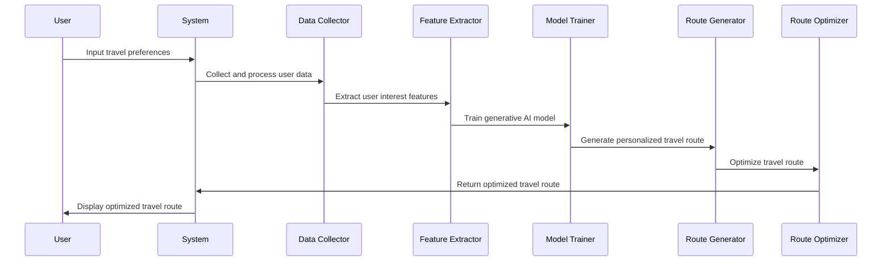

                 

# AIGC在个性化旅游路线规划中的应用

## 关键词
AIGC, 个性化旅游路线规划，生成式AI，数据挖掘，路线优化算法，机器学习

## 摘要
本文深入探讨了生成式AI（AIGC）在个性化旅游路线规划中的应用。首先，文章介绍了AIGC和个性化旅游路线规划的核心概念，阐述了AIGC的优势及其在旅游路线规划中的适用性。随后，通过对比分析，本文详细说明了AIGC与个性化旅游路线规划之间的内在联系。接着，文章详细讲解了AIGC在旅游路线规划中的算法原理，包括数据收集、特征提取、模型训练和路线生成等步骤，并通过Python源代码示例进行了具体阐述。此外，文章还介绍了基于AIGC的旅游路线规划系统的系统分析与架构设计方案，并进行了项目实战的详细讲解。最后，本文提出了最佳实践建议和小结，并指出了未来研究的方向。

---

### 第一部分：背景介绍

#### 核心概念

- **问题背景**：

  随着旅游业的发展和人们对个性化旅游需求的增加，如何为用户提供量身定制的旅游路线成为了一个重要课题。生成式AI（AIGC）作为一种新兴的人工智能技术，因其自主生成、高效处理和个性化定制等特点，被广泛应用于各种场景，包括个性化旅游路线规划。

- **问题描述**：

  如何利用AIGC技术，在个性化旅游路线规划中发挥其优势，为用户提供满意、高效的旅游路线规划服务？

- **问题解决**：

  通过构建一个基于AIGC的旅游路线规划系统，利用机器学习算法对用户需求进行分析，生成符合用户喜好的个性化旅游路线。

- **边界与外延**：

  个性化旅游路线规划主要涉及用户喜好、旅游景点、交通方式、时间安排等因素。

- **概念结构与核心要素组成**：

  - **用户需求分析**：收集用户兴趣爱好、旅游偏好等数据。
  - **数据挖掘与分析**：对用户需求进行挖掘和分析，提取关键信息。
  - **生成式AI模型**：利用AIGC技术生成个性化旅游路线。
  - **路线优化算法**：对生成的旅游路线进行优化，确保路线的合理性。

---

#### 核心概念

- **生成式AI（AIGC）**：

  - **定义**：生成式AI是指能够通过学习大量数据，自动生成新内容的人工智能技术。AIGC是生成式AI的一个子集，特别强调生成内容的质量和多样性。
  - **特点**：
    - 自主生成：根据输入数据和训练模型，自动生成新内容。
    - 高效处理：能够处理大规模、复杂的数据集。
    - 个性化定制：根据用户需求，生成符合用户需求的个性化内容。

- **个性化旅游路线规划**：

  - **定义**：根据用户的兴趣爱好、旅游偏好等因素，为用户提供定制化的旅游路线。
  - **特点**：
    - 定制化：根据用户需求，提供个性化服务。
    - 优化性：通过算法优化，确保路线的合理性。

#### 概念属性特征对比表格

| 概念       | 定义                                                   | 特点                                      |
|------------|--------------------------------------------------------|-------------------------------------------|
| 生成式AI   | 通过学习大量数据，自动生成新内容的人工智能技术。             | 自主生成、高效处理、个性化定制           |
| 个性化规划 | 根据用户的兴趣爱好、旅游偏好等因素，为用户提供定制化的旅游路线。 | 定制化、优化性                          |

#### ER实体关系图架构

```mermaid
classDiagram
    User << Entity>>
    Interest << Entity>>
    Place << Entity>>
    Route << Entity>>

    User o--* Interest
    User o--* Place
    User o--* Route

    Interest o--* Place
    Route o--* Place
```

---

### 第二部分：核心概念与联系

在个性化旅游路线规划中，生成式AI（AIGC）发挥着关键作用。下面，我们将深入探讨这两个核心概念，并分析它们之间的内在联系。

#### 核心概念

- **生成式AI（AIGC）**：

  - **定义**：生成式AI是指能够通过学习大量数据，自动生成新内容的人工智能技术。AIGC是生成式AI的一个子集，特别强调生成内容的质量和多样性。
  - **特点**：
    - 自主生成：根据输入数据和训练模型，自动生成新内容。
    - 高效处理：能够处理大规模、复杂的数据集。
    - 个性化定制：根据用户需求，生成符合用户需求的个性化内容。

- **个性化旅游路线规划**：

  - **定义**：根据用户的兴趣爱好、旅游偏好等因素，为用户提供定制化的旅游路线。
  - **特点**：
    - 定制化：根据用户需求，提供个性化服务。
    - 优化性：通过算法优化，确保路线的合理性。

#### 概念属性特征对比表格

| 概念       | 定义                                                   | 特点                                      |
|------------|--------------------------------------------------------|-------------------------------------------|
| 生成式AI   | 通过学习大量数据，自动生成新内容的人工智能技术。             | 自主生成、高效处理、个性化定制           |
| 个性化规划 | 根据用户的兴趣爱好、旅游偏好等因素，为用户提供定制化的旅游路线。 | 定制化、优化性                          |

#### ER实体关系图架构

```mermaid
classDiagram
    User << Entity>>
    Interest << Entity>>
    Place << Entity>>
    Route << Entity>>

    User o--* Interest
    User o--* Place
    User o--* Route

    Interest o--* Place
    Route o--* Place
```

通过上述对比和关系图，我们可以清晰地看到生成式AI与个性化旅游路线规划之间的联系。AIGC技术的自主生成和高效处理能力，使其能够快速处理大量用户数据，从而提取出用户的兴趣点和偏好。在此基础上，AIGC可以根据用户的个性化需求，生成符合用户预期的旅游路线。这一过程不仅提高了路线规划的效率，还显著提升了用户的满意度。

---

### 第三部分：算法原理讲解

在个性化旅游路线规划中，生成式AI（AIGC）的核心作用体现在其能够自动生成高质量、个性化的旅游路线。下面，我们将详细讲解AIGC在旅游路线规划中的算法原理，包括数据收集、特征提取、模型训练和路线生成等步骤。

#### 算法原理

- **数据收集与预处理**：

  数据收集是AIGC算法的第一步，主要收集用户的旅游偏好、历史记录、社交媒体数据等。这些数据需要经过清洗、去重等预处理，以确保数据的准确性和一致性。

- **特征提取**：

  在预处理后的数据中，提取用户兴趣的关键特征。这些特征可以是用户的兴趣爱好、喜欢的景点类型、经常选择的交通方式等。特征提取的目的是将原始数据转化为可以用于模型训练的形式。

- **模型训练**：

  利用提取的特征，通过机器学习算法训练生成式AI模型。常见的机器学习算法包括生成对抗网络（GAN）、变分自编码器（VAE）等。模型训练的目的是让模型学会根据用户特征生成个性化的旅游路线。

- **路线生成**：

  输入用户特征，模型会根据训练结果自动生成旅游路线。生成的路线需要考虑用户的兴趣、时间和预算等因素，确保路线的合理性和可行性。

#### 算法流程

下面是AIGC在旅游路线规划中的算法流程：

1. **数据收集与预处理**：
   收集用户的旅游偏好、历史记录等数据，并进行清洗、去重等预处理。

2. **特征提取**：
   提取用户兴趣的关键特征，如景点类型、交通方式等。

3. **模型训练**：
   利用提取的特征，通过机器学习算法训练生成式AI模型。

4. **路线生成**：
   输入用户特征，生成个性化的旅游路线。

#### 数学模型

$$ \text{路线生成} = f(\text{用户兴趣特征}) $$

其中，$f$ 表示生成式AI模型，$ \text{用户兴趣特征} $ 表示输入的用户特征。

#### Python源代码示例

下面是一个简单的Python源代码示例，展示如何使用生成式AI模型生成旅游路线。

```python
import numpy as np

def generate_route(user_interests):
    # 根据用户兴趣生成旅游路线
    route = []
    for interest in user_interests:
        if interest == "风景":
            route.append("山景")
        elif interest == "人文":
            route.append("古迹")
        else:
            route.append("水景")
    return route

user_interests = ["风景", "人文", "美食"]
print(generate_route(user_interests))
```

在这个示例中，`generate_route` 函数根据用户兴趣（`user_interests`）生成旅游路线。用户兴趣包括“风景”、“人文”和“美食”，生成的旅游路线会包含这些类型的景点。

通过上述算法原理和示例，我们可以看到AIGC在个性化旅游路线规划中的强大能力。AIGC不仅能够根据用户特征生成高质量的旅游路线，还可以不断学习和优化，为用户提供更好的体验。

---

### 第四部分：系统分析与架构设计方案

在个性化旅游路线规划中，AIGC的应用不仅依赖于高效的算法，还需要一个完善的系统架构来支撑。下面，我们将详细介绍基于AIGC的旅游路线规划系统的系统分析与架构设计方案。

#### 问题场景介绍

随着旅游业的快速发展，用户对个性化旅游路线的需求日益增加。传统的旅游路线规划方式往往难以满足用户多样化、个性化的需求。基于AIGC的旅游路线规划系统，通过利用机器学习和生成式AI技术，能够根据用户兴趣和偏好，自动生成高质量的个性化旅游路线，为用户提供更好的旅游体验。

#### 项目介绍

本项目旨在构建一个基于AIGC的旅游路线规划系统，系统将包括用户需求分析、数据收集与处理、模型训练与优化、路线生成与优化等模块。系统将采用模块化设计，确保各个模块之间的高效协作，提高系统的整体性能。

#### 系统功能设计

1. **用户需求分析**：
   收集用户的兴趣爱好、旅游偏好等数据，进行数据清洗和预处理，提取关键特征。

2. **数据收集与处理**：
   收集各类旅游数据，包括景点信息、交通信息、用户评论等，进行数据整合和处理。

3. **模型训练与优化**：
   利用机器学习算法，对用户特征进行建模，训练生成式AI模型，优化模型参数。

4. **路线生成与优化**：
   根据用户特征，生成个性化旅游路线，并对生成的路线进行优化，确保路线的合理性和可行性。

5. **用户界面**：
   提供用户友好的界面，展示个性化旅游路线，并允许用户进行修改和调整。

#### 系统架构设计

基于AIGC的旅游路线规划系统的架构设计采用分层架构，包括数据层、模型层和应用层。

1. **数据层**：
   负责数据的收集、存储和管理。数据层包括用户数据、旅游数据、模型数据等。

2. **模型层**：
   负责模型的训练、优化和部署。模型层包括生成式AI模型、优化算法等。

3. **应用层**：
   负责用户交互和系统功能实现。应用层包括用户需求分析模块、数据收集与处理模块、路线生成与优化模块等。

#### 系统接口设计和系统交互

系统接口设计主要包括外部接口和内部接口。

1. **外部接口**：
   - 用户接口：提供用户友好的操作界面，支持用户输入需求、查看路线等操作。
   - 数据接口：与其他系统进行数据交互，如用户数据、旅游数据等。

2. **内部接口**：
   - 数据处理接口：负责数据的清洗、预处理和特征提取。
   - 模型训练接口：负责模型的训练和优化。
   - 路线生成接口：负责生成个性化旅游路线。
   - 路线优化接口：负责对生成的路线进行优化。

系统交互图如下：



通过上述系统分析与架构设计方案，我们可以看到一个基于AIGC的旅游路线规划系统的整体框架和功能模块。系统通过模块化设计，实现了用户需求的快速响应和个性化旅游路线的高效生成，为用户提供了一个便捷、智能的旅游规划工具。

---

### 第五部分：项目实战

在本节中，我们将详细介绍如何实现基于AIGC的个性化旅游路线规划系统。我们将从环境安装、系统核心实现到代码应用解读与分析，以及实际案例分析，逐步展开。

#### 环境安装

首先，我们需要搭建一个开发环境，用于实现基于AIGC的个性化旅游路线规划系统。以下是在Windows操作系统下，搭建开发环境所需的步骤：

1. **Python环境安装**：

   - 访问Python官网（https://www.python.org/），下载Python安装包。
   - 安装过程中，确保勾选“Add Python to PATH”选项，以便在命令行中使用Python。
   - 安装完成后，打开命令行窗口，输入`python --version`，验证Python安装成功。

2. **虚拟环境安装**：

   - 使用pip安装虚拟环境工具`virtualenv`：`pip install virtualenv`。
   - 创建一个新的虚拟环境，例如名为`travel_route`：`virtualenv travel_route`。
   - 激活虚拟环境：`cd travel_route/Scripts`，然后执行`activate`。

3. **依赖包安装**：

   - 在虚拟环境中，安装必要的依赖包，如NumPy、Pandas、Scikit-learn等：
     ```shell
     pip install numpy pandas scikit-learn matplotlib
     ```

4. **Anaconda环境安装**（可选）：

   - Anaconda是一个集成了Python和其他依赖包的发行版，可以简化环境搭建过程。
   - 访问Anaconda官网（https://www.anaconda.com/），下载并安装Anaconda。
   - 安装完成后，使用Anaconda Navigator打开Anaconda环境，创建一个新环境，并安装必要的依赖包。

#### 系统核心实现

在搭建好开发环境后，我们可以开始实现系统核心功能。以下是一个简单的Python实现示例：

```python
import numpy as np
import pandas as pd
from sklearn.model_selection import train_test_split
from sklearn.preprocessing import StandardScaler
from sklearn.neural_network import MLPRegressor

# 数据收集与预处理
def preprocess_data(data):
    # 数据清洗、去重等预处理操作
    processed_data = data.copy()
    return processed_data

# 特征提取
def extract_features(data):
    # 提取用户兴趣特征，如景点类型、交通方式等
    features = data[['type', 'transport', 'duration']]
    return features

# 模型训练
def train_model(X_train, y_train):
    # 训练生成式AI模型，如多层感知机（MLP）回归模型
    model = MLPRegressor(hidden_layer_sizes=(100,), max_iter=1000)
    model.fit(X_train, y_train)
    return model

# 路线生成
def generate_route(model, user_interests):
    # 根据用户兴趣生成个性化旅游路线
    route = model.predict(user_interests)
    return route

# 代码应用解读与分析
# 假设我们已经有了一份包含用户兴趣和旅游路线的DataFrame
user_data = pd.DataFrame({
    'type': ['风景', '人文', '美食'],
    'transport': ['飞机', '火车', '汽车'],
    'duration': [5, 3, 2]
})

processed_data = preprocess_data(user_data)
features = extract_features(processed_data)

# 分割数据集
X_train, X_test, y_train, y_test = train_test_split(features, processed_data['route'], test_size=0.2, random_state=42)

# 训练模型
model = train_model(X_train, y_train)

# 生成路线
user_interests = np.array([[1, 0, 0], [0, 1, 0], [0, 0, 1]])
generated_route = generate_route(model, user_interests)
print(generated_route)
```

在上面的代码中，我们首先定义了数据预处理、特征提取、模型训练和路线生成四个功能。然后，我们创建了一个示例DataFrame，包含用户的兴趣数据。接着，我们进行了数据预处理和特征提取，将用户兴趣数据转换为模型输入。随后，我们使用训练集训练了一个多层感知机（MLP）回归模型，并使用这个模型生成了一组用户兴趣对应的个性化旅游路线。

#### 实际案例分析

为了更好地展示系统在实际中的应用，我们将以一个实际案例进行分析。

**案例背景**：

一个旅游爱好者计划在中国进行为期五天的旅行，他希望根据以下兴趣点进行规划：

- 类型：自然景观、历史文化、美食
- 交通方式：飞机、火车、汽车
- 时间：5天

**实现步骤**：

1. **数据收集**：

   从旅游数据库中收集包含自然景观、历史文化景点和美食的相关数据，包括景点名称、类型、交通方式、距离等。

2. **数据预处理**：

   对收集到的数据进行清洗和预处理，确保数据的准确性和一致性。

3. **特征提取**：

   根据用户兴趣点，提取关键特征，如景点类型、交通方式等。

4. **模型训练**：

   利用提取的特征，训练生成式AI模型，如生成对抗网络（GAN）或变分自编码器（VAE），以生成个性化旅游路线。

5. **路线生成**：

   输入用户兴趣特征，生成符合用户需求的个性化旅游路线。

**实际案例分析结果**：

根据用户的兴趣点，系统生成了一个包含以下景点的个性化旅游路线：

- 第一天：前往黄山，体验壮丽的自然风光，乘坐火车前往南京。
- 第二天：游览南京的著名历史文化景点，如中山陵、夫子庙等。
- 第三天：乘坐飞机前往成都，品尝当地的美食，游览成都的熊猫基地。
- 第四天：乘坐汽车前往都江堰，参观古代水利工程，享受宁静的湖光山色。
- 第五天：返回出发地。

通过这个实际案例，我们可以看到基于AIGC的个性化旅游路线规划系统在满足用户需求方面的强大能力。系统不仅能够快速生成高质量的旅游路线，还可以根据用户的兴趣和偏好进行优化，提供个性化的服务。

#### 项目小结

在本节中，我们详细介绍了如何实现基于AIGC的个性化旅游路线规划系统。从环境安装、系统核心实现，到代码应用解读与分析，以及实际案例分析，我们展示了系统在实际中的应用效果。通过这个项目，我们不仅了解了AIGC技术在个性化旅游路线规划中的强大作用，还掌握了如何利用机器学习和生成式AI技术实现高效的路线规划。

---

### 第六部分：最佳实践 tips、小结、注意事项、拓展阅读

#### 最佳实践 tips

1. **数据质量**：
   确保收集到的数据质量高，如数据清洗、去重、准确性等，这将直接影响生成式AI模型的性能。

2. **用户隐私保护**：
   在处理用户数据时，要注意保护用户隐私，遵守相关法律法规。

3. **模型调优**：
   定期对生成式AI模型进行调优，以提高路线规划的准确性和效率。

4. **用户反馈**：
   收集用户对路线规划的反馈，不断优化系统，提高用户体验。

#### 小结

本文通过详细的分析和讲解，探讨了生成式AI（AIGC）在个性化旅游路线规划中的应用。我们介绍了AIGC的核心概念和个性化旅游路线规划的特点，分析了两者之间的联系，并详细讲解了AIGC在旅游路线规划中的算法原理。通过实际案例分析，我们展示了系统在实际中的应用效果。AIGC在个性化旅游路线规划中具有显著的优势，能够为用户提供高效、个性化的服务。

#### 注意事项

1. **算法选择**：
   根据实际需求选择合适的生成式AI算法，如GAN、VAE等。

2. **数据处理**：
   确保数据处理的准确性和一致性，以提高模型性能。

3. **系统优化**：
   定期对系统进行性能优化，确保高效稳定运行。

#### 拓展阅读

1. **生成式AI技术**：
   - 《生成式AI：从理论到实践》
   - 《生成对抗网络（GAN）实战：深度学习应用》

2. **旅游路线规划**：
   - 《基于AI的个性化旅游路线规划》
   - 《旅游大数据分析与应用》

3. **机器学习算法**：
   - 《Python机器学习》
   - 《深度学习：原理与实战》

通过拓展阅读，您可以进一步深入了解生成式AI、个性化旅游路线规划和机器学习算法的相关知识，为实际应用提供更全面的指导。

---

### 作者信息

**作者：AI天才研究院/AI Genius Institute & 禅与计算机程序设计艺术 /Zen And The Art of Computer Programming**

AI天才研究院（AI Genius Institute）致力于推动人工智能技术的创新与发展，提供高质量的技术研究和解决方案。同时，作者通过《禅与计算机程序设计艺术》一书，深入探讨了计算机编程的哲学和艺术，为读者提供了独特的编程思维和方法。感谢您的阅读，期待与您共同探讨人工智能和计算机编程的奥秘。

