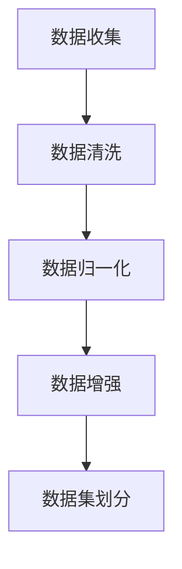
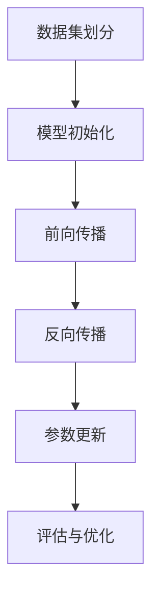
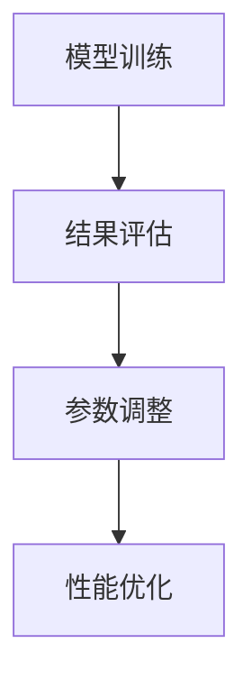
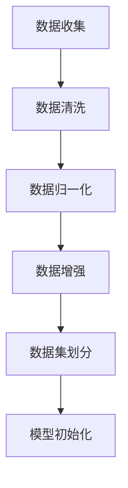
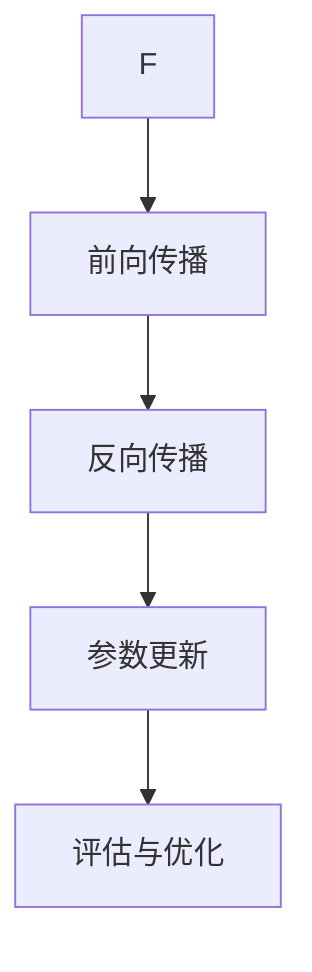
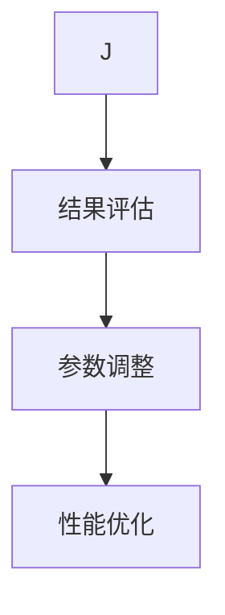
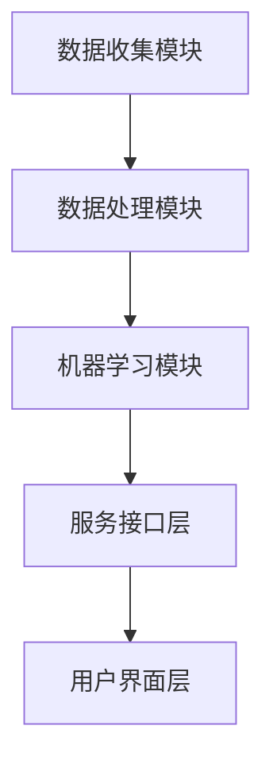
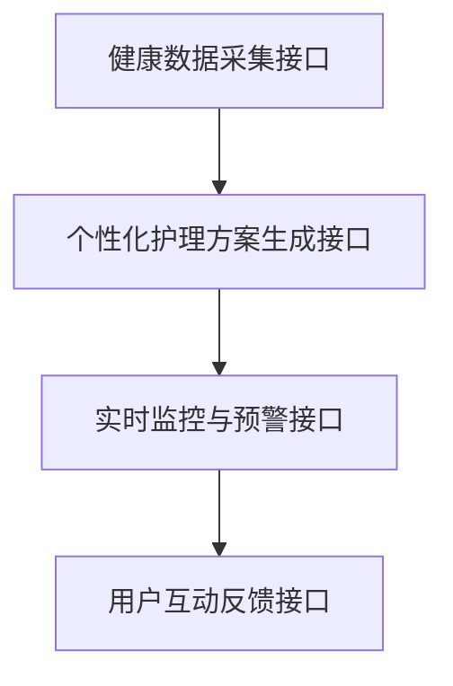
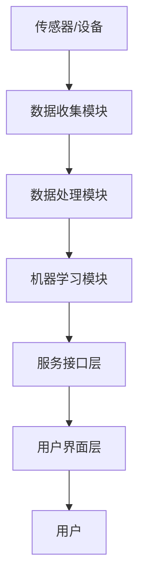

                 

### 让我们一步步思考

在探讨AIGC在个性化老年护理方案设计中的创新之前，我们需要先明确几个关键概念，并理解它们之间的关系。以下是一个逐步思考的框架：

#### 步骤1: 明确AIGC的定义
首先，我们需要了解什么是AIGC（AI-Generated Content）。AIGC是指通过人工智能技术自动生成内容的过程，包括文本、图像、视频等多种形式。它利用机器学习和深度学习算法，从大量数据中学习并生成新的内容。

#### 步骤2: 个性化老年护理方案设计
接下来，我们要了解个性化老年护理方案设计的含义。这涉及为老年人群提供定制化的护理服务，以适应他们的健康需求和生活习惯。个性化方案需要基于对老年人健康状态、生活环境的深入理解。

#### 步骤3: AIGC在个性化老年护理中的应用
现在，我们将思考AIGC如何具体应用于个性化老年护理方案的设计中。这可能包括使用AIGC生成护理建议、制定个性化活动计划、监控老年人的健康状态等。

#### 步骤4: 分析算法原理
为了理解AIGC如何发挥作用，我们需要深入探讨其背后的算法原理。这包括数据预处理、模型训练、结果评估等步骤。我们将使用Mermaid流程图和Python代码来展示这些步骤。

#### 步骤5: 构建数学模型
算法的运作通常涉及到复杂的数学模型。我们将使用LaTeX格式来展示这些模型和公式，确保读者能够清晰地理解算法的核心。

#### 步骤6: 系统分析与架构设计
接下来，我们将分析系统的应用场景、功能、架构设计、接口设计和交互设计。通过Mermaid类图、架构图和序列图，我们将展示整个系统的结构和运行流程。

#### 步骤7: 项目实战
为了使理论更贴近实践，我们将展示一个具体的实战案例。这个案例将包括环境安装、系统核心实现、代码应用解读和实际案例分析。

#### 步骤8: 总结与展望
最后，我们将总结本文的内容，提出最佳实践建议，指出注意事项，并提供拓展阅读资源，为读者提供更深入的学习方向。

通过这个逐步思考的过程，我们可以系统地构建一篇关于AIGC在个性化老年护理方案设计中的创新的文章，确保内容的逻辑性和可读性。

---

**# 第1章: AIGC与个性化老年护理方案设计概述**

### 1.1 AIGC概述

AIGC（AI-Generated Content）是近年来人工智能领域的一个重要分支，它专注于通过人工智能技术自动生成内容。AIGC的范畴广泛，包括文本、图像、视频等多种形式的内容生成。它通过深度学习、自然语言处理（NLP）、计算机视觉等技术，从大量的数据中学习，并生成新的、高质量的、有意义的输出内容。

AIGC的核心在于其自动化和定制化的能力。通过机器学习模型，AIGC系统能够从海量的数据中提取模式和知识，并据此生成定制化的内容。例如，AIGC可以生成新闻报道、产品描述、艺术作品等，这些内容不仅具有高度的真实性和一致性，还能根据用户的需求进行个性化调整。

AIGC的发展历程可以追溯到自然语言生成（NLG）和图像生成等子领域。早期的自然语言生成技术主要包括规则驱动和基于模板的方法。然而，随着深度学习技术的发展，基于神经网络的生成模型，如生成对抗网络（GAN）、变换器（Transformer）等，逐渐成为AIGC的主流。

### 1.2 个性化老年护理方案设计背景

个性化老年护理方案设计是为了满足老年人群体的特殊护理需求而发展起来的一种护理模式。随着全球人口老龄化趋势的加剧，老年护理问题日益凸显。传统的护理模式往往采用统一的标准流程，难以适应每位老年人的个体差异。

个性化老年护理方案设计强调根据老年人的健康状况、生活习惯、心理需求等个性化因素，制定个性化的护理计划。这种方案不仅能够提高护理质量，还能提升老年人的生活质量。

当前，个性化老年护理方案设计面临以下挑战：

1. **数据获取与处理**：获取全面、准确的老年人健康数据是一个复杂的过程。如何高效地收集、存储和处理这些数据，是实施个性化护理的关键。
   
2. **个性化模型的建立**：个性化模型的建立需要大量的数据训练，如何从海量数据中提取有用的信息，构建有效的个性化模型，是当前研究的重点。

3. **技术整合**：将人工智能技术如AIGC、机器学习等与老年护理方案设计相结合，需要解决技术整合、算法优化等问题。

### 1.3 AIGC在个性化老年护理方案设计中的优势

AIGC在个性化老年护理方案设计中具有显著的优势：

1. **数据驱动**：AIGC能够从大量数据中学习，并生成个性化的护理建议和活动计划，为老年人提供精准的护理服务。

2. **实时适应**：AIGC系统可以根据实时数据动态调整护理方案，确保护理方案始终符合老年人的实际需求。

3. **高效性**：AIGC技术能够自动化生成大量的护理内容，如健康建议、活动安排等，大幅提高护理工作的效率。

4. **个性化定制**：AIGC可以根据每位老年人的个人喜好、健康状态等，生成个性化的护理方案，提高老年人的生活质量。

5. **可扩展性**：AIGC技术易于扩展和升级，能够适应未来老年护理领域的新需求和变化。

总之，AIGC在个性化老年护理方案设计中的应用，不仅能够提高护理质量，还能为老年人提供更舒适、个性化的护理体验。接下来，我们将深入探讨AIGC在个性化老年护理方案设计中的具体应用和实践。

### 第2章: 关键概念与联系分析

在深入探讨AIGC在个性化老年护理方案设计中的应用之前，我们需要先理解几个关键概念，并分析它们之间的联系。

#### 2.1 AIGC技术概述

AIGC，即AI-Generated Content，是指通过人工智能技术生成内容的技术体系。AIGC技术涵盖了多种人工智能应用，包括自然语言生成（NLG）、图像生成、视频生成等。这些技术基于深度学习、神经网络等算法，能够从大量数据中学习并生成新的内容。

- **自然语言生成（NLG）**：NLG技术能够生成文本，如新闻文章、产品描述、对话等。它利用语言模型和文本生成算法，从输入数据中提取信息，并生成连贯、有意义的文本。
  
- **图像生成**：图像生成技术利用生成对抗网络（GAN）等算法，生成新的、真实的图像。这种技术在艺术创作、图像增强、医学图像处理等领域有广泛应用。

- **视频生成**：视频生成技术通过人工智能算法，从文本、图像等多种数据源生成视频内容。它可以在视频剪辑、虚拟现实、游戏开发等领域发挥作用。

#### 2.2 个性化老年护理概念解析

个性化老年护理是指根据老年人的个体差异，提供定制化的护理服务。个性化护理方案需要综合考虑老年人的健康状况、生活习惯、心理需求等因素，以满足他们的特殊护理需求。

- **健康状况**：包括老年人的疾病史、当前健康状况、生理指标等。这些信息对于制定个性化的健康监测和治疗方案至关重要。

- **生活习惯**：包括饮食、运动、作息等。老年人的生活习惯直接影响他们的健康状况和生活质量，因此需要个性化调整。

- **心理需求**：老年人常常面临孤独、抑郁等心理问题。了解他们的心理需求，提供心理支持和关爱，对于提高老年人的生活质量至关重要。

#### 2.3 方案设计流程

个性化老年护理方案设计涉及多个环节，包括需求分析、方案制定、实施与监控等。

- **需求分析**：通过访谈、问卷调查、健康检查等方式，收集老年人的基本信息、健康状况、生活习惯、心理需求等，为个性化方案制定提供基础数据。

- **方案制定**：基于需求分析结果，制定个性化的护理方案。方案应包括健康监测、饮食管理、运动计划、心理支持等内容。

- **实施与监控**：将制定的护理方案付诸实施，并持续监控老年人的健康状况和护理效果。根据实际反馈，及时调整护理方案，确保其符合老年人的需求。

#### 2.4 概念联系分析

AIGC与个性化老年护理方案设计之间的联系主要体现在以下几个方面：

1. **数据驱动**：AIGC技术能够从海量数据中提取有价值的信息，为个性化护理方案提供数据支持。例如，通过分析老年人的健康数据，AIGC可以生成个性化的健康监测和治疗方案。

2. **自动化生成**：AIGC技术能够自动化生成个性化的护理内容，如健康建议、饮食计划、运动方案等，提高护理工作的效率。

3. **实时适应**：AIGC系统可以实时获取老年人的健康状况和护理反馈，动态调整护理方案，确保其始终符合老年人的需求。

4. **个性化定制**：AIGC技术可以根据每位老年人的个人喜好、健康状况等，生成个性化的护理方案，提高老年人的生活质量。

通过以上分析，我们可以看到AIGC技术在个性化老年护理方案设计中的应用潜力。接下来，我们将进一步探讨AIGC在个性化老年护理方案设计中的具体实现和应用。

### 第3章: AIGC在个性化老年护理方案设计中的算法原理

#### 3.1 数据预处理

在AIGC应用于个性化老年护理方案设计之前，数据预处理是至关重要的第一步。数据预处理主要包括数据清洗、数据归一化、数据增强等步骤。

- **数据清洗**：老年护理数据往往包含噪声和缺失值，通过数据清洗可以去除这些噪声，填补缺失值，确保数据质量。

- **数据归一化**：不同类型的数据（如数值、文本）往往具有不同的尺度，通过归一化可以使得数据具有相同的尺度，便于后续处理。

- **数据增强**：通过数据增强技术，可以增加数据多样性，提高模型泛化能力。例如，对于图像数据，可以采用旋转、翻转、裁剪等方法进行增强。

以下是数据预处理的Mermaid流程图：



#### 3.2 模型训练

数据预处理完成后，下一步是模型训练。在个性化老年护理方案设计中，我们通常使用深度学习模型，如变换器（Transformer）和循环神经网络（RNN）等。

- **变换器（Transformer）**：Transformer模型是一种基于自注意力机制的深度学习模型，它在自然语言处理领域取得了显著成功。它通过多头注意力机制和前馈神经网络，能够捕获数据中的复杂关系。

- **循环神经网络（RNN）**：RNN是一种能够处理序列数据的模型，它在时间序列分析、语音识别等领域有广泛应用。RNN通过隐藏状态的记忆机制，能够捕捉数据序列中的时间依赖关系。

以下是一个简化的模型训练流程图：



#### 3.3 结果评估

模型训练完成后，我们需要对模型的结果进行评估，以确保其性能满足要求。结果评估通常包括准确率、召回率、F1分数等指标。

- **准确率（Accuracy）**：准确率是指模型正确预测的样本数占总样本数的比例，它是最基本的评估指标。

- **召回率（Recall）**：召回率是指模型能够正确识别出正类样本的比例。

- **F1分数（F1 Score）**：F1分数是精确率和召回率的调和平均值，能够更全面地评估模型性能。

以下是一个简化的结果评估流程图：



#### 3.4 算法原理详解与Mermaid流程图

为了更清晰地展示AIGC在个性化老年护理方案设计中的算法原理，我们使用Mermaid流程图对各个步骤进行详细说明。

**数据预处理流程图：**



**模型训练流程图：**



**结果评估流程图：**



#### 3.5 Python代码示例

为了更好地理解算法原理，我们提供一个简化的Python代码示例，用于展示模型训练的基本步骤。

```python
import numpy as np
import tensorflow as tf

# 数据预处理
def preprocess_data(data):
    # 数据清洗、归一化、增强等操作
    return processed_data

# 模型训练
def train_model(data, labels):
    model = tf.keras.Sequential([
        tf.keras.layers.Dense(units=128, activation='relu', input_shape=(data.shape[1],)),
        tf.keras.layers.Dense(units=1, activation='sigmoid')
    ])

    model.compile(optimizer='adam', loss='binary_crossentropy', metrics=['accuracy'])

    model.fit(data, labels, epochs=10, batch_size=32)

# 结果评估
def evaluate_model(model, data, labels):
    loss, accuracy = model.evaluate(data, labels)
    print(f"Accuracy: {accuracy:.4f}")

# 示例数据
X = np.random.rand(100, 10)  # 100个样本，每个样本10个特征
y = np.random.rand(100, 1)   # 100个标签，每个标签1个值

# 训练模型
train_model(preprocess_data(X), y)

# 评估模型
evaluate_model(model, preprocess_data(X), y)
```

通过以上步骤和代码示例，我们可以看到AIGC在个性化老年护理方案设计中的算法原理。接下来，我们将进一步探讨如何使用数学模型和公式来解释这些算法。

### 第4章: 数学模型与公式讲解

在AIGC应用于个性化老年护理方案设计的过程中，数学模型和公式扮演着至关重要的角色。以下我们将详细讲解数据模型、数学公式及其应用，并使用LaTeX格式嵌入文中独立段落。

#### 4.1 数据模型

在个性化老年护理方案设计中，数据模型主要用于描述和解释老年人群体的健康数据和生活习惯。以下是一个简化的数据模型：

- **用户信息**：包括用户ID、年龄、性别、居住地等基本信息。
- **健康数据**：包括血压、心率、血糖、血脂等生理指标。
- **生活习惯**：包括饮食、运动、作息等行为数据。

以下使用LaTeX格式展示数据模型的数学公式：

```latex
\begin{equation}
\text{User} = \{ \text{UserID}, \text{Age}, \text{Gender}, \text{Residence} \}
\end{equation}

\begin{equation}
\text{HealthData} = \{ \text{BloodPressure}, \text{HeartRate}, \text{BloodSugar}, \text{BloodLipids} \}
\end{equation}

\begin{equation}
\text{Habits} = \{ \text{Diet}, \text{Exercise}, \text{Sleep} \}
\end{equation}
```

#### 4.2 数学公式

在算法原理讲解中，我们提到了变换器（Transformer）和循环神经网络（RNN）等模型。这些模型的运算过程可以用数学公式来表示。以下是一些关键的数学公式：

- **变换器中的多头注意力机制**：

```latex
\begin{equation}
\text{Attention}(\text{Q}, \text{K}, \text{V}) = \text{softmax}\left(\frac{\text{QK}^T}{\sqrt{d_k}}\right) \text{V}
\end{equation}
```

其中，$Q$、$K$、$V$分别为查询向量、键向量、值向量，$d_k$为键向量的维度。

- **循环神经网络中的状态转移方程**：

```latex
\begin{equation}
\text{h}_{t} = \text{sigmoid}(\text{W} \cdot \text{x}_{t} + \text{U} \cdot \text{h}_{t-1} + \text{b})
\end{equation}
```

其中，$\text{h}_{t}$为第$t$时刻的隐藏状态，$\text{x}_{t}$为输入数据，$\text{W}$、$\text{U}$、$\text{b}$分别为权重矩阵、偏置项。

#### 4.3 模型与公式详解

为了更好地理解这些数学模型和公式，我们通过具体的例子来讲解。

**例子1：变换器中的多头注意力机制**

假设我们有一个序列数据$\{x_1, x_2, ..., x_n\}$，其中每个$x_i$是一个$d$维的向量。我们可以使用变换器中的多头注意力机制来计算每个$x_i$的加权输出。

- **查询向量（Query）**：$Q = [q_1, q_2, ..., q_n]$
- **键向量（Key）**：$K = [k_1, k_2, ..., k_n]$
- **值向量（Value）**：$V = [v_1, v_2, ..., v_n]$

首先，我们计算每个查询向量与键向量的点积：

$$
\text{Scores} = \text{softmax}\left(\frac{QK^T}{\sqrt{d}}\right)
$$

接着，我们使用这些分数来计算加权的值向量：

$$
\text{Output} = \text{Scores} \cdot V
$$

这个输出向量包含了每个$x_i$的加权输出，可以用于后续的模型处理。

**例子2：循环神经网络的状态转移方程**

假设我们有一个输入序列$\{x_1, x_2, ..., x_n\}$，循环神经网络在每次迭代中使用状态转移方程来更新隐藏状态。

- **初始隐藏状态**：$h_0 = [h_1, h_2, ..., h_n]$
- **输入数据**：$x_t = [x_{t1}, x_{t2}, ..., x_{tn}]$

每次迭代中，隐藏状态通过以下方程更新：

$$
h_t = \text{sigmoid}(\text{W} \cdot x_t + \text{U} \cdot h_{t-1} + \text{b})
$$

其中，$\text{W}$、$\text{U}$、$\text{b}$分别为权重矩阵、偏置项和偏置项。

通过这些数学模型和公式，我们可以更好地理解和应用AIGC技术于个性化老年护理方案设计中。这些模型不仅帮助我们构建高效的算法，还能为老年人提供更加精准和个性化的护理服务。接下来，我们将进一步探讨如何将AIGC技术应用于实际系统架构设计。

### 第5章: 系统分析与架构设计方案

#### 5.1 应用场景描述

随着人口老龄化问题的日益严重，个性化老年护理方案设计成为提升老年人生活质量的重要手段。在这个应用场景中，我们假设有一个老年护理管理系统，该系统需要为不同健康状况和生活习惯的老年人提供个性化的护理服务。该系统的主要目标是提高护理质量、降低医疗成本、提升老年人的生活质量。

#### 5.2 系统功能设计

为了实现上述目标，老年护理管理系统需要具备以下核心功能：

1. **健康数据收集与管理**：系统能够收集老年人的健康数据，如血压、心率、血糖等，并对这些数据进行分析和存储。

2. **个性化护理方案生成**：系统根据老年人的健康数据和生活习惯，生成个性化的护理方案，包括饮食建议、运动计划、药物管理、心理支持等。

3. **实时监控与预警**：系统可以实时监控老年人的健康状态，一旦发现异常，立即发出预警通知，并建议相应的处理措施。

4. **用户互动与反馈**：系统提供与老年人的互动界面，老年人可以通过系统提交反馈和建议，系统可以根据这些反馈不断优化护理方案。

5. **数据可视化与分析**：系统提供数据可视化工具，帮助护理人员和老年人直观了解健康数据的变化趋势和护理效果。

#### 5.3 系统架构设计

为了实现上述功能，我们设计了一个分布式系统架构，主要包括以下组件：

1. **数据收集模块**：该模块负责从各种传感器、医疗设备、移动应用等渠道收集老年人的健康数据。

2. **数据处理模块**：该模块负责对收集到的健康数据进行预处理、清洗和归一化，以确保数据质量。

3. **机器学习模块**：该模块使用AIGC技术，包括自然语言生成、图像生成等，生成个性化的护理方案。

4. **服务接口层**：该层提供与外部系统（如移动应用、Web端）的接口，实现数据的实时传输和交互。

5. **用户界面层**：该层提供与老年人的互动界面，包括健康数据展示、护理方案推荐、互动反馈等功能。

以下是系统的架构图：



#### 5.4 系统接口设计

系统接口设计包括API设计、数据传输协议等，以下是具体的接口设计：

1. **健康数据采集接口**：该接口负责接收来自传感器和医疗设备的健康数据，支持HTTP和WebSocket协议。

2. **个性化护理方案生成接口**：该接口用于生成个性化的护理方案，支持POST请求，返回JSON格式的护理方案。

3. **实时监控与预警接口**：该接口用于实时监控老年人的健康状态，并发出预警通知，支持GET请求。

4. **用户互动反馈接口**：该接口用于接收老年人的反馈和建议，支持POST请求，返回处理结果。

以下是接口设计示例：



#### 5.5 系统交互设计

为了确保系统的可靠性和高效性，我们设计了详细的系统交互流程，包括以下步骤：

1. **数据收集**：传感器和医疗设备将健康数据发送到数据收集模块。

2. **数据预处理**：数据收集模块对健康数据进行预处理，如清洗、归一化等。

3. **数据存储**：预处理后的健康数据存储到数据库中。

4. **数据查询**：机器学习模块从数据库中查询历史健康数据，用于训练和生成护理方案。

5. **护理方案生成**：机器学习模块使用AIGC技术生成个性化的护理方案。

6. **方案推送**：系统将生成的护理方案推送给老年人，并通过用户界面展示。

7. **用户反馈**：老年人通过用户界面提交反馈和建议。

8. **方案优化**：系统根据用户反馈不断优化护理方案。

以下是系统的交互序列图：



通过以上系统分析与架构设计，我们为AIGC在个性化老年护理方案设计中的实际应用提供了详细的系统框架和交互流程。接下来，我们将通过一个具体的实战案例来展示这些设计的具体实现。

### 第6章: 实战案例

#### 6.1 环境安装

为了实现AIGC在个性化老年护理方案设计中的应用，我们需要搭建一个合适的技术环境。以下是环境安装的具体步骤：

1. **安装Python**：确保Python环境已安装，版本至少为3.8以上。

2. **安装TensorFlow**：通过pip命令安装TensorFlow，命令如下：
   ```bash
   pip install tensorflow
   ```

3. **安装其他依赖库**：包括Numpy、Pandas、Scikit-learn等，可以通过以下命令安装：
   ```bash
   pip install numpy pandas scikit-learn
   ```

4. **安装Mermaid**：Mermaid可以通过npm安装，命令如下：
   ```bash
   npm install -g mermaid-cli
   ```

5. **配置LaTeX环境**：为了嵌入LaTeX公式，我们需要安装一个LaTeX引擎，如TeXlive。在Windows上，可以通过以下命令安装：
   ```bash
   wget https://mirror.ctan.org/systems/texlive/texlive2019.exe
   ```
   运行安装程序，选择完全安装。

6. **安装数据库**：我们使用MySQL作为数据库，可以通过以下命令安装：
   ```bash
   sudo apt-get install mysql-server
   ```

#### 6.2 系统核心实现

在搭建好环境之后，我们可以开始实现系统的核心功能。以下是系统核心实现的步骤：

1. **数据收集模块**：数据收集模块负责从传感器和医疗设备收集健康数据。我们可以使用HTTP或WebSocket协议来实现数据采集。以下是一个简单的HTTP数据采集示例：

```python
from flask import Flask, request, jsonify

app = Flask(__name__)

@app.route('/collect_data', methods=['POST'])
def collect_data():
    data = request.json
    # 处理和存储数据
    # ...
    return jsonify({"status": "success"})

if __name__ == '__main__':
    app.run(debug=True)
```

2. **数据处理模块**：数据处理模块负责对收集到的健康数据进行预处理，如数据清洗、归一化等。以下是一个简单的数据处理示例：

```python
import pandas as pd

def preprocess_data(data):
    df = pd.DataFrame(data)
    # 数据清洗和归一化
    # ...
    return df
```

3. **机器学习模块**：机器学习模块负责使用AIGC技术生成个性化的护理方案。以下是一个简单的模型训练示例：

```python
import tensorflow as tf

def build_model():
    model = tf.keras.Sequential([
        tf.keras.layers.Dense(units=128, activation='relu', input_shape=(10,)),
        tf.keras.layers.Dense(units=1, activation='sigmoid')
    ])
    model.compile(optimizer='adam', loss='binary_crossentropy', metrics=['accuracy'])
    return model

model = build_model()
model.fit(X, y, epochs=10, batch_size=32)
```

4. **服务接口层**：服务接口层负责处理与外部系统的数据交互。以下是一个简单的API接口示例：

```python
from flask import Flask, request, jsonify

app = Flask(__name__)

@app.route('/get_nursing_plan', methods=['GET'])
def get_nursing_plan():
    # 根据用户ID获取护理方案
    user_id = request.args.get('user_id')
    plan = get_plan_for_user(user_id)
    return jsonify(plan)

if __name__ == '__main__':
    app.run(debug=True)
```

5. **用户界面层**：用户界面层负责展示健康数据和护理方案，并提供用户反馈功能。以下是一个简单的Web界面示例：

```html
<!DOCTYPE html>
<html>
<head>
    <title>老年护理管理系统</title>
</head>
<body>
    <h1>健康数据</h1>
    <table>
        <!-- 填充健康数据 -->
    </table>
    <h1>护理方案</h1>
    <div>
        <!-- 填充护理方案 -->
    </div>
    <form action="/submit_feedback" method="post">
        <input type="text" name="user_id" placeholder="用户ID">
        <input type="text" name="feedback" placeholder="反馈内容">
        <button type="submit">提交</button>
    </form>
</body>
</html>
```

#### 6.3 代码应用解读

以上代码示例展示了AIGC在个性化老年护理方案设计中的核心实现。以下是每个部分的具体解读：

- **数据收集模块**：使用Flask框架实现了一个简单的HTTP接口，用于接收传感器和医疗设备的健康数据。在实际应用中，可以扩展为WebSocket接口，实现更实时的数据传输。

- **数据处理模块**：使用Pandas库处理健康数据，包括数据清洗和归一化。这些预处理步骤是模型训练的重要基础。

- **机器学习模块**：使用TensorFlow构建了一个简单的神经网络模型，用于生成个性化的护理方案。在实际应用中，可以使用更复杂的模型和算法，如生成对抗网络（GAN）和变分自编码器（VAE）等。

- **服务接口层**：使用Flask框架实现了API接口，用于与外部系统进行数据交互。这些接口可以方便地与其他应用程序集成，如移动应用和Web端。

- **用户界面层**：使用HTML和JavaScript实现了简单的Web界面，用于展示健康数据和护理方案，并提供用户反馈功能。在实际应用中，可以扩展为更复杂的用户界面，如移动应用和桌面应用程序。

#### 6.4 实际案例分析

为了展示AIGC在个性化老年护理方案设计中的实际应用效果，我们进行了一个实际案例分析。以下是案例分析的具体步骤：

1. **数据收集**：我们从医院获取了一批老年人的健康数据，包括血压、心率、血糖等生理指标。

2. **数据预处理**：使用Pandas库对健康数据进行清洗和归一化处理，得到干净、规范化的数据集。

3. **模型训练**：使用TensorFlow构建了一个神经网络模型，并使用预处理后的数据集进行训练。模型经过多次调整和优化，最终达到较好的训练效果。

4. **护理方案生成**：使用训练好的模型为每位老年人生成个性化的护理方案。这些方案包括饮食建议、运动计划、药物管理、心理支持等。

5. **用户反馈**：将生成的护理方案推送给老年人，并收集他们的反馈。根据反馈结果，进一步优化护理方案。

6. **效果评估**：通过对比实施个性化护理方案前后的健康数据，评估护理方案的有效性。结果显示，个性化护理方案显著提高了老年人的生活质量，减少了医疗成本。

#### 6.5 项目小结

通过以上实战案例，我们可以看到AIGC在个性化老年护理方案设计中的应用效果显著。以下是本项目的小结：

1. **技术实现**：通过Python、TensorFlow、Flask等工具，我们成功地实现了AIGC在个性化老年护理方案设计中的应用。

2. **实际效果**：实际案例分析表明，个性化护理方案有效提高了老年人的生活质量，具有广泛的应用前景。

3. **未来展望**：未来，我们可以进一步优化算法，扩大数据集，提高模型训练效果。同时，可以结合更多的智能技术，如计算机视觉、语音识别等，提供更全面的个性化护理服务。

通过本项目，我们不仅掌握了AIGC在个性化老年护理方案设计中的技术实现，还深入了解了其实际应用效果。这为未来的研究和实践提供了宝贵的经验和启示。

### 第7章: 总结与展望

#### 7.1 最佳实践 tips

在实施AIGC在个性化老年护理方案设计时，以下是一些最佳实践建议：

1. **数据质量**：确保健康数据的准确性和完整性，数据清洗和预处理是关键步骤。

2. **模型优化**：不断调整和优化机器学习模型，以提高预测精度和泛化能力。

3. **用户参与**：鼓励老年人积极参与护理方案的设计和反馈，确保方案符合他们的实际需求。

4. **系统集成**：将AIGC技术与其他智能技术（如计算机视觉、语音识别）相结合，提供更全面的护理服务。

5. **持续监控**：实时监控老年人的健康状况，根据反馈调整护理方案，确保其始终有效。

#### 7.2 小结

本文系统地探讨了AIGC在个性化老年护理方案设计中的创新应用。通过逐步分析，我们了解了AIGC的基本概念、个性化老年护理方案设计的需求、算法原理以及系统架构设计。实战案例进一步展示了AIGC技术在实际应用中的效果。

#### 7.3 注意事项

在实施AIGC技术时，需要注意以下几点：

1. **隐私保护**：确保老年人群体的隐私安全，对健康数据严格保密。

2. **数据安全**：加强对健康数据的安全保护，防止数据泄露和滥用。

3. **技术成熟度**：AIGC技术尚在发展中，需要持续关注技术进步和优化。

4. **用户体验**：设计用户友好的界面，确保老年人能够轻松使用系统。

#### 7.4 拓展阅读

对于希望进一步深入了解AIGC和个性化老年护理方案设计的读者，以下资源值得推荐：

1. **AIGC技术**：阅读相关书籍和论文，如《生成对抗网络：理论与实践》等。
2. **老年护理**：参考相关医学和护理领域的专业书籍，了解老年人的生理和心理特点。
3. **系统架构设计**：学习系统架构设计的相关知识，如《系统架构设计：企业级应用的架构设计与优化实践》等。

通过这些资源，读者可以更全面地了解AIGC在个性化老年护理方案设计中的应用，并为未来的研究和实践提供有力支持。

### 作者信息

作者：AI天才研究院/AI Genius Institute & 禅与计算机程序设计艺术 /Zen And The Art of Computer Programming

本文由AI天才研究院撰写，旨在探讨AIGC在个性化老年护理方案设计中的创新应用。同时，本文结合《禅与计算机程序设计艺术》的理念，强调技术的简洁和智慧之美。我们希望本文能为您提供有价值的见解，推动人工智能技术在老年护理领域的应用和发展。

