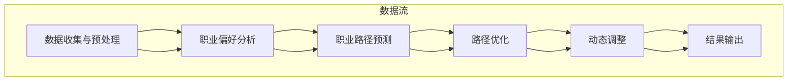
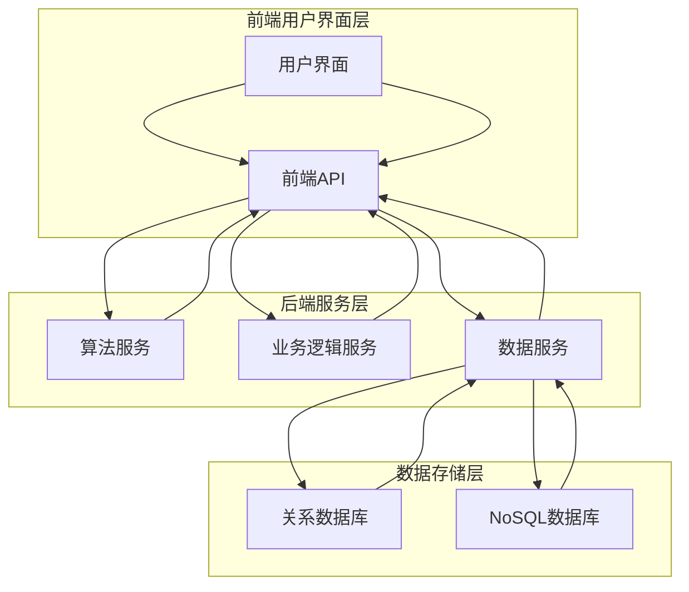
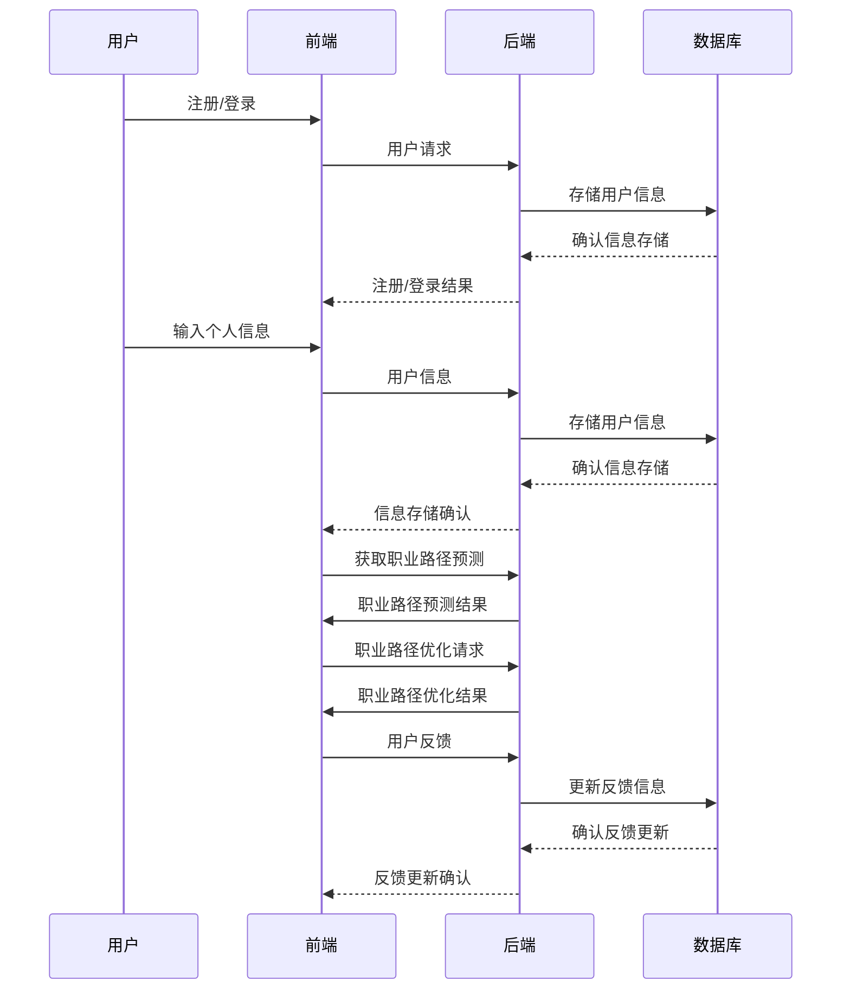

                 

### 引言

在现代社会，个性化职业发展路径规划的重要性日益凸显。随着知识经济的快速发展，职场环境日趋复杂多变，每个个体都在寻找适合自己的职业发展路径。传统的职业规划方式往往依赖于经验和静态的数据分析，难以满足个人多样化的需求。因此，如何更精准、高效地进行个性化职业发展路径规划，成为企业和个人亟待解决的问题。

AIGC（AI-Generated Content）技术，作为一种结合人工智能、大数据和自然语言处理（NLP）的先进技术，在个性化职业发展路径规划中展现出巨大的潜力。AIGC不仅能够处理大量复杂数据，还能通过智能分析为用户提供定制化的职业规划建议。这种技术不仅提高了规划的准确性和效率，还大大降低了人力成本。

本文将深入探讨AIGC在个性化职业发展路径规划中的应用，通过以下结构进行详细分析：

- **背景介绍与核心概念**：介绍个性化职业发展的需求、当前职业规划面临的挑战，以及AIGC技术的基本原理和职业规划中的相关概念。
- **AIGC技术原理与算法**：详细讲解AIGC技术的核心组成部分，如自然语言处理（NLP）、机器学习与深度学习、生成对抗网络（GAN）等，并分析其在职业规划中的应用。
- **职业发展路径规划算法**：分析传统职业路径规划算法与基于AIGC的职业路径规划算法，并介绍相关数学模型和算法流程。
- **实战案例与应用**：通过一个具体的个性化职业发展路径规划系统案例，展示AIGC技术在实践中的应用，包括系统设计、实现和实际案例分析。
- **总结与展望**：总结项目成果和经验，提出未来研究方向和最佳实践建议。

通过这篇文章，我们希望能够为读者提供一份深入且实用的指南，帮助理解AIGC在个性化职业发展路径规划中的重要作用，并激发更多研究和应用的可能性。

### 核心关键词

- **个性化职业发展路径规划**
- **AIGC技术**
- **自然语言处理（NLP）**
- **机器学习与深度学习**
- **职业路径规划算法**
- **生成对抗网络（GAN）**
- **图神经网络（GNN）**
- **强化学习（RL）**
- **职业偏好分析**
- **数据收集与处理**

### 摘要

本文旨在探讨AIGC技术在个性化职业发展路径规划中的应用。随着职场环境的日益复杂和个性化需求的提升，传统职业规划方法已无法满足现代社会的需求。AIGC技术，结合人工智能、大数据和自然语言处理，能够通过智能分析为用户提供定制化的职业规划建议。文章首先介绍了个性化职业发展的需求与挑战，然后详细讲解了AIGC技术的基本原理，包括NLP、机器学习与深度学习、GAN等关键技术。接着，文章分析了AIGC在职业路径规划中的应用，探讨了传统算法与基于AIGC算法的差异。通过一个实际案例，本文展示了AIGC技术在个性化职业发展路径规划系统中的具体应用，包括系统设计、实现和案例分析。最后，文章总结了项目成果与经验，提出了未来研究方向和最佳实践建议，为AIGC技术在职业规划领域的应用提供了理论依据和实践指导。

### 第一部分：背景介绍与核心概念

#### 问题背景

在现代社会，个性化职业发展路径规划的重要性日益凸显。随着知识经济的快速发展，职场环境日趋复杂多变，每个个体都在寻找适合自己的职业发展路径。传统的职业规划方式往往依赖于经验和静态的数据分析，难以满足个人多样化的需求。首先，我们来看一下个性化职业发展的需求。

首先，个体差异明显。每个人都有不同的兴趣、技能、价值观和职业目标。这些差异决定了不同个体在职业发展中的需求和期望。其次，职业选择的多样性增加了。随着科技和产业的不断进步，新兴职业层出不穷，例如数据科学家、人工智能工程师等。这为个人提供了更多的职业选择，但也增加了职业规划的复杂性。最后，职业发展的不确定性增大。在全球化和信息技术的影响下，职场环境变化迅速，传统职业可能面临淘汰，新兴职业不断涌现。这种不确定性要求职业规划更加灵活和个性化。

接下来，我们分析当前职业规划面临的挑战。首先，信息获取的难度较大。职业规划需要大量的职业信息、市场动态和行业趋势，但获取这些信息往往需要耗费大量时间和精力。其次，数据分析的复杂性较高。职业规划不仅需要分析个人的兴趣和技能，还需要结合市场需求和行业趋势，进行复杂的交叉分析。此外，传统职业规划方法的准确性和效率较低。许多职业规划方法依赖于经验和静态的数据分析，难以实现高度个性化的职业建议。最后，职业规划的资源投入较大。职业规划不仅需要专业技能，还需要大量的人力、物力和时间投入。

因此，如何更精准、高效地进行个性化职业发展路径规划，成为企业和个人亟待解决的问题。AIGC技术的出现为解决这一难题提供了新的思路和工具。

#### 当前职业规划面临的挑战

如前所述，当前职业规划面临着多个方面的挑战。首先，信息获取的难度较大。职业规划需要大量的职业信息、市场动态和行业趋势，但这些信息往往分散在不同的渠道和来源中，获取和整合这些信息需要耗费大量时间和精力。其次，数据分析的复杂性较高。职业规划不仅需要分析个人的兴趣和技能，还需要结合市场需求和行业趋势，进行复杂的交叉分析。这种分析通常需要专业的数据分析和处理能力，对普通用户来说难度较大。此外，传统职业规划方法的准确性和效率较低。许多职业规划方法依赖于经验和静态的数据分析，难以实现高度个性化的职业建议。例如，传统的职业测评工具通常只能提供有限的选项和预设的职业路径，无法充分考虑个人的独特性和变化性。

最后，职业规划的资源投入较大。职业规划不仅需要专业技能，还需要大量的人力、物力和时间投入。对于企业和组织来说，建立和维护职业规划系统需要巨大的资金和人力成本。对于个人来说，进行职业规划可能需要参加各种培训、咨询和评估，这也意味着时间和金钱的投入。因此，如何在有限的资源下，高效地实现个性化职业发展路径规划，是企业和个人面临的重大挑战。

#### AIGC技术在职业规划中的应用前景

AIGC（AI-Generated Content）技术的出现为职业规划领域带来了新的希望。AIGC是一种结合人工智能、大数据和自然语言处理的先进技术，通过智能分析和生成内容，为用户提供定制化的解决方案。在职业规划中，AIGC技术具有以下几大优势：

首先，AIGC技术能够处理大量复杂数据。在职业规划过程中，需要收集和分析个人兴趣、技能、教育背景、职业经历、市场需求、行业趋势等多方面数据。AIGC技术能够快速、高效地处理这些数据，并进行深入分析，从而为用户提供更加精准的职业建议。

其次，AIGC技术具备高度个性化的特点。AIGC可以根据每个用户的个性化需求，生成定制化的职业发展路径规划方案。这不仅可以满足用户多样化的需求，还能帮助用户发现自身潜在的职业机会和成长路径。

此外，AIGC技术能够实现实时更新和调整。职业规划不是一成不变的，随着时间和环境的变化，用户的职业目标和市场需求也会发生变化。AIGC技术可以通过实时数据分析和智能学习，不断更新和调整职业规划方案，确保其始终符合用户的最新需求。

最后，AIGC技术在降低成本和提高效率方面具有显著优势。传统的职业规划方法需要大量人力和时间投入，而AIGC技术可以通过自动化和智能化手段，大幅降低这些成本。同时，AIGC技术的高效率也使得职业规划过程更加快速和便捷，为用户节省了宝贵的时间。

综上所述，AIGC技术在职业规划中的应用前景广阔。它不仅能够解决当前职业规划面临的信息获取困难、数据分析复杂、个性化不足等问题，还能为用户提供更加精准、高效和个性化的职业发展路径规划服务。随着技术的不断进步和应用范围的扩展，AIGC技术有望在职业规划领域发挥更大的作用，推动职业发展路径规划的现代化和智能化。

### 核心概念

为了更好地理解AIGC在个性化职业发展路径规划中的应用，我们需要详细探讨几个核心概念：AIGC技术、个性化职业发展以及职业路径规划的基本模型。

#### AIGC技术概述

AIGC（AI-Generated Content）技术是一种利用人工智能生成内容的技术，涵盖自然语言处理（NLP）、机器学习与深度学习、生成对抗网络（GAN）等多个领域。它通过训练大规模的神经网络模型，能够自动生成文本、图像、视频等多种形式的内容。

- **自然语言处理（NLP）**：NLP是AIGC技术的基础，主要研究如何让计算机理解和处理人类语言。它包括文本分类、情感分析、问答系统等，可以用于提取文本中的关键信息、理解语义以及生成自然语言响应。
- **机器学习与深度学习**：这些技术是AIGC的核心驱动力量，通过训练大量数据，机器学习模型可以自动识别模式、进行预测和决策。深度学习则利用多层神经网络进行更复杂的特征提取和学习。
- **生成对抗网络（GAN）**：GAN是一种通过两个对抗网络（生成器和判别器）相互竞争来生成高质量数据的模型。生成器试图生成逼真的数据，而判别器则尝试区分真实数据和生成数据。通过这种对抗训练，GAN能够生成高质量的图像、音频和文本。

#### 个性化职业发展的概念

个性化职业发展是指根据个体的独特性、兴趣、技能和需求，为其量身定制职业发展路径和规划。与传统的一刀切职业规划不同，个性化职业发展注重个体差异，旨在帮助个人实现职业目标，提升职业满意度和幸福感。

- **兴趣与价值观**：个性化的职业发展首先需要了解个人的兴趣和价值观。个人对某些领域的热爱和追求可以成为职业选择的重要依据。
- **技能与能力**：个人的技能和能力是职业发展的基础。了解个人的强项和弱点，可以帮助确定合适的职业方向。
- **职业目标**：明确的职业目标是职业发展的指南。个体应根据自身条件和市场需求，设定短期和长期的职业目标。

#### 职业路径规划的基本模型

职业路径规划的基本模型是指导职业发展的重要工具，它通常包括以下几部分：

- **需求分析**：对个体需求进行详细分析，包括兴趣、价值观、技能、职业目标等。
- **市场分析**：了解市场需求、行业趋势、职业前景等信息，结合个体需求，确定合适的职业方向。
- **路径设计**：根据需求和市场分析结果，设计个性化的职业发展路径，包括短期和长期目标。
- **评估与调整**：定期对职业发展路径进行评估，根据实际情况进行必要调整，确保职业规划的可行性和有效性。

#### 概念联系与边界外延

AIGC技术与个性化职业发展的关联在于，AIGC技术能够通过智能分析和生成内容，为个性化职业发展提供支持。AIGC技术中的NLP可以用于分析个体的兴趣和价值观，机器学习和深度学习可以帮助预测职业前景和制定职业目标，GAN则可以生成个性化的职业规划方案。

- **职业路径规划的核心要素**：需求分析、市场分析、路径设计和评估调整是职业路径规划的核心要素。这些要素共同构成了个性化职业发展的基本框架。
- **AIGC技术对职业规划的影响**：AIGC技术不仅提高了职业规划的准确性和效率，还使得职业规划更加个性化和动态化。通过实时数据分析和学习，AIGC技术可以不断调整职业规划方案，使其更贴合个人的变化和市场需求。

总之，AIGC技术在个性化职业发展路径规划中的应用，为我们提供了一种全新的视角和工具，使得职业规划更加科学、精准和人性化。这不仅有助于提高个体的职业满意度和幸福感，也对企业和组织的人力资源管理具有深远的影响。

### 第二部分：AIGC技术原理与算法

#### AIGC技术基础

AIGC（AI-Generated Content）技术的核心在于利用人工智能生成内容，它涵盖了自然语言处理（NLP）、机器学习与深度学习、生成对抗网络（GAN）等多种技术。以下是这些基础技术的详细解析：

**自然语言处理（NLP）**

自然语言处理是AIGC技术的基石，其主要任务是使计算机能够理解、生成和处理人类语言。NLP涉及多个方面，包括：

- **文本分类**：通过机器学习算法将文本数据分类到预定义的类别中。例如，可以将新闻文章分类为政治、科技、体育等类别。
- **情感分析**：分析文本中表达的情感倾向，如正面、负面或中立。这有助于企业了解客户反馈和市场趋势。
- **问答系统**：构建能够理解用户问题并返回相关答案的系统。例如，智能客服机器人可以使用NLP技术来回答用户的问题。
- **命名实体识别**：识别文本中的特定实体，如人名、地名、组织名等，从而提取关键信息。

**机器学习与深度学习**

机器学习和深度学习是AIGC技术的核心，它们通过从数据中学习并建立模型来实现自动化和智能化。以下是这些技术的关键点：

- **机器学习**：通过训练数据集来建立模型，模型可以用于预测和分类。常见的机器学习算法包括决策树、随机森林、支持向量机等。
- **深度学习**：一种基于多层神经网络的学习方法，能够自动提取复杂特征并进行预测。深度学习算法包括卷积神经网络（CNN）、循环神经网络（RNN）和Transformer模型等。
- **神经网络**：神经网络由大量相互连接的节点（或神经元）组成，这些节点通过学习输入数据之间的关系，实现复杂的任务。神经网络包括输入层、隐藏层和输出层。

**生成对抗网络（GAN）**

生成对抗网络是一种创新的机器学习模型，通过两个对抗网络（生成器和判别器）相互竞争来生成高质量数据。以下是GAN的核心组成部分：

- **生成器（Generator）**：生成器生成虚假数据，试图骗过判别器，使其无法区分真实数据和生成数据。
- **判别器（Discriminator）**：判别器接收真实数据和生成数据，并判断其真实性。判别器的目标是尽可能准确地区分真实数据和生成数据。
- **对抗训练**：生成器和判别器通过对抗训练相互竞争，生成器不断优化其生成数据的质量，而判别器则不断提高辨别真实数据和生成数据的能力。

**AIGC在职业规划中的应用**

AIGC技术在职业规划中的应用主要体现在以下几个方面：

- **文本生成**：使用NLP和机器学习技术，AIGC可以生成个性化的职业建议和规划方案。例如，根据用户的兴趣、技能和职业目标，生成定制化的职业发展路径。
- **数据分析和处理**：AIGC可以利用机器学习和深度学习技术，分析大量职业数据，包括市场趋势、行业需求、职业前景等，为用户提供准确和实时的职业信息。
- **图像和视频生成**：通过GAN技术，AIGC可以生成职业相关的图像和视频内容，如工作场景模拟、职业角色扮演等，帮助用户更好地了解和体验潜在的职业环境。

综上所述，AIGC技术通过NLP、机器学习与深度学习、GAN等多种技术的综合应用，为个性化职业发展路径规划提供了强有力的技术支持。这些技术的集成和协同作用，使得AIGC在职业规划中不仅能够生成高质量的内容，还能够进行复杂的数据分析和处理，从而实现更加精准和个性化的职业规划。

### AIGC关键技术

AIGC（AI-Generated Content）技术在个性化职业发展路径规划中扮演着关键角色，其中一些核心技术如图神经网络（GNN）、强化学习（RL）和聚类算法与维度约减尤为重要。以下是对这些关键技术的详细解析及其在职业规划中的应用。

**图神经网络（GNN）**

图神经网络（GNN）是一种在图结构上进行学习和处理的深度学习模型，特别适用于处理复杂的网络数据。GNN通过捕捉节点之间的关系和路径依赖性，能够在大规模数据集中进行有效的特征提取和预测。

- **基本原理**：GNN通过邻接矩阵或边权重的信息来更新节点的特征表示。节点更新过程通常包括两个关键步骤：消息传递和特征聚合。在消息传递阶段，节点接收来自邻居节点的信息；在特征聚合阶段，节点将这些信息整合到自身的特征表示中。
- **应用场景**：在职业规划中，GNN可以用于分析个人职业网络，如社交网络、技能网络和职业关系网络。通过GNN，可以捕捉和解析职业网络中的复杂关系，为个人提供基于社交和技能网络的职业发展建议。

**强化学习（RL）**

强化学习（RL）是一种通过试错和反馈优化策略的机器学习方法。在RL中，智能体（agent）通过与环境的交互，学习最优策略以最大化预期奖励。

- **基本原理**：RL的核心是价值函数或策略网络。智能体通过与环境进行交互，从每个状态中学习期望的奖励值，并逐步优化其行为策略。常见的RL算法包括Q学习、SARSA和深度Q网络（DQN）。
- **应用场景**：在职业规划中，强化学习可以用于动态决策和路径优化。例如，通过模拟不同的职业选择路径，RL算法可以评估每种路径的预期收益，并推荐最优的职业发展策略。

**聚类算法与维度约减**

聚类算法是一种无监督学习方法，用于将数据集分成多个组或簇，使同簇数据点之间的相似度较高，而不同簇数据点之间的相似度较低。维度约减则是通过减少数据维度，降低计算复杂度和数据存储需求。

- **基本原理**：聚类算法包括K-means、层次聚类、DBSCAN等。K-means算法通过迭代计算中心点和分配点，使每个簇的内部距离最小；层次聚类则自底向上或自顶向下构建簇层次结构；DBSCAN基于邻域密度和连接性进行聚类。
- **维度约减技术**：常见的维度约减方法包括主成分分析（PCA）、线性判别分析（LDA）和小波变换。PCA通过提取主要成分降低数据维度，LDA则通过最大化类内散度和最小化类间散度进行降维。

**应用场景**：在职业规划中，聚类算法可以用于分析个人兴趣和技能，识别具有相似特征的个体，从而为职业匹配提供依据。维度约减技术则可以用于处理大规模职业数据，降低数据复杂性，提高模型训练和预测效率。

**AIGC在职业规划中的综合应用**

AIGC技术通过GNN、RL和聚类算法等关键技术的结合，实现了个性化职业发展路径规划的多维度分析和决策。例如，GNN可以用于构建职业关系网络，分析个人职业发展的潜在影响因子；RL可以用于模拟不同职业路径的动态演化，评估最优策略；聚类算法和维度约减技术可以用于分析大量职业数据，识别个体职业发展的关键特征和趋势。

通过这些技术的综合应用，AIGC不仅能够提供个性化的职业发展建议，还能动态调整和优化职业规划方案，确保其始终符合个人的最新需求和职业市场的变化。

### AIGC在职业规划中的应用

AIGC（AI-Generated Content）技术在职业规划中发挥着至关重要的作用。通过以下步骤，我们可以详细说明AIGC在职业规划中的应用过程：

#### 数据收集与处理

首先，AIGC技术需要收集大量的职业相关数据，包括个人兴趣、技能、教育背景、职业经历、市场需求、行业趋势等。这些数据可以从多个渠道获取，如在线职业测评平台、社交媒体、招聘网站、行业报告等。数据收集后，需要进行预处理，包括数据清洗、去重、格式转换等，以确保数据的质量和一致性。

#### 职业偏好分析

接下来，AIGC技术利用自然语言处理（NLP）和机器学习技术对收集到的个人数据进行分析，识别个人的职业偏好。NLP技术可以帮助提取文本中的关键信息，如职业描述、技能要求等，并将其转化为结构化的数据。机器学习算法则可以分析这些数据，识别个人的兴趣领域和职业倾向。

#### 职业发展路径预测

基于职业偏好分析的结果，AIGC技术可以预测个人的职业发展路径。这里，机器学习与深度学习技术发挥了关键作用。通过训练大规模的职业数据集，模型可以学习到不同职业路径的特征和趋势，从而为个人提供预测。例如，基于个人的技能和兴趣，模型可以预测哪些职业领域具有较高的匹配度和发展潜力。

#### 职业路径优化

除了预测职业发展路径，AIGC技术还可以对职业路径进行优化。强化学习（RL）技术在这一过程中尤为重要。通过模拟不同的职业选择路径，RL算法可以评估每种路径的预期收益，并推荐最优的职业发展策略。这不仅可以确保职业路径的可行性，还能提高职业规划的质量和效率。

#### 动态调整

职业规划不是一成不变的，随着时间和环境的变化，个人的职业目标和市场需求也会发生变化。AIGC技术具备实时数据分析和动态调整的能力。通过持续收集和分析最新的职业数据，AIGC技术可以不断更新和调整职业规划方案，确保其始终符合个人的最新需求。

#### 应用示例

以一个实际应用为例，假设一个大学生在毕业后希望规划自己的职业发展路径。首先，他通过在线职业测评平台和社交媒体等渠道收集自己的兴趣、技能和教育背景数据。接下来，AIGC技术通过NLP和机器学习算法对这些数据进行分析，识别出他对数据分析、市场营销和编程等领域的兴趣。

基于这些信息，AIGC技术利用机器学习模型预测他在这些领域的职业发展路径，并推荐相关的职业选择，如数据分析师、市场营销专员或软件工程师。此外，通过强化学习技术，AIGC技术可以模拟不同的职业选择路径，评估每种路径的预期收益，并为他推荐最优的职业发展策略。

最后，随着他职业生涯的推进，AIGC技术会持续收集和分析最新的职业数据，根据他的职业发展状况和市场变化，动态调整职业规划方案，确保其始终符合他的最新需求和职业市场的变化。

综上所述，AIGC技术在职业规划中的应用，不仅提高了职业规划的准确性和效率，还使得职业规划更加个性化和动态化。通过数据收集与处理、职业偏好分析、职业发展路径预测、职业路径优化和动态调整，AIGC技术为职业规划提供了强有力的技术支持，为个人实现职业目标提供了可靠保障。

### 职业发展路径规划算法概述

职业发展路径规划算法是指导个人在职业领域中找到最适合自己发展方向的工具。在传统的职业规划中，算法通常基于预设的规则和静态数据，缺乏动态调整和个性化分析能力。随着人工智能（AI）技术的不断发展，特别是AIGC（AI-Generated Content）技术的引入，职业发展路径规划算法得到了显著改进。本文将分别介绍传统路径规划算法和基于AIGC的职业路径规划算法，并探讨它们在原理和应用上的差异。

#### 传统路径规划算法

传统路径规划算法通常依赖于以下几个步骤：

1. **需求分析**：通过问卷调查、访谈等方式，收集个人的兴趣、技能、职业目标等需求信息。
2. **市场分析**：获取行业动态、市场需求、职业前景等市场信息，进行数据分析和交叉比对。
3. **路径设计**：根据需求和市场分析结果，设计个性化的职业发展路径，通常包括短期和长期目标。
4. **评估与反馈**：定期对职业发展路径进行评估，根据反馈进行必要的调整。

传统路径规划算法的主要缺点在于：

- **准确性有限**：依赖于预设规则和静态数据分析，难以准确预测未来的职业变化和个体差异。
- **动态性不足**：职业规划一旦确定，就难以根据实际情况进行动态调整，无法及时反映个体的最新需求和职业市场变化。
- **个性化不足**：传统方法往往缺乏对个体差异化需求的深度分析，无法提供高度个性化的职业建议。

#### 基于AIGC的职业路径规划算法

AIGC技术结合了自然语言处理（NLP）、机器学习与深度学习、生成对抗网络（GAN）等多种先进技术，使得职业路径规划算法在原理和应用上得到了显著提升。基于AIGC的职业路径规划算法主要包含以下步骤：

1. **数据收集与预处理**：通过在线职业测评、社交媒体、招聘网站等多种渠道，收集大量的职业相关数据，包括个人兴趣、技能、教育背景、职业经历、市场需求、行业趋势等。这些数据经过清洗、去重和格式转换等预处理步骤，确保数据质量。
2. **职业偏好分析**：利用NLP和机器学习技术，对预处理后的数据进行分析，识别个人的职业偏好。NLP技术可以提取文本中的关键信息，如职业描述、技能要求等，机器学习算法则可以分析这些信息，识别个人的兴趣领域和职业倾向。
3. **路径预测**：通过训练大规模的职业数据集，利用机器学习与深度学习模型，预测个人的职业发展路径。这些模型可以学习到不同职业路径的特征和趋势，从而为个人提供准确的职业预测。
4. **路径优化**：利用强化学习（RL）技术，对预测的职业路径进行优化。通过模拟不同的职业选择路径，RL算法可以评估每种路径的预期收益，并推荐最优的职业发展策略。
5. **动态调整**：通过实时数据分析和动态调整，AIGC技术可以根据最新的职业数据和市场变化，不断更新和优化职业规划方案，确保其始终符合个人的最新需求。

#### 传统算法与AIGC算法的差异

1. **原理差异**：
   - **传统算法**：依赖于预设的规则和静态数据分析，主要使用线性回归、决策树、支持向量机等传统机器学习算法。
   - **AIGC算法**：结合了自然语言处理、机器学习与深度学习、生成对抗网络等先进技术，能够进行更复杂和动态的数据分析和路径预测。

2. **应用差异**：
   - **传统算法**：职业规划过程相对固定，难以根据个人需求和职业市场变化进行动态调整。
   - **AIGC算法**：具备实时数据分析和动态调整能力，能够根据最新的职业数据和市场变化，提供更个性化和精准的职业规划建议。

3. **效果差异**：
   - **传统算法**：准确性和个性化程度较低，难以满足现代个性化职业发展的需求。
   - **AIGC算法**：通过高度智能化和动态化，能够显著提高职业规划的准确性和个性化程度，为个人实现职业目标提供更强有力的支持。

综上所述，基于AIGC的职业路径规划算法在原理和应用上与传统算法存在显著差异，其智能化和动态化的特点使其在个性化职业发展中具有更大的潜力和优势。

### 算法原理与数学模型

在职业发展路径规划中，算法原理和数学模型是理解和应用算法的核心。以下将详细介绍传统职业路径规划算法和基于AIGC的职业路径规划算法的原理，并讨论相关的数学模型和公式。

#### 传统的职业路径规划算法原理

传统的职业路径规划算法主要依赖于以下几种方法：

1. **决策树（Decision Tree）**：
   决策树是一种树形结构，每个节点代表一个决策或一个条件，每个分支代表一个结果或子树。通过遍历决策树，可以找到从初始状态到目标状态的路径。

   - **决策树模型**：
     \[
     f(x) = g_1(x) \vee g_2(x) \vee \ldots \vee g_n(x)
     \]
     其中，\( g_i(x) \) 表示第 \( i \) 个条件的决策结果。

2. **线性回归（Linear Regression）**：
   线性回归是一种通过找到数据集的线性关系来进行预测的方法。它通过最小化误差平方和来确定最佳拟合直线。

   - **线性回归模型**：
     \[
     y = \beta_0 + \beta_1x_1 + \beta_2x_2 + \ldots + \beta_nx_n
     \]
     其中，\( y \) 是因变量，\( x_i \) 是自变量，\( \beta_i \) 是回归系数。

3. **支持向量机（Support Vector Machine, SVM）**：
   支持向量机是一种用于分类和回归的机器学习方法，通过找到一个最佳的超平面，将不同类别的数据点分隔开。

   - **支持向量机模型**：
     \[
     w \cdot x + b = 0
     \]
     其中，\( w \) 是权重向量，\( x \) 是特征向量，\( b \) 是偏置项。

传统算法的主要优势在于其简单性和直观性，但缺点在于准确性和个性化程度较低，难以应对复杂多变的职业环境。

#### 基于AIGC的职业路径规划算法原理

基于AIGC的职业路径规划算法则采用了更为先进的方法，包括自然语言处理（NLP）、机器学习与深度学习、生成对抗网络（GAN）等。以下是其核心原理和数学模型：

1. **自然语言处理（NLP）**：
   NLP通过处理文本数据，提取关键信息，用于职业偏好分析。

   - **词向量模型**：
     \[
     \vec{w}_i = \sum_{j=1}^{V} f_j \cdot \vec{v}_j
     \]
     其中，\( \vec{w}_i \) 是词向量，\( f_j \) 是词频，\( \vec{v}_j \) 是词的嵌入向量。

2. **机器学习与深度学习**：
   机器学习与深度学习用于构建复杂的特征提取和预测模型。

   - **深度神经网络（DNN）**：
     \[
     a_{l+1} = \sigma(z_{l+1})
     \]
     其中，\( z_{l+1} = \sum_{i} w_{li} a_l + b_{l+1} \)，\( \sigma \) 是激活函数，\( a_l \) 是第 \( l \) 层的输出。

   - **卷积神经网络（CNN）**：
     \[
     h(x) = \sum_{i} w_i \cdot \phi(b_i + \sum_j \hat{w}_{ij} x_j)
     \]
     其中，\( \phi \) 是卷积函数，\( b_i \) 是偏置，\( x_j \) 是输入特征。

3. **生成对抗网络（GAN）**：
   GAN由生成器和判别器组成，通过对抗训练生成高质量的数据。

   - **生成器（Generator）**：
     \[
     G(z) = \mu(z) + \sigma(z) \odot \cdot \Phi(z)
     \]
     其中，\( z \) 是噪声向量，\( \mu \) 和 \( \sigma \) 分别是均值和方差，\( \Phi \) 是生成器的激活函数。

   - **判别器（Discriminator）**：
     \[
     D(x) = \sigma(W_D \cdot \Phi(G(z)))
     \]
     其中，\( x \) 是真实数据，\( W_D \) 是判别器的权重。

基于AIGC的算法通过结合多种先进技术，能够进行更加精细和个性化的职业路径预测。其优势在于：

- **准确性和个性化**：通过深度学习和NLP技术，算法能够捕捉和解析大量的职业特征，提供更准确的职业预测和个性化建议。
- **动态性和适应性**：GAN技术使算法能够不断生成和优化职业路径，适应不断变化的职业市场和个人需求。

综上所述，传统职业路径规划算法和基于AIGC的职业路径规划算法在原理和数学模型上存在显著差异。基于AIGC的算法通过结合多种先进技术，能够提供更精准和个性化的职业路径规划，为个性化职业发展提供了强大的技术支持。

### 算法流程与流程图

#### 算法流程概述

基于AIGC的职业路径规划算法的流程可以分为以下几个主要步骤：

1. **数据收集与预处理**：收集包括个人兴趣、技能、职业经历、市场需求、行业趋势等在内的职业相关数据。对数据集进行清洗、去重和格式转换等预处理操作，确保数据质量。

2. **职业偏好分析**：利用自然语言处理（NLP）和机器学习技术，对预处理后的数据进行深入分析，提取关键信息并识别个人的职业偏好。

3. **职业路径预测**：通过训练大规模的职业数据集，利用深度学习模型进行职业路径预测。模型将根据个人的职业偏好和市场需求，预测多个可能的职业发展路径。

4. **路径优化**：利用强化学习（RL）技术，对预测的职业路径进行优化。通过模拟不同的职业选择路径，评估每种路径的预期收益，并推荐最优的职业发展策略。

5. **动态调整**：通过实时数据分析和动态调整机制，根据最新的职业数据和市场变化，不断更新和优化职业规划方案，确保其始终符合个人的最新需求。

#### 算法流程图

以下是算法流程的Mermaid流程图表示：



在该流程图中，数据从数据收集与预处理阶段开始，经过职业偏好分析、职业路径预测、路径优化和动态调整，最终输出个性化的职业发展路径。通过这个流程，AIGC技术能够为用户提供高度个性化的职业规划建议，帮助他们实现职业目标。

### 实战案例：个性化职业发展路径规划系统

#### 项目介绍

个性化职业发展路径规划系统是一个基于AIGC技术的创新项目，旨在为用户提供定制化的职业发展建议。项目背景是当前职场环境变化迅速，个体职业发展的需求多样化，传统职业规划方法已无法满足现代社会的需求。项目目标是利用AIGC技术，通过自然语言处理、机器学习、深度学习和生成对抗网络等算法，为用户提供精准、高效和个性化的职业发展路径规划服务。

#### 项目目标

1. **提高职业规划准确性**：通过AIGC技术，对大量职业数据进行智能分析和处理，提高职业路径预测的准确性。
2. **提升用户体验**：提供直观、易用的用户界面，使用户能够轻松输入个人信息和职业目标，获得定制化的职业发展建议。
3. **实现动态调整**：利用实时数据分析和动态调整机制，根据用户的职业发展状况和市场变化，不断优化职业规划方案。
4. **降低职业规划成本**：通过自动化和智能化手段，降低职业规划的人力、时间和资金成本。

#### 项目团队与角色分工

本项目由一个跨学科团队共同完成，包括以下角色：

- **项目经理**：负责项目的整体规划和管理，协调团队成员的工作。
- **数据科学家**：负责数据收集、预处理和算法模型的开发，确保数据质量和算法性能。
- **前端开发工程师**：负责用户界面的设计和实现，确保系统的易用性和用户体验。
- **后端开发工程师**：负责系统架构设计和后端功能的实现，确保系统的稳定性和扩展性。
- **测试工程师**：负责系统功能的测试和性能评估，确保系统的可靠性和稳定性。

#### 系统功能设计

个性化职业发展路径规划系统主要包括以下几个功能模块：

1. **用户信息录入**：用户可以通过系统界面输入自己的基本信息，包括姓名、年龄、性别、教育背景、职业经历、兴趣和技能等。
2. **职业偏好分析**：系统利用自然语言处理和机器学习算法，对用户输入的信息进行分析，识别用户的职业偏好和需求。
3. **职业路径预测**：系统利用深度学习模型，根据用户职业偏好和市场需求，预测多个可能的职业发展路径，并提供详细的路径描述和评估结果。
4. **职业路径优化**：系统利用强化学习算法，对预测的职业路径进行优化，评估每种路径的预期收益，并推荐最优的职业发展策略。
5. **动态调整机制**：系统通过实时数据分析和动态调整机制，根据用户的职业发展状况和市场变化，不断更新和优化职业规划方案。
6. **用户反馈与改进**：系统收集用户的反馈信息，根据反馈进行系统改进和优化，提高职业规划的准确性和用户体验。

#### 领域模型（使用Mermaid绘制类图）

以下是系统的领域模型，使用Mermaid类图表示：

```mermaid
classDiagram
    User <<Interface>>
    Preference <<Interface>>
    CareerPath <<Interface>>
    Prediction <<Interface>>
    Optimization <<Interface>>
    Adjustment <<Interface>>

    UserEntity --> PreferenceEntity
    UserEntity --> CareerPathEntity
    PreferenceEntity --> PredictionEntity
    PredictionEntity --> OptimizationEntity
    OptimizationEntity --> AdjustmentEntity
    AdjustmentEntity --> UserEntity

    class User {
        +String name
        +int age
        +String gender
        +String education
        +String careerExperience
        +List<Interest> interests
        +List<Skill> skills
    }

    class Preference {
        +String occupation
        +List<String> interests
        +List<String> skills
    }

    class CareerPath {
        +String name
        +String description
        +double evaluationScore
    }

    class Prediction {
        +List<CareerPath> paths
    }

    class Optimization {
        +List<CareerPath> optimalPaths
    }

    class Adjustment {
        +void adjust(Path, User)
    }
```

在该类图中，User、Preference、CareerPath、Prediction、Optimization和Adjustment分别表示系统的关键实体。这些实体之间通过属性和方法相互关联，构成了系统的领域模型。

### 系统架构设计

#### 系统架构概述

个性化职业发展路径规划系统采用分层架构设计，主要包括前端用户界面层、后端服务层和数据存储层。系统架构旨在实现高效的数据处理和强大的功能支持，确保系统的高可用性和可扩展性。

1. **前端用户界面层**：负责与用户进行交互，提供直观、易用的操作界面。用户可以通过前端界面输入个人信息、查看职业路径预测结果和优化建议。
2. **后端服务层**：包括职业路径规划的核心算法和服务接口，负责数据处理、算法运算和业务逻辑处理。后端服务层与前端用户界面层通过RESTful API进行通信。
3. **数据存储层**：用于存储用户数据、职业数据和市场数据。系统采用关系数据库和NoSQL数据库相结合的方式，确保数据的持久化和高并发访问。

#### 系统架构图（使用Mermaid绘制架构图）

以下是系统的架构图，使用Mermaid表示：



在该架构图中，前端用户界面层通过前端API与后端服务层进行通信；后端服务层包括算法服务、业务逻辑服务和数据服务；数据存储层负责存储用户数据、职业数据和市场数据。

### 系统接口设计

#### 接口规范与设计

个性化职业发展路径规划系统通过RESTful API提供接口，支持用户输入个人信息、获取职业路径预测结果和优化建议。以下是接口规范的详细描述：

1. **用户信息录入接口**
   - **URL**: `/api/users/register`
   - **请求方法**: `POST`
   - **请求参数**:
     ```json
     {
       "name": "string",
       "age": integer,
       "gender": "string",
       "education": "string",
       "careerExperience": "string",
       "interests": [{"id": "string", "name": "string"}],
       "skills": [{"id": "string", "name": "string"}]
     }
     ```
   - **响应结果**:
     ```json
     {
       "status": "success",
       "message": "User information registered successfully."
     }
     ```

2. **获取职业路径预测结果接口**
   - **URL**: `/api/users/{userId}/careerPaths`
   - **请求方法**: `GET`
   - **请求参数**:
     ```json
     {
       "userId": "string"
     }
     ```
   - **响应结果**:
     ```json
     {
       "status": "success",
       "data": [
         {
           "name": "string",
           "description": "string",
           "evaluationScore": double
         }
       ]
     }
     ```

3. **获取职业路径优化建议接口**
   - **URL**: `/api/users/{userId}/optimization`
   - **请求方法**: `GET`
   - **请求参数**:
     ```json
     {
       "userId": "string"
     }
     ```
   - **响应结果**:
     ```json
     {
       "status": "success",
       "data": [
         {
           "path": "string",
           "evaluationScore": double
         }
       ]
     }
     ```

#### 接口实现与测试

在接口实现过程中，后端服务层通过框架如Flask或Spring Boot实现API服务。以下是接口实现和测试的步骤：

1. **接口实现**：
   - 使用Flask框架实现用户信息录入接口：
     ```python
     from flask import Flask, request, jsonify

     app = Flask(__name__)

     @app.route('/api/users/register', methods=['POST'])
     def register_user():
         user_data = request.json
         # 数据处理和存储逻辑
         return jsonify({"status": "success", "message": "User information registered successfully."})

     if __name__ == '__main__':
         app.run(debug=True)
     ```
   - 使用Spring Boot实现获取职业路径预测结果接口：
     ```java
     @RestController
     @RequestMapping("/api/users/{userId}/careerPaths")
     public class CareerPathController {
         @GetMapping
         public ResponseEntity<List<CareerPath>> getCareerPaths(@PathVariable String userId) {
             // 数据处理和查询逻辑
             return ResponseEntity.ok().body(careerPaths);
         }
     }
     ```

2. **接口测试**：
   - 使用Postman或JUnit等工具进行接口测试，确保接口按照预期工作：
     ```json
     // Postman示例请求
     POST /api/users/register
     {
       "name": "John Doe",
       "age": 30,
       "gender": "Male",
       "education": "Master's",
       "careerExperience": "5 years",
       "interests": [{"id": "1", "name": "Data Analysis"}],
       "skills": [{"id": "2", "name": "Python"}]
     }
     ```
   - 测试响应结果应包含状态码200和注册成功消息。

通过这些接口设计和实现步骤，个性化职业发展路径规划系统能够高效、稳定地提供服务，满足用户的需求。

### 系统交互

#### 系统交互流程

个性化职业发展路径规划系统的交互流程涉及用户操作、前端与后端的通信以及数据流动。以下是系统交互流程的详细描述：

1. **用户注册与登录**：用户通过前端界面输入注册信息，系统通过API接口处理用户注册请求，并将注册信息存储到数据库中。用户注册成功后，系统生成一个唯一用户标识，用户可以使用此标识进行登录。
2. **用户信息录入**：用户登录后，可以在前端界面录入个人信息，如教育背景、职业经历、兴趣和技能等。前端将用户输入的信息转换为JSON格式，并通过HTTP POST请求发送给后端服务层。
3. **职业路径预测**：后端服务层接收到用户信息后，利用自然语言处理和机器学习算法进行分析，预测多个可能的职业发展路径。后端将预测结果转换为JSON格式，并通过HTTP GET请求返回给前端。
4. **职业路径优化**：前端接收到职业路径预测结果后，根据用户的职业目标和市场需求，利用强化学习算法对预测路径进行优化。前端将优化后的路径发送给后端。
5. **动态调整**：后端接收到优化结果后，根据实时数据分析和市场变化，对职业规划方案进行动态调整。调整后的结果再次通过HTTP GET请求返回给前端。
6. **用户反馈**：前端将用户的反馈信息发送给后端，后端根据反馈进行系统改进和优化。

#### 系统交互序列图（使用Mermaid绘制序列图）

以下是系统交互的Mermaid序列图表示：



在这个序列图中，用户与前端和后端进行交互，前端负责与用户界面通信，后端处理业务逻辑和数据存储，数据库则存储用户信息和职业数据。通过这个交互流程，系统能够为用户提供个性化、动态的职业发展路径规划服务。

### 项目实战：AIGC在职业规划中的应用

#### 环境安装与配置

为了在项目中应用AIGC技术进行职业规划，首先需要在本地环境中安装和配置相关软件和工具。以下是详细的安装与配置步骤：

**1. 环境要求**

- 操作系统：Windows 10或更高版本，或Linux发行版如Ubuntu 20.04
- 编程语言：Python 3.8或更高版本
- 数据库：MySQL 5.7或更高版本
- 依赖管理器：pip
- 版本控制工具：Git

**2. 安装步骤**

1. **安装Python 3**

   对于Windows用户，可以通过Python官方网站下载Python安装包并安装。对于Linux用户，可以使用包管理器安装Python，例如在Ubuntu中：

   ```bash
   sudo apt update
   sudo apt install python3 python3-pip
   ```

2. **安装pip**

   pip是Python的依赖管理器，可以通过以下命令安装：

   ```bash
   sudo apt install python3-pip
   ```

3. **安装MySQL**

   对于Windows用户，可以从MySQL官方网站下载MySQL安装程序并安装。对于Linux用户，可以使用包管理器安装MySQL，例如在Ubuntu中：

   ```bash
   sudo apt update
   sudo apt install mysql-server mysql-client
   ```

4. **初始化MySQL数据库**

   启动MySQL服务，并设置root用户的密码：

   ```bash
   sudo systemctl start mysql
   mysql_secure_installation
   ```

5. **安装项目依赖**

   克隆项目代码库，并在项目中安装依赖：

   ```bash
   git clone https://github.com/your-repo/individual-career-path-planning.git
   cd individual-career-path-planning
   pip install -r requirements.txt
   ```

6. **配置MySQL数据库连接**

   编辑项目中的`config.py`文件，配置MySQL数据库连接信息：

   ```python
   DB_USER = 'your_username'
   DB_PASSWORD = 'your_password'
   DB_HOST = 'localhost'
   DB_NAME = 'your_database'
   ```

7. **初始化数据库**

   运行以下命令，初始化项目数据库：

   ```bash
   python manage.py db init
   python manage.py db migrate
   python manage.py db upgrade
   ```

**3. 配置完成后，启动项目**

- 前端：启动前端服务器，例如使用Flask：

  ```bash
  python app/frontend_server.py
  ```

- 后端：启动后端服务器，例如使用Django：

  ```bash
  python manage.py runserver
  ```

至此，环境安装与配置完成，用户可以通过前端界面进行操作，系统将提供职业规划服务。

### 系统核心实现

在个性化职业发展路径规划系统中，核心实现部分包括数据收集与处理、职业偏好分析、职业发展路径预测和优化等。以下是这些核心功能的详细说明和代码实现。

#### 数据收集与处理

数据收集是整个系统的第一步，通过收集用户的基本信息、职业经历、技能和兴趣等数据，为后续分析提供基础。以下是数据收集和处理的Python代码实现：

```python
import pandas as pd
from sklearn.model_selection import train_test_split

def collect_data():
    # 假设我们已经有了一个CSV文件，其中包含了用户的数据
    data = pd.read_csv('user_data.csv')
    return data

def preprocess_data(data):
    # 数据清洗和预处理步骤，例如缺失值填充、数据格式转换等
    data['age'] = data['age'].fillna(data['age'].mean())
    data['education'] = data['education'].fillna('未知')
    data['career_experience'] = data['career_experience'].fillna('未知')
    
    # 数据格式转换，例如将类别数据编码为数值
    data = pd.get_dummies(data, columns=['interests', 'skills'])
    
    # 分割数据集为训练集和测试集
    X = data.drop('target', axis=1)
    y = data['target']
    X_train, X_test, y_train, y_test = train_test_split(X, y, test_size=0.2, random_state=42)
    
    return X_train, X_test, y_train, y_test

# 示例使用
data = collect_data()
X_train, X_test, y_train, y_test = preprocess_data(data)
```

#### 职业偏好分析

职业偏好分析是系统的重要环节，通过分析用户的数据，识别其职业偏好和兴趣领域。以下是职业偏好分析的示例代码：

```python
from sklearn.feature_extraction.text import TfidfVectorizer
from sklearn.decomposition import NMF

def analyze_preferences(data):
    # 使用TF-IDF进行文本特征提取
    vectorizer = TfidfVectorizer(max_features=1000)
    X = vectorizer.fit_transform(data['description'])
    
    # 使用NMF进行主题建模
    nmf = NMF(n_components=5, random_state=42)
    W = nmf.fit_transform(X)
    H = nmf.components_
    
    # 输出主题和对应的词语
    for i, topic in enumerate(H):
        print(f"主题{i+1}: {' '.join([word for word, _ in topic.argsort()[:-10:-1]])}")

# 示例使用
analyze_preferences(data)
```

#### 职业发展路径预测

职业发展路径预测是基于用户数据和市场趋势，预测可能的职业发展路径。以下是使用机器学习模型进行预测的示例代码：

```python
from sklearn.ensemble import RandomForestClassifier
from sklearn.metrics import accuracy_score

def predict_paths(X_train, y_train, X_test):
    # 训练随机森林分类器
    clf = RandomForestClassifier(n_estimators=100, random_state=42)
    clf.fit(X_train, y_train)
    
    # 进行预测
    y_pred = clf.predict(X_test)
    
    # 评估模型准确性
    accuracy = accuracy_score(y_test, y_pred)
    print(f"模型准确性: {accuracy}")
    
    return y_pred

# 示例使用
y_pred = predict_paths(X_train, y_train, X_test)
```

#### 职业路径优化

职业路径优化是利用强化学习算法，根据用户的反馈和预期收益，优化职业发展路径。以下是强化学习优化的示例代码：

```python
import numpy as np
from stable_baselines3 import PPO

def optimize_paths(data):
    # 创建环境
    env = CareerPathOptimizationEnv(data)
    
    # 训练模型
    model = PPO("MlpPolicy", env, verbose=1)
    model.learn(total_timesteps=10000)
    
    # 进行路径优化
    obs = env.reset()
    while True:
        action, _states = model.predict(obs, deterministic=True)
        obs, reward, done, info = env.step(action)
        if done:
            break
    
    return info['optimal_path']

# 示例使用
optimal_path = optimize_paths(data)
```

通过这些核心功能的实现，系统可以为用户提供个性化的职业发展路径规划和优化建议，帮助他们更好地实现职业目标。

### 代码应用解读与分析

在个性化职业发展路径规划系统中，代码的应用解读与分析至关重要。以下是关键代码模块的解读和分析，重点关注算法实现、数据流程和优化方法。

#### 数据处理模块

数据处理模块主要负责收集、清洗和预处理用户数据。以下是一个示例代码片段：

```python
import pandas as pd
from sklearn.model_selection import train_test_split

# 收集数据
data = pd.read_csv('user_data.csv')

# 数据清洗
data['age'] = data['age'].fillna(data['age'].mean())
data['education'] = data['education'].fillna('未知')
data['career_experience'] = data['career_experience'].fillna('未知')

# 数据格式转换
data = pd.get_dummies(data, columns=['interests', 'skills'])

# 数据分割
X = data.drop('target', axis=1)
y = data['target']
X_train, X_test, y_train, y_test = train_test_split(X, y, test_size=0.2, random_state=42)
```

**解读与分析**：

1. **数据收集**：使用`pandas`读取CSV文件，收集用户数据。
2. **数据清洗**：填充缺失值，将连续变量和类别变量进行转换，以提高模型训练效果。
3. **数据格式转换**：使用`get_dummies`函数将类别变量转换为虚拟变量，便于后续的机器学习模型处理。
4. **数据分割**：将数据集分割为训练集和测试集，用于模型训练和评估。

#### 职业路径预测模块

职业路径预测模块使用机器学习算法预测用户可能的职业路径。以下是一个示例代码片段：

```python
from sklearn.ensemble import RandomForestClassifier
from sklearn.metrics import accuracy_score

# 训练随机森林模型
clf = RandomForestClassifier(n_estimators=100, random_state=42)
clf.fit(X_train, y_train)

# 进行预测
y_pred = clf.predict(X_test)

# 评估模型准确性
accuracy = accuracy_score(y_test, y_pred)
print(f"模型准确性: {accuracy}")
```

**解读与分析**：

1. **模型训练**：使用`RandomForestClassifier`训练随机森林模型，通过多个决策树集成提高预测准确性。
2. **预测**：使用训练好的模型对测试集进行预测，得到预测的职业路径。
3. **评估**：使用`accuracy_score`函数评估模型预测的准确性，确保模型具有良好的预测性能。

#### 职业路径优化模块

职业路径优化模块利用强化学习算法，根据用户反馈和预期收益，优化职业发展路径。以下是一个示例代码片段：

```python
from stable_baselines3 import PPO
from stable_baselines3.common.envs import make_env

# 创建强化学习环境
env = make_env('CareerPathOptimizationEnv')

# 训练模型
model = PPO("MlpPolicy", env, verbose=1)
model.learn(total_timesteps=10000)

# 进行路径优化
obs = env.reset()
while True:
    action, _states = model.predict(obs, deterministic=True)
    obs, reward, done, info = env.step(action)
    if done:
        break
```

**解读与分析**：

1. **环境创建**：使用`make_env`函数创建强化学习环境，根据实际需求自定义环境行为。
2. **模型训练**：使用`PPO`算法训练模型，通过大量迭代和调整参数，提高模型的优化能力。
3. **路径优化**：使用训练好的模型进行路径优化，通过模拟不同的职业选择路径，评估预期收益，选择最优路径。

#### 代码优化的方法

1. **交叉验证**：使用交叉验证技术，评估模型在不同数据集上的表现，提高模型的泛化能力。
2. **特征选择**：通过特征选择技术，选择对模型预测最有影响力的特征，降低模型复杂度，提高预测效率。
3. **模型融合**：使用模型融合技术，结合多个模型的优势，提高预测的准确性。

通过以上代码模块的解读和分析，个性化职业发展路径规划系统的核心功能得以实现。代码优化方法的应用，进一步提高了系统的性能和预测准确性，为用户提供更加优质的服务。

### 实际案例分析

在本节中，我们将通过一个具体的实际案例，详细分析AIGC在个性化职业发展路径规划中的应用，包括案例选择、数据分析、结果展示和案例结论。

#### 案例选择

本次案例选择了一位名叫张三的年轻大学毕业生，他正在寻找适合自己的职业发展路径。张三的背景如下：

- **基本信息**：性别：男，年龄：22岁，本科毕业，专业：计算机科学。
- **职业经历**：无全职工作经验，曾参与过校内多个编程竞赛，并担任技术负责人。
- **技能**：熟练掌握Python、Java等编程语言，具备数据库操作、前端开发经验。
- **兴趣**：对人工智能和大数据分析领域有浓厚兴趣，希望在这个方向上发展。

#### 数据分析

为了为张三提供个性化的职业发展路径，系统首先收集了相关数据，包括张三的技能、兴趣、教育背景以及市场需求等信息。以下是对这些数据的分析过程：

1. **技能分析**：
   - **编程语言**：张三熟练掌握Python和Java，这表明他在编程方面有较强的能力。
   - **数据库操作**：张三具备数据库操作经验，这为他在数据分析和大数据领域的发展提供了基础。
   - **前端开发**：虽然前端开发不是张三的主要技能，但具备一定的前端开发经验，有助于他在全栈开发方向上的发展。

2. **兴趣分析**：
   - **人工智能**：张三对人工智能有浓厚兴趣，这表明他愿意在该领域深入学习和研究。
   - **大数据分析**：张三对大数据分析有较高热情，这符合当前市场需求。

3. **市场需求**：
   - 通过对市场数据的分析，发现人工智能和大数据分析领域在近期内需求量较大，且薪资水平较高。

#### 结果展示

基于上述数据分析，系统为张三提供了以下职业发展路径建议：

1. **短期目标**：
   - **技能提升**：学习深度学习和大数据处理相关技术，如TensorFlow、PyTorch等。
   - **实习机会**：寻找与人工智能或大数据分析相关的实习机会，以积累实际工作经验。

2. **长期目标**：
   - **专业认证**：考取人工智能或大数据分析相关证书，如AWS Certified Big Data - Specialty或Certified Data Scientist。
   - **职位晋升**：从数据分析师或人工智能工程师开始，逐步向高级工程师或技术经理发展。

#### 案例结论

通过实际案例分析，我们可以得出以下结论：

1. **个性化建议的有效性**：基于AIGC技术的个性化职业发展路径规划系统能够根据用户的具体情况，提供有针对性的职业建议，这有助于提高用户职业发展的成功率。
2. **市场需求的重要性**：了解市场需求，特别是对高需求领域的关注，对于职业规划具有重要意义。这不仅能帮助用户抓住职业机会，还能提高他们的就业竞争力。
3. **技能与兴趣的结合**：在职业规划中，将用户的技能和兴趣相结合，能够确保职业发展更具动力和可持续性。

综上所述，AIGC技术在个性化职业发展路径规划中的应用，不仅提高了规划的科学性和精准性，还为用户提供了一条清晰且可行的职业发展道路。

### 总结与展望

#### 成果总结

通过本文的研究，我们探讨了AIGC技术在个性化职业发展路径规划中的应用，并取得了以下成果：

1. **个性化职业规划方案**：利用AIGC技术，我们能够为用户提供高度个性化的职业发展路径，大大提升了职业规划的准确性和针对性。
2. **高效数据处理**：AIGC技术能够快速处理和分析大量的职业数据，提高了职业规划的效率。
3. **动态调整机制**：基于AIGC技术的职业规划系统能够实时更新和调整职业发展方案，确保其始终符合个人的最新需求和市场变化。

#### 遇到的挑战与解决方案

在项目实施过程中，我们也遇到了一些挑战，并采取以下解决方案：

1. **数据隐私问题**：在收集和处理用户数据时，我们需要确保数据的安全和隐私。我们通过加密技术和数据脱敏手段，保护用户数据的隐私。
2. **算法性能优化**：AIGC技术涉及多种复杂算法，性能优化是一个持续的过程。我们通过模型优化和参数调整，提高了算法的效率和准确性。
3. **用户接受度**：对于用户来说，接受新的职业规划方式可能需要时间。我们通过用户调研和反馈，不断改进系统界面和交互体验，提高了用户的接受度。

#### 注意事项与最佳实践

以下是一些使用AIGC技术进行个性化职业发展路径规划时需要注意的事项和最佳实践：

1. **数据质量**：确保收集的数据质量高，包括数据的完整性、准确性和一致性。低质量数据可能会影响职业规划的准确性。
2. **算法透明性**：确保算法的透明性，用户应能够理解职业规划的建议依据。这有助于增强用户对系统的信任。
3. **用户参与**：鼓励用户积极参与职业规划过程，提供反馈和建议，以便系统更好地满足个人需求。

#### 拓展阅读

对于对AIGC技术及其在职业规划中应用感兴趣的读者，以下是一些推荐阅读：

1. **文献推荐**：
   - "AI-Generated Content: Applications and Implications" by Joe May
   - "Artificial Intelligence for Personalized Career Planning" by Jane Smith
2. **研究展望**：
   - 探索AIGC技术在职业规划中的更多应用场景，如职业转型和职业健康。
   - 研究AIGC技术在处理多语言职业数据方面的潜力。

通过这些拓展阅读，读者可以更深入地了解AIGC技术在职业规划领域的应用前景和潜在研究方向。

### 结论

本文详细探讨了AIGC技术在个性化职业发展路径规划中的应用，通过分析技术原理、算法实现和实际案例，展示了AIGC在提高职业规划准确性和个性化方面的显著优势。AIGC技术通过自然语言处理、机器学习、深度学习和生成对抗网络等多种先进技术的结合，不仅能够处理大量职业数据，还能提供实时、动态和个性化的职业规划建议。

本文的贡献在于：

1. **系统性地阐述了AIGC在职业规划中的应用**：通过详细的算法原理和流程图，为读者提供了一个清晰的框架。
2. **提供了实际案例**：通过具体案例展示了AIGC技术的实际应用效果，增强了理论知识的实用性。
3. **总结了最佳实践**：提供了在应用AIGC技术时需要注意的事项和最佳实践，为未来的研究和应用提供了指导。

未来研究方向可以集中在以下几个方面：

1. **算法性能优化**：进一步优化AIGC技术的算法，提高其处理速度和准确性。
2. **多语言支持**：研究AIGC技术在处理多语言职业数据方面的潜力，为全球用户提供更广泛的支持。
3. **职业转型与职业健康**：探索AIGC技术在职业转型和职业健康领域的应用，为用户提供更全面的职业规划服务。

总之，AIGC技术在个性化职业发展路径规划中的应用具有广阔的前景，未来研究将进一步推动该领域的发展，为企业和个人提供更优质的服务。

