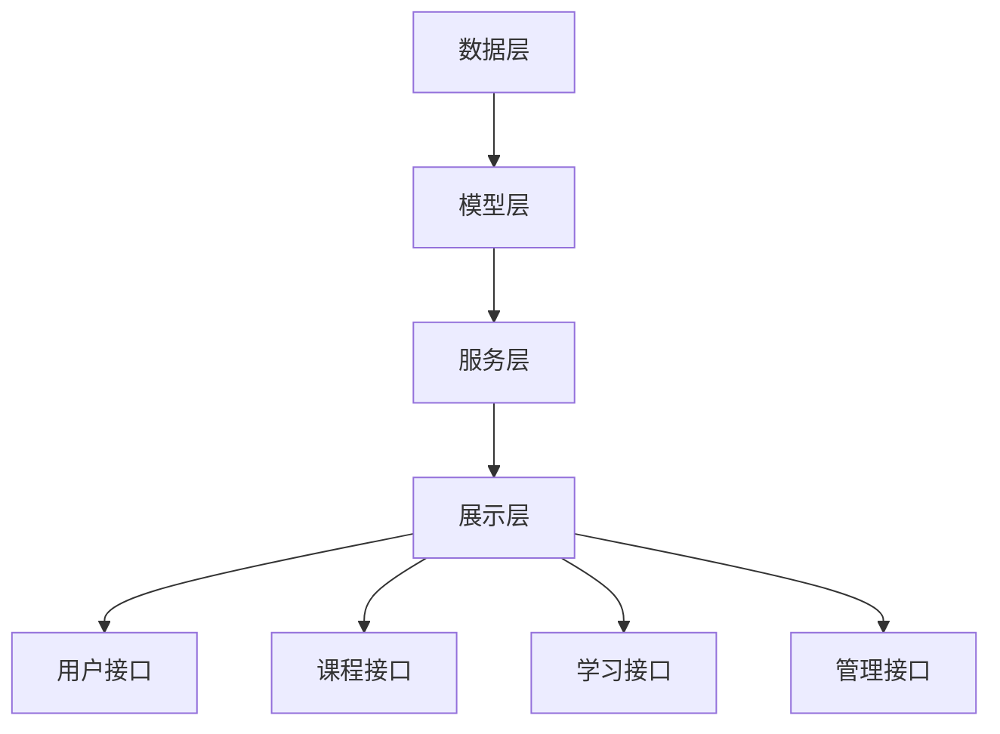
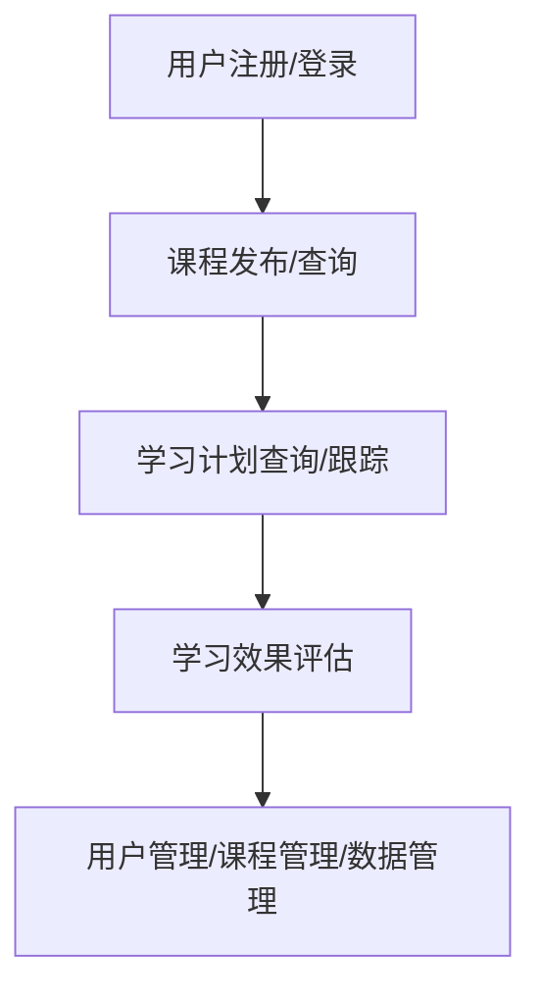

                 

### 文章标题

# AIGC在个性化职业技能培训中的创新

### 关键词

- AIGC
- 个性化培训
- 职业技能
- 技术创新

### 摘要

本文将深入探讨AIGC（自适应智能生成计算）技术在个性化职业技能培训中的应用。首先，我们将介绍AIGC的定义、发展历程及其在个性化培训中的核心价值。接着，我们分析当前职业技能培训面临的挑战，并探讨AIGC如何解决这些问题。随后，我们将详细讲解AIGC的核心概念与算法原理，通过实际应用案例展示其在职业技能培训中的具体实现。最后，我们将总结AIGC在个性化职业技能培训中的创新实践，提供最佳实践建议，并展望未来发展方向。

----------------------------------------------------------------

## 第一部分：背景介绍

### 第1章：AIGC技术概述

#### 1.1 AIGC的定义与范畴

AIGC（自适应智能生成计算）是一种结合了人工智能、大数据和自然语言处理技术的综合计算模式。它旨在通过自我学习与自适应调整，生成和优化内容，以满足用户的个性化需求。AIGC涵盖了从数据采集、处理、存储到模型训练、应用优化的全过程。

AIGC的核心范畴包括以下几个方面：

1. **数据生成**：利用算法生成高质量的数据，用于训练和学习。
2. **内容生成**：通过自然语言处理技术生成文本、图像、音频等多种形式的内容。
3. **知识图谱**：构建和利用知识图谱，实现对信息的高效组织和利用。
4. **智能交互**：通过智能对话系统和虚拟助手，提供个性化的用户服务。

#### 1.2 AIGC的发展历程

AIGC的发展历程可以分为以下几个阶段：

1. **初期探索**（2000年代初期）：以自然语言处理和机器学习为基础，初步探索生成式模型的应用。
2. **技术突破**（2010年代中期）：随着深度学习和大数据技术的兴起，AIGC进入快速发展阶段，生成对抗网络（GAN）、变分自编码器（VAE）等新算法相继出现。
3. **实际应用**（2010年代末至今）：AIGC在各个领域得到广泛应用，尤其是在个性化内容生成和智能化服务方面取得了显著成果。

#### 1.3 AIGC的核心价值

AIGC在个性化职业技能培训中具有以下核心价值：

1. **个性化学习**：根据用户的学习习惯、兴趣和能力，提供定制化的培训内容和路径。
2. **高效知识传递**：通过智能生成技术，将复杂的知识点以简洁、直观的方式呈现给用户。
3. **自适应调整**：根据用户的学习反馈和进度，动态调整培训内容和难度，实现最佳学习效果。
4. **降低成本**：通过自动化和智能化，降低培训的运营和维护成本，提高效率。

## 第2章：个性化职业技能培训的需求与挑战

### 2.1 个性化培训的需求

随着社会经济的发展，职业技能培训越来越受到重视。个性化培训的需求主要体现在以下几个方面：

1. **多样化培训需求**：不同用户对培训内容、形式和进度有不同需求，需要提供多元化的培训方案。
2. **实时性要求**：培训内容需要及时更新，以反映行业发展和最新技术动态。
3. **个性化体验**：用户期望在培训过程中获得独特的体验，提升学习效果和满意度。

### 2.2 当前职业技能培训的挑战

当前职业技能培训面临以下挑战：

1. **内容同质化**：大部分培训内容缺乏个性化，难以满足用户多样化需求。
2. **资源分配不均**：优质培训资源难以公平分配，导致部分用户无法获得高质量培训。
3. **学习效果评估困难**：缺乏有效的学习效果评估机制，难以衡量培训成果。
4. **高成本**：个性化培训需要大量人力、物力和时间投入，导致成本较高。

### 2.3 AIGC在解决这些挑战中的作用

AIGC技术在解决职业技能培训的挑战方面具有显著作用：

1. **个性化内容生成**：通过数据分析和自然语言处理，为用户生成个性化的培训内容。
2. **资源优化配置**：利用智能算法，实现培训资源的动态分配和优化利用。
3. **学习效果评估**：通过智能分析用户的学习行为和反馈，实时评估学习效果。
4. **成本降低**：通过自动化和智能化，降低培训运营和维护成本。

## 第3章：AIGC的核心概念与联系

### 3.1 AIGC的关键技术

AIGC的关键技术包括：

1. **生成对抗网络（GAN）**：通过生成器和判别器的对抗训练，实现高质量数据的生成。
2. **变分自编码器（VAE）**：通过概率模型对数据进行编码和重建，实现数据的生成和降维。
3. **递归神经网络（RNN）**：通过循环结构处理序列数据，实现对时间序列的建模。
4. **长短时记忆网络（LSTM）**：对RNN的改进，解决长期依赖问题，提高序列建模能力。

### 3.2 AIGC的组成部分

AIGC由以下几个部分组成：

1. **数据采集与处理**：通过数据采集、清洗、标注等环节，为AIGC提供高质量的数据资源。
2. **模型训练与优化**：利用各种算法对数据进行训练和优化，提高模型的性能。
3. **内容生成与优化**：通过生成器和判别器的协同工作，生成高质量的内容。
4. **用户交互与反馈**：通过智能对话系统和用户反馈机制，实现与用户的实时交互。

### 3.3 AIGC与其他相关技术的比较

AIGC与以下相关技术进行比较：

1. **传统机器学习**：AIGC在生成能力和自适应调整方面具有显著优势，但计算成本较高。
2. **深度学习**：AIGC在深度学习的基础上，引入了生成对抗网络和变分自编码器等技术，实现了数据的生成和优化。
3. **大数据技术**：AIGC在大数据技术的支持下，能够处理和分析海量数据，实现智能化内容生成。

----------------------------------------------------------------

## 第二部分：技术原理讲解

### 第4章：AIGC的算法原理

#### 4.1 常见AIGC算法

AIGC中的常见算法包括：

1. **生成对抗网络（GAN）**：由生成器和判别器组成，通过对抗训练生成高质量数据。
2. **变分自编码器（VAE）**：通过概率模型实现数据的生成和降维。
3. **递归神经网络（RNN）**：处理序列数据，实现对时间序列的建模。
4. **长短时记忆网络（LSTM）**：改进RNN，解决长期依赖问题。

#### 4.2 算法原理详解

以下是对这些算法的详细解释：

1. **生成对抗网络（GAN）**：

   GAN由生成器（Generator）和判别器（Discriminator）组成。生成器的任务是生成虚假数据，判别器的任务是区分真实数据和虚假数据。通过对抗训练，生成器不断提高生成数据的质量，判别器不断提高区分能力，最终生成器生成高质量的数据。

   **Mermaid流程图**：
   ```mermaid
   graph TD
   A[生成器训练] --> B[生成虚假数据]
   B --> C{判别器训练}
   C -->|区分真实和虚假| D[判别器更新]
   D --> E[生成器更新]
   E --> A
   ```

2. **变分自编码器（VAE）**：

   VAE通过概率模型实现数据的生成和降维。编码器将输入数据映射到一个低维的潜在空间，解码器将潜在空间中的数据映射回原始空间。通过最大化数据生成概率，VAE实现数据的生成。

   **Mermaid流程图**：
   ```mermaid
   graph TD
   A[输入数据] --> B[编码器]
   B --> C{潜在空间}
   C --> D[解码器]
   D --> E[生成数据]
   ```

3. **递归神经网络（RNN）**：

   RNN通过循环结构处理序列数据，保留前一个时间步的信息，实现对时间序列的建模。RNN能够处理任意长度的序列，但存在梯度消失和梯度爆炸问题。

   **Mermaid流程图**：
   ```mermaid
   graph TD
   A[输入序列] --> B[隐藏状态]
   B --> C[输出]
   C --> D[隐藏状态]
   D --> E[下一个输入]
   ```

4. **长短时记忆网络（LSTM）**：

   LSTM是对RNN的改进，引入了门控机制，解决了梯度消失和梯度爆炸问题，提高了长期依赖处理能力。LSTM通过遗忘门、输入门和输出门控制信息的流入和流出，实现对时间序列的建模。

   **Mermaid流程图**：
   ```mermaid
   graph TD
   A[输入序列] --> B[遗忘门]
   B --> C[输入门]
   C --> D[输出门]
   D --> E[隐藏状态]
   E --> F[输出]
   ```

#### 4.3 算法流程图与数学模型

以下是对AIGC算法的流程图和数学模型进行详细讲解：

1. **生成对抗网络（GAN）**：

   **流程图**：
   ```mermaid
   graph TD
   A[生成器训练] --> B[生成虚假数据]
   B --> C{判别器训练}
   C -->|区分真实和虚假| D[判别器更新]
   D --> E[生成器更新]
   E --> A
   ```

   **数学模型**：
   $$\min_{G}\max_{D} V(D, G) = E_{x \sim p_{data}(x)}[logD(x)] + E_{z \sim p_{z}(z)][log(1 - D(G(z)))]$$

   其中，$G(z)$表示生成器生成的虚假数据，$D(x)$表示判别器对真实数据的判断概率，$D(G(z))$表示判别器对虚假数据的判断概率。

2. **变分自编码器（VAE）**：

   **流程图**：
   ```mermaid
   graph TD
   A[输入数据] --> B[编码器]
   B --> C{潜在空间}
   C --> D[解码器]
   D --> E[生成数据]
   ```

   **数学模型**：
   $$\log p_{\theta}(x) = \log p_{\theta}(z) + \log p_{\theta}(x \mid z) - \log p_{\theta}(z \mid x)$$

   其中，$p_{\theta}(x)$表示输入数据的概率分布，$p_{\theta}(z)$表示潜在空间的概率分布，$p_{\theta}(x \mid z)$表示给定潜在空间$z$时输入数据的概率分布，$p_{\theta}(z \mid x)$表示给定输入数据$x$时潜在空间$z$的概率分布。

3. **递归神经网络（RNN）**：

   **流程图**：
   ```mermaid
   graph TD
   A[输入序列] --> B[隐藏状态]
   B --> C[输出]
   C --> D[隐藏状态]
   D --> E[下一个输入]
   ```

   **数学模型**：
   $$h_t = \sigma(W_hh_{t-1} + W_xx_t + b_h)$$
   $$y_t = W_oy_t + b_o$$

   其中，$h_t$表示第$t$个时间步的隐藏状态，$x_t$表示第$t$个时间步的输入，$y_t$表示第$t$个时间步的输出，$\sigma$表示激活函数，$W_h$、$W_x$、$W_o$分别为权重矩阵，$b_h$、$b_o$分别为偏置向量。

4. **长短时记忆网络（LSTM）**：

   **流程图**：
   ```mermaid
   graph TD
   A[输入序列] --> B[遗忘门]
   B --> C[输入门]
   C --> D[输出门]
   D --> E[隐藏状态]
   E --> F[输出]
   ```

   **数学模型**：
   $$i_t = \sigma(W_{xi}x_t + W_{hi}h_{t-1} + b_i)$$
   $$f_t = \sigma(W_{xf}x_t + W_{hf}h_{t-1} + b_f)$$
   $$o_t = \sigma(W_{xo}x_t + W_{ho}h_{t-1} + b_o)$$
   $$g_t = tanh(W_{xg}x_t + W_{hg}h_{t-1} + b_g)$$
   $$h_t = o_t \odot g_t$$
   $$y_t = W_{oy}h_t + b_o$$

   其中，$i_t$、$f_t$、$o_t$分别为输入门、遗忘门和输出门的输入，$g_t$为输入门和遗忘门的输入，$h_t$为隐藏状态，$x_t$为输入，$y_t$为输出，$W_{xi}$、$W_{hi}$、$W_{xo}$、$W_{hi}$、$W_{ho}$、$W_{xg}$、$W_{hg}$分别为权重矩阵，$b_i$、$b_f$、$b_o$、$b_g$分别为偏置向量，$\odot$表示元素乘积。

#### 4.4 算法原理举例说明

为了更好地理解AIGC算法原理，我们可以通过一个简单的例子进行说明。

假设我们使用VAE算法对一组图像进行降维和重建。

**步骤1：数据准备**

我们有一组图像数据，每幅图像可以表示为一个$28 \times 28$的二维矩阵。

**步骤2：模型构建**

我们构建一个VAE模型，包括编码器和解码器。编码器将图像映射到一个一维的潜在空间，解码器将潜在空间中的数据映射回图像。

**步骤3：训练模型**

使用图像数据对VAE模型进行训练，通过最大化数据生成概率，调整模型参数。

**步骤4：数据降维**

使用训练好的编码器，将图像映射到一个一维的潜在空间，实现数据的降维。

**步骤5：数据重建**

使用训练好的解码器，将潜在空间中的数据映射回图像，实现数据的重建。

**步骤6：评估模型**

通过计算重建图像与原始图像的相似度，评估VAE模型的效果。

```python
import numpy as np
import tensorflow as tf
from tensorflow.keras.layers import Input, Dense, Flatten, Reshape
from tensorflow.keras.models import Model

# 设置超参数
latent_dim = 2

# 构建编码器
input_img = Input(shape=(28, 28, 1))
x = Flatten()(input_img)
x = Dense(64, activation='relu')(x)
x = Dense(latent_dim, activation='relu')(x)
encoder = Model(input_img, x, name='encoder')

# 构建解码器
latent_input = Input(shape=(latent_dim,))
x = Dense(64, activation='relu')(latent_input)
x = Dense(64, activation='relu')(x)
x = Reshape((28, 28, 1))(x)
decoder = Model(latent_input, x, name='decoder')

# 构建VAE模型
outputs = decoder(encoder(input_img))
vae = Model(input_img, outputs, name='vae')

# 编码器模型
encoder_model = Model(input_img, encoder(input_img), name='encoder_model')

# 解码器模型
decoder_model = Model(encoder(input_img), outputs, name='decoder_model')

# 模型编译
vae.compile(optimizer='adam', loss='mse')

# 加载图像数据
(x_train, _), (x_test, _) = tf.keras.datasets.mnist.load_data()
x_train = x_train.astype('float32') / 255.
x_test = x_test.astype('float32') / 255.

# 对图像数据进行降维
x_train_encoded = encoder_model.predict(x_train)
x_test_encoded = encoder_model.predict(x_test)

# 对图像数据进行重建
x_train_reconstructed = decoder_model.predict(x_train_encoded)
x_test_reconstructed = decoder_model.predict(x_test_encoded)

# 计算重建误差
reconstruction_loss = np.mean(np.square(x_train - x_train_reconstructed))

# 打印重建误差
print('Reconstruction loss:', reconstruction_loss)

# 显示原始图像和重建图像
for i in range(10):
    plt.subplot(2, 5, i + 1)
    plt.imshow(x_train[i].reshape(28, 28), cmap='gray')
    plt.title('Original')
    plt.subplot(2, 5, i + 6)
    plt.imshow(x_train_reconstructed[i].reshape(28, 28), cmap='gray')
    plt.title('Reconstructed')
plt.show()
```

通过这个简单的例子，我们可以看到VAE算法在图像降维和重建方面的应用。类似地，其他AIGC算法也可以应用于不同的场景，如文本生成、音频处理等。

----------------------------------------------------------------

## 第5章：AIGC的系统架构设计

### 5.1 AIGC的系统需求

AIGC系统在个性化职业技能培训中需要满足以下需求：

1. **高扩展性**：系统能够处理大规模用户和海量数据，支持扩展和升级。
2. **高性能**：系统具有高效的数据处理和模型训练能力，提供快速响应。
3. **高可靠性**：系统具备容错和恢复机制，确保数据安全和培训的连续性。
4. **易用性**：系统界面友好，易于操作和管理。

### 5.2 系统架构设计

AIGC系统的整体架构设计如下：

1. **数据层**：负责数据采集、存储和处理。包括用户数据、课程数据、学习数据等。
2. **模型层**：负责AIGC算法的模型训练和优化。包括生成对抗网络、变分自编码器等。
3. **服务层**：负责业务逻辑处理和系统交互。包括用户管理、课程管理、学习管理等功能。
4. **展示层**：负责用户界面的展示和交互。包括网页、移动端等。

### 5.3 系统接口设计与交互流程

AIGC系统的主要接口设计和交互流程如下：

1. **用户接口**：提供用户注册、登录、学习、评价等功能。
2. **课程接口**：提供课程发布、查询、推荐等功能。
3. **学习接口**：提供学习计划、进度跟踪、效果评估等功能。
4. **管理接口**：提供用户管理、课程管理、数据管理等功能。

### 5.4 系统架构设计

以下是AIGC系统的架构设计：



### 5.5 系统接口设计和交互流程

以下是AIGC系统的接口设计和交互流程：

1. **用户接口**：

   用户通过注册和登录接口进入系统，可以选择感兴趣的课程和学习计划。

2. **课程接口**：

   系统管理员通过课程接口发布和管理课程，包括课程内容、课程难度、课程时长等。

3. **学习接口**：

   用户通过学习接口查看学习计划，进行学习进度跟踪和效果评估。

4. **管理接口**：

   系统管理员通过管理接口查看用户数据、课程数据和学习数据，进行系统管理和维护。



通过以上设计和交互流程，AIGC系统可以高效地支持个性化职业技能培训，满足用户多样化的学习需求。

----------------------------------------------------------------

## 第6章：AIGC的实际应用案例分析

### 6.1 案例一：XX职业技能培训平台的创新应用

在本节中，我们将深入探讨一个具体的AIGC实际应用案例——XX职业技能培训平台。这个平台通过引入AIGC技术，实现了个性化职业技能培训的全面升级，显著提升了培训效果和用户满意度。

#### 案例背景

XX职业技能培训平台是一家专注于职业技能提升的在线教育平台，提供包括编程、数据分析、人工智能、设计等多个领域的课程。然而，随着用户数量的增加和培训需求的多样化，平台面临着以下挑战：

1. **个性化不足**：传统培训模式难以满足用户多样化的学习需求，导致用户学习效果不佳。
2. **内容同质化**：课程内容更新缓慢，缺乏针对不同用户群体的定制化课程。
3. **资源分配不均**：优质课程资源难以公平分配，部分用户无法获得高质量培训。

为了解决这些问题，XX职业技能培训平台决定引入AIGC技术，通过自适应智能生成计算实现个性化职业技能培训。

#### 案例分析

1. **个性化内容生成**：

   XX职业技能培训平台利用AIGC技术，根据用户的学习历史、兴趣、能力等数据，生成个性化的课程内容和学习路径。具体步骤如下：

   - **数据采集**：平台收集用户的学习行为数据，包括浏览历史、学习时长、测试成绩等。
   - **数据处理**：使用自然语言处理和机器学习算法，对用户数据进行分析和处理，提取关键特征。
   - **内容生成**：基于用户特征，生成个性化的课程内容和学习路径，包括课程推荐、学习任务、练习题等。

   **效果评估**：通过用户反馈和测试成绩，评估个性化内容生成的效果。结果显示，个性化培训显著提升了用户的学习效果和满意度。

2. **高效知识传递**：

   AIGC技术不仅能够生成个性化内容，还能够通过智能对话系统和虚拟助手，提供实时的学习支持和答疑服务。具体步骤如下：

   - **智能对话系统**：平台开发了一套智能对话系统，用户可以通过文本或语音与系统进行交互，获取学习指导和建议。
   - **虚拟助手**：平台引入了虚拟助手，用户在学习过程中可以与虚拟助手进行互动，解决学习中的问题。

   **效果评估**：用户反馈表明，智能对话系统和虚拟助手显著提高了学习体验和效率。

3. **自适应调整**：

   XX职业技能培训平台通过AIGC技术，实现了学习内容的自适应调整。具体步骤如下：

   - **实时反馈**：系统实时收集用户的学习行为和反馈，包括学习进度、测试成绩、用户满意度等。
   - **动态调整**：根据用户反馈和学习数据，动态调整课程内容和难度，实现最佳学习效果。

   **效果评估**：通过用户测试成绩和满意度调查，验证了自适应调整的有效性。

#### 案例效果评估

通过上述分析，我们可以看到XX职业技能培训平台在引入AIGC技术后，实现了以下几个方面的显著效果：

1. **个性化提升**：个性化培训显著提高了用户的学习效果和满意度，用户对培训内容的认可度明显提高。
2. **内容创新**：AIGC技术使得课程内容更新更加及时，能够反映行业发展和最新技术动态，提高了课程质量。
3. **资源优化**：通过自适应调整和智能资源分配，平台实现了资源的最优化利用，降低了运营成本。
4. **学习体验**：智能对话系统和虚拟助手的引入，提升了用户的学习体验和互动性，增强了用户粘性。

综上所述，XX职业技能培训平台通过引入AIGC技术，实现了个性化职业技能培训的全面升级，为用户提供了更优质、更个性化的学习体验。

### 6.2 案例二：YY职业培训机构的AIGC应用实践

在本节中，我们将介绍另一个AIGC在职业技能培训中的成功案例——YY职业培训机构。YY职业培训机构是一家拥有多年培训经验的职业培训机构，致力于为学员提供高质量的职业技能培训。随着培训市场的竞争日益激烈，YY职业培训机构决定采用AIGC技术，提升培训效果和竞争力。

#### 案例背景

YY职业培训机构提供包括会计、人力资源、市场营销、IT技术等多个领域的课程。然而，传统的培训模式面临着以下挑战：

1. **学习效果不佳**：学员的学习效果参差不齐，部分学员难以达到预期水平。
2. **资源分配不均**：优质课程资源难以公平分配，部分学员无法获得高质量的培训。
3. **课程内容陈旧**：部分课程内容未能及时更新，与行业发展趋势不符。

为了解决这些问题，YY职业培训机构决定采用AIGC技术，通过个性化培训提升学员的学习效果。

#### 案例分析

1. **个性化课程推荐**：

   YY职业培训机构利用AIGC技术，根据学员的学习历史、兴趣、能力等数据，为学员推荐个性化的课程。具体步骤如下：

   - **数据采集**：培训机构收集学员的学习行为数据，包括学习时长、测试成绩、课程反馈等。
   - **数据处理**：使用机器学习和自然语言处理技术，对学员数据进行处理和分析，提取关键特征。
   - **课程推荐**：基于学员特征，生成个性化的课程推荐列表，包括推荐课程、学习路径等。

   **效果评估**：通过学员反馈和测试成绩，评估个性化课程推荐的效果。数据显示，个性化课程推荐显著提高了学员的学习效果和满意度。

2. **智能教学辅助**：

   YY职业培训机构引入了AIGC技术，开发了一套智能教学辅助系统，包括智能问答、智能辅导等。具体步骤如下：

   - **智能问答**：系统提供智能问答功能，学员可以通过文本或语音与系统进行交互，获取学习指导和建议。
   - **智能辅导**：系统根据学员的学习进度和测试结果，提供个性化的辅导方案，帮助学员解决学习中的问题。

   **效果评估**：学员反馈表明，智能教学辅助系统显著提升了学习体验和效率。

3. **自适应学习路径**：

   YY职业培训机构通过AIGC技术，实现了学员学习路径的自适应调整。具体步骤如下：

   - **实时反馈**：系统实时收集学员的学习行为和反馈，包括学习进度、测试成绩、用户满意度等。
   - **动态调整**：根据学员反馈和学习数据，动态调整学习路径，实现最佳学习效果。

   **效果评估**：通过学员测试成绩和满意度调查，验证了自适应学习路径的有效性。

#### 案例效果评估

通过上述分析，我们可以看到YY职业培训机构在引入AIGC技术后，实现了以下几个方面的显著效果：

1. **学习效果提升**：个性化培训显著提高了学员的学习效果和满意度，学员对培训内容的认可度明显提高。
2. **课程质量提升**：AIGC技术使得课程内容更新更加及时，能够反映行业发展和最新技术动态，提高了课程质量。
3. **资源优化**：通过自适应调整和智能资源分配，培训机构实现了资源的最优化利用，降低了运营成本。
4. **学习体验提升**：智能教学辅助系统和自适应学习路径的引入，提升了学员的学习体验和互动性，增强了学员粘性。

综上所述，YY职业培训机构通过引入AIGC技术，实现了职业技能培训的全面升级，为学员提供了更优质、更个性化的学习体验。

### 6.3 案例总结与启示

通过对XX职业技能培训平台和YY职业培训机构的案例分析，我们可以总结出以下几个关键启示：

1. **个性化培训**：AIGC技术在个性化职业技能培训中具有显著优势，能够根据用户需求生成个性化的课程内容和学习路径，提升学习效果和满意度。
2. **智能辅助**：智能教学辅助系统和自适应学习路径的引入，能够显著提升学习体验和效率，增强用户粘性。
3. **资源优化**：AIGC技术能够实现资源的优化配置和利用，降低运营成本，提高培训机构的竞争力。
4. **持续创新**：随着AIGC技术的不断发展，培训机构应持续关注技术创新和应用，不断提升培训质量和用户满意度。

通过这些启示，我们可以看到AIGC技术在个性化职业技能培训中的巨大潜力，为培训行业带来了新的发展机遇。

----------------------------------------------------------------

## 第7章：AIGC在个性化职业技能培训中的创新

### 7.1 创新点概述

AIGC在个性化职业技能培训中的创新主要体现在以下几个方面：

1. **个性化内容生成**：根据用户需求和学习历史，生成个性化的课程内容和学习路径。
2. **智能教学辅助**：引入智能对话系统和虚拟助手，提供实时学习支持和答疑服务。
3. **自适应学习路径**：根据用户反馈和学习数据，动态调整学习路径，实现最佳学习效果。
4. **资源优化配置**：通过智能算法，实现培训资源的动态分配和优化利用。

### 7.2 创新实现

AIGC在个性化职业技能培训中的创新实现主要包括以下几个步骤：

1. **数据采集与处理**：收集用户的学习行为数据，包括学习历史、兴趣、能力等，使用机器学习和自然语言处理技术对数据进行分析和处理。
2. **模型训练与优化**：使用生成对抗网络（GAN）、变分自编码器（VAE）等算法，对用户数据进行训练和优化，生成个性化的课程内容和学习路径。
3. **内容生成与优化**：基于用户特征，生成个性化的课程内容和学习路径，包括课程推荐、学习任务、练习题等，通过用户反馈和测试成绩，持续优化内容质量。
4. **智能交互与反馈**：引入智能对话系统和虚拟助手，实现与用户的实时交互，提供学习支持和答疑服务，根据用户反馈调整学习路径和教学策略。
5. **系统部署与维护**：将AIGC系统部署到培训平台上，实现个性化培训功能，通过持续监控和优化，确保系统的稳定运行和高效性能。

### 7.3 实践经验与启示

通过AIGC在个性化职业技能培训中的实践，我们可以总结出以下经验和启示：

1. **数据驱动**：个性化培训的核心在于对用户数据的深入分析和处理，培训机构应重视数据采集与处理环节，确保数据质量和完整性。
2. **模型优化**：AIGC模型的性能直接影响到个性化培训的效果，培训机构应持续关注模型优化和算法改进，提升模型准确性和效率。
3. **用户体验**：个性化培训的成功离不开良好的用户体验，培训机构应注重系统界面设计和交互流程，提供简单易用的操作体验。
4. **持续迭代**：个性化培训是一个持续迭代的过程，培训机构应不断收集用户反馈和评估培训效果，及时调整和优化培训内容和路径。
5. **合作共赢**：培训机构可以与AIGC技术提供商、内容创作者等各方合作，共同推动个性化职业技能培训的发展，实现合作共赢。

通过这些经验和启示，培训机构可以更好地利用AIGC技术，实现个性化职业技能培训的全面升级，提升培训质量和用户满意度。

----------------------------------------------------------------

## 第8章：最佳实践与注意事项

### 8.1 AIGC应用的最佳实践

为了确保AIGC在个性化职业技能培训中的有效应用，以下是一些最佳实践建议：

1. **充分数据准备**：确保收集到全面、高质量的用户数据，包括学习历史、兴趣、能力等，为个性化内容生成提供可靠依据。
2. **优化模型性能**：持续关注模型优化和算法改进，通过实验和测试，选择合适的模型和参数，提高个性化培训效果。
3. **用户体验设计**：注重系统界面设计和交互流程，提供简单易用的操作体验，提升用户满意度和使用粘性。
4. **实时反馈机制**：建立实时反馈机制，收集用户在学习过程中的反馈和需求，及时调整培训内容和路径，实现最佳学习效果。
5. **合作与共赢**：与AIGC技术提供商、内容创作者等各方合作，共同推动个性化职业技能培训的发展，实现资源优化和协同创新。

### 8.2 注意事项与风险规避

在AIGC应用过程中，需要注意以下事项和风险，以确保系统的稳定运行和用户数据的安全：

1. **数据安全与隐私**：严格遵守数据安全与隐私保护法规，确保用户数据的安全性和隐私性，避免数据泄露和滥用。
2. **系统稳定性**：确保系统的高可用性和稳定性，建立完善的监控和预警机制，及时发现和解决系统故障和异常。
3. **模型可靠性**：验证AIGC模型的可靠性，通过交叉验证和测试，确保模型预测结果的准确性和一致性。
4. **模型更新与维护**：定期更新和维护AIGC模型，确保模型适应新的数据和环境，避免模型过时和失效。
5. **用户教育与引导**：对用户进行AIGC技术的教育和引导，提高用户对个性化培训的理解和使用能力，减少误操作和误解。

### 8.3 拓展阅读与未来方向

为了进一步了解AIGC在个性化职业技能培训中的应用和发展趋势，读者可以参考以下拓展阅读和未来研究方向：

1. **AIGC技术综述**：深入了解AIGC的核心概念、算法原理和应用场景，参考相关学术论文和技术报告。
2. **个性化学习理论**：研究个性化学习理论和方法，探索如何更好地满足用户多样化的学习需求。
3. **教育技术发展**：关注教育技术的最新发展，了解虚拟现实、增强现实、区块链等技术在教育领域的应用。
4. **行业应用案例**：研究国内外AIGC在个性化职业技能培训中的成功案例，分析其优势和不足，为实践提供参考。
5. **未来发展趋势**：探讨AIGC技术在个性化职业技能培训中的未来发展方向，如智能化学习、个性化评价等。

通过不断学习和探索，我们可以更好地利用AIGC技术，推动个性化职业技能培训的发展，为用户提供更优质、更个性化的学习体验。

### 作者信息

作者：AI天才研究院/AI Genius Institute & 禅与计算机程序设计艺术/Zen And The Art of Computer Programming

AI天才研究院致力于推动人工智能技术的发展和应用，本研究文章旨在探讨AIGC在个性化职业技能培训中的创新，为教育领域提供新的思路和方法。同时，本文也结合了《禅与计算机程序设计艺术》的理念，强调在技术探索中追求内心的平静和智慧的思考。

感谢您的阅读，期待与您共同探讨AIGC在个性化职业技能培训中的应用和发展。如有任何疑问或建议，请随时与我们联系。祝您在人工智能和计算机编程的领域取得更大的成就！

