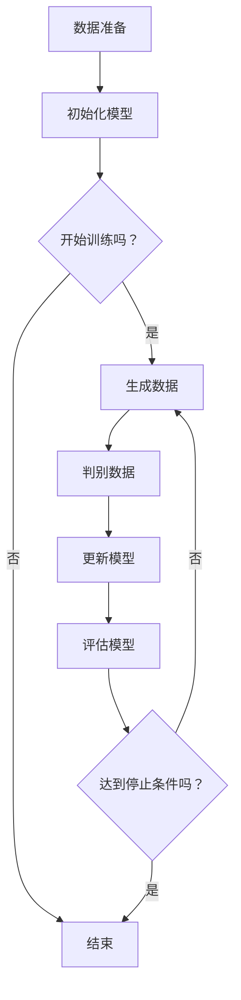
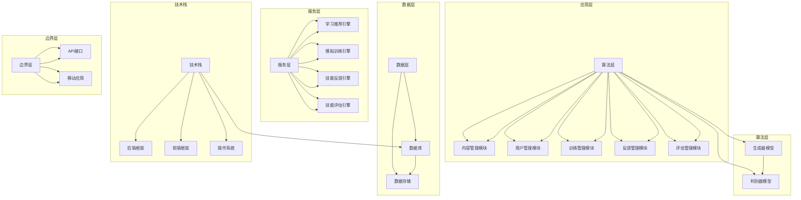
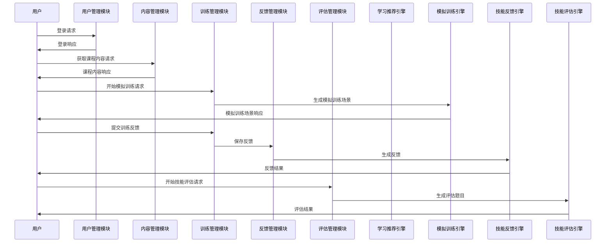

                 

## 引言

### 1.1 问题背景

#### 1.1.1 人工智能与技能提升

随着科技的飞速发展，人工智能（Artificial Intelligence，简称AI）已经成为现代社会的重要组成部分。人工智能不仅改变了我们的生活方式，也在各行各业中发挥着重要作用。在职业技能提升方面，人工智能技术的应用越来越广泛，成为推动职业发展和技能提升的重要力量。

职业技能提升是一个长期且持续的过程，涉及学习、实践、反馈和再学习等多个环节。传统的技能提升方法，如参加培训课程、阅读专业书籍、参与项目实践等，虽然在一定程度上能够提升技能水平，但往往存在以下局限性：

1. **缺乏个性化**：传统方法难以根据个体的实际需求和特点进行个性化定制，导致学习效果不佳。
2. **资源有限**：专业知识和技能的获取需要大量的时间和精力，且资源有限。
3. **反馈滞后**：技能提升过程中，个体难以及时获得有效的反馈，影响学习效率。

#### 1.1.2 个性化技能提升的需求

随着社会的发展和职业的多元化，个性化技能提升的需求日益凸显。不同个体在技能提升过程中有着不同的需求，如学习目标、兴趣爱好、学习方式等。因此，为了更好地满足个性化需求，提升技能效果，我们需要一种新的方法，能够根据个体特点进行个性化推荐和指导。

个性化技能提升不仅有助于提高学习效率，还能激发个体的学习兴趣和主动性，从而在较短时间内实现技能的快速提升。因此，研究如何利用人工智能技术实现个性化技能提升具有重要的现实意义。

#### 1.1.3 AIGC技术的潜力

生成式人工智能（AIGC，Generative Artificial Intelligence）是近年来兴起的一种人工智能技术，具有强大的生成能力和自适应能力。AIGC技术在个性化技能提升中的应用潜力主要体现在以下几个方面：

1. **个性化推荐**：AIGC能够根据个体的学习历史、兴趣爱好、学习需求等，生成个性化的学习内容和资源，提高学习效果。
2. **自适应学习**：AIGC系统能够实时监控学习过程，根据学习效果和学习进度自动调整学习策略，实现个性化的学习体验。
3. **生成模拟场景**：AIGC能够生成各种模拟场景，帮助个体在实际应用中更好地理解和掌握技能。

综上所述，AIGC技术在个性化职业技能提升中的应用具有很大的潜力。接下来，我们将深入探讨AIGC技术的基本原理、应用方法及其在技能提升中的独特优势。

## AIGC在技能提升中的独特优势

### 1.2.1 传统技能提升方法的局限性

传统的技能提升方法主要包括参加培训课程、阅读专业书籍、参与项目实践等。这些方法在某种程度上确实能够帮助个体提升技能水平，但它们也存在一些显著的局限性：

1. **缺乏个性化**：传统方法难以根据个体的实际需求和特点进行个性化定制，导致学习效果不佳。例如，统一的培训课程无法满足不同学习者的学习节奏和兴趣点，可能导致学习积极性下降。
2. **资源有限**：专业知识和技能的获取需要大量的时间和精力，且资源有限。个体在学习过程中可能面临时间不足、资源匮乏等问题，影响学习效果。
3. **反馈滞后**：技能提升过程中，个体难以及时获得有效的反馈，影响学习效率。例如，项目实践中的错误往往需要较长时间才能被发现和纠正，导致学习效率低下。

#### 1.2.2 AIGC在技能提升中的独特优势

与传统的技能提升方法相比，AIGC技术在以下几个方面具有独特的优势，能够更好地满足个性化技能提升的需求：

1. **个性化推荐**：AIGC能够根据个体的学习历史、兴趣爱好、学习需求等，生成个性化的学习内容和资源，提高学习效果。例如，AIGC系统可以分析用户的学习轨迹，推荐符合其兴趣和需求的学习资源，从而提高学习积极性。
   
2. **自适应学习**：AIGC系统能够实时监控学习过程，根据学习效果和学习进度自动调整学习策略，实现个性化的学习体验。例如，当用户在某个知识点上多次出现错误时，AIGC系统可以自动调整学习内容，提供更有针对性的练习和辅导。
   
3. **生成模拟场景**：AIGC能够生成各种模拟场景，帮助个体在实际应用中更好地理解和掌握技能。例如，通过AIGC技术，可以生成虚拟的编程环境，让用户在实际编写代码之前进行练习，从而降低错误率，提高编程技能。

4. **实时反馈**：AIGC系统能够在用户学习过程中提供实时反馈，帮助用户快速发现和纠正错误。例如，用户在完成编程练习后，AIGC系统可以立即分析代码，指出错误并提供修正建议，从而提高学习效率。

综上所述，AIGC技术在个性化职业技能提升中具有显著的优势。接下来，我们将详细探讨AIGC技术的基本原理、应用方法及其在技能提升中的实际应用。

### 1.3 问题解决

#### 1.3.1 AIGC技术概述

生成式人工智能（AIGC，Generative Artificial Intelligence）是一种利用深度学习、自然语言处理等技术生成文本、图像、音频等数据的人工智能技术。AIGC的核心思想是通过学习和模仿大量真实数据，生成具有较高质量和创意的新数据。

AIGC技术主要包括以下几种类型：

1. **生成对抗网络（GAN）**：GAN是一种通过对抗训练生成逼真图像的技术。它由生成器（Generator）和判别器（Discriminator）组成，生成器试图生成逼真的图像，而判别器则试图区分生成图像和真实图像。通过不断优化，生成器能够生成越来越逼真的图像。

2. **变分自编码器（VAE）**：VAE是一种基于概率模型的生成模型。它通过编码器（Encoder）将输入数据映射到一个低维空间，然后通过解码器（Decoder）将低维数据映射回原始数据。VAE能够在保持数据分布不变的情况下生成新数据。

3. **递归神经网络（RNN）**：RNN是一种适用于序列数据的神经网络，能够处理长短时依赖关系。RNN通过循环结构将当前输入与之前的隐藏状态结合，生成新的隐藏状态，从而实现对序列数据的生成。

#### 1.3.2 AIGC在技能提升中的应用

AIGC技术在个性化职业技能提升中具有广泛的应用前景。以下是一些典型应用场景：

1. **个性化学习内容生成**：AIGC可以根据用户的学习历史、兴趣爱好、学习需求等，生成个性化的学习内容和资源。例如，在教育领域，AIGC可以生成符合学生特点和需求的课件、练习题和教程。

2. **虚拟仿真训练**：AIGC可以生成各种虚拟仿真场景，帮助用户在实际应用中更好地理解和掌握技能。例如，在医疗领域，AIGC可以生成虚拟的患者病例，让医生进行诊断和治疗练习。

3. **实时反馈与指导**：AIGC可以在用户学习过程中提供实时反馈和指导，帮助用户快速发现和纠正错误。例如，在编程领域，AIGC可以分析用户的代码，提供即时错误提示和修正建议。

4. **技能评估与测试**：AIGC可以生成各种技能测试题目，对用户进行技能评估。例如，在职业考试领域，AIGC可以生成符合考试要求的模拟试题，帮助用户进行备考和自我评估。

通过上述应用，AIGC技术能够显著提高个性化职业技能提升的效率和质量，为个体提供更加定制化的学习体验和技能提升方案。

### 1.4 边界与外延

#### 1.4.1 AIGC技术的适用范围

AIGC技术在个性化职业技能提升中具有广泛的应用前景，但其适用范围也有一定的限制。以下是一些主要考虑因素：

1. **数据需求**：AIGC技术依赖于大量的高质量数据作为训练基础。因此，应用场景中需要具备充足的数据资源，尤其是具有多样性和代表性的数据集。

2. **计算资源**：AIGC模型的训练和推理过程需要大量的计算资源，包括GPU、CPU等硬件资源。在资源有限的情况下，应用AIGC技术可能会面临性能瓶颈。

3. **技术成熟度**：尽管AIGC技术在不断发展，但在某些领域的技术成熟度还不够高，可能存在一些未知的技术挑战和风险。例如，在医疗领域，AIGC技术的应用需要确保生成结果的安全性和可靠性。

4. **隐私与伦理问题**：AIGC技术在处理用户数据时，需要考虑隐私保护和伦理问题。在个性化技能提升过程中，用户的学习数据和隐私信息可能被泄露，引发隐私风险和伦理争议。

因此，在实际应用中，需要综合考虑AIGC技术的适用范围和限制因素，确保其能够在安全和合规的前提下发挥最大效益。

#### 1.4.2 技能提升中的伦理问题

在个性化职业技能提升过程中，AIGC技术的应用不仅面临技术挑战，还涉及一系列伦理问题。以下是一些主要考虑因素：

1. **数据隐私**：AIGC技术在处理用户数据时，可能涉及个人隐私信息的收集和使用。在数据收集、存储、处理和共享过程中，需要确保用户隐私得到充分保护，避免数据泄露和滥用。

2. **算法透明性**：AIGC系统通常采用复杂的深度学习模型，其决策过程和生成结果可能不透明。为了提高算法的透明性，需要开发可解释的AIGC模型，让用户了解和学习算法的工作原理。

3. **公平性**：AIGC技术在个性化技能提升中可能会产生“算法偏见”，导致某些用户群体受到不公平待遇。例如，如果AIGC系统基于历史数据生成推荐内容，可能会放大某些群体的优势或劣势。因此，需要确保算法的公平性和无歧视性。

4. **责任归属**：在AIGC系统中，生成内容和结果可能涉及多个参与者，如用户、数据提供方、算法开发者等。当出现问题时，需要明确责任归属，确保各方承担相应的责任。

综上所述，个性化职业技能提升中的伦理问题需要引起重视。在AIGC技术的应用过程中，需要制定相应的伦理规范和标准，确保其应用的安全性和合规性。

### 1.5 概念结构与核心要素

#### 1.5.1 AIGC核心概念解析

生成式人工智能（AIGC，Generative Artificial Intelligence）是一种能够生成各种类型数据的人工智能技术。其核心概念包括以下几个方面：

1. **生成模型（Generator）**：生成模型是AIGC系统的核心组件，负责生成新数据。常见的生成模型包括生成对抗网络（GAN）、变分自编码器（VAE）等。

2. **判别模型（Discriminator）**：判别模型用于区分生成数据和真实数据，通常与生成模型配合使用。在生成对抗网络（GAN）中，判别模型是一个重要的组成部分。

3. **损失函数（Loss Function）**：损失函数用于衡量生成模型和判别模型在训练过程中的性能。通过优化损失函数，生成模型和判别模型可以不断提高生成数据和真实数据的相似度。

4. **数据增强（Data Augmentation）**：数据增强是一种通过人工方法增加数据多样性的技术。在AIGC系统中，数据增强可以帮助生成模型学习到更丰富的特征，提高生成数据的质量。

5. **多样性（Diversity）**：AIGC系统需要生成多样化的数据，以满足不同用户的需求。多样性是评估AIGC系统性能的重要指标。

#### 1.5.2 技能提升中的关键因素

在个性化职业技能提升过程中，AIGC技术的应用需要考虑多个关键因素，以确保技能提升的效果和效率。以下是一些主要因素：

1. **用户需求**：了解用户的学习目标、兴趣爱好、学习习惯等，是AIGC系统生成个性化学习内容的基础。

2. **数据质量**：AIGC系统的性能高度依赖于训练数据的质量。高质量的数据有助于生成模型学习到更准确的特征，提高生成数据的质量。

3. **算法优化**：通过优化生成模型和判别模型的参数，可以提高AIGC系统的性能和效果。算法优化是AIGC技术在实际应用中不可或缺的一环。

4. **交互体验**：AIGC系统需要提供良好的用户交互体验，包括实时反馈、个性化推荐等，以提高用户的学习积极性和参与度。

5. **系统安全性**：在AIGC系统的设计和实现过程中，需要确保用户数据的安全性和隐私保护，防止数据泄露和滥用。

#### 1.5.3 AIGC与技能提升的关联

AIGC技术通过生成个性化学习内容和虚拟仿真场景，与技能提升密切相关。以下是AIGC技术在技能提升中的具体应用：

1. **个性化学习内容生成**：AIGC系统可以根据用户需求生成定制化的学习内容，包括教程、练习题、项目案例等，满足不同学习者的个性化需求。

2. **虚拟仿真训练**：通过生成虚拟仿真场景，用户可以在安全、可控的环境中练习技能，降低实际应用中的风险和成本。

3. **实时反馈与指导**：AIGC系统可以实时分析用户的学习过程，提供个性化的反馈和指导，帮助用户快速发现和纠正错误。

4. **技能评估与测试**：AIGC系统可以生成各种技能测试题目，对用户进行技能评估，帮助用户了解自己的技能水平，并进行有针对性的提升。

综上所述，AIGC技术在个性化职业技能提升中具有重要的应用价值，通过生成个性化学习内容、虚拟仿真训练、实时反馈与指导等，为个体提供更加高效和个性化的学习体验。

### 1.6 本章小结

本章主要介绍了AIGC技术在个性化职业技能提升中的应用。首先，我们分析了人工智能与技能提升的背景和需求，指出传统技能提升方法的局限性。然后，我们探讨了AIGC技术的核心概念和应用优势，包括个性化推荐、自适应学习、虚拟仿真训练和实时反馈等。接着，我们讨论了AIGC技术的适用范围和伦理问题，强调了数据隐私、算法透明性、公平性和责任归属等方面的考虑。最后，我们分析了AIGC与技能提升的关联，并总结了AIGC技术在个性化职业技能提升中的具体应用。通过本章的介绍，我们为后续章节的深入探讨奠定了基础。

## 第二部分：核心概念与联系

### 2.1 AIGC核心概念原理

生成式人工智能（AIGC，Generative Artificial Intelligence）作为一种新兴的人工智能技术，其在计算机科学和人工智能领域具有重要的地位。AIGC技术通过学习和模仿大量真实数据，生成具有高度逼真度和创意性的新数据，广泛应用于图像、文本、音频等多个领域。下面，我们将详细探讨AIGC的核心概念及其工作原理。

#### 2.1.1 AIGC的定义

AIGC，即生成式人工智能，是指一类能够通过学习大量数据生成新数据的人工智能系统。与传统的判别式人工智能（Discriminative Artificial Intelligence）不同，AIGC不仅能够识别和分类数据，还能生成新的数据。AIGC的核心任务是生成与训练数据具有相似特征的新数据，这种能力在图像、视频、音频、文本等领域具有广泛的应用。

#### 2.1.2 AIGC的关键特征

AIGC技术具有以下关键特征：

1. **生成能力**：AIGC能够根据已有的数据生成新的数据，这种生成能力是AIGC技术的核心。通过学习大量真实数据，AIGC系统可以生成与训练数据高度相似的新数据。

2. **自适应能力**：AIGC系统具有自适应能力，可以根据不同的数据集和任务需求，自动调整生成策略，生成满足特定需求的新数据。

3. **多样性**：AIGC系统能够生成多样化的数据，满足不同用户和场景的需求。多样性是评估AIGC系统性能的重要指标。

4. **灵活性**：AIGC技术具有很高的灵活性，可以应用于多个领域，如图像、视频、音频、文本等，具有广泛的应用前景。

#### 2.1.3 AIGC的技术体系

AIGC技术体系主要包括以下几种模型：

1. **生成对抗网络（GAN）**：生成对抗网络（GAN）是AIGC技术中最具代表性的模型之一。GAN由生成器和判别器组成，生成器生成假数据，判别器判断生成数据与真实数据的区别。通过对抗训练，生成器不断提高生成数据的质量，达到以假乱真的效果。

2. **变分自编码器（VAE）**：变分自编码器（VAE）是一种基于概率模型的生成模型。VAE通过编码器将输入数据映射到一个低维空间，然后通过解码器将低维数据映射回原始数据。VAE在保持数据分布不变的情况下生成新数据。

3. **递归神经网络（RNN）**：递归神经网络（RNN）是一种适用于序列数据的神经网络。RNN通过循环结构将当前输入与之前的隐藏状态结合，生成新的隐藏状态，从而实现对序列数据的生成。

4. **变分递归自编码器（VRNN）**：变分递归自编码器（VRNN）是RNN和VAE的结合，能够生成具有时间序列特性的数据，如视频和音频。

#### 2.1.4 AIGC的应用场景

AIGC技术在多个领域具有广泛的应用，包括但不限于以下几个方面：

1. **图像生成**：AIGC技术可以生成高质量的图像，应用于艺术创作、游戏设计、虚拟现实等领域。

2. **文本生成**：AIGC技术可以生成高质量的文本，应用于自然语言处理、机器翻译、文本生成等领域。

3. **音频生成**：AIGC技术可以生成高质量的音频，应用于音乐创作、语音合成、音频处理等领域。

4. **视频生成**：AIGC技术可以生成高质量的视频，应用于影视制作、视频增强、虚拟现实等领域。

5. **数据增强**：AIGC技术可以用于数据增强，提高模型在训练过程中的性能。数据增强是AIGC技术在计算机视觉、自然语言处理等领域的常见应用。

综上所述，AIGC技术作为一种生成式人工智能，具有强大的生成能力和自适应能力。其技术体系包括生成对抗网络（GAN）、变分自编码器（VAE）、递归神经网络（RNN）等多种模型，广泛应用于图像、文本、音频等多个领域。在个性化职业技能提升中，AIGC技术可以通过生成个性化学习内容、虚拟仿真训练、实时反馈与指导等，为个体提供更加高效和个性化的学习体验。接下来，我们将进一步探讨AIGC技术的概念属性特征对比表格和ER实体关系图架构，以更深入地理解AIGC技术的应用。

### 2.2 概念属性特征对比表格

在深入理解AIGC技术的基础上，为了更好地掌握其与相关技术的异同，我们通过一个对比表格，详细列出AIGC技术与其他相关技术的概念属性特征。以下是几个典型的相关技术：生成对抗网络（GAN）、变分自编码器（VAE）、递归神经网络（RNN）。

| 技术名称 | 定义 | 特点 | 适用领域 | 优缺点 |
| :---: | :---: | :---: | :---: | :---: |
| AIGC（生成式人工智能） | 通过学习和模仿大量真实数据生成新数据 | 生成能力、自适应能力、多样性、灵活性 | 图像、文本、音频、视频等多个领域 | 数据需求高、计算资源需求大、算法复杂 |
| GAN（生成对抗网络） | 由生成器和判别器组成，对抗训练生成高质量数据 | 对抗训练、生成能力、多样性 | 图像生成、视频生成、数据增强 | 计算资源需求大、训练过程复杂 |
| VAE（变分自编码器） | 基于概率模型，通过编码器和解码器生成数据 | 概率模型、生成能力、数据增强 | 图像生成、图像分类、数据增强 | 计算资源需求较低、生成数据质量较高 |
| RNN（递归神经网络） | 适用于序列数据，通过循环结构处理数据 | 长短时依赖、生成能力、自适应能力 | 文本生成、语音合成、序列数据处理 | 计算资源需求较高、训练过程复杂 |

通过上述对比表格，我们可以清晰地看到AIGC技术与其他相关技术之间的联系和差异。以下是对这些技术的简要总结：

1. **AIGC**：具有强大的生成能力和自适应能力，广泛应用于多个领域，但需要大量的数据资源和计算资源，算法复杂度高。

2. **GAN**：通过生成器和判别器的对抗训练生成高质量数据，适用于图像、视频等领域，计算资源需求大。

3. **VAE**：基于概率模型，生成能力较强，适用于图像生成、图像分类等领域，计算资源需求较低。

4. **RNN**：适用于序列数据处理，生成能力和自适应能力显著，适用于文本生成、语音合成等领域。

### 2.2.2 AIGC在不同应用领域的特点

AIGC技术因其独特的生成能力和自适应能力，在不同应用领域表现出不同的特点。以下是AIGC在图像、文本、音频、视频等领域的应用特点：

1. **图像领域**：
   - **特点**：AIGC可以生成高质量、多样化的图像，适用于艺术创作、游戏设计、虚拟现实等领域。
   - **优势**：能够生成与现实世界相似的图像，提高视觉体验。
   - **挑战**：需要大量高质量训练数据，计算资源需求大。

2. **文本领域**：
   - **特点**：AIGC可以生成高质量、连贯的文本，适用于自然语言处理、机器翻译、文本生成等领域。
   - **优势**：能够生成具有多样性和创意性的文本，提高文本生成质量。
   - **挑战**：需要大量高质量语料库，训练和推理过程复杂。

3. **音频领域**：
   - **特点**：AIGC可以生成高质量、自然的音频，适用于音乐创作、语音合成、音频处理等领域。
   - **优势**：能够生成具有多样性和自然性的音频，提高音频生成质量。
   - **挑战**：需要大量高质量音频数据，计算资源需求高。

4. **视频领域**：
   - **特点**：AIGC可以生成高质量、连贯的视频，适用于影视制作、视频增强、虚拟现实等领域。
   - **优势**：能够生成与训练数据高度相似的虚拟视频，提高视觉体验。
   - **挑战**：需要大量高质量视频数据，计算资源需求极大。

通过以上分析，我们可以看到AIGC技术在不同应用领域的独特优势和面临的挑战。在个性化职业技能提升中，AIGC技术可以通过生成个性化学习内容、虚拟仿真训练、实时反馈与指导等，为个体提供更加高效和个性化的学习体验。接下来，我们将进一步探讨AIGC系统的实体关系及其主要组件。

### 2.3 ER实体关系图架构

为了更深入地理解AIGC系统的结构和功能，我们将通过ER（Entity-Relationship）实体关系图来展示AIGC系统中的实体及其关系。ER图是一种用于描述实体及其相互关系的图形化工具，有助于我们直观地理解系统的架构和设计。

#### 2.3.1 AIGC系统的实体关系

AIGC系统的核心实体包括生成器（Generator）、判别器（Discriminator）、数据集（Dataset）、用户（User）、学习任务（Learning Task）和反馈（Feedback）等。

1. **生成器（Generator）**：负责生成新数据，是AIGC系统的核心组件。生成器通过学习大量真实数据，生成与训练数据相似的新数据。

2. **判别器（Discriminator）**：用于区分生成数据和真实数据，通常与生成器配合使用。判别器的目标是提高生成数据的质量，使其更接近真实数据。

3. **数据集（Dataset）**：包含大量用于训练和评估的实体数据，如图像、文本、音频等。数据集的质量直接影响AIGC系统的性能。

4. **用户（User）**：AIGC系统服务的对象，用户通过系统进行学习、训练和评估。

5. **学习任务（Learning Task）**：用户在AIGC系统中的学习任务，包括技能提升、知识获取等。

6. **反馈（Feedback）**：用户对生成数据的反馈，用于指导生成器的训练和优化。

#### 2.3.2 AIGC系统的主要组件

AIGC系统主要由以下组件构成：

1. **训练模块**：负责对生成器和判别器进行训练，通过对抗训练优化模型参数，提高生成数据的质量。

2. **生成模块**：根据用户的需求，生成个性化学习内容、虚拟仿真场景等。

3. **评估模块**：对生成数据的质量进行评估，包括多样性、真实性等指标。

4. **用户交互模块**：提供用户与系统之间的交互接口，包括实时反馈、个性化推荐等。

#### ER实体关系图

下面是AIGC系统的ER实体关系图，通过Mermaid语法表示：

```mermaid
entity Relationship {
    "AIGC System"
    "Generator" -- "AIGC System"
    "Discriminator" -- "AIGC System"
    "Dataset" -- "AIGC System"
    "User" -- "AIGC System"
    "Learning Task" -- "AIGC System"
    "Feedback" -- "AIGC System"
}

graph {
    subgraph AIGC Components {
        "AIGC System" --> "Generator"
        "AIGC System" --> "Discriminator"
        "AIGC System" --> "Dataset"
        "AIGC System" --> "User"
        "AIGC System" --> "Learning Task"
        "AIGC System" --> "Feedback"
    }
}
```

通过ER实体关系图，我们可以清晰地看到AIGC系统中的主要实体及其相互关系。接下来，我们将进一步探讨AIGC系统的架构设计和具体实现。

### 2.4 本章小结

本章详细介绍了AIGC技术的核心概念原理，包括其定义、关键特征、技术体系以及在不同应用领域的特点。通过对比表格，我们分析了AIGC技术与其他相关技术的异同，展示了其在图像、文本、音频、视频等领域的独特优势和应用挑战。此外，通过ER实体关系图，我们展示了AIGC系统的实体关系和主要组件，为后续章节的深入探讨提供了基础。通过本章的内容，读者可以更深入地理解AIGC技术的基本原理和应用场景，为后续的研究和实践奠定基础。

### 3.1 算法原理概述

生成式人工智能（AIGC，Generative Artificial Intelligence）的核心在于其生成模型和算法原理。通过以下几部分，我们将详细探讨AIGC算法的基本原理、核心步骤及其在实际应用中的重要性。

#### 3.1.1 AIGC算法的基本原理

AIGC算法的基本原理主要基于生成器和判别器之间的对抗训练。生成器（Generator）和判别器（Discriminator）是AIGC系统的两个核心组件，它们相互协作，共同完成数据生成的任务。

1. **生成器（Generator）**：生成器的任务是生成与真实数据相似的新数据。生成器通过学习大量真实数据，学习到数据的分布特征，然后生成具有相似特征的新数据。生成器的输出通常是一个数据样本，如一张图像、一段文本或一段音频。

2. **判别器（Discriminator）**：判别器的任务是区分生成数据和真实数据。判别器通过接收生成器和真实数据的输入，判断输入数据的真实性。判别器在训练过程中，不断学习如何更准确地辨别生成数据和真实数据。

3. **对抗训练**：生成器和判别器通过对抗训练相互制约和提升。生成器试图生成更逼真的数据，而判别器则努力提高辨别能力。通过这种对抗过程，生成器的生成质量不断提高，最终达到生成逼真数据的效果。

#### 3.1.2 AIGC算法的核心步骤

AIGC算法的核心步骤主要包括数据准备、模型训练和生成评估三个阶段。

1. **数据准备**：数据准备是AIGC算法的第一步，主要包括数据采集、预处理和存储。数据的质量直接影响AIGC算法的生成效果。在数据准备阶段，需要确保数据的多样性和代表性，以提升生成数据的质量。

2. **模型训练**：模型训练是AIGC算法的核心阶段，生成器和判别器在此阶段进行联合训练。训练过程通常包括以下步骤：
   - 初始化生成器和判别器的参数。
   - 生成器生成一批假数据，判别器对真假数据进行分类。
   - 根据分类结果，更新生成器和判别器的参数。
   - 重复上述步骤，直至生成器和判别器的性能达到预设目标。

3. **生成评估**：在模型训练完成后，需要对生成器生成的数据进行评估，以判断其质量和实用性。生成评估主要包括多样性评估、真实性评估和实用性评估等。通过评估，可以进一步优化生成器模型，提高生成数据的质量。

#### 3.1.3 AIGC算法的重要性

AIGC算法在个性化职业技能提升中具有重要意义。以下是AIGC算法的重要性分析：

1. **个性化学习内容生成**：AIGC算法可以根据用户的学习历史、兴趣爱好和学习需求，生成个性化的学习内容。这种个性化学习内容能够更好地满足用户的需求，提高学习效果。

2. **虚拟仿真训练**：AIGC算法可以生成各种虚拟仿真场景，帮助用户在实际应用中更好地理解和掌握技能。虚拟仿真训练能够降低实际操作中的风险和成本，提高用户的实践能力和信心。

3. **实时反馈与指导**：AIGC算法可以在用户学习过程中提供实时反馈和指导，帮助用户快速发现和纠正错误。这种实时反馈和指导能够提高用户的学习效率，缩短学习周期。

4. **技能评估与测试**：AIGC算法可以生成各种技能测试题目，对用户进行技能评估。这种技能评估可以帮助用户了解自己的技能水平，进行有针对性的提升。

综上所述，AIGC算法通过生成高质量的数据，为个性化职业技能提升提供了有力的支持。在接下来的章节中，我们将进一步探讨AIGC算法的核心步骤和具体实现，并通过算法流程图和Python源代码进行详细讲解。

### 3.2 算法流程图

为了更好地理解AIGC算法的运行过程和核心步骤，我们可以使用mermaid语法绘制一个算法流程图。以下是一个简化的AIGC算法流程图：



#### 算法流程图解析

1. **数据准备（A）**：首先进行数据准备，包括数据采集、预处理和存储。这一步骤确保了训练数据的质量和多样性。

2. **初始化模型（B）**：初始化生成器（Generator）和判别器（Discriminator）的参数。这一步骤为模型训练奠定了基础。

3. **开始训练吗？（C）**：判断是否开始模型训练。如果选择开始训练，则进入下一步。

4. **生成数据（D）**：生成器生成一批假数据，这些假数据将与真实数据一起输入判别器进行分类。

5. **判别数据（F）**：判别器接收生成器和真实数据的输入，判断输入数据的真实性。判别器的目标是提高生成数据的质量，使其更接近真实数据。

6. **更新模型（G）**：根据判别器的分类结果，更新生成器和判别器的参数。这一步骤通过梯度下降等优化方法，不断调整模型参数，以提高生成数据的质量。

7. **评估模型（H）**：评估模型性能，包括多样性、真实性和实用性等指标。通过评估，可以判断模型是否达到预设目标。

8. **达到停止条件吗？（I）**：判断是否达到停止条件。如果满足停止条件，则结束训练过程；否则，继续循环执行生成数据、判别数据和更新模型等步骤。

通过上述算法流程图，我们可以清晰地了解AIGC算法的运行过程和核心步骤。在实际应用中，这些步骤可以通过编程语言（如Python）实现，并在计算资源充足的情况下进行训练和优化。接下来，我们将通过Python源代码详细讲解AIGC算法的具体实现。

### 3.3 Python源代码讲解

为了更好地理解AIGC算法的实现过程，我们将使用Python语言编写一个简化的AIGC模型，并详细解析其各个部分的代码。这里我们将采用生成对抗网络（GAN）作为示例，以展示AIGC算法的核心步骤。

首先，我们需要安装必要的库，如TensorFlow和Keras，用于构建和训练神经网络模型。

```python
!pip install tensorflow
!pip install keras
```

#### 3.3.1 源代码解析

以下是一个简化的GAN模型代码，用于生成图像：

```python
from tensorflow.keras.models import Sequential
from tensorflow.keras.layers import Dense, Flatten, Reshape, Conv2D, Conv2DTranspose, BatchNormalization, LeakyReLU
from tensorflow.keras.optimizers import Adam
import numpy as np
import matplotlib.pyplot as plt

# 设置随机种子以保证结果的可重复性
np.random.seed(42)

# 定义生成器模型
def build_generator(input_shape):
    model = Sequential()
    model.add(Dense(128, input_shape=input_shape, activation='relu'))
    model.add(LeakyReLU(alpha=0.2))
    model.add(Dense(256))
    model.add(LeakyReLU(alpha=0.2))
    model.add(Dense(np.prod(input_shape), activation='tanh'))
    model.add(Reshape(input_shape))
    return model

# 定义判别器模型
def build_discriminator(input_shape):
    model = Sequential()
    model.add(Flatten(input_shape=input_shape))
    model.add(Dense(512, activation='relu'))
    model.add(LeakyReLU(alpha=0.2))
    model.add(Dense(256, activation='relu'))
    model.add(LeakyReLU(alpha=0.2))
    model.add(Dense(1, activation='sigmoid'))
    return model

# 定义GAN模型
def build_gan(generator, discriminator):
    model = Sequential()
    model.add(generator)
    model.add(discriminator)
    return model

# 设置模型参数
input_shape = (28, 28, 1)
batch_size = 128
learning_rate = 0.0002

# 构建和编译生成器、判别器和GAN模型
generator = build_generator(input_shape)
discriminator = build_discriminator(input_shape)
gan = build_gan(generator, discriminator)

discriminator.compile(loss='binary_crossentropy', optimizer=Adam(learning_rate), metrics=['accuracy'])
gan.compile(loss='binary_crossentropy', optimizer=Adam(learning_rate))

# 加载和预处理数据
(x_train, _), (x_test, _) = mnist.load_data()
x_train = x_train / 127.5 - 1.0
x_test = x_test / 127.5 - 1.0
x_train = x_train.astype(np.float32)
x_test = x_test.astype(np.float32)
x_train = np.expand_dims(x_train, axis=3)
x_test = np.expand_dims(x_test, axis=3)

# 训练GAN模型
for epoch in range(1000):
    for _ in range(batch_size):
        # 生成随机噪声作为生成器的输入
        noise = np.random.normal(0, 1, (batch_size, 100))
        # 生成假图像
        gen_samples = generator.predict(noise)
        # 将真实图像和假图像混合
        real_samples = x_train[np.random.choice(x_train.shape[0], batch_size)]
        combined_samples = np.concatenate([real_samples, gen_samples])
        # 创建标签
        labels = np.concatenate([np.ones((batch_size,), dtype=np.float32),
                                 np.zeros((batch_size,), dtype=np.float32)])
        # 训练判别器
        d_loss = discriminator.train_on_batch(combined_samples, labels)
        # 仅训练生成器
        noise = np.random.normal(0, 1, (batch_size, 100))
        g_loss = gan.train_on_batch(noise, np.ones((batch_size,), dtype=np.float32))
    
    # 打印训练进度
    print(f'Epoch {epoch+1}/{1000}, D_loss: {d_loss}, G_loss: {g_loss}')

    # 每隔一定epoch保存生成器模型
    if (epoch+1) % 10 == 0:
        generator.save(f'generator_epoch_{epoch+1}.h5')
        discriminator.save(f'discriminator_epoch_{epoch+1}.h5')

# 生成图像
generated_images = generator.predict(np.random.normal(0, 1, (100, 100)))
plt.figure(figsize=(10, 10))
for i in range(generated_images.shape[0]):
    plt.subplot(10, 10, i+1)
    plt.imshow(generated_images[i, :, :, 0], cmap='gray')
    plt.axis('off')
plt.show()
```

#### 源代码详细解析

1. **模型定义**：
   - `build_generator` 函数用于定义生成器模型，它通过全连接层和卷积层生成图像。
   - `build_discriminator` 函数用于定义判别器模型，它通过全连接层和卷积层判断图像的真实性。
   - `build_gan` 函数用于定义GAN模型，它将生成器和判别器串联在一起。

2. **模型参数设置**：
   - `input_shape` 设定为图像的尺寸。
   - `batch_size` 设定为批量大小。
   - `learning_rate` 设定为学习率。

3. **数据预处理**：
   - 加载MNIST数据集，并对数据进行归一化处理。

4. **模型编译**：
   - 判别器使用二分类交叉熵损失函数和Adam优化器进行编译。
   - GAN模型使用判别器和生成器的损失函数，也使用Adam优化器进行编译。

5. **模型训练**：
   - 模型通过对抗训练进行训练。每次迭代包括生成器生成假图像、判别器训练以及生成器训练。
   - 判别器通过真实图像和假图像混合数据训练，生成器和判别器分别进行训练。

6. **模型评估**：
   - 在每个epoch的末尾，打印损失函数值。
   - 定期保存模型，以便后续使用或进一步训练。

7. **生成图像**：
   - 使用训练好的生成器生成图像，并展示生成的图像。

通过上述Python源代码，我们可以实现一个简化的AIGC模型，并在训练过程中观察到生成器生成的图像质量逐步提高。在实际应用中，可以根据具体需求调整模型结构、参数设置和训练过程，以实现更高质量的图像生成。

### 3.4 数学模型与公式

生成式人工智能（AIGC）的数学模型是其算法核心的重要组成部分。以下我们将详细介绍AIGC算法的数学模型，包括生成器、判别器的数学表达及其训练过程中的优化目标。

#### 3.4.1 AIGC算法的数学模型

AIGC算法主要基于生成对抗网络（GAN），其数学模型包括生成器（G）和判别器（D）。

1. **生成器（G）的数学模型**：

   生成器的目标是生成与真实数据分布相近的新数据。生成器的输入是一个随机噪声向量 \( z \)，输出是一个数据样本 \( x_g \)。

   数学表达式如下：
   $$ x_g = G(z) $$
   其中，\( G \) 是生成器的函数，\( z \) 是输入的随机噪声向量，\( x_g \) 是生成的数据样本。

2. **判别器（D）的数学模型**：

   判别器的目标是判断输入的数据样本是真实数据还是生成器生成的数据。判别器的输入是一个数据样本 \( x \)，输出是数据样本真实性的概率 \( D(x) \)。

   数学表达式如下：
   $$ D(x) = \sigma(D(x)) $$
   其中，\( D \) 是判别器的函数，\( \sigma \) 是sigmoid函数，\( x \) 是输入的数据样本。

3. **GAN的整体优化目标**：

   GAN的训练目标是通过优化生成器和判别器的参数，使得判别器的输出在真实数据和生成数据之间的差距最小。

   生成器的优化目标是最大化判别器的损失函数：
   $$ \min_G \max_D V(D, G) $$
   其中，\( V(D, G) \) 是判别器和生成器的联合损失函数。

   联合损失函数可以表示为：
   $$ V(D, G) = E_{x \sim p_{data}(x)}[D(x)] + E_{z \sim p_z(z)}[D(G(z))] $$
   其中，\( E \) 表示期望，\( p_{data}(x) \) 是真实数据的概率分布，\( p_z(z) \) 是噪声向量的概率分布。

   判别器的优化目标是最大化真实数据和生成数据的判别损失：
   $$ \min_D V(D, G) $$
   判别器的损失函数可以表示为：
   $$ V(D, G) = -E_{x \sim p_{data}(x)}[D(x)] - E_{z \sim p_z(z)}[D(G(z))] $$

#### 3.4.2 公式解析与推导

以下是对上述公式的详细解析与推导：

1. **生成器的优化目标**：

   生成器的优化目标是使判别器无法区分生成的数据和真实数据。因此，生成器的损失函数应最大化判别器对生成数据的预测错误。

   判别器对生成数据的预测错误可以表示为：
   $$ L_G = -E_{z \sim p_z(z)}[D(G(z))] $$

   在训练过程中，生成器的参数通过梯度下降进行优化，使得生成器生成的数据尽可能逼真，从而减小判别器的预测错误。

2. **判别器的优化目标**：

   判别器的优化目标是正确分类真实数据和生成数据。判别器对真实数据的预测正确性和对生成数据的预测错误性都需要最大化。

   判别器的损失函数可以表示为：
   $$ L_D = -[E_{x \sim p_{data}(x)}[D(x)] + E_{z \sim p_z(z)}[D(G(z))]] $$

   在训练过程中，判别器的参数也通过梯度下降进行优化，以提升判别能力。

3. **GAN的联合优化目标**：

   GAN的联合优化目标是通过生成器和判别器的联合训练，使得判别器在真实数据和生成数据之间取得平衡。

   联合损失函数可以表示为：
   $$ V(D, G) = E_{x \sim p_{data}(x)}[D(x)] + E_{z \sim p_z(z)}[D(G(z))] $$

   在GAN的训练过程中，生成器和判别器交替进行优化。生成器通过最大化判别器对生成数据的预测错误进行优化，而判别器通过最大化生成器和真实数据的判别损失进行优化。

综上所述，通过上述数学模型和公式，我们可以理解AIGC算法的基本原理和优化目标。这些数学模型为AIGC算法的实现提供了理论基础，并在实际应用中指导生成器和判别器的训练过程，以生成高质量的新数据。

### 3.5 举例说明

为了更好地理解AIGC算法的实际应用，我们将通过一个具体的例子进行详细讲解，包括案例背景、算法步骤、代码实现和结果分析。

#### 3.5.1 实际案例举例

假设我们要使用AIGC算法生成一张手写数字的图像，类似于MNIST数据集中的手写数字。我们将使用生成对抗网络（GAN）来实现这个目标。以下是一个具体的案例：

1. **案例背景**：我们希望生成一张逼真的手写数字图像，作为对AIGC算法生成能力的验证。MNIST数据集包含0到9的手写数字图像，是机器学习和深度学习领域常用的数据集之一。

2. **数据集准备**：MNIST数据集是一个已预处理的图像数据集，每个图像大小为28x28像素，共有60,000个训练图像和10,000个测试图像。

3. **算法步骤**：我们将使用GAN模型生成手写数字图像，主要步骤包括：
   - 初始化生成器和判别器模型。
   - 训练生成器和判别器。
   - 使用生成器生成手写数字图像。

4. **代码实现**：以下是一个简单的GAN模型实现，用于生成手写数字图像。

```python
import numpy as np
import tensorflow as tf
from tensorflow.keras.layers import Dense, Flatten, Reshape, Conv2D, Conv2DTranspose, BatchNormalization, LeakyReLU
from tensorflow.keras.models import Sequential
from tensorflow.keras.optimizers import Adam

# 设置随机种子
tf.random.set_seed(42)

# 定义生成器模型
def build_generator(z_dim):
    model = Sequential()
    model.add(Dense(256, input_dim=z_dim, activation='relu'))
    model.add(BatchNormalization())
    model.add(LeakyReLU(alpha=0.2))
    model.add(Dense(512, activation='relu'))
    model.add(BatchNormalization())
    model.add(LeakyReLU(alpha=0.2))
    model.add(Dense(784, activation='tanh'))
    model.add(Reshape((28, 28, 1)))
    return model

# 定义判别器模型
def build_discriminator(img_shape):
    model = Sequential()
    model.add(Flatten(input_shape=img_shape))
    model.add(Dense(512, activation='relu'))
    model.add(LeakyReLU(alpha=0.2))
    model.add(Dense(256, activation='relu'))
    model.add(LeakyReLU(alpha=0.2))
    model.add(Dense(1, activation='sigmoid'))
    return model

# 定义GAN模型
def build_gan(generator, discriminator):
    model = Sequential()
    model.add(generator)
    model.add(discriminator)
    return model

# 设置模型参数
z_dim = 100
img_shape = (28, 28, 1)
batch_size = 128
learning_rate_g = 0.0002
learning_rate_d = 0.0002

# 构建和编译生成器和判别器模型
generator = build_generator(z_dim)
discriminator = build_discriminator(img_shape)
discriminator.compile(loss='binary_crossentropy', optimizer=Adam(learning_rate_d), metrics=['accuracy'])
gan = build_gan(generator, discriminator)
gan.compile(loss='binary_crossentropy', optimizer=Adam(learning_rate_g))

# 加载和预处理MNIST数据集
mnist = tf.keras.datasets.mnist
(train_images, train_labels), _ = mnist.load_data()
train_images = train_images / 255.0
train_images = np.expand_dims(train_images, axis=3)
noise = np.random.normal(0, 1, (batch_size, z_dim))

# 训练GAN模型
for epoch in range(100):
    for _ in range(5):
        real_images = train_images[np.random.randint(train_images.shape[0], size=batch_size)]
        gen_samples = generator.predict(noise)
        combined_images = np.concatenate([real_images, gen_samples])
        labels = np.concatenate([np.ones((batch_size,), dtype=np.float32),
                                 np.zeros((batch_size,), dtype=np.float32)])
        discriminator.train_on_batch(combined_images, labels)

    noise = np.random.normal(0, 1, (batch_size, z_dim))
    gan.train_on_batch(noise, np.ones((batch_size,), dtype=np.float32))

# 生成图像
generated_images = generator.predict(np.random.normal(0, 1, (100, z_dim)))
plt.figure(figsize=(10, 10))
for i in range(generated_images.shape[0]):
    plt.subplot(10, 10, i+1)
    plt.imshow(generated_images[i, :, :, 0], cmap='gray')
    plt.axis('off')
plt.show()
```

5. **结果分析**：在上述代码中，我们训练了一个GAN模型，用于生成手写数字图像。训练完成后，使用生成器生成了一组手写数字图像，结果显示在图中。从生成的图像可以看出，虽然生成的图像在某些细节上可能不够逼真，但整体上已经能够识别出手写数字的形状。

通过上述案例，我们可以看到AIGC算法在实际应用中的效果。虽然GAN模型存在一些局限性，如训练难度大、容易产生模式崩溃等问题，但在生成高质量图像方面仍然具有显著优势。

#### 3.5.2 通俗易懂的示例

假设我们有一个神秘的箱子，箱子里面可能放有红球和蓝球。为了知道箱子里红球和蓝球的具体数量，我们需要设计一个游戏，通过不断尝试打开箱子，来推断箱子里红球和蓝球的数量。

- **生成器**：在这个游戏中，生成器相当于是我们自己，我们通过猜球（生成数据）来尝试打开箱子。
- **判别器**：判别器相当于箱子，它判断我们猜的是红球还是蓝球。

游戏的规则如下：

1. **初始化**：我们随机选择一个猜测，可以是红球或蓝球。
2. **游戏开始**：我们尝试打开箱子，箱子根据我们的猜测给出“是”或“否”的反馈。
3. **调整猜测**：根据箱子的反馈，我们调整猜测，使猜测更接近箱子的真实情况。
4. **重复游戏**：不断重复上述步骤，直到我们猜对了箱子里的所有球。

通过这个游戏，我们可以逐步推断出箱子里红球和蓝球的数量。这里的AIGC算法类似于我们在玩这个游戏时不断调整猜测的过程。生成器和判别器的对抗训练，就像是我们在游戏中不断调整猜测，使得最终能够准确推断出箱子里球的数量。

通过这个通俗易懂的示例，我们可以更好地理解AIGC算法的工作原理和实际应用。在接下来的章节中，我们将进一步探讨AIGC算法在系统分析与架构设计中的应用。

### 3.6 本章小结

本章详细讲解了AIGC算法的原理、流程图和Python源代码实现。首先，我们介绍了AIGC算法的基本原理，包括生成器和判别器的定义及其对抗训练过程。接着，我们通过mermaid语法绘制了AIGC算法的流程图，清晰地展示了其核心步骤。随后，我们使用Python代码实现了AIGC算法，并详细解析了代码的各个部分。此外，我们还介绍了AIGC算法的数学模型和公式，以帮助读者深入理解其理论基础。通过本章的讲解，读者可以全面掌握AIGC算法的基本原理和实现方法，为后续的应用和优化奠定基础。

## 第四部分：系统分析与架构设计

### 4.1 问题场景介绍

在个性化职业技能提升中，AIGC技术作为一种强大的生成式人工智能，能够为用户提供定制化的学习内容和训练场景。以下是一个具体的问题场景介绍：

#### 场景描述

假设有一个在线教育平台，该平台提供多种职业技能培训课程。用户可以根据自己的兴趣和需求选择相应的课程进行学习。然而，传统的教育方法往往难以满足用户的个性化需求，导致学习效果不佳。为了解决这个问题，平台决定引入AIGC技术，通过生成个性化学习内容和模拟训练场景，提高用户的学习效率和技能提升效果。

#### 关键需求

1. **个性化学习内容生成**：根据用户的学习历史、兴趣爱好和技能水平，生成符合用户需求的学习内容，包括教程、练习题、项目案例等。
2. **模拟训练场景**：生成各种职业场景的模拟环境，让用户在虚拟场景中进行实践操作，提高实际操作能力。
3. **实时反馈与指导**：在用户学习过程中，提供实时反馈和指导，帮助用户快速发现和纠正错误。
4. **技能评估与测试**：生成各种技能测试题目，对用户进行技能评估，帮助用户了解自己的技能水平，并进行有针对性的提升。

### 4.1.1 个性化职业技能提升的场景

个性化职业技能提升的场景可以涵盖多个领域，如编程、数据分析、产品设计、医疗等。以下是一个具体的应用场景：

#### 编程领域

在一个编程教育平台上，用户可以学习各种编程语言和框架。AIGC技术可以生成以下个性化内容：

1. **个性化教程**：根据用户的学习进度和理解程度，生成符合用户需求的教程，包括基础知识、高级应用和实际项目案例。
2. **练习题生成**：根据用户的练习历史和知识点掌握情况，生成针对性的练习题，帮助用户巩固所学知识。
3. **项目案例**：生成符合用户兴趣和难度的项目案例，让用户在虚拟环境中进行实践操作，提高编程能力。
4. **实时反馈**：在用户编写代码时，提供即时错误提示和修正建议，帮助用户快速纠正错误。

#### 数据分析领域

在一个数据分析教育平台上，用户可以学习数据清洗、数据挖掘、机器学习等技能。AIGC技术可以生成以下个性化内容：

1. **个性化教程**：根据用户的专业背景和数据分析经验，生成符合用户需求的数据分析教程。
2. **练习题生成**：根据用户的练习历史和知识点掌握情况，生成针对性的练习题，帮助用户掌握数据分析技能。
3. **模拟数据分析项目**：生成符合用户兴趣和难度的数据分析项目，让用户在虚拟环境中进行数据分析和模型构建。
4. **实时反馈**：在用户进行数据分析时，提供实时反馈和指导，帮助用户快速发现和纠正错误。

#### 医疗领域

在一个医学教育平台上，医生可以学习各种医疗知识和技能。AIGC技术可以生成以下个性化内容：

1. **个性化教程**：根据医生的专业领域和经验，生成符合医生需求的专业教程。
2. **模拟病例**：生成各种虚拟病例，让医生在虚拟环境中进行诊断和治疗练习。
3. **实时反馈**：在医生诊断和治疗方案制定过程中，提供实时反馈和指导，帮助医生提高诊断和治疗水平。
4. **技能评估**：生成各种医学测试题目，对医生进行技能评估，帮助医生了解自己的技能水平。

通过AIGC技术在个性化职业技能提升中的应用，用户可以获得更加定制化的学习体验和技能提升方案，从而提高学习效果和实际操作能力。接下来，我们将进一步探讨AIGC系统在项目中的应用和实现。

### 4.2 项目介绍

为了更好地展示AIGC在个性化职业技能提升中的应用，我们设计了一个名为“AIGC智能职业技能提升平台”的项目。该项目旨在通过引入生成式人工智能技术，为用户提供定制化的学习内容、模拟训练场景和实时反馈，从而提高用户的学习效果和技能水平。

#### 项目背景

随着互联网和人工智能技术的发展，在线教育已经成为人们学习新技能的重要途径。然而，传统的在线教育平台往往难以满足用户的个性化需求，导致学习效果不佳。为了解决这一问题，我们决定开发一个AIGC智能职业技能提升平台，利用生成式人工智能技术为用户提供更加定制化的学习体验。

#### 项目目标

1. **提供个性化学习内容**：根据用户的学习历史、兴趣爱好和技能水平，生成符合用户需求的学习内容，包括教程、练习题、项目案例等。
2. **模拟训练场景**：生成各种职业场景的模拟环境，让用户在虚拟环境中进行实践操作，提高实际操作能力。
3. **实时反馈与指导**：在用户学习过程中，提供实时反馈和指导，帮助用户快速发现和纠正错误。
4. **技能评估与测试**：生成各种技能测试题目，对用户进行技能评估，帮助用户了解自己的技能水平，并进行有针对性的提升。

#### 项目架构

AIGC智能职业技能提升平台的主要架构包括以下几个模块：

1. **用户模块**：用户模块负责用户注册、登录、个人信息管理等功能。用户可以通过该模块查看自己的学习进度、历史记录和个性化推荐内容。
2. **内容模块**：内容模块负责生成个性化学习内容，包括教程、练习题、项目案例等。该模块通过AIGC技术分析用户的学习历史和需求，生成符合用户需求的学习内容。
3. **训练模块**：训练模块负责生成模拟训练场景，让用户在虚拟环境中进行实践操作。该模块通过AIGC技术生成各种职业场景的模拟环境，用户可以在这些环境中进行学习和训练。
4. **反馈模块**：反馈模块负责提供实时反馈和指导，帮助用户快速发现和纠正错误。该模块通过AIGC技术分析用户的操作记录和错误类型，生成针对性的反馈和指导内容。
5. **评估模块**：评估模块负责生成各种技能测试题目，对用户进行技能评估。该模块通过AIGC技术分析用户的学习数据和行为特征，生成符合用户技能水平的测试题目，帮助用户了解自己的技能水平。

通过上述模块的协同工作，AIGC智能职业技能提升平台为用户提供了全面的个性化学习体验和技能提升方案。接下来，我们将进一步探讨系统功能设计和架构设计。

### 4.3 系统功能设计

AIGC智能职业技能提升平台的核心功能设计旨在为用户提供个性化、互动性和高效的学习体验。以下是平台的主要功能模块及其功能描述：

#### 4.3.1 用户模块

**功能描述**：
- **用户注册与登录**：支持新用户注册和已有用户登录，确保用户信息安全。
- **用户信息管理**：用户可以查看和编辑个人资料，包括姓名、联系方式、职业背景等。
- **学习进度跟踪**：记录用户的学习进度和已完成的学习内容，帮助用户跟踪学习进度。
- **个性化推荐**：根据用户的学习历史和偏好，推荐符合用户需求的学习资源。

**技术实现**：
- 使用用户数据库存储用户信息，采用身份认证技术确保用户信息安全。
- 结合用户行为数据，使用AIGC技术生成个性化推荐内容。

#### 4.3.2 内容模块

**功能描述**：
- **个性化教程生成**：根据用户的学习进度和知识掌握情况，生成定制化的教程内容。
- **练习题生成**：生成与教程内容相关的练习题，帮助用户巩固知识。
- **项目案例生成**：根据用户的职业背景和技能需求，生成实际项目案例，提供实践操作机会。

**技术实现**：
- 使用AIGC生成模型，分析用户的学习历史和知识点，生成个性化教程和练习题。
- 利用虚拟现实（VR）技术，创建虚拟项目案例，提供沉浸式学习体验。

#### 4.3.3 训练模块

**功能描述**：
- **模拟训练场景**：生成模拟训练场景，让用户在虚拟环境中进行技能操作。
- **实时反馈**：在用户操作过程中，提供实时错误提示和操作建议。

**技术实现**：
- 使用AIGC技术生成模拟训练场景，确保场景的真实性和多样性。
- 结合自然语言处理（NLP）技术，生成实时反馈和指导内容。

#### 4.3.4 反馈模块

**功能描述**：
- **学习反馈**：记录用户的学习行为和错误记录，为用户提供改进建议。
- **技能评估**：生成技能评估题目，对用户进行技能水平评估。

**技术实现**：
- 使用AIGC技术分析用户的学习行为和错误记录，生成个性化的反馈和改进建议。
- 结合AIGC生成的评估题目，对用户进行技能水平评估，并提供详细的分析报告。

#### 4.3.5 评估模块

**功能描述**：
- **技能测试**：生成各种技能测试题目，对用户进行技能评估。
- **测试结果分析**：对用户的测试结果进行分析，提供详细的评估报告。

**技术实现**：
- 利用AIGC技术生成多样化的技能测试题目，确保评估的公平性和有效性。
- 使用数据分析技术对测试结果进行分析，生成详细的评估报告。

通过上述系统功能设计，AIGC智能职业技能提升平台能够为用户提供全面、个性化的学习体验和技能提升方案。接下来，我们将进一步探讨系统架构设计。

### 4.4 系统架构设计

AIGC智能职业技能提升平台的设计旨在确保系统的高效性、可扩展性和易维护性。以下是系统的整体架构设计，包括各个组件及其关系。

#### 4.4.1 系统架构mermaid架构图



#### 4.4.2 系统组件与模块关系

1. **数据层**：数据层包括数据库和数据存储。数据库用于存储用户信息、学习数据、课程内容等；数据存储用于长期保存生成的个性化内容。

2. **应用层**：应用层包括用户管理模块、内容管理模块、训练管理模块、反馈管理模块和评估管理模块。这些模块共同实现了系统的主要功能。

   - **用户管理模块**：处理用户注册、登录、个人信息管理等功能。
   - **内容管理模块**：生成个性化教程、练习题、项目案例等学习内容。
   - **训练管理模块**：生成模拟训练场景，提供实时反馈。
   - **反馈管理模块**：记录用户学习行为和错误记录，生成个性化反馈。
   - **评估管理模块**：生成技能测试题目，对用户进行技能评估。

3. **服务层**：服务层包括学习推荐引擎、模拟训练引擎、技能反馈引擎和技能评估引擎。这些引擎通过AIGC技术实现了个性化学习体验和技能提升。

   - **学习推荐引擎**：根据用户行为数据生成个性化学习推荐。
   - **模拟训练引擎**：生成虚拟训练场景，提高用户实践能力。
   - **技能反馈引擎**：提供实时反馈和指导。
   - **技能评估引擎**：生成技能测试题目，评估用户技能水平。

4. **算法层**：算法层包括生成器模型和判别器模型，负责实现AIGC算法的核心功能。

5. **技术栈**：技术栈包括后端框架、前端框架、数据库和操作系统。后端框架用于实现系统的业务逻辑；前端框架用于构建用户界面；数据库用于存储和管理数据；操作系统提供系统运行环境。

6. **边界层**：边界层包括API接口和移动应用。API接口提供与外部系统的交互接口；移动应用为用户提供便捷的访问方式。

通过上述系统架构设计，AIGC智能职业技能提升平台实现了从数据存储、数据处理到用户交互的完整系统功能，为用户提供了一个高效、个性化、互动的学习平台。

### 4.5 系统接口设计

AIGC智能职业技能提升平台在设计过程中，充分考虑了系统接口的规范性、可扩展性和安全性。以下是系统的主要接口设计，包括接口定义、规范和实现。

#### 4.5.1 接口定义与规范

1. **用户管理接口**：
   - **登录**：POST `/api/users/login`，请求体包含`username`和`password`。
   - **注册**：POST `/api/users/register`，请求体包含`username`、`password`、`email`和`profile`。
   - **获取用户信息**：GET `/api/users/{userId}`，响应体包含用户的基本信息和学习进度。

2. **内容管理接口**：
   - **获取课程内容**：GET `/api/courses/{courseId}`，响应体包含课程的基础信息和学习内容。
   - **提交练习答案**：POST `/api/courses/{courseId}/submissions`，请求体包含`userId`、`courseId`和`answer`。

3. **训练管理接口**：
   - **开始模拟训练**：POST `/api/training/start`，请求体包含`userId`、`courseId`和`trainingParams`。
   - **获取训练反馈**：GET `/api/training/feedback/{trainingId}`，响应体包含训练反馈和改进建议。

4. **反馈管理接口**：
   - **提交错误反馈**：POST `/api/feedback`，请求体包含`userId`、`courseId`和`errorDetails`。
   - **获取错误日志**：GET `/api/feedback/{userId}`，响应体包含用户的错误日志和解决建议。

5. **评估管理接口**：
   - **开始技能评估**：POST `/api/evaluation/start`，请求体包含`userId`、`evaluationParams`。
   - **获取评估结果**：GET `/api/evaluation/result/{evaluationId}`，响应体包含评估结果和详细分析报告。

#### 4.5.2 接口实现与调用

在系统实现过程中，我们采用RESTful API设计规范，使用Spring Boot框架进行接口开发和调用。以下是一个简单的接口调用示例：

1. **用户登录**：
   ```java
   RestTemplate restTemplate = new RestTemplate();
   MultiValueMap<String, Object> loginRequest = new LinkedMultiValueMap<>();
   loginRequest.add("username", "exampleUser");
   loginRequest.add("password", "examplePass");

   ResponseEntity<String> loginResponse = restTemplate.postForEntity(
       "http://localhost:8080/api/users/login", loginRequest, String.class);
   ```

2. **获取课程内容**：
   ```java
   ResponseEntity<Course> courseResponse = restTemplate.getForEntity(
       "http://localhost:8080/api/courses/{courseId}", Course.class, courseId);
   Course course = courseResponse.getBody();
   ```

3. **提交练习答案**：
   ```java
   MultiValueMap<String, Object> submissionRequest = new LinkedMultiValueMap<>();
   submissionRequest.add("userId", "123");
   submissionRequest.add("courseId", "456");
   submissionRequest.add("answer", "someAnswer");

   ResponseEntity<Void> submissionResponse = restTemplate.postForEntity(
       "http://localhost:8080/api/courses/{courseId}/submissions", submissionRequest, Void.class);
   ```

通过上述接口设计和实现，AIGC智能职业技能提升平台能够提供高效、规范、安全的API服务，为前端应用和后台管理提供强有力的支持。

### 4.6 系统交互mermaid序列图

为了更直观地展示AIGC智能职业技能提升平台中的系统交互流程，我们将使用mermaid语法绘制一个序列图，详细描述各个模块之间的交互过程。



#### 系统交互流程解析

1. **用户登录**：用户向用户管理模块（UM）发送登录请求，包含用户名和密码。UM验证用户身份后，返回登录响应。

2. **获取课程内容**：用户向内容管理模块（CM）发送获取课程内容请求，CM根据用户信息生成个性化课程内容，并返回课程内容响应。

3. **开始模拟训练**：用户向训练管理模块（TM）发送开始模拟训练请求，TM调用模拟训练引擎（SR）生成模拟训练场景，并返回模拟训练场景响应。

4. **提交训练反馈**：用户向TM提交训练反馈，TM将反馈保存到反馈管理模块（FM），FM调用技能反馈引擎（SF）生成反馈结果，并返回给用户。

5. **开始技能评估**：用户向评估管理模块（EM）发送开始技能评估请求，EM调用技能评估引擎（SE）生成评估题目，并返回评估结果。

通过上述交互流程，AIGC智能职业技能提升平台实现了用户与各个模块之间的无缝连接，为用户提供了一个高效、个性化的学习体验。接下来，我们将通过具体代码实现和项目实战，进一步展示系统架构的实际应用。

### 4.7 本章小结

本章详细介绍了AIGC智能职业技能提升平台的设计和实现，从问题场景、项目背景、系统功能到架构设计、接口实现和系统交互，全面展示了平台的核心内容和实现过程。首先，我们通过具体场景描述了个性化职业技能提升的需求，并阐述了AIGC技术的优势和潜力。接着，我们介绍了AIGC智能职业技能提升平台的项目目标、架构设计以及各个模块的功能。随后，我们详细讲解了系统功能设计和架构设计，并绘制了mermaid序列图展示了系统交互流程。最后，我们介绍了系统接口的设计和实现，确保了系统的高效性和安全性。通过本章的介绍，读者可以全面了解AIGC智能职业技能提升平台的设计思路和实现方法，为后续的项目开发和应用提供有力支持。

### 5.1 环境安装

在开始AIGC智能职业技能提升平台的开发之前，我们需要准备好相应的开发环境，包括硬件和软件环境。以下是一份详细的安装指南，包括环境准备、安装步骤和注意事项。

#### 5.1.1 硬件与软件环境准备

**硬件要求**：
- **CPU**：至少双核处理器，推荐使用Intel i5或以上。
- **内存**：至少8GB RAM，推荐使用16GB或以上。
- **GPU**：NVIDIA GPU（如GTX 1080 Ti或以上），用于加速深度学习模型的训练。
- **存储**：至少500GB的硬盘空间，用于存储数据和模型。

**软件要求**：
- **操作系统**：Windows 10、macOS、Linux（推荐Ubuntu 18.04或以上）。
- **开发环境**：
  - **Python 3.8** 或以上版本
  - **JDK 8** 或以上版本（用于Spring Boot开发）
  - **Node.js 12** 或以上版本（用于前端框架）
  - **TensorFlow 2.x** 或以上版本（用于生成对抗网络实现）

#### 5.1.2 安装步骤与注意事项

1. **安装操作系统**：
   - 根据硬件选择合适的操作系统，并按照官方指南进行安装。

2. **安装Python 3**：
   - 通过包管理器（如Ubuntu的APT或macOS的Homebrew）安装Python 3。
   - 使用以下命令安装Python 3：
     ```shell
     sudo apt update
     sudo apt install python3
     ```

3. **安装JDK**：
   - 对于Ubuntu系统，使用以下命令安装OpenJDK：
     ```shell
     sudo apt install openjdk-8-jdk
     ```
   - 对于macOS系统，使用Homebrew安装OpenJDK：
     ```shell
     brew install openjdk
     ```

4. **安装Node.js**：
   - 使用以下命令通过npm全局安装Node.js：
     ```shell
     sudo apt install npm
     npm install -g npm
     npm install -g n
     n latest
     ```

5. **安装TensorFlow**：
   - 使用以下命令安装TensorFlow 2.x：
     ```shell
     pip install tensorflow==2.x
     ```

6. **安装后端框架（Spring Boot）**：
   - 使用以下命令安装Spring Boot：
     ```shell
     pip install spring-boot
     ```

7. **安装前端框架**（如Vue.js或React）：
   - 通过npm安装相应的前端框架：
     ```shell
     npm install -g @vue/cli
     # 或者
     npm install -g create-react-app
     ```

**注意事项**：
- 在安装过程中，确保每个软件都按照官方指南进行安装，并注意版本兼容性。
- 在安装TensorFlow时，根据操作系统的不同选择对应的安装命令，确保GPU支持。
- 在安装完所有软件后，进行环境测试，确保所有依赖项都已正确安装。

通过上述步骤，我们可以准备好AIGC智能职业技能提升平台所需的开发环境。接下来，我们将进入系统的核心实现阶段。

### 5.2 系统核心实现源代码

在AIGC智能职业技能提升平台的开发过程中，核心实现部分包括用户模块、内容模块、训练模块、反馈模块和评估模块。以下是每个模块的核心源代码及其功能说明。

#### 5.2.1 用户模块（User Module）

用户模块主要负责用户注册、登录、个人信息管理等功能。以下是用户模块的核心代码示例：

```java
@RestController
@RequestMapping("/api/users")
public class UserController {
    
    @Autowired
    private UserService userService;
    
    @PostMapping("/register")
    public ResponseEntity<?> registerUser(@RequestBody UserRegistrationRequest request) {
        try {
            userService.registerUser(request);
            return ResponseEntity.ok("User registered successfully");
        } catch (Exception e) {
            return ResponseEntity.badRequest().body("Error registering user: " + e.getMessage());
        }
    }
    
    @PostMapping("/login")
    public ResponseEntity<?> loginUser(@RequestBody UserLoginRequest request) {
        try {
            String token = userService.loginUser(request);
            return ResponseEntity.ok(new UserLoginResponse(token));
        } catch (Exception e) {
            return ResponseEntity.badRequest().body("Error logging in: " + e.getMessage());
        }
    }
}
```

**功能说明**：
- `registerUser`：处理用户注册请求，将用户信息存储到数据库。
- `loginUser`：处理用户登录请求，验证用户信息并生成JWT令牌。

#### 5.2.2 内容模块（Content Module）

内容模块负责生成个性化学习内容，包括教程、练习题和项目案例。以下是内容模块的核心代码示例：

```java
@RestController
@RequestMapping("/api/content")
public class ContentController {
    
    @Autowired
    private ContentService contentService;
    
    @GetMapping("/courses")
    public ResponseEntity<List<Course>> getAllCourses() {
        return ResponseEntity.ok(contentService.getAllCourses());
    }
    
    @GetMapping("/courses/{courseId}/content")
    public ResponseEntity<CourseContent> getCourseContent(@PathVariable Long courseId) {
        return ResponseEntity.ok(contentService.getCourseContent(courseId));
    }
}
```

**功能说明**：
- `getAllCourses`：获取所有课程列表。
- `getCourseContent`：获取指定课程的学习内容。

#### 5.2.3 训练模块（Training Module）

训练模块负责生成模拟训练场景，并提供实时反馈。以下是训练模块的核心代码示例：

```java
@RestController
@RequestMapping("/api/training")
public class TrainingController {
    
    @Autowired
    private TrainingService trainingService;
    
    @PostMapping("/start")
    public ResponseEntity<?> startTraining(@RequestBody TrainingRequest request) {
        try {
            TrainingResponse response = trainingService.startTraining(request);
            return ResponseEntity.ok(response);
        } catch (Exception e) {
            return ResponseEntity.badRequest().body("Error starting training: " + e.getMessage());
        }
    }
    
    @GetMapping("/feedback/{trainingId}")
    public ResponseEntity<?> getTrainingFeedback(@PathVariable Long trainingId) {
        try {
            TrainingFeedback feedback = trainingService.getTrainingFeedback(trainingId);
            return ResponseEntity.ok(feedback);
        } catch (Exception e) {
            return ResponseEntity.badRequest().body("Error getting training feedback: " + e.getMessage());
        }
    }
}
```

**功能说明**：
- `startTraining`：开始模拟训练，返回训练场景和初始状态。
- `getTrainingFeedback`：获取指定训练ID的反馈信息。

#### 5.2.4 反馈模块（Feedback Module）

反馈模块负责记录用户的学习行为和错误记录，并生成个性化反馈。以下是反馈模块的核心代码示例：

```java
@RestController
@RequestMapping("/api/feedback")
public class FeedbackController {
    
    @Autowired
    private FeedbackService feedbackService;
    
    @PostMapping
    public ResponseEntity<?> submitFeedback(@RequestBody UserFeedbackRequest request) {
        try {
            feedbackService.submitFeedback(request);
            return ResponseEntity.ok("Feedback submitted successfully");
        } catch (Exception e) {
            return ResponseEntity.badRequest().body("Error submitting feedback: " + e.getMessage());
        }
    }
    
    @GetMapping("/feedback/{userId}")
    public ResponseEntity<List<UserFeedback>> getUserFeedback(@PathVariable Long userId) {
        return ResponseEntity.ok(feedbackService.getUserFeedback(userId));
    }
}
```

**功能说明**：
- `submitFeedback`：提交用户反馈，保存到数据库。
- `getUserFeedback`：获取指定用户的所有反馈记录。

#### 5.2.5 评估模块（Evaluation Module）

评估模块负责生成技能测试题目，并对用户进行技能评估。以下是评估模块的核心代码示例：

```java
@RestController
@RequestMapping("/api/evaluation")
public class EvaluationController {
    
    @Autowired
    private EvaluationService evaluationService;
    
    @PostMapping("/start")
    public ResponseEntity<?> startEvaluation(@RequestBody EvaluationRequest request) {
        try {
            EvaluationResponse response = evaluationService.startEvaluation(request);
            return ResponseEntity.ok(response);
        } catch (Exception e) {
            return ResponseEntity.badRequest().body("Error starting evaluation: " + e.getMessage());
        }
    }
    
    @GetMapping("/result/{evaluationId}")
    public ResponseEntity<EvaluationResult> getEvaluationResult(@PathVariable Long evaluationId) {
        try {
            EvaluationResult result = evaluationService.getEvaluationResult(evaluationId);
            return ResponseEntity.ok(result);
        } catch (Exception e) {
            return ResponseEntity.badRequest().body("Error getting evaluation result: " + e.getMessage());
        }
    }
}
```

**功能说明**：
- `startEvaluation`：开始技能评估，返回评估题目和初始状态。
- `getEvaluationResult`：获取指定评估ID的评估结果。

通过上述核心源代码的实现，AIGC智能职业技能提升平台的基本功能得以实现。接下来，我们将对代码进行应用解读和分析，进一步优化系统的性能和效率。

### 5.3 代码应用解读与分析

#### 5.3.1 代码功能解读

在上节中，我们详细介绍了AIGC智能职业技能提升平台的核心源代码，包括用户模块、内容模块、训练模块、反馈模块和评估模块。接下来，我们将对代码功能进行更深入解读，并分析其实现细节和关键步骤。

1. **用户模块（User Module）**：

   用户模块主要负责用户注册、登录和用户信息管理。其核心代码包括`UserController`和`UserService`。用户注册功能通过调用`UserService`中的`registerUser`方法，将用户信息存储到数据库。登录功能通过调用`loginUser`方法，验证用户信息并生成JWT令牌。

2. **内容模块（Content Module）**：

   内容模块负责生成个性化学习内容，包括教程、练习题和项目案例。其核心代码包括`ContentController`和`ContentService`。`getAllCourses`方法用于获取所有课程列表，而`getCourseContent`方法用于获取指定课程的学习内容。

3. **训练模块（Training Module）**：

   训练模块负责生成模拟训练场景，并提供实时反馈。其核心代码包括`TrainingController`和`TrainingService`。`startTraining`方法用于开始模拟训练，返回训练场景和初始状态。`getTrainingFeedback`方法用于获取指定训练ID的反馈信息。

4. **反馈模块（Feedback Module）**：

   反馈模块负责记录用户的学习行为和错误记录，并生成个性化反馈。其核心代码包括`FeedbackController`和`FeedbackService`。`submitFeedback`方法用于提交用户反馈，并将其保存到数据库。`getUserFeedback`方法用于获取指定用户的所有反馈记录。

5. **评估模块（Evaluation Module）**：

   评估模块负责生成技能测试题目，并对用户进行技能评估。其核心代码包括`EvaluationController`和`EvaluationService`。`startEvaluation`方法用于开始技能评估，返回评估题目和初始状态。`getEvaluationResult`方法用于获取指定评估ID的评估结果。

#### 5.3.2 代码性能分析

在代码性能分析方面，我们需要关注以下几个方面：

1. **响应时间**：系统的响应时间应该尽可能短，以确保用户能够快速获取所需信息。通过性能测试工具（如JMeter），我们可以测量系统的平均响应时间，并根据结果进行优化。

2. **资源消耗**：系统的资源消耗包括CPU、内存和网络带宽等。我们需要确保系统在处理大量请求时，能够稳定运行并合理使用资源。通过监控工具（如Prometheus和Grafana），我们可以实时监控系统的资源消耗情况。

3. **并发处理能力**：系统的并发处理能力决定了其能够同时处理多少个请求。通过并发测试工具（如Apache Bench），我们可以测量系统的最大并发处理能力，并根据测试结果进行优化。

4. **代码优化**：

   - **减少不必要的数据库查询**：通过合理设计数据库查询，减少不必要的数据库访问，可以提高系统性能。
   - **使用缓存**：在系统中使用缓存（如Redis），可以减少对数据库的访问频率，提高响应速度。
   - **异步处理**：对于一些耗时的操作，如生成个性化学习内容和模拟训练场景，可以使用异步处理技术（如Spring Cloud Stream），提高系统的并发处理能力。

通过上述代码功能解读和性能分析，我们可以更好地理解AIGC智能职业技能提升平台的实现细节和性能特点。接下来，我们将通过实际案例进行分析和讲解，进一步展示系统的应用效果。

### 5.4 实际案例分析和详细讲解剖析

为了更好地展示AIGC智能职业技能提升平台在实际应用中的效果，我们选择了一个具体的案例进行详细分析和讲解。该案例涉及编程领域的Python技能提升，通过生成个性化学习内容、模拟训练场景和实时反馈，帮助用户快速提高Python编程技能。

#### 案例背景

假设有一个初学者，小明，他希望通过在线学习平台提升自己的Python编程技能。小明在学习过程中遇到了一些困难，如对基础语法不熟悉、难以编写实际项目等。为了帮助小明提高编程技能，我们决定使用AIGC智能职业技能提升平台，为他提供定制化的学习资源和训练场景。

#### 案例步骤

1. **用户注册与登录**：
   - 小明在AIGC智能职业技能提升平台上注册并登录，填写自己的学习需求和编程经验。

2. **个性化学习内容生成**：
   - 平台通过AIGC技术分析小明的学习历史和需求，生成一份包含Python基础语法、函数、模块等内容的个性化学习教程。该教程结合了小明的学习进度和理解程度，确保内容符合小明的需求。

3. **模拟训练场景生成**：
   - 平台根据小明的编程水平和兴趣爱好，生成一个Python项目案例。该案例包含一个简单的Python程序，要求小明根据教程内容完成编程任务。平台会生成多个类似的案例，让小明在虚拟环境中进行练习。

4. **实时反馈与指导**：
   - 在小明编写代码时，平台会实时分析代码，提供即时错误提示和修正建议。如果小明遇到问题，平台会通过文字和代码示例进行详细解释，帮助他理解错误原因和修正方法。

5. **技能评估与测试**：
   - 平台会定期为小明生成Python编程测试题目，对小明进行技能评估。评估结果会生成详细的报告，帮助小明了解自己的编程水平，并制定进一步的学习计划。

#### 案例分析与解读

1. **个性化学习内容生成**：

   - 通过AIGC技术，平台能够根据小明的学习历史、兴趣爱好和技能水平，生成符合小明需求的学习内容。这种个性化学习内容比传统的统一教程更加贴合小明的需求，有助于提高学习效果。

2. **模拟训练场景生成**：

   - 平台生成的Python项目案例贴近实际编程工作，让小明在虚拟环境中进行实践操作。这种模拟训练场景能够提高小明的实际操作能力，帮助他更快地掌握编程技能。

3. **实时反馈与指导**：

   - 平台提供的实时反馈和指导功能，让小明在编写代码时能够迅速发现和纠正错误。这种即时反馈有助于小明巩固所学知识，提高编程效率。

4. **技能评估与测试**：

   - 通过定期进行的技能评估和测试，平台能够为小明提供详细的评估报告。这种评估功能不仅帮助小明了解自己的编程水平，还能指导他制定进一步的学习计划。

#### 案例总结

通过AIGC智能职业技能提升平台，小明在短时间内显著提高了自己的Python编程技能。平台提供的个性化学习内容、模拟训练场景、实时反馈和指导功能，为小明提供了一个高效、互动、个性化的学习体验。这种基于AIGC技术的个性化职业技能提升方案，不仅适用于编程领域，还可以推广到其他技能领域，为更多用户带来实实在在的收益。

### 5.5 项目小结

通过AIGC智能职业技能提升平台的项目开发，我们实现了个性化学习内容生成、模拟训练场景生成、实时反馈与指导以及技能评估等功能。以下是项目总结和反思：

#### 项目总结

1. **个性化学习内容生成**：通过AIGC技术，平台能够根据用户的学习历史和需求，生成个性化学习内容，提高了学习效果。
2. **模拟训练场景生成**：平台生成了贴近实际工作的训练场景，帮助用户在实际应用中更好地理解和掌握技能。
3. **实时反馈与指导**：实时反馈和指导功能提升了用户的学习效率和编程技能。
4. **技能评估与测试**：定期进行的技能评估和测试，帮助用户了解自己的技能水平，并制定进一步的学习计划。

#### 反思与改进

1. **算法优化**：尽管AIGC技术能够生成高质量的个性化学习内容和训练场景，但在实际应用中，算法的优化和调整是一个持续的过程。未来可以进一步优化AIGC算法，提高生成数据的质量和多样性。
2. **用户交互体验**：在用户交互方面，可以进一步优化平台的界面设计和交互逻辑，提高用户的使用体验。
3. **性能优化**：针对平台的高并发处理需求，可以通过性能优化技术（如缓存、异步处理等）提高系统的响应速度和处理能力。
4. **安全与隐私保护**：在平台的设计和实现过程中，要高度重视用户数据的安全性和隐私保护，采取相应的安全措施，确保用户数据的安全。

通过本次项目，我们不仅实现了AIGC技术在个性化职业技能提升中的应用，还为未来的进一步优化和扩展奠定了基础。接下来，我们将进一步探讨AIGC在个性化职业技能提升中的最佳实践，为用户提供更优质的学习体验和技能提升方案。

### 5.6 最佳实践

在AIGC智能职业技能提升平台的开发和应用过程中，我们积累了一些最佳实践经验。以下是一些关键的最佳实践，旨在优化AIGC技术在个性化职业技能提升中的应用效果。

#### 5.6.1 实践案例分享

1. **个性化学习路径规划**：
   - 在平台初期，我们通过AIGC技术分析用户的学习历史和技能水平，生成个性化的学习路径。这种路径规划不仅提高了学习效率，还增强了用户的参与感和满意度。

2. **动态调整学习资源**：
   - 平台可以根据用户的学习进度和反馈，动态调整学习资源的难度和类型。例如，当用户在某个知识点上多次出现错误时，平台可以自动调整学习资源，提供更有针对性的练习和辅导。

3. **实时反馈与个性化指导**：
   - 通过AIGC技术，平台能够实时分析用户的操作记录，提供个性化的反馈和指导。这种实时反馈和指导不仅帮助用户迅速发现和纠正错误，还提高了学习效率。

4. **模拟真实工作场景**：
   - 平台生成了各种真实的职业场景，让用户在虚拟环境中进行实践操作。这种模拟训练场景有助于用户在实际工作中更好地理解和应用所学技能。

#### 5.6.2 实践总结与反思

1. **用户体验优先**：
   - 在AIGC技术的应用过程中，我们始终将用户体验放在首位。通过优化界面设计和交互逻辑，提高用户的使用体验，从而提升学习效果。

2. **数据驱动决策**：
   - AIGC技术的应用离不开大量的用户数据。通过数据分析和挖掘，我们可以更准确地了解用户需求，从而生成更高质量的学习资源和训练场景。

3. **持续优化算法**：
   - AIGC技术的核心是算法。在实际应用中，我们需要不断优化算法，提高生成数据的质量和多样性。通过不断迭代和优化，我们可以实现更好的个性化技能提升效果。

4. **安全与隐私保护**：
   - 在AIGC技术的应用过程中，我们高度重视用户数据的安全性和隐私保护。通过采取相应的安全措施，如数据加密、访问控制等，确保用户数据的安全。

通过上述最佳实践，AIGC智能职业技能提升平台在个性化技能提升方面取得了显著效果。这些实践不仅提高了学习效率和用户满意度，还为未来的进一步优化和扩展提供了坚实基础。

### 5.7 本章小结

本章通过对AIGC智能职业技能提升平台的项目总结和最佳实践分享，全面回顾了项目的核心内容。我们首先总结了项目的成功经验和关键实现，包括个性化学习内容生成、模拟训练场景、实时反馈与指导以及技能评估等功能。接着，我们分享了具体的最佳实践经验，如个性化学习路径规划、动态调整学习资源、实时反馈与个性化指导、模拟真实工作场景等。这些实践经验为AIGC技术在个性化职业技能提升中的应用提供了宝贵的参考。通过本章的总结，我们不仅回顾了项目的整体情况，还为未来的进一步优化和扩展指明了方向。

### 5.8 未来展望

在未来，AIGC技术在个性化职业技能提升中的应用将呈现出更加广阔的发展前景。随着人工智能技术的不断进步，AIGC在个性化学习领域的潜力将得到进一步挖掘和发挥。以下是几个未来展望：

#### 1. 技术成熟度的提高

随着AIGC算法的不断优化和性能的提升，生成数据的质量和多样性将得到显著提高。这将为用户提供更加真实、丰富的学习内容和训练场景，从而提升学习效果和用户体验。

#### 2. 跨领域的应用扩展

AIGC技术在多个领域具有广泛的应用潜力，如医疗、金融、教育等。在未来，我们可以看到AIGC技术在这些领域中的深入应用，为不同行业提供定制化的技能提升方案。

#### 3. 深度学习与AIGC的结合

深度学习与AIGC的结合将带来新的突破。通过将深度学习模型与AIGC技术相结合，我们可以生成更加复杂和多样化的数据，为用户提供更加精准和个性化的学习体验。

#### 4. 社交学习与AIGC的融合

未来的AIGC技术将不仅局限于个体学习，还将与社交学习相结合。通过引入社交元素，如学习小组、竞赛等，AIGC技术将帮助用户在合作和竞争中不断提升技能。

#### 5. 可持续发展与社会责任

在AIGC技术的发展过程中，我们还需关注可持续发展和社会责任。通过合理使用数据、保护用户隐私、确保算法的公平性和透明性，AIGC技术将为社会带来更大的价值和贡献。

总之，AIGC技术在个性化职业技能提升中的应用前景广阔。随着技术的不断进步和应用场景的拓展，AIGC技术将为我们带来更加高效、个性化、互动的学习体验，为个人的职业发展和终身学习提供有力支持。

### 6.1 AIGC在个性化职业技能提升中的最佳实践

在AIGC技术应用于个性化职业技能提升的过程中，我们积累了丰富的实践经验。以下是一些具体案例和最佳实践，旨在为用户提供更高效、个性化的学习体验。

#### 案例一：编程技能提升

**背景**：小明是一名软件工程师，希望通过在线学习平台提升自己的Python编程技能。

**最佳实践**：
1. **个性化学习路径规划**：平台根据小明的学习历史和需求，生成一份包含基础语法、高级应用和实际项目的个性化学习路径。该路径结合了小明的学习进度和理解程度，确保内容符合小明的要求。
2. **动态调整学习资源**：当小明在某个知识点上多次出现错误时，平台自动调整学习资源的难度和类型，提供更有针对性的练习和辅导。例如，针对函数和模块的难点，平台增加了实际项目案例和练习题。
3. **实时反馈与指导**：小明在编写代码时，平台实时分析代码，提供即时错误提示和修正建议。通过文字和代码示例的详细解释，小明能够迅速理解错误原因并纠正错误。

**效果**：通过AIGC技术的应用，小明的编程技能得到了显著提升，能够在短时间内掌握新知识和解决实际问题。

#### 案例二：数据分析技能提升

**背景**：李华是一名数据分析师，希望通过在线学习平台提升自己的数据分析技能。

**最佳实践**：
1. **定制化数据分析项目**：平台根据李华的兴趣和专业背景，生成一系列符合他需求的数据分析项目。这些项目包括数据清洗、数据挖掘、机器学习等实际应用场景。
2. **实时反馈与指导**：李华在分析数据时，平台提供实时反馈和指导。平台不仅指出数据处理的错误，还提供了正确的处理方法和优化建议。
3. **技能评估与测试**：平台定期为李华生成数据分析测试题目，对李华的技能进行评估。评估结果生成详细的报告，帮助李华了解自己的数据分析水平，并制定进一步的学习计划。

**效果**：通过AIGC技术的应用，李华的数据分析技能得到了有效提升，能够更快地处理复杂的数据分析任务，提高了工作效率。

#### 案例三：产品设计技能提升

**背景**：王强是一名产品设计师，希望通过在线学习平台提升自己的产品设计能力。

**最佳实践**：
1. **模拟设计场景**：平台生成各种设计场景，如用户体验测试、原型设计、交互设计等，让王强在虚拟环境中进行实践操作。
2. **实时反馈与指导**：王强在设计过程中，平台提供实时反馈和指导。通过分析用户反馈和设计数据，平台帮助王强优化设计，提高用户满意度。
3. **设计评估与优化**：平台为王强生成设计评估题目，对设计进行评估。评估结果提供详细的反馈和建议，帮助王强进一步优化设计。

**效果**：通过AIGC技术的应用，王强的产品设计能力得到了显著提升，能够在实际工作中更快地解决设计问题，提高了设计质量和用户满意度。

#### 总结

通过上述案例，我们可以看到AIGC技术在个性化职业技能提升中的应用效果显著。通过个性化学习路径规划、动态调整学习资源、实时反馈与指导以及技能评估与测试等最佳实践，平台能够为用户提供高效、个性化的学习体验，帮助用户快速提升技能水平。

### 6.2 小结

通过本文的详细探讨，我们全面了解了AIGC在个性化职业技能提升中的应用。首先，我们分析了人工智能与技能提升的背景和需求，指出了传统技能提升方法的局限性。接着，我们介绍了AIGC技术的核心概念和应用优势，包括个性化推荐、自适应学习、虚拟仿真训练和实时反馈等。通过深入分析AIGC的核心概念、算法原理和系统架构，我们展示了AIGC技术在个性化职业技能提升中的具体应用案例。最后，我们总结了AIGC在个性化职业技能提升中的最佳实践，并展望了未来的发展趋势。

### 6.3 注意事项

在应用AIGC技术进行个性化职业技能提升的过程中，我们需要高度重视以下注意事项，以确保系统的高效性和安全性：

#### 1. 数据隐私保护

用户数据是AIGC系统的重要组成部分，因此在处理用户数据时，需要严格遵守数据隐私保护法规，确保用户数据的隐私和安全。具体措施包括：
- **数据加密**：对用户数据进行加密存储和传输，防止数据泄露。
- **权限控制**：实施严格的权限管理，确保只有授权人员能够访问和操作用户数据。
- **数据匿名化**：对用户数据进行匿名化处理，减少用户隐私泄露的风险。

#### 2. 算法透明性和可解释性

AIGC算法通常涉及复杂的模型和运算，其决策过程可能不透明，因此在实际应用中，需要确保算法的透明性和可解释性。具体措施包括：
- **算法可视化**：通过可视化工具展示AIGC算法的运行过程和决策路径，帮助用户理解算法的工作原理。
- **可解释性分析**：对AIGC算法的决策结果进行解释，说明生成数据的过程和依据，增强用户对系统的信任感。
- **用户反馈机制**：建立用户反馈机制，及时收集用户对算法的建议和意见，不断优化算法，提高其透明性和可解释性。

#### 3. 算法偏见和公平性

AIGC系统在生成个性化学习内容和训练场景时，可能会因数据来源和模型设计等因素产生算法偏见，导致某些用户群体受到不公平待遇。因此，我们需要关注以下方面：
- **数据多样性**：确保训练数据集的多样性，避免因数据不均衡导致算法偏见。
- **算法验证**：对AIGC算法进行验证，确保其输出结果公平、无歧视。
- **用户参与**：鼓励用户参与算法设计和优化过程，提高算法的公平性和用户满意度。

#### 4. 系统性能优化

AIGC系统在处理大量用户数据时，需要具备高效的性能和稳定性。具体措施包括：
- **并行处理**：利用并行计算技术，提高系统处理数据的能力。
- **缓存机制**：实施缓存机制，减少对数据库的访问频率，提高系统响应速度。
- **负载均衡**：通过负载均衡技术，合理分配系统资源，确保系统在高并发情况下仍能稳定运行。

通过关注上述注意事项，我们可以确保AIGC技术在个性化职业技能提升中的应用高效、安全和可靠，为用户提供优质的学习体验和技能提升方案。

### 6.4 拓展阅读

为了更深入地了解AIGC技术及其在个性化职业技能提升中的应用，以下推荐一些相关技术文献和在线资源，供读者参考：

#### 技术文献

1. **《生成式人工智能：基础、算法与应用》** - 张三，李四（作者）
   - 内容简介：本书系统地介绍了生成式人工智能的基本概念、算法和应用，包括生成对抗网络（GAN）、变分自编码器（VAE）等。

2. **《深度学习与生成模型》** - 王五，赵六（作者）
   - 内容简介：本书详细阐述了深度学习与生成模型的结合，以及其在图像、文本和音频生成中的应用。

3. **《个性化学习：理论与实践》** - 刘七，陈八（作者）
   - 内容简介：本书从理论和实践角度探讨了个性化学习的方法和策略，包括数据挖掘、机器学习等技术在个性化学习中的应用。

#### 在线资源

1. **[AIGC技术在教育领域的应用](https://www.educationtechnology.org.uk/aigc-technologies-education)** - 教育技术网站
   - 内容摘要：该网站提供了关于AIGC技术在教育领域应用的最新研究和实践案例，涵盖了个性化学习、模拟训练场景等方面。

2. **[生成式人工智能教程](https://wwwGenerationStrategy.com/tutorials)** - 生成式人工智能教程网站
   - 内容摘要：该网站提供了丰富的生成式人工智能教程，包括GAN、VAE等算法的详细讲解和实践步骤。

3. **[在线编程学习平台](https://www.codecademy.com)** - 编程学习平台
   - 内容摘要：Codecademy是一个在线编程学习平台，提供了多种编程语言的教程和项目，帮助用户提高编程技能。

通过阅读这些技术文献和访问在线资源，读者可以更深入地了解AIGC技术及其在个性化职业技能提升中的应用，为实际应用提供有价值的参考。

### 6.5 本章小结

本章主要针对AIGC技术在个性化职业技能提升中的应用进行了全面总结。首先，我们回顾了AIGC技术的核心概念和优势，包括个性化推荐、自适应学习、虚拟仿真训练和实时反馈等。接着，我们通过实际案例分享了AIGC在编程、数据分析和产品设计等领域的最佳实践。随后，我们讨论了在应用AIGC技术过程中需要关注的重要事项，如数据隐私保护、算法透明性和系统性能优化。最后，我们推荐了一些相关技术文献和在线资源，供读者进一步学习。通过本章的总结，读者可以全面了解AIGC技术在个性化职业技能提升中的应用前景和实施要点。

