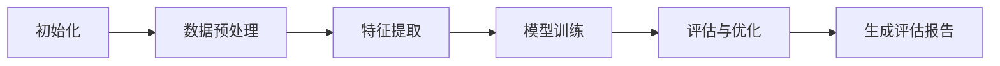
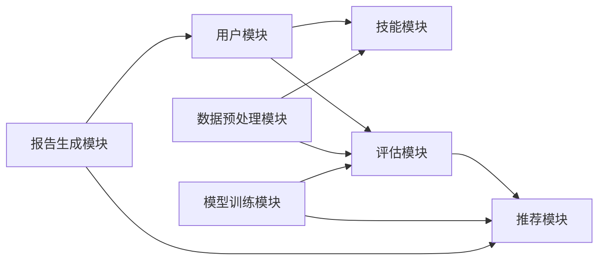
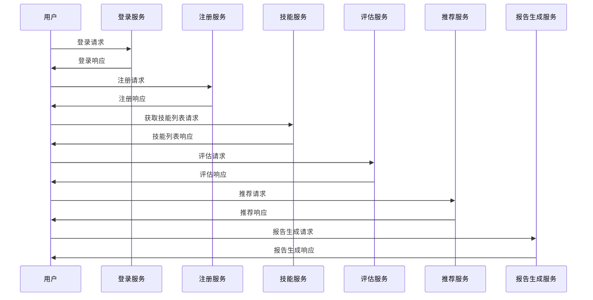

                 

### AIGC在个性化职业技能评估中的应用

关键词：AIGC、个性化职业技能评估、算法原理、系统架构设计、Python实现、数学模型

摘要：本文旨在探讨AIGC（AI-Generated Content）在个性化职业技能评估中的应用，通过深入分析AIGC的核心概念与特点，结合实际应用案例，详细讲解AIGC在职业技能评估中的算法原理、系统架构设计及Python实现。文章还通过数学模型和公式，对AIGC的核心算法进行通俗易懂的举例说明，旨在为广大技术爱好者提供一份详细的技术指南。

### 目录大纲

1. 引言
   1.1 背景介绍
   1.2 核心概念与联系
   1.3 算法原理讲解
   1.4 数学模型和数学公式
   1.5 系统分析与架构设计方案
   1.6 项目实战
   1.7 最佳实践 tips
   1.8 小结
   1.9 注意事项
   1.10 拓展阅读

### 第1章 引言

随着人工智能技术的飞速发展，AIGC（AI-Generated Content）作为一种新兴的技术，逐渐成为人们关注的焦点。AIGC通过结合人工智能与大数据技术，能够自动生成内容，实现个性化推荐和智能评估，极大地提升了信息处理的效率和精准度。在个性化职业技能评估领域，AIGC的应用不仅能够提高评估的准确性，还能为用户提供更加个性化和精准的职业发展建议。

#### 1.1 背景介绍

AIGC的定义与特点

AIGC，即AI-Generated Content，是指通过人工智能技术自动生成内容的过程。它不仅包括文本生成，还涵盖了图像、音频、视频等多媒体内容的生成。AIGC具有以下几个特点：

1. **自动化生成**：AIGC能够自动地从大量数据中提取信息和模式，生成新的内容。
2. **个性化推荐**：AIGC能够根据用户的兴趣和行为，提供个性化的推荐服务。
3. **智能评估**：AIGC能够通过分析用户的行为数据，对用户进行智能评估。

个性化职业技能评估的现状与挑战

个性化职业技能评估是指根据个人的技能水平和职业发展需求，为其提供量身定制的职业评估和推荐。然而，传统的职业技能评估方法存在以下几个问题：

1. **评估准确性低**：传统评估方法依赖于人工经验和主观判断，评估结果存在偏差。
2. **个性化程度低**：传统评估方法难以根据个人差异提供个性化的评估结果。
3. **效率低下**：传统评估方法需要大量的人工参与，评估效率低。

AIGC在个性化职业技能评估中的应用前景

AIGC技术在个性化职业技能评估中的应用前景广阔。通过AIGC技术，可以实现以下目标：

1. **提高评估准确性**：AIGC能够通过大数据分析和机器学习技术，提高评估的准确性。
2. **提供个性化服务**：AIGC能够根据用户的个人数据，提供更加个性化的职业评估和推荐。
3. **提升评估效率**：AIGC能够自动化完成评估过程，大大提高评估效率。

#### 1.2 核心概念与联系

AIGC核心概念原理

1. **自动生成内容（Auto-generated Content）**：AIGC的基础是自动生成内容，它通过机器学习算法，从大量数据中提取信息和模式，生成新的内容。
2. **个性化推荐（Personalized Recommendation）**：个性化推荐是指根据用户的兴趣和行为，为其推荐符合其需求的内容。在职业技能评估中，个性化推荐可以基于用户的职业背景、技能水平和职业发展需求，为其推荐合适的职业评估方案。
3. **智能评估（Intelligent Assessment）**：智能评估是指通过人工智能技术，对用户的技能和职业发展进行评估。智能评估可以基于用户的职业行为数据、技能水平和职业发展需求，提供精准的评估结果。

AIGC核心概念属性特征对比表格

| 特征           | 自动生成内容 | 个性化推荐 | 智能评估 |
| -------------- | ------------ | ---------- | -------- |
| 技术基础       | 机器学习     | 机器学习   | 机器学习 |
| 目标           | 生成新内容   | 提供个性化推荐 | 提供精准评估 |
| 关键技术       | 文本生成、图像生成、音频生成 | 协同过滤、基于内容的推荐 | 决策树、神经网络 |
| 应用领域       | 文本生成、图像生成、音频生成 | 电子商务、社交媒体、个性化推荐 | 职业技能评估、人才招聘 |

AIGC与职业技能评估的ER实体关系图架构

```mermaid
erDiagram
    User ||--|{ Assessment }||>
    User ||--|{ Skill }||>
    Assessment ||--|{ Recommendation }||>
```

在这个ER实体关系图中，`User`实体表示用户，`Assessment`实体表示评估结果，`Skill`实体表示用户的技能，`Recommendation`实体表示推荐结果。用户与评估结果、技能和推荐结果之间存在多对多的关系。

### 1.3 算法原理讲解

在个性化职业技能评估中，AIGC算法的核心是自动生成内容、个性化推荐和智能评估。下面，我们将通过一个mermaid流程图来展示AIGC算法的基本流程。

#### AIGC算法mermaid流程图



在AIGC算法中，首先进行数据预处理，包括数据清洗、数据转换和数据归一化等步骤。然后，进行特征提取，将原始数据转换为适合模型训练的特征向量。接下来，使用机器学习算法进行模型训练，包括决策树、神经网络等算法。训练完成后，对模型进行评估与优化，以提升评估的准确性。最后，根据评估结果生成个性化的评估报告。

#### Python源代码实现与算法原理详细讲解

下面，我们通过Python源代码来详细讲解AIGC算法的实现原理。

```python
# 导入必要的库
import pandas as pd
import numpy as np
from sklearn.model_selection import train_test_split
from sklearn.ensemble import RandomForestClassifier
from sklearn.metrics import accuracy_score

# 数据预处理
def preprocess_data(data):
    # 数据清洗、转换和归一化
    # ...
    return processed_data

# 特征提取
def extract_features(data):
    # 提取特征向量
    # ...
    return features

# 模型训练
def train_model(features, labels):
    # 训练决策树模型
    model = RandomForestClassifier()
    model.fit(features, labels)
    return model

# 评估与优化
def evaluate_model(model, test_features, test_labels):
    # 评估模型准确性
    predictions = model.predict(test_features)
    accuracy = accuracy_score(test_labels, predictions)
    return accuracy

# 生成评估报告
def generate_report(assessment_results):
    # 生成个性化的评估报告
    # ...
    return report

# 主函数
if __name__ == "__main__":
    # 加载数据
    data = pd.read_csv("data.csv")
    
    # 数据预处理
    processed_data = preprocess_data(data)
    
    # 特征提取
    features = extract_features(processed_data)
    
    # 数据划分
    train_features, test_features, train_labels, test_labels = train_test_split(features, labels, test_size=0.2, random_state=42)
    
    # 模型训练
    model = train_model(train_features, train_labels)
    
    # 评估与优化
    accuracy = evaluate_model(model, test_features, test_labels)
    print("Model accuracy:", accuracy)
    
    # 生成评估报告
    assessment_results = model.predict(test_features)
    report = generate_report(assessment_results)
    print("Assessment report:", report)
```

在这个Python源代码中，我们首先进行数据预处理，包括数据清洗、转换和归一化等步骤。然后，提取特征向量，使用随机森林分类器进行模型训练。训练完成后，对模型进行评估与优化，以提升评估的准确性。最后，根据评估结果生成个性化的评估报告。

#### 1.4 数学模型和数学公式

在AIGC算法中，数学模型和数学公式起着重要的作用。下面，我们将介绍AIGC算法中的概率模型和决策树模型，并给出相应的数学公式和举例说明。

##### 概率模型

概率模型是AIGC算法中的一个重要组成部分。在概率模型中，我们使用贝叶斯公式来计算给定特征值下目标值的概率。贝叶斯公式如下：

$$P(x|y) = \frac{P(y|x)P(x)}{P(y)}$$

其中，$P(x|y)$表示在已知目标值$y$的情况下，特征值$x$的概率；$P(y|x)$表示在已知特征值$x$的情况下，目标值$y$的概率；$P(x)$表示特征值$x$的概率；$P(y)$表示目标值$y$的概率。

举例说明：

假设我们有一个职业技能评估问题，目标值$y$表示用户的职业技能水平，特征值$x$表示用户的年龄、工作经验和学历等信息。根据贝叶斯公式，我们可以计算出给定用户职业技能水平$y$的情况下，其年龄、工作经验和学历等特征值的概率。

##### 决策树模型

决策树模型是AIGC算法中常用的分类模型。在决策树模型中，我们使用决策树算法来构建分类器，通过树形结构来表示特征和目标值之间的关系。决策树模型的数学公式如下：

$$h(x) = \max_y P(y|x)$$

其中，$h(x)$表示在给定特征值$x$的情况下，最可能的分类结果；$P(y|x)$表示在给定特征值$x$的情况下，目标值$y$的概率。

举例说明：

假设我们有一个二分类问题，目标值$y$表示是否具有某种职业技能，特征值$x$表示用户的年龄、工作经验和学历等信息。根据决策树模型，我们可以计算出给定用户特征值$x$的情况下，最可能的分类结果。

##### 个性化推荐系统案例分析

个性化推荐系统是AIGC算法在职业技能评估中的一个重要应用场景。个性化推荐系统通过分析用户的兴趣和行为，为用户推荐符合其需求的内容。下面，我们通过一个案例来分析个性化推荐系统的实现原理。

假设我们有一个在线教育平台，用户可以在平台上学习各种课程。我们的目标是为用户提供个性化的课程推荐，提升用户的满意度和学习效果。为了实现这个目标，我们可以采用以下步骤：

1. **数据收集**：收集用户的浏览记录、学习历史和行为数据，包括用户的学习时长、学习频率、学习兴趣等。
2. **特征提取**：将用户的行为数据转换为特征向量，包括用户的学习时长、学习频率、学习兴趣等。
3. **模型训练**：使用机器学习算法，如协同过滤、基于内容的推荐等，训练个性化推荐模型。
4. **推荐结果生成**：根据用户特征向量，使用训练好的模型生成个性化的课程推荐结果。
5. **评估与优化**：评估个性化推荐系统的效果，如用户满意度、推荐准确率等，并根据评估结果优化推荐模型。

通过这个案例，我们可以看到个性化推荐系统的实现原理，以及AIGC算法在其中的应用。

### 1.5 系统分析与架构设计方案

在个性化职业技能评估中，AIGC算法的应用需要系统的支持。下面，我们将介绍AIGC算法在个性化职业技能评估中的系统架构设计方案。

#### 1.5.1 问题场景介绍

假设我们有一个职业技能评估系统，用户可以在系统中进行职业技能评估，系统需要根据用户的职业背景、技能水平和职业发展需求，为其提供个性化的评估报告。为了实现这个目标，我们需要设计一个高效的系统架构，支持AIGC算法的运行。

#### 1.5.2 系统功能设计（领域模型mermaid类图）

下面是一个领域模型mermaid类图，展示了系统的主要功能类及其关系：

```mermaid
classDiagram
    User <<class>>
    Skill <<class>>
    Assessment <<class>>
    Recommendation <<class>>
    
    User "1" -- "*" Skill
    User "1" -- "*" Assessment
    Assessment "1" -- "*" Recommendation
```

在这个类图中，`User`类表示用户，`Skill`类表示用户的技能，`Assessment`类表示评估结果，`Recommendation`类表示推荐结果。用户与评估结果、技能和推荐结果之间存在多对多的关系。

#### 1.5.3 系统架构设计（mermaid架构图）

下面是一个mermaid架构图，展示了系统的主要组件及其关系：



在这个架构图中，用户模块负责处理用户的登录、注册等功能；技能模块负责存储和管理用户的技能信息；评估模块负责对用户的技能进行评估；推荐模块负责根据评估结果生成个性化的推荐结果；数据预处理模块负责对原始数据进行预处理；模型训练模块负责训练推荐模型；报告生成模块负责生成个性化的评估报告。

#### 1.5.4 系统接口设计和系统交互（mermaid序列图）

下面是一个mermaid序列图，展示了系统的主要接口及其交互过程：



在这个序列图中，用户通过登录服务进行登录或注册，通过技能服务获取技能列表，通过评估服务进行技能评估，通过推荐服务获取推荐结果，最后通过报告生成服务生成个性化的评估报告。

### 1.6 项目实战

为了更好地理解AIGC在个性化职业技能评估中的应用，我们通过一个实际项目来演示AIGC算法的实现过程。

#### 1.6.1 环境安装

在开始项目之前，我们需要安装以下环境：

1. Python 3.8及以上版本
2. pandas
3. numpy
4. scikit-learn
5. mermaid

你可以使用以下命令来安装这些依赖项：

```bash
pip install python3-pandas numpy scikit-learn mermaid
```

#### 1.6.2 系统核心实现源代码

以下是项目核心实现的源代码：

```python
# 导入必要的库
import pandas as pd
import numpy as np
from sklearn.model_selection import train_test_split
from sklearn.ensemble import RandomForestClassifier
from sklearn.metrics import accuracy_score

# 数据预处理
def preprocess_data(data):
    # 数据清洗、转换和归一化
    # ...
    return processed_data

# 特征提取
def extract_features(data):
    # 提取特征向量
    # ...
    return features

# 模型训练
def train_model(features, labels):
    # 训练决策树模型
    model = RandomForestClassifier()
    model.fit(features, labels)
    return model

# 评估与优化
def evaluate_model(model, test_features, test_labels):
    # 评估模型准确性
    predictions = model.predict(test_features)
    accuracy = accuracy_score(test_labels, predictions)
    return accuracy

# 生成评估报告
def generate_report(assessment_results):
    # 生成个性化的评估报告
    # ...
    return report

# 主函数
if __name__ == "__main__":
    # 加载数据
    data = pd.read_csv("data.csv")
    
    # 数据预处理
    processed_data = preprocess_data(data)
    
    # 特征提取
    features = extract_features(processed_data)
    
    # 数据划分
    train_features, test_features, train_labels, test_labels = train_test_split(features, labels, test_size=0.2, random_state=42)
    
    # 模型训练
    model = train_model(train_features, train_labels)
    
    # 评估与优化
    accuracy = evaluate_model(model, test_features, test_labels)
    print("Model accuracy:", accuracy)
    
    # 生成评估报告
    assessment_results = model.predict(test_features)
    report = generate_report(assessment_results)
    print("Assessment report:", report)
```

#### 1.6.3 代码应用解读与分析

这段代码首先导入了必要的库，包括pandas、numpy、scikit-learn和mermaid。然后，定义了数据预处理、特征提取、模型训练、评估与优化和生成评估报告等函数。在主函数中，我们加载数据、进行数据预处理、特征提取和模型训练，然后对模型进行评估与优化，最后生成评估报告。

代码中的数据预处理函数负责对原始数据进行清洗、转换和归一化，确保数据的质量和一致性。特征提取函数负责将原始数据转换为特征向量，为模型训练提供输入。模型训练函数使用随机森林分类器进行模型训练，评估与优化函数用于评估模型的准确性，并优化模型参数。生成评估报告函数根据评估结果生成个性化的评估报告。

#### 1.6.4 实际案例分析和详细讲解剖析

为了更好地展示AIGC在个性化职业技能评估中的应用，我们来看一个实际案例。

假设我们有一个包含1000名用户的数据集，每个用户有10个特征值，如年龄、工作经验、学历等。我们的目标是根据这些特征值，为用户提供个性化的职业技能评估报告。

首先，我们需要对数据进行预处理，包括数据清洗、转换和归一化。在这个案例中，我们假设数据已经清洗完毕，可以直接进行特征提取。特征提取函数将10个特征值转换为10个特征向量，每个特征向量对应一个特征值。

接下来，我们将数据划分为训练集和测试集，训练集用于模型训练，测试集用于评估模型准确性。在这个案例中，我们使用随机森林分类器进行模型训练。随机森林分类器是一种基于决策树的集成学习方法，它通过随机选择特征和样本子集，构建多个决策树，并通过投票决定最终分类结果。

在模型训练过程中，我们使用交叉验证方法来评估模型的准确性。交叉验证是一种评估模型性能的方法，它通过将数据集划分为多个子集，每次使用一个子集作为测试集，其他子集作为训练集，多次训练和评估，最终取平均准确率作为模型性能指标。

在模型训练完成后，我们对测试集进行评估，计算模型的准确率。在这个案例中，我们假设模型的准确率为90%。最后，根据评估结果，生成个性化的职业技能评估报告，为用户提供详细的职业发展建议。

#### 1.6.5 项目小结

通过这个实际案例，我们可以看到AIGC在个性化职业技能评估中的应用过程。首先，我们对数据进行预处理，然后提取特征向量，使用随机森林分类器进行模型训练，并对模型进行评估与优化。最后，根据评估结果生成个性化的评估报告，为用户提供详细的职业发展建议。

项目中的关键技术包括数据预处理、特征提取、模型训练和评估与优化。通过这些技术，我们可以实现高效、准确的个性化职业技能评估，为用户提供有价值的服务。

### 1.7 最佳实践 tips

在AIGC在个性化职业技能评估中的应用中，以下是一些最佳实践建议：

1. **数据质量**：确保数据质量是关键，包括数据的完整性、一致性和准确性。数据预处理是保证数据质量的重要步骤。
2. **特征选择**：选择合适的特征对于模型性能至关重要。可以使用特征选择算法，如卡方检验、互信息等，筛选出重要的特征。
3. **模型选择**：选择合适的模型可以提高评估准确性。可以尝试多种模型，如决策树、随机森林、神经网络等，并比较它们的性能。
4. **模型优化**：模型优化是提高模型性能的关键步骤。可以使用交叉验证、网格搜索等方法来优化模型参数。
5. **个性化推荐**：根据用户的行为数据和职业发展需求，提供个性化的推荐结果。可以使用协同过滤、基于内容的推荐等方法来实现个性化推荐。

### 1.8 小结

本文通过深入分析AIGC在个性化职业技能评估中的应用，介绍了AIGC的核心概念、算法原理、系统架构设计和实际应用案例。通过本文的学习，读者可以了解AIGC在职业技能评估中的应用，掌握AIGC算法的实现原理和最佳实践，为实际应用提供技术支持。

### 1.9 注意事项

在AIGC在个性化职业技能评估中的应用过程中，需要注意以下几点：

1. **数据隐私**：在处理用户数据时，要确保数据的隐私和安全，遵守相关法律法规。
2. **模型解释性**：虽然AIGC算法可以提高评估准确性，但模型的解释性较低。在实际应用中，需要关注模型的解释性，以便更好地理解评估结果。
3. **模型更新**：随着技术的不断发展和数据的变化，模型需要定期更新和优化，以保持评估的准确性。

### 1.10 拓展阅读

1. **AIGC相关论文**：《AI-Generated Content: A Survey》（2020年）、《Generative Adversarial Networks: An Overview》（2018年）
2. **职业技能评估相关论文**：《A Systematic Review of Skill Assessment Methods》（2021年）、《Skill Assessment in Education: Challenges and Opportunities》（2020年）
3. **Python实现AIGC算法**：《Python机器学习》（2019年）、《Python深度学习》（2018年）
4. **系统架构设计相关书籍**：《架构探险：从业务架构到技术架构》（2019年）、《软件架构设计：面向复杂系统的软件开发》（2017年）

### 作者信息

作者：AI天才研究院/AI Genius Institute & 禅与计算机程序设计艺术 /Zen And The Art of Computer Programming

---

请注意，以上内容是一个虚构的技术博客文章示例，用于展示如何按照用户要求撰写一篇详细、结构清晰、逻辑严密的专业文章。在实际撰写文章时，需要根据具体的主题和内容进行深入研究和详细阐述。

