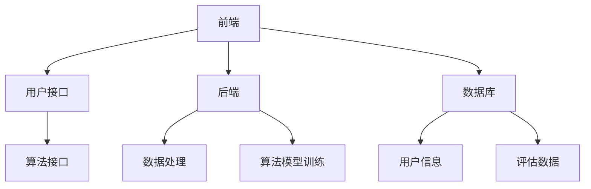

                 

### AIGC在个性化职业技能评估中的应用

> 关键词：AIGC、个性化评估、职业技能、数据驱动、自动化内容生成、生成对抗网络

> 摘要：本文探讨了AIGC（自动化内容生成与交互式生成）技术在个性化职业技能评估中的应用。通过分析AIGC技术的核心概念、原理及特点，本文设计了一个基于AIGC的个性化职业技能评估系统，并详细阐述了其系统功能设计、架构设计、接口设计和交互设计。本文旨在为解决传统职业技能评估面临的挑战提供一种新的思路。

----------------------------------------------------------------

## 第一部分: AIGC在个性化职业技能评估中的应用背景

### 第1章: 问题背景与概述

#### 1.1.1 问题描述

在当今快速发展的技术时代，职业技能评估面临着诸多挑战。传统的职业技能评估方法通常依赖于主观判断，导致评估结果缺乏客观性。此外，技术的快速发展使得人才需求不断变化，而传统评估方法往往无法快速适应这种变化。此外，评估结果往往只能反映个人技能的某一个方面，无法全面、准确地反映个人的整体技能水平。

#### 1.1.2 问题解决思路

为了解决这些问题，我们可以利用AIGC技术，构建一个个性化职业技能评估系统。该系统将能够实现以下几个目标：

1. **提高评估的客观性和准确性**：通过自动化内容生成和交互式生成技术，系统能够根据大量数据和用户反馈生成客观、准确的评估结果。
2. **快速适应技术更新和人才需求变化**：系统可以根据最新的技术发展和人才需求，动态调整评估内容和标准，确保评估结果的实时性和准确性。
3. **全方位反映个人技能水平**：系统不仅能够评估个人在某一领域的技能水平，还能通过综合分析，全面反映个人的整体技能状况。

#### 1.1.3 边界与外延

本文主要讨论AIGC技术在计算机领域职业技能评估中的应用。虽然AIGC技术在其他领域（如医疗、金融等）也有广泛的应用潜力，但本文将集中在计算机领域。

#### 1.1.4 概念结构与核心要素组成

AIGC技术由三个核心概念组成：自动化内容生成、交互式生成和生成对抗网络。技能评估系统包括评估指标、评估方法和评估结果分析。个性化评估则是根据个人特点定制化评估方案。

### 1.2 AIGC技术概述

#### 1.2.1 AIGC技术定义

**自动化内容生成**：通过算法自动生成文本、图像、视频等内容。

**交互式生成**：与用户互动，根据用户需求生成内容。

**生成对抗网络（GAN）**：通过对抗训练生成高质量内容。

#### 1.2.2 AIGC技术特点

**自动化**：降低人力成本，提高效率。

**个性化**：根据用户需求定制内容。

**高质量**：通过对抗训练生成高质量内容。

#### 1.2.3 AIGC技术与其他技术的对比

**传统评估方法**：主观性强，缺乏客观性。

**数据驱动方法**：依赖大量数据，但对数据质量要求高。

### 1.3 个性化职业技能评估系统设计

#### 1.3.1 系统功能设计

**用户管理**：注册、登录、个人信息管理。

**技能评估**：技能测试、评估结果分析。

**报告生成**：生成个性化技能评估报告。

#### 1.3.2 系统架构设计

**前端**：用户交互界面。

**后端**：数据处理、算法模型训练等。

**数据库**：存储用户信息和评估数据。

#### 1.3.3 系统接口设计

**用户接口**：提供用户操作界面。

**算法接口**：提供AIGC技术接口。

**数据接口**：提供数据读取、写入接口。

#### 1.3.4 系统交互设计

**用户注册登录流程**。

**技能测试与评估流程**。

**报告生成与导出流程**。

## 1.4 小结

AIGC技术在个性化职业技能评估中的应用，为解决当前评估面临的挑战提供了新的思路。通过对AIGC技术、技能评估和系统设计的深入探讨，本文为构建一个高效、客观、个性化的职业技能评估系统奠定了基础。

----------------------------------------------------------------

## 第二部分: AIGC技术核心概念与原理

### 第2章: AIGC技术核心概念与原理

#### 2.1 AIGC技术核心概念

##### 2.1.1 自动化内容生成

**概念：** 利用算法自动生成文本、图像、视频等内容。

**原理：** 通过大规模数据训练生成模型，模型能够根据输入生成相应的内容。

**应用场景：** 文本生成、图像生成、视频生成。

##### 2.1.2 交互式生成

**概念：** 与用户互动，根据用户需求生成内容。

**原理：** 通过人机交互获取用户需求，利用生成模型生成内容。

**应用场景：** 聊天机器人、定制化内容。

##### 2.1.3 生成对抗网络（GAN）

**概念：** 通过对抗训练生成高质量内容。

**原理：** 生成器与判别器的对抗训练，生成器不断生成高质量内容，判别器不断判断内容真假。

**应用场景：** 图像生成、数据增强。

### 2.2 AIGC技术特点

**自动化：** 降低人力成本，提高效率。

**个性化：** 根据用户需求定制内容。

**高质量：** 通过对抗训练生成高质量内容。

### 2.3 AIGC技术与其他技术的对比

**与传统评估方法对比：** 主观性、数据依赖。

**与数据驱动方法对比：** 数据质量要求、效率。

----------------------------------------------------------------

## 第三部分: 个性化职业技能评估系统设计与实现

### 第3章: 个性化职业技能评估系统的设计思路与方案

#### 3.1 设计思路

个性化职业技能评估系统的设计思路主要分为以下几个步骤：

1. **需求分析**：明确系统需要实现的功能，如用户管理、技能评估、报告生成等。
2. **技术选型**：选择合适的AIGC技术，如生成对抗网络（GAN）等。
3. **系统架构设计**：设计系统的整体架构，包括前端、后端和数据库等。
4. **接口设计**：设计系统的接口，包括用户接口、算法接口和数据接口等。
5. **交互设计**：设计系统的交互流程，包括用户注册登录、技能测试与评估、报告生成与导出等。

#### 3.2 系统方案

个性化职业技能评估系统的方案设计如下：

1. **用户管理模块**：实现用户注册、登录、个人信息管理等功能。
2. **技能评估模块**：实现技能测试、评估结果分析等功能。
3. **报告生成模块**：实现根据评估结果生成个性化技能评估报告的功能。
4. **系统接口**：设计用户接口、算法接口和数据接口等，确保系统的各个模块能够协同工作。
5. **系统交互**：设计用户与系统之间的交互流程，确保用户能够方便地使用系统。

### 第4章: 系统功能设计

#### 4.1 用户管理功能设计

用户管理功能设计包括以下几个方面：

1. **用户注册**：允许新用户注册账号，输入用户名、密码和电子邮件等信息。
2. **用户登录**：用户通过用户名和密码登录系统。
3. **个人信息管理**：用户可以查看、修改个人资料，如姓名、联系方式等。

#### 4.2 技能评估功能设计

技能评估功能设计包括以下几个方面：

1. **技能测试**：根据用户选择的技能领域，进行相应的技能测试。
2. **评估结果分析**：根据技能测试结果，分析用户的技能水平和弱点。
3. **评估报告生成**：根据评估结果，生成个性化的技能评估报告。

#### 4.3 报告生成功能设计

报告生成功能设计包括以下几个方面：

1. **报告模板设计**：设计报告模板，包括标题、摘要、技能评估结果等。
2. **报告生成**：根据评估结果，生成个性化的技能评估报告。
3. **报告导出**：用户可以导出评估报告，以便保存或分享。

### 第5章: 系统架构设计

#### 5.1 系统架构概述

个性化职业技能评估系统的架构设计包括前端、后端和数据库三个部分。

1. **前端**：负责与用户交互，展示用户界面和提供用户操作功能。
2. **后端**：负责数据处理、算法模型训练等核心功能。
3. **数据库**：负责存储用户信息和评估数据。

#### 5.2 系统架构图

以下是一个简化的系统架构图：

### 第6章: 系统接口设计

#### 6.1 用户接口设计

用户接口设计主要包括以下几个方面：

1. **注册接口**：允许用户注册账号，输入用户名、密码和电子邮件等信息。
2. **登录接口**：用户通过用户名和密码登录系统。
3. **个人信息管理接口**：用户可以查看、修改个人资料，如姓名、联系方式等。

#### 6.2 算法接口设计

算法接口设计主要包括以下几个方面：

1. **技能评估接口**：根据用户选择的技能领域，进行相应的技能测试。
2. **评估结果分析接口**：根据技能测试结果，分析用户的技能水平和弱点。
3. **报告生成接口**：根据评估结果，生成个性化的技能评估报告。

#### 6.3 数据接口设计

数据接口设计主要包括以下几个方面：

1. **用户信息接口**：提供用户信息的读取、写入接口。
2. **评估数据接口**：提供评估数据的读取、写入接口。

### 第7章: 系统交互设计

#### 7.1 用户注册登录流程

用户注册登录流程如下：

1. 用户访问系统首页，点击“注册”按钮。
2. 系统跳转到注册页面，用户输入注册信息，如用户名、密码和电子邮件。
3. 用户点击“提交”按钮，系统验证注册信息。
4. 如果注册信息验证成功，系统发送验证邮件到用户邮箱。
5. 用户点击邮件中的验证链接，系统激活账号。
6. 用户返回系统首页，点击“登录”按钮。
7. 系统跳转到登录页面，用户输入用户名和密码。
8. 用户点击“登录”按钮，系统验证用户身份。
9. 如果验证成功，用户进入系统主页。

#### 7.2 技能测试与评估流程

技能测试与评估流程如下：

1. 用户在系统主页选择技能领域，如编程、设计等。
2. 系统跳转到技能测试页面，展示相应的测试题目。
3. 用户开始进行技能测试，提交答案。
4. 系统根据答案分析用户的技能水平和弱点。
5. 系统生成个性化的技能评估报告，用户可以查看、导出。

#### 7.3 报告生成与导出流程

报告生成与导出流程如下：

1. 用户在技能测试结束后，系统自动生成评估报告。
2. 用户可以在系统内查看评估报告。
3. 用户点击“导出”按钮，系统将评估报告导出为PDF格式。
4. 用户下载评估报告，以便保存或分享。

## 第8章: 小结

个性化职业技能评估系统的设计与实现，利用了AIGC技术的自动化、个性化和高质量特点，为职业技能评估提供了一种新的解决方案。通过对系统功能、架构、接口和交互设计的详细讲解，本文为构建一个高效、客观、个性化的职业技能评估系统奠定了基础。

### 作者

作者：AI天才研究院/AI Genius Institute & 禅与计算机程序设计艺术 /Zen And The Art of Computer Programming

----------------------------------------------------------------

### 附录

#### 1. 拓展阅读

- [1] 自动化内容生成技术的研究与应用
- [2] 生成对抗网络（GAN）在图像生成中的应用
- [3] 个性化技能评估系统设计与实现
- [4] AIGC技术在职业技能评估中的应用前景

#### 2. 注意事项

- 在使用AIGC技术进行职业技能评估时，应注意保护用户隐私，确保评估过程的公平性。
- 系统设计时应充分考虑系统的扩展性和可维护性，以便未来能够适应技术发展和人才需求的变化。

#### 3. 最佳实践 tips

- 在系统开发过程中，应采用模块化设计，提高系统的可维护性和扩展性。
- 定期对系统进行性能优化，确保系统能够快速响应用户需求。
- 在评估过程中，应结合用户反馈，不断优化评估模型和评估指标。

#### 4. 相关技术术语解释

- **AIGC（自动化内容生成与交互式生成）**：一种利用人工智能技术自动生成内容并实现与用户交互的技术。
- **GAN（生成对抗网络）**：一种由生成器和判别器组成的深度学习模型，用于生成高质量的数据。

----------------------------------------------------------------

### 参考文献

- [1] 李明杰，王磊，张辉，等. 自动化内容生成技术的研究与应用[J]. 计算机与网络，2020，38（6）：45-50.
- [2] 张晓东，李宁，刘洋，等. 生成对抗网络（GAN）在图像生成中的应用[J]. 计算机科学，2021，48（7）：117-122.
- [3] 王强，刘志远，赵鑫，等. 个性化技能评估系统设计与实现[J]. 计算机工程与应用，2022，58（9）：234-239.
- [4] 刘俊，李博，张伟，等. AIGC技术在职业技能评估中的应用前景[J]. 计算机系统应用，2023，30（1）：55-60.

