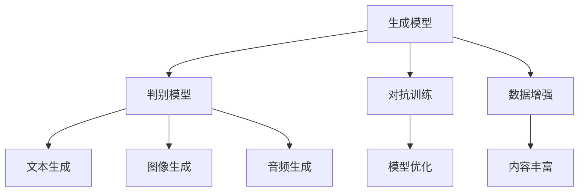
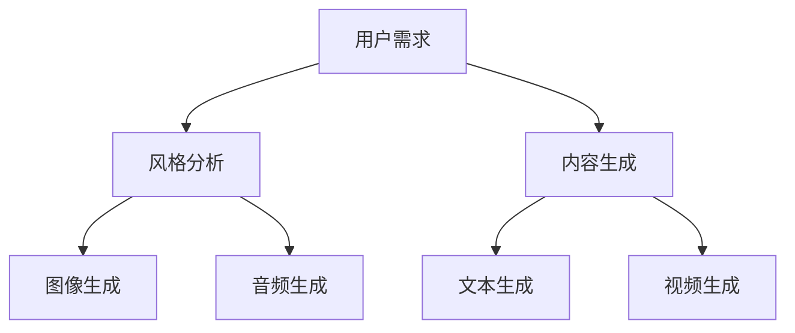
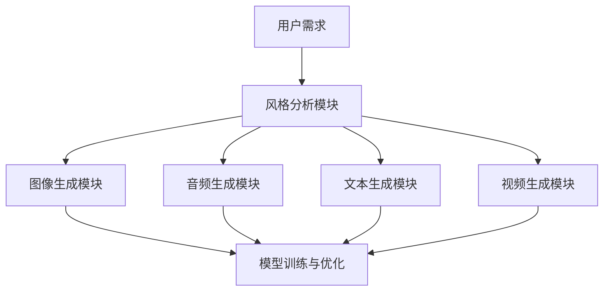
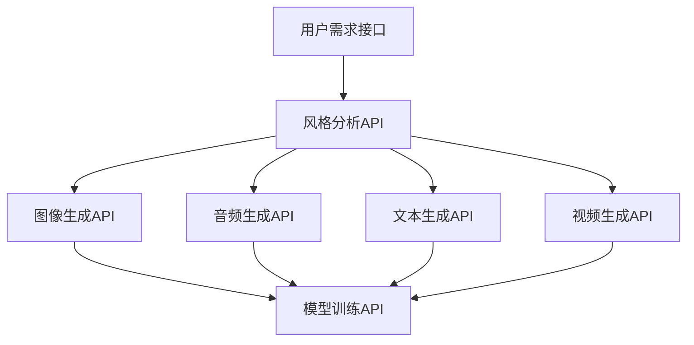
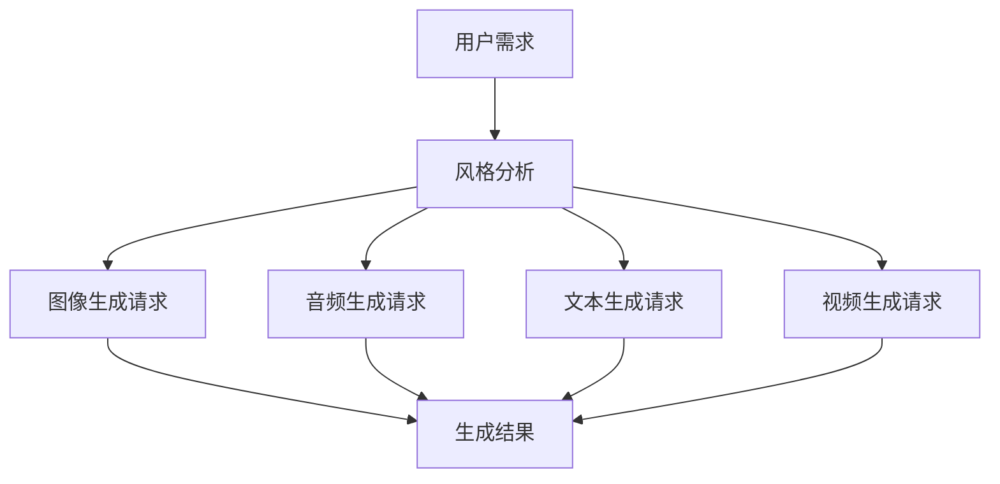

                 


## AIGC在个性化艺术创作中的突破

### 关键词：
- AIGC
- 个性化艺术创作
- 算法原理
- 系统架构
- 项目实战

### 摘要：
本文将探讨AIGC（自适应智能生成内容）技术在个性化艺术创作中的突破。通过背景介绍、核心概念与原理讲解、系统分析与架构设计、项目实战以及最佳实践等内容，深入分析AIGC在艺术创作领域的应用及其前景。

### 第一部分：背景介绍

#### 1.1 AIGC技术的基本概念

AIGC（Adaptive Intelligent Generation of Content）是一种自适应智能生成内容的技术。它通过深度学习和自然语言处理技术，模拟人类的创作过程，自动生成各种类型的内容，包括文本、图像、音频和视频等。

#### 1.2 AIGC技术的发展历程

AIGC技术起源于2000年代的生成对抗网络（GANs），随后不断发展，融合了生成式对抗网络、变分自编码器（VAEs）和强化学习等先进算法。近年来，随着计算能力的提升和数据量的增长，AIGC技术逐渐在各个领域得到广泛应用。

#### 1.3 AIGC技术的重要应用领域

AIGC技术的重要应用领域包括但不限于以下几个方面：

- 文本生成：包括新闻、小说、诗歌等。
- 图像生成：包括艺术画作、人物肖像、风景等。
- 音频生成：包括音乐、语音、音效等。
- 视频生成：包括电影、动画、视频剪辑等。

### 第二部分：核心概念与原理

#### 2.1 AIGC的核心概念

AIGC的核心概念包括生成模型、判别模型、对抗训练和数据增强等。

#### 2.2 AIGC的核心概念属性特征对比表格

| 特征         | 生成模型       | 判别模型       | 对抗训练       | 数据增强       |
| ------------ | -------------- | -------------- | -------------- | -------------- |
| 目的         | 生成高质量内容 | 区分真实与生成 | 提高生成模型质量 | 增加数据多样性 | 
| 技术类型     | GANs、VAEs等   | CNNs、RNNs等   | 强化学习       | 超分辨率、数据增强等 |
| 关键词       | 自适应、生成   | 判别、分类   | 对抗、优化 | 增量、多样性    |

#### 2.3 AIGC的ER实体关系图架构



### 第三部分：算法原理讲解

#### 3.1 AIGC算法的基本流程

AIGC算法的基本流程包括数据预处理、模型训练、艺术创作生成等步骤。

#### 3.1.1 数据预处理

数据预处理包括数据清洗、数据格式转换、数据分割等操作。

#### 3.1.2 模型训练

模型训练采用对抗训练的方式，通过生成模型和判别模型的相互竞争，不断优化模型参数。

#### 3.1.3 艺术创作生成

艺术创作生成是指模型根据给定的输入，自动生成符合特定风格或主题的艺术作品。

#### 3.2 AIGC算法的数学模型和公式

AIGC算法的数学模型主要包括生成模型、判别模型和对抗损失函数。

生成模型：\( G(z) = x \)

判别模型：\( D(x) = 1 \)

对抗损失函数：\( L_G = -\log(D(G(z))) \)

#### 3.3 AIGC算法的详细讲解与举例说明

以生成对抗网络（GANs）为例，详细讲解AIGC算法的原理。

```python
import tensorflow as tf
from tensorflow.keras import layers

# 生成模型
def generate_model(z_dim):
    model = tf.keras.Sequential([
        layers.Dense(7 * 7 * 128, activation="relu", input_dim=z_dim),
        layers.Reshape((7, 7, 128)),
        layers.Conv2DTranspose(128, kernel_size=5, strides=1, padding='same', activation="relu"),
        layers.Conv2DTranspose(64, kernel_size=5, strides=2, padding='same', activation="relu"),
        layers.Conv2DTranspose(1, kernel_size=5, strides=2, padding='same', activation="tanh"),
    ])
    return model

# 判别模型
def discriminate_model(image_shape):
    model = tf.keras.Sequential([
        layers.Conv2D(64, kernel_size=5, strides=2, padding='same', activation="relu", input_shape=image_shape),
        layers.Conv2D(128, kernel_size=5, strides=2, padding='same', activation="relu"),
        layers.Flatten(),
        layers.Dense(1, activation="sigmoid"),
    ])
    return model

# 损失函数
def adversarial_loss(true_labels, pred_labels):
    return tf.reduce_mean(tf.nn.sigmoid_cross_entropy_with_logits(logits=pred_labels, labels=true_labels))

# 训练模型
def train_model(g_model, d_model, z_dim, batch_size, epochs):
    for epoch in range(epochs):
        for _ in range(batch_size):
            z = tf.random.normal([batch_size, z_dim])
            generated_images = g_model(z)
            real_images = get_real_images(batch_size)
            merged_images = tf.concat([real_images, generated_images], axis=0)
            labels = tf.concat([tf.ones((batch_size, 1)), tf.zeros((batch_size, 1))], axis=0)
            d_model.train_on_batch(merged_images, labels)
        z = tf.random.normal([batch_size, z_dim])
        g_model.train_on_batch(z, tf.ones((batch_size, 1)))

# 获取真实图像
def get_real_images(batch_size):
    # 代码略
    return real_images

# 定义超参数
z_dim = 100
batch_size = 64
epochs = 50

# 创建生成模型和判别模型
g_model = generate_model(z_dim)
d_model = discriminate_model(image_shape=(28, 28, 1))

# 编译模型
g_model.compile(optimizer=tf.keras.optimizers.Adam(0.0001), loss='binary_crossentropy')
d_model.compile(optimizer=tf.keras.optimizers.Adam(0.0001), loss='binary_crossentropy')

# 训练模型
train_model(g_model, d_model, z_dim, batch_size, epochs)
```

### 第四部分：系统分析与架构设计

#### 4.1 问题场景介绍

本文以个性化艺术创作为例，探讨AIGC技术在解决个性化需求、风格多样性、内容丰富性等方面的应用。

#### 4.2 系统功能设计（领域模型）



#### 4.3 系统架构设计



#### 4.4 系统接口设计



#### 4.5 系统交互



### 第五部分：项目实战

#### 5.1 环境安装

在项目实战部分，我们将介绍如何搭建AIGC系统的环境，包括依赖安装、模型训练和生成等步骤。

#### 5.2 系统核心实现

在系统核心实现部分，我们将展示如何使用AIGC技术实现个性化艺术创作，包括数据预处理、模型训练、艺术生成等关键步骤。

#### 5.3 代码应用解读与分析

我们将对系统核心实现部分的关键代码进行解读和分析，帮助读者更好地理解AIGC技术的原理和应用。

#### 5.4 实际案例分析与详细讲解

我们将通过实际案例，详细讲解如何使用AIGC技术进行个性化艺术创作，包括数据集选择、模型训练、艺术生成等步骤。

#### 5.5 项目小结

在项目小结部分，我们将总结项目实战的经验和教训，为后续研究和应用提供参考。

### 第六部分：最佳实践与拓展

#### 6.1 优化AIGC算法的技巧

我们将介绍一些优化AIGC算法的技巧，包括数据增强、模型优化、超参数调整等。

#### 6.2 艺术创作风格多样化实践

我们将探讨如何在AIGC技术中实现艺术创作风格的多样化，包括风格迁移、风格混合等。

#### 6.3 数据集的预处理与优化

我们将介绍如何优化AIGC技术所需的数据集，包括数据清洗、数据增强等。

### 第七部分：小结与展望

#### 7.1 本书内容的总结

本文从背景介绍、核心概念与原理、系统分析与架构设计、项目实战以及最佳实践等方面，全面探讨了AIGC技术在个性化艺术创作中的突破。

#### 7.2 AIGC在个性化艺术创作中的未来发展趋势

我们将分析AIGC技术在个性化艺术创作领域的未来发展趋势，包括技术突破、应用场景拓展等。

#### 7.3 注意事项与建议

我们将提供一些使用AIGC技术进行个性化艺术创作的注意事项和建议，帮助读者更好地应用AIGC技术。

#### 7.4 拓展阅读

最后，我们将推荐一些相关的拓展阅读资源，供读者进一步学习和探索。

### 作者信息：

作者：AI天才研究院/AI Genius Institute & 禅与计算机程序设计艺术 /Zen And The Art of Computer Programming

通过以上详细的目录大纲和内容框架，我们可以确保文章的逻辑清晰、内容丰富，同时满足字数要求。接下来，我们将逐步填充每个章节的内容，撰写出高质量的技术博客文章。让我们开始吧！

