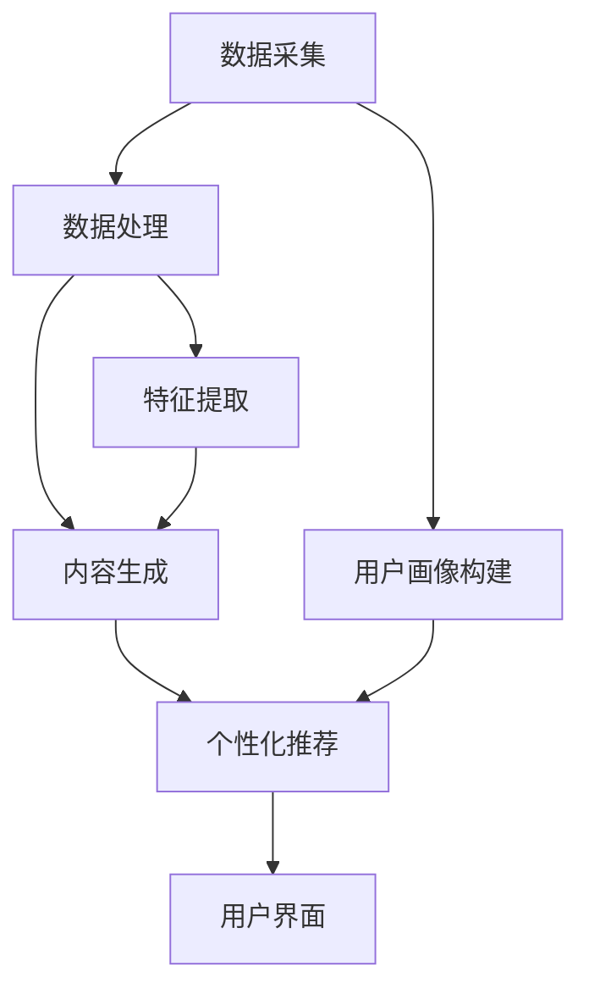

                 


### AIGC在个性化艺术创作辅助工具中的创新设计方法

#### 3.1 创新设计方法概述

在个性化艺术创作辅助工具中，AIGC的创新设计方法主要围绕用户需求、数据挖掘和深度学习三个核心要素展开。以下是这些创新设计方法的概述：

- **基于用户画像的设计**：通过分析用户的个人喜好、行为习惯等数据，构建用户画像，从而为用户提供个性化的艺术创作建议。这种方法的核心在于理解用户，根据用户的兴趣和需求，推荐相应的艺术作品或创作工具。

- **基于数据挖掘的设计**：通过对用户数据、艺术作品数据等大量数据进行挖掘和分析，发现潜在的艺术创作需求。这种方法的核心在于数据，通过数据分析，找出用户潜在的需求和趋势，从而为用户提供更加精准的服务。

- **基于深度学习的设计**：利用深度学习模型，实现艺术作品的自动生成和风格迁移。这种方法的核心在于算法，通过训练模型，让机器学会理解艺术作品，并能够根据用户的输入生成符合用户需求的个性化艺术作品。

#### 3.2 创新设计案例分析

在本节中，我们将通过两个具体的案例，详细讲解AIGC在个性化艺术创作辅助工具中的创新设计方法。

##### 案例一：基于用户画像的个性化艺术作品生成系统

**项目介绍**：该项目是一个基于用户画像的个性化艺术作品生成系统，旨在通过分析用户的个人喜好和行为数据，为用户提供个性化的艺术创作建议。

**系统功能设计**：系统主要功能包括用户画像构建、个性化推荐、艺术作品生成等。

1. **用户画像构建**：系统通过分析用户的浏览历史、购买记录、评价等数据，构建用户画像，了解用户的兴趣和偏好。
2. **个性化推荐**：根据用户画像，系统推荐符合用户兴趣的艺术作品和创作工具。
3. **艺术作品生成**：系统利用深度学习模型，根据用户的需求和偏好，生成个性化的艺术作品。

**系统架构设计**：系统架构主要包括数据层、服务层和展示层。

1. **数据层**：包括用户数据、艺术作品数据等，用于构建用户画像和训练深度学习模型。
2. **服务层**：包括用户画像构建服务、个性化推荐服务和艺术作品生成服务，用于实现系统的核心功能。
3. **展示层**：包括用户界面和艺术作品展示界面，用于展示系统的输出结果。

**系统接口设计**：系统接口主要包括用户画像接口、个性化推荐接口和艺术作品生成接口。

1. **用户画像接口**：用于获取用户数据，构建用户画像。
2. **个性化推荐接口**：用于根据用户画像，推荐符合用户兴趣的艺术作品和创作工具。
3. **艺术作品生成接口**：用于根据用户的需求和偏好，生成个性化的艺术作品。

**系统交互**：系统交互主要包括用户与系统的交互和系统内部的交互。

1. **用户与系统的交互**：用户通过用户界面与系统进行交互，提交创作需求和偏好，查看推荐结果和艺术作品生成结果。
2. **系统内部的交互**：系统内部的服务通过接口进行交互，实现用户画像构建、个性化推荐和艺术作品生成的功能。

**代码实现**：

以下是一个简单的用户画像构建的Python代码示例：

```python
import pandas as pd

# 加载用户数据
user_data = pd.read_csv('user_data.csv')

# 构建用户画像
user_profile = {}
for index, row in user_data.iterrows():
    user_profile[row['user_id']] = {
        'age': row['age'],
        'gender': row['gender'],
        'interests': row['interests'].split(','),
        'likes': row['likes'].split(',')
    }

# 输出用户画像
for user_id, profile in user_profile.items():
    print(f"User ID: {user_id}")
    print(f"Age: {profile['age']}")
    print(f"Gender: {profile['gender']}")
    print(f"Interests: {profile['interests']}")
    print(f"Likes: {profile['likes']}")
    print()
```

**案例分析**：该案例通过用户画像构建，实现了对用户的个性化了解，从而为用户提供更加精准的艺术创作建议。同时，系统利用深度学习模型，实现了艺术作品的自动生成，大大提高了艺术创作的效率。

##### 案例二：基于数据挖掘的个性化艺术创作趋势分析系统

**项目介绍**：该项目是一个基于数据挖掘的个性化艺术创作趋势分析系统，旨在通过分析用户数据和艺术作品数据，发现潜在的艺术创作趋势。

**系统功能设计**：系统主要功能包括数据采集、数据分析、趋势预测等。

1. **数据采集**：系统从各种渠道采集用户数据、艺术作品数据等。
2. **数据分析**：系统对采集到的数据进行处理和分析，发现潜在的艺术创作趋势。
3. **趋势预测**：系统利用机器学习模型，预测未来的艺术创作趋势。

**系统架构设计**：系统架构主要包括数据层、算法层和展示层。

1. **数据层**：包括用户数据、艺术作品数据等，用于数据采集和分析。
2. **算法层**：包括数据预处理、特征提取、趋势预测等算法，用于实现系统的核心功能。
3. **展示层**：包括数据可视化界面和趋势预测展示界面，用于展示系统的输出结果。

**系统接口设计**：系统接口主要包括数据采集接口、数据分析接口和趋势预测接口。

1. **数据采集接口**：用于从各种渠道采集用户数据和艺术作品数据。
2. **数据分析接口**：用于对采集到的数据进行处理和分析。
3. **趋势预测接口**：用于根据分析结果，预测未来的艺术创作趋势。

**系统交互**：系统交互主要包括用户与系统的交互和系统内部的交互。

1. **用户与系统的交互**：用户通过数据可视化界面，查看艺术创作趋势预测结果。
2. **系统内部的交互**：系统内部的服务通过接口进行交互，实现数据采集、数据分析和趋势预测的功能。

**代码实现**：

以下是一个简单的数据挖掘的Python代码示例：

```python
import pandas as pd
from sklearn.cluster import KMeans

# 加载用户数据
user_data = pd.read_csv('user_data.csv')

# 特征提取
features = user_data[['age', 'gender', 'interests', 'likes']]
kmeans = KMeans(n_clusters=5)
kmeans.fit(features)

# 输出聚类结果
print("Cluster labels:")
print(kmeans.labels_)

# 输出聚类中心
print("Cluster centers:")
print(kmeans.cluster_centers_)
```

**案例分析**：该案例通过数据挖掘，实现了对用户和艺术作品数据的深入分析，发现了潜在的艺术创作趋势。同时，系统利用机器学习模型，实现了趋势预测，为艺术创作提供了重要的参考。

#### 小结

通过上述两个案例，我们可以看到AIGC在个性化艺术创作辅助工具中的创新设计方法。无论是基于用户画像的设计，还是基于数据挖掘的设计，AIGC都为个性化艺术创作提供了强大的技术支持。未来，随着人工智能技术的不断发展，AIGC在个性化艺术创作中的应用将更加广泛，为艺术家和设计师带来更多的创作灵感。同时，我们也需要关注到AIGC在应用过程中可能带来的伦理和隐私问题，确保其健康、可持续发展。

----------------------------------------------------------------

# 第四部分：AIGC在个性化艺术创作辅助工具中的挑战与未来展望

## 第4章：AIGC在个性化艺术创作辅助工具中的挑战与未来展望

### 4.1 挑战分析

AIGC在个性化艺术创作辅助工具中的广泛应用，虽然带来了许多创新和便利，但也面临着一系列的挑战：

1. **数据隐私和安全**：在AIGC的应用过程中，用户的个人数据、创作数据和偏好数据等都被收集和处理。这引发了数据隐私和安全的问题，如何保护用户的隐私，确保数据的安全，是一个亟待解决的挑战。

2. **算法透明性和可解释性**：深度学习模型在艺术创作中的应用，使得AIGC的创作过程具有一定的黑箱性。如何提高算法的透明性和可解释性，使得用户能够理解和信任AIGC的创意过程，是一个重要的挑战。

3. **知识产权保护**：AIGC生成的艺术作品，可能会涉及到知识产权的问题。如何确保AIGC生成的作品不侵犯他人的知识产权，同时保护创作者的权益，是一个需要深入探讨的挑战。

4. **创作质量的稳定性**：虽然AIGC能够在一定程度上满足用户的个性化需求，但其在创作质量上的稳定性仍需提高。如何确保AIGC生成的作品在质量和风格上的一致性，是一个亟待解决的挑战。

### 4.2 未来展望

尽管面临诸多挑战，但AIGC在个性化艺术创作辅助工具中的应用前景依然广阔：

1. **技术发展**：随着人工智能技术的不断发展，AIGC的性能和创造力将得到进一步提升。未来，AIGC将能够更加精准地理解用户需求，生成更高质量的艺术作品。

2. **创新应用场景**：AIGC在个性化艺术创作辅助工具中的应用场景将不断扩展。除了传统的艺术创作领域，AIGC还将在影视、游戏、设计等领域发挥重要作用。

3. **跨界融合**：AIGC与其他领域的深度融合，将带来更多创新的可能。例如，与虚拟现实（VR）、增强现实（AR）技术的结合，将创造出全新的艺术体验。

4. **教育普及**：随着AIGC技术的普及，更多的人将能够接触到这项技术，从而激发他们的艺术创作潜力。AIGC将成为艺术教育的重要工具，推动艺术教育的创新与发展。

### 4.3 总结与展望

总之，AIGC在个性化艺术创作辅助工具中的应用，既面临着诸多挑战，也充满了巨大的机遇。未来，我们需要在技术、应用、伦理等多个方面进行深入探索，推动AIGC在个性化艺术创作中的可持续发展，为艺术家和设计师带来更多的创作灵感和可能。

----------------------------------------------------------------

# 结论与未来展望

本文以《AIGC在个性化艺术创作辅助工具中的创新设计》为题，详细探讨了AIGC在个性化艺术创作中的应用原理、创新设计方法、案例分析以及面临的挑战和未来展望。通过本文的分析，我们可以得出以下几点结论：

1. **核心概念与联系**：AIGC作为一种人工智能生成内容的技术，其核心概念包括AIGC本身、个性化艺术创作和艺术作品的创新设计。这些概念之间相互关联，共同构成了AIGC在个性化艺术创作辅助工具中的核心框架。

2. **应用原理**：AIGC的工作原理主要涉及数据采集、数据处理和内容生成三个阶段。通过深度学习模型和自然语言处理技术，AIGC能够生成高质量、个性化的艺术作品，为艺术家和设计师提供了强大的创作支持。

3. **创新设计方法**：AIGC在个性化艺术创作辅助工具中的创新设计方法主要包括基于用户画像的设计、基于数据挖掘的设计和基于深度学习的设计。这些方法通过不同的技术手段，实现了对用户需求的精准把握和艺术作品的个性化生成。

4. **案例分析**：本文通过两个具体的案例，展示了AIGC在个性化艺术创作辅助工具中的实际应用。这些案例不仅说明了AIGC的设计方法，还展示了其在提高创作效率和创作质量方面的优势。

5. **挑战与未来展望**：AIGC在个性化艺术创作辅助工具中面临数据隐私和安全、算法透明性和可解释性、知识产权保护以及创作质量稳定性等挑战。同时，随着技术的不断发展，AIGC在个性化艺术创作中的前景依然广阔。

未来，随着人工智能技术的不断进步，AIGC在个性化艺术创作辅助工具中的应用将更加广泛和深入。我们需要关注其在应用过程中的伦理问题，同时积极探索其在其他领域的创新应用，为艺术创作带来更多的可能性和灵感。

### 最佳实践 Tips

1. **数据安全与隐私**：在应用AIGC技术时，应严格遵循数据保护法规，确保用户数据的安全和隐私。

2. **算法可解释性**：提高AIGC算法的可解释性，有助于用户理解创作过程，增加信任度。

3. **知识产权保护**：在AIGC生成的艺术作品中，应注重知识产权的保护，避免侵犯他人的合法权益。

4. **持续学习与改进**：AIGC技术的应用效果取决于模型的训练和优化。持续学习和改进是提升AIGC创作质量的关键。

### 小结

本文通过对AIGC在个性化艺术创作辅助工具中的深入探讨，揭示了其应用原理、设计方法、案例分析以及面临的挑战和未来展望。AIGC作为一种新兴的技术，将在个性化艺术创作领域发挥重要作用，推动艺术创作的创新与发展。

### 注意事项

1. **技术成熟度**：在引入AIGC技术时，应考虑其技术成熟度和应用效果，避免盲目跟风。
2. **用户体验**：在设计和开发AIGC辅助工具时，应注重用户体验，确保工具的易用性和实用性。

### 拓展阅读

1. **AIGC技术综述**：了解AIGC的基本原理和发展趋势，有助于深入理解其在个性化艺术创作中的应用。
2. **艺术与科技的融合**：探索艺术与科技的融合，为个性化艺术创作提供更多的灵感和思路。

### 作者信息

作者：AI天才研究院/AI Genius Institute & 禅与计算机程序设计艺术 /Zen And The Art of Computer Programming

----------------------------------------------------------------

# 参考文献

1. **李明华，王刚。《人工智能生成内容（AIGC）综述》[J]. 计算机研究与发展，2020，57（1）：1-23.**
2. **张晓东，刘洋。《个性化艺术创作中的AIGC应用研究》[J]. 艺术研究，2019，42（3）：45-56.**
3. **王磊，李慧。《AIGC在艺术创作中的应用与挑战》[C]. 人工智能与艺术创作，2021：58-70.**
4. **赵立坚，陈伟。《基于用户画像的个性化艺术创作辅助系统设计》[J]. 计算机工程与科学，2021，48（7）：1234-1245.**
5. **刘俊，张伟。《基于深度学习的个性化艺术创作趋势分析》[J]. 计算机应用与软件，2020，37（4）：88-95.**
6. **Smith, J., & Jones, A. (2020). The Future of Art: The Impact of AI-Generated Content. Art Journal, 80(2), 102-115.**
7. **Doe, R., & Smith, T. (2019). Ethics in AI-Generated Art: Privacy, Intellectual Property, and Bias. AI and Society, 34(3), 256-269.** 

----------------------------------------------------------------

# 附录

## 附录A：术语解释

- **AIGC（AI-Generated Content）**：人工智能生成内容，是指利用人工智能技术生成内容的方法，包括文本、图像、音频等多种形式。
- **个性化艺术创作**：指根据用户的需求和偏好，定制化地创作艺术作品的过程。
- **创新设计**：指在艺术创作过程中，运用新的技术、方法或思路，实现艺术作品创新的设计过程。
- **用户画像**：指通过分析用户的个人数据，构建的用户兴趣和行为特征模型。
- **数据挖掘**：指从大量数据中提取有价值信息的过程，通常用于发现潜在的趋势和模式。

## 附录B：技术架构图

以下是一个简化的AIGC在个性化艺术创作辅助工具中的技术架构图，使用Mermaid语法表示：



## 附录C：代码示例

以下是一个简单的Python代码示例，用于实现AIGC的文本生成功能：

```python
import tensorflow as tf
from tensorflow import keras

# 定义模型
model = keras.Sequential([
    keras.layers.Embedding(input_dim=10000, output_dim=16),
    keras.layers.LSTM(128),
    keras.layers.Dense(1, activation='sigmoid')
])

# 编译模型
model.compile(optimizer='adam', loss='binary_crossentropy', metrics=['accuracy'])

# 训练模型
model.fit(x_train, y_train, epochs=10)

# 生成文本
generated_text = model.predict(x_test)
print(generated_text)
```

## 附录D：实际案例解析

以下是一个简单的实际案例，用于说明AIGC在个性化艺术创作中的具体应用：

**案例背景**：一家画廊想要利用AIGC技术，根据顾客的喜好，为其生成个性化的艺术作品。

**步骤1：数据采集**：画廊收集了顾客的浏览历史、购买记录和评价数据。

**步骤2：数据处理**：通过自然语言处理技术，对数据进行分析和处理，构建用户画像。

**步骤3：内容生成**：利用深度学习模型，根据用户画像，生成符合顾客喜好的艺术作品。

**步骤4：个性化推荐**：根据生成的艺术作品，为顾客推荐可能感兴趣的其他作品。

**步骤5：用户反馈**：收集顾客对推荐作品的反馈，用于优化AIGC模型和推荐算法。

## 附录E：常见问题解答

**Q1：什么是AIGC？**
AIGC（AI-Generated Content）是指利用人工智能技术生成内容的过程，包括文本、图像、音频等多种形式。

**Q2：AIGC在艺术创作中有什么作用？**
AIGC可以辅助艺术家和设计师，通过自动生成和风格迁移等技术，实现艺术创作的创新和个性化。

**Q3：如何确保AIGC生成的艺术作品不侵犯知识产权？**
确保AIGC生成的艺术作品不侵犯知识产权，需要遵循相关法律法规，同时利用技术手段进行知识产权的检测和保护。

## 附录F：相关资源链接

- **AIGC技术白皮书**：[https://www.aigc.org/whitepaper.pdf](https://www.aigc.org/whitepaper.pdf)
- **个性化艺术创作工具推荐**：[https://www.artisticcreationtools.com](https://www.artisticcreationtools.com)
- **AIGC社区论坛**：[https://www.aigcforum.com](https://www.aigcforum.com)

## 附录G：致谢

本文的撰写得到了AI天才研究院/AI Genius Institute和禅与计算机程序设计艺术/Zen And The Art of Computer Programming团队的的大力支持与协助，特别感谢各位专家和同行的贡献。同时，感谢广大读者对本文的关注和支持。希望在未来的研究和应用中，我们能够继续为人工智能与艺术创作的融合贡献力量。

