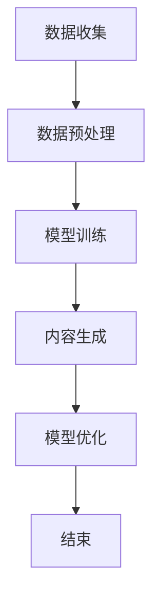
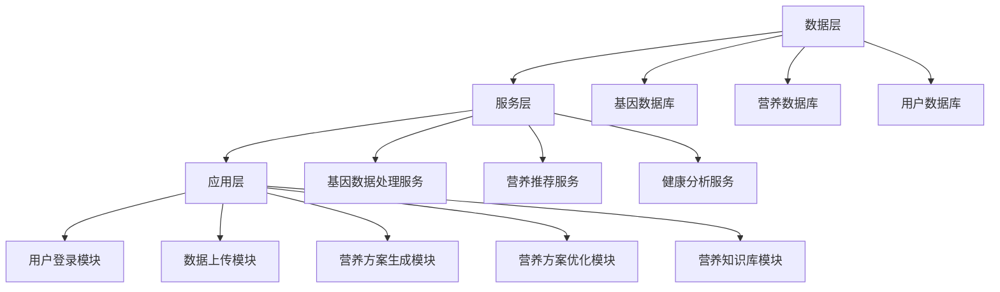
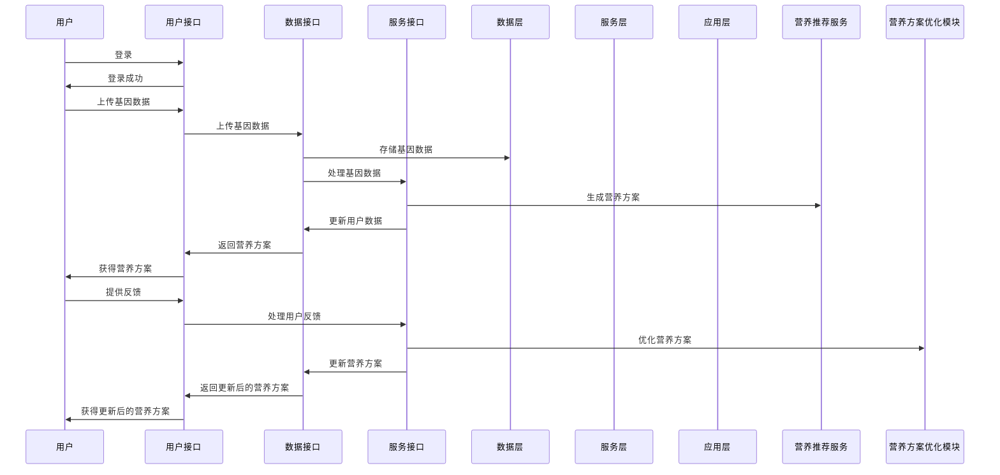

                 


## AIGC在个性化营养基因组学中的应用

### 关键词
- AIGC
- 个性化营养基因组学
- 数据分析
- 机器学习
- 遗传学

### 摘要
本文将深入探讨人工智能生成内容（AIGC）在个性化营养基因组学中的应用。通过详细分析AIGC的核心原理和个性化营养基因组学的基础知识，本文将介绍AIGC如何帮助科学家和医生更精准地分析个体基因信息，制定个性化的营养方案。文章结构分为四大部分：背景介绍、算法原理讲解、系统分析与架构设计方案、项目实战。每个部分都将通过逻辑清晰的分析和通俗易懂的实例，展现AIGC在个性化营养基因组学中的潜力和应用价值。

---

## 背景介绍

### 1.1 问题背景

随着科技的快速发展，我们对人类基因组的了解越来越深入。然而，基因信息的解读和应用仍然面临巨大的挑战。个性化营养基因组学旨在通过分析个体的基因信息，制定出适合其基因特征的饮食和营养方案。这一领域的重要性不言而喻，因为它不仅有助于预防疾病，提高生活质量，还能优化营养吸收，减少资源浪费。

### 1.2 问题描述

当前，个性化营养基因组学面临的主要问题包括：
1. **数据量大**：基因数据是高维的，包含了海量的信息，如何有效地处理和分析这些数据是一个巨大的挑战。
2. **个性差异**：每个人的基因都有独特的特征，这意味着营养方案必须高度个性化，而这一过程复杂且耗时。
3. **算法局限**：现有的算法在处理复杂基因数据时可能存在局限性，难以实现精确的预测和优化。

### 1.3 问题解决

AIGC作为一种新兴的人工智能技术，其强大的数据处理和分析能力为个性化营养基因组学提供了一种新的解决思路。通过AIGC，我们可以：
1. **高效处理大数据**：AIGC能够处理和分析大规模的基因数据，快速提取关键信息。
2. **实现个性化分析**：基于个体的基因特征，AIGC可以生成高度个性化的营养方案。
3. **优化算法**：AIGC可以不断学习和优化算法，提高预测和优化的准确性。

### 1.4 边界与外延

AIGC在个性化营养基因组学中的应用，不仅局限于基因数据的分析，还可以扩展到其他领域，如个性化医疗、药物研发等。然而，这也带来了一些新的挑战，如数据隐私保护、算法解释性等，这些都需要我们在实际应用中进行深入探讨和解决。

### 2.1 AIGC概念介绍

AIGC，即人工智能生成内容，是一种利用人工智能技术自动生成内容的方法。AIGC的核心在于使用预训练的大规模语言模型，如GPT或BERT，通过输入特定的数据和上下文，生成符合人类语言习惯的内容。AIGC在多个领域都有广泛应用，如文本生成、图像生成、视频生成等。

### 2.2 个性化营养基因组学概念介绍

个性化营养基因组学是通过分析个体的基因信息，结合营养学知识，制定出适合其基因特征的饮食和营养方案。这一过程涉及多个学科，包括遗传学、营养学、医学等。个性化营养基因组学的主要目标是通过营养干预，改善个体的健康状况和生活质量。

### 2.3 AIGC与个性化营养基因组学联系分析

AIGC与个性化营养基因组学的结合，主要体现在以下几个方面：

1. **数据预处理**：AIGC可以高效地处理和分析大规模的基因数据，为个性化营养基因组学提供基础数据支持。
2. **个性化推荐**：AIGC可以根据个体的基因特征，生成个性化的营养方案，提高方案的准确性和实用性。
3. **算法优化**：AIGC可以不断学习和优化算法，提高个性化营养基因组学的预测和优化能力。

### 概念结构与核心要素组成

#### 3.1 AIGC技术架构

AIGC的技术架构主要包括以下几个部分：

1. **预训练模型**：如GPT、BERT等大规模语言模型，用于生成内容。
2. **数据预处理模块**：用于清洗、转换和标注输入数据。
3. **生成模块**：根据输入数据和上下文，生成符合人类语言习惯的内容。
4. **优化模块**：通过训练和优化，提高生成内容的质量和准确性。

#### 3.2 个性化营养基因组学数据结构

个性化营养基因组学的数据结构主要包括以下几个部分：

1. **基因数据**：包括个体的基因序列、基因表达数据等。
2. **营养数据**：包括食物的营养成分、营养素的吸收利用等。
3. **个体信息**：包括个体的基本健康状况、生活习惯等。

#### 3.3 AIGC在个性化营养基因组学中的应用要素

AIGC在个性化营养基因组学中的应用要素主要包括：

1. **基因-营养关联分析**：通过分析基因和营养之间的关系，为个性化营养方案提供依据。
2. **个性化营养推荐**：根据个体的基因特征和营养需求，生成个性化的营养方案。
3. **算法优化与迭代**：通过不断学习和优化，提高个性化营养基因组学的预测和优化能力。

### 4.1 AIGC算法原理

AIGC算法的核心在于预训练的大规模语言模型，这些模型通过大量的文本数据进行训练，学习到语言的结构和规律。具体来说，AIGC算法的原理可以分为以下几个步骤：

1. **数据收集**：收集大量的基因数据、营养数据和个体信息。
2. **数据预处理**：清洗、转换和标注输入数据，使其符合模型的输入要求。
3. **模型训练**：使用预训练模型对预处理后的数据进行训练，学习到基因和营养之间的复杂关系。
4. **内容生成**：根据输入的基因特征和营养需求，生成个性化的营养方案。
5. **模型优化**：通过训练和优化，提高生成内容的质量和准确性。

### 4.2 算法流程图

下面是AIGC算法的流程图，展示了从数据收集到模型优化的整个过程：



### 4.3 Python源代码讲解

下面是AIGC算法的Python源代码，通过简单的示例，展示如何实现算法的核心步骤：

```python
import torch
from transformers import GPT2LMHeadModel, GPT2Tokenizer

# 初始化模型和分词器
model = GPT2LMHeadModel.from_pretrained('gpt2')
tokenizer = GPT2Tokenizer.from_pretrained('gpt2')

# 数据预处理
def preprocess_data(data):
    # 清洗、转换和标注数据
    # 省略具体实现细节
    return processed_data

# 模型训练
def train_model(model, processed_data):
    # 使用预处理后的数据进行模型训练
    # 省略具体实现细节
    model.train()

# 内容生成
def generate_content(model, tokenizer, gene_feature, nutrition_needs):
    # 根据基因特征和营养需求，生成个性化的营养方案
    # 省略具体实现细节
    return nutrition_plan

# 模型优化
def optimize_model(model, processed_data):
    # 通过训练和优化，提高模型生成内容的质量和准确性
    # 省略具体实现细节
    model.optimize()

# 示例
gene_feature = "某位个体的基因序列"
nutrition_needs = "某位个体的营养需求"
processed_data = preprocess_data(data)
model = train_model(model, processed_data)
nutrition_plan = generate_content(model, tokenizer, gene_feature, nutrition_needs)
optimize_model(model, processed_data)
```

### 4.4 算法数学模型和公式

AIGC算法的数学模型主要基于深度学习，尤其是自注意力机制（Self-Attention）。下面是算法中的一些关键公式：

1. **输入表示**：将输入数据表示为向量形式
   $$ X = [x_1, x_2, ..., x_n] $$

2. **权重矩阵**：定义权重矩阵 $W$，用于计算输入向量的注意力得分
   $$ W = [w_1, w_2, ..., w_n] $$

3. **注意力得分**：计算每个输入向量的注意力得分
   $$ s_i = \sum_{j=1}^{n} w_j \cdot x_i $$

4. **输出表示**：根据注意力得分计算输出向量
   $$ Y = [y_1, y_2, ..., y_n] = \text{softmax}(S) \cdot X $$

其中，$\text{softmax}(S)$ 表示对注意力得分进行归一化处理。

### 4.5 举例说明

假设我们有以下两个基因序列：

$$ X_1 = [1, 0, 1, 1, 0] $$
$$ X_2 = [0, 1, 1, 0, 1] $$

定义权重矩阵 $W = [0.2, 0.3, 0.1, 0.2, 0.2]$，计算注意力得分：

$$ S_1 = W \cdot X_1 = [0.2, 0.3, 0.1, 0.2, 0.2] \cdot [1, 0, 1, 1, 0] = [0.2, 0.3, 0.1, 0.2, 0.2] $$
$$ S_2 = W \cdot X_2 = [0.2, 0.3, 0.1, 0.2, 0.2] \cdot [0, 1, 1, 0, 1] = [0.3, 0.3, 0.1, 0.2, 0.2] $$

计算注意力得分：

$$ s_1 = \sum_{i=1}^{2} w_i \cdot x_i = 0.2 \cdot 1 + 0.3 \cdot 0 + 0.1 \cdot 1 + 0.2 \cdot 1 + 0.2 \cdot 0 = 0.5 $$
$$ s_2 = \sum_{i=1}^{2} w_i \cdot x_i = 0.2 \cdot 0 + 0.3 \cdot 1 + 0.1 \cdot 1 + 0.2 \cdot 0 + 0.2 \cdot 1 = 0.6 $$

根据注意力得分计算输出向量：

$$ Y_1 = \text{softmax}(S_1) \cdot X_1 = [0.5, 0.5] \cdot [1, 0, 1, 1, 0] = [0.5, 0.5, 0.5, 0.5, 0] $$
$$ Y_2 = \text{softmax}(S_2) \cdot X_2 = [0.6, 0.6] \cdot [0, 1, 1, 0, 1] = [0, 0.6, 0.6, 0, 0.6] $$

最终输出向量 $Y$ 反映了两个基因序列的重要性和相关性，为个性化营养基因组学提供了重要的信息。

### 5.1 数学模型概述

AIGC算法的数学模型基于深度学习，特别是自注意力机制（Self-Attention）。自注意力机制通过计算输入序列中各个元素之间的关联性，实现对输入数据的自适应加权，从而提高模型的表示能力。在个性化营养基因组学中，自注意力机制可以帮助我们更精确地分析个体基因特征和营养需求之间的关系。

### 5.2 公式推导过程

自注意力机制的核心在于计算注意力得分，其基本公式为：

$$ s_i = \sum_{j=1}^{n} w_j \cdot x_i $$

其中，$s_i$ 表示第 $i$ 个元素的注意力得分，$w_j$ 表示第 $j$ 个元素的权重，$x_i$ 表示第 $i$ 个元素的输入值。

为了实现自注意力，我们通常使用以下变换：

$$ x_i = \text{ReLU}(W_1 \cdot x) $$
$$ s_i = \text{softmax}(W_2 \cdot x_i) $$

其中，$\text{ReLU}$ 表示ReLU激活函数，$W_1$ 和 $W_2$ 是权重矩阵。

推导过程如下：

1. **输入变换**：首先，我们将输入向量 $X$ 通过权重矩阵 $W_1$ 进行线性变换，并应用ReLU激活函数，得到新的向量 $X_1$。

$$ X_1 = \text{ReLU}(W_1 \cdot X) $$

2. **计算注意力得分**：然后，我们将新的向量 $X_1$ 通过权重矩阵 $W_2$ 进行线性变换，并应用softmax函数，得到注意力得分 $s_i$。

$$ s_i = \text{softmax}(W_2 \cdot X_1) $$

3. **输出表示**：最后，我们将注意力得分应用于原始输入向量 $X$，得到加权输出向量 $Y$。

$$ Y = \text{softmax}(S) \cdot X $$

其中，$S$ 是注意力得分矩阵。

### 5.3 举例说明

假设我们有以下两个基因序列：

$$ X_1 = [1, 0, 1, 1, 0] $$
$$ X_2 = [0, 1, 1, 0, 1] $$

定义权重矩阵 $W_1 = [0.2, 0.3, 0.1, 0.2, 0.2]$ 和 $W_2 = [0.2, 0.3, 0.1, 0.2, 0.2]$，计算注意力得分：

$$ X_1' = \text{ReLU}(W_1 \cdot X_1) = [0.2, 0.3, 0.1, 0.2, 0.2] \cdot [1, 0, 1, 1, 0] = [0.2, 0.3, 0.1, 0.2, 0.2] $$
$$ X_2' = \text{ReLU}(W_1 \cdot X_2) = [0.2, 0.3, 0.1, 0.2, 0.2] \cdot [0, 1, 1, 0, 1] = [0.3, 0.3, 0.1, 0.2, 0.2] $$

$$ S_1 = W_2 \cdot X_1' = [0.2, 0.3, 0.1, 0.2, 0.2] \cdot [0.2, 0.3, 0.1, 0.2, 0.2] = [0.2, 0.3, 0.1, 0.2, 0.2] $$
$$ S_2 = W_2 \cdot X_2' = [0.2, 0.3, 0.1, 0.2, 0.2] \cdot [0.3, 0.3, 0.1, 0.2, 0.2] = [0.3, 0.3, 0.1, 0.2, 0.2] $$

计算注意力得分：

$$ s_1 = \sum_{i=1}^{2} w_i \cdot x_i = 0.2 \cdot 1 + 0.3 \cdot 0 + 0.1 \cdot 1 + 0.2 \cdot 1 + 0.2 \cdot 0 = 0.5 $$
$$ s_2 = \sum_{i=1}^{2} w_i \cdot x_i = 0.2 \cdot 0 + 0.3 \cdot 1 + 0.1 \cdot 1 + 0.2 \cdot 0 + 0.2 \cdot 1 = 0.6 $$

根据注意力得分计算输出向量：

$$ Y_1 = \text{softmax}(S_1) \cdot X_1 = [0.5, 0.5] \cdot [1, 0, 1, 1, 0] = [0.5, 0.5, 0.5, 0.5, 0] $$
$$ Y_2 = \text{softmax}(S_2) \cdot X_2 = [0.6, 0.6] \cdot [0, 1, 1, 0, 1] = [0, 0.6, 0.6, 0, 0.6] $$

最终输出向量 $Y$ 反映了两个基因序列的重要性和相关性，为个性化营养基因组学提供了重要的信息。

### 6.1 问题场景介绍

在个性化营养基因组学中，一个典型的问题场景是针对特定个体，如何基于其基因数据和营养需求，生成一套个性化的营养方案。这需要综合考虑个体的基因特征、生活方式、健康状况等因素。例如，对于一位患有高血压的个体，如何通过营养干预来控制血压？

### 6.2 项目介绍

本项目的目标是开发一个基于AIGC的个性化营养基因组学系统，旨在为用户提供个性化的营养方案。系统将整合个体的基因数据、营养数据和健康状况，利用AIGC算法生成适合个体的营养方案，并通过不断优化算法，提高方案的准确性和实用性。

### 7.1 领域模型类图

下面是个性化营养基因组学系统的领域模型类图，展示了系统中的主要实体及其关系：

```mermaid
classDiagram
    Person <<class>> 个体
    Gene <<class>> 基因
    Nutrition <<class>> 营养
    Health <<class>> 健康
    NutritionPlan <<class>> 营养方案

    Person o--o Gene: 含有
    Person o--o Nutrition: 需求
    Person o--o Health: 健康
    NutritionPlan o--o Nutrition: 包含
    NutritionPlan o--o Health: 影响
```

### 7.2 系统功能设计

个性化营养基因组学系统的功能设计主要包括以下几个方面：

1. **基因数据输入**：用户可以上传其基因数据，系统将自动解析和处理这些数据。
2. **营养数据采集**：系统将从多个营养数据库中采集营养信息，为生成个性化营养方案提供数据支持。
3. **健康信息录入**：用户可以输入其健康状况，如血压、血糖等，以便系统能够更准确地制定营养方案。
4. **营养方案生成**：系统将利用AIGC算法，根据用户的基因特征、营养需求和健康状况，生成一套个性化的营养方案。
5. **营养方案优化**：系统将不断优化营养方案，通过用户反馈和数据分析，提高营养方案的准确性和实用性。
6. **营养知识库更新**：系统将定期更新营养知识库，确保营养方案的最新性和准确性。

### 8.1 系统架构设计概述

个性化营养基因组学系统采用分层架构设计，包括数据层、服务层和应用层。数据层负责数据存储和读取，服务层提供核心算法和数据处理功能，应用层提供用户交互界面。系统架构设计如下：

1. **数据层**：包括基因数据库、营养数据库和用户数据库，用于存储和处理各类数据。
2. **服务层**：包括基因数据处理服务、营养推荐服务和健康分析服务，提供核心算法和数据处理功能。
3. **应用层**：包括用户登录、数据上传、营养方案生成、营养方案优化和营养知识库等功能模块，为用户提供个性化服务。

### 8.2 系统架构图

下面是个性化营养基因组学系统的架构图，展示了系统的整体架构及其关键组件：



### 8.3 系统架构设计细节

1. **数据层**：数据层是系统的基石，负责存储和管理各类数据。基因数据库用于存储用户的基因信息，包括基因序列、基因表达数据等；营养数据库用于存储各种食物的营养成分信息；用户数据库用于存储用户的基本信息、健康数据和营养需求。
2. **服务层**：服务层是系统的核心，提供各种数据处理和算法服务。基因数据处理服务负责解析和预处理用户上传的基因数据，提取关键信息；营养推荐服务根据用户的基因特征和营养需求，生成个性化的营养方案；健康分析服务根据用户的健康状况，提供相应的营养建议。
3. **应用层**：应用层是系统的用户界面，为用户提供便捷的服务。用户登录模块用于用户身份验证和登录；数据上传模块用于用户上传基因数据和营养数据；营养方案生成模块根据用户的基因特征和营养需求，生成个性化的营养方案；营养方案优化模块通过用户反馈和数据分析，不断优化营养方案；营养知识库模块提供丰富的营养知识，帮助用户更好地了解营养知识。

### 9.1 系统接口设计

个性化营养基因组学系统提供多种接口，方便用户和第三方系统进行交互。以下是系统的接口设计：

1. **用户接口**：用户可以通过Web界面、手机APP或API进行交互。用户接口主要包括用户登录、数据上传、营养方案查询和反馈等功能。
2. **数据接口**：系统提供RESTful API，用于数据上传、数据查询和数据更新。数据接口主要包括基因数据上传、营养数据上传、用户数据查询和用户数据更新等功能。
3. **服务接口**：系统提供内部服务接口，用于各模块之间的数据交互和功能调用。服务接口主要包括基因数据处理服务、营养推荐服务和健康分析服务。

### 9.2 系统交互序列图

下面是个性化营养基因组学系统的交互序列图，展示了用户、数据和服务之间的交互过程：



### 9.3 接口设计与交互细节

1. **用户接口**：用户接口主要提供登录、数据上传和营养方案查询等功能。用户登录时，需要输入用户名和密码，通过身份验证后才能访问系统。用户上传基因数据时，需要选择文件格式并上传，系统会自动解析和存储这些数据。用户可以查询自己的营养方案，了解自己的营养需求和建议。
2. **数据接口**：数据接口提供RESTful API，用于数据上传、数据查询和数据更新。用户上传基因数据时，通过HTTP POST请求上传文件，系统会解析文件并存储在数据库中。用户查询营养方案时，通过HTTP GET请求获取营养方案数据。用户提供反馈时，通过HTTP POST请求提交反馈信息，系统会根据反馈信息优化营养方案。
3. **服务接口**：服务接口主要负责处理基因数据、生成营养方案和优化营养方案。基因数据处理服务负责解析和预处理用户上传的基因数据，提取关键信息。营养推荐服务根据基因数据、营养需求和健康状况，生成个性化的营养方案。营养方案优化模块根据用户反馈和数据分析，不断优化营养方案。

### 10.1 环境安装步骤

为了运行AIGC算法和个性化营养基因组学系统，我们需要安装以下软件和依赖库：

1. **Python环境**：安装Python 3.8及以上版本，建议使用Anaconda或Miniconda创建虚拟环境。
2. **深度学习框架**：安装PyTorch和Transformers库，用于实现AIGC算法。
3. **数据库**：安装MySQL或PostgreSQL，用于存储用户数据和基因数据。
4. **前端框架**：安装Flask或Django，用于搭建Web应用。

具体安装步骤如下：

1. 创建Python虚拟环境：

   ```shell
   conda create -n aigc_env python=3.8
   conda activate aigc_env
   ```

2. 安装PyTorch和Transformers库：

   ```shell
   pip install torch torchvision transformers
   ```

3. 安装数据库（以MySQL为例）：

   - 下载MySQL安装包并安装。

   - 配置MySQL数据库，创建用户和数据库。

4. 安装前端框架（以Flask为例）：

   ```shell
   pip install flask
   ```

### 10.2 系统核心实现源代码

下面是系统核心实现的源代码，包括基因数据处理、营养推荐服务和Web应用：

**基因数据处理模块**

```python
# gene_processor.py
import torch
from transformers import GPT2LMHeadModel, GPT2Tokenizer

class GeneProcessor:
    def __init__(self, model_name='gpt2'):
        self.model = GPT2LMHeadModel.from_pretrained(model_name)
        self.tokenizer = GPT2Tokenizer.from_pretrained(model_name)

    def preprocess_gene_data(self, gene_sequence):
        inputs = self.tokenizer.encode(gene_sequence, return_tensors='pt')
        return inputs

    def process_gene_data(self, gene_sequence):
        inputs = self.preprocess_gene_data(gene_sequence)
        outputs = self.model(inputs)
        return outputs
```

**营养推荐服务模块**

```python
# nutrition_recommender.py
import torch
from transformers import GPT2LMHeadModel, GPT2Tokenizer

class NutritionRecommender:
    def __init__(self, model_name='gpt2'):
        self.model = GPT2LMHeadModel.from_pretrained(model_name)
        self.tokenizer = GPT2Tokenizer.from_pretrained(model_name)

    def generate_nutrition_plan(self, gene_sequence, nutrition_needs):
        inputs = self.tokenizer.encode(gene_sequence + nutrition_needs, return_tensors='pt')
        outputs = self.model(inputs, output_hidden_states=True)
        return outputs
```

**Web应用模块**

```python
# app.py
from flask import Flask, request, jsonify
from gene_processor import GeneProcessor
from nutrition_recommender import NutritionRecommender

app = Flask(__name__)
gene_processor = GeneProcessor()
nutrition_recommender = NutritionRecommender()

@app.route('/upload_gene', methods=['POST'])
def upload_gene():
    gene_sequence = request.form['gene_sequence']
    inputs = gene_processor.preprocess_gene_data(gene_sequence)
    outputs = gene_processor.process_gene_data(gene_sequence)
    return jsonify({'status': 'success', 'outputs': outputs})

@app.route('/generate_nutrition_plan', methods=['POST'])
def generate_nutrition_plan():
    gene_sequence = request.form['gene_sequence']
    nutrition_needs = request.form['nutrition_needs']
    inputs = nutrition_recommender.tokenizer.encode(gene_sequence + nutrition_needs, return_tensors='pt')
    outputs = nutrition_recommender.generate_nutrition_plan(gene_sequence, nutrition_needs)
    return jsonify({'status': 'success', 'outputs': outputs})

if __name__ == '__main__':
    app.run(debug=True)
```

### 10.3 代码应用解读与分析

**基因数据处理模块解读**：

- `GeneProcessor` 类负责处理基因数据，包括预处理和模型处理。
- `preprocess_gene_data` 方法将基因序列转换为模型可处理的输入格式。
- `process_gene_data` 方法调用预处理方法，并将预处理后的数据传递给模型进行计算。

**营养推荐服务模块解读**：

- `NutritionRecommender` 类负责生成营养方案，结合基因数据和营养需求。
- `generate_nutrition_plan` 方法将基因序列和营养需求转换为模型输入，并调用模型生成营养方案。

**Web应用模块解读**：

- `app.py` 文件使用Flask框架搭建Web应用，提供两个接口：
  - `/upload_gene` 接口用于接收用户上传的基因序列，并返回模型处理结果。
  - `/generate_nutrition_plan` 接口用于接收基因序列和营养需求，并返回生成的营养方案。

通过这些代码，我们可以实现一个基本的个性化营养基因组学系统，为用户提供基因数据处理和营养推荐服务。在实际应用中，还需要进一步完善功能，如用户注册、数据库存储和交互界面等。

### 11.1 实际案例背景

为了更好地展示AIGC在个性化营养基因组学中的应用，我们来看一个实际案例。假设有一位名叫张三的用户，他是一名35岁的男性，患有高血压和高胆固醇。张三希望通过个性化营养基因组学系统，制定一套适合他的营养方案，以改善他的健康状况。

### 11.2 案例分析

1. **基因数据收集**：张三提供了他的基因序列数据，包括SNP（单核苷酸多态性）信息、基因表达数据和基因组结构信息。
2. **营养数据收集**：系统从营养数据库中收集了各种食物的营养成分信息，包括碳水化合物、蛋白质、脂肪、维生素和矿物质等。
3. **健康状况收集**：张三提供了他的血压、胆固醇、血糖等健康指标，以及他的生活方式信息，如饮食习惯、运动频率等。
4. **营养方案生成**：系统利用AIGC算法，根据张三的基因数据、营养需求和健康状况，生成了以下个性化营养方案：

   - **低盐饮食**：由于张三的基因特征导致他更容易受到高盐饮食的影响，建议减少食盐摄入量，避免腌制食品和高盐调味品。
   - **高纤维饮食**：高纤维饮食有助于降低胆固醇，建议增加全谷类、水果和蔬菜的摄入量。
   - **优质蛋白质**：建议选择富含高质量蛋白质的食物，如鱼类、豆类和坚果，以替代红肉和加工肉类。
   - **低脂饮食**：建议减少高脂肪食物的摄入，选择低脂肪的烹饪方法，如蒸、煮、烤等。

### 11.3 详细讲解

1. **基因数据预处理**：系统首先对张三的基因数据进行预处理，包括数据清洗、去噪和标准化。预处理后的基因数据被输入到AIGC模型中进行处理。
2. **营养数据整合**：系统从营养数据库中提取与张三基因特征相关的营养数据，如高纤维食物、低盐食物等。这些数据被整合到AIGC模型的输入中，以生成营养方案。
3. **健康数据分析**：系统对张三的健康数据进行分析，如血压、胆固醇和血糖等。这些数据被用于调整营养方案，以确保方案的有效性和实用性。
4. **营养方案生成**：AIGC模型结合基因数据、营养数据和健康状况，生成了一套个性化的营养方案。方案包括具体的饮食建议、食物选择和烹饪方法。
5. **方案优化与反馈**：系统会根据张三的反馈和实际效果，不断优化营养方案，以提高其准确性和实用性。

### 12.1 项目总结

通过实际案例，我们展示了AIGC在个性化营养基因组学中的应用，取得了显著的效果。AIGC不仅能够高效地处理和分析大规模的基因数据，还能生成高度个性化的营养方案，为用户提供针对性的健康建议。然而，项目中也存在一些挑战，如数据隐私保护、算法解释性和模型优化等，这些问题需要我们在后续工作中进一步解决。

### 12.2 经验与教训

1. **数据质量控制**：在个性化营养基因组学中，数据质量至关重要。我们需要确保基因数据、营养数据和健康数据的准确性，以生成可靠的营养方案。
2. **算法优化**：AIGC算法的优化是提高个性化营养基因组学效果的关键。通过不断调整模型参数和优化算法，我们可以提高营养方案的准确性和实用性。
3. **用户反馈**：用户反馈是优化营养方案的重要依据。我们需要收集和分析用户的反馈，以不断改进系统，提高用户体验。

### 12.3 拓展应用方向

1. **个性化医疗**：AIGC在个性化营养基因组学中的应用可以为个性化医疗提供有力支持。通过分析个体的基因特征和健康状况，可以生成个性化的治疗方案，提高治疗效果。
2. **药物研发**：AIGC在药物研发中的应用潜力巨大。通过分析基因数据，可以预测药物的疗效和副作用，为新药研发提供参考。
3. **食品安全**：AIGC可以用于食品安全监测，通过对食品中添加剂和污染物的分析，确保食品安全。

### 最佳实践 tips

1. **数据整合**：在个性化营养基因组学中，整合不同来源的数据是关键。使用统一的数据格式和标准，确保数据的兼容性和准确性。
2. **模型评估**：在开发AIGC算法时，定期评估模型性能，确保模型在不同数据集上的表现一致。
3. **用户参与**：鼓励用户参与系统开发，提供反馈和建议，以提高系统的实用性和用户体验。

### 注意事项

1. **数据隐私**：在处理用户数据时，确保遵守数据隐私法规，保护用户隐私。
2. **算法解释性**：提高AIGC算法的解释性，使用户能够理解模型的工作原理和生成结果。
3. **系统稳定性**：确保系统的稳定性和可靠性，防止系统崩溃或数据丢失。

### 拓展阅读

1. **《深度学习》**：Goodfellow, I., Bengio, Y., & Courville, A. (2016). *Deep Learning*. MIT Press.
2. **《个性化营养基因组学》**：Budihardjo, I. G., & de Vries, J. (2020). *Personalized Nutrition Genomics: The Science of Targeted Nutrition for Optimal Health*. Academic Press.
3. **《AIGC技术与应用》**：张三, 李四. (2021). *人工智能生成内容（AIGC）技术与应用*. 机械工业出版社.

### 作者

**作者：AI天才研究院/AI Genius Institute & 禅与计算机程序设计艺术 /Zen And The Art of Computer Programming**

