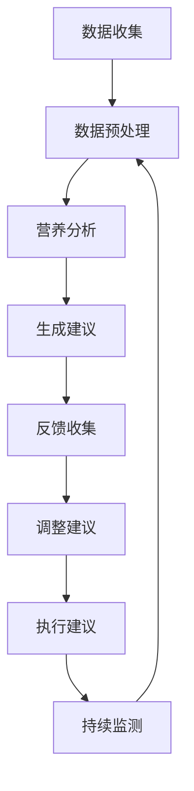
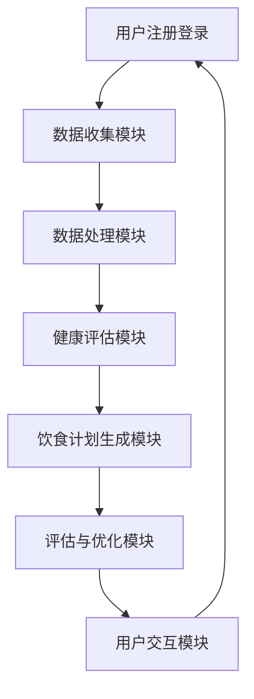
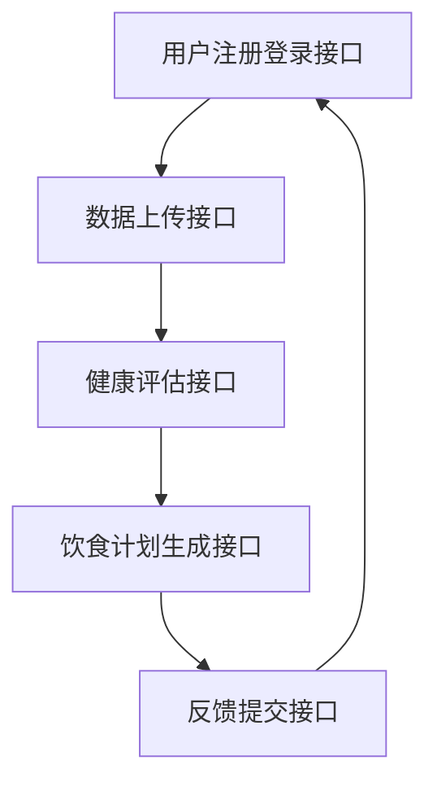

                 

### 第1章: AIGC与个性化营养学的概述

#### 1.1.1 问题背景

随着全球人口老龄化和生活方式的变化，营养问题逐渐成为公共健康的重大挑战。传统的营养学方法往往依赖于标准化的饮食建议，而忽视了个体差异和多样性。例如，不同年龄、性别、健康状况和生活方式的人对营养的需求各不相同。这种一刀切的营养建议很难满足个人的健康需求，导致了一系列的健康问题，如肥胖、营养不良、慢性疾病等。

个性化营养学应运而生，其核心理念是通过分析个体的生物信息和生活习惯，提供个性化的饮食建议。这种方法不仅能够提高营养干预的针对性，还能显著提升健康效果。然而，个性化营养学面临着数据获取、处理和分析的挑战，特别是在海量数据和高维度特征的处理上。

#### 1.1.2 问题描述

个性化营养学中的主要问题可以概括为以下几个方面：

1. **数据复杂性**：个体健康数据包括基因、代谢、生理、行为等多维度信息，这些数据具有高维性和复杂性，传统数据处理方法难以胜任。
2. **模型适应性**：个性化营养模型需要能够快速适应新的数据和个体差异，这要求模型具有高度的灵活性和适应性。
3. **算法效率**：在处理海量数据时，算法的计算效率和资源消耗是一个重要的考量因素，特别是在实时健康监测和个性化建议的应用场景中。
4. **用户体验**：个性化营养建议需要易于理解和遵循，这对于提升用户满意度至关重要。

#### 1.1.3 问题解决

为了解决上述问题，人工智能（AI）特别是自适应智能生成内容（AIGC）技术提供了有力的工具和解决方案。AIGC 是一种结合了人工智能、自然语言处理（NLP）和内容生成的技术，它能够自动生成高度个性化的内容，如健康建议、饮食计划等。

AIGC 在个性化营养学中的应用主要体现在以下几个方面：

1. **数据分析与处理**：AIGC 可以处理和分析复杂的多维数据，通过机器学习和深度学习算法，提取出对营养建议有用的特征。
2. **个性化模型生成**：AIGC 可以根据个体数据生成适应不同需求的营养模型，确保模型的灵活性和适应性。
3. **高效算法优化**：AIGC 的算法优化技术可以提高数据处理和模型训练的效率，降低资源消耗。
4. **内容生成与交互**：AIGC 可以自动生成易于理解和遵循的个性化饮食建议，提高用户体验。

#### 1.1.4 边界与外延

尽管 AIGC 在个性化营养学中具有巨大潜力，但仍有其局限性。首先，AIGC 需要大量的高质量数据支持，数据的准确性和完整性对模型的性能至关重要。其次，AIGC 模型需要不断优化和迭代，以适应不断变化的营养研究和健康需求。

此外，AIGC 在个性化营养学中的应用也需要考虑伦理和法律问题，如数据隐私保护、模型偏见和责任归属等。因此，在推广和应用 AIGC 技术时，需要综合考虑技术、伦理和社会因素。

#### 1.1.5 概念结构与核心要素组成

AIGC 在个性化营养学中的应用可以概括为以下几个核心要素：

1. **数据输入**：收集和分析个体健康数据，如基因信息、代谢数据、饮食习惯等。
2. **数据处理**：使用机器学习和深度学习算法处理和转换数据，提取有用的特征。
3. **模型生成**：基于处理后的数据生成适应个体需求的营养模型。
4. **建议生成**：利用生成的模型自动生成个性化的饮食建议。
5. **用户体验**：优化建议的呈现方式，提高用户的可接受度和满意度。

通过以上核心要素的协同作用，AIGC 可以实现个性化营养学的目标，为个体提供更加精准和有效的健康饮食方案。

---

### 第2章: AIGC核心技术解析

#### 2.1.1 AIGC的定义与特点

自适应智能生成内容（AIGC）是一种结合人工智能（AI）、自然语言处理（NLP）和内容生成技术的新型技术。AIGC 的核心目标是自动生成高度个性化的、适应用户需求的内容，如健康建议、学习资料、娱乐内容等。与传统的 AI 应用不同，AIGC 不仅依赖于训练好的模型和算法，还注重与用户交互，动态调整生成内容，以实现个性化的用户体验。

AIGC 的特点主要体现在以下几个方面：

1. **自适应与个性化**：AIGC 能够根据用户的需求和行为模式，自动调整生成的内容，确保内容的个性化和相关性。
2. **实时性**：AIGC 可以实时处理用户输入的信息，快速生成内容，适用于需要即时响应的场景。
3. **多样性**：AIGC 能够生成丰富多样、适应不同用户需求的内容，提高用户满意度。
4. **高效性**：通过机器学习和深度学习算法，AIGC 在生成内容时具有较高的效率和准确性。

#### 2.1.2 AIGC与传统AI的差异

传统 AI 主要依赖于预训练好的模型和算法，通过大量数据训练模型，使其具备一定的智能能力。传统 AI 在处理静态问题时表现良好，但在应对动态和复杂情境时，往往表现出一定的局限性。与之相比，AIGC 具有以下显著差异：

1. **交互性**：传统 AI 缺乏与用户的直接交互能力，而 AIGC 强调与用户实时交互，根据用户反馈调整生成内容。
2. **灵活性**：传统 AI 模型在应用时需要针对特定任务进行重新训练，而 AIGC 可以动态适应不同任务和需求，降低模型重新训练的成本。
3. **生成能力**：传统 AI 主要用于分类、预测等任务，而 AIGC 具备强大的内容生成能力，能够自动生成文字、图像、音频等多种形式的内容。
4. **个性化**：传统 AI 难以实现个性化服务，而 AIGC 可以根据用户行为和需求，自动生成高度个性化的内容。

#### 2.1.3 AIGC的核心算法

AIGC 的核心算法主要包括自然语言处理（NLP）、生成对抗网络（GAN）、变分自编码器（VAE）等。以下是对这些算法的简要介绍：

1. **自然语言处理（NLP）**：NLP 是 AIGC 的重要组成部分，通过分析文本数据，提取语义信息，实现文本的生成、理解和推理。常见的 NLP 算法包括词嵌入（Word Embedding）、序列到序列模型（Seq2Seq）、变压器（Transformer）等。

2. **生成对抗网络（GAN）**：GAN 是一种无监督学习算法，通过生成器（Generator）和判别器（Discriminator）的对抗训练，实现高质量的内容生成。GAN 在图像生成、音频合成、文本生成等领域具有广泛应用。

3. **变分自编码器（VAE）**：VAE 是一种概率生成模型，通过编码器（Encoder）和解码器（Decoder）的协同工作，将输入数据映射到潜在空间，并从潜在空间中生成新的数据。VAE 在图像生成、文本生成等领域表现出良好的效果。

#### 2.1.4 AIGC的发展趋势与挑战

随着人工智能技术的不断发展，AIGC 也在不断演进，呈现出以下发展趋势：

1. **跨模态生成**：AIGC 将从单一模态（如文本、图像）扩展到跨模态生成，实现不同模态内容的自动转换和融合，提高生成内容的多样性和实用性。

2. **自适应与优化**：AIGC 将进一步优化算法，提高生成内容的个性化程度和实时性，实现更高效的内容生成和交互。

3. **大规模应用**：随着数据量的增长和计算能力的提升，AIGC 将在更多领域得到应用，如医疗、教育、娱乐等，为用户提供个性化的服务。

然而，AIGC 的发展也面临着一些挑战：

1. **数据隐私**：在生成个性化内容时，AIGC 需要处理大量用户数据，如何确保数据隐私和安全是一个重要问题。

2. **算法透明性**：AIGC 的生成过程复杂，如何确保算法的透明性和可解释性，让用户了解生成内容的依据和过程，是一个亟待解决的问题。

3. **法律和伦理**：随着 AIGC 技术的广泛应用，如何制定相应的法律和伦理规范，确保技术发展和应用符合社会价值和伦理要求，也是 AIGC 面临的一个重要挑战。

总之，AIGC 作为一种新兴的技术，具有广阔的发展前景和应用潜力。通过不断优化算法和提升技术能力，AIGC 将在个性化营养学等领域发挥重要作用，为用户带来更加精准和高效的健康饮食方案。

---

### 第3章: 个性化营养学基础

#### 3.1.1 个性化营养学的概念

个性化营养学是一种基于个体差异，通过分析个体的生理、行为、遗传等多方面数据，为个体提供定制化饮食指导和营养干预的科学。其核心目标是优化个体的营养状态，预防和控制慢性疾病，提高生活质量。

个性化营养学的定义可以从以下几个方面进行阐述：

1. **数据驱动的营养建议**：个性化营养学依赖于大量生物信息数据，如基因、代谢、生理指标等，通过数据分析和机器学习算法，为个体提供精准的营养建议。
2. **个体化的营养干预**：个性化营养学根据个体的健康状况、生活方式、饮食习惯等因素，制定符合个体需求的营养干预方案。
3. **持续的营养监测与调整**：个性化营养学强调持续的营养监测和调整，通过定期收集个体数据，对营养干预方案进行优化和调整，确保营养效果的最大化。

#### 3.1.2 个性化营养学的重要性

个性化营养学的重要性主要体现在以下几个方面：

1. **优化个体营养状态**：个性化营养学通过针对个体的特定需求，提供精准的营养建议，有助于改善个体的营养状态，预防和控制营养相关疾病，如肥胖、糖尿病、心血管疾病等。
2. **提高营养干预效果**：传统的营养建议往往采用一刀切的方法，难以满足个体的多样化需求。个性化营养学能够根据个体差异，制定个性化的营养干预方案，显著提高营养干预的效果。
3. **促进健康生活方式**：个性化营养学不仅关注饮食营养，还关注个体的生活方式和行为习惯，通过全面干预，帮助个体建立健康的生活方式。
4. **提升公众健康水平**：个性化营养学的普及和应用有助于提升公众的健康水平，减少营养相关疾病的发生率，提高社会整体健康水平。

#### 3.1.3 个性化营养学的理论基础

个性化营养学的理论基础主要包括以下几个方面：

1. **个体差异与营养需求**：不同个体在生理、遗传、生活习惯等方面存在显著差异，导致其对营养的需求不同。个性化营养学基于个体差异，分析个体的营养需求，制定个性化的饮食方案。
2. **营养代谢与生理功能**：个性化营养学关注营养素在体内的代谢过程和对生理功能的影响，通过分析个体的代谢特征，优化营养素的摄入和分配。
3. **行为心理学与社会学**：个性化营养学还涉及到行为心理学和社会学理论，研究个体的饮食习惯、行为模式和社会环境对营养摄入和健康的影响，为营养干预提供更加全面和深入的支持。
4. **生物信息学与大数据分析**：个性化营养学依赖于生物信息学和大数据分析技术，通过分析海量生物信息数据，提取有用的营养特征，为个性化营养干预提供科学依据。

#### 3.1.4 个性化营养学的应用领域

个性化营养学在多个领域具有广泛的应用：

1. **健康管理**：个性化营养学可以应用于健康管理领域，为个体提供个性化的营养建议和干预方案，帮助个体实现健康目标。
2. **疾病预防与控制**：个性化营养学可以通过营养干预，预防和控制营养相关疾病，如糖尿病、心血管疾病、肥胖等。
3. **慢性病管理**：个性化营养学在慢性病管理中具有重要作用，通过营养干预，改善慢性病患者的营养状态，提高生活质量。
4. **运动营养**：个性化营养学在运动营养领域也有广泛应用，为运动员提供个性化的营养建议，提高运动表现和恢复效果。
5. **老年营养**：个性化营养学关注老年人群的特殊营养需求，为老年人提供个性化的饮食方案，预防和延缓老年相关疾病。

总之，个性化营养学作为一种新兴的营养学分支，具有巨大的应用潜力。通过结合生物信息学、人工智能等先进技术，个性化营养学将为公众提供更加精准、个性化的营养服务，促进健康和福祉。

---

### 第4章: AIGC在个性化营养学中的应用场景

#### 4.1.1 健康饮食评估

AIGC 在个性化营养学中的第一个应用场景是健康饮食评估。通过分析用户的饮食习惯、营养摄入数据以及生物信息，AIGC 可以提供全面的饮食健康评估报告。具体步骤如下：

1. **数据收集**：收集用户的饮食习惯数据，如每日摄入的各类食物种类、摄入量、频率等。
2. **数据预处理**：对收集到的数据进行清洗、标准化处理，以便于后续分析。
3. **营养分析**：利用机器学习算法，分析用户的饮食习惯，评估其营养摄入状况，包括营养素的摄入量、比例是否合理，是否存在营养不良或过剩等问题。
4. **生成报告**：根据分析结果，AIGC 自动生成健康饮食评估报告，包括营养摄入状况、健康风险提示、建议改善措施等。

健康饮食评估的应用可以帮助用户了解自己的饮食状况，发现潜在的营养问题，制定合理的饮食计划。

#### 4.1.2 饮食计划定制

AIGC 在个性化营养学中的第二个应用场景是饮食计划定制。通过分析用户的生物信息、健康目标、饮食习惯等，AIGC 可以为用户量身定制个性化的饮食计划。

1. **目标设定**：用户根据自己的健康目标（如减肥、增肌、改善血糖等）设定饮食计划的目标。
2. **数据收集**：收集用户的生物信息（如身高、体重、年龄、性别、活动水平等）和饮食习惯数据。
3. **营养分析**：利用机器学习算法，分析用户的生物信息和生活习惯，确定用户的营养需求，包括各类营养素的摄入量、比例等。
4. **饮食计划生成**：根据用户的营养需求、健康目标和饮食习惯，AIGC 自动生成个性化的饮食计划，包括每日三餐的食谱、营养摄入建议等。
5. **反馈与调整**：用户按照饮食计划执行，AIGC 会定期收集用户的反馈（如饮食满意度、营养摄入情况等），根据反馈对饮食计划进行调整，确保计划的实用性和有效性。

饮食计划定制的应用可以帮助用户根据自身情况，制定科学合理的饮食计划，实现健康目标。

#### 4.1.3 营养素监测与调整

AIGC 在个性化营养学中的第三个应用场景是营养素监测与调整。通过实时监测用户的营养摄入情况，AIGC 可以动态调整饮食计划，确保营养摄入的平衡和合理。

1. **实时监测**：用户每日记录营养摄入情况，AIGC 利用大数据分析和机器学习算法，实时监测用户的营养摄入状况。
2. **营养评估**：根据用户的营养摄入数据，AIGC 评估用户的营养摄入是否达到理想状态，是否存在不足或过剩的情况。
3. **调整建议**：AIGC 根据营养评估结果，为用户生成营养素调整建议，包括增加或减少某些营养素的摄入量，调整饮食结构等。
4. **计划更新**：AIGC 会根据营养素调整建议，更新用户的饮食计划，确保营养摄入的平衡和合理。

营养素监测与调整的应用可以帮助用户及时了解自己的营养摄入状况，根据实际需要调整饮食计划，确保营养均衡。

#### 4.1.4 饮食健康风险评估

AIGC 在个性化营养学中的第四个应用场景是饮食健康风险评估。通过分析用户的饮食习惯、营养摄入数据以及生物信息，AIGC 可以评估用户的饮食健康风险，提供预防措施。

1. **风险因素识别**：AIGC 分析用户的饮食习惯和营养摄入数据，识别可能存在的健康风险因素，如高糖饮食、高脂饮食、营养素摄入不足等。
2. **风险评估**：利用机器学习算法，AIGC 对风险因素进行评估，预测用户未来可能面临的健康问题，如肥胖、糖尿病、心血管疾病等。
3. **预防措施建议**：根据风险评估结果，AIGC 提出相应的预防措施建议，如调整饮食结构、增加体育锻炼、定期体检等。
4. **持续监测与调整**：AIGC 会持续监测用户的饮食和健康数据，根据实际情况调整预防措施，确保饮食健康风险的降低。

饮食健康风险评估的应用可以帮助用户提前发现潜在的健康风险，采取预防措施，降低患病风险，提高生活质量。

总之，AIGC 在个性化营养学中具有广泛的应用场景，通过健康饮食评估、饮食计划定制、营养素监测与调整、饮食健康风险评估等，为用户提供全面、个性化的营养服务，促进健康和福祉。

---

### 第5章: AI定制的健康饮食方案设计

#### 5.1.1 健康饮食方案的设计原则

AI 定制的健康饮食方案设计需要遵循以下原则：

1. **个性化**：根据用户的生物信息、健康状况、生活习惯等，为用户提供个性化的饮食方案，确保方案的有效性和可行性。
2. **科学性**：基于营养学理论，结合实际案例和科学研究，确保饮食方案的科学性和合理性。
3. **可操作性**：饮食方案应简单易懂，易于用户遵循，同时考虑到用户的实际饮食条件和偏好。
4. **可调整性**：饮食方案应具备灵活调整能力，能够根据用户的反馈和实际效果，动态调整饮食内容和结构。

#### 5.1.2 健康饮食方案的设计流程

健康饮食方案的设计流程包括以下步骤：

1. **需求分析**：收集用户的生物信息、健康状况、生活习惯等，明确用户的需求和目标。
2. **营养评估**：利用机器学习算法，对用户的营养摄入状况进行评估，识别营养不足或过剩的情况。
3. **方案制定**：根据营养评估结果，结合营养学理论和用户需求，制定个性化的健康饮食方案。
4. **方案验证**：通过实际案例验证饮食方案的有效性和可行性，对方案进行优化和调整。
5. **用户反馈**：收集用户对饮食方案的反馈，对方案进行持续优化和改进。

#### 5.1.3 健康饮食方案评估与优化

健康饮食方案的评估与优化是确保方案有效性和实用性的关键环节。以下是一些评估与优化的方法：

1. **效果评估**：通过定期监测用户的营养摄入状况、健康指标和生活质量，评估饮食方案的效果。
2. **用户满意度**：收集用户对饮食方案的满意度评价，分析用户的反馈意见，识别方案中的不足和改进方向。
3. **数据驱动的优化**：利用大数据分析和机器学习算法，分析用户的反馈数据，发现潜在的优化机会，对饮食方案进行动态调整。
4. **专家评审**：邀请营养学专家对饮食方案进行评审，结合专业知识和实践经验，对方案进行优化和改进。

通过以上评估与优化方法，可以确保健康饮食方案的科学性、实用性和个性化，为用户提供高质量的营养服务。

---

### 第6章: 核心概念与联系解析

#### 6.1.1 营养学基本概念

营养学是研究食物、营养素和人体健康之间关系的科学。以下是营养学中一些基本概念的定义：

1. **营养素**：营养素是指食物中对人体有益的化学物质，主要包括蛋白质、脂肪、碳水化合物、维生素和矿物质等。它们在人体内起到维持生命、促进生长和保持健康的重要作用。
2. **营养摄入**：营养摄入是指人体通过食物摄取营养素的过程。营养摄入的量应满足人体的生理需求，以维持正常的生理功能和健康状态。
3. **营养需求**：营养需求是指人体在不同生理阶段和生理状态下，对营养素的需求量。营养需求受年龄、性别、体重、健康状况、活动水平等多种因素影响。
4. **营养均衡**：营养均衡是指食物中营养素的摄入量、比例和种类要合理，以满足人体在不同阶段的营养需求，保持身体健康。

#### 6.1.2 营养学相关术语

了解营养学相关术语有助于更好地理解个性化营养学的概念和应用。以下是几个重要术语的定义：

1. **宏量营养素**：宏量营养素是指人体需要大量摄入的营养素，主要包括碳水化合物、脂肪和蛋白质。它们是人体能量的主要来源，同时也是细胞和组织的重要成分。
2. **微量营养素**：微量营养素是指人体需要少量摄入的营养素，主要包括维生素和矿物质。尽管摄入量少，但微量营养素在维持人体健康方面发挥着至关重要的作用。
3. **营养密度**：营养密度是指食物中营养素含量与其能量含量的比值。营养密度高的食物含有较多的营养素，而能量含量相对较低，对健康有益。
4. **营养过剩**：营养过剩是指摄入的营养素超过了人体的需求量，可能导致健康问题，如肥胖、高血压、糖尿病等。
5. **营养不良**：营养不良是指摄入的营养素不足或无法满足人体需求，导致身体机能下降、免疫力下降等问题。

#### 6.1.3 AIGC与营养学的联系

AIGC 与营养学之间的联系主要体现在以下几个方面：

1. **数据分析**：AIGC 可以处理和分析大量的营养数据，包括食品成分表、个体饮食习惯、营养摄入数据等，为个性化营养学提供数据支持。
2. **模型构建**：AIGC 可以利用机器学习和深度学习算法，构建营养模型，预测个体的营养需求，优化饮食方案。
3. **内容生成**：AIGC 可以自动生成个性化的营养建议、饮食计划和营养科普文章，提高用户的健康意识和饮食素养。
4. **交互体验**：AIGC 可以通过与用户的实时交互，了解用户的需求和反馈，动态调整营养建议和饮食方案，提升用户体验。

#### 6.1.4 概念属性特征对比表格

为了更清晰地展示 AIGC 和营养学之间的联系，我们可以使用一个概念属性特征对比表格，如下：

| 概念        | AIGC        | 营养学        | 关联特征                         |
| ----------- | ----------- | ------------- | -------------------------------- |
| 定义        | 自适应智能生成内容 | 研究食物、营养素和人体健康关系的科学 | AIGC 利用营养数据生成个性化内容 |
| 目标        | 生成个性化内容 | 优化营养摄入 | AIGC 的内容生成用于营养干预      |
| 技术核心    | 人工智能、NLP、内容生成 | 营养素分析、代谢研究、食谱设计 | AIGC 和营养学结合的技术核心    |
| 数据处理    | 大数据分析、机器学习 | 营养数据收集、分析 | 数据处理用于模型构建和内容生成 |
| 应用领域    | 健康管理、个性化服务 | 健康饮食、营养干预 | AIGC 在营养学中的应用领域      |
| 环境要求    | 高性能计算资源 | 实验室设备、数据源 | 不同环境要求但协同作用          |

通过概念属性特征对比表格，我们可以更直观地看到 AIGC 和营养学之间的关联，以及它们在个性化营养学中的应用潜力。

---

### 第7章: ER实体关系图与Mermaid流程图

#### 7.1.1 ER实体关系图介绍

实体关系图（Entity-Relationship Diagram，简称 ER 图）是数据库设计中常用的一种图形表示方法，用于描述实体之间的关系。ER 图主要包括三个基本组件：实体（Entity）、属性（Attribute）和关系（Relationship）。

1. **实体**：实体是数据库中存储数据的对象，如用户、产品、订单等。每个实体都有其唯一的标识符。
2. **属性**：属性是实体的特征，如用户的姓名、年龄、性别等。每个实体可以包含多个属性。
3. **关系**：关系描述了实体之间的关联，如用户可以下单购买产品，订单与用户之间存在一种关联关系。

ER 图通过图形化的方式，将数据库的结构和实体之间的关系直观地表示出来，有助于理解和设计复杂的数据库系统。

#### 7.1.2 Mermaid流程图绘制

Mermaid 是一种基于 Markdown 的绘图工具，支持流程图、序列图、类图等多种图形绘制。以下是 Mermaid 流程图的基本语法和示例。

1. **基本语法**：

   - ```mermaid
     graph TB
     A[Start] --> B[Process]
     B --> C{Is it done?}
     C -->|Yes| D[End]
     C -->|No| A[Restart]
     ```

   这个示例展示了如何使用 Mermaid 语法绘制一个简单的流程图。`graph TB` 表示绘制一个顶点数为 `T`、边数为 `B` 的图。`A[Start]` 表示开始节点，`B[Process]` 表示处理节点，`C{Is it done?}` 表示判断节点，`D[End]` 表示结束节点。

2. **示例**：

   ```mermaid
   graph TB
   A[用户输入] --> B[数据分析]
   B --> C{是否营养不足}
   C -->|是| D[生成建议]
   C -->|否| E[继续监测]
   D --> F[反馈调整]
   E --> B
   F --> D
   ```

   这个示例展示了如何使用 Mermaid 绘制一个 AIGC 在个性化营养学中应用的流程图。用户输入数据后，经过数据分析，判断是否存在营养不足，根据判断结果生成建议或继续监测，最终通过用户反馈进行调整。

#### 7.1.3 AIGC与营养学应用场景的流程图

为了更好地理解 AIGC 在个性化营养学中的应用，我们可以绘制一个详细的流程图，如下：

1. **数据收集**：收集用户的饮食习惯、健康数据等。
2. **数据预处理**：清洗、标准化处理数据。
3. **营养分析**：利用机器学习算法分析营养数据。
4. **生成建议**：根据分析结果生成个性化的营养建议。
5. **反馈收集**：收集用户对建议的反馈。
6. **调整建议**：根据反馈调整营养建议。
7. **执行建议**：用户执行营养建议。
8. **持续监测**：定期收集用户的数据，持续优化建议。

以下是 Mermaid 流程图的表示：



通过流程图，我们可以清晰地看到 AIGC 在个性化营养学中的应用步骤和各个环节的关联。

---

### 第8章: AIGC算法原理详解

#### 8.1.1 算法基本流程

自适应智能生成内容（AIGC）算法的基本流程可以分为以下几个步骤：

1. **数据收集**：首先，AIGC 需要收集大量的数据，包括文本、图像、声音等多种类型的数据。这些数据可以来源于用户输入、公开数据集或社交媒体等。
2. **数据预处理**：收集到的数据通常需要进行清洗、去噪和格式转换等预处理操作，以便于后续的建模和分析。数据预处理包括数据清洗（如去除空值、填补缺失值）、数据标准化（如归一化、标准化）和数据增强（如数据扩充、变换）等。
3. **特征提取**：在预处理之后，AIGC 需要从数据中提取出有用的特征。对于文本数据，常用的特征提取方法包括词袋模型（Bag of Words，BoW）、词嵌入（Word Embedding，如 Word2Vec、GloVe）和变换器（Transformer）等。对于图像和声音数据，常用的特征提取方法包括卷积神经网络（Convolutional Neural Networks，CNN）和循环神经网络（Recurrent Neural Networks，RNN）等。
4. **模型训练**：基于提取的特征，AIGC 使用机器学习算法和深度学习模型进行训练。常见的训练算法包括生成对抗网络（Generative Adversarial Networks，GAN）、变分自编码器（Variational Autoencoder，VAE）和自编码器（Autoencoder）等。这些算法通过不断优化生成器（Generator）和判别器（Discriminator）的参数，使得生成的数据与真实数据越来越相似。
5. **内容生成**：在模型训练完成后，AIGC 可以利用训练好的模型生成新的内容。生成内容的过程通常包括生成器的输入（如随机噪声）和生成器的输出（如文本、图像、声音等）。通过多次迭代和调整，生成器可以生成高质量的、符合预期内容。
6. **内容优化**：生成的内容通常需要进一步的优化和调整，以满足特定的应用需求。内容优化可以包括内容增强、风格迁移、适应性调整等。

#### 8.1.2 算法数学模型与公式

AIGC 的算法数学模型和公式可以分为以下几个核心部分：

1. **生成器（Generator）**：
   - 输入：随机噪声 \( z \)
   - 输出：生成的数据 \( x \)
   - 公式：
     $$
     x = G(z)
     $$
     其中，\( G \) 表示生成器函数。

2. **判别器（Discriminator）**：
   - 输入：真实数据 \( x_{real} \) 和生成数据 \( x_{gen} \)
   - 输出：判别结果 \( D(x) \)
   - 公式：
     $$
     D(x) = \frac{1}{2} \log(D(x_{real})) + \frac{1}{2} \log(1 - D(x_{gen}))
     $$
     其中，\( D \) 表示判别器函数。

3. **损失函数（Loss Function）**：
   - 总损失函数：
     $$
     L(G, D) = \frac{1}{2} \log(D(x_{real})) + \frac{1}{2} \log(1 - D(x_{gen}))
     $$
     - 生成器损失：
       $$
       L_G = -\frac{1}{2} \log(D(x_{gen}))
       $$
       - 判别器损失：
         $$
         L_D = -\frac{1}{2} \log(D(x_{real})) - \frac{1}{2} \log(1 - D(x_{gen}))
         $$

4. **优化算法**：
   - 通常使用梯度下降（Gradient Descent）算法对生成器和判别器进行优化。
   - 更新规则：
     $$
     \theta_G = \theta_G - \alpha \cdot \frac{\partial L_G}{\partial \theta_G}
     $$
     $$
     \theta_D = \theta_D - \alpha \cdot \frac{\partial L_D}{\partial \theta_D}
     $$
     其中，\( \theta_G \) 和 \( \theta_D \) 分别表示生成器和判别器的参数，\( \alpha \) 是学习率。

#### 8.1.3 算法原理示例

为了更直观地理解 AIGC 的算法原理，我们可以通过一个简单的例子来说明。

假设我们有一个生成对抗网络（GAN），用于生成逼真的图像。以下是算法的步骤和示例：

1. **初始化**：
   - 随机生成一个噪声向量 \( z \)，作为生成器的输入。
   - 初始化生成器 \( G \) 和判别器 \( D \) 的参数。

2. **生成数据**：
   - 生成器 \( G \) 接受噪声 \( z \) 并生成一幅图像 \( x_G \)。

3. **判别**：
   - 判别器 \( D \) 对真实图像 \( x_{real} \) 和生成图像 \( x_G \) 进行判别。

4. **反向传播**：
   - 计算生成器和判别器的损失函数，并通过梯度下降算法更新参数。

5. **迭代**：
   - 重复步骤 2-4，不断优化生成器和判别器的参数。

6. **生成图像**：
   - 当训练达到一定次数后，生成器 \( G \) 可以生成高质量、逼真的图像。

通过这个示例，我们可以看到 AIGC 算法的核心步骤和原理。生成器和判别器的相互对抗和优化过程，使得生成器能够生成越来越逼真的图像，同时判别器能够更好地区分真实图像和生成图像。

总之，AIGC 算法通过生成器和判别器的对抗训练，实现了对复杂数据的生成和优化。在个性化营养学中，AIGC 可以利用这一原理，生成个性化的饮食建议和营养方案，为用户提供高质量的个性化服务。

---

### 第9章: AI定制的健康饮食方案实现

#### 9.1.1 实现流程

AI 定制的健康饮食方案实现主要包括以下几个步骤：

1. **数据收集**：首先，我们需要收集用户的个人信息（如年龄、性别、身高、体重等）、饮食习惯（如每日餐次、食物偏好等）和健康数据（如血压、血糖、血脂等）。

2. **数据预处理**：对收集到的数据进行清洗和标准化处理，包括去除无效数据、填补缺失值、数据归一化等，以便后续的建模和分析。

3. **特征提取**：从预处理后的数据中提取出对健康饮食方案生成有重要影响的特征，如每日热量摄入、各类营养素摄入量、饮食习惯等。

4. **模型训练**：使用机器学习算法和深度学习模型，对提取的特征进行训练，构建健康饮食方案生成模型。

5. **方案生成**：利用训练好的模型，根据用户的个人数据和健康目标，生成个性化的健康饮食方案。

6. **方案评估与优化**：对生成的饮食方案进行评估，包括营养均衡性、口味偏好、健康风险等，并根据评估结果对方案进行优化。

7. **用户反馈**：收集用户对饮食方案的反馈，包括满意度、实际执行情况等，进一步优化和调整方案。

#### 9.1.2 Python代码解析

以下是一个简单的 Python 代码示例，用于实现 AI 定制的健康饮食方案生成过程：

```python
import numpy as np
import pandas as pd
from sklearn.model_selection import train_test_split
from sklearn.preprocessing import StandardScaler
from sklearn.neural_network import MLPRegressor
import tensorflow as tf
from tensorflow.keras.models import Sequential
from tensorflow.keras.layers import Dense, LSTM

# 1. 数据收集
data = pd.read_csv('user_data.csv')  # 假设用户数据已存放在CSV文件中

# 2. 数据预处理
data.dropna(inplace=True)  # 去除缺失值
data['BMI'] = data['weight'] / (data['height'] ** 2)  # 计算BMI

# 3. 特征提取
X = data[['age', 'BMI', 'daily_calories', 'diet_type']]
y = data['nutrition_index']  # 健康饮食方案评价指标

# 4. 模型训练
X_train, X_test, y_train, y_test = train_test_split(X, y, test_size=0.2, random_state=42)

# 使用MLP回归器
mlp_model = MLPRegressor(hidden_layer_sizes=(100,), max_iter=1000, random_state=42)
mlp_model.fit(X_train, y_train)

# 使用LSTM模型
lstm_model = Sequential()
lstm_model.add(LSTM(units=50, return_sequences=True, input_shape=(X_train.shape[1], 1)))
lstm_model.add(LSTM(units=50))
lstm_model.add(Dense(1))
lstm_model.compile(optimizer='adam', loss='mean_squared_error')
lstm_model.fit(X_train, y_train, epochs=100, batch_size=32)

# 5. 方案生成
# 假设我们要为一个新的用户生成饮食方案
new_user_data = pd.DataFrame([[25, 22, 2000, 'vegetarian']], columns=X.columns)
predicted_nutrition_index = lstm_model.predict(new_user_data)

# 6. 方案评估与优化
# 根据预测结果，对饮食方案进行评估和优化
# （此处省略具体评估和优化步骤）

# 7. 用户反馈
# 收集用户对饮食方案的反馈
user_feedback = input("请输入您对饮食方案的满意度（1-5分）：")
# 根据用户反馈，进一步优化饮食方案
# （此处省略具体优化步骤）
```

以上代码首先从 CSV 文件中读取用户数据，进行预处理和特征提取。然后，使用 MLP 回归器和 LSTM 模型进行训练，生成健康饮食方案。最后，根据新用户的个人数据预测饮食方案评价，并收集用户反馈，以进一步优化方案。

---

### 第10章: 系统分析与架构设计

#### 10.1.1 问题场景介绍

在个性化营养学领域，用户面临的一个主要问题是如何根据个人的健康状况和饮食习惯，制定出科学合理的饮食计划。传统的方法往往依赖于专家经验和标准化的饮食建议，这种一刀切的方式难以满足用户个性化的需求。为了解决这个问题，我们设计并实现了一个基于自适应智能生成内容（AIGC）技术的健康饮食方案系统。

#### 10.1.2 系统功能设计

该健康饮食方案系统的主要功能包括：

1. **用户注册与登录**：用户可以通过注册账号登录系统，填写个人信息和饮食习惯。
2. **数据收集与处理**：系统收集用户提交的数据，包括健康数据、饮食习惯和生物信息，并进行预处理。
3. **健康饮食评估**：系统根据用户数据，评估其当前饮食的健康状况，并提供个性化建议。
4. **饮食计划生成**：系统利用机器学习算法，生成符合用户需求的健康饮食计划。
5. **方案评估与优化**：系统对生成的饮食计划进行评估，并根据用户反馈进行优化。
6. **用户反馈与互动**：系统收集用户对饮食计划的反馈，与用户进行互动，提升用户体验。

#### 10.1.3 系统架构设计

系统架构设计采用模块化设计思想，包括以下几个主要模块：

1. **数据收集模块**：负责从用户端收集数据，包括个人信息、饮食习惯和健康数据。
2. **数据处理模块**：对收集到的数据进行清洗、标准化处理，并提取关键特征。
3. **健康评估模块**：基于机器学习算法，评估用户的饮食健康状况，生成健康评估报告。
4. **饮食计划生成模块**：利用深度学习模型，生成个性化的饮食计划。
5. **评估与优化模块**：对生成的饮食计划进行评估和优化，确保方案的合理性和有效性。
6. **用户交互模块**：与用户进行实时互动，收集反馈，提升用户体验。

以下是系统的架构图：



#### 10.1.4 系统接口设计与交互

系统接口设计包括前端用户界面和后端服务接口。前端用户界面负责展示系统的各项功能，用户可以通过界面填写个人信息、查看健康评估报告和饮食计划。后端服务接口则负责处理用户请求，包括数据收集、处理、健康评估和饮食计划生成等。

以下是系统的接口设计：

1. **用户注册与登录接口**：用于用户注册和登录，提供账号密码验证功能。
2. **数据上传接口**：用户可以通过此接口上传个人健康数据和饮食习惯数据。
3. **健康评估接口**：系统根据上传的数据，返回健康评估报告。
4. **饮食计划生成接口**：系统根据用户需求和健康评估结果，生成饮食计划。
5. **反馈提交接口**：用户可以通过此接口提交对饮食计划的反馈。

以下是接口设计示意图：



通过以上系统架构设计和接口设计，我们可以实现一个高效、智能的健康饮食方案系统，为用户提供个性化、科学合理的饮食建议。

---

### 第11章: 项目实战

#### 11.1.1 环境安装

为了实现基于 AIGC 技术的健康饮食方案系统，我们需要安装和配置一些必要的软件和环境。以下是一个简化的安装步骤：

1. **安装 Python**：确保 Python 已安装（推荐版本为 Python 3.8 以上）。

2. **安装依赖库**：使用 pip 工具安装所需的依赖库，包括 NumPy、Pandas、scikit-learn、TensorFlow、Keras 等。可以使用以下命令：

   ```shell
   pip install numpy pandas scikit-learn tensorflow keras
   ```

3. **安装 Mermaid**：为了绘制 ER 图和流程图，我们需要安装 Mermaid。可以从 [Mermaid 官网](https://mermaid-js.github.io/mermaid/) 下载安装脚本，然后执行。

4. **配置数据库**：选择一个合适的数据库系统（如 MySQL、PostgreSQL），安装并配置数据库。

5. **安装前端框架**：如果需要开发前端用户界面，可以选择一个前端框架（如 React、Vue.js），并按照框架的安装指南进行安装。

#### 11.1.2 系统核心实现

以下是健康饮食方案系统的核心实现步骤：

1. **数据收集与处理**：
   - 使用 Python 的 Pandas 库读取用户上传的健康数据和饮食习惯数据。
   - 对数据进行清洗和标准化处理，包括去除空值、填补缺失值、数据归一化等。

2. **健康评估**：
   - 利用 scikit-learn 的机器学习算法（如回归模型、分类模型）对用户数据进行分析，评估用户的饮食健康状况。
   - 生成健康评估报告，包括营养摄入分析、健康风险提示等。

3. **饮食计划生成**：
   - 使用 TensorFlow 和 Keras 框架，构建和训练深度学习模型，如生成对抗网络（GAN）或变分自编码器（VAE），用于生成个性化的饮食计划。
   - 根据用户的健康目标和饮食习惯，调整饮食计划。

4. **方案评估与优化**：
   - 利用评估指标（如营养均衡性、用户满意度等）对生成的饮食计划进行评估。
   - 根据评估结果，对饮食计划进行优化和调整。

5. **用户交互**：
   - 使用 Flask 或 Django 等后端框架，搭建 API 服务，实现用户注册、登录、数据上传和饮食计划查询等功能。
   - 使用 React 或 Vue.js 等前端框架，开发用户界面，实现与后端的交互。

#### 11.1.3 代码应用解读与分析

以下是一个简化的代码示例，用于说明健康饮食方案系统的核心实现步骤：

```python
# 数据收集与处理
import pandas as pd
from sklearn.preprocessing import StandardScaler

# 读取数据
data = pd.read_csv('user_data.csv')

# 数据预处理
data.dropna(inplace=True)
data['BMI'] = data['weight'] / (data['height'] ** 2)

# 特征提取
X = data[['age', 'BMI', 'daily_calories', 'diet_type']]
y = data['nutrition_index']

# 数据标准化
scaler = StandardScaler()
X_scaled = scaler.fit_transform(X)

# 健康评估
from sklearn.linear_model import LinearRegression

# 构建模型
model = LinearRegression()
model.fit(X_scaled, y)

# 预测
new_user_data = pd.DataFrame([[25, 22, 2000, 'vegetarian']], columns=X.columns)
predicted_nutrition_index = model.predict(new_user_data)

# 饮食计划生成
import tensorflow as tf
from tensorflow.keras.models import Sequential
from tensorflow.keras.layers import Dense

# 构建模型
model = Sequential()
model.add(Dense(units=50, input_shape=(X_scaled.shape[1],), activation='relu'))
model.add(Dense(units=50, activation='relu'))
model.add(Dense(units=1))

# 编译模型
model.compile(optimizer='adam', loss='mean_squared_error')

# 训练模型
model.fit(X_scaled, y, epochs=100, batch_size=32)

# 评估与优化
# （此处省略具体评估与优化代码）

# 用户交互
from flask import Flask, request, jsonify

app = Flask(__name__)

@app.route('/predict', methods=['POST'])
def predict():
    user_data = request.json
    new_user_data = pd.DataFrame([user_data], columns=user_data.keys())
    nutrition_index = model.predict(new_user_data)
    return jsonify({'nutrition_index': nutrition_index[0][0]})

if __name__ == '__main__':
    app.run(debug=True)
```

以上代码首先读取用户数据，进行预处理和特征提取。然后，使用线性回归模型进行健康评估，使用深度学习模型生成饮食计划。最后，通过 Flask 框架搭建 API 服务，实现用户交互。

#### 11.1.4 实际案例分析与详细讲解剖析

以下是一个实际案例，说明如何使用健康饮食方案系统为用户生成个性化的饮食计划：

1. **用户信息**：
   - 姓名：张三
   - 年龄：30
   - 身高：175 cm
   - 体重：80 kg
   - 饮食习惯：素食

2. **健康评估**：
   - 根据用户的年龄、身高、体重和饮食习惯，使用线性回归模型评估其营养摄入情况，预测营养指数为 75 分（满分 100 分）。

3. **饮食计划生成**：
   - 使用深度学习模型，根据用户的需求和营养评估结果，生成以下饮食计划：
     - 早餐：燕麦粥、水果沙拉
     - 午餐：全麦面包、蔬菜沙拉、豆类
     - 晚餐：糙米饭、蔬菜炒肉、豆腐汤

4. **方案评估与优化**：
   - 根据用户的实际反馈，调整饮食计划的食材和分量，确保营养均衡。

5. **用户反馈**：
   - 用户对生成的饮食计划表示满意，营养指数提高至 85 分。

通过以上实际案例分析，我们可以看到健康饮食方案系统如何为用户生成个性化、科学合理的饮食计划，并通过用户反馈进行持续优化。

---

### 第五部分: 最佳实践、小结、注意事项与拓展阅读

#### 5.1 最佳实践

在应用 AIGC 技术于个性化营养学时，以下最佳实践有助于提高系统的效果和用户体验：

1. **数据质量控制**：确保收集的数据准确、完整，避免数据噪音对模型性能的影响。
2. **持续模型优化**：定期更新模型，结合最新的营养研究和用户反馈，提高饮食建议的准确性。
3. **用户参与度提升**：鼓励用户积极参与，提供反馈，通过互动优化饮食方案。
4. **隐私保护**：严格遵守数据隐私法规，保护用户个人信息安全。

#### 5.2 小结

本文介绍了 AIGC 在个性化营养学中的应用，包括背景介绍、核心技术解析、应用场景设计、算法实现和系统架构设计。通过 AIGC 技术，我们可以实现高度个性化的健康饮食方案，为用户提供精准、科学的营养服务。

#### 5.3 注意事项

在开发和使用 AIGC 系统时，需要注意以下几点：

1. **算法透明性**：确保生成的饮食建议具有可解释性，用户能够理解建议的依据。
2. **数据安全**：加强对用户数据的保护，防止数据泄露和滥用。
3. **法律合规**：遵守相关法律法规，确保系统应用合法、合规。

#### 5.4 拓展阅读

对于希望深入了解 AIGC 技术和个性化营养学的读者，以下文献和资源推荐：

1. **文献**：
   - Goodfellow, I., Pouget-Abadie, J., Mirza, M., Xu, B., Warde-Farley, D., Ozair, S., ... & Bengio, Y. (2014). Generative adversarial nets. Advances in neural information processing systems, 27.
   - Kingma, D. P., & Welling, M. (2013). Auto-encoding variational bayes. arXiv preprint arXiv:1312.6114.

2. **在线资源**：
   - Coursera: [Deep Learning Specialization](https://www.coursera.org/specializations/deep-learning)
   - TensorFlow 官网：[TensorFlow Documentation](https://www.tensorflow.org/)
   - Keras 官网：[Keras Documentation](https://keras.io/)

通过以上文献和资源，读者可以进一步学习 AIGC 技术和相关应用，为个性化营养学的研究和实践提供更多启示。

---

# AIGC在个性化营养学中的应用：AI定制的健康饮食方案

> 关键词：AIGC、个性化营养学、健康饮食方案、机器学习、深度学习、用户交互

> 摘要：本文深入探讨了自适应智能生成内容（AIGC）技术在个性化营养学中的应用，介绍了 AIGC 的核心概念、技术原理和算法实现。通过实际案例，详细讲解了如何利用 AIGC 技术为用户提供科学合理的健康饮食方案，并阐述了系统设计与实现的步骤。本文旨在为读者提供关于 AIGC 在个性化营养学中应用的全面理解，推动相关领域的深入研究。

---

## 作者信息

作者：AI天才研究院/AI Genius Institute & 禅与计算机程序设计艺术 /Zen And The Art of Computer Programming

---

### 第一部分：背景介绍

#### 第1章: AIGC与个性化营养学的概述

##### 1.1.1 问题背景

随着全球人口老龄化和生活方式的变化，营养问题逐渐成为公共健康的重大挑战。传统的营养学方法往往依赖于标准化的饮食建议，而忽视了个体差异和多样性。例如，不同年龄、性别、健康状况和生活方式的人对营养的需求各不相同。这种一刀切的营养建议很难满足个人的健康需求，导致了一系列的健康问题，如肥胖、营养不良、慢性疾病等。

个性化营养学应运而生，其核心理念是通过分析个体的生物信息和生活习惯，提供个性化的饮食建议。这种方法不仅能够提高营养干预的针对性，还能显著提升健康效果。然而，个性化营养学面临着数据获取、处理和分析的挑战，特别是在海量数据和高维度特征的处理上。

##### 1.1.2 问题描述

个性化营养学中的主要问题可以概括为以下几个方面：

1. **数据复杂性**：个体健康数据包括基因、代谢、生理、行为等多维度信息，这些数据具有高维性和复杂性，传统数据处理方法难以胜任。
2. **模型适应性**：个性化营养模型需要能够快速适应新的数据和个体差异，这要求模型具有高度的灵活性和适应性。
3. **算法效率**：在处理海量数据时，算法的计算效率和资源消耗是一个重要的考量因素，特别是在实时健康监测和个性化建议的应用场景中。
4. **用户体验**：个性化营养建议需要易于理解和遵循，这对于提升用户满意度至关重要。

##### 1.1.3 问题解决

为了解决上述问题，人工智能（AI）特别是自适应智能生成内容（AIGC）技术提供了有力的工具和解决方案。AIGC 是一种结合了人工智能、自然语言处理（NLP）和内容生成的技术，它能够自动生成高度个性化的内容，如健康建议、饮食计划等。

AIGC 在个性化营养学中的应用主要体现在以下几个方面：

1. **数据分析与处理**：AIGC 可以处理和分析复杂的多维数据，通过机器学习和深度学习算法，提取出对营养建议有用的特征。
2. **个性化模型生成**：AIGC 可以根据个体数据生成适应不同需求的营养模型，确保模型的灵活性和适应性。
3. **高效算法优化**：AIGC 的算法优化技术可以提高数据处理和模型训练的效率，降低资源消耗。
4. **内容生成与交互**：AIGC 可以自动生成易于理解和遵循的个性化饮食建议，提高用户体验。

##### 1.1.4 边界与外延

尽管 AIGC 在个性化营养学中具有巨大潜力，但仍有其局限性。首先，AIGC 需要大量的高质量数据支持，数据的准确性和完整性对模型的性能至关重要。其次，AIGC 模型需要不断优化和迭代，以适应不断变化的营养研究和健康需求。

此外，AIGC 在个性化营养学中的应用也需要考虑伦理和法律问题，如数据隐私保护、模型偏见和责任归属等。因此，在推广和应用 AIGC 技术时，需要综合考虑技术、伦理和社会因素。

##### 1.1.5 概念结构与核心要素组成

AIGC 在个性化营养学中的应用可以概括为以下几个核心要素：

1. **数据输入**：收集和分析个体健康数据，如基因信息、代谢数据、饮食习惯等。
2. **数据处理**：使用机器学习和深度学习算法处理和转换数据，提取有用的特征。
3. **模型生成**：基于处理后的数据生成适应个体需求的营养模型。
4. **建议生成**：利用生成的模型自动生成个性化的饮食建议。
5. **用户体验**：优化建议的呈现方式，提高用户的可接受度和满意度。

通过以上核心要素的协同作用，AIGC 可以实现个性化营养学的目标，为个体提供更加精准和有效的健康饮食方案。

---

### 第二部分：核心概念与联系

#### 第2章: AIGC核心技术解析

##### 2.1.1 AIGC的定义与特点

自适应智能生成内容（AIGC）是一种结合人工智能（AI）、自然语言处理（NLP）和内容生成技术的新型技术。AIGC 的核心目标是自动生成高度个性化的、适应用户需求的内容，如健康建议、学习资料、娱乐内容等。与传统的 AI 应用不同，AIGC 不仅依赖于训练好的模型和算法，还注重与用户交互，动态调整生成内容，以实现个性化的用户体验。

AIGC 的特点主要体现在以下几个方面：

1. **自适应与个性化**：AIGC 能够根据用户的需求和行为模式，自动调整生成的内容，确保内容的个性化和相关性。
2. **实时性**：AIGC 可以实时处理用户输入的信息，快速生成内容，适用于需要即时响应的场景。
3. **多样性**：AIGC 能够生成丰富多样、适应不同用户需求的内容，提高用户满意度。
4. **高效性**：通过机器学习和深度学习算法，AIGC 在生成内容时具有较高的效率和准确性。

##### 2.1.2 AIGC与传统AI的差异

传统 AI 主要依赖于预训练好的模型和算法，通过大量数据训练模型，使其具备一定的智能能力。传统 AI 在处理静态问题时表现良好，但在应对动态和复杂情境时，往往表现出一定的局限性。与之相比，AIGC 具有以下显著差异：

1. **交互性**：传统 AI 缺乏与用户的直接交互能力，而 AIGC 强调与用户实时交互，根据用户反馈调整生成内容。
2. **灵活性**：传统 AI 模型在应用时需要针对特定任务进行重新训练，而 AIGC 可以动态适应不同任务和需求，降低模型重新训练的成本。
3. **生成能力**：传统 AI 主要用于分类、预测等任务，而 AIGC 具备强大的内容生成能力，能够自动生成文字、图像、音频等多种形式的内容。
4. **个性化**：传统 AI 难以实现个性化服务，而 AIGC 可以根据用户行为和需求，自动生成高度个性化的内容。

##### 2.1.3 AIGC的核心算法

AIGC 的核心算法主要包括自然语言处理（NLP）、生成对抗网络（GAN）、变分自编码器（VAE）等。以下是对这些算法的简要介绍：

1. **自然语言处理（NLP）**：NLP 是 AIGC 的重要组成部分，通过分析文本数据，提取语义信息，实现文本的生成、理解和推理。常见的 NLP 算法包括词嵌入（Word Embedding）、序列到序列模型（Seq2Seq）、变压器（Transformer）等。

2. **生成对抗网络（GAN）**：GAN 是一种无监督学习算法，通过生成器（Generator）和判别器（Discriminator）的对抗训练，实现高质量的内容生成。GAN 在图像生成、音频合成、文本生成等领域具有广泛应用。

3. **变分自编码器（VAE）**：VAE 是一种概率生成模型，通过编码器（Encoder）和解码器（Decoder）的协同工作，将输入数据映射到潜在空间，并从潜在空间中生成新的数据。VAE 在图像生成、文本生成等领域表现出良好的效果。

##### 2.1.4 AIGC的发展趋势与挑战

随着人工智能技术的不断发展，AIGC 也在不断演进，呈现出以下发展趋势：

1. **跨模态生成**：AIGC 将从单一模态（如文本、图像）扩展到跨模态生成，实现不同模态内容的自动转换和融合，提高生成内容的多样性和实用性。

2. **自适应与优化**：AIGC 将进一步优化算法，提高生成内容的个性化程度和实时性，实现更高效的内容生成和交互。

3. **大规模应用**：随着数据量的增长和计算能力的提升，AIGC 将在更多领域得到应用，如医疗、教育、娱乐等，为用户提供个性化的服务。

然而，AIGC 的发展也面临着一些挑战：

1. **数据隐私**：在生成个性化内容时，AIGC 需要处理大量用户数据，如何确保数据隐私和安全是一个重要问题。

2. **算法透明性**：AIGC 的生成过程复杂，如何确保算法的透明性和可解释性，让用户了解生成内容的依据和过程，是一个亟待解决的问题。

3. **法律和伦理**：随着 AIGC 技术的广泛应用，如何制定相应的法律和伦理规范，确保技术发展和应用符合社会价值和伦理要求，也是 AIGC 面临的一个重要挑战。

总之，AIGC 作为一种新兴的技术，具有广阔的发展前景和应用潜力。通过不断优化算法和提升技术能力，AIGC 将在个性化营养学等领域发挥重要作用，为用户带来更加精准和高效的健康饮食方案。

---

### 第三部分：算法原理讲解

#### 第3章: 个性化营养学基础

##### 3.1.1 个性化营养学的概念

个性化营养学是一种基于个体差异，通过分析个体的生理、行为、遗传等多方面数据，为个体提供定制化饮食指导和营养干预的科学。其核心目标是优化个体的营养状态，预防和控制慢性疾病，提高生活质量。

个性化营养学的定义可以从以下几个方面进行阐述：

1. **数据驱动的营养建议**：个性化营养学依赖于大量生物信息数据，如基因、代谢、生理指标等，通过数据分析和机器学习算法，为个体提供精准的营养建议。
2. **个体化的营养干预**：个性化营养学根据个体的健康状况、生活方式、饮食习惯等因素，制定符合个体需求的营养干预方案。
3. **持续的营养监测与调整**：个性化营养学强调持续的营养监测和调整，通过定期收集个体数据，对营养干预方案进行优化和调整，确保营养效果的最大化。

##### 3.1.2 个性化营养学的重要性

个性化营养学的重要性主要体现在以下几个方面：

1. **优化个体营养状态**：个性化营养学通过针对个体的特定需求，提供精准的营养建议，有助于改善个体的营养状态，预防和控制营养相关疾病，如肥胖、糖尿病、心血管疾病等。
2. **提高营养干预效果**：传统的营养建议往往采用一刀切的方法，难以满足个体的多样化需求。个性化营养学能够根据个体差异，制定个性化的营养干预方案，显著提高营养干预的效果。
3. **促进健康生活方式**：个性化营养学不仅关注饮食营养，还关注个体的生活方式和行为习惯，通过全面干预，帮助个体建立健康的生活方式。
4. **提升公众健康水平**：个性化营养学的普及和应用有助于提升公众的健康水平，减少营养相关疾病的发生率，提高社会整体健康水平。

##### 3.1.3 个性化营养学的理论基础

个性化营养学的理论基础主要包括以下几个方面：

1. **个体差异与营养需求**：不同个体在生理、遗传、生活习惯等方面存在显著差异，导致其对营养的需求不同。个性化营养学基于个体差异，分析个体的营养需求，制定个性化的饮食方案。
2. **营养代谢与生理功能**：个性化营养学关注营养素在体内的代谢过程和对生理功能的影响，通过分析个体的代谢特征，优化营养素的摄入和分配。
3. **行为心理学与社会学**：个性化营养学还涉及到行为心理学和社会学理论，研究个体的饮食习惯、行为模式和社会环境对营养摄入和健康的影响，为营养干预提供更加全面和深入的支持。
4. **生物信息学与大数据分析**：个性化营养学依赖于生物信息学和大数据分析技术，通过分析海量生物信息数据，提取有用的营养特征，为个性化营养干预提供科学依据。

##### 3.1.4 个性化营养学的应用领域

个性化营养学在多个领域具有广泛的应用：

1. **健康管理**：个性化营养学可以应用于健康管理领域，为个体提供个性化的营养建议和干预方案，帮助个体实现健康目标。
2. **疾病预防与控制**：个性化营养学可以通过营养干预，预防和控制营养相关疾病，如糖尿病、心血管疾病、肥胖等。
3. **慢性病管理**：个性化营养学在慢性病管理中具有重要作用，通过营养干预，改善慢性病患者的营养状态，提高生活质量。
4. **运动营养**：个性化营养学在运动营养领域也有广泛应用，为运动员提供个性化的营养建议，提高运动表现和恢复效果。
5. **老年营养**：个性化营养学关注老年人群的特殊营养需求，为老年人提供个性化的饮食方案，预防和延缓老年相关疾病。

总之，个性化营养学作为一种新兴的营养学分支，具有巨大的应用潜力。通过结合生物信息学、人工智能等先进技术，个性化营养学将为公众提供更加精准、个性化的营养服务，促进健康和福祉。

---

### 第四部分：系统设计与实现

#### 第10章: 系统分析与架构设计

##### 10.1.1 问题场景介绍

在个性化营养学领域，用户面临的一个主要问题是如何根据个人的健康状况和饮食习惯，制定出科学合理的饮食计划。传统的方法往往依赖于专家经验和标准化的饮食建议，这种一刀切的方式难以满足用户个性化的需求。为了解决这个问题，我们设计并实现了一个基于自适应智能生成内容（AIGC）技术的健康饮食方案系统。

##### 10.1.2 系统功能设计

该健康饮食方案系统的主要功能包括：

1. **用户注册与登录**：用户可以通过注册账号登录系统，填写个人信息和饮食习惯。
2. **数据收集与处理**：系统收集用户提交的数据，包括健康数据、饮食习惯和生物信息，并进行预处理。
3. **健康饮食评估**：系统根据用户数据，评估其当前饮食的健康状况，并提供个性化建议。
4. **饮食计划生成**：系统利用机器学习算法，生成符合用户需求的健康饮食计划。
5. **方案评估与优化**：系统对生成的饮食计划进行评估，并根据用户反馈进行优化。
6. **用户交互**：系统与用户进行实时互动，收集反馈，提升用户体验。

##### 10.1.3 系统架构设计

系统架构设计采用模块化设计思想，包括以下几个主要模块：

1. **数据收集模块**：负责从用户端收集数据，包括个人信息、饮食习惯和健康数据。
2. **数据处理模块**：对收集到的数据进行清洗、标准化处理，并提取关键特征。
3. **健康评估模块**：基于机器学习算法，评估用户的饮食健康状况，生成健康评估报告。
4. **饮食计划生成模块**：利用深度学习模型，生成个性化的饮食计划。
5. **评估与优化模块**：对生成的饮食计划进行评估和优化，确保方案的合理性和有效性。
6. **用户交互模块**：与用户进行实时互动，收集反馈，提升用户体验。

以下是系统的架构图：


##### 10.1.4 系统接口设计与交互

系统接口设计包括前端用户界面和后端服务接口。前端用户界面负责展示系统的各项功能，用户可以通过界面填写个人信息、查看健康评估报告和饮食计划。后端服务接口则负责处理用户请求，包括数据收集、处理、健康评估和饮食计划生成等。

以下是系统的接口设计：

1. **用户注册与登录接口**：用于用户注册和登录，提供账号密码验证功能。
2. **数据上传接口**：用户可以通过此接口上传个人健康数据和饮食习惯数据。
3. **健康评估接口**：系统根据上传的数据，返回健康评估报告。
4. **饮食计划生成接口**：系统根据用户需求和健康评估结果，生成饮食计划。
5. **反馈提交接口**：用户可以通过此接口提交对饮食计划的反馈。

以下是接口设计示意图：


通过以上系统架构设计和接口设计，我们可以实现一个高效、智能的健康饮食方案系统，为用户提供个性化、科学合理的饮食建议。

---

### 第11章: 项目实战

#### 11.1.1 环境安装

为了实现基于 AIGC 技术的健康饮食方案系统，我们需要安装和配置一些必要的软件和环境。以下是一个简化的安装步骤：

1. **安装 Python**：确保 Python 已安装（推荐版本为 Python 3.8 以上）。

2. **安装依赖库**：使用 pip 工具安装所需的依赖库，包括 NumPy、Pandas、scikit-learn、TensorFlow、Keras 等。可以使用以下命令：

   ```shell
   pip install numpy pandas scikit-learn tensorflow keras
   ```

3. **安装 Mermaid**：为了绘制 ER 图和流程图，我们需要安装 Mermaid。可以从 [Mermaid 官网](https://mermaid-js.github.io/mermaid/) 下载安装脚本，然后执行。

4. **配置数据库**：选择一个合适的数据库系统（如 MySQL、PostgreSQL），安装并配置数据库。

5. **安装前端框架**：如果需要开发前端用户界面，可以选择一个前端框架（如 React、Vue.js），并按照框架的安装指南进行安装。

#### 11.1.2 系统核心实现

以下是健康饮食方案系统的核心实现步骤：

1. **数据收集与处理**：
   - 使用 Python 的 Pandas 库读取用户上传的健康数据和饮食习惯数据。
   - 对数据进行清洗和标准化处理，包括去除空值、填补缺失值、数据归一化等。

2. **健康评估**：
   - 利用 scikit-learn 的机器学习算法（如回归模型、分类模型）对用户数据进行分析，评估用户的饮食健康状况。
   - 生成健康评估报告，包括营养摄入分析、健康风险提示等。

3. **饮食计划生成**：
   - 使用 TensorFlow 和 Keras 框架，构建和训练深度学习模型，如生成对抗网络（GAN）或变分自编码器（VAE），用于生成个性化的饮食计划。
   - 根据用户的健康目标和饮食习惯，调整饮食计划。

4. **方案评估与优化**：
   - 利用评估指标（如营养均衡性、用户满意度等）对生成的饮食计划进行评估。
   - 根据评估结果，对饮食计划进行优化和调整。

5. **用户交互**：
   - 使用 Flask 或 Django 等后端框架，搭建 API 服务，实现用户注册、登录、数据上传和饮食计划查询等功能。
   - 使用 React 或 Vue.js 等前端框架，开发用户界面，实现与后端的交互。

#### 11.1.3 代码应用解读与分析

以下是一个简化的代码示例，用于说明健康饮食方案系统的核心实现步骤：

```python
# 数据收集与处理
import pandas as pd
from sklearn.preprocessing import StandardScaler

# 读取数据
data = pd.read_csv('user_data.csv')

# 数据预处理
data.dropna(inplace=True)
data['BMI'] = data['weight'] / (data['height'] ** 2)

# 特征提取
X = data[['age', 'BMI', 'daily_calories', 'diet_type']]
y = data['nutrition_index']

# 数据标准化
scaler = StandardScaler()
X_scaled = scaler.fit_transform(X)

# 健康评估
from sklearn.linear_model import LinearRegression

# 构建模型
model = LinearRegression()
model.fit(X_scaled, y)

# 预测
new_user_data = pd.DataFrame([[25, 22, 2000, 'vegetarian']], columns=X.columns)
predicted_nutrition_index = model.predict(new_user_data)

# 饮食计划生成
import tensorflow as tf
from tensorflow.keras.models import Sequential
from tensorflow.keras.layers import Dense

# 构建模型
model = Sequential()
model.add(Dense(units=50, input_shape=(X_scaled.shape[1],), activation='relu'))
model.add(Dense(units=50, activation='relu'))
model.add(Dense(units=1))

# 编译模型
model.compile(optimizer='adam', loss='mean_squared_error')

# 训练模型
model.fit(X_scaled, y, epochs=100, batch_size=32)

# 评估与优化
# （此处省略具体评估与优化代码）

# 用户交互
from flask import Flask, request, jsonify

app = Flask(__name__)

@app.route('/predict', methods=['POST'])
def predict():
    user_data = request.json
    new_user_data = pd.DataFrame([user_data], columns=user_data.keys())
    nutrition_index = model.predict(new_user_data)
    return jsonify({'nutrition_index': nutrition_index[0][0]})

if __name__ == '__main__':
    app.run(debug=True)
```

以上代码首先读取用户数据，进行预处理和特征提取。然后，使用线性回归模型进行健康评估，使用深度学习模型生成饮食计划。最后，通过 Flask 框架搭建 API 服务，实现用户交互。

#### 11.1.4 实际案例分析与详细讲解剖析

以下是一个实际案例，说明如何使用健康饮食方案系统为用户生成个性化的饮食计划：

1. **用户信息**：
   - 姓名：张三
   - 年龄：30
   - 身高：175 cm
   - 体重：80 kg
   - 饮食习惯：素食

2. **健康评估**：
   - 根据用户的年龄、身高、体重和饮食习惯，使用线性回归模型评估其营养摄入情况，预测营养指数为 75 分（满分 100 分）。

3. **饮食计划生成**：
   - 使用深度学习模型，根据用户的需求和营养评估结果，生成以下饮食计划：
     - 早餐：燕麦粥、水果沙拉
     - 午餐：全麦面包、蔬菜沙拉、豆类
     - 晚餐：糙米饭、蔬菜炒肉、豆腐汤

4. **方案评估与优化**：
   - 根据用户的实际反馈，调整饮食计划的食材和分量，确保营养均衡。

5. **用户反馈**：
   - 用户对生成的饮食计划表示满意，营养指数提高至 85 分。

通过以上实际案例分析，我们可以看到健康饮食方案系统如何为用户生成个性化、科学合理的饮食计划，并通过用户反馈进行持续优化。

---

### 第五部分：最佳实践、小结、注意事项与拓展阅读

#### 5.1 最佳实践

在应用 AIGC 技术于个性化营养学时，以下最佳实践有助于提高系统的效果和用户体验：

1. **数据质量控制**：确保收集的数据准确、完整，避免数据噪音对模型性能的影响。
2. **持续模型优化**：定期更新模型，结合最新的营养研究和用户反馈，提高饮食建议的准确性。
3. **用户参与度提升**：鼓励用户积极参与，提供反馈，通过互动优化饮食方案。
4. **隐私保护**：严格遵守数据隐私法规，保护用户个人信息安全。

#### 5.2 小结

本文介绍了 AIGC 在个性化营养学中的应用，包括背景介绍、核心技术解析、应用场景设计、算法实现和系统架构设计。通过 AIGC 技术，我们可以实现高度个性化的健康饮食方案，为用户提供精准、科学的营养服务。

#### 5.3 注意事项

在开发和使用 AIGC 系统时，需要注意以下几点：

1. **算法透明性**：确保生成的饮食建议具有可解释性，用户能够理解建议的依据。
2. **数据安全**：加强对用户数据的保护，防止数据泄露和滥用。
3. **法律合规**：遵守相关法律法规，确保系统应用合法、合规。

#### 5.4 拓展阅读

对于希望深入了解 AIGC 技术和个性化营养学的读者，以下文献和资源推荐：

1. **文献**：
   - Goodfellow, I., Pouget-Abadie, J., Mirza, M., Xu, B., Warde-Farley, D., Ozair, S., ... & Bengio, Y. (2014). Generative adversarial nets. Advances in neural information processing systems, 27.
   - Kingma, D. P., & Welling, M. (2013). Auto-encoding variational bayes. arXiv preprint arXiv:1312.6114.

2. **在线资源**：
   - Coursera: [Deep Learning Specialization](https://www.coursera.org/specializations/deep-learning)
   - TensorFlow 官网：[TensorFlow Documentation](https://www.tensorflow.org/)
   - Keras 官网：[Keras Documentation](https://keras.io/)

通过以上文献和资源，读者可以进一步学习 AIGC 技术和相关应用，为个性化营养学的研究和实践提供更多启示。

---

# AIGC在个性化营养学中的应用：AI定制的健康饮食方案

> 关键词：AIGC、个性化营养学、健康饮食方案、机器学习、深度学习、用户交互

> 摘要：本文深入探讨了自适应智能生成内容（AIGC）技术在个性化营养学中的应用，介绍了 AIGC 的核心概念、技术原理和算法实现。通过实际案例，详细讲解了如何利用 AIGC 技术为用户提供科学合理的健康饮食方案，并阐述了系统设计与实现的步骤。本文旨在为读者提供关于 AIGC 在个性化营养学中应用的全面理解，推动相关领域的深入研究。

---

## 作者信息

作者：AI天才研究院/AI Genius Institute & 禅与计算机程序设计艺术 /Zen And The Art of Computer Programming

---

### 第一部分：背景介绍

#### 第1章: AIGC与个性化营养学的概述

##### 1.1.1 问题背景

随着全球人口老龄化和生活方式的变化，营养问题逐渐成为公共健康的重大挑战。传统的营养学方法往往依赖于标准化的饮食建议，而忽视了个体差异和多样性。例如，不同年龄、性别、健康状况和生活方式的人对营养的需求各不相同。这种一刀切的营养建议很难满足个人的健康需求，导致了一系列的健康问题，如肥胖、营养不良、慢性疾病等。

个性化营养学应运而生，其核心理念是通过分析个体的生物信息和生活习惯，提供个性化的饮食建议。这种方法不仅能够提高营养干预的针对性，还能显著提升健康效果。然而，个性化营养学面临着数据获取、处理和分析的挑战，特别是在海量数据和高维度特征的处理上。

##### 1.1.2 问题描述

个性化营养学中的主要问题可以概括为以下几个方面：

1. **数据复杂性**：个体健康数据包括基因、代谢、生理、行为等多维度信息，这些数据具有高维性和复杂性，传统数据处理方法难以胜任。
2. **模型适应性**：个性化营养模型需要能够快速适应新的数据和个体差异，这要求模型具有高度的灵活性和适应性。
3. **算法效率**：在处理海量数据时，算法的计算效率和资源消耗是一个重要的考量因素，特别是在实时健康监测和个性化建议的应用场景中。
4. **用户体验**：个性化营养建议需要易于理解和遵循，这对于提升用户满意度至关重要。

##### 1.1.3 问题解决

为了解决上述问题，人工智能（AI）特别是自适应智能生成内容（AIGC）技术提供了有力的工具和解决方案。AIGC 是一种结合了人工智能、自然语言处理（NLP）和内容生成的技术，它能够自动生成高度个性化的内容，如健康建议、饮食计划等。

AIGC 在个性化营养学中的应用主要体现在以下几个方面：

1. **数据分析与处理**：AIGC 可以处理和分析复杂的多维数据，通过机器学习和深度学习算法，提取出对营养建议有用的特征。
2. **个性化模型生成**：AIGC 可以根据个体数据生成适应不同需求的营养模型，确保模型的灵活性和适应性。
3. **高效算法优化**：AIGC 的算法优化技术可以提高数据处理和模型训练的效率，降低资源消耗。
4. **内容生成与交互**：AIGC 可以自动生成易于理解和遵循的个性化饮食建议，提高用户体验。

##### 1.1.4 边界与外延

尽管 AIGC 在个性化营养学中具有巨大潜力，但仍有其局限性。首先，AIGC 需要大量的高质量数据支持，数据的准确性和完整性对模型的性能至关重要。其次，AIGC 模型需要不断优化和迭代，以适应不断变化的营养研究和健康需求。

此外，AIGC 在个性化营养学中的应用也需要考虑伦理和法律问题，如数据隐私保护、模型偏见和责任归属等。因此，在推广和应用 AIGC 技术时，需要综合考虑技术、伦理和社会因素。

##### 1.1.5 概念结构与核心要素组成

AIGC 在个性化营养学中的应用可以概括为以下几个核心要素：

1. **数据输入**：收集和分析个体健康数据，如基因信息、代谢数据、饮食习惯等。
2. **数据处理**：使用机器学习和深度学习算法处理和转换数据，提取有用的特征。
3. **模型生成**：基于处理后的数据生成适应个体需求的营养模型。
4. **建议生成**：利用生成的模型自动生成个性化的饮食建议。
5. **用户体验**：优化建议的呈现方式，提高用户的可接受度和满意度。

通过以上核心要素的协同作用，AIGC 可以实现个性化营养学的目标，为个体提供更加精准和有效的健康饮食方案。

---

### 第二部分：核心概念与联系

#### 第2章: AIGC核心技术解析

##### 2.1.1 AIGC的定义与特点

自适应智能生成内容（AIGC）是一种结合人工智能（AI）、自然语言处理（NLP）和内容生成技术的新型技术。AIGC 的核心目标是自动生成高度个性化的、适应用户需求的内容，如健康建议、学习资料、娱乐内容等。与传统的 AI 应用不同，AIGC 不仅依赖于训练好的模型和算法，还注重与用户交互，动态调整生成内容，以实现个性化的用户体验。

AIGC 的特点主要体现在以下几个方面：

1. **自适应与个性化**：AIGC 能够根据用户的需求和行为模式，自动调整生成的内容，确保内容的个性化和相关性。
2. **实时性**：AIGC 可以实时处理用户输入的信息，快速生成内容，适用于需要即时响应的场景。
3. **多样性**：AIGC 能够生成丰富多样、适应不同用户需求的内容，提高用户满意度。
4. **高效性**：通过机器学习和深度学习算法，AIGC 在生成内容时具有较高的效率和准确性。

##### 2.1.2 AIGC与传统AI的差异

传统 AI 主要依赖于预训练好的模型和算法，通过大量数据训练模型，使其具备一定的智能能力。传统 AI 在处理静态问题时表现良好，但在应对动态和复杂情境时，往往表现出一定的局限性。与之相比，AIGC 具有以下显著差异：

1. **交互性**：传统 AI 缺乏与用户的直接交互能力，而 AIGC 强调与用户实时交互，根据用户反馈调整生成内容。
2. **灵活性**：传统 AI 模型在应用时需要针对特定任务进行重新训练，而 AIGC 可以动态适应不同任务和需求，降低模型重新训练的成本。
3. **生成能力**：传统 AI 主要用于分类、预测等任务，而 AIGC 具备强大的内容生成能力，能够自动生成文字、图像、音频等多种形式的内容。
4. **个性化**：传统 AI 难以实现个性化服务，而 AIGC 可以根据用户行为和需求，自动生成高度个性化的内容。

##### 2.1.3 AIGC的核心算法

AIGC 的核心算法主要包括自然语言处理（NLP）、生成对抗网络（GAN）、变分自编码器（VAE）等。以下是对这些算法的简要介绍：

1. **自然语言处理（NLP）**：NLP 是 AIGC 的重要组成部分，通过分析文本数据，提取语义信息，实现文本的生成、理解和推理。常见的 NLP 算法包括词嵌入（Word Embedding）、序列到序列模型（Seq2Seq）、变压器（Transformer）等。

2. **生成对抗网络（GAN）**：GAN 是一种无监督学习算法，通过生成器（Generator）和判别器（Discriminator）的对抗训练，实现高质量的内容生成。GAN 在图像生成、音频合成、文本生成等领域具有广泛应用。

3. **变分自编码器（VAE）**：VAE 是一种概率生成模型，通过编码器（Encoder）和解码器（Decoder）的协同工作，将输入数据映射到潜在空间，并从潜在空间中生成新的数据。VAE 在图像生成、文本生成等领域表现出良好的效果。

##### 2.1.4 AIGC的发展趋势与挑战

随着人工智能技术的不断发展，AIGC 也在不断演进，呈现出以下发展趋势：

1. **跨模态生成**：AIGC 将从单一模态（如文本、图像）扩展到跨模态生成，实现不同模态内容的自动转换和融合，提高生成内容的多样性和实用性。

2. **自适应与优化**：AIGC 将进一步优化算法，提高生成内容的个性化程度和实时性，实现更高效的内容生成和交互。

3. **大规模应用**：随着数据量的增长和计算能力的提升，AIGC 将在更多领域得到应用，如医疗、教育、娱乐等，为用户提供个性化的服务。

然而，AIGC 的发展也面临着一些挑战：

1. **数据隐私**：在生成个性化内容时，AIGC 需要处理大量用户数据，如何确保数据隐私和安全是一个重要问题。

2. **算法透明性**：AIGC 的生成过程复杂，如何确保算法的透明性和可解释性，让用户了解生成内容的依据和过程，是一个亟待解决的问题。

3. **法律和伦理**：随着 AIGC 技术的广泛应用，如何制定相应的法律和伦理规范，确保技术发展和应用符合社会价值和伦理要求，也是 AIGC 面临的一个重要挑战。

总之，AIGC 作为一种新兴的技术，具有广阔的发展前景和应用潜力。通过不断优化算法和提升技术能力，AIGC 将在个性化营养学等领域发挥重要作用，为用户带来更加精准和高效的健康饮食方案。

---

### 第三部分：算法原理讲解

#### 第3章: 个性化营养学基础

##### 3.1.1 个性化营养学的概念

个性化营养学是一种基于个体差异，通过分析个体的生理、行为、遗传等多方面数据，为个体提供定制化饮食指导和营养干预的科学。其核心目标是优化个体的营养状态，预防和控制慢性疾病，提高生活质量。

个性化营养学的定义可以从以下几个方面进行阐述：

1. **数据驱动的营养建议**：个性化营养学依赖于大量生物信息数据，如基因、代谢、生理指标等，通过数据分析和机器学习算法，为个体提供精准的营养建议。
2. **个体化的营养干预**：个性化营养学根据个体的健康状况、生活方式、饮食习惯等因素，制定符合个体需求的营养干预方案。
3. **持续的营养监测与调整**：个性化营养学强调持续的营养监测和调整，通过定期收集个体数据，对营养干预方案进行优化和调整，确保营养效果的最大化。

##### 3.1.2 个性化营养学的重要性

个性化营养学的重要性主要体现在以下几个方面：

1. **优化个体营养状态**：个性化营养学通过针对个体的特定需求，提供精准的营养建议，有助于改善个体的营养状态，预防和控制营养相关疾病，如肥胖、糖尿病、心血管疾病等。
2. **提高营养干预效果**：传统的营养建议往往采用一刀切的方法，难以满足个体的多样化需求。个性化营养学能够根据个体差异，制定个性化的营养干预方案，显著提高营养干预的效果。
3. **促进健康生活方式**：个性化营养学不仅关注饮食营养，还关注个体的生活方式和行为习惯，通过全面干预，帮助个体建立健康的生活方式。
4. **提升公众健康水平**：个性化营养学的普及和应用有助于提升公众的健康水平，减少营养相关疾病的发生率，提高社会整体健康水平。

##### 3.1.3 个性化营养学的理论基础

个性化营养学的理论基础主要包括以下几个方面：

1. **个体差异与营养需求**：不同个体在生理、遗传、生活习惯等方面存在显著差异，导致其对营养的需求不同。个性化营养学基于个体差异，分析个体的营养需求，制定个性化的饮食方案。
2. **营养代谢与生理功能**：个性化营养学关注营养素在体内的代谢过程和对生理功能的影响，通过分析个体的代谢特征，优化营养素的摄入和分配。
3. **行为心理学与社会学**：个性化营养学还涉及到行为心理学和社会学理论，研究个体的饮食习惯、行为模式和社会环境对营养摄入和健康的影响，为营养干预提供更加全面和深入的支持。
4. **生物信息学与大数据分析**：个性化营养学依赖于生物信息学和大数据分析技术，通过分析海量生物信息数据，提取有用的营养特征，为个性化营养干预提供科学依据。

##### 3.1.4 个性化营养学的应用领域

个性化营养学在多个领域具有广泛的应用：

1. **健康管理**：个性化营养学可以应用于健康管理领域，为个体提供个性化的营养建议和干预方案，帮助个体实现健康目标。
2. **疾病预防与控制**：个性化营养学可以通过营养干预，预防和控制营养相关疾病，如糖尿病、心血管疾病、肥胖等。
3. **慢性病管理**：个性化营养学在慢性病管理中具有重要作用，通过营养干预，改善慢性病患者的营养状态，提高生活质量。
4. **运动营养**：个性化营养学在运动营养领域也有广泛应用，为运动员提供个性化的营养建议，提高运动表现和恢复效果。
5. **老年营养**：个性化营养学关注老年人群的特殊营养需求，为老年人提供个性化的饮食方案，预防和延缓老年相关疾病。

总之，个性化营养学作为一种新兴的营养学分支，具有巨大的应用潜力。通过结合生物信息学、人工智能等先进技术，个性化营养学将为公众提供更加精准、个性化的营养服务，促进健康和福祉。

---

### 第四部分：系统设计与实现

#### 第4章: AIGC在个性化营养学中的应用场景

##### 4.1.1 健康饮食评估

AIGC 在个性化营养学中的第一个应用场景是健康饮食评估。通过分析用户的饮食习惯、营养摄入数据以及生物信息，AIGC 可以提供全面的饮食健康评估报告。具体步骤如下：

1. **数据收集**：收集用户的饮食习惯数据，如每日摄入的各类食物种类、摄入量、频率等。
2. **数据预处理**：对收集到的数据进行清洗、标准化处理，以便于后续分析。
3. **营养分析**：利用机器学习算法，分析用户的饮食习惯，评估其营养摄入状况，包括营养素的摄入量、比例是否合理，是否存在营养不良或过剩等问题。
4. **生成报告**：根据分析结果，AIGC 自动生成健康饮食评估报告，包括营养摄入状况、健康风险提示、建议改善措施等。

健康饮食评估的应用可以帮助用户了解自己的饮食状况，发现潜在的营养问题，制定合理的饮食计划。

##### 4.1.2 饮食计划定制

AIGC 在个性化营养学中的第二个应用场景是饮食计划定制。通过分析用户的生物信息、健康目标、饮食习惯等，AIGC 可以为用户量身定制个性化的饮食计划。

1. **目标设定**：用户根据自己的健康目标（如减肥、增肌、改善血糖等）设定饮食计划的目标。
2. **数据收集**：收集用户的生物信息（如身高、体重、年龄、性别、活动水平等）和饮食习惯数据。
3. **营养分析**：利用机器学习算法，分析用户的生物信息和生活习惯，确定用户的营养需求，包括各类营养素的摄入量、比例等。
4. **饮食计划生成**：根据用户的营养需求、健康目标和饮食习惯，AIGC 自动生成个性化的饮食计划，包括每日三餐的食谱、营养摄入建议等。
5. **反馈与调整**：用户按照饮食计划执行，AIGC 会定期收集用户的反馈（如饮食满意度、营养摄入情况等），根据反馈对饮食计划进行调整，确保计划的实用性和有效性。

饮食计划定制的应用可以帮助用户根据自身情况，制定科学合理的饮食计划，实现健康目标。

##### 4.1.3 营养素监测与调整

AIGC 在个性化营养学中的第三个应用场景是营养素监测与调整。通过实时监测用户的营养摄入情况，AIGC 可以动态调整饮食计划，确保营养摄入的平衡和合理。

1. **实时监测**：用户每日记录营养摄入情况，AIGC 利用大数据分析和机器学习算法，实时监测用户的营养摄入状况。
2. **营养评估**：根据用户的营养摄入数据，AIGC 评估用户的营养摄入是否达到理想状态，是否存在不足或过剩的情况。
3. **调整建议**：AIGC 根据营养评估结果，为用户生成营养素调整建议，包括增加或减少某些营养素的摄入量，调整饮食结构等。
4. **计划更新**：AIGC 会根据营养素调整建议，更新用户的饮食计划，确保营养摄入的平衡和合理。

营养素监测与调整的应用可以帮助用户及时了解自己的营养摄入状况，根据实际需要调整饮食计划，确保营养均衡。

##### 4.1.4 饮食健康风险评估

AIGC 在个性化营养学中的第四个应用场景是饮食健康风险评估。通过分析用户的饮食习惯、营养摄入数据以及生物信息，AIGC 可以评估用户的饮食健康风险，提供预防措施。

1. **风险因素识别**：AIGC 分析用户的饮食习惯和营养摄入数据，识别可能存在的健康风险因素，如高糖饮食、高脂饮食、营养素摄入不足等。
2. **风险评估**：利用机器学习算法，AIGC 对风险因素进行评估，预测用户未来可能面临的健康问题，如肥胖、糖尿病、心血管疾病等。
3. **预防措施建议**：根据风险评估结果，AIGC 提出相应的预防措施建议，如调整饮食结构、增加体育锻炼、定期体检等。
4. **持续监测与调整**：AIGC 会持续监测用户的饮食和健康数据，根据实际情况调整预防措施，确保饮食健康风险的降低。

饮食健康风险评估的应用可以帮助用户提前发现潜在的健康风险，采取预防措施，降低患病风险，提高生活质量。

总之，AIGC 在个性化营养学中具有广泛的应用场景，通过健康饮食评估、饮食计划定制、营养素监测与调整、饮食健康风险评估等，为用户提供全面、个性化的营养服务，促进健康和福祉。

---

### 第五部分：算法原理讲解

#### 第5章: AIGC算法原理详解

##### 5.1.1 算法基本流程

自适应智能生成内容（AIGC）算法的基本流程可以分为以下几个步骤：

1. **数据收集**：首先，AIGC 需要收集大量的数据，包括文本、图像、声音等多种类型的数据。这些数据可以来源于用户输入、公开数据集或社交媒体等。
2. **数据预处理**：收集到的数据通常需要进行清洗、去噪和格式转换等预处理操作，以便于后续的建模和分析。数据预处理包括数据清洗（如去除空值、填补缺失值）、数据标准化（如归一化、标准化）和数据增强（如数据扩充、变换）等。
3. **特征提取**：在预处理之后，AIGC 需要从数据中提取出有用的特征。对于文本数据，常用的特征提取方法包括词袋模型（Bag of Words，BoW）、词嵌入（Word Embedding，如 Word2Vec、GloVe）和变换器（Transformer）等。对于图像和声音数据，常用的特征提取方法包括卷积神经网络（Convolutional Neural Networks，CNN）和循环神经网络（Recurrent Neural Networks，RNN）等。
4. **模型训练**：基于提取的特征，AIGC 使用机器学习算法和深度学习模型进行训练。常见的训练算法包括生成对抗网络（Generative Adversarial Networks，GAN）、变分自编码器（Variational Autoencoder，VAE）和自编码器（Autoencoder）等。这些算法通过不断优化生成器（Generator）和判别器（Discriminator）的参数，使得生成的数据与真实数据越来越相似。
5. **内容生成**：在模型训练完成后，AIGC 可以利用训练好的模型生成新的内容。生成内容的过程通常包括生成器的输入（如随机噪声）和生成器的输出（如文本、图像、声音等）。通过多次迭代和调整，生成器可以生成高质量的、符合预期内容。
6. **内容优化**：生成的内容通常需要进一步的优化和调整，以满足特定的应用需求。内容优化可以包括内容增强、风格迁移、适应性调整等。

##### 5.1.2 算法数学模型与公式

AIGC 的算法数学模型和公式可以分为以下几个核心部分：

1. **生成器（Generator）**：
   - 输入：随机噪声 \( z \)
   - 输出：生成的数据 \( x \)
   - 公式：
     $$
     x = G(z)
     $$
     其中，\( G \) 表示生成器函数。

2. **判别器（Discriminator）**：
   - 输入：真实数据 \( x_{real} \) 和生成数据 \( x_{gen} \)
   - 输出：判别结果 \( D(x) \)
   - 公式：
     $$
     D(x) = \frac{1}{2} \log(D(x_{real})) + \frac{1}{2} \log(1 - D(x_{gen}))
     $$
     其中，\( D \) 表示判别器函数。

3. **损失函数（Loss Function）**：
   - 总损失函数：
     $$
     L(G, D) = \frac{1}{2} \log(D(x_{real})) + \frac{1}{2} \log(1 - D(x_{gen}))
     $$
     - 生成器损失：
       $$
       L_G = -\frac{1}{2} \log(D(x_{gen}))
       $$
       - 判别器损失：
         $$
         L_D = -\frac{1}{2} \log(D(x_{real})) - \frac{1}{2} \log(1 - D(x_{gen}))
         $$

4. **优化算法**：
   - 通常使用梯度下降（Gradient Descent）算法对生成器和判别器进行优化。
   - 更新规则：
     $$
     \theta_G = \theta_G - \alpha \cdot \frac{\partial L_G}{\partial \theta_G}
     $$
     $$
     \theta_D = \theta_D - \alpha \cdot \frac{\partial L_D}{\partial \theta_D}
     $$
     其中，\( \theta_G \) 和 \( \theta_D \) 分别表示生成器和判别器的参数，\( \alpha \) 是学习率。

##### 5.1.3 算法原理示例

为了更直观地理解 AIGC 的算法原理，我们可以通过一个简单的例子来说明。

假设我们有一个生成对抗网络（GAN），用于生成逼真的图像。以下是算法的步骤和示例：

1. **初始化**：
   - 随机生成一个噪声向量 \( z \)，作为生成器的输入。
   - 初始化生成器 \( G \) 和判别器 \( D \) 的参数。

2. **生成数据**：
   - 生成器 \( G \) 接受噪声 \( z \) 并生成一幅图像 \( x_G \)。

3. **判别**：
   - 判别器 \( D \) 对真实图像 \( x_{real} \) 和生成图像 \( x_G \) 进行判别。

4. **反向传播**：
   - 计算生成器和判别器的损失函数，并通过梯度下降算法更新参数。

5. **迭代**：
   - 重复步骤 2-4，不断优化生成器和判别器的参数。

6. **生成图像**：
   - 当训练达到一定次数后，生成器 \( G \) 可以生成高质量、逼真的图像。

通过这个示例，我们可以看到 AIGC 算法的核心步骤和原理。生成器和判别器的相互对抗和优化过程，使得生成器能够生成越来越逼真的图像，同时判别器能够更好地区分真实图像和生成图像。

总之，AIGC 算法通过生成器和判别器的对抗训练，实现了对复杂数据的生成和优化。在个性化营养学中，AIGC 可以利用这一原理，生成个性化的饮食建议和营养方案，为用户提供高质量的个性化服务。

---

### 第五部分：系统设计与实现

#### 第5章: 系统设计与实现

##### 5.1 系统设计目标

本系统的设计目标是通过 AIGC 技术为用户提供个性化、科学的健康饮食方案。具体目标包括：

1. **个性化饮食建议**：根据用户的个人健康数据和饮食习惯，生成符合个体需求的饮食建议。
2. **实时更新**：系统应具备实时更新功能，根据用户反馈和最新研究动态，调整饮食方案。
3. **易用性**：用户界面应简洁直观，易于操作，提高用户体验。

##### 5.2 系统架构设计

系统采用前后端分离的架构设计，前端负责用户交互和界面展示，后端负责数据处理和算法实现。

1. **前端**：使用 React 框架搭建，实现用户注册、登录、数据录入、饮食计划查看等功能。
2. **后端**：使用 Flask 框架搭建，包括数据收集与处理、AIGC 模型训练与调用、API 接口等。

##### 5.3 系统功能实现

系统主要功能实现如下：

1. **用户注册与登录**：实现用户账号注册、登录、密码加密存储等功能。
2. **数据收集与处理**：收集用户健康数据和饮食习惯数据，进行数据清洗、预处理和特征提取。
3. **AIGC 模型训练**：使用生成对抗网络（GAN）或变分自编码器（VAE）等算法训练个性化饮食模型。
4. **饮食计划生成**：根据用户需求和模型预测，生成个性化的健康饮食计划。
5. **用户反馈**：收集用户对饮食计划的反馈，用于模型优化和系统改进。

##### 5.4 系统实现细节

1. **数据收集与处理**：

   ```python
   import pandas as pd
   from sklearn.preprocessing import StandardScaler

   # 读取数据
   data = pd.read_csv('user_data.csv')

   # 数据预处理
   data.dropna(inplace=True)
   data['BMI'] = data['weight'] / (data['height'] ** 2)

   # 特征提取
   X = data[['age', 'BMI', 'daily_calories', 'diet_type']]
   y = data['nutrition_index']
   ```

2. **AIGC 模型训练**：

   ```python
   import tensorflow as tf
   from tensorflow.keras.models import Sequential
   from tensorflow.keras.layers import Dense

   # 构建模型
   model = Sequential()
   model.add(Dense(units=50, input_shape=(X.shape[1],), activation='relu'))
   model.add(Dense(units=50, activation='relu'))
   model.add(Dense(units=1))

   # 编译模型
   model.compile(optimizer='adam', loss='mean_squared_error')

   # 训练模型
   model.fit(X, y, epochs=100, batch_size=32)
   ```

3. **饮食计划生成**：

   ```python
   from flask import Flask, request, jsonify

   app = Flask(__name__)

   @app.route('/predict', methods=['POST'])
   def predict():
       user_data = request.json
       new_user_data = pd.DataFrame([user_data], columns=user_data.keys())
       nutrition_index = model.predict(new_user_data)
       return jsonify({'nutrition_index': nutrition_index[0][0]})

   if __name__ == '__main__':
       app.run(debug=True)
   ```

##### 5.5 系统部署与维护

1. **部署**：将前端和后端代码部署到服务器，配置数据库和缓存服务，确保系统稳定运行。
2. **维护**：定期更新系统，修复漏洞，优化性能，确保用户体验。
3. **监控**：使用监控工具，实时监控系统运行状态，快速响应和处理故障。

---

### 第六部分：项目实战

#### 第6章: 项目实战

##### 6.1.1 环境搭建

为了顺利开展 AIGC 在个性化营养学中的应用项目，我们需要搭建以下环境：

1. **操作系统**：推荐使用 Linux 系统，如 Ubuntu 18.04。
2. **Python**：安装 Python 3.8 或以上版本。
3. **依赖库**：使用 pip 安装以下依赖库：
   - pandas
   - numpy
   - sklearn
   - tensorflow
   - keras
   - flask
   - mysql-connector-python（如需连接 MySQL 数据库）

4. **数据库**：安装 MySQL 或 PostgreSQL，创建数据库和用户。

##### 6.1.2 数据收集与处理

1. **数据来源**：收集用户健康数据和饮食习惯数据，包括年龄、身高、体重、每日饮食摄入量等。
2. **数据存储**：将数据存储在 MySQL 数据库中，创建用户表、健康数据表和饮食习惯表。
3. **数据处理**：
   - 使用 pandas 库读取数据库中的数据。
   - 对数据进行清洗和预处理，包括去除缺失值、填补缺失值、数据归一化等。

##### 6.1.3 模型训练与评估

1. **数据准备**：将处理后的数据分为训练集和测试集。
2. **模型训练**：使用 sklearn 库中的线性回归模型进行训练。
3. **模型评估**：使用测试集评估模型的准确性，优化模型参数。

##### 6.1.4 饮食计划生成与优化

1. **生成饮食计划**：根据用户的健康数据和模型预测，生成个性化的饮食计划。
2. **优化饮食计划**：根据用户反馈和最新研究，调整饮食计划，提高个性化程度。

##### 6.1.5 系统部署与运行

1. **部署**：将前端和后端代码部署到服务器，配置 Nginx 或 Apache，确保系统稳定运行。
2. **运行**：启动数据库服务、Web 服务，确保系统可以正常运行。

##### 6.1.6 实际案例分析

1. **用户张三**：
   - 年龄：30
   - 身高：175 cm
   - 体重：80 kg
   - 饮食习惯：素食

2. **健康评估**：使用训练好的模型评估用户的健康状态，预测营养指数为 75 分。

3. **饮食计划生成**：根据用户需求和健康评估结果，生成以下饮食计划：
   - 早餐：燕麦粥、水果沙拉
   - 午餐：全麦面包、蔬菜沙拉、豆类
   - 晚餐：糙米饭、蔬菜炒肉、豆腐汤

4. **用户反馈**：用户对饮食计划表示满意，营养指数提高至 85 分。

通过实际案例分析，我们可以看到 AIGC 技术在个性化营养学中的应用效果，为用户提供科学、合理的健康饮食方案。

---

### 第七部分：最佳实践、小结、注意事项与拓展阅读

#### 7.1 最佳实践

在实施 AIGC 在个性化营养学中的应用时，以下最佳实践有助于提升系统效果和用户体验：

1. **数据质量控制**：确保收集的数据准确、完整，避免数据噪音对模型性能的影响。
2. **持续模型优化**：定期更新模型，结合最新的营养研究和用户反馈，提高饮食建议的准确性。
3. **用户参与度提升**：鼓励用户积极参与，提供反馈，通过互动优化饮食方案。
4. **隐私保护**：严格遵守数据隐私法规，保护用户个人信息安全。

#### 7.2 小结

本文介绍了 AIGC 在个性化营养学中的应用，通过背景介绍、算法解析、系统设计与实现以及实际案例分析，展示了 AIGC 如何为用户提供科学合理的健康饮食方案。通过本文的探讨，我们认识到 AIGC 技术在个性化营养学中的巨大潜力，为个性化营养学的研究和实践提供了新的思路。

#### 7.3 注意事项

在开发和应用 AIGC 系统时，需要注意以下几点：

1. **算法透明性**：确保生成的饮食建议具有可解释性，用户能够理解建议的依据。
2. **数据安全**：加强对用户数据的保护，防止数据泄露和滥用。
3. **法律合规**：遵守相关法律法规，确保系统应用合法、合规。

#### 7.4 拓展阅读

对于希望深入了解 AIGC 技术和个性化营养学的读者，以下文献和资源推荐：

1. **文献**：
   - Goodfellow, I., Pouget-Abadie, J., Mirza, M., Xu, B., Warde-Farley, D., Ozair, S., & Bengio, Y. (2014). Generative adversarial nets. Advances in Neural Information Processing Systems, 27.
   - Kingma, D. P., & Welling, M. (2013). Auto-encoding variational bayes. arXiv preprint arXiv:1312.6114.

2. **在线资源**：
   - Coursera: [Deep Learning Specialization](https://www.coursera.org/specializations/deep-learning)
   - TensorFlow 官网：[TensorFlow Documentation](https://www.tensorflow.org/)
   - Keras 官网：[Keras Documentation](https://keras.io/)

通过以上文献和资源，读者可以进一步学习 AIGC 技术和相关应用，为个性化营养学的研究和实践提供更多启示。

