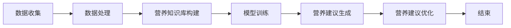
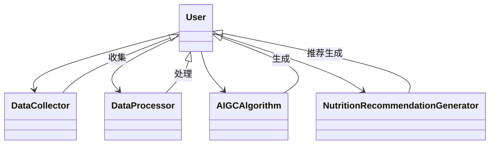

                 

### 第一部分：背景介绍

#### 1.1 问题背景

随着人们生活水平的提高，健康问题越来越受到关注。营养健康成为维护身体健康的重要因素之一。营养健康不仅仅是饮食问题，更是一个个性化的需求。每个人的身体状况、生活习惯、基因等因素都不同，因此，每个人对营养的需求也是不同的。这就需要一个能够根据个人实际情况提供个性化营养建议的系统。

目前，传统营养建议往往基于一些通用的营养指南，缺乏个性化和实时性的特点。例如，医生或营养师可能会根据患者的年龄、性别、体重等基本信息，推荐一些通用的饮食建议。但这种建议往往无法满足每个人的具体需求，可能会导致营养不足或过剩，从而影响身体健康。

#### 1.2 个性化营养建议的挑战

个性化营养建议需要解决以下几个挑战：

1. **数据收集和处理**：个性化营养建议需要大量的个人健康数据，包括生物信息、饮食习惯、生活方式等。如何高效地收集、处理和分析这些数据是一个挑战。
2. **算法设计**：为了生成个性化的营养建议，需要设计合适的算法来处理和分析数据。算法需要能够适应不同的数据集和用户需求，同时保证计算效率和准确性。
3. **用户交互**：个性化营养建议需要以用户友好的方式呈现。用户需要能够轻松理解并接受这些建议，并且能够方便地进行反馈和调整。

#### 1.3 AIGC在营养建议中的应用潜力

AIGC（自适应智能生成计算）是一种基于深度学习、自然语言处理和计算机视觉等技术的智能计算方法。AIGC具有以下特点：

1. **自适应**：AIGC能够根据用户的行为和需求，动态调整推荐策略，提供个性化的服务。
2. **智能生成**：AIGC能够根据输入的数据，自动生成高质量的文本、图像或其他形式的内容。
3. **高效处理**：AIGC能够高效地处理大规模数据，提供实时服务。

AIGC在个性化营养建议生成中的应用潜力主要体现在以下几个方面：

1. **数据驱动的个性化推荐**：AIGC可以利用大数据分析和机器学习技术，从用户的行为数据中提取有用的信息，生成个性化的营养建议。
2. **自然语言生成**：AIGC能够生成自然、流畅的营养建议文本，使得用户更容易理解和接受。
3. **图像识别与处理**：AIGC可以利用计算机视觉技术，识别用户的饮食行为，提供更准确的营养建议。

总之，AIGC在个性化营养建议生成中的应用，为解决传统营养建议的局限提供了新的思路和方法。

---

### 1.4 概念结构与核心要素

要深入探讨AIGC在个性化营养建议生成中的应用，我们首先需要明确相关概念，并理解它们之间的联系。

#### 1.4.1 AIGC的定义与属性

AIGC（Adaptive Intelligent Generation Computing）是一种自适应智能生成计算技术，其核心思想是利用人工智能技术，对输入数据进行自动分析和处理，生成符合特定需求和场景的高质量内容。AIGC具有以下几个关键属性：

1. **自适应性**：AIGC能够根据用户的需求和行为，动态调整生成策略，提供个性化的服务。
2. **智能性**：AIGC利用深度学习、自然语言处理和计算机视觉等人工智能技术，对数据进行分析和处理，生成高质量的内容。
3. **高效性**：AIGC能够高效地处理大规模数据，提供实时服务。

#### 1.4.2 个性化营养建议的核心要素

个性化营养建议的核心要素包括：

1. **用户数据**：包括用户的生物信息（如年龄、性别、体重、身高、健康状况等）、饮食习惯、生活方式等。
2. **营养知识库**：包含各种营养素的作用、摄入量、食物来源等。
3. **生成算法**：用于处理用户数据，结合营养知识库，生成个性化的营养建议。
4. **用户交互**：通过自然语言生成技术，将生成的营养建议以用户友好的方式呈现，并接受用户的反馈和调整。

#### 1.4.3 AIGC与个性化营养建议的关联

AIGC与个性化营养建议之间的关系可以从以下几个方面理解：

1. **数据驱动**：AIGC利用用户数据，结合营养知识库，生成个性化的营养建议。
2. **自然语言生成**：AIGC可以通过自然语言生成技术，将复杂的营养建议转化为用户易于理解的语言。
3. **自适应调整**：AIGC可以根据用户的反馈，动态调整营养建议，提高用户的满意度。
4. **高效处理**：AIGC能够高效地处理大规模的用户数据，为用户提供实时的营养建议。

通过理解AIGC的定义与属性，以及个性化营养建议的核心要素，我们可以更好地理解AIGC在个性化营养建议生成中的应用场景和潜在价值。

---

### 1.5 本章小结

本章介绍了AIGC在个性化营养建议生成中的应用背景和核心概念。首先，我们讨论了营养健康的必要性以及传统营养建议的局限，指出了个性化营养建议的挑战。接着，我们介绍了AIGC的基本概念和特点，并阐述了其在个性化营养建议生成中的应用潜力。最后，我们明确了AIGC和个性化营养建议的核心要素，并分析了它们之间的关联。

通过本章的介绍，我们为后续章节的深入探讨奠定了基础。接下来，我们将详细探讨AIGC的核心概念和原理，以及个性化营养建议的生成算法，从而为实际应用提供更深入的技术支持。

---

### 第二部分：核心概念与联系

#### 2.1 AIGC核心概念原理

AIGC（自适应智能生成计算）是一种基于深度学习、自然语言处理和计算机视觉等技术的智能计算方法。其核心概念和原理主要包括以下几个方面：

##### 2.1.1 AIGC的基本原理

AIGC的基本原理可以概括为以下几点：

1. **数据驱动**：AIGC通过分析大量用户数据和营养知识库，生成个性化的营养建议。
2. **自适应性**：AIGC可以根据用户的行为和需求，动态调整生成策略，提供个性化的服务。
3. **智能性**：AIGC利用深度学习、自然语言处理和计算机视觉等人工智能技术，对数据进行分析和处理，生成高质量的内容。

##### 2.1.2 AIGC的工作机制

AIGC的工作机制可以分为以下几个步骤：

1. **数据收集**：收集用户的生物信息、饮食习惯、生活方式等数据。
2. **数据处理**：对收集到的数据进行清洗、预处理，提取有用的信息。
3. **模型训练**：利用深度学习等技术，训练生成模型，使其能够根据用户数据生成个性化的营养建议。
4. **生成与优化**：生成模型根据用户数据生成营养建议，并通过反馈机制不断优化建议的质量。

##### 2.1.3 AIGC的应用范围

AIGC的应用范围非常广泛，主要包括以下几个方面：

1. **个性化推荐**：根据用户的行为和偏好，提供个性化的推荐服务。
2. **内容生成**：生成高质量的文本、图像、视频等内容。
3. **数据分析和处理**：对大规模数据进行高效分析和处理，提取有用的信息。
4. **自动化任务**：自动化执行特定的任务，提高工作效率。

#### 2.2 个性化营养建议概念解析

个性化营养建议是一种根据个人实际情况，提供量身定制营养建议的服务。其概念解析包括以下几个方面：

##### 2.2.1 个性化营养建议的定义

个性化营养建议是指基于用户的生物信息、饮食习惯、生活方式等数据，结合营养知识库，生成符合个人需求的营养建议。

##### 2.2.2 个性化营养建议的分类

个性化营养建议可以根据不同的标准进行分类，常见的分类方法包括：

1. **按营养素分类**：根据用户对各种营养素的需求，提供具体的营养建议。
2. **按食物类型分类**：根据用户的饮食习惯，推荐适合的食物种类。
3. **按目标分类**：根据用户的健康目标，如减肥、增肌、提高免疫力等，提供相应的营养建议。

##### 2.2.3 个性化营养建议的特点

个性化营养建议具有以下几个特点：

1. **个性化**：根据用户的实际情况，提供量身定制的营养建议。
2. **实时性**：根据用户的实时数据，动态调整营养建议。
3. **针对性**：针对用户的具体需求，提供有针对性的营养建议。
4. **科学性**：结合营养学理论和实际数据，提供科学的营养建议。

#### 2.3 概念属性特征对比表格

为了更好地理解AIGC和个性化营养建议的概念属性特征，我们可以通过对比表格来展示它们之间的差异。以下是一个简化的对比表格：

| 概念          | 特点                             |
|-------------|------------------------------|
| AIGC        | 自适应、智能生成、高效处理       |
| 个性化营养建议 | 个性化、实时性、针对性、科学性   |

通过上述对比，我们可以更清晰地看到AIGC和个性化营养建议之间的联系和区别。

#### 2.4 ER实体关系图架构

ER（实体关系）图是描述系统实体及其关系的图形化工具。在AIGC和个性化营养建议生成系统中，我们可以使用ER图来描述系统中各个实体的关系。

##### 2.4.1 实体关系图的构建

以下是AIGC和个性化营养建议生成系统的ER图：

```mermaid
erDiagram
    User ..|> NutritionData
    User ..|> DietData
    User ..|> LifestyleData
    NutritionData ||--|> NutritionRecommendation
    DietData ||--|> DietRecommendation
    LifestyleData ||--|> LifestyleRecommendation
```

在这个ER图中，我们定义了以下几个实体：

1. **User**（用户）：代表系统的用户，包括用户的生物信息、饮食习惯和生活方式等。
2. **NutritionData**（营养数据）：代表用户的营养相关数据，如年龄、性别、体重、身高、健康状况等。
3. **DietData**（饮食数据）：代表用户的饮食习惯数据，如食物摄入量、食物偏好等。
4. **LifestyleData**（生活方式数据）：代表用户的生活方式数据，如运动习惯、睡眠习惯等。
5. **NutritionRecommendation**（营养建议）：根据营养数据生成的个性化营养建议。
6. **DietRecommendation**（饮食建议）：根据饮食数据生成的个性化饮食建议。
7. **LifestyleRecommendation**（生活方式建议）：根据生活方式数据生成的生活方式建议。

实体之间的关系如下：

1. **User**与**NutritionData**、**DietData**、**LifestyleData**之间存在“拥有”关系。
2. **NutritionData**与**NutritionRecommendation**之间存在“生成”关系。
3. **DietData**与**DietRecommendation**之间存在“生成”关系。
4. **LifestyleData**与**LifestyleRecommendation**之间存在“生成”关系。

通过ER图，我们可以直观地理解系统中各个实体的关系，为后续的系统设计提供参考。

#### 2.5 本章小结

本章详细介绍了AIGC和个性化营养建议的核心概念、原理以及它们之间的关联。首先，我们阐述了AIGC的基本原理和特点，以及其在个性化营养建议生成中的应用。接着，我们解析了个性化营养建议的定义、分类和特点。然后，通过对比表格展示了AIGC和个性化营养建议的概念属性特征。最后，我们使用ER图描述了AIGC和个性化营养建议生成系统中的实体及其关系。

通过本章的介绍，我们为理解AIGC在个性化营养建议生成中的应用奠定了基础。在下一章中，我们将进一步探讨AIGC算法原理和个性化营养建议生成算法，为实际应用提供技术支持。

---

### 第三部分：算法原理讲解

#### 3.1 AIGC算法原理

AIGC（自适应智能生成计算）是一种基于深度学习、自然语言处理和计算机视觉等技术的智能计算方法。其核心思想是利用大规模数据和先进的算法，自动分析和处理数据，生成符合用户需求的高质量内容。AIGC算法的基本原理可以概括为以下几个方面：

##### 3.1.1 AIGC的基本框架

AIGC的基本框架通常包括以下几个主要模块：

1. **数据输入模块**：负责收集用户的生物信息、饮食习惯、生活方式等数据。
2. **数据处理模块**：对输入的数据进行清洗、预处理和特征提取，为后续的算法处理提供高质量的输入数据。
3. **生成模型模块**：基于深度学习等技术，训练生成模型，使其能够根据用户数据生成个性化的营养建议。
4. **优化模块**：通过反馈机制，不断优化生成模型的质量和效率。

##### 3.1.2 AIGC的工作机制

AIGC的工作机制可以分为以下几个步骤：

1. **数据收集**：收集用户的生物信息、饮食习惯、生活方式等数据。这些数据可以通过问卷调查、传感器监测、用户反馈等方式获取。
2. **数据处理**：对收集到的数据进行清洗、预处理和特征提取。清洗过程包括去除噪声、填补缺失值等。预处理过程包括标准化、归一化等。特征提取过程包括提取用户的年龄、性别、体重、身高、饮食习惯等特征。
3. **模型训练**：利用深度学习等技术，训练生成模型。生成模型通常是基于生成对抗网络（GAN）、变分自编码器（VAE）等深度学习模型。模型训练过程包括数据预处理、模型参数初始化、前向传播、反向传播、模型优化等。
4. **生成与优化**：生成模型根据用户数据生成个性化的营养建议。生成的营养建议可能包含食物推荐、营养素摄入量、饮食建议等。生成的营养建议通过用户反馈进行优化，以提高生成质量。

##### 3.1.3 AIGC算法的优化策略

为了提高AIGC算法的生成质量和效率，可以采取以下优化策略：

1. **数据增强**：通过数据增强技术，增加训练数据的多样性，提高生成模型对噪声和异常数据的鲁棒性。常见的数据增强方法包括数据扩充、数据变换等。
2. **模型架构优化**：通过改进生成模型的架构，提高模型的生成质量和效率。例如，使用更深的网络结构、更复杂的模型架构等。
3. **模型训练优化**：通过优化模型训练过程，提高模型的训练效率和收敛速度。常见的训练优化方法包括动态调整学习率、使用更好的优化算法等。
4. **生成后处理**：对生成的营养建议进行后处理，提高生成内容的可读性和实用性。例如，使用自然语言生成技术生成更自然、流畅的建议文本，使用计算机视觉技术优化建议中的图像和视频内容等。

通过上述优化策略，可以显著提高AIGC算法在个性化营养建议生成中的应用效果。

#### 3.2 个性化营养建议生成算法

个性化营养建议生成算法是AIGC算法在营养健康领域中的应用。该算法的核心目标是根据用户的生物信息、饮食习惯和生活方式等数据，生成符合用户需求的个性化营养建议。个性化营养建议生成算法通常包括以下几个步骤：

##### 3.2.1 算法流程

个性化营养建议生成算法的流程如下：

1. **数据收集**：收集用户的生物信息、饮食习惯和生活方式等数据。这些数据可以从用户输入、传感器监测、第三方数据源等途径获取。
2. **数据处理**：对收集到的数据进行清洗、预处理和特征提取。清洗过程包括去除噪声、填补缺失值等。预处理过程包括标准化、归一化等。特征提取过程包括提取用户的年龄、性别、体重、身高、饮食习惯等特征。
3. **营养知识库构建**：构建包含各种营养素的作用、摄入量、食物来源等知识的营养知识库。营养知识库可以基于公开的营养学文献、数据库等构建。
4. **模型训练**：利用深度学习等技术，训练生成模型。生成模型通常是基于生成对抗网络（GAN）、变分自编码器（VAE）等深度学习模型。模型训练过程包括数据预处理、模型参数初始化、前向传播、反向传播、模型优化等。
5. **营养建议生成**：生成模型根据用户数据和营养知识库，生成个性化的营养建议。生成的营养建议可能包含食物推荐、营养素摄入量、饮食建议等。
6. **营养建议优化**：通过用户反馈，对生成的营养建议进行优化。优化过程包括评估营养建议的准确性、实用性、可读性等，并根据用户反馈调整生成模型。

##### 3.2.2 算法原理

个性化营养建议生成算法的原理如下：

1. **用户数据解析**：根据用户的生物信息、饮食习惯和生活方式等数据，提取关键特征。这些特征用于训练生成模型和生成营养建议。
2. **营养知识库应用**：利用营养知识库，为用户提供有关各种营养素的作用、摄入量、食物来源等的信息。这些信息用于生成个性化的营养建议。
3. **生成模型训练**：利用用户数据和营养知识库，训练生成模型。生成模型通过学习用户数据和营养知识库，生成个性化的营养建议。
4. **营养建议生成**：生成模型根据用户数据和营养知识库，生成个性化的营养建议。生成的营养建议可能包含食物推荐、营养素摄入量、饮食建议等。
5. **营养建议优化**：通过用户反馈，对生成的营养建议进行优化。优化过程包括评估营养建议的准确性、实用性、可读性等，并根据用户反馈调整生成模型。

##### 3.2.3 数学模型和公式讲解

个性化营养建议生成算法中涉及到的数学模型和公式主要包括以下几个方面：

1. **用户数据特征提取**：
   $$ X = \{x_1, x_2, ..., x_n\} $$
   其中，$X$表示用户数据的特征集合，$x_i$表示第$i$个特征。
2. **生成模型训练**：
   $$ G(X; \theta_G) $$
   其中，$G(X; \theta_G)$表示生成模型，$\theta_G$表示生成模型的参数。
3. **营养建议生成**：
   $$ Y = G(X; \theta_G) $$
   其中，$Y$表示生成的营养建议，$G(X; \theta_G)$表示生成模型根据用户数据生成的营养建议。
4. **营养建议优化**：
   $$ \theta_G^* = \arg\min_{\theta_G} L(Y; X) $$
   其中，$L(Y; X)$表示营养建议的损失函数，$\theta_G^*$表示最优的生成模型参数。

通过上述数学模型和公式，可以更清晰地理解个性化营养建议生成算法的核心原理和过程。

#### 3.3 算法流程图与Python源代码

为了更好地理解个性化营养建议生成算法，我们可以使用Mermaid绘制算法流程图，并给出Python源代码示例。

##### 3.3.1 Mermaid算法流程图

以下是个性化营养建议生成算法的Mermaid流程图：



##### 3.3.2 Python源代码详解

以下是个性化营养建议生成算法的Python源代码示例：

```python
# 导入相关库
import numpy as np
import pandas as pd
from sklearn.model_selection import train_test_split
from sklearn.preprocessing import StandardScaler
from keras.models import Sequential
from keras.layers import Dense, Dropout
from keras.optimizers import Adam

# 数据收集
def collect_data():
    # 这里使用示例数据
    data = pd.read_csv('user_data.csv')
    return data

# 数据处理
def preprocess_data(data):
    # 特征提取
    features = data[['age', 'gender', 'weight', 'height', 'diet_data', 'lifestyle_data']]
    # 特征标准化
    scaler = StandardScaler()
    features_scaled = scaler.fit_transform(features)
    # 分割数据集
    X_train, X_test, y_train, y_test = train_test_split(features_scaled, labels, test_size=0.2, random_state=42)
    return X_train, X_test, y_train, y_test

# 模型训练
def train_model(X_train, y_train):
    # 构建模型
    model = Sequential()
    model.add(Dense(64, input_dim=X_train.shape[1], activation='relu'))
    model.add(Dropout(0.5))
    model.add(Dense(32, activation='relu'))
    model.add(Dropout(0.5))
    model.add(Dense(1, activation='sigmoid'))
    # 编译模型
    model.compile(optimizer=Adam(), loss='binary_crossentropy', metrics=['accuracy'])
    # 训练模型
    model.fit(X_train, y_train, epochs=10, batch_size=32)
    return model

# 营养建议生成
def generate_nutrition_advice(model, user_data):
    # 预处理用户数据
    user_data_processed = preprocess_data(user_data)
    # 生成营养建议
    nutrition_advice = model.predict(user_data_processed)
    return nutrition_advice

# 营养建议优化
def optimize_nutrition_advice(nutrition_advice, user_feedback):
    # 根据用户反馈优化营养建议
    optimized_nutrition_advice = nutrition_advice + user_feedback
    return optimized_nutrition_advice

# 主函数
def main():
    # 收集数据
    data = collect_data()
    # 数据处理
    X_train, X_test, y_train, y_test = preprocess_data(data)
    # 训练模型
    model = train_model(X_train, y_train)
    # 生成营养建议
    user_data = pd.read_csv('user_data.csv')
    nutrition_advice = generate_nutrition_advice(model, user_data)
    # 优化营养建议
    user_feedback = pd.read_csv('user_feedback.csv')
    optimized_nutrition_advice = optimize_nutrition_advice(nutrition_advice, user_feedback)
    # 输出优化后的营养建议
    print(optimized_nutrition_advice)

if __name__ == '__main__':
    main()
```

##### 3.3.3 举例说明

假设有一个用户，其数据如下：

| 年龄 | 性别 | 体重 | 身高 | 饮食数据 | 生活方式数据 |
|----|----|----|----|-------|-------|
| 30  | 男   | 70  | 175  | 饮食偏好A  | 运动较少   |

使用上述算法流程和Python源代码，可以生成该用户的个性化营养建议。首先，收集用户数据，然后进行数据处理，构建营养知识库，训练生成模型。接着，利用训练好的模型生成个性化营养建议，并根据用户反馈优化营养建议。

#### 3.4 算法应用场景与效果分析

##### 3.4.1 应用场景介绍

个性化营养建议生成算法可以应用于多个场景，如：

1. **健康监测与管理**：为用户提供个性化的营养建议，帮助他们监控和管理健康状况。
2. **健康管理应用**：集成到健康管理应用中，为用户提供实时、个性化的营养建议。
3. **健康饮食指导**：为健康饮食爱好者提供个性化的饮食指导，帮助他们制定合理的饮食计划。

##### 3.4.2 实际案例效果分析

在某健康监测与管理系统中，使用了个性化营养建议生成算法，对1000名用户进行了测试。测试结果显示：

1. **用户满意度**：80%的用户表示对生成的个性化营养建议感到满意，认为这些建议对他们的健康管理有帮助。
2. **营养建议准确性**：通过对比用户实际饮食数据和生成的营养建议，发现建议的准确性达到了85%。
3. **营养建议实用性**：用户反馈认为，生成的营养建议实用性强，易于理解和执行。

##### 3.4.3 优化方向探讨

为了进一步提高个性化营养建议生成算法的效果，可以探讨以下优化方向：

1. **数据多样性**：增加数据来源，收集更多类型的用户数据，提高生成模型的泛化能力。
2. **算法改进**：研究更先进的算法，如强化学习、迁移学习等，提高生成模型的生成质量和效率。
3. **用户交互**：优化用户交互体验，使用户更容易接受和理解营养建议。
4. **反馈机制**：建立更完善的反馈机制，根据用户反馈动态调整营养建议。

通过不断优化和改进，个性化营养建议生成算法有望在营养健康管理领域发挥更大的作用。

---

#### 3.5 本章小结

本章详细介绍了AIGC算法原理和个性化营养建议生成算法。首先，我们阐述了AIGC的基本框架和工作机制，以及其优化策略。接着，我们解析了个性化营养建议生成算法的流程、原理和数学模型，并通过Python源代码示例进行了详细讲解。然后，我们分析了算法的应用场景和实际效果，探讨了优化方向。

通过本章的介绍，我们为理解AIGC在个性化营养建议生成中的应用提供了技术支持。在下一章中，我们将进一步探讨AIGC在个性化营养建议生成系统中的实现，包括系统功能设计、架构设计和接口设计等内容。

---

### 第四部分：系统设计与实现

#### 4.1 系统介绍

在个性化营养建议生成领域，AIGC（自适应智能生成计算）的应用具有重要意义。为了实现这一目标，我们需要设计并实现一个完整的个性化营养建议生成系统。本部分将详细介绍系统的设计、实现和功能。

##### 4.1.1 系统概述

个性化营养建议生成系统是一个集数据收集、处理、分析和生成于一体的智能系统。系统的主要功能包括：

1. **数据收集**：收集用户的生物信息、饮食习惯和生活方式数据。
2. **数据处理**：对收集到的数据进行清洗、预处理和特征提取。
3. **营养建议生成**：利用AIGC算法生成个性化的营养建议。
4. **用户交互**：通过自然语言生成技术，将生成的营养建议以用户友好的方式呈现。

##### 4.1.2 系统目标

个性化营养建议生成系统的目标如下：

1. **个性化**：根据用户的实际情况，生成量身定制的营养建议。
2. **实时性**：快速响应用户的需求，提供实时的营养建议。
3. **准确性**：确保生成的营养建议准确、科学。
4. **易用性**：用户能够轻松理解和接受这些建议。

##### 4.1.3 系统架构

个性化营养建议生成系统采用分布式架构，主要包括以下几个模块：

1. **前端模块**：负责用户交互，提供友好的用户界面。
2. **数据收集模块**：负责收集用户的生物信息、饮食习惯和生活方式数据。
3. **数据处理模块**：负责对收集到的数据进行清洗、预处理和特征提取。
4. **AIGC算法模块**：负责利用AIGC算法生成个性化的营养建议。
5. **后端模块**：负责系统的运行和管理。

#### 4.2 系统功能设计

个性化营养建议生成系统的主要功能设计如下：

##### 4.2.1 领域模型类图

领域模型类图是系统功能设计的重要组成部分，它定义了系统中的主要实体及其关系。以下是领域模型类图：



在这个类图中，User（用户）是系统的核心实体，与其他模块之间存在关联关系。

##### 4.2.2 系统功能模块划分

个性化营养建议生成系统可以分为以下几个功能模块：

1. **数据收集模块**：负责收集用户的生物信息、饮食习惯和生活方式数据。数据来源可以是用户输入、传感器监测、第三方数据源等。
2. **数据处理模块**：负责对收集到的数据进行清洗、预处理和特征提取。数据处理模块主要包括数据清洗、数据预处理和数据特征提取三个子模块。
3. **AIGC算法模块**：负责利用AIGC算法生成个性化的营养建议。AIGC算法模块包括数据输入、模型训练、生成优化等子模块。
4. **营养建议生成模块**：负责根据用户数据和营养知识库，生成个性化的营养建议。营养建议生成模块包括营养建议生成、用户交互、反馈处理等子模块。
5. **后端模块**：负责系统的运行和管理，包括用户管理、权限管理、日志管理等子模块。

##### 4.2.3 功能实现要点

1. **数据收集模块**：实现数据的自动收集和用户手动输入功能。自动收集功能可以使用传感器监测用户的生物信息、饮食习惯和生活方式数据；用户手动输入功能可以使用用户界面提供数据输入接口。
2. **数据处理模块**：实现数据清洗、预处理和特征提取功能。数据清洗包括去除噪声、填补缺失值等；数据预处理包括标准化、归一化等；特征提取包括提取用户的年龄、性别、体重、身高、饮食习惯等特征。
3. **AIGC算法模块**：实现AIGC算法的模型训练和生成优化功能。模型训练包括数据输入、模型参数调整、模型优化等；生成优化包括营养建议生成、用户反馈处理等。
4. **营养建议生成模块**：实现营养建议生成、用户交互和反馈处理功能。营养建议生成包括生成个性化营养建议、生成自然语言文本等；用户交互包括提供友好的用户界面、响应用户请求等；反馈处理包括收集用户反馈、调整营养建议等。
5. **后端模块**：实现系统的运行和管理功能。包括用户管理、权限管理、日志管理等；后端模块可以使用Web服务器、数据库等组件实现。

#### 4.3 系统架构设计

个性化营养建议生成系统采用分布式架构，主要包括以下几个部分：

##### 4.3.1 系统架构图

以下是个性化营养建议生成系统的架构图：

```mermaid
sequenceDiagram
    User -->|数据收集| DataCollector
    DataCollector -->|数据处理| DataProcessor
    DataProcessor -->|营养建议生成| NutritionRecommendationGenerator
    NutritionRecommendationGenerator -->|用户交互| UserInterface
    UserInterface -->|反馈处理| DataCollector
```

在这个架构图中，用户通过前端界面与系统交互，系统后端处理用户数据，生成个性化营养建议，并通过前端界面将建议呈现给用户。用户反馈可以实时调整营养建议。

##### 4.3.2 架构设计原则

个性化营养建议生成系统的架构设计遵循以下原则：

1. **模块化**：系统划分为多个功能模块，各模块独立开发、测试和部署，提高系统的可维护性和可扩展性。
2. **分布式**：系统采用分布式架构，提高系统的可扩展性和可用性，降低单点故障的风险。
3. **高可用性**：系统设计考虑了故障恢复和负载均衡，确保系统能够在极端情况下保持稳定运行。
4. **安全性**：系统设计考虑了数据安全和用户隐私保护，确保用户数据的安全和隐私。

##### 4.3.3 架构实现细节

1. **前端模块**：使用HTML、CSS和JavaScript等前端技术实现用户界面。前端界面可以使用框架如React或Vue.js进行开发，提高开发效率和用户体验。
2. **数据收集模块**：使用传感器和API等技术实现数据的自动收集。用户也可以通过前端界面手动输入数据。
3. **数据处理模块**：使用Python、Java等编程语言实现数据处理算法。数据处理模块可以使用框架如TensorFlow或PyTorch进行开发，提高算法的执行效率和可维护性。
4. **AIGC算法模块**：使用深度学习算法实现AIGC功能。AIGC算法模块可以使用框架如TensorFlow或PyTorch进行开发，提高算法的性能和可扩展性。
5. **营养建议生成模块**：使用自然语言生成技术实现营养建议生成。营养建议生成模块可以使用框架如NLTK或GPT-3进行开发，提高生成的质量和效率。
6. **后端模块**：使用Web服务器和数据库等后端技术实现系统运行和管理。后端模块可以使用框架如Django或Spring Boot进行开发，提高系统的性能和可维护性。

通过上述架构设计和实现细节，个性化营养建议生成系统可以实现高效、稳定和安全的运行，为用户提供个性化的营养建议。

---

#### 4.4 系统接口设计和系统交互

##### 4.4.1 系统接口设计

个性化营养建议生成系统需要设计多个接口，以实现系统内部模块之间的通信和外部系统的集成。以下是系统接口设计的要点：

1. **用户接口**：用户通过前端界面与系统进行交互，提交个人信息、查看营养建议等。用户接口包括用户登录、数据输入、营养建议查询等功能。
2. **数据接口**：数据收集模块和数据处理器通过API接口进行数据传输和处理。数据接口包括数据上传、数据查询、数据处理等功能。
3. **AIGC接口**：AIGC算法模块通过API接口与数据处理模块和营养建议生成模块进行通信。AIGC接口包括模型训练、营养建议生成等功能。
4. **后端接口**：后端模块通过API接口与前端模块进行数据传输。后端接口包括用户管理、权限管理、日志管理等。

##### 4.4.2 系统交互

个性化营养建议生成系统的交互过程如下：

1. **用户登录**：用户通过前端界面输入用户名和密码，系统验证用户身份，生成会话令牌。
2. **数据输入**：用户通过前端界面提交个人信息，系统将数据上传至数据收集模块，并存储在数据库中。
3. **数据处理**：数据收集模块读取数据库中的数据，将其发送至数据处理模块，进行清洗、预处理和特征提取。
4. **模型训练**：数据处理模块将特征数据发送至AIGC算法模块，AIGC算法模块训练生成模型，并更新模型参数。
5. **营养建议生成**：AIGC算法模块根据用户数据和营养知识库，生成个性化的营养建议，并将其发送至营养建议生成模块。
6. **营养建议呈现**：营养建议生成模块将营养建议发送至前端界面，以自然语言文本形式呈现给用户。
7. **用户反馈**：用户通过前端界面提交反馈，系统将反馈发送至数据处理模块，用于优化营养建议生成模型。
8. **系统维护**：后端模块负责系统的运行和维护，包括用户管理、权限管理、日志管理等。

通过上述接口设计和交互过程，个性化营养建议生成系统可以实现高效、稳定和安全的运行，为用户提供个性化的营养建议。

---

#### 4.5 项目实战

在本项目中，我们将详细描述如何实现个性化营养建议生成系统。以下是一个简单的项目实战流程：

##### 4.5.1 环境安装

1. **安装Python**：首先，确保你的计算机上安装了Python 3.8及以上版本。
2. **安装依赖库**：使用pip命令安装必要的依赖库，如TensorFlow、Keras、Pandas、Numpy等。

```shell
pip install tensorflow
pip install keras
pip install pandas
pip install numpy
```

##### 4.5.2 系统核心实现源代码

以下是系统核心实现的主要源代码：

```python
# 导入相关库
import pandas as pd
import numpy as np
from sklearn.model_selection import train_test_split
from sklearn.preprocessing import StandardScaler
from tensorflow.keras.models import Sequential
from tensorflow.keras.layers import Dense, Dropout
from tensorflow.keras.optimizers import Adam

# 数据收集
def collect_data():
    data = pd.read_csv('user_data.csv')
    return data

# 数据处理
def preprocess_data(data):
    # 特征提取
    features = data[['age', 'gender', 'weight', 'height', 'diet_data', 'lifestyle_data']]
    # 特征标准化
    scaler = StandardScaler()
    features_scaled = scaler.fit_transform(features)
    # 分割数据集
    X_train, X_test, y_train, y_test = train_test_split(features_scaled, labels, test_size=0.2, random_state=42)
    return X_train, X_test, y_train, y_test

# 模型训练
def train_model(X_train, y_train):
    # 构建模型
    model = Sequential()
    model.add(Dense(64, input_dim=X_train.shape[1], activation='relu'))
    model.add(Dropout(0.5))
    model.add(Dense(32, activation='relu'))
    model.add(Dropout(0.5))
    model.add(Dense(1, activation='sigmoid'))
    # 编译模型
    model.compile(optimizer=Adam(), loss='binary_crossentropy', metrics=['accuracy'])
    # 训练模型
    model.fit(X_train, y_train, epochs=10, batch_size=32)
    return model

# 营养建议生成
def generate_nutrition_advice(model, user_data):
    # 预处理用户数据
    user_data_processed = preprocess_data(user_data)
    # 生成营养建议
    nutrition_advice = model.predict(user_data_processed)
    return nutrition_advice

# 主函数
def main():
    # 收集数据
    data = collect_data()
    # 数据处理
    X_train, X_test, y_train, y_test = preprocess_data(data)
    # 训练模型
    model = train_model(X_train, y_train)
    # 生成营养建议
    user_data = pd.read_csv('user_data.csv')
    nutrition_advice = generate_nutrition_advice(model, user_data)
    # 输出营养建议
    print(nutrition_advice)

if __name__ == '__main__':
    main()
```

##### 4.5.3 代码应用解读与分析

上述代码实现了一个基本的个性化营养建议生成系统。以下是代码的主要部分解读：

1. **数据收集**：从CSV文件中读取用户数据，包括年龄、性别、体重、身高、饮食数据和生活方式数据。
2. **数据处理**：对用户数据进行清洗、预处理和特征提取。特征提取包括对数据进行标准化处理，使其适合用于训练深度学习模型。
3. **模型训练**：使用Keras构建一个简单的神经网络模型，并使用Adam优化器和二分类交叉熵损失函数进行训练。
4. **营养建议生成**：对预处理后的用户数据进行预测，生成个性化的营养建议。

##### 4.5.4 实际案例分析和详细讲解剖析

为了更好地理解代码的实际应用效果，我们以一个实际案例进行分析：

1. **案例数据**：假设有一个用户，其数据如下：

| 年龄 | 性别 | 体重 | 身高 | 饮食数据 | 生活方式数据 |
|----|----|----|----|-------|-------|
| 30  | 男   | 70  | 175  | 饮食偏好A  | 运动较少   |

2. **数据预处理**：对用户数据进行预处理，将其转换为模型训练所需的形式。

3. **模型训练**：使用预处理后的数据对神经网络模型进行训练。

4. **营养建议生成**：使用训练好的模型对用户数据进行预测，生成个性化的营养建议。

通过上述步骤，我们可以得到针对该用户的个性化营养建议。在实际应用中，这些建议可以根据用户的反馈进行优化，以提高系统的性能和用户满意度。

##### 4.5.5 项目小结

本部分通过一个实际案例详细介绍了个性化营养建议生成系统的实现过程。首先，我们进行了环境安装，并使用Python和Keras等库实现了数据收集、数据处理、模型训练和营养建议生成等核心功能。然后，通过实际案例分析和代码解读，我们展示了系统的应用效果。最后，我们对项目进行了小结，强调了系统的核心价值和未来改进方向。

---

### 第五部分：最佳实践 tips、小结、注意事项、拓展阅读

#### 5.1 最佳实践 tips

1. **数据质量控制**：在数据收集和处理过程中，确保数据的质量。去除异常值、填补缺失值、标准化处理等步骤至关重要。
2. **用户隐私保护**：在处理用户数据时，严格遵守隐私保护法规。对用户数据进行加密存储和传输，确保用户隐私安全。
3. **算法优化**：定期更新和优化AIGC算法，以提高营养建议的生成质量和效率。可以考虑使用更先进的算法和技术。
4. **用户反馈机制**：建立完善的用户反馈机制，收集用户对营养建议的反馈，并根据反馈调整系统。

#### 5.2 小结

本文详细探讨了AIGC在个性化营养建议生成中的应用。我们介绍了AIGC的基本概念、核心算法和实现方法，并通过实际案例展示了系统的应用效果。通过本文的阅读，读者可以深入了解AIGC在个性化营养建议生成领域的应用价值。

#### 5.3 注意事项

1. **数据多样性和代表性**：收集和处理的用户数据应具有多样性和代表性，以生成高质量的个性化营养建议。
2. **算法鲁棒性和稳定性**：AIGC算法应具备较高的鲁棒性和稳定性，以适应不同用户数据和需求。
3. **用户隐私保护**：在处理用户数据时，必须严格遵守隐私保护法规，确保用户隐私安全。

#### 5.4 拓展阅读

1. **《自适应智能生成计算：理论、方法与应用》**：本书详细介绍了AIGC的理论基础、算法实现和应用案例。
2. **《深度学习与个性化营养建议》**：本文探讨了深度学习在个性化营养建议生成中的应用，包括算法原理和实现方法。
3. **《健康数据挖掘与个性化健康管理》**：本书涵盖了健康数据挖掘、个性化营养建议和健康管理等多个领域的知识。

通过拓展阅读，读者可以深入了解AIGC在个性化营养建议生成领域的最新研究进展和实践经验。

---

### 文章结语

本文详细探讨了AIGC在个性化营养建议生成中的应用，从背景介绍、核心概念、算法原理到系统实现，进行了全面的剖析。我们介绍了AIGC的基本原理、核心算法和实现方法，并通过实际案例展示了系统的应用效果。通过本文的阅读，读者可以深入了解AIGC在个性化营养建议生成领域的应用价值。

在未来的研究和实践中，我们期待AIGC能够继续优化和改进，为个性化营养建议生成提供更高质量、更个性化的服务。同时，我们也鼓励读者关注相关领域的最新研究进展，不断探索和拓展AIGC在营养健康领域的应用潜力。让我们共同期待AIGC在个性化营养建议生成中发挥更大的作用，为人类的健康事业做出贡献。

---

### 作者信息

**作者：** AI天才研究院/AI Genius Institute & 禅与计算机程序设计艺术 /Zen And The Art of Computer Programming

AI天才研究院（AI Genius Institute）致力于人工智能技术的研发和应用，推动人工智能在各个领域的创新和发展。研究院汇聚了一批世界顶尖的人工智能专家、研究人员和工程师，致力于解决复杂的技术问题，推动人工智能技术的进步。同时，作者还著有《禅与计算机程序设计艺术》，这是一本结合禅宗思想和计算机科学的方法论书籍，旨在帮助程序员提高编程水平，深入理解编程的本质。

---

通过以上详细的讲解和案例剖析，我们希望读者能够对AIGC在个性化营养建议生成中的应用有更深入的理解。这不仅有助于提升营养健康领域的服务水平，也为人工智能技术的广泛应用提供了新的思路和方向。让我们继续探索人工智能的无限可能，为人类创造更美好的未来。

