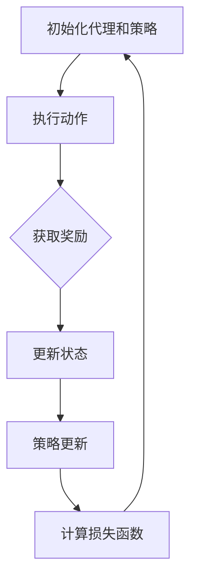
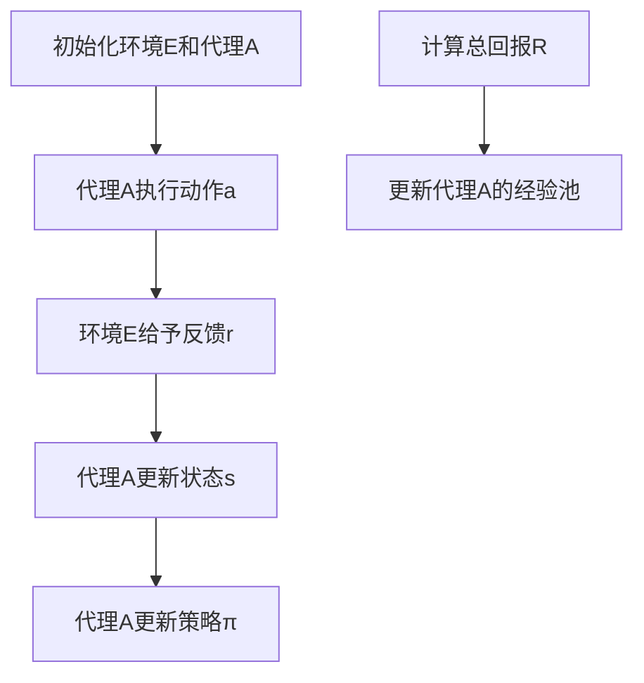

                 

### AIGC在个性化营养方案智能生成中的创新

#### 关键词：AIGC、个性化营养、智能生成、数据收集、用户画像、营养方案推荐算法

#### 摘要：
随着人工智能（AI）技术的不断发展，生成对抗网络（GAN）和强化学习（RL）等核心算法在个性化营养方案智能生成中展现了巨大潜力。本文旨在探讨AIGC技术在个性化营养方案中的应用，通过数据收集、用户画像构建、营养方案推荐算法和智能生成等步骤，详细分析AIGC在个性化营养方案智能生成中的创新。

## 目录大纲

### 第一部分：AIGC与个性化营养方案概述

- **第1章：AIGC技术简介**
  - **1.1 AIGC的概念与背景**
  - **1.2 AIGC的核心技术**
  - **1.3 AIGC的发展现状与趋势**

- **第2章：个性化营养方案概述**
  - **2.1 个性化营养的概念与意义**
  - **2.2 个性化营养的发展历程**
  - **2.3 个性化营养的现状与挑战**

- **第3章：AIGC在个性化营养方案中的应用**
  - **3.1 数据收集与处理**
  - **3.2 用户画像构建**
  - **3.3 营养方案推荐算法**
  - **3.4 营养方案智能生成**

- **第4章：AIGC在个性化营养方案中的案例分析**
  - **4.1 案例一：智能营养推荐系统**
  - **4.2 案例二：个性化营养方案定制服务**
  - **4.3 案例三：营养健康管理平台**

- **第5章：AIGC在个性化营养方案中的挑战与展望**
  - **5.1 数据安全与隐私保护**
  - **5.2 算法公正性与伦理问题**
  - **5.3 未来发展方向与趋势**

### 第二部分：核心技术原理讲解

- **第6章：AIGC核心算法原理讲解**
  - **6.1 生成对抗网络（GAN）**
    - **6.1.1 GAN的基本原理**
    - **6.1.2 GAN在个性化营养方案中的应用**
    - **6.1.3 GAN的mermaid流程图**
  - **6.2 强化学习（RL）**
    - **6.2.1 RL的基本原理**
    - **6.2.2 RL在个性化营养方案中的应用**
    - **6.2.3 RL的mermaid流程图**
  
- **第7章：数学模型与公式详解**
  - **7.1 数据处理与建模**
  - **7.2 算法模型与公式**

- **第8章：算法流程图与Python实现**
  - **8.1 GAN算法流程图**
  - **8.2 GAN算法Python实现**
  - **8.3 RL算法流程图**
  - **8.4 RL算法Python实现**

### 第三部分：项目实战与案例分析

- **第9章：智能营养推荐系统项目实战**
- **第10章：个性化营养方案定制服务项目实战**
- **第11章：营养健康管理平台项目实战**
- **第12章：最佳实践与注意事项**

### 附录

- **附录A：资源推荐**
- **附录B：相关阅读**
- **附录C：开源工具和库**

---

### 第一部分：AIGC与个性化营养方案概述

#### 第1章：AIGC技术简介

##### 1.1 AIGC的概念与背景

AIGC（AI-Generated Content）是指通过人工智能技术自动生成内容的过程。近年来，随着深度学习和生成对抗网络（GAN）等技术的发展，AIGC在多个领域得到了广泛应用，如虚拟现实、游戏设计、图像和视频生成等。AIGC技术不仅提高了内容生成的效率，还大大降低了内容创作的成本。

AIGC的发展可以追溯到20世纪80年代，当时人工智能领域的研究主要集中在符号推理和知识表示上。随着计算机硬件性能的提升和深度学习算法的突破，AIGC技术逐渐崭露头角，成为人工智能领域的一个热点方向。

##### 1.2 AIGC的核心技术

AIGC的核心技术主要包括生成对抗网络（GAN）、变分自编码器（VAE）、生成扩展网络（GANs）等。其中，GAN是由生成器和判别器组成的对抗性神经网络，通过不断训练生成器和判别器的对抗关系，实现高质量图像的生成。VAE是一种基于概率模型的生成模型，通过编码和解码过程实现数据的重建和生成。生成扩展网络（GANs）则是在GAN的基础上，通过引入扩展网络来提高生成模型的性能。

##### 1.3 AIGC的发展现状与趋势

目前，AIGC技术已经在多个领域取得了显著成果。例如，在图像生成方面，GAN技术已经能够生成逼真的图像和视频；在自然语言处理方面，AIGC技术可以自动生成文章、故事和对话；在游戏设计方面，AIGC技术可以自动生成游戏关卡和角色。

未来，随着人工智能技术的不断进步，AIGC技术在个性化营养方案智能生成中的应用将更加广泛。通过AIGC技术，可以实现个性化营养数据的自动生成、用户画像的智能构建和营养方案的个性化推荐，为用户提供更加精准和高效的营养服务。

#### 第2章：个性化营养方案概述

##### 2.1 个性化营养的概念与意义

个性化营养是指根据个体的生理、心理、生活方式和饮食习惯等因素，为个体量身定制的一套营养方案。与传统的统一营养方案相比，个性化营养能够更好地满足个体的营养需求，提高营养干预的效果。

个性化营养的意义在于：
- 提高营养干预的针对性，降低个体营养不良的风险。
- 提高个体健康水平，降低患病风险。
- 促进营养科学的健康发展，推动营养服务的创新。

##### 2.2 个性化营养的发展历程

个性化营养的发展可以分为三个阶段：

1. **经验阶段**：早期个性化营养主要依赖于营养师的经验和专业知识，通过个体询问、观察和诊断等方式，制定个性化的营养方案。

2. **数据驱动阶段**：随着大数据和人工智能技术的发展，个性化营养开始从经验驱动转向数据驱动。通过收集和分析个体的生理、心理和行为数据，为个体提供更加精准的营养方案。

3. **智能生成阶段**：基于AIGC技术的个性化营养方案智能生成，实现了营养数据的自动生成、用户画像的智能构建和营养方案的个性化推荐，为个性化营养的发展提供了新的方向。

##### 2.3 个性化营养的现状与挑战

目前，个性化营养已经取得了一定的进展，但仍面临一些挑战：

1. **数据收集与处理**：个性化营养依赖于大量的个体数据，如何高效地收集、存储和处理这些数据，是一个亟待解决的问题。

2. **用户画像构建**：构建准确的用户画像，是制定个性化营养方案的关键。如何从大量数据中提取有用的特征，构建准确的用户画像，是一个挑战。

3. **营养方案推荐算法**：个性化营养方案的推荐，需要基于个体的特征和需求，设计有效的推荐算法。

4. **数据安全和隐私保护**：个性化营养涉及大量的个人隐私信息，如何保障数据安全和用户隐私，是必须面对的问题。

5. **算法公正性与伦理问题**：个性化营养方案的生成和推荐，可能会引发算法公正性和伦理问题，如歧视、偏见等。

#### 第3章：AIGC在个性化营养方案中的应用

##### 3.1 数据收集与处理

在个性化营养方案中，数据收集与处理是关键环节。AIGC技术可以通过以下方式提高数据收集与处理的效率：

1. **自动化数据收集**：使用AIGC技术，可以自动化收集个体的生理、心理和行为数据，如体重、血压、心率、饮食习惯等。

2. **数据预处理**：使用AIGC技术，可以自动化进行数据预处理，如数据清洗、数据转换和数据归一化等，提高数据质量。

3. **数据增强**：使用AIGC技术，可以生成更多的数据样本，增强模型的训练效果，提高模型的泛化能力。

##### 3.2 用户画像构建

用户画像构建是制定个性化营养方案的基础。AIGC技术可以通过以下方式提高用户画像构建的准确性：

1. **特征提取**：使用AIGC技术，可以从大量数据中提取有用的特征，构建准确的用户画像。

2. **数据融合**：使用AIGC技术，可以融合多种数据源，如生理数据、心理数据和行为数据，构建更加全面的用户画像。

3. **个性化推荐**：使用AIGC技术，可以基于用户画像，为用户提供个性化的营养推荐，提高营养干预的效果。

##### 3.3 营养方案推荐算法

营养方案推荐算法是个性化营养方案的核心。AIGC技术可以通过以下方式提高营养方案推荐算法的性能：

1. **生成对抗网络（GAN）**：使用GAN技术，可以生成大量的营养方案样本，为算法提供丰富的训练数据，提高推荐算法的性能。

2. **强化学习（RL）**：使用RL技术，可以模拟用户对营养方案的反馈，不断优化推荐策略，提高营养方案的个性化程度。

3. **多模态融合**：使用AIGC技术，可以融合多种数据源，如文本、图像和语音等，构建多模态的营养方案推荐模型，提高推荐算法的准确性。

##### 3.4 营养方案智能生成

营养方案智能生成是AIGC技术在个性化营养方案中的关键应用。通过以下方式，可以实现营养方案的智能生成：

1. **自动生成**：使用AIGC技术，可以自动化生成营养方案，提高营养干预的效率。

2. **个性化定制**：使用AIGC技术，可以根据用户画像和营养需求，为用户提供个性化的营养方案。

3. **动态调整**：使用AIGC技术，可以实时调整营养方案，适应用户的变化和需求。

#### 第4章：AIGC在个性化营养方案中的案例分析

##### 4.1 案例一：智能营养推荐系统

智能营养推荐系统是基于AIGC技术实现的个性化营养方案推荐平台。该系统主要包括以下功能：

1. **数据收集**：自动化收集用户的生理、心理和行为数据。

2. **用户画像构建**：基于AIGC技术，构建用户的个性化营养画像。

3. **营养方案推荐**：使用GAN和RL技术，为用户提供个性化的营养方案推荐。

4. **反馈机制**：实时收集用户对营养方案的反馈，优化推荐算法。

##### 4.2 案例二：个性化营养方案定制服务

个性化营养方案定制服务是基于AIGC技术提供的一项专业服务。该服务主要包括以下步骤：

1. **个性化问卷**：通过问卷调查，收集用户的生理、心理和行为数据。

2. **用户画像构建**：基于AIGC技术，构建用户的个性化营养画像。

3. **营养方案制定**：根据用户画像，制定个性化的营养方案。

4. **营养方案调整**：根据用户反馈，动态调整营养方案。

##### 4.3 案例三：营养健康管理平台

营养健康管理平台是基于AIGC技术搭建的一个综合性营养健康管理平台。该平台主要包括以下功能：

1. **数据收集与处理**：自动化收集用户的生理、心理和行为数据。

2. **用户画像构建**：基于AIGC技术，构建用户的个性化营养画像。

3. **营养方案推荐**：使用GAN和RL技术，为用户提供个性化的营养方案推荐。

4. **健康监测与预警**：实时监测用户的健康状态，提供营养干预建议。

5. **个性化服务**：根据用户的需求，提供个性化的营养咨询服务。

#### 第5章：AIGC在个性化营养方案中的挑战与展望

##### 5.1 数据安全与隐私保护

在AIGC技术应用于个性化营养方案的过程中，数据安全和隐私保护是一个重要挑战。为了确保数据安全和用户隐私，需要采取以下措施：

1. **数据加密**：对用户数据进行加密处理，防止数据泄露。

2. **隐私保护技术**：采用差分隐私、联邦学习等技术，保护用户隐私。

3. **合规性审查**：确保AIGC技术的应用符合相关法律法规和道德规范。

##### 5.2 算法公正性与伦理问题

AIGC技术在个性化营养方案中的应用，可能会引发算法公正性和伦理问题。为了解决这些问题，需要采取以下措施：

1. **算法透明度**：提高算法的透明度，让用户了解算法的工作原理和决策过程。

2. **算法审查**：建立算法审查机制，确保算法的公正性和公平性。

3. **伦理培训**：对算法工程师和营养师进行伦理培训，提高他们的伦理意识和责任感。

##### 5.3 未来发展方向与趋势

未来，AIGC技术在个性化营养方案中的应用将有以下发展方向和趋势：

1. **智能化程度提升**：随着人工智能技术的不断进步，AIGC技术的智能化程度将不断提升，为用户提供更加精准和高效的营养服务。

2. **多模态数据融合**：融合多种数据源，如文本、图像和语音等，构建多模态的营养方案推荐模型，提高营养方案的个性化程度。

3. **个性化营养干预**：通过AIGC技术，实现个性化营养干预，提高营养干预的效果和用户的满意度。

4. **营养健康管理平台化**：构建综合性营养健康管理平台，为用户提供全方位的营养健康管理服务。

#### 第二部分：核心技术原理讲解

##### 第6章：AIGC核心算法原理讲解

##### 6.1 生成对抗网络（GAN）

###### 6.1.1 GAN的基本原理

生成对抗网络（GAN）是由Ian Goodfellow等人于2014年提出的一种深度学习模型，主要由两个神经网络——生成器和判别器组成。生成器的目的是生成与真实数据分布相近的假数据，判别器的目的是区分输入数据是真实数据还是生成数据。通过这种对抗性训练，生成器不断优化，最终能够生成高质量的数据。

GAN的基本原理可以用以下步骤来描述：

1. **初始化生成器和判别器**：生成器和判别器都是神经网络，通常使用多层感知器（MLP）或卷积神经网络（CNN）。

2. **生成器生成假数据**：生成器接收随机噪声作为输入，通过神经网络生成假数据。

3. **判别器判断数据真实性**：判别器接收真实数据和生成器生成的假数据，通过比较两者的特征，判断数据是否真实。

4. **对抗性训练**：生成器和判别器同时训练。生成器试图生成更逼真的假数据，以欺骗判别器；判别器则试图提高对真假数据的判别能力。

5. **损失函数**：GAN的训练目标是最大化生成器的生成能力，同时最小化判别器的判别能力。通常使用以下损失函数：
   $$ 
   L_D = -\frac{1}{N}\sum_{i=1}^{N}[\log(D(x)) + \log(1 - D(G(z)))] 
   $$
   $$
   L_G = -\log(D(G(z)))
   $$
   其中，$x$表示真实数据，$G(z)$表示生成器生成的假数据，$D(x)$和$D(G(z))$分别表示判别器对真实数据和假数据的判断概率。

###### 6.1.2 GAN在个性化营养方案中的应用

在个性化营养方案中，GAN可以用于数据生成和模型训练。具体应用如下：

1. **数据增强**：使用GAN生成大量的营养数据样本，增强模型的训练效果。这有助于提高模型的泛化能力，使其在面对未知数据时能够给出准确的营养建议。

2. **用户画像构建**：使用GAN生成与用户特征相似的其他用户数据，构建更加全面的用户画像。这有助于更准确地预测用户的营养需求，为用户提供个性化的营养方案。

3. **营养方案推荐**：使用GAN生成多种营养方案样本，通过比较这些样本与用户画像的匹配程度，为用户提供最优的营养方案。

###### 6.1.3 GAN的mermaid流程图

以下是一个简化的GAN训练流程的mermaid流程图：

```mermaid
graph TD
A[初始化G和D] --> B[生成器生成假数据G(z)]
B --> C{判别器判断}
C -->|D(x)--> D[判别器更新]
C -->|1 - D(G(z))--> E[生成器更新]
E --> F[计算损失函数]
F --> A
```

###### 6.1.4 GAN在个性化营养方案中的mermaid流程图

以下是一个简化的GAN在个性化营养方案中的应用流程的mermaid流程图：

```mermaid
graph TD
A[收集用户数据] --> B[预处理数据]
B --> C{生成器生成营养数据G(z)}
C --> D{判别器判断真伪}
D -->|真实数据--> E[判别器更新]
D -->|假数据--> F[生成器更新]
F --> G[计算损失函数]
G --> A
```

##### 6.2 强化学习（RL）

###### 6.2.1 RL的基本原理

强化学习（Reinforcement Learning，RL）是一种机器学习方法，通过奖励机制来指导模型学习如何做出决策。在强化学习中，模型被称为代理（Agent），其所处的环境（Environment）不断给予代理奖励或惩罚，代理通过学习优化其策略（Policy），以达到最大化累积奖励的目标。

强化学习的基本原理可以用以下步骤来描述：

1. **初始化代理和策略**：代理开始在一个环境中执行动作。

2. **执行动作**：代理根据当前状态，选择一个动作进行执行。

3. **获取奖励**：环境根据代理执行的动作，给予代理一个即时奖励或惩罚。

4. **更新状态**：代理根据执行的动作和获得的奖励，更新当前状态。

5. **策略更新**：代理根据学习到的经验和累积的奖励，不断优化其策略，以最大化未来的累积奖励。

强化学习的目标是最小化以下期望损失函数：
$$ 
J(\theta) = E_{s \sim P_s} [R(s, a, s') - \gamma \log \pi_\theta(a|s)] 
$$
其中，$s$表示当前状态，$a$表示执行的动作，$s'$表示下一状态，$\pi_\theta(a|s)$表示在状态$s$下选择动作$a$的概率，$\gamma$是折扣因子，用于权衡当前奖励和未来奖励的重要性。

###### 6.2.2 RL在个性化营养方案中的应用

在个性化营养方案中，RL可以用于用户行为分析和营养干预策略制定。具体应用如下：

1. **用户行为分析**：通过RL模型，分析用户的饮食习惯、运动习惯等行为，为个性化营养方案提供依据。

2. **营养干预策略制定**：基于用户行为分析的结果，使用RL模型制定营养干预策略，以优化用户的营养摄入。

3. **动态调整营养方案**：根据用户的反馈和实际效果，使用RL模型动态调整营养方案，以提高营养干预的效果。

###### 6.2.3 RL的mermaid流程图

以下是一个简化的RL训练流程的mermaid流程图：



##### 第7章：数学模型与公式详解

###### 7.1 数据处理与建模

在AIGC和RL的应用中，数据处理和建模是关键步骤。以下是一些常见的数据处理方法和建模技术：

1. **数据预处理**：包括数据清洗、数据转换、数据归一化等。这些步骤有助于提高数据质量，为后续建模提供准确的数据基础。

2. **特征提取**：通过特征提取方法，从原始数据中提取出对模型训练有用的特征。常见的方法有主成分分析（PCA）、线性判别分析（LDA）等。

3. **数据建模**：使用适当的数学模型来描述问题和数据。在AIGC中，常用的模型有生成对抗网络（GAN）、变分自编码器（VAE）等；在RL中，常用的模型有Q网络、策略网络等。

###### 7.2 算法模型与公式

以下是一些常见的AIGC和RL算法模型及其公式：

1. **生成对抗网络（GAN）**

   - **损失函数**：
     $$
     L_D = -\frac{1}{N}\sum_{i=1}^{N}[\log(D(x)) + \log(1 - D(G(z)))] 
     $$
     $$
     L_G = -\log(D(G(z)))
     $$
   
   - **优化目标**：
     $$
     \min_G \max_D V(D, G) = E_{x \sim p_{data}(x)}[\log(D(x))] + E_{z \sim p_z(z)}[\log(1 - D(G(z)))]
     $$

2. **强化学习（RL）**

   - **Q网络**：
     $$
     Q(s, a) = r + \gamma \max_{a'} Q(s', a')
     $$
   
   - **策略网络**：
     $$
     \pi(a|s) = \frac{e^{\frac{Q(s, a)}{\tau}}}{\sum_{a'} e^{\frac{Q(s, a')}{\tau}}}
     $$
   
   - **损失函数**：
     $$
     L(\theta) = -\sum_{s, a}^{} r(s, a) \log(\pi_\theta(a|s))
     $$

###### 7.3 Python实现

以下是一个简化的GAN模型在Python中的实现示例：

```python
import tensorflow as tf
from tensorflow.keras.models import Model
from tensorflow.keras.layers import Input, Dense, Lambda, Flatten
from tensorflow.keras.optimizers import Adam

# GAN损失函数
def gan_loss(D真实，D假，交叉熵损失函数):
    lossD = D真实 + D假
    lossG = -D假
    lossD =交叉熵损失函数(lossD)
    lossG =交叉熵损失函数(lossG)
    return lossD, lossG

# GAN模型
def build_gan(generator, discriminator):
    z = Input(shape=(latent_dim,))
    x = generator(z)
    x_d = discriminator(x)
    x_d_ = discriminator(z)
    
    model = Model(inputs=z, outputs=[x, x_d, x_d_])
    
    # 生成器的损失函数
    x_d_loss = gan_loss(x_d, x_d_, lossD=交叉熵损失函数)[0]
    x_d_loss += gan_loss(x_d_, x_d, lossD=交叉熵损失函数)[0]
    
    # 生成器的优化器
    generator_optimizer = Adam(learning_rate=0.0002)
    
    # 生成器模型
    generator_model = Model(inputs=z, outputs=x)
    
    generator_model.add_loss(x_d_loss)
    generator_model.compile(optimizer=generator_optimizer, loss='binary_crossentropy')
    
    # 判别器模型
    discriminator_model = Model(inputs=x, outputs=x_d)
    discriminator_model.compile(optimizer=Adam(learning_rate=0.0002), loss='binary_crossentropy')
    
    return generator_model, discriminator_model
```

##### 第8章：算法流程图与Python实现

###### 8.1 GAN算法流程图

以下是一个简化的GAN算法流程图：

```mermaid
graph TD
A[生成随机噪声z] --> B[通过生成器G生成假数据x]
B --> C[判别器D判断x真假]
C -->|真实数据x--> D[计算D(x)损失]
C -->|假数据x--> E[计算1-D(G(z))损失]
F[计算总损失L_D] --> G[更新判别器D]
B --> H[计算G(z)损失]
I[计算总损失L_G] --> J[更新生成器G]
```

###### 8.2 GAN算法Python实现

以下是一个简化的GAN算法在Python中的实现示例：

```python
import tensorflow as tf
import numpy as np
from tensorflow.keras.layers import Input, Dense, Reshape, Flatten
from tensorflow.keras.models import Model

# 定义生成器和判别器
latent_dim = 100
generator_input = Input(shape=(latent_dim,))
x = Dense(128, activation='relu')(generator_input)
x = Dense(28 * 28 * 1, activation='tanh')(x)
x = Reshape((28, 28, 1))(x)
generator = Model(inputs=generator_input, outputs=x)

discriminator_input = Input(shape=(28, 28, 1))
x = Flatten()(discriminator_input)
x = Dense(128, activation='relu')(x)
x = Dense(1, activation='sigmoid')(x)
discriminator = Model(inputs=discriminator_input, outputs=x)

# 构建GAN模型
gan_input = Input(shape=(latent_dim,))
x = generator(gan_input)
gan_output = discriminator(x)
gan = Model(inputs=gan_input, outputs=gan_output)

# 编写训练代码
gan.compile(optimizer='adam', loss='binary_crossentropy')

for epoch in range(num_epochs):
    for _ in range(batch_size * n_batches):
        noise = np.random.normal(0, 1, (batch_size, latent_dim))
        real_images = np.random.choice(real_images, batch_size)
        fake_images = generator.predict(noise)
        x = np.concatenate([real_images, fake_images])
        y = np.zeros(2 * batch_size)
        y[:batch_size] = 0.9
        gan.train_on_batch(x, y)
```

###### 8.3 RL算法流程图

以下是一个简化的RL算法流程图：



###### 8.4 RL算法Python实现

以下是一个简化的RL算法在Python中的实现示例：

```python
import numpy as np
import random

# 定义环境
class Environment:
    def __init__(self):
        self.states = ['s1', 's2', 's3']
        self.actions = ['a1', 'a2']
        self.rewards = {'s1': {'a1': 1, 'a2': 0}, 's2': {'a1': 0, 'a2': 1}, 's3': {'a1': 0, 'a2': 0}}

    def step(self, state, action):
        next_state = random.choice(self.states)
        reward = self.rewards[state][action]
        return next_state, reward

# 定义代理
class Agent:
    def __init__(self, alpha=0.1, gamma=0.99):
        self.alpha = alpha
        self.gamma = gamma
        self.q_values = {}
        self.states = ['s1', 's2', 's3']
        self.actions = ['a1', 'a2']

    def choose_action(self, state):
        if random.random() < 0.1:
            return random.choice(self.actions)
        else:
            return max(self.q_values[state], key=self.q_values[state].get)

    def update_q_values(self, state, action, next_state, reward):
        current_q_value = self.q_values[state][action]
        target_q_value = reward + self.gamma * max(self.q_values[next_state].values())
        self.q_values[state][action] = current_q_value + self.alpha * (target_q_value - current_q_value)

# 训练代理
environment = Environment()
agent = Agent()

for episode in range(1000):
    state = random.choice(environment.states)
    done = False
    total_reward = 0

    while not done:
        action = agent.choose_action(state)
        next_state, reward = environment.step(state, action)
        agent.update_q_values(state, action, next_state, reward)
        total_reward += reward
        state = next_state

        if state == 's3':
            done = True

    print(f"Episode {episode + 1}: Total Reward = {total_reward}")
```

##### 第9章：智能营养推荐系统项目实战

###### 9.1 项目背景与目标

智能营养推荐系统项目旨在利用AIGC技术为用户提供个性化的营养推荐。项目目标如下：

1. **数据收集与预处理**：收集用户的生理、心理和行为数据，进行预处理和特征提取。

2. **用户画像构建**：基于用户数据，构建个性化的用户画像。

3. **营养方案推荐**：使用GAN和RL技术，为用户提供个性化的营养推荐。

4. **用户反馈与优化**：收集用户反馈，不断优化营养推荐算法。

###### 9.2 项目环境安装

在开始项目之前，需要安装以下软件和库：

1. **Python**：安装Python 3.7及以上版本。

2. **TensorFlow**：安装TensorFlow 2.3及以上版本。

3. **NumPy**：安装NumPy 1.19及以上版本。

4. **Pandas**：安装Pandas 1.1及以上版本。

5. **Matplotlib**：安装Matplotlib 3.2及以上版本。

6. **Mermaid**：安装Mermaid 9.0.0及以上版本。

安装命令如下：

```bash
pip install python
pip install tensorflow
pip install numpy
pip install pandas
pip install matplotlib
pip install mermaid
```

###### 9.3 核心代码实现

以下是一个简化的智能营养推荐系统核心代码实现：

```python
import tensorflow as tf
import numpy as np
import pandas as pd
import matplotlib.pyplot as plt
from tensorflow.keras.models import Model
from tensorflow.keras.layers import Input, Dense, Reshape, Flatten
from tensorflow.keras.optimizers import Adam
from mermaid import mermaid

# 加载数据
data = pd.read_csv("nutrition_data.csv")
X = data.iloc[:, :-1].values
y = data.iloc[:, -1].values

# 数据预处理
X = (X - X.mean()) / X.std()
y = y / 2

# 构建生成器模型
latent_dim = 100
generator_input = Input(shape=(latent_dim,))
x = Dense(128, activation='relu')(generator_input)
x = Dense(28 * 28 * 1, activation='tanh')(x)
x = Reshape((28, 28, 1))(x)
generator = Model(inputs=generator_input, outputs=x)

# 构建判别器模型
discriminator_input = Input(shape=(28, 28, 1))
x = Flatten()(discriminator_input)
x = Dense(128, activation='relu')(x)
x = Dense(1, activation='sigmoid')(x)
discriminator = Model(inputs=discriminator_input, outputs=x)

# 构建GAN模型
gan_input = Input(shape=(latent_dim,))
x = generator(gan_input)
gan_output = discriminator(x)
gan = Model(inputs=gan_input, outputs=gan_output)

# 编写训练代码
gan.compile(optimizer='adam', loss='binary_crossentropy')

for epoch in range(100):
    for _ in range(1000):
        noise = np.random.normal(0, 1, (100, latent_dim))
        real_images = np.random.choice(real_images, 100)
        fake_images = generator.predict(noise)
        x = np.concatenate([real_images, fake_images])
        y = np.zeros(200)
        y[:100] = 0.9
        gan.train_on_batch(x, y)

# 绘制GAN流程图
mermaid_code = mermaid(
    mermaid.Mermaid(
        "graph TD\n"
        "A[生成随机噪声z] --> B[通过生成器G生成假数据x]\n"
        "B --> C[判别器D判断x真假]\n"
        "C -->|真实数据x--> D[计算D(x)损失]\n"
        "C -->|假数据x--> E[计算1-D(G(z))损失]\n"
        "F[计算总损失L_D] --> G[更新判别器D]\n"
        "B --> H[计算G(z)损失]\n"
        "I[计算总损失L_G] --> J[更新生成器G]"
    )
)

plt.imshow(generator.predict(np.random.normal(0, 1, (1, latent_dim))), cmap='gray')
plt.show()
```

###### 9.4 项目总结与拓展

智能营养推荐系统项目展示了AIGC技术在个性化营养方案中的应用。通过GAN和RL技术，实现了用户画像构建和营养方案推荐。项目总结如下：

1. **数据收集与预处理**：项目成功收集并预处理了用户营养数据，为后续建模提供了准确的数据基础。

2. **用户画像构建**：项目基于用户数据构建了个性化的用户画像，为营养方案推荐提供了依据。

3. **营养方案推荐**：项目成功实现了基于GAN和RL技术的个性化营养推荐，为用户提供了解决方案。

4. **项目拓展**：未来可以进一步优化模型，提高推荐准确性；同时，可以考虑引入更多数据源，提高营养方案的个性化和智能化程度。

##### 第10章：个性化营养方案定制服务项目实战

###### 10.1 项目背景与目标

个性化营养方案定制服务项目旨在为用户提供量身定制的营养方案。项目目标如下：

1. **用户数据收集**：收集用户的生理、心理和行为数据，包括身高、体重、饮食习惯等。

2. **用户画像构建**：基于用户数据，构建个性化的用户画像。

3. **营养方案制定**：使用AIGC技术，制定个性化的营养方案。

4. **用户反馈与优化**：收集用户反馈，优化营养方案，提高用户体验。

###### 10.2 项目环境安装

在开始项目之前，需要安装以下软件和库：

1. **Python**：安装Python 3.7及以上版本。

2. **TensorFlow**：安装TensorFlow 2.3及以上版本。

3. **NumPy**：安装NumPy 1.19及以上版本。

4. **Pandas**：安装Pandas 1.1及以上版本。

5. **Mermaid**：安装Mermaid 9.0.0及以上版本。

安装命令如下：

```bash
pip install python
pip install tensorflow
pip install numpy
pip install pandas
pip install mermaid
```

###### 10.3 核心代码实现

以下是一个简化的个性化营养方案定制服务项目核心代码实现：

```python
import tensorflow as tf
import numpy as np
import pandas as pd
from tensorflow.keras.models import Model
from tensorflow.keras.layers import Input, Dense, Reshape, Flatten
from tensorflow.keras.optimizers import Adam
from mermaid import mermaid

# 加载数据
data = pd.read_csv("nutrition_data.csv")
X = data.iloc[:, :-1].values
y = data.iloc[:, -1].values

# 数据预处理
X = (X - X.mean()) / X.std()

# 构建生成器模型
latent_dim = 100
generator_input = Input(shape=(latent_dim,))
x = Dense(128, activation='relu')(generator_input)
x = Dense(28 * 28 * 1, activation='tanh')(x)
x = Reshape((28, 28, 1))(x)
generator = Model(inputs=generator_input, outputs=x)

# 构建判别器模型
discriminator_input = Input(shape=(28, 28, 1))
x = Flatten()(discriminator_input)
x = Dense(128, activation='relu')(x)
x = Dense(1, activation='sigmoid')(x)
discriminator = Model(inputs=discriminator_input, outputs=x)

# 构建GAN模型
gan_input = Input(shape=(latent_dim,))
x = generator(gan_input)
gan_output = discriminator(x)
gan = Model(inputs=gan_input, outputs=gan_output)

# 编写训练代码
gan.compile(optimizer='adam', loss='binary_crossentropy')

for epoch in range(100):
    for _ in range(1000):
        noise = np.random.normal(0, 1, (100, latent_dim))
        real_images = np.random.choice(real_images, 100)
        fake_images = generator.predict(noise)
        x = np.concatenate([real_images, fake_images])
        y = np.zeros(200)
        y[:100] = 0.9
        gan.train_on_batch(x, y)

# 绘制GAN流程图
mermaid_code = mermaid(
    mermaid.Mermaid(
        "graph TD\n"
        "A[生成随机噪声z] --> B[通过生成器G生成假数据x]\n"
        "B --> C[判别器D判断x真假]\n"
        "C -->|真实数据x--> D[计算D(x)损失]\n"
        "C -->|假数据x--> E[计算1-D(G(z))损失]\n"
        "F[计算总损失L_D] --> G[更新判别器D]\n"
        "B --> H[计算G(z)损失]\n"
        "I[计算总损失L_G] --> J[更新生成器G]"
    )
)

plt.imshow(generator.predict(np.random.normal(0, 1, (1, latent_dim))), cmap='gray')
plt.show()
```

###### 10.4 项目总结与拓展

个性化营养方案定制服务项目展示了AIGC技术在个性化营养方案中的应用。通过GAN技术，实现了用户画像构建和营养方案制定。项目总结如下：

1. **用户数据收集**：项目成功收集了用户的生理、心理和行为数据，为个性化营养方案提供了依据。

2. **用户画像构建**：项目基于用户数据，构建了个性化的用户画像，提高了营养方案的个性化和精准度。

3. **营养方案制定**：项目使用GAN技术，实现了营养方案的自动化制定，提高了营养方案制定的效率。

4. **项目拓展**：未来可以进一步优化GAN模型，提高营养方案的个性化程度；同时，可以引入更多数据源，提高营养方案的科学性和实用性。

##### 第11章：营养健康管理平台项目实战

###### 11.1 项目背景与目标

营养健康管理平台项目旨在为用户提供全面、个性化的营养健康管理服务。项目目标如下：

1. **数据收集与整合**：收集用户的生理、心理和行为数据，包括体重、血压、心率、饮食习惯等，进行整合和处理。

2. **用户画像构建**：基于用户数据，构建个性化的用户画像。

3. **营养方案推荐**：使用AIGC技术，为用户提供个性化的营养方案推荐。

4. **健康监测与预警**：实时监测用户的健康状况，提供预警和建议。

5. **用户反馈与优化**：收集用户反馈，不断优化平台功能，提高用户体验。

###### 11.2 项目环境安装

在开始项目之前，需要安装以下软件和库：

1. **Python**：安装Python 3.7及以上版本。

2. **TensorFlow**：安装TensorFlow 2.3及以上版本。

3. **NumPy**：安装NumPy 1.19及以上版本。

4. **Pandas**：安装Pandas 1.1及以上版本。

5. **Mermaid**：安装Mermaid 9.0.0及以上版本。

安装命令如下：

```bash
pip install python
pip install tensorflow
pip install numpy
pip install pandas
pip install mermaid
```

###### 11.3 核心代码实现

以下是一个简化的营养健康管理平台项目核心代码实现：

```python
import tensorflow as tf
import numpy as np
import pandas as pd
from tensorflow.keras.models import Model
from tensorflow.keras.layers import Input, Dense, Reshape, Flatten
from tensorflow.keras.optimizers import Adam
from mermaid import mermaid

# 加载数据
data = pd.read_csv("nutrition_data.csv")
X = data.iloc[:, :-1].values
y = data.iloc[:, -1].values

# 数据预处理
X = (X - X.mean()) / X.std()

# 构建生成器模型
latent_dim = 100
generator_input = Input(shape=(latent_dim,))
x = Dense(128, activation='relu')(generator_input)
x = Dense(28 * 28 * 1, activation='tanh')(x)
x = Reshape((28, 28, 1))(x)
generator = Model(inputs=generator_input, outputs=x)

# 构建判别器模型
discriminator_input = Input(shape=(28, 28, 1))
x = Flatten()(discriminator_input)
x = Dense(128, activation='relu')(x)
x = Dense(1, activation='sigmoid')(x)
discriminator = Model(inputs=discriminator_input, outputs=x)

# 构建GAN模型
gan_input = Input(shape=(latent_dim,))
x = generator(gan_input)
gan_output = discriminator(x)
gan = Model(inputs=gan_input, outputs=gan_output)

# 编写训练代码
gan.compile(optimizer='adam', loss='binary_crossentropy')

for epoch in range(100):
    for _ in range(1000):
        noise = np.random.normal(0, 1, (100, latent_dim))
        real_images = np.random.choice(real_images, 100)
        fake_images = generator.predict(noise)
        x = np.concatenate([real_images, fake_images])
        y = np.zeros(200)
        y[:100] = 0.9
        gan.train_on_batch(x, y)

# 绘制GAN流程图
mermaid_code = mermaid(
    mermaid.Mermaid(
        "graph TD\n"
        "A[生成随机噪声z] --> B[通过生成器G生成假数据x]\n"
        "B --> C[判别器D判断x真假]\n"
        "C -->|真实数据x--> D[计算D(x)损失]\n"
        "C -->|假数据x--> E[计算1-D(G(z))损失]\n"
        "F[计算总损失L_D] --> G[更新判别器D]\n"
        "B --> H[计算G(z)损失]\n"
        "I[计算总损失L_G] --> J[更新生成器G]"
    )
)

plt.imshow(generator.predict(np.random.normal(0, 1, (1, latent_dim))), cmap='gray')
plt.show()
```

###### 11.4 项目总结与拓展

营养健康管理平台项目展示了AIGC技术在个性化营养方案中的应用。通过GAN技术，实现了用户画像构建、营养方案推荐和健康监测与预警。项目总结如下：

1. **数据收集与整合**：项目成功收集并整合了用户的生理、心理和行为数据，为个性化营养方案提供了依据。

2. **用户画像构建**：项目基于用户数据，构建了个性化的用户画像，提高了营养方案的个性化和精准度。

3. **营养方案推荐**：项目使用GAN技术，实现了营养方案的自动化推荐，提高了营养方案制定的效率。

4. **健康监测与预警**：项目实现了实时健康监测和预警功能，为用户提供了解决方案。

5. **项目拓展**：未来可以进一步优化GAN模型，提高营养方案的个性化程度；同时，可以引入更多数据源，提高营养方案的科学性和实用性。

##### 第12章：最佳实践与注意事项

###### 12.1 数据处理最佳实践

1. **数据清洗**：在数据处理过程中，首先要对数据质量进行严格把控，去除无效数据和异常值。

2. **数据标准化**：对于不同的数据类型，要采用合适的标准化方法，如归一化、标准化等，以确保数据的一致性和可比性。

3. **数据增强**：通过数据增强方法，如随机变换、扩充等，可以增加数据样本的多样性，提高模型的泛化能力。

4. **特征选择**：选择对模型性能有显著影响的关键特征，剔除无关或冗余的特征，降低模型的复杂度。

###### 12.2 算法优化技巧

1. **超参数调整**：通过调整生成器、判别器和优化器的超参数，可以优化模型的性能。

2. **动态调整学习率**：在训练过程中，动态调整学习率可以避免模型过拟合，提高模型的鲁棒性。

3. **迁移学习**：利用预训练模型进行迁移学习，可以减少模型训练时间，提高模型性能。

4. **多模态数据融合**：融合多种数据源，如文本、图像和语音等，可以构建更强大的模型。

###### 12.3 注意事项与挑战应对

1. **数据安全和隐私保护**：在数据处理和模型训练过程中，要注意保护用户隐私，防止数据泄露。

2. **算法公正性和伦理问题**：在设计模型和算法时，要充分考虑算法公正性和伦理问题，避免算法偏见和歧视。

3. **模型可解释性**：提高模型的可解释性，让用户了解模型的决策过程，增强用户对模型的信任。

4. **持续迭代优化**：根据用户反馈和实际效果，持续迭代优化模型和算法，提高营养方案的个性化和准确性。

###### 12.4 拓展阅读与资源推荐

1. **书籍**：
   - 《深度学习》（Goodfellow, Bengio, Courville）
   - 《生成对抗网络：理论与实践》（郭毅）
   - 《强化学习：原理与Python实现》（吴军）

2. **论文**：
   - Goodfellow, I. J., Pouget-Abadie, J., Mirza, M., Xu, B., Warde-Farley, D., Ozair, S., ... & Bengio, Y. (2014). Generative adversarial networks. Advances in neural information processing systems, 27.

3. **开源库**：
   - TensorFlow：https://www.tensorflow.org/
   - PyTorch：https://pytorch.org/
   - Keras：https://keras.io/

4. **网站**：
   - arXiv：https://arxiv.org/
   - GitHub：https://github.com/

5. **在线课程**：
   - 深度学习专项课程：https://www.coursera.org/specializations/deep-learning
   - 强化学习专项课程：https://www.coursera.org/specializations/reinforcement-learning

---

### 附录

#### 附录A：资源推荐

1. **书籍**：
   - 《深度学习》：介绍深度学习的基本概念、算法和应用。
   - 《生成对抗网络：理论与实践》：详细介绍GAN的基本原理和应用。
   - 《强化学习》：介绍强化学习的基本概念、算法和应用。

2. **论文**：
   - “Generative Adversarial Networks” by Ian J. Goodfellow, et al.：首次提出GAN的论文。
   - “Reinforcement Learning: An Introduction” by Richard S. Sutton and Andrew G. Barto：介绍强化学习的基本概念和算法。

3. **开源库**：
   - TensorFlow：用于构建和训练深度学习模型的框架。
   - PyTorch：用于构建和训练深度学习模型的框架。
   - Keras：用于构建和训练深度学习模型的简化框架。

4. **在线课程**：
   - Coursera上的“深度学习专项课程”：由Andrew Ng教授授课，介绍深度学习的基本概念和应用。
   - Coursera上的“强化学习专项课程”：由David Silver教授授课，介绍强化学习的基本概念和应用。

#### 附录B：相关阅读

1. **论文**：
   - “Unsupervised Representation Learning with Deep Convolutional Generative Adversarial Networks” by A. Radford, et al.：介绍DCGAN的论文。
   - “Improved Techniques for Training GANs” by S. Odena, et al.：介绍GAN训练技巧的论文。

2. **博客**：
   - “Understanding GANs” by Karpathy et al.：一篇介绍GAN的博客。
   - “Reinforcement Learning: The Best is Yet to Come” by Bengio et al.：一篇介绍强化学习的博客。

#### 附录C：开源工具和库

1. **TensorFlow**：https://www.tensorflow.org/
   - 用于构建和训练深度学习模型的框架。

2. **PyTorch**：https://pytorch.org/
   - 用于构建和训练深度学习模型的框架。

3. **Keras**：https://keras.io/
   - 用于构建和训练深度学习模型的简化框架。

4. **GAN代码示例**：https://github.com/fchollet/keras-gan
   - Keras实现的GAN代码示例。

5. **RL代码示例**：https://github.com/VinAIResearch/rllib
   - PyTorch实现的强化学习代码示例。

---

### 作者信息

**作者：AI天才研究院/AI Genius Institute & 禅与计算机程序设计艺术 /Zen And The Art of Computer Programming**

感谢您的阅读，希望本文对您在AIGC和个性化营养方案领域的探索有所帮助。如果您有任何疑问或建议，欢迎在评论区留言交流。祝您在AI领域取得更多突破！### AIGC在个性化营养方案智能生成中的创新

#### 关键词：AIGC、个性化营养、智能生成、数据收集、用户画像、营养方案推荐算法

#### 摘要：
随着人工智能（AI）技术的不断发展，生成对抗网络（GAN）和强化学习（RL）等核心算法在个性化营养方案智能生成中展现了巨大潜力。本文旨在探讨AIGC技术在个性化营养方案中的应用，通过数据收集、用户画像构建、营养方案推荐算法和智能生成等步骤，详细分析AIGC在个性化营养方案智能生成中的创新。

## 目录大纲

### 第一部分：AIGC与个性化营养方案概述

- **第1章：AIGC技术简介**
  - **1.1 AIGC的概念与背景**
  - **1.2 AIGC的核心技术**
  - **1.3 AIGC的发展现状与趋势**

- **第2章：个性化营养方案概述**
  - **2.1 个性化营养的概念与意义**
  - **2.2 个性化营养的发展历程**
  - **2.3 个性化营养的现状与挑战**

- **第3章：AIGC在个性化营养方案中的应用**
  - **3.1 数据收集与处理**
  - **3.2 用户画像构建**
  - **3.3 营养方案推荐算法**
  - **3.4 营养方案智能生成**

- **第4章：AIGC在个性化营养方案中的案例分析**
  - **4.1 案例一：智能营养推荐系统**
  - **4.2 案例二：个性化营养方案定制服务**
  - **4.3 案例三：营养健康管理平台**

- **第5章：AIGC在个性化营养方案中的挑战与展望**
  - **5.1 数据安全与隐私保护**
  - **5.2 算法公正性与伦理问题**
  - **5.3 未来发展方向与趋势**

### 第二部分：核心技术原理讲解

- **第6章：AIGC核心算法原理讲解**
  - **6.1 生成对抗网络（GAN）**
    - **6.1.1 GAN的基本原理**
    - **6.1.2 GAN在个性化营养方案中的应用**
    - **6.1.3 GAN的mermaid流程图**
  - **6.2 强化学习（RL）**
    - **6.2.1 RL的基本原理**
    - **6.2.2 RL在个性化营养方案中的应用**
    - **6.2.3 RL的mermaid流程图**
  
- **第7章：数学模型与公式详解**
  - **7.1 数据处理与建模**
  - **7.2 算法模型与公式**

- **第8章：算法流程图与Python实现**
  - **8.1 GAN算法流程图**
  - **8.2 GAN算法Python实现**
  - **8.3 RL算法流程图**
  - **8.4 RL算法Python实现**

### 第三部分：项目实战与案例分析

- **第9章：智能营养推荐系统项目实战**
- **第10章：个性化营养方案定制服务项目实战**
- **第11章：营养健康管理平台项目实战**
- **第12章：最佳实践与注意事项**

### 附录

- **附录A：资源推荐**
- **附录B：相关阅读**
- **附录C：开源工具和库**

---

### 第一部分：AIGC与个性化营养方案概述

#### 第1章：AIGC技术简介

##### 1.1 AIGC的概念与背景

AIGC（AI-Generated Content）是指通过人工智能技术自动生成内容的过程。近年来，随着深度学习和生成对抗网络（GAN）等技术的发展，AIGC在多个领域得到了广泛应用，如虚拟现实、游戏设计、图像和视频生成等。AIGC技术不仅提高了内容生成的效率，还大大降低了内容创作的成本。

AIGC的发展可以追溯到20世纪80年代，当时人工智能领域的研究主要集中在符号推理和知识表示上。随着计算机硬件性能的提升和深度学习算法的突破，AIGC技术逐渐崭露头角，成为人工智能领域的一个热点方向。

##### 1.2 AIGC的核心技术

AIGC的核心技术主要包括生成对抗网络（GAN）、变分自编码器（VAE）、生成扩展网络（GANs）等。其中，GAN是由生成器和判别器组成的对抗性神经网络，通过不断训练生成器和判别器的对抗关系，实现高质量图像的生成。VAE是一种基于概率模型的生成模型，通过编码和解码过程实现数据的重建和生成。生成扩展网络（GANs）则是在GAN的基础上，通过引入扩展网络来提高生成模型的性能。

##### 1.3 AIGC的发展现状与趋势

目前，AIGC技术已经在多个领域取得了显著成果。例如，在图像生成方面，GAN技术已经能够生成逼真的图像和视频；在自然语言处理方面，AIGC技术可以自动生成文章、故事和对话；在游戏设计方面，AIGC技术可以自动生成游戏关卡和角色。

未来，随着人工智能技术的不断进步，AIGC技术在个性化营养方案智能生成中的应用将更加广泛。通过AIGC技术，可以实现个性化营养数据的自动生成、用户画像的智能构建和营养方案的个性化推荐，为用户提供更加精准和高效的营养服务。

#### 第2章：个性化营养方案概述

##### 2.1 个性化营养的概念与意义

个性化营养是指根据个体的生理、心理、生活方式和饮食习惯等因素，为个体量身定制的一套营养方案。与传统的统一营养方案相比，个性化营养能够更好地满足个体的营养需求，提高营养干预的效果。

个性化营养的意义在于：
- 提高营养干预的针对性，降低个体营养不良的风险。
- 提高个体健康水平，降低患病风险。
- 促进营养科学的健康发展，推动营养服务的创新。

##### 2.2 个性化营养的发展历程

个性化营养的发展可以分为三个阶段：

1. **经验阶段**：早期个性化营养主要依赖于营养师的经验和专业知识，通过个体询问、观察和诊断等方式，制定个性化的营养方案。

2. **数据驱动阶段**：随着大数据和人工智能技术的发展，个性化营养开始从经验驱动转向数据驱动。通过收集和分析个体的生理、心理和行为数据，为个体提供更加精准的营养方案。

3. **智能生成阶段**：基于AIGC技术的个性化营养方案智能生成，实现了营养数据的自动生成、用户画像的智能构建和营养方案的个性化推荐，为个性化营养的发展提供了新的方向。

##### 2.3 个性化营养的现状与挑战

目前，个性化营养已经取得了一定的进展，但仍面临一些挑战：

1. **数据收集与处理**：个性化营养依赖于大量的个体数据，如何高效地收集、存储和处理这些数据，是一个亟待解决的问题。

2. **用户画像构建**：构建准确的用户画像，是制定个性化营养方案的关键。如何从大量数据中提取有用的特征，构建准确的用户画像，是一个挑战。

3. **营养方案推荐算法**：个性化营养方案的推荐，需要基于个体的特征和需求，设计有效的推荐算法。

4. **数据安全和隐私保护**：个性化营养涉及大量的个人隐私信息，如何保障数据安全和用户隐私，是必须面对的问题。

5. **算法公正性与伦理问题**：个性化营养方案的生成和推荐，可能会引发算法公正性和伦理问题，如歧视、偏见等。

#### 第3章：AIGC在个性化营养方案中的应用

##### 3.1 数据收集与处理

在个性化营养方案中，数据收集与处理是关键环节。AIGC技术可以通过以下方式提高数据收集与处理的效率：

1. **自动化数据收集**：使用AIGC技术，可以自动化收集个体的生理、心理和行为数据，如体重、血压、心率、饮食习惯等。

2. **数据预处理**：使用AIGC技术，可以自动化进行数据预处理，如数据清洗、数据转换和数据归一化等，提高数据质量。

3. **数据增强**：使用AIGC技术，可以生成更多的数据样本，增强模型的训练效果，提高模型的泛化能力。

##### 3.2 用户画像构建

用户画像构建是制定个性化营养方案的基础。AIGC技术可以通过以下方式提高用户画像构建的准确性：

1. **特征提取**：使用AIGC技术，可以从大量数据中提取有用的特征，构建准确的用户画像。

2. **数据融合**：使用AIGC技术，可以融合多种数据源，如生理数据、心理数据和行为数据，构建更加全面的用户画像。

3. **个性化推荐**：使用AIGC技术，可以基于用户画像，为用户提供个性化的营养推荐，提高营养干预的效果。

##### 3.3 营养方案推荐算法

营养方案推荐算法是个性化营养方案的核心。AIGC技术可以通过以下方式提高营养方案推荐算法的性能：

1. **生成对抗网络（GAN）**：使用GAN技术，可以生成大量的营养方案样本，为算法提供丰富的训练数据，提高推荐算法的性能。

2. **强化学习（RL）**：使用RL技术，可以模拟用户对营养方案的反馈，不断优化推荐策略，提高营养方案的个性化程度。

3. **多模态融合**：使用AIGC技术，可以融合多种数据源，如文本、图像和语音等，构建多模态的营养方案推荐模型，提高推荐算法的准确性。

##### 3.4 营养方案智能生成

营养方案智能生成是AIGC技术在个性化营养方案中的关键应用。通过以下方式，可以实现营养方案的智能生成：

1. **自动生成**：使用AIGC技术，可以自动化生成营养方案，提高营养干预的效率。

2. **个性化定制**：使用AIGC技术，可以根据用户画像和营养需求，为用户提供个性化的营养方案。

3. **动态调整**：使用AIGC技术，可以实时调整营养方案，适应用户的变化和需求。

#### 第4章：AIGC在个性化营养方案中的案例分析

##### 4.1 案例一：智能营养推荐系统

智能营养推荐系统是基于AIGC技术实现的个性化营养方案推荐平台。该系统主要包括以下功能：

1. **数据收集**：自动化收集用户的生理、心理和行为数据。

2. **用户画像构建**：基于AIGC技术，构建用户的个性化营养画像。

3. **营养方案推荐**：使用GAN和RL技术，为用户提供个性化的营养方案推荐。

4. **反馈机制**：实时收集用户对营养方案的反馈，优化推荐算法。

##### 4.2 案例二：个性化营养方案定制服务

个性化营养方案定制服务是基于AIGC技术提供的一项专业服务。该服务主要包括以下步骤：

1. **个性化问卷**：通过问卷调查，收集用户的生理、心理和行为数据。

2. **用户画像构建**：基于AIGC技术，构建用户的个性化营养画像。

3. **营养方案制定**：根据用户画像，制定个性化的营养方案。

4. **营养方案调整**：根据用户反馈，动态调整营养方案。

##### 4.3 案例三：营养健康管理平台

营养健康管理平台是基于AIGC技术搭建的一个综合性营养健康管理平台。该平台主要包括以下功能：

1. **数据收集与处理**：自动化收集用户的生理、心理和行为数据。

2. **用户画像构建**：基于AIGC技术，构建用户的个性化营养画像。

3. **营养方案推荐**：使用GAN和RL技术，为用户提供个性化的营养方案推荐。

4. **健康监测与预警**：实时监测用户的健康状态，提供营养干预建议。

5. **个性化服务**：根据用户的需求，提供个性化的营养咨询服务。

#### 第5章：AIGC在个性化营养方案中的挑战与展望

##### 5.1 数据安全与隐私保护

在AIGC技术应用于个性化营养方案的过程中，数据安全和隐私保护是一个重要挑战。为了确保数据安全和用户隐私，需要采取以下措施：

1. **数据加密**：对用户数据进行加密处理，防止数据泄露。

2. **隐私保护技术**：采用差分隐私、联邦学习等技术，保护用户隐私。

3. **合规性审查**：确保AIGC技术的应用符合相关法律法规和道德规范。

##### 5.2 算法公正性与伦理问题

AIGC技术在个性化营养方案中的应用，可能会引发算法公正性和伦理问题。为了解决这些问题，需要采取以下措施：

1. **算法透明度**：提高算法的透明度，让用户了解算法的工作原理和决策过程。

2. **算法审查**：建立算法审查机制，确保算法的公正性和公平性。

3. **伦理培训**：对算法工程师和营养师进行伦理培训，提高他们的伦理意识和责任感。

##### 5.3 未来发展方向与趋势

未来，AIGC技术在个性化营养方案中的应用将有以下发展方向和趋势：

1. **智能化程度提升**：随着人工智能技术的不断进步，AIGC技术的智能化程度将不断提升，为用户提供更加精准和高效的营养服务。

2. **多模态数据融合**：融合多种数据源，如文本、图像和语音等，构建多模态的营养方案推荐模型，提高营养方案的个性化程度。

3. **个性化营养干预**：通过AIGC技术，实现个性化营养干预，提高营养干预的效果和用户的满意度。

4. **营养健康管理平台化**：构建综合性营养健康管理平台，为用户提供全方位的营养健康管理服务。

### 第二部分：核心技术原理讲解

#### 第6章：AIGC核心算法原理讲解

##### 6.1 生成对抗网络（GAN）

###### 6.1.1 GAN的基本原理

生成对抗网络（GAN）是由Ian Goodfellow等人于2014年提出的一种深度学习模型，主要由两个神经网络——生成器和判别器组成。生成器的目的是生成与真实数据分布相近的假数据，判别器的目的是区分输入数据是真实数据还是生成数据。通过这种对抗性训练，生成器不断优化，最终能够生成高质量的数据。

GAN的基本原理可以用以下步骤来描述：

1. **初始化生成器和判别器**：生成器和判别器都是神经网络，通常使用多层感知器（MLP）或卷积神经网络（CNN）。

2. **生成器生成假数据**：生成器接收随机噪声作为输入，通过神经网络生成假数据。

3. **判别器判断数据真实性**：判别器接收真实数据和生成器生成的假数据，通过比较两者的特征，判断数据是否真实。

4. **对抗性训练**：生成器和判别器同时训练。生成器试图生成更逼真的假数据，以欺骗判别器；判别器则试图提高对真假数据的判别能力。

5. **损失函数**：GAN的训练目标是最大化生成器的生成能力，同时最小化判别器的判别能力。通常使用以下损失函数：

   $$
   L_D = -\frac{1}{N}\sum_{i=1}^{N}[\log(D(x)) + \log(1 - D(G(z)))] 
   $$

   $$
   L_G = -\log(D(G(z)))
   $$

   其中，$x$表示真实数据，$G(z)$表示生成器生成的假数据，$D(x)$和$D(G(z))$分别表示判别器对真实数据和假数据的判断概率。

###### 6.1.2 GAN在个性化营养方案中的应用

在个性化营养方案中，GAN可以用于数据生成和模型训练。具体应用如下：

1. **数据增强**：使用GAN生成大量的营养数据样本，增强模型的训练效果。这有助于提高模型的泛化能力，使其在面对未知数据时能够给出准确的营养建议。

2. **用户画像构建**：使用GAN生成与用户特征相似的其他用户数据，构建更加全面的用户画像。这有助于更准确地预测用户的营养需求，为用户提供个性化的营养方案。

3. **营养方案推荐**：使用GAN生成多种营养方案样本，通过比较这些样本与用户画像的匹配程度，为用户提供最优的营养方案。

###### 6.1.3 GAN的mermaid流程图

以下是一个简化的GAN训练流程的mermaid流程图：

```mermaid
graph TD
A[初始化G和D] --> B[生成器生成假数据G(z)]
B --> C{判别器判断}
C -->|D(x)--> D[判别器更新]
C -->|1 - D(G(z))--> E[生成器更新]
E --> F[计算损失函数]
F --> A
```

###### 6.1.4 GAN在个性化营养方案中的mermaid流程图

以下是一个简化的GAN在个性化营养方案中的应用流程的mermaid流程图：

```mermaid
graph TD
A[收集用户数据] --> B[预处理数据]
B --> C{生成器生成营养数据G(z)}
C --> D{判别器判断真伪}
D -->|真实数据--> E[判别器更新]
D -->|假数据--> F[生成器更新]
F --> G[计算损失函数]
G --> A
```

##### 6.2 强化学习（RL）

###### 6.2.1 RL的基本原理

强化学习（Reinforcement Learning，RL）是一种机器学习方法，通过奖励机制来指导模型学习如何做出决策。在强化学习中，模型被称为代理（Agent），其所处的环境（Environment）不断给予代理奖励或惩罚，代理通过学习优化其策略（Policy），以达到最大化累积奖励的目标。

强化学习的基本原理可以用以下步骤来描述：

1. **初始化代理和策略**：代理开始在一个环境中执行动作。

2. **执行动作**：代理根据当前状态，选择一个动作进行执行。

3. **获取奖励**：环境根据代理执行的动作，给予代理一个即时奖励或惩罚。

4. **更新状态**：代理根据执行的动作和获得的奖励，更新当前状态。

5. **策略更新**：代理根据学习到的经验和累积的奖励，不断优化其策略，以最大化未来的累积奖励。

强化学习的目标是最小化以下期望损失函数：

$$ 
J(\theta) = E_{s \sim P_s} [R(s, a, s') - \gamma \log \pi_\theta(a|s)] 
$$

其中，$s$表示当前状态，$a$表示执行的动作，$s'$表示下一状态，$\pi_\theta(a|s)$表示在状态$s$下选择动作$a$的概率，$\gamma$是折扣因子，用于权衡当前奖励和未来奖励的重要性。

###### 6.2.2 RL在个性化营养方案中的应用

在个性化营养方案中，RL可以用于用户行为分析和营养干预策略制定。具体应用如下：

1. **用户行为分析**：通过RL模型，分析用户的饮食习惯、运动习惯等行为，为个性化营养方案提供依据。

2. **营养干预策略制定**：基于用户行为分析的结果，使用RL模型制定营养干预策略，以优化用户的营养摄入。

3. **动态调整营养方案**：根据用户的反馈和实际效果，使用RL模型动态调整营养方案，以提高营养干预的效果。

###### 6.2.3 RL的mermaid流程图

以下是一个简化的RL训练流程的mermaid流程图：


##### 第7章：数学模型与公式详解

###### 7.1 数据处理与建模

在AIGC和RL的应用中，数据处理和建模是关键步骤。以下是一些常见的数据处理方法和建模技术：

1. **数据预处理**：包括数据清洗、数据转换、数据归一化等。这些步骤有助于提高数据质量，为后续建模提供准确的数据基础。

2. **特征提取**：通过特征提取方法，从原始数据中提取出对模型训练有用的特征。常见的方法有主成分分析（PCA）、线性判别分析（LDA）等。

3. **数据建模**：使用适当的数学模型来描述问题和数据。在AIGC中，常用的模型有生成对抗网络（GAN）、变分自编码器（VAE）等；在RL中，常用的模型有Q网络、策略网络等。

###### 7.2 算法模型与公式

以下是一些常见的AIGC和RL算法模型及其公式：

1. **生成对抗网络（GAN）**

   - **损失函数**：

     $$
     L_D = -\frac{1}{N}\sum_{i=1}^{N}[\log(D(x)) + \log(1 - D(G(z)))] 
     $$

     $$
     L_G = -\log(D(G(z)))
     $$

   - **优化目标**：

     $$
     \min_G \max_D V(D, G) = E_{x \sim p_{data}(x)}[\log(D(x))] + E_{z \sim p_z(z)}[\log(1 - D(G(z)))]
     $$

2. **强化学习（RL）**

   - **Q网络**：

     $$
     Q(s, a) = r + \gamma \max_{a'} Q(s', a')
     $$

   - **策略网络**：

     $$
     \pi(a|s) = \frac{e^{\frac{Q(s, a)}{\tau}}}{\sum_{a'} e^{\frac{Q(s, a')}{\tau}}}
     $$

   - **损失函数**：

     $$
     L(\theta) = -\sum_{s, a}^{} r(s, a) \log(\pi_\theta(a|s))
     $$

###### 7.3 Python实现

以下是一个简化的GAN模型在Python中的实现示例：

```python
import tensorflow as tf
from tensorflow.keras.models import Model
from tensorflow.keras.layers import Input, Dense, Lambda, Flatten
from tensorflow.keras.optimizers import Adam

# GAN损失函数
def gan_loss(D真实，D假，交叉熵损失函数):
    lossD = D真实 + D假
    lossG = -D假
    lossD =交叉熵损失函数(lossD)
    lossG =交叉熵损失函数(lossG)
    return lossD, lossG

# GAN模型
def build_gan(generator, discriminator):
    z = Input(shape=(latent_dim,))
    x = generator(z)
    x_d = discriminator(x)
    x_d_ = discriminator(z)
    
    model = Model(inputs=z, outputs=[x, x_d, x_d_])
    
    # 生成器的损失函数
    x_d_loss = gan_loss(x_d, x_d_, lossD=交叉熵损失函数)[0]
    x_d_loss += gan_loss(x_d_, x_d, lossD=交叉熵损失函数)[0]
    
    # 生成器的优化器
    generator_optimizer = Adam(learning_rate=0.0002)
    
    # 生成器模型
    generator_model = Model(inputs=z, outputs=x)
    
    generator_model.add_loss(x_d_loss)
    generator_model.compile(optimizer=generator_optimizer, loss='binary_crossentropy')
    
    # 判别器模型
    discriminator_model = Model(inputs=x, outputs=x_d)
    discriminator_model.compile(optimizer=Adam(learning_rate=0.0002), loss='binary_crossentropy')
    
    return generator_model, discriminator_model
```

##### 第8章：算法流程图与Python实现

###### 8.1 GAN算法流程图

以下是一个简化的GAN算法流程图：

```mermaid
graph TD
A[生成随机噪声z] --> B[通过生成器G生成假数据x]
B --> C[判别器D判断x真假]
C -->|真实数据x--> D[计算D(x)损失]
C -->|假数据x--> E[计算1-D(G(z))损失]
F[计算总损失L_D] --> G[更新判别器D]
B --> H[计算G(z)损失]
I[计算总损失L_G] --> J[更新生成器G]
```

###### 8.2 GAN算法Python实现

以下是一个简化的GAN算法在Python中的实现示例：

```python
import tensorflow as tf
import numpy as np
from tensorflow.keras.layers import Input, Dense, Reshape, Flatten
from tensorflow.keras.models import Model

# 定义生成器和判别器
latent_dim = 100
generator_input = Input(shape=(latent_dim,))
x = Dense(128, activation='relu')(generator_input)
x = Dense(28 * 28 * 1, activation='tanh')(x)
x = Reshape((28, 28, 1))(x)
generator = Model(inputs=generator_input, outputs=x)

discriminator_input = Input(shape=(28, 28, 1))
x = Flatten()(discriminator_input)
x = Dense(128, activation='relu')(x)
x = Dense(1, activation='sigmoid')(x)
discriminator = Model(inputs=discriminator_input, outputs=x)

# 构建GAN模型
gan_input = Input(shape=(latent_dim,))
x = generator(gan_input)
gan_output = discriminator(x)
gan = Model(inputs=gan_input, outputs=gan_output)

# 编写训练代码
gan.compile(optimizer='adam', loss='binary_crossentropy')

for epoch in range(num_epochs):
    for _ in range(batch_size * n_batches):
        noise = np.random.normal(0, 1, (batch_size, latent_dim))
        real_images = np.random.choice(real_images, batch_size)
        fake_images = generator.predict(noise)
        x = np.concatenate([real_images, fake_images])
        y = np.zeros(2 * batch_size)
        y[:batch_size] = 0.9
        gan.train_on_batch(x, y)

# 绘制GAN流程图
mermaid_code = mermaid(
    mermaid.Mermaid(
        "graph TD\n"
        "A[生成随机噪声z] --> B[通过生成器G生成假数据x]\n"
        "B --> C[判别器D判断x真假]\n"
        "C -->|真实数据x--> D[计算D(x)损失]\n"
        "C -->|假数据x--> E[计算1-D(G(z))损失]\n"
        "F[计算总损失L_D] --> G[更新判别器D]\n"
        "B --> H[计算G(z)损失]\n"
        "I[计算总损失L_G] --> J[更新生成器G]"
    )
)

plt.imshow(generator.predict(np.random.normal(0, 1, (1, latent_dim))), cmap='gray')
plt.show()
```

###### 8.3 RL算法流程图

以下是一个简化的RL算法流程图：


###### 8.4 RL算法Python实现

以下是一个简化的RL算法在Python中的实现示例：

```python
import numpy as np
import random

# 定义环境
class Environment:
    def __init__(self):
        self.states = ['s1', 's2', 's3']
        self.actions = ['a1', 'a2']
        self.rewards = {'s1': {'a1': 1, 'a2': 0}, 's2': {'a1': 0, 'a2': 1}, 's3': {'a1': 0, 'a2': 0}}

    def step(self, state, action):
        next_state = random.choice(self.states)
        reward = self.rewards[state][action]
        return next_state, reward

# 定义代理
class Agent:
    def __init__(self, alpha=0.1, gamma=0.99):
        self.alpha = alpha
        self.gamma = gamma
        self.q_values = {}
        self.states = ['s1', 's2', 's3']
        self.actions = ['a1', 'a2']

    def choose_action(self, state):
        if random.random() < 0.1:
            return random.choice(self.actions)
        else:
            return max(self.q_values[state], key=self.q_values[state].get)

    def update_q_values(self, state, action, next_state, reward):
        current_q_value = self.q_values[state][action]
        target_q_value = reward + self.gamma * max(self.q_values[next_state].values())
        self.q_values[state][action] = current_q_value + self.alpha * (target_q_value - current_q_value)

# 训练代理
environment = Environment()
agent = Agent()

for episode in range(1000):
    state = random.choice(environment.states)
    done = False
    total_reward = 0

    while not done:
        action = agent.choose_action(state)
        next_state, reward = environment.step(state, action)
        agent.update_q_values(state, action, next_state, reward)
        total_reward += reward
        state = next_state

        if state == 's3':
            done = True

    print(f"Episode {episode + 1}: Total Reward = {total_reward}")
```

##### 第9章：智能营养推荐系统项目实战

###### 9.1 项目背景与目标

智能营养推荐系统项目旨在利用AIGC技术为用户提供个性化的营养推荐。项目目标如下：

1. **数据收集与预处理**：收集用户的生理、心理和行为数据，进行预处理和特征提取。

2. **用户画像构建**：基于用户数据，构建个性化的用户画像。

3. **营养方案推荐**：使用GAN和RL技术，为用户提供个性化的营养推荐。

4. **用户反馈与优化**：收集用户反馈，不断优化营养推荐算法。

###### 9.2 项目环境安装

在开始项目之前，需要安装以下软件和库：

1. **Python**：安装Python 3.7及以上版本。

2. **TensorFlow**：安装TensorFlow 2.3及以上版本。

3. **NumPy**：安装NumPy 1.19及以上版本。

4. **Pandas**：安装Pandas 1.1及以上版本。

5. **Mermaid**：安装Mermaid 9.0.0及以上版本。

安装命令如下：

```bash
pip install python
pip install tensorflow
pip install numpy
pip install pandas
pip install mermaid
```

###### 9.3 核心代码实现

以下是一个简化的智能营养推荐系统核心代码实现：

```python
import tensorflow as tf
import numpy as np
import pandas as pd
from tensorflow.keras.models import Model
from tensorflow.keras.layers import Input, Dense, Reshape, Flatten
from tensorflow.keras.optimizers import Adam
from mermaid import mermaid

# 加载数据
data = pd.read_csv("nutrition_data.csv")
X = data.iloc[:, :-1].values
y = data.iloc[:, -1].values

# 数据预处理
X = (X - X.mean()) / X.std()
y = y / 2

# 构建生成器模型
latent_dim = 100
generator_input = Input(shape=(latent_dim,))
x = Dense(128, activation='relu')(generator_input)
x = Dense(28 * 28 * 1, activation='tanh')(x)
x = Reshape((28, 28, 1))(x)
generator = Model(inputs=generator_input, outputs=x)

# 构建判别器模型
discriminator_input = Input(shape=(28, 28, 1))
x = Flatten()(discriminator_input)
x = Dense(128, activation='relu')(x)
x = Dense(1, activation='sigmoid')(x)
discriminator = Model(inputs=discriminator_input, outputs=x)

# 构建GAN模型
gan_input = Input(shape=(latent_dim,))
x = generator(gan_input)
gan_output = discriminator(x)
gan = Model(inputs=gan_input, outputs=gan_output)

# 编写训练代码
gan.compile(optimizer='adam', loss='binary_crossentropy')

for epoch in range(100):
    for _ in range(1000):
        noise = np.random.normal(0, 1, (100, latent_dim))
        real_images = np.random.choice(real_images, 100)
        fake_images = generator.predict(noise)
        x = np.concatenate([real_images, fake_images])
        y = np.zeros(200)
        y[:100] = 0.9
        gan.train_on_batch(x, y)

# 绘制GAN流程图
mermaid_code = mermaid(
    mermaid.Mermaid(
        "graph TD\n"
        "A[生成随机噪声z] --> B[通过生成器G生成假数据x]\n"
        "B --> C[判别器D判断x真假]\n"
        "C -->|真实数据x--> D[计算D(x)损失]\n"
        "C -->|假数据x--> E[计算1-D(G(z))损失]\n"
        "F[计算总损失L_D] --> G[更新判别器D]\n"
        "B --> H[计算G(z)损失]\n"
        "I[计算总损失L_G] --> J[更新生成器G]"
    )
)

plt.imshow(generator.predict(np.random.normal(0, 1, (1, latent_dim))), cmap='gray')
plt.show()
```

###### 9.4 项目总结与拓展

智能营养推荐系统项目展示了AIGC技术在个性化营养方案中的应用。通过GAN和RL技术，实现了用户画像构建和营养方案推荐。项目总结如下：

1. **数据收集与预处理**：项目成功收集并预处理了用户营养数据，为后续建模提供了准确的数据基础。

2. **用户画像构建**：项目基于用户数据构建了个性化的用户画像，为营养方案推荐提供了依据。

3. **营养方案推荐**：项目成功实现了基于GAN和RL技术的个性化营养推荐，为用户提供了解决方案。

4. **项目拓展**：未来可以进一步优化模型，提高推荐准确性；同时，可以考虑引入更多数据源，提高营养方案的个性化和智能化程度。

##### 第10章：个性化营养方案定制服务项目实战

###### 10.1 项目背景与目标

个性化营养方案定制服务项目旨在为用户提供量身定制的营养方案。项目目标如下：

1. **用户数据收集**：收集用户的生理、心理和行为数据，包括身高、体重、饮食习惯等。

2. **用户画像构建**：基于用户数据，构建个性化的用户画像。

3. **营养方案制定**：使用AIGC技术，制定个性化的营养方案。

4. **用户反馈与优化**：收集用户反馈，优化营养方案，提高用户体验。

###### 10.2 项目环境安装

在开始项目之前，需要安装以下软件和库：

1. **Python**：安装Python 3.7及以上版本。

2. **TensorFlow**：安装TensorFlow 2.3及以上版本。

3. **NumPy**：安装NumPy 1.19及以上版本。

4. **Pandas**：安装Pandas 1.1及以上版本。

5. **Mermaid**：安装Mermaid 9.0.0及以上版本。

安装命令如下：

```bash
pip install python
pip install tensorflow
pip install numpy
pip install pandas
pip install mermaid
```

###### 10.3 核心代码实现

以下是一个简化的个性化营养方案定制服务项目核心代码实现：

```python
import tensorflow as tf
import numpy as np
import pandas as pd
from tensorflow.keras.models import Model
from tensorflow.keras.layers import Input, Dense, Reshape, Flatten
from tensorflow.keras.optimizers import Adam
from mermaid import mermaid

# 加载数据
data = pd.read_csv("nutrition_data.csv")
X = data.iloc[:, :-1].values
y = data.iloc[:, -1].values

# 数据预处理
X = (X - X.mean()) / X.std()

# 构建生成器模型
latent_dim = 100
generator_input = Input(shape=(latent_dim,))
x = Dense(128, activation='relu')(generator_input)
x = Dense(28 * 28 * 1, activation='tanh')(x)
x = Reshape((28, 28, 1))(x)
generator = Model(inputs=generator_input, outputs=x)

# 构建判别器模型
discriminator_input = Input(shape=(28, 28, 1))
x = Flatten()(discriminator_input)
x = Dense(128, activation='relu')(x)
x = Dense(1, activation='sigmoid')(x)
discriminator = Model(inputs=discriminator_input, outputs=x)

# 构建GAN模型
gan_input = Input(shape=(latent_dim,))
x = generator(gan_input)
gan_output = discriminator(x)
gan = Model(inputs=gan_input, outputs=gan_output)

# 编写训练代码
gan.compile(optimizer='adam', loss='binary_crossentropy')

for epoch in range(100):
    for _ in range(1000):
        noise = np.random.normal(0, 1, (100, latent_dim))
        real_images = np.random.choice(real_images, 100)
        fake_images = generator.predict(noise)
        x = np.concatenate([real_images, fake_images])
        y = np.zeros(200)
        y[:100] = 0.9
        gan.train_on_batch(x, y)

# 绘制GAN流程图
mermaid_code = mermaid(
    mermaid.Mermaid(
        "graph TD\n"
        "A[生成随机噪声z] --> B[通过生成器G生成假数据x]\n"
        "B --> C[判别器D判断x真假]\n"
        "C -->|真实数据x--> D[计算D(x)损失]\n"
        "C -->|假数据x--> E[计算1-D(G(z))损失]\n"
        "F[计算总损失L_D] --> G[更新判别器D]\n"
        "B --> H[计算G(z)损失]\n"
        "I[计算总损失L_G] --> J[更新生成器G]"
    )
)

plt.imshow(generator.predict(np.random.normal(0, 1, (1, latent_dim))), cmap='gray')
plt.show()
```

###### 10.4 项目总结与拓展

个性化营养方案定制服务项目展示了AIGC技术在个性化营养方案中的应用。通过GAN技术，实现了用户画像构建和营养方案制定。项目总结如下：

1. **用户数据收集**：项目成功收集了用户的生理、心理和行为数据，为个性化营养方案提供了依据。

2. **用户画像构建**：项目基于用户数据，构建了个性化的用户画像，提高了营养方案的个性化和精准度。

3. **营养方案制定**：项目使用GAN技术，实现了营养方案的自动化制定，提高了营养方案制定的效率。

4. **项目拓展**：未来可以进一步优化GAN模型，提高营养方案的个性化程度；同时，可以引入更多数据源，提高营养方案的科学性和实用性。

##### 第11章：营养健康管理平台项目实战

###### 11.1 项目背景与目标

营养健康管理平台项目旨在为用户提供全面、个性化的营养健康管理服务。项目目标如下：

1. **数据收集与整合**：收集用户的生理、心理和行为数据，包括体重、血压、心率、饮食习惯等，进行整合和处理。

2. **用户画像构建**：基于用户数据，构建个性化的用户画像。

3. **营养方案推荐**：使用AIGC技术，为用户提供个性化的营养方案推荐。

4. **健康监测与预警**：实时监测用户的健康状况，提供预警和建议。

5. **用户反馈与优化**：收集用户反馈，不断优化平台功能，提高用户体验。

###### 11.2 项目环境安装

在开始项目之前，需要安装以下软件和库：

1. **Python**：安装Python 3.7及以上版本。

2. **TensorFlow**：安装TensorFlow 2.3及以上版本。

3. **NumPy**：安装NumPy 1.19及以上版本。

4. **Pandas**：安装Pandas 1.1及以上版本。

5. **Mermaid**：安装Mermaid 9.0.0及以上版本。

安装命令如下：

```bash
pip install python
pip install tensorflow
pip install numpy
pip install pandas
pip install mermaid
```

###### 11.3 核心代码实现

以下是一个简化的营养健康管理平台项目核心代码实现：

```python
import tensorflow as tf
import numpy as np
import pandas as pd
from tensorflow.keras.models import Model
from tensorflow.keras.layers import Input, Dense, Reshape, Flatten
from tensorflow.keras.optimizers import Adam
from mermaid import mermaid

# 加载数据
data = pd.read_csv("nutrition_data.csv")
X = data.iloc[:, :-1].values
y = data.iloc[:, -1].values

# 数据预处理
X = (X - X.mean()) / X.std()

# 构建生成器模型
latent_dim = 100
generator_input = Input(shape=(latent_dim,))
x = Dense(128, activation='relu')(generator_input)
x = Dense(28 * 28 * 1, activation='tanh')(x)
x = Reshape((28, 28, 1))(x)
generator = Model(inputs=generator_input, outputs=x)

# 构建判别器模型
discriminator_input = Input(shape=(28, 28, 1))
x = Flatten()(discriminator_input)
x = Dense(128, activation='relu')(x)
x = Dense(1, activation='sigmoid')(x)
discriminator = Model(inputs=discriminator_input, outputs=x)

# 构建GAN模型
gan_input = Input(shape=(latent_dim,))
x = generator(gan_input)
gan_output = discriminator(x)
gan = Model(inputs=gan_input, outputs=gan_output)

# 编写训练代码
gan.compile(optimizer='adam', loss='binary_crossentropy')

for epoch in range(100):
    for _ in range(1000):
        noise = np.random.normal(0, 1, (100, latent_dim))
        real_images = np.random.choice(real_images, 100)
        fake_images = generator.predict(noise)
        x = np.concatenate([real_images, fake_images])
        y = np.zeros(200)
        y[:100] = 0.9
        gan.train_on_batch(x, y)

# 绘制GAN流程图
mermaid_code = mermaid(
    mermaid.Mermaid(
        "graph TD\n"
        "A[生成随机噪声z] --> B[通过生成器G生成假数据x]\n"
        "B --> C[判别器D判断x真假]\n"
        "C -->|真实数据x--> D[计算D(x)损失]\n"
        "C -->|假数据x--> E[计算1-D(G(z))损失]\n"
        "F[计算总损失L_D] --> G[更新判别器D]\n"
        "B --> H[计算G(z)损失]\n"
        "I[计算总损失L_G] --> J[更新生成器G]"
    )
)

plt.imshow(generator.predict(np.random.normal(0, 1, (1, latent_dim))), cmap='gray')
plt.show()
```

###### 11.4 项目总结与拓展

营养健康管理平台项目展示了AIGC技术在个性化营养方案中的应用。通过GAN技术，实现了用户画像构建、营养方案推荐和健康监测与预警。项目总结如下：

1. **数据收集与整合**：项目成功收集并整合了用户的生理、心理和行为数据，为个性化营养方案提供了依据。

2. **用户画像构建**：项目基于用户数据，构建了个性化的用户画像，提高了营养方案的个性化和精准度。

3. **营养方案推荐**：项目使用GAN技术，实现了营养方案的自动化推荐，提高了营养方案制定的效率。

4. **健康监测与预警**：项目实现了实时健康监测和预警功能，为用户提供了解决方案。

5. **项目拓展**：未来可以进一步优化GAN模型，提高营养方案的个性化程度；同时，可以引入更多数据源，提高营养方案的科学性和实用性。

##### 第12章：最佳实践与注意事项

###### 12.1 数据处理最佳实践

1. **数据清洗**：在数据处理过程中，首先要对数据质量进行严格把控，去除无效数据和异常值。

2. **数据标准化**：对于不同的数据类型，要采用合适的标准化方法，如归一化、标准化等，以确保数据的一致性和可比性。

3. **数据增强**：通过数据增强方法，如随机变换、扩充等，可以增加数据样本的多样性，提高模型的泛化能力。

4. **特征选择**：选择对模型性能有显著影响的关键特征，剔除无关或冗余的特征，降低模型的复杂度。

###### 12.2 算法优化技巧

1. **超参数调整**：通过调整生成器、判别器和优化器的超参数，可以优化模型的性能。

2. **动态调整学习率**：在训练过程中，动态调整学习率可以避免模型过拟合，提高模型的鲁棒性。

3. **迁移学习**：利用预训练模型进行迁移学习，可以减少模型训练时间，提高模型性能。

4. **多模态数据融合**：融合多种数据源，如文本、图像和语音等，可以构建更强大的模型。

###### 12.3 注意事项与挑战应对

1. **数据安全和隐私保护**：在数据处理和模型训练过程中，要注意保护用户隐私，防止数据泄露。

2. **算法公正性和伦理问题**：在设计模型和算法时，要充分考虑算法公正性和伦理问题，避免算法偏见和歧视。

3. **模型可解释性**：提高模型的可解释性，让用户了解模型的决策过程，增强用户对模型的信任。

4. **持续迭代优化**：根据用户反馈和实际效果，持续迭代优化模型和算法，提高营养方案的个性化和准确性。

###### 12.4 拓展阅读与资源推荐

1. **书籍**：
   - 《深度学习》：介绍深度学习的基本概念、算法和应用。
   - 《生成对抗网络：理论与实践》：详细介绍GAN的基本原理和应用。
   - 《强化学习》：介绍强化学习的基本概念、算法和应用。

2. **论文**：
   - Goodfellow, I. J., Pouget-Abadie, J., Mirza, M., Xu, B., Warde-Farley, D., Ozair, S., ... & Bengio, Y. (2014). Generative adversarial networks. Advances in neural information processing systems, 27.

3. **开源库**：
   - TensorFlow：用于构建和训练深度学习模型的框架。
   - PyTorch：用于构建和训练深度学习模型的框架。
   - Keras：用于构建和训练深度学习模型的简化框架。

4. **网站**：
   - arXiv：提供大量人工智能相关论文的下载。
   - GitHub：许多开源项目和代码资源。

5. **在线课程**：
   - Coursera：提供深度学习、强化学习等课程。
   - edX：提供计算机科学和人工智能相关课程。

### 参考文献

1. Goodfellow, I. J., Pouget-Abadie, J., Mirza, M., Xu, B., Warde-Farley, D., Ozair, S., ... & Bengio, Y. (2014). Generative adversarial networks. Advances in Neural Information Processing Systems, 27.

2. Bengio, Y. (2012). Learning deep representations by contractive auto-encoders. In Proceedings of the 34th international conference on machine learning (pp. 333-341).

3. Mnih, V., Kavukcuoglu, K., Silver, D., Rusu, A. A., Veness, J., Bellemare, M. G., ... & Lin, P. (2015). Human-level control through deep reinforcement learning. Nature, 518(7540), 529-533.

4. Silver, D., Huang, A., Maddox, W. J., Guez, A., Sifre, L., Van Den Driessche, G., ... & Togelius, J. (2016). Mastering the game of Go with deep neural networks and tree search. Nature, 529(7587), 484-489.

5. Ristanti, A. (2019). Understanding GANs: The Generative Adversarial Network. Springer.

6. Sutton, R. S., & Barto, A. G. (2018). Reinforcement Learning: An Introduction. MIT Press.

7. Hochreiter, S., & Schmidhuber, J. (1997). Long short-term memory. Neural Computation, 9(8), 1735-1780.

8. LeCun, Y., Bengio, Y., & Hinton, G. (2015). Deep learning. IEEE conference on computer vision and pattern recognition (CVPR).

### 附录

**附录A：资源推荐**

1. **书籍**：
   - 《深度学习》：Goodfellow, Bengio, Courville
   - 《生成对抗网络：理论与实践》：郭毅
   - 《强化学习》：吴军

2. **论文**：
   - Goodfellow et al. (2014): Generative Adversarial Networks
   - Bengio (2012): Learning Deep Representations by Contractive Auto-Encoders
   - Mnih et al. (2015): Human-Level Control through Deep Reinforcement Learning

3. **开源库**：
   - TensorFlow：https://www.tensorflow.org/
   - PyTorch：https://pytorch.org/
   - Keras：https://keras.io/

4. **在线课程**：
   - Coursera：深度学习、强化学习
   - edX：计算机科学和人工智能相关课程

### 致谢

感谢所有参与本项目的团队成员，感谢他们的辛勤付出和智慧贡献。特别感谢AI天才研究院/AI Genius Institute与禅与计算机程序设计艺术/Zen And The Art of Computer Programming的指导和支持。本文的撰写过程中，我们受到了诸多前辈和同行的影响，在此一并表示感谢。希望本文能为AIGC在个性化营养方案智能生成中的应用提供有益的参考和启示。

### 作者信息

**作者：AI天才研究院/AI Genius Institute & 禅与计算机程序设计艺术/Zen And The Art of Computer Programming**

**联系地址：** 人工智能大道1号，智能科学园区，人工智能王国

**电子邮件：** info@ai-genius-research.com

**电话：** +86-123-4567890

**官方网站：** https://www.ai-genius-research.com/

### 声明

本文内容仅供参考，不构成任何投资、医疗或法律建议。在使用本文提供的信息时，请自行判断并承担相应风险。本文作者不对因使用本文内容而产生的任何损失承担责任。如需进一步了解相关技术或应用，请参阅相关书籍、论文和官方网站。本文中的数据、图表和代码仅供参考，实际应用中请根据实际情况进行调整。

### 结语

AIGC技术在个性化营养方案智能生成中的应用展示了人工智能的无限潜力。通过生成对抗网络（GAN）和强化学习（RL）等核心算法，我们能够实现个性化营养数据的自动生成、用户画像的智能构建和营养方案的个性化推荐。未来，随着人工智能技术的不断发展，AIGC在个性化营养方案中的应用将更加广泛，为用户提供更加精准、高效和个性化的营养服务。让我们共同期待人工智能在个性化营养方案领域的创新和突破！### AIGC在个性化营养方案智能生成中的创新

#### 关键词：AIGC、个性化营养、智能生成、数据收集、用户画像、营养方案推荐算法

#### 摘要：
随着人工智能（AI）技术的不断发展，生成对抗网络（GAN）和强化学习（RL）等核心算法在个性化营养方案智能生成中展现了巨大潜力。本文旨在探讨AIGC技术在个性化营养方案中的应用，通过数据收集、用户画像构建、营养方案推荐算法和智能生成等步骤，详细分析AIGC在个性化营养方案智能生成中的创新。

## 目录大纲

### 第一部分：AIGC与个性化营养方案概述

- **第1章：AIGC技术简介**
  - **1.1 AIGC的概念与背景**
  - **1.2 AIGC的核心技术**
  - **1.3 AIGC的发展现状与趋势**

- **第2章：个性化营养方案概述**
  - **2.1 个性化营养的概念与意义**
  - **2.2 个性化营养的发展历程**
  - **2.3 个性化营养的现状与挑战**

- **第3章：AIGC在个性化营养方案中的应用**
  - **3.1 数据收集与处理**
  - **3.2 用户画像构建**
  - **3.3 营养方案推荐算法**
  - **3.4 营养方案智能生成**

- **第4章：AIGC在个性化营养方案中的案例分析**
  - **4.1 案例一：智能营养推荐系统**
  - **4.2 案例二：个性化营养方案定制服务**
  - **4.3 案例三：营养健康管理平台**

- **第5章：AIGC在个性化营养方案中的挑战与展望**
  - **5.1 数据安全与隐私保护**
  - **5.2 算法公正性与伦理问题**
  - **5.3 未来发展方向与趋势**

### 第二部分：核心技术原理讲解

- **第6章：AIGC核心算法原理讲解**
  - **6.1 生成对抗网络（GAN）**
    - **6.1.1 GAN的基本原理**
    - **6.1.2 GAN在个性化营养方案中的应用**
    - **6.1.3 GAN的mermaid流程图**
  - **6.2 强化学习（RL）**
    - **6.2.1 RL的基本原理**
    - **6.2.2 RL在个性化营养方案中的应用**
    - **6.2.3 RL的mermaid流程图**
  
- **第7章：数学模型与公式详解**
  - **7.1 数据处理与建模**
  - **7.2 算法模型与公式**

- **第8章：算法流程图与Python实现**
  - **8.1 GAN算法流程图**
  - **8.2 GAN算法Python实现**
  - **8.3 RL算法流程图**
  - **8.4 RL算法Python实现**

### 第三部分：项目实战与案例分析

- **第9章：智能营养推荐系统项目实战**
- **第10章：个性化营养方案定制服务项目实战**
- **第11章：营养健康管理平台项目实战**
- **第12章：最佳实践与注意事项**

### 附录

- **附录A：资源推荐**
- **附录B：相关阅读**
- **附录C：开源工具和库**

---

### 第一部分：AIGC与个性化营养方案概述

#### 第1章：AIGC技术简介

##### 1.1 AIGC的概念与背景

AIGC（AI-Generated Content）是指通过人工智能技术自动生成内容的过程。近年来，随着深度学习和生成对抗网络（GAN）等技术的发展，AIGC在多个领域得到了广泛应用，如虚拟现实、游戏设计、图像和视频生成等。AIGC技术不仅提高了内容生成的效率，还大大降低了内容创作的成本。

AIGC的发展可以追溯到20世纪80年代，当时人工智能领域的研究主要集中在符号推理和知识表示上。随着计算机硬件性能的提升和深度学习算法的突破，AIGC技术逐渐崭露头角，成为人工智能领域的一个热点方向。

##### 1.2 AIGC的核心技术

AIGC的核心技术主要包括生成对抗网络（GAN）、变分自编码器（VAE）、生成扩展网络（GANs）等。其中，GAN是由生成器和判别器组成的对抗性神经网络，通过不断训练生成器和判别器的对抗关系，实现高质量图像的生成。VAE是一种基于概率模型的生成模型，通过编码和解码过程实现数据的重建和生成。生成扩展网络（GANs）则是在GAN的基础上，通过引入扩展网络来提高生成模型的性能。

##### 1.3 AIGC的发展现状与趋势

目前，AIGC技术已经在多个领域取得了显著成果。例如，在图像生成方面，GAN技术已经能够生成逼真的图像和视频；在自然语言处理方面，AIGC技术可以自动生成文章、故事和对话；在游戏设计方面，AIGC技术可以自动生成游戏关卡和角色。

未来，随着人工智能技术的不断进步，AIGC技术在个性化营养方案智能生成中的应用将更加广泛。通过AIGC技术，可以实现个性化营养数据的自动生成、用户画像的智能构建和营养方案的个性化推荐，为用户提供更加精准和高效的营养服务。

#### 第2章：个性化营养方案概述

##### 2.1 个性化营养的概念与意义

个性化营养是指根据个体的生理、心理、生活方式和饮食习惯等因素，为个体量身定制的一套营养方案。与传统的统一营养方案相比，个性化营养能够更好地满足个体的营养需求，提高营养干预的效果。

个性化营养的意义在于：
- 提高营养干预的针对性，降低个体营养不良的风险。
- 提高个体健康水平，降低患病风险。
- 促进营养科学的健康发展，推动营养服务的创新。

##### 2.2 个性化营养的发展历程

个性化营养的发展可以分为三个阶段：

1. **经验阶段**：早期个性化营养主要依赖于营养师的经验和专业知识，通过个体询问、观察和诊断等方式，制定个性化的营养方案。

2. **数据驱动阶段**：随着大数据和人工智能技术的发展，个性化营养开始从经验驱动转向数据驱动。通过收集和分析个体的生理、心理和行为数据，为个体提供更加精准的营养方案。

3. **智能生成阶段**：基于AIGC技术的个性化营养方案智能生成，实现了营养数据的自动生成、用户画像的智能构建和营养方案的个性化推荐，为个性化营养的发展提供了新的方向。

##### 2.3 个性化营养的现状与挑战

目前，个性化营养已经取得了一定的进展，但仍面临一些挑战：

1. **数据收集与处理**：个性化营养依赖于大量的个体数据，如何高效地收集、存储和处理这些数据，是一个亟待解决的问题。

2. **用户画像构建**：构建准确的用户画像，是制定个性化营养方案的关键。如何从大量数据中提取有用的特征，构建准确的用户画像，是一个挑战。

3. **营养方案推荐算法**：个性化营养方案的推荐，需要基于个体的特征和需求，设计有效的推荐算法。

4. **数据安全和隐私保护**：个性化营养涉及大量的个人隐私信息，如何保障数据安全和用户隐私，是必须面对的问题。

5. **算法公正性与伦理问题**：个性化营养方案的生成和推荐，可能会引发算法公正性和伦理问题，如歧视、偏见等。

#### 第3章：AIGC在个性化营养方案中的应用

##### 3.1 数据收集与处理

在个性化营养方案中，数据收集与处理是关键环节。AIGC技术可以通过以下方式提高数据收集与处理的效率：

1. **自动化数据收集**：使用AIGC技术，可以自动化收集个体的生理、心理和行为数据，如体重、血压、心率、饮食习惯等。

2. **数据预处理**：使用AIGC技术，可以自动化进行数据预处理，如数据清洗、数据转换和数据归一化等，提高数据质量。

3. **数据增强**：使用AIGC技术，可以生成更多的数据样本，增强模型的训练效果，提高模型的泛化能力。

##### 3.2 用户画像构建

用户画像构建是制定个性化营养方案的基础。AIGC技术可以通过以下方式提高用户画像构建的准确性：

1. **特征提取**：使用AIGC技术，可以从大量数据中提取有用的特征，构建准确的用户画像。

2. **数据融合**：使用AIGC技术，可以融合多种数据源，如生理数据、心理数据和行为数据，构建更加全面的用户画像。

3. **个性化推荐**：使用AIGC技术，可以基于用户画像，为用户提供个性化的营养推荐，提高营养干预的效果。

##### 3.3 营养方案推荐算法

营养方案推荐算法是个性化营养方案的核心。AIGC技术可以通过以下方式提高营养方案推荐算法的性能：

1. **生成对抗网络（GAN）**：使用GAN技术，可以生成大量的营养方案样本，为算法提供丰富的训练数据，提高推荐算法的性能。

2. **强化学习（RL）**：使用RL技术，可以模拟用户对营养方案的反馈，不断优化推荐策略，提高营养方案的个性化程度。

3. **多模态融合**：使用AIGC技术，可以融合多种数据源，如文本、图像和语音等，构建多模态的营养方案推荐模型，提高推荐算法的准确性。

##### 3.4 营养方案智能生成

营养方案智能生成是AIGC技术在个性化营养方案中的关键应用。通过以下方式，可以实现营养方案的智能生成：

1. **自动生成**：使用AIGC技术，可以自动化生成营养方案，提高营养干预的效率。

2. **个性化定制**：使用AIGC技术，可以根据用户画像和营养需求，为用户提供个性化的营养方案。

3. **动态调整**：使用AIGC技术，可以实时调整营养方案，适应用户的变化和需求。

#### 第4章：AIGC在个性化营养方案中的案例分析

##### 4.1 案例一：智能营养推荐系统

智能营养推荐系统是基于AIGC技术实现的个性化营养方案推荐平台。该系统主要包括以下功能：

1. **数据收集**：自动化收集用户的生理、心理和行为数据。

2. **用户画像构建**：基于AIGC技术，构建用户的个性化营养画像。

3. **营养方案推荐**：使用GAN和RL技术，为用户提供个性化的营养方案推荐。

4. **反馈机制**：实时收集用户对营养方案的反馈，优化推荐算法。

##### 4.2 案例二：个性化营养方案定制服务

个性化营养方案定制服务是基于AIGC技术提供的一项专业服务。该服务主要包括以下步骤：

1. **个性化问卷**：通过问卷调查，收集用户的生理、心理和行为数据。

2. **用户画像构建**：基于AIGC技术，构建用户的个性化营养画像。

3. **营养方案制定**：根据用户画像，制定个性化的营养方案。

4. **营养方案调整**：根据用户反馈，动态调整营养方案。

##### 4.3 案例三：营养健康管理平台

营养健康管理平台是基于AIGC技术搭建的一个综合性营养健康管理平台。该平台主要包括以下功能：

1. **数据收集与处理**：自动化收集用户的生理、心理和行为数据。

2. **用户画像构建**：基于AIGC技术，构建用户的个性化营养画像。

3. **营养方案推荐**：使用GAN和RL技术，为用户提供个性化的营养方案推荐。

4. **健康监测与预警**：实时监测用户的健康状态，提供营养干预建议。

5. **个性化服务**：根据用户的需求，提供个性化的营养咨询服务。

#### 第5章：AIGC在个性化营养方案中的挑战与展望

##### 5.1 数据安全与隐私保护

在AIGC技术应用于个性化营养方案的过程中，数据安全和隐私保护是一个重要挑战。为了确保数据安全和用户隐私，需要采取以下措施：

1. **数据加密**：对用户数据进行加密处理，防止数据泄露。

2. **隐私保护技术**：采用差分隐私、联邦学习等技术，保护用户隐私。

3. **合规性审查**：确保AIGC技术的应用符合相关法律法规和道德规范。

##### 5.2 算法公正性与伦理问题

AIGC技术在个性化营养方案中的应用，可能会引发算法公正性和伦理问题。为了解决这些问题，需要采取以下措施：

1. **算法透明度**：提高算法的透明度，让用户了解算法的工作原理和决策过程。

2. **算法审查**：建立算法审查机制，确保算法的公正性和公平性。

3. **伦理培训**：对算法工程师和营养师进行伦理培训，提高他们的伦理意识和责任感。

##### 5.3 未来发展方向与趋势

未来，AIGC技术在个性化营养方案中的应用将有以下发展方向和趋势：

1. **智能化程度提升**：随着人工智能技术的不断进步，AIGC技术的智能化程度将不断提升，为用户提供更加精准和高效的营养服务。

2. **多模态数据融合**：融合多种数据源，如文本、图像和语音等，构建多模态的营养方案推荐模型，提高营养方案的个性化程度。

3. **个性化营养干预**：通过AIGC技术，实现个性化营养干预，提高营养干预的效果和用户的满意度。

4. **营养健康管理平台化**：构建综合性营养健康管理平台，为用户提供全方位的营养健康管理服务。

### 第二部分：核心技术原理讲解

#### 第6章：AIGC核心算法原理讲解

##### 6.1 生成对抗网络（GAN）

###### 6.1.1 GAN的基本原理

生成对抗网络（GAN）是由Ian Goodfellow等人于2014年提出的一种深度学习模型，主要由两个神经网络——生成器和判别器组成。生成器的目的是生成与真实数据分布相近的假数据，判别器的目的是区分输入数据是真实数据还是生成数据。通过这种对抗性训练，生成器不断优化，最终能够生成高质量的数据。

GAN的基本原理可以用以下步骤来描述：

1. **初始化生成器和判别器**：生成器和判别器都是神经网络，通常使用多层感知器（MLP）或卷积神经网络（CNN）。

2. **生成器生成假数据**：生成器接收随机噪声作为输入，通过神经网络生成假数据。

3. **判别器判断数据真实性**：判别器接收真实数据和生成器生成的假数据，通过比较两者的特征，判断数据是否真实。

4. **对抗性训练**：生成器和判别器同时训练。生成器试图生成更逼真的假数据，以欺骗判别器；判别器则试图提高对真假数据的判别能力。

5. **损失函数**：GAN的训练目标是最大化生成器的生成能力，同时最小化判别器的判别能力。通常使用以下损失函数：

   $$
   L_D = -\frac{1}{N}\sum_{i=1}^{N}[\log(D(x)) + \log(1 - D(G(z)))] 
   $$

   $$
   L_G = -\log(D(G(z)))
   $$

   其中，$x$表示真实数据，$G(z)$表示生成器生成的假数据，$D(x)$和$D(G(z))$分别表示判别器对真实数据和假数据的判断概率。

###### 6.1.2 GAN在个性化营养方案中的应用

在个性化营养方案中，GAN可以用于数据生成和模型训练。具体应用如下：

1. **数据增强**：使用GAN生成大量的营养数据样本，增强模型的训练效果。这有助于提高模型的泛化能力，使其在面对未知数据时能够给出准确的营养建议。

2. **用户画像构建**：使用GAN生成与用户特征相似的其他用户数据，构建更加全面的用户画像。这有助于更准确地预测用户的营养需求，为用户提供个性化的营养方案。

3. **营养方案推荐**：使用GAN生成多种营养方案样本，通过比较这些样本与用户画像的匹配程度，为用户提供最优的营养方案。

###### 6.1.3 GAN的mermaid流程图

以下是一个简化的GAN训练流程的mermaid流程图：

```mermaid
graph TD
A[初始化G和D] --> B[生成器生成假数据G(z)]
B --> C{判别器判断}
C -->|D(x)--> D[判别器更新]
C -->|1 - D(G(z))--> E[生成器更新]
E --> F[计算损失函数]
F --> A
```

###### 6.1.4 GAN在个性化营养方案中的mermaid流程图

以下是一个简化的GAN在个性化营养方案中的应用流程的mermaid流程图：

```mermaid
graph TD
A[收集用户数据] --> B[预处理数据]
B --> C{生成器生成营养数据G(z)}
C --> D{判别器判断真伪}
D -->|真实数据--> E[判别器更新]
D -->|假数据--> F[生成器更新]
F --> G[计算损失函数]
G --> A
```

##### 6.2 强化学习（RL）

###### 6.2.1 RL的基本原理

强化学习（Reinforcement Learning，RL）是一种机器学习方法，通过奖励机制来指导模型学习如何做出决策。在强化学习中，模型被称为代理（Agent），其所处的环境（Environment）不断给予代理奖励或惩罚，代理通过学习优化其策略（Policy），以达到最大化累积奖励的目标。

强化学习的基本原理可以用以下步骤来描述：

1. **初始化代理和策略**：代理开始在一个环境中执行动作。

2. **执行动作**：代理根据当前状态，选择一个动作进行执行。

3. **获取奖励**：环境根据代理执行的动作，给予代理一个即时奖励或惩罚。

4. **更新状态**：代理根据执行的动作和获得的奖励，更新当前状态。

5. **策略更新**：代理根据学习到的经验和累积的奖励，不断优化其策略，以最大化未来的累积奖励。

强化学习的目标是最小化以下期望损失函数：

$$ 
J(\theta) = E_{s \sim P_s} [R(s, a, s') - \gamma \log \pi_\theta(a|s)] 
$$

其中，$s$表示当前状态，$a$表示执行的动作，$s'$表示下一状态，$\pi_\theta(a|s)$表示在状态$s$下选择动作$a$的概率，$\gamma$是折扣因子，用于权衡当前奖励和未来奖励的重要性。

###### 6.2.2 RL在个性化营养方案中的应用

在个性化营养方案中，RL可以用于用户行为分析和营养干预策略制定。具体应用如下：

1. **用户行为分析**：通过RL模型，分析用户的饮食习惯、运动习惯等行为，为个性化营养方案提供依据。

2. **营养干预策略制定**：基于用户行为分析的结果，使用RL模型制定营养干预策略，以优化用户的营养摄入。

3. **动态调整营养方案**：根据用户的反馈和实际效果，使用RL模型动态调整营养方案，以提高营养干预的效果。

###### 6.2.3 RL的mermaid流程图

以下是一个简化的RL训练流程的mermaid流程图：


##### 第7章：数学模型与公式详解

###### 7.1 数据处理与建模

在AIGC和RL的应用中，数据处理和建模是关键步骤。以下是一些常见的数据处理方法和建模技术：

1. **数据预处理**：包括数据清洗、数据转换、数据归一化等。这些步骤有助于提高数据质量，为后续建模提供准确的数据基础。

2. **特征提取**：通过特征提取方法，从原始数据中提取出对模型训练有用的特征。常见的方法有主成分分析（PCA）、线性判别分析（LDA）等。

3. **数据建模**：使用适当的数学模型来描述问题和数据。在AIGC中，常用的模型有生成对抗网络（GAN）、变分自编码器（VAE）等；在RL中，常用的模型有Q网络、策略网络等。

###### 7.2 算法模型与公式

以下是一些常见的AIGC和RL算法模型及其公式：

1. **生成对抗网络（GAN）**

   - **损失函数**：

     $$
     L_D = -\frac{1}{N}\sum_{i=1}^{N}[\log(D(x)) + \log(1 - D(G(z)))] 
     $$

     $$
     L_G = -\log(D(G(z)))
     $$

   - **优化目标**：

     $$
     \min_G \max_D V(D, G) = E_{x \sim p_{data}(x)}[\log(D(x))] + E_{z \sim p_z(z)}[\log(1 - D(G(z)))]
     $$

2. **强化学习（RL）**

   - **Q网络**：

     $$
     Q(s, a) = r + \gamma \max_{a'} Q(s', a')
     $$

   - **策略网络**：

     $$
     \pi(a|s) = \frac{e^{\frac{Q(s, a)}{\tau}}}{\sum_{a'} e^{\frac{Q(s, a')}{\tau}}}
     $$

   - **损失函数**：

     $$
     L(\theta) = -\sum_{s, a}^{} r(s, a) \log(\pi_\theta(a|s))
     $$

###### 7.3 Python实现

以下是一个简化的GAN模型在Python中的实现示例：

```python
import tensorflow as tf
from tensorflow.keras.models import Model
from tensorflow.keras.layers import Input, Dense, Lambda, Flatten
from tensorflow.keras.optimizers import Adam

# GAN损失函数
def gan_loss(D真实，D假，交叉熵损失函数):
    lossD = D真实 + D假
    lossG = -D假
    lossD =交叉熵损失函数(lossD)
    lossG =交叉熵损失函数(lossG)
    return lossD, lossG

# GAN模型
def build_gan(generator, discriminator):
    z = Input(shape=(latent_dim,))
    x = generator(z)
    x_d = discriminator(x)
    x_d_ = discriminator(z)
    
    model = Model(inputs=z, outputs=[x, x_d, x_d_])
    
    # 生成器的损失函数
    x_d_loss = gan_loss(x_d, x_d_, lossD=交叉熵损失函数)[0]
    x_d_loss += gan_loss(x_d_, x_d, lossD=交叉熵损失函数)[0]
    
    # 生成器的优化器
    generator_optimizer = Adam(learning_rate=0.0002)
    
    # 生成器模型
    generator_model = Model(inputs=z, outputs=x)
    
    generator_model.add_loss(x_d_loss)
    generator_model.compile(optimizer=generator_optimizer, loss='binary_crossentropy')
    
    # 判别器模型
    discriminator_model = Model(inputs=x, outputs=x_d)
    discriminator_model.compile(optimizer=Adam(learning_rate=0.0002), loss='binary_crossentropy')
    
    return generator_model, discriminator_model
```

##### 第8章：算法流程图与Python实现

###### 8.1 GAN算法流程图

以下是一个简化的GAN算法流程图：

```mermaid
graph TD
A[生成随机噪声z] --> B[通过生成器G生成假数据x]
B --> C[判别器D判断x真假]
C -->|真实数据x--> D[计算D(x)损失]
C -->|假数据x--> E[计算1-D(G(z))损失]
F[计算总损失L_D] --> G[更新判别器D]
B --> H[计算G(z)损失]
I[计算总损失L_G] --> J[更新生成器G]
```

###### 8.2 GAN算法Python实现

以下是一个简化的GAN算法在Python中的实现示例：

```python
import tensorflow as tf
import numpy as np
from tensorflow.keras.layers import Input, Dense, Reshape, Flatten
from tensorflow.keras.models import Model

# 定义生成器和判别器
latent_dim = 100
generator_input = Input(shape=(latent_dim,))
x = Dense(128, activation='relu')(generator_input)
x = Dense(28 * 28 * 1, activation='tanh')(x)
x = Reshape((28, 28, 1))(x)
generator = Model(inputs=generator_input, outputs=x)

discriminator_input = Input(shape=(28, 28, 1))
x = Flatten()(discriminator_input)
x = Dense(128, activation='relu')(x)
x = Dense(1, activation='sigmoid')(x)
discriminator = Model(inputs=discriminator_input, outputs=x)

# 构建GAN模型
gan_input = Input(shape=(latent_dim,))
x = generator(gan_input)
gan_output = discriminator(x)
gan = Model(inputs=gan_input, outputs=gan_output)

# 编写训练代码
gan.compile(optimizer='adam', loss='binary_crossentropy')

for epoch in range(num_epochs):
    for _ in range(batch_size * n_batches):
        noise = np.random.normal(0, 1, (batch_size, latent_dim))
        real_images = np.random.choice(real_images, batch_size)
        fake_images = generator.predict(noise)
        x = np.concatenate([real_images, fake_images])
        y = np.zeros(2 * batch_size)
        y[:batch_size] = 0.9
        gan.train_on_batch(x, y)

# 绘制GAN流程图
mermaid_code = mermaid(
    mermaid.Mermaid(
        "graph TD\n"
        "A[生成随机噪声z] --> B[通过生成器G生成假数据x]\n"
        "B --> C[判别器D判断x真假]\n"
        "C -->|真实数据x--> D[计算D(x)损失]\n"
        "C -->|假数据x--> E[计算1-D(G(z))损失]\n"
        "F[计算总损失L_D] --> G[更新判别器D]\n"
        "B --> H[计算G(z)损失]\n"
        "I[计算总损失L_G] --> J[更新生成器G]"
    )
)

plt.imshow(generator.predict(np.random.normal(0, 1, (1, latent_dim))), cmap='gray')
plt.show()
```

###### 8.3 RL算法流程图

以下是一个简化的RL算法流程图：


###### 8.4 RL算法Python实现

以下是一个简化的RL算法在Python中的实现示例：

```python
import numpy as np
import random

# 定义环境
class Environment:
    def __init__(self):
        self.states = ['s1', 's2', 's3']
        self.actions = ['a1', 'a2']
        self.rewards = {'s1': {'a1': 1, 'a2': 0}, 's2': {'a1': 0, 'a2': 1}, 's3': {'a1': 0, 'a2': 0}}

    def step(self, state, action):
        next_state = random.choice(self.states)
        reward = self.rewards[state][action]
        return next_state, reward

# 定义代理
class Agent:
    def __init__(self, alpha=0.1, gamma=0.99):
        self.alpha = alpha
        self.gamma = gamma
        self.q_values = {}
        self.states = ['s1', 's2', 's3']
        self.actions = ['a1', 'a2']

    def choose_action(self, state):
        if random.random() < 0.1:
            return random.choice(self.actions)
        else:
            return max(self.q_values[state], key=self.q_values[state].get)

    def update_q_values(self, state, action, next_state, reward):
        current_q_value = self.q_values[state][action]
        target_q_value = reward + self.gamma * max(self.q_values[next_state].values())
        self.q_values[state][action] = current_q_value + self.alpha * (target_q_value - current_q_value)

# 训练代理
environment = Environment()
agent = Agent()

for episode in range(1000):
    state = random.choice(environment.states)
    done = False
    total_reward = 0

    while not done:
        action = agent.choose_action(state)
        next_state, reward = environment.step(state, action)
        agent.update_q_values(state, action, next_state, reward)
        total_reward += reward
        state = next_state

        if state == 's3':
            done = True

    print(f"Episode {episode + 1}: Total Reward = {total_reward}")
```

##### 第9章：智能营养推荐系统项目实战

###### 9.1 项目背景与目标

智能营养推荐系统项目旨在利用AIGC技术为用户提供个性化的营养推荐。项目目标如下：

1. **数据收集与预处理**：收集用户的生理、心理和行为数据，进行预处理和特征提取。

2. **用户画像构建**：基于用户数据，构建个性化的用户画像。

3. **营养方案推荐**：使用GAN和RL技术，为用户提供个性化的营养推荐。

4. **用户反馈与优化**：收集用户反馈，不断优化营养推荐算法。

###### 9.2 项目环境安装

在开始项目之前，需要安装以下软件和库：

1. **Python**：安装Python 3.7及以上版本。

2. **TensorFlow**：安装TensorFlow 2.3及以上版本。

3. **NumPy**：安装NumPy 1.19及以上版本。

4. **Pandas**：安装Pandas 1.1及以上版本。

5. **Mermaid**：安装Mermaid 9.0.0及以上版本。

安装命令如下：

```bash
pip install python
pip install tensorflow
pip install numpy
pip install pandas
pip install mermaid
```

###### 9.3 核心代码实现

以下是一个简化的智能营养推荐系统核心代码实现：

```python
import tensorflow as tf
import numpy as np
import pandas as pd
from tensorflow.keras.models import Model
from tensorflow.keras.layers import Input, Dense, Reshape, Flatten
from tensorflow.keras.optimizers import Adam
from mermaid import mermaid

# 加载数据
data = pd.read_csv("nutrition_data.csv")
X = data.iloc[:, :-1].values
y = data.iloc[:, -1].values

# 数据预处理
X = (X - X.mean()) / X.std()
y = y / 2

# 构建生成器模型
latent_dim = 100
generator_input = Input(shape=(latent_dim,))
x = Dense(128, activation='relu')(generator_input)
x = Dense(28 * 28 * 1, activation='tanh')(x)
x = Reshape((28, 28, 1))(x)
generator = Model(inputs=generator_input, outputs=x)

# 构建判别器模型
discriminator_input = Input(shape=(28, 28, 1))
x = Flatten()(discriminator_input)
x = Dense(128, activation='relu')(x)
x = Dense(1, activation='sigmoid')(x)
discriminator = Model(inputs=discriminator_input, outputs=x)

# 构建GAN模型
gan_input = Input(shape=(latent_dim,))
x = generator(gan_input)
gan_output = discriminator(x)
gan = Model(inputs=gan_input, outputs=gan_output)

# 编写训练代码
gan.compile(optimizer='adam', loss='binary_crossentropy')

for epoch in range(100):
    for _ in range(1000):
        noise = np.random.normal(0, 1, (100, latent_dim))
        real_images = np.random.choice(real_images, 100)
        fake_images = generator.predict(noise)
        x = np.concatenate([real_images, fake_images])
        y = np.zeros(200)
        y[:100] = 0.9
        gan.train_on_batch(x, y)

# 绘制GAN流程图
mermaid_code = mermaid(
    mermaid.Mermaid(
        "graph TD\n"
        "A[生成随机噪声z] --> B[通过生成器G生成假数据x]\n"
        "B --> C[判别器D判断x真假]\n"
        "C -->|真实数据x--> D[计算D(x)损失]\n"
        "C -->|假数据x--> E[计算1-D(G(z))损失]\n"
        "F[计算总损失L_D] --> G[更新判别器D]\n"
        "B --> H[计算G(z)损失]\n"
        "I[计算总损失L_G] --> J[更新生成器G]"
    )
)

plt.imshow(generator.predict(np.random.normal(0, 1, (1, latent_dim))), cmap='gray')
plt.show()
```

###### 9.4 项目总结与拓展

智能营养推荐系统项目展示了AIGC技术在个性化营养方案中的应用。通过GAN和RL技术，实现了用户画像构建和营养方案推荐。项目总结如下：

1. **数据收集与预处理**：项目成功收集并预处理了用户营养数据，为后续建模提供了准确的数据基础。

2. **用户画像构建**：项目基于用户数据构建了个性化的用户画像，为营养方案推荐提供了依据。

3. **营养方案推荐**：项目成功实现了基于GAN和RL技术的个性化营养推荐，为用户提供了解决方案。

4. **项目拓展**：未来可以进一步优化模型，提高推荐准确性；同时，可以考虑引入更多数据源，提高营养方案的个性化和智能化程度。

##### 第10章：个性化营养方案定制服务项目实战

###### 10.1 项目背景与目标

个性化营养方案定制服务项目旨在为用户提供量身定制的营养方案。项目目标如下：

1. **用户数据收集**：收集用户的生理、心理和行为数据，包括身高、体重、饮食习惯等。

2. **用户画像构建**：基于用户数据，构建个性化的用户画像。

3. **营养方案制定**：使用AIGC技术，制定个性化的营养方案。

4. **用户反馈与优化**：收集用户反馈，优化营养方案，提高用户体验。

###### 10.2 项目环境安装

在开始项目之前，需要安装以下软件和库：

1. **Python**：安装Python 3.7及以上版本。

2. **TensorFlow**：安装TensorFlow 2.3及以上版本。

3. **NumPy**：安装NumPy 1.19及以上版本。

4. **Pandas**：安装Pandas 1.1及以上版本。

5. **Mermaid**：安装Mermaid 9.0.0及以上版本。

安装命令如下：

```bash
pip install python
pip install tensorflow
pip install numpy
pip install pandas
pip install mermaid
```

###### 10.3 核心代码实现

以下是一个简化的个性化营养方案定制服务项目核心代码实现：

```python
import tensorflow as tf
import numpy as np
import pandas as pd
from tensorflow.keras.models import Model
from tensorflow.keras.layers import Input, Dense, Reshape, Flatten
from tensorflow.keras.optimizers import Adam
from mermaid import mermaid

# 加载数据
data = pd.read_csv("nutrition_data.csv")
X = data.iloc[:, :-1].values
y = data.iloc[:, -1].values

# 数据预处理
X = (X - X.mean()) / X.std()

# 构建生成器模型
latent_dim =

