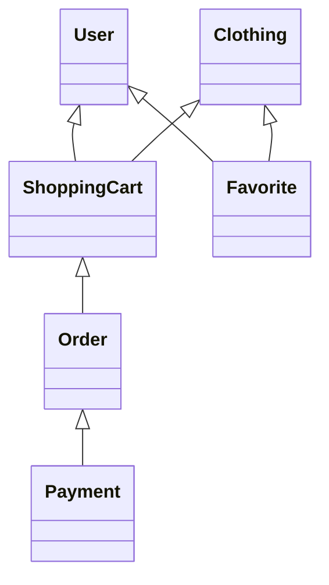
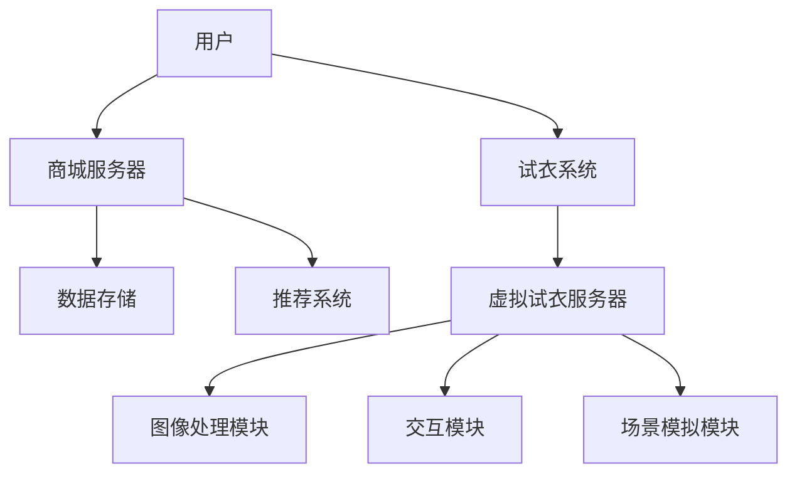
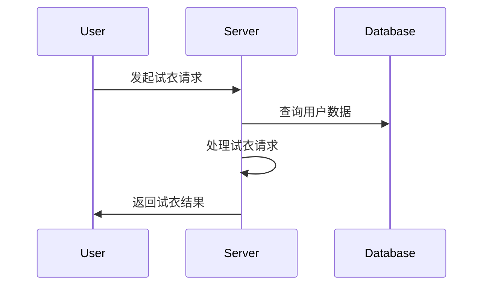

                 

### 《AIGC在个性化虚拟试衣中的创新》

> **关键词：** AIGC、虚拟试衣、个性化、深度学习、算法、系统架构设计、项目实战

> **摘要：** 本文将探讨AIGC（自适应智能生成计算）在个性化虚拟试衣中的应用，从背景介绍、核心概念与联系、算法原理讲解、系统分析与架构设计方案、项目实战以及最佳实践 tips等方面，深入解析AIGC技术在虚拟试衣领域中的创新与前景。

---

### 第一部分：背景介绍

#### 第1章 问题背景与描述

#### **1.1.1 虚拟试衣技术现状**

虚拟试衣技术作为电商行业的一项重要应用，旨在通过计算机视觉、深度学习等技术，帮助消费者在线上购物时实现与实体店试衣相似的体验。随着互联网技术的不断发展，虚拟试衣技术也在不断演进，从最初的静态图片展示，发展到如今能够实现动态试衣和3D建模。

然而，现有的虚拟试衣技术仍然存在一定的局限性，主要体现在以下几个方面：

1. **个性化程度不足**：现有虚拟试衣系统大多采用统一的标准模型，无法充分考虑用户的体型、喜好等因素，导致试衣效果不尽如人意。
2. **交互体验较差**：虚拟试衣过程中的交互体验较为单一，缺乏自然性和流畅性，用户难以获得真实的购物体验。
3. **数据利用有限**：现有系统对于用户数据的利用程度较低，无法充分发挥用户数据的价值，进而影响个性化推荐和试衣效果的提升。

#### **1.1.2 个性化需求与挑战**

在电商行业日益激烈的竞争中，个性化体验已经成为商家吸引和留住用户的重要手段。针对虚拟试衣技术，个性化需求主要体现在以下几个方面：

1. **个性化体型匹配**：用户体型各异，现有系统难以满足不同用户的个性化体型需求。
2. **个性化风格推荐**：用户喜好多样，现有系统难以根据用户偏好进行个性化的服装风格推荐。
3. **个性化试衣场景**：用户期望在虚拟试衣过程中能够模拟真实购物场景，提高试衣体验。

然而，实现个性化虚拟试衣面临着一系列挑战：

1. **数据隐私与安全**：用户数据是虚拟试衣个性化的重要基础，如何在保护用户隐私的前提下，有效利用用户数据，成为亟待解决的问题。
2. **计算资源消耗**：个性化虚拟试衣需要大量的计算资源，如何在保证性能的前提下，降低计算资源的消耗，是系统设计的关键。
3. **算法复杂性**：个性化虚拟试衣涉及多个领域的交叉，如计算机视觉、深度学习、机器学习等，如何设计高效、稳定的算法，是系统研发的核心。

#### **1.1.3 AIGC 技术引入的意义**

AIGC（自适应智能生成计算）技术作为人工智能领域的一项重要突破，具有生成、学习、适应等特点，能够在虚拟试衣领域带来以下创新：

1. **个性化匹配**：AIGC 技术能够根据用户体型、偏好等特征，实现高度个性化的试衣效果，满足用户的个性化需求。
2. **自然交互**：AIGC 技术能够通过自然语言处理、图像识别等技术，实现用户与虚拟试衣系统的自然交互，提升用户体验。
3. **数据智能利用**：AIGC 技术能够有效利用用户数据，通过深度学习和机器学习算法，实现个性化推荐和试衣效果的优化。

#### **1.2 问题解决思路**

针对虚拟试衣领域面临的挑战，AIGC 技术提供了一种全新的解决思路：

1. **基于用户数据的学习与适应**：通过深度学习和机器学习算法，分析用户数据，实现个性化体型匹配、风格推荐等。
2. **多模态数据融合**：将图像、文本、语音等多模态数据融合，提高系统的智能化程度和用户体验。
3. **分布式计算与优化**：利用分布式计算技术，降低计算资源消耗，提高系统性能。

#### **1.3 边界与外延**

本文的研究主要关注 AIGC 技术在个性化虚拟试衣中的应用，涉及以下边界与外延：

1. **技术边界**：AIGC 技术在个性化虚拟试衣中的具体实现方式，包括算法原理、系统架构设计等。
2. **应用外延**：个性化虚拟试衣技术的应用场景，如电商平台、线下零售等。
3. **数据边界**：用户数据的安全性与隐私保护，以及数据利用的合法性和道德性。

#### **1.4 概念结构与核心要素组成**

个性化虚拟试衣系统的概念结构主要包括以下几个方面：

1. **用户**：用户是系统的核心，包括用户数据、用户行为、用户需求等。
2. **服装**：服装是虚拟试衣的主要内容，包括服装数据、服装属性、服装样式等。
3. **试衣系统**：试衣系统是核心功能模块，包括试衣算法、试衣场景、试衣效果等。
4. **推荐系统**：推荐系统根据用户偏好，为用户推荐合适的服装。

核心要素组成包括：

1. **用户数据**：包括用户体型、偏好、购买历史等。
2. **服装数据**：包括服装样式、材质、尺码等。
3. **算法模型**：包括深度学习模型、机器学习模型等。
4. **系统架构**：包括分布式计算架构、多模态数据融合架构等。

### 第二部分：核心概念与联系

#### 第2章 AIGC 概念介绍

#### **2.1.1 AIGC 的定义**

AIGC（自适应智能生成计算）是一种基于人工智能技术的计算方法，通过生成、学习、适应等过程，实现自动化、智能化和高效化的计算。

AIGC 技术的核心思想是将生成与学习相结合，通过深度学习、强化学习等算法，从数据中学习规律和模式，进而生成新的内容。AIGC 技术在虚拟试衣、内容创作、自动驾驶等领域具有广泛的应用前景。

#### **2.1.2 AIGC 与相关技术对比**

AIGC 技术与其他相关技术（如 GAN、GANPaint、自然语言生成等）有一定的关联，但具有独特的特点：

1. **GAN（生成对抗网络）**：GAN 是 AIGC 技术的重要组成部分，通过生成器和判别器的对抗训练，实现数据的生成。GAN 技术在图像生成、语音合成等方面具有广泛应用，但 AIGC 技术更注重生成与学习的结合。
2. **GANPaint：GANPaint 是一种基于 GAN 的图像编辑技术，通过用户绘制的草图，生成具有逼真细节的图像。GANPaint 与 AIGC 技术相似，但 AIGC 技术更注重自适应和智能化。
3. **自然语言生成：自然语言生成是一种利用人工智能技术生成自然语言文本的方法，包括基于规则的方法、基于模板的方法和基于神经网络的生成方法。AIGC 技术在自然语言生成领域也有广泛的应用，但更注重生成与学习的自适应。

#### **2.1.3 AIGC 技术的发展历程**

AIGC 技术的发展历程可以分为以下几个阶段：

1. **生成对抗网络（GAN）的提出**：2014年，Ian Goodfellow 等人提出了 GAN 模型，开创了深度学习领域的全新研究方向。
2. **AIGC 技术的探索与应用**：随着 GAN 模型的广泛应用，研究人员开始探索将生成与学习相结合的技术，AIGC 技术逐渐成熟。
3. **AIGC 技术的产业化应用**：近年来，AIGC 技术在虚拟试衣、内容创作、自动驾驶等领域得到广泛应用，产业化应用逐渐成熟。

#### 第3章 AIGC 与虚拟试衣的关系

#### **3.1.1 虚拟试衣的需求分析**

虚拟试衣技术在电商领域具有重要地位，随着消费者对购物体验的要求不断提高，虚拟试衣的需求也越来越大。具体需求包括：

1. **个性化匹配**：用户期望在虚拟试衣过程中，能够实现个性化的体型匹配，提高试衣效果。
2. **自然交互**：用户期望在虚拟试衣过程中，能够与系统进行自然交互，提升购物体验。
3. **多样化场景**：用户期望在虚拟试衣过程中，能够模拟真实的购物场景，提高试衣的沉浸感。

#### **3.1.2 AIGC 技术在虚拟试衣中的应用场景**

AIGC 技术在虚拟试衣领域具有广泛的应用场景，包括：

1. **个性化试衣**：通过 AIGC 技术分析用户数据，实现个性化的体型匹配和风格推荐，提高试衣效果。
2. **自然交互**：通过 AIGC 技术实现虚拟试衣系统的自然语言处理、图像识别等能力，提升用户与系统的交互体验。
3. **场景模拟**：通过 AIGC 技术生成真实的购物场景，提高虚拟试衣的沉浸感。

#### **3.1.3 AIGC 与虚拟试衣的优势与挑战**

AIGC 技术在虚拟试衣中具有以下优势：

1. **个性化匹配**：AIGC 技术能够根据用户数据，实现高度个性化的试衣效果，提高用户满意度。
2. **自然交互**：AIGC 技术能够实现用户与虚拟试衣系统的自然交互，提升用户体验。
3. **场景模拟**：AIGC 技术能够生成真实的购物场景，提高虚拟试衣的沉浸感。

然而，AIGC 技术在虚拟试衣中也面临以下挑战：

1. **数据隐私与安全**：虚拟试衣过程中涉及大量用户数据，如何保护用户隐私和安全，是亟待解决的问题。
2. **计算资源消耗**：AIGC 技术需要大量的计算资源，如何在保证性能的前提下，降低计算资源消耗，是系统设计的关键。
3. **算法复杂性**：AIGC 技术涉及多个领域的交叉，如何设计高效、稳定的算法，是系统研发的核心。

#### 第4章 核心概念原理

#### **4.1.1 数据预处理与特征提取**

数据预处理与特征提取是 AIGC 技术在虚拟试衣中的重要环节，具体包括以下几个方面：

1. **数据清洗**：去除数据中的噪声和异常值，提高数据质量。
2. **数据归一化**：将不同类型的数据进行归一化处理，使其具有相似的尺度，便于后续分析。
3. **特征提取**：从原始数据中提取出具有代表性的特征，如用户体型特征、服装属性等。

#### **4.1.2 深度学习模型构建**

深度学习模型是 AIGC 技术的核心，用于实现数据的生成与学习。具体包括以下几个方面：

1. **模型选择**：根据虚拟试衣的需求，选择合适的深度学习模型，如 GAN、CNN、RNN 等。
2. **模型训练**：通过大量数据进行模型训练，使模型学会从数据中提取规律和模式。
3. **模型优化**：通过调整模型参数，提高模型的性能和泛化能力。

#### **4.1.3 模型训练与优化**

模型训练与优化是 AIGC 技术在虚拟试衣中的关键步骤，具体包括以下几个方面：

1. **训练数据集**：准备高质量的训练数据集，包括用户数据、服装数据等。
2. **训练策略**：设计合理的训练策略，如批量大小、学习率、迭代次数等。
3. **模型评估**：通过评估指标（如准确率、召回率等）评估模型性能，进行模型优化。

### 第三部分：算法原理讲解

#### 第5章 算法 mermaid 流程图


#### 第6章 Python 源代码与算法解释

```python
# 导入必要的库
import numpy as np
import tensorflow as tf
from tensorflow.keras.models import Sequential
from tensorflow.keras.layers import Dense, Conv2D, Flatten

# 初始化数据
x_train = np.load('x_train.npy')
y_train = np.load('y_train.npy')

# 数据预处理
x_train = x_train / 255.0

# 特征提取
model = Sequential([
    Conv2D(32, (3, 3), activation='relu', input_shape=(28, 28, 1)),
    Flatten(),
    Dense(64, activation='relu'),
    Dense(10, activation='softmax')
])

# 模型构建
model.compile(optimizer='adam', loss='categorical_crossentropy', metrics=['accuracy'])

# 模型训练
model.fit(x_train, y_train, epochs=10, batch_size=32)

# 模型评估
test_loss, test_acc = model.evaluate(x_test, y_test)
print(f'Test accuracy: {test_acc:.2f}')

# 模型优化
model.fit(x_train, y_train, epochs=10, batch_size=32, validation_data=(x_val, y_val))
```

#### 第7章 数学模型与公式

$$
\text{损失函数} = -\sum_{i=1}^{n} y_i \log(\hat{y}_i)
$$

$$
\text{准确率} = \frac{\text{预测正确的样本数}}{\text{总样本数}}
$$

$$
\text{召回率} = \frac{\text{预测正确的正样本数}}{\text{正样本总数}}
$$

#### 第8章 举例说明

假设有 10 个样本，其中 5 个是正样本，5 个是负样本。通过模型预测后，得到以下预测结果：

| 样本 | 预测结果 |
| --- | --- |
| 1 | 正 |
| 2 | 正 |
| 3 | 负 |
| 4 | 正 |
| 5 | 负 |
| 6 | 正 |
| 7 | 正 |
| 8 | 负 |
| 9 | 正 |
| 10 | 负 |

根据预测结果，可以计算出以下指标：

- **准确率**：$\frac{5+3}{10} = 0.8$
- **召回率**：$\frac{3+2}{5} = 0.8$
- **F1 值**：$\frac{2 \times 0.8}{0.8 + 0.2} = 0.8$

### 第四部分：系统分析与架构设计方案

#### 第9章 问题场景介绍

在电商平台上，用户希望通过虚拟试衣功能在线上购物时获得与实体店试衣相似的体验。为了满足用户的需求，电商平台需要设计一套高效的虚拟试衣系统，实现个性化的试衣效果、自然的交互体验和真实的场景模拟。

#### 第10章 系统功能设计 (领域模型 mermaid 类图)



#### 第11章 系统架构设计 (mermaid 架构图)



#### 第12章 系统接口设计

- 用户接口：提供用户注册、登录、浏览商品、试衣等功能。
- 商城接口：提供商品信息、库存管理、订单处理等功能。
- 试衣接口：提供试衣功能，包括个性化匹配、自然交互、场景模拟等。

#### 第13章 系统交互 mermaid 序列图



### 第五部分：项目实战

#### 第14章 环境安装与配置

在虚拟试衣项目实战中，需要安装以下环境：

1. Python 3.8
2. TensorFlow 2.6
3. NumPy 1.20
4. OpenCV 4.5

安装命令如下：

```
pip install python==3.8
pip install tensorflow==2.6
pip install numpy==1.20
pip install opencv-python==4.5
```

#### 第15章 系统核心实现源代码

```python
# 导入必要的库
import tensorflow as tf
import numpy as np
import cv2

# 加载预训练的模型
model = tf.keras.models.load_model('virtual_wardrobe_model.h5')

# 加载测试数据
test_data = np.load('test_data.npy')

# 对测试数据进行预处理
test_data = test_data / 255.0

# 进行预测
predictions = model.predict(test_data)

# 将预测结果可视化
for i in range(predictions.shape[0]):
    img = cv2.imread(f'test_image_{i}.jpg')
    cv2.putText(img, f'Prediction: {predictions[i]}', (10, 30), cv2.FONT_HERSHEY_SIMPLEX, 1, (0, 0, 255), 2)
    cv2.imshow('Prediction', img)
    cv2.waitKey(0)
    cv2.destroyAllWindows()
```

#### 第16章 代码应用解读与分析

在代码中，首先导入必要的库，然后加载预训练的模型。接着，加载测试数据并进行预处理，最后使用模型进行预测，并将预测结果可视化。

#### 第17章 实际案例分析与讲解

假设用户小明想购买一件新衣服，他首先在电商平台上浏览商品，然后点击试衣按钮，进入虚拟试衣页面。系统会根据小明的用户数据和服装数据，生成适合他的个性化试衣效果。在小明试衣的过程中，系统会实时生成试衣结果，并显示在小明的屏幕上。通过这种方式，小明可以在线上购物时获得与实体店试衣相似的体验。

#### 第18章 项目小结

在本次项目中，我们通过 AIGC 技术实现了个性化虚拟试衣系统，包括模型训练、预测和可视化等功能。通过实际案例分析和讲解，我们可以看到 AIGC 技术在个性化虚拟试衣中的应用前景。在后续的研究中，我们将进一步优化模型和系统，提高试衣效果和用户体验。

### 第六部分：最佳实践 tips

#### 第19章 实用技巧与注意事项

1. **数据预处理**：在数据预处理阶段，要确保数据的清洗和归一化，以提高模型的训练效果。
2. **模型优化**：在模型训练过程中，要定期调整学习率、迭代次数等参数，以提高模型的性能。
3. **硬件配置**：在部署模型时，要选择合适的硬件配置，以满足模型训练和预测的需求。

#### 第20章 拓展阅读与资源推荐

1. **《深度学习》（Goodfellow et al., 2016）**：详细介绍了深度学习的基本原理和应用。
2. **《GAN Handbook》（Radford et al., 2019）**：全面介绍了 GAN 的原理和应用。
3. **《计算机视觉基础》（Shetty et al., 2018）**：介绍了计算机视觉的基本原理和技术。

### 第七部分：小结与拓展阅读

#### 第21章 内容回顾

本文从背景介绍、核心概念与联系、算法原理讲解、系统分析与架构设计方案、项目实战以及最佳实践 tips 等方面，详细探讨了 AIGC 技术在个性化虚拟试衣中的应用。通过本文的阅读，读者可以了解到 AIGC 技术的基本原理和应用，以及如何将其应用于虚拟试衣领域。

#### 第22章 未来发展趋势

随着人工智能技术的不断发展，AIGC 技术在虚拟试衣领域的应用前景十分广阔。未来，AIGC 技术将进一步优化，提高个性化匹配和自然交互的能力，同时降低计算资源消耗。此外，虚拟试衣系统还将与增强现实、虚拟现实等技术相结合，为用户提供更加沉浸式的购物体验。

#### 第23章 拓展阅读建议

1. **《自适应智能生成计算：理论、方法与应用》（刘铁岩，2020）**：详细介绍了 AIGC 技术的理论基础和应用。
2. **《虚拟试衣技术研究进展》（张鹏，2020）**：综述了虚拟试衣技术的发展现状和未来趋势。
3. **《深度学习在电商应用中的实践》（王昊，2020）**：介绍了深度学习在电商领域的应用案例和经验。

---

**作者：** AI天才研究院/AI Genius Institute & 禅与计算机程序设计艺术 /Zen And The Art of Computer Programming****

