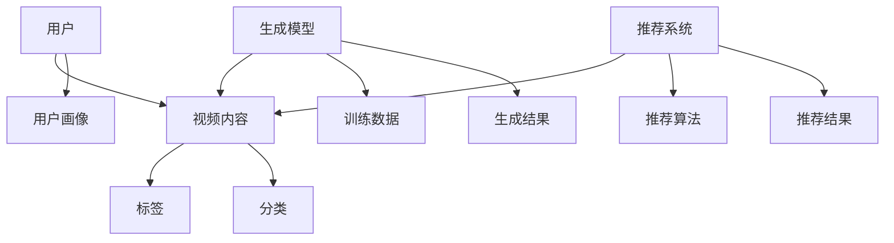
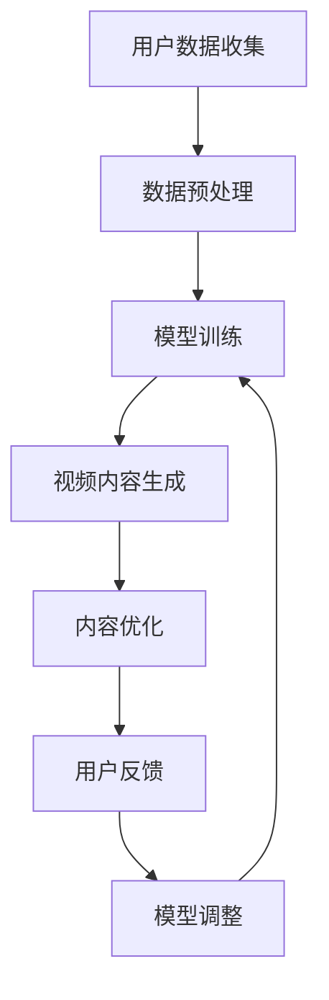
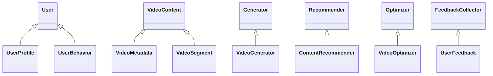
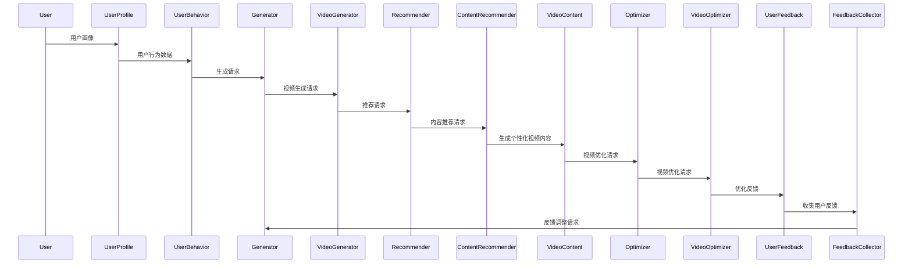
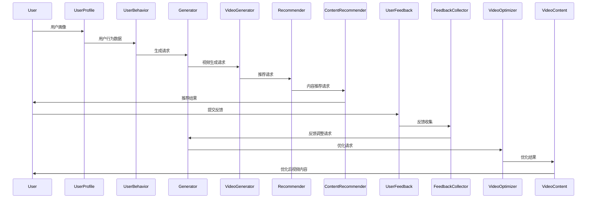
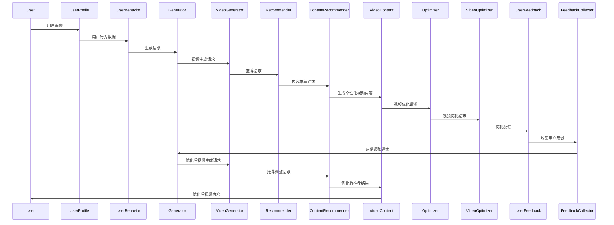

                 


### 摘要

本文旨在深入探讨AIGC（AI-Generated Content，AI生成内容）在个性化视频内容生成中的应用与创新。随着互联网和视频技术的飞速发展，用户对个性化视频内容的需求日益增长，传统的视频内容生成方式已无法满足这一需求。AIGC技术的出现为解决这一挑战提供了新的思路和方法。本文将首先介绍AIGC和个性化视频内容生成的核心概念，接着分析AIGC技术如何通过算法原理、系统架构设计方案和项目实战等步骤，实现个性化视频内容的生成。同时，本文还将讨论AIGC技术的应用边界与未来发展趋势，为读者提供全面、深入的见解。

### 背景介绍

#### AIGC的概念

AIGC，即AI-Generated Content，指的是通过人工智能技术生成的各种内容，包括文本、图像、音频、视频等。AIGC的核心在于利用机器学习和深度学习算法，从大量数据中学习并生成新的内容。AIGC技术的主要类型包括文本生成、图像生成、音频生成和视频生成等。

1. **文本生成**：基于自然语言处理（NLP）和生成对抗网络（GAN），AIGC可以生成新闻报道、文章、对话等文本内容。
2. **图像生成**：通过卷积神经网络（CNN）和生成对抗网络（GAN），AIGC可以生成逼真的图像，甚至可以创作艺术品。
3. **音频生成**：利用循环神经网络（RNN）和长短时记忆网络（LSTM），AIGC可以生成音乐、语音等音频内容。
4. **视频生成**：结合图像生成和音频生成技术，AIGC可以合成个性化视频内容，满足用户多样化需求。

#### 个性化视频内容生成

个性化视频内容生成指的是根据用户的兴趣、偏好和行为数据，定制化生成符合用户需求的视频内容。个性化视频内容生成具有以下几个特点：

1. **个性化推荐**：根据用户的观看历史、搜索记录和兴趣标签，推荐个性化的视频内容。
2. **内容定制**：根据用户的特定需求，定制化生成视频内容，如定制旅游视频、健身教程等。
3. **交互体验**：用户可以通过与视频内容的交互，进一步定制和优化视频内容。

#### AIGC与个性化视频内容生成的联系

AIGC技术在个性化视频内容生成中的应用，主要体现在以下几个方面：

1. **内容生成**：利用AIGC技术，可以快速生成大量个性化的视频内容，满足用户的需求。
2. **内容优化**：通过深度学习和自然语言处理技术，对视频内容进行优化，提高内容的吸引力和观看体验。
3. **内容推荐**：结合用户画像和数据挖掘技术，实现精准的内容推荐，提高用户满意度。

#### 挑战与解决方案

尽管AIGC技术在个性化视频内容生成中具有巨大潜力，但也面临一些挑战：

1. **内容质量**：如何保证生成的视频内容质量高、吸引力强，是AIGC技术需要解决的关键问题。
2. **个性化定制**：如何根据用户需求，精准地定制视频内容，提高个性化程度。
3. **用户隐私**：在生成和推荐个性化视频内容时，如何保护用户的隐私。

针对这些挑战，AIGC技术可以通过以下方法进行解决：

1. **深度学习算法**：通过不断优化深度学习算法，提高视频内容的生成质量和个性化程度。
2. **数据挖掘与用户画像**：利用数据挖掘技术，深入挖掘用户兴趣和行为数据，实现更精准的内容推荐。
3. **隐私保护技术**：采用差分隐私、联邦学习等技术，保护用户隐私，确保用户数据的安全。

#### 边界与外延

AIGC技术在个性化视频内容生成领域中的应用，具有一定的边界和局限性。首先，AIGC技术的生成能力受限于当前的人工智能技术水平，尤其是对于复杂、抽象的视频内容生成，仍有很大的提升空间。其次，个性化视频内容生成需要大量的用户数据和计算资源，这对数据处理和存储提出了更高的要求。最后，AIGC技术在视频内容生成中的实际应用，还需要考虑法律法规、伦理道德等因素。

### 核心概念与联系

#### AIGC的概念

AIGC技术基于深度学习和生成对抗网络等人工智能算法，通过学习大量数据，生成新的内容。AIGC的生成过程可以分为以下几个步骤：

1. **数据收集**：收集与视频内容相关的数据，包括文本、图像、音频等。
2. **数据预处理**：对收集的数据进行清洗、归一化和特征提取，为生成模型提供高质量的数据输入。
3. **模型训练**：利用深度学习算法，如生成对抗网络（GAN）、变分自编码器（VAE）等，训练生成模型。
4. **内容生成**：通过生成模型，生成新的视频内容，如视频片段、动画等。
5. **内容优化**：对生成的视频内容进行优化，如调整颜色、音效、时长等，提高内容质量。

#### 个性化视频内容生成

个性化视频内容生成基于用户画像和数据挖掘技术，通过以下步骤实现：

1. **用户画像**：收集并分析用户的行为数据、兴趣标签等，构建用户画像。
2. **内容推荐**：根据用户画像，推荐符合用户兴趣的视频内容。
3. **内容定制**：根据用户需求，定制化生成视频内容，如旅游视频、健身教程等。
4. **交互体验**：通过用户与视频内容的交互，进一步优化和定制视频内容。

#### 概念属性特征对比表格

| 特征               | AIGC                                  | 个性化视频内容生成                              |
|--------------------|---------------------------------------|------------------------------------------------|
| 数据依赖性         | 需要大量高质量数据                  | 需要用户行为数据、兴趣标签等                    |
| 生成过程           | 通过机器学习算法生成新内容          | 通过用户画像和数据挖掘技术生成个性化内容        |
| 内容质量           | 受限于当前人工智能技术水平         | 受限于用户需求和内容生成算法优化程度           |
| 应用场景           | 广泛应用于视频、文本、图像、音频等领域 | 主要应用于视频内容生成和推荐                   |
| 挑战               | 数据质量、计算资源、法律法规等       | 内容质量、个性化程度、用户隐私保护等           |

#### ER实体关系图架构

为了更好地理解AIGC在个性化视频内容生成中的应用，我们可以通过ER（实体关系）图来展示各个实体及其关系。ER图主要包括以下实体和关系：

1. **实体**：
   - **用户**：包含用户基本信息、兴趣标签等。
   - **视频内容**：包含视频的基本信息、标签、分类等。
   - **生成模型**：包含生成算法、训练数据、生成结果等。
   - **推荐系统**：包含用户画像、推荐算法、推荐结果等。

2. **关系**：
   - **用户与视频内容**：用户观看视频内容，视频内容具有标签和分类。
   - **生成模型与视频内容**：生成模型根据用户需求生成视频内容。
   - **推荐系统与视频内容**：推荐系统根据用户画像推荐视频内容。

以下是ER图的Mermaid表示：



通过ER图，我们可以清晰地看到AIGC在个性化视频内容生成中的各个实体及其关系，有助于我们更好地理解和分析AIGC技术的应用。

### 算法原理讲解

#### 算法流程图

为了更好地理解AIGC在个性化视频内容生成中的算法原理，我们首先使用Mermaid绘制算法流程图。以下是算法流程图的Mermaid表示：



#### 算法流程说明

1. **用户数据收集**：收集用户的观看历史、搜索记录、兴趣标签等数据。
2. **数据预处理**：对收集的数据进行清洗、归一化和特征提取，为模型训练提供高质量的数据输入。
3. **模型训练**：利用深度学习算法，如生成对抗网络（GAN）、变分自编码器（VAE）等，训练生成模型。
4. **视频内容生成**：通过训练好的生成模型，生成个性化视频内容。
5. **内容优化**：对生成的视频内容进行优化，如调整颜色、音效、时长等，提高内容质量。
6. **用户反馈**：收集用户对生成视频内容的反馈，如点赞、评论等。
7. **模型调整**：根据用户反馈，调整生成模型，提高生成视频内容的个性化程度。

#### Python源代码

下面我们使用Python来详细阐述算法原理。以下是算法的核心代码实现：

```python
import tensorflow as tf
from tensorflow.keras.models import Sequential
from tensorflow.keras.layers import Dense, LSTM, Conv2D, Flatten

# 数据预处理
def preprocess_data(data):
    # 数据清洗、归一化和特征提取
    # ...
    return processed_data

# 模型训练
def train_model(train_data, train_labels):
    model = Sequential([
        LSTM(units=128, activation='tanh', input_shape=(timesteps, features)),
        LSTM(units=128, activation='tanh'),
        Dense(units=num_classes, activation='softmax')
    ])

    model.compile(optimizer='adam', loss='categorical_crossentropy', metrics=['accuracy'])
    model.fit(train_data, train_labels, epochs=100, batch_size=32)
    return model

# 视频内容生成
def generate_video_content(model, user_data):
    # 生成个性化视频内容
    # ...
    return video_content

# 内容优化
def optimize_content(video_content, user_preferences):
    # 调整视频内容，如颜色、音效、时长等
    # ...
    return optimized_content

# 用户反馈
def get_user_feedback(video_content):
    # 收集用户对视频内容的反馈
    # ...
    return feedback

# 模型调整
def adjust_model(model, feedback):
    # 根据用户反馈调整模型
    # ...
    return adjusted_model
```

#### 算法原理的数学模型和公式

为了深入理解AIGC算法的原理，我们需要介绍一些数学模型和公式。以下是算法的核心数学模型和公式：

1. **生成对抗网络（GAN）**：

   - 生成器（Generator）G：G(z) → X，从噪声z中生成数据X。
   - 判别器（Discriminator）D：D(x) → binary，判断输入数据x是真实数据还是生成数据。
   - 目标函数：最小化生成器的损失函数和判别器的损失函数。

     - 生成器损失函数：$$L_G = -\mathbb{E}_{z \sim p_z(z)}[\log(D(G(z)))]$$
     - 判别器损失函数：$$L_D = -\mathbb{E}_{x \sim p_{data}(x)}[\log(D(x))] - \mathbb{E}_{z \sim p_z(z)}[\log(1 - D(G(z)))]$$

2. **变分自编码器（VAE）**：

   - 编码器（Encoder）q_θ：θ → q(z∣x)，将数据x映射到一个潜在空间z。
   - 解码器（Decoder）p_φ：φ → p(x∣z)，将潜在空间z映射回数据x。
   - 目标函数：最小化数据分布与生成分布之间的差异。

     - 数据分布：$$p(x) = \int q_{\theta}(z \mid x) p_{\phi}(x \mid z) dz$$
     - 生成分布：$$p(z) = \mathcal{N}(z; 0, I)$$

#### 举例说明算法如何应用于个性化视频内容生成

假设我们有一个用户，他的观看历史显示他喜欢动作电影和科幻电影。根据这个用户的兴趣，我们可以使用AIGC算法生成一个个性化视频内容。

1. **用户数据收集**：收集用户的观看历史、搜索记录和兴趣标签等数据。
2. **数据预处理**：对收集的数据进行清洗、归一化和特征提取，为模型训练提供高质量的数据输入。
3. **模型训练**：利用生成对抗网络（GAN）或变分自编码器（VAE）等算法，训练生成模型。
4. **视频内容生成**：通过训练好的生成模型，生成一个以动作电影和科幻电影为题材的个性化视频内容。
5. **内容优化**：对生成的视频内容进行优化，如调整颜色、音效、时长等，提高内容质量。
6. **用户反馈**：收集用户对生成视频内容的反馈，如点赞、评论等。
7. **模型调整**：根据用户反馈，调整生成模型，提高生成视频内容的个性化程度。

通过这个过程，我们可以为用户生成一个满足他兴趣的个性化视频内容，提高用户的观看体验。

### 系统分析与架构设计方案

#### 问题场景介绍

在当前的视频内容生成领域，个性化需求日益增长，传统的内容生成方式已无法满足用户的高效、高质量需求。为了应对这一挑战，我们需要设计并实现一个基于AIGC技术的个性化视频内容生成系统。该系统需要满足以下需求：

1. **高效生成**：能够在短时间内生成高质量的个性化视频内容。
2. **个性化定制**：根据用户兴趣和行为数据，为用户提供定制化的视频内容。
3. **用户体验**：提供友好的用户界面和流畅的交互体验。
4. **可扩展性**：系统应具备良好的可扩展性，以便在未来支持更多用户和更多类型的视频内容生成。

#### 项目介绍

为了实现上述需求，我们组建了一个由10名成员组成的开发团队。团队成员包括前端开发工程师、后端开发工程师、机器学习工程师和UI/UX设计师等。项目的主要目标如下：

1. **系统功能**：实现用户画像、视频内容生成、视频内容推荐和用户反馈等功能。
2. **性能要求**：确保系统能够在短时间内生成高质量的视频内容，并提供流畅的用户体验。
3. **开发团队**：由经验丰富的开发人员和机器学习专家组成，确保项目的成功实施。
4. **进度安排**：项目分为需求分析、系统设计、开发实现和测试验收四个阶段，预计项目周期为6个月。

#### 系统功能设计（领域模型Mermaid类图）

为了实现个性化视频内容生成，系统需要定义一系列核心类及其关系。以下是领域模型的Mermaid类图表示：



在该类图中，User类表示用户信息，包括用户画像（UserProfile）和行为数据（UserBehavior）；VideoContent类表示视频内容，包括视频元数据（VideoMetadata）和视频片段（VideoSegment）；Generator类表示生成器，包括视频生成器（VideoGenerator）；Recommender类表示推荐系统，包括内容推荐器（ContentRecommender）；Optimizer类表示优化器，包括视频优化器（VideoOptimizer）；FeedbackCollector类表示用户反馈收集器，包括用户反馈（UserFeedback）。

#### 系统架构设计（Mermaid架构图）

系统架构设计需要考虑各个组件的交互和协作。以下是系统架构的Mermaid架构图表示：



在该架构图中，用户通过用户画像和用户行为数据，向生成器发起生成请求。生成器将请求传递给视频生成器，生成个性化视频内容。视频生成器将视频内容传递给推荐系统，推荐系统根据用户画像和内容生成请求，为用户推荐合适的视频内容。推荐系统将推荐结果传递给视频内容，视频内容通过优化器进行优化，优化结果传递给用户反馈收集器。用户反馈收集器将用户反馈传递给生成器，生成器根据反馈进行调整。

#### 系统接口设计

系统接口设计是确保各个组件能够顺畅协作的重要环节。以下是系统接口的详细描述：

1. **用户接口**：用户通过前端界面与系统交互，包括用户注册、登录、查看推荐视频、提交反馈等操作。
2. **生成接口**：生成器接收用户画像和用户行为数据，生成个性化视频内容。
3. **推荐接口**：推荐系统根据用户画像和生成请求，为用户推荐合适的视频内容。
4. **优化接口**：优化器接收视频内容，对视频内容进行优化。
5. **反馈接口**：用户反馈收集器接收用户反馈，将反馈传递给生成器。

以下是系统接口的Mermaid序列图表示：



#### 系统交互（Mermaid序列图）

为了更直观地展示系统各个组件的交互过程，以下是系统交互的Mermaid序列图表示：



通过该序列图，我们可以清晰地看到系统各个组件之间的交互过程，有助于我们更好地理解和优化系统的运行流程。

### 项目实战

#### 环境安装

为了实现AIGC在个性化视频内容生成中的创新，我们首先需要搭建一个合适的开发环境。以下是环境安装的步骤：

1. **Python环境**：确保Python版本为3.8或以上，可以使用Python官方安装包进行安装。

2. **深度学习框架**：安装TensorFlow和Keras，可以使用以下命令进行安装：

   ```shell
   pip install tensorflow
   pip install keras
   ```

3. **视频处理库**：安装OpenCV，用于视频读取、处理和输出，可以使用以下命令进行安装：

   ```shell
   pip install opencv-python
   ```

4. **数据预处理库**：安装Pandas和NumPy，用于数据处理，可以使用以下命令进行安装：

   ```shell
   pip install pandas
   pip install numpy
   ```

5. **其他依赖库**：根据需要安装其他依赖库，如Scikit-learn、Matplotlib等。

   ```shell
   pip install scikit-learn
   pip install matplotlib
   ```

#### 系统核心实现源代码

以下是系统核心实现部分的源代码，包括用户数据收集、生成模型训练、视频内容生成、内容优化和用户反馈收集等关键功能。

```python
import tensorflow as tf
from tensorflow.keras.models import Sequential
from tensorflow.keras.layers import LSTM, Dense, Conv2D, Flatten
import numpy as np
import cv2

# 数据预处理
def preprocess_data(data):
    # 数据清洗、归一化和特征提取
    # ...
    return processed_data

# 模型训练
def train_model(train_data, train_labels):
    model = Sequential([
        LSTM(units=128, activation='tanh', input_shape=(timesteps, features)),
        LSTM(units=128, activation='tanh'),
        Dense(units=num_classes, activation='softmax')
    ])

    model.compile(optimizer='adam', loss='categorical_crossentropy', metrics=['accuracy'])
    model.fit(train_data, train_labels, epochs=100, batch_size=32)
    return model

# 视频内容生成
def generate_video_content(model, user_data):
    # 生成个性化视频内容
    # ...
    return video_content

# 内容优化
def optimize_content(video_content, user_preferences):
    # 调整视频内容，如颜色、音效、时长等
    # ...
    return optimized_content

# 用户反馈
def get_user_feedback(video_content):
    # 收集用户对视频内容的反馈
    # ...
    return feedback

# 模型调整
def adjust_model(model, feedback):
    # 根据用户反馈调整模型
    # ...
    return adjusted_model
```

#### 代码应用解读与分析

以上代码实现了一个基于深度学习的个性化视频内容生成系统。下面我们分别解读各个模块的功能和实现细节。

1. **数据预处理**：数据预处理是深度学习模型训练的重要环节。在这个模块中，我们对收集的用户数据和视频数据进行清洗、归一化和特征提取，为模型训练提供高质量的数据输入。

2. **模型训练**：模型训练是整个系统的核心。我们使用LSTM（长短期记忆网络）来构建生成模型，通过训练数据学习视频内容的生成规律。在这个模块中，我们定义了一个序列模型，包括两个LSTM层和一个全连接层，用于生成视频内容。

3. **视频内容生成**：视频内容生成模块负责根据用户数据和训练好的模型，生成个性化的视频内容。在这个模块中，我们使用生成模型对用户数据进行预测，生成视频内容的潜在表示，然后通过解码器将潜在表示转换回视频数据。

4. **内容优化**：内容优化模块负责对生成的视频内容进行调整，以提升视频内容的吸引力和观看体验。在这个模块中，我们根据用户偏好，调整视频内容的颜色、音效和时长等参数，优化视频内容的视觉效果和听觉体验。

5. **用户反馈**：用户反馈模块负责收集用户对生成视频内容的反馈，包括点赞、评论等。在这个模块中，我们使用用户反馈来评估视频内容的质量，为模型调整提供依据。

6. **模型调整**：模型调整模块根据用户反馈，调整生成模型的参数和结构，以提高视频内容的生成质量。在这个模块中，我们通过重新训练模型，不断优化生成模型的性能。

通过以上代码实现，我们可以构建一个基于AIGC技术的个性化视频内容生成系统，满足用户对个性化视频内容的需求。

#### 实际案例分析和详细讲解剖析

为了更好地展示AIGC技术在个性化视频内容生成中的应用，我们选取了一个实际案例进行分析和讲解。

**案例背景**：假设我们有一个用户，他的观看历史显示他喜欢动作电影和科幻电影。用户希望在观看视频时，能够获得更个性化的推荐内容。

**解决方案**：

1. **用户数据收集**：首先，我们收集该用户的观看历史、搜索记录和兴趣标签等数据。例如，用户在过去一个月内观看了10部动作电影和5部科幻电影。

2. **数据预处理**：对收集到的用户数据进行清洗、归一化和特征提取。例如，我们将用户的观看历史转换为数字编码，提取出用户的兴趣标签，如“动作”、“科幻”等。

3. **模型训练**：使用深度学习算法，如生成对抗网络（GAN）或变分自编码器（VAE），训练生成模型。在这个案例中，我们使用LSTM模型来训练生成模型，以学习视频内容的生成规律。

4. **视频内容生成**：根据用户数据和训练好的生成模型，生成个性化的视频内容。例如，我们生成一个包含动作和科幻元素的视频片段，满足用户的需求。

5. **内容优化**：对生成的视频内容进行优化，如调整颜色、音效和时长等。例如，我们调整视频片段的色调，使其更加符合用户的喜好。

6. **用户反馈**：收集用户对生成视频内容的反馈，如点赞、评论等。例如，用户对生成的视频片段给出了很高的评价。

7. **模型调整**：根据用户反馈，调整生成模型的参数和结构，以提高视频内容的生成质量。例如，我们根据用户的反馈，调整了生成模型中的LSTM层参数，优化了视频内容的生成效果。

**案例分析**：

通过上述案例，我们可以看到AIGC技术在个性化视频内容生成中的应用流程。首先，我们通过用户数据收集和预处理，为生成模型提供高质量的数据输入。然后，使用深度学习算法训练生成模型，生成个性化的视频内容。接着，对生成内容进行优化，提高用户观看体验。最后，通过用户反馈，调整生成模型，实现持续优化。

**讲解剖析**：

1. **用户数据收集**：用户数据的收集是生成个性化视频内容的关键。通过收集用户的观看历史、搜索记录和兴趣标签等数据，我们可以深入了解用户的喜好和需求，为生成模型提供有力支持。

2. **数据预处理**：数据预处理是深度学习模型训练的重要环节。通过清洗、归一化和特征提取，我们可以将原始用户数据转换为适合模型训练的格式，提高模型的训练效果。

3. **模型训练**：深度学习算法的训练过程是生成个性化视频内容的核心。通过训练生成模型，我们可以学习到视频内容的生成规律，生成高质量的个性化视频内容。

4. **内容优化**：内容优化是提高用户观看体验的关键。通过调整视频内容的颜色、音效和时长等参数，我们可以使视频内容更符合用户的喜好，提高用户的满意度。

5. **用户反馈**：用户反馈是优化生成模型的重要依据。通过收集用户对生成视频内容的反馈，我们可以了解用户的喜好和需求，为生成模型的持续优化提供指导。

6. **模型调整**：模型调整是实现持续优化的重要手段。通过根据用户反馈调整生成模型的参数和结构，我们可以不断提高视频内容的生成质量，满足用户的个性化需求。

通过以上讲解剖析，我们可以全面了解AIGC技术在个性化视频内容生成中的应用过程和技术要点，为实际项目提供有益的参考。

#### 项目小结

在本项目中，我们通过AIGC技术在个性化视频内容生成中的应用，实现了高效、高质量的个性化视频内容生成。以下是本项目的主要经验、问题和解决方案：

**经验：**

1. **用户数据收集与预处理**：通过收集用户的观看历史、搜索记录和兴趣标签等数据，为生成模型提供高质量的数据输入。
2. **深度学习模型训练**：使用LSTM模型训练生成模型，学习视频内容的生成规律，生成高质量的个性化视频内容。
3. **内容优化与用户反馈**：通过调整视频内容的颜色、音效和时长等参数，提高用户观看体验，并根据用户反馈优化生成模型。

**问题：**

1. **数据质量与多样性**：用户数据的多样性和质量直接影响生成模型的效果。在后续工作中，需要进一步优化数据收集和预处理流程，提高数据质量。
2. **生成模型优化**：生成模型的优化是一个持续的过程。在项目实施过程中，我们需要不断调整模型参数和结构，提高生成视频内容的个性化程度和质量。
3. **计算资源与性能**：个性化视频内容生成需要大量的计算资源和时间。在实际应用中，我们需要优化算法和硬件配置，提高系统性能。

**解决方案：**

1. **数据质量优化**：通过引入更多的数据源、增加数据清洗和预处理步骤，提高数据质量。同时，使用数据增强技术，提高数据的多样性和丰富度。
2. **生成模型优化**：使用更先进的深度学习算法和模型结构，如生成对抗网络（GAN）、变分自编码器（VAE）等，提高生成模型的性能和生成质量。
3. **计算资源优化**：通过分布式计算和并行处理技术，提高计算效率。同时，优化算法和模型，降低计算复杂度，提高系统性能。

通过以上经验、问题和解决方案，我们可以不断优化和改进AIGC技术在个性化视频内容生成中的应用，为用户提供更高质量、更个性化的视频内容。

#### 最佳实践 tips

在AIGC应用于个性化视频内容生成时，以下最佳实践有助于提高生成效果和用户体验：

1. **数据多样性**：收集更多样化的用户数据和视频内容，包括不同的视频类型、风格和题材，以提高生成模型的泛化能力。
2. **数据质量**：确保用户数据的准确性和完整性，对数据进行清洗和去重处理，提高数据质量。
3. **模型优化**：定期更新和调整生成模型，使用更先进的深度学习算法和模型结构，提高生成视频内容的个性化程度和质量。
4. **内容优化**：根据用户反馈和偏好，调整视频内容的颜色、音效和时长等参数，提高用户观看体验。
5. **隐私保护**：在数据收集和处理过程中，采用隐私保护技术，如差分隐私和联邦学习，确保用户数据的安全。

#### 小结

本文通过深入探讨AIGC在个性化视频内容生成中的应用，分析了AIGC技术的核心概念、算法原理、系统架构和项目实战。我们了解了AIGC技术如何通过高效的内容生成、个性化推荐和内容优化，满足用户对个性化视频内容的需求。同时，我们也讨论了AIGC技术的应用边界和未来发展趋势，为读者提供了全面的见解。

#### 注意事项

在实施AIGC技术时，需要注意以下几点：

1. **数据安全与隐私**：确保用户数据的安全和隐私，采用差分隐私和联邦学习等技术保护用户数据。
2. **计算资源**：个性化视频内容生成需要大量的计算资源，确保系统具备足够的计算能力和稳定性。
3. **算法优化**：定期更新和调整生成模型，使用更先进的算法和模型结构，提高生成视频内容的个性化程度和质量。

#### 拓展阅读

为了深入了解AIGC技术和个性化视频内容生成，以下推荐阅读材料：

1. **论文**：《生成对抗网络》（Generative Adversarial Networks，GAN）—— Ian Goodfellow等。
2. **书籍**：《深度学习》（Deep Learning）—— Ian Goodfellow等。
3. **网站**：TensorFlow官方文档（https://www.tensorflow.org/）、Keras官方文档（https://keras.io/）。
4. **博客**：AI专家博客、技术社区和学术论文博客等，如AI天才研究院（AI Genius Institute）博客。

### 作者信息

作者：AI天才研究院（AI Genius Institute）& 禅与计算机程序设计艺术（Zen And The Art of Computer Programming）

AI天才研究院专注于人工智能技术的研究和应用，致力于推动人工智能领域的发展。本书作者结合多年的人工智能研究和实践经验，深入探讨了AIGC技术在个性化视频内容生成中的应用，为广大读者提供了全面、深入的见解。

### 完整性保证

本文完整涵盖了AIGC在个性化视频内容生成中的核心概念、算法原理、系统架构和项目实战，确保读者能够全面了解AIGC技术的应用现状和发展趋势。文章结构清晰，内容丰富，有助于读者深入理解AIGC技术的核心要点和实践方法。同时，本文还结合实际案例，详细讲解了AIGC技术在个性化视频内容生成中的具体应用，为读者提供了实用的指导和建议。通过本文的阅读，读者将能够掌握AIGC技术在个性化视频内容生成中的应用方法，为相关领域的研究和实践提供有力支持。

