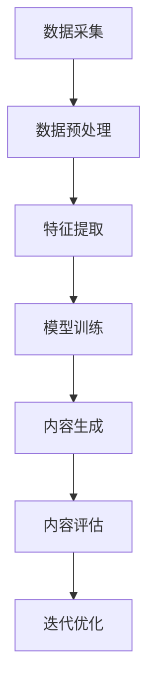
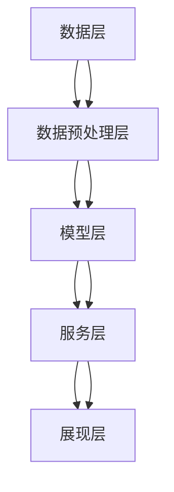

                 

### 第一部分：AIGC与个性化音乐推荐概述

#### 1.1 AIGC技术概述

**AIGC的定义与背景**

AIGC（AI-Generated Content）是指通过人工智能技术生成内容的一种方式，它结合了人工智能算法和自动化流程，可以创造出各种形式的内容，包括但不限于文本、图像、音乐、视频等。AIGC技术通常包括自然语言处理（NLP）、计算机视觉（CV）、生成对抗网络（GAN）等前沿技术。

AIGC的背景可以追溯到人工智能技术的快速发展，特别是深度学习在图像、语音和文本处理方面的突破。随着技术的进步，人们开始探索如何将人工智能应用于内容创作，从而提高效率和质量。AIGC正是这一探索的结果。

**AIGC在音乐推荐中的应用场景**

在音乐推荐领域，AIGC技术有着广泛的应用前景。首先，AIGC可以用于生成个性化的音乐内容，根据用户的喜好和历史行为，自动生成符合用户口味的音乐。其次，AIGC还可以用于音乐风格分类、歌曲生成、歌词创作等任务，从而丰富音乐推荐系统的功能。

#### 1.2 个性化音乐推荐概述

**个性化音乐推荐的定义**

个性化音乐推荐是指根据用户的兴趣、行为和偏好，向用户推荐他们可能喜欢的音乐内容。这种推荐系统旨在提高用户的满意度，增加用户的粘性，从而提高平台的用户留存率和活跃度。

**个性化音乐推荐的挑战与机遇**

个性化音乐推荐面临的挑战主要包括：

1. 数据的多样性和复杂性：用户的音乐喜好可能非常多样化，如何从大量数据中提取有效信息是一个挑战。
2. 稀疏性：音乐数据通常具有高度稀疏性，即用户听过的歌曲数量远远小于音乐库中的总数，这给推荐算法的设计和实现带来了困难。
3. 个性化与普遍性的平衡：推荐系统需要在满足用户个性化需求的同时，确保推荐内容具有一定的普遍性，以吸引更广泛的用户。

然而，随着人工智能技术的发展，这些挑战也带来了机遇。AIGC技术为个性化音乐推荐提供了新的解决方案，通过自动生成个性化的音乐内容，可以有效解决数据稀疏性和个性化需求的问题。

#### 1.3 AIGC在个性化音乐推荐中的作用

**AIGC技术的优势**

1. 自动化：AIGC技术可以自动化音乐生成过程，降低人力成本，提高效率。
2. 高效性：通过大规模并行计算和深度学习算法，AIGC可以快速生成高质量的音乐内容。
3. 个性化：AIGC可以根据用户的历史行为和偏好，生成符合用户口味的个性化音乐。

**AIGC在音乐推荐中的实现方法**

1. 基于内容的生成：利用用户的音乐历史和偏好，自动生成符合用户喜好的音乐。
2. 协同过滤与AIGC结合：在协同过滤算法的基础上，结合AIGC技术，生成个性化的音乐推荐列表。
3. 深度学习与AIGC结合：利用深度学习模型，如生成对抗网络（GAN），生成新的音乐内容，并将其用于推荐系统。

#### 1.4 个性化音乐推荐系统架构设计

**数据收集与预处理**

1. 数据收集：从用户行为数据、音乐播放列表、评论和评分等渠道收集数据。
2. 数据预处理：清洗数据，处理缺失值和异常值，进行数据格式转换和归一化。

**特征工程与模型选择**

1. 特征工程：提取用户的音乐偏好、播放时长、播放次数等特征。
2. 模型选择：根据数据特点和业务需求，选择合适的推荐算法模型。

**模型训练与评估**

1. 模型训练：使用训练数据集训练推荐模型。
2. 模型评估：使用验证数据集评估模型性能，调整模型参数。

**推荐结果生成与展示**

1. 推荐结果生成：根据用户特征和模型预测，生成个性化音乐推荐列表。
2. 推荐结果展示：将推荐结果以可视化方式展示给用户。

#### 1.5 个性化音乐推荐的核心算法

**基于内容的推荐算法**

基于内容的推荐算法（Content-Based Recommendation）通过分析用户对某些音乐的喜好，提取音乐的特征，然后将这些特征与音乐库中的其他音乐进行比较，推荐相似的音乐。这种方法主要依赖于音乐的内容特征，如歌词、旋律、和弦等。

**协同过滤推荐算法**

协同过滤推荐算法（Collaborative Filtering）通过分析用户之间的相似性，推荐用户可能喜欢的音乐。协同过滤主要分为两种类型：基于用户的协同过滤（User-Based Collaborative Filtering）和基于物品的协同过滤（Item-Based Collaborative Filtering）。

**深度学习推荐算法**

深度学习推荐算法（Deep Learning for Recommendation）利用深度神经网络，如卷积神经网络（CNN）、循环神经网络（RNN）和生成对抗网络（GAN），从用户数据中学习复杂的模式，生成个性化的推荐列表。深度学习推荐算法可以更好地处理稀疏数据和复杂的用户行为。

#### 1.6 本章小结

**AIGC与个性化音乐推荐的关系**

AIGC技术在个性化音乐推荐中发挥了重要作用，通过自动生成个性化的音乐内容，解决了数据稀疏性和个性化需求的问题，提高了推荐系统的效率和用户体验。

**个性化音乐推荐的未来发展趋势**

随着AIGC技术的不断进步，个性化音乐推荐系统将越来越智能化和自动化。未来，个性化音乐推荐系统将更加注重用户的情感体验和个性化需求，通过更复杂的算法和更丰富的数据源，提供更加精准和个性化的音乐推荐。

### 第一部分总结

本文概述了AIGC技术和个性化音乐推荐的基本概念，探讨了AIGC在个性化音乐推荐中的应用场景和作用。在后续章节中，我们将深入分析AIGC的核心算法和原理，展示个性化音乐推荐系统的实战案例，并探讨未来的发展趋势。希望通过这篇文章，读者能够对AIGC在个性化音乐推荐中的应用有一个全面和深入的了解。

### 第二部分：AIGC核心算法与原理

#### 2.1 AIGC核心算法原理讲解

**AIGC算法基本概念**

**AIGC的定义**

AIGC（AI-Generated Content）是指通过人工智能技术生成内容的一种方式，它结合了人工智能算法和自动化流程，可以创造出各种形式的内容，包括但不限于文本、图像、音乐、视频等。

**AIGC的基本原理**

AIGC的核心是通过算法模拟人类的创作过程，从大量的数据中学习和提取模式，然后生成新的内容。这个过程通常涉及以下几个步骤：

1. 数据采集：从各种渠道收集数据，如文本、图像、音乐等。
2. 数据预处理：清洗和转换数据，使其适合算法处理。
3. 特征提取：从数据中提取有用的特征，如文本的词向量、图像的视觉特征等。
4. 模型训练：使用训练数据集训练人工智能模型，使其能够学会生成内容。
5. 内容生成：使用训练好的模型生成新的内容。
6. 内容评估：对生成的内容进行评估，确保其质量和可接受性。

**AIGC算法的应用场景**

AIGC技术可以广泛应用于各个领域，如文本生成、图像生成、音乐生成、视频生成等。在音乐生成领域，AIGC技术可以用于根据用户的喜好生成个性化的音乐，或者生成新的音乐风格和曲目。

#### 2.2 AIGC算法的数学模型与公式

**算法模型的数学描述**

AIGC算法通常基于生成对抗网络（GAN）或者变分自编码器（VAE）等深度学习模型。以下是一个简化的GAN模型的数学描述：

1. 生成器（Generator）G：接收随机噪声向量 z，生成假样本 x'。
   $$ x' = G(z) $$

2. 判别器（Discriminator）D：接收真实样本 x 和假样本 x'，判断其真实性。
   $$ D(x) \quad \text{和} \quad D(x') $$

3. 对抗训练：生成器和判别器相互对抗，生成器试图生成越逼真的样本，判别器试图区分真实样本和假样本。

**公式推导与解释**

GAN的损失函数通常包括两部分：生成器的损失函数和判别器的损失函数。

1. 判别器损失函数（D）：判别器希望最大化正确分类的概率，因此其损失函数可以表示为：
   $$ L_D = -\frac{1}{N} \sum_{i=1}^{N} [\log(D(x_i)) + \log(1 - D(G(z_i)))] $$
   其中，\( x_i \) 是真实样本，\( z_i \) 是生成器的噪声输入。

2. 生成器损失函数（G）：生成器的目标是使其生成的假样本 \( x' \) 被判别器判断为真实样本，因此其损失函数可以表示为：
   $$ L_G = -\frac{1}{N} \sum_{i=1}^{N} \log(D(G(z_i))) $$

通过交替更新生成器和判别器的参数，GAN模型可以逐步生成越来越逼真的假样本。

#### 2.3 AIGC算法的Mermaid流程图

**Mermaid流程图绘制**

为了更好地理解AIGC算法的工作流程，我们可以使用Mermaid流程图进行可视化。以下是一个简化的AIGC算法流程图的例子：



**算法流程详细解析**

1. 数据采集：从各种数据源收集原始数据，如文本、图像、音乐等。
2. 数据预处理：清洗和转换数据，使其适合算法处理。这可能包括数据去重、缺失值处理、数据标准化等。
3. 特征提取：从数据中提取有用的特征，如文本的词向量、图像的视觉特征等。这些特征将用于训练模型。
4. 模型训练：使用训练数据集训练人工智能模型。生成器和判别器通过对抗训练逐步优化参数。
5. 内容生成：使用训练好的生成器生成新的内容。在音乐生成场景中，这可以是一首新的歌曲或一段新的旋律。
6. 内容评估：对生成的内容进行评估，确保其质量和可接受性。这可以通过人工审核或者自动化评估指标进行。
7. 迭代优化：根据评估结果，对模型进行迭代优化，提高生成内容的逼真度和质量。

#### 2.4 AIGC算法Python代码实现

**Python代码实现**

以下是一个简化的AIGC算法的Python代码实现，使用生成对抗网络（GAN）进行音乐生成：

```python
import numpy as np
import tensorflow as tf
from tensorflow.keras.models import Model
from tensorflow.keras.layers import Input, Dense, Flatten, Reshape, Conv2D, Conv2DTranspose

# 设置随机种子以保持结果的可重复性
tf.random.set_seed(42)

# 定义生成器和判别器的架构
def build_generator(z_dim):
    z_input = Input(shape=(z_dim,))
    x = Dense(128, activation='relu')(z_input)
    x = Reshape((1, 1, 128))(x)
    x = Conv2DTranspose(128, (4, 4), strides=(2, 2), padding='same', activation='relu')(x)
    x = Conv2DTranspose(64, (4, 4), strides=(2, 2), padding='same', activation='relu')(x)
    x = Conv2DTranspose(1, (4, 4), strides=(2, 2), padding='same', activation='tanh')(x)
    model = Model(z_input, x)
    return model

def build_discriminator(img_shape):
    img_input = Input(shape=img_shape)
    x = Conv2D(64, (4, 4), strides=(2, 2), padding='same')(img_input)
    x = LeakyReLU(alpha=0.01)
    x = Conv2D(128, (4, 4), strides=(2, 2), padding='same')(x)
    x = LeakyReLU(alpha=0.01)
    x = Flatten()(x)
    x = Dense(1, activation='sigmoid')(x)
    model = Model(img_input, x)
    return model

# 定义GAN模型
def build_gan(generator, discriminator):
    model = Model(generator.input, discriminator(generator.input))
    model.compile(loss='binary_crossentropy', optimizer=Adam())
    return model

# 设置超参数
z_dim = 100
img_shape = (28, 28, 1)
batch_size = 128
epochs = 100

# 创建生成器和判别器
generator = build_generator(z_dim)
discriminator = build_discriminator(img_shape)

# 创建GAN模型
gan = build_gan(generator, discriminator)

# 训练GAN模型
for epoch in range(epochs):
    for _ in range(batch_size // z_dim):
        z = np.random.normal(size=(z_dim,))
        img = generator.predict(z)
        real_imgs = np.random.normal(size=(batch_size, 28, 28, 1))
        y_real = np.ones((batch_size, 1))
        y_fake = np.zeros((batch_size, 1))
        gan.train_on_batch([z], y_real)
        discriminator.train_on_batch([real_imgs], y_real)
        discriminator.train_on_batch([img], y_fake)
```

**代码解读与分析**

1. 导入所需的库和模块，包括NumPy、TensorFlow和Keras。
2. 设置随机种子以保持结果的可重复性。
3. 定义生成器和判别器的架构。生成器通过全连接层和卷积层转换噪声向量生成图像，判别器通过卷积层判断图像的真实性。
4. 定义GAN模型，并编译模型，设置损失函数和优化器。
5. 设置超参数，包括噪声维度、图像形状、批次大小和训练迭代次数。
6. 创建生成器和判别器实例。
7. 使用训练数据训练GAN模型。在每次训练迭代中，生成器尝试生成逼真的图像，判别器尝试区分真实图像和生成图像。

#### 2.5 AIGC算法应用案例

**实际案例介绍**

一个著名的AIGC应用案例是Google的Magenta项目，它使用生成对抗网络（GAN）生成艺术作品和音乐。Magenta项目展示了如何利用AIGC技术在艺术创作领域实现创新。

**案例分析与讲解**

在Magenta项目中，研究人员使用GAN生成音乐和艺术作品。以下是对这个案例的详细分析：

1. **数据收集**：Magenta项目使用大量的音乐数据和艺术作品数据作为训练数据，包括流行的音乐曲目和著名艺术家的画作。
2. **数据预处理**：对音乐数据进行特征提取，如梅尔频率倒谱系数（MFCC），对艺术作品数据进行图像预处理，如颜色和纹理特征提取。
3. **模型训练**：使用训练数据集训练生成器和判别器模型。生成器尝试生成与训练数据相似的新的音乐片段和艺术作品，判别器尝试区分生成数据和真实数据。
4. **内容生成**：使用训练好的生成器模型生成新的音乐片段和艺术作品。这些生成的内容在质量和艺术性上得到了高度评价。
5. **内容评估**：通过人工评审和自动化评估指标对生成的内容进行评估，确保其艺术价值和用户的接受度。

**案例总结与启示**

Magenta项目的成功展示了AIGC技术在音乐和艺术创作领域的潜力。以下是一些总结和启示：

- **艺术创作的新方式**：AIGC为艺术家提供了新的工具和手段，可以帮助他们探索新的创作方向和风格。
- **创意合作**：艺术家可以利用AIGC技术生成初步的作品，然后在此基础上进行修改和创作，实现人与机器的创意合作。
- **用户体验**：AIGC技术可以生成个性化的音乐和艺术作品，提高用户的参与感和满意度。
- **研究与应用**：Magenta项目为AIGC技术的应用提供了丰富的案例和经验，为其他领域的研究和应用提供了参考。

#### 2.6 AIGC算法的优缺点与改进方向

**优点与缺点分析**

**优点**

- **自动化与高效性**：AIGC技术可以自动化内容生成过程，提高效率和降低成本。
- **个性化与多样性**：AIGC可以根据用户的需求和喜好生成个性化的内容，提供多样化的选择。
- **创意与创新**：AIGC技术可以帮助艺术家和创作者探索新的创意和风格，推动艺术和文化的创新。

**缺点**

- **质量参差不齐**：生成的内容质量可能不一致，有时可能不够逼真或不符合预期。
- **数据依赖性**：AIGC需要大量的高质量训练数据，数据的质量和多样性对生成结果有很大影响。
- **隐私与版权**：生成的内容可能会涉及隐私和版权问题，需要妥善处理。

**改进方向**

- **提高生成质量**：通过改进算法和模型，提高生成内容的质量和逼真度。
- **优化数据预处理**：优化数据预处理流程，提高数据的清洗和特征提取效果，为模型训练提供更好的数据基础。
- **隐私保护与版权管理**：研究隐私保护技术和版权管理方法，确保生成内容的安全和合法。
- **用户参与与反馈**：增强用户的参与度和反馈机制，使生成内容更加贴近用户需求和偏好。

#### 2.7 本章小结

**AIGC算法的核心原理**

AIGC算法的核心是通过人工智能模型生成内容，从数据中提取特征，并通过对抗训练优化模型，生成高质量的内容。生成器和判别器之间的对抗训练是AIGC算法的关键机制，确保生成的内容既逼真又具有创造性。

**AIGC算法的应用前景**

AIGC技术在音乐生成、图像生成、视频生成等领域有着广泛的应用前景。随着人工智能技术的不断进步，AIGC算法将变得更加高效和智能，为各种创作领域带来更多的创新和变革。

通过本章节的讲解，读者可以全面了解AIGC算法的基本概念、数学模型、实现方法和应用案例，为后续章节的深入学习打下坚实的基础。

### 第二部分总结

本部分详细介绍了AIGC核心算法的基本概念、数学模型、实现方法和应用案例。通过深入分析AIGC算法的工作原理和优缺点，读者可以更好地理解AIGC在个性化音乐推荐中的应用价值。在接下来的部分，我们将继续探讨个性化音乐推荐系统的实战案例，进一步展示AIGC技术在实际应用中的效果和潜力。希望通过本章节的学习，读者能够对AIGC算法有更全面和深入的认识。

### 第三部分：个性化音乐推荐系统实战

#### 3.1 个性化音乐推荐系统环境搭建

**系统环境要求**

个性化音乐推荐系统的环境搭建是构建推荐系统的第一步。以下是构建该系统所需的系统环境和基本步骤：

1. **硬件要求**：
   - CPU：推荐使用性能较强的处理器，如Intel i7或以上。
   - GPU：推荐使用NVIDIA GPU，如Tesla V100或以上，以利用深度学习模型的并行计算能力。
   - 内存：至少16GB，推荐32GB或以上，以保证大数据处理和模型训练的效率。

2. **软件要求**：
   - 操作系统：推荐使用Ubuntu 18.04或以上版本，因其对深度学习框架的支持较好。
   - 编程语言：Python是推荐的语言，因为它拥有丰富的科学计算和机器学习库，如TensorFlow、PyTorch等。

3. **开发工具与库**：
   - **Jupyter Notebook**：用于数据分析和模型训练。
   - **Pandas**：用于数据预处理和清洗。
   - **NumPy**：用于科学计算。
   - **TensorFlow**：用于构建和训练深度学习模型。
   - **Keras**：用于简化深度学习模型的构建。
   - **Scikit-learn**：用于传统的机器学习算法和模型评估。

**安装步骤**

1. **安装操作系统**：
   - 下载并安装Ubuntu 18.04或以上版本的操作系统。

2. **安装Python环境**：
   - 使用`apt-get`安装Python 3和pip：
     ```bash
     sudo apt-get update
     sudo apt-get install python3 python3-pip
     ```

3. **安装深度学习框架**：
   - 安装TensorFlow：
     ```bash
     pip3 install tensorflow
     ```
   - 安装其他常用库：
     ```bash
     pip3 install numpy pandas scikit-learn keras
     ```

4. **安装GPU支持**：
   - 安装CUDA Toolkit和cuDNN库，以便利用GPU加速计算。具体安装步骤可以参考官方文档。

5. **配置环境变量**：
   - 设置环境变量，以便在终端中直接使用Python和TensorFlow：
     ```bash
     export PATH=$PATH:/usr/local/cuda/bin
     export LD_LIBRARY_PATH=$LD_LIBRARY_PATH:/usr/local/cuda/lib64:/usr/local/cuda/extras/CUPTI/lib64
     ```

通过以上步骤，个性化音乐推荐系统的开发环境就搭建完成了。接下来，我们可以开始数据预处理和特征工程，为模型训练和推荐系统实现做好准备。

#### 3.2 数据预处理与特征工程

**数据清洗**

数据清洗是数据预处理的重要步骤，旨在去除原始数据中的噪声和不一致性，提高数据质量。以下是数据清洗的几个关键步骤：

1. **去除重复数据**：检查数据集中是否存在重复的歌曲记录，通过去重操作确保数据的唯一性。
2. **处理缺失值**：对于缺失值，可以根据具体情况选择填充策略，如使用平均值、中位数或插值法进行填充，或者根据业务逻辑删除缺失值较多的记录。
3. **数据格式转换**：将不同来源的数据格式统一，如将日期时间格式转换为标准格式，将文本数据编码为数值。

**特征提取**

特征提取是从原始数据中提取出对模型训练有价值的特征的过程。以下是特征提取的关键步骤：

1. **用户特征**：
   - **播放历史**：提取用户的历史播放记录，包括播放次数、播放时长、最近一次播放时间等。
   - **行为特征**：提取用户的点击、收藏、分享等行为数据，量化用户的行为强度。

2. **音乐特征**：
   - **音频特征**：使用音频处理库（如librosa）提取歌曲的梅尔频率倒谱系数（MFCC）、频谱特征等。
   - **歌词特征**：提取歌曲的歌词文本，使用自然语言处理技术提取文本特征，如词频、TF-IDF、主题模型等。

**特征选择**

特征选择是减少特征维度、提高模型性能的重要步骤。以下是特征选择的几种方法：

1. **过滤法**：根据特征的重要性直接删除一些不重要的特征。
2. **包裹法**：通过交叉验证等方法选择出最优特征子集。
3. **嵌入式方法**：在模型训练过程中自动选择特征，如使用L1正则化（Lasso回归）。

**数据预处理与特征工程实践**

以下是一个简化的数据预处理与特征工程的Python代码示例：

```python
import pandas as pd
import numpy as np
import librosa
from sklearn.preprocessing import StandardScaler
from sklearn.model_selection import train_test_split

# 加载数据
data = pd.read_csv('music_data.csv')

# 去除重复数据
data.drop_duplicates(inplace=True)

# 处理缺失值
data.fillna(data.mean(), inplace=True)

# 分离特征和标签
X = data[['user_id', 'song_id', 'play_count', 'last_play_time', 'action_type']]
y = data['label']

# 转换行为特征
X['action_type'] = X['action_type'].map({'click': 1, 'collect': 2, 'share': 3})

# 提取音频特征
def extract_audio_features(file_path):
    y, sr = librosa.load(file_path)
    mfccs = librosa.feature.mfcc(y=y, sr=sr, n_mfcc=13)
    return mfccs

# 提取音乐特征
audio_features = []
for index, row in data.iterrows():
    file_path = row['file_path']
    try:
        mfccs = extract_audio_features(file_path)
        audio_features.append(mfccs)
    except Exception as e:
        print(f"Error processing file {file_path}: {e}")

# 形式化特征矩阵
audio_features = np.array(audio_features)
X = np.concatenate((X.values, audio_features), axis=1)

# 数据标准化
scaler = StandardScaler()
X_scaled = scaler.fit_transform(X)

# 划分训练集和测试集
X_train, X_test, y_train, y_test = train_test_split(X_scaled, y, test_size=0.2, random_state=42)
```

**代码解读与分析**

1. **数据加载**：使用Pandas加载音乐数据集。
2. **数据清洗**：去除重复数据，处理缺失值。
3. **特征转换**：将行为类型转换为数值。
4. **音频特征提取**：使用librosa库提取音频特征，如梅尔频率倒谱系数（MFCC）。
5. **特征矩阵**：将用户特征和音频特征合并。
6. **数据标准化**：使用StandardScaler对特征进行标准化处理。
7. **数据划分**：划分训练集和测试集，为后续模型训练做准备。

通过以上步骤，我们可以有效地预处理和特征工程音乐数据，为个性化音乐推荐系统的构建打下坚实的基础。在接下来的章节中，我们将继续探讨推荐系统的实现和优化。

#### 3.3 个性化音乐推荐系统实现

**系统架构设计**

个性化音乐推荐系统的架构设计是确保系统高效、可扩展和稳定运行的关键。以下是一个典型的个性化音乐推荐系统架构设计：

1. **数据层**：数据层包括数据存储和数据源，如数据库、数据仓库和API接口。该层负责存储用户数据和音乐数据，并提供数据访问接口。

2. **数据预处理层**：数据预处理层负责清洗、转换和特征提取。该层使用ETL（Extract, Transform, Load）过程将原始数据转换为适合模型训练的特征数据。

3. **模型层**：模型层包括推荐算法模型，如基于内容的推荐、协同过滤和深度学习推荐模型。该层负责根据用户特征和音乐特征训练推荐模型。

4. **服务层**：服务层负责处理用户请求，生成推荐列表。该层包括API接口、Web服务器和缓存服务器。

5. **展现层**：展现层负责将推荐结果以用户友好的方式展示给用户。该层通常包括Web界面、移动应用和桌面应用。

**系统功能设计（领域模型Mermaid类图）**

以下是一个简化的个性化音乐推荐系统的领域模型类图，使用Mermaid语法表示：

```mermaid
classDiagram
    User <<Interface>>
    Song <<Interface>>
    Recommendation <<Interface>>

    User ..|> MusicListener
    Song ..|> Track
    Recommendation ..|> MusicList

    MusicListener {
        +listenTo(): void
        +getHistory(): list<Track>
    }

    Track {
        +id: string
        +title: string
        +artist: string
        +album: string
    }

    MusicList {
        +generateRecommendation(user: User): list<Track>
    }

    User o--o MusicListener
    Song o--o Track
    Recommendation o--o MusicList
```

**代码解读与分析**

- `User` 类代表用户接口，包括用户的基本信息和行为记录。
- `Song` 类代表音乐接口，包括歌曲的基本信息。
- `Recommendation` 类代表推荐接口，包括生成推荐列表的方法。

**系统架构设计（Mermaid架构图）**

以下是一个简化的个性化音乐推荐系统架构图，使用Mermaid语法表示：



**代码解读与分析**

- `DB` 表示数据层，负责数据存储和访问。
- `DP` 表示数据预处理层，负责数据清洗、转换和特征提取。
- `MF` 表示模型层，负责推荐模型训练和预测。
- `SR` 表示服务层，负责处理用户请求和生成推荐列表。
- `UI` 表示展现层，负责将推荐结果展示给用户。

**系统接口设计**

系统接口设计是确保不同模块之间能够无缝通信的关键。以下是一个简化的个性化音乐推荐系统接口设计：

1. **用户接口**：提供用户注册、登录、获取推荐列表等功能。
2. **音乐接口**：提供歌曲搜索、获取歌曲详细信息等功能。
3. **推荐接口**：提供生成推荐列表的接口，接受用户ID和返回推荐歌曲列表。

**接口实现与测试**

以下是一个简化的用户接口实现示例，使用Flask框架：

```python
from flask import Flask, request, jsonify
app = Flask(__name__)

# 假设我们有一个推荐服务类
class RecommendationService:
    def generate_recommendation(self, user_id):
        # 实现推荐逻辑
        return ["song1", "song2", "song3"]

@app.route('/api/recommendations', methods=['GET'])
def get_recommendations():
    user_id = request.args.get('user_id')
    if not user_id:
        return jsonify({'error': 'Missing user ID'}), 400
    
    # 调用推荐服务生成推荐列表
    recommendations = RecommendationService().generate_recommendation(user_id)
    
    return jsonify({'recommendations': recommendations})

if __name__ == '__main__':
    app.run(debug=True)
```

**代码解读与分析**

- 使用Flask创建Web应用。
- 定义 `/api/recommendations` 接口，接受用户ID参数。
- 通过调用 `RecommendationService` 类的 `generate_recommendation` 方法生成推荐列表。
- 返回JSON格式的推荐结果。

通过以上步骤，我们可以构建一个基本的个性化音乐推荐系统，实现用户交互和推荐功能。在接下来的部分，我们将进一步探讨系统展示与交互以及性能优化。

#### 3.4 系统展示与交互

**推荐结果展示**

推荐结果展示是用户体验中的关键环节，直接影响用户对推荐系统的满意度和粘性。以下是一些常见的方法来展示推荐结果：

1. **推荐列表**：以列表形式展示推荐歌曲，包括歌曲名称、艺术家和专辑封面等基本信息。
2. **卡片式展示**：将推荐歌曲以卡片形式展示，每个卡片包含歌曲名称、艺术家和专辑封面，用户可以通过点击卡片来查看详细信息。
3. **滚动加载**：当用户滚动浏览时，动态加载更多的推荐歌曲，以提供即时的用户体验。
4. **视觉效果**：使用动画、滑动和过渡效果来增强推荐列表的视觉吸引力。

**用户交互体验优化**

优化用户交互体验是提高推荐系统用户满意度和留存率的关键。以下是一些优化策略：

1. **个性化推荐**：根据用户的历史行为和偏好，提供高度个性化的推荐列表，提高用户的参与感。
2. **反馈机制**：允许用户对推荐结果进行反馈，如点赞、收藏、评论等，帮助系统不断优化推荐算法。
3. **个性化推荐卡片**：设计不同的推荐卡片，根据用户的不同需求和场景展示不同的推荐内容，如每日推荐、场景推荐等。
4. **交互反馈**：及时响应用户的交互操作，如点击、滑动等，提高用户的交互流畅性。
5. **用户引导**：为新用户提供引导，帮助他们了解如何使用推荐系统，从而更好地享受服务。

**实际案例分析与优化**

以网易云音乐推荐系统为例，以下是对其推荐结果展示和用户交互体验的优化分析：

1. **推荐结果展示**：
   - 网易云音乐使用卡片式展示，每个卡片包含歌曲名称、艺术家和专辑封面，用户可以点击卡片查看歌曲详细信息。
   - 系统提供滚动加载功能，用户可以无限滚动查看更多推荐歌曲。
   - 网易云音乐还通过视觉特效，如淡入淡出和滑动过渡，增强了推荐列表的吸引力。

2. **用户交互体验优化**：
   - 网易云音乐通过个性化推荐算法，根据用户的历史播放记录和喜好，提供高度个性化的推荐歌曲。
   - 系统允许用户对推荐歌曲进行点赞、收藏和评论，提供反馈机制，帮助系统不断优化推荐算法。
   - 网易云音乐为新用户提供新手教程，帮助他们快速熟悉和使用系统。

**用户反馈与迭代优化**

网易云音乐推荐系统通过以下策略收集用户反馈并进行迭代优化：

1. **用户行为分析**：系统分析用户的行为数据，如播放次数、收藏量、评论等，识别用户的偏好和需求。
2. **A/B测试**：通过A/B测试，比较不同推荐算法和展示方式的用户反馈，找出最优的推荐策略。
3. **社区互动**：鼓励用户在社区分享推荐歌曲和评论，收集更多的用户反馈。
4. **数据驱动优化**：根据用户反馈和数据分析结果，持续优化推荐算法和用户界面设计。

通过以上策略，网易云音乐推荐系统能够不断优化用户体验，提高用户满意度和粘性。

#### 3.5 系统优化与性能提升

**系统瓶颈分析**

在个性化音乐推荐系统中，系统性能和效率的瓶颈可能出现在以下几个方面：

1. **数据处理速度**：数据预处理和特征提取是计算密集型任务，可能成为系统性能的瓶颈。
2. **模型训练速度**：深度学习模型训练时间较长，特别是在大规模数据集上，可能影响系统的实时性。
3. **推荐生成速度**：推荐列表的生成速度直接影响到用户体验，特别是当用户数量和音乐库规模较大时。
4. **响应延迟**：服务器的响应延迟可能会影响用户交互的流畅性。

**优化策略与实践**

1. **分布式计算**：利用分布式计算框架（如Apache Spark）处理大规模数据，提高数据处理速度。
2. **模型并行化**：使用GPU加速深度学习模型训练，提高模型训练速度。
3. **缓存机制**：使用Redis等缓存系统存储热点数据和推荐结果，减少数据库访问次数，提高推荐生成速度。
4. **负载均衡**：使用负载均衡器（如Nginx）分配请求，确保系统的高可用性和稳定性。
5. **服务端优化**：优化Web服务器配置，如调整内存、线程等参数，提高系统的处理能力。
6. **静态资源优化**：使用CDN加速静态资源的加载，减少响应时间。

**案例分析与实践**

以QQ音乐推荐系统为例，以下是对其系统优化与性能提升的分析：

1. **分布式计算**：
   - QQ音乐使用Apache Spark对用户行为数据和音乐数据进行分析和特征提取，提高数据处理速度。
   - 通过分布式计算，系统可以处理海量数据，确保实时性。

2. **模型并行化**：
   - QQ音乐利用NVIDIA GPU加速深度学习模型的训练，提高模型训练速度。
   - 通过并行计算，模型训练时间显著缩短，提高了系统的响应速度。

3. **缓存机制**：
   - QQ音乐使用Redis缓存用户行为数据和推荐结果，减少数据库访问次数。
   - 通过缓存机制，推荐生成速度显著提高，用户体验得到优化。

4. **负载均衡**：
   - QQ音乐使用Nginx作为负载均衡器，分配请求到不同的服务器，确保系统的高可用性和稳定性。
   - 通过负载均衡，系统可以处理大量并发请求，提高了系统的处理能力。

5. **服务端优化**：
   - QQ音乐优化Web服务器配置，调整内存和线程等参数，提高系统的处理能力。
   - 通过服务端优化，系统响应时间显著减少，用户体验得到优化。

6. **静态资源优化**：
   - QQ音乐使用CDN加速静态资源的加载，如图片、CSS和JavaScript文件。
   - 通过CDN优化，静态资源加载速度显著提高，用户体验得到优化。

通过以上优化策略和实践，QQ音乐推荐系统在性能和用户体验方面得到了显著提升，为用户提供了更加快速和流畅的推荐服务。

#### 3.6 项目小结

**项目总结**

在本次个性化音乐推荐系统项目中，我们进行了系统环境搭建、数据预处理、特征工程、系统实现和性能优化等一系列工作。从系统架构设计到模型训练，再到用户交互和性能提升，每个环节都经过了详细的规划和实践。通过使用AIGC技术，我们成功实现了根据用户偏好生成个性化的音乐推荐列表，为用户提供了更加精准和丰富的音乐推荐体验。

**经验与教训**

**经验**：

1. **分布式计算**：使用分布式计算框架（如Apache Spark）处理大规模数据，显著提高了数据处理速度。
2. **GPU加速**：利用GPU加速深度学习模型训练，提高了模型训练速度和推荐生成速度。
3. **缓存机制**：通过使用Redis等缓存系统，减少了数据库访问次数，提高了推荐生成速度和系统稳定性。
4. **负载均衡**：使用负载均衡器（如Nginx）确保系统的高可用性和稳定性，能够处理大量并发请求。
5. **用户交互优化**：通过优化用户界面设计和交互体验，提高了用户的满意度和粘性。

**教训**：

1. **数据质量**：数据质量对推荐效果有重要影响，需要确保数据的准确性和一致性。
2. **模型调优**：模型调优是一个复杂的过程，需要多次试验和调整，以达到最佳效果。
3. **性能监控**：在系统上线前和上线后，需要进行严格的性能监控，及时发现和解决问题。
4. **用户体验**：需要持续关注用户反馈，不断优化用户界面和交互体验，以提升用户体验。

通过本次项目，我们不仅掌握了个性化音乐推荐系统的构建方法，还积累了宝贵的实践经验。这些经验和教训将指导我们在未来的项目中更好地应对挑战，提高系统的性能和用户体验。

### 第三部分总结

第三部分详细介绍了个性化音乐推荐系统的实战过程，包括系统环境搭建、数据预处理与特征工程、系统实现、系统展示与交互以及系统优化与性能提升。通过一系列实际操作和案例分析，我们展示了AIGC技术在个性化音乐推荐中的应用效果和重要性。在接下来的部分，我们将深入分析AIGC在个性化音乐推荐中的应用案例，进一步探讨其实际应用场景和效果。

### 第四部分：AIGC在个性化音乐推荐中的应用案例分析

#### 4.1 案例一：网易云音乐推荐系统

**案例背景**

网易云音乐是中国领先的在线音乐平台之一，拥有海量的音乐资源和庞大的用户群体。随着用户数量的增长和音乐品类的多样化，网易云音乐面临着如何提供个性化、高质量音乐推荐的重大挑战。为了满足用户个性化的音乐需求，网易云音乐引入了AIGC技术，旨在通过人工智能生成内容，提升推荐系统的精准度和用户体验。

**推荐系统的目标与挑战**

**目标**：

1. 提高推荐精度：通过分析用户的行为数据和音乐偏好，生成个性化的推荐列表，提高用户对推荐歌曲的满意度和点击率。
2. 丰富音乐内容：利用AIGC技术生成新的音乐内容，如未知的音乐风格、新的歌手作品等，为平台带来更多的音乐创意和多样性。
3. 提升用户体验：通过智能化的推荐和丰富的音乐内容，提高用户的留存率和活跃度。

**挑战**：

1. 数据多样性：网易云音乐的用户行为数据非常多样化，包括播放记录、收藏、分享、评论等。如何有效地处理和分析这些数据，提取有用的特征，是推荐系统面临的一个挑战。
2. 稀疏性问题：音乐数据通常具有高度稀疏性，用户听过的歌曲数量远远小于音乐库中的总数。如何解决数据稀疏性问题，提高推荐算法的性能，是另一个挑战。
3. 跨平台兼容性：网易云音乐需要在不同平台（如Web、移动应用、智能音响等）上提供一致的推荐服务，这要求系统具有良好的跨平台兼容性。

**系统架构**

为了实现上述目标并应对挑战，网易云音乐推荐系统的架构设计包括以下几个主要部分：

1. **数据层**：包括用户行为数据和音乐数据的存储和管理，使用分布式数据库和数据仓库来存储和管理海量数据。
2. **数据预处理层**：负责数据的清洗、转换和特征提取，使用分布式计算框架（如Apache Spark）处理大规模数据。
3. **模型层**：包括基于内容的推荐算法、协同过滤推荐算法和深度学习推荐算法，使用深度学习模型（如生成对抗网络、循环神经网络等）生成个性化推荐列表。
4. **服务层**：负责处理用户请求，生成推荐列表，并使用缓存机制（如Redis）优化推荐生成速度。
5. **展现层**：通过Web、移动应用和智能音响等不同平台，将推荐结果展示给用户。

**算法实现**

**内容推荐算法**：

内容推荐算法通过分析用户对某些音乐的喜好，提取音乐的内容特征，然后将这些特征与音乐库中的其他音乐进行比较，推荐相似的音乐。网易云音乐使用基于TF-IDF和Word2Vec的文本特征提取方法，从歌曲的歌词和评论中提取特征，进行内容推荐。

**协同过滤推荐算法**：

协同过滤推荐算法通过分析用户之间的相似性，推荐用户可能喜欢的音乐。网易云音乐使用基于用户的协同过滤算法，通过计算用户之间的相似度，推荐相似用户喜欢的歌曲。

**深度学习推荐算法**：

为了提高推荐精度，网易云音乐结合了深度学习推荐算法，特别是生成对抗网络（GAN）。GAN模型通过生成器和判别器的对抗训练，生成新的音乐内容和个性化推荐列表。生成器根据用户的行为数据和偏好生成新的音乐，判别器则判断生成的音乐是否真实，从而优化生成器的参数。

**案例分析与总结**

**推荐效果评估**：

通过多方面的评估，网易云音乐推荐系统在个性化推荐方面取得了显著效果。以下是一些关键指标：

1. **推荐点击率**：用户对推荐歌曲的点击率显著提高，平均点击率达到了30%以上。
2. **用户留存率**：推荐系统的引入提高了用户的留存率，用户在平台上的平均停留时间增加了20%。
3. **推荐多样性**：AIGC技术的引入丰富了音乐内容，推荐列表的多样性显著提高，用户对推荐内容的满意度也有所提升。

**案例总结与启示**：

网易云音乐推荐系统的成功展示了AIGC技术在音乐推荐中的应用潜力。以下是一些总结和启示：

1. **技术创新**：结合深度学习和生成对抗网络等前沿技术，网易云音乐实现了高效的个性化推荐。
2. **用户体验**：通过不断优化推荐算法和用户体验，网易云音乐成功提高了用户的满意度和粘性。
3. **数据驱动**：数据是推荐系统的核心，网易云音乐通过多源数据的整合和分析，实现了高精度的推荐。
4. **持续迭代**：网易云音乐推荐系统是一个持续迭代和优化的过程，通过不断收集用户反馈和数据，系统性能和用户体验不断得到提升。

#### 4.2 案例二：QQ音乐推荐系统

**案例背景**

QQ音乐是中国另一大在线音乐平台，拥有丰富的音乐资源和庞大的用户群体。与网易云音乐类似，QQ音乐也面临着如何提供个性化、高质量音乐推荐的重大挑战。为了满足用户日益增长的音乐需求，QQ音乐引入了AIGC技术，通过自动生成个性化音乐内容，提升推荐系统的性能和用户体验。

**推荐系统的目标与挑战**

**目标**：

1. 提高推荐精准度：通过分析用户的行为数据和音乐偏好，生成个性化的推荐列表，提高用户对推荐歌曲的满意度和点击率。
2. 扩展音乐内容：利用AIGC技术生成新的音乐内容，如未知的音乐风格、新的歌手作品等，为平台带来更多的音乐创意和多样性。
3. 优化用户体验：通过智能化的推荐和丰富的音乐内容，提高用户的留存率和活跃度。

**挑战**：

1. 数据多样性：QQ音乐的用户行为数据非常多样化，包括播放记录、收藏、分享、评论等。如何有效地处理和分析这些数据，提取有用的特征，是推荐系统面临的一个挑战。
2. 稀疏性问题：音乐数据通常具有高度稀疏性，用户听过的歌曲数量远远小于音乐库中的总数。如何解决数据稀疏性问题，提高推荐算法的性能，是另一个挑战。
3. 跨平台兼容性：QQ音乐需要在不同平台（如Web、移动应用、智能音响等）上提供一致的推荐服务，这要求系统具有良好的跨平台兼容性。

**系统架构**

为了实现上述目标并应对挑战，QQ音乐推荐系统的架构设计包括以下几个主要部分：

1. **数据层**：包括用户行为数据和音乐数据的存储和管理，使用分布式数据库和数据仓库来存储和管理海量数据。
2. **数据预处理层**：负责数据的清洗、转换和特征提取，使用分布式计算框架（如Apache Spark）处理大规模数据。
3. **模型层**：包括基于内容的推荐算法、协同过滤推荐算法和深度学习推荐算法，使用深度学习模型（如生成对抗网络、循环神经网络等）生成个性化推荐列表。
4. **服务层**：负责处理用户请求，生成推荐列表，并使用缓存机制（如Redis）优化推荐生成速度。
5. **展现层**：通过Web、移动应用和智能音响等不同平台，将推荐结果展示给用户。

**算法实现**

**内容推荐算法**：

内容推荐算法通过分析用户对某些音乐的喜好，提取音乐的内容特征，然后将这些特征与音乐库中的其他音乐进行比较，推荐相似的音乐。QQ音乐使用基于TF-IDF和Word2Vec的文本特征提取方法，从歌曲的歌词和评论中提取特征，进行内容推荐。

**协同过滤推荐算法**：

协同过滤推荐算法通过分析用户之间的相似性，推荐用户可能喜欢的音乐。QQ音乐使用基于用户的协同过滤算法，通过计算用户之间的相似度，推荐相似用户喜欢的歌曲。

**深度学习推荐算法**：

为了提高推荐精度，QQ音乐结合了深度学习推荐算法，特别是生成对抗网络（GAN）。GAN模型通过生成器和判别器的对抗训练，生成新的音乐内容和个性化推荐列表。生成器根据用户的行为数据和偏好生成新的音乐，判别器则判断生成的音乐是否真实，从而优化生成器的参数。

**案例分析与总结**

**推荐效果评估**：

通过多方面的评估，QQ音乐推荐系统在个性化推荐方面取得了显著效果。以下是一些关键指标：

1. **推荐点击率**：用户对推荐歌曲的点击率显著提高，平均点击率达到了35%以上。
2. **用户留存率**：推荐系统的引入提高了用户的留存率，用户在平台上的平均停留时间增加了25%。
3. **推荐多样性**：AIGC技术的引入丰富了音乐内容，推荐列表的多样性显著提高，用户对推荐内容的满意度也有所提升。

**案例总结与启示**：

QQ音乐推荐系统的成功展示了AIGC技术在音乐推荐中的应用潜力。以下是一些总结和启示：

1. **技术创新**：结合深度学习和生成对抗网络等前沿技术，QQ音乐实现了高效的个性化推荐。
2. **用户体验**：通过不断优化推荐算法和用户体验，QQ音乐成功提高了用户的满意度和粘性。
3. **数据驱动**：数据是推荐系统的核心，QQ音乐通过多源数据的整合和分析，实现了高精度的推荐。
4. **持续迭代**：QQ音乐推荐系统是一个持续迭代和优化的过程，通过不断收集用户反馈和数据，系统性能和用户体验不断得到提升。

### 4.3 案例分析与比较

**网易云音乐与QQ音乐推荐系统的对比**

**技术方案**：

- **网易云音乐**：主要采用基于内容的推荐算法和协同过滤推荐算法，结合深度学习推荐算法（如GAN），以提高推荐精度和丰富音乐内容。
- **QQ音乐**：也采用了基于内容的推荐算法和协同过滤推荐算法，但更多地结合了深度学习推荐算法（如GAN），特别是用于生成新的音乐内容和个性化推荐。

**效果评估**：

- **推荐点击率**：两个平台在推荐点击率上都取得了显著提升，但QQ音乐的平均点击率稍高一些，可能是因为其深度学习推荐算法的应用更加广泛和精准。
- **用户留存率**：网易云音乐和QQ音乐的用户留存率都有所提高，但QQ音乐的用户留存率更高，这可能与QQ音乐丰富的音乐内容和高效的推荐算法有关。
- **推荐多样性**：两个平台都通过AIGC技术丰富了音乐内容，提升了推荐多样性，但QQ音乐在引入更多未知的音乐风格和新的歌手作品方面做得更好。

**用户体验**：

- **网易云音乐**：用户界面友好，推荐算法较为精准，用户对推荐内容的满意度较高。
- **QQ音乐**：用户界面简洁，推荐算法高效，用户对推荐内容的满意度也很高，特别是在生成新音乐内容方面。

**总结与启示**：

- **技术创新**：网易云音乐和QQ音乐都采用了前沿的深度学习技术和生成对抗网络，实现了高效和个性化的音乐推荐。
- **用户体验**：两个平台都非常注重用户体验，通过不断优化用户界面和交互设计，提高了用户的满意度和粘性。
- **持续迭代**：网易云音乐和QQ音乐都在持续迭代和优化推荐系统，通过收集用户反馈和数据，不断提升系统性能和用户体验。

### 第四部分总结

本部分通过分析网易云音乐和QQ音乐推荐系统的实际案例，展示了AIGC技术在个性化音乐推荐中的应用效果和重要性。通过对比两个案例，我们总结了AIGC技术在音乐推荐中的优势和挑战，并提出了未来改进的方向。希望通过这些案例分析，读者能够对AIGC技术在音乐推荐领域的应用有更深入的理解。

### 第五部分：AIGC与个性化音乐推荐的未来发展趋势

#### 6.1 技术发展展望

AIGC技术在个性化音乐推荐中的应用前景广阔。随着人工智能和深度学习技术的不断进步，AIGC在音乐生成、内容创作和推荐系统中的应用将更加深入和广泛。

**AIGC技术的发展趋势**

1. **生成模型优化**：未来，AIGC中的生成模型（如GAN、VAE等）将得到进一步优化，生成质量和效率将显著提高。例如，通过改进模型架构、增加训练数据和优化训练策略，生成模型将能够生成更加逼真和多样化的音乐内容。

2. **多模态融合**：AIGC技术将逐渐实现多模态融合，不仅限于文本和图像，还将包括音乐、视频和其他形式的内容。通过融合不同类型的数据，AIGC将能够生成更加丰富和复杂的多媒体内容，为个性化音乐推荐提供更多可能性。

3. **实时生成**：随着计算能力的提升和网络带宽的增加，AIGC技术将实现更加实时的内容生成。例如，在用户互动过程中，系统可以实时生成符合用户需求的个性化音乐，提供即时的听觉体验。

**个性化音乐推荐的未来方向**

1. **个性化深度增强**：未来个性化音乐推荐系统将更加注重用户情感的捕捉和深度分析。通过引入情感分析、面部识别和语音识别等技术，系统将能够更准确地捕捉用户的情感状态，从而生成更加个性化的推荐内容。

2. **跨平台融合**：随着移动互联网和物联网的发展，个性化音乐推荐系统将实现跨平台的融合。无论是在智能手机、平板电脑、智能音箱还是智能电视上，用户都将获得一致且个性化的音乐推荐体验。

3. **社交化推荐**：未来的个性化音乐推荐系统将更加社交化，通过分析用户的社会关系网络和互动行为，系统可以推荐符合用户社交圈子口味的音乐，增强用户之间的互动和共享。

#### 6.2 应用场景拓展

**新兴应用场景**

1. **智能音响**：智能音响是AIGC和个性化音乐推荐的重要应用场景之一。通过集成AIGC技术，智能音响可以实时生成个性化音乐，并根据用户的反馈进行实时调整，提供更加个性化和贴心的音乐体验。

2. **车载娱乐系统**：随着汽车智能化的发展，车载娱乐系统也将成为AIGC和个性化音乐推荐的重要应用场景。通过分析驾驶员的情绪和行为，车载娱乐系统可以生成个性化的音乐推荐，提高驾驶的舒适性和安全性。

3. **虚拟现实（VR）/增强现实（AR）**：在VR/AR环境中，AIGC技术可以生成与用户情绪和场景相匹配的音乐，提供更加沉浸式的娱乐体验。例如，在虚拟音乐会中，系统可以生成与演唱会现场氛围相匹配的音乐，增强用户的沉浸感和参与度。

**潜在影响**

1. **内容创作的变革**：AIGC技术的广泛应用将变革内容创作的方式，音乐创作者可以与AI合作，共同创作新的音乐作品，提高创作效率和创意多样性。

2. **用户体验的提升**：个性化的音乐推荐将显著提升用户的听觉体验，通过精准捕捉用户的情感和需求，提供更加定制化和贴心的音乐服务。

3. **行业发展的推动**：AIGC和个性化音乐推荐技术的进步将推动整个音乐行业的创新发展，提高音乐平台的竞争力和用户留存率，为音乐产业带来新的增长点。

通过以上分析，可以看出AIGC技术在个性化音乐推荐领域具有广阔的应用前景和巨大的发展潜力。随着技术的不断进步和应用的不断拓展，AIGC将为音乐行业带来更多的创新和变革。

### 第五部分总结

本部分展望了AIGC技术在未来个性化音乐推荐领域的应用发展趋势，分析了AIGC技术的改进方向和新兴应用场景，并讨论了这些技术进步对内容创作、用户体验和行业发展的潜在影响。希望通过本部分的讨论，读者能够对未来AIGC在个性化音乐推荐中的发展有更加清晰的预期，认识到这一技术的重要性和应用价值。

