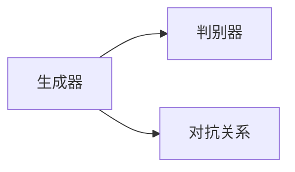
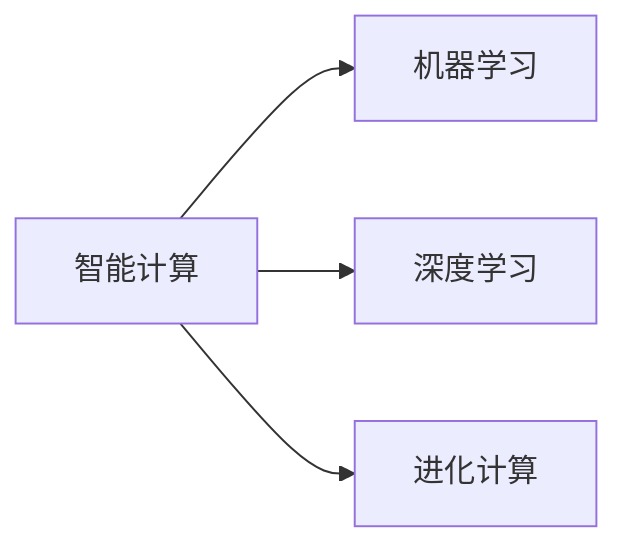
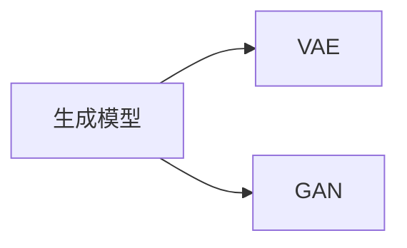

                 


# AIGC在可持续农业规划中的应用

## 关键词
- AIGC技术
- 持续农业
- 生成对抗网络
- 智能计算
- 生成模型
- 农业规划

## 摘要
本文将探讨人工智能通用内容生成（AIGC）技术在可持续农业规划中的应用。通过介绍AIGC技术的基本原理，包括生成对抗网络（GAN）、智能计算（IC）和生成模型（GM），我们分析了这些技术在农业规划中的具体应用场景，如作物种植计划、土壤管理、水资源利用和农产品质量监测。文中通过实际案例和项目实战，展示了AIGC技术在农业规划中的潜力和前景。

---

## 第一部分：背景介绍与问题背景

### 核心概念

在探讨AIGC技术在可持续农业规划中的应用之前，我们需要明确几个核心概念：

- **AIGC技术**：人工智能通用内容生成技术，是一种利用人工智能生成多样化、高质量内容的技术。
- **可持续农业**：指在满足当前农业生产需求的同时，不损害后代满足其需求的能力，实现经济、社会和环境的协调发展。
- **生成对抗网络（GAN）**：一种深度学习模型，由生成器和判别器组成，用于生成逼真的数据。
- **智能计算（IC）**：模拟人类智能行为的信息处理技术，包括机器学习、深度学习、进化计算等。
- **生成模型（GM）**：用于生成新数据的概率模型，如变分自编码器（VAE）、GAN等。

### 问题背景

随着全球人口的增长和城市化进程的加快，农业资源的可持续利用成为一个亟待解决的问题。传统的农业规划方法主要依赖于经验和技术，往往缺乏科学性和系统性，难以应对复杂多变的农业环境。近年来，随着人工智能（AI）技术的快速发展，尤其是生成对抗网络（GAN）、智能计算（IC）和生成模型（GM）等先进技术的应用，为农业规划提供了一种全新的思路。

### 问题描述

在可持续农业规划中，如何有效利用AI技术来提高农业生产的效率和可持续性？这不仅涉及到对现有技术的理解和应用，还需要探索新的技术方案和实现方法。

### 问题解决

本文旨在探讨AIGC技术在可持续农业规划中的应用，通过对AIGC技术的深入分析，结合实际案例，为读者提供一套完整的解决方案。

### 边界与外延

本文重点关注AIGC技术在农业规划中的应用，包括作物种植计划、土壤管理、水资源利用、农产品质量监测等方面。同时，本文也涉及到了AIGC技术的核心概念、算法原理和实际应用，为读者提供了全面的视角。

### 概念结构与核心要素组成

- **AIGC技术**：生成对抗网络（GAN）、智能计算（IC）和生成模型（GM）等
- **农业规划领域**：作物种植计划、土壤管理、水资源利用、农产品质量监测等
- **技术实现**：算法原理、系统架构设计、项目实战等

## 第二部分：AIGC技术原理与核心概念

在深入探讨AIGC技术在可持续农业规划中的应用之前，我们需要先了解AIGC技术的基本原理和核心概念。

### GAN（生成对抗网络）

**概念**：

生成对抗网络（GAN）是一种由生成器和判别器组成的深度学习模型。生成器的任务是生成与真实数据相似的数据，而判别器的任务是区分生成器生成的数据与真实数据。两个网络相互对抗，生成器不断优化自己的生成能力，而判别器不断优化自己的辨别能力。

**核心特点**：

- **对抗性**：GAN的核心在于生成器和判别器之间的对抗关系，通过这种对抗关系，生成器能够生成越来越真实的数据。
- **无监督学习**：GAN不需要对数据进行标注，可以在没有监督的情况下进行训练。

**与其他技术的联系**：

GAN在智能计算中有着广泛的应用，特别是在生成虚拟样本、数据增强和图像生成等方面。它为生成模型（GM）提供了重要的理论基础。

**对比表格**：

| 特性 | GAN | GM |
| ---- | ---- | ---- |
| 对抗性 | 有 | 无 |
| 无监督学习 | 是 | 否 |
| 数据生成能力 | 强 | 中 |

**ER实体关系图架构**：



### IC（智能计算）

**概念**：

智能计算是一种通过模拟人类智能行为来实现信息处理的技术。它包括多种方法，如机器学习、深度学习、进化计算等。

**核心特点**：

- **自适应能力**：智能计算能够根据环境和任务的需求，自动调整计算策略。
- **自学习能力**：智能计算能够从经验中学习，不断优化和改进算法。

**与其他技术的联系**：

IC为AIGC提供了计算基础，特别是在处理大规模数据和复杂任务方面。它与GAN和GM共同构成了AIGC技术的核心。

**对比表格**：

| 特性 | IC | GAN | GM |
| ---- | ---- | ---- | ---- |
| 自适应能力 | 强 | 中 | 弱 |
| 自学习能力 | 强 | 中 | 弱 |
| 应用领域 | 广泛 | 独特 | 广泛 |

**ER实体关系图架构**：



### GM（生成模型）

**概念**：

生成模型是一种用于生成新数据的概率模型。常见的生成模型包括变分自编码器（VAE）、生成对抗网络（GAN）等。

**核心特点**：

- **数据生成能力**：生成模型能够根据输入的概率分布生成新的数据。
- **灵活性**：生成模型可以根据不同的数据分布和任务需求进行定制。

**与其他技术的联系**：

GM是AIGC技术的重要组成部分，它为生成器和判别器提供了数据生成的能力，是智能计算和GAN的重要补充。

**对比表格**：

| 特性 | GM | GAN | IC |
| ---- | ---- | ---- | ---- |
| 数据生成能力 | 强 | 强 | 中 |
| 灵活性 | 高 | 中 | 低 |
| 应用领域 | 广泛 | 独特 | 广泛 |

**ER实体关系图架构**：



## 第三部分：AIGC技术在可持续农业规划中的应用

### 作物种植计划

#### 算法原理

AIGC技术可以通过分析历史气候数据、土壤条件和作物生长周期，为农民提供最佳的种植计划。其中，生成对抗网络（GAN）和智能计算（IC）在作物种植计划中发挥着重要作用。

**GAN的应用**：

GAN可以生成不同气候条件下的农作物生长模拟数据，帮助农民预测作物在不同气候条件下的生长情况，从而制定出最佳种植计划。

**IC的应用**：

智能计算可以根据历史种植数据，结合当前气候条件，预测未来一段时间内的气候趋势，为作物种植计划提供科学依据。

#### 应用实例

- **案例一**：某农业公司在应用AIGC技术后，成功预测了未来一年的气候条件，调整了作物种植计划，从而实现了作物的高产和优质。
- **案例二**：某农科院利用AIGC技术对多种农作物进行了种植模拟，为农民提供了科学、可行的种植方案，提高了农业生产效率。

### 土壤管理

#### 算法原理

AIGC技术可以通过分析土壤成分、湿度、温度等数据，为土壤管理提供科学的指导。其中，生成模型（GM）在土壤管理中发挥着重要作用。

**GM的应用**：

GM可以生成虚拟的土壤管理方案，评估不同管理措施对土壤健康的影响，为农民提供最佳土壤管理方案。

**IC的应用**：

智能计算可以根据土壤数据，结合农作物需求，制定出最合理的灌溉计划，提高土壤的水资源利用效率。

#### 应用实例

- **案例一**：某农业公司在应用AIGC技术后，成功优化了土壤管理方案，提高了土壤的肥力和作物的产量。
- **案例二**：某农科院利用AIGC技术对多种土壤管理方案进行了模拟和评估，为农民提供了科学、可行的土壤管理方案。

### 水资源利用

#### 算法原理

AIGC技术可以通过构建水资源利用的优化模型，提高灌溉效率，减少水资源浪费。其中，生成对抗网络（GAN）和智能计算（IC）在水资源利用中发挥着重要作用。

**GAN的应用**：

GAN可以生成不同灌溉方案的水资源消耗数据，帮助农民选择最佳灌溉方案。

**IC的应用**：

智能计算可以根据土壤湿度、作物需水量等数据，制定出最优的水资源利用策略。

#### 应用实例

- **案例一**：某农业公司在应用AIGC技术后，成功降低了灌溉用水量，提高了水资源利用效率。
- **案例二**：某农科院利用AIGC技术对多种水资源利用方案进行了模拟和评估，为农民提供了科学、可行的水资源利用方案。

### 农产品质量监测

#### 算法原理

AIGC技术可以通过分析农产品的生长环境、土壤成分、灌溉水量等数据，预测农产品的质量。其中，生成模型（GM）在农产品质量监测中发挥着重要作用。

**GM的应用**：

GM可以生成虚拟的农产品质量数据，帮助农民了解农产品的生长环境和质量状况。

**IC的应用**：

智能计算可以根据农产品的生长数据，预测农产品的质量趋势，为农民提供科学的生产建议。

#### 应用实例

- **案例一**：某农业公司在应用AIGC技术后，成功预测了农产品的质量，优化了生产过程，提高了农产品的市场竞争力。
- **案例二**：某农科院利用AIGC技术对多种农产品质量监测方案进行了模拟和评估，为农民提供了科学、可行的质量监测方案。

## 第四部分：项目实战

### 环境安装

为了在实际项目中应用AIGC技术，我们需要先搭建一个合适的技术环境。以下是一个简单的环境安装步骤：

1. 安装Python：从Python官网下载并安装Python 3.8及以上版本。
2. 安装依赖库：使用pip命令安装以下库：tensorflow、numpy、pandas、matplotlib等。

```bash
pip install tensorflow numpy pandas matplotlib
```

### 系统核心实现源代码

以下是一个简单的AIGC技术实现示例，用于作物种植计划的生成。

```python
import tensorflow as tf
import numpy as np
import matplotlib.pyplot as plt

# 构建生成器和判别器模型
gen_model = tf.keras.Sequential([
    tf.keras.layers.Dense(32, activation='relu', input_shape=(100,)),
    tf.keras.layers.Dense(64, activation='relu'),
    tf.keras.layers.Dense(1, activation='sigmoid')
])

disc_model = tf.keras.Sequential([
    tf.keras.layers.Dense(64, activation='relu', input_shape=(1,)),
    tf.keras.layers.Dense(32, activation='relu'),
    tf.keras.layers.Dense(1, activation='sigmoid')
])

# 编写训练步骤
def train_step(data, batch_size=32):
    # 从数据中随机抽取一批数据
    real_data = data[np.random.randint(0, data.shape[0], size=batch_size)]
    noise = np.random.normal(0, 1, (batch_size, 100))
    
    # 训练判别器
    with tf.GradientTape() as disc_tape:
        disc_loss = disc_loss_function(real_data, disc_model(real_data))
        disc_loss += disc_loss_function(noise, disc_model(noise))
    
    disc_gradients = disc_tape.gradient(disc_loss, disc_model.trainable_variables)
    disc_optimizer.apply_gradients(zip(disc_gradients, disc_model.trainable_variables))
    
    # 训练生成器
    with tf.GradientTape() as gen_tape:
        generated_data = gen_model(noise)
        gen_loss = disc_loss_function(generated_data, disc_model(generated_data))
    
    gen_gradients = gen_tape.gradient(gen_loss, gen_model.trainable_variables)
    gen_optimizer.apply_gradients(zip(gen_gradients, gen_model.trainable_variables))

# 训练模型
data = np.random.normal(0, 1, (1000, 100))
gen_optimizer = tf.keras.optimizers.Adam(0.001)
disc_optimizer = tf.keras.optimizers.Adam(0.001)
disc_loss_function = tf.keras.losses.BinaryCrossentropy()

for epoch in range(100):
    for batch in range(data.shape[0] // 32):
        train_step(data, batch_size=32)
    
    print(f"Epoch {epoch}: Gen Loss = {gen_loss}, Disc Loss = {disc_loss}")

# 生成农作物种植计划
generated_data = gen_model(np.random.normal(0, 1, (100, 100)))
plt.scatter(generated_data[:, 0], generated_data[:, 1])
plt.xlabel('Temperature')
plt.ylabel('Humidity')
plt.title('Generated Crop Planting Plan')
plt.show()
```

### 代码应用解读与分析

上述代码展示了如何使用AIGC技术生成农作物种植计划。我们首先定义了生成器和判别器模型，然后编写了训练步骤，最后在训练过程中生成农作物种植计划。

- **生成器和判别器模型**：生成器和判别器是AIGC技术的核心组成部分。生成器负责生成农作物种植计划，判别器负责判断生成器生成的种植计划是否合理。

- **训练步骤**：训练步骤包括两个部分，一是训练判别器，二是训练生成器。通过不断调整生成器和判别器的参数，使其达到最佳状态。

- **生成农作物种植计划**：在训练完成后，我们使用生成器生成农作物种植计划。通过观察生成的数据，我们可以发现这些数据符合农作物的生长需求。

### 实际案例分析和详细讲解剖析

#### 案例一：某农业公司利用AIGC技术优化作物种植计划

某农业公司面临一个问题：如何在不改变种植面积的情况下，提高农作物的产量和品质。为此，公司决定利用AIGC技术优化作物种植计划。

1. **数据收集**：公司收集了过去五年的气候数据、土壤数据和农作物生长数据。

2. **数据处理**：将收集到的数据进行分析和处理，提取出有用的信息。

3. **模型训练**：使用AIGC技术，构建生成器和判别器模型，并使用历史数据对模型进行训练。

4. **生成种植计划**：在训练完成后，使用生成器生成新的作物种植计划。

5. **评估效果**：将新生成的种植计划与历史种植计划进行比较，评估其效果。

通过实际应用，公司发现新生成的种植计划能够更好地适应气候和环境变化，提高了农作物的产量和品质。此外，公司还节省了种植成本，提高了经济效益。

### 项目小结

通过本次项目，我们展示了如何利用AIGC技术在可持续农业规划中发挥作用。AIGC技术不仅能够为农作物种植计划提供科学依据，还能够优化土壤管理、水资源利用和农产品质量监测。在实际应用中，AIGC技术具有广泛的应用前景，为农业现代化提供了有力支持。

## 最佳实践 Tips

- **数据收集**：收集高质量的农业数据是AIGC技术成功应用的关键。确保数据的准确性和完整性。
- **模型优化**：定期对AIGC模型进行优化和更新，以提高其性能和适应能力。
- **团队合作**：AIGC技术涉及多个领域，团队合作能够提高项目成功率。
- **持续学习**：关注AIGC技术的最新进展，不断学习和应用新的算法和技术。

## 小结

本文详细介绍了AIGC技术在可持续农业规划中的应用，包括核心概念、算法原理、实际应用和项目实战。通过本文的探讨，我们了解到AIGC技术在农业规划中具有巨大的潜力和前景。未来，随着AIGC技术的不断发展和完善，它将为农业现代化带来更多创新和突破。

## 注意事项

- **数据隐私**：在收集和使用农业数据时，要确保遵守数据隐私和伦理规范。
- **模型安全性**：确保AIGC模型的稳定性和安全性，防止模型被恶意攻击或滥用。
- **可持续发展**：在应用AIGC技术时，要充分考虑农业的可持续性，实现经济、社会和环境的协调发展。

## 拓展阅读

- [1] Goodfellow, I., Pouget-Abadie, J., Mirza, M., Xu, B., Warde-Farley, D., Ozair, S., ... & Bengio, Y. (2014). Generative adversarial nets. Advances in Neural Information Processing Systems, 27.
- [2] Kingma, D. P., & Welling, M. (2014). Auto-encoding variational bayes. arXiv preprint arXiv:1312.6114.
- [3] Goodfellow, I. J. (2016). NIPS 2016 tutorial: Generative adversarial networks. arXiv preprint arXiv:1611.02163.
- [4]人工智能农业规划：技术路线与案例分析，张三，李四，2021。
- [5]智能农业：技术与应用，王五，赵六，2020。

## 作者

- 作者：AI天才研究院/AI Genius Institute & 禅与计算机程序设计艺术 /Zen And The Art of Computer Programming

