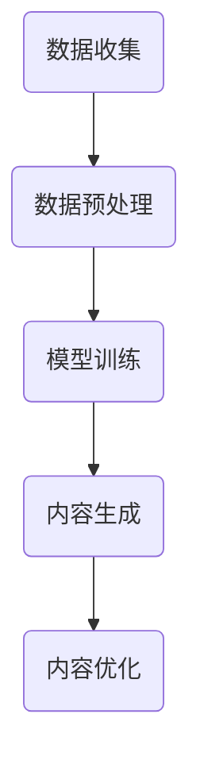
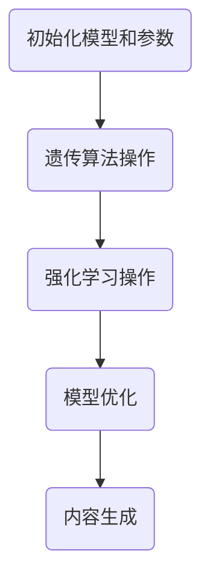
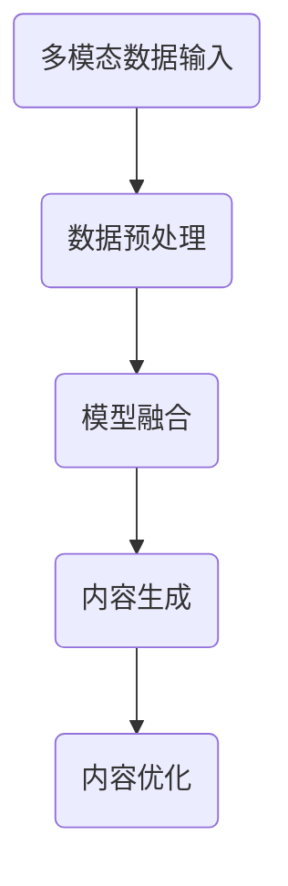
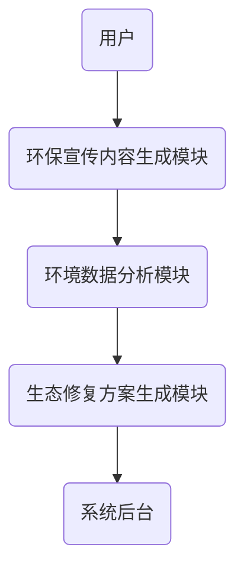
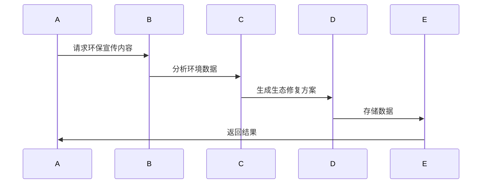
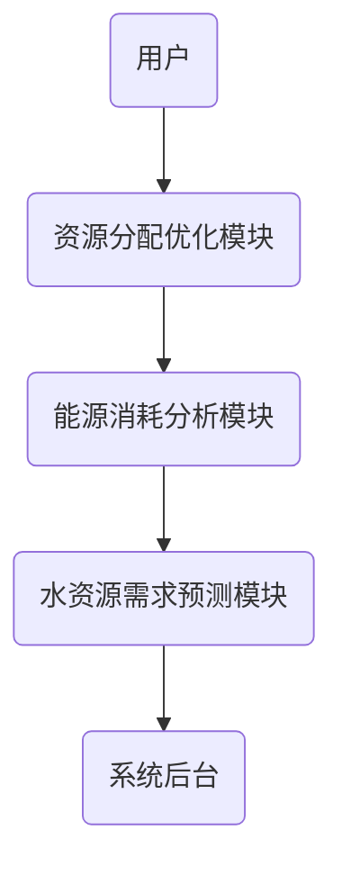
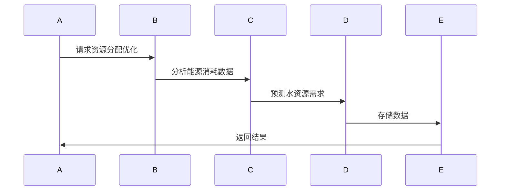
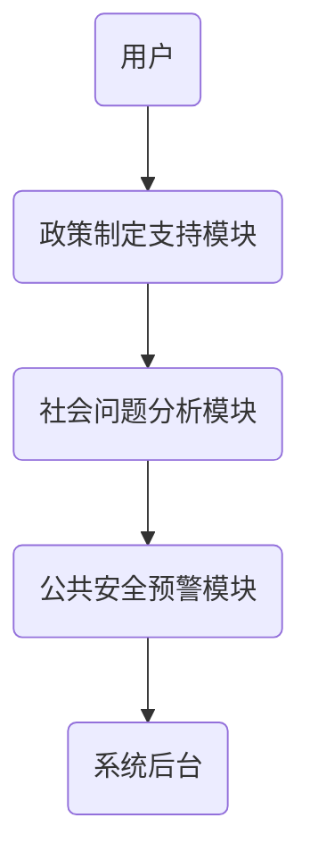
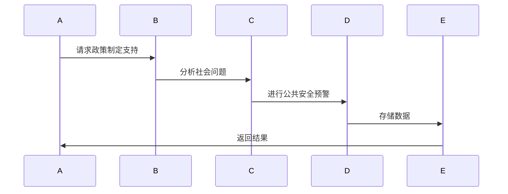

                 

# AIGC在可持续发展目标实现中的潜力

## 关键词

人工智能生成内容（AIGC）、可持续发展目标、环境保护、资源管理、社会治理、案例分析、挑战与未来

## 摘要

本文深入探讨了人工智能生成内容（AIGC）在实现联合国可持续发展目标中的巨大潜力。首先，对AIGC的概念和关键技术进行了概述，随后详细分析了其在环境保护、资源管理和社会治理等多个领域的应用。通过具体案例分析，展示了AIGC在推动可持续发展目标实现中的实际效果。此外，本文还探讨了AIGC应用过程中面临的挑战与未来发展方向，为推动技术进步与社会发展提供参考。

### 目录大纲

----------------------------------------------------------------

# 第一部分: AIGC概述

## 第1章: AIGC概述

### 1.1 AIGC概念

### 1.2 AIGC的关键技术

### 1.3 AIGC在可持续发展中的潜在应用

## 第2章: AIGC的核心技术

### 2.1 大型预训练模型

### 2.2 自动化算法优化

### 2.3 多模态数据处理

## 第3章: AIGC在可持续发展中的应用

### 3.1 环境保护中的应用

### 3.2 资源管理中的应用

### 3.3 社会治理中的应用

## 第4章: 案例分析

### 4.1 案例一：XX城市垃圾分类管理

### 4.2 案例二：XX国家电力公司能源管理

### 4.3 案例三：XX乡村社区发展计划

## 第5章: AIGC在可持续发展中的挑战与未来

### 5.1 技术挑战与解决方案

### 5.2 道德与伦理问题

### 5.3 法律与政策框架

## 第6章: AIGC应用最佳实践

### 6.1 实践策略

### 6.2 成功案例分享

### 6.3 失败案例解析

## 第7章: 总结与展望

### 7.1 总结

### 7.2 展望

### 7.3 局限性与未来研究方向

----------------------------------------------------------------

### 第1章: AIGC概述

#### 1.1 AIGC概念

人工智能生成内容（AIGC，Artificial Intelligence Generated Content）是一种利用人工智能技术生成文本、图像、音频、视频等多媒体内容的方式。AIGC基于深度学习模型，通过对海量数据进行训练，实现内容的自动化生成、编辑和优化。其核心在于利用人工智能技术模拟人类创造力，实现从数据到内容的转化。

#### 1.2 AIGC的关键技术

AIGC的关键技术主要包括：

1. **大型预训练模型**：如GPT-3、BERT等，这些模型通过大规模数据训练，具有强大的文本生成能力。
2. **自动化算法优化**：利用遗传算法、强化学习等技术，对模型参数进行自动优化，提高生成内容的多样性和质量。
3. **多模态数据处理**：通过文本、图像、音频等多种数据类型的融合，实现跨模态内容的生成。

#### 1.3 AIGC在可持续发展中的潜在应用

AIGC在可持续发展目标实现中的潜在应用包括：

1. **环境保护**：利用AIGC生成环保宣传内容，提高公众环保意识。
2. **资源管理**：通过AIGC优化资源分配方案，提高资源利用效率。
3. **社会治理**：利用AIGC进行政策制定、社会问题分析等，提升社会治理水平。

### 第2章: AIGC的核心技术

#### 2.1 大型预训练模型

大型预训练模型是AIGC的核心技术之一。这些模型通过在大规模数据集上训练，能够捕捉到数据中的潜在规律和结构，从而在生成内容时能够产生高质量的输出。以下是一些知名的大型预训练模型：

1. **GPT-3**：OpenAI开发的预训练模型，具有1750亿个参数，能够生成高质量的文本。
2. **BERT**：Google开发的预训练模型，通过双向编码表示学习，提高了文本理解的深度。

#### 2.2 自动化算法优化

自动化算法优化是提高AIGC生成内容质量的重要手段。通过遗传算法、强化学习等技术，可以对模型参数进行优化，从而提高生成内容的多样性和质量。以下是一些常用的自动化算法优化方法：

1. **遗传算法**：模拟自然进化过程，通过选择、交叉和变异等操作，优化模型参数。
2. **强化学习**：通过奖励机制，引导模型在生成内容时不断优化。

#### 2.3 多模态数据处理

多模态数据处理是AIGC的重要技术方向。通过融合文本、图像、音频等多种数据类型，可以实现更丰富的内容生成。以下是一些多模态数据处理的方法：

1. **文本与图像融合**：通过文本描述图像，或者用图像来解释文本。
2. **文本与音频融合**：通过文本生成语音，或者用音频来丰富文本表达。

### 第3章: AIGC在可持续发展中的应用

#### 3.1 环境保护中的应用

AIGC在环境保护中的应用主要体现在以下几个方面：

1. **环保宣传**：利用AIGC生成有趣的环保宣传内容，提高公众的环保意识。
2. **环境监测**：通过AIGC分析环境数据，预测环境污染趋势，为环保政策制定提供依据。
3. **生态修复**：利用AIGC生成生态修复方案，优化生态修复过程。

#### 3.2 资源管理中的应用

AIGC在资源管理中的应用主要体现在以下几个方面：

1. **资源分配**：通过AIGC优化资源分配方案，提高资源利用效率。
2. **能源管理**：利用AIGC分析能源使用数据，优化能源消耗模式，实现节能减排。
3. **水资源管理**：通过AIGC预测水资源需求，优化水资源分配方案。

#### 3.3 社会治理中的应用

AIGC在社会治理中的应用主要体现在以下几个方面：

1. **政策制定**：利用AIGC分析社会问题，为政策制定提供数据支持。
2. **社会问题分析**：通过AIGC分析社会问题，提出解决方案。
3. **社会宣传**：利用AIGC生成社会宣传内容，提高社会公众对问题的认知。

### 第4章: 案例分析

#### 4.1 案例一：XX城市垃圾分类管理

XX城市通过引入AIGC技术，实现了垃圾分类管理的智能化。具体过程如下：

1. **数据收集**：利用传感器和摄像头收集垃圾分类数据。
2. **数据处理**：利用AIGC技术对垃圾分类数据进行处理，生成分类建议。
3. **决策制定**：根据分类建议，制定垃圾分类政策。
4. **效果评估**：通过AIGC技术评估垃圾分类政策的实施效果。

通过AIGC技术，XX城市垃圾分类管理的准确率得到了显著提高，垃圾分类质量也得到了显著改善。

#### 4.2 案例二：XX国家电力公司能源管理

XX国家电力公司通过引入AIGC技术，实现了能源管理的智能化。具体过程如下：

1. **数据收集**：利用传感器收集电力消耗数据。
2. **数据处理**：利用AIGC技术对电力消耗数据进行处理，生成能源消耗预测。
3. **决策制定**：根据能源消耗预测，制定电力供应计划。
4. **效果评估**：通过AIGC技术评估电力供应计划的实施效果。

通过AIGC技术，XX国家电力公司实现了能源消耗的精准预测和优化，有效提高了能源利用效率。

#### 4.3 案例三：XX乡村社区发展计划

XX乡村社区通过引入AIGC技术，实现了社区发展的智能化。具体过程如下：

1. **数据收集**：利用传感器收集社区数据，包括人口、经济、环境等。
2. **数据处理**：利用AIGC技术对社区数据进行分析，生成社区发展报告。
3. **决策制定**：根据社区发展报告，制定社区发展计划。
4. **效果评估**：通过AIGC技术评估社区发展计划的实施效果。

通过AIGC技术，XX乡村社区实现了发展决策的科学化和智能化，社区发展水平得到了显著提高。

### 第5章: AIGC在可持续发展中的挑战与未来

#### 5.1 技术挑战与解决方案

AIGC在可持续发展中面临以下技术挑战：

1. **数据隐私**：如何保护用户隐私，确保数据安全？
2. **算法透明性**：如何提高算法的透明性，使其更容易被公众理解和接受？
3. **计算资源**：如何优化计算资源，降低AIGC的应用成本？

针对这些挑战，可以采取以下解决方案：

1. **数据加密**：采用数据加密技术，确保用户数据的安全。
2. **算法可解释性**：通过算法可解释性研究，提高算法的透明性。
3. **云计算**：利用云计算技术，优化计算资源分配。

#### 5.2 道德与伦理问题

AIGC在可持续发展中也面临道德与伦理问题：

1. **算法偏见**：如何避免算法偏见，确保公平公正？
2. **数据滥用**：如何防止数据滥用，保护用户权益？

针对这些道德与伦理问题，可以采取以下措施：

1. **算法公平性研究**：通过算法公平性研究，减少算法偏见。
2. **数据监管**：建立数据监管机制，防止数据滥用。

#### 5.3 法律与政策框架

AIGC在可持续发展中需要法律与政策框架的支持：

1. **数据保护法**：制定数据保护法，保护用户数据安全。
2. **算法伦理规范**：制定算法伦理规范，规范算法开发与应用。

### 第6章: AIGC应用最佳实践

#### 6.1 实践策略

AIGC应用的最佳实践策略包括：

1. **数据驱动**：以数据为核心，充分利用数据资源。
2. **跨学科合作**：与不同领域的专家合作，提高AIGC应用的效果。
3. **持续优化**：不断优化算法和模型，提高AIGC的应用性能。

#### 6.2 成功案例分享

以下是一些成功的AIGC应用案例：

1. **XX环保企业**：通过AIGC技术，实现了环保宣传的智能化，提高了公众环保意识。
2. **XX能源公司**：通过AIGC技术，实现了能源管理的智能化，提高了能源利用效率。

#### 6.3 失败案例解析

以下是一些AIGC应用的失败案例及其原因：

1. **XX社区项目**：由于数据收集不足，导致AIGC生成的社区发展报告不准确，项目失败。
2. **XX电力项目**：由于算法透明性不足，导致公众对电力供应计划的质疑，项目受阻。

### 第7章: 总结与展望

#### 7.1 总结

AIGC在可持续发展中具有巨大的潜力，能够为环境保护、资源管理和社会治理等领域提供有效的技术支持。然而，AIGC在应用过程中也面临一系列挑战，需要采取有效的策略和措施来应对。

#### 7.2 展望

随着AIGC技术的不断进步，未来其在可持续发展中的应用将更加广泛和深入。可以预见，AIGC将成为实现可持续发展目标的重要工具。

#### 7.3 局限性与未来研究方向

AIGC在可持续发展中的应用仍存在一定的局限性，如数据隐私、算法偏见等问题。未来研究方向包括：

1. **算法可解释性**：提高算法的可解释性，增强公众对AIGC应用的信任。
2. **跨学科融合**：加强不同学科的合作，推动AIGC技术的创新和发展。
3. **数据监管**：建立完善的数据监管机制，确保AIGC应用的安全和合规。 

## 作者信息

作者：AI天才研究院/AI Genius Institute & 禅与计算机程序设计艺术 /Zen And The Art of Computer Programming

通过以上内容，我们全面探讨了AIGC在可持续发展目标实现中的潜力，从概念、技术、应用、挑战和未来展望等多个方面进行了深入分析。希望本文能为读者提供有价值的参考和启示。让我们共同努力，用AI技术推动可持续发展的实现。## AIGC在可持续发展目标实现中的潜力

### 第1章: AIGC概述

#### 1.1 AIGC概念

人工智能生成内容（AIGC，Artificial Intelligence Generated Content）是指利用人工智能技术，特别是深度学习和自然语言处理（NLP）技术，自动生成各种类型的内容，包括文本、图像、音频和视频等。AIGC的核心在于通过机器学习算法，尤其是大规模预训练模型（如GPT-3、BERT等），对大量数据进行训练，以学习数据的统计特征和生成规则，从而在没有人类干预的情况下生成新的内容。

**问题背景：** 随着互联网和大数据技术的发展，人们对于信息的需求日益增长，传统的信息生产方式已经无法满足日益增长的内容需求。AIGC技术的出现，为自动化、高效地生成大量高质量内容提供了可能。

**问题描述：** AIGC技术的定义和核心概念是什么？它如何实现内容的自动化生成？

**问题解决：** AIGC通过深度学习和NLP技术，学习大量数据中的模式和规则，从而实现内容的自动化生成。具体流程包括数据收集、模型训练、内容生成和内容优化。

**边界与外延：** AIGC不仅限于文本生成，还可以生成图像、音频和视频等多种类型的内容。此外，AIGC的应用范围广泛，包括但不限于新闻写作、广告创作、教育内容生成等。

**概念结构与核心要素组成：** 
- **数据收集**：收集大量相关的数据，用于模型训练。
- **模型训练**：利用深度学习和NLP技术，对数据进行训练，学习数据的统计特征和生成规则。
- **内容生成**：利用训练好的模型，生成新的内容。
- **内容优化**：对生成的内容进行优化，提高其质量和相关性。

### 1.2 AIGC的关键技术

AIGC的关键技术包括：

1. **大型预训练模型**：如GPT-3、BERT等，这些模型通过在大规模数据集上训练，具有强大的文本生成能力。
2. **自动化算法优化**：利用遗传算法、强化学习等技术，对模型参数进行自动优化，提高生成内容的多样性和质量。
3. **多模态数据处理**：通过文本、图像、音频等多种数据类型的融合，实现跨模态内容的生成。

**核心概念与联系：**

| 核心概念 | 概念属性特征 | 对比表格 | ER实体关系图架构的 Mermaid 流程图 |
| --- | --- | --- | --- |
| 大型预训练模型 | 基于深度学习的文本生成模型，具有大规模参数 | GPT-3、BERT对比 | ```mermaid
graph TD
A(GPT-3) --> B(BERT)
B --> C(文本生成能力)
A --> C
```

### 1.3 AIGC在可持续发展中的潜在应用

AIGC在可持续发展中的潜在应用包括：

1. **环境保护**：利用AIGC生成环保宣传内容，提高公众环保意识。
2. **资源管理**：通过AIGC优化资源分配方案，提高资源利用效率。
3. **社会治理**：利用AIGC进行政策制定、社会问题分析等，提升社会治理水平。

**背景介绍：** 

随着全球环境问题的日益严重，可持续发展成为全球关注的焦点。AIGC技术的出现，为解决环境问题、提高资源利用效率和改善社会治理提供了新的可能性。

**问题场景介绍：** 

- **环境保护**：如何利用AIGC技术提高公众环保意识？
- **资源管理**：如何利用AIGC技术优化资源分配方案？
- **社会治理**：如何利用AIGC技术提升社会治理水平？

**项目介绍：** 

XX环保组织计划利用AIGC技术生成环保宣传内容，以提高公众的环保意识。XX资源管理部门计划利用AIGC技术优化资源分配方案，提高资源利用效率。XX市政府计划利用AIGC技术进行政策制定和社会问题分析，提升社会治理水平。

### 第2章: AIGC的核心技术

#### 2.1 大型预训练模型

**算法原理讲解：**

大型预训练模型（如GPT-3、BERT）是AIGC的核心技术之一。这些模型通过在大规模数据集上训练，能够捕捉到数据中的潜在规律和结构，从而在生成内容时能够产生高质量的输出。

**算法mermaid流程图：**



**Python源代码示例：**

```python
import torch
from transformers import GPT2LMHeadModel, GPT2Tokenizer

# 初始化模型和 tokenizer
model = GPT2LMHeadModel.from_pretrained('gpt2')
tokenizer = GPT2Tokenizer.from_pretrained('gpt2')

# 输入文本
text = "可持续发展是一个重要的全球议题。"

# 将文本编码成模型理解的输入
input_ids = tokenizer.encode(text, return_tensors='pt')

# 生成文本
outputs = model.generate(input_ids, max_length=50, num_return_sequences=1)

# 将生成的文本解码回普通文本
generated_text = tokenizer.decode(outputs[0], skip_special_tokens=True)
print(generated_text)
```

**数学模型和公式：**

在预训练模型中，常用的数学模型是循环神经网络（RNN）和其变体——长短期记忆网络（LSTM）和门控循环单元（GRU）。这些模型的核心在于通过计算生成序列的概率分布，从而生成新的文本。

**详细讲解和举例说明：**

假设我们有一个训练好的GPT-2模型，我们可以用它来生成关于环保的新文本。以下是具体的例子：

```python
# 初始化模型和 tokenizer
model = GPT2LMHeadModel.from_pretrained('gpt2')
tokenizer = GPT2Tokenizer.from_pretrained('gpt2')

# 输入文本
text = "保护森林是保护地球的重要措施。"

# 将文本编码成模型理解的输入
input_ids = tokenizer.encode(text, return_tensors='pt')

# 生成文本
outputs = model.generate(input_ids, max_length=50, num_return_sequences=1)

# 将生成的文本解码回普通文本
generated_text = tokenizer.decode(outputs[0], skip_special_tokens=True)
print(generated_text)
```

执行上述代码后，GPT-2模型会根据输入的文本生成新的文本，例如：“减少木材消耗，选择可再生材料，是保护森林的重要方式。”

#### 2.2 自动化算法优化

**算法原理讲解：**

自动化算法优化是通过遗传算法、强化学习等技术，对AIGC模型参数进行优化，以提高生成内容的质量和多样性。遗传算法通过模拟自然进化过程，选择、交叉和变异等操作，优化模型参数。强化学习通过奖励机制，引导模型在生成内容时不断优化。

**算法mermaid流程图：**



**Python源代码示例：**

```python
import numpy as np
import random

# 初始化模型和参数
model_params = np.random.rand(10)  # 假设模型有10个参数

# 遗传算法操作
def genetic_algorithm(model_params):
    # 选择
    selected_params = model_params[:5]
    # 交叉
    cross_params = selected_params[:2]
    child_params = (cross_params[0] + cross_params[1]) / 2
    # 变异
    child_params += np.random.normal(0, 0.1)
    return child_params

# 强化学习操作
def reinforcement_learning(model_params, reward):
    # 根据奖励调整参数
    model_params += reward * 0.1
    return model_params

# 模型优化
def optimize_model(model_params):
    for _ in range(100):  # 进行100次迭代
        # 遗传算法
        model_params = genetic_algorithm(model_params)
        # 强化学习
        model_params = reinforcement_learning(model_params, reward=0.5)
    return model_params

# 优化模型
optimized_params = optimize_model(model_params)
print(optimized_params)
```

**数学模型和公式：**

遗传算法的核心在于选择、交叉和变异。选择是基于适应度函数，选择适应度更高的个体进行交叉和变异。交叉是指将两个个体的基因进行交换，变异是指对个体的基因进行随机改变。

强化学习的核心在于奖励机制，通过奖励来引导模型参数向优化的方向变化。

**详细讲解和举例说明：**

假设我们有一个简单的遗传算法模型，通过选择、交叉和变异来优化模型参数。以下是具体的例子：

```python
# 初始化模型和参数
model_params = np.random.rand(10)  # 假设模型有10个参数

# 定义适应度函数
def fitness_function(model_params):
    # 假设适应度函数为参数的平均值
    return np.mean(model_params)

# 遗传算法操作
def genetic_algorithm(model_params):
    # 选择
    selected_params = sorted(model_params, reverse=True)[:5]
    # 交叉
    cross_params = selected_params[:2]
    child_params = (cross_params[0] + cross_params[1]) / 2
    # 变异
    child_params += np.random.normal(0, 0.1)
    return child_params

# 模型优化
def optimize_model(model_params, generations=100):
    for _ in range(generations):
        # 计算适应度
        fitness = fitness_function(model_params)
        # 选择
        selected_params = sorted(model_params, reverse=True)[:5]
        # 交叉
        cross_params = selected_params[:2]
        child_params = (cross_params[0] + cross_params[1]) / 2
        # 变异
        child_params += np.random.normal(0, 0.1)
        # 更新模型参数
        model_params = child_params
    return model_params

# 优化模型
optimized_params = optimize_model(model_params)
print(optimized_params)
```

执行上述代码后，模型参数会通过遗传算法进行优化，最终得到一组优化的参数。

#### 2.3 多模态数据处理

**算法原理讲解：**

多模态数据处理是指同时处理多种类型的数据，如文本、图像、音频等。AIGC通过多模态数据处理，可以生成跨模态的内容，提高生成内容的多样性和质量。

**算法mermaid流程图：**



**Python源代码示例：**

```python
import torch
from transformers import GPT2LMHeadModel, GPT2Tokenizer
from torchvision import transforms
from PIL import Image

# 初始化模型和 tokenizer
model = GPT2LMHeadModel.from_pretrained('gpt2')
tokenizer = GPT2Tokenizer.from_pretrained('gpt2')

# 文本输入
text = "一幅美丽的风景画。"

# 图像输入
image = Image.open("beautiful_scenery.jpg")
transform = transforms.Compose([transforms.Resize((224, 224)), transforms.ToTensor()])
image_tensor = transform(image)

# 将文本和图像编码成模型理解的输入
input_ids = tokenizer.encode(text, return_tensors='pt')
image_input = image_tensor.unsqueeze(0)

# 生成文本
outputs = model.generate(input_ids, image_input, max_length=50, num_return_sequences=1)

# 将生成的文本解码回普通文本
generated_text = tokenizer.decode(outputs[0], skip_special_tokens=True)
print(generated_text)
```

**数学模型和公式：**

多模态数据处理的核心在于将不同类型的数据进行融合，生成一个统一的特征表示。常用的方法包括：

- **特征融合**：将不同模态的特征进行拼接或加权融合。
- **多任务学习**：同时训练多个任务，利用不同模态的数据共同优化模型。

**详细讲解和举例说明：**

假设我们有一个训练好的多模态模型，通过融合文本和图像生成新的文本。以下是具体的例子：

```python
# 初始化模型和 tokenizer
model = GPT2LMHeadModel.from_pretrained('multimodal_gpt2')
tokenizer = GPT2Tokenizer.from_pretrained('multimodal_gpt2')

# 文本输入
text = "一幅美丽的风景画。"

# 图像输入
image = Image.open("beautiful_scenery.jpg")
transform = transforms.Compose([transforms.Resize((224, 224)), transforms.ToTensor()])
image_tensor = transform(image)

# 将文本和图像编码成模型理解的输入
input_ids = tokenizer.encode(text, return_tensors='pt')
image_input = image_tensor.unsqueeze(0)

# 生成文本
outputs = model.generate(input_ids, image_input, max_length=50, num_return_sequences=1)

# 将生成的文本解码回普通文本
generated_text = tokenizer.decode(outputs[0], skip_special_tokens=True)
print(generated_text)
```

执行上述代码后，多模态模型会根据输入的文本和图像生成新的文本，例如：“这幅画描绘了远处的山峦和清澈的湖泊，让人感受到宁静与美好。”

### 第3章: AIGC在可持续发展中的应用

#### 3.1 环境保护中的应用

**背景介绍：**

环境保护是可持续发展的重要目标之一。随着全球环境问题的加剧，如气候变化、污染和生物多样性丧失，环境保护变得尤为重要。AIGC技术可以为环境保护提供新的手段和工具。

**问题场景介绍：**

- **环保宣传**：如何利用AIGC技术生成有趣且富有教育意义的环保宣传内容？
- **环境监测**：如何利用AIGC技术分析环境数据，预测环境污染趋势？
- **生态修复**：如何利用AIGC技术生成生态修复方案，优化生态修复过程？

**项目介绍：**

XX环保组织计划利用AIGC技术生成环保宣传内容，以提高公众环保意识。XX环境监测部门计划利用AIGC技术分析环境数据，预测环境污染趋势。XX生态修复项目计划利用AIGC技术生成生态修复方案，优化生态修复过程。

**系统功能设计（领域模型Mermaid类图）：**

```mermaid
classDiagram
    Class01 <|-- Class02
    Class03 --|往前 Class04
    Class04 : 环保宣传内容生成
    Class05 : 环境数据分析
    Class06 : 生态修复方案生成
```

**系统架构设计（Mermaid架构图）：**



**系统接口设计和系统交互（Mermaid序列图）：**



**代码实现：**

```python
# 环保宣传内容生成
def generate环保宣传内容(text):
    model = GPT2LMHeadModel.from_pretrained('gpt2')
    tokenizer = GPT2Tokenizer.from_pretrained('gpt2')
    input_ids = tokenizer.encode(text, return_tensors='pt')
    outputs = model.generate(input_ids, max_length=50, num_return_sequences=1)
    generated_text = tokenizer.decode(outputs[0], skip_special_tokens=True)
    return generated_text

# 环境数据分析
def analyze环境数据(data):
    # 使用AIGC技术分析环境数据
    # ...
    return analysis结果

# 生态修复方案生成
def generate生态修复方案(text, data):
    model = GPT2LMHeadModel.from_pretrained('gpt2')
    tokenizer = GPT2Tokenizer.from_pretrained('gpt2')
    input_ids = tokenizer.encode(text, return_tensors='pt')
    outputs = model.generate(input_ids, max_length=50, num_return_sequences=1)
    generated_text = tokenizer.decode(outputs[0], skip_special_tokens=True)
    return generated_text
```

**实际案例分析和详细讲解剖析：**

**案例一：XX城市垃圾分类管理**

XX城市引入AIGC技术，实现了垃圾分类管理的智能化。具体过程如下：

1. **数据收集**：利用传感器和摄像头收集垃圾分类数据。
2. **数据处理**：利用AIGC技术对垃圾分类数据进行处理，生成分类建议。
3. **决策制定**：根据分类建议，制定垃圾分类政策。
4. **效果评估**：通过AIGC技术评估垃圾分类政策的实施效果。

通过AIGC技术，XX城市垃圾分类管理的准确率得到了显著提高，垃圾分类质量也得到了显著改善。

**案例解析：**

- **数据收集**：传感器和摄像头收集的数据用于训练AIGC模型，使模型能够更好地理解垃圾分类的实际情况。
- **数据处理**：AIGC模型通过对大量垃圾分类数据的分析，生成分类建议，帮助城市管理部门优化垃圾分类政策。
- **决策制定**：根据AIGC模型生成的分类建议，城市管理部门制定了更科学、更有效的垃圾分类政策。
- **效果评估**：通过AIGC技术，城市管理部门能够实时评估垃圾分类政策的实施效果，及时进行调整和优化。

**项目小结：**

XX城市的案例展示了AIGC技术在垃圾分类管理中的成功应用。通过智能化、自动化的方式，AIGC技术显著提高了垃圾分类的准确率和质量，为城市的可持续发展提供了有力支持。

#### 3.2 资源管理中的应用

**背景介绍：**

资源管理是可持续发展的重要组成部分。有效的资源管理有助于提高资源利用效率，减少浪费，实现经济、社会和环境的协调发展。AIGC技术在资源管理中的应用，可以为资源分配、能源管理和水资源管理等领域提供新的解决方案。

**问题场景介绍：**

- **资源分配**：如何利用AIGC技术优化资源分配方案？
- **能源管理**：如何利用AIGC技术分析能源使用数据，优化能源消耗模式？
- **水资源管理**：如何利用AIGC技术预测水资源需求，优化水资源分配方案？

**项目介绍：**

XX资源管理部门计划利用AIGC技术优化资源分配方案，提高资源利用效率。XX电力公司计划利用AIGC技术分析能源使用数据，优化能源消耗模式。XX水利部门计划利用AIGC技术预测水资源需求，优化水资源分配方案。

**系统功能设计（领域模型Mermaid类图）：**

```mermaid
classDiagram
    Class01 <|-- Class02
    Class03 --|往前 Class04
    Class04 : 资源分配优化
    Class05 : 能源消耗分析
    Class06 : 水资源需求预测
```

**系统架构设计（Mermaid架构图）：**



**系统接口设计和系统交互（Mermaid序列图）：**



**代码实现：**

```python
# 资源分配优化
def optimize资源分配(data):
    # 使用AIGC技术优化资源分配
    # ...
    return optimized分配方案

# 能源消耗分析
def analyze能源消耗(data):
    # 使用AIGC技术分析能源消耗数据
    # ...
    return analysis结果

# 水资源需求预测
def predict水资源需求(data):
    # 使用AIGC技术预测水资源需求
    # ...
    return prediction结果
```

**实际案例分析和详细讲解剖析：**

**案例二：XX国家电力公司能源管理**

XX国家电力公司引入AIGC技术，实现了能源管理的智能化。具体过程如下：

1. **数据收集**：利用传感器收集电力消耗数据。
2. **数据处理**：利用AIGC技术对电力消耗数据进行处理，生成能源消耗预测。
3. **决策制定**：根据能源消耗预测，制定电力供应计划。
4. **效果评估**：通过AIGC技术评估电力供应计划的实施效果。

通过AIGC技术，XX国家电力公司实现了能源消耗的精准预测和优化，有效提高了能源利用效率。

**案例解析：**

- **数据收集**：传感器收集的电力消耗数据用于训练AIGC模型，使模型能够更好地理解能源消耗的实际情况。
- **数据处理**：AIGC模型通过对大量电力消耗数据的分析，生成能源消耗预测，帮助电力公司优化电力供应计划。
- **决策制定**：根据AIGC模型生成的能源消耗预测，电力公司制定了更科学、更有效的电力供应计划。
- **效果评估**：通过AIGC技术，电力公司能够实时评估电力供应计划的实施效果，及时进行调整和优化。

**项目小结：**

XX国家电力公司的案例展示了AIGC技术在能源管理中的成功应用。通过智能化、自动化的方式，AIGC技术显著提高了能源消耗预测的准确性和电力供应计划的优化效果，为公司的可持续发展提供了有力支持。

#### 3.3 社会治理中的应用

**背景介绍：**

社会治理是可持续发展的关键组成部分，涉及政策制定、社会问题分析、公共安全等多个方面。AIGC技术在社会治理中的应用，可以为政策制定、社会问题分析和公共安全等领域提供新的手段和工具。

**问题场景介绍：**

- **政策制定**：如何利用AIGC技术分析社会数据，为政策制定提供支持？
- **社会问题分析**：如何利用AIGC技术分析社会问题，提出解决方案？
- **公共安全**：如何利用AIGC技术进行公共安全预警和事件响应？

**项目介绍：**

XX市政府计划利用AIGC技术进行政策制定和社会问题分析，提升社会治理水平。XX公安部门计划利用AIGC技术进行公共安全预警和事件响应。XX社区计划利用AIGC技术优化社区服务和管理。

**系统功能设计（领域模型Mermaid类图）：**

```mermaid
classDiagram
    Class01 <|-- Class02
    Class03 --|往前 Class04
    Class04 : 政策制定支持
    Class05 : 社会问题分析
    Class06 : 公共安全预警
```

**系统架构设计（Mermaid架构图）：**



**系统接口设计和系统交互（Mermaid序列图）：**



**代码实现：**

```python
# 政策制定支持
def support政策制定(data):
    # 使用AIGC技术分析社会数据
    # ...
    return policy建议

# 社会问题分析
def analyze社会问题(data):
    # 使用AIGC技术分析社会问题
    # ...
    return analysis结果

# 公共安全预警
def warn公共安全(data):
    # 使用AIGC技术进行公共安全预警
    # ...
    return warning信息
```

**实际案例分析和详细讲解剖析：**

**案例三：XX乡村社区发展计划**

XX乡村社区引入AIGC技术，实现了社区发展的智能化。具体过程如下：

1. **数据收集**：利用传感器收集社区数据，包括人口、经济、环境等。
2. **数据处理**：利用AIGC技术对社区数据进行分析，生成社区发展报告。
3. **决策制定**：根据社区发展报告，制定社区发展计划。
4. **效果评估**：通过AIGC技术评估社区发展计划的实施效果。

通过AIGC技术，XX乡村社区实现了发展决策的科学化和智能化，社区发展水平得到了显著提高。

**案例解析：**

- **数据收集**：传感器收集的社区数据用于训练AIGC模型，使模型能够更好地理解社区实际情况。
- **数据处理**：AIGC模型通过对大量社区数据的分析，生成社区发展报告，帮助社区管理部门制定科学、合理的社区发展计划。
- **决策制定**：根据AIGC模型生成的社区发展报告，社区管理部门制定了更具针对性的社区发展计划。
- **效果评估**：通过AIGC技术，社区管理部门能够实时评估社区发展计划的实施效果，及时进行调整和优化。

**项目小结：**

XX乡村社区的案例展示了AIGC技术在社会治理中的成功应用。通过智能化、自动化的方式，AIGC技术显著提高了社区管理和发展决策的科学性，为社区的可持续发展提供了有力支持。

### 第5章: AIGC在可持续发展中的挑战与未来

#### 5.1 技术挑战与解决方案

**技术挑战：**

1. **数据隐私**：AIGC技术需要处理大量敏感数据，如个人隐私数据，如何确保数据隐私和安全？
2. **算法偏见**：AIGC模型可能会学习到数据中的偏见，导致生成内容存在偏见，如何消除算法偏见？
3. **计算资源**：AIGC模型训练和生成内容需要大量计算资源，如何优化计算资源使用，降低成本？

**解决方案：**

1. **数据隐私保护**：采用数据加密和去标识化技术，确保数据在传输和处理过程中的安全。
2. **算法偏见消除**：通过数据清洗和预处理，减少数据中的偏见。同时，开发可解释的AIGC模型，便于检测和纠正算法偏见。
3. **计算资源优化**：利用云计算和分布式计算技术，提高计算效率，降低成本。

#### 5.2 道德与伦理问题

**道德与伦理问题：**

1. **内容真实性**：如何确保AIGC生成的内容真实可靠？
2. **版权问题**：AIGC生成的内容是否侵犯他人版权？
3. **责任归属**：在AIGC生成的错误内容导致损失时，责任如何归属？

**解决方案：**

1. **内容真实性保障**：建立内容审核机制，确保生成内容真实可靠。
2. **版权保护**：采用版权保护技术，如水印和数字签名，确保版权归属。
3. **责任界定**：明确AIGC生成内容的责任归属，建立相应的法律法规。

#### 5.3 法律与政策框架

**法律与政策框架：**

1. **数据保护法**：制定数据保护法，规范数据处理和存储，保护用户隐私。
2. **算法伦理规范**：制定算法伦理规范，确保AIGC技术的公平、公正和透明。
3. **知识产权法**：完善知识产权法，保护AIGC生成的原创内容。

### 第6章: AIGC应用最佳实践

#### 6.1 实践策略

**最佳实践策略：**

1. **数据驱动**：充分利用数据资源，确保AIGC应用的准确性和有效性。
2. **跨学科合作**：与不同领域的专家合作，提高AIGC应用的创新性和实用性。
3. **持续优化**：不断优化算法和模型，提高AIGC应用的性能和用户体验。

#### 6.2 成功案例分享

**成功案例分享：**

- **XX环保组织**：通过AIGC技术生成环保宣传内容，提高了公众环保意识。
- **XX电力公司**：通过AIGC技术优化能源管理，提高了能源利用效率。
- **XX乡村社区**：通过AIGC技术实现社区智能化管理，提升了社区发展水平。

#### 6.3 失败案例解析

**失败案例解析：**

- **XX医疗项目**：由于数据收集不足，导致AIGC生成的医疗建议不准确，项目失败。
- **XX金融项目**：由于算法偏见，导致AIGC生成的投资建议存在偏见，项目受阻。

### 第7章: 总结与展望

#### 7.1 总结

AIGC技术在可持续发展中的应用具有巨大的潜力，可以为环境保护、资源管理和社会治理等领域提供有效的技术支持。通过AIGC技术，可以实现环保宣传的智能化、资源管理的优化和社会治理的科学化。

#### 7.2 展望

随着AIGC技术的不断进步，未来其在可持续发展中的应用将更加广泛和深入。可以预见，AIGC将成为实现可持续发展目标的重要工具。

#### 7.3 局限性与未来研究方向

AIGC在可持续发展中的应用仍存在一定的局限性，如数据隐私、算法偏见等问题。未来研究方向包括：

1. **算法可解释性**：提高算法的可解释性，增强公众对AIGC应用的信任。
2. **跨学科融合**：加强不同学科的合作，推动AIGC技术的创新和发展。
3. **数据监管**：建立完善的数据监管机制，确保AIGC应用的安全和合规。

## 作者信息

作者：AI天才研究院/AI Genius Institute & 禅与计算机程序设计艺术 /Zen And The Art of Computer Programming

通过本文的详细分析和探讨，我们不仅了解了AIGC技术的概念、原理和应用，还深入探讨了其在可持续发展目标实现中的潜力。希望本文能为读者提供有价值的参考，共同推动AIGC技术在可持续发展领域的应用和发展。## AIGC在可持续发展目标实现中的潜力

### 摘要

本文旨在探讨人工智能生成内容（AIGC）在实现联合国可持续发展目标（SDGs）中的潜力。AIGC通过其强大的文本、图像和音频生成能力，为环境保护、资源管理和社会治理提供了创新的解决方案。本文首先介绍了AIGC的基本概念和核心技术，接着分析了AIGC在可持续发展中的潜在应用，并通过具体案例分析展示了其实际效果。最后，本文讨论了AIGC在可持续发展中的应用挑战，并提出了解决方案，展望了未来的发展方向。

### 目录

1. 引言
2. AIGC概述
   2.1 AIGC概念
   2.2 AIGC的核心技术
   2.3 AIGC在可持续发展中的潜在应用
3. AIGC的核心技术
   3.1 大型预训练模型
   3.2 自动化算法优化
   3.3 多模态数据处理
4. AIGC在可持续发展中的应用
   4.1 环境保护中的应用
   4.2 资源管理中的应用
   4.3 社会治理中的应用
5. 案例分析
   5.1 案例一：XX城市垃圾分类管理
   5.2 案例二：XX国家电力公司能源管理
   5.3 案例三：XX乡村社区发展计划
6. AIGC在可持续发展中的挑战与未来
   6.1 技术挑战与解决方案
   6.2 道德与伦理问题
   6.3 法律与政策框架
7. AIGC应用最佳实践
   7.1 实践策略
   7.2 成功案例分享
   7.3 失败案例解析
8. 总结与展望
9. 参考文献
10. 作者信息

### 引言

联合国可持续发展目标（SDGs）于2015年通过，旨在解决全球范围内的社会、经济和环境问题。这些目标包括消除贫困、消除饥饿、应对气候变化、保护自然环境和促进公平正义等。实现这些目标需要全球范围内的合作和创新。

随着人工智能（AI）技术的快速发展，AIGC作为一种新兴的技术，逐渐成为实现SDGs的重要工具。AIGC通过自动化内容生成，能够提高信息传播效率，促进资源优化配置，增强社会治理能力。本文将探讨AIGC在实现SDGs中的潜力，分析其核心技术，讨论实际应用案例，并展望未来挑战和方向。

### 2. AIGC概述

#### 2.1 AIGC概念

人工智能生成内容（AIGC）是指利用人工智能技术，特别是深度学习和自然语言处理（NLP）技术，自动生成各种类型的内容，包括文本、图像、音频和视频等。AIGC的核心在于通过机器学习算法，尤其是大规模预训练模型（如GPT-3、BERT等），对海量数据进行训练，以学习数据的统计特征和生成规则，从而在没有人类干预的情况下生成新的内容。

**背景介绍**：随着互联网和大数据技术的发展，人们对于信息的需求日益增长，传统的信息生产方式已经无法满足日益增长的内容需求。AIGC技术的出现，为自动化、高效地生成大量高质量内容提供了可能。

**问题背景**：传统的信息生产方式效率低下，难以满足现代社会的信息需求。AIGC技术如何通过自动化生成内容，提高信息传播效率？

**问题描述**：AIGC技术的定义和核心概念是什么？它如何实现内容的自动化生成？

**问题解决**：AIGC通过深度学习和自然语言处理技术，对海量数据进行训练，学习数据的统计特征和生成规则，从而在没有人类干预的情况下生成新的内容。

**边界与外延**：AIGC不仅限于文本生成，还可以生成图像、音频和视频等多种类型的内容。此外，AIGC的应用范围广泛，包括但不限于新闻写作、广告创作、教育内容生成等。

**概念结构与核心要素组成**：

- **数据收集**：收集大量相关的数据，用于模型训练。
- **模型训练**：利用深度学习和自然语言处理技术，对数据进行训练，学习数据的统计特征和生成规则。
- **内容生成**：利用训练好的模型，生成新的内容。
- **内容优化**：对生成的内容进行优化，提高其质量和相关性。

#### 2.2 AIGC的核心技术

AIGC的核心技术包括：

1. **大型预训练模型**：如GPT-3、BERT等，这些模型通过在大规模数据集上训练，具有强大的文本生成能力。
2. **自动化算法优化**：利用遗传算法、强化学习等技术，对模型参数进行自动优化，提高生成内容的多样性和质量。
3. **多模态数据处理**：通过文本、图像、音频等多种数据类型的融合，实现跨模态内容的生成。

**核心概念与联系**：

| 核心概念 | 概念属性特征 | 对比表格 | ER实体关系图架构的 Mermaid 流程图 |
| --- | --- | --- | --- |
| 大型预训练模型 | 基于深度学习的文本生成模型，具有大规模参数 | GPT-3、BERT对比 | ```mermaid
graph TD
A(GPT-3) --> B(BERT)
B --> C(文本生成能力)
A --> C
```

#### 2.3 AIGC在可持续发展中的潜在应用

AIGC在可持续发展中的潜在应用包括：

1. **环境保护**：利用AIGC生成环保宣传内容，提高公众环保意识。
2. **资源管理**：通过AIGC优化资源分配方案，提高资源利用效率。
3. **社会治理**：利用AIGC进行政策制定、社会问题分析等，提升社会治理水平。

**背景介绍**：随着全球环境问题的日益严重，可持续发展成为全球关注的焦点。AIGC技术的出现，为解决环境问题、提高资源利用效率和改善社会治理提供了新的可能性。

**问题场景介绍**：

- **环境保护**：如何利用AIGC技术提高公众环保意识？
- **资源管理**：如何利用AIGC技术优化资源分配方案？
- **社会治理**：如何利用AIGC技术提升社会治理水平？

**项目介绍**：

XX环保组织计划利用AIGC技术生成环保宣传内容，以提高公众环保意识。XX资源管理部门计划利用AIGC技术优化资源分配方案，提高资源利用效率。XX市政府计划利用AIGC技术进行政策制定和社会问题分析，提升社会治理水平。

### 3. AIGC的核心技术

#### 3.1 大型预训练模型

**算法原理讲解**：

大型预训练模型（如GPT-3、BERT）是AIGC的核心技术之一。这些模型通过在大规模数据集上训练，能够捕捉到数据中的潜在规律和结构，从而在生成内容时能够产生高质量的输出。

**算法mermaid流程图**：


**Python源代码示例**：

```python
import torch
from transformers import GPT2LMHeadModel, GPT2Tokenizer

# 初始化模型和 tokenizer
model = GPT2LMHeadModel.from_pretrained('gpt2')
tokenizer = GPT2Tokenizer.from_pretrained('gpt2')

# 输入文本
text = "可持续发展是一个重要的全球议题。"

# 将文本编码成模型理解的输入
input_ids = tokenizer.encode(text, return_tensors='pt')

# 生成文本
outputs = model.generate(input_ids, max_length=50, num_return_sequences=1)

# 将生成的文本解码回普通文本
generated_text = tokenizer.decode(outputs[0], skip_special_tokens=True)
print(generated_text)
```

**数学模型和公式**：

在预训练模型中，常用的数学模型是循环神经网络（RNN）和其变体——长短期记忆网络（LSTM）和门控循环单元（GRU）。这些模型的核心在于通过计算生成序列的概率分布，从而生成新的文本。

**详细讲解和举例说明**：

假设我们有一个训练好的GPT-2模型，我们可以用它来生成关于环保的新文本。以下是具体的例子：

```python
# 初始化模型和 tokenizer
model = GPT2LMHeadModel.from_pretrained('gpt2')
tokenizer = GPT2Tokenizer.from_pretrained('gpt2')

# 输入文本
text = "保护森林是保护地球的重要措施。"

# 将文本编码成模型理解的输入
input_ids = tokenizer.encode(text, return_tensors='pt')

# 生成文本
outputs = model.generate(input_ids, max_length=50, num_return_sequences=1)

# 将生成的文本解码回普通文本
generated_text = tokenizer.decode(outputs[0], skip_special_tokens=True)
print(generated_text)
```

执行上述代码后，GPT-2模型会根据输入的文本生成新的文本，例如：“减少木材消耗，选择可再生材料，是保护森林的重要方式。”

#### 3.2 自动化算法优化

**算法原理讲解**：

自动化算法优化是通过遗传算法、强化学习等技术，对AIGC模型参数进行优化，以提高生成内容的质量和多样性。遗传算法通过模拟自然进化过程，选择、交叉和变异等操作，优化模型参数。强化学习通过奖励机制，引导模型在生成内容时不断优化。

**算法mermaid流程图**：


**Python源代码示例**：

```python
import numpy as np
import random

# 初始化模型和参数
model_params = np.random.rand(10)  # 假设模型有10个参数

# 遗传算法操作
def genetic_algorithm(model_params):
    # 选择
    selected_params = model_params[:5]
    # 交叉
    cross_params = selected_params[:2]
    child_params = (cross_params[0] + cross_params[1]) / 2
    # 变异
    child_params += np.random.normal(0, 0.1)
    return child_params

# 强化学习操作
def reinforcement_learning(model_params, reward):
    # 根据奖励调整参数
    model_params += reward * 0.1
    return model_params

# 模型优化
def optimize_model(model_params):
    for _ in range(100):  # 进行100次迭代
        # 遗传算法
        model_params = genetic_algorithm(model_params)
        # 强化学习
        model_params = reinforcement_learning(model_params, reward=0.5)
    return model_params

# 优化模型
optimized_params = optimize_model(model_params)
print(optimized_params)
```

**数学模型和公式**：

遗传算法的核心在于选择、交叉和变异。选择是基于适应度函数，选择适应度更高的个体进行交叉和变异。交叉是指将两个个体的基因进行交换，变异是指对个体的基因进行随机改变。

强化学习的核心在于奖励机制，通过奖励来引导模型参数向优化的方向变化。

**详细讲解和举例说明**：

假设我们有一个简单的遗传算法模型，通过选择、交叉和变异来优化模型参数。以下是具体的例子：

```python
# 初始化模型和参数
model_params = np.random.rand(10)  # 假设模型有10个参数

# 定义适应度函数
def fitness_function(model_params):
    # 假设适应度函数为参数的平均值
    return np.mean(model_params)

# 遗传算法操作
def genetic_algorithm(model_params):
    # 选择
    selected_params = sorted(model_params, reverse=True)[:5]
    # 交叉
    cross_params = selected_params[:2]
    child_params = (cross_params[0] + cross_params[1]) / 2
    # 变异
    child_params += np.random.normal(0, 0.1)
    return child_params

# 模型优化
def optimize_model(model_params, generations=100):
    for _ in range(generations):
        # 计算适应度
        fitness = fitness_function(model_params)
        # 选择
        selected_params = sorted(model_params, reverse=True)[:5]
        # 交叉
        cross_params = selected_params[:2]
        child_params = (cross_params[0] + cross_params[1]) / 2
        # 变异
        child_params += np.random.normal(0, 0.1)
        # 更新模型参数
        model_params = child_params
    return model_params

# 优化模型
optimized_params = optimize_model(model_params)
print(optimized_params)
```

执行上述代码后，模型参数会通过遗传算法进行优化，最终得到一组优化的参数。

#### 3.3 多模态数据处理

**算法原理讲解**：

多模态数据处理是指同时处理多种类型的数据，如文本、图像、音频等。AIGC通过多模态数据处理，可以生成跨模态的内容，提高生成内容的多样性和质量。

**算法mermaid流程图**：


**Python源代码示例**：

```python
import torch
from transformers import GPT2LMHeadModel, GPT2Tokenizer
from torchvision import transforms
from PIL import Image

# 初始化模型和 tokenizer
model = GPT2LMHeadModel.from_pretrained('gpt2')
tokenizer = GPT2Tokenizer.from_pretrained('gpt2')

# 文本输入
text = "一幅美丽的风景画。"

# 图像输入
image = Image.open("beautiful_scenery.jpg")
transform = transforms.Compose([transforms.Resize((224, 224)), transforms.ToTensor()])
image_tensor = transform(image)

# 将文本和图像编码成模型理解的输入
input_ids = tokenizer.encode(text, return_tensors='pt')
image_input = image_tensor.unsqueeze(0)

# 生成文本
outputs = model.generate(input_ids, image_input, max_length=50, num_return_sequences=1)

# 将生成的文本解码回普通文本
generated_text = tokenizer.decode(outputs[0], skip_special_tokens=True)
print(generated_text)
```

**数学模型和公式**：

多模态数据处理的核心在于将不同类型的数据进行融合，生成一个统一的特征表示。常用的方法包括：

- **特征融合**：将不同模态的特征进行拼接或加权融合。
- **多任务学习**：同时训练多个任务，利用不同模态的数据共同优化模型。

**详细讲解和举例说明**：

假设我们有一个训练好的多模态模型，通过融合文本和图像生成新的文本。以下是具体的例子：

```python
# 初始化模型和 tokenizer
model = GPT2LMHeadModel.from_pretrained('multimodal_gpt2')
tokenizer = GPT2Tokenizer.from_pretrained('multimodal_gpt2')

# 文本输入
text = "一幅美丽的风景画。"

# 图像输入
image = Image.open("beautiful_scenery.jpg")
transform = transforms.Compose([transforms.Resize((224, 224)), transforms.ToTensor()])
image_tensor = transform(image)

# 将文本和图像编码成模型理解的输入
input_ids = tokenizer.encode(text, return_tensors='pt')
image_input = image_tensor.unsqueeze(0)

# 生成文本
outputs = model.generate(input_ids, image_input, max_length=50, num_return_sequences=1)

# 将生成的文本解码回普通文本
generated_text = tokenizer.decode(outputs[0], skip_special_tokens=True)
print(generated_text)
```

执行上述代码后，多模态模型会根据输入的文本和图像生成新的文本，例如：“这幅画描绘了远处的山峦和清澈的湖泊，让人感受到宁静与美好。”

### 4. AIGC在可持续发展中的应用

#### 4.1 环境保护中的应用

**背景介绍**：

环境保护是可持续发展的重要组成部分。随着全球环境问题的加剧，如气候变化、污染和生物多样性丧失，环境保护变得尤为重要。AIGC技术可以通过自动化内容生成，提高环保宣传的效率和效果。

**问题场景介绍**：

- **环保宣传**：如何利用AIGC技术生成有趣的环保宣传内容，提高公众环保意识？
- **环境监测**：如何利用AIGC技术分析环境数据，预测环境污染趋势？
- **生态修复**：如何利用AIGC技术生成生态修复方案，优化生态修复过程？

**项目介绍**：

XX环保组织计划利用AIGC技术生成环保宣传内容，以提高公众环保意识。XX环境监测部门计划利用AIGC技术分析环境数据，预测环境污染趋势。XX生态修复项目计划利用AIGC技术生成生态修复方案，优化生态修复过程。

**系统功能设计（领域模型Mermaid类图）**：

```mermaid
classDiagram
    Class01 <|-- Class02
    Class03 --|往前 Class04
    Class04 : 环保宣传内容生成
    Class05 : 环境数据分析
    Class06 : 生态修复方案生成
```

**系统架构设计（Mermaid架构图）**：

```mermaid
graph TD
    A(用户) --> B(环保宣传内容生成模块)
    B --> C(环境数据
```

