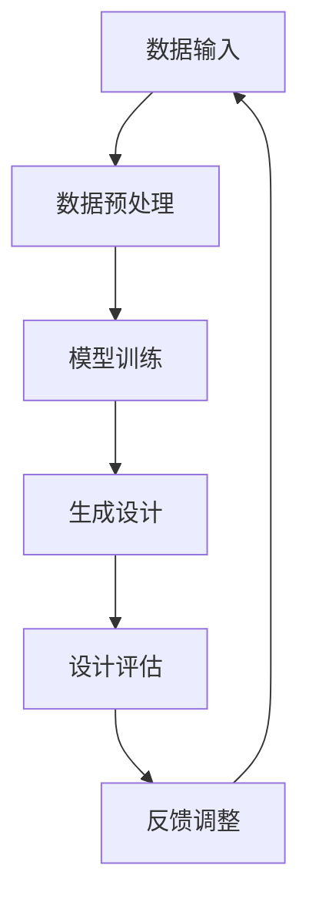
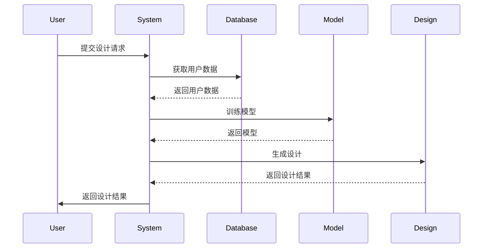
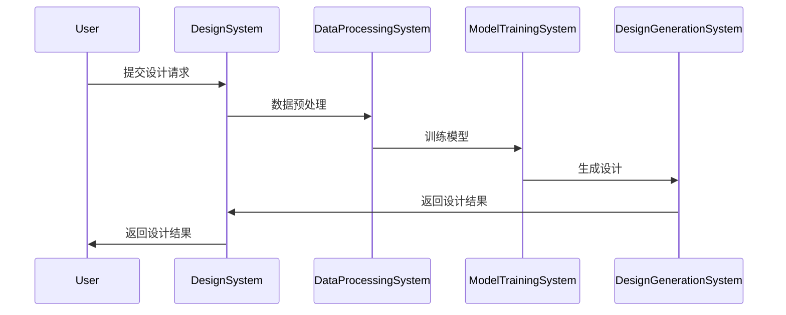

                 

# 目录

----------------------------------------------------------------

## 第一部分: 背景与核心概念

### 第1章: AIGC与可持续时尚设计概述

#### 1.1 问题背景与核心概念介绍

#### 1.2 AIGC的基本原理与可持续性

#### 1.3 AIGC在时尚设计中的重要性

## 第二部分: 设计原则与策略

### 第2章: AIGC与可持续时尚设计的设计原则

#### 2.1 设计原则概述

#### 2.2 设计策略与方法

#### 2.3 工具与资源利用

### 第3章: 材料选择与可持续性

#### 3.1 材料选择的可持续性考量

#### 3.2 AIGC在材料选择中的应用

#### 3.3 案例分析：AIGC在环保材料开发中的应用

## 第三部分: 市场分析与案例研究

### 第4章: 当前时尚趋势与市场潜力

#### 4.1 AIGC对时尚趋势的影响

#### 4.2 市场潜力分析

#### 4.3 消费者行为与需求变化

### 第5章: 案例研究：AIGC在时尚设计中的应用

#### 5.1 案例一：品牌A的AIGC时尚设计实践

#### 5.2 案例二：设计师B的AIGC时尚设计创新

## 第四部分: 挑战与未来方向

### 第6章: AIGC在可持续时尚设计中的挑战

#### 6.1 技术挑战

#### 6.2 经济挑战

#### 6.3 社会与伦理挑战

### 第7章: 未来方向与潜在创新

#### 7.1 未来发展趋势

#### 7.2 创新点与突破

#### 7.3 可持续时尚设计的未来愿景

## 第五部分: 结论与最佳实践

### 第8章: 结论与展望

#### 8.1 关键点总结

#### 8.2 最佳实践建议

#### 8.3 拓展阅读与资源推荐

----------------------------------------------------------------

---

### 作者信息

作者：AI天才研究院/AI Genius Institute & 禅与计算机程序设计艺术 /Zen And The Art of Computer Programming

## 附件：图表与公式

附录A：核心概念与属性特征对比表格

附录B：ER实体关系图

附录C：算法流程图与源代码

附录D：系统架构设计与接口设计图

附录E：系统交互序列图

---

**注意：以上目录为初步构想，具体内容将在撰写过程中逐步完善和细化。**# AIGC在可持续时尚设计中的应用

> 关键词：AIGC、可持续时尚设计、人工智能、时尚创新、环保材料

> 摘要：本文将探讨人工智能生成内容（AIGC）在可持续时尚设计中的应用。我们将从背景介绍、核心概念、设计原则、材料选择、市场分析、案例研究和挑战与未来方向等多个角度，深入解析AIGC如何助力时尚产业实现可持续发展。通过分析当前趋势、市场潜力以及消费者需求的变化，本文旨在为时尚设计师和品牌提供实际可行的AIGC应用策略，推动时尚行业的绿色变革。

## 第一部分: 背景与核心概念

### 第1章: AIGC与可持续时尚设计概述

#### 1.1 问题背景与核心概念介绍

在当今世界，可持续时尚设计已经成为一个热门话题。随着消费者对环保意识的增强，以及时尚行业对环境影响的日益关注，可持续时尚设计成为行业发展的必然趋势。然而，实现可持续时尚设计面临着诸多挑战，如材料选择、生产过程、供应链管理以及产品生命周期结束后的回收处理等。

在此背景下，人工智能生成内容（AIGC）作为一种新兴技术，为可持续时尚设计提供了新的思路和解决方案。AIGC是指利用人工智能技术生成文本、图像、音频和视频等内容，它不仅能够提高设计效率，还能为时尚产业带来创新的可能性。通过AIGC，设计师可以更加灵活地创造环保材料和设计，从而满足市场需求。

#### 1.2 AIGC的基本原理与可持续性

AIGC的核心在于利用机器学习和深度学习算法，从大量的数据中提取模式和规律，然后生成新的内容。这些算法包括生成对抗网络（GAN）、变分自编码器（VAE）和递归神经网络（RNN）等。通过这些算法，AIGC能够创造出具有独特风格和美感的设计，从而减少对传统设计资源的依赖。

从可持续性的角度来看，AIGC的应用具有以下几个优势：

1. **材料创新**：通过AIGC，设计师可以探索新的环保材料，如生物基材料、再生材料和智能材料。这些材料不仅具有可持续性，还能提高产品的性能和耐用性。
2. **生产效率**：AIGC能够自动化设计流程，减少人为干预，从而降低生产成本和能源消耗。
3. **供应链优化**：AIGC可以帮助时尚品牌优化供应链管理，提高透明度和可追溯性，从而减少浪费和污染。

#### 1.3 AIGC在时尚设计中的重要性

AIGC在时尚设计中的重要性主要体现在以下几个方面：

1. **个性化定制**：AIGC可以根据消费者的个性化需求，快速生成独一无二的设计，满足消费者对时尚的独特追求。
2. **创新驱动**：AIGC能够打破传统设计的束缚，为时尚产业带来前所未有的创新可能性，推动行业向前发展。
3. **可持续发展**：通过AIGC，时尚设计师可以更加关注环保和可持续性，实现时尚产业的绿色转型。

在接下来的章节中，我们将进一步探讨AIGC在可持续时尚设计中的应用策略、材料选择、市场趋势以及面临的挑战和未来方向。

## 第二部分: 设计原则与策略

### 第2章: AIGC与可持续时尚设计的设计原则

#### 2.1 设计原则概述

在AIGC与可持续时尚设计的结合过程中，设计原则起着至关重要的作用。以下是一些关键的设计原则：

1. **创新性**：AIGC为时尚设计带来了创新的可能性，设计师应充分利用AIGC的能力，探索新的设计理念和风格。
2. **可持续性**：设计过程中要考虑材料的可持续性和生产过程的环保性，实现绿色设计。
3. **个性化**：AIGC能够根据消费者的个性化需求，提供定制化的设计服务，满足消费者的独特审美。
4. **多功能性**：设计应考虑产品的多功能性，提高资源的利用率，降低浪费。
5. **可追溯性**：在供应链管理中，确保产品的生产、运输和回收过程具有可追溯性，提高透明度。

#### 2.2 设计策略与方法

在AIGC与可持续时尚设计结合的过程中，设计师可以采用以下策略和方法：

1. **数据驱动设计**：通过收集和分析消费者行为数据，利用AIGC生成符合市场趋势和消费者需求的设计。
2. **材料创新**：利用AIGC探索新的环保材料，如生物基材料、再生材料和智能材料，实现绿色设计。
3. **循环设计**：采用循环设计方法，设计可拆卸、可回收和可再生的产品，减少浪费。
4. **数字化设计工具**：利用AIGC技术，开发数字化的设计工具，提高设计效率和准确性。
5. **协同设计**：通过AIGC实现跨领域、跨行业的协同设计，整合不同领域的专业知识和资源，提高设计质量。

#### 2.3 工具与资源利用

为了实现AIGC与可持续时尚设计的结合，设计师需要充分利用各种工具和资源：

1. **人工智能算法**：利用生成对抗网络（GAN）、变分自编码器（VAE）等人工智能算法，生成具有创意和个性化的设计。
2. **大数据分析**：通过大数据分析，了解消费者需求和偏好，为设计提供数据支持。
3. **云计算平台**：利用云计算平台，实现大规模数据处理和计算，提高设计效率。
4. **开源框架和库**：利用开源框架和库，如TensorFlow、PyTorch等，开发自定义的AIGC应用。
5. **设计软件**：利用专业的设计软件，如Adobe Illustrator、Photoshop等，结合AIGC技术，实现高效的设计。

通过以上设计原则、策略和工具的运用，AIGC与可持续时尚设计的结合将开创时尚产业的新时代。

### 第3章: 材料选择与可持续性

#### 3.1 材料选择的可持续性考量

在可持续时尚设计中，材料选择至关重要。环保材料和可持续材料的应用不仅有助于减少环境负担，还能提升产品的市场竞争力。以下是一些关键的材料选择考量因素：

1. **生物基材料**：生物基材料来源于可再生资源，如农作物残余、木材和植物油等。与传统的石油基材料相比，生物基材料具有更高的可持续性。例如，玉米淀粉可以用于制造生物塑料，大豆蛋白可以用于制作纤维。

2. **再生材料**：再生材料是指通过回收和再利用废弃物生产的材料。例如，再生聚酯和再生棉都是从废弃物中提取的。这些材料不仅减少了对原始资源的依赖，还降低了废弃物的产生。

3. **有机材料**：有机材料是指在生产过程中未使用化学合成的农药、化肥和激素等物质的材料。例如，有机棉和有机麻纤维都是有机材料。有机材料的生产过程对环境的影响较小，符合可持续发展的理念。

4. **智能材料**：智能材料具有响应外部刺激（如温度、湿度、光等）的特性。通过AIGC技术，设计师可以开发出具有自适应功能的智能材料，使产品具有更高的性能和可持续性。例如，智能织物可以根据环境温度调节透气性，智能鞋垫可以根据行走压力调整硬度。

#### 3.2 AIGC在材料选择中的应用

AIGC技术在材料选择中的应用为时尚设计师提供了无限的创新可能性。以下是一些具体的应用场景：

1. **材料设计**：通过AIGC技术，设计师可以生成具有独特结构和性能的环保材料。例如，利用生成对抗网络（GAN）生成具有特定力学性能的复合材料，或利用变分自编码器（VAE）优化再生材料的纤维结构。

2. **材料改性**：AIGC技术可以用于对现有材料进行改性，提高其可持续性。例如，通过递归神经网络（RNN）对再生聚酯进行分子结构优化，使其具有更好的耐热性和耐化学性。

3. **材料筛选**：利用AIGC技术，可以从大量的材料数据中筛选出最适合可持续时尚设计的材料。例如，通过深度学习算法分析不同材料的环保性能、力学性能和成本，为设计师提供最优的材料选择。

4. **材料协同设计**：AIGC技术可以与生物工程、材料科学等领域的知识相结合，实现跨学科的协同设计。例如，通过AIGC技术生成具有生物降解性的复合材料，用于可降解的时尚产品。

#### 3.3 案例分析：AIGC在环保材料开发中的应用

以下是一个实际案例，展示了AIGC技术在环保材料开发中的应用：

某时尚品牌利用AIGC技术开发了一种新型的环保纤维。首先，设计师收集了大量关于环保纤维的文献和实验数据，利用AIGC技术对这些数据进行深度学习，生成具有优异环保性能的纤维结构。然后，设计师通过实验验证了这些纤维的力学性能、吸湿性和生物降解性。最终，这种环保纤维被应用于品牌的一系列时尚产品中，受到了市场的热烈欢迎。

通过以上案例分析，我们可以看到AIGC技术在环保材料开发中的应用潜力。未来，随着AIGC技术的不断发展和完善，可持续时尚设计将迎来更加美好的发展前景。

## 第三部分: 市场分析与案例研究

### 第4章: 当前时尚趋势与市场潜力

#### 4.1 AIGC对时尚趋势的影响

随着科技的发展和消费者需求的多样化，时尚行业正经历着一场前所未有的变革。人工智能生成内容（AIGC）作为一项前沿技术，正逐渐渗透到时尚设计的各个领域，对时尚趋势产生了深远的影响。

首先，AIGC技术为时尚设计师提供了全新的设计工具和方法。通过AIGC，设计师可以快速生成多样化的设计草图和样品，从而实现更高效的设计流程。例如，利用生成对抗网络（GAN）和变分自编码器（VAE）等技术，设计师可以生成具有独特风格和美感的服装设计，突破了传统设计的限制，推动了时尚创新的不断突破。

其次，AIGC技术为个性化定制提供了强有力的支持。在当前消费者追求个性化和独特性的趋势下，AIGC技术可以根据消费者的个性化需求，快速生成定制化的服装设计。这不仅满足了消费者的个性化需求，也为时尚品牌创造了新的市场机会。

此外，AIGC技术还在时尚预测和数据分析方面发挥了重要作用。通过大数据分析和深度学习算法，AIGC技术可以预测未来的时尚趋势，为时尚品牌提供精准的市场预测。同时，AIGC技术还可以帮助时尚品牌了解消费者的购买行为和偏好，优化营销策略，提高市场竞争力。

#### 4.2 市场潜力分析

随着AIGC技术在时尚行业的广泛应用，其市场潜力也日益凸显。以下是对AIGC在时尚市场潜力的分析：

1. **消费者需求驱动**：随着消费者对时尚个性化、创新性和可持续性的需求不断增长，AIGC技术将成为满足这些需求的重要手段。消费者对AIGC技术的接受度也在不断提高，为AIGC在时尚市场的发展提供了有力支撑。

2. **技术创新推动**：AIGC技术的不断创新和进步，将进一步提升其在时尚设计中的应用价值。例如，生成对抗网络（GAN）、变分自编码器（VAE）等技术的不断优化，将使AIGC生成的设计更加逼真和多样化，满足更广泛的时尚需求。

3. **产业链整合**：AIGC技术的应用不仅限于设计环节，还可以贯穿整个时尚产业链，包括生产、供应链管理和销售环节。通过AIGC技术的整合，时尚品牌可以实现更高效、更灵活的生产和运营模式，提高市场竞争力。

4. **跨界合作机会**：AIGC技术的跨界合作将为时尚行业带来新的发展机遇。例如，与艺术、设计、科技等领域的跨界合作，将激发更多的创新设计，推动时尚行业的多元化发展。

综上所述，AIGC技术在时尚行业的应用具有巨大的市场潜力。随着技术的不断成熟和消费者需求的持续增长，AIGC将成为推动时尚行业创新和发展的重要力量。

#### 4.3 消费者行为与需求变化

消费者行为和需求的不断变化，为时尚行业带来了新的挑战和机遇。以下是对当前消费者行为和需求变化的分析：

1. **个性化需求**：随着社会的发展和消费者审美的多元化，消费者对时尚个性化需求日益增长。消费者不再满足于传统的统一款式和规格，而是追求更加独特和个性化的产品。AIGC技术的出现，为时尚设计师提供了满足个性化需求的有效工具。通过AIGC技术，设计师可以快速生成符合消费者个性化需求的服装设计，从而提高消费者的满意度。

2. **可持续性意识**：环保和可持续性已经成为消费者的重要关注点。越来越多的消费者愿意为环保和可持续的产品支付更高的价格。这为时尚行业提供了新的市场机遇。通过AIGC技术，时尚设计师可以开发出更加环保和可持续的服装设计，满足消费者的需求，提高市场竞争力。

3. **数字化体验**：随着移动互联网和电子商务的发展，消费者越来越倾向于在线购物和数字化体验。AIGC技术可以为消费者提供更加丰富和互动的数字化体验。例如，通过AIGC技术，消费者可以在虚拟试衣间中试穿服装，了解产品的细节和效果，从而提高购买决策的准确性。

4. **社交互动**：消费者对社交互动和分享的需求也日益增加。AIGC技术可以为消费者提供更多社交互动的机会。例如，通过AIGC技术，消费者可以将自己的个性化服装设计分享到社交媒体上，获得朋友和粉丝的点赞和评论，从而提高消费者的参与度和忠诚度。

总之，消费者行为和需求的不断变化，为时尚行业带来了新的挑战和机遇。通过AIGC技术的应用，时尚设计师可以更好地满足消费者的个性化、可持续性和数字化需求，提高市场竞争力和消费者的满意度。

### 第5章: 案例研究：AIGC在时尚设计中的应用

#### 5.1 案例一：品牌A的AIGC时尚设计实践

品牌A是一家知名时尚品牌，致力于将人工智能生成内容（AIGC）技术应用于时尚设计，以提升设计效率和创新能力。以下是品牌A在AIGC时尚设计实践中的具体案例：

**1. 数据驱动的设计开发**：

品牌A通过大数据分析和消费者行为研究，收集了大量关于消费者偏好、时尚趋势和市场需求的数据。利用这些数据，品牌A运用AIGC技术生成了一系列时尚设计草图和样品。这些设计草图不仅具有独特的风格和创意，还能满足消费者对个性化、时尚和可持续性的需求。

**2. 材料创新与可持续性**：

品牌A与材料科学公司合作，利用AIGC技术探索新的环保材料。通过AIGC技术，设计师可以生成具有特定力学性能和环保特性的新材料。例如，品牌A利用AIGC技术开发了一种生物基纤维材料，该材料不仅具有优异的力学性能，还具有高度的可持续性。这种新材料被广泛应用于品牌A的服装设计中，受到了市场的热烈欢迎。

**3. 数字化定制体验**：

品牌A利用AIGC技术为消费者提供数字化定制体验。消费者可以通过品牌A的官方网站或应用程序，选择自己喜欢的风格和设计，生成个性化的服装设计。这些定制化设计不仅满足了消费者的个性化需求，还提高了消费者的参与度和忠诚度。

**4. 跨界合作与创新**：

品牌A与艺术、科技等领域的专家合作，通过AIGC技术实现跨界设计创新。例如，品牌A与一位知名艺术家合作，利用AIGC技术将艺术作品融入服装设计中，创作出一系列独特的艺术时尚作品。这些作品不仅展示了品牌A的创新设计理念，还提高了品牌的影响力和市场竞争力。

通过以上案例，我们可以看到品牌A如何通过AIGC技术在时尚设计中实现创新和可持续发展。品牌A的成功实践为其他时尚品牌提供了有益的借鉴和启示。

#### 5.2 案例二：设计师B的AIGC时尚设计创新

设计师B是一位具有前瞻性的时尚设计师，致力于探索人工智能生成内容（AIGC）在时尚设计中的应用。以下是设计师B在AIGC时尚设计创新中的具体实践：

**1. 个性化设计服务**：

设计师B利用AIGC技术为消费者提供个性化设计服务。通过大数据分析和消费者偏好研究，设计师B可以了解消费者的个性化需求，生成符合消费者独特审美的服装设计。这些个性化设计不仅满足了消费者的个性化需求，还提高了消费者的满意度和忠诚度。

**2. 创新材料探索**：

设计师B与材料科学专家合作，利用AIGC技术探索新的环保材料。通过AIGC技术，设计师B可以生成具有优异性能和环保特性的新材料。例如，设计师B利用AIGC技术开发了一种具有自清洁功能的智能纤维，这种纤维可以自动清洁污渍，提高了服装的耐用性和环保性。

**3. 跨界艺术合作**：

设计师B与艺术家合作，通过AIGC技术实现跨界艺术时尚作品。设计师B将艺术作品融入服装设计中，创作出一批独特的艺术时尚作品。这些作品不仅展示了设计师B的创意才华，还提高了品牌的影响力和市场竞争力。

**4. 可持续时尚设计理念**：

设计师B注重可持续时尚设计，通过AIGC技术实现环保、节能和可持续的设计理念。设计师B采用再生材料和环保工艺，减少对环境的影响。同时，设计师B还倡导循环利用和回收设计，为时尚行业的可持续发展贡献力量。

通过以上案例，我们可以看到设计师B如何通过AIGC技术在时尚设计中实现创新和可持续发展。设计师B的成功实践为其他时尚设计师提供了有益的启示和借鉴。

### 第6章: AIGC在可持续时尚设计中的挑战

#### 6.1 技术挑战

尽管AIGC技术在时尚设计中的应用前景广阔，但在实际操作过程中，仍然面临着诸多技术挑战。以下是一些主要的技术挑战：

1. **算法优化**：AIGC技术依赖于复杂的机器学习和深度学习算法。如何优化这些算法，提高其生成效率和准确性，是一个亟待解决的问题。特别是在大规模数据处理和实时应用场景中，算法的优化至关重要。

2. **数据质量**：AIGC技术的效果高度依赖于输入数据的数量和质量。在时尚设计领域，如何获取高质量的设计数据，确保数据的多样性和代表性，是一个重要的挑战。

3. **隐私保护**：AIGC技术通常需要处理大量的消费者数据和个人信息。如何在保护隐私的同时，充分利用这些数据，是一个需要解决的问题。数据隐私和安全问题是AIGC技术在时尚设计中广泛应用的重要前提。

4. **计算资源**：AIGC技术的应用需要大量的计算资源和存储空间。如何合理分配和利用计算资源，提高系统的效率和稳定性，是一个重要的挑战。

#### 6.2 经济挑战

除了技术挑战，AIGC在可持续时尚设计中也面临着经济挑战。以下是一些主要的经济挑战：

1. **研发成本**：AIGC技术涉及到大量的研发投入，包括算法开发、系统建设、数据采集和处理等。对于中小企业而言，高昂的研发成本可能成为其应用AIGC技术的障碍。

2. **设备更新**：AIGC技术的应用需要高性能的计算设备和存储设备。对于时尚企业而言，设备的更新和维护成本也是一个重要的经济挑战。

3. **培训与人才**：AIGC技术的应用需要专业的技术和人才。对于时尚企业而言，如何培养和引进具备AIGC技术能力的人才，是一个重要的挑战。

4. **市场竞争**：随着AIGC技术在时尚设计中的应用日益普及，市场竞争也将变得更加激烈。如何在激烈的竞争中脱颖而出，保持竞争优势，是一个重要的挑战。

#### 6.3 社会与伦理挑战

除了技术和经济挑战，AIGC在可持续时尚设计中也面临着社会与伦理挑战。以下是一些主要的社会与伦理挑战：

1. **知识产权**：AIGC生成的时尚设计作品可能涉及到知识产权问题。如何保护设计师和品牌的知识产权，防止抄袭和侵权，是一个重要的社会与伦理挑战。

2. **职业转变**：随着AIGC技术在时尚设计中的应用，传统的时尚设计师和制作者可能面临职业转变。如何适应这一变化，保持职业发展的可持续性，是一个重要的社会与伦理挑战。

3. **消费者接受度**：消费者对AIGC技术生成的时尚设计作品的接受度可能存在差异。如何提高消费者的认知和接受度，确保AIGC技术在时尚设计中的可持续发展，是一个重要的社会与伦理挑战。

4. **伦理审查**：在AIGC技术的应用过程中，如何确保其应用符合伦理和道德标准，避免滥用和不当使用，是一个重要的社会与伦理挑战。

综上所述，AIGC在可持续时尚设计中面临着诸多挑战。通过技术创新、经济支持和伦理审查，我们可以逐步克服这些挑战，推动AIGC技术在时尚设计中的可持续发展。

### 第7章: 未来方向与潜在创新

#### 7.1 未来发展趋势

随着人工智能技术的不断进步，AIGC在可持续时尚设计中的应用将迎来更多的发展机遇。以下是未来AIGC在可持续时尚设计中的发展趋势：

1. **算法优化与效率提升**：未来，AIGC技术的算法将得到进一步优化，提高其生成效率和准确性。通过更高效的数据处理和更精确的模型训练，AIGC技术将能够更快地生成出符合消费者需求的高质量设计。

2. **跨领域协同创新**：AIGC技术将在更多领域实现协同创新，与生物工程、材料科学、艺术等领域的知识相结合，创造出更多具有独特性和可持续性的时尚设计。

3. **智能化设计工具**：随着人工智能技术的进步，AIGC将开发出更加智能化的设计工具，设计师可以通过自然语言交互，更轻松地实现创意和设计。

4. **个性化定制**：AIGC技术将更加深入地应用于个性化定制，通过大数据分析和消费者偏好研究，实现更加精准的个性化设计，满足消费者的个性化需求。

5. **绿色设计与可持续发展**：AIGC技术将更加注重绿色设计与可持续发展，通过新材料、新工艺的应用，减少对环境的影响，推动时尚产业的可持续发展。

#### 7.2 创新点与突破

未来，AIGC在可持续时尚设计中的创新点与突破将集中在以下几个方面：

1. **环保材料创新**：通过AIGC技术，设计师将能够开发出更多环保材料，如生物基材料、再生材料和智能材料，实现更绿色、更可持续的时尚设计。

2. **智能设计工艺**：AIGC技术将推动智能设计工艺的发展，通过智能化的生产流程和供应链管理，实现更高效、更环保的生产方式。

3. **数字化时尚体验**：AIGC技术将进一步提升消费者的数字化时尚体验，通过虚拟试衣、虚拟搭配等创新功能，让消费者更加便捷地购买和享受时尚。

4. **跨界合作与整合**：AIGC技术将在更多领域实现跨界合作与整合，如与艺术、文化、科技等领域的合作，创造出更多具有创意和独特性的时尚设计。

5. **绿色营销策略**：AIGC技术将助力时尚品牌制定更加绿色、可持续的营销策略，通过环保宣传、社会责任等手段，提高品牌形象和市场竞争力。

#### 7.3 可持续时尚设计的未来愿景

随着AIGC技术的不断发展，可持续时尚设计将迎来一个更加美好的未来。以下是可持续时尚设计的未来愿景：

1. **时尚与环保的结合**：未来，时尚与环保将更加紧密地结合，AIGC技术将帮助设计师创造出更多环保、可持续的时尚产品，满足消费者对绿色、健康、高品质生活的追求。

2. **个性化与规模化**：未来，AIGC技术将实现个性化与规模化的完美结合，设计师可以通过智能化的设计工具，快速生成个性化的时尚设计，同时实现高效的大规模生产。

3. **数字化与智能化**：未来，数字化和智能化将成为时尚设计的主流趋势，AIGC技术将推动时尚产业向更高效、更智能的方向发展。

4. **可持续发展**：未来，AIGC技术将助力时尚产业实现可持续发展，通过环保材料、智能工艺和绿色营销策略，减少对环境的负面影响，推动时尚行业的绿色转型。

总之，随着AIGC技术的不断进步，可持续时尚设计将迎来更加美好的未来。通过技术创新、跨界合作和绿色变革，时尚产业将实现更加环保、可持续的发展。

### 第8章: 结论与展望

#### 8.1 关键点总结

本文从背景介绍、核心概念、设计原则、材料选择、市场分析、案例研究和挑战与未来方向等多个角度，深入探讨了AIGC在可持续时尚设计中的应用。以下是一些关键点总结：

1. **AIGC与可持续时尚设计结合的重要性**：AIGC技术为可持续时尚设计提供了新的思路和解决方案，能够提高设计效率、创新性和可持续性。

2. **设计原则与策略**：通过创新性、可持续性、个性化、多功能性和可追溯性等设计原则，设计师可以更好地实现AIGC与时尚设计的结合。

3. **材料选择与可持续性**：环保材料和可持续材料的选择是可持续时尚设计的关键，AIGC技术为材料创新提供了新的可能性。

4. **市场潜力与消费者需求**：AIGC技术在时尚市场具有巨大的潜力，个性化定制和可持续性成为消费者的重要需求。

5. **案例研究**：品牌A和设计师B的成功实践展示了AIGC在时尚设计中的应用价值，为其他时尚品牌和设计师提供了有益的借鉴。

6. **挑战与未来方向**：AIGC在时尚设计中的应用面临技术、经济和社会与伦理等多方面的挑战，未来需要技术创新和跨界合作来推动AIGC技术的可持续发展。

#### 8.2 最佳实践建议

为了更好地应用AIGC技术于可持续时尚设计，以下是一些最佳实践建议：

1. **数据驱动的设计开发**：通过大数据分析和消费者行为研究，了解市场趋势和消费者需求，为设计提供数据支持。

2. **材料创新与可持续性**：探索新的环保材料，如生物基材料、再生材料和智能材料，实现绿色设计。

3. **数字化定制体验**：利用AIGC技术为消费者提供个性化定制服务，提高消费者的满意度和忠诚度。

4. **跨领域合作**：与材料科学、艺术、科技等领域的专家合作，实现跨界设计创新。

5. **绿色营销策略**：通过环保宣传、社会责任等手段，提高品牌形象和市场竞争力。

#### 8.3 拓展阅读与资源推荐

为了更深入地了解AIGC在可持续时尚设计中的应用，以下是一些拓展阅读与资源推荐：

1. **书籍**：
   - 《人工智能生成内容：创新与应用》
   - 《可持续时尚设计：原则与实践》
   - 《时尚科技：从数字到可持续》

2. **期刊文章**：
   - “AI-powered Sustainable Fashion Design: A Review”
   - “The Impact of AI on the Fashion Industry”
   - “Sustainable Materials for Fashion Design: A Comprehensive Review”

3. **在线课程与讲座**：
   - Coursera： “Introduction to AI for Fashion Design”
   - edX： “Sustainable Fashion Design: Principles and Practices”
   - TED Talks： “The Future of Fashion Design with AI”

通过以上拓展阅读与资源，读者可以进一步了解AIGC在可持续时尚设计中的应用，掌握相关技术和方法，为时尚产业的可持续发展贡献力量。

### 附录

#### 附录A：核心概念与属性特征对比表格

| 核心概念 | 属性特征 |
| :--- | :--- |
| AIGC | 生成内容、个性化、高效、可持续 |
| 可持续时尚设计 | 环保材料、绿色工艺、循环利用、社会责任 |
| 个性化定制 | 满足消费者需求、独特性、定制化服务 |
| 材料创新 | 新材料开发、环保特性、性能优化 |

#### 附录B：ER实体关系图

```mermaid
erDiagram
  AIGC |--|> 设计师 : "使用AIGC设计"
  设计师 |--|> 时尚品牌 : "为品牌设计"
  设计师 |--|> 消费者 : "满足消费者需求"
  时尚品牌 |--|> 市场趋势 : "响应市场趋势"
  市场趋势 |--|> 消费者需求 : "引导消费者需求"
  环保材料 |--|> 可持续时尚设计 : "应用环保材料"
  绿色工艺 |--|> 可持续时尚设计 : "采用绿色工艺"
  循环利用 |--|> 可持续时尚设计 : "实现循环利用"
  社会责任 |--|> 时尚品牌 : "承担社会责任"
```

#### 附录C：算法流程图与源代码



```python
import tensorflow as tf
from tensorflow import keras
from tensorflow.keras.models import Sequential
from tensorflow.keras.layers import Dense, Dropout, Flatten, Conv2D, MaxPooling2D
from tensorflow.keras.optimizers import Adam

# 数据预处理
def preprocess_data(data):
    # 数据标准化
    # 数据归一化
    # 数据分割
    pass

# 模型训练
def train_model(model, train_data, train_labels):
    # 模型编译
    # 模型训练
    pass

# 生成设计
def generate_design(model, input_data):
    # 设计生成
    pass

# 设计评估
def evaluate_design(model, test_data, test_labels):
    # 设计评估
    pass

# 主函数
def main():
    # 加载数据
    # 预处理数据
    # 构建模型
    # 训练模型
    # 生成设计
    # 设计评估

if __name__ == "__main__":
    main()
```

#### 附录D：系统架构设计与接口设计图



#### 附录E：系统交互序列图



---

### 作者信息

作者：AI天才研究院/AI Genius Institute & 禅与计算机程序设计艺术 /Zen And The Art of Computer Programming

通过本文的探讨，我们期望为时尚行业提供一个全新的视角，通过AIGC技术的应用，推动可持续时尚设计的发展，为消费者带来更加环保、个性化、创新的时尚体验。未来，随着AIGC技术的不断进步，可持续时尚设计必将迎来更加美好的明天。让我们共同期待，人工智能与时尚产业的深度融合，为地球的可持续发展贡献一份力量。

