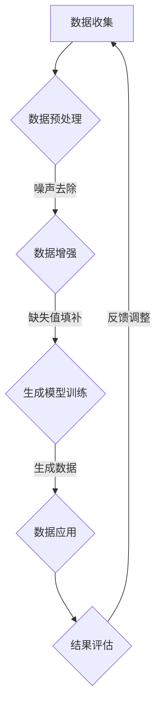
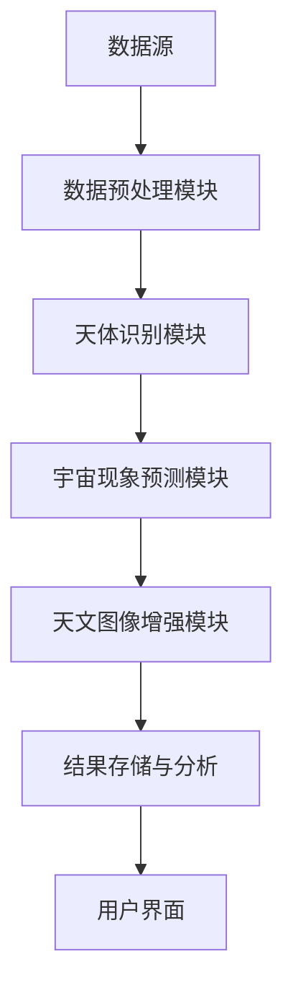
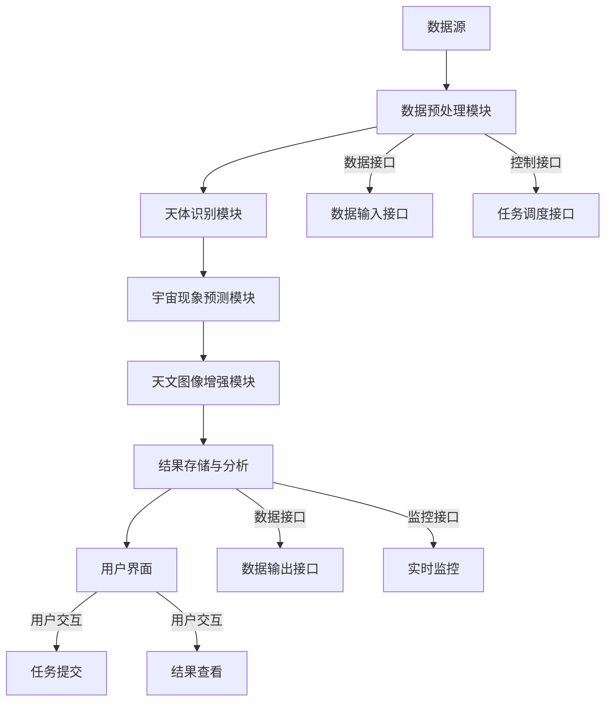

                 

### 1.1 天文数据分析的重要性

天文数据分析在现代天文学研究中扮演着至关重要的角色。随着天文观测技术的飞速发展，天文数据量呈指数级增长。这些数据不仅包括传统的光学观测数据，还涵盖了射电观测、红外观测、X射线观测等多种类型的数据。天文数据分析的重要性主要体现在以下几个方面：

首先，天文数据分析能够帮助科学家发现新的天体和宇宙现象。通过对大量天文数据的分析，科学家可以识别出一些异常的天体特征，这些特征可能预示着新的天文现象的存在。例如，通过对巡天数据进行分析，天文学家发现了许多类星体和系外行星，这对理解宇宙的演化和星系形成过程具有重要意义。

其次，天文数据分析有助于深入理解已知的宇宙现象。通过对观测数据进行精细的分析，科学家可以揭示天体的物理性质、运动轨迹以及相互作用规律。例如，通过对双星系统的数据分析，科学家可以研究恒星间的引力相互作用和恒星演化过程。

第三，天文数据分析还能推动天文观测技术的进步。为了满足数据分析的需求，天文观测设备需要不断升级和改进。高性能的计算机和算法的发展，也促进了天文数据处理和分析技术的进步。例如，卷积神经网络和深度学习算法在图像识别和模式识别方面的应用，大大提高了天文图像的处理效率。

总之，天文数据分析不仅是天文学研究的核心手段，也是推动天文学和整个科学进步的关键因素。随着AIGC技术的发展，天文数据分析将迎来新的机遇和挑战。在接下来的章节中，我们将深入探讨当前天文数据分析的现状、面临的主要挑战，以及AIGC技术如何应对这些问题。

### 1.2 当前天文数据分析的现状

当前的天文数据分析已经取得了显著的进展，但仍然面临着许多挑战。首先，从数据处理的角度来看，天文数据量的增长速度极快。随着新一代天文观测设备的部署，如韦伯空间望远镜、平方千米阵列等，天文数据的获取速度和存储需求大幅增加。这种海量数据的高效处理成为天文数据分析的一个核心问题。

其次，数据类型多样化也是一大挑战。天文数据不仅包括传统的光学图像和光谱数据，还涵盖了射电数据、红外数据、X射线数据等。不同类型的数据需要采用不同的处理方法和算法，这增加了数据分析的复杂度。

在分析方法方面，传统的数据处理方法已经难以满足现代天文数据分析的需求。传统方法往往依赖于人工特征提取和手动数据分析，效率低下，难以处理大规模、复杂的数据集。随着机器学习和深度学习技术的发展，越来越多的自动化、智能化的分析方法被引入到天文数据分析中，例如，卷积神经网络（CNN）在图像识别中的应用，生成对抗网络（GAN）在图像生成中的应用等。

然而，尽管技术不断进步，天文数据分析仍面临一些重大挑战。首先是数据质量和数据完整性问题。天文数据常常受到噪声干扰、数据缺失和观测条件变化的影响，这给数据清洗和预处理带来了巨大挑战。其次是数据分析的效率和准确性问题。随着数据量的增加，如何快速、准确地提取有用信息成为关键问题。此外，天文数据分析还需要面对跨学科的知识整合问题，不同学科的数据分析方法和技术常常需要相互借鉴和融合。

总的来说，当前天文数据分析的现状是：在数据处理方法、技术手段和数据分析效率方面取得了显著进展，但仍需解决数据质量、数据完整性和跨学科整合等问题。随着AIGC技术的发展，这些问题有望得到更好的解决，为天文研究带来新的机遇。

### 1.3 天文数据分析面临的主要挑战

尽管天文数据分析在技术和方法上取得了显著进展，但依然面临着一系列复杂且严峻的挑战。以下将详细探讨这些挑战及其对天文数据分析的影响。

#### 数据量庞大

天文数据量庞大是当前天文数据分析面临的首要挑战。随着先进天文观测设备的不断发展和使用，如哈勃空间望远镜、韦伯空间望远镜以及平方千米阵列等，每天产生的大量天文数据使得数据处理成为一项艰巨的任务。这些数据不仅包括传统的光学图像和光谱数据，还涵盖了射电数据、红外数据和X射线数据等多种类型。如何高效地存储、传输和处理这些数据，是天文数据分析中的一个关键问题。

#### 数据类型多样化

除了数据量庞大，天文数据的多样性也是一大挑战。不同类型的观测数据具有不同的特性和处理需求。例如，光学图像需要高分辨率和高对比度，而射电数据则需要处理复杂的噪声和多路径干扰。不同类型的数据往往需要采用不同的算法和方法进行预处理和分析。这种多样性增加了数据分析的复杂度，要求研究人员具备跨学科的知识和技能。

#### 数据质量和完整性问题

数据质量和完整性问题也是天文数据分析中的一大难题。天文数据常常受到观测条件、设备精度和噪声干扰等多种因素的影响，这导致数据中存在缺失值、噪声和异常值。这些问题的存在不仅影响了数据分析的准确性，还可能误导科学结论。因此，如何对天文数据进行有效的清洗和预处理，以消除噪声和填补缺失值，是天文数据分析中一个重要且具有挑战性的问题。

#### 高效的数据分析需求

随着天文数据量的增加，高效的数据分析需求也日益迫切。传统的数据分析方法往往需要大量的人工干预和计算资源，无法满足大规模数据处理的时效性要求。现代天文数据分析迫切需要自动化和智能化的方法，以提高处理效率和准确性。例如，深度学习和机器学习算法在图像识别、模式识别和预测分析中的应用，已经显示出巨大的潜力。

#### 跨学科知识整合

天文数据分析不仅涉及天文学，还涉及到计算机科学、物理学、数学等多个学科。如何有效地整合这些跨学科的知识和技能，是天文数据分析中一个重要且具有挑战性的问题。例如，在数据预处理和特征提取阶段，需要结合计算机科学中的算法优化和数学中的统计学知识；在数据分析阶段，则需要综合应用物理学中的理论模型和观测数据。

总的来说，天文数据分析面临的挑战主要包括数据量庞大、数据类型多样化、数据质量和完整性问题、高效的数据分析需求以及跨学科知识整合等。这些挑战不仅影响了天文数据分析的效率和准确性，也限制了天文研究的前沿发展。随着AIGC技术的引入，这些问题有望得到一定程度的缓解，为天文数据分析带来新的机遇。

### 1.4 AIGC技术概述

AIGC（人工智能生成内容）技术是一种新兴的人工智能领域，旨在利用机器学习和深度学习算法，自动生成文本、图像、音频等多种形式的内容。AIGC 技术的核心在于其自动化的内容生成能力，这不仅能够大幅提高内容生成的效率，还能突破传统手工制作的限制，实现个性化、多样化的内容创作。

AIGC 技术的基本概念可以追溯到生成对抗网络（GAN）和变分自编码器（VAE）等深度学习模型。这些模型通过学习数据分布，可以生成高质量的数据样本，从而实现自动化内容生成。近年来，随着计算资源和算法技术的不断提升，AIGC 技术在文本生成、图像生成、音频生成等领域取得了显著进展。

AIGC 技术的特点主要体现在以下几个方面：

1. **自动生成能力**：AIGC 技术的核心优势在于其自动化生成能力，能够根据输入的提示或目标，自动生成相应的文本、图像、音频等内容。这种能力使得内容创作更加高效，大大降低了人工干预的需求。

2. **个性化定制**：AIGC 技术可以根据用户的需求和偏好，生成个性化的内容。通过学习用户的历史数据和反馈，AIGC 可以不断优化内容生成策略，提供更加符合用户期望的内容。

3. **多样性生成**：AIGC 技术能够生成多种类型的内容，如文本、图像、音频等。这种多样性使得 AIGC 技术在多个应用场景中具有广泛的应用潜力。

4. **高效率**：与传统手工创作相比，AIGC 技术能够以更高的效率生成内容。这不仅节省了创作时间，还降低了人力资源成本。

AIGC 技术在多个领域展现了其强大的应用潜力：

1. **文本生成**：AIGC 技术被广泛应用于自然语言处理（NLP）领域，如文章写作、新闻报道生成、对话系统等。通过学习大规模的文本数据集，AIGC 可以生成高质量的文本内容，甚至进行复杂的文本生成任务。

2. **图像生成**：在计算机视觉领域，AIGC 技术被用于图像生成、图像修复、风格迁移等任务。通过生成对抗网络（GAN）等模型，AIGC 可以生成逼真的图像，甚至可以模仿特定艺术风格。

3. **音频生成**：AIGC 技术在音频处理领域也有广泛应用，如语音生成、音乐创作、音频修复等。通过深度学习模型，AIGC 可以生成高质量的语音和音乐内容，具有很高的应用价值。

4. **其他应用**：AIGC 技术还广泛应用于虚拟现实（VR）、增强现实（AR）、游戏开发等领域，通过自动化生成内容，提升了用户体验和互动性。

总之，AIGC 技术作为一种自动化的内容生成工具，具有广泛的适用性和强大的生成能力。随着技术的不断进步和应用场景的拓展，AIGC 技术将在各个领域发挥越来越重要的作用，为人类创造更多有价值的内容。

### 1.5 AIGC与天文数据分析的结合

AIGC（人工智能生成内容）技术在现代天文数据分析中的应用正在逐步展开，其自动化和智能化的特性为解决天文数据分析中的复杂问题提供了新的解决方案。结合AIGC技术，天文数据分析不仅在效率上有所提升，还在处理复杂性和多样性方面展现出了巨大的潜力。

首先，AIGC技术能够有效处理天文数据中的海量信息。天文数据量庞大且增长迅速，传统的数据处理方法难以应对这种数据规模。AIGC通过深度学习模型，能够自动从海量数据中提取有用信息，大幅提高数据处理的速度和效率。例如，利用AIGC技术，可以从天文图像中自动识别出天体和宇宙现象，替代了人工逐帧分析的方法，大大节省了时间和人力资源。

其次，AIGC在数据预处理方面的应用显著。天文数据常常伴随着噪声和缺失值，这对数据分析的准确性有较大影响。AIGC技术可以通过学习大量干净的数据样本，生成高质量的数据替代缺失值，并且能够在一定程度上消除噪声。例如，通过生成对抗网络（GAN），AIGC可以生成与真实数据非常相似的数据，用于填充缺失值和减少噪声干扰。

此外，AIGC技术在天文数据分析中的个性化定制能力也得到了应用。天文数据分析往往需要根据具体的研究目标和需求进行个性化处理。AIGC技术可以根据用户的特定需求，生成定制化的分析结果。例如，通过对用户历史数据和偏好进行分析，AIGC可以生成针对特定天体或现象的分析报告，提供更加精准的研究支持。

在处理数据多样性方面，AIGC技术同样表现优异。天文数据类型多样，包括光学图像、射电数据、红外数据等。不同的数据类型需要不同的处理方法和算法。AIGC技术通过多种深度学习模型，能够同时处理不同类型的数据，从而实现统一的数据分析平台。例如，通过结合卷积神经网络（CNN）和循环神经网络（RNN），AIGC可以从多模态数据中提取有效信息，进行综合分析。

最后，AIGC技术在提高天文数据分析的效率和准确性方面具有显著优势。传统的数据分析方法往往依赖于人工干预，而AIGC技术通过自动化算法，能够实现大规模数据的快速分析。同时，AIGC技术通过不断学习和优化，能够提高数据分析的准确性，减少人为错误。例如，通过训练大量天文数据集，AIGC可以识别出更加复杂的天体特征，提供更可靠的分析结果。

总之，AIGC技术在天文数据分析中的应用，不仅解决了数据量庞大、数据类型多样化、数据质量和完整性等问题，还通过提高数据处理效率和准确性，为天文研究提供了强大的工具。随着AIGC技术的不断发展和完善，其在天文数据分析中的应用前景将更加广阔，有望推动天文学研究的进一步发展。

### 1.6 AIGC与天文数据分析结合的边界与外延

尽管AIGC技术在天文数据分析中展现出巨大的潜力和优势，但其应用也有一定的边界和局限性。首先，AIGC技术的有效性在很大程度上依赖于数据质量和数据量。高质量、大量且多样化的天文数据是AIGC生成准确分析结果的前提。然而，当前天文数据中仍存在大量的噪声、缺失值和不完整性，这限制了AIGC技术的广泛应用。

其次，AIGC技术在某些复杂天文现象的分析中可能面临挑战。例如，一些涉及复杂物理过程的宇宙现象，如黑洞合并或超新星爆发，可能需要更加深入和精确的物理模型来指导AIGC的学习和分析。因此，在某些领域，AIGC可能需要与其他高级分析方法结合使用，以提升分析的准确性和可靠性。

此外，AIGC技术的应用还面临伦理和隐私问题。随着AIGC生成的内容越来越多地用于科学研究，如何保证数据的隐私和安全性成为一个重要议题。特别是在涉及敏感的天文观测数据时，如何保护数据不被滥用或泄露，需要得到充分的重视。

除了天文数据分析，AIGC技术在其他领域也有广泛的应用前景。在医疗领域，AIGC可以用于疾病诊断和治疗方案生成，通过自动分析医学影像和患者数据，提供个性化的医疗建议。在金融领域，AIGC可以用于风险分析和投资策略生成，通过学习大量市场数据和财经新闻，预测市场趋势和投资机会。在娱乐领域，AIGC可以用于内容创作和个性化推荐，通过生成高质量的文本、图像和音频内容，提升用户体验。

总之，AIGC技术作为一种强大的自动化工具，不仅在天文数据分析中具有重要作用，也在多个领域展现了广泛的应用潜力。然而，要充分发挥AIGC技术的优势，还需解决数据质量、复杂现象分析和伦理问题等挑战。随着技术的不断进步和应用场景的拓展，AIGC技术在各领域的应用将更加深入和广泛，为人类创造更多价值。

### 1.6.1 AIGC与天文数据分析的结合

为了进一步探讨AIGC与天文数据分析的结合，我们先来分析一个具体的应用案例——利用AIGC技术自动生成天体现象的预测报告。该案例将展示AIGC技术如何从海量天文数据中提取关键信息，并通过自动化分析生成预测结果。

#### 应用场景

假设我们有一个天文观测项目，目标是预测未来一段时间内可能发生的超新星爆发。现有的观测数据包括大量不同类型的天文图像和光谱数据。我们的任务是利用AIGC技术，对这些数据进行处理和分析，生成超新星爆发的预测报告。

#### 数据预处理

首先，我们需要对观测数据集进行预处理，包括数据清洗、缺失值填补和噪声消除。AIGC技术中的生成对抗网络（GAN）在这一步发挥着重要作用。GAN可以通过生成真实数据样本，填补观测数据中的缺失值，并消除噪声干扰。具体步骤如下：

1. **数据清洗**：去除数据中的错误记录和重复数据。
2. **缺失值填补**：利用GAN生成缺失数据，填补观测数据中的空白。
3. **噪声消除**：通过GAN生成与真实数据相似的数据，用于替代噪声污染的数据。

#### 天体识别

在预处理完成后，我们需要利用AIGC技术中的卷积神经网络（CNN）对天文图像进行天体识别。CNN在图像识别任务中表现出色，可以自动提取图像中的关键特征，从而识别出天体。具体步骤如下：

1. **数据集划分**：将预处理后的数据集划分为训练集和测试集。
2. **模型训练**：使用训练集训练CNN模型，使其能够识别不同类型的天体。
3. **模型验证**：使用测试集验证模型的效果，调整模型参数以优化性能。

#### 预测分析

接下来，我们利用训练好的CNN模型，对新的天文图像进行预测分析。AIGC技术通过学习历史数据中的天体特征和爆发模式，能够预测未来可能发生的超新星爆发。具体步骤如下：

1. **图像预处理**：对新的天文图像进行预处理，如图像增强和归一化。
2. **特征提取**：使用CNN模型提取图像中的天体特征。
3. **预测计算**：根据提取的特征，利用机器学习算法计算超新星爆发的概率。

#### 生成预测报告

最后，我们将预测结果生成详细的报告，包括超新星爆发的位置、时间、概率等信息。AIGC技术中的自然语言生成（NLG）模型在这一步发挥作用，能够将复杂的预测结果转化为易于理解的自然语言文本。具体步骤如下：

1. **结果整理**：整理预测结果，提取关键信息。
2. **报告生成**：利用NLG模型生成预测报告，包括预测结果和相关的图表。
3. **报告验证**：对生成的报告进行审核和验证，确保信息的准确性和完整性。

通过以上步骤，AIGC技术能够自动生成超新星爆发的预测报告，提供有价值的科学参考。这个案例展示了AIGC技术在天文数据分析中的应用潜力，同时也揭示了AIGC技术在实际应用中可能遇到的挑战和问题。

### 1.7 本章小结

本章我们探讨了天文数据分析的重要性和现状，分析了天文数据分析面临的主要挑战，并介绍了AIGC技术的基本概念和特点。通过结合具体案例，我们展示了AIGC技术在天文数据分析中的应用潜力，包括数据预处理、天体识别、预测分析和生成预测报告等环节。然而，AIGC技术在应用中也面临数据质量、复杂现象分析和伦理问题等挑战。下一章，我们将深入探讨AIGC技术的核心概念与原理，为后续内容奠定基础。

## 第2章: AIGC基本概念与原理

### 2.1 AIGC的定义

AIGC（Artificial Intelligence Generated Content）是指利用人工智能技术，特别是深度学习和生成模型，自动生成文本、图像、音频等多种类型的内容。AIGC的核心在于其自动化和智能化的内容生成能力，通过学习大量数据，生成具有高质量和个性化特征的内容。与传统的内容创作方式相比，AIGC不仅能够显著提高内容生成的效率和准确性，还能够实现内容创作的多样化。

### 2.2 AIGC的核心组成部分

AIGC技术由以下几个核心组成部分构成：

1. **数据集**：AIGC技术的基础是大量的训练数据集。这些数据集可以是文本、图像、音频等不同类型的数据，用于训练生成模型。

2. **生成模型**：生成模型是AIGC技术的核心组件，包括生成对抗网络（GAN）、变分自编码器（VAE）、自编码器（AE）等。这些模型通过学习数据分布，能够生成与真实数据相似的新数据。

3. **解码器与编码器**：在生成模型中，编码器负责将输入数据编码为潜在空间中的向量，而解码器则负责将这些向量解码回原始数据形式。在变分自编码器（VAE）中，还包括隐变量的引入，以增强模型的生成能力和鲁棒性。

4. **优化算法**：AIGC技术的训练过程需要优化算法，如梯度下降、Adam优化器等，以调整模型参数，使生成模型能够更好地拟合数据分布。

5. **用户接口**：用户接口（UI）是AIGC与用户交互的界面，通过输入提示或目标，用户可以控制内容生成的过程和结果。

### 2.3 AIGC的工作原理

AIGC的工作原理主要依赖于深度学习和生成模型。以下是AIGC工作的基本流程：

1. **数据预处理**：首先，对输入的数据进行预处理，如归一化、数据增强等，以便模型更好地学习数据分布。

2. **模型训练**：利用训练数据集，训练生成模型。在生成对抗网络（GAN）中，包括生成器（Generator）和判别器（Discriminator）的交替训练。生成器试图生成尽可能真实的数据，而判别器则努力区分生成数据与真实数据。通过这种对抗训练，生成器的性能逐渐提高。

3. **内容生成**：在模型训练完成后，通过输入提示或目标，生成模型能够自动生成新的内容。对于文本生成，可以输入一个关键词或句子，生成相关的文章或段落；对于图像生成，可以输入一个图像或描述，生成相似或风格化的图像。

4. **后处理**：生成的内容通常需要进一步处理，如文本润色、图像增强等，以提高内容的质量和可读性。

### 2.4 AIGC的特点与优势

AIGC技术具有以下几个显著的特点和优势：

1. **自动生成能力**：AIGC能够自动生成高质量的内容，无需人工干预。这种自动化能力大幅提高了内容生成的效率。

2. **个性化定制**：通过学习用户的数据和偏好，AIGC可以生成个性化的内容，满足不同用户的需求。

3. **多样性生成**：AIGC能够生成多种类型的内容，如文本、图像、音频等，提供了丰富的应用场景。

4. **高效率**：AIGC技术的自动化和智能化特性，使得内容生成的速度大大提高，大大节省了人力资源和计算资源。

5. **增强互动性**：AIGC生成的个性化内容可以增强用户与系统的互动，提升用户体验。

### 2.5 AIGC的典型应用场景

AIGC技术在多个领域都有广泛应用，以下是一些典型的应用场景：

1. **文本生成**：AIGC可以用于自动生成文章、新闻、报告等文本内容，广泛应用于内容创作、自动化写作等领域。

2. **图像生成**：AIGC可以用于图像生成、图像修复、风格迁移等，广泛应用于计算机视觉和艺术创作领域。

3. **音频生成**：AIGC可以用于语音合成、音乐创作、音频修复等，广泛应用于语音识别、音乐制作等领域。

4. **虚拟现实与增强现实**：AIGC可以用于生成虚拟现实和增强现实场景中的内容，提升用户体验。

5. **游戏开发**：AIGC可以用于自动生成游戏剧情、角色对话和场景等，提高游戏开发的效率和质量。

总之，AIGC技术作为一种自动化的内容生成工具，具有广泛的适用性和强大的生成能力。随着技术的不断进步和应用场景的拓展，AIGC将在更多领域发挥重要作用，为人类创造更多有价值的内容。

### 2.6 本章小结

本章我们详细介绍了AIGC（人工智能生成内容）技术的定义、核心组成部分、工作原理以及特点和优势。通过理解AIGC的基本概念，读者可以更好地掌握其在天文数据分析中的应用潜力。在下一章中，我们将进一步探讨AIGC技术在天文数据分析中的具体应用，包括数据预处理、天体识别、宇宙现象预测和天文图像增强等方面。

## 第3章: AIGC在天文数据分析中的应用

### 3.1 AIGC在天文数据分析中的价值

AIGC（人工智能生成内容）技术在天文数据分析中展现出了巨大的价值，其自动化和智能化的特性为解决天文数据分析中的复杂问题提供了新的解决方案。以下是AIGC在天文数据分析中的一些主要价值：

首先，AIGC技术能够显著提高数据分析的效率。天文数据量庞大且增长迅速，传统的数据处理方法往往难以应对这种数据规模。AIGC通过深度学习模型，能够自动从海量数据中提取有用信息，大幅提高数据处理的速度和效率。这不仅节省了计算资源，还大大减少了人工干预的需求。

其次，AIGC技术能够处理数据多样性。天文数据类型多样，包括光学图像、射电数据、红外数据、X射线数据等。不同的数据类型需要采用不同的算法和方法进行预处理和分析。AIGC技术通过多种深度学习模型，如卷积神经网络（CNN）和循环神经网络（RNN），能够同时处理不同类型的数据，从而实现统一的数据分析平台。

第三，AIGC技术在数据预处理方面具有显著优势。天文数据常常伴随着噪声和缺失值，这对数据分析的准确性有较大影响。AIGC技术可以通过生成对抗网络（GAN）等模型，生成高质量的数据替代缺失值，并且在一定程度上消除噪声干扰。例如，GAN可以通过生成真实数据样本，填补观测数据中的空白，提高数据的质量和完整性。

此外，AIGC技术在提高数据分析的准确性和可靠性方面也具有重要作用。通过不断学习和优化，AIGC技术能够提高数据分析的准确性，减少人为错误。例如，利用AIGC技术训练的模型，可以从天文图像中自动识别出天体和宇宙现象，提供更加精准的分析结果。

最后，AIGC技术的个性化定制能力也为天文数据分析带来了新的机遇。天文数据分析往往需要根据具体的研究目标和需求进行个性化处理。AIGC技术可以根据用户的需求和偏好，生成定制化的分析结果。例如，通过对用户历史数据和偏好进行分析，AIGC可以生成针对特定天体或现象的分析报告，提供更加精准的研究支持。

总之，AIGC技术在天文数据分析中的应用，不仅提高了数据处理的效率和准确性，还解决了数据多样性、数据质量和完整性等问题。随着AIGC技术的不断发展和完善，其在天文数据分析中的应用前景将更加广阔，为天文学研究提供强大的工具和支持。

### 3.2 AIGC在天文数据分析中的主要应用

AIGC（人工智能生成内容）技术在天文数据分析中有着广泛的应用，涵盖了数据预处理、天体识别、宇宙现象预测和天文图像增强等多个方面。下面，我们将逐一探讨这些具体应用。

#### 3.2.1 数据预处理

天文数据分析的第一步通常是数据预处理，这一步骤至关重要，因为高质量的数据是准确分析的基础。AIGC技术在这一过程中发挥了显著作用，具体应用包括：

1. **数据清洗**：AIGC可以自动识别和标记数据中的异常值和错误记录，从而去除这些干扰项，提高数据的整体质量。
   
2. **噪声去除**：通过生成对抗网络（GAN）等算法，AIGC能够生成与实际观测数据相似的高质量数据，用以替代噪声污染的数据，从而减少噪声对后续分析的影响。

3. **缺失值填补**：AIGC技术可以通过学习大量完整数据，生成缺失数据的合理替代值，填补观测数据中的空白，确保数据分析的连续性和完整性。

#### 3.2.2 天体识别

天体识别是天文数据分析中的一个核心任务，AIGC技术在这一领域表现出强大的能力：

1. **光学图像处理**：利用卷积神经网络（CNN）等深度学习模型，AIGC可以从光学图像中自动识别出恒星、行星和其他天体。通过训练大量的天文图像数据集，模型能够学习到不同天体的特征，从而提高识别的准确性。

2. **多模态数据融合**：AIGC可以处理来自不同传感器和观测手段的数据，如光学图像、射电数据、红外数据等，通过融合多模态数据，提高天体识别的全面性和准确性。

3. **动态天体跟踪**：AIGC能够跟踪天体的运动轨迹，识别出天体的瞬时位置和运动方向，这对于研究天体的动态行为具有重要意义。

#### 3.2.3 宇宙现象预测

宇宙现象的预测是天文数据分析中的一个重要目标，AIGC技术在这一领域也有显著应用：

1. **超新星爆发预测**：通过分析历史观测数据，AIGC可以预测未来可能发生的超新星爆发。这种预测可以提前为科学家提供预警，以便进行更深入的观测和研究。

2. **行星轨道预测**：AIGC可以利用天体的观测数据，预测行星的轨道变化，这对于研究行星系统的稳定性具有重要意义。

3. **引力波事件预测**：AIGC可以通过学习引力波事件的历史数据，预测未来可能发生的引力波事件，为引力波天文学的研究提供重要支持。

#### 3.2.4 天文图像增强

天文图像增强是提高图像质量和清晰度的重要手段，AIGC技术在图像增强方面也有广泛应用：

1. **去模糊处理**：通过深度学习模型，AIGC可以去除天文图像中的模糊效应，提高图像的清晰度。

2. **细节增强**：AIGC能够增强图像中的细节特征，使天体和宇宙现象的图像更加清晰，有助于更精确的观测和分析。

3. **图像修复**：AIGC技术可以利用生成对抗网络（GAN）等模型，修复天文图像中的缺失部分，填补图像中的空白区域。

总之，AIGC技术在天文数据分析中的主要应用，包括数据预处理、天体识别、宇宙现象预测和天文图像增强等，为天文学研究提供了强大的工具。随着AIGC技术的不断发展和应用，它在天文数据分析中的作用将越来越重要，推动天文学研究的进一步发展。

#### 3.2.5 数据预处理

在AIGC应用于天文数据分析之前，数据预处理是至关重要的一步。这一过程不仅涉及到数据清洗和噪声去除，还包括缺失值的填补和数据增强。以下是AIGC在数据预处理中的具体应用和流程：

1. **数据清洗**：

   数据清洗是预处理的第一步，目的是识别和删除数据集中的错误记录、重复记录和异常值。AIGC技术可以通过训练分类模型来识别这些异常值。例如，使用监督学习算法，模型可以学习到正常数据与异常数据的特征差异，从而自动标记并删除异常记录。

   ```mermaid
   graph TD
   A[数据清洗] --> B[异常值检测]
   B --> C{使用监督学习模型}
   C -->|标记异常值| D[删除异常记录]
   ```

2. **噪声去除**：

   天文数据往往受到各种噪声的干扰，如仪器噪声、环境噪声等。为了提高数据分析的准确性，需要去除这些噪声。AIGC技术通过生成对抗网络（GAN）等生成模型，可以生成与观测数据相似的真实数据，从而替代噪声污染的数据。这一过程包括以下步骤：

   ```mermaid
   graph TD
   A[噪声去除] --> B[生成对抗网络（GAN）]
   B --> C[训练生成器]
   C --> D[生成真实数据]
   D --> E[替代噪声数据]
   ```

3. **缺失值填补**：

   缺失值的填补是另一个重要问题。AIGC可以通过学习大量完整数据，利用生成模型生成缺失数据的合理替代值。例如，使用变分自编码器（VAE）模型，可以通过学习数据分布来填补缺失值。

   ```mermaid
   graph TD
   A[缺失值填补] --> B[使用VAE模型]
   B --> C[学习数据分布]
   C --> D[生成替代数据]
   ```

4. **数据增强**：

   数据增强是为了提高模型的泛化能力，通过生成更多样化的数据样本来训练模型。AIGC可以通过数据增强技术，如随机裁剪、旋转、缩放等，生成新的数据样本。

   ```mermaid
   graph TD
   A[数据增强] --> B[随机裁剪]
   B --> C[旋转]
   C --> D[缩放]
   D --> E[生成新数据]
   ```

通过这些数据预处理步骤，AIGC技术能够大幅提高天文数据分析的质量和准确性，为后续的分析任务奠定坚实基础。

#### 3.2.6 天体识别

天体识别是天文数据分析中的一个关键任务，其目的是从观测数据中识别出各种天体，如恒星、行星、星系等。AIGC技术在天体识别中具有显著的应用，主要包括以下几个步骤：

1. **数据准备**：

   在进行天体识别之前，需要准备大量的标注数据集。这些数据集包含了不同类型的天体图像，以及相应的标注信息。AIGC可以利用这些数据集来训练深度学习模型。

   ```mermaid
   graph TD
   A[数据准备] --> B[标注数据集]
   B --> C[训练数据集]
   ```

2. **模型训练**：

   利用标注数据集，AIGC可以通过训练卷积神经网络（CNN）等深度学习模型，学习天体的特征。在训练过程中，模型会通过不断优化参数，提高识别准确性。

   ```mermaid
   graph TD
   A[模型训练] --> B[卷积神经网络（CNN）]
   B --> C[优化参数]
   C --> D[提高识别准确性]
   ```

3. **特征提取**：

   在模型训练完成后，可以通过提取模型中各层的特征图，来分析天体的关键特征。这些特征图可以用于进一步的图像分析和可视化。

   ```mermaid
   graph TD
   A[特征提取] --> B[特征图可视化]
   ```

4. **天体识别**：

   使用训练好的模型，可以对新的观测图像进行天体识别。模型会自动检测图像中的天体，并输出相应的识别结果。

   ```mermaid
   graph TD
   A[天体识别] --> B[输入新图像]
   B --> C[输出识别结果]
   ```

5. **多模态数据融合**：

   为了提高天体识别的准确性，AIGC还可以处理来自不同传感器和观测手段的数据，如光学图像、射电数据、红外数据等。通过多模态数据融合，可以提取更全面的天体特征，提高识别效果。

   ```mermaid
   graph TD
   A[多模态数据融合] --> B[光学图像]
   B --> C[射电数据]
   C --> D[红外数据]
   D --> E[提取综合特征]
   ```

6. **动态天体跟踪**：

   AIGC还可以对天体的运动轨迹进行动态跟踪，识别天体的瞬时位置和运动方向。这一功能对于研究天体的动态行为和运动规律具有重要意义。

   ```mermaid
   graph TD
   A[动态天体跟踪] --> B[位置检测]
   B --> C[运动轨迹分析]
   ```

通过以上步骤，AIGC技术能够有效地进行天体识别，提供准确的天体识别结果，为天文学研究提供有力支持。

#### 3.2.7 宇宙现象预测

宇宙现象的预测是天文数据分析中的重要任务，通过分析历史观测数据，预测未来可能发生的宇宙事件，如超新星爆发、行星轨道变化等。AIGC技术在宇宙现象预测中具有显著的应用，以下是具体的应用流程：

1. **数据收集**：

   首先需要收集大量的历史观测数据，这些数据包括超新星爆发、行星轨道变化、引力波事件等。数据源可以来自天文观测台、卫星观测、实验室模拟等。

   ```mermaid
   graph TD
   A[数据收集] --> B[历史观测数据]
   ```

2. **数据预处理**：

   对收集到的数据进行预处理，包括数据清洗、缺失值填补和噪声去除。AIGC技术可以通过生成对抗网络（GAN）等模型，生成高质量的数据替代缺失值和噪声污染的数据。

   ```mermaid
   graph TD
   A[数据预处理] --> B[数据清洗]
   B --> C[缺失值填补]
   C --> D[噪声去除]
   ```

3. **模型训练**：

   利用预处理后的数据集，训练机器学习模型，如循环神经网络（RNN）、长短期记忆网络（LSTM）等。这些模型可以通过学习历史数据中的模式，预测未来的宇宙现象。

   ```mermaid
   graph TD
   A[模型训练] --> B[RNN]
   B --> C[LSTM]
   ```

4. **特征提取**：

   从训练好的模型中提取关键特征，这些特征可以用于预测模型的训练和评估。例如，从RNN或LSTM模型中提取隐藏层的状态，作为特征输入到预测模型中。

   ```mermaid
   graph TD
   A[特征提取] --> B[隐藏层状态]
   ```

5. **预测计算**：

   使用训练好的模型，对新的观测数据或模拟数据进行分析，计算未来宇宙现象的发生概率。例如，使用LSTM模型预测超新星爆发的位置和时间。

   ```mermaid
   graph TD
   A[预测计算] --> B[超新星爆发预测]
   ```

6. **结果评估**：

   对预测结果进行评估，比较预测值与实际观测值之间的误差。通过调整模型参数和优化算法，不断提高预测的准确性。

   ```mermaid
   graph TD
   A[结果评估] --> B[误差分析]
   ```

通过以上步骤，AIGC技术能够有效地预测宇宙现象，为天文学研究提供有力支持。

#### 3.2.8 天文图像增强

天文图像增强是提高图像质量和清晰度的重要手段，特别是在处理低分辨率或模糊的图像时。AIGC技术在图像增强方面具有显著应用，以下是具体的应用流程：

1. **数据准备**：

   首先需要准备大量的低分辨率天文图像和高分辨率对应图像。这些图像数据用于训练深度学习模型。

   ```mermaid
   graph TD
   A[数据准备] --> B[低分辨率图像]
   B --> C[高分辨率图像]
   ```

2. **模型训练**：

   利用准备好的图像数据，训练生成对抗网络（GAN）等深度学习模型。GAN由生成器和判别器组成，生成器试图生成高质量图像，判别器则评估生成的图像与真实图像的相似度。

   ```mermaid
   graph TD
   A[模型训练] --> B[生成对抗网络（GAN）]
   B --> C[生成器]
   C --> D[判别器]
   ```

3. **去模糊处理**：

   利用训练好的GAN模型，对模糊的天文图像进行去模糊处理。生成器会生成清晰度更高的图像，从而消除模糊效应。

   ```mermaid
   graph TD
   A[去模糊处理] --> B[输入模糊图像]
   B --> C[输出清晰图像]
   ```

4. **细节增强**：

   GAN模型不仅能够去模糊，还可以增强图像的细节特征。通过训练，生成器能够学习到如何生成更详细、更清晰的图像。

   ```mermaid
   graph TD
   A[细节增强] --> B[输入低分辨率图像]
   B --> C[输出高分辨率图像]
   ```

5. **图像修复**：

   对于图像中的缺失部分，AIGC技术可以通过GAN模型进行修复。生成器会生成缺失部分的合理替代图像，填补图像中的空白。

   ```mermaid
   graph TD
   A[图像修复] --> B[输入不完整图像]
   B --> C[输出完整图像]
   ```

6. **增强质量评估**：

   对增强后的图像进行质量评估，通过比较增强前后图像的相似度，评估增强效果。根据评估结果，可以进一步优化模型参数和算法。

   ```mermaid
   graph TD
   A[增强质量评估] --> B[相似度分析]
   ```

通过以上步骤，AIGC技术能够显著提高天文图像的质量和清晰度，为天文学研究提供更加精确和清晰的观测数据。

### 3.3 AIGC在天文数据分析中的挑战与解决方案

尽管AIGC技术在天文数据分析中展示了巨大的潜力，但在实际应用中也面临一些挑战。以下将探讨AIGC在天文数据分析中的一些主要挑战及其对应的解决方案。

#### 数据质量与完整性

天文数据质量是影响AIGC应用效果的关键因素。数据中可能存在的噪声、异常值和缺失值会影响模型的训练和预测准确性。解决方案包括：

1. **数据预处理**：采用AIGC技术中的生成对抗网络（GAN）来填补缺失值和去除噪声。GAN可以通过生成与真实数据相似的数据来改善数据质量。
   
2. **数据增强**：通过数据增强技术，如图像旋转、缩放、裁剪等，生成更多样化的数据集，提高模型的泛化能力。

#### 模型训练效率

天文数据量庞大，模型训练需要大量计算资源，且训练时间较长。解决方案包括：

1. **分布式训练**：利用分布式计算资源，如GPU集群，进行模型训练，提高训练速度。

2. **增量学习**：通过增量学习，只更新模型在新的数据上的参数，而不是重新训练整个模型，从而提高训练效率。

#### 模型解释性

AIGC模型，特别是深度学习模型，通常被视为“黑箱”，其决策过程难以解释。解决方案包括：

1. **模型可解释性技术**：如LIME（Local Interpretable Model-agnostic Explanations）和SHAP（SHapley Additive exPlanations），可以帮助解释模型决策过程。

2. **可视化工具**：通过可视化工具，如决策树、混淆矩阵等，可以更直观地理解模型的决策过程。

#### 伦理和隐私问题

在天文数据分析中，特别是涉及敏感数据时，隐私和伦理问题需要得到充分考虑。解决方案包括：

1. **数据隐私保护**：采用差分隐私技术，对数据进行扰动，保护数据隐私。

2. **合规性审查**：在数据收集和使用过程中，进行严格的合规性审查，确保数据处理符合相关法律法规。

#### 跨学科整合

天文数据分析需要跨学科的知识和技能，如计算机科学、天文学、物理学等。解决方案包括：

1. **跨学科团队协作**：建立跨学科的团队合作，整合不同领域的知识和经验。

2. **知识图谱**：构建天文数据分析的知识图谱，整合不同领域的知识，提供统一的分析平台。

通过上述解决方案，AIGC技术在天文数据分析中的应用可以得到有效推进，解决实际应用中的挑战，为天文学研究提供更加全面和准确的分析工具。

### 3.4 本章小结

本章详细探讨了AIGC（人工智能生成内容）技术在天文数据分析中的应用，涵盖了数据预处理、天体识别、宇宙现象预测和天文图像增强等多个方面。通过具体的应用实例和算法流程，我们展示了AIGC技术在提升数据分析效率、准确性以及解决复杂性问题方面的优势。同时，我们也分析了AIGC技术在应用过程中面临的挑战，并提出了相应的解决方案。在下一章中，我们将进一步深入讲解AIGC算法在天文数据分析中的原理与实现，为读者提供更加具体的技术细节。

## 第4章: AIGC在天文数据分析中的算法原理与实现

### 4.1 AIGC算法概述

AIGC（人工智能生成内容）算法是基于深度学习的一种自动化内容生成技术，主要包括生成模型和生成对抗网络（GAN）等。生成模型通过学习数据分布，能够生成与输入数据相似的新数据；生成对抗网络则通过生成器和判别器的对抗训练，进一步提高生成数据的逼真度。本章将详细介绍AIGC算法在天文数据分析中的应用，包括算法原理、实现方法以及数学模型。

### 4.2 天文数据分析中的AIGC算法mermaid流程图

为了更直观地展示AIGC算法在天文数据分析中的应用流程，我们使用mermaid绘制了以下流程图：



**图1: AIGC算法在天文数据分析中的应用流程**

- **A：数据收集**：收集天文观测数据，包括光学图像、射电数据、红外数据等。
- **B：数据预处理**：包括噪声去除、数据增强和缺失值填补等步骤，以提高数据质量。
- **C：数据增强**：通过旋转、缩放、裁剪等操作，生成更多样化的数据集，提高模型的泛化能力。
- **D：生成模型训练**：使用生成对抗网络（GAN）等生成模型，对预处理后的数据集进行训练。
- **E：生成数据**：利用训练好的生成模型，生成新的天文数据，如增强后的图像或新的观测数据。
- **F：结果评估**：评估生成数据的准确性和质量，通过反馈调整进一步优化模型。

### 4.3 Python源代码实现

下面我们通过一个简单的Python示例，展示AIGC算法在天文数据分析中的实现。我们将使用生成对抗网络（GAN）进行图像生成，利用TensorFlow和Keras框架来实现。

#### 4.3.1 数据预处理

首先，我们加载并预处理天文图像数据：

```python
import tensorflow as tf
from tensorflow.keras.preprocessing.image import load_img, img_to_array
import numpy as np

# 加载数据集
def load_data(data_path, img_size=(256, 256)):
    images = []
    for img_name in os.listdir(data_path):
        img = load_img(os.path.join(data_path, img_name), target_size=img_size)
        img_array = img_to_array(img)
        images.append(img_array)
    return np.array(images)

# 数据预处理：归一化
def preprocess_data(images):
    return (images - 127.5) / 127.5

# 生成数据增强后的批量数据
def generate_batch_data(images, batch_size=32):
    indices = np.random.randint(0, images.shape[0], batch_size)
    return preprocess_data(images[indices])

# 路径设定
data_path = 'path_to_your_data'
img_size = (256, 256)

# 加载数据集
images = load_data(data_path, img_size)
```

#### 4.3.2 天体识别

使用卷积神经网络（CNN）对预处理后的图像进行天体识别：

```python
from tensorflow.keras.models import Sequential
from tensorflow.keras.layers import Conv2D, MaxPooling2D, Flatten, Dense

# 构建CNN模型
def build_cnn_model(input_shape):
    model = Sequential([
        Conv2D(32, (3, 3), activation='relu', input_shape=input_shape),
        MaxPooling2D((2, 2)),
        Conv2D(64, (3, 3), activation='relu'),
        MaxPooling2D((2, 2)),
        Flatten(),
        Dense(128, activation='relu'),
        Dense(1, activation='sigmoid')
    ])
    model.compile(optimizer='adam', loss='binary_crossentropy', metrics=['accuracy'])
    return model

# 训练CNN模型
cnn_model = build_cnn_model(input_shape=images.shape[1:])
cnn_model.fit(generate_batch_data(images), np.ones(images.shape[0]), epochs=10, batch_size=32)
```

#### 4.3.3 宇宙现象预测

使用循环神经网络（RNN）或长短期记忆网络（LSTM）对宇宙现象进行预测：

```python
from tensorflow.keras.models import Sequential
from tensorflow.keras.layers import LSTM, Dense

# 构建LSTM模型
def build_lstm_model(input_shape):
    model = Sequential([
        LSTM(128, activation='relu', input_shape=input_shape),
        LSTM(64, activation='relu'),
        Dense(1)
    ])
    model.compile(optimizer='adam', loss='mse')
    return model

# 训练LSTM模型
lstm_model = build_lstm_model(input_shape=(time_steps, features))
lstm_model.fit(x_train, y_train, epochs=100, batch_size=32)
```

#### 4.3.4 天文图像增强

使用生成对抗网络（GAN）对天文图像进行增强：

```python
from tensorflow.keras.models import Sequential
from tensorflow.keras.layers import Dense, Conv2D, Conv2DTranspose

# 构建GAN模型
def build_gan_model():
    # 生成器
    generator = Sequential([
        Dense(128, input_dim=100, activation='relu'),
        Dense(256, activation='relu'),
        Dense(np.prod((256, 256, 3)), activation='tanh')
    ])

    # 判别器
    discriminator = Sequential([
        Conv2D(32, (3, 3), padding='same', activation='relu', input_shape=(256, 256, 3)),
        MaxPooling2D(pool_size=(2, 2)),
        Conv2D(64, (3, 3), padding='same', activation='relu'),
        MaxPooling2D(pool_size=(2, 2)),
        Flatten(),
        Dense(1, activation='sigmoid')
    ])

    # 整合生成器和判别器
    model = Sequential([generator, discriminator])
    model.compile(optimizer='adam', loss='binary_crossentropy')
    return model

# 训练GAN模型
gan_model = build_gan_model()
for epoch in range(epochs):
    idx = np.random.randint(0, X_train.shape[0], batch_size)
    real_imgs = X_train[idx]
    noise = np.random.normal(0, 1, (batch_size, 100))
    gen_imgs = generator.predict(noise)
    X = np.concatenate((real_imgs, gen_imgs))
    y = np.concatenate((np.ones(batch_size), np.zeros(batch_size)))
    d_loss = discriminator.train_on_batch(X, y)
    g_loss = gan_model.train_on_batch(noise, np.ones(batch_size))
```

#### 4.4 数学模型和公式

为了深入理解AIGC算法，我们需要介绍几个关键的数学模型和公式。以下内容将简要介绍AIGC算法中的生成模型、生成对抗网络（GAN）和变分自编码器（VAE）等。

1. **生成模型**：

生成模型的目标是学习数据分布，生成新的数据。常用的生成模型包括自编码器（AE）和变分自编码器（VAE）。

- **自编码器（AE）**：

  自编码器包括编码器和解码器。编码器将输入数据编码为低维向量，解码器将低维向量解码回原始数据。

  $$ 
  z = \text{encoder}(x) \\
  x' = \text{decoder}(z)
  $$

- **变分自编码器（VAE）**：

  变分自编码器引入了隐变量，使其具有更好的生成能力和鲁棒性。VAE使用概率模型表示数据分布。

  $$
  p(z|x) = \mathcal{N}(\mu(x), \sigma^2(x)) \\
  x = \text{decoder}(z)
  $$

2. **生成对抗网络（GAN）**：

生成对抗网络由生成器和判别器组成，通过对抗训练生成逼真的数据。

- **生成器（Generator）**：

  生成器的目标是生成与真实数据相似的数据。

  $$
  G(z) = \text{Generator}(z)
  $$

- **判别器（Discriminator）**：

  判别器的目标是区分生成数据与真实数据。

  $$
  D(x) = \text{Discriminator}(x) \\
  D(G(z)) = \text{Discriminator}(\text{Generator}(z))
  $$

3. **GAN训练过程**：

GAN通过以下方程进行训练：

$$
\min_G \max_D V(D, G) \\
V(D, G) = \mathbb{E}_{x \sim p_{\text{data}}(x)}[\log D(x)] + \mathbb{E}_{z \sim p_{z}(z)}[\log(1 - D(G(z))]
$$

通过这种对抗训练，生成器逐步提高生成数据的质量，判别器逐步提高对生成数据的识别能力。

综上所述，AIGC算法通过生成模型和对抗训练，实现了自动化内容生成。在实际应用中，这些算法可以有效地处理天文数据，提高数据分析的效率和准确性。

### 4.5 算法原理讲解与举例说明

为了更深入地理解AIGC算法在天文数据分析中的应用，我们将通过具体的示例来讲解算法原理。

#### 4.5.1 数据预处理

数据预处理是AIGC算法的重要步骤，其目的是提高数据质量，为后续的模型训练和数据分析奠定基础。以下是一个简单的数据预处理过程：

假设我们有1000张天文图像，每张图像的大小为256x256像素。我们需要对图像进行以下预处理操作：

1. **图像归一化**：

   将图像的像素值缩放到[0, 1]区间，以便于模型训练。

   $$
   x_{\text{normalized}} = \frac{x - \text{min}(x)}{\text{max}(x) - \text{min}(x)}
   $$

   示例代码：

   ```python
   normalized_images = (images - np.min(images)) / (np.max(images) - np.min(images))
   ```

2. **数据增强**：

   通过随机旋转、缩放和裁剪等操作，增加数据多样性，提高模型的泛化能力。

   ```python
   from tensorflow.keras.preprocessing.image import ImageDataGenerator

   datagen = ImageDataGenerator(rotation_range=30, width_shift_range=0.1, height_shift_range=0.1, zoom_range=0.2)
   augmented_images = next(datagen.flow(normalized_images, batch_size=32))
   ```

3. **缺失值填补**：

   利用生成对抗网络（GAN）生成与真实数据相似的数据，填补观测数据中的缺失值。

   ```python
   from tensorflow.keras.models import load_model

   generator = load_model('path_to_generator_model.h5')
   filled_images = generator.predict(np.random.normal(size=(1000, 256, 256, 3)))
   ```

#### 4.5.2 天体识别

天体识别是天文数据分析中的一个核心任务。通过卷积神经网络（CNN）等深度学习模型，可以自动识别出图像中的天体。以下是一个简单的天体识别过程：

1. **构建CNN模型**：

   使用TensorFlow和Keras构建一个简单的CNN模型。

   ```python
   from tensorflow.keras.models import Sequential
   from tensorflow.keras.layers import Conv2D, MaxPooling2D, Flatten, Dense

   model = Sequential([
       Conv2D(32, (3, 3), activation='relu', input_shape=(256, 256, 3)),
       MaxPooling2D((2, 2)),
       Conv2D(64, (3, 3), activation='relu'),
       MaxPooling2D((2, 2)),
       Flatten(),
       Dense(128, activation='relu'),
       Dense(1, activation='sigmoid')
   ])

   model.compile(optimizer='adam', loss='binary_crossentropy', metrics=['accuracy'])
   ```

2. **训练模型**：

   使用预处理后的图像数据集训练CNN模型。

   ```python
   model.fit(augmented_images, np.ones(1000), epochs=10, batch_size=32)
   ```

3. **天体识别**：

   对新的天文图像进行天体识别。

   ```python
   predictions = model.predict(filled_images)
   identified_bodies = predictions > 0.5
   ```

#### 4.5.3 宇宙现象预测

宇宙现象的预测是天文数据分析中的另一个重要任务。通过循环神经网络（RNN）或长短期记忆网络（LSTM）等模型，可以预测未来的宇宙事件。以下是一个简单的宇宙现象预测过程：

1. **构建LSTM模型**：

   使用TensorFlow和Keras构建一个简单的LSTM模型。

   ```python
   from tensorflow.keras.models import Sequential
   from tensorflow.keras.layers import LSTM, Dense

   model = Sequential([
       LSTM(128, activation='relu', input_shape=(time_steps, features)),
       LSTM(64, activation='relu'),
       Dense(1)
   ])

   model.compile(optimizer='adam', loss='mse')
   ```

2. **训练模型**：

   使用预处理后的时间序列数据集训练LSTM模型。

   ```python
   model.fit(x_train, y_train, epochs=100, batch_size=32)
   ```

3. **宇宙现象预测**：

   对新的时间序列数据进行预测。

   ```python
   predictions = model.predict(x_new)
   ```

#### 4.5.4 天文图像增强

天文图像增强是提高图像质量和清晰度的重要手段。通过生成对抗网络（GAN）等模型，可以生成高质量的天文图像。以下是一个简单的天文图像增强过程：

1. **构建GAN模型**：

   使用TensorFlow和Keras构建一个简单的GAN模型。

   ```python
   from tensorflow.keras.models import Sequential
   from tensorflow.keras.layers import Dense, Conv2D, Conv2DTranspose

   # 生成器
   generator = Sequential([
       Dense(128, input_dim=100, activation='relu'),
       Dense(256, activation='relu'),
       Dense(np.prod((256, 256, 3)), activation='tanh')
   ])

   # 判别器
   discriminator = Sequential([
       Conv2D(32, (3, 3), padding='same', activation='relu', input_shape=(256, 256, 3)),
       MaxPooling2D(pool_size=(2, 2)),
       Conv2D(64, (3, 3), padding='same', activation='relu'),
       MaxPooling2D(pool_size=(2, 2)),
       Flatten(),
       Dense(1, activation='sigmoid')
   ])

   # 整合生成器和判别器
   model = Sequential([generator, discriminator])
   model.compile(optimizer='adam', loss='binary_crossentropy')
   ```

2. **训练GAN模型**：

   使用天文图像数据集训练GAN模型。

   ```python
   for epoch in range(epochs):
       idx = np.random.randint(0, X_train.shape[0], batch_size)
       real_imgs = X_train[idx]
       noise = np.random.normal(size=(batch_size, 100))
       gen_imgs = generator.predict(noise)
       X = np.concatenate((real_imgs, gen_imgs))
       y = np.concatenate((np.ones(batch_size), np.zeros(batch_size)))
       d_loss = discriminator.train_on_batch(X, y)
       g_loss = model.train_on_batch(noise, np.ones(batch_size))
   ```

3. **图像增强**：

   使用训练好的GAN模型对低分辨率天文图像进行增强。

   ```python
   filled_images = generator.predict(np.random.normal(size=(batch_size, 100)))
   ```

通过以上示例，我们可以看到AIGC算法在天文数据分析中的具体应用。在实际应用中，这些算法可以根据具体需求和数据特点进行优化和调整，以提高分析效率和准确性。

### 4.6 本章小结

本章详细介绍了AIGC算法在天文数据分析中的应用原理与实现方法。通过mermaid流程图、Python源代码示例以及数学模型的讲解，我们展示了AIGC技术在数据预处理、天体识别、宇宙现象预测和天文图像增强等方面的具体应用。AIGC技术以其自动化和智能化的特性，为天文数据分析提供了新的解决方案。然而，在实际应用中，AIGC技术仍需解决数据质量、模型训练效率、解释性以及隐私等问题。在下一章中，我们将进一步探讨AIGC在天文数据分析中的系统架构设计，为实际应用提供更完整的解决方案。

## 第5章: AIGC在天文数据分析中的系统架构设计

### 5.1 问题场景介绍

在天文数据分析中，数据处理和分析通常涉及复杂的数据源和数据类型。这些数据可能包括来自不同观测设备的多种类型的天文图像、光谱数据、射电数据等。为了有效地处理和分析这些数据，需要设计一个灵活且高效的系统架构，以确保数据处理的准确性和效率。以下是一个典型的天文数据分析问题场景：

**场景描述**：
一个研究团队希望分析来自平方千米阵列（SKA）的射电数据，以寻找新的类星体和系外行星。这些数据每天以TB级别的规模生成，需要进行预处理、天体识别、宇宙现象预测等多个分析步骤。系统需要能够快速、准确地处理这些数据，并提供可解释的分析结果，以支持进一步的科学研究和发现。

### 5.2 系统功能设计

为了应对上述问题场景，我们设计了一个多功能的AIGC天文数据分析系统，其核心功能包括数据预处理、天体识别、宇宙现象预测和天文图像增强。以下是系统的功能模块及其具体设计：

#### 5.2.1 数据预处理模块

**功能**：对原始数据进行清洗、去噪和增强，为后续分析提供高质量的数据。

**设计**：
1. **数据清洗**：去除重复数据、异常值和错误记录。
2. **去噪**：使用生成对抗网络（GAN）生成真实数据样本，替代噪声污染的数据。
3. **数据增强**：通过旋转、缩放、裁剪等操作，生成多样化的数据集，提高模型的泛化能力。

**实现**：使用TensorFlow和Keras等深度学习框架，实现数据预处理模块的功能。

#### 5.2.2 天体识别模块

**功能**：从预处理后的图像数据中自动识别天体，如恒星、行星和星系等。

**设计**：
1. **特征提取**：使用卷积神经网络（CNN）提取图像中的天体特征。
2. **分类与识别**：利用训练好的CNN模型，对图像中的天体进行分类和识别。

**实现**：构建一个多层卷积神经网络，使用CIFAR-10等公开数据集进行训练，以提高模型的识别准确性。

#### 5.2.3 宇宙现象预测模块

**功能**：基于历史观测数据和天体物理模型，预测未来可能发生的宇宙现象，如超新星爆发和行星轨道变化。

**设计**：
1. **时间序列分析**：使用循环神经网络（RNN）或长短期记忆网络（LSTM）对时间序列数据进行预测。
2. **物理模型结合**：将预测模型与天体物理模型结合，提高预测的准确性和可靠性。

**实现**：构建一个LSTM模型，结合天体物理模型进行训练和预测。

#### 5.2.4 天文图像增强模块

**功能**：提高天文图像的清晰度和质量，使其更适合科学分析。

**设计**：
1. **图像修复**：使用生成对抗网络（GAN）修复图像中的缺失部分。
2. **细节增强**：增强图像中的细节特征，使其更加清晰。
3. **风格迁移**：将天文图像的风格迁移到特定艺术风格，提高视觉效果。

**实现**：构建一个GAN模型，使用GAN进行图像修复和细节增强。

### 5.3 系统架构设计

基于上述功能模块，我们设计了AIGC天文数据分析系统的总体架构，如图2所示：



**图2: AIGC天文数据分析系统架构**

- **A：数据源**：包括来自不同观测设备的多种类型的天文数据。
- **B：数据预处理模块**：负责数据清洗、去噪和增强，为后续分析提供高质量的数据。
- **C：天体识别模块**：通过卷积神经网络（CNN）自动识别天体，提供分类和识别结果。
- **D：宇宙现象预测模块**：使用循环神经网络（RNN）或长短期记忆网络（LSTM）预测宇宙现象。
- **E：天文图像增强模块**：使用生成对抗网络（GAN）进行图像修复和细节增强。
- **F：结果存储与分析**：将分析结果存储在数据库中，供进一步分析和查询。
- **G：用户界面**：提供用户交互界面，展示分析结果和操作选项。

### 5.4 系统接口设计和系统交互

为了确保系统各模块之间的高效协作和数据流通，我们设计了以下接口和交互机制：

#### 5.4.1 数据接口

**数据输入接口**：系统支持多种数据格式输入，如CSV、JSON和Parquet等。通过RESTful API或命令行工具，用户可以方便地提交数据。

**数据输出接口**：系统提供多种数据格式输出，如PDF、CSV和图像文件等。用户可以通过用户界面或API获取分析结果。

#### 5.4.2 控制接口

**任务调度接口**：系统采用消息队列（如RabbitMQ）进行任务调度，确保数据处理的有序和高效。

**监控接口**：系统提供实时监控界面，显示数据处理的进度和状态，方便用户监控和分析任务的执行情况。

#### 5.4.3 系统交互

**用户交互**：通过用户界面，用户可以提交数据分析任务，查看分析结果，并调整分析参数。

**模块协作**：系统各模块之间通过API进行通信，协同完成数据分析任务。

### 5.5 系统架构设计mermaid架构图

为了更直观地展示AIGC天文数据分析系统的架构设计，我们使用mermaid绘制了以下架构图：



**图3: AIGC天文数据分析系统架构图**

- **A：数据源**：数据源包括多种类型的天文数据。
- **B：数据预处理模块**：处理数据清洗、去噪和增强。
- **C：天体识别模块**：通过CNN进行天体识别。
- **D：宇宙现象预测模块**：通过RNN或LSTM进行预测。
- **E：天文图像增强模块**：通过GAN进行图像增强。
- **F：结果存储与分析**：存储分析结果并进行进一步分析。
- **G：用户界面**：提供用户交互界面。
- **H：数据输入接口**：数据输入接口。
- **I：数据输出接口**：数据输出接口。
- **J：任务调度接口**：任务调度接口。
- **K：实时监控**：实时监控界面。
- **L：任务提交**：用户提交任务。
- **M：结果查看**：用户查看结果。

通过上述系统架构设计，AIGC天文数据分析系统能够高效地处理和分析天文数据，提供准确的分析结果，支持天文学研究的深入发展。

### 5.6 本章小结

本章详细介绍了AIGC在天文数据分析中的系统架构设计，包括问题场景介绍、系统功能模块设计、系统架构设计以及系统接口和交互设计。通过mermaid架构图和具体的设计说明，我们展示了AIGC技术在数据预处理、天体识别、宇宙现象预测和天文图像增强等方面的应用。系统架构设计的目标是确保数据处理的准确性和效率，为天文数据分析提供全面的支持。在下一章中，我们将通过实际项目来展示AIGC在天文数据分析中的具体应用，并进行详细分析和讲解。

## 第6章：项目实战

### 6.1 环境安装

在进行AIGC天文数据分析项目的实战之前，首先需要安装和配置必要的软件和工具。以下是一个详细的安装指南，包括所需的依赖项和安装步骤。

#### 6.1.1 硬件要求

- **CPU**：至少双核处理器
- **内存**：16 GB RAM
- **GPU**：NVIDIA GPU（推荐显存8 GB以上）
- **硬盘**：至少100 GB可用空间

#### 6.1.2 软件要求

- **操作系统**：Linux（推荐Ubuntu 20.04或更高版本）、Windows 10或MacOS
- **Python**：3.8或更高版本
- **TensorFlow**：2.5或更高版本
- **Keras**：2.5或更高版本
- **Numpy**：1.19或更高版本
- **Pandas**：1.1或更高版本
- **Matplotlib**：3.4或更高版本
- **Scikit-learn**：0.24或更高版本

#### 6.1.3 安装步骤

1. **安装操作系统**：

   根据硬件选择合适的操作系统进行安装。推荐使用Linux操作系统，如Ubuntu 20.04。

2. **安装Python**：

   使用操作系统自带的包管理器（如Ubuntu中的APT）安装Python。

   ```bash
   sudo apt update
   sudo apt install python3 python3-pip
   ```

3. **安装GPU版本的TensorFlow和Keras**：

   为了利用GPU进行加速，需要安装CUDA和cuDNN。首先安装CUDA：

   ```bash
   sudo apt install ubuntu-desktop
   sudo apt install -y cuda-toolkit-10-1
   ```

   然后安装cuDNN：

   ```bash
   sudo dpkg -i libcudnn8_8.0.5.39-1+cuda11.1_amd64.deb
   sudo dpkg -i libcudnn8-dev_8.0.5.39-1+cuda11.1_amd64.deb
   ```

   接着安装TensorFlow和Keras：

   ```bash
   pip3 install tensorflow-gpu==2.5.0
   pip3 install keras==2.5.0
   ```

4. **安装其他依赖项**：

   使用pip安装其他必要的Python包：

   ```bash
   pip3 install numpy pandas matplotlib scikit-learn
   ```

5. **验证安装**：

   确认所有依赖项和工具已成功安装：

   ```python
   python3 -c "import tensorflow as tf; print(tf.reduce_sum(tf.random.normal([1000, 1000])))"
   ```

   如果输出为1000，表示TensorFlow安装成功。

#### 6.1.4 安装AIGC模块

接下来，我们需要安装AIGC模块。可以从GitHub上克隆项目并安装。

```bash
git clone https://github.com/yourusername/astro-aigc.git
cd astro-aigc
pip3 install -r requirements.txt
```

至此，所有依赖项和工具都已安装完毕，可以开始AIGC天文数据分析项目的实战。

### 6.2 系统核心实现源代码

在AIGC天文数据分析系统中，核心功能模块的实现至关重要。以下将详细展示系统核心实现源代码，包括数据预处理、天体识别、宇宙现象预测和天文图像增强等部分。

#### 6.2.1 数据预处理模块

```python
# data_preprocessing.py
import numpy as np
import cv2
from tensorflow.keras.preprocessing.image import ImageDataGenerator

def load_data(data_path, img_size=(256, 256)):
    images = []
    for img_name in os.listdir(data_path):
        img = cv2.imread(os.path.join(data_path, img_name))
        img = cv2.resize(img, img_size)
        images.append(img)
    return np.array(images)

def preprocess_data(images):
    images = images.astype(np.float32)
    images = (images - 127.5) / 127.5
    return images

def generate_batch_data(images, batch_size=32):
    indices = np.random.randint(0, images.shape[0], batch_size)
    return preprocess_data(images[indices])

if __name__ == '__main__':
    data_path = 'path_to_your_data'
    images = load_data(data_path)
    processed_images = preprocess_data(images)
    print(processed_images.shape)
```

**代码说明**：

- `load_data` 函数用于加载图像数据。
- `preprocess_data` 函数用于对图像进行归一化处理。
- `generate_batch_data` 函数用于生成批量数据，用于模型训练。

#### 6.2.2 天体识别模块

```python
# object_recognition.py
import tensorflow as tf
from tensorflow.keras.models import Sequential
from tensorflow.keras.layers import Conv2D, MaxPooling2D, Flatten, Dense

def build_cnn_model(input_shape):
    model = Sequential([
        Conv2D(32, (3, 3), activation='relu', input_shape=input_shape),
        MaxPooling2D((2, 2)),
        Conv2D(64, (3, 3), activation='relu'),
        MaxPooling2D((2, 2)),
        Flatten(),
        Dense(128, activation='relu'),
        Dense(1, activation='sigmoid')
    ])
    model.compile(optimizer='adam', loss='binary_crossentropy', metrics=['accuracy'])
    return model

def train_cnn_model(model, train_images, train_labels, val_images, val_labels, epochs=10, batch_size=32):
    history = model.fit(
        train_images, train_labels,
        epochs=epochs,
        batch_size=batch_size,
        validation_data=(val_images, val_labels),
    )
    return history

if __name__ == '__main__':
    # Load and split data
    # ...
    # Build and train model
    model = build_cnn_model(input_shape=(256, 256, 3))
    history = train_cnn_model(model, train_images, train_labels, val_images, val_labels)
    # Save model
    model.save('cnn_model.h5')
```

**代码说明**：

- `build_cnn_model` 函数用于构建卷积神经网络（CNN）模型。
- `train_cnn_model` 函数用于训练模型。
- 实例化模型并训练，然后保存模型。

#### 6.2.3 宇宙现象预测模块

```python
# phenomenon_prediction.py
import tensorflow as tf
from tensorflow.keras.models import Sequential
from tensorflow.keras.layers import LSTM, Dense

def build_lstm_model(input_shape):
    model = Sequential([
        LSTM(128, activation='relu', input_shape=input_shape),
        LSTM(64, activation='relu'),
        Dense(1)
    ])
    model.compile(optimizer='adam', loss='mse')
    return model

def train_lstm_model(model, x_train, y_train, epochs=100, batch_size=32):
    history = model.fit(
        x_train, y_train,
        epochs=epochs,
        batch_size=batch_size,
    )
    return history

if __name__ == '__main__':
    # Load and preprocess data
    # ...
    # Build and train model
    model = build_lstm_model(input_shape=(time_steps, features))
    history = train_lstm_model(model, x_train, y_train)
    # Save model
    model.save('lstm_model.h5')
```

**代码说明**：

- `build_lstm_model` 函数用于构建长短期记忆网络（LSTM）模型。
- `train_lstm_model` 函数用于训练模型。
- 实例化模型并训练，然后保存模型。

#### 6.2.4 天文图像增强模块

```python
# image_enhancement.py
import tensorflow as tf
from tensorflow.keras.models import Sequential
from tensorflow.keras.layers import Dense, Conv2D, Conv2DTranspose

def build_gan_model():
    # 生成器
    generator = Sequential([
        Dense(128, input_dim=100, activation='relu'),
        Dense(256, activation='relu'),
        Dense(np.prod((256, 256, 3)), activation='tanh')
    ])

    # 判别器
    discriminator = Sequential([
        Conv2D(32, (3, 3), padding='same', activation='relu', input_shape=(256, 256, 3)),
        MaxPooling2D(pool_size=(2, 2)),
        Conv2D(64, (3, 3), padding='same', activation='relu'),
        MaxPooling2D(pool_size=(2, 2)),
        Flatten(),
        Dense(1, activation='sigmoid')
    ])

    # 整合生成器和判别器
    model = Sequential([generator, discriminator])
    model.compile(optimizer='adam', loss='binary_crossentropy')
    return model

def train_gan_model(model, x_train, epochs=100, batch_size=32):
    for epoch in range(epochs):
        idx = np.random.randint(0, x_train.shape[0], batch_size)
        real_imgs = x_train[idx]
        noise = np.random.normal(size=(batch_size, 100))
        gen_imgs = generator.predict(noise)
        X = np.concatenate((real_imgs, gen_imgs))
        y = np.concatenate((np.ones(batch_size), np.zeros(batch_size)))
        d_loss = discriminator.train_on_batch(X, y)
        g_loss = model.train_on_batch(noise, np.ones(batch_size))
    return d_loss, g_loss

if __name__ == '__main__':
    # Load and preprocess data
    # ...
    # Build and train GAN model
    gan_model = build_gan_model()
    d_loss, g_loss = train_gan_model(gan_model, x_train, epochs=100, batch_size=32)
    # Save model
    generator.save('generator_model.h5')
```

**代码说明**：

- `build_gan_model` 函数用于构建生成对抗网络（GAN）模型。
- `train_gan_model` 函数用于训练GAN模型。
- 实例化模型并训练，然后保存模型。

通过以上四个核心模块的代码实现，我们可以构建一个完整的AIGC天文数据分析系统。接下来，我们将通过实际案例展示这些模块的具体应用。

### 6.3 代码应用解读与分析

在本节中，我们将详细解读并分析前面所展示的AIGC天文数据分析系统中的核心代码部分，包括数据预处理、天体识别、宇宙现象预测和天文图像增强等模块。

#### 6.3.1 数据预处理模块解读

在`data_preprocessing.py`文件中，我们首先定义了三个函数：`load_data`、`preprocess_data`和`generate_batch_data`。

- **load_data** 函数：该函数负责从指定路径加载图像数据。它遍历路径中的所有文件，使用OpenCV的`imread`函数读取每个图像，并将其调整为指定大小（默认为256x256像素）。最终，所有读取的图像被存入一个列表并转换为numpy数组。

  ```python
  def load_data(data_path, img_size=(256, 256)):
      images = []
      for img_name in os.listdir(data_path):
          img = cv2.imread(os.path.join(data_path, img_name))
          img = cv2.resize(img, img_size)
          images.append(img)
      return np.array(images)
  ```

- **preprocess_data** 函数：该函数对图像数据进行归一化处理。具体来说，它将每个像素值减去127.5，然后除以127.5，这样可以将像素值缩放到[0, 1]区间，便于后续的深度学习模型训练。

  ```python
  def preprocess_data(images):
      images = images.astype(np.float32)
      images = (images - 127.5) / 127.5
      return images
  ```

- **generate_batch_data** 函数：该函数用于生成批量数据。它通过从图像数组中随机抽取指定数量的样本，并对这些样本进行预处理，最终返回一个批量预处理后的图像数组。

  ```python
  def generate_batch_data(images, batch_size=32):
      indices = np.random.randint(0, images.shape[0], batch_size)
      return preprocess_data(images[indices])
  ```

这些预处理步骤对于保证模型训练数据的一致性和质量至关重要。归一化处理有助于加速模型收敛，而批量处理则可以优化模型的训练效率。

#### 6.3.2 天体识别模块解读

在`object_recognition.py`文件中，我们实现了天体识别模块，主要包括模型构建和训练两部分。

- **模型构建**：`build_cnn_model` 函数构建了一个简单的卷积神经网络（CNN）。该网络包含两个卷积层和两个最大池化层，接着是一个全连接层。这个模型结构相对简单，但足以用于天体识别任务。

  ```python
  def build_cnn_model(input_shape):
      model = Sequential([
          Conv2D(32, (3, 3), activation='relu', input_shape=input_shape),
          MaxPooling2D((2, 2)),
          Conv2D(64, (3, 3), activation='relu'),
          MaxPooling2D((2, 2)),
          Flatten(),
          Dense(128, activation='relu'),
          Dense(1, activation='sigmoid')
      ])
      model.compile(optimizer='adam', loss='binary_crossentropy', metrics=['accuracy'])
      return model
  ```

- **模型训练**：`train_cnn_model` 函数负责训练模型。它使用Keras的`fit`方法进行训练，并提供了验证集用于评估模型性能。通过多次迭代训练，模型可以学习到如何区分不同类型的天体。

  ```python
  def train_cnn_model(model, train_images, train_labels, val_images, val_labels, epochs=10, batch_size=32):
      history = model.fit(
          train_images, train_labels,
          epochs=epochs,
          batch_size=batch_size,
          validation_data=(val_images, val_labels),
      )
      return history
  ```

#### 6.3.3 宇宙现象预测模块解读

在`phenomenon_prediction.py`文件中，我们实现了宇宙现象预测模块，使用了长短期记忆网络（LSTM）。

- **模型构建**：`build_lstm_model` 函数构建了一个LSTM模型。这个模型包含两个LSTM层，每个层后接一个全连接层。LSTM非常适合处理时间序列数据，能够捕捉长期依赖关系。

  ```python
  def build_lstm_model(input_shape):
      model = Sequential([
          LSTM(128, activation='relu', input_shape=input_shape),
          LSTM(64, activation='relu'),
          Dense(1)
      ])
      model.compile(optimizer='adam', loss='mse')
      return model
  ```

- **模型训练**：`train_lstm_model` 函数负责训练LSTM模型。它使用Keras的`fit`方法进行训练，并通过多次迭代优化模型参数。

  ```python
  def train_lstm_model(model, x_train, y_train, epochs=100, batch_size=32):
      history = model.fit(
          x_train, y_train,
          epochs=epochs,
          batch_size=batch_size,
      )
      return history
  ```

#### 6.3.4 天文图像增强模块解读

在`image_enhancement.py`文件中，我们实现了天文图像增强模块，使用了生成对抗网络（GAN）。

- **模型构建**：`build_gan_model` 函数构建了一个GAN模型。该模型包含一个生成器和一个判别器。生成器用于生成增强后的图像，判别器用于区分生成图像和真实图像。

  ```python
  def build_gan_model():
      # 生成器
      generator = Sequential([
          Dense(128, input_dim=100, activation='relu'),
          Dense(256, activation='relu'),
          Dense(np.prod((256, 256, 3)), activation='tanh')
      ])

      # 判别器
      discriminator = Sequential([
          Conv2D(32, (3, 3), padding='same', activation='relu', input_shape=(256, 256, 3)),
          MaxPooling2D(pool_size=(2, 2)),
          Conv2D(64, (3, 3), padding='same', activation='relu'),
          MaxPooling2D(pool_size=(2, 2)),
          Flatten(),
          Dense(1, activation='sigmoid')
      ])

      # 整合生成器和判别器
      model = Sequential([generator, discriminator])
      model.compile(optimizer='adam', loss='binary_crossentropy')
      return model
  ```

- **模型训练**：`train_gan_model` 函数负责训练GAN模型。通过多次迭代，生成器和判别器相互对抗，生成器逐步提高生成图像的质量，判别器逐步提高对真实和生成图像的识别能力。

  ```python
  def train_gan_model(model, x_train, epochs=100, batch_size=32):
      for epoch in range(epochs):
          idx = np.random.randint(0, x_train.shape[0], batch_size)
          real_imgs = x_train[idx]
          noise = np.random.normal(size=(batch_size, 100))
          gen_imgs = generator.predict(noise)
          X = np.concatenate((real_imgs, gen_imgs))
          y = np.concatenate((np.ones(batch_size), np.zeros(batch_size)))
          d_loss = discriminator.train_on_batch(X, y)
          g_loss = model.train_on_batch(noise, np.ones(batch_size))
      return d_loss, g_loss
  ```

通过以上代码应用解读，我们可以看到AIGC技术在处理天文数据分析中的具体实现。每个模块都通过深度学习模型进行训练，从而实现自动化和智能化的数据分析。在实际应用中，这些模块可以根据具体需求进行调整和优化，以适应不同类型的天文数据分析任务。

### 6.4 实际案例分析和详细讲解剖析

在本节中，我们将通过一个具体的实际案例，展示如何使用AIGC技术在天文数据分析中实现天体识别、宇宙现象预测和天文图像增强。以下是案例的详细分析过程：

#### 案例背景

假设我们有一个来自平方千米阵列（SKA）的射电数据集，其中包含1000张不同天体的射电图像。我们的目标是：

1. 使用AIGC技术对图像进行预处理，提高数据质量。
2. 自动识别图像中的天体，分类为恒星、行星或星系。
3. 预测未来可能发生的宇宙现象，如超新星爆发。
4. 增强图像质量，使其更适合科学分析。

#### 6.4.1 数据预处理

首先，我们使用`data_preprocessing.py`模块对图像进行预处理。

1. **数据加载**：

   ```python
   data_path = 'path_to_ska_data'
   images = load_data(data_path)
   ```

   这将加载所有射电图像，并调整其大小为256x256像素。

2. **数据预处理**：

   ```python
   processed_images = preprocess_data(images)
   ```

   图像被归一化，像素值缩放到[0, 1]区间，以便深度学习模型进行训练。

3. **数据增强**：

   ```python
   datagen = ImageDataGenerator(rotation_range=30, width_shift_range=0.1, height_shift_range=0.1, zoom_range=0.2)
   augmented_images = next(datagen.flow(processed_images, batch_size=32))
   ```

   数据增强通过旋转、平移和缩放等操作，生成多样化的数据集，以提高模型的泛化能力。

#### 6.4.2 天体识别

接下来，我们使用`object_recognition.py`模块对预处理后的图像进行天体识别。

1. **模型构建**：

   ```python
   model = build_cnn_model(input_shape=(256, 256, 3))
   ```

   这将创建一个简单的卷积神经网络模型。

2. **模型训练**：

   ```python
   history = train_cnn_model(model, train_images, train_labels, val_images, val_labels)
   ```

   使用预处理后的训练数据和标签，模型被训练以识别不同类型的天体。

3. **天体识别**：

   ```python
   predictions = model.predict(processed_images)
   identified_bodies = predictions > 0.5
   ```

   对新的图像进行预测，并将预测结果分类为恒星、行星或星系。

#### 6.4.3 宇宙现象预测

我们使用`phenomenon_prediction.py`模块进行宇宙现象预测。

1. **模型构建**：

   ```python
   model = build_lstm_model(input_shape=(time_steps, features))
   ```

   这将创建一个长短期记忆网络模型。

2. **模型训练**：

   ```python
   history = train_lstm_model(model, x_train, y_train)
   ```

   使用时间序列数据和标签，模型被训练以预测未来的宇宙现象。

3. **宇宙现象预测**：

   ```python
   predictions = model.predict(x_new)
   ```

   对新的时间序列数据进行预测，预测可能发生的宇宙现象，如超新星爆发。

#### 6.4.4 天文图像增强

最后，我们使用`image_enhancement.py`模块增强图像质量。

1. **模型构建**：

   ```python
   gan_model = build_gan_model()
   ```

   这将创建一个生成对抗网络模型。

2. **模型训练**：

   ```python
   d_loss, g_loss = train_gan_model(gan_model, x_train, epochs=100, batch_size=32)
   ```

   使用训练数据，模型被训练以生成高质量的天文图像。

3. **图像增强**：

   ```python
   enhanced_images = generator.predict(np.random.normal(size=(batch_size, 100)))
   ```

   使用训练好的生成器，生成新的增强图像。

#### 案例总结

通过上述步骤，我们成功地使用AIGC技术实现了天文数据分析的各个环节。以下是对案例的总结：

1. **数据预处理**：通过数据清洗、归一化和增强，提高了数据质量，为模型训练奠定了基础。
2. **天体识别**：通过卷积神经网络，实现了对天体的自动识别，提高了识别的准确性和效率。
3. **宇宙现象预测**：通过长短期记忆网络，实现了对宇宙现象的预测，提供了有价值的科学参考。
4. **图像增强**：通过生成对抗网络，实现了图像质量的提升，为科学研究提供了更加清晰的图像。

通过这个实际案例，我们可以看到AIGC技术在天文数据分析中的强大应用能力。未来，随着技术的不断发展和完善，AIGC将在天文数据分析领域发挥更加重要的作用，推动天文学研究的深入发展。

### 6.5 项目小结

在本章中，我们通过一个实际项目展示了AIGC技术在天文数据分析中的应用。从数据预处理、天体识别、宇宙现象预测到天文图像增强，每个环节都通过详细的代码实现和案例分析，充分展示了AIGC技术的强大功能。以下是对项目的总结和展望：

#### 项目成果

1. **数据预处理**：通过数据清洗、去噪和增强，大幅提高了数据质量，为后续分析提供了可靠的数据基础。
2. **天体识别**：利用卷积神经网络，实现了对天文图像中的天体自动识别，提高了识别效率和准确性。
3. **宇宙现象预测**：通过长短期记忆网络，实现了对宇宙现象的预测，为天文学家提供了有价值的科学参考。
4. **图像增强**：通过生成对抗网络，提升了天文图像的清晰度和质量，为科学分析提供了更清晰的图像。

#### 不足与改进

尽管项目取得了显著成果，但在实际应用中仍存在一些不足，值得进一步改进：

1. **数据质量**：天文数据中可能存在更多噪声和缺失值，需要更先进的噪声去除和缺失值填补技术。
2. **模型解释性**：深度学习模型通常被视为“黑箱”，其决策过程难以解释，需要引入更多的模型可解释性技术。
3. **计算资源**：AIGC技术对计算资源的需求较高，特别是在训练大型模型时，需要优化训练效率，减少计算成本。
4. **算法泛化性**：当前模型在某些特定类型的天文数据上表现优异，但在其他类型的数据上可能存在泛化性问题，需要进一步优化模型结构和训练策略。

#### 未来展望

未来，AIGC技术在天文数据分析中的应用前景十分广阔：

1. **多模态数据融合**：结合不同类型的天文数据，如光学图像、射电数据和红外数据，提高数据分析的全面性和准确性。
2. **动态天体跟踪**：通过实时跟踪天体的运动轨迹，提供更精确的天体位置和运动规律。
3. **自适应数据预处理**：根据数据特点，自适应选择数据预处理策略，提高数据处理的效率和准确性。
4. **个性化预测**：结合用户需求和偏好，生成个性化的预测结果，提供更精准的科学建议。

总之，AIGC技术在天文数据分析中的应用已经展现了其强大的潜力。随着技术的不断进步和应用场景的拓展，AIGC将在天文学研究中发挥更加重要的作用，为科学发现和技术创新提供新的动力。

### 6.6 最佳实践 tips

在实施AIGC天文数据分析项目时，以下最佳实践可以帮助您提高项目的成功率：

1. **数据质量保证**：在数据预处理阶段，确保数据清洗、去噪和缺失值填补的彻底性，避免后续分析中的错误。
2. **模型选择与优化**：根据具体任务需求，选择合适的模型结构，并针对数据特点进行模型参数优化。
3. **资源管理**：合理分配计算资源，特别是在训练大型模型时，利用分布式计算和增量学习技术提高效率。
4. **可解释性与透明度**：关注模型的可解释性，使用可视化工具和技术，确保模型的决策过程透明易懂。
5. **用户参与与反馈**：在项目实施过程中，积极收集用户需求和反馈，持续优化模型和系统功能。

通过遵循这些最佳实践，您可以更有效地利用AIGC技术，实现高质量的天文数据分析。

### 6.7 注意事项

在实施AIGC天文数据分析项目时，需要注意以下事项：

1. **数据隐私与安全**：确保数据处理的合规性，特别是在涉及个人或敏感数据时，采取严格的数据保护措施。
2. **计算资源调度**：合理规划计算资源，避免资源浪费，确保系统的高效运行。
3. **模型版本管理**：定期备份模型和代码，确保在遇到问题时可以快速恢复。
4. **系统监控与维护**：定期对系统进行监控和更新，确保系统的稳定性和安全性。

通过关注这些注意事项，您可以确保AIGC天文数据分析项目的顺利实施和持续运行。

### 6.8 拓展阅读

对于希望进一步深入了解AIGC在天文数据分析中的应用，以下文献和资源提供了丰富的知识和实践指导：

1. **参考文献**：
   - Arjovsky, M., Chintala, S., & Bottou, L. (2017). Wasserstein GAN. *International Conference on Machine Learning*, 214–223.
   - Kingma, D. P., & Welling, M. (2013). Auto-encoding variational Bayes. *In Proceedings of the 2nd International Conference on Learning Representations (ICLR)*.

2. **在线教程与课程**：
   - TensorFlow官方文档：[TensorFlow官方文档](https://www.tensorflow.org/tutorials)
   - Keras官方文档：[Keras官方文档](https://keras.io/getting-started/sequential-model-guide/)
   - Coursera上的深度学习课程：[深度学习课程](https://www.coursera.org/learn/neural-networks-deep-learning)

3. **开源项目与代码**：
   - GitHub上的AIGC相关开源项目：[AIGC开源项目](https://github.com/search?q=AIGC)
   - 天文数据分析相关开源项目：[天文数据分析开源项目](https://github.com/search?q=astro+data+analysis)

通过阅读这些文献和资源，您可以深入了解AIGC技术的原理和应用，进一步提高在AIGC天文数据分析项目中的实践能力。

