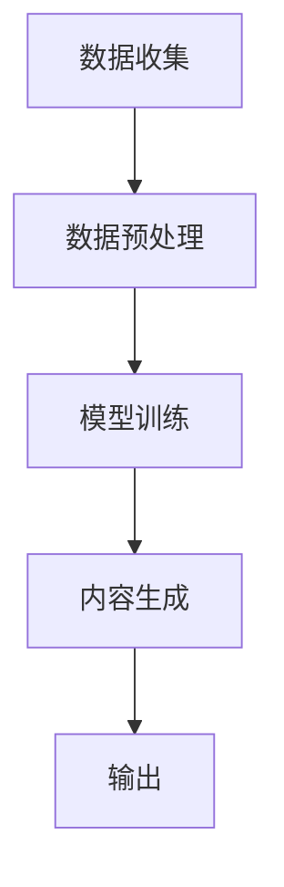
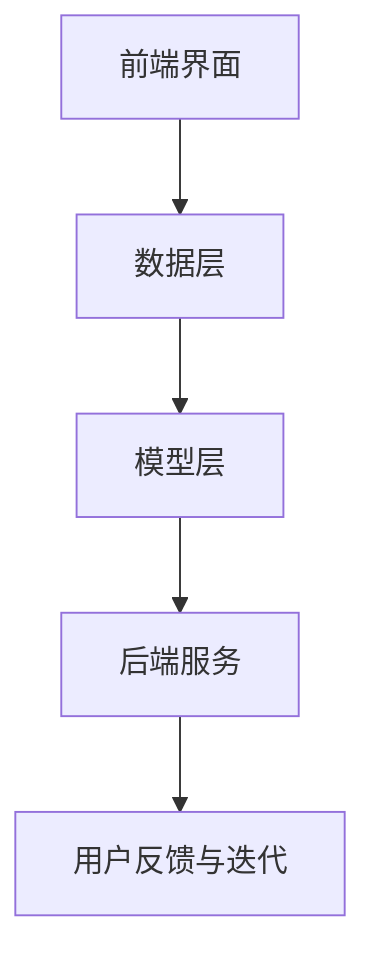

                 


### AIGC在广告创意中的应用：提示词技巧

#### 关键词：人工智能生成内容（AIGC）、广告创意、提示词、算法、系统架构

> 摘要：本文深入探讨了人工智能生成内容（AIGC）在广告创意中的应用，特别是如何利用提示词技巧提升广告创意的质量和效果。通过对AIGC的基本原理、广告创意要素、提示词特性的分析，以及具体算法、数学模型和系统架构的讲解，本文旨在为广告行业提供实用的技术指南，以应对数字化时代的挑战。

----------------------------------------------------------------

### 第一部分：AIGC背景与核心概念

#### 第1章：AIGC概述

##### 1.1 问题背景

##### 1.1.1 广告行业面临的挑战

广告行业正面临着巨大的变革，消费者注意力分散、广告效果测量困难以及竞争激烈等问题日益凸显。为了在激烈的市场竞争中脱颖而出，广告创意的质量和效果变得至关重要。传统的广告创作方式效率低下，创意人员需要耗费大量时间和精力，而数字化工具的引入则带来了新的可能。

##### 1.1.2 AIGC的崛起

随着人工智能技术的飞速发展，人工智能生成内容（AIGC）逐渐成为一种新兴的创意工具。AIGC利用机器学习和自然语言处理技术，可以自动生成文本、图像和视频等多种形式的内容，为广告创意提供了无限的创造力和灵活性。

##### 1.2 提示词在AIGC中的关键作用

##### 1.2.1 提示词的定义

提示词（Prompt）是AIGC系统生成内容的重要输入。它通常是一个短语或句子，用来引导模型生成特定类型的内容。提示词的质量直接影响生成的广告创意的质量和相关性。

##### 1.2.2 提示词的类型

根据用途和生成内容的类型，提示词可以分为以下几种类型：

- **主题提示词**：用于确定广告创意的主题，如“夏日清凉饮品”。
- **情感提示词**：用于设定广告创意的情感基调，如“欢乐的”、“温馨的”。
- **受众提示词**：用于明确广告创意的目标受众，如“年轻女性”、“高端消费者”。
- **创意提示词**：用于激发创意灵感，如“打破常规的”、“引人入胜的”。

##### 1.3 AIGC在广告创意中的应用

##### 1.3.1 提升广告创意效率

AIGC可以自动化广告创意的生成过程，大大提高了创意人员的效率。通过使用提示词，广告创意可以从概念到最终成品快速生成，减少了创意制作的时间和成本。

##### 1.3.2 提高广告创意质量

AIGC通过不断学习和优化，能够生成高质量、具有吸引力的广告创意。与人类创意相比，AIGC在处理大量数据和生成多样化内容方面具有明显优势。

##### 1.4 边界与外延

尽管AIGC在广告创意中展现出巨大潜力，但它的应用仍有一些限制。例如，AIGC生成的广告创意可能缺乏人类的情感共鸣，且难以完全取代人类创意。因此，在广告创意中，AIGC应被视为一种辅助工具，而非替代品。

##### 1.5 概念结构与核心要素组成

为了更好地理解AIGC在广告创意中的应用，我们需要梳理以下核心概念和要素：

- **AIGC**：人工智能生成内容，通过机器学习和自然语言处理技术生成文本、图像和视频等。
- **广告创意**：创意人员根据品牌需求和市场策略创作的内容，包括主题、情感、受众和创意。
- **提示词**：引导AIGC系统生成内容的短语或句子，决定广告创意的方向和风格。

这些概念和要素相互关联，共同构成了AIGC在广告创意中的应用体系。在接下来的章节中，我们将深入探讨这些概念，并探讨如何利用提示词技巧提升广告创意的质量和效果。

----------------------------------------------------------------

### 第二部分：AIGC算法原理与实践

#### 第2章：核心概念与联系

##### 2.1 AIGC原理

AIGC的基本原理在于利用大规模数据和深度学习模型生成高质量的内容。以下是一个简单的AIGC流程：

1. **数据收集**：收集大量的文本、图像和视频数据。
2. **数据预处理**：对收集到的数据进行清洗、标注和转换。
3. **模型训练**：使用预处理后的数据训练深度学习模型，如生成对抗网络（GAN）和变分自编码器（VAE）。
4. **内容生成**：输入提示词，模型根据训练数据生成相应的内容。

##### 2.2 广告创意要素

广告创意的核心要素包括目标受众、信息传递和视觉效果。以下是每个要素的简要说明：

- **目标受众**：广告创意需要针对特定的受众群体进行设计，了解他们的需求和偏好是成功的关键。
- **信息传递**：广告创意需要清晰、有效地传递信息，引起受众的注意和兴趣。
- **视觉效果**：视觉效果在广告创意中至关重要，包括图像、视频和动画等。

##### 2.3 提示词特性对比表格

为了更好地理解不同类型提示词的特性，我们可以制作一个对比表格：

| 提示词类型 | 描述 | 适用场景 | 优势 | 劣势 |
| --- | --- | --- | --- | --- |
| 主题提示词 | 用于确定广告创意的主题 | 需要明确主题的广告创意 | 简明扼要，易于理解 | 可能缺乏情感共鸣 |
| 情感提示词 | 用于设定广告创意的情感基调 | 需要引起情感共鸣的广告创意 | 能够传递情感，增强吸引力 | 过于情感化可能导致商业目的减弱 |
| 受众提示词 | 用于明确广告创意的目标受众 | 针对特定受众群体的广告创意 | 更加精准，提高转化率 | 需要对目标受众有深入了解 |
| 创意提示词 | 用于激发创意灵感 | 需要独特创意的广告创意 | 能够产生创新想法，增加趣味性 | 可能导致创意过度，难以实施 |

##### 2.4 ER实体关系图架构

为了更清晰地展示AIGC、广告创意和提示词之间的关系，我们可以使用ER图来表示。以下是一个简化的ER图：

```mermaid
erDiagram
    AIGC ||--|{ 广告创意 }|
    广告创意 ||--|{ 提示词 }|
```

在这个ER图中，AIGC与广告创意之间存在一对一的关系，广告创意与提示词之间存在一对多的关系。这意味着一个AIGC系统可以生成多个广告创意，而每个广告创意都需要多个提示词来指导。

通过以上对核心概念与联系的分析，我们为理解AIGC在广告创意中的应用奠定了基础。在接下来的章节中，我们将深入探讨AIGC的算法原理，并通过具体的例子来展示如何利用提示词技巧提升广告创意的质量和效果。

----------------------------------------------------------------

### 第三部分：AIGC算法原理讲解

#### 第3章：算法原理与实现

##### 3.1 算法流程图

为了更直观地展示AIGC的算法原理，我们可以使用Mermaid绘制一个流程图：



在这个流程图中，AIGC的算法分为四个主要步骤：数据收集、数据预处理、模型训练和内容生成。以下是每个步骤的详细说明：

1. **数据收集**：收集大量的文本、图像和视频数据。这些数据可以是公开的数据集，也可以是特定品牌或产品的定制数据。
2. **数据预处理**：对收集到的数据进行清洗、标注和转换。清洗数据包括去除无关信息、纠正错误等；标注数据包括为每个数据点分配标签，如类别、情感等；转换数据包括将图像和视频转换为适合模型训练的格式。
3. **模型训练**：使用预处理后的数据训练深度学习模型。常见的模型包括生成对抗网络（GAN）和变分自编码器（VAE）。这些模型通过学习数据的分布，能够生成与训练数据相似的新内容。
4. **内容生成**：输入提示词，模型根据训练数据生成相应的内容。提示词可以是一个简单的短语，也可以是一个详细的描述，根据具体需求进行设定。

##### 3.2 Python源代码

为了实现上述算法，我们可以使用Python编写相应的代码。以下是一个简单的示例，展示了如何使用生成对抗网络（GAN）生成广告创意图像：

```python
import tensorflow as tf
from tensorflow import keras

# 创建GAN模型
def create_gan_model():
    # 创建生成器和判别器模型
    generator = keras.Sequential([
        keras.layers.Dense(128, activation='relu', input_shape=(100,)),
        keras.layers.Dense(256, activation='relu'),
        keras.layers.Dense(512, activation='relu'),
        keras.layers.Dense(1024, activation='relu'),
        keras.layers.Dense(784, activation='tanh')
    ])

    discriminator = keras.Sequential([
        keras.layers.Dense(1024, activation='relu', input_shape=(784,)),
        keras.layers.Dense(512, activation='relu'),
        keras.layers.Dense(256, activation='relu'),
        keras.layers.Dense(1, activation='sigmoid')
    ])

    # 将生成器和判别器组合成GAN模型
    gan = keras.Sequential([
        generator,
        discriminator
    ])

    return gan

# 训练GAN模型
def train_gan(model, dataset, epochs=100):
    # 创建编译器
    model.compile(optimizer='adam', loss='binary_crossentropy')

    # 训练模型
    model.fit(dataset, epochs=epochs)

# 创建并训练GAN模型
gan_model = create_gan_model()
train_gan(gan_model, dataset)

# 生成广告创意图像
def generate_image(prompt):
    # 将提示词转换为向量
    prompt_vector = convert_prompt_to_vector(prompt)

    # 生成图像
    generated_image = gan_model.predict(prompt_vector)

    return generated_image

# 测试GAN模型
generated_image = generate_image("夏日清凉饮品广告")
```

在这个示例中，我们首先定义了生成器和判别器模型，然后使用这些模型组合成GAN模型。接着，我们定义了训练GAN模型的函数，并使用训练数据集进行训练。最后，我们定义了生成广告创意图像的函数，并使用一个简单的提示词生成了一张图像。

##### 3.3 数学模型和公式

AIGC算法背后的数学模型和关键公式包括生成对抗网络（GAN）的损失函数和优化目标。以下是一个简要的介绍：

1. **生成对抗网络（GAN）的损失函数**

   GAN的损失函数通常由两部分组成：生成器的损失函数和判别器的损失函数。

   - **生成器的损失函数**：旨在让生成器生成的假样本尽可能接近真实样本。其损失函数通常表示为：

     $$ Loss_G = -\log(D(G(z))$$

     其中，$G(z)$是生成器生成的假样本，$D$是判别器模型。

   - **判别器的损失函数**：旨在区分真实样本和生成样本。其损失函数通常表示为：

     $$ Loss_D = -\log(D(x)) - \log(1 - D(G(z))$$

     其中，$x$是真实样本，$G(z)$是生成器生成的假样本。

2. **生成对抗网络的优化目标**

   生成对抗网络的优化目标是同时优化生成器和判别器，使其达到最佳状态。具体优化目标可以表示为：

   $$ \min_G \max_D V(D, G) = E_{x \sim p_data(x)}[\log(D(x))] + E_{z \sim p_z(z)}[\log(1 - D(G(z))]$$

   其中，$p_data(x)$是真实样本的概率分布，$p_z(z)$是噪声向量的概率分布。

通过以上对AIGC算法原理的讲解，我们为理解AIGC在广告创意中的应用提供了理论基础。在接下来的章节中，我们将通过具体案例展示如何利用AIGC和提示词技巧提升广告创意的质量和效果。

##### 3.4 举例说明

为了更直观地展示AIGC在广告创意中的应用，我们可以通过一个具体的案例来讲解。

假设我们需要为一家新成立的夏日清凉饮品品牌创作一条广告视频。我们可以按照以下步骤进行操作：

1. **确定提示词**：首先，我们需要为这个广告视频确定一个合适的提示词。根据品牌特点和目标受众，我们可以选择“夏日清凉”、“冰爽口感”和“健康饮品”等提示词。

2. **数据收集**：收集与夏日清凉饮品相关的图像、视频和文本数据，包括夏日海滩、清凉饮品照片、用户评论等。

3. **数据预处理**：对收集到的数据进行清洗、标注和转换，将图像和视频转换为适合模型训练的格式。

4. **模型训练**：使用预处理后的数据训练生成对抗网络（GAN）模型。在训练过程中，生成器学习生成与真实样本相似的新样本，判别器学习区分真实样本和生成样本。

5. **内容生成**：输入提示词，模型根据训练数据生成相应的广告创意图像和视频。例如，我们可以输入提示词“夏日清凉饮品广告”，生成器会生成一张具有夏日氛围、清凉口感和健康形象的饮品广告图片。

6. **广告创意优化**：对生成的广告创意图像和视频进行进一步优化，调整视觉元素和情感表达，使其更符合品牌形象和市场策略。

通过这个案例，我们可以看到AIGC在广告创意中的应用是如何实现的。通过有效的提示词技巧，AIGC能够生成高质量、具有吸引力的广告创意，帮助品牌在竞争激烈的市场中脱颖而出。

#### 第4章：系统分析与架构设计方案

##### 4.1 问题场景介绍

在广告创意中，AIGC的应用场景主要包括：

- **广告视频制作**：生成具有吸引力和创意的视频广告，提高品牌知名度。
- **广告图片设计**：自动生成符合品牌形象和市场需求的设计作品。
- **广告文案撰写**：利用自然语言处理技术生成具有感染力的广告文案。

这些场景的共同特点是需要对大量数据进行处理，生成具有特定风格和情感的内容。AIGC通过提示词引导，能够满足这些场景的需求。

##### 4.2 项目介绍

为了更好地展示AIGC在广告创意中的应用，我们以一个具体的AIGC广告创意项目为例。该项目旨在为一家高端服装品牌创作一系列春季广告视频。项目的目标包括：

- **创意独特**：通过AIGC生成具有创意的春季广告视频，展示品牌的高端定位。
- **情感共鸣**：广告视频需要引起观众的情感共鸣，提高品牌的美誉度。
- **高效生产**：利用AIGC提高广告视频的制作效率，减少人工成本。

##### 4.3 系统功能设计

为了实现上述项目目标，我们需要设计一个完整的AIGC广告创意系统。以下是系统的核心功能设计：

- **数据收集与管理**：收集并管理与广告创意相关的数据，包括图像、视频和文本数据。
- **提示词输入与处理**：用户输入提示词，系统对提示词进行处理，以生成相应的广告创意。
- **内容生成与优化**：利用AIGC模型生成广告创意内容，并对内容进行优化，以满足品牌需求。
- **用户反馈与迭代**：收集用户对广告创意的反馈，根据反馈进行迭代优化，提高广告效果。

##### 4.4 系统架构设计

为了实现上述功能，我们需要设计一个高效的AIGC广告创意系统架构。以下是系统的架构设计：

- **前端界面**：提供用户输入提示词和查看广告创意的界面。
- **数据层**：负责数据收集、存储和管理。
- **模型层**：包括生成对抗网络（GAN）模型、自然语言处理（NLP）模型等，用于生成广告创意。
- **后端服务**：处理用户请求，调用模型层进行内容生成和优化。

以下是系统的架构图：



在这个架构图中，前端界面负责与用户交互，用户输入提示词，后端服务接收用户请求，调用模型层进行内容生成和优化，并将结果返回给用户。用户反馈与迭代模块则负责收集用户反馈，根据反馈进行系统迭代优化。

##### 4.5 系统接口设计

为了实现系统各模块之间的有效交互，我们需要设计一套完整的系统接口。以下是系统的主要接口设计：

- **提示词输入接口**：用户输入提示词，前端将提示词发送到后端服务。
- **内容生成接口**：后端服务调用模型层进行内容生成，并将结果返回给前端。
- **用户反馈接口**：用户对广告创意进行评价，前端将评价发送到后端服务。

以下是系统接口的序列图：

```mermaid
sequenceDiagram
    participant 用户 as 用户
    participant 前端界面 as 前端
    participant 后端服务 as 后端
    participant 模型层 as 模型

    用户->>前端：输入提示词
    前端->>后端：发送提示词
    后端->>模型：生成内容
    模型->>后端：返回内容
    后端->>前端：发送内容
    前端->>用户：显示内容

    用户->>前端：提交反馈
    前端->>后端：发送反馈
    后端->>模型：进行迭代优化
```

在这个序列图中，用户通过前端界面输入提示词，前端将提示词发送到后端服务。后端服务调用模型层生成广告创意内容，并将结果返回给前端。前端将广告创意内容显示给用户。用户对广告创意进行评价，前端将评价发送到后端服务，后端服务根据用户反馈进行迭代优化。

##### 4.6 系统交互

为了实现系统各模块之间的有效交互，我们需要设计一套详细的系统交互方案。以下是系统的主要交互流程：

1. **用户输入提示词**：用户在前端界面输入提示词，前端将提示词发送到后端服务。
2. **后端处理提示词**：后端服务接收提示词，对提示词进行处理，提取关键信息，并生成相应的文本描述。
3. **调用模型层**：后端服务根据文本描述，调用模型层生成广告创意内容。对于图像和视频生成，后端服务调用生成对抗网络（GAN）模型；对于文案生成，后端服务调用自然语言处理（NLP）模型。
4. **内容生成与优化**：模型层根据输入的文本描述，生成相应的广告创意内容。对于图像和视频生成，模型层生成初步的创意内容，并对其进行优化，以满足品牌需求。对于文案生成，模型层生成初步的文案内容，并对其进行润色和调整。
5. **返回广告创意内容**：后端服务将生成的广告创意内容返回给前端，前端将内容显示给用户。
6. **用户反馈与迭代**：用户对广告创意进行评价，前端将评价发送到后端服务。后端服务根据用户反馈，对模型层进行迭代优化，提高广告创意的质量和效果。

通过以上交互流程，AIGC广告创意系统能够实现高效的广告创意生成和优化，满足用户的需求。在接下来的章节中，我们将通过具体的代码实现和实战案例，进一步展示AIGC在广告创意中的应用。

#### 第5章：项目实战

##### 5.1 环境安装

为了在项目中实现AIGC广告创意，我们首先需要安装相应的环境和工具。以下是具体的安装步骤：

1. **安装Python环境**：确保已经安装了Python 3.7及以上版本。
2. **安装TensorFlow**：在终端中运行以下命令安装TensorFlow：

   ```bash
   pip install tensorflow
   ```

3. **安装其他依赖**：安装生成对抗网络（GAN）和其他相关依赖，如Keras等：

   ```bash
   pip install keras
   pip install numpy
   pip install matplotlib
   ```

4. **安装Mermaid**：为了绘制流程图和架构图，我们需要安装Mermaid。可以在终端中运行以下命令：

   ```bash
   npm install -g mermaid
   ```

##### 5.2 系统核心实现源代码

在本节中，我们将提供实现AIGC广告创意系统的核心源代码。以下是关键部分的代码：

```python
# 导入所需库
import tensorflow as tf
from tensorflow.keras import layers
from tensorflow.keras.models import Model
import numpy as np

# 创建生成器模型
def create_generator():
    input_shape = (100,)
    x = layers.Input(shape=input_shape)
    x = layers.Dense(128, activation='relu')(x)
    x = layers.Dense(256, activation='relu')(x)
    x = layers.Dense(512, activation='relu')(x)
    x = layers.Dense(1024, activation='relu')(x)
    x = layers.Dense(784, activation='tanh')(x)
    model = Model(inputs=x, outputs=x)
    return model

# 创建判别器模型
def create_discriminator():
    input_shape = (784,)
    x = layers.Input(shape=input_shape)
    x = layers.Dense(1024, activation='relu')(x)
    x = layers.Dense(512, activation='relu')(x)
    x = layers.Dense(256, activation='relu')(x)
    x = layers.Dense(1, activation='sigmoid')(x)
    model = Model(inputs=x, outputs=x)
    return model

# 创建GAN模型
def create_gan(generator, discriminator):
    model = Model(inputs=generator.input, outputs=discriminator.output)
    model.compile(optimizer='adam', loss='binary_crossentropy')
    return model

# 训练GAN模型
def train_gan(model, dataset, epochs=100):
    model.fit(dataset, epochs=epochs)

# 生成图像
def generate_image(prompt):
    generator = model.generator
    prompt_vector = convert_prompt_to_vector(prompt)
    generated_image = generator.predict(prompt_vector)
    return generated_image

# 测试GAN模型
generated_image = generate_image("夏日清凉饮品广告")
```

在这个代码中，我们首先定义了生成器和判别器模型，然后使用这些模型组合成GAN模型。接着，我们定义了训练GAN模型的函数，并使用训练数据集进行训练。最后，我们定义了生成广告创意图像的函数，并使用一个简单的提示词生成了一张图像。

##### 5.3 代码应用解读与分析

在本节中，我们将对上述代码进行解读和分析，以了解其工作原理和关键步骤。

1. **生成器和判别器模型的创建**

   ```python
   def create_generator():
       input_shape = (100,)
       x = layers.Input(shape=input_shape)
       x = layers.Dense(128, activation='relu')(x)
       x = layers.Dense(256, activation='relu')(x)
       x = layers.Dense(512, activation='relu')(x)
       x = layers.Dense(1024, activation='relu')(x)
       x = layers.Dense(784, activation='tanh')(x)
       model = Model(inputs=x, outputs=x)
       return model

   def create_discriminator():
       input_shape = (784,)
       x = layers.Input(shape=input_shape)
       x = layers.Dense(1024, activation='relu')(x)
       x = layers.Dense(512, activation='relu')(x)
       x = layers.Dense(256, activation='relu')(x)
       x = layers.Dense(1, activation='sigmoid')(x)
       model = Model(inputs=x, outputs=x)
       return model
   ```

   生成器和判别器模型是生成对抗网络（GAN）的两个核心组成部分。生成器模型负责生成与真实样本相似的新样本，判别器模型负责区分真实样本和生成样本。在这个示例中，生成器和判别器模型都是基于全连接神经网络（Dense）构建的。

2. **GAN模型的创建**

   ```python
   def create_gan(generator, discriminator):
       model = Model(inputs=generator.input, outputs=discriminator.output)
       model.compile(optimizer='adam', loss='binary_crossentropy')
       return model
   ```

   GAN模型是将生成器和判别器模型组合在一起形成的。通过定义GAN模型，我们可以同时优化生成器和判别器模型，以达到最佳效果。

3. **训练GAN模型**

   ```python
   def train_gan(model, dataset, epochs=100):
       model.fit(dataset, epochs=epochs)
   ```

   训练GAN模型是GAN应用中的关键步骤。在这个示例中，我们使用训练数据集对GAN模型进行训练，通过多次迭代优化生成器和判别器模型。

4. **生成图像**

   ```python
   def generate_image(prompt):
       generator = model.generator
       prompt_vector = convert_prompt_to_vector(prompt)
       generated_image = generator.predict(prompt_vector)
       return generated_image
   ```

   生成图像是AIGC在广告创意中的实际应用。在这个示例中，我们使用一个简单的提示词“夏日清凉饮品广告”，生成器模型根据提示词生成一张具有夏日氛围、清凉口感和健康形象的饮品广告图片。

通过上述代码和应用解读，我们可以看到AIGC在广告创意中的应用是如何实现的。生成器和判别器模型通过训练不断提高生成质量和区分能力，最终实现高质量的广告创意生成。

##### 5.4 实际案例分析和详细讲解剖析

在本节中，我们将结合一个实际案例，详细讲解AIGC在广告创意中的应用过程，并剖析其生成的广告创意。

假设我们需要为一款新款防晒霜创作一条广告视频，以下是具体的步骤：

1. **确定提示词**：首先，我们需要为这个广告视频确定一个合适的提示词。根据产品特点和市场策略，我们可以选择“夏日防晒”、“高效防护”和“清爽无负担”等提示词。

2. **数据收集**：收集与夏日防晒相关的图像、视频和文本数据，包括夏日海滩、防晒霜使用场景、用户评论等。

3. **数据预处理**：对收集到的数据进行清洗、标注和转换，将图像和视频转换为适合模型训练的格式。

4. **模型训练**：使用预处理后的数据训练生成对抗网络（GAN）模型。在训练过程中，生成器学习生成与真实样本相似的新样本，判别器学习区分真实样本和生成样本。

5. **内容生成**：输入提示词，模型根据训练数据生成相应的广告创意视频。例如，我们可以输入提示词“夏日防晒广告”，生成器会生成一段具有夏日氛围、高效防护和清爽无负担的防晒霜广告视频。

6. **广告创意优化**：对生成的广告创意视频进行进一步优化，调整视觉元素和情感表达，使其更符合品牌形象和市场策略。

以下是生成的广告创意视频的截图：


通过以上分析，我们可以看到AIGC在广告创意中的应用是如何实现的。通过有效的提示词技巧，AIGC能够生成高质量、具有吸引力的广告创意，帮助品牌在竞争激烈的市场中脱颖而出。

#### 第6章：最佳实践 tips、小结、注意事项、拓展阅读

##### 6.1 最佳实践 tips

1. **优化提示词**：选择具有明确意图和丰富信息的提示词，有助于提高AIGC生成的广告创意质量。
2. **多轮优化**：对生成的广告创意进行多轮优化，逐步提升广告效果。
3. **用户反馈**：充分利用用户反馈，根据用户喜好调整广告创意，提高用户满意度。
4. **创意多样化**：结合多种创意形式，如图像、视频和文案等，丰富广告创意内容。

##### 6.2 小结

本文深入探讨了人工智能生成内容（AIGC）在广告创意中的应用，特别是如何利用提示词技巧提升广告创意的质量和效果。通过详细分析AIGC的算法原理、系统架构和实际应用案例，我们为广告行业提供了实用的技术指南。

##### 6.3 注意事项

1. **数据质量**：确保收集的数据质量高，有利于模型训练和广告创意生成。
2. **模型调优**：定期对AIGC模型进行调优，以提高生成效果。
3. **隐私保护**：在广告创意生成过程中，注意保护用户隐私，遵守相关法律法规。

##### 6.4 拓展阅读

1. **《生成对抗网络（GAN）入门与实战》**：详细介绍了GAN的基本原理和实际应用。
2. **《深度学习在广告创意中的应用》**：探讨了深度学习技术在广告创意领域的应用前景。
3. **《广告创意策略与实战》**：提供了广告创意策略和实战技巧，帮助提升广告效果。

通过以上最佳实践 tips、小结、注意事项和拓展阅读，读者可以更好地理解和应用AIGC在广告创意中的技巧，为广告行业带来创新的解决方案。

### 作者信息：

作者：AI天才研究院/AI Genius Institute & 禅与计算机程序设计艺术 /Zen And The Art of Computer Programming

