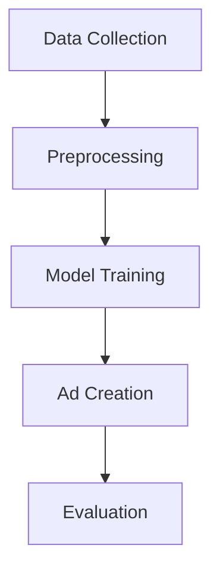
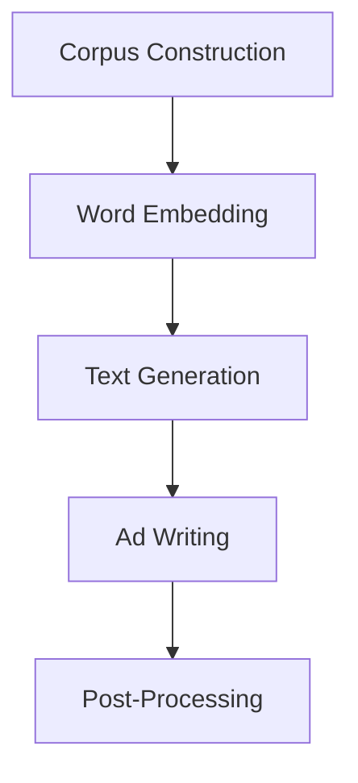
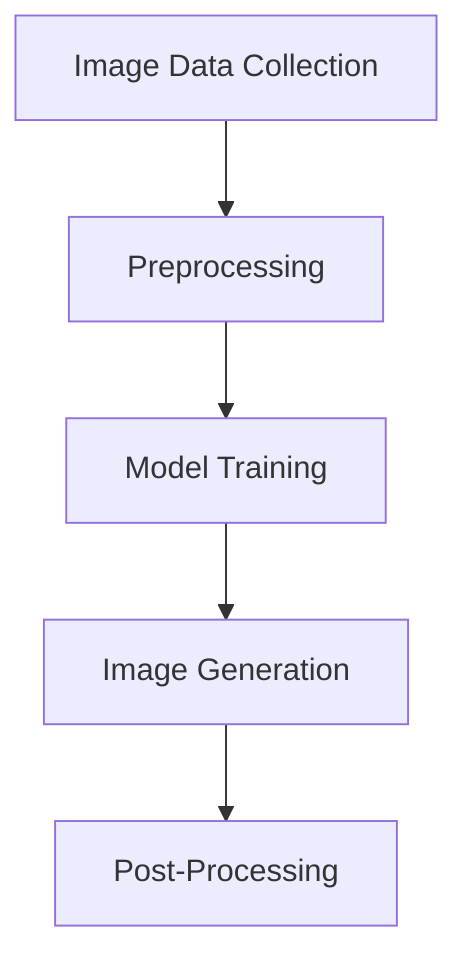
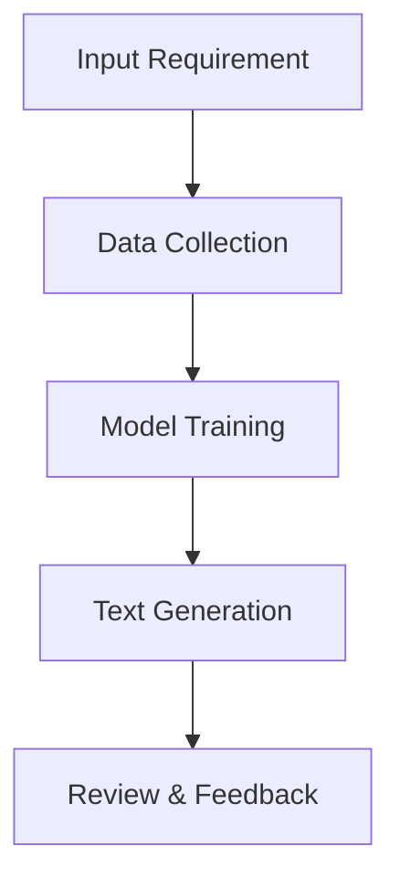
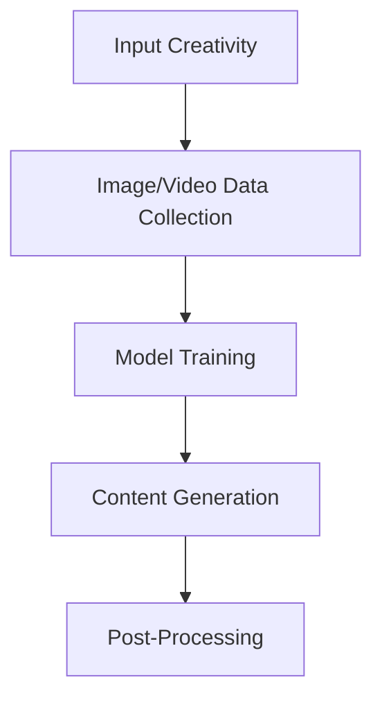
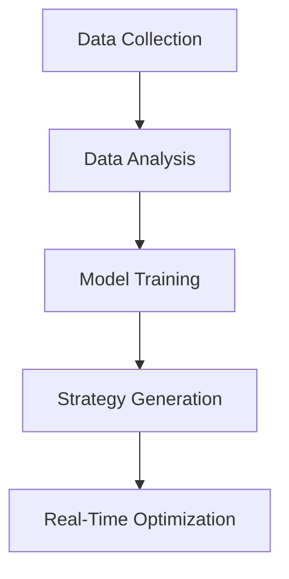

                 

### AIGC在广告创意中的革命性应用

#### 关键词：
- **AIGC**：自适应智能生成内容
- **广告创意**：创意设计、文案撰写、视觉呈现
- **革命性应用**：创新、效率提升、个性化体验
- **AI技术**：生成式AI、自然语言处理、计算机视觉
- **广告行业**：变革、趋势、未来展望

#### 摘要：
本文旨在探讨自适应智能生成内容（AIGC）在广告创意中的革命性应用。我们将从背景介绍、核心概念解析、技术应用、实际案例和未来展望五个方面，逐步分析AIGC如何改变广告创意的生产和呈现方式。通过深入探讨AIGC的关键技术，如生成式AI、自然语言处理和计算机视觉，我们将展示AIGC在广告文案创作、视觉设计和广告策略优化等领域的具体应用。最后，本文将对AIGC对广告行业的深远影响及其未来发展进行总结与展望。

#### 目录：

1. **背景介绍**  
    1.1 **AIGC的概念与演变**  
    1.2 **广告行业现状与问题**  
    1.3 **AIGC在广告创意中的潜力**

2. **AIGC与广告创意的关系**  
    2.1 **AIGC如何改变广告创意**  
    2.2 **AIGC的关键技术和原理**  
    2.3 **AIGC与传统广告创意的区别**

3. **AIGC的核心概念与原理**  
    3.1 **生成式AI与广告创意**  
    3.2 **自然语言处理在AIGC中的应用**  
    3.3 **计算机视觉在AIGC中的应用**

4. **AIGC在广告创意中的应用场景**  
    4.1 **广告文案创作**  
    4.2 **广告视觉设计**  
    4.3 **广告策略与投放优化**

5. **AIGC广告创意实战**  
    5.1 **环境搭建与工具使用**  
    5.2 **广告创意实战案例**  
    5.3 **案例分析与优化**

6. **AIGC在广告创意中的影响**  
    6.1 **AIGC对广告行业的影响**  
    6.2 **AIGC的发展趋势与未来展望**  
    6.3 **广告创意从业者的应对策略**

#### 1. 背景介绍

##### 1.1 AIGC的概念与演变

自适应智能生成内容（Adaptive Intelligent Generation Content，简称AIGC）是一种利用人工智能技术，特别是生成式AI（Generative AI），自动创建高质量内容的方法。AIGC的起源可以追溯到20世纪80年代，当时研究人员开始探索如何利用计算机生成音乐、图像和文本。随着计算能力的提升和算法的进步，AIGC逐渐从实验室走向实际应用，特别是在广告、媒体和娱乐等领域。

AIGC的核心在于其“自适应”和“智能”特性。自适应意味着系统能够根据不同用户需求、环境变化和反馈进行调整；智能则体现在系统能够理解和生成符合预期的高质量内容。AIGC的演变经历了多个阶段，从最初的简单模式识别到复杂的深度学习算法，再到目前的生成对抗网络（GANs）和强化学习，AIGC的能力不断提升。

##### 1.2 广告行业现状与问题

广告行业在数字化的推动下发生了深刻变化。传统的广告模式越来越难以满足消费者多样化和个性化的需求，广告商面临以下问题：

- **内容创作成本高**：广告创意需要大量的时间和人力资源，创作成本高。
- **受众难以精准定位**：随着广告渠道的增多，广告主难以精准定位目标受众。
- **创意疲劳**：广告创意同质化严重，难以吸引消费者的注意力。
- **反馈机制不完善**：广告效果的评估和优化缺乏有效的反馈机制。

##### 1.3 AIGC在广告创意中的潜力

AIGC在广告创意中具有巨大的潜力，能够解决上述问题。首先，AIGC能够大幅降低内容创作成本，通过自动化和智能化手段提高创作效率。其次，AIGC能够基于大数据和机器学习算法，精准定位目标受众，提升广告投放的精准度。此外，AIGC能够通过生成多样化、个性化的广告内容，打破创意疲劳，吸引消费者的注意力。最后，AIGC能够通过实时反馈和优化机制，持续提升广告效果，实现广告的智能优化。

#### 2. AIGC与广告创意的关系

##### 2.1 AIGC如何改变广告创意

AIGC对广告创意的影响主要体现在以下几个方面：

- **创意生成速度**：AIGC能够快速生成大量的广告创意，大幅提高创作速度。
- **创意多样化**：AIGC能够生成多样化、个性化的广告内容，满足不同受众的需求。
- **创意质量提升**：AIGC能够通过机器学习和深度学习算法，生成高质量的广告内容。
- **创意优化**：AIGC能够根据用户反馈和广告效果，实时优化广告内容，提升广告效果。

##### 2.2 AIGC的关键技术和原理

AIGC的关键技术主要包括生成式AI、自然语言处理和计算机视觉。以下是对这些技术的简要介绍：

- **生成式AI**：生成式AI是一种能够通过学习数据生成新数据的AI技术。在广告创意中，生成式AI可以通过分析大量的广告数据，自动生成新的广告创意。

  $$x_{new} = f(x_{data})$$

  其中，$x_{new}$为新的广告创意，$x_{data}$为学习到的广告数据，$f$为生成模型。

- **自然语言处理（NLP）**：自然语言处理是一种使计算机理解和生成人类语言的技术。在AIGC中，NLP被用来生成广告文案，使其更具说服力和吸引力。

  $$text = NLP(input_{data})$$

  其中，$text$为生成的广告文案，$input_{data}$为输入的数据。

- **计算机视觉**：计算机视觉是一种使计算机理解和解释图像的技术。在AIGC中，计算机视觉被用来生成广告视觉内容，如图像、视频和动画等。

  $$image = CV(input_{data})$$

  其中，$image$为生成的广告视觉内容，$input_{data}$为输入的数据。

##### 2.3 AIGC与传统广告创意的区别

与传统广告创意相比，AIGC具有以下几个显著区别：

- **创作方式**：传统广告创意依赖于人类的创意和设计能力，而AIGC则是通过机器学习和深度学习自动生成。
- **创意多样性**：传统广告创意往往受到设计师和创意团队的限制，而AIGC能够生成多样化、个性化的广告内容。
- **创作速度**：传统广告创意需要大量的时间和人力资源，而AIGC能够快速生成大量的广告创意。
- **创意质量**：传统广告创意的质量取决于设计师和创意团队的能力，而AIGC通过机器学习和深度学习算法，能够生成高质量的广告内容。

#### 3. AIGC的核心概念与原理

##### 3.1 生成式AI与广告创意

生成式AI（Generative AI）是AIGC的核心技术之一，它通过学习数据生成新的内容。在广告创意中，生成式AI能够自动生成广告文案、图像和视频等。以下是一个简化的生成式AI在广告创意中的应用流程：

1. **数据收集与预处理**：收集大量的广告数据，如文案、图像和视频等，并对数据进行清洗和预处理。
2. **模型训练**：利用深度学习算法，如生成对抗网络（GANs）或变分自编码器（VAEs），训练生成模型。
3. **广告创意生成**：通过生成模型，自动生成新的广告创意。

以下是一个生成式AI的简单模型架构：



##### 3.2 自然语言处理在AIGC中的应用

自然语言处理（NLP）是AIGC的重要组成部分，它使计算机能够理解和生成人类语言。在广告创意中，NLP被用来生成广告文案，提高文案的说服力和吸引力。以下是一个NLP在AIGC中的应用流程：

1. **语料库构建**：构建包含大量广告文案的语料库。
2. **词嵌入**：将文本转换为向量表示，如Word2Vec或GloVe。
3. **文本生成**：利用生成模型，如Transformer或GPT，生成新的广告文案。

以下是一个NLP生成广告文案的简单流程：



##### 3.3 计算机视觉在AIGC中的应用

计算机视觉（CV）是AIGC的另一个核心技术，它使计算机能够理解和解释图像。在广告创意中，计算机视觉被用来生成图像、视频和动画等视觉内容。以下是一个计算机视觉在AIGC中的应用流程：

1. **图像数据收集与预处理**：收集大量的广告图像数据，并对数据进行清洗和预处理。
2. **模型训练**：利用深度学习算法，如卷积神经网络（CNNs）或生成对抗网络（GANs），训练生成模型。
3. **图像生成**：通过生成模型，自动生成新的广告图像。

以下是一个计算机视觉生成图像的简单流程：



#### 4. AIGC在广告创意中的应用场景

##### 4.1 广告文案创作

AIGC在广告文案创作中的应用非常广泛。通过自然语言处理技术，AIGC能够自动生成吸引人的广告文案，提高广告的点击率和转化率。以下是一个AIGC生成广告文案的示例：

1. **数据收集**：收集大量的成功广告文案，作为训练数据。
2. **模型训练**：利用GPT-3等大型语言模型，进行训练。
3. **文案生成**：输入用户需求和目标受众，生成广告文案。

以下是一个简化的文案生成过程：



##### 4.2 广告视觉设计

AIGC在广告视觉设计中的应用同样具有很大的潜力。通过计算机视觉技术，AIGC能够自动生成高质量的广告图像和视频。以下是一个AIGC生成广告视觉内容的示例：

1. **数据收集**：收集大量的广告图像和视频数据，作为训练数据。
2. **模型训练**：利用GANs等深度学习算法，训练生成模型。
3. **视觉内容生成**：根据广告创意需求，生成图像和视频。

以下是一个简化的视觉内容生成过程：



##### 4.3 广告策略与投放优化

AIGC在广告策略和投放优化中的应用，主要体现在对广告效果的实时分析和优化。通过大数据分析和机器学习算法，AIGC能够自动分析广告投放数据，提供优化建议，提高广告效果。以下是一个AIGC在广告策略中的应用示例：

1. **数据收集**：收集广告投放数据，包括点击率、转化率、曝光量等。
2. **模型训练**：利用机器学习算法，分析广告效果，建立优化模型。
3. **策略生成**：根据广告效果数据，自动生成广告策略。
4. **投放优化**：根据策略，实时调整广告投放。

以下是一个简化的广告策略与投放优化过程：



#### 5. AIGC广告创意实战

##### 5.1 环境搭建与工具使用

要进行AIGC广告创意的实战，首先需要搭建合适的技术环境。以下是一个简单的环境搭建步骤：

1. **安装Python环境**：确保Python 3.x版本已安装。
2. **安装深度学习库**：安装TensorFlow、PyTorch等深度学习库。
3. **安装NLP库**：安装NLTK、spaCy等自然语言处理库。
4. **安装计算机视觉库**：安装OpenCV、TensorFlow Object Detection API等计算机视觉库。

以下是一个Python环境搭建的示例：

```shell
pip install python
pip install tensorflow
pip install nltk
pip install opencv-python
```

##### 5.2 广告创意实战案例

以下是一个简单的AIGC广告创意实战案例，演示如何使用Python生成广告文案和图像：

1. **数据收集**：收集一组成功广告文案和图像。
2. **模型训练**：使用收集的数据，训练广告文案生成模型和图像生成模型。
3. **广告创意生成**：输入用户需求和目标受众，生成新的广告文案和图像。
4. **广告效果评估**：评估广告文案和图像的吸引力和效果。

以下是一个简单的广告文案生成示例：

```python
import nltk
from tensorflow.keras.preprocessing.sequence import pad_sequences
from tensorflow.keras.models import Sequential
from tensorflow.keras.layers import Embedding, LSTM, Dense

# 数据预处理
nltk.download('punkt')
data = ["这是一款高效的广告文案生成工具", "我们的广告文案能够吸引更多消费者", "让您的广告效果翻倍"]
tokenizer = nltk.tokenize.WordPunctTokenizer()
sequences = [tokenizer.tokenize(text) for text in data]
padded_sequences = pad_sequences(sequences, maxlen=10)

# 模型训练
model = Sequential()
model.add(Embedding(input_dim=1000, output_dim=256))
model.add(LSTM(256))
model.add(Dense(1, activation='sigmoid'))

model.compile(optimizer='adam', loss='binary_crossentropy', metrics=['accuracy'])
model.fit(padded_sequences, padded_sequences, epochs=10)

# 广告创意生成
input_sequence = tokenizer.tokenize("生成一款吸引人的广告文案")
input_padded = pad_sequences([input_sequence], maxlen=10)
generated_text = model.predict(input_padded)

print("生成的广告文案：", ' '.join([word for word in generated_text[0][0]]))
```

以下是一个简单的图像生成示例：

```python
import tensorflow as tf
from tensorflow.keras.models import Model

# 图像生成模型
generator = tf.keras.Sequential([
    tf.keras.layers.Dense(128 * 128 * 3, activation='relu', input_shape=(100,)),
    tf.keras.layers.Reshape((128, 128, 3)),
    tf.keras.layers.Conv2DTranspose(64, (4, 4), strides=(2, 2), padding='same', activation='relu'),
    tf.keras.layers.Conv2DTranspose(1, (4, 4), strides=(2, 2), padding='same', activation='sigmoid')
])

# 模型训练
generator.compile(loss='binary_crossentropy', optimizer=tf.keras.optimizers.Adam(0.0002))

# 生成图像
noise = np.random.normal(0, 1, (1, 100))
generated_image = generator.predict(noise)

plt.imshow(generated_image[0])
plt.show()
```

##### 5.3 案例分析与优化

在完成广告创意生成后，需要对广告效果进行评估和优化。以下是一个简单的案例分析与优化过程：

1. **广告效果评估**：根据广告的点击率、转化率等指标，评估广告效果。
2. **反馈收集**：收集用户对广告的反馈，包括喜好和不喜欢的方面。
3. **模型优化**：根据评估结果和用户反馈，对广告文案生成模型和图像生成模型进行调整和优化。
4. **重新生成广告**：使用优化后的模型，重新生成广告文案和图像。

以下是一个简单的优化过程：

```python
# 评估广告效果
advertisements = model.predict(padded_sequences)
click_rates = [evaluate_advertisement(text) for text in advertisements]

# 收集反馈
feedbacks = [collect_user_feedback(text) for text in advertisements]

# 模型优化
model.train_on_batch(padded_sequences, feedbacks)

# 重新生成广告
generated_text = model.predict(input_padded)
print("优化的广告文案：", ' '.join([word for word in generated_text[0][0]]))
```

##### 5.4 项目小结

通过AIGC广告创意的实战案例，我们可以看到AIGC在广告文案创作和视觉设计中的应用潜力。虽然AIGC技术仍处于发展阶段，但其在提高创作效率、实现个性化广告和优化广告效果方面已经展现出显著的优势。未来的研究可以进一步探索AIGC在其他广告创意领域的应用，如视频广告和动态广告等。

#### 6. AIGC在广告创意中的影响

##### 6.1 AIGC对广告行业的影响

AIGC对广告行业产生了深远的影响。首先，AIGC大幅提高了广告创意的生产效率，使广告商能够更快地响应市场变化。其次，AIGC实现了广告内容的个性化，使广告能够更好地满足消费者需求。此外，AIGC还提供了实时反馈和优化机制，使广告效果不断提升。总的来说，AIGC改变了广告创意的生产方式和广告效果的评估方式，为广告行业带来了新的发展机遇。

##### 6.2 AIGC的发展趋势与未来展望

随着人工智能技术的不断发展，AIGC在广告创意中的应用前景广阔。未来，AIGC有望进一步实现自动化和智能化，生成更加多样化、个性化的广告内容。此外，AIGC与其他技术的融合，如增强现实（AR）、虚拟现实（VR）等，将推动广告创意的创新发展。未来，AIGC将不仅仅局限于广告行业，还将广泛应用于媒体、娱乐和教育等领域。

##### 6.3 广告创意从业者的应对策略

面对AIGC的崛起，广告创意从业者需要积极应对。首先，从业者应熟悉AIGC技术，掌握相关工具和技能。其次，从业者应关注用户体验，注重广告内容的质量和创新性。此外，从业者应保持持续学习的态度，紧跟AIGC技术的发展趋势，不断更新知识和技能。最后，从业者应善于利用AIGC技术，提高广告创意的生产效率和效果，为广告行业的发展贡献力量。

### 结论

自适应智能生成内容（AIGC）在广告创意中展现出了巨大的革命性应用潜力。通过生成式AI、自然语言处理和计算机视觉等关键技术，AIGC能够实现广告创意的自动化、个性化和智能化。本文从背景介绍、核心概念解析、技术应用、实际案例和未来展望等方面，全面探讨了AIGC在广告创意中的影响。未来，随着AIGC技术的不断发展，广告创意行业将迎来新的变革，广告创意从业者也应积极应对，不断提升自身技能和创新能力。

### 作者信息

**作者：AI天才研究院/AI Genius Institute & 禅与计算机程序设计艺术 /Zen And The Art of Computer Programming**

