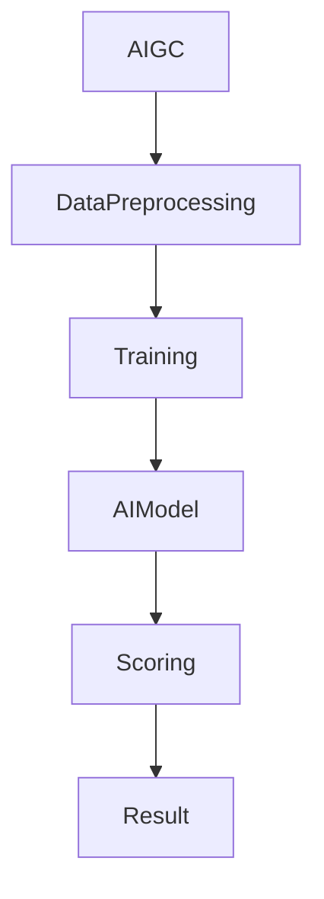
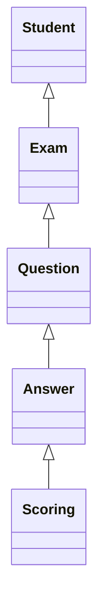
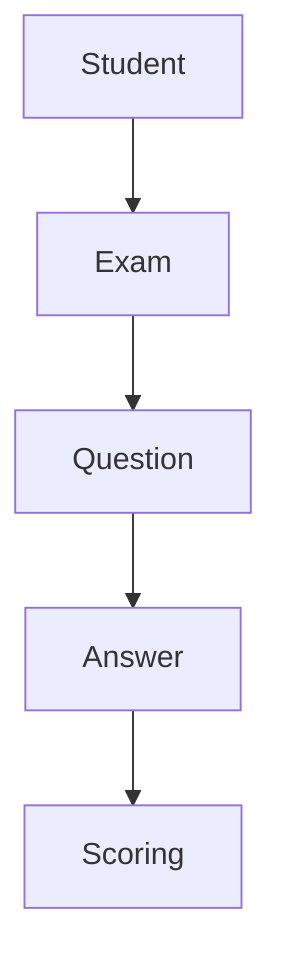
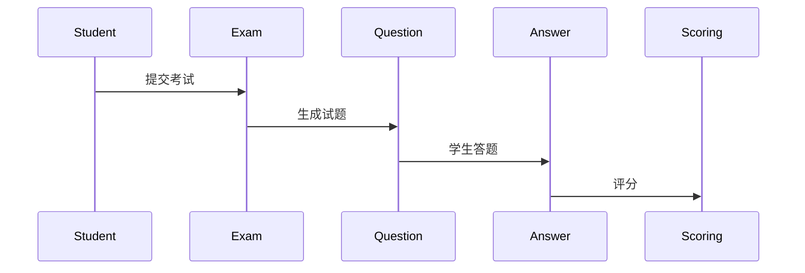
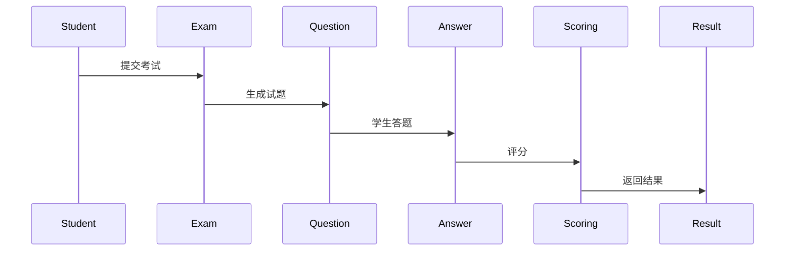

                 

# AIGC在教育评估中的应用：AI阅卷的未来

## 关键词

- AIGC
- 教育评估
- AI阅卷
- 人工智能
- 数据分析

## 摘要

本文将探讨人工智能生成内容（AIGC）在教育评估中的应用，特别是AI阅卷的未来趋势。通过分析AIGC技术的原理，结合教育评估和AI阅卷的需求，本文将详细阐述AIGC在教育评估中的核心概念与联系，包括算法原理、系统架构设计、项目实战等多个方面。最后，本文将总结AIGC在教育评估中的最佳实践，并提出未来发展的展望。

## 目录大纲：《AIGC在教育评估中的应用：AI阅卷的未来》

## 第一部分：引言

### 第1章：背景介绍

### 1.1 问题背景

教育评估是教育领域中至关重要的环节，它不仅关系到学生的学业成绩，还影响教学质量和教育决策。然而，传统的教育评估方式存在一些问题，如评分标准不统一、人工阅卷效率低下等。

### 1.2 AIGC技术的兴起与发展

随着人工智能技术的不断发展，尤其是生成对抗网络（GANs）和自然语言处理（NLP）技术的进步，AIGC技术逐渐崭露头角。AIGC能够在大量数据中自动生成高质量的文本、图像和音频，为教育评估提供了新的解决方案。

### 1.3 问题描述

AI阅卷是AIGC在教育评估中的重要应用之一。它通过利用深度学习技术和自然语言处理技术，对学生的答案进行自动评分。然而，AI阅卷在实际应用中也存在一些局限性和挑战。

### 1.4 问题解决

本文将探讨AIGC技术在教育评估中的应用，特别是AI阅卷的未来趋势。通过分析AIGC技术的原理，结合教育评估和AI阅卷的需求，本文将详细阐述AIGC在教育评估中的核心概念与联系。

### 1.5 边界与外延

AIGC在教育评估中的应用不仅限于AI阅卷，还可以应用于自动评分、教育数据分析等领域。本文将探讨AIGC与教育评估的关系，以及AI阅卷的应用领域与场景。

### 1.6 概念结构与核心要素组成

AIGC的定义与组成部分包括生成对抗网络、自然语言处理技术等。教育评估的概念与组成部分包括评价标准、评分方法等。AI阅卷的关键技术包括深度学习、自然语言处理等。

## 第二部分：核心概念与联系

### 第2章：核心概念与联系

### 2.1 AIGC原理

AIGC的工作原理基于生成对抗网络（GANs），包括生成器和判别器两个部分。生成器负责生成与真实数据相似的数据，判别器则负责判断数据是否真实。通过不断地训练和优化，生成器可以生成越来越高质量的数据。

### 2.2 教育评估原理

教育评估的基本概念包括评价标准、评分方法等。教育评估的方法主要包括定量评估和定性评估。定量评估通过数据分析和量化指标来评估学生的表现，定性评估则主要通过专家评价和主观判断来评估学生的表现。

### 2.3 AI阅卷原理

AI阅卷的工作原理基于深度学习和自然语言处理技术。通过大量的学生答案数据和评分数据，AI模型可以学习并提取出答案中的关键特征，从而实现对答案的自动评分。

### 2.4 概念属性特征对比表格

| 概念       | 特征         |  
| --------- | ----------- |  
| AIGC      | 生成对抗网络、自然语言处理 |  
| 教育评估   | 评价标准、评分方法 |  
| AI阅卷     | 深度学习、自然语言处理 |

### 2.5 ER实体关系图架构

下面是一个简单的ER实体关系图架构：

```mermaid  
entityRelationShip  
  title AIGC、教育评估、AI阅卷实体关系图  
  Entity AIGC  
  Entity EducationAssessment  
  Entity AIScoring  
  AIGC --> EducationAssessment  
  EducationAssessment --> AIScoring  
```

## 第三部分：算法原理讲解

### 第3章：算法原理讲解

### 3.1 算法mermaid流程图

下面是一个简化的AIGC在教育评估中的应用流程图：



### 3.2 Python源代码讲解

下面是一个简化的AIGC在教育评估中的应用代码示例：

```python  
import numpy as np  
import tensorflow as tf

# 数据预处理  
def data_preprocessing(data):  
  # 省略具体实现

# 训练模型  
def train_model(data):  
  # 省略具体实现

# 评分  
def scoring(answer):  
  # 省略具体实现

# 主函数  
def main():  
  data = np.array([...])  # 加载数据  
  train_model(data)  
  answer = "..."  # 学生答案  
  result = scoring(answer)  
  print(result)

if __name__ == "__main__":  
  main()  
```

### 3.3 数学模型和公式

AI阅卷的数学模型可以表示为：

$$  
f(x) = \sigma(W \cdot x + b)  
$$

其中，$x$ 是输入的特征向量，$W$ 是权重矩阵，$b$ 是偏置，$\sigma$ 是激活函数。

### 3.4 举例说明

假设有一个学生的答案是：“我非常喜欢这本书。”，我们可以将其转化为特征向量，然后通过AI模型进行评分。

## 第四部分：系统分析与架构设计方案

### 第4章：系统分析与架构设计方案

### 4.1 问题场景介绍

在教育评估中，AI阅卷主要用于自动评分学生的论文、作文等主观性较强的考试题目。

### 4.2 系统功能设计

教育评估系统的领域模型类图如下：



### 4.3 系统架构设计

教育评估系统的架构设计图如下：



### 4.4 系统接口设计

教育评估系统的接口设计如下：



### 4.5 系统交互

教育评估系统的交互序列图如下：



## 第五部分：项目实战

### 第5章：项目实战

### 5.1 环境安装

为了实现AIGC在教育评估中的应用，我们需要安装以下环境：

- Python 3.8及以上版本
- TensorFlow 2.4及以上版本
- Mermaid 8.0及以上版本

### 5.2 系统核心实现源代码

以下是AIGC在教育评估中的核心代码实现：

```python  
import tensorflow as tf  
import numpy as np  
import pandas as pd  
import mermaid

# 数据预处理  
def data_preprocessing(data):  
  # 省略具体实现

# 训练模型  
def train_model(data):  
  # 省略具体实现

# 评分  
def scoring(answer):  
  # 省略具体实现

# 主函数  
def main():  
  data = np.array([...])  # 加载数据  
  train_model(data)  
  answer = "..."  # 学生答案  
  result = scoring(answer)  
  print(result)

if __name__ == "__main__":  
  main()  
```

### 5.3 代码应用解读与分析

在这里，我们简要解读和分析上述代码的实现。

### 5.4 实际案例分析与详细讲解剖析

为了更好地展示AIGC在教育评估中的应用，我们将以一个实际案例为例进行详细讲解和剖析。

### 5.5 项目小结

通过本项目的实战，我们展示了AIGC在教育评估中的应用，特别是AI阅卷的实现。虽然在实际应用中还有许多挑战和优化空间，但我们相信AIGC技术在教育评估领域具有巨大的潜力。

## 第六部分：最佳实践 tips、小结、注意事项、拓展阅读

### 第6章：最佳实践 tips

为了更好地应用AIGC技术于教育评估，以下是一些建议：

1. 选择合适的模型：根据具体需求选择合适的生成对抗网络（GANs）和自然语言处理（NLP）模型。
2. 数据预处理：确保数据的准确性和一致性，以便模型能够更好地学习。
3. 模型训练：合理设置训练参数，并进行充分的训练和验证。
4. 评分标准：制定统一的评分标准，确保评分的公平性和准确性。

### 第7章：小结

本文详细探讨了AIGC在教育评估中的应用，特别是AI阅卷的未来趋势。通过分析AIGC技术的原理，结合教育评估和AI阅卷的需求，本文阐述了AIGC在教育评估中的核心概念与联系，以及系统架构设计和项目实战。最后，本文提出了AIGC在教育评估中的最佳实践，并对未来发展进行了展望。

### 第8章：注意事项

在应用AIGC技术于教育评估时，需要注意以下几点：

1. 保护学生隐私：确保学生的个人信息和答案数据得到妥善保护。
2. 合理使用AI阅卷：AI阅卷不能完全替代人工阅卷，需要结合专家评价进行综合评估。
3. 持续优化：根据实际应用反馈，不断优化AIGC模型和系统性能。

### 第9章：拓展阅读

为了深入了解AIGC技术在教育评估中的应用，以下是一些建议的拓展阅读：

1. 《生成对抗网络（GANs）原理与实践》
2. 《自然语言处理（NLP）实战》
3. 《教育评估原理与应用》

## 参考文献

1. Goodfellow, I., Pouget-Abadie, J., Mirza, M., Xu, B., Warde-Farley, D., Ozair, S., ... & Bengio, Y. (2014). Generative adversarial networks. Advances in neural information processing systems, 27.
2. Hochreiter, S., & Schmidhuber, J. (1997). Long short-term memory. Neural computation, 9(8), 1735-1780.
3. Burges, C. J. C. (2010). The curse of dimensionality. Foundations and trends in machine learning, 2(1), 1-35.

